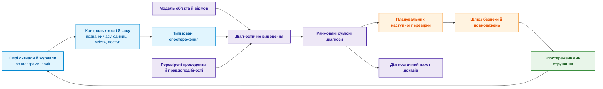
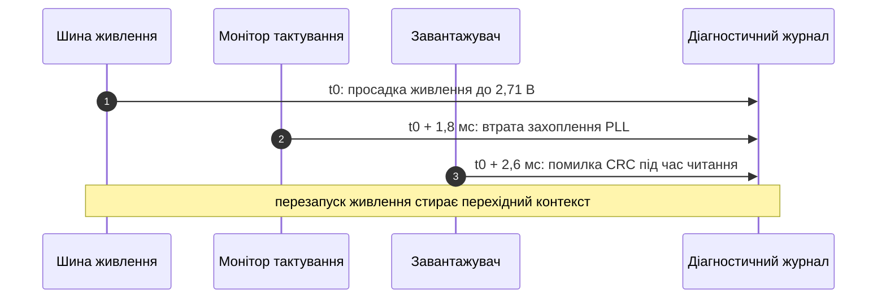
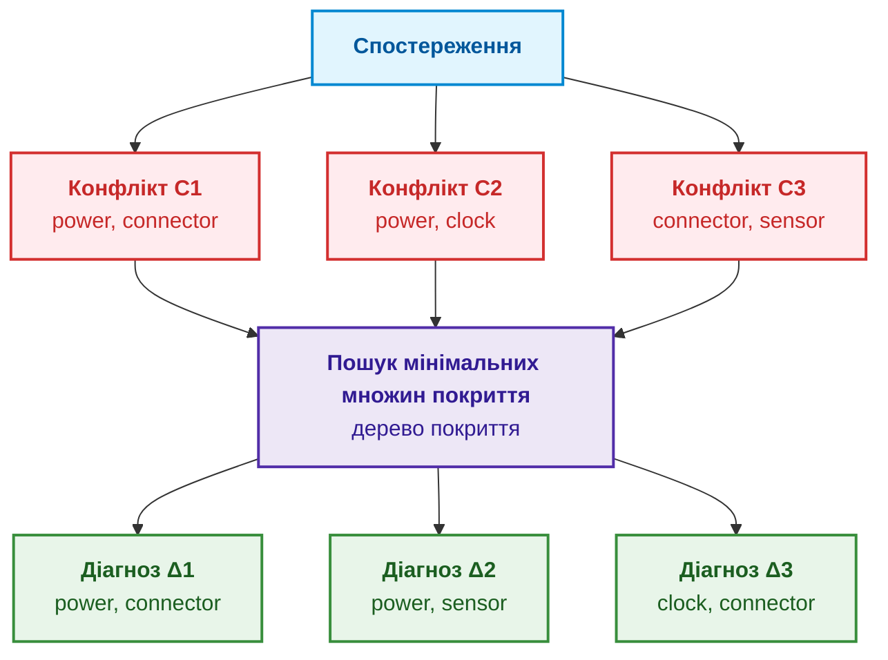
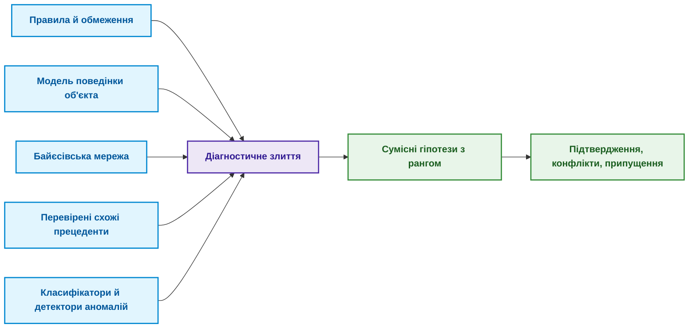
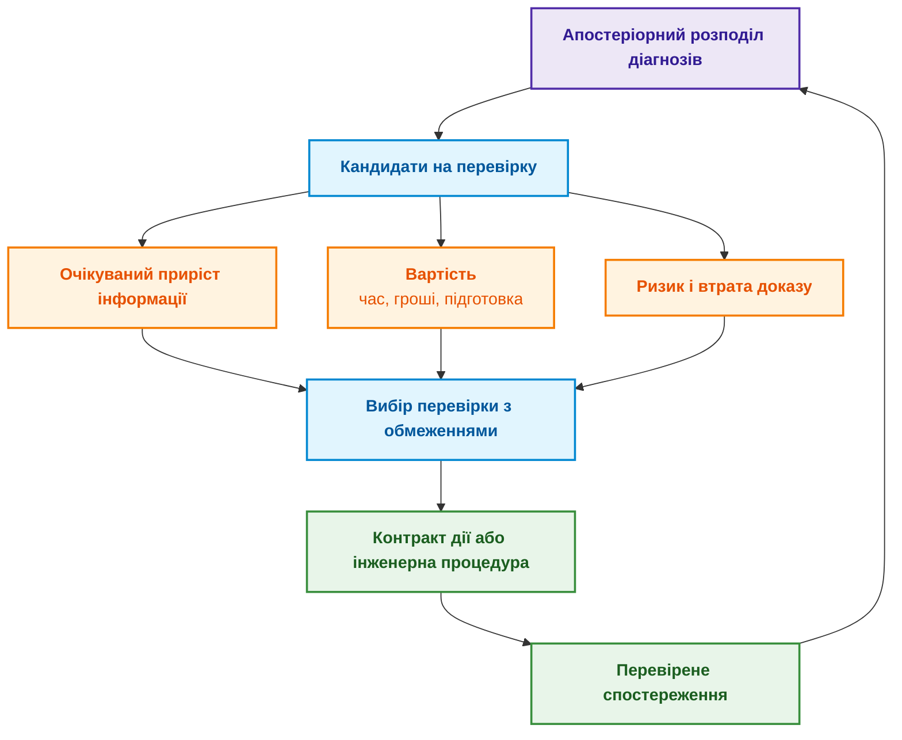

# Глава 24. Технічна діагностика: як не сплутати симптом із першопричиною в умовах неповноти

> **Книга:** [Архітектура доказових експертних систем](README.md) · [Частина V: Верифікація, діагностика та неперервне навчання](part-05-verification-and-learning.md)  
> **Попередня глава:** [Глава 23. Верифікація бази знань: як перевірити несуперечливість, повноту та надійність правил](ch23-knowledge-base-verification.md)  
> **Наступна глава:** [Глава 25. Як навчати експертну систему: екзаменаційні матриці, аудит знань та контроль регресій](ch25-how-expert-systems-learn.md)  
> **Зміст книги:** [README.md](README.md)  
> **Автор:** [Микола Федчик](about-the-author.md)  
> **Рівень:** середній і поглиблений: інженери з надійності й діагностики, системні архітектори  
> **Очікувані результати:** розрізняти симптом, діагноз і першопричину; описувати спостереження з часом, одиницями й якістю; будувати діагнози на основі моделі за Райтером через конфлікти й мінімальні множини покриття; ранжувати діагнози ймовірностями з урахуванням надійності датчиків; обирати наступну перевірку за цінністю інформації, вартістю, ризиком і втратою доказу; відрізняти спостереження від втручання; відмовлятися від діагнозу, коли даних недостатньо.

Після холодної ночі пристрій не запускається. Журнал фіксує збій тактування, а осцилограф один раз показує коротку просадку живлення. Після перезапуску проблема зникає. Класифікатор називає найімовірнішою причиною тактування, технік замінює генератор, і несправність повертається. Згодом з'ясовується, що причиною був ненадійний контакт роз'єму, а збій тактування був лише його наслідком.

Ця історія показує, чому діагностика не зводиться до пошуку схожої поломки. Ця глава відповідає на запитання: **як із неповних і ненадійних спостережень отримати сумісні пояснення несправності й обрати наступну перевірку, не сплутавши симптом із першопричиною?** Теза глави: **діагностика є не класифікацією, а пошуком усіх пояснень, сумісних із моделлю об'єкта й спостереженнями. Конфлікти моделі звужують коло причин, мінімальні множини покриття дають кандидатів, ймовірності ранжують кандидатів, а наступну перевірку обирають за цінністю інформації з урахуванням вартості, ризику й втрати доказу. Коли даних недостатньо, правильна відповідь є відмовою з поясненням.**

Глава описує навчальну модель, а не сертифікований діагностичний засіб. Формальні висновки чинні лише в межах описаної моделі, відомих відмов і якості даних. Там, де помилка може зашкодити людям чи обладнанню, потрібні галузеві процедури, кваліфіковані вимірювання й відповідальний фахівець. У наскрізному прикладі можливі кілька версій: нестабільне живлення, несправне тактування, помилка прошивки, поганий контакт роз'єму або похибка вимірювання, а іноді дві несправності одночасно. Експертна система має повернути не одну мітку, а пояснення: які версії сумісні з фактами, чого бракує і яку перевірку варто зробити далі.

## Симптом, діагноз і першопричина

[Глава 6](ch06-applied-mathematics-for-expert-systems.md) ввела байєсівське виведення, причинність і цінність інформації, [Глава 7](ch07-knowledge-base-typology.md) описала правила, прецеденти, обмеження й ймовірнісні моделі, а [Глава 20](ch20-explanation-engine.md) пояснила запити WHY NOT і контрастні пояснення. Діагностика поєднує ці механізми в окрему задачу, яку легко сплутати із сусідніми. Таблиця розмежовує шість задач.

| Задача | Запитання | Результат |
|---|---|---|
| Виявлення аномалій | Чи відхилилася поведінка від норми? | Оцінка аномальності чи подія |
| Класифікація | На який відомий клас схожий випадок? | Мітка й впевненість |
| Діагностика | Які припущення про несправності узгоджують модель зі спостереженнями? | Одна чи кілька гіпотез |
| Аналіз першопричини | Який причинний механізм породив інцидент? | Причинне твердження з припущеннями |
| Пошук несправності | Що перевірити чи виправити далі? | Політика перевірок і ремонтних дій |
| Прогнозування | Як і коли стан погіршиться? | Прогноз траєкторії, залишковий ресурс |

Таблиця пояснює помилку з початку глави: класифікатор розв'язав другу задачу, а технікові потрібна була третя й п'ята. Передбачення класифікатора може бути корисною передумовою, але оцінка $P(\text{clock\_fault} \mid \text{trace}) = 0{,}72$ не пояснює, чому просадка живлення з'явилася раніше. Першопричина не випливає з того, що ознака має найбільший внесок у передбачення моделі. А ремонт, після якого пристрій один раз запрацював, не доводить однозначної причини: дія могла скинути стан або змінити кілька змінних одночасно. Діаграма показує повний діагностичний цикл.



Цикл замикається: кожна перевірка дає нове спостереження, яке знову проходить контроль якості. Тому якість першого кроку, перетворення сигналу на спостереження, визначає надійність усього циклу.

## Які дані потрібні для надійного висновку

Симптом не зберігають рядком на кшталт `voltage low`. Мінімальне спостереження містить об'єкт, змінну, значення з одиницею, час події, вікно вимірювання, прилад, посилання на калібрування, якість, хеш джерела й контекст:

```yaml
observation_id: obs-boot17-vrail-003
subject: ecu:prototype-17
variable: vrail_3v3
value: 2.71
unit: V
event_time: 2026-08-26T03:14:15.104Z
window: 4.0ms
sensor: scope:lab-2/channel-1
calibration_ref: cal-2026-071
sampling_rate: 100MHz
quality: accepted
source_hash: sha256:<хеш файлу осцилограми>
context:
  temperature: -18degC
  board_revision: D
  firmware: 9f12c7a
```

Кожне поле має призначення. Без часу неможливо встановити порядок «просадка живлення, потім тайм-аут тактування». Без одиниць і калібрування неможливо порівнювати значення з порогом. Без ревізії плати й версії прошивки модель може застосувати застарілий режим відмови. Значення `quality: accepted` не означає, що датчик ніколи не помиляється: воно посилається на процедуру допуску даних. Діаграма показує часову послідовність подій у прикладі.



Часовий порядок звужує коло гіпотез, але сам не доводить причинності. Годинники датчиків можуть бути не синхронізовані, а буферизація журналу змінює порядок запису. Тому карта джерел містить для кожного джерела домен годинника й межу похибки позначки часу.

## Модель допомагає не загубити альтернативи

Реймонд Райтер запропонував діагностику на основі моделі, або діагностику від перших принципів [[1]](#src-1). Нехай $COMP$ є множиною компонентів, $SD$ описом об'єкта (*system description*), $OBS$ спостереженнями, а предикат $AB(c)$ означає «компонент $c$ поводиться ненормально». Якщо припустити, що всі компоненти справні, спостереження суперечать моделі:

```math
SD \cup OBS \cup \{\neg AB(c) \mid c \in COMP\} \models \bot
```

Діагнозом $\Delta \subseteq COMP$ називають множину компонентів, припущення про несправність яких відновлює несуперечливість:

```math
SD \cup OBS \cup \{AB(c) \mid c \in \Delta\} \cup \{\neg AB(c) \mid c \in COMP \setminus \Delta\} \nvdash \bot
```

Ця діагностика на основі несуперечливості має важливу межу: несуперечливість не доводить, що $\Delta$ справді є причиною, а лише показує, що діагноз не суперечить закодованій моделі й спостереженням. Зазвичай шукають мінімальні за включенням діагнози:

```math
\Delta \text{ несуперечливий} \;\land\; \forall \Delta' \subsetneq \Delta:\ \Delta' \text{ суперечливий}
```

Мінімальний діагноз не обов'язково найімовірніший. Діагноз з однією несправністю {роз'єм} і діагноз із двома {генератор, датчик} можуть бути одночасно мінімальними. Тому припущення «ламається лише один компонент» має бути явним робочим припущенням, а не прихованою оптимізацією розв'язувача.

## Конфлікти звужують коло причин

Конфліктом називають множину компонентів $C \subseteq COMP$, які не можуть бути всі справними за наявних спостережень:

```math
SD \cup OBS \cup \{\neg AB(c) \mid c \in C\} \models \bot
```

Кожен діагноз мусить «влучити» в кожен конфлікт, тобто містити хоча б один його компонент:

```math
\forall C_i \in \mathcal{C}:\quad \Delta \cap C_i \neq \varnothing
```

Райтер показав, що мінімальні діагнози є мінімальними множинами покриття (*minimal hitting sets*) сукупності конфліктів [[1]](#src-1), а де Клеєр і Вільямс у загальному механізмі діагностики GDE (*General Diagnostic Engine*) поширили цей підхід на кілька одночасних несправностей і доповнили його ймовірностями кандидатів [[2]](#src-2). Конфлікти в GDE обчислює механізм підтримання істинності на основі припущень ATMS [[3]](#src-3). Для прикладу з холодним стартом нехай модель дала три конфлікти:

```math
C_1 = \{\text{power}, \text{connector}\}, \qquad C_2 = \{\text{power}, \text{clock}\}, \qquad C_3 = \{\text{connector}, \text{sensor}\}
```

Тоді мінімальними множинами покриття є {power, connector}, {power, sensor} і {clock, connector}. Діаграма показує, як із трьох конфліктів виходять три діагнози.



Жоден одиночний компонент не покриває всіх трьох конфліктів: power не входить у $C_3$, connector не входить у $C_2$. Тому кожен мінімальний діагноз тут містить дві несправності. Ці діагнози не є готовими планами ремонту: вони показують, які припущення про несправності пояснюють конфлікти, а модель відмов може бути неповною, і поділ на компоненти може бути надто грубим. Для великого графа об'єкта повний перебір вибухає комбінаторно, тому застосовують інкрементні конфлікти, обмеження кількості одночасних несправностей, ієрархію компонентів і апріорні ймовірності. Але таке відсікання має бути видимим: фраза «гіпотези з понад двома одночасними несправностями не розглядалися» входить до діагностичного пакета.

### Конфлікти між специфікаціями

У протокольних системах і шлюзах інтеграції часто трапляється «хибна несправність»: обладнання справне, але відкидає пакети чи розриває з'єднання. Причиною може бути конфлікт між специфікаціями, які реалізували різні виробники. Діагностика тоді працює не з компонентами, а з документами й нормами.

Перший випадок пов'язаний з версіями. Якщо один вузол реалізує RFC 793, а інший сучасну специфікацію TCP, діагностичний механізм перевіряє граф версій: RFC 9293 скасовує RFC 793 і оновлює RFC 5961, що описує захист від атак усередині вікна [[4]](#src-4). Діагноз тоді формулюють не як апаратний збій, а як версійну несумісність реалізацій:

```math
\mathrm{Obsoletes}(D_2, D_1) \Rightarrow \mathrm{Status}(D_1.\mathrm{norm}) = \mathrm{Superseded}
```

Другий випадок пов'язаний із деонтичними колізіями. Якщо обидва документи чинні, але один зобов'язує поведінку $p$, а інший забороняє її ($\mathcal{O}(p)$ проти $\mathcal{F}(p)$), експертна система формує звіт про нормативну суперечність із байтовими цитатами обох джерел, як у [Главі 15](ch15-knowledge-extraction-and-kb-construction.md). Третій випадок пов'язаний із винятками: якщо правило має застереження «якщо не виконано умову», діагностичний механізм перевіряє телеметрію, чи не був розрив з'єднання законним наслідком спрацювання винятку.

## Сумісний діагноз ще не найімовірніший

Якщо є надійні історичні дані чи оцінені правдоподібності, діагнози ранжують за формулою Байєса:

```math
P(H_i \mid E) = \frac{P(E \mid H_i)\, P(H_i)}{\sum_j P(E \mid H_j)\, P(H_j)}
```

Тут $P(H_i)$ є апріорною частотою несправності у визначеній сукупності виробів, а $P(E \mid H_i)$ правдоподібністю спостережень за гіпотези $H_i$. Дані іншої ревізії плати чи іншого клімату не можна мовчки переносити в апріорну ймовірність. Для кількох одночасних несправностей незалежність

```math
P(H_a \land H_b) = P(H_a)\, P(H_b)
```

є лише припущенням. Спільна причина (волога, перехідний процес у живленні, невдала партія компонентів) робить несправності залежними.

### Коли помиляється сам вимірювальний канал

Спостереження `alarm = 1` залежить і від несправності $F$, і від якості датчика:

```math
P(\mathrm{alarm} = 1 \mid F) = \text{чутливість}, \qquad P(\mathrm{alarm} = 1 \mid \neg F) = 1 - \text{специфічність}
```

Якщо експертна система приймає тривогу за безпомилковий факт, вона обнуляє ймовірність правдоподібних альтернатив. Тому несправність датчика має бути окремою гіпотезою моделі (у прикладі це компонент sensor), а не текстовим винятком. Невизначеність калібрування й механізм пропуску даних теж впливають на висновок: пакет, відсутній через несправний домен живлення, не є пропуском, випадковим щодо несправності.

Ймовірнісний вихід діагностики має бути каліброваним. Для $K$ діагнозів і $N$ випадків Браєр запропонував оцінку

```math
BS = \frac{1}{N} \sum_{n=1}^{N} \sum_{k=1}^{K} (p_{nk} - y_{nk})^2
```

де $p_{nk}$ є ймовірністю діагнозу $k$ у випадку $n$, а $y_{nk}$ дорівнює одиниці для правильного діагнозу й нулю для решти [[5]](#src-5). Оцінка Браєра вимірює якість ймовірностей, але не достатність моделі відмов: діагностика може бути добре каліброваною серед відомих класів і водночас не мати гіпотези «невідома несправність».

## Правила, прецеденти й машинне навчання мають різні ролі

Діагностичне виведення поєднує знання різних типів, як показує діаграма.



Кожне джерело на діаграмі має власну роль і власну межу:

- **Правило** кодує інваріант або відомий шаблон симптомів.
- **Модель поведінки** породжує очікувані спостереження й конфлікти.
- **Байєсівська мережа** враховує невизначеність і залежності між несправностями [[6]](#src-6).
- **Міркування за прецедентами** (*case-based reasoning*) дає схожий перевірений досвід, але потребує адаптації до поточного випадку: цикл «знайти, повторно використати, переглянути, зберегти» описали Аамодт і Плаза [[7]](#src-7).
- **Машинне навчання** знаходить шаблон у сигналі чи журналі, але його оцінка не є причинним доказом.
- **Граф знань** зберігає топологію, версії й походження.

Додатковим джерелом є аналіз дерева відмов (*fault tree analysis*), який іде згори вниз від небажаної події до комбінацій відмов компонентів, що можуть її спричинити [[8]](#src-8). Дерево відмов, побудоване на етапі проєктування, дає готовий перелік режимів відмов для моделі. Мовна модель доречна для нормалізації розповідного опису симптому, пошуку фрагмента інструкції й озвучення діагностичного пакета, але не має права самостійно додавати режим відмови чи оголошувати першопричину. Кандидат із тексту проходить прив'язку до джерела, описану в [Главі 19](ch19-from-question-to-evidence.md).

## Часова послідовність може змінити пояснення

Несправність, що проявляється час від часу, залежить від прихованого стану $z_t$: холодний, прогрівання, нестабільний, нормальний. Прихована марковська модель (*hidden Markov model*, HMM) описує спільний розподіл станів і спостережень $o_t$ [[9]](#src-9):

```math
P(z_{1:T}, o_{1:T}) = P(z_1) \prod_{t=2}^{T} P(z_t \mid z_{t-1}) \prod_{t=1}^{T} P(o_t \mid z_t)
```

Алгоритм Вітербі знаходить найімовірнішу послідовність станів, а згладжування оцінює $P(z_t \mid o_{1:T})$ з урахуванням пізніших спостережень. Припущення марковості й стаціонарності треба перевіряти; для асинхронних подій іноді краще підходять темпоральні правила чи модель простору станів з явною невизначеністю годинників.

Часова модель допомагає відрізнити причину, що передує тривозі на нижчих рівнях, від наслідку; стійку несправність від перехідної завади; несправність, що проявляється лише під час переходу між режимами; наслідок відновлювальної дії від природного зникнення симптому. Перезапуск живлення змінює стан і обриває спостереження попередньої траєкторії. Тому правило «зберегти дані до скидання» є не порадою мовної моделі, а інваріантом безпеки й збереження доказів.

## Наступна перевірка має розділяти версії

Якщо сумісних діагнозів кілька, треба обрати наступне спостереження чи втручання. Невизначеність щодо діагнозу вимірює ентропія Шеннона [[10]](#src-10):

```math
H(\mathcal{H} \mid E) = -\sum_i P(H_i \mid E) \log_2 P(H_i \mid E)
```

Очікуваний приріст інформації від перевірки $T$ з можливими результатами $o$ дорівнює зменшенню ентропії:

```math
IG(T) = H(\mathcal{H} \mid E) - \sum_o P(o \mid E, T)\, H(\mathcal{H} \mid E, o, T)
```

Перевірка з найбільшим приростом інформації може бути дорогою чи небезпечною. Тому практична корисність враховує вартість часу, грошей, ризику й утрати доказу:

```math
U(T) = \mathbb{E}[\Delta L_{\text{decision}} \mid T] - C_{\text{time}}(T) - C_{\text{money}}(T) - C_{\text{risk}}(T) - C_{\text{evidence loss}}(T)
```

і обирають $T^* = \arg\max_{T \in T_{\text{allowed}}} U(T)$, де множина допустимих перевірок враховує права, стан обладнання й вимоги безпеки. Такий підхід до пошуку несправностей, що поєднує ймовірності, вартості дій і цінність спостережень, розвинули Гекерман, Бріз і Роммелс [[11]](#src-11), а Бріз і Гекерман поширили його на вибір між ремонтом і експериментом [[12]](#src-12). Вибір наступного вимірювання за очікуваною ентропією використовував і GDE [[2]](#src-2).

Програма мовою Go проходить увесь шлях для прикладу з холодним стартом: знаходить мінімальні діагнози як множини покриття трьох конфліктів, ранжує їх за умовними апріорними частотами несправностей (живлення 2 %, роз'єм 5 %, тактування 3 %, датчик 4 %, несправності вважаються незалежними), а потім оцінює чотири перевірки. Кожна перевірка детерміновано показує, чи несправний один компонент, а вартість виражено в тих самих умовних одиницях, що й біти, щоб корисність можна було обчислити як різницю. Перезапуск пристрою не розрізняє діагнозів, бо симптом після нього зникає за будь-якої причини, і має велику вартість утрати доказу.

<details>
<summary>Приклад мовою Go: мінімальні діагнози й вибір наступної перевірки</summary>

```go
package main

import (
	"fmt"
	"math"
	"sort"
	"strings"
)

var comps = []string{"power", "connector", "clock", "sensor"}

// conflicts: множини компонентів, які не можуть усі бути справними.
var conflicts = [][]string{{"power", "connector"}, {"power", "clock"}, {"connector", "sensor"}}

// prior: апріорна ймовірність несправності кожного компонента (умовні значення).
var prior = map[string]float64{"power": 0.02, "connector": 0.05, "clock": 0.03, "sensor": 0.04}

func hits(d map[string]bool) bool {
	for _, c := range conflicts {
		ok := false
		for _, x := range c {
			ok = ok || d[x]
		}
		if !ok {
			return false
		}
	}
	return true
}

// minimalDiagnoses перебирає всі підмножини компонентів і залишає мінімальні множини покриття.
func minimalDiagnoses() []map[string]bool {
	var all []map[string]bool
	for mask := 1; mask < 1<<len(comps); mask++ {
		d := map[string]bool{}
		for i, c := range comps {
			if mask&(1<<i) != 0 {
				d[c] = true
			}
		}
		if hits(d) {
			all = append(all, d)
		}
	}
	var min []map[string]bool
	for _, d := range all {
		minimal := true
		for _, e := range all {
			if len(e) < len(d) && subset(e, d) {
				minimal = false
			}
		}
		if minimal {
			min = append(min, d)
		}
	}
	return min
}

func subset(a, b map[string]bool) bool {
	for k := range a {
		if !b[k] {
			return false
		}
	}
	return true
}

func name(d map[string]bool) string {
	var s []string
	for _, c := range comps {
		if d[c] {
			s = append(s, c)
		}
	}
	return "{" + strings.Join(s, ", ") + "}"
}

func entropy(p []float64) float64 {
	h := 0.0
	for _, x := range p {
		if x > 0 {
			h -= x * math.Log2(x)
		}
	}
	return h
}

type Test struct {
	name    string
	reveals string  // який компонент перевіряє тест; "" означає, що тест нічого не розрізняє
	cost    float64 // час, гроші, ризик і втрата доказу в тих самих умовних одиницях, що й біти
}

func main() {
	diags := minimalDiagnoses()
	post := make([]float64, len(diags))
	sum := 0.0
	for i, d := range diags {
		p := 1.0
		for _, c := range comps {
			if d[c] {
				p *= prior[c]
			} else {
				p *= 1 - prior[c]
			}
		}
		post[i] = p
		sum += p
	}
	for i := range post {
		post[i] /= sum
	}
	order := make([]int, len(diags))
	for i := range order {
		order[i] = i
	}
	sort.Slice(order, func(a, b int) bool { return post[order[a]] > post[order[b]] })
	for _, i := range order {
		fmt.Printf("діагноз %-20s апостеріорна ймовірність %.3f\n", name(diags[i]), post[i])
	}
	h0 := entropy(post)
	fmt.Printf("ентропія до тесту: %.3f біт\n\n", h0)

	tests := []Test{
		{"синхронний запис живлення й тактування", "power", 0.10},
		{"заміна вимірювального пробника", "sensor", 0.08},
		{"механічна перевірка роз'єму з нагрівом", "connector", 0.20},
		{"перезапуск пристрою", "", 0.51},
	}
	best, bestU := "", math.Inf(-1)
	for _, t := range tests {
		// Тест детерміновано розбиває діагнози на дві групи: компонент несправний чи справний.
		var yes, no []float64
		for i, d := range diags {
			if t.reveals != "" && d[t.reveals] {
				yes = append(yes, post[i])
			} else {
				no = append(no, post[i])
			}
		}
		eh := 0.0
		for _, g := range [][]float64{yes, no} {
			pg := 0.0
			for _, x := range g {
				pg += x
			}
			if pg == 0 {
				continue
			}
			cond := make([]float64, len(g))
			for i, x := range g {
				cond[i] = x / pg
			}
			eh += pg * entropy(cond)
		}
		ig := h0 - eh
		u := ig - t.cost
		fmt.Printf("%-40s IG = %.3f біт, вартість = %.2f, корисність = %+.3f\n", t.name, ig, t.cost, u)
		if u > bestU {
			best, bestU = t.name, u
		}
	}
	fmt.Println("\nнаступна перевірка:", best)
}
```

</details>

Програма виводить:

```text
діагноз {connector, clock}   апостеріорна ймовірність 0.458
діагноз {power, connector}   апостеріорна ймовірність 0.302
діагноз {power, sensor}      апостеріорна ймовірність 0.239
ентропія до тесту: 1.531 біт

синхронний запис живлення й тактування   IG = 0.995 біт, вартість = 0.10, корисність = +0.895
заміна вимірювального пробника           IG = 0.794 біт, вартість = 0.08, корисність = +0.714
механічна перевірка роз'єму з нагрівом   IG = 0.794 біт, вартість = 0.20, корисність = +0.594
перезапуск пристрою                      IG = 0.000 біт, вартість = 0.51, корисність = -0.510
```

Програма знайшла ті самі три мінімальні діагнози, що й ручний аналіз, і показала, що мінімальність і ймовірність різні властивості: усі три діагнози мінімальні, але {connector, clock} майже вдвічі ймовірніший за {power, sensor}. Синхронний запис живлення й тактування дає найбільший приріст інформації (0,995 біта з 1,531), бо відокремлює два діагнози з живленням від діагнозу без нього, і має невелику вартість. Перезапуск найдешевший у виконанні, але нічого не розрізняє й знищує перехідний контекст, тому його корисність від'ємна. Саме тому в історії з початку глави перезапуск і заміна генератора були поганими першими кроками. Межі прикладу такі: апріорні частоти й вартості умовні, несправності вважаються незалежними, а кожна перевірка має лише два детерміновані результати; реальні перевірки мають похибки, і їх моделюють правдоподібностями результатів. Діаграма підсумовує процедуру вибору.



## Результат втручання не доводить причини

Виміряти напругу означає спостерігати. Замінити роз'єм, нагріти плату чи змінити прошивку означає втрутитися: втручання змінює об'єкт, і після нього старі умовні залежності не обов'язково зберігаються. У причинній моделі Перла цю різницю виражають двома різними величинами [[13]](#src-13):

```math
P(Y \mid X = x) \qquad \text{і} \qquad P(Y \mid do(X = x))
```

Перша є спостережною залежністю, друга розподілом після контрольованого втручання за структурних причинних припущень. Навіть успішне втручання не доводить першопричини, якщо одночасно змінилися температура, з'єднання й стан пристрою. Тому ремонт супроводжують знімками стану до й після, контрольованими змінними й переліком альтернативних пояснень. Діагностичний планувальник виконує втручання через контракт дії з [Глави 21](ch21-from-recommendation-to-action.md) і не обходить шлюзу безпеки лише тому, що назвав дію «тестом».

## Яке пояснення має отримати інженер

Результатом діагностики є не мітка, а діагностичний пакет:

```json
{
  "case": "cold-start-failure",
  "snapshot": "sha256:<хеш зрізу спостережень>",
  "model": "ecu-boot-model@4.2",
  "observations": ["obs:vrail:003", "obs:clock:011"],
  "diagnoses": [
    {
      "hypothesis": ["clock", "connector"],
      "status": "compatible_minimal",
      "posterior": 0.458,
      "conflicts_hit": ["C1", "C2", "C3"],
      "assumptions": ["max_fault_cardinality=2", "independent_faults"]
    }
  ],
  "not_ruled_out": ["unknown_fault"],
  "next_test": "synchronized_rail_clock_capture",
  "test_utility_components": {"information_bits": 0.995, "cost": 0.10},
  "abstention": null
}
```

Пакет не змішує ймовірність (`posterior`) зі статусом сумісності (`compatible_minimal`): це різні властивості. Поле `not_ruled_out` не є формальністю, бо невідома несправність часто важливіша за різницю між двома відомими класами. Пакет також містить відсічені гіпотези, межі розв'язувача, припущення про якість датчиків і недоступні докази. Рушій пояснень із [Глави 20](ch20-explanation-engine.md) на основі пакета відповідає на чотири запитання: чому роз'єм (які конфлікти й спостереження це підтримують), чому не лише тактування (який конфлікт лишається непокритим), що якби просадка живлення була артефактом датчика (повторне виведення на дочірньому зрізі) і яку перевірку зробити далі (чому вона розділяє гіпотези і скільки коштує).

## Коли правильна відповідь «даних недостатньо»

Експертна система обов'язково відмовляється від діагнозу, якщо якість спостережень нижча за поріг допуску; модель чи її версія не покриває конфігурації об'єкта; усі відомі гіпотези суперечливі; розподіл ймовірностей розмитий, а бюджет перевірок вичерпано; розв'язувач не завершився або оцінка наближення недостатня; критичні докази недоступні через права доступу; запропонована перевірка небезпечна або немає уповноваженого оператора.

Діагностику з правом відмови оцінюють кривою «ризик-покриття». Для частки прийнятих випадків $c$ вибірковий ризик дорівнює

```math
R_{\text{sel}}(c) = \mathbb{E}\left[L(\hat{H}, H) \mid \text{прийнято за покриття } c\right]
```

де $L$ є функцією втрат від хибного діагнозу. Теоретичні основи такої вибіркової класифікації розвинули Ель-Янів і Вінер [[14]](#src-14). Зменшити кількість помилок, відмовляючись від усіх складних випадків, легко, тому звітують і ризик, і покриття, окремо для різних класів несправностей.

## Як перевірити, чи діагностика справді допомагає

Одна точність першої гіпотези приховує головне. Потрібні повнота серед перших $k$ діагнозів і точність повної множини для кількох несправностей; калібрування й оцінка Браєра для ймовірностей; покриття конфліктів і режимів відмов; частка випадків, де правильного діагнозу немає в моделі; середня кількість, вартість і ризик перевірок до локалізації; час до безпечного стану й до правильного діагнозу; частка непотрібних замін і руйнівних перевірок; відтворюваність доказу, повнота походження й відсутність витоків; якість відмов і виявлення невідомих несправностей; стійкість до шуму датчиків, розсинхронізації годинників і пропущених спостережень.

Для політики пошуку несправностей $\pi$ сумарна вартість епізоду дорівнює

```math
J(\pi) = \mathbb{E}_{\pi}\left[\sum_{t=1}^{\tau} \left(c_{\text{test},t} + c_{\text{repair},t} + c_{\text{downtime},t} + c_{\text{risk},t}\right) + c_{\text{misdiagnosis}}\right]
```

де $\tau$ є моментом завершення епізоду. Політику порівнюють із чинною процедурою та з експертами на тих самих випадках. Історична мітка ремонту не завжди є істиною: першопричину підтверджують незалежними доказами. Випадки розділяють за виробом та історією інциденту, щоб сліди одного дефекту не потрапили одночасно в навчальний і тестовий набори.

## Помилки діагностики й запобіжники

Таблиця підсумовує типові помилки діагностики та способи протидії.

| Помилка | Наслідок | Протидія |
|---|---|---|
| Мітку класифікатора названо діагнозом | Схожість замінює несуперечливість із моделлю | Конфлікти моделі й явне покриття моделі |
| Найраніший запис журналу названо першопричиною | Буферизація й розсинхронізація створюють хибний порядок | Домени годинників, невизначеність і причинна перевірка |
| Приховане припущення про одну несправність | Пропущено кілька несправностей і спільні причини | Явна кількість несправностей, залежності, тести з кількома несправностями |
| Тривогу прийнято за безпомилкову | Несправність датчика виключено з гіпотез | Правдоподібність датчика й походження калібрування |
| Першою виконано найдешевшу перевірку | Втрачено перехідний доказ | Вартість утрати доказу й інваріант безпеки |
| Успішний ремонт названо доказом | Втручання змінило кілька змінних | Контрольовані знімки до й після, повторюваність, альтернативи |
| Усі відомі діагнози суперечливі | Експертна система все одно обирає першу гіпотезу | Гіпотеза «невідома несправність» і відмова |
| Мовна модель додала правдоподібну причину | Немає режиму відмови чи ребра доказу | Мовна модель лише пропонує, рішення за перевіркою |

## З чого почати діагностику в невеликому об'єкті

1. Обрати одну обмежену підсистему й 5–15 відомих режимів відмов.
2. Описати компоненти, обмеження поведінки, спостереження, одиниці й годинники.
3. Додати стани якості датчиків і стан «невідомо», а не лише булеві факти.
4. Реалізувати конфлікти й мінімальні діагнози та зафіксувати припущення про відсікання.
5. Додавати апріорні ймовірності й правдоподібності лише з версіонованих даних про сукупність виробів.
6. Описати 3–5 дозволених перевірок із результатами, вартістю, ризиком і втратою доказу.
7. Повертати діагностичний пакет і відтворюване пояснення, а не лише мітку.
8. Перевірити одиночні, кілька й невідомі несправності, відмову датчика й часові перегони.
9. Запустити тіньове порівняння з чинною процедурою пошуку несправностей.
10. Дозволяти втручання лише через контракт дії та шлюзи людини й безпеки.

Для прикладу з холодним стартом перша корисна версія не зобов'язана автоматично назвати першопричину. Досить показати кілька сумісних пояснень, не виключити похибки вимірювання, не допустити раннього перезапуску й запропонувати синхронний запис сигналів. Це вже зменшує ризик утрати доказу й непотрібної заміни деталі.

## Висновок

Діагностика починається не з назви поломки, а з відокремлення спостереження від пояснення. Діагностика на основі моделі за Райтером знаходить усі пояснення, сумісні зі спостереженнями: конфлікти моделі звужують коло причин, мінімальні множини покриття дають кандидатів, а ймовірності ранжують кандидатів з урахуванням надійності датчиків і спільних причин.

Глава показала цей шлях на прикладі холодного старту. Три конфлікти дали три мінімальні діагнози, кожен з двома несправностями, а програма мовою Go обчислила їхні ймовірності й показала, що синхронний запис живлення й тактування дає найбільшу корисність (приріст інформації 0,995 біта), тоді як перезапуск нічого не розрізняє й знищує доказ. Різниця між спостереженням і втручанням пояснила, чому успішна заміна деталі не доводить першопричини, а умови відмови визначили, коли правильною відповіддю є «даних недостатньо».

Межі глави такі. Несуперечливість із моделлю не доводить причинності; ймовірності чинні лише для сукупності, з якої їх оцінено; незалежність несправностей є припущенням; приклад використовує умовні частоти й вартості. [Глава 25](ch25-how-expert-systems-learn.md) пояснює, як експертна система може навчатися на перевірених випадках, не перетворюючи власних припущень на беззаперечну істину.

## Запитання для самоперевірки

1. Чим діагностика відрізняється від класифікації і чому оцінка $P(\text{clock\_fault} \mid \text{trace}) = 0{,}72$ не є діагнозом?
2. Які поля спостереження потрібні, щоб встановити порядок подій і порівняти значення з порогом?
3. Що доводить і чого не доводить несуперечливість діагнозу з моделлю за Райтером?
4. Чому для конфліктів $C_1$, $C_2$, $C_3$ немає діагнозу з однією несправністю і як знайти мінімальні множини покриття?
5. Чому мінімальний діагноз не обов'язково найімовірніший і яке припущення програма робить про незалежність несправностей?
6. Чому перезапуск пристрою має від'ємну корисність, хоча він найдешевший у виконанні?
7. Чим $P(Y \mid X = x)$ відрізняється від $P(Y \mid do(X = x))$ і чому успішний ремонт не доводить першопричини?
8. За яких умов експертна система має відмовитися від діагнозу і як оцінюють якість таких відмов?

## Словник

| Український термін | Англійський відповідник | Коротке пояснення |
|---|---|---|
| Симптом | Symptom | Спостережуване відхилення поведінки |
| Діагноз | Diagnosis | Множина припущень про несправності, сумісна з моделлю й спостереженнями |
| Першопричина | Root cause | Причинний механізм, що породив інцидент |
| Діагностика на основі моделі | Model-based diagnosis | Пошук діагнозів через несуперечливість моделі об'єкта зі спостереженнями |
| Конфлікт | Conflict | Множина компонентів, які не можуть бути всі справними |
| Мінімальна множина покриття | Minimal hitting set | Мінімальна множина, що перетинається з кожним конфліктом |
| Апріорна ймовірність | Prior probability | Ймовірність гіпотези до врахування нових спостережень |
| Правдоподібність | Likelihood | Ймовірність спостережень за умови гіпотези |
| Чутливість | Sensitivity | Ймовірність тривоги за наявної несправності |
| Специфічність | Specificity | Ймовірність відсутності тривоги за відсутньої несправності |
| Оцінка Браєра | Brier score | Середній квадрат різниці між ймовірностями й фактичними результатами |
| Прихована марковська модель | Hidden Markov model | Модель прихованих станів і спостережень, що від них залежать |
| Приріст інформації | Information gain | Очікуване зменшення ентропії після перевірки |
| Втручання | Intervention | Дія, що змінює об'єкт, на відміну від спостереження |
| Дерево відмов | Fault tree | Логічна схема комбінацій відмов, що ведуть до небажаної події |
| Вибірковий ризик | Selective risk | Середні втрати на прийнятих, тобто невідмовлених, випадках |

## Абревіатури

| Скорочення | Розшифрування | Значення |
|---|---|---|
| ATMS | Assumption-based Truth Maintenance System | підтримання істинності на основі припущень |
| CRC | Cyclic Redundancy Check | циклічна контрольна сума |
| GDE | General Diagnostic Engine | загальний механізм діагностики де Клеєра й Вільямса |
| HMM | Hidden Markov Model | прихована марковська модель |
| PLL | Phase-Locked Loop | система фазового автопідлаштування частоти |
| RFC | Request for Comments | серія документів зі специфікаціями інтернету |
| TCP | Transmission Control Protocol | протокол керування передаванням |

## Джерела

1. <a id="src-1"></a>Raymond Reiter. [*A Theory of Diagnosis from First Principles*](https://doi.org/10.1016/0004-3702(87)90062-2). *Artificial Intelligence*, 32(1), 57–95, 1987.
2. <a id="src-2"></a>Johan de Kleer, Brian C. Williams. [*Diagnosing Multiple Faults*](https://doi.org/10.1016/0004-3702(87)90063-4). *Artificial Intelligence*, 32(1), 97–130, 1987.
3. <a id="src-3"></a>Johan de Kleer. [*An Assumption-Based TMS*](https://doi.org/10.1016/0004-3702(86)90080-9). *Artificial Intelligence*, 28(2), 127–162, 1986.
4. <a id="src-4"></a>W. Eddy (ред.). [*RFC 9293: Transmission Control Protocol (TCP)*](https://www.rfc-editor.org/info/rfc9293). IETF, 2022.
5. <a id="src-5"></a>Glenn W. Brier. [*Verification of Forecasts Expressed in Terms of Probability*](https://doi.org/10.1175/1520-0493(1950)078<0001:VOFEIT>2.0.CO;2). *Monthly Weather Review*, 78(1), 1–3, 1950.
6. <a id="src-6"></a>Finn V. Jensen, Thomas D. Nielsen. [*Bayesian Networks and Decision Graphs*](https://doi.org/10.1007/978-0-387-68282-2). 2nd edition, Springer, 2007.
7. <a id="src-7"></a>Agnar Aamodt, Enric Plaza. [*Case-Based Reasoning: Foundational Issues, Methodological Variations, and System Approaches*](https://doi.org/10.3233/AIC-1994-7104). *AI Communications*, 7(1), 39–59, 1994.
8. <a id="src-8"></a>NASA Office of Safety and Mission Assurance. [*Fault Tree Handbook with Aerospace Applications*](https://extapps.ksc.nasa.gov/Reliability/Documents/Fault_Tree_Handbook_with_Aerospace_Applications_August_2002.pdf). Version 1.1, 2002.
9. <a id="src-9"></a>L. R. Rabiner. [*A Tutorial on Hidden Markov Models and Selected Applications in Speech Recognition*](https://doi.org/10.1109/5.18626). *Proceedings of the IEEE*, 77(2), 257–286, 1989.
10. <a id="src-10"></a>C. E. Shannon. [*A Mathematical Theory of Communication*](https://doi.org/10.1002/j.1538-7305.1948.tb01338.x). *Bell System Technical Journal*, 27(3), 379–423, 1948.
11. <a id="src-11"></a>David Heckerman, John S. Breese, Koos Rommelse. [*Decision-Theoretic Troubleshooting*](https://doi.org/10.1145/203330.203341). *Communications of the ACM*, 38(3), 49–57, 1995.
12. <a id="src-12"></a>John S. Breese, David Heckerman. [*Decision-Theoretic Troubleshooting: A Framework for Repair and Experiment*](https://arxiv.org/abs/1302.3563). arXiv:1302.3563.
13. <a id="src-13"></a>Judea Pearl. [*Causality: Models, Reasoning, and Inference*](https://doi.org/10.1017/CBO9780511803161). 2nd edition, Cambridge University Press, 2009.
14. <a id="src-14"></a>Ran El-Yaniv, Yair Wiener. [*On the Foundations of Noise-free Selective Classification*](https://www.jmlr.org/papers/v11/el-yaniv10a.html). *Journal of Machine Learning Research*, 11, 2010.

---

[← Глава 23. Верифікація бази знань](ch23-knowledge-base-verification.md) | [Зміст книги](README.md) | [Частина V](part-05-verification-and-learning.md) | [Глава 25. Як навчати експертну систему →](ch25-how-expert-systems-learn.md)
