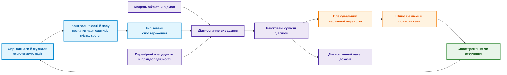
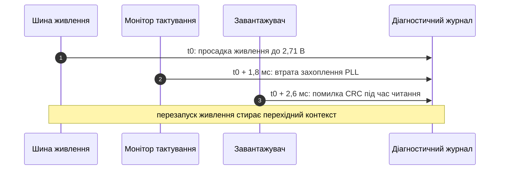
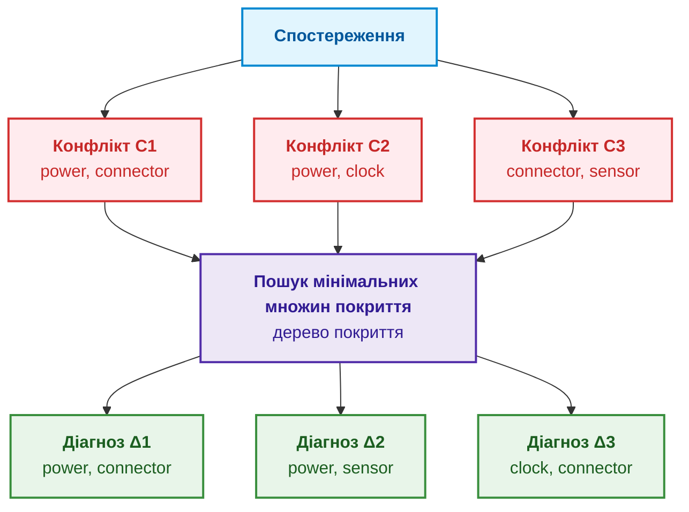
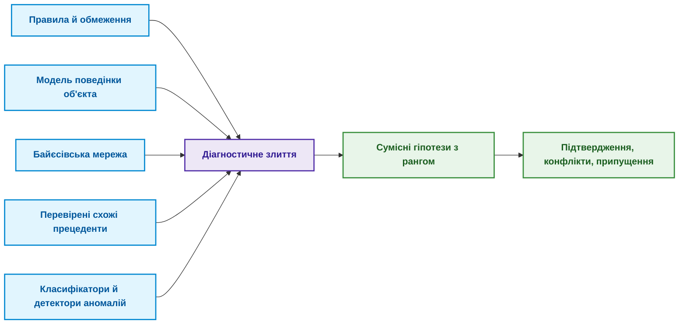
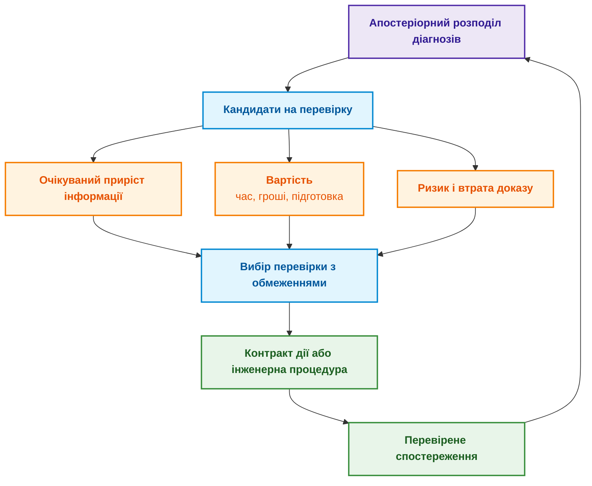

# Глава 24. Технічна діагностика: як не сплутати симптом із першопричиною в умовах неповноти

> **Книга:** [Архітектура доказових експертних систем](README.md) · [Частина V: Верифікація, діагностика, навчання та обґрунтування безпеки](part-05-verification-and-learning.md)  
> **Попередня глава:** [Глава 36. Піраміда тестування знань: правила, взаємодії та стійкість відповідей](ch36-knowledge-testing-pyramid-and-variational-calibration.md)  
> **Наступна глава:** [Глава 25. Як навчати експертну систему: екзаменаційні матриці, аудит знань та контроль регресій](ch25-how-expert-systems-learn.md)  
> **Зміст книги:** [README.md](README.md)  
> **Автор:** [Микола Федчик](about-the-author.md)  
> **Рівень:** середній і поглиблений: інженери з надійності й діагностики, системні архітектори  
> **Очікувані результати:** розрізняти симптом, діагноз і першопричину; описувати спостереження з часом, одиницями й якістю; будувати діагнози на основі моделі за Райтером через конфлікти й мінімальні множини покриття; ранжувати діагнози ймовірностями з урахуванням надійності датчиків; обирати наступну перевірку за цінністю інформації з урахуванням чутливості й специфічності перевірки, вартістю, ризиком і втратою доказу; відрізняти спостереження від втручання; визначати, які результати засобів аналізу журналів, детекторів аномалій і причинного виявлення є спостереженнями чи кандидатами, а не діагнозом; відмовлятися від діагнозу, коли даних недостатньо.

## Анотація

У главі досліджено архітектурні принципи, формальні методи та математичний апарат технічної діагностики в доказових експертних системах. Визначено роль модельно-орієнтованого діагностичного виведення (*Model-Based Diagnosis*) як ключового компонента експертної системи, що забезпечує неспростовне розмежування первинних причин і вторинних симптомів за умов неповноти та зашумленості емпіричних спостережень.

Після холодної ночі пристрій не запускається. Журнал фіксує збій тактування, а осцилограф один раз показує коротку просадку живлення. Після перезапуску проблема зникає. Класифікатор називає найімовірнішою причиною тактування, технік замінює генератор, і несправність повертається. Згодом з'ясовується, що причиною був ненадійний контакт роз'єму, а збій тактування був лише його наслідком.

Ця історія показує, чому діагностика не зводиться до пошуку схожої поломки. Ця глава відповідає на запитання: **як із неповних і ненадійних спостережень отримати сумісні пояснення несправності й обрати наступну перевірку, не сплутавши симптом із першопричиною?** Теза глави: **діагностика є не класифікацією, а пошуком усіх пояснень, сумісних із моделлю об'єкта й спостереженнями. Конфлікти моделі звужують коло причин, мінімальні множини покриття дають кандидатів, ймовірності ранжують кандидатів, а наступну перевірку обирають за цінністю інформації з урахуванням вартості, ризику й втрати доказу. Коли даних недостатньо, правильна відповідь є відмовою з поясненням.**

Глава описує навчальну модель, а не сертифікований діагностичний засіб. Формальні висновки чинні лише в межах описаної моделі, відомих відмов і якості даних. Там, де помилка може зашкодити людям чи обладнанню, потрібні галузеві процедури, кваліфіковані вимірювання й відповідальний фахівець. У наскрізному прикладі можливі кілька версій: нестабільне живлення, несправне тактування, помилка прошивки, поганий контакт роз'єму або похибка вимірювання, а іноді дві несправності одночасно. Експертна система має повернути не одну мітку, а пояснення: які версії сумісні з фактами, чого бракує і яку перевірку варто зробити далі.

## 1. Симптом, діагноз і першопричина: понятійне розмежування

[Глава 6](ch06-applied-mathematics-for-expert-systems.md) ввела байєсівське виведення, причинність і цінність інформації, [Глава 7](ch07-knowledge-base-typology.md) описала правила, прецеденти, обмеження й ймовірнісні моделі, а [Глава 20](ch20-explanation-engine.md) пояснила запити WHY NOT і контрастні пояснення. Діагностика поєднує ці механізми в окрему задачу, яку легко сплутати із сусідніми. Таблиця розмежовує шість задач.

| Задача | Запитання | Результат |
|---|---|---|
| Виявлення аномалій | Чи відхилилася поведінка від норми? | Оцінка аномальності чи подія |
| Класифікація | На який відомий клас схожий випадок? | Мітка й впевненість |
| Діагностика | Які припущення про несправності узгоджують модель зі спостереженнями? | Одна чи кілька гіпотез |
| Аналіз першопричини | Який причинний механізм породив інцидент? | Причинне твердження з припущеннями |
| Пошук несправності | Що перевірити чи виправити далі? | Політика перевірок і ремонтних дій |
| Прогнозування | Як і коли стан погіршиться? | Прогноз траєкторії, залишковий ресурс |

Таблиця пояснює помилку з початку глави: класифікатор розв'язав другу задачу, а технікові потрібна була третя й п'ята. Передбачення класифікатора може бути корисною передумовою, але оцінка $`P(\text{clock\_fault} \mid \text{trace}) = 0{,}72`$ не пояснює, чому просадка живлення з'явилася раніше. Першопричина не випливає з того, що ознака має найбільший внесок у передбачення моделі. А ремонт, після якого пристрій один раз запрацював, не доводить однозначної причини: дія могла скинути стан або змінити кілька змінних одночасно. Діаграма показує повний діагностичний цикл.



Цикл замикається: кожна перевірка дає нове спостереження, яке знову проходить контроль якості. Тому якість першого кроку, перетворення сигналу на спостереження, визначає надійність усього циклу.

## 2. Структура вхідних даних для надійного діагностичного висновку

Симптом не зберігають рядком на кшталт `voltage low`. Мінімальне спостереження містить об'єкт, змінну, значення з одиницею, час події, вікно вимірювання, прилад, посилання на калібрування, якість, хеш джерела й контекст:

<details>
<summary>Приклад спостереження у форматі YAML</summary>

```yaml
observation_id: obs-boot17-vrail-003
subject: ecu:prototype-17
variable: vrail_3v3
value: 2.71
unit: V
event_time: 2026-08-26T03:14:15.104Z
window: 4.0ms
sensor: scope:lab-2/channel-1
calibration_ref: cal-2026-071
sampling_rate: 100MHz
quality: accepted
source_hash: sha256:<хеш файлу осцилограми>
context:
  temperature: -18degC
  board_revision: D
  firmware: 9f12c7a
```

</details>

Кожне поле має призначення. Без часу неможливо встановити порядок «просадка живлення, потім тайм-аут тактування». Без одиниць і калібрування неможливо порівнювати значення з порогом. Без ревізії плати й версії прошивки модель може застосувати застарілий режим відмови. Значення `quality: accepted` не означає, що датчик ніколи не помиляється: воно посилається на процедуру допуску даних. Діаграма показує часову послідовність подій у прикладі.



Часовий порядок звужує коло гіпотез, але сам не доводить причинності. Годинники датчиків можуть бути не синхронізовані, а буферизація журналу змінює порядок запису. Тому карта джерел містить для кожного джерела домен годинника й межу похибки позначки часу.

## 3. Діагностика на основі моделі (MBD): формалізація об'єкта та альтернатив

Реймонд Райтер запропонував діагностику на основі моделі, або діагностику від перших принципів [[1]](#src-1). Нехай $\mathrm{COMP}$ є множиною компонентів, $SD$ описом об'єкта (*system description*), $\mathrm{OBS}$ спостереженнями, а предикат $AB(c)$ означає «компонент $c$ поводиться ненормально». Якщо припустити, що всі компоненти справні, спостереження суперечать моделі:

```math
SD \cup \mathrm{OBS} \cup \{\neg AB(c) \mid c \in \mathrm{COMP}\} \models \bot
```

Позначення:

- $SD$ є описом об'єкта, $\mathrm{OBS}$ є множиною спостережень, а $\mathrm{COMP}$ є множиною компонентів;
- $AB(c)$ означає, що компонент $c$ несправний, а $\neg AB(c)$ припускає його справність;
- $\cup$ об'єднує множини, фігурні дужки з умовою $c\in \mathrm{COMP}$ задають всі припущення про справність компонентів;
- $\models$ означає логічний наслідок, а $\bot$ позначає суперечність.

Діагнозом $\Delta \subseteq \mathrm{COMP}$ називають множину компонентів, припущення про несправність яких відновлює несуперечливість:

```math
SD \cup \mathrm{OBS} \cup \{AB(c) \mid c \in \Delta\} \cup \{\neg AB(c) \mid c \in \mathrm{COMP} \setminus \Delta\} \nvdash \bot
```

Умова діагнозу:

- $\Delta$ є підмножиною компонентів $\mathrm{COMP}$, $AB(c)$ припускає несправність компонента з діагнозу, а $\neg AB(c)$ припускає справність решти;
- $SD$ є описом об'єкта, $\mathrm{OBS}$ є спостереженнями, а $\cup$ додає ці множини припущень;
- $\mathrm{COMP}\setminus\Delta$ означає компоненти поза діагнозом, а $\nvdash\bot$ означає, що з припущень не виводиться суперечність.

Ця діагностика на основі несуперечливості має важливу межу: несуперечливість не доводить, що $\Delta$ справді є причиною, а лише показує, що діагноз не суперечить закодованій моделі й спостереженням. Зазвичай шукають мінімальні за включенням діагнози:

```math
\Delta \text{ несуперечливий} \;\land\; \forall \Delta' \subsetneq \Delta:\ \Delta' \text{ суперечливий}
```

- Для мінімальності $\Delta$ має бути несуперечливим діагнозом, а $\Delta'$ позначає будь-яку його власну підмножину;
- $\land$ означає «і», $\forall$ означає «для кожної», а $\subsetneq$ означає «є власною підмножиною»;
- Суперечливість кожної меншої множини задає мінімальність за включенням, а не найменшу кількість компонентів.

Мінімальний діагноз не обов'язково найімовірніший. Діагноз з однією несправністю {роз'єм} і діагноз із двома {генератор, датчик} можуть бути одночасно мінімальними. Тому припущення «ламається лише один компонент» має бути явним робочим припущенням, а не прихованою оптимізацією розв'язувача.

## 4. Обчислення конфліктів та звуження простору гіпотез

Конфліктом називають множину компонентів $C \subseteq \mathrm{COMP}$, які не можуть бути всі справними за наявних спостережень:

```math
SD \cup \mathrm{OBS} \cup \{\neg AB(c) \mid c \in C\} \models \bot
```

де:

- $C$ є множиною компонентів-кандидатів на конфлікт, $c$ є одним компонентом, а $AB(c)$ означає його несправність;
- $SD$ є описом об'єкта, $\mathrm{OBS}$ є спостереженнями, а $\neg AB(c)$ припускає справність кожного компонента з $C$;
- $\cup$ об'єднує припущення, $\models$ означає логічний наслідок, а $\bot$ означає суперечність.

Кожен діагноз мусить «влучити» в кожен конфлікт, тобто містити хоча б один його компонент:

```math
\forall C_i \in \mathcal{C}:\quad \Delta \cap C_i \neq \varnothing
```

- Кожна множина $C_i$ є одним конфліктом у сукупності $\mathcal{C}$, а $\Delta$ є кандидатом на діагноз;
- $\forall$ означає «для кожного», $\in$ означає належність до множини, а $\cap$ є перетином множин;
- $\neq\varnothing$ означає, що перетин не порожній, тобто діагноз містить хоча б один компонент кожного конфлікту.

Райтер показав, що мінімальні діагнози є мінімальними множинами покриття (*minimal hitting sets*) сукупності конфліктів [[1]](#src-1), а де Клеєр і Вільямс у загальному механізмі діагностики GDE (*General Diagnostic Engine*) поширили цей підхід на кілька одночасних несправностей і доповнили його ймовірностями кандидатів [[2]](#src-2). Конфлікти в GDE обчислює механізм підтримання істинності на основі припущень ATMS [[3]](#src-3). Для прикладу з холодним стартом нехай модель дала три конфлікти:

```math
C_1 = \{\text{power}, \text{connector}\}, \qquad C_2 = \{\text{power}, \text{clock}\}, \qquad C_3 = \{\text{connector}, \text{sensor}\}
```

- У прикладі $C_1$, $C_2$ і $C_3$ є трьома множинами конфліктів, а фігурні дужки перелічують компоненти кожної множини;
- `power` позначає живлення, `connector` роз'єм, `clock` тактування, а `sensor` датчик;
- $=$ задає рівність множин, а коми розділяють компоненти в кожному конфлікті.

Тоді мінімальними множинами покриття є {power, connector}, {power, sensor} і {clock, connector}. Діаграма показує, як із трьох конфліктів виходять три діагнози.



Жоден одиночний компонент не покриває всіх трьох конфліктів: power не входить у $C_3$, connector не входить у $C_2$. Тому кожен мінімальний діагноз тут містить дві несправності. Ці діагнози не є готовими планами ремонту: вони показують, які припущення про несправності пояснюють конфлікти, а модель відмов може бути неповною, і поділ на компоненти може бути надто грубим. Для великого графа об'єкта повний перебір вибухає комбінаторно, тому застосовують інкрементні конфлікти, обмеження кількості одночасних несправностей, ієрархію компонентів і апріорні ймовірності. Але таке відсікання має бути видимим: фраза «гіпотези з понад двома одночасними несправностями не розглядалися» входить до діагностичного пакета.

Навіть класичний алгоритм потребує перевірки. Райтер шукав множини покриття деревом (*hitting set tree*), гілки якого відсікаються спеціальними правилами. Грайнер, Сміт і Вілкерсон показали, що за певних умов, зокрема коли перевірка несуперечливості повертає не мінімальні конфлікти, ці правила відсікають гілку з мінімальним діагнозом. Вони запропонували виправлену структуру HS-DAG (*hitting set directed acyclic graph*, орієнтований ациклічний граф множин покриття) і довели її коректність [[4]](#src-4). Практичний висновок для реалізації такий: пошук діагнозів для великих моделей перевіряють на малих моделях повним перебором, і розбіжність двох відповідей означає помилку реалізації, а не новий діагноз.

> [!NOTE] Подолання «ремонту навмання» (Shotgun Maintenance) за допомогою моделі Райтера
> У польових умовах типовою помилкою сервісних інженерів є послідовна сліпа заміна вузлів за зовнішніми симптомами: «осцилограма показує збій тактування — міняємо генератор; не допомогло — міняємо мікроконтролер; не допомогло — міняємо блок живлення». Це не лише здорожує обслуговування в десятки разів, але й вносить вторинні дефекти через механічне втручання.
> Математичний апарат Райтера дає жорстку гарантію: якщо виявлено сукупність конфліктів $\{C_1, C_2, C_3\}$, будь-яка істинна першопричина $\Delta$ **зобов'язана** бути множиною покриття (перетинати кожен $C_i$). Якщо гіпотеза не перетинає хоча б один конфлікт, її виключають детерміновано — ще до того, як технік візьме до рук викрутку чи паяльник.

### 4.1. Конфлікти між різними рівнями специфікацій

У протокольних системах і шлюзах інтеграції часто трапляється «хибна несправність»: обладнання справне, але відкидає пакети чи розриває з'єднання. Причиною може бути конфлікт між специфікаціями, які реалізували різні виробники. Діагностика тоді працює не з компонентами, а з документами й нормами.

Перший випадок пов'язаний з версіями. Якщо один вузол реалізує RFC 793, а інший сучасну специфікацію TCP, діагностичний механізм перевіряє граф версій: RFC 9293 скасовує RFC 793 і оновлює RFC 5961, що описує захист від атак усередині вікна [[5]](#src-5). Діагноз тоді формулюють не як апаратний збій, а як версійну несумісність реалізацій:

```math
\mathrm{Obsoletes}(D_2, D_1) \Rightarrow \mathrm{Status}(D_1.\mathrm{norm}) = \mathrm{Superseded}
```

- У цьому відношенні $D_1$ і $D_2$ є документами, а $D_1.\mathrm{norm}$ означає норму з документа $D_1$;
- $\mathrm{Obsoletes}(D_2,D_1)$ означає, що документ $D_2$ скасовує документ $D_1$;
- $\Rightarrow$ читається як «якщо, то», $\mathrm{Status}$ повертає статус норми, а $\mathrm{Superseded}$ означає «замінена новішою».

Другий випадок пов'язаний із деонтичними колізіями. Якщо обидва документи чинні, але один зобов'язує поведінку $p$, а інший забороняє її ($`\mathcal{O}(p)`$ проти $`\mathcal{F}(p)`$), експертна система формує звіт про нормативну суперечність із байтовими цитатами обох джерел, як у [Главі 15](ch15-knowledge-extraction-and-kb-construction.md). Третій випадок пов'язаний із винятками: якщо правило має застереження «якщо не виконано умову», діагностичний механізм перевіряє телеметрію, чи не був розрив з'єднання законним наслідком спрацювання винятку.

## 5. Ймовірнісне ранжування сумісних діагнозів

Якщо є надійні історичні дані чи оцінені правдоподібності, діагнози ранжують за формулою Байєса:

```math
P(H_i \mid E) = \frac{P(E \mid H_i)\, P(H_i)}{\sum_j P(E \mid H_j)\, P(H_j)}
```

- У формулі Байєса $H_i$ є i-ю гіпотезою несправності, а $E$ є наявними спостереженнями;
- $P(H_i)$ є апріорною ймовірністю гіпотези у визначеній сукупності виробів, а $P(E\mid H_i)$ є правдоподібністю спостережень за цієї гіпотези;
- $P(H_i\mid E)$ є апостеріорною ймовірністю після спостережень; кожна ймовірність має значення від 0 до 1;
- $\sum_j$ додає внески всіх гіпотез $H_j$ і нормує результат до розподілу ймовірностей.

Ілюстративний приклад з умовними числами: якщо $`P(H)=0{,}1`$, $`P(E\mid H)=0{,}8`$, $`P(\neg H)=0{,}9`$ і $`P(E\mid\neg H)=0{,}2`$, то $`P(H\mid E)=0{,}08/(0{,}08+0{,}18)\approx0{,}308`$. Спостереження підвищило оцінку гіпотези з 0,1 до приблизно 0,308 у цій умовній моделі.

Дані іншої ревізії плати чи іншого клімату не можна мовчки переносити в апріорну ймовірність. Для кількох одночасних несправностей незалежність

```math
P(H_a \land H_b) = P(H_a)\, P(H_b)
```

- Незалежність тут є припущенням про дві гіпотези несправності $H_a$ і $H_b$;
- $\land$ означає одночасне настання обох гіпотез, а $P(\cdot)$ є ймовірністю від 0 до 1;
- $=$ задає спільну ймовірність як добуток окремих лише за умови незалежності.

Ілюстративний приклад: за умовних незалежних імовірностей $`P(H_a)=0{,}1`$ та $`P(H_b)=0{,}2`$ спільна ймовірність становить $`0{,}1\cdot0{,}2=0{,}02`$. Це лише припущення: спільна причина (волога, перехідний процес у живленні, невдала партія компонентів) робить несправності залежними.

### 5.1. Діагностика з урахуванням похибок та відмов вимірювального каналу

Спостереження `alarm = 1` залежить і від несправності $F$, і від якості датчика:

```math
P(\mathrm{alarm} = 1 \mid F) = \text{чутливість}, \qquad P(\mathrm{alarm} = 1 \mid \neg F) = 1 - \text{специфічність}
```

- Для сенсора $F$ означає реальну несправність, $\mathrm{alarm}=1$ означає тривогу, а $\neg F$ означає справний стан;
- $P(A\mid B)$ є ймовірністю події $A$ за умови $B$, зі значенням від 0 до 1;
- чутливість є часткою тривог за наявної несправності, а специфічність є часткою відсутніх тривог за справного стану;
- $1-\text{специфічність}$ є частотою хибної тривоги серед справних станів, а $\mid$ читається як «за умови».

Якщо експертна система приймає тривогу за безпомилковий факт, вона обнуляє ймовірність правдоподібних альтернатив. Тому несправність датчика має бути окремою гіпотезою моделі (у прикладі це компонент sensor), а не текстовим винятком. Невизначеність калібрування й механізм пропуску даних теж впливають на висновок: пакет, відсутній через несправний домен живлення, не є пропуском, випадковим щодо несправності.

Ймовірнісний вихід діагностики має бути каліброваним. Для $K$ діагнозів і $N$ випадків Браєр запропонував оцінку

```math
BS = \frac{1}{N} \sum_{n=1}^{N} \sum_{k=1}^{K} (p_{nk} - y_{nk})^2
```

Величини оцінки:

- $BS$ є оцінкою Браєра, а менше значення означає меншу квадратичну помилку прогнозів;
- $N$ є кількістю випадків, $K$ є кількістю діагнозів, $n$ індексує випадок, а $k$ індексує діагноз;
- $p_{nk}$ є ймовірністю діагнозу $k$ у випадку $n$, а $y_{nk}$ дорівнює одиниці для правильного діагнозу й нулю для решти [[6]](#src-6);
- $\sum$ додає квадрати різниць для всіх випадків і діагнозів, а ділення на $N$ усереднює суму за випадками; для взаємовиключних класів оцінка безрозмірна й лежить від 0 до 2.

**Практичне застосування та інженерні висновки (Closed-Loop Decision):**
1. **Критерії диспетчеризації та режимів калібрування:**
   - **$BS \le 0{,}10$ (Висока каліброваність):** ймовірнісний вихід класифікатора валідовано; система допускається до автономної ранжованої видачі числових оцінок імовірності оператору;
   - **$0{,}10 < BS \le 0{,}25$ (Помірне відхилення):** умовний допуск; система автоматично підключає коригувальний шар (ізотонічну регресію або калібрування Платта) перед передачею ймовірностей у модуль прийняття рішень;
   - **$BS > 0{,}25$ (Некалібрований або оманливий розподіл):** числові ймовірності блокуються; система примусово переходить у консервативний режим якісного детермінованого переліку гіпотез без відображення числових ваг довіри.
2. **Практичний числовий приклад:** Для вибірки з двох альтернативних діагнозів із прогнозом $(0{,}80; 0{,}20)$ за істинної мітки $(1; 0)$ оцінка дорівнює $`(0{,}80-1)^2+(0{,}20-0)^2 = 0{,}04 + 0{,}04 = 0{,}08 \le 0{,}10`$. **Дія системи:** Оцінка підтверджує надійну каліброваність вузла; поріг автоматичного допуску подолано.

Оцінка Браєра вимірює якість ймовірностей, але не достатність моделі відмов: діагностика може бути добре каліброваною серед відомих класів і водночас не мати гіпотези «невідома несправність».

## 6. Комбінування правил, прецедентів та машинного навчання в діагностиці

Діагностичне виведення поєднує знання різних типів, як показує діаграма.



Кожне джерело на діаграмі має власну роль і власну межу:

- **Правило** кодує інваріант або відомий шаблон симптомів.
- **Модель поведінки** породжує очікувані спостереження й конфлікти.
- **Байєсівська мережа** враховує невизначеність і залежності між несправностями [[7]](#src-7).
- **Міркування за прецедентами** (*case-based reasoning*) дає схожий перевірений досвід, але потребує адаптації до поточного випадку: цикл «знайти, повторно використати, переглянути, зберегти» описали Аамодт і Плаза [[8]](#src-8).
- **Машинне навчання** знаходить шаблон у сигналі чи журналі, але його оцінка не є причинним доказом.
- **Граф знань** зберігає топологію, версії й походження.

Додатковим джерелом є аналіз дерева відмов (*fault tree analysis*), який іде згори вниз від небажаної події до комбінацій відмов компонентів, що можуть її спричинити [[9]](#src-9). Дерево відмов, побудоване на етапі проєктування, дає готовий перелік режимів відмов для моделі. Мовна модель доречна для нормалізації розповідного опису симптому, пошуку фрагмента інструкції й озвучення діагностичного пакета, але не має права самостійно додавати режим відмови чи оголошувати першопричину. Кандидат із тексту проходить прив'язку до джерела, описану в [Главі 19](ch19-from-question-to-evidence.md).

## 7. Темпоральна динаміка та послідовність подій у діагностичному виведенні

Несправність, що проявляється час від часу, залежить від прихованого стану $z_t$: холодний, прогрівання, нестабільний, нормальний. Прихована марковська модель (*hidden Markov model*, HMM) описує спільний розподіл станів і спостережень $o_t$ [[10]](#src-10):

```math
P(z_{1:T}, o_{1:T}) = P(z_1) \prod_{t=2}^{T} P(z_t \mid z_{t-1}) \prod_{t=1}^{T} P(o_t \mid z_t)
```

Часові позначення:

- $z_t$ є прихованим станом у момент $t$, $o_t$ є спостереженням у цей момент, а $1:T$ охоплює моменти від 1 до $T$;
- $P(z_{1:T},o_{1:T})$ є спільною ймовірністю послідовностей станів і спостережень, а $P(z_1)$ задає початковий розподіл станів;
- $P(z_t\mid z_{t-1})$ є ймовірністю переходу між сусідніми станами, $P(o_t\mid z_t)$ є ймовірністю спостереження за стану $z_t$; обидві величини лежать від 0 до 1;
- $\prod$ означає добуток множників у заданому діапазоні індексів, а $t$ є порядковим номером кроку.

Алгоритм Вітербі знаходить найімовірнішу послідовність станів, а згладжування оцінює $P(z_t \mid o_{1:T})$ з урахуванням пізніших спостережень. Припущення марковості й стаціонарності треба перевіряти; для асинхронних подій іноді краще підходять темпоральні правила чи модель простору станів з явною невизначеністю годинників.

Часова модель допомагає відрізнити причину, що передує тривозі на нижчих рівнях, від наслідку; стійку несправність від перехідної завади; несправність, що проявляється лише під час переходу між режимами; наслідок відновлювальної дії від природного зникнення симптому. Перезапуск живлення змінює стан і обриває спостереження попередньої траєкторії. Тому правило «зберегти дані до скидання» є не порадою мовної моделі, а інваріантом безпеки й збереження доказів.

## 8. Оптимізація наступної перевірки за цінністю інформації (VOI)

Якщо сумісних діагнозів кілька, треба обрати наступне спостереження чи втручання. Невизначеність щодо діагнозу вимірює ентропія Шеннона [[11]](#src-11):

```math
H(\mathcal{H} \mid E) = -\sum_i P(H_i \mid E) \log_2 P(H_i \mid E)
```

- Ентропія $H(\mathcal{H}\mid E)$ вимірює невизначеність щодо множини гіпотез $\mathcal{H}$ після спостережень $E$;
- $P(H_i\mid E)$ є апостеріорною ймовірністю гіпотези $H_i$, а $\sum_i$ додає внески всіх гіпотез;
- $\log_2$ є логарифмом за основою 2, знак мінус робить ентропію невід'ємною, а результат лежить від 0 до $\log_2|\mathcal{H}|$ бітів.

Ілюстративний приклад: якщо дві гіпотези мають імовірності по 0,5, ентропія дорівнює $`-2\cdot0{,}5\log_2(0{,}5)=1`$ біт. Це відповідає невизначеності між двома однаково правдоподібними варіантами.

Очікуваний приріст інформації від перевірки $T$ з можливими результатами $o$ дорівнює зменшенню ентропії:

```math
IG(T) = H(\mathcal{H} \mid E) - \sum_o P(o \mid E, T)\, H(\mathcal{H} \mid E, o, T)
```

- Для перевірки $T$ величина $IG(T)$ є очікуваним приростом інформації в бітах;
- $o$ перебирає можливі результати перевірки, а $P(o\mid E,T)$ є ймовірністю результату за наявних спостережень і запланованої перевірки;
- $H(\mathcal{H}\mid E)$ є поточною ентропією, а $H(\mathcal{H}\mid E,o,T)$ є ентропією після результату $o$;
- $\sum_o$ обчислює середню залишкову ентропію, яку віднімають від початкової.

Ілюстративний приклад: якщо початкова ентропія дорівнює 1 біту, а перевірка безпомилково розділяє дві гіпотези й зводить залишкову ентропію до нуля, приріст становить $`1-0=1`$ біт.

Перевірка з найбільшим приростом інформації може бути дорогою чи небезпечною. Тому практична корисність враховує вартість часу, грошей, ризику й утрати доказу:

```math
U(T) = \mathbb{E}[\Delta L_{\text{decision}} \mid T] - C_{\text{time}}(T) - C_{\text{money}}(T) - C_{\text{risk}}(T) - C_{\text{evidence loss}}(T)
```

- У корисності $U(T)$ є оцінкою користі перевірки $T$, а $\mathbb{E}[\Delta L_{\text{decision}}\mid T]$ є очікуваним зменшенням втрат рішення після перевірки;
- $C_{\text{time}}$, $C_{\text{money}}$, $C_{\text{risk}}$ і $C_{\text{evidence loss}}$ є витратами часу, грошей, ризику й утрати доказу;
- $\mathbb{E}$ означає математичне сподівання, а кожен мінус віднімає вартість у спільній шкалі корисності;
- У позначенні $T^*$ є обраною перевіркою, $\arg\max$ означає вибір аргументу з найбільшим значенням, а $T_{\text{allowed}}$ є множиною дозволених перевірок.

**Практичне застосування та інженерні висновки (Closed-Loop Decision):**
1. **Правило вибору наступної дії або зупинки тестування:**
   - **Якщо $\max_{T \in T_{\text{allowed}}} U(T) > 0$:** Система обирає $T^* = \arg\max_{T \in T_{\text{allowed}}} U(T)$ та генерує оперативне розпорядження оператору (або команду діагностичного зондування) для виконання перевірки $T^*$;
   - **Якщо $\max_{T \in T_{\text{allowed}}} U(T) \le 0$:** **Умова зупинки (Stopping Criterion)**. Будь-яка додаткова перевірка коштує дорожче, ніж очікуваний виграш від уточнення діагнозу. Діагностичний сеанс негайно завершується: система затверджує поточну найімовірнішу гіпотезу як фінальну або ескалує завдання сервісному інженеру з переліком залишкових невизначеностей.
2. **Практичний числовий приклад:** Для перевірки зі зменшенням втрат $0{,}80$ та сумою витрат $0{,}20 + 0{,}10 + 0{,}10 + 0{,}10 = 0{,}50$ чиста корисність $U(T) = 0{,}80 - 0{,}50 = 0{,}30 > 0$. Перевірка схвалюється до виконання. Якщо для альтернативної агресивної перевірки ризик $C_{\text{risk}} = 0{,}90 \implies U(T') = 0{,}80 - 1{,}30 = -0{,}50 < 0$, система блокує її виконання як невиправдано небезпечну.

Такий підхід до пошуку несправностей, що поєднує ймовірності, вартості дій і цінність спостережень, розвинули Гекерман, Бріз і Роммелс [[12]](#src-12), а Бріз і Гекерман поширили його на вибір між ремонтом і експериментом [[13]](#src-13). Вибір наступного вимірювання за очікуваною ентропією використовував і GDE [[2]](#src-2).

Реальна перевірка рідко буває безпомилковою. Тому перевірку описують так само, як датчик: чутливістю й специфічністю щодо компонента, який вона перевіряє. Ймовірність результату «несправний» за діагнозу $\Delta$ тоді дорівнює

```math
P(o = + \mid \Delta, T) = \begin{cases} s_T, & c_T \in \Delta \\ 1 - q_T, & c_T \notin \Delta \end{cases}
```

- Для перевірки $T$ символ $c_T$ позначає компонент, який вона перевіряє, а $\Delta$ є діагнозом;
- $o=+$ означає результат «несправний», $s_T$ є чутливістю перевірки, а $q_T$ є її специфічністю; обидві величини лежать від 0 до 1;
- фігурна дужка задає два випадки: компонент входить до діагнозу ($\in$) або не входить ($\notin$).

Ілюстративний приклад: перевірка з чутливістю 0,9 і специфічністю 0,95 повертає «несправний» з імовірністю 0,9 для діагнозів із цим компонентом і 0,05 для решти. Ймовірність результату $P(o\mid E,T)$ у формулі приросту інформації є сумою добутків $P(o\mid\Delta,T)\,P(\Delta\mid E)$ за всіма діагнозами. Отже, результат ненадійної перевірки не розрізає множину діагнозів навпіл, а лише зсуває ймовірності діагнозів.

Програма мовою Go проходить увесь шлях для прикладу з холодним стартом. Вона знаходить мінімальні діагнози як множини покриття трьох конфліктів і ранжує їх за умовними апріорними частотами несправностей: живлення 2 %, роз'єм 5 %, тактування 3 %, датчик 4 %, несправності вважаються незалежними. Потім програма оцінює чотири перевірки двічі: як безпомилкові і з умовними чутливістю й специфічністю. Механічна перевірка роз'єму з нагрівом має найнижчу чутливість 0,70, бо поганий контакт проявляється не за кожного нагріву. Вартість виражено в тих самих умовних одиницях, що й біти, щоб корисність можна було обчислити як різницю. Перезапуск пристрою не розрізняє діагнозів, бо симптом після нього зникає за будь-якої причини, і має велику вартість утрати доказу. Тест у файлі `main_test.go` перевіряє властивості, на яких тримається висновок: три мінімальні діагнози з двома несправностями, збіг ідеального приросту з детермінованим розрахунком, приріст ненадійної перевірки менший за ідеальний, нульовий приріст для перезапуску й для перевірки, результат якої не залежить від стану компонента.

<details>
<summary>Приклад мовою Go: мінімальні діагнози й вибір наступної перевірки</summary>

```go
package main

import (
	"fmt"
	"math"
	"sort"
	"strings"
)

var comps = []string{"power", "connector", "clock", "sensor"}

// conflicts: множини компонентів, які не можуть усі бути справними.
var conflicts = [][]string{{"power", "connector"}, {"power", "clock"}, {"connector", "sensor"}}

// prior: апріорна ймовірність несправності кожного компонента (умовні значення).
var prior = map[string]float64{"power": 0.02, "connector": 0.05, "clock": 0.03, "sensor": 0.04}

type Diagnosis map[string]bool

func hits(d Diagnosis) bool {
	for _, c := range conflicts {
		ok := false
		for _, x := range c {
			ok = ok || d[x]
		}
		if !ok {
			return false
		}
	}
	return true
}

// minimalDiagnoses перебирає всі підмножини компонентів і залишає мінімальні множини покриття.
func minimalDiagnoses() []Diagnosis {
	var all []Diagnosis
	for mask := 1; mask < 1<<len(comps); mask++ {
		d := Diagnosis{}
		for i, c := range comps {
			if mask&(1<<i) != 0 {
				d[c] = true
			}
		}
		if hits(d) {
			all = append(all, d)
		}
	}
	var min []Diagnosis
	for _, d := range all {
		minimal := true
		for _, e := range all {
			if len(e) < len(d) && subset(e, d) {
				minimal = false
			}
		}
		if minimal {
			min = append(min, d)
		}
	}
	return min
}

func subset(a, b Diagnosis) bool {
	for k := range a {
		if !b[k] {
			return false
		}
	}
	return true
}

func name(d Diagnosis) string {
	var s []string
	for _, c := range comps {
		if d[c] {
			s = append(s, c)
		}
	}
	return "{" + strings.Join(s, ", ") + "}"
}

func entropy(p []float64) float64 {
	h := 0.0
	for _, x := range p {
		if x > 0 {
			h -= x * math.Log2(x)
		}
	}
	return h
}

// posterior ранжує мінімальні діагнози за незалежними апріорними ймовірностями компонентів.
func posterior(diags []Diagnosis) []float64 {
	post := make([]float64, len(diags))
	sum := 0.0
	for i, d := range diags {
		p := 1.0
		for _, c := range comps {
			if d[c] {
				p *= prior[c]
			} else {
				p *= 1 - prior[c]
			}
		}
		post[i] = p
		sum += p
	}
	for i := range post {
		post[i] /= sum
	}
	return post
}

type Test struct {
	name        string
	reveals     string  // компонент, який перевіряє тест; "" означає, що тест нічого не розрізняє
	sensitivity float64 // P(результат «несправний» | компонент несправний)
	specificity float64 // P(результат «справний» | компонент справний)
	cost        float64 // час, гроші, ризик і втрата доказу в тих самих умовних одиницях, що й біти
}

// infoGain рахує очікуване зменшення ентропії з урахуванням похибок тесту.
func infoGain(diags []Diagnosis, post []float64, t Test) float64 {
	if t.reveals == "" {
		return 0
	}
	h0 := entropy(post)
	expected := 0.0
	for _, positive := range []bool{true, false} {
		joint := make([]float64, len(diags))
		pOutcome := 0.0
		for i, d := range diags {
			like := 1 - t.specificity
			if d[t.reveals] {
				like = t.sensitivity
			}
			if !positive {
				like = 1 - like
			}
			joint[i] = post[i] * like
			pOutcome += joint[i]
		}
		if pOutcome == 0 {
			continue
		}
		for i := range joint {
			joint[i] /= pOutcome
		}
		expected += pOutcome * entropy(joint)
	}
	return h0 - expected
}

func main() {
	diags := minimalDiagnoses()
	post := posterior(diags)
	order := make([]int, len(diags))
	for i := range order {
		order[i] = i
	}
	sort.Slice(order, func(a, b int) bool { return post[order[a]] > post[order[b]] })
	for _, i := range order {
		fmt.Printf("діагноз %-20s апостеріорна ймовірність %.3f\n", name(diags[i]), post[i])
	}
	fmt.Printf("ентропія до тесту: %.3f біт\n\n", entropy(post))

	tests := []Test{
		{"синхронний запис живлення й тактування", "power", 0.90, 0.95, 0.10},
		{"заміна вимірювального пробника", "sensor", 0.95, 0.95, 0.08},
		{"механічна перевірка роз'єму з нагрівом", "connector", 0.70, 0.97, 0.20},
		{"перезапуск пристрою", "", 0, 0, 0.51},
	}
	fmt.Printf("%-40s %9s %9s %9s %11s\n", "перевірка", "IG ідеал", "IG реал", "вартість", "корисність")
	best, bestU := "", math.Inf(-1)
	for _, t := range tests {
		ideal := t
		ideal.sensitivity, ideal.specificity = 1, 1
		ig := infoGain(diags, post, t)
		u := ig - t.cost
		fmt.Printf("%-40s %9.3f %9.3f %9.2f %+11.3f\n", t.name, infoGain(diags, post, ideal), ig, t.cost, u)
		if u > bestU {
			best, bestU = t.name, u
		}
	}
	fmt.Println("\nнаступна перевірка:", best)
}
```

Тест збережіть поруч як `main_test.go` і запустіть командою `go test .`.

```go
package main

import (
	"math"
	"testing"
)

func TestDiagnosesAndInformationGain(t *testing.T) {
	diags := minimalDiagnoses()
	if len(diags) != 3 {
		t.Fatalf("expected 3 minimal diagnoses, got %d", len(diags))
	}
	for _, d := range diags {
		if len(d) != 2 || !hits(d) {
			t.Fatalf("diagnosis %s is not a two-fault hitting set", name(d))
		}
	}
	post := posterior(diags)
	ideal := map[string]float64{"power": 0.995, "sensor": 0.794, "connector": 0.794}
	for comp, want := range ideal {
		perfect := Test{reveals: comp, sensitivity: 1, specificity: 1}
		noisy := Test{reveals: comp, sensitivity: 0.9, specificity: 0.9}
		gotIdeal := infoGain(diags, post, perfect)
		if math.Abs(gotIdeal-want) > 0.001 {
			t.Fatalf("%s: ideal IG %.3f, want %.3f", comp, gotIdeal, want)
		}
		if gotNoisy := infoGain(diags, post, noisy); gotNoisy >= gotIdeal || gotNoisy <= 0 {
			t.Fatalf("%s: noisy IG %.3f must be in (0, %.3f)", comp, gotNoisy, gotIdeal)
		}
	}
	if ig := infoGain(diags, post, Test{reveals: ""}); ig != 0 {
		t.Fatalf("restart must not separate diagnoses, IG %.3f", ig)
	}
	coin := Test{reveals: "power", sensitivity: 0.5, specificity: 0.5}
	if ig := infoGain(diags, post, coin); math.Abs(ig) > 1e-12 {
		t.Fatalf("uninformative test must give zero IG, got %.3g", ig)
	}
}
```

</details>

Запуск `go run .` у каталозі з файлом `go.mod` (його створює команда `go mod init ch24diag`) дає:

<details>
<summary>Вивід програми</summary>

```text
діагноз {connector, clock}   апостеріорна ймовірність 0.458
діагноз {power, connector}   апостеріорна ймовірність 0.302
діагноз {power, sensor}      апостеріорна ймовірність 0.239
ентропія до тесту: 1.531 біт

перевірка                                 IG ідеал   IG реал  вартість  корисність
синхронний запис живлення й тактування       0.995     0.614      0.10      +0.514
заміна вимірювального пробника               0.794     0.548      0.08      +0.468
механічна перевірка роз'єму з нагрівом       0.794     0.279      0.20      +0.079
перезапуск пристрою                          0.000     0.000      0.51      -0.510

наступна перевірка: синхронний запис живлення й тактування
```

</details>

Програма знайшла ті самі три мінімальні діагнози, що й ручний аналіз, і показала, що мінімальність і ймовірність є різними властивостями: усі три діагнози мінімальні, але {connector, clock} майже вдвічі ймовірніший за {power, sensor}. Стовпець «IG ідеал» відтворює розрахунок для безпомилкових перевірок: синхронний запис живлення й тактування дав би 0,995 біта з 1,531, бо відокремлює два діагнози з живленням від діагнозу без нього. Стовпець «IG реал» показує ціну похибок. Приріст синхронного запису зменшується до 0,614 біта, а перевірки роз'єму з 0,794 до 0,279 біта: перевірка, яка пропускає 30 % несправностей, розрізняє діагнози майже втричі гірше. Порядок перевірок у цьому прикладі не змінився, але корисність перевірки роз'єму зменшилася з 0,594 до 0,079, тож невелика зміна вартості чи чутливості вже зробить її збитковою. Приріст від ненадійної перевірки не може перевищити приріст від безпомилкової: її результат залежить від діагнозу лише через стан перевіреного компонента, а за нерівністю обробки даних таке зашумлення не додає інформації [[14]](#src-14). Перезапуск нічого не розрізняє й знищує перехідний контекст, тому його корисність від'ємна за будь-якої точності. Саме тому в історії з початку глави перезапуск і заміна генератора були поганими першими кроками.

Межі прикладу такі: апріорні частоти, чутливості, специфічності й вартості умовні; несправності вважаються незалежними; кожну перевірку оцінено як один крок без планування послідовності перевірок. Чутливість і специфічність реальної перевірки оцінюють на розмічених випадках так само, як для датчика, і зберігають разом із версією процедури перевірки. Діаграма підсумовує процедуру вибору.



## 9. Причинний аналіз: розмежування спостережень та активних втручань

Виміряти напругу означає спостерігати. Замінити роз'єм, нагріти плату чи змінити прошивку означає втрутитися: втручання змінює об'єкт, і після нього старі умовні залежності не обов'язково зберігаються. У причинній моделі Перла цю різницю виражають двома різними величинами [[15]](#src-15):

```math
P(Y \mid X = x) \qquad \text{і} \qquad P(Y \mid do(X = x))
```

- У першому виразі $P(Y\mid X=x)$ є розподілом результату $Y$ за спостереження $X=x$;
- У другому виразі $P(Y\mid do(X=x))$ є розподілом $Y$ після контрольованого втручання, що встановлює $X=x$;
- Вертикальна риска $\mid$ означає «за умови», а оператор $do(\cdot)$ позначає втручання, не звичайне спостереження;
- $Y$ є результатом, $X$ є змінною-впливом, а $x$ є її заданим значенням.

Перша величина є спостережною залежністю, а друга є розподілом після контрольованого втручання за структурних причинних припущень. Навіть успішне втручання не доводить першопричини, якщо одночасно змінилися температура, з'єднання й стан пристрою. Тому ремонт супроводжують знімками стану до й після, контрольованими змінними й переліком альтернативних пояснень. Діагностичний планувальник виконує втручання через контракт дії з [Глави 21](ch21-from-recommendation-to-action.md) і не обходить шлюзу безпеки лише тому, що назвав дію «тестом».

## 10. Формування доказового діагностичного пояснення для інженера

Результатом діагностики є не мітка, а діагностичний пакет:

<details>
<summary>Приклад діагностичного пакета у форматі JSON</summary>

```json
{
  "case": "cold-start-failure",
  "snapshot": "sha256:<хеш зрізу спостережень>",
  "model": "ecu-boot-model@4.2",
  "observations": ["obs:vrail:003", "obs:clock:011"],
  "diagnoses": [
    {
      "hypothesis": ["clock", "connector"],
      "status": "compatible_minimal",
      "posterior": 0.458,
      "conflicts_hit": ["C1", "C2", "C3"],
      "assumptions": ["max_fault_cardinality=2", "independent_faults"]
    }
  ],
  "not_ruled_out": ["unknown_fault"],
  "next_test": "synchronized_rail_clock_capture",
  "test_utility_components": {"information_bits": 0.614, "information_bits_if_perfect": 0.995, "sensitivity": 0.90, "specificity": 0.95, "cost": 0.10},
  "abstention": null
}
```

</details>

Пакет не змішує ймовірність (`posterior`) зі статусом сумісності (`compatible_minimal`): це різні властивості. Поле `not_ruled_out` не є формальністю, бо невідома несправність часто важливіша за різницю між двома відомими класами. Пакет також містить відсічені гіпотези, межі розв'язувача, припущення про якість датчиків і недоступні докази. Рушій пояснень із [Глави 20](ch20-explanation-engine.md) на основі пакета відповідає на чотири запитання: чому роз'єм (які конфлікти й спостереження це підтримують), чому не лише тактування (який конфлікт лишається непокритим), що якби просадка живлення була артефактом датчика (повторне виведення на дочірньому зрізі) і яку перевірку зробити далі (чому вона розділяє гіпотези і скільки коштує).

## 11. Алгоритмічний скепсис: критерії відмови за неповноти спостережень

Експертна система обов'язково відмовляється від діагнозу, якщо якість спостережень нижча за поріг допуску; модель чи її версія не покриває конфігурації об'єкта; усі відомі гіпотези суперечливі; розподіл ймовірностей розмитий, а бюджет перевірок вичерпано; розв'язувач не завершився або оцінка наближення недостатня; критичні докази недоступні через права доступу; запропонована перевірка небезпечна або немає уповноваженого оператора.

Діагностику з правом відмови оцінюють кривою «ризик-покриття». Для частки прийнятих випадків $c$ вибірковий ризик дорівнює

```math
R_{\text{sel}}(c) = \mathbb{E}\left[L(\hat{H}, H) \mid \text{прийнято за покриття } c\right]
```

- Для цієї оцінки $R_{\text{sel}}(c)$ є середнім ризиком серед прийнятих випадків за покриття $c$, де $c$ є часткою прийнятих випадків від 0 до 1;
- $\mathbb{E}$ означає середнє очікуване значення, а $L$ є функцією втрат від хибного діагнозу;
- $\hat{H}$ є прогнозованим діагнозом, $H$ є еталонним діагнозом, а риска $\mid$ обмежує усереднення прийнятими випадками.

**Практичне застосування та інженерні висновки (Closed-Loop Decision):**
1. **Критерії селективного допуску (Selective Acceptance Gate):**
   - **Якщо $R_{\text{sel}}(c) \le \tau_{\text{risk}} = 0{,}02$ за покриття $c \ge 0{,}85$:** Система автономно публікує діагностичний вердикт без участі оператора;
   - **Якщо досягнення допустимого ризику $R_{\text{sel}} \le 0{,}02$ вимагає падіння покриття до $c < 0{,}70$:** Система вмикає алгоритмічну відмову (`KindRefusal`). Спроба автоматичного виведення відхиляється, і формується запит на ручну діагностику із зазначенням нерозв'язаних конфліктів.
2. **Практичний числовий приклад:** За бінарної функції втрат $L \in \{0, 1\}$ на вибірці з 200 прийнятих випадків ($c = 0{,}88$) зафіксовано 3 хибні діагнози. Оцінка ризику становить $R_{\text{sel}} = 3 / 200 = 0{,}015 = 1{,}5\% \le 2{,}0\%$. **Дія системи:** Досягнутий баланс «ризик-покриття» задовольняє критерій промислового допуску; автоматична класифікація залишається активною.

Теоретичні основи такої вибіркової класифікації розвинули Ель-Янів і Вінер [[16]](#src-16). Зменшити кількість помилок, відмовляючись від усіх складних випадків, легко, тому звітують і ризик, і покриття, окремо для різних класів несправностей.

## 12. Верифікація діагностичної експертної системи та оцінка ефективності

Одна точність першої гіпотези приховує головне. Потрібні повнота серед перших $k$ діагнозів і точність повної множини для кількох несправностей; калібрування й оцінка Браєра для ймовірностей; покриття конфліктів і режимів відмов; частка випадків, де правильного діагнозу немає в моделі; середня кількість, вартість і ризик перевірок до локалізації; час до безпечного стану й до правильного діагнозу; частка непотрібних замін і руйнівних перевірок; відтворюваність доказу, повнота походження й відсутність витоків; якість відмов і виявлення невідомих несправностей; стійкість до шуму датчиків, розсинхронізації годинників і пропущених спостережень.

Для політики пошуку несправностей $\pi$ сумарна вартість епізоду дорівнює

```math
J(\pi) = \mathbb{E}_{\pi}\left[\sum_{t=1}^{\tau} \left(c_{\text{test},t} + c_{\text{repair},t} + c_{\text{downtime},t} + c_{\text{risk},t}\right) + c_{\text{misdiagnosis}}\right]
```

- У цій функції $J(\pi)$ є сумарною очікуваною вартістю політики $\pi$, а $\mathbb{E}_{\pi}$ усереднює результати її виконання;
- $t$ індексує кроки епізоду, $\tau$ є моментом завершення, а $\sum_{t=1}^{\tau}$ додає витрати за всі кроки;
- $c_{\text{test},t}$, $c_{\text{repair},t}$, $c_{\text{downtime},t}$ і $c_{\text{risk},t}$ є витратами перевірки, ремонту, простою й ризику на кроці $t$;
- $c_{\text{misdiagnosis}}$ є вартістю хибного діагнозу; усі складники мають спільну шкалу вартості.

**Практичне застосування та інженерні висновки (Closed-Loop Decision):**
1. **Вибір оптимальної політики та захисне блокування:**
   - Система обирає політику $\pi^* = \arg\min_{\pi} J(\pi)$ серед перевірених сценаріїв пошуку;
   - Якщо мінімальна очікувана вартість виконання політики перевищує критичну межу катастрофічного збитку ($J(\pi^*) \ge C_{\text{catastrophic}}$), автономний пошук несправностей блокується, а об'єкт переводиться в захисний стан зупинки (Fail-Safe Shutdown) до прибуття аварійної бригади.
2. **Практичний числовий приклад:** Для політики заміни вузла $J(\pi_1) = 450$ ум. од. (дешеві тести, нульовий ризик пошкодження обладнання), тоді як для агресивного високовольтного тестування $J(\pi_2) = 1\,200$ ум. од. через ризик $c_{\text{risk}} = 800$. **Дія системи:** Система призначає виконання політики $\pi_1$.

Політику порівнюють із чинною процедурою та з експертами на тих самих випадках. Історична мітка ремонту не завжди є істиною: першопричину підтверджують незалежними доказами. Випадки розділяють за виробом та історією інциденту, щоб сліди одного дефекту не потрапили одночасно в навчальний і тестовий набори.

## 13. Інтеграція засобів Data Mining, Process Mining та телеметрії

Попередні розділи описали метод на одному прикладі з чотирма компонентами. Реальний об'єкт має тисячі рядків журналу на секунду, сотні сигналів і архів інцидентів за роки. Для кожного кроку методу вже є відкриті бібліотеки й методи інтелектуального аналізу даних (*data mining*) та машинного навчання. Запитання розділу таке: що саме кожен засіб може дати діагностичній експертній системі і де закінчуються його повноваження? Таблиця зіставляє крок діагностики, засіб, його результат і межу.

| Крок діагностики | Метод або засіб | Що дає | Межа |
|---|---|---|---|
| Перетворення журналу на спостереження | Розбір журналів алгоритмом Drain [[17]](#src-17) | Шаблони подій із параметрами замість сирих рядків | Шаблон не має змісту; помилка розбору зливає різні події в одну |
| Пошук часових шаблонів | Пошук частих епізодів за Маннілою, Тойвоненом і Веркамо [[18]](#src-18) | Послідовності подій, що часто трапляються в межах часового вікна | Частий порядок не доводить причинності |
| Виявлення симптомів у сигналах | Ізолювальний ліс (*isolation forest*) Лю, Тінга й Чжоу [[19]](#src-19) | Оцінку аномальності без розмічених відмов | Детектор є ще одним датчиком із власними чутливістю й специфічністю |
| Пошук мінімальних діагнозів | Виправлений алгоритм HS-DAG [[4]](#src-4), розв'язувачі задач виконуваності | Повний перелік мінімальних діагнозів для великої моделі | Повнота перелічення не виходить за повноту конфліктів і моделі |
| Ранжування залежних несправностей | Байєсівські мережі в бібліотеці pgmpy [[20]](#src-20) | Вивчення структури й параметрів, точне й наближене виведення | Вивчена з даних структура є кандидатом, а не знанням |
| Кандидати причинних зв'язків | Бібліотека причинного виявлення causal-learn [[21]](#src-21) | Ребра-кандидати причинного графа з даних спостережень | Результат спирається на припущення, зокрема про відсутність прихованих спільних причин |
| Атрибуція аномалії | Метод Будатокі, Мінорікса, Блебаума й Янцінга [[22]](#src-22), реалізований у бібліотеці DoWhy | Внесок кожної змінної в оцінку аномальності цільової змінної | Потрібні відомий причинний граф і навчена на нормальних даних функціональна модель |

Таблиця ділить засоби на дві групи. Перші три рядки перетворюють сирі дані на спостереження й симптоми, а решта обчислює висновки над уже побудованою моделлю. Засоби першої групи не ставлять діагнозу. Їхній результат входить у модель як спостереження з якістю, а детектор аномалій входить як ще одна ненадійна перевірка з чутливістю й специфічністю, оціненими на розмічених випадках. Це та сама структура `Test`, що й у програмі вище: оцінка ізолювального лісу, яка перевищила поріг, є результатом «несправний» із відомою частотою хибних тривог, а не фактом.

Засоби другої групи діють лише в межах моделі. Атрибуція аномалії за Будатокі та співавторами розподіляє оцінку аномальності між вузлами заданого причинного графа. Якщо граф не містить роз'єму, метод ніколи не назве роз'єм причиною, хоч би якою точною була оцінка решти вузлів. Тому результат атрибуції в діагностичному пакеті супроводжують версією графа й переліком змінних, яких граф не охоплює.

Пошук частих епізодів і причинне виявлення найкорисніші як джерело кандидатів у знання. Припустімо, в архіві холодних стартів епізод «просадка живлення, втрата захоплення PLL, помилка CRC» часто трапляється у вікні 5 мс. Це підстава додати до моделі ребро-кандидат «просадка живлення впливає на PLL» і перевірити його синхронним записом сигналів. Це не підстава оголосити живлення першопричиною, бо обидві події можуть мати спільну причину, наприклад той самий ненадійний контакт роз'єму. Кандидат проходить той самий шлюз допуску, що й факти, видобуті з тексту, як описано в [Главі 15](ch15-knowledge-extraction-and-kb-construction.md): прив'язка до джерела, перевірка експертом, версія.

Отже, сучасні засоби прискорюють кожен крок, але не змінюють розподілу повноважень. Алгоритми аналізу даних пропонують спостереження й кандидатів, модель за Райтером визначає сумісні діагнози, а шлюз допуску вирішує, що з кандидатів стає знанням. Наступний розділ збирає помилки, які виникають, коли цей розподіл порушено.

## 14. Каталог типових діагностичних помилок та архітектурні запобіжники

Таблиця підсумовує типові помилки діагностики та способи протидії.

| Помилка | Наслідок | Протидія |
|---|---|---|
| Мітку класифікатора названо діагнозом | Схожість замінює несуперечливість із моделлю | Конфлікти моделі й явне покриття моделі |
| Найраніший запис журналу названо першопричиною | Буферизація й розсинхронізація створюють хибний порядок | Домени годинників, невизначеність і причинна перевірка |
| Приховане припущення про одну несправність | Пропущено кілька несправностей і спільні причини | Явна кількість несправностей, залежності, тести з кількома несправностями |
| Тривогу прийнято за безпомилкову | Несправність датчика виключено з гіпотез | Правдоподібність датчика й походження калібрування |
| Першою виконано найдешевшу перевірку | Втрачено перехідний доказ | Вартість утрати доказу й інваріант безпеки |
| Успішний ремонт названо доказом | Втручання змінило кілька змінних | Контрольовані знімки до й після, повторюваність, альтернативи |
| Усі відомі діагнози суперечливі | Експертна система все одно обирає першу гіпотезу | Гіпотеза «невідома несправність» і відмова |
| Мовна модель додала правдоподібну причину | Немає режиму відмови чи ребра доказу | Мовна модель лише пропонує, рішення за перевіркою |
| Перевірку вважають безпомилковою | Переоцінено приріст інформації, обрано хибну перевірку | Чутливість і специфічність кожної перевірки, оцінені на розмічених випадках |
| Оцінку детектора аномалій чи частий епізод названо причиною | Кореляція замінює причинний зв'язок | Результат аналізу даних входить як спостереження чи кандидат і проходить шлюз допуску |

## 15. Практичний алгоритм впровадження діагностики для цільового об'єкта

Розгортання системи технічної діагностики в доказовій інженерії знань потребує послідовного переходу від абстрактної математичної моделі Райтера до промислової експлуатації на реальному обладнанні. Спроба охопити весь складний об'єкт єдиною монолітною діагностичною матрицею без калібрування вимірювальних каналів неминуче призводить до комбінаторного вибуху та взаємного блокування гіпотез. Для побудови верифікованого й безпечного діагностичного тракту автором розроблено поетапний інженерний алгоритм впровадження:

1. Обрати одну обмежену підсистему й 5–15 відомих режимів відмов.
2. Описати компоненти, обмеження поведінки, спостереження, одиниці й годинники.
3. Додати стани якості датчиків і стан «невідомо», а не лише булеві факти.
4. Реалізувати конфлікти й мінімальні діагнози та зафіксувати припущення про відсікання.
5. Додавати апріорні ймовірності й правдоподібності лише з версіонованих даних про сукупність виробів.
6. Описати 3–5 дозволених перевірок із результатами, вартістю, ризиком і втратою доказу.
7. Повертати діагностичний пакет і відтворюване пояснення, а не лише мітку.
8. Перевірити одиночні, кілька й невідомі несправності, відмову датчика й часові перегони.
9. Запустити тіньове порівняння з чинною процедурою пошуку несправностей.
10. Дозволяти втручання лише через контракт дії та шлюзи людини й безпеки.

Для прикладу з холодним стартом перша корисна версія не зобов'язана автоматично назвати першопричину. Досить показати кілька сумісних пояснень, не виключити похибки вимірювання, не допустити раннього перезапуску й запропонувати синхронний запис сигналів. Це вже зменшує ризик утрати доказу й непотрібної заміни деталі.

## Висновки
Діагностика починається не з назви поломки, а з відокремлення спостереження від пояснення. Діагностика на основі моделі за Райтером знаходить усі пояснення, сумісні зі спостереженнями: конфлікти моделі звужують коло причин, мінімальні множини покриття дають кандидатів, а ймовірності ранжують кандидатів з урахуванням надійності датчиків і спільних причин.

Глава показала цей шлях на прикладі холодного старту. Три конфлікти дали три мінімальні діагнози, кожен з двома несправностями. Програма мовою Go обчислила їхні ймовірності й показала, що синхронний запис живлення й тактування дає найбільшу корисність, тоді як перезапуск нічого не розрізняє й знищує доказ. Урахування чутливості й специфічності зменшило приріст інформації цієї перевірки з 0,995 до 0,614 біта, а перевірки роз'єму майже втричі, тож вибір перевірки залежить від виміряної точності перевірок, а не лише від структури моделі. Відкриті бібліотеки й методи аналізу даних прискорюють кожен крок, але їхні результати входять у модель як спостереження або кандидати знань, а не як діагноз. Різниця між спостереженням і втручанням пояснила, чому успішна заміна деталі не доводить першопричини, а умови відмови визначили, коли правильною відповіддю є «даних недостатньо».

Межі глави такі. Несуперечливість із моделлю не доводить причинності; ймовірності чинні лише для сукупності, з якої їх оцінено; незалежність несправностей є припущенням; приклад використовує умовні частоти й вартості. [Глава 25](ch25-how-expert-systems-learn.md) пояснює, як експертна система може навчатися на перевірених випадках, не перетворюючи власних припущень на беззаперечну істину.

## Запитання для самоперевірки
1. Чим діагностика відрізняється від класифікації і чому оцінка $`P(\text{clock\_fault} \mid \text{trace}) = 0{,}72`$ не є діагнозом?
2. Які поля спостереження потрібні, щоб встановити порядок подій і порівняти значення з порогом?
3. Що доводить і чого не доводить несуперечливість діагнозу з моделлю за Райтером?
4. Чому для конфліктів $C_1$, $C_2$, $C_3$ немає діагнозу з однією несправністю і як знайти мінімальні множини покриття?
5. Чому мінімальний діагноз не обов'язково найімовірніший і яке припущення програма робить про незалежність несправностей?
6. Чому перезапуск пристрою має від'ємну корисність, хоча він найдешевший у виконанні?
7. Чому перевірка роз'єму з чутливістю 0,70 дає майже втричі менший приріст інформації, ніж безпомилкова, і чому приріст від ненадійної перевірки не може перевищити приріст від безпомилкової?
8. Чим $P(Y \mid X = x)$ відрізняється від $P(Y \mid do(X = x))$ і чому успішний ремонт не доводить першопричини?
9. Як найчастіший епізод у журналах або оцінка детектора аномалій мають входити до діагностичної моделі і чому вони не є діагнозом?
10. За яких умов експертна система має відмовитися від діагнозу і як оцінюють якість таких відмов?

## Словник
| Український термін | Англійський відповідник | Коротке пояснення |
|---|---|---|
| Симптом | Symptom | Спостережуване відхилення поведінки |
| Діагноз | Diagnosis | Множина припущень про несправності, сумісна з моделлю й спостереженнями |
| Першопричина | Root cause | Причинний механізм, що породив інцидент |
| Діагностика на основі моделі | Model-based diagnosis | Пошук діагнозів через несуперечливість моделі об'єкта зі спостереженнями |
| Конфлікт | Conflict | Множина компонентів, які не можуть бути всі справними |
| Мінімальна множина покриття | Minimal hitting set | Мінімальна множина, що перетинається з кожним конфліктом |
| Апріорна ймовірність | Prior probability | Ймовірність гіпотези до врахування нових спостережень |
| Правдоподібність | Likelihood | Ймовірність спостережень за умови гіпотези |
| Чутливість | Sensitivity | Ймовірність тривоги за наявної несправності |
| Специфічність | Specificity | Ймовірність відсутності тривоги за відсутньої несправності |
| Оцінка Браєра | Brier score | Середній квадрат різниці між ймовірностями й фактичними результатами |
| Прихована марковська модель | Hidden Markov model | Модель прихованих станів і спостережень, що від них залежать |
| Приріст інформації | Information gain | Очікуване зменшення ентропії після перевірки |
| Втручання | Intervention | Дія, що змінює об'єкт, на відміну від спостереження |
| Дерево відмов | Fault tree | Логічна схема комбінацій відмов, що ведуть до небажаної події |
| Вибірковий ризик | Selective risk | Середні втрати на прийнятих, тобто невідмовлених, випадках |
| Нерівність обробки даних | Data processing inequality | Обробка чи зашумлення сигналу не збільшує взаємної інформації з джерелом |
| Шаблон журналу | Log template | Постійна частина рядка журналу, відокремлена від змінних параметрів |
| Частий епізод | Frequent episode | Послідовність подій, що часто трапляється в межах заданого часового вікна |
| Атрибуція аномалії | Anomaly attribution | Розподіл оцінки аномальності між вузлами заданого причинного графа |

## Абревіатури
| Скорочення | Розшифрування | Значення |
|---|---|---|
| ATMS | Assumption-based Truth Maintenance System | підтримання істинності на основі припущень |
| CRC | Cyclic Redundancy Check | циклічна контрольна сума |
| GDE | General Diagnostic Engine | загальний механізм діагностики де Клеєра й Вільямса |
| HMM | Hidden Markov Model | прихована марковська модель |
| HS-DAG | Hitting Set Directed Acyclic Graph | орієнтований ациклічний граф множин покриття, виправлення алгоритму Райтера |
| IG | Information Gain | очікуваний приріст інформації від перевірки |
| PLL | Phase-Locked Loop | система фазового автопідлаштування частоти |
| RFC | Request for Comments | серія документів зі специфікаціями інтернету |
| TCP | Transmission Control Protocol | протокол керування передаванням |

## Джерела
1. <a id="src-1"></a>Raymond Reiter. [*A Theory of Diagnosis from First Principles*](https://doi.org/10.1016/0004-3702(87)90062-2). *Artificial Intelligence*, 32(1), 57–95, 1987.
2. <a id="src-2"></a>Johan de Kleer, Brian C. Williams. [*Diagnosing Multiple Faults*](https://doi.org/10.1016/0004-3702(87)90063-4). *Artificial Intelligence*, 32(1), 97–130, 1987.
3. <a id="src-3"></a>Johan de Kleer. [*An Assumption-Based TMS*](https://doi.org/10.1016/0004-3702(86)90080-9). *Artificial Intelligence*, 28(2), 127–162, 1986.
4. <a id="src-4"></a>Russell Greiner, Barbara A. Smith, Ralph W. Wilkerson. [*A Correction to the Algorithm in Reiter's Theory of Diagnosis*](https://doi.org/10.1016/0004-3702(89)90079-9). *Artificial Intelligence*, 41(1), 79–88, 1989.
5. <a id="src-5"></a>W. Eddy (ред.). [*RFC 9293: Transmission Control Protocol (TCP)*](https://www.rfc-editor.org/info/rfc9293). IETF, 2022.
6. <a id="src-6"></a>Glenn W. Brier. [*Verification of Forecasts Expressed in Terms of Probability*](https://doi.org/10.1175/1520-0493(1950)078<0001:VOFEIT>2.0.CO;2). *Monthly Weather Review*, 78(1), 1–3, 1950.
7. <a id="src-7"></a>Finn V. Jensen, Thomas D. Nielsen. [*Bayesian Networks and Decision Graphs*](https://doi.org/10.1007/978-0-387-68282-2). 2nd edition, Springer, 2007.
8. <a id="src-8"></a>Agnar Aamodt, Enric Plaza. [*Case-Based Reasoning: Foundational Issues, Methodological Variations, and System Approaches*](https://doi.org/10.3233/AIC-1994-7104). *AI Communications*, 7(1), 39–59, 1994.
9. <a id="src-9"></a>NASA Office of Safety and Mission Assurance. [*Fault Tree Handbook with Aerospace Applications*](https://extapps.ksc.nasa.gov/Reliability/Documents/Fault_Tree_Handbook_with_Aerospace_Applications_August_2002.pdf). Version 1.1, 2002.
10. <a id="src-10"></a>L. R. Rabiner. [*A Tutorial on Hidden Markov Models and Selected Applications in Speech Recognition*](https://doi.org/10.1109/5.18626). *Proceedings of the IEEE*, 77(2), 257–286, 1989.
11. <a id="src-11"></a>C. E. Shannon. [*A Mathematical Theory of Communication*](https://doi.org/10.1002/j.1538-7305.1948.tb01338.x). *Bell System Technical Journal*, 27(3), 379–423, 1948.
12. <a id="src-12"></a>David Heckerman, John S. Breese, Koos Rommelse. [*Decision-Theoretic Troubleshooting*](https://doi.org/10.1145/203330.203341). *Communications of the ACM*, 38(3), 49–57, 1995.
13. <a id="src-13"></a>John S. Breese, David Heckerman. [*Decision-Theoretic Troubleshooting: A Framework for Repair and Experiment*](https://arxiv.org/abs/1302.3563). arXiv:1302.3563.
14. <a id="src-14"></a>Thomas M. Cover, Joy A. Thomas. [*Elements of Information Theory*](https://doi.org/10.1002/047174882X). 2nd edition, Wiley, 2006.
15. <a id="src-15"></a>Judea Pearl. [*Causality: Models, Reasoning, and Inference*](https://doi.org/10.1017/CBO9780511803161). 2nd edition, Cambridge University Press, 2009.
16. <a id="src-16"></a>Ran El-Yaniv, Yair Wiener. [*On the Foundations of Noise-free Selective Classification*](https://www.jmlr.org/papers/v11/el-yaniv10a.html). *Journal of Machine Learning Research*, 11, 2010.
17. <a id="src-17"></a>Pinjia He, Jieming Zhu, Zibin Zheng, Michael R. Lyu. [*Drain: An Online Log Parsing Approach with Fixed Depth Tree*](https://doi.org/10.1109/ICWS.2017.13). IEEE International Conference on Web Services (ICWS), 33–40, 2017.
18. <a id="src-18"></a>Heikki Mannila, Hannu Toivonen, A. Inkeri Verkamo. [*Discovery of Frequent Episodes in Event Sequences*](https://doi.org/10.1023/A:1009748302351). *Data Mining and Knowledge Discovery*, 1(3), 259–289, 1997.
19. <a id="src-19"></a>Fei Tony Liu, Kai Ming Ting, Zhi-Hua Zhou. [*Isolation Forest*](https://doi.org/10.1109/ICDM.2008.17). IEEE International Conference on Data Mining (ICDM), 413–422, 2008.
20. <a id="src-20"></a>Ankur Ankan, Johannes Textor. [*pgmpy: A Python Toolkit for Bayesian Networks*](https://www.jmlr.org/papers/v25/23-0487.html). *Journal of Machine Learning Research*, 25(265), 1–8, 2024.
21. <a id="src-21"></a>Yujia Zheng, Biwei Huang, Wei Chen, Joseph Ramsey, Mingming Gong, Ruichu Cai, Shohei Shimizu, Peter Spirtes, Kun Zhang. [*Causal-learn: Causal Discovery in Python*](https://www.jmlr.org/papers/v25/23-0970.html). *Journal of Machine Learning Research*, 25(60), 1–8, 2024.
22. <a id="src-22"></a>Kailash Budhathoki, Lenon Minorics, Patrick Blöbaum, Dominik Janzing. [*Causal Structure-Based Root Cause Analysis of Outliers*](https://proceedings.mlr.press/v162/budhathoki22a.html). *Proceedings of the 39th International Conference on Machine Learning*, PMLR 162, 2357–2369, 2022.

---

[← Глава 36](ch36-knowledge-testing-pyramid-and-variational-calibration.md) | [Зміст книги](README.md) | [Частина V](part-05-verification-and-learning.md) | [Глава 25 →](ch25-how-expert-systems-learn.md)
