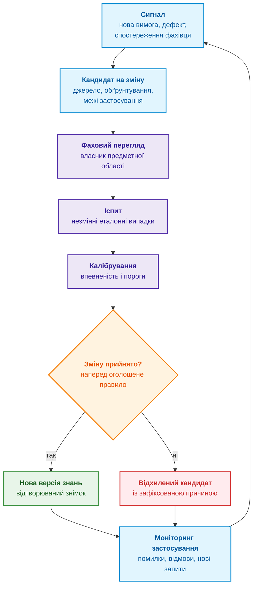
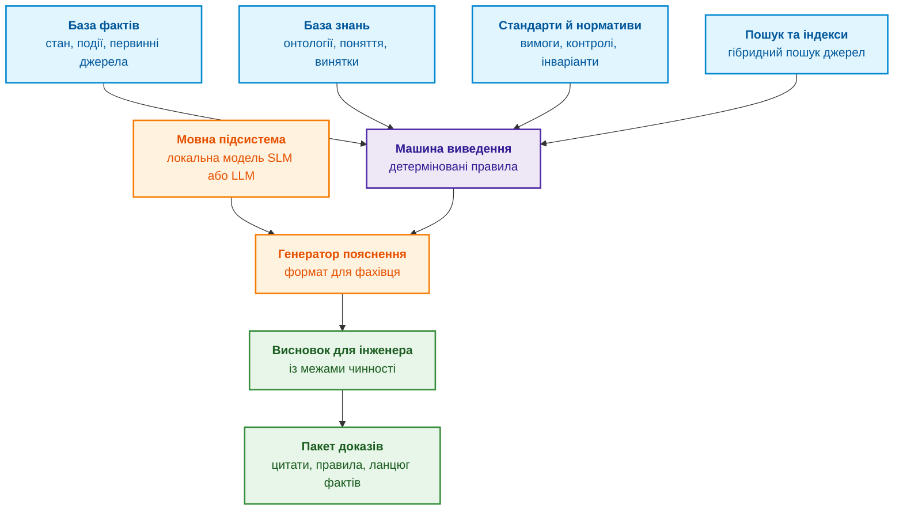
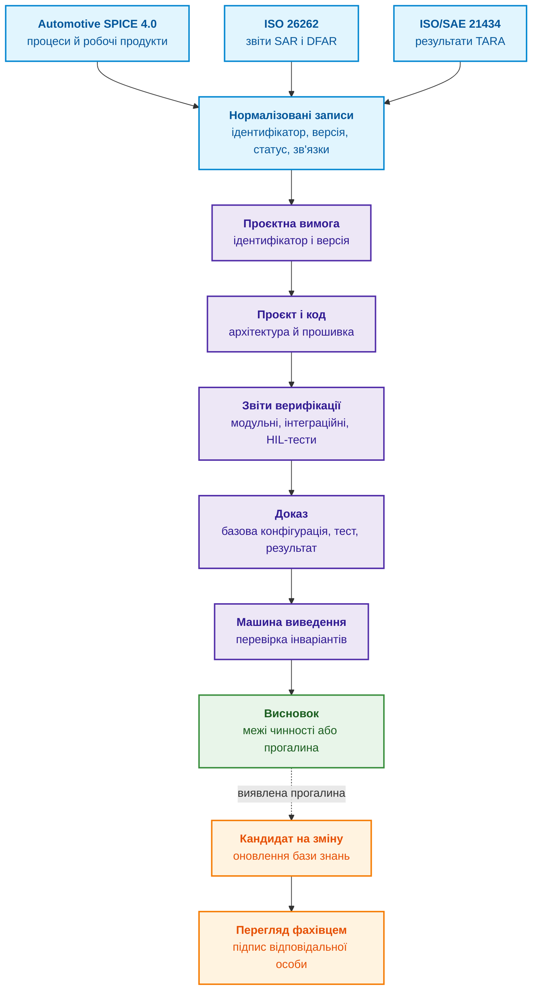
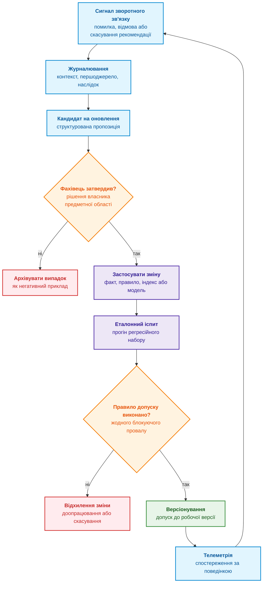
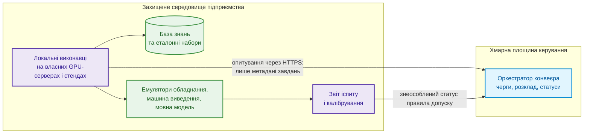

# Глава 25. Як навчати експертну систему: екзаменаційні матриці, аудит знань та контроль регресій

> **Книга:** [Архітектура доказових експертних систем](README.md) · [Частина V: Верифікація, діагностика та неперервне навчання](part-05-verification-and-learning.md)  
> **Попередня глава:** [Глава 24. Технічна діагностика: як не сплутати симптом із першопричиною в умовах неповноти](ch24-system-diagnosis.md)  
> **Наступна глава:** [Глава 26. Неперервне навчання (Continual Learning) на досвіді та подолання зсуву системного журналу](ch26-continual-learning.md)  
> **Зміст книги:** [README.md](README.md)  
> **Автор:** [Микола Федчик](about-the-author.md)  
> **Рівень:** середній і поглиблений: інженери зі знань, інженери машинного навчання, відповідальні за якість і випуск версій  
> **Очікувані результати:** визначати, у якому шарі експертної системи треба робити зміну; описувати версію експертної системи повним знімком залежностей; простежувати інженерний артефакт від вимоги до доказу; поширювати зміну вимоги й відкликання свідчення на похідні факти, індекси та висновки без перезаписування історії; будувати екзаменаційну матрицю й ділити дані без витоку між наборами; ухвалювати рішення про випуск парним порівнянням кандидата з чинною версією; перевіряти калібрування впевненості; обирати метод доналаштування мовної моделі й оцінювати потрібну пам'ять до запуску.

Нове правило в базі знань прибирає одну помилку й створює іншу. Новий словник синонімів поліпшує пошук за українськими термінами, але погіршує пошук за англомовними ідентифікаторами вимог. Донавчена мовна модель навчається охайно оформлювати відповідь, але не стає надійнішою у висновках. У кожному з цих випадків команда змінила експертну систему, але не може сказати, чи стала нова версія кращою за попередню і для яких запитів.

Ця глава відповідає на запитання: **як змінювати знання експертної системи, коли вимоги, продукти, правила й досвід змінюються, і водночас показати, що нова версія не гірша за попередню там, де помилка найдорожча?** Теза глави: **навчання експертної системи є керованим випуском версій. Кожна зміна має об'єкт (факт, правило, зв'язок трасування, налаштування пошуку або мовний компонент), джерело й межі чинності. До робочої версії зміна потрапляє лише після фахового перегляду, іспиту на незмінних випадках, перевірки калібрування й рішення за наперед оголошеним правилом допуску.**

Глава спирається на наскрізний приклад із розробки програмного забезпечення автомобільних електронних блоків керування, у якій працює автор. Процеси, приклади й числа ілюструють метод, а не описують сертифіковану процедуру. Рішення про випуск автомобільного продукту, його функційну безпеку й кібербезпеку ухвалюють відповідальні фахівці за галузевими стандартами, а експертна система лише готує для них перевірений матеріал.

У робочому використанні слово «навчання» приховує кілька різних відмов. Таблиця називає сім найчастіших і безпечну відповідь на кожну.

| Відмова | Як проявляється | Причина | Безпечне рішення |
| --- | --- | --- | --- |
| Хибний об'єкт зміни | донавчена мовна модель переконливіше формулює ту саму хибну відповідь | помилка була у факті, правилі, правах доступу або пошуку | спершу знайти етап, на якому виникла помилка, потім змінювати один керований компонент |
| Витік між навчальними й тестовими даними (*train/test leakage*) | метрика різко зростає, а якість у роботі ні | ревізії одного документа чи інциденту потрапили в різні набори | ділити дані за групою, часом і джерелом до будь-якого налаштування |
| Перенавчання на відкладеному наборі | кожна нова версія «поліпшує» той самий тест | тест багаторазово впливає на рішення розробників | окремі набори для розробки, калібрування, регресії та закритого підтвердження |
| Середнє приховує шкоду | середній показник зростає, а випадки безпеки погіршуються | різні ризики усереднено в одне число | правило допуску для кожного критичного зрізу й типу помилки |
| Змішані типи впевненості | косинусна схожість 0,9, вердикт правила й апостеріорна ймовірність 0,9 виглядають однаково | несумірні числа названо «впевненістю» | типізувати числа: ранг, калібрована ймовірність, детермінований вердикт, ступінь належності |
| Отруєння зворотним зв'язком | хибний висновок експертної системи стає наступною навчальною міткою | власний вихід або неперевірену реакцію користувача прийнято за істину | сигнал → кандидат → фахове рішення → ізольований іспит → випуск |
| Розбіжність версій | кандидата перевіряли на іншому графі, індексі чи шаблоні запиту, ніж випустили | компоненти не зафіксовано одним маніфестом | атомарний знімок усіх залежностей і відтворюваний прогін іспиту |

Сім відмов мають спільний корінь: зміну не прив'язано до конкретного об'єкта, перевірки й версії. Мета навчального циклу тому не «додати знання», а **зменшити конкретний виміряний ризик без неприйнятної регресії в інших частинах експертної системи**. Глава послідовно показує, з чого складається версія, які шари можна змінювати, з яких артефактів береться матеріал, як трасування підтверджує відповідність, як влаштовані іспит і правило допуску, що перевіряє калібрування, як обробляти зворотний зв'язок і коли справді потрібне доналаштування мовної моделі.

## Три окремі маршрути зміни

Слово «навчання» не означає, що для кожної правки потрібно доналаштовувати нейромережу. Спершу визначають об'єкт помилки й відповідну перевірку.

| Що змінюють | Потрібна перевірка | Що не є обов'язковим |
|---|---|---|
| факт, правило, виняток або зв'язок | походження, застосовність, конфлікти, позитивні й негативні випадки, відкликання похідного | навчання ваг мовної моделі |
| словник, фрагментацію, індекс або ранжування | відкладені запити, повноту й порядок результатів, чинність і доступ | нове предметне правило для кожного пошукового збою |
| параметри класифікатора або мовної моделі | поділ даних, цільову метрику, калібрування й забування | заміна символьного вердикту текстовою оцінкою моделі |

Для першого маршруту достатньо циклу зміни й відкликання, екзаменаційних випадків і рішення про випуск. Розділи про доналаштування моделей є окремою спеціалізацією. Калібрування ймовірностей потрібне там, де компонент справді видає ймовірнісну оцінку; детерміноване правило перевіряють поведінковими тестами, не оголошують його «ймовірністю 1».

## Життєвий цикл знань: від сигналу до версії

Життєвий цикл документа зазвичай описують часом зберігання: документ створили, поклали до архіву, згодом замінили новою редакцією. Для експертної системи такого опису замало, бо знання бере участь у висновках, і зміна знання змінює висновки. Тут **життєвим циклом знань** названо керований шлях від сигналу про потребу змін до нової перевіреної версії або до обґрунтованого відхилення кандидата. Це робоче визначення для змін в експертній системі, а не універсальна модель керування знаннями.

Визначення спирається на дві традиції. Мар'ям Алаві та Дороті Лайднер описують керування знаннями як сукупність процесів створення, зберігання й пошуку, передавання та застосування знань [[1]](#src-1). Руді Штудер, Річард Беньямінс і Дітер Фенсель розглядають інженерію знань як методичну побудову й супровід моделей знань, а не як одноразове наповнення сховища [[2]](#src-2). Цикл цієї глави адаптує обидва підходи до контрольованої зміни експертної системи й додає три кроки, яких немає в загальних моделях: іспит, калібрування й рішення про версію.

Щоб іспит був відтворюваним, версію експертної системи описують не ідентифікатором мовної моделі, а повним знімком залежностей:

```math
\mathcal{S}_v=(F_v,K_v,R_v,G_v,I_v,E_v,M_v,P_v,A_v,T_v).
```

- Склад версії $\mathcal{S}_v$: індекс $v$ позначає версію, а кожен складник із нижнім індексом $v$ належить цьому знімку;
- $F_v$ є фактами, $K_v$ є керованими об'єктами знань (поняттями, онтологіями й винятками), а $R_v$ є правилами;
- $G_v$ є графом зв'язків, $I_v$ є лексичними й векторними пошуковими індексами;
- $E_v$ є моделями векторного подання (*embedding*) і повторного ранжування (*reranking*), $M_v$ є мовними та іншими моделями машинного навчання;
- $P_v$ є шаблонами запитів до мовної моделі (*prompts*) і схемами виходу, $A_v$ є політиками доступу;
- $T_v$ є версіями інструментів і середовища виконання, а дужки збирають ці складники в один знімок версії.

Такий знімок означає, що кандидат на нову версію має бути явним перетворенням чинного знімка:

```math
\mathcal{S}_{v+1}^{\text{cand}}=\mathrm{Apply}(\mathcal{S}_v,\Delta).
```

- Для переходу $\mathcal{S}_{v+1}^{\text{cand}}$ є кандидатом на версію після $v$, а верхній індекс $\text{cand}$ означає «кандидат»;
- $\mathrm{Apply}$ застосовує зміну до знімка $\mathcal{S}_v$, а $\Delta$ є описом цієї зміни;
- $=$ означає, що кандидат утворюється саме застосуванням зміни, а не довільним набором компонентів.

Перетворення $\Delta$ має замикання залежностей. Заміна моделі векторного подання вимагає перебудувати векторний індекс, бо вектори старої моделі несумісні із запитами, закодованими новою моделлю. Зміна онтології може вимагати повторно вивести похідні факти й повторно перевірити обмеження графа. Одиницею випуску тому є не рядок, який редагував інженер, а все замикання зміни, зафіксоване маніфестом. Відомості про джерело зміни, виконане перетворення й відповідальну особу записують за моделлю походження PROV Консорціуму Всесвітньої павутини (*World Wide Web Consortium*, W3C), яка описує такі записи через сутності, діяльності та агентів [[3]](#src-3).

Схема показує, через які кроки проходить кандидат від сигналу до версії і звідки береться наступний сигнал.



Кожен блок схеми має власний вхід, дію й результат:

- **Сигнал** повідомляє про можливу потребу змін і нічого не доводить. Ним буває нова вимога, знайдений дефект, зауваження фахівця, невдалий висновок експертної системи або зміна умов застосування. Результат блоку: зареєстроване спостереження з посиланням на джерело й версію експертної системи, у якій воно виникло.
- **Кандидат на зміну** називає, який факт, зв'язок, правило, налаштування пошуку чи компонент треба змінити, чому, на підставі якого джерела й у яких межах. Результат: версійований кандидат, якого вже можна перевірити й відхилити.
- **Фаховий перегляд** виконує людина, компетентна саме в предметній області кандидата. Інженер вбудованого програмного забезпечення перевіряє реалізацію, фахівець із функційної безпеки перевіряє зв'язок із вимогою безпеки, фахівець із кібербезпеки перевіряє припущення про загрозу. Редакторське читання й автоматична перевірка формату фаховим переглядом не є.
- **Іспит** є повторюваним прогоном незмінних випадків з наперед відомими висновками, потрібними джерелами й очікуваними відмовами. Кандидата порівнюють із чинною версією на старих і прикордонних випадках, а не лише на випадку, який спричинив зміну.
- **Калібрування** перевіряє не правильність висновку, а відповідність заявленої впевненості фактичній частоті помилок. На цьому кроці встановлюють пороги: коли рекомендувати, коли просити перегляд фахівця, коли відмовитися від висновку.
- **Рішення про випуск** ухвалює власник зміни за наперед оголошеним правилом, зіставивши фаховий висновок, результати іспиту й калібрування, ризик і можливість відкату.
- **Нова версія знань** отримує ідентифікатор, склад змін, пов'язані джерела, результати перевірок, дату й власника. Таку версію можна однозначно відтворити й за потреби замінити попередньою.
- **Відхилений кандидат** зберігають разом із причиною відмови, використаними доказами й умовами повторного розгляду, щоб та сама хибна пропозиція не повернулася без нових даних.
- **Моніторинг застосування** спостерігає за прийнятою версією в робочих межах: помилками, правильними відмовами, новими типами запитів, зміною даних і наслідками рекомендацій. Моніторинг породжує новий сигнал, але не переписує знання автоматично.

Сигнал стає знанням лише після формалізації, фахового перегляду, іспиту, калібрування й рішення про випуск. Цикл, однак, ще не каже, яку саме частину експертної системи змінює кандидат. Щоб відповісти на це питання на живому матеріалі, потрібен наскрізний приклад.

## Наскрізний приклад: прошивка автомобільного блоку керування

Наскрізним прикладом глави є прошивка електронного блоку керування (*Electronic Control Unit*, ECU) автомобіля. Одна зміна такої прошивки торкається ревізії апаратної платформи, калібрувань, програмних вимог, архітектури, коду, базової конфігурації (*baseline*) і кількох рівнів перевірки. Якщо функція пов'язана з безпекою або захищеним оновленням, до того самого ланцюга додаються окремі докази функційної безпеки й кібербезпеки. На одному прикладі можна простежити всі шари навчання експертної системи й не підмінити процесний контроль твердженням про відповідність стандарту.

Три джерела вимог для такого блоку відіграють різні ролі:

- **Automotive SPICE 4.0** (*Software Process Improvement and Capability dEtermination*) є моделлю процесів і оцінювання їхньої спроможності, яку видає Центр менеджменту якості Асоціації автомобільної промисловості Німеччини (VDA QMC) [[4]](#src-4). Для програмного забезпечення ланцюг охоплює процеси SWE.1 (аналіз програмних вимог), SWE.2 (архітектурне проєктування), SWE.3 (детальне проєктування й створення програмних модулів), SWE.4 (верифікація модулів), SWE.5 (верифікація компонентів та інтеграції) і SWE.6 (верифікація програмного забезпечення). Керування конфігурацією, розв'язання проблем і керування запитами на зміну описують процеси SUP.8, SUP.9 і SUP.10.
- **ISO 26262-6:2018** визначає вимоги до розробки автомобільного програмного забезпечення в контексті функційної безпеки: специфікацію програмних вимог безпеки, архітектурне проєктування, проєктування й реалізацію модулів, їхню верифікацію, інтеграцію й тестування вбудованого програмного забезпечення [[5]](#src-5).
- **ISO/SAE 21434:2021** визначає інженерні вимоги до керування ризиками кібербезпеки електричних та електронних систем дорожніх транспортних засобів упродовж усього життєвого циклу, від концепції до виведення з експлуатації [[6]](#src-6).

Automotive SPICE не замінює ISO 26262 чи ISO/SAE 21434. Модель процесів оцінює, чи керовано команда отримує, узгоджує, реалізує й перевіряє робочі продукти, а стандарти безпеки визначають предметні обмеження й аргументи, які мають бути в цих продуктах. Для експертної системи це три пов'язані, але не взаємозамінні контексти знань. Наступний розділ показує, яку частину експертної системи може змінити кожен артефакт.

### Зміна вимоги й відкликання свідчення: чотири знімки знань

Лабораторія може відкликати звіт, на підставі якого експертна система вже видала відповідь. Оновити лише статус файла недостатньо: число зі звіту могло потрапити до канонічного факту, пошукового індексу, похідного висновку й кешу відповіді. Наскрізний приклад простежує цей шлях для однієї навчальної вимоги до часу відповіді діагностичної служби ECU. Пороги й ідентифікатори нижче синтетичні, не взяті з автомобільного стандарту. Висновок стосується одного критерію, а не дозволу випускати прошивку.

**Початковий знімок K17.** Власник вимоги погодив редакцію A навчальної специфікації: час відповіді не більше 100 мс. Звіт `REPORT-41` містить вимірювання 90 мс. Прив'язаний до звіту факт `FACT-41` зберігає число, одиницю, версію прошивки, ревізію плати, методику й умови вимірювання. Правило `RULE-TIME` порівнює вимірювання з чинною межею лише за придатності свідчення для запитаної конфігурації. Висновок у K17 має вердикт `PASS`, посилання на редакцію A, `FACT-41` і `REPORT-41`. Походження перетворення «звіт → факт → висновок» записують за моделлю PROV [[3]](#src-3).

**Нова редакція й знімок K18.** Власник вимоги погоджує редакцію B з межею 80 мс і явно вказує, що редакція B діє для нових оцінювань тієї самої перевірюваної конфігурації. Це інша підстава порівняння, а не нове вимірювання. Для прикладу припускаємо, що методика й умови вимірювання залишилися придатними: сирі 90 мс можна порівняти з новою межею. Правило `RULE-TIME` не змінюється, але новий параметр дає вердикт `FAIL`. Первинний звіт і старий висновок `PASS` не переписують; створюють новий висновок із посиланням на редакцію B. Якщо нова редакція змінила також методику або конфігурацію, повторне використання 90 мс потребувало б окремого обґрунтування або нового випробування.

**Відкликання й знімок K19.** Лабораторія встановлює помилку часової прив'язки запису та відкликає `REPORT-41`. Відповідальна особа реєструє причину й область відкликання. **Журнал відкликання** (*revocation log*) зберігає ідентифікатор свідчення, час рішення, автора, причину й зачеплені конфігурації. Граф залежностей приводить від звіту до `FACT-41` і двох висновків, отриманих на його основі. Число 90 мс лишається в архіві, але в поточному оцінюванні не є придатним свідченням. За відсутності іншого незалежного свідчення відповідь у K19 має вердикт `UNKNOWN`, тобто «немає придатного вимірювання». Відкликання не доводить ані проходження, ані порушення критерію. Підтримання обґрунтувань і альтернативні підстави висновку розглядає [Глава 16](ch16-expert-systems-architecture.md).

**Заміна свідчення й знімок K20.** Лабораторія проводить нове випробування й отримує 70 мс у звіті `REPORT-42`. Після перевірки конфігурації, методики, походження й фахового схвалення новий факт допускають до кандидата K20. Правило порівнює 70 мс із чинними 80 мс і повертає `PASS`. Якщо новий звіт ще не пройшов допуск, робоча відповідь залишається `UNKNOWN`. Таблиця розділяє чотири знімки й причини зміни відповіді.

| Знімок знань | Чинна межа | Придатне вимірювання | Вердикт критерію | Що змінило висновок |
|---|---|---|---|---|
| K17 | 100 мс, редакція A | 90 мс, `REPORT-41` | `PASS` | початкова підстава порівняння |
| K18 | 80 мс, редакція B | 90 мс, `REPORT-41` | `FAIL` | нова межа, а не нові дані |
| K19 | 80 мс, редакція B | немає: `REPORT-41` відкликано | `UNKNOWN` | втрачено підставу для числового висновку |
| K20 | 80 мс, редакція B | 70 мс, прийнятий `REPORT-42` | `PASS` | нове перевірене свідчення |

Різні відповіді не є довільною поведінкою експертної системи: кожна відповідь спирається на інший узгоджений набір підстав. Для проходження цих чотирьох станів потрібні зміни на кількох рівнях, які показує наступна таблиця.

| Артефакт | Дія після зміни або відкликання | Що зберігають для аудиту |
|---|---|---|
| Джерело | нова редакція специфікації або запис відкликання звіту | незмінні копії джерел, рішення, автор і час |
| Канонічний факт | нова версія межі або заборона використання `FACT-41` у поточному оцінюванні | значення, одиницю, цитату, конфігурацію й попередній статус |
| Правило й тести | перевірка залежних висновків, випадків 90 мс при двох межах і відсутнього свідчення | версію правила й результати регресії |
| Похідні подання й індекси | оновлення зачеплених записів та фільтрів чинності; відкликаний факт не стає доказом через пошук | покоління індексу й зв'язок із канонічними записами |
| Кеш відповіді | заборона повторного використання відповіді з непридатною підставою | ідентифікатор знімка й перелік залежностей кешованої відповіді |
| Опублікований висновок | новий висновок і сповіщення відповідальному власникові про зачеплені рішення | стару відповідь, її підстави й пізніше повідомлення про відкликання |

До збирання K19 служба відповідей уже має блокувати використання відкликаного звіту через оперативний реєстр заборон поза незмінним пакетом. Інакше час перебудови індексу стане періодом видачі відомо непридатних відповідей. Перевірка чинності виконується також при читанні кешу, а версію оперативного реєстру записують у маніфесті запуску відповіді з [Глави 23](ch23-knowledge-base-verification.md). Збирання й атомарне перемикання незмінних пакетів пояснює [Глава 32](ch32-high-performance-knowledge-packs-mmap-and-harvesting.md).

Наведена програма перевіряє лише числове рішення після перевірки придатності свідчення. Передумова прикладу: межа й вимірювання задані в мілісекундах, не від'ємні та належать до потрібної конфігурації; `evidence_active` є результатом перевірки статусу свідчення. Програма використовує лише стандартні засоби Python 3. Архів, граф залежностей, кеш, оперативний реєстр і фаховий допуск навмисно не реалізовано.

<details>
<summary>Виконувана перевірка чотирьох знімків знань</summary>

```python
def assess(snapshot, limit_ms, measured_ms, evidence_active):
    if limit_ms is None or measured_ms is None or not evidence_active:
        verdict = "UNKNOWN"
    elif measured_ms <= limit_ms:
        verdict = "PASS"
    else:
        verdict = "FAIL"
    return {"snapshot": snapshot, "verdict": verdict}


assert assess("K17", 100, 90, True)["verdict"] == "PASS"
assert assess("K18", 80, 90, True)["verdict"] == "FAIL"
assert assess("K19", 80, 90, False)["verdict"] == "UNKNOWN"
assert assess("K20", 80, 70, True)["verdict"] == "PASS"
assert assess("K19", 80, None, True)["verdict"] == "UNKNOWN"
```

</details>

У третьому виклику число 90 мс передано функції, але статус свідчення вже не дозволяє порівняння. Саме цей випадок відрізняє відкликання знання від простого зменшення числового порога. Додатковий тест відсутнього вимірювання перевіряє, що нестача даних не перетворюється на нуль мілісекунд і помилковий `PASS`.

Історичне відтворення K17 має інше призначення, ніж поточна відповідь. Аудитор може повторити старий розрахунок і побачити, чому було видано `PASS`, але інтерфейс повинен також показати пізніше відкликання `REPORT-41`. Відтворюваність пояснює походження старого рішення, а не доводить його предметної правильності. Відкат до K17 не може скасувати чинну оперативну заборону використання звіту. Приклад показав, як експертна система споживає версійовані знання й допомагає супроводжувати їх: знаходить залежні висновки, перевіряє нові підстави й пояснює втрату доказу. Наступний розділ узагальнює, до яких шарів експертної системи належать ці зміни.

## П'ять шарів, які можна поліпшувати

Коли експертна система дає хибний або неповний висновок, причину легко приписати мовній моделі. Тоді команда донавчає модель там, де треба оновити факт, виправити правило чи відновити розірваний зв'язок трасування, і отримує переконливіше сформульовану ту саму помилку. Перед створенням кандидата треба встановити **об'єкт навчання**: конкретний компонент або керований артефакт, поведінку якого команда хоче поліпшити.

Велика мовна модель (*Large Language Model*, LLM) або мала мовна модель (*Small Language Model*, SLM) є лише одним із таких компонентів. Мовна підсистема витягує структуру з тексту, класифікує фрагменти, інтерпретує запит і формує пояснення у визначеному форматі. База фактів зберігає стан і його походження, база знань містить поняття й правила, пошук добирає джерела, а зв'язки трасування поєднують вимогу з перевіркою й доказом. Жодної з цих ролей мовна модель не замінює. Схема показує, як шари сходяться у висновку для інженера.



Схема розділяє причини, які зовні виглядають як одна невдала відповідь. Якщо висновок не має джерела, перевіряють базу фактів і пошук. Якщо машина виведення не застосувала виняток, перевіряють базу знань і умови правила. Якщо експертна система не може показати виконання вимоги, власник відповідності перевіряє зв'язок вимоги з контрольною дією, результатом і доказом. Лише коли всі ці частини правильні, а відповідь плутає терміни, структуру чи ступінь категоричності, кандидатом на зміну стає мовна підсистема. Таблиця зводить п'ять шарів разом.

| Шар | Що в ньому навчається | Приклад зміни | Як перевірити |
| --- | --- | --- | --- |
| База фактів | точність опису стану й походження даних | додати тип артефакта, час спостереження, прибрати дубль | звірити факти з первинними документами |
| База знань | поняття, зв'язки, правила, винятки | додати підтверджений термін або правило | перевірити приклади, де правило має і не має спрацювати |
| Відповідність стандартам | зв'язок між вимогою та доказом | пов'язати пункт стандарту з контролем і критерієм приймання | простежити ланцюг від вимоги до результату |
| Пошук і пояснення | добір контексту й межі відповіді | змінити словник, профіль пошуку, поріг відмови | виміряти якість видачі й правильність відмов |
| Мовна підсистема SLM або LLM | інтерпретація запиту, термінологія домену, структура відповіді, формулювання пояснення й відмови | донавчити адаптер на перевірених діалогах із посиланнями на джерела | порівняти відповіді, цитування, структуру й правильність відмов на окремому еталонному наборі |

У кожного шару власний механізм навчання, тому одна скарга користувача може привести до п'яти різних змін.

**База фактів навчається через контрольоване виправлення стану.** Сигналом буває новий результат вимірювання, змінений статус вимоги або розбіжність із первинним документом. Новий запис не перезаписує старий мовчки: запис отримує джерело, час, автора, межі чинності й зв'язок із попередньою версією за моделлю PROV [[3]](#src-3). Цей шар не виводить правил з одиничного спостереження, бо завдання бази фактів полягає в точному описі відомого стану. Для ECU фактом є комбінація версії прошивки, ревізії плати, набору калібрувань, варіанта кодування, версії завантажувача (*bootloader*) і результату тесту на конкретному стенді. Результат, отриманий на іншій ревізії плати або з іншою калібрувальною базою, не можна непомітно перенести на поточну конфігурацію виробу.

**База знань навчається через зміну понять, зв'язків, правил і винятків.** Така зміна потрібна, коли факти вже правильні, але експертна система не знає нового терміна, не бачить зв'язку між сутностями або застосовує правило без важливого винятку. Інженер зі знань формулює кандидата явно, перевіряє правило на позитивних і негативних прикладах та шукає конфлікти з чинними правилами, як описує інженерія знань у Штудера та співавторів [[2]](#src-2). Перевірений факт може стати підставою для кандидата, але не перетворюється на загальне правило без фахового обґрунтування. Один тайм-аут діагностичного сеансу ще не доводить загального правила. Після аналізу вимоги, архітектури й серії відтворюваних тестів інженер може сформулювати вужчий кандидат: для визначеного стану ECU, типу сеансу й версії прошивки втрата зв'язку має запустити конкретний перехід стану, запис події й безпечне завершення операції.

**Шар відповідності стандартам навчається через відновлення трасування.** Нова редакція стандарту, змінений контроль або відсутній доказ створюють кандидата на ланцюг «вимога → контрольна дія → критерій → результат → доказ». Фахівець спершу перевіряє редакцію документа й межі його застосування, а потім проходить ланцюг в обидва боки. Сам текст стандарту не навчає експертну систему відповідності: без контрольної дії та доказу текст лишається джерелом вимоги, а не підтвердженням її виконання. Для Automotive SPICE ланцюг веде від вимоги SWE.1 через архітектуру SWE.2 і реалізацію SWE.3 до результатів SWE.4, SWE.5 і SWE.6. Для ISO 26262 додається зв'язок із програмною вимогою безпеки та її верифікацією. Для ISO/SAE 21434 додається походження вимоги від сценарію загрози або цілі кібербезпеки до доказу перевірки. Наявність одного з цих ланцюгів не доводить повноти двох інших.

**Пошук і пояснення навчаються на контрольних запитах і відомих невдачах.** Для запиту фіксують релевантні джерела, неприйнятні збіги, достатній контекст і випадки, де правильною відповіддю є відмова. Після цього команда змінює словник, індекс, повторне ранжування, поріг пошуку або шаблон пояснення й порівнює результат на відкладеному наборі запитів. Шахул Ес, Джитін Джеймс, Луїс Еспіноса-Анке та Стівен Шокарт у підході Ragas окремо оцінюють, чи знайшов пошук релевантний контекст, чи спирається відповідь на цей контекст і якою є сама генерація [[7]](#src-7). Таке розділення не дає гарному формулюванню приховати пропущене джерело. Автомобільний запит часто містить точні позначення: ідентифікатор програмної вимоги, діагностичний код несправності (*Diagnostic Trouble Code*, DTC), ідентифікатор діагностичної служби, назву програмної функції архітектури AUTOSAR (*AUTomotive Open System ARchitecture*), ідентифікатор тесту або версію ECU. Пошук має спершу знайти точний об'єкт і його чинну ревізію, а вже потім семантично близькі матеріали. Відповідь про іншу платформу чи застарілу базову конфігурацію буває змістовно схожою, але інженерно хибною.

**Мовна підсистема навчається на перевірених прикладах мовної поведінки.** Матеріалом є пари «запит → відповідь», приклади правильного цитування, структуровані висновки й правильні відмови. Донавчання потрібне, коли факти, правила й знайдені джерела правильні, але мовна підсистема плутає термінологію, формат або ступінь категоричності. Для навчального набору фіксують джерело, право використання, версію, спосіб очищення й параметри донавчання, як пропонують Тімніт Гебру та співавтори в паспортах наборів даних (*Datasheets for Datasets*) [[8]](#src-8). Ваги моделі можуть поліпшити подання висновку, але не стають джерелом факту чи доказом. У проєкті прошивки мовна підсистема може навчитися розрізняти ціль безпеки, програмну вимогу безпеки, ціль кібербезпеки, програмну вимогу, звіт про проблему й запит на зміну, повертати їхні ідентифікатори в заданій структурі й явно повідомляти про відсутній зв'язок із доказом. Мовна підсистема не має права заявляти про відповідність стандарту лише тому, що правильно вживає терміни Automotive SPICE чи ISO.

> **З практики автора.** У прототипі системи здобуття знань, який розвиває автор, вимірювані поліпшення поки давали насамперед детермінований первинний розбір запитів, облік походження, фільтри за метаданими, гібридний пошук (лексичний за функцією ранжування BM25 разом із векторним) та окремий компактний класифікатор, а не донавчання мовної моделі. Автоматичного допуску змін знань чи моделі до робочої версії в прототипі немає, а незалежно розмічений підтверджувальний набір ще треба розширювати. Тому цикл, описаний у главі, є цільовим процесом із перевіркою на іспиті, а не звітом про вже замкнене самонавчання.

Навчання експертної системи починається з визначення шару, де виникла проблема. Донавчання мовної моделі поліпшує розуміння запиту, термінологію, структуру діалогу, пояснення й дисципліну відмов, але не виправляє неповного факту чи помилкового правила. Визначити шар ще недостатньо: треба встановити, з якого результату роботи проєкту походить новий факт, правило чи навчальний приклад і чи можна цьому джерелу довіряти.

## Матеріал для навчання: результати роботи проєкту

У проєкті поруч існують затверджена вимога, чернетка, результат випробування, непереглянута зміна коду, застаріла схема й повідомлення з робочого чату. Якщо перенести їх у базу знань без перевірки статусу й походження, експертна система почне спиратися на тимчасові або непридатні для конкретного виробу відомості. Для навчання тому важить не обсяг тексту, а тип результату роботи, його версія, авторство й межі застосування. Як інвентаризувати, очистити й класифікувати такі артефакти, розглядає [Глава 10](ch10-knowledge-acquisition-systems.md). Тут ідеться про наступний крок: за яких умов перевірений результат роботи може змінити факт, правило, зв'язок трасування чи інший компонент експертної системи.

Це однаково стосується програмних, системних і апаратних дослідно-конструкторських проєктів (*Research and Development*, R&D). У розробці програмного забезпечення головним джерелом є вихідний код, а в системних та апаратних проєктах ту саму роль відіграють системні моделі, схеми, конструкторські дані, прототипи, вимірювання й виробничі докази. Таблиця показує, чого експертна система може навчитися з кожного типу артефакта і що треба зберегти разом із ним.

| Результат роботи проєкту | Чого може навчитися експертна система | Що зберегти разом із результатом |
| --- | --- | --- |
| Вимоги, стандарти, регламенти й базові конфігурації | поняття, обмеження, критерії приймання, правила відповідності | ідентифікатор, версію, власника, статус, межі чинності |
| Архітектурні та системні моделі, інтерфейси, симуляції | стани, потоки, межі компонентів, припущення, допустимі сценарії | версію моделі, параметри, сценарій, межі валідності, результат симуляції |
| Вихідний код, конфігурації, інфраструктура як код | факти про реалізацію, залежності, інтерфейси, обмеження конфігурації | репозиторій, базову конфігурацію, ревізію, шлях або символ, результат перегляду коду |
| Схеми, описи мовами опису апаратури (*Hardware Description Language*, HDL), друковані плати, специфікації компонентів (*Bill of Materials*, BOM) | електричні й логічні з'єднання, параметри компонентів, обмеження конструкції | ревізію, артикул, версію специфікації, партію або серійний номер, погодження зміни |
| Моделі систем автоматизованого проєктування (*Computer-Aided Design*, CAD), креслення, допуски | геометричні й матеріальні обмеження, склад збірки, режими застосування | ревізію моделі чи креслення, одиниці вимірювання, допуск, матеріал, варіант виробу |
| Тести, лабораторні вимірювання, прототипи, кваліфікаційні випробування | фактичні межі роботи, повторювані відмови, кандидати на пороги й правила ризику | методику, прилад і його калібрування, стенд, середовище, ідентифікатор прототипу, сирі дані, протокол |
| Виробничий контроль, дані постачальників, дефекти й зміни | тенденції невідповідностей, причини відбракування, винятки, коригувальні дії | партію, постачальника, контрольний план, результат інспекції, статус, застосовність |
| Аудити, контрольні точки випуску, підтвердження фахівців | прогалини доказів, правила готовності, пріоритет перегляду, підтверджені винятки | відповідальну роль, дату, рішення, обґрунтування, пов'язані вимоги й докази |

Для прошивки ECU таблиця перетворюється на конкретний набір взаємопов'язаних робочих продуктів. SWE.1 дає програмні вимоги й критерії перевірки, SWE.2 дає компоненти, інтерфейси, поведінку й розподіл вимог, SWE.3 пов'язує детальний проєкт із програмними модулями й вихідним кодом. SWE.4 дає результати верифікації окремих модулів, SWE.5 перевіряє компоненти та їхню інтеграцію, SWE.6 перевіряє інтегроване програмне забезпечення проти програмних вимог. Базова конфігурація з SUP.8, звіт про проблему з SUP.9 і запит на зміну з SUP.10 пояснюють, для якої версії доказ чинний і чому версія змінилася.

До процесного каркаса додаються предметні артефакти. У контексті функційної безпеки це програмні вимоги безпеки, звіт з аналізу безпеки (*Safety Analysis Report*, SAR), звіт з аналізу залежних відмов (*Dependent Failure Analysis Report*, DFAR), результати статичного аналізу, модульної та інтеграційної верифікації і зв'язки з аргументом безпеки. У контексті кібербезпеки це результати аналізу загроз та оцінювання ризиків (*Threat Analysis and Risk Assessment*, TARA), цілі кібербезпеки, вимоги до автентичності оновлення, цілісності, авторизації й захисту від відкату версії, а також результати негативних тестів, фазингу й тестування на проникнення. Експертна система має навчатися не словам із цих документів, а перевіреним зв'язкам між їхніми версіями, рішеннями й результатами.

Код, опис мовою HDL, схема, CAD-модель чи одиничне вимірювання не є «тренувальним текстом», який можна безконтрольно запам'ятати. Кожен такий артефакт є кандидатом на зміну факту, правила, порогу або зв'язку трасування. Один лабораторний результат не доводить властивості виробу, доки не відомі методика, калібрування приладу, конфігурація стенда, умови середовища, партія чи прототип, повторюваність і критерій приймання.

Навчання починається з перетворення результату роботи на контрольований запис із походженням і межами застосування. Чернетка вимоги, непереглянута гілка коду, сирий журнал безперервної інтеграції (*Continuous Integration*, CI) або текст мовної моделі можуть підказати, де шукати проблему, але фактом чи доказом автоматично не стають. Окремої перевірки потребують твердження про відповідність стандартам: тут надійного джерела ще недостатньо, потрібен повний зв'язок від вимоги до доказу.

## Як трасування підтверджує відповідність стандартам

Поширена помилка полягає в спробі навчити базу знань «знати стандарт». Текст стандарту сам по собі не створює перевірки. Інженерному висновку потрібен ланцюг, який можна пройти в обидва боки: від вимоги до доказу і від доказу до вимоги, яку доказ підтримує. Automotive SPICE 4.0 прямо вимагає такої двобічної простежуваності: серед очікуваних результатів процесу SWE.1 названо узгодженість і двобічну простежуваність між програмними та системними вимогами [[4]](#src-4). Процеси інженерії вимог і склад інформаційних продуктів, які ці процеси створюють, визначає ISO/IEC/IEEE 29148 [[9]](#src-9). Конкретний склад доказового ланцюга, однак, залежить від домену й процедури перевірки.

У розробці автомобільного програмного забезпечення такими джерелами часто є TARA, SAR і DFAR. Документи відповідають на різні питання:

- **TARA** визначає активи, сценарії шкоди й загроз, оцінює вплив і здійсненність атаки та обґрунтовує рішення щодо обробки ризику й цілі кібербезпеки. Команда зберігає результати TARA в таблиці, моделі або звіті. Для розробника прошивки ці результати стають джерелом вимог до автентичності, цілісності, авторизації, захисту криптографічних ключів, журналювання й безпечного оновлення.
- **SAR** фіксує межі, припущення, метод і результати одного або кількох аналізів безпеки: аналізу видів і наслідків відмов (*Failure Mode and Effects Analysis*, FMEA), аналізу дерева відмов (*Fault Tree Analysis*, FTA) чи аналізу видів, наслідків і діагностичного охоплення відмов (*Failure Modes, Effects, and Diagnostic Analysis*, FMEDA). У програмному проєкті SAR пояснює, які відмови й небезпечні наслідки мають попереджати або виявляти програмні механізми, і пов'язує висновки аналізу з цілями безпеки, вимогами й перевірками.
- **DFAR** документує залежні відмови: спільну причину, каскадне поширення, спільний режим відмови. Аналіз залежних відмов належить до аналізів, вимоги до яких визначає ISO 26262-9:2018 [[10]](#src-10). Для прошивки DFAR перевіряє припущення про незалежність: чи не використовують основний і резервний механізми той самий тактовий сигнал, ділянку пам'яті, драйвер, комунікаційний стек, домен живлення або інший спільний ресурс, здатний вивести з ладу обидва канали.

### Як експертна система використовує таблиці TARA, SAR і DFAR

Файл TARA, SAR чи DFAR не є окремим «модулем безпеки» всередині експертної системи. Файл є первинним джерелом, з якого засіб імпорту переносить перевірені рядки й зв'язки до керованих компонентів знань. База фактів зберігає значення полів разом з ідентифікатором рядка, версією документа, статусом перегляду, конфігурацією виробу й посиланням на оригінал. База знань визначає типи сутностей і допустимі зв'язки між ними. Шар трасування з'єднує результати аналізу з вимогами, архітектурою, реалізацією й тестами. Машина виведення застосовує до цього графа явні правила достатності, суперечності й прогалин, а машина пояснення перетворює результат на відповідь із посиланнями на конкретні рядки й версії.

Перед завантаженням таблицю нормалізують. Назви колонок проєктного шаблону зіставляють із поняттями бази знань, посилання на вимоги й тести перетворюють на стійкі ідентифікатори, статуси й версії перевіряють. Рядок без власника, чинної версії або однозначного об'єкта аналізу може лишатися доступним для пошуку, але не бере участі в доказовому висновку. Так експертна система не плутає текстову схожість із підтвердженим інженерним зв'язком. Зіставлення локальних колонок із типами сутностей і правилами фіксують у керованому словнику імпорту: зміна шаблону постачальника тоді не змінює семантики знань непомітно, бо нове зіставлення проходить перевірку й версіонування до участі його записів у висновках.

| Джерело | Що потрапляє до компонентів знань | Як машина виведення це використовує |
| --- | --- | --- |
| TARA | актив, сценарій шкоди, сценарій загрози, оцінка ризику, рішення щодо ризику, ціль кібербезпеки та їхні ідентифікатори | перевіряє, чи кожна прийнята до обробки загроза має пов'язану ціль, вимогу, реалізацію й результат перевірки; за розриву формує висновок про прогалину, а не про виконаний контроль |
| SAR | об'єкт і метод аналізу, припущення, відмова або небезпечний наслідок, ціль безпеки, вимога, рекомендована дія, статус | перевіряє, чи висновок аналізу враховано у вимогах та архітектурі й чи існує чинний доказ верифікації для потрібної конфігурації |
| DFAR | ініціатор залежної відмови, чинник зв'язку (*coupling factor*), спільний ресурс, уражені елементи, заявлена незалежність, захисний захід, залишковий ризик, тест | шукає спільні причини між елементами, зіставляє їх із захисними заходами й позначає твердження про незалежність непідтвердженим, якщо захисного заходу чи його перевірки немає |

Правила виведення мають бути вужчими за зміст документа. Одне правило може стверджувати: якщо чинний рядок TARA вимагає обробити сценарій загрози, але від цього рядка немає шляху до програмної вимоги й успішного тесту для чинної базової конфігурації, доказовий ланцюг неповний. Інше правило знаходить у DFAR два нібито незалежні механізми зі спільним драйвером флеш-пам'яті й вимагає підтвердженого захисного заходу. Це правила про повноту й узгодженість відомих проєктних артефактів. Ці правила не дають експертній системі права самостійно оголосити виріб безпечним або захищеним.

На запит «чи достатньо доказів для оновлення прошивки ECU версії X?» експертна система спершу обмежує пошук цією конфігурацією, потім будує шляхи від TARA, SAR і DFAR до вимог, проєкту й тестів, застосовує правила й повертає один із чотирьох контрольованих результатів: ланцюг підтверджено в заданих межах, знайдено конкретну прогалину, виявлено суперечність або даних недостатньо для висновку. Відповідь називає правило, базову конфігурацію й рядки таблиць, на яких ця відповідь ґрунтується. Схема показує, де артефакти входять до експертної системи і як доходять до висновку.



Верхня частина схеми перетворює документи на структуровані знання, середня утворює доказовий ланцюг, нижня відокремлює правило машини виведення від сформованого висновку. Позначка HIL (*Hardware-in-the-Loop*) у схемі означає тести, у яких реальний блок керування працює на стенді зі змодельованим оточенням. Якщо правило знаходить прогалину, прогалина стає кандидатом на зміну лише після прив'язки до конкретного факту, правила чи зв'язку й перегляду фахівцем.

Розглянемо оновлення прошивки ECU. Програмна вимога може вимагати перевіряти автентичність і цілісність пакета, забороняти недозволений відкат версії й повертати ECU до визначеного стану після перерваного оновлення. У процесній проєкції експертна система проходить від вимоги SWE.1 до компонента завантажувача в SWE.2, детального проєкту й коду в SWE.3, а потім до результатів SWE.4, SWE.5 і SWE.6. Базову конфігурацію прошивки, конфігураційних даних і тестових засобів однозначно визначає керування конфігурацією.

У TARA активом є механізм оновлення, сценарієм шкоди є втрата керованості функцією через виконання підміненої прошивки, а сценарієм загрози є встановлення пакета без належної авторизації. Рішення про обробку ризику й ціль кібербезпеки переходять у вимоги до перевірки підпису, захисту від відкату й керування ключами, далі в проєкт завантажувача, код і негативні тести. Запис TARA обґрунтовує походження вимоги, але не доводить, що контроль реалізовано. Якщо збій оновлення може вплинути на функцію, пов'язану з безпекою, SAR фіксує небезпечний наслідок, припущення, програмну вимогу безпеки, передбачену безпечну реакцію й потрібну верифікацію. DFAR додає перевірку залежностей: основний образ прошивки й образ відновлення не є незалежними, якщо обидва покладаються на той самий пошкоджений драйвер флеш-пам'яті або спільну ділянку пам'яті. Такий висновок має привести до архітектурної вимоги, захисного механізму й тесту з внесенням відмови, а не залишитися абзацом у звіті.

Машина виведення встановлює, яке правило спрацювало і в якому стані ланцюг: підтверджений у заданих межах, неповний, суперечливий або недостатній для висновку. Машина пояснення показує використані зв'язки, версії артефактів, результати тестів і причину стану. Якщо немає тесту відновлення після втрати живлення, експертна система називає саме цю прогалину, а не пише «ймовірно виконано». Мовна підсистема формулює відповідь, але не змінює результату правила. Трасування перетворює вимоги процесу й стандартів на перевірювані ланцюги, але не доводить, що нова версія експертної системи зберегла ці ланцюги в усіх критичних випадках. Для цього потрібен повторюваний іспит.

## Іспит важливіший за враження

Нова версія добре виглядає на кількох підібраних демонстраціях і водночас втрачає важливий виняток або перестає відмовлятися за нестачі доказів. Без незмінної вибірки з відомими очікуваними результатами неможливо відрізнити справжнє поліпшення від вдало підібраного прикладу.

Невеликий еталонний набір (*gold set*) корисний як швидкий регресійний тест, якщо представляє відомі ризики домену. Але 20–30 випадків не доводять узагальнення, калібрування чи низької частоти рідкісної небезпечної помилки. Якщо на $n=30$ незалежних випадках не сталося жодної відмови, наближена однобічна 95-відсоткова верхня межа частоти відмов за «правилом трьох», яке пояснили Джеймс Ганлі та Еббі Ліпман-Генд [[11]](#src-11), дорівнює

```math
p_{\text{відмови}}\lesssim\frac{3}{n}=\frac{3}{30}=0{,}10.
```

- У правилі трьох $p_{\text{відмови}}$ є наближеною верхньою межею частоти відмов;
- $n$ є кількістю незалежних перевірених випадків, тут $n=30$, а чисельник 3 відповідає наближенню для нульових спостережених відмов;
- $\lesssim$ означає «приблизно не перевищує», $=$ позначає рівність, а $0{,}10$ є часткою 10 %;
- Оцінка стосується приблизної однобічної 95-відсоткової межі за умови незалежності випадків і відсутності відмов у вибірці.

Точна межа з рівняння $(1-p)^n=0{,}05$ дає $1-0{,}05^{1/30}\approx0{,}095$. Тобто тридцять безвідмовних випадків сумісні з частотою відмов близько 10 %. Щоб із нуля відмов отримати верхню межу 1 %, потрібно близько трьохсот незалежних випадків. Невеликий еталонний набір є добрим сигналом для наступного етапу, але не твердженням про безпеку. Розмір підтверджувального набору планують за прийнятною похибкою, очікуваною частотою подій, потрібною чутливістю тесту й окремими критичними зрізами.

### Ролі наборів даних

Один «тестовий набір» ділять за ролями, бо кожне використання даних впливає на наступні рішення.

| Набір | Для чого використовують | Чого з ним не можна робити |
| --- | --- | --- |
| Навчальний | оновлення ваг, правил, словника, навчання моделі повторного ранжування | оцінювати ним фінальну якість |
| Розробницький | аналіз помилок, проєктування правил і шаблонів, вибір гіперпараметрів | називати його незалежним підтвердженням |
| Калібрувальний | підбір температури, порогів і політики покриття | обирати архітектуру після перегляду його результатів |
| Еталонний регресійний | стабільні відомі інциденти, інваріанти, блокуючі випадки | покладатися лише на нього для нових класів відмов |
| Закритий підтверджувальний (*sealed confirmation*) | рідкісне незалежне рішення про випуск | багаторазово підлаштовувати кандидата під його результати |
| Тіньовий і канарковий запуск (*shadow/canary*) | перевірка на робочому розподілі запитів, затримки, дрейфу, інцидентів політики | автоматично перетворювати реакції користувачів на істину |

Під час тіньового запуску кандидат отримує копію робочих запитів, але його відповіді не бачать користувачі. Під час канаркового запуску кандидат обслуговує малу частку користувачів під посиленим моніторингом. До наборів включають не лише прості запити з відомими відповідями, а й неоднозначні формулювання, рідкісні терміни, багатомовні позначення, суперечливі джерела й питання, на які експертна система має відмовитися відповідати.

Дані ділять **до** будь-якого налаштування і не на рівні випадкового рядка. Якщо вимога `REQ-42 v1.1` потрапила в навчальний набір, а майже тотожна `REQ-42 v1.2` у тестовий, модель бачила відповідь під іншою ревізією. Тому в одну групу об'єднують усі фрагменти, переклади, ревізії, похідні пари «питання → відповідь» і випадки одного джерела. Для прогнозу майбутніх змін ділять за часом, для перевірки перенесення відкладають цілу лінійку продуктів, постачальника, варіант ECU або проєкт. У scikit-learn такий поділ підтримують `GroupKFold`, `StratifiedGroupKFold`, `LeaveOneGroupOut` і `TimeSeriesSplit` [[12]](#src-12). Засіб виконує поділ лише за переданим ідентифікатором групи або порядком часу; яка група відповідає одному документу, інциденту чи ревізії, визначає власник даних. Після поділу шукають точні збіги, наближені дублікати й векторно схожі пари між наборами, а найближчі пари переглядають вручну. Кетрін Лі та співавтори показали, що стандартні набори даних для мовних моделей містять багато наближених дублікатів, а перетин навчальних і валідаційних даних зачіпає понад 4 % валідаційних наборів, що завищує оцінки якості [[13]](#src-13). Автоматична дедуплікація допомагає, але не доводить відсутності смислового витоку.

Якщо закритий набір використали для діагностики й виправлення, набір уже вплинув на розробку: його переводять у регресійні, а для наступного незалежного рішення резервують нові випадки. Інакше команда поступово навчається складати іспит, а не поліпшувати експертну систему.

### Екзаменаційна матриця

Один і той самий випадок перевіряє кілька властивостей: чи знайдено потрібне джерело, чи спрацювало правильне правило, чи побудовано ланцюг до доказу, чи не суперечить пояснення фактам, чи відмовляється експертна система за нестачі доказів, чи не зіпсувала нова версія старих випадків. Результати іспиту тому зручно подавати **екзаменаційною матрицею**: рядки є класами випадків, стовпці є властивостями, які перевіряють. Для оновлення прошивки ECU матриця може мати такий вигляд.

| Клас випадків | Потрібне джерело | Правило | Ланцюг вимога → доказ | Очікуваний вихід |
| --- | --- | --- | --- | --- |
| Успішне оновлення, чинна базова конфігурація | вимога SWE.1, звіт SWE.6 | достатність доказів | повний | «підтверджено в межах конфігурації» |
| Пакет із неправильним підписом | вимога автентичності, негативний тест | відхилення пакета | повний | «оновлення має бути відхилено» |
| Заборонений відкат версії | вимога захисту від відкату, рядок TARA | монотонність версій | повний | «відкат заборонено» |
| Втрата живлення під час запису | вимога відновлення, рядок SAR | безпечний стан | неповний, бракує тесту | «прогалина: немає тесту відновлення» |
| Доказ для іншої ревізії плати | звіт тесту іншої ревізії | збіг конфігурації | розірваний | «доказ не чинний для цієї конфігурації» |
| Немає підтвердженої базової конфігурації | жодного | правило відмови | відсутній | відмова з поясненням |

Кожну клітинку оцінюють окремо, і для кожного рядка порівнюють кандидата з чинною версією. Правильний підсумок із неправильним джерелом є провалом пошуку, а не успіхом. Правильна відмова на останньому рядку важить не менше за правильне підтвердження на першому.

Властивості матриці не стискають в одну «точність». Для бінарного вердикту або схеми «один клас проти решти» рахують

```math
\mathrm{Precision}=\frac{TP}{TP+FP},
\qquad
\mathrm{Recall}=\frac{TP}{TP+FN}.
```

- У цих частках $TP$ є кількістю істинно позитивних вердиктів, $FP$ є кількістю хибно позитивних, а $FN$ є кількістю хибно негативних;
- $\mathrm{Precision}$ є часткою правильних позитивних серед усіх позитивних відповідей, а $\mathrm{Recall}$ є часткою знайдених позитивних серед усіх належних до позитивного класу;
- Знак $+$ додає кількості у знаменниках, а обидві метрики лежать від 0 до 1, якщо відповідний знаменник не нульовий.

Ілюстративний приклад з умовними числами: за $`TP=8`$, $`FP=2`$ і $`FN=2`$ точність дорівнює $`8/(8+2)=0{,}8`$, а повнота дорівнює $`8/(8+2)=0{,}8`$.

```math
F_\beta=(1+\beta^2)\,
\frac{\mathrm{Precision}\cdot\mathrm{Recall}}
{\beta^2\,\mathrm{Precision}+\mathrm{Recall}}.
```

- Для $F_\beta$ параметр $\beta$ задає вагу повноти відносно точності; $\beta>1$ надає повноті більшу вагу;
- $\mathrm{Precision}$ є точністю позитивних вердиктів, $\mathrm{Recall}$ є повнотою позитивного класу, а $\cdot$ означає множення;
- $F_\beta$ є їхнім зваженим гармонічним середнім і має діапазон від 0 до 1, якщо формула визначена.

Для тих самих умовних значень і $\beta=1$ отримуємо $`F_1=2\cdot0{,}8\cdot0{,}8/(0{,}8+0{,}8)=0{,}8`$. Це ілюстративний розрахунок, а не результат тестування експертної системи.

Якщо пропуск критичної вимоги дорожчий за зайву ескалацію, $\beta>1$ збільшує вагу повноти, але не скасовує окремого блокуючого правила для відомих випадків безпеки. Для пошуку з множиною релевантних доказів $G_q$ запиту $q$ рахують повноту серед перших $k$ результатів:

```math
\mathrm{Recall@}k=
\frac{1}{|Q|}\sum_{q\in Q}
\frac{|G_q\cap\mathrm{Top}_k(q)|}{|G_q|}.
```

- Для пошуку $\mathrm{Recall@}k$ є середньою часткою релевантних доказів, знайдених серед перших $k$ результатів;
- $Q$ є множиною запитів, $|Q|$ є її розміром, а $q$ перебирає запити;
- $G_q$ є множиною всіх релевантних доказів для запиту $q$, а $\mathrm{Top}_k(q)$ є першими $k$ результатами пошуку;
- $\cap$ означає перетин, вертикальні риски навколо множини означають кількість її елементів, а $\sum$ усереднює частки за запитами;
- Значення лежить від 0 до 1; для запиту без жодного релевантного доказу знаменник нульовий, тому такий випадок потребує окремої політики оцінювання.

Ілюстративний приклад: якщо для одного запиту є три релевантні докази й перші $k$ результатів містять два з них, то $`Recall@k=2/3\approx0{,}667`$.

Окремо вимірюють якість ранжування нормалізованим дисконтованим сукупним виграшем (nDCG) і середнім оберненим рангом (MRR), які описує [Глава 16](ch16-expert-systems-architecture.md), точний збіг ідентифікаторів, знаходження чинної ревізії, витік через списки керування доступом (*Access Control List*, ACL) і частку тверджень, підтриманих точним фрагментом доказу. Висока повнота серед перших $k$ не компенсує цитування застарілої базової конфігурації.

### Правило допуску: кандидат проти чинної версії

Порівняння має бути парним: ті самі випадки запускають на $`\mathcal{S}_v`$ і $`\mathcal{S}_{v+1}^{\text{cand}}`$, а для стохастичної генерації фіксують параметри декодування й повторюють запуск із кількома зернами генератора випадкових чисел. Для метрики $m$ на зрізі $s$ різниця дорівнює

```math
\Delta_{m,s}=
m(\mathcal{S}_{v+1}^{\text{cand}},s)
-m(\mathcal{S}_v,s).
```

- У цій різниці $m$ є вимірюваною метрикою, а $s$ є зрізом тестових випадків;
- $\mathcal{S}_{v+1}^{\text{cand}}$ є кандидатом на нову версію, а $\mathcal{S}_v$ є чинною версією;
- $\Delta_{m,s}$ є зміною метрики для зрізу $s$, знак мінус означає віднімання результату чинної версії від результату кандидата.

Наприклад, якщо кандидат має умовну повноту 0,92, а чинна версія 0,90, різниця дорівнює $`0{,}92-0{,}90=0{,}02`$, тобто поліпшенню на 2 відсоткові пункти.

Заздалегідь оголошене правило допуску може мати вигляд

```math
\mathrm{Promote}=
\left[\bigwedge_{s\in C}
\mathrm{LCB}_{95\%}(\Delta_{m,s})\ge-\delta_s\right]
\land
\left[N_{\text{блок}}=0\right]
\land
\left[\text{затримка, вартість, пам'ять і приватність у межах}\right].
```

- Правило $\mathrm{Promote}$ дає дозвіл на випуск лише за істинності всіх умов;
- $C$ є множиною критичних зрізів, $s$ індексує зріз, $m$ є метрикою, а $\Delta_{m,s}$ є парною різницею метрики кандидата й чинної версії;
- $`\mathrm{LCB}_{95\%}`$ є нижньою межею 95-відсоткового довірчого інтервалу парної різниці (*Lower Confidence Bound*, LCB), а $\delta_s$ є максимально допустимою регресією на зрізі;
- $\bigwedge_{s\in C}$ означає, що умову мають виконати всі критичні зрізи, $\ge$ означає «більше або дорівнює», а мінус перед $\delta_s$ задає межу допустимого погіршення;
- $N_{\text{блок}}$ є кількістю провалених блокуючих випадків і має дорівнювати нулю;
- Остання умова в квадратних дужках означає, що затримка, вартість, пам'ять і приватність також мають бути в допустимих межах; $\land$ поєднує всі умови.

Для блокуючих сценаріїв безпеки й кібербезпеки перевіряють кожен випадок окремо, а не частку. Інтервал оцінюють бутстрепом, який запропонував Бредлі Ефрон: невизначеність оцінки отримують із повторних вибірок із поверненням із наявних даних [[14]](#src-14). Для парних бінарних результатів доречний точний тест Квінна Мак-Немара, який враховує лише розбіжні пари, де одна версія права, а інша ні [[15]](#src-15). Метод, кількість повторів і пороги фіксують до перегляду результатів, щоб не обрати статистику, яка «пропустить» бажаного кандидата.

Програма нижче перевіряє двох кандидатів на трьох зрізах: 300 загальних запитів, 30 випадків, де правильною відповіддю є відмова, і 40 блокуючих випадків безпеки. Для загальних запитів і відмов правило вимагає, щоб нижня межа інтервалу парної різниці не опускалася нижче допустимої регресії, для безпеки правило вимагає нуля провалів. Кількості пар задано вручну, щоб механізм було видно. Програма використовує лише стандартну бібліотеку Python 3.10 або новішого.

<details>
<summary>Приклад мовою Python</summary>

```python
"""Парне порівняння кандидата з чинною версією експертної системи перед випуском.

Лише стандартна бібліотека Python 3.10+. Кожен випадок прогнано на обох
версіях, тому результати утворюють пари (чинна версія, кандидат).
"""
import math
import random

BOOTSTRAP_ROUNDS = 10_000
SEED = 25

# Для кожного зрізу: (обидві правильні, лише чинна, лише кандидат, обидві хибні)
CANDIDATES = {
    "A": {"загальні": (230, 10, 30, 30), "відмови": (27, 0, 1, 2), "безпека": (36, 4, 0, 0)},
    "B": {"загальні": (230, 10, 30, 30), "відмови": (27, 0, 1, 2), "безпека": (40, 0, 0, 0)},
}
# Допустима регресія δ для нижньої межі інтервалу; None означає «нуль провалів»
RULES = {"загальні": 0.02, "відмови": 0.05, "безпека": None}


def pairs(counts):
    if len(counts) != 4 or any(type(count) is not int or count < 0 for count in counts) or sum(counts) == 0:
        raise ValueError("counts must contain four nonnegative integers and at least one case")
    both, base_only, cand_only, neither = counts
    return [(1, 1)] * both + [(1, 0)] * base_only + [(0, 1)] * cand_only + [(0, 0)] * neither


def bootstrap_lcb(diffs, rng):
    n = len(diffs)
    means = sorted(sum(rng.choices(diffs, k=n)) / n for _ in range(BOOTSTRAP_ROUNDS))
    return means[int(0.025 * BOOTSTRAP_ROUNDS)]


def mcnemar_exact(base_only, cand_only):
    m = base_only + cand_only
    if m == 0:
        return 1.0
    tail = sum(math.comb(m, k) for k in range(min(base_only, cand_only) + 1)) / 2**m
    return min(1.0, 2 * tail)


def evaluate(name, slices):
    if set(slices) != set(RULES):
        raise ValueError("missing or unexpected examination slice")
    rng = random.Random(SEED)
    print(f"Кандидат {name}")
    print(f"{'зріз':<9}{'n':>4}{'чинна':>7}{'канд.':>7}{'Δ':>8}{'LCB95':>8}{'p':>7}  правило: результат")
    failed, all_pairs = [], []
    for slice_name, counts in slices.items():
        p = pairs(counts)
        all_pairs += p
        n = len(p)
        base = sum(b for b, _ in p) / n
        cand = sum(c for _, c in p) / n
        lcb = bootstrap_lcb([c - b for b, c in p], rng)
        p_value = mcnemar_exact(counts[1], counts[2])
        delta = RULES[slice_name]
        if delta is None:
            misses = n - sum(c for _, c in p)
            ok = misses == 0
            verdict = "0 провалів: " + ("так" if ok else f"ні ({misses})")
        else:
            ok = lcb >= -delta
            verdict = f"LCB >= -{delta:.2f}: " + ("так" if ok else "ні")
        if not ok:
            failed.append(slice_name)
        print(f"{slice_name:<9}{n:>4}{base:>7.3f}{cand:>7.3f}{cand - base:>+8.3f}{lcb:>+8.3f}{p_value:>7.3f}  {verdict}")
    n = len(all_pairs)
    base = sum(b for b, _ in all_pairs) / n
    cand = sum(c for _, c in all_pairs) / n
    print(f"{'усього':<9}{n:>4}{base:>7.3f}{cand:>7.3f}{cand - base:>+8.3f}")
    print("рішення:", f"ВІДХИЛИТИ ({', '.join(failed)})" if failed else "ДОПУСТИТИ до тіньового запуску")
    print()
    return not failed


def test_required_inputs():
    for invalid in ({}, {"загальні": (1, 0, 0, 0)}):
        try:
            evaluate("incomplete", invalid)
        except ValueError:
            pass
        else:
            raise AssertionError("incomplete examination accepted")
    for invalid in ((0, 0, 0, 0), (1, -1, 0, 0), (1, 0, 0), (True, 0, 0, 0)):
        try:
            pairs(invalid)
        except ValueError:
            pass
        else:
            raise AssertionError("invalid paired counts accepted")


test_required_inputs()


for name, slices in CANDIDATES.items():
    assert evaluate(name, slices) == (name == "B")

n = 40
print(f"0 провалів на {n} блокуючих випадках: верхня межа 95% за правилом трьох {3 / n:.3f}, точна {1 - 0.05 ** (1 / n):.3f}")
```

</details>

Запуск `python release_gate.py` дає:

<details>
<summary>Дані або результат прикладу</summary>

```text
Кандидат A
зріз        n  чинна  канд.       Δ   LCB95      p  правило: результат
загальні  300  0.800  0.867  +0.067  +0.027  0.002  LCB >= -0.02: так
відмови    30  0.900  0.933  +0.033  +0.000  1.000  LCB >= -0.05: так
безпека    40  1.000  0.900  -0.100  -0.200  0.125  0 провалів: ні (4)
усього    370  0.830  0.876  +0.046
рішення: ВІДХИЛИТИ (безпека)

Кандидат B
зріз        n  чинна  канд.       Δ   LCB95      p  правило: результат
загальні  300  0.800  0.867  +0.067  +0.027  0.002  LCB >= -0.02: так
відмови    30  0.900  0.933  +0.033  +0.000  1.000  LCB >= -0.05: так
безпека    40  1.000  1.000  +0.000  +0.000  1.000  0 провалів: так
усього    370  0.830  0.886  +0.057
рішення: ДОПУСТИТИ до тіньового запуску

0 провалів на 40 блокуючих випадках: верхня межа 95% за правилом трьох 0.075, точна 0.072
```

</details>

Кандидат A підвищує загальну частку правильних висновків з 0,830 до 0,876. На загальних запитах поліпшення статистично значуще: тест Мак-Немара дає $p=0{,}002$, а нижня межа інтервалу $+0{,}027$ лежить вище допустимої регресії $-0{,}02$. Проте кандидат A провалює чотири з сорока блокуючих випадків безпеки, які чинна версія проходила, і правило допуску його відхиляє. Тест Мак-Немара на зрізі безпеки дає $p=0{,}125$: чотирьох розбіжних пар замало, щоб регресія стала «значущою». Звідси практичне правило: відсутність статистично значущої регресії не доводить відсутності регресії, тому блокуючі випадки перевіряють поштучно. Кандидат B має ті самі поліпшення без провалів безпеки й переходить до тіньового запуску. Останній рядок показує межу такого успіху: сорок безвідмовних блокуючих випадків дають верхню межу частоти відмов близько 7 %, тож тіньовий і канарковий запуск лишаються обов'язковими.

Приклад має межі. У справжньому іспиті пари виникають із прогону обох версій, а не задаються вручну. Функція `evaluate` відхиляє іспит без будь-якого з оголошених зрізів, а `pairs` відхиляє від'ємні, нецілі або нульові кількості пар. Без цієї перевірки пропущений зріз безпеки не дав би жодного провалу й мовчки пропустив би кандидата. Три окремі 95-відсоткові інтервали також не дають спільної 95-відсоткової гарантії для всіх зрізів одночасно; якщо правило вимагає такої гарантії, поправку на множинні порівняння фіксують до прогону. Процентильний бутстреп на малих зрізах дає наближений інтервал. Якщо випадки згруповано (перефразування одного запиту, ревізії одного документа), повторну вибірку роблять цілими групами, як описує [Глава 12](ch12-linguistic-analysis-and-local-models.md). Схема зводить увесь конвеєр іспиту від маніфестів до випуску або відкату.

```mermaid
flowchart LR
    accTitle: Конвеєр іспиту й рішення про випуск
    accDescr: Маніфести чинної версії й кандидата та ізольовані набори даних дають парний прогін, аналіз за зрізами й довірчі інтервали; правило допуску відхиляє кандидата або передає його на тіньовий запуск, після якого настає атомарний випуск або відкат.

    Manifest["<b>Маніфести</b><br/>чинна версія й кандидат"] --> Split["<b>Ізольовані набори</b><br/>розробка · калібрування ·<br/>регресія · закритий"]
    Split --> Paired["<b>Парний прогін</b><br/>ті самі випадки,<br/>фіксовані зерна"]
    Paired --> Slices["<b>Аналіз за зрізами</b><br/>пошук · логіка · відмови"]
    Slices --> CI["<b>Довірчі інтервали</b><br/>парний бутстреп"]
    CI --> Gate{"<b>Правило допуску<br/>виконано?</b>"}
    Gate -->|"ні"| Reject["<b>Відхилення кандидата</b><br/>діагностика без розкриття<br/>закритого набору"]
    Gate -->|"так"| Shadow["<b>Тіньовий і канарковий запуск</b><br/>робоче навантаження"]
    Shadow --> Promote{"<b>Затримка, дрейф<br/>та інциденти в нормі?</b>"}
    Promote -->|"так"| Release["<b>Атомарний випуск</b><br/>із точкою відкату"]
    Promote -->|"ні"| Rollback["<b>Відкат</b><br/>до стабільної версії"]

    classDef inp fill:#e1f5fe,stroke:#0288d1,stroke-width:2px,color:#01579b;
    classDef run fill:#ede7f6,stroke:#512da8,stroke-width:2px,color:#311b92;
    classDef gate fill:#fff3e0,stroke:#f57c00,stroke-width:2px,color:#e65100;
    classDef ok fill:#e8f5e9,stroke:#388e3c,stroke-width:2px,color:#1b5e20;
    classDef fail fill:#ffebee,stroke:#d32f2f,stroke-width:2px,color:#c62828;

    class Manifest,Split inp;
    class Paired,Slices,CI run;
    class Gate,Promote gate;
    class Shadow,Release ok;
    class Reject,Rollback fail;
```



Схема має два послідовні фільтри. Перший фільтр працює на незмінних наборах і відсікає кандидатів, які погіршують критичні зрізи. Другий фільтр працює на робочому навантаженні й ловить те, чого немає в наборах: новий розподіл запитів, затримки, дрейф даних. Такий поділ узгоджується з рамкою керування ризиками штучного інтелекту (*Artificial Intelligence Risk Management Framework*, AI RMF) Національного інституту стандартів і технологій США (NIST), підготовленою за редакцією Елхам Табассі: рамка наголошує на процесах тестування, оцінювання, верифікації та валідації (*test, evaluation, verification, and validation*, TEVV) упродовж усього життєвого циклу системи штучного інтелекту [[16]](#src-16). Іспит встановлює правильність висновків для визначених сценаріїв, але не встановлює, чи відповідає число впевненості реальній частоті помилок. Це окремо перевіряє калібрування.

## Калібрування: чи можна довіряти впевненості

Навіть правильний у середньому висновок небезпечний, якщо інтерфейс однаково позначає «90 % упевненості» для детермінованого вердикту правила, ймовірності класифікатора й слабкої аналогії. Ці числа мають різну природу, і зливати їх в одну шкалу не можна. **Калібрування** показує, чи відповідає заявлена впевненість фактичній частоті правильних висновків. Якщо в ста випадках із позначкою «90 %» експертна система має рацію приблизно в дев'яноста, позначка корисна для рішення. Якщо експертна система помиляється в третині таких випадків, позначка створює хибне відчуття надійності.

Чуань Го, Джефф Плейсс, Юй Сунь і Кіліан Вайнбергер показали на сучасних нейронних мережах, що висока точність не гарантує каліброваної впевненості, і порівняли кілька методів перекалібрування [[17]](#src-17). Результат стосується нейронних класифікаторів, а не всієї експертної системи, але пояснює, чому точність і калібрування вимірюють окремо. Перед калібруванням треба встановити **тип числа**.

| Вихід компонента | Що число означає | Чи можна показувати як ймовірність |
| --- | --- | --- |
| Вердикт правила, перевірки обмежень графа чи розв'язувача | детермінований наслідок за конкретного знімка й припущень | ні; емпірично оцінюють помилки вхідних даних і правил, але вердикт не стає «0,99 істинно» |
| Ймовірність класифікатора | оцінка $P(Y\mid X)$ конкретної моделі | так, лише після калібрування на окремих даних і перевірки дрейфу |
| Байєсова апостеріорна ймовірність | ймовірність за структурою моделі, апріорними розподілами й свідченнями | так, із явними припущеннями; не тотожна причинному ефекту |
| Косинусна схожість, оцінка BM25, оцінка моделі повторного ранжування | число для ранжування | ні; ймовірність релевантності потребує окремо налаштованого калібратора |
| Нечітка належність | ступінь належності до визначеної множини | ні; належність 0,8 не означає частоти 80 % |
| Схожість прецедентів у міркуванні за прецедентами | зважена за доменом аналогія | ні; ймовірність успішної адаптації прецедента оцінюють окремо |

Для бінарного ймовірнісного виходу з розбиттям прогнозів на інтервали впевненості $B_1,\ldots,B_M$ поширеною мірою є очікувана похибка калібрування (*Expected Calibration Error*, ECE):

```math
\mathrm{ECE}=
\sum_{m=1}^{M}\frac{|B_m|}{N}
\left|\mathrm{acc}(B_m)-\mathrm{conf}(B_m)\right|.
```

- Для ECE значення $\mathrm{ECE}$ є очікуваною похибкою калібрування, а $B_m$ є m-м інтервалом прогнозованої впевненості;
- $M$ є кількістю інтервалів, $N$ є кількістю випадків, а $|B_m|/N$ є часткою всіх випадків, що потрапила до інтервалу $m$;
- $\mathrm{acc}(B_m)$ є часткою правильних висновків в інтервалі, а $\mathrm{conf}(B_m)$ є середньою заявленою впевненістю в ньому [[17]](#src-17);
- $\sum$ додає зважені відхилення за всіма інтервалами, а $|\cdot|$ означає абсолютне значення різниці;
- ECE набуває значень від 0 до 1 для впевненості й точності в межах від 0 до 1; менше значення означає менше середнє відхилення.

Ілюстративний приклад: якщо всі 10 прогнозів належать до одного інтервалу, точність у ньому 0,8, а середня впевненість 0,7, то $`ECE=(10/10)\cdot|0{,}8-0{,}7|=0{,}1`$.

ECE залежить від кількості й меж інтервалів, тому ECE не звітують без діаграми надійності (*reliability diagram*), яка показує відхилення окремо для кожного інтервалу. Оцінка Браєра, середній квадрат різниці між заявленою ймовірністю й фактичним результатом, від розбиття не залежить [[18]](#src-18):

```math
\mathrm{BS}=\frac{1}{N}\sum_{i=1}^{N}(p_i-y_i)^2,
\qquad y_i\in\{0,1\}.
```

- Для бінарного результату $\mathrm{BS}$ є оцінкою Браєра, а $N$ є кількістю перевірених випадків;
- $i$ індексує випадок, $p_i$ є прогнозованою ймовірністю події від 0 до 1, а $y_i$ є фактичним результатом;
- $`y_i\in\{0,1\}`$ означає, що фактична мітка може бути лише 0 або 1;
- $\sum$ додає квадрати похибок за випадками, піднесення до квадрата робить помилки невід'ємними, а ділення на $N$ обчислює середнє; безрозмірне значення бінарної оцінки лежить від 0 до 1.

Ілюстративний приклад: для двох прогнозів $(0{,}8; 0{,}3)$ і фактичних міток $(1;0)$ оцінка дорівнює $`((0{,}8-1)^2+(0{,}3-0)^2)/2=(0{,}04+0{,}09)/2=0{,}065`$.

Методи перекалібрування, порівняні в роботі Го та співавторів, зокрема температурне масштабування, масштабування Платта й ізотонічну регресію [[17]](#src-17), налаштовують **лише на калібрувальному наборі** після вибору моделі, а перевіряють на недоторканому підтверджувальному наборі. Для багатокласового чи структурованого виходу треба назвати, що саме калібрують: правильність найімовірнішої мітки, окремий клас, підтримку твердження джерелом чи ймовірність конкретної події.

Для експертної системи, яка може утриматися від висновку, важливе не лише калібрування, а й крива «ризик проти покриття», яку формалізували Йонатан Гайфман і Ран Ель-Янів для вибіркової класифікації [[19]](#src-19). Для впевненості $c_i$, втрати $\ell_i$ і порогу $\tau$:

```math
\mathrm{Coverage}(\tau)=
\frac{1}{N}\sum_{i=1}^{N}\mathbf{1}[c_i\ge\tau],
\qquad
\mathrm{SelectiveRisk}(\tau)=
\frac{\sum_i \ell_i\,\mathbf{1}[c_i\ge\tau]}
{\sum_i\mathbf{1}[c_i\ge\tau]}.
```

- У цих оцінках $\tau$ є порогом прийняття, $N$ є кількістю випадків, а $i$ індексує окремий випадок;
- $c_i$ є оцінкою впевненості для випадку $i$, а $\mathbf{1}[c_i\ge\tau]$ дорівнює 1, коли випадок прийнято, і 0, коли експертна система відмовляється;
- $\mathrm{Coverage}(\tau)$ є часткою прийнятих випадків від 0 до 1, а $\ell_i$ є втратою на прийнятому випадку;
- $`\mathrm{SelectiveRisk}(\tau)`$ є середньою втратою серед прийнятих випадків, а сумування в знаменнику рахує такі випадки;
- $\ge$ означає «більше або дорівнює», $\sum$ додає значення, а ризик не визначений, якщо знаменник дорівнює нулю.

Ілюстративний приклад: за чотирьох випадків із впевненістю 0,9, 0,8, 0,6 і 0,4 та порога $\tau=0{,}7$ приймаються два, отже покриття дорівнює $`2/4=0{,}5`$. Якщо втрати на прийнятих випадках 0,1 і 0,5, вибірковий ризик дорівнює $`(0{,}1+0{,}5)/2=0{,}3`$.

Вищий поріг $\tau$ зазвичай знижує ризик, але збільшує частку ручного перегляду. Поріг обирають за наперед оголошеною політикою вартості й ризику, а не за найкрасивішою точкою графіка після тесту. Якщо поріг треба вибрати з обмеженням ризику на скінченній вибірці, метод Learn then Test Анастасіоса Ангелопулоса та співавторів перетворює вибір порогу на множинну перевірку статистичних гіпотез [[20]](#src-20). Така гарантія потребує взаємозамінності калібрувальних і майбутніх випадків, тому після дрейфу даних поріг перевіряють повторно. Якщо знаменник дорівнює нулю, експертна система відмовилася всюди: ризик тоді не визначений, а не «ідеальний».

Калібрування приладу в апаратному проєкті відповідає на питання, чи правильно виміряно фізичну величину. Калібрування експертної системи відповідає на інше питання: за яких умов політика використання дозволяє рекомендувати дію, коли треба запитати додатковий доказ, а коли відмовитися. Обидва види калібрування потрібні, але змішувати їх не можна. Таблиця показує, що перевіряє калібрування експертної системи і які рішення воно змінює.

| Що перевіряють | На чому перевіряють | Яке рішення може змінитися |
| --- | --- | --- |
| Упевненість висновку | еталонні випадки з відомим результатом, окремі від матеріалу, на якому готували зміну | поріг автоматичної рекомендації, правило відмови, потреба в перегляді фахівцем |
| Межу застосовності правила чи аналогії | винятки, прикордонні режими, підтверджені невдалі аналогії | умови правила, заборонений сценарій, вимога до додаткового доказу |
| Поріг ризику й ескалації | історичні інциденти, тести безпеки, лабораторні чи виробничі дані з відомим наслідком | рівень тривоги, черга ручної перевірки, дія з правом вето |
| Якість пошуку й достатність доказів | контрольні запити, відомі пропущені джерела, правильні відмови через нестачу даних | мінімальний пакет доказів, поріг пошуку, формулювання відмови |

У прикладі з ECU оцінка «висока впевненість» не може спиратися лише на те, що експертна система знайшла вимогу й успішний звіт тестування. Калібрувальний набір має показати, як часто такий висновок справджується за збігу базової конфігурації, ревізії плати, завантажувача, калібрувань і тестового середовища. Якщо експертна система регулярно не помічає, що доказ належить іншій конфігурації, змінювати треба правило достатності доказів або поріг ескалації, а не округлювати оцінку впевненості.

Процедура калібрування така: зафіксувати версії фактів, знань, правил, індексів і моделей; прогнати незмінний калібрувальний набір; порівняти заявлену впевненість із фактичними помилками й правильними відмовами; запропонувати зміну порогу чи знання; повторити іспит; зберегти результат як частину рішення про випуск. Калібрування не змінює правил непомітно. Калібрування показує, де автоматичний висновок занадто сміливий, занадто обережний або застосований поза межами чинності. Що саме змінити, вирішує вже керований зворотний зв'язок.

## Керована петля зворотного зв'язку

Самонавчання не означає, що кожна відповідь автоматично переписує знання. Якщо експертна система використовує власний неперевірений висновок як новий факт, помилка отримує статус підстави для наступних висновків. Тому сигнал від користувача, аудиту чи тесту спершу стає кандидатом на зміну, а не готовою істиною.

Запис зворотного зв'язку зберігає щонайменше вхідний запит, знімок версії експертної системи, вихід, ідентифікатори використаних доказів, тип сигналу, роль і компетенцію рецензента, час, подальший наслідок і статус рішення щодо сигналу. Позначка «подобається» часто вимірює зручність формулювання, а не технічну істинність, а успіх дії оператора з'ясовується лише після тесту або інциденту. Коротка реакція користувача, мітка фахівця й відкладений реальний наслідок тому є трьома різними каналами навчального сигналу.

Для неоднозначної розмітки вимірюють узгодженість рецензентів, наприклад каппою Джейкоба Коена для двох рецензентів [[21]](#src-21) (докладніше в [Главі 11](ch11-knowledge-elicitation-from-experts.md)):

```math
\kappa=\frac{p_o-p_e}{1-p_e}.
```

- Для каппи Коена $p_o$ є спостереженою часткою збігів, а $p_e$ є очікуваною часткою випадкових збігів за частотами міток;
- $\kappa$ коригує спостережену згоду на очікувану випадкову згоду; за звичайних умов значення лежить від $-1$ до 1, а значення поблизу нуля відповідає рівню випадкового збігу;
- Знак мінус віднімає частки, а знаменник $1-p_e$ нормує поправку; формула не визначена, коли $p_e=1$.

Ілюстративний приклад: за умовних часток $`p_o=0{,}9`$ і $`p_e=0{,}5`$ каппа дорівнює $`(0{,}9-0{,}5)/(1-0{,}5)=0{,}8`$.

Низька каппа сигналізує про нечіткі критерії розмітки або складні випадки. Висока каппа не доводить істинності, бо двоє рецензентів можуть систематично помилятися однаково. Критичні розбіжності вирішує власник предметної області, і розбіжності лишаються видимими в історії набору даних.

Для великих наборів міток корисне упевнене навчання (*confident learning*). Кертіс Норткатт, Лу Цзян і Айзек Чуанг оцінюють ймовірні помилки міток за позавибірковими ймовірностями класифікатора й спільним розподілом наданих і невідомих правильних міток; відкрита бібліотека cleanlab відтворює цей підхід [[22]](#src-22). Для експертної системи результат є чергою перегляду, а не автоматичним виправленням. Метод припускає шум, що залежить від класу, тому рідкісний правильний виняток може потрапити до підозрілих. Схема показує повний шлях сигналу.



Схема має два фільтри людського й автоматичного рівня: фахівець вирішує, чи сигнал взагалі заслуговує на зміну, а правило допуску вирішує, чи зміна не зламала відомих випадків. Відхилений сигнал не зникає, а стає негативним прикладом. Таблиця називає ризики петлі зворотного зв'язку й контролі, які ці ризики закривають.

| Ризик | Що заборонити | Який контроль додати |
| --- | --- | --- |
| Самозараження власними висновками | вихід експертної системи не стає міткою без зовнішнього доказу | походження від сирого сигналу до затвердженої мітки |
| Упередження популярності | не оптимізувати технічний вердикт за кількістю схвалень | окремі критерії зручності й правильності |
| Зловмисний зворотний зв'язок, отруєння даних | не приймати анонімний масовий зворотний зв'язок до навчального набору | контроль особи й частоти, виявлення аномалій, черга перегляду |
| Відкладена шкода | не вважати відсутність негайної скарги успіхом | вікно спостереження наслідку, зв'язок з інцидентами, позначка незавершеного спостереження |
| Запам'ятовування приватних даних | не зберігати сирі розмови автоматично | обмеження мети, знеособлення, політика зберігання, тести вилучення |
| Упередження автоматизації | не використовувати «фахівець погодився» без контексту | зберігати показаний пакет доказів і факт, чи бачив рецензент вихід експертної системи |

Петля починається з простих сигналів: фахівець підтвердив рекомендацію, оператор позначив неправильне джерело, тест зафіксував порушення, експертна система відмовилася через брак доказів. Сигнал корисний лише тоді, коли відомо, хто його надав, якого артефакта він стосується, за якої версії експертної системи виник і що сталося після висновку. NIST AI RMF так само вимагає планів моніторингу після впровадження, зокрема механізмів збирання й оцінювання відгуків користувачів (підкатегорія MANAGE 4.1) [[16]](#src-16). Порядок погодження кандидата на схемі є практичною рекомендацією автора, а не процедурою NIST.

Для ECU сигнал виглядає так. Звіт про проблему за SUP.9 фіксує, що після перерваного оновлення один варіант ECU не повернувся до очікуваного стану. Для експертної системи це ще не нове загальне правило. Сигнал пов'язують із прошивкою, ревізією плати, калібруванням, умовами відтворення й результатом тесту. Після аналізу може виникнути запит на зміну за SUP.10 до вимоги, проєкту завантажувача, тесту або правила експертної системи. Оновлену базову конфігурацію за SUP.8 допускають лише після повторення відповідних перевірок SWE.4, SWE.5 і SWE.6 та перегляду наслідків для безпеки й кібербезпеки.

Зворотний зв'язок не визначає зміни наперед, а забезпечує зміні перевірене походження. Якщо перегляд показує проблему в мовній поведінці, а не у фактах, правилах чи трасуванні, наступним кандидатом стає доналаштування мовної моделі на затверджених прикладах.

## Коли й чим доналаштовувати мовну модель

Коли експертна система дає слабку відповідь, найпомітнішим компонентом здається мовна модель. Через це команді легко спробувати донавчанням виправити відсутній факт, неправильне правило або брак доказу. Така спроба не усуває причини, а робить помилковий висновок переконливішим.

Доналаштування (*fine-tuning*) доцільне, коли факти, правила й докази вже перевірені, а мовний компонент нестабільно виконує свою роль: плутає термінологію, пропускає обов'язкове поле структурованої відповіді, порушує формат виклику інструмента або подає обережний висновок надто категорично. Навчальний приклад тоді фіксує перевірену фахівцем поведінку, наприклад правильну відмову за відсутності базової конфігурації, а не намагається вмістити в модель усі таблиці TARA, SAR і DFAR.

### Який метод обрати

Спершу обирають не засіб навчання, а тип втручання.

| Симптом | Основний кандидат на зміну | Чому не починати з доналаштування |
| --- | --- | --- |
| Модель не знає нової редакції вимоги | оновлення факту чи графа, система здобуття знань, пошук із доповненням генерації (*Retrieval-Augmented Generation*, RAG) | ваги важко відкликати й прив'язати до версії й прав доступу |
| Пошук повертає інший ECU чи іншу базову конфігурацію | фільтри за метаданими, нарізання документів, модель векторного подання чи повторного ранжування | доналаштування мовної моделі не змінює множини знайдених кандидатів |
| Формальний вердикт суперечить політиці | факти, правила, обмеження графа, модель розв'язувача | мовна поведінка не є джерелом політики |
| Правильний пакет доказів пояснено не в тому форматі | шаблон запиту, перевірка схеми виходу або кероване доналаштування | це справді задача поведінки й формату |
| Модель плутає термінологію домену й схему виклику інструментів | кероване доналаштування (*Supervised Fine-Tuning*, SFT), часто параметрично ефективне | потрібні повторювані приклади з правильними відповідями |
| Відповідь надто категорична або порушує правила відмови | оптимізація за перевагами, наприклад пряма оптимізація переваг (*Direct Preference Optimization*, DPO), після SFT | пара переваг не додає перевіреного факту |
| Потрібна оптимізація за автоматично перевірюваною винагородою | методи навчання з підкріпленням лише в ізольованому середовищі | специфікацію винагороди легко обійти, потрібні змагальні перевірки |

Повне доналаштування змінює всі або більшість ваг моделі й потребує значно більше пам'яті та обчислень. Для першого корпоративного циклу практичнішим є параметрично ефективне доналаштування (*Parameter-Efficient Fine-Tuning*, PEFT). Метод низькорангової адаптації (*Low-Rank Adaptation*, LoRA), який запропонували Едвард Ху та співавтори, заморожує ваги базової моделі й навчає лише додаткові низькорангові матриці [[23]](#src-23). Замість оновлення всієї матриці $W_0\in\mathbb{R}^{d_{out}\times d_{in}}$ LoRA додає поправку

```math
W'=W_0+\frac{\alpha}{r}BA,
\qquad
B\in\mathbb{R}^{d_{out}\times r},\quad
A\in\mathbb{R}^{r\times d_{in}}.
```

- У формулі LoRA $W'$ є скоригованою матрицею ваг, а $W_0$ є матрицею ваг базової моделі;
- $A$ і $B$ є навчуваними низькоранговими матрицями, $r$ є їхнім рангом, а $d_{in}$ і $d_{out}$ є розмірами входу та виходу шару;
- $A\in\mathbb{R}^{r\times d_{in}}$ і $B\in\mathbb{R}^{d_{out}\times r}$ задають розміри матриць, тому добуток $BA$ має розмір $d_{out}\times d_{in}$;
- $\alpha$ є коефіцієнтом масштабу поправки, $\alpha/r$ масштабує добуток, $+$ додає поправку до початкових ваг, а $\mathbb{R}$ означає множину дійсних чисел.

Отже, для шару навчають $r(d_{out}+d_{in})$ параметрів замість $d_{out}d_{in}$ за $r\ll\min(d_{out},d_{in})$. Для шару $4096\times4096$ із рангом $r=16$ це $`16\cdot8192=131\,072`$ параметри замість $`16\,777\,216`$, тобто 0,78 %. Автори LoRA повідомляють, що порівняно з повним доналаштуванням GPT-3 175B оптимізатором Adam кількість навчуваних параметрів зменшується в 10 000 разів, а потреба в пам'яті графічного процесора (*Graphics Processing Unit*, GPU) втричі [[23]](#src-23).

Метод QLoRA Тіма Деттмерса та співавторів поширює градієнти через заморожену базову модель, квантизовану до 4 біт, до адаптерів LoRA. QLoRA вводить 4-бітний тип даних NormalFloat (NF4), подвійну квантизацію констант квантизації й сторінкові оптимізатори; за словами авторів, цього достатньо, щоб доналаштувати модель із 65 млрд параметрів на одному GPU з 48 ГБ пам'яті, зберігши якість 16-бітного доналаштування [[24]](#src-24). Однакової якості в кожній задачі QLoRA автоматично не гарантує: ранг, цільові модулі, спосіб квантизації, оптимізатор, довжину послідовності й склад даних перевіряють контрольованими порівняннями. Вибір між LoRA і QLoRA залежить ще й від того, чи підтримує середовище виконання формат адаптера та спосіб квантизації, який використав засіб навчання.

Кероване доналаштування на запиті $x$ і цільовій відповіді $y_1,\ldots,y_T$ мінімізує замасковану втрату

```math
\mathcal{L}_{\text{SFT}}(\theta)=
-\sum_{t=1}^{T}m_t
\log p_\theta(y_t\mid x,y_{<t}).
```

- У функції SFT $\mathcal{L}_{\text{SFT}}$ є втратою навчання, а $\theta$ позначає параметри мовної моделі;
- $T$ є кількістю цільових токенів, $t$ індексує токен, $y_t$ є цільовим токеном, а $y_{<t}$ є попередніми цільовими токенами;
- $x$ є вхідним запитом, $p_\theta(y_t\mid x,y_{<t})$ є модельною ймовірністю цільового токена за запитом і попередніми токенами;
- $m_t$ є маскою: значення 1 включає токен у навчання, а 0 виключає його; $\sum$ додає втрати за токенами, а $\log$ у стандартному записі є натуральним логарифмом;
- Мінус перед сумою перетворює максимізацію логарифма ймовірності на мінімізацію втрати; менша втрата означає кращу відповідність цільовим токенам.

Для діалогових даних зазвичай маскують системні й користувацькі токени та навчають відповідь асистента. Помилка в шаблоні діалогу чи спеціальних токенах змінює саму навчальну задачу, тому шаблон і токенізатор входять до маніфесту. У TRL, наприклад, навчання лише на відповідях асистента (`assistant_only_loss=True`) вимагає, щоб шаблон діалогу позначав межі згенерованої частини [[25]](#src-25). Для невідомого шаблону маску втрат перевіряють на кількох прикладах до запуску: інакше модель може навчатися на системних інструкціях або пропускати частину цільової відповіді.

Оптимізація за перевагами працює з трійками $(x,y_w,y_l)$, де $y_w$ є кращою відповіддю, а $y_l$ гіршою. Метод DPO Рафаеля Рафаїлова та співавторів мінімізує [[26]](#src-26)

```math
\mathcal{L}_{\text{DPO}}(\theta)=
-\mathbb{E}\log\sigma\!\left(
\beta\left[
\log\frac{\pi_\theta(y_w\mid x)}{\pi_{\text{ref}}(y_w\mid x)}
-
\log\frac{\pi_\theta(y_l\mid x)}{\pi_{\text{ref}}(y_l\mid x)}
\right]\right).
```

- У функції DPO $`\mathcal{L}_{\text{DPO}}(\theta)`$ є втратою оптимізації переваг, а $\theta$ позначає параметри моделі $`\pi_\theta`$;
- $x$ є запитом, $y_w$ є переважною відповіддю, а $y_l$ є відповіддю з нижчою оцінкою;
- $\pi_\theta(y\mid x)$ є ймовірністю відповіді $y$ для запиту $x$ у поточній моделі, а $\pi_{\text{ref}}$ є еталонною моделлю до оптимізації;
- $\beta$ керує силою відхилення від еталонної моделі, $\sigma$ є логістичною сигмоїдою, $\log$ у стандартному записі є натуральним логарифмом, а $\mathbb{E}$ усереднює значення за навчальними парами;
- Різниця логарифмів відношень імовірностей задає перевагу $y_w$ над $y_l$, а мінус перед математичним сподіванням робить її цільовою для мінімізації.

Практично DPO навчає відносної переваги за наданою розміткою і не перевіряє, чи краща відповідь технічно істинна. Для експертної системи пара відповідей має різнитися однією контрольованою властивістю (повнотою цитування, відмовою, відповідністю схемі, обережністю формулювання) і зберігати докази та критерії оцінювання. Методи сімейства навчання з підкріпленням, наприклад групова відносна оптимізація політики (*Group Relative Policy Optimization*, GRPO) з бібліотеки TRL (*Transformer Reinforcement Learning*) [[27]](#src-27), застосовують лише тоді, коли винагорода справді перевіряє потрібну поведінку. Інакше модель оптимізує замінник мети.

### Засоби доналаштування

Відкриті засоби закривають різні рівні конвеєра.

| Засіб | Для чого підходить | Коли обирати |
| --- | --- | --- |
| Hugging Face Transformers, PEFT і TRL | програмований конвеєр SFT, LoRA і QLoRA, моделювання винагороди, DPO, GRPO [[28]](#src-28) [[27]](#src-27) | коли потрібен прозорий код Python, власні метрики й точне керування; версії програмного інтерфейсу (API) та схеми даних фіксують |
| Unsloth | оптимізоване локальне навчання LoRA, QLoRA і повне доналаштування з експортом, зокрема у формат GGUF [[29]](#src-29) | коли пам'ять GPU обмежена або потрібен короткий шлях від експерименту до локального виконання |
| Axolotl | декларативні конфігурації YAML для SFT, LoRA, QLoRA, оптимізації за перевагами й розподіленого навчання [[30]](#src-30) | коли треба повторювати багато конфігурацій у контейнерах або масштабувати на кілька GPU |
| LlamaFactory | уніфікований інтерфейс командного рядка (*Command-Line Interface*, CLI) і вебінтерфейс для кількох методів доналаштування [[31]](#src-31) | коли потрібен доступніший інтерфейс для експериментів без написання всього конвеєра |
| MLX LM | генерація й доналаштування мовних моделей, зокрема LoRA, на процесорах Apple [[32]](#src-32) | коли ізольоване робоче середовище побудоване на комп'ютерах Mac |
| PyTorch FSDP2 (*Fully Sharded Data Parallel*), DeepSpeed ZeRO (*Zero Redundancy Optimizer*) | розподіл параметрів, градієнтів і станів оптимізатора між кількома прискорювачами [[33]](#src-33) [[34]](#src-34) | коли модель не вміщується на одному прискорювачі; додає витрати на обмін даними й складність контрольних точок |

Засіб обирають за доступним обладнанням, компетенціями команди, відтворюваністю конфігурації, підтримкою потрібної моделі й сумісністю результату із середовищем виконання. Жоден засіб сам не розв'язує питань походження ваг, доступу до даних і контрольованого перенесення залежностей, тому спосіб постачання є частиною методу навчання, а не адміністративною деталлю.

### Пам'ять рахують до запуску

Назва GPU не відповідає на питання, чи вміститься навчання. Спершу оцінюють пам'ять ваг, градієнтів, станів оптимізатора, активацій і тимчасових буферів. Самьям Раджбгандарі та співавтори в роботі про ZeRO порахували, що змішана точність з оптимізатором Adam потребує 16 байтів на параметр лише для станів моделі [[34]](#src-34):

```math
M_{\text{full}} \gtrsim
\underbrace{2P}_{\text{ваги BF16}}+
\underbrace{2P}_{\text{градієнти}}+
\underbrace{4P}_{\text{копія ваг FP32}}+
\underbrace{8P}_{\text{моменти Adam}}+
M_{\text{act}}+M_{\text{temp}}
\approx 16P+M_{\text{act}}+M_{\text{temp}}\ \text{байтів}.
```

- У цій оцінці $M_{\text{full}}$ є загальною пам'яттю для повного доналаштування, а $P$ є кількістю параметрів моделі;
- $2P$ відводиться на ваги BF16 по 2 байти на параметр, ще $2P$ на градієнти, $4P$ на копію ваг FP32 і $8P$ на моменти оптимізатора Adam;
- BF16 є 16-бітним форматом bfloat16, FP32 є 32-бітним форматом, а 2, 4 і 8 позначають відповідну кількість байтів на параметр;
- $M_{\text{act}}$ є пам'яттю активацій, $M_{\text{temp}}$ є пам'яттю тимчасових буферів, і обидві величини вимірюються в байтах;
- $\gtrsim$ означає приблизну нижню межу, $\approx$ означає наближення, а $16P$ підсумовує чотири складники станів моделі.

Коефіцієнт змінюють злиті оптимізатори, точність градієнтів і розподіл станів між прискорювачами, тому оцінка задає порядок величини, а не точний розмір. Модель із 7 млрд параметрів займає у BF16 близько 14 ГБ, тоді як стани для повного доналаштування потребують $16\cdot7\cdot10^9\approx112$ ГБ ще до активацій.

Для QLoRA доречна інша декомпозиція:

```math
M_{\text{QLoRA}} \approx
\frac{q}{8}P+c_{\text{opt}}P_A+
M_{\text{act}}+M_{\text{quant}}+M_{\text{temp}},
\qquad q\approx4,\quad P_A\ll P.
```

- Для пам'яті QLoRA $M_{\text{QLoRA}}$ є оцінкою загального обсягу, а $P$ є кількістю параметрів замороженої базової моделі;
- $q$ є кількістю бітів на параметр базової моделі, тому $q/8$ переводить біти в байти на параметр; тут $q\approx4$;
- $P_A$ є кількістю параметрів адаптерів, а $c_{\text{opt}}$ є пам'яттю станів оптимізатора на параметр адаптера, що залежить від точності й оптимізатора;
- $M_{\text{act}}$, $M_{\text{quant}}$ і $M_{\text{temp}}$ є пам'яттю активацій, метаданих квантизації й тимчасових буферів;
- $P_A\ll P$ означає, що параметрів адаптерів набагато менше, ніж параметрів базової моделі; усі складники $M$ вимірюються в байтах, а $\approx$ вказує на оцінку, не точний розмір.

Для тієї самої моделі з 7 млрд параметрів 4-бітна база займає близько 3,5 ГБ. Квантизація зменшує пам'ять замороженої бази, але не пам'ять активацій, тому довжина послідовності, розмір мікропакета, пакування прикладів і реалізація механізму уваги можуть зламати розрахунок. Збереження лише частини активацій із повторним обчисленням решти (*gradient checkpointing*), яке систематизували Тяньці Чень і співавтори, зменшує $M_{\text{act}}$ ціною додаткового прямого проходу [[35]](#src-35), тобто обмінює пам'ять на час.

| Платформа | Користь для навчального циклу | Що перевірити до вибору |
| --- | --- | --- |
| GPU NVIDIA з бібліотекою Transformer Engine | навчання у 8-бітних форматах FP8, а на підтримуваних конфігураціях у форматі з блоковим масштабуванням MXFP8 і 4-бітному NVFP4 підвищує пропускну здатність [[36]](#src-36) | підтримку конкретним GPU, фреймворком і ядрами; збіжність, підсумкові правила допуску, переповнення й нечислові значення, а не лише швидкість ядра |
| GPU AMD із платформою ROCm | навчання з PyTorch і JAX, зокрема на кількох GPU, без прив'язки конвеєра до платформи NVIDIA CUDA (*Compute Unified Device Architecture*) [[37]](#src-37) | сумісність GPU з версією ROCm, ядрами, колективними операціями, квантизацією й контейнером |
| Комп'ютери Apple з MLX LM | локальне приватне прототипування й LoRA в спільній пам'яті без окремого сервера з GPU [[32]](#src-32) | достатність обсягу спільної пам'яті, експорт у робоче середовище виконання, несумісність із CUDA |
| Кілька прискорювачів із FSDP2 або ZeRO | розподіл параметрів, градієнтів і станів оптимізатора, коли один пристрій не вміщує задачу [[33]](#src-33) [[34]](#src-34) | швидкість з'єднання, витрати на обмін даними, розподілені контрольні точки, відновлення після збою, числову еквівалентність |
| Центральний процесор або нейронний процесор (*Neural Processing Unit*, NPU) | попередня обробка, токенізація, частина оцінювання, підтримуване виконання моделі | не вважати NPU універсальним засобом навчання: потрібна явна підтримка зворотного проходу, оптимізатора й потрібних операцій |

Знижена точність є інструментом, а не гарантією. Безпечна послідовність така: спершу відтворювана опорна версія навчання в BF16, потім одна зміна точності, після неї порівняння кривих навчання, зрізів іспиту, калібрування, стабільності й підсумкових правил допуску. Прискорення множення матриць не має цінності, якщо кандидат частіше пропускає небезпечний випадок або генерує хибне посилання.

### Навчання без доступу до інтернету

До ізольованого середовища заздалегідь переносять схвалені ваги базової моделі, токенізатор, пакети засобу навчання або його контейнер, локальний набір даних, тексти ліцензій і контрольні суми. Залежності беруть із внутрішнього дзеркала чи підписаного набору пакетів, а не встановлюють командами, які під час запуску звертаються до зовнішніх реєстрів. Бібліотека Transformers, наприклад, має автономний режим: змінна середовища `HF_HUB_OFFLINE=1` забороняє звернення до Hugging Face Hub під час завантаження моделі [[38]](#src-38).

Списку версій недостатньо. Кожен кандидат має незмінний маніфест випуску, у якому зафіксовано:

- хеші базових ваг, адаптера й токенізатора, шаблон діалогу й спеціальні токени;
- коміт коду, дайджест контейнера, версії драйвера й середовища виконання, топологію обладнання;
- знімок навчальних даних, правила дедуплікації, ліцензії, права доступу, правила знеособлення й перелік вилучених джерел;
- гіперпараметри, зерно генератора, рецепт точності, цільові модулі й контрольну точку, з якої відновлювали запуск;
- версії розробницького, калібрувального, регресійного й закритого підтверджувального наборів;
- результати за критичними зрізами, відомі обмеження, власника, строк перегляду й сумісний знімок усіх залежностей для відкату.

Маніфест пов'язує ваги зі знімком $\mathcal{S}_v$ з початку глави. Адаптер не можна випустити окремо від токенізатора, шаблону запиту, схеми виходу, індексу й правил, з якими адаптер перевіряли. Інакше команда відтворить файл, але не відтворить поведінки.

Локальне середовище не скасовує вимог до походження даних і доступу до них. Корпоративні приклади перед навчанням проходять класифікацію доступу, знеособлення, перевірку ліцензій і фахове погодження. Секрети, криптографічні ключі, персональні дані й повні документи з обмеженим доступом не переносять у ваги моделі лише тому, що навчання відбувається локально. Ніколас Карліні та співавтори показали, що з генеративної мовної моделі можна вилучити дослівні фрагменти навчальних даних [[39]](#src-39), а профіль NIST для генеративного штучного інтелекту відносить запам'ятовування даних до ризиків приватності [[40]](#src-40). До випуску тому виконують цільові тести вилучення з контрольними рядками-маркерами, перевіряють відповіді на запити про відомі секрети й фіксують, кому дозволено бачити результати. Такий тест не доводить відсутності запам'ятовування, але виявляє частину практично придатних витоків і стає регресійним тестом.

### Гібридний конвеєр перевірок: хмарне керування й локальні виконавці

Автоматизація регресійного іспиту наштовхується на суперечність. Корпоративні знання, телеметрія й еталонні набори конфіденційні, а сервіси безперервної інтеграції зручно запускати в хмарі. Один із відомих архітектурних шаблонів розв'язання описує документація сервісу Buildkite: площину керування (*control plane*) надають як хмарний сервіс (*Software as a Service*, SaaS), а середовище виконання збірок працює на власній інфраструктурі замовника, тож вихідний код і секрети за задумом лишаються в цьому середовищі [[41]](#src-41). Агент виконання сам опитує програмний інтерфейс сервісу через HTTPS, шукаючи нові завдання, тому вхідних з'єднань до захищеної мережі не потрібно [[42]](#src-42). Схема переносить цей шаблон на іспит експертної системи.



У такому конвеєрі хмарний оркестратор керує чергою, тригерами й відображенням статусів, але конфіденційні знання, код і відповіді на тестові випадки не залишають захищеного середовища. Локальні виконавці працюють як служби на захищених серверах або апаратних стендах і самі забирають завдання. Під час кожного коміту чи оновлення онтології виконавець піднімає знімок кандидата $\mathcal{S}_{v+1}^{\text{cand}}$, проганяє іспит, перевіряє інваріанти й повертає назовні лише вердикт правила допуску та знеособлені агреговані числа. Шаблон не є гарантією конфіденційності: назви гілок, повідомлення комітів, журнали статусів і метадані завдань теж можуть розкривати відомості, тому їхній склад перевіряють окремо.

## Засоби обліку іспиту й пошуку слабких місць

Керовану зміну можна вести таблицями й скриптами, але з ростом кількості кандидатів команда втрачає зв'язок між прогоном, набором даних і рішенням. Відкриті засоби закривають окремі частини цього зв'язку. Жоден із них не ухвалює рішення про випуск.

| Засіб або метод | Прикладна роль | Межа застосування |
|---|---|---|
| MLflow Tracking | запис параметрів, метрик, версії коду й артефактів прогону; прив'язка метрики до конкретної моделі й набору даних [[43]](#src-43) | запис прогону не є допуском; сховище метаданих і артефактів потребує окремого контролю доступу |
| DVC | файли `.dvc` у Git зберігають шлях і хеш відстежуваних даних, тому прогін можна прив'язати до точного вмісту набору [[44]](#src-44) | хеш фіксує байти, але не доводить права використання, якості міток чи відсутності витоку |
| Груповий і часовий поділ у scikit-learn | набори без спільних груп і перевірка на пізніших періодах [[12]](#src-12) | ідентифікатор групи й межу часу задає власник даних |
| Упевнене навчання, бібліотека cleanlab | ранжування ймовірних помилок міток для черги перегляду [[22]](#src-22) | потрібні позавибіркові ймовірності; рідкісний правильний виняток може виглядати як помилка |
| Пошук слабких зрізів: Slice Finder, Domino | пошук інтерпретованих підмножин із підвищеною частотою помилок [[45]](#src-45) [[46]](#src-46) | знайдений зріз є гіпотезою; перевірка багатьох кандидатів дає випадкові «відкриття» |
| Мовна модель як суддя | попереднє оцінювання структури, зрозумілості й тону пояснення [[47]](#src-47) | відомі зміщення позиції, довжини й самопідсилення; не замінює перевірки доказу правилом або фахівцем |

З добування даних (*data mining*) для іспиту найпрактичніший пошук підмножин, де кандидат помиляється частіше. Таблицю результатів доповнюють ознаками випадку: ревізією плати, мовою запиту, типом і віком джерела, довжиною ланцюга доказу. Правила асоціації на такій таблиці можуть показати, що провали пошуку зосереджені, наприклад, в англомовних запитах до старих ревізій. Чун і співавтори в Slice Finder шукають інтерпретовані й достатньо великі проблемні зрізи зі статистичною перевіркою [[45]](#src-45), а Сабрі Еюбоглу та співавтори в Domino використовують спільний простір векторних подань тексту й даних іншої природи [[46]](#src-46).

Знайдений зріз переглядає фахівець. Якщо зріз має предметний зміст, він стає рядком екзаменаційної матриці з власними випадками й правилом допуску. Пошук виконують на розробницькому наборі, а поліпшення підтверджують на нових випадках: зріз, знайдений і перевірений на тих самих даних, завищує оцінку проблеми та її виправлення.

Ляньмінь Чжен та співавтори показали, що сильна мовна модель-суддя в їхніх наборах узгоджувалася з уподобаннями людей понад ніж у 80 % порівнянь, на рівні згоди між людьми. Водночас автори описали зміщення через позицію відповіді, її довжину й перевагу власних відповідей [[47]](#src-47). Для експертної системи модель-суддю доцільно застосовувати лише до мовних властивостей пояснення. Підтримку твердження доказом, вердикт правила й правильність відмови перевіряють детерміновано або залучають фахівця. Суддю калібрують на розміченому фахівцями піднаборі й переставляють порядок порівнюваних відповідей.

Протокол порівняння способів поділу, пошуку слабких зрізів, перевірки міток, моделі-судді й вибору порогу описано в [Memo-011](memos/Memo-011-Release-Gates-Data-Splits-And-Label-Quality.md). Засоби пришвидшують підготовку матеріалу для рішення, але саме рішення залишається за правилом допуску й відповідальним власником.

## Перший керований цикл для команди

Команда, яка ще не готова доналаштовувати мовну модель, уже може керовано оновлювати факти, правила, трасування й пошук. Очікування на реєстр моделей або повну автоматизацію лише залишає помилки, відмови й підтвердження фахівців окремими епізодами, з яких експертна система нічого не засвоює. Для першого циклу достатньо вузької задачі й результатів, які команда здатна перевірити вручну:

1. Обрати одну функцію або тип висновку й зафіксувати межі конфігурації та застосування. Результат: короткий опис того, що перевіряє цикл і чого він не охоплює.
2. Скласти регресійний еталонний набір із 20–30 характерних випадків і кількох обов'язкових відмов, оформлений як екзаменаційна матриця. Для кожного випадку фахівець фіксує висновок, потрібні джерела, доказ або причину відмови. Окремо спланувати більший закритий підтверджувальний набір за потрібною чутливістю й критичними зрізами. Результат: швидкий версійований тест відомих ризиків, який не видають за доказ загального рівня безпеки.
3. Зафіксувати чинні версії бази фактів, бази знань, правил, індексів, налаштувань пошуку й мовної моделі. Результат: чинна версія, з якою порівнюють кандидата й до якої можна повернутися.
4. Зареєструвати помилку, новий факт або підтвердження фахівця як кандидата на зміну із зазначенням шару, джерела, власника й меж чинності. Результат: запис, який можна переглянути, прийняти або відхилити.
5. Передати кандидата фахівцеві відповідної предметної області. Результат: підтвердження змісту, запит на доопрацювання або мотивоване відхилення.
6. Застосувати схваленого кандидата в окремій версії й переконатися, що набори розділено за групою, часом і джерелом, а дублікати й похідні приклади не перетнули меж наборів. Результат: звіт про витік до перегляду метрик.
7. Порівняти кандидата з чинною версією на тих самих випадках, порахувати парні довірчі інтервали й критичні зрізи, а за зміни оцінок повторити калібрування. Результат: протокол, у якому видно не лише середнє поліпшення, а й регресії, правильні відмови й невизначеність оцінки.
8. Якщо наперед оголошене правило допуску виконано, запустити тіньовий або канарковий запуск з обмеженим доступом і готовим відкатом, інакше відхилити зміну. Результат: атомарно випущена версія всіх залежностей $\mathcal{S}_v$ або мотивований запис про відмову.

Для автомобільної команди такий цикл будують навколо однієї функції ECU, наприклад захищеного оновлення прошивки. Еталонний набір охоплює ланцюг SWE.1–SWE.6, чинну базову конфігурацію, один звіт про проблему, один запит на зміну, сценарій, пов'язаний із безпекою, сценарій загрози з TARA і кілька навмисно неповних ланцюгів доказів. Вузький зріз корисніший за тисячі випадкових документів, бо команда може вручну перевірити кожен висновок, відмову й посилання. Перший цикл не потребує автоматичного переписування знань чи доналаштування моделі. Практичний результат циклу складається з відомої причини зміни, зафіксованої чинної версії, протоколу іспиту й контрольованого рішення про випуск. Автоматизацію додають пізніше, не втрачаючи цих опор.

## Висновок

Відповідь на головне питання глави така: експертну систему навчають керованим випуском версій. Команда встановлює об'єкт зміни, джерело й межі чинності, а нову версію допускає лише після фахового перегляду, парного іспиту на незмінних випадках, перевірки калібрування й рішення за наперед оголошеним правилом. Об'єктом навчання є факти, база знань, трасування стандартів, пошук і пояснення, а мовна модель лишається окремим компонентом, потрібним лише для мовної поведінки. Матеріалом є контрольовані результати роботи програмних, системних і апаратних проєктів, а не будь-який текст із проєктного сховища.

Глава показала це на прикладі прошивки ECU. Automotive SPICE задає процесну структуру й вимагає двобічної простежуваності, ISO 26262 додає контекст функційної безпеки, ISO/SAE 21434 додає контекст кібербезпеки, а рядки TARA, SAR і DFAR стають версійованими фактами й зв'язками, до яких машина виведення застосовує явні правила з чотирма контрольованими результатами. Розрахунки показали межі невеликих наборів: тридцять безвідмовних випадків сумісні з частотою відмов близько 10 %, а сорок дають близько 7 %. Програма парного порівняння показала, що кандидат із поліпшенням загальної якості на 4,6 відсоткового пункту все одно має бути відхилений через чотири провали безпеки, хоча тест Мак-Немара цієї регресії не вважає значущою ($p=0{,}125$). Та сама програма відхиляє неповний іспит: пропущений зріз безпеки не може дати допуску через відсутність зафіксованих провалів. Арифметика LoRA (0,78 % параметрів шару) і оцінка станів моделі для повного доналаштування (близько 112 ГБ для 7 млрд параметрів) показали, чому параметрично ефективні методи є розумним першим кроком.

Чотири знімки знань показали окремо зміну критерію й втрату свідчення. Зменшення межі зі 100 до 80 мс змінило висновок для 90 мс із `PASS` на `FAIL`, відкликання звіту дало `UNKNOWN`, а прийнятий новий звіт відновив підставу для оцінювання. Старі відповіді збереглися для аудиту, але не стали допустимими поточними відповідями після відкликання їхнього джерела.

Межі глави такі. Числа в прикладі синтетичні й ілюструють механізм, а не якість конкретної експертної системи. Статистичні методи дають наближені інтервали, чинні лише для незалежних або коректно згрупованих випадків. Засоби обліку прогонів, групового поділу, перевірки міток і пошуку зрізів готують матеріал для рішення, але не змінюють правила допуску. Правила трасування перевіряють повноту й узгодженість відомих артефактів, але не доводять безпеки виробу й не замінюють оцінки відповідності, яку виконують уповноважені фахівці. Керований цикл накопичує перевірений досвід, але не прибирає ризику, що нові типи запитів і зміна даних з часом зроблять чинні знання застарілими. Як експертна система навчається на досвіді експлуатації, не забуваючи вже перевірених випадків і не перетворюючи власні журнали на упереджені навчальні дані, розглядає [Глава 26](ch26-continual-learning.md).

## Запитання для самоперевірки

1. Чому версію експертної системи описують знімком $\mathcal{S}_v$ із десяти компонентів, а не ідентифікатором мовної моделі? Наведіть приклад зміни, яка вимагає перебудови іншого компонента.
2. Скарга користувача: «експертна система послалася на звіт тестування іншої ревізії плати». Який шар найімовірніше потребує зміни і чому донавчання мовної моделі цю помилку не виправить?
3. Чим відрізняються ролі Automotive SPICE 4.0, ISO 26262 і ISO/SAE 21434 для експертної системи, яка перевіряє докази оновлення прошивки?
4. Чому рядок TARA без шляху до тесту має дати висновок «прогалина», а не «контроль виконано»?
5. Скільки безвідмовних незалежних випадків потрібно, щоб верхня 95-відсоткова межа частоти відмов опустилася до 1 %? Чому 30 випадків для цього не досить?
6. Чому ревізії однієї вимоги мають потрапити в один набір даних? Які способи пошуку витоку між наборами описано в главі?
7. У прикладі кандидат A поліпшив загальну якість, а тест Мак-Немара на зрізі безпеки дав $p=0{,}125$. Чому правило допуску все одно відхиляє кандидата?
8. Які з чисел «вердикт правила», «ймовірність класифікатора», «косинусна схожість», «нечітка належність» можна показувати як ймовірність і за якої умови?
9. Скільки параметрів навчає LoRA рангу 8 для шару $4096\times4096$ і яку частку повного шару це становить?
10. Чому адаптер мовної моделі не можна випустити окремо від токенізатора, шаблону запиту й індексу, з якими його перевіряли?
11. Чому відкликання `REPORT-41` дає `UNKNOWN`, а не автоматичний `PASS` чи `FAIL`? Які похідні артефакти треба перевірити й чому відкат пакета не має скасовувати оперативну заборону?
12. Чому слабкий зріз, знайдений автоматичним пошуком на розробницькому наборі, треба підтвердити на нових випадках, перш ніж додати його до екзаменаційної матриці?

## Словник

| Український термін | Англійський відповідник | Коротке пояснення |
|---|---|---|
| Життєвий цикл знань | Knowledge life cycle | Керований шлях від сигналу про потребу змін до перевіреної версії або обґрунтованого відхилення кандидата |
| Знімок версії | System snapshot | Повний набір версій фактів, знань, правил, графа, індексів, моделей, шаблонів, політик доступу й інструментів |
| Кандидат на зміну | Change candidate | Версійована пропозиція змінити конкретний компонент із джерелом, обґрунтуванням і межами застосування |
| Журнал відкликання | Revocation log | Записи про втрату придатності свідчень із причиною, часом, відповідальним і областю застосування |
| Об'єкт навчання | Learning target | Конкретний компонент або артефакт, поведінку якого поліпшує зміна |
| Двобічна простежуваність | Bidirectional traceability | Можливість пройти від вимоги до доказу і від доказу до вимоги |
| Базова конфігурація | Baseline | Зафіксований набір версій артефактів, для якого чинні докази |
| Аналіз залежних відмов | Dependent failure analysis | Пошук спільних причин і каскадних відмов, які порушують припущення про незалежність |
| Еталонний набір | Gold set | Незмінні випадки з наперед відомими висновками, джерелами й очікуваними відмовами |
| Закритий підтверджувальний набір | Sealed confirmation set | Набір, який використовують рідко й лише для незалежного рішення про випуск |
| Витік між наборами | Train/test leakage | Потрапляння тієї самої або майже тієї самої інформації в навчальний і тестовий набори |
| Екзаменаційна матриця | Exam matrix | Таблиця класів випадків і властивостей, які перевіряє іспит |
| Зріз | Slice | Підмножина випадків з однаковим класом ризику або типом запиту |
| Парне порівняння | Paired comparison | Порівняння двох версій на тих самих випадках |
| Бутстреп | Bootstrap | Оцінювання невизначеності повторними вибірками з поверненням |
| Правило допуску | Release gate | Наперед оголошена умова, за якої кандидат стає робочою версією |
| Тіньовий запуск | Shadow deployment | Прогін кандидата на копії робочих запитів без показу відповідей користувачам |
| Канарковий запуск | Canary release | Обслуговування кандидатом малої частки користувачів під посиленим моніторингом |
| Калібрування | Calibration | Відповідність заявленої впевненості фактичній частоті правильних висновків |
| Діаграма надійності | Reliability diagram | Графік частки правильних висновків проти заявленої впевненості по інтервалах |
| Оцінка Браєра | Brier score | Середній квадрат різниці між заявленою ймовірністю й фактичним результатом |
| Температурне масштабування | Temperature scaling | Перекалібрування ділення логітів на одне число, підібране на калібрувальному наборі |
| Вибіркова класифікація | Selective classification | Класифікація з правом утриматися від відповіді |
| Покриття | Coverage | Частка випадків, на які експертна система дає висновок |
| Каппа Коена | Cohen's kappa | Міра узгодженості двох розмітників з поправкою на випадкові збіги |
| Отруєння даних | Data poisoning | Навмисне внесення шкідливих прикладів у навчальні дані |
| Доналаштування | Fine-tuning | Додаткове навчання готової моделі на вужчих даних |
| Кероване доналаштування | Supervised fine-tuning | Доналаштування на парах «запит → правильна відповідь» |
| Параметрично ефективне доналаштування | Parameter-efficient fine-tuning | Навчання малої частки параметрів за замороженої базової моделі |
| Низькорангова адаптація | Low-rank adaptation | Додавання до шару навчуваної поправки у вигляді добутку двох вузьких матриць |
| Оптимізація за перевагами | Preference optimization | Навчання моделі віддавати перевагу кращій із двох відповідей |
| Збереження частини активацій | Gradient checkpointing | Зменшення пам'яті активацій ціною повторного обчислення під час зворотного проходу |
| Маніфест випуску | Release manifest | Незмінний опис усіх складників і перевірок версії-кандидата |
| Площина керування | Control plane | Частина конвеєра, яка керує чергами, розкладом і статусами |
| Груповий поділ | Group split | Поділ даних, за якого всі записи однієї групи потрапляють в один набір |
| Упевнене навчання | Confident learning | Оцінювання ймовірних помилок міток за позавибірковими ймовірностями класифікатора |
| Пошук слабких зрізів | Slice discovery | Автоматичний пошук підмножин випадків із підвищеною частотою помилок |
| Мовна модель як суддя | LLM-as-a-judge | Оцінювання відповідей мовною моделлю за заданими критеріями |
| Контроль ризику | Risk control | Вибір порогу з обмеженням очікуваної втрати на заданому рівні довіри |

## Абревіатури

| Скорочення | Розшифрування | Значення |
|---|---|---|
| ACL | Access Control List | список керування доступом |
| AI RMF | Artificial Intelligence Risk Management Framework | рамка NIST для керування ризиками штучного інтелекту |
| API | Application Programming Interface | програмний інтерфейс застосунку |
| AUTOSAR | AUTomotive Open System ARchitecture | стандартна архітектура автомобільного програмного забезпечення |
| BF16 | bfloat16 | 16-бітний формат чисел із плаваючою комою |
| BM25 | Best Matching 25 | функція лексичного ранжування документів |
| BOM | Bill of Materials | специфікація матеріалів і компонентів |
| CAD | Computer-Aided Design | автоматизоване проєктування |
| CI | Continuous Integration | безперервна інтеграція |
| CLI | Command-Line Interface | інтерфейс командного рядка |
| CUDA | Compute Unified Device Architecture | програмна платформа NVIDIA для обчислень на GPU |
| DFAR | Dependent Failure Analysis Report | звіт з аналізу залежних відмов |
| DPO | Direct Preference Optimization | пряма оптимізація переваг |
| DTC | Diagnostic Trouble Code | діагностичний код несправності |
| DVC | Data Version Control | засіб версіонування даних поряд із Git |
| ECE | Expected Calibration Error | очікувана похибка калібрування |
| ECU | Electronic Control Unit | електронний блок керування |
| FMEA | Failure Mode and Effects Analysis | аналіз видів і наслідків відмов |
| FMEDA | Failure Modes, Effects, and Diagnostic Analysis | аналіз видів, наслідків і діагностичного охоплення відмов |
| FP32 | 32-bit floating point | 32-бітний формат чисел із плаваючою комою |
| FP8 | 8-bit floating point | 8-бітні формати чисел із плаваючою комою |
| FSDP | Fully Sharded Data Parallel | розподілене навчання з розподілом станів моделі між пристроями |
| FTA | Fault Tree Analysis | аналіз дерева відмов |
| GGUF | GGUF (назва формату) | формат файлів моделей для локального виконання |
| GPU | Graphics Processing Unit | графічний процесор |
| GRPO | Group Relative Policy Optimization | групова відносна оптимізація політики |
| HDL | Hardware Description Language | мова опису апаратури |
| HIL | Hardware-in-the-Loop | тестування реального блоку керування на стенді зі змодельованим оточенням |
| HTTPS | Hypertext Transfer Protocol Secure | захищений протокол передавання гіпертексту |
| LCB | Lower Confidence Bound | нижня межа довірчого інтервалу |
| LLM | Large Language Model | велика мовна модель |
| LoRA | Low-Rank Adaptation | низькорангова адаптація |
| MRR | Mean Reciprocal Rank | середній обернений ранг першого релевантного результату |
| MXFP8 | Microscaling FP8 | 8-бітний формат із блоковим масштабуванням |
| nDCG | normalized Discounted Cumulative Gain | нормалізований дисконтований сукупний виграш ранжування |
| NF4 | 4-bit NormalFloat | 4-бітний тип даних методу QLoRA |
| NIST | National Institute of Standards and Technology | Національний інститут стандартів і технологій США |
| NPU | Neural Processing Unit | нейронний процесор |
| NVFP4 | NVIDIA 4-bit floating point | 4-бітний формат чисел із плаваючою комою NVIDIA |
| PEFT | Parameter-Efficient Fine-Tuning | параметрично ефективне доналаштування |
| PROV | Provenance | сімейство специфікацій W3C для опису походження |
| QLoRA | Quantized LoRA | LoRA з квантизованою базовою моделлю |
| R&D | Research and Development | дослідження й розробка |
| RAG | Retrieval-Augmented Generation | генерація з доповненням знайденими джерелами |
| ROCm | ROCm (назва платформи) | програмна платформа AMD для обчислень на GPU |
| SaaS | Software as a Service | програмне забезпечення як сервіс |
| SAR | Safety Analysis Report | звіт з аналізу безпеки |
| SFT | Supervised Fine-Tuning | кероване доналаштування |
| SLM | Small Language Model | мала мовна модель |
| SPICE | Software Process Improvement and Capability dEtermination | модель поліпшення процесів і визначення їхньої спроможності |
| SUP | Supporting process group | група допоміжних процесів Automotive SPICE |
| SWE | Software engineering process group | група процесів програмної інженерії Automotive SPICE |
| TARA | Threat Analysis and Risk Assessment | аналіз загроз та оцінювання ризиків |
| TEVV | Test, Evaluation, Verification, and Validation | тестування, оцінювання, верифікація й валідація |
| TRL | Transformer Reinforcement Learning | бібліотека Hugging Face для доналаштування мовних моделей |
| VDA QMC | Verband der Automobilindustrie Quality Management Center | Центр менеджменту якості Асоціації автомобільної промисловості Німеччини |
| W3C | World Wide Web Consortium | Консорціум Всесвітньої павутини |
| YAML | YAML Ain't Markup Language | мова опису структурованих конфігурацій |
| ZeRO | Zero Redundancy Optimizer | оптимізатор без надлишкового дублювання станів моделі |

## Джерела

1. <a id="src-1"></a>Maryam Alavi, Dorothy E. Leidner. [*Review: Knowledge Management and Knowledge Management Systems: Conceptual Foundations and Research Issues*](https://doi.org/10.2307/3250961). *MIS Quarterly*, 25(1), 107–136, 2001.
2. <a id="src-2"></a>Rudi Studer, V. Richard Benjamins, Dieter Fensel. [*Knowledge Engineering: Principles and Methods*](https://doi.org/10.1016/S0169-023X(97)00056-6). *Data & Knowledge Engineering*, 25(1–2), 161–197, 1998.
3. <a id="src-3"></a>Paul Groth, Luc Moreau (ред.). [*PROV-Overview: An Overview of the PROV Family of Documents*](https://www.w3.org/TR/prov-overview/). W3C Working Group Note, 2013.
4. <a id="src-4"></a>VDA Working Group 13. [*Automotive SPICE Process Reference Model / Process Assessment Model, Version 4.0*](https://vda-qmc.de/wp-content/uploads/2023/12/Automotive-SPICE-PAM-v40.pdf). VDA Quality Management Center, 2023.
5. <a id="src-5"></a>ISO. [*ISO 26262-6:2018. Road vehicles: Functional safety. Part 6: Product development at the software level*](https://www.iso.org/standard/68388.html). 2018.
6. <a id="src-6"></a>ISO, SAE International. [*ISO/SAE 21434:2021. Road vehicles: Cybersecurity engineering*](https://www.iso.org/standard/70918.html). 2021.
7. <a id="src-7"></a>Shahul Es, Jithin James, Luis Espinosa-Anke, Steven Schockaert. [*Ragas: Automated Evaluation of Retrieval Augmented Generation*](https://arxiv.org/abs/2309.15217). arXiv:2309.15217, 2023.
8. <a id="src-8"></a>Timnit Gebru, Jamie Morgenstern, Briana Vecchione, Jennifer Wortman Vaughan, Hanna Wallach, Hal Daumé III, Kate Crawford. [*Datasheets for Datasets*](https://doi.org/10.1145/3458723). *Communications of the ACM*, 64(12), 86–92, 2021.
9. <a id="src-9"></a>ISO, IEC, IEEE. [*ISO/IEC/IEEE 29148:2018. Systems and software engineering: Life cycle processes: Requirements engineering*](https://www.iso.org/standard/72089.html). 2018.
10. <a id="src-10"></a>ISO. [*ISO 26262-9:2018. Road vehicles: Functional safety. Part 9: Automotive safety integrity level (ASIL)-oriented and safety-oriented analyses*](https://www.iso.org/standard/68391.html). 2018.
11. <a id="src-11"></a>James A. Hanley, Abby Lippman-Hand. [*If Nothing Goes Wrong, Is Everything All Right? Interpreting Zero Numerators*](https://doi.org/10.1001/jama.1983.03330370053031). *JAMA*, 249(13), 1743–1745, 1983.
12. <a id="src-12"></a>Учасники scikit-learn. [*Cross-validation: Evaluating Estimator Performance*](https://scikit-learn.org/stable/modules/cross_validation.html). Документація scikit-learn.
13. <a id="src-13"></a>Katherine Lee, Daphne Ippolito, Andrew Nystrom, Chiyuan Zhang, Douglas Eck, Chris Callison-Burch, Nicholas Carlini. [*Deduplicating Training Data Makes Language Models Better*](https://arxiv.org/abs/2107.06499). ACL, 2022.
14. <a id="src-14"></a>Bradley Efron. [*Bootstrap Methods: Another Look at the Jackknife*](https://doi.org/10.1214/aos/1176344552). *The Annals of Statistics*, 7(1), 1–26, 1979.
15. <a id="src-15"></a>Quinn McNemar. [*Note on the Sampling Error of the Difference Between Correlated Proportions or Percentages*](https://doi.org/10.1007/BF02295996). *Psychometrika*, 12(2), 153–157, 1947.
16. <a id="src-16"></a>Elham Tabassi. [*Artificial Intelligence Risk Management Framework (AI RMF 1.0)*](https://doi.org/10.6028/NIST.AI.100-1). NIST AI 100-1, 2023.
17. <a id="src-17"></a>Chuan Guo, Geoff Pleiss, Yu Sun, Kilian Q. Weinberger. [*On Calibration of Modern Neural Networks*](https://proceedings.mlr.press/v70/guo17a.html). ICML, PMLR 70, 1321–1330, 2017.
18. <a id="src-18"></a>Glenn W. Brier. [*Verification of Forecasts Expressed in Terms of Probability*](https://doi.org/10.1175/1520-0493(1950)078<0001:VOFEIT>2.0.CO;2). *Monthly Weather Review*, 78(1), 1–3, 1950.
19. <a id="src-19"></a>Yonatan Geifman, Ran El-Yaniv. [*Selective Classification for Deep Neural Networks*](https://arxiv.org/abs/1705.08500). NeurIPS, 2017.
20. <a id="src-20"></a>Anastasios N. Angelopoulos, Stephen Bates, Emmanuel J. Candès, Michael I. Jordan, Lihua Lei. [*Learn then Test: Calibrating Predictive Algorithms to Achieve Risk Control*](https://arxiv.org/abs/2110.01052). arXiv:2110.01052, 2021.
21. <a id="src-21"></a>Jacob Cohen. [*A Coefficient of Agreement for Nominal Scales*](https://doi.org/10.1177/001316446002000104). *Educational and Psychological Measurement*, 20(1), 37–46, 1960.
22. <a id="src-22"></a>Curtis Northcutt, Lu Jiang, Isaac Chuang. [*Confident Learning: Estimating Uncertainty in Dataset Labels*](https://doi.org/10.1613/jair.1.12125). *Journal of Artificial Intelligence Research*, 70, 2021.
23. <a id="src-23"></a>Edward J. Hu, Yelong Shen, Phillip Wallis, Zeyuan Allen-Zhu, Yuanzhi Li, Shean Wang, Lu Wang, Weizhu Chen. [*LoRA: Low-Rank Adaptation of Large Language Models*](https://arxiv.org/abs/2106.09685). ICLR, 2022.
24. <a id="src-24"></a>Tim Dettmers, Artidoro Pagnoni, Ari Holtzman, Luke Zettlemoyer. [*QLoRA: Efficient Finetuning of Quantized LLMs*](https://arxiv.org/abs/2305.14314). NeurIPS, 2023.
25. <a id="src-25"></a>Hugging Face. [*TRL: SFT Trainer*](https://huggingface.co/docs/trl/en/sft_trainer). Документація, версія 1.14.1.
26. <a id="src-26"></a>Rafael Rafailov, Archit Sharma, Eric Mitchell, Stefano Ermon, Christopher D. Manning, Chelsea Finn. [*Direct Preference Optimization: Your Language Model is Secretly a Reward Model*](https://arxiv.org/abs/2305.18290). NeurIPS, 2023.
27. <a id="src-27"></a>Hugging Face. [*TRL: Transformer Reinforcement Learning*](https://huggingface.co/docs/trl/index). Документація.
28. <a id="src-28"></a>Hugging Face. [*PEFT: Parameter-Efficient Fine-Tuning*](https://huggingface.co/docs/peft/index). Документація.
29. <a id="src-29"></a>Unsloth AI. [*Unsloth*](https://github.com/unslothai/unsloth). Репозиторій GitHub.
30. <a id="src-30"></a>Axolotl maintainers. [*Axolotl documentation*](https://docs.axolotl.ai/). Документація.
31. <a id="src-31"></a>Yaowei Zheng, Richong Zhang, Junhao Zhang, Yanhan Ye, Zheyan Luo, Zhangchi Feng, Yongqiang Ma. [*LlamaFactory: Unified Efficient Fine-Tuning of 100+ Language Models*](https://arxiv.org/abs/2403.13372). ACL (System Demonstrations), 2024.
32. <a id="src-32"></a>Apple ML Explore. [*MLX LM*](https://github.com/ml-explore/mlx-lm). Репозиторій GitHub.
33. <a id="src-33"></a>PyTorch. [*torch.distributed.fsdp.fully_shard*](https://docs.pytorch.org/docs/main/distributed.fsdp.fully_shard.html). Документація PyTorch.
34. <a id="src-34"></a>Samyam Rajbhandari, Jeff Rasley, Olatunji Ruwase, Yuxiong He. [*ZeRO: Memory Optimizations Toward Training Trillion Parameter Models*](https://arxiv.org/abs/1910.02054). SC20, 2020.
35. <a id="src-35"></a>Tianqi Chen, Bing Xu, Chiyuan Zhang, Carlos Guestrin. [*Training Deep Nets with Sublinear Memory Cost*](https://arxiv.org/abs/1604.06174). arXiv:1604.06174, 2016.
36. <a id="src-36"></a>NVIDIA. [*Transformer Engine documentation*](https://docs.nvidia.com/deeplearning/transformer-engine/index.html). Документація, версія 2.19.
37. <a id="src-37"></a>AMD. [*Use ROCm for training*](https://rocm.docs.amd.com/en/docs-7.2.3/how-to/rocm-for-ai/training/). Документація ROCm 7.2.3.
38. <a id="src-38"></a>Hugging Face. [*Transformers: Installation, offline mode*](https://huggingface.co/docs/transformers/installation). Документація.
39. <a id="src-39"></a>Nicholas Carlini, Florian Tramèr, Eric Wallace, Matthew Jagielski, Ariel Herbert-Voss, Katherine Lee, Adam Roberts, Tom Brown, Dawn Song, Úlfar Erlingsson, Alina Oprea, Colin Raffel. [*Extracting Training Data from Large Language Models*](https://www.usenix.org/conference/usenixsecurity21/presentation/carlini-extracting). USENIX Security, 2021.
40. <a id="src-40"></a>NIST. [*Artificial Intelligence Risk Management Framework: Generative Artificial Intelligence Profile*](https://doi.org/10.6028/NIST.AI.600-1). NIST AI 600-1, 2024.
41. <a id="src-41"></a>Buildkite. [*Buildkite Pipelines architecture*](https://buildkite.com/docs/pipelines/architecture). Документація.
42. <a id="src-42"></a>Buildkite. [*The Buildkite agent*](https://buildkite.com/docs/agent/v3). Документація.
43. <a id="src-43"></a>MLflow Project. [*MLflow Tracking*](https://mlflow.org/docs/latest/ml/tracking/). Документація.
44. <a id="src-44"></a>DVC. [*.dvc Files*](https://doc.dvc.org/user-guide/project-structure/dvc-files). Документація формату.
45. <a id="src-45"></a>Yeounoh Chung, Tim Kraska, Neoklis Polyzotis, Ki Hyun Tae, Steven Euijong Whang. [*Automated Data Slicing for Model Validation: A Big Data - AI Integration Approach*](https://arxiv.org/abs/1807.06068). arXiv:1807.06068, 2018.
46. <a id="src-46"></a>Sabri Eyuboglu, Maya Varma, Khaled Saab, Jean-Benoit Delbrouck, Christopher Lee-Messer, Jared Dunnmon, James Zou, Christopher Ré. [*Domino: Discovering Systematic Errors with Cross-Modal Embeddings*](https://arxiv.org/abs/2203.14960). ICLR, 2022.
47. <a id="src-47"></a>Lianmin Zheng, Wei-Lin Chiang, Ying Sheng та ін. [*Judging LLM-as-a-Judge with MT-Bench and Chatbot Arena*](https://arxiv.org/abs/2306.05685). NeurIPS Datasets and Benchmarks Track, 2023.

---

[← Глава 24. Технічна діагностика](ch24-system-diagnosis.md) | [Зміст книги](README.md) | [Частина V](part-05-verification-and-learning.md) | [Глава 26. Неперервне навчання →](ch26-continual-learning.md)
