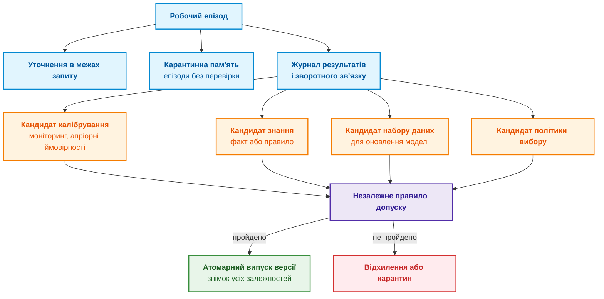
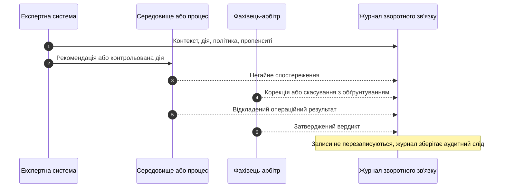
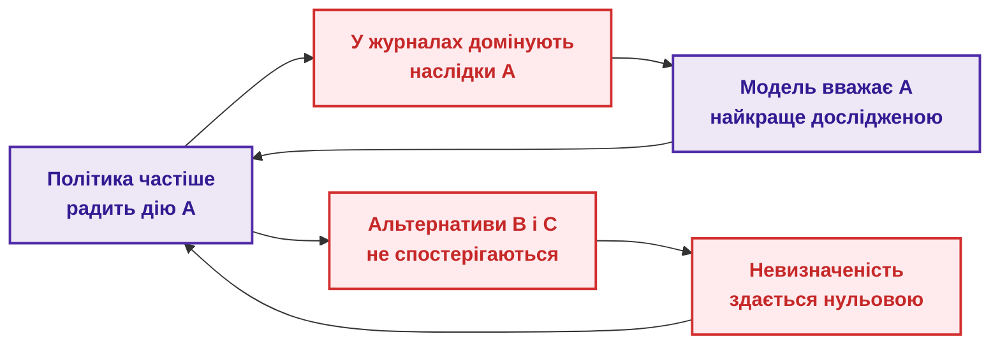
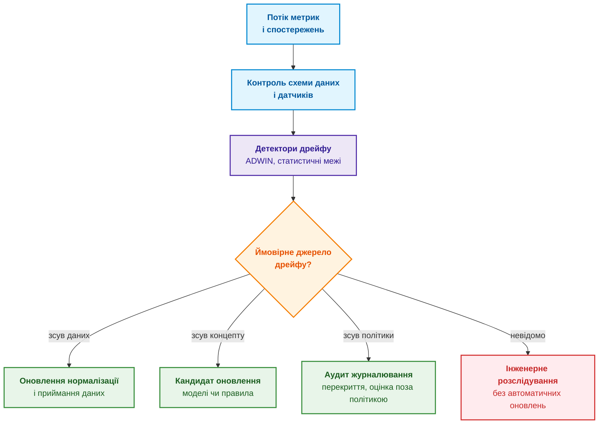
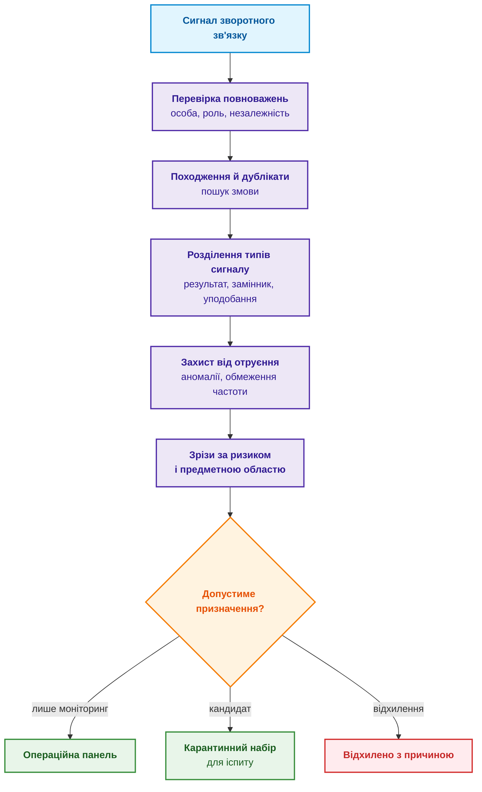

# Глава 26. Неперервне навчання (Continual Learning) на досвіді та подолання зсуву системного журналу

> **Книга:** [Архітектура доказових експертних систем](README.md) · [Частина V: Верифікація, діагностика та неперервне навчання](part-05-verification-and-learning.md)  
> **Попередня глава:** [Глава 25. Як навчати експертну систему: екзаменаційні матриці, аудит знань та контроль регресій](ch25-how-expert-systems-learn.md)  
> **Наступна глава:** [Глава 27. Синтез сертифікаційних доказів за Goal Structuring Notation (GSN): від графа EKG до аудиторського звіту](ch27-safety-case-gsn-synthesis.md)  
> **Наступна частина:** [Частина VI: Передовий край: регуляторна сертифікація та нейро-символьний ШІ](part-06-frontiers-neuro-symbolic.md)  
> **Зміст книги:** [README.md](README.md)  
> **Автор:** [Микола Федчик](about-the-author.md)  
> **Рівень:** середній і поглиблений: інженери зі знань, інженери машинного навчання, дослідники  
> **Очікувані результати:** відрізняти епізодичну пам'ять від нового знання; записувати навчальний випадок із пропенситі й часом появи результату; виявляти зміщення власних журналів і перевіряти перекриття політик до оцінки нової політики; розрізняти коваріатний дрейф, зсув апріорних частот і дрейф концепту; вимірювати забування на старих зрізах; проводити кандидатів на зміну правил, прецедентів і моделей через ізольовану перевірку до атомарного випуску.

Після сотень діагностичних випадків експертна система помічає закономірність: перевірка роз'єму часто завершує пошук несправності. Експертна система починає радити цю перевірку першою. Невдовзі журнали містять переважно перевірки роз'єму й позитивні результати після повторного під'єднання, і експертна система «переконується», що роз'єм є головною причиною відмов. Інші версії тим часом просто перестали перевіряти, тому журнал не містить жодного свідчення проти роз'єму.

Це проблема навчання на власній роботі: зібраний досвід залежить від попередніх порад, остаточні результати з'являються із затримкою, а хибний зворотний зв'язок здатен підсилювати сам себе. Ця глава відповідає на запитання: **як експертній системі навчатися на досвіді експлуатації так, щоб власні журнали, відгуки користувачів і мовна модель не переписали непомітно перевірених правил?** Теза глави: **досвід експлуатації є джерелом кандидатів, а не знань. Робоче виконання може автоматично записувати випадки й пропонувати зміни, але статус кандидата підвищує лише незалежна перевірка: облік того, як зібрано дані (пропенситі й перекриття), розрізнення типів дрейфу, вимірювання забування на старих зрізах і випуск через ті самі правила допуску, що й у Главі 25.**

[Глава 3](ch03-beyond-reference-information-systems.md) визначила самонавчання як збирання досвіду й підготовку перевірених кандидатів, а не переписування правил після кожної відповіді. [Глава 25](ch25-how-expert-systems-learn.md) побудувала життєвий цикл «кандидат → іспит → випуск». Ця глава розглядає, що відбувається **до появи кандидата й між випусками**: який сигнал вважати результатом, як помітити дрейф, як не забути старих режимів, як оцінити нову політику на зміщених журналах і що насправді означає «мовна модель навчилася на своїй помилці». Глава описує навчальну модель, а не дозвіл на автономну самозміну. Навіть метод із формальною гарантією діє лише за своїх припущень, а перевірка, безпековий огляд і можливість повернути попередню версію лишаються окремими обов'язками.

## Як читати главу за об'єктом зміни

Для перегляду факту чи правила потрібні журнал випадків, перевірене джерело, межі застосовності й процедура допуску [Глави 25](ch25-how-expert-systems-learn.md). Запис події ще не змінює правило. Для поліпшення пошуку окремо перевіряють запити, ранжування й чинність джерел. Для зміни параметрів моделі потрібні навчальні дані, перевірка дрейфу й забування.

Пропенситі, тобто ймовірність вибору дії робочою політикою, та перекриття альтернатив потрібні для описаних далі методів оцінювання іншої політики за журналом. Це не універсальні передумови кожного виправлення факту. Якщо альтернативну дію ніколи не виконували, такі методи не відновлять її результат без додаткових припущень або даних. Складні статистичні розділи можна читати після визначення, яку саме політику чи модель команда збирається змінювати.

## Що саме може навчатися

Пам'ять про випадок, статистика, правило, модель і спосіб вибору перевірки мають різні наслідки. Запис про подію лише зберігає досвід, а нове правило змінює майбутні рішення. Таблиця розрізняє шість механізмів накопичення досвіду за тим, чи зберігають вони стан між запитами, що змінюють і чим ризикують.

| Механізм | Чи зберігає стан між запитами | Що змінюється | Основний ризик |
|---|---|---|---|
| Самоуточнення в межах запиту | ні | поточна чернетка відповіді й контекст | модель підтверджує власну помилку |
| Епізодична пам'ять | так | записи випадків і рефлексій | неперевірений текст стає прецедентом |
| Оперативна статистика й калібрування | так | апріорні ймовірності, пороги, карта впевненості | дрейф або зміщені результати |
| Перегляд знань | так | факти, правила, винятки, онтологія | суперечності й втрата походження |
| Неперервне навчання моделі | так | параметри моделі векторного подання, класифікатора чи мовної моделі | катастрофічне забування, витік даних |
| Навчання політики | так | вибір запитань, перевірок і дій | небезпечне дослідження й петля зворотного зв'язку |

Перші два рядки часто плутають із навчанням. Аман Мадаан та співавтори показали в методі Self-Refine, що велика мовна модель (*Large Language Model*, LLM) може поліпшувати власну відповідь ітеративним самовідгуком без навчальних даних і без додаткового навчання [[1]](#src-1). Ной Шинн та співавтори в методі Reflexion зберігають словесні рефлексії про невдачі в буфері епізодичної пам'яті й теж не змінюють ваг моделі [[2]](#src-2). Обидва підходи поліпшували результати у своїх експериментах, але жоден не створює перевіреного постійного знання експертної системи: рефлексія лишається текстом, якого ніхто не перевірив. Схема показує, куди потрапляє досвід одного робочого епізоду і де стоїть єдина точка, через яку досвід може змінити робочу версію.



Головний інваріант схеми: робоче виконання може автоматично створювати кандидатів, але не підвищує їхнього епістемічного статусу. Запис пам'яті не стає правилом, клік користувача не стає еталонною міткою, а успішний виклик інструмента не стає доведеним причинним результатом. Перше питання перед будь-яким оновленням тому просте: команда лише зберігає випадок для майбутнього аналізу чи змінює правило, яке вплине на наступне рішення? Від відповіді залежить рівень перевірки, а сама перевірка можлива лише тоді, коли випадок записано з достатнім контекстом.

## Як фіксувати навчальний випадок

Щоб пов'язати рішення з відкладеним результатом, журнал описує вибір дії й появу результату так:

```math
a_t\sim\mu_t(a\mid x_t),
\qquad y_{t+d}\sim P(y\mid x_t,a_t,e_t).
```

- У цій парі виразів $t$ є моментом рішення, $x_t$ контекстом, $a_t$ обраною дією, а $\mu_t(a\mid x_t)$ імовірністю вибору дії за контексту $x_t$;
- $\sim$ означає випадкове отримання значення за вказаним розподілом, а $P(y\mid x_t,a_t,e_t)$ задає розподіл результату $y$ за контексту, дії та стану середовища;
- $o_t$ є негайним спостереженням, яке журнал фіксує окремо, а $y_{t+d}$ є остаточним результатом, відомим із затримкою $d$ кроків;
- $e_t$ є станом середовища, спостереженим лише частково.

Читається так: журнал записує, з якою ймовірністю політика вибрала дію в контексті, а потім пов'язує дію з результатом, що може надійти пізніше. Імовірності мають значення від 0 до 1; формула не робить спостережуваний після дії результат доказом причинності. Для діагностики з [Глави 24](ch24-system-diagnosis.md) дією може бути синхронний запис живлення й тактування, результатом підтверджена першопричина через два дні, а остаточною гарантійною статистикою дані за місяць. Мінімальний запис зворотного зв'язку для такого випадку має вигляд:

<details>
<summary>Структуроване подання JSON</summary>

```json
{
  "episode_id": "diag:cold-start-failure:run-31",
  "decision_snapshot": "sha256:...",
  "behavior_policy": "test-policy@4.2",
  "context": "feature-vector-or-typed-facts-ref",
  "action": "synchronized_rail_clock_capture",
  "propensity": 0.42,
  "immediate_observation": "obs:trace:881",
  "delayed_outcomes": [
    {"type": "adjudicated_root_cause", "value": "connector", "at": "..."}
  ],
  "feedback_source": "reliability-review-board",
  "causal_status": "observational_after_intervention",
  "eligibility": "candidate_only"
}
```

</details>

Поле `propensity` містить ймовірність, з якою політика журналювання могла обрати цю дію в цьому контексті. Без пропенситі частина методів оцінювання поза політикою (*off-policy evaluation*, OPE) неможлива. Якщо робоча політика детермінована й ніколи не обирала альтернативи, журнал не містить доказу результату альтернативи, і жодна статистика не відновить цього контрфактичного результату з нуля. Поле `eligibility` фіксує, що запис може стати лише кандидатом, а поле `causal_status` нагадує, що результат спостерігали після втручання, а не в контрольованому експерименті. Діаграма показує, у якому порядку журнал отримує частини запису.



Запис розрізняє час події й час, коли результат став відомим. Інакше модель навчатиметься на даних, яких не могла мати під час рішення, або сплутає ще не відомий результат із негативним. Програма нижче показує різницю на шести синтетичних діагностичних епізодах. Поле `label_available_at` містить день, коли арбітр підтвердив результат, а `None` означає, що результат ще невідомий. Потрібен Python 3.10 або новіший.

<details>
<summary>Приклад мовою Python</summary>

```python
from dataclasses import dataclass


@dataclass(frozen=True)
class Episode:
    decided_at: int
    label_available_at: int | None
    correct: bool | None


def evaluate_at(cutoff, episodes):
    decided = [e for e in episodes if e.decided_at <= cutoff]
    if not decided:
        raise ValueError("no decisions before cutoff")
    for e in decided:
        if (e.label_available_at is None) != (e.correct is None):
            raise ValueError("label time and outcome must be both present or both absent")
        if e.label_available_at is not None and e.label_available_at < e.decided_at:
            raise ValueError("label cannot precede decision")
    resolved = [e for e in decided if e.label_available_at is not None and e.label_available_at <= cutoff]
    correct = sum(1 for e in resolved if e.correct)
    return {
        "decided": len(decided),
        "pending": len(decided) - len(resolved),
        "naive": correct / len(decided),
        "resolved_accuracy": correct / len(resolved) if resolved else None,
    }


EPISODES = [
    Episode(1, 3, True), Episode(2, 4, True), Episode(3, 5, False),
    Episode(4, 9, True), Episode(5, 10, True), Episode(6, None, None),
]

for day in (6, 10):
    print(day, evaluate_at(day, EPISODES))
```

</details>

Програма виводить:

<details>
<summary>Дані або результат прикладу</summary>

```text
6 {'decided': 6, 'pending': 3, 'naive': 0.3333333333333333, 'resolved_accuracy': 0.6666666666666666}
10 {'decided': 6, 'pending': 1, 'naive': 0.6666666666666666, 'resolved_accuracy': 0.8}
```

</details>

На шостий день три результати ще невідомі. Якщо рахувати їх помилками, частка правильних рішень становить 0,333; серед трьох відомих результатів ця частка дорівнює 0,667. На десятий день невідомим лишається один епізод, а частка серед відомих результатів стає 0,8. Жодне число не є остаточною якістю: відомі результати можуть систематично відрізнятися від тих, що чекають на арбітра. Звіт показує тому кількість незавершених епізодів і розподіл затримки, а не одне зведене число. Такий запис ще не є знанням: запис створює матеріал для перевірки. Навіть добре записані випадки показують, однак, лише ту частину світу, яку експертна система сама обрала спостерігати.

## Чому власний журнал не показує всієї картини

Стан, який експертна система зустріне завтра, залежить від її дій сьогодні. У задачі послідовних рішень політика журналювання $\mu$ породжує власний розподіл станів $d^{\mu}(x)$, а нова політика $\pi$ може потрапити в стани, яких у журналі майже немає:

```math
d^{\pi}(x)\ne d^{\mu}(x).
```

- Для $d^{\pi}(x)$ і $d^{\mu}(x)$ індекси $\pi$ та $\mu$ позначають розподіли станів за нової та журналювальної політик;
- $x$ є станом, а $d^{\pi}(x)$ і $d^{\mu}(x)$ є ймовірностями цього стану за відповідних політик;
- $\ne$ означає, що два розподіли не збігаються всюди.

Практичний наслідок такий: журнал однієї політики може рідко містити стани, до яких приведе інша політика. Кожен розподіл має сумарну ймовірність 1, але формула сама не вимірює величину відмінності.

Стефан Росс, Джефрі Гордон і Дрю Багнелл показали, що через порушення припущення про незалежні однаково розподілені дані імітаційне навчання погіршується після власних помилок, і запропонували алгоритм DAgger (*Dataset Aggregation*), який збирає мітки на станах, що відвідує поточна політика [[3]](#src-3). У критичних для безпеки застосуваннях, однак, не можна навмисно заходити в небезпечні стани лише заради покриття даних.

Для журналу контекстних рішень цінність нової політики $\pi$ оцінюють зважуванням за оберненою пропенситі (*Inverse Propensity Scoring*, IPS):

```math
\widehat V_{\mathrm{IPS}}(\pi)=\frac{1}{N}\sum_{i=1}^{N}
\frac{\pi(a_i\mid x_i)}{\mu(a_i\mid x_i)}\,r_i.
```

- У цій оцінці $N$ є кількістю записаних епізодів, а $i$ індексує епізод;
- $x_i$ є контекстом, $a_i$ обраною дією, $r_i$ отриманою винагородою, а $\pi$ цільовою політикою, яку оцінюють;
- $\mu(a_i\mid x_i)$ є ймовірністю вибору дії в журналі, а $\pi(a_i\mid x_i)$ її ймовірністю за цільовою політикою;
- Їхнє відношення є вагою важливості; $\sum_{i=1}^{N}$ підсумовує зважені винагороди, а ділення на $N$ дає середнє;
- $\widehat V_{\mathrm{IPS}}(\pi)$ є оцінкою цінності цільової політики.

Читається так: кожен запис переважується відповідно до різниці між цільовою та журналювальною політиками. За умовних чисел у двох епізодах, із вагами 2 і 1 та винагородами 1 і 0, оцінка дорівнює $(2\cdot1+1\cdot0)/2=1$. Результат має одиниці винагороди й потребує ненульової ймовірності журналювання кожної дії, яку може обрати цільова політика. Оцінка потребує правильних пропенситі й перекриття (*overlap*) політик:

```math
\pi(a\mid x)>0\Rightarrow\mu(a\mid x)>0.
```

- Для цієї умови $\pi(a\mid x)$ є ймовірністю дії $a$ за цільовою політикою, а $\mu(a\mid x)$ за політикою журналювання;
- $x$ є контекстом, $a$ дією, а $`>0`$ означає ненульову ймовірність;
- $\Rightarrow$ вимагає, щоб кожна дія з ненульовою ймовірністю за цільовою політикою також мала ненульову ймовірність у журналі.
- $\Rightarrow$ є логічною імплікацією: якщо цільова політика може вибрати дію, журналювальна політика теж має давати їй ненульову ймовірність.

Отже, правило вимагає перекриття можливих дій, але не гарантує малої дисперсії: мала ймовірність у знаменнику все одно створює велику вагу.

Малі $\mu(a_i\mid x_i)$ дають великі ваги й велику дисперсію. Обрізання ваг зменшує дисперсію, але вносить зміщення. Двічі робастні оцінки, які розвинули Мірослав Дудік, Джон Ленгфорд і Ліхун Лі, поєднують модель винагороди з поправкою на пропенситі [[4]](#src-4), але не скасовують припущень. Скільки інформації лишається після зважування, показує ефективний розмір вибірки для ваг $w_i$, який наводить Арт Оуен [[5]](#src-5):

```math
\mathrm{ESS}=\frac{\left(\sum_iw_i\right)^2}{\sum_iw_i^2}.
```

- Тут ваги $w_i$ належать епізодам $i$, а суми охоплюють усі епізоди;
- Чисельник підносить суму ваг до квадрата, знаменник підсумовує квадрати окремих ваг;
- $\mathrm{ESS}$ є ефективним розміром вибірки, тобто кількістю однаково зважених спостережень із подібним обсягом інформації.

За умовних ваг 1, 1 і 2 маємо $\mathrm{ESS}=4^2/(1^2+1^2+2^2)=16/6\approx2{,}67$. За невід'ємних ваг із ненульовою сумою результат лежить від 1 до $N$; він показує ефективність зважування, а не точність оцінки.

Програма нижче відтворює історію з роз'єму. Є два контексти, холод і тепло, і три можливі перші перевірки. У холоді перевірка роз'єму знаходить несправність із ймовірністю 0,60, у теплі найкраще працює перевірка живлення (0,45). Нова політика обирає роз'єм у холоді й живлення в теплі, тому справжня цінність нової політики дорівнює $0{,}5\cdot0{,}60+0{,}5\cdot0{,}45=0{,}525$. Програма збирає по 200 000 епізодів двома політиками журналювання й оцінює нову політику двома способами. Потрібна лише стандартна бібліотека Python 3.10 або новішого.

<details>
<summary>Приклад мовою Python</summary>

```python
"""Зміщення власного журналу й оцінка нової політики за пропенситі (IPS).

Лише стандартна бібліотека Python 3.10+.
"""
import random

ACTIONS = ("роз'єм", "тактування", "живлення")
CONTEXTS = ("холод", "тепло")
# Ймовірність, що перша перевірка знаходить несправність, для кожної дії в кожних умовах
P_FOUND = {"холод": (0.60, 0.20, 0.20), "тепло": (0.15, 0.40, 0.45)}
N = 200_000


def connector_only(context):
    return (1.0, 0.0, 0.0)


def connector_mostly(context):
    return (0.8, 0.1, 0.1)


def target(context):
    """Нова політика: у холоді першим перевіряти роз'єм, у теплі живлення."""
    return 0 if context == "холод" else 2


def collect(policy, rng):
    logs = []
    for _ in range(N):
        context = rng.choice(CONTEXTS)
        probs = policy(context)
        action = rng.choices(range(3), weights=probs)[0]
        reward = 1 if rng.random() < P_FOUND[context][action] else 0
        logs.append((context, action, probs[action], reward))
    return logs


def report(name, policy, logs):
    if not logs:
        raise ValueError("empty log")
    print(f"Журнал: {name}")
    counts = [sum(1 for _, a, _, _ in logs if a == i) for i in range(3)]
    print("  спостережень за дією:", ", ".join(f"{ACTIONS[i]} {counts[i]}" for i in range(3)))
    supported = True
    for context in CONTEXTS:
        mu = policy(context)[target(context)]
        print(f"  перекриття «{context} -> {ACTIONS[target(context)]}»: mu = {mu:.2f}" + ("" if mu > 0 else "  НЕМАЄ"))
        supported = supported and mu > 0
    if not supported:
        print("  оцінка IPS неідентифікована: немає перекриття політик")
        return None
    matched = [r for x, a, _, r in logs if a == target(x)]
    weights = [1 / p if a == target(x) else 0.0 for x, a, p, _ in logs]
    if not matched or sum(weights) == 0:
        print("  оцінка недоступна: немає спостережених збігів із цільовою політикою")
        return None
    ips = sum(w * r for w, (_, _, _, r) in zip(weights, logs)) / len(logs)
    ess = sum(weights) ** 2 / sum(w * w for w in weights)
    print(f"  наївна оцінка (середнє серед збігів): {sum(matched) / len(matched):.3f}")
    print(f"  оцінка IPS: {ips:.3f}; ефективний розмір вибірки {ess:.0f} із {len(logs)}")
    return ips, ess


def test_evaluation_guards():
    import contextlib
    import io

    with contextlib.redirect_stdout(io.StringIO()):
        assert report("unsupported", connector_only, [("холод", 0, 1.0, 1)]) is None
        assert report("no_matches", connector_mostly, [("тепло", 1, 0.1, 1)]) is None
        estimate, effective_size = report("supported", connector_mostly, [("холод", 0, 0.8, 1)])
        assert estimate == 1.25 and effective_size == 1.0
        try:
            report("empty", connector_mostly, [])
        except ValueError:
            pass
        else:
            raise AssertionError("empty log accepted")


test_evaluation_guards()


true_value = sum(P_FOUND[c][target(c)] for c in CONTEXTS) / len(CONTEXTS)
print(f"Справжня цінність нової політики: {true_value:.3f}")
rng = random.Random(26)
for name, policy in (("лише роз'єм", connector_only), ("роз'єм у 80 % випадків", connector_mostly)):
    print()
    report(name, policy, collect(policy, rng))
```

</details>

Запуск `python log_bias.py` спочатку виконує три граничні перевірки: відсутнє перекриття, журнал без збігів з цільовою політикою й порожній журнал. Після цього програма друкує:

<details>
<summary>Дані або результат прикладу</summary>

```text
Справжня цінність нової політики: 0.525

Журнал: лише роз'єм
  спостережень за дією: роз'єм 200000, тактування 0, живлення 0
  перекриття «холод -> роз'єм»: mu = 1.00
  перекриття «тепло -> живлення»: mu = 0.00  НЕМАЄ
  оцінка IPS неідентифікована: немає перекриття політик

Журнал: роз'єм у 80 % випадків
  спостережень за дією: роз'єм 159907, тактування 20085, живлення 20008
  перекриття «холод -> роз'єм»: mu = 0.80
  перекриття «тепло -> живлення»: mu = 0.10
  наївна оцінка (середнє серед збігів): 0.581
  оцінка IPS: 0.524; ефективний розмір вибірки 35542 із 200000
```

</details>

Перший журнал зібрала політика, яка завжди перевіряє роз'єм. Для тепла нова політика обирає дію, якої в журналі немає жодного разу, тобто перекриття відсутнє, і програма відмовляється давати число. Якщо цю перевірку вимкнути, той самий журнал дасть наївну оцінку 0,602, бо вона бачить лише холодні випадки, і IPS 0,301, бо теплі випадки мовчки отримають нульовий внесок. Обидва числа виглядають правдоподібно й обидва хибні, тому перевірка перекриття має передувати будь-якій оцінці. Другий журнал зібрала політика, яка у 20 % випадків пробує інші перевірки з відомими пропенситі. Наївна оцінка все одно завищена (0,581), бо холодні збіги трапляються вісім разів частіше за теплі, а IPS дає 0,524 за справжньої цінності 0,525. Ціну поправки показує останнє число: ефективний розмір вибірки становить 35 542 із 200 000 епізодів, тобто зважування залишило менше п'ятої частини інформації журналу.

Приклад спрощений: контекст має лише два значення, пропенситі відомі точно, а винагорода спостерігається одразу. У робочих журналах пропенситі доводиться записувати в момент рішення, а відкладені результати потребують окремого обліку незавершених епізодів. Схема показує петлю, яку створює політика без дослідження альтернатив.



Обидва цикли схеми повертаються до політики й підсилюють її вибір. Розірвати петлю допомагають журналювання пропенситі, явні позначки невідомого, кероване дослідження лише в безпечній області, перевірки, обрані фахівцем, моделювання й проспективне підтвердження. Для незворотних дій оцінка поза політикою є свідченням, а не дозволом на впровадження. Навіть коректно зібраний журнал, однак, не захищає від іншої проблеми: світ, який описує журнал, може змінитися.

## Як відрізнити нову проблему від зміни даних

Не кожне падіння метрики вимагає перенавчання. Жоао Гама та співавтори в огляді адаптації до дрейфу концепту розрізняють кілька видів змін розподілу [[6]](#src-6). **Коваріатний дрейф** змінює розподіл вхідних даних:

```math
P_t(X)\ne P_{t+1}(X).
```

- Коваріатний дрейф описують $P_t(X)$ і $P_{t+1}(X)$, розподіли вхідних ознак у періоди $t$ і $t+1$;
- $X$ є змінною вхідних даних, а $\ne$ означає, що розподіли відрізняються.

На практиці змінилися частоти або поєднання вхідних ознак; значення ймовірностей належать відрізку від 0 до 1, але формула не визначає причину зміни.

**Зсув апріорних частот** змінює розподіл міток:

```math
P_t(Y)\ne P_{t+1}(Y).
```

- Для зсуву апріорних частот $P_t(Y)$ і $P_{t+1}(Y)$ є розподілами міток $Y$ у періоди $t$ і $t+1$;
- $Y$ позначає змінну мітки результату, а $\ne$ показує відмінність розподілів.

Отже, змінюються частоти класів, хоча цей запис сам по собі не встановлює причину зсуву.

**Дрейф концепту** змінює саму залежність результату від входу:

```math
P_t(Y\mid X)\ne P_{t+1}(Y\mid X).
```

- Тут $P_t(Y\mid X)$ і $P_{t+1}(Y\mid X)$ є умовними розподілами мітки $Y$ за входу $X$ у двох періодах;
- $\mid$ читається «за умови», а $\ne$ означає, що змінилася залежність результату від входу.

Ці три формули розрізняють зміни входів, частот міток і умовного зв'язку між ними, але не встановлюють причину зміни.

Нова ревізія плати змінює $P(X)$, новий постачальник компонентів змінює апріорні частоти несправностей, а нова архітектура прошивки змінює саме відображення від симптомів до несправностей. Зміна схеми даних, зламаний датчик чи нове правило розмітки іноді лише імітують дрейф.

Детектор ADWIN (*ADaptive WINdowing*) Альберта Біфета й Рікарда Гавальди порівнює статистику двох частин адаптивного вікна й сигналізує, коли різниця середніх перевищує межу, виведену з нерівності Гьофдінга [[7]](#src-7). У спрощеній формі межа дорівнює

```math
\epsilon=\sqrt{\frac{1}{2m}\ln\frac{2}{\delta}}.
```

- $\epsilon$ є межею різниці середніх і має ті самі одиниці, що й метрика;
- $m$ є ефективним розміром підвікна, а $\delta$ задає ймовірність хибної тривоги між 0 і 1; константи 1 і 2 у виразі є фіксованими числовими множниками межі;
- $\ln$ є натуральним логарифмом, а знак кореня означає квадратний корінь.

За умовних $m=100$ і $\delta=0{,}05$ отримуємо $\epsilon=\sqrt{\ln(40)/200}\approx0{,}136$. Менше $\delta$ збільшує межу й зазвичай затримує сигнал. Справжній ADWIN використовує власні уточнення межі; цей спрощений вираз пояснює компроміс, а не замінює реалізацію детектора. Схема показує, як сигнал детектора перетворюється на дію залежно від імовірного джерела дрейфу.



Сигнал детектора є гіпотезою, а не першопричиною. Перед будь-якою зміною перевіряють пропущені мітки, сезонність, зміну асортименту продукції, нове розгортання й зміну політики. Відкладені результати можуть створити тимчасове погіршення калібрування, якщо незавершені епізоди рахувати як невдачі.

### Випереджальні індикатори: деградація до першої хибної відповіді

Детектори дрейфу й калібрування з [Глави 25](ch25-how-expert-systems-learn.md) реагують на вже виміряне погіршення: частка правильних відповідей на іспиті падає, помилка калібрування зростає, інженери частіше повертають відповіді. До цього моменту користувачі вже отримали кілька хибних або марних відповідей. Деградація бази знань зазвичай починається раніше: норму оновили, а база знань ще містить стару редакцію; у предметній області з'явилися нові терміни; запитання зміщуються в теми, де знань мало. Такі зміни дають слабкі сигнали ще до падіння основних метрик, і експертна система може стежити саме за ними.

Ідея випереджальних індикаторів (*leading indicators*) добре відома в теорії складних систем. Шеффер та співавтори показали, що перед різкою зміною стану екологічні, кліматичні й фінансові системи повільніше відновлюються після збурень, і це проявляється в зростанні дисперсії та автокореляції спостережуваних величин [[8]](#src-8). Для експертної системи ця аналогія не є доведенням, але дає перевірювані кандидати в індикатори, які перелічує таблиця.

| Індикатор | Що вимірюють | Чому сигнал з'являється раніше за помилки |
|---|---|---|
| Зростання дисперсії впевненості в домені | дисперсію впевненості відповідей одного домену за ковзним вікном за стабільного середнього | частина запитань уже потрапляє на межу знань, а середнє ще тримається |
| Розходження збігів і підтвердженості | частку відповідей, де пошук знаходить багато кандидатів, але частка тверджень із доказом падає | збіги за словами лишилися, а точних цитат для нових формулювань немає |
| Дрейф запитань у тонкі зони | частку запитань у темах із низькою знаннєвою щільністю ([Глава 32](ch32-high-performance-knowledge-packs-mmap-and-harvesting.md)) | запитання змістилися туди, де знань мало, ще до перших відмов |
| Зростання уточнювальних циклів | середню кількість уточнювальних запитань у діалозі до відповіді | словник перестав однозначно розпізнавати нові терміни |

Усі чотири індикатори варто відстежувати не за рівнем, а за стійким зсувом: одна невдала доба нічого не означає, а тиждень невеликого зростання є сигналом. Такий зсув виявляє кумулятивна сума (*cumulative sum*, CUSUM), яку запропонував Пейдж для неперервного контролю виробничих процесів [[9]](#src-9).

```math
S_t = \max\left(0,\; S_{t-1} + x_t - \mu_0 - k\right), \qquad S_0 = 0
```

Складники кумулятивної суми:

- $x_t$ є значенням індикатора в період $t$, наприклад дисперсією впевненості за добу;
- $\mu_0$ є еталонним рівнем індикатора, оціненим на стабільному періоді;
- $k$ є допуском: зсуви, менші за $k$, детектор ігнорує, і зазвичай $k$ беруть рівним половині зсуву, який треба виявити;
- $S_t$ є накопиченою сумою перевищень, яка не буває від'ємною, а $S_0$ є початковим значенням;
- тривогу подають, коли $S_t$ перевищує поріг $h$, який задає компроміс між затримкою виявлення й частотою хибних тривог.

Детектор накопичує невеликі перевищення над еталоном і подає сигнал, коли сума стає завеликою; поодинокий стрибок тривоги не дає, бо наступні спокійні дні повертають суму до нуля. Приклад. Дисперсія впевненості в домені керування батареєю за стабільний місяць становила 0,040; допуск дорівнює 0,005, поріг 0,03. Добові значення після оновлення галузевого стандарту були 0,046; 0,049; 0,052; 0,055; 0,058. Накопичена сума зростає так: 0,001; 0,005; 0,012; 0,022; 0,035, і на п'ятий день сума перевищує поріг. Частка правильних відповідей на іспиті може в цей момент ще не змінитися.

Випереджальний індикатор може тривожити хибно: сезонний наплив запитань нової тематики підвищує дисперсію без жодної деградації знань. Тому тривога запускає цільову перевірку, а не оновлення: додатковий іспит на зрізі домену й завдання системі здобуття знань дібрати джерела для тонкої теми ([Глава 10](ch10-knowledge-acquisition-systems.md)). Корисність кожного індикатора для конкретної експертної системи доводять ретроспективно: індикатор залишають, лише якщо він зростав перед відомими інцидентами минулого і рідко тривожив без них. Коли ж дрейф справжній і команда готує нову версію, постає наступне питання: чи не зіпсує нова версія добре відомих старих режимів роботи?

## Як виміряти забування

Доналаштування на даних останнього місяця може поліпшити ревізію E й зламати ревізію C. Таке катастрофічне забування оцінюють по задачах або зрізах. Арслан Чаудгрі та співавтори визначили середнє забування після $T$ задач так [[10]](#src-10):

```math
F_T=\frac{1}{T-1}\sum_{i=1}^{T-1}
\left(\max_{i\le k\le T-1}a_{k,i}-a_{T,i}\right).
```

де:

- $T$ є кількістю послідовно опрацьованих задач, а $i$ індексує стару задачу або зріз;
- $a_{k,i}$ є якістю на задачі $i$ після навчання до задачі $k$, а $a_{T,i}$ якістю на тому самому зрізі після останнього етапу;
- $\max_{i\le k\le T-1}$ бере найвище значення якості для задачі $i$ після етапів від $i$ до $T-1$;
- $\sum_{i=1}^{T-1}$ підсумовує втрати якості на всіх старих задачах, а ділення на $T-1$ дає середнє;
- $F_T$ є середнім забуванням в одиницях обраної метрики якості.

Наприклад, якщо на одному старому зрізі найкраща якість була умовно $0{,}90$, а після останнього етапу стала $0{,}70$, забування на цьому зрізі дорівнює $0{,}20$. Від'ємне значення можливе, якщо нове навчання поліпшило стару задачу; середнє може приховати критичну регресію на окремому зрізі.

Девід Лопес-Пас і Марк'Ауреліо Ранцато запропонували для неперервного навчання ще й міри перенесення знань назад і вперед (*backward and forward transfer*) між задачами [[11]](#src-11). Від'ємне забування на зрізі означає, що навчання на новій задачі поліпшило стару. Середнє значення, однак, не повинне приховувати критичної регресії. Забування рахують для всієї експертної системи й окремо для важливих груп випадків: старих ревізій пристрою, рідкісних, але небезпечних відмов, даних від іншого постачальника. Якщо одна з цих груп помітно погіршилася, нову версію не виправдовує її середній успіх на найсвіжіших даних.

## Як додати нове знання й не забути старого

Коли підтверджено, що змінився саме предметний світ, нову версію все одно не можна навчати лише на свіжих випадках. Нова версія має зберігати працездатність у режимах, які були важливими вчора, навіть якщо сьогодні ці режими трапляються рідше. Матіас Де Ланге та співавтори в огляді методів неперервного навчання поділяють їх на три родини [[12]](#src-12):

- **повторне відтворення** (*replay*) змішує репрезентативні старі приклади з новими;
- **регуляризація** обмежує зміни параметрів, важливих для старих задач, або зберігає стару поведінку через виходи попередньої моделі (дистиляцію);
- **ізоляція параметрів** виділяє окремі адаптери, експерти чи нові частини архітектури для окремого контексту або задачі.

Найвідомішим методом регуляризації є пружна консолідація ваг (*Elastic Weight Consolidation*, EWC) Джеймса Кіркпатріка та співавторів, яка додає до функції втрат штраф [[13]](#src-13):

```math
\mathcal L(\theta)=\mathcal L_{\text{new}}(\theta)
+\frac{\lambda}{2}\sum_iF_i\left(\theta_i-\theta_i^*\right)^2.
```

- Для параметра $\theta_i$ значення $\theta_i^*$ є його значенням після старої задачі, а $F_i$ наближує важливість параметра через інформацію Фішера;
- $\mathcal L(\theta)$ є новою функцією втрат, $\mathcal L_{\text{new}}(\theta)$ її складником для нової задачі, а $\sum_i$ підсумовує штрафи за параметрами;
- $\lambda$ є невід'ємним коефіцієнтом сили штрафу, квадрат різниці карає відхилення від старого параметра, а $1/2$ масштабує цей доданок.

За умовних $\lambda=3$, $F_i=2$ і $\theta_i-\theta_i^*=0{,}1$ штраф для одного параметра дорівнює $(3/2)\cdot2\cdot0{,}1^2=0{,}03$. Більша важливість параметра або сильніше відхилення збільшує штраф. EWC не гарантує відсутності забування в довільній задачі: метод має власні припущення й емпіричні межі.

Буфер повторного відтворення є об'єктом керування, а не технічною деталлю. Збереження старих прикладів може порушити строки зберігання, приватність або ліцензію, а синтетичні приклади відтворюють упередження моделі-вчителя. Для експертної системи часто безпечніше не стискати мінливий факт у ваги моделі, а оновити версійовану базу знань чи пошуковий індекс, як радить [Глава 25](ch25-how-expert-systems-learn.md).

## Як оновлювати правила й прецеденти

Правила й прецеденти потребують іншої перевірки, ніж числова модель. Треба встановити не лише точність, а й межі дії нового твердження, його джерело й наслідки для висновків, які вже залежать від старих знань.

**Прецедент стає знанням лише після перевірки результату.** Класичний цикл міркування за прецедентами (*Case-Based Reasoning*, CBR), який описали Агнар Аамодт та Енрік Плаза, складається з чотирьох кроків: знайти, повторно використати, переглянути, зберегти [[14]](#src-14). Автоматичним може бути пошук. Зберігати прецедент дозволяють лише після перевіреного результату й перегляду меж застосовності. Прецедент містить задачу, контекст, дію, результат, виконану адаптацію й негативний результат. Інакше база прецедентів накопичує дублікати успішних історій і сповільнює пошук.

**Правило стає кандидатом, а не законом.** Індуктивне логічне програмування (*Inductive Logic Programming*, ILP), яке сформулював Стівен Магглтон, шукає гіпотезу $H$, яка разом із фоновими знаннями $B$ пояснює позитивні приклади $E^+$ і не виводить негативних $E^-$ [[15]](#src-15):

```math
B\cup H\models E^+,
\qquad
B\cup H\not\models E^-.
```

- У цій умові $B$ є фоновими знаннями, $H$ кандидатом-гіпотезою, $E^+$ множиною позитивних прикладів, а $E^-$ множиною негативних прикладів;
- $\cup$ означає об'єднання, $\models$ читається «логічно виводить», а $\not\models$ читається «не виводить»;
- Обидва рядки вимагають, щоб $B$ разом із $H$ виводили позитивні приклади й не виводили негативних.

Критерій вимагає покриття позитивних прикладів без виведення негативних. Для зашумлених даних потрібен компроміс між покриттям і втратами, як зазначено нижче.

У зашумлених даних ці умови замінюють компромісом між покриттям і втратами. Навіть ідеальна відповідність прикладам не робить $H$ причинною закономірністю чи нормою, обов'язковою до виконання. Кандидат отримує походження, межі чинності, контрприклади, власника й мутаційні та властивісні тести з [Глави 23](ch23-knowledge-base-verification.md).

**Перегляд знань зачіпає залежні висновки.** Система підтримання істинності (*Truth Maintenance System*, TMS), яку запропонував Джон Дойл, відстежує, які висновки залежать від яких припущень [[16]](#src-16). Новий факт може скасувати висновок, що спирався на старе припущення. Ребро графа без інтервалу чинності й версії джерела створює «вічне» знання, а міграцію онтології перевіряють окремо від оновлення окремих екземплярів. Схема показує шлях кандидата від перевірених епізодів до нової версії бази знань.

```mermaid
flowchart LR
    accTitle: Перегляд та допуск кандидатів на оновлення бази знань
    accDescr: Перевірені епізоди породжують кандидатів, які проходять перевірку походження, несуперечності й підтримання істинності, тести інваріантів і фаховий перегляд, після чого стають новою версією бази знань або зафіксованим контрприкладом.

    F["<b>Перевірені епізоди</b>"] --> GEN["<b>Генерація кандидатів</b><br/>прецедент, правило, ребро графа"]
    GEN --> PROV["<b>Перевірка походження</b><br/>межі чинності й авторство"]
    PROV --> CONS["<b>Несуперечність</b><br/>і підтримання істинності"]
    CONS --> TEST["<b>Тести інваріантів</b><br/>мутації й контрприклади"]
    TEST --> EXP["<b>Фаховий перегляд</b><br/>власник предметної області"]
    EXP -->|"допущено"| KB["<b>Нова версія бази знань</b>"]
    EXP -->|"відхилено"| NEG["<b>Негативний артефакт</b><br/>зафіксований контрприклад"]

    classDef inp fill:#e1f5fe,stroke:#0288d1,stroke-width:2px,color:#01579b;
    classDef test fill:#ede7f6,stroke:#512da8,stroke-width:2px,color:#311b92;
    classDef ok fill:#e8f5e9,stroke:#388e3c,stroke-width:2px,color:#1b5e20;
    classDef fail fill:#ffebee,stroke:#d32f2f,stroke-width:2px,color:#c62828;

    class F,GEN,PROV inp;
    class CONS,TEST,EXP test;
    class KB ok;
    class NEG fail;
```



Відхилений кандидат теж корисний: причина відхилення стає негативним прикладом і тестом, але не правилом «ніколи більше не пропонувати» без меж застосування. Зміна правила має лишати зрозумілий слід: що змінилося, на яких випадках зміну перевірено, де правило не діє і хто відповідає за правило. Тоді наступний редактор бази знань зможе виправити помилку, не вгадуючи її історію з уривків журналу.

## Коли просити людину перевірити випадок

Перевірка фахівцем дорога, тому випадки для неї обирають. Берр Сеттлз в огляді активного навчання описує вибір за невизначеністю (*uncertainty sampling*): моделі вигідно просити мітку там, де ентропія прогнозу найбільша [[17]](#src-17):

```math
H(Y\mid x)=-\sum_yP(y\mid x)\log P(y\mid x).
```

- Ентропія $H(Y\mid x)$ вимірює невизначеність мітки $Y$ для випадку $x$;
- $P(y\mid x)$ є ймовірністю мітки $y$ за заданого випадку $x$, а $\sum_y$ охоплює всі можливі мітки;
- $\log$ є логарифмом: основа 2 дає біти, натуральна основа дає нати;
- Мінус перед сумою робить результат невід'ємним для нормованого розподілу ймовірностей.

Для умовного бінарного прогнозу з імовірностями $0{,}5$ і $0{,}5$ ентропія дорівнює 1 біту за логарифма з основою 2. Нульова ймовірність має нульовий внесок за границею $p\log p$ при $p\to0$; ентропія вимірює невизначеність, а не важливість випадку для рішення.

Проте викид може бути дуже невизначеним і водночас неважливим. Практичний критерій, який пропонує автор, враховує очікуване зменшення втрат рішення, а не лише невизначеність, і ділить його на вартість перевірки:

```math
x^*=\arg\max_{x\in U}
\frac{\mathbb E\left[\Delta L_{\text{рішення}}\mid \text{мітка}(x)\right]}
{C_{\text{фахівець}}(x)+C_{\text{доказ}}(x)+C_{\text{ризик}}(x)}.
```

- Критерій вибирає випадок $x^*$ із множини нерозмічених випадків $U$;
- $\arg\max_{x\in U}$ означає вибрати випадок із найбільшим значенням дробу;
- $\mathbb E[\Delta L_{\text{рішення}}\mid\text{мітка}(x)]$ є очікуваним зменшенням втрат рішення після отримання мітки випадку $x$;
- $C_{\text{фахівець}}(x)$, $C_{\text{доказ}}(x)$ і $C_{\text{ризик}}(x)$ є витратами часу фахівця, побудови доказу та ризику перевірки;
- Знаменник є сумою вартостей перевірки, а умовне очікування обчислюють за можливими мітками.

Практично експертна система віддає фахівцеві випадок із найбільшим очікуваним зменшенням втрат на одиницю вартості. Витрати мають бути на порівнюваній шкалі, а знаменник додатним. Критерій також має враховувати репрезентативність, різноманітність і приватність. Фахівець не є безпомилковим оракулом: незгоду, відмову від оцінки й межі компетенції зберігають за протоколом [Глави 11](ch11-knowledge-elicitation-from-experts.md). Мітка, згенерована моделлю, не стає незалежною перевіркою тієї самої моделі. Людину залучають там, де її відповідь може змінити важливе рішення.

## Чому рекомендації змінюють дані, на яких експертна система вчиться

Коли експертна система послідовно обирає перевірки, винагорода не зводиться до натискання кнопки «корисно». Винагорода має відображати підтверджений результат і можливу шкоду. Один зі способів порівняти дії є накопичений програш (*regret*), який Тор Латтімор і Чаба Сепешварі розглядають як базову міру якості алгоритмів багаторуких бандитів [[18]](#src-18):

```math
\mathrm{Regret}_T=\sum_{t=1}^{T}\ell_t(a_t)
-\min_{a\in A}\sum_{t=1}^{T}\ell_t(a).
```

- Для накопиченого програшу $T$ є кількістю кроків, а $t$ індексує поточний крок;
- $a_t$ є фактичною дією, $A$ множиною можливих дій, а $\ell_t(a)$ втратою дії $a$ на кроці $t$;
- $\sum_{t=1}^{T}$ підсумовує втрати за весь період, а $\min_{a\in A}$ вибирає найменшу суму для однієї фіксованої дії;
- $\mathrm{Regret}_T$ є різницею між сумарною втратою обраних дій і найкращою сумою фіксованої дії.

Наприклад, якщо за умовні два кроки обрані дії дали сумарну втрату 3, а найкраща одна фіксована дія дала 2, то програш дорівнює 1 одиниці втрати. У нестаціонарному середовищі статичний порівнюваний варіант може бути непридатним; низький програш не компенсує катастрофічної дії, тому жорсткі обмеження з [Глави 21](ch21-from-recommendation-to-action.md) лишаються окремо.

Безпечне поліпшення політики порівнює кандидата $\pi$ з базовою політикою $\pi_b$, яка зібрала дані. Ромен Ларош, Поль Трішлер і Ремі Таше де Комб у методі SPIBB (*Safe Policy Improvement with Baseline Bootstrapping*) повертають навчену політику до базової там, де невизначеність висока, і отримують гарантію, що нова політика не гірша за базову [[19]](#src-19). Практичне правило допуску поєднує нижню межу довірчого інтервалу (*Lower Confidence Bound*, LCB) різниці цінностей

```math
\mathrm{LCB}_{1-\alpha}\left(V(\pi)-V(\pi_b)\right)\ge-\varepsilon
```

- У цьому правилі $\pi$ є політикою-кандидатом, а $\pi_b$ базовою політикою;
- $V(\pi)$ і $V(\pi_b)$ є оціненими цінностями політик, а $\mathrm{LCB}_{1-\alpha}$ позначає нижню межу довірчого інтервалу з рівнем довіри $1-\alpha$;
- $\alpha$ є часткою ризику поза інтервалом, зазвичай $`0<\alpha<1`$, а $\varepsilon$ допустимою межею погіршення;
- $\ge$ вимагає, щоб нижня межа різниці цінностей була не нижча за $-\varepsilon$.

За умовних значень нижньої межі $-0{,}03$ і $\varepsilon=0{,}05$ нерівність виконується. Різниця цінностей і допуск мають однакові одиниці; результат залежить від оцінювача та покриття даних.

з жорсткими умовами

```math
F_{\text{крит}}(\pi)=0,
\qquad \pi(a\mid x)=0\ \text{для заборонених пар }(x,a).
```

- Тут $F_{\text{крит}}(\pi)$ є кількістю критичних провалів політики $\pi$, а рівність нулю вимагає, щоб таких провалів не було;
- $\pi(a\mid x)$ є ймовірністю дії $a$ за контексту $x$; для забороненої пари $(x,a)$ імовірність має бути нульовою;
- Кома між умовами означає, що мають виконуватися обидві, а $0$ є точним нулем.

Ці обмеження не мають одиниць. Їхнє виконання залежить від повноти виявлення критичних провалів і коректного переліку заборонених пар. Загальна гарантія також залежить від оцінювача, покриття даних і припущень. Якщо перекриття немає, кандидат у невизначених областях повертається до базової політики або проходить моделювання, тіньовий запуск і перегляд людиною. Рекомендація визначає, які випадки буде перевірено й які результати стануть видимими.

## Мовна модель може запропонувати, але не підтвердити

Мовна модель може сформувати самокритику, рефлексію, синтетичний приклад або чернетку правила. Усе це пропозиції, у яких генератор і перевіряльник поділяють спільні помилки. Якщо одна модель пише відповідь, оцінює її й створює навчальну мітку, помилки корелюють і підсилюють одна одну. Тому кожен сигнал отримує тип:

- `self_reflection`: мінлива пам'ять з обмеженим строком життя (*Time To Live*, TTL);
- `user_feedback`: сигнал від відомої особи з відомим контекстом, але не істина;
- `tool_result`: спостереження з контрактом інструмента й походженням;
- `verified_outcome`: незалежно перевірений результат;
- `knowledge_candidate`: структурована пропозиція зміни;
- `released_knowledge`: версія після допуску.

Для локальних мовних моделей із [Глави 12](ch12-linguistic-analysis-and-local-models.md) ризики запам'ятовування й витоку даних не зникають: конфіденційний епізод не можна автоматично переносити у ваги. Набір даних для оновлення моделі проходить дедуплікацію, перевірку на забруднення тестових наборів, ліцензій, прав доступу, отруєння й тести вилучення з контрольними рядками-маркерами.

### Як хибний зворотний зв'язок спотворює навчання

Коли метрика стає ціллю, експертна система або користувачі починають оптимізувати замінник мети:

- оператор підтверджує першу рекомендацію, щоб швидше закрити заявку;
- експертна система частіше відмовляється відповідати, щоб підвищити точність на решті випадків;
- агент створює прості підзадачі й сам позначає їх успішними;
- зловмисник додає багато схожих випадків, щоб змінити апріорну частоту в пошуку чи правилі;
- процес вище за течією приховує невдачі після автоматичної дії;
- висока оцінка користувача винагороджує впевненість, а не правильність.

Даріо Амодей та співавтори відносять таку поведінку до проблеми обходу винагороди (*reward hacking*), однієї з п'яти практичних проблем безпеки систем машинного навчання [[20]](#src-20). Схема показує фільтри, через які проходить сигнал зворотного зв'язку, перш ніж стати кандидатом.



Повноваження зворотного зв'язку типізовані. Кінцевий користувач може повідомити, що відповідь незрозуміла; рада з надійності може затвердити першопричину; власник безпеки може затвердити політику. Велика кількість голосів із низькими повноваженнями не повинна автоматично переважити один перевірений артефакт безпеки. Мовна модель і відгуки користувачів прискорюють пошук гіпотез, але право змінити знання дають лише відтворювані результати з відомим походженням.

## Як кандидат доходить до робочої версії

Схема зводить попередні розділи в один конвеєр від журналу до випуску.

```mermaid
flowchart LR
    accTitle: Конвеєр випуску оновлень бази правил
    accDescr: Незмінний журнал дає ознаки на момент рішення, детектори дрейфу й помилок запускають генерацію кандидатів, кандидатів оновлюють ізольовано, перевіряють на замороженому наборі, погоджують, запускають у тіньовому режимі й випускають атомарно або відкочують.

    LED["<b>Журнал лише з дописуванням</b><br/>незмінні епізоди"] --> FEAT["<b>Ознаки на момент рішення</b><br/>без зазирання в майбутнє"]
    FEAT --> DET["<b>Детектори дрейфу<br/>й помилок</b>"]
    DET --> GEN["<b>Генерація кандидатів</b>"]
    GEN --> ISO["<b>Ізольоване оновлення</b><br/>правила чи моделі"]
    ISO --> EVAL["<b>Заморожений повторний прогін</b><br/>оцінка поза політикою, інваріанти"]
    EVAL --> REV["<b>Аудит і погодження</b><br/>безпека, предметна область"]
    REV -->|"пройдено"| SH["<b>Тіньовий і канарковий запуск</b>"]
    REV -->|"не пройдено"| REJ["<b>Відхилення</b><br/>із контрприкладом"]
    SH --> GATE{"<b>Операційне<br/>правило допуску</b>"}
    GATE -->|"пройдено"| REL["<b>Атомарний випуск маніфесту</b>"]
    GATE -->|"не пройдено"| RB["<b>Відкат</b>"]

    classDef inp fill:#e1f5fe,stroke:#0288d1,stroke-width:2px,color:#01579b;
    classDef proc fill:#ede7f6,stroke:#512da8,stroke-width:2px,color:#311b92;
    classDef gate fill:#fff3e0,stroke:#f57c00,stroke-width:2px,color:#e65100;
    classDef ok fill:#e8f5e9,stroke:#388e3c,stroke-width:2px,color:#1b5e20;
    classDef fail fill:#ffebee,stroke:#d32f2f,stroke-width:2px,color:#c62828;

    class LED,FEAT,DET inp;
    class GEN,ISO,EVAL,REV proc;
    class GATE gate;
    class SH,REL ok;
    class REJ,RB fail;
```



Об'єднання даних на момент рішення (*point-in-time join*) не використовує інформації з майбутнього. Маніфест набору даних фіксує сирі епізоди, перетворення, виключення й момент, коли мітка стала доступною. Версії кандидатів розділяють за шаром (`kb@8`, `retriever@5`, `calibration@3`, `model@12`, `policy@4`), а робочий маніфест пов'язує сумісний комплект, як знімок $\mathcal{S}_v$ із [Глави 25](ch25-how-expert-systems-learn.md). NIST AI RMF вимагає планів моніторингу після впровадження з механізмами збирання й оцінювання відгуків користувачів (підкатегорія MANAGE 4.1) [[21]](#src-21); конвеєр на схемі є одним зі способів виконати цю вимогу, не дозволяючи відгукам оминати правило допуску.

Різні оновлення мають різний ритм:

- новий перевірений факт можна випустити швидко з вузькими межами застосування;
- карту калібрування оновлюють після накопичення достатньої кількості результатів;
- правило переглядають після контрприкладу, перегляду власником і регресійного прогону;
- ваги моделі оновлюють рідше через ризики витоку, забування й вартість оцінювання;
- політику з високим впливом змінюють лише після оцінки поза політикою, моделювання, тіньового запуску й погодження.

## Як перевірити, що нова версія справді краща

Точності кандидата недостатньо. Порівнюють кілька властивостей:

- виграш адаптації на новому зрізі;
- перенесення назад і забування на старих зрізах;
- перенесення вперед до нової задачі;
- затримку виявлення дрейфу й частоту хибних тривог;
- розподіл затримок появи міток і результатів;
- покриття й ефективний розмір вибірки оцінки поза політикою;
- калібрування й вибірковий ризик до й після оновлення;
- критичні регресії, витік приватних даних і успішність спроб отруєння;
- час відкату й частку атомарних відновлень;
- навантаження на фахівців і цінність години перегляду;
- частки кандидатів: допущених, відхилених, прострочених і відкочених.

Для кожного оновлення звітують вектор метрик, а не одне зведене число. Жорсткі провали безпеки не усереднюють із виграшем у затримці. [Глава 23](ch23-knowledge-base-verification.md) дає мутаційні, властивісні й формальні перевірки, [Глава 25](ch25-how-expert-systems-learn.md) дає парне порівняння й правила допуску, а ця глава додає до них поділ за часом, походження зворотного зв'язку, забування й зміщення розподілу, яке створює сама політика.

## Які помилки треба зупинити до випуску

Перед випуском корисно пройти не лише середні показники, а й відомі способи прийняти сигнал за доказ. Таблиця зводить типові відмови, їхні причини й запобіжники.

| Відмова | Чому виникає | Протидія |
|---|---|---|
| Клік користувача названо істиною | уподобання чи замінник змішано з результатом | типізовані повноваження зворотного зв'язку й рішення арбітра |
| Політика навчається лише на власних діях | зміщення вибору, немає перекриття | журналювання пропенситі, безпечні пробні перевірки, межі оцінки поза політикою |
| Відкладену мітку, якої ще немає, вважають невдачею | епізод ще не завершився | час події й час доступності, облік незавершених епізодів |
| Тривога детектора запускає перенавчання | зміна датчика, схеми чи політики імітує дрейф концепту | розслідування першопричини й аналіз зрізів |
| Нова модель забула стару ревізію | конфлікт стабільності й пластичності | повторне відтворення, регуляризація, ізоляція параметрів і правила допуску на старих зрізах |
| Рефлексію записано як знання | самокритику мовної моделі не перевірено | мінлива пам'ять з обмеженим строком життя, статус кандидата |
| Винагороду оптимізують напряму | обхід винагороди | перевірка результату з кількох джерел, жорсткі інваріанти |
| Кандидат сам себе перевіряє | спільні помилки й витік | закритий набір, незалежний перевіряльник і рецензент |
| Оперативне оновлення неможливо відкотити | стан змішано з робочим виконанням | незмінний журнал, версійований атомарний маніфест |

Таблиця корисна як контрольний перелік, а не як формальна позначка «перевірено». Для кожної зміни команда показує конкретні тести, їхні результати й рішення, ухвалене у відповідь на знайдений ризик.

## Засоби послідовного навчання й оцінювання політик

Механізми цієї глави мають відкриті реалізації, але засіб автоматизує розрахунок, а не передумови розрахунку. Спершу визначають мітку, її затримку, зрізи й журнал пропенситі, а вже потім обирають бібліотеку.

| Засіб | Прикладна роль | Що лишається на команді |
|---|---|---|
| River | послідовне оцінювання «спершу прогноз, потім навчання» з параметром затримки мітки [[22]](#src-22) | час появи мітки, незавершені епізоди й заборона автоматичної зміни захисних порогів |
| Avalanche | сценарії неперервного навчання, стратегії зі старими прикладами чи регуляризацією й метрики за етапами на PyTorch [[23]](#src-23) | етапи мають відповідати ревізіям, режимам або періодам предметної області |
| Open Bandit Pipeline | синтетичні дані бандитів, оцінювачі IPW, DM і DR, порівняння точності оцінювачів [[24]](#src-24) | правильні пропенситі, перекриття, відсутність незмірених збурювальних чинників |

River у функції `progressive_val_score` спочатку просить модель спрогнозувати випадок, а цільове значення розкриває лише після заданої затримки [[22]](#src-22). Це практична форма принципу «без зазирання в майбутнє». Для експертної системи затримку не обирають довільно: її беруть із журналу фактичного часу рішення арбітра або перевірки на стенді.

Avalanche Антоніо Карти, Лоренцо Пеллегріні та співавторів об'єднує потоки задач, стратегії навчання й оцінювання на основі PyTorch [[23]](#src-23). Для експертної системи корисна не конкретна стратегія, а дисципліна експерименту: після кожного етапу матрицю якості рахують на всіх старих і нових зрізах. З цієї матриці випливають забування, перенесення назад і вперед. Іншим варіантом є збереження окремих адаптерів для ревізій, але тоді вибір адаптера стає ще одним компонентом, який треба тестувати.

Open Bandit Pipeline Юти Сайто та співавторів дає синтетичні дані бандитів і стандартні оцінювачі поза політикою [[24]](#src-24). Синтетична перевірка відповідає на вузьке питання: чи відновлює оцінювач відому цінність за конкретного перекриття, шуму й помилки пропенситі. Результат на журналі діагностичних перевірок дає лише свідчення для рішення; такий результат не дозволяє впроваджувати нову політику перевірок.

З добування даних тут найбільш корисні два напрями. Перший напрям аналізує часті послідовності перевірок у журналі діагностики й показує, де політика ніколи не досліджує альтернативи. Другий напрям аналізує статистику кандидатів: які джерела сигналу частіше дають допущені зміни, а які частіше відхиляють. Обидва напрями дають гіпотези для перегляду й не замінюють фахового підтвердження.

Успішний синтетичний дослід із відкладеними мітками, перекриттям політик, дрейфом чи забуванням підтверджує поведінку методу за відомих умов і не замінює перевірки на реальних журналах та фахового допуску.

## Строгий аудит і дорадчий режим

Неперервне навчання загострює суперечність між двома сценаріями використання експертної системи. Під час сертифікаційного аудиту кожен висновок має спиратися на зафіксоване джерело, а за відсутності чи неоднозначності факту експертна система повертає типізовану відмову. На етапі проєктування чи налагодження нестандартного збою інженерові, навпаки, потрібні гіпотези: «який тайм-аут зазвичай обирають у споріднених протоколах?» або «якщо напруга живлення датчика не опускається нижче 3,3 В, чи досяжний стан збою?». Змішування цих режимів в одному потоці відповідей руйнує довіру аудиторів: поруч із нормативними фактами з'являються здогадки.

Розв'язанням є явне розмежування. Відповідь у дорадчому режимі складається з двох частин: строгого результату, де кожне твердження підтверджене цитатою джерела або замінене відмовою, і окремо позначених гіпотез. Гіпотези бувають трьох видів: індуктивне узагальнення з досвіду подібних підсистем, дедуктивний наслідок за явно названого припущення й аналогія з перевіреним прецедентом. Кожна гіпотеза містить критерій переведення у факт: що перевірити на стенді, який пункт стандарту чи список виправлень знайти, хто має затвердити внесення факту до бази знань. Дорадчий режим тоді стає контрольованим джерелом кандидатів для циклу цієї глави, а не обхідним шляхом повз нього. Детальну модель дворежимної експертної системи розглядає [Глава 28](ch28-dual-mode-expert-systems.md), а поєднання цієї моделі з локальними мовними моделями розглядає [Глава 29](ch29-neuro-symbolic-architecture.md).

## З чого почати безпечне навчання

Починати варто з одного рішення з невисоким ризиком і заздалегідь визначеним перевірюваним результатом. Для цього рішення журналюють контекст, дію, версію політики вибору, пропенситі й час подій, а реакцію користувача, спостереження й підтверджений висновок позначають окремо. Далі кандидатів зберігають окремо від робочих знань, ділять дані за часом і порівнюють нову поведінку з незмінною базовою версією. Перевірка охоплює старі й нові групи випадків, калібрування, забування, критичні обмеження й межі даних, у яких порівняння взагалі можливе. Лише після тіньового запуску з можливістю швидко повернути базову версію можна автоматизувати вузьку частину допуску.

У наскрізному прикладі з блоком розподілу живлення з [Глави 22](ch22-cybernetics-edge-to-backend.md) експертна система спершу накопичує перевірені випадки й помічає, що хибне спрацьовування захисту роз'єму частіше трапляється за низької температури на ревізії плати `Rev_B`. Експертна система створює кандидата на адаптацію теплового порогу для цієї ревізії. Екзаменаційна матриця гарантує, що ревізії `Rev_A` і `Rev_C`, а також випадки з похибкою вимірювання не зазнають регресії. Порядок перевірок змінюють окремо: частіший огляд роз'єму не повинен витіснити синхронного вимірювання там, де короткий імпульс може бути втрачено назавжди.

## Висновок

Відповідь на головне питання глави така: експертна система навчається на досвіді безпечно, коли досвід лишається джерелом кандидатів, а не знань. Робоче виконання записує випадки з контекстом, пропенситі й часом появи результату, а статус кандидата підвищує лише незалежна перевірка з тими самими правилами допуску, що й для будь-якої іншої зміни.

Глава показала механізми, через які власний досвід обманює експертну систему, і засоби проти кожного. Програма оцінки нової політики показала, що журнал детермінованої політики не дозволяє оцінити альтернативу: програма відмовляє в оцінці, а без перевірки перекриття наївна оцінка 0,602 і оцінка IPS 0,301 були б хибними за справжньої цінності 0,525. Журнал із дослідженням і відомими пропенситі дав оцінку IPS 0,524, але ціною зменшення ефективного розміру вибірки до 35 542 із 200 000 епізодів. Розрізнення коваріатного дрейфу, зсуву апріорних частот і дрейфу концепту пояснило, чому тривога детектора є гіпотезою, випереджальні індикатори з кумулятивною сумою показали, як помітити деградацію бази знань до падіння основних метрик, а міра забування показала, як перевірити, що нова версія не втратила старих режимів. Для правил, прецедентів і мовних моделей глава встановила спільне правило: пропозицію робить робоче виконання, підтвердження дає незалежна перевірка.

Межі глави такі. Числовий приклад синтетичний, а оцінки поза політикою чинні лише за правильних пропенситі, перекриття й відсутності незмірених збурювальних чинників. Гарантії безпечного поліпшення політики залежать від припущень методу й покриття даних. Детектори дрейфу мають хибні тривоги й затримки, а міри забування залежать від обраних зрізів. Жоден із цих методів не замінює фахового перегляду й можливості відкату. [Частина VI](part-06-frontiers-neuro-symbolic.md) переходить від навчання до сертифікації: [Глава 27](ch27-safety-case-gsn-synthesis.md) показує, як накопичені й перевірені докази перетворюються на структурований аргумент безпеки для аудитора.

## Запитання для самоперевірки

1. Чим епізодична пам'ять мовного агента на кшталт Reflexion відрізняється від перевіреного знання експертної системи?
2. Які поля запису зворотного зв'язку потрібні для оцінки нової політики поза політикою і чому окремо записують час появи результату?
3. Чому в прикладі з роз'ємом журнал детермінованої політики дає дві різні й обидві хибні оцінки нової політики?
4. Що показує ефективний розмір вибірки 35 542 із 200 000 епізодів і як він впливає на довіру до оцінки IPS?
5. Наведіть приклади коваріатного дрейфу, зсуву апріорних частот і дрейфу концепту для блоку керування та поясніть, чому тривога детектора не є першопричиною.
6. Чим випереджальний індикатор відрізняється від метрики якості на іспиті, і чому тривога кумулятивної суми запускає цільову перевірку, а не перенавчання?
7. Як обчислюють середнє забування за Чаудгрі та співавторами і чому середнє по всіх зрізах не замінює перевірки критичних зрізів?
8. Чому прецедент можна автоматично шукати, але не можна автоматично зберігати?
9. Чому велика кількість схвалень від користувачів не повинна переважити один перевірений артефакт безпеки?
10. Яку роль у дорадчому режимі відіграє критерій переведення гіпотези у факт?
11. Чому на шостий день у прикладі з відкладеними мітками частки 0,333 і 0,667 обидві не є остаточною якістю?

## Словник

| Український термін | Англійський відповідник | Коротке пояснення |
|---|---|---|
| Неперервне навчання | Continual learning | Навчання на послідовності задач чи даних без втрати попередніх навичок |
| Епізодична пам'ять | Episodic memory | Сховище записів окремих випадків або рефлексій без перевірки |
| Політика журналювання | Behavior (logging) policy | Політика, за якою експертна система обирала дії під час збирання журналу |
| Пропенситі | Propensity | Ймовірність, з якою політика журналювання обрала зафіксовану дію в цьому контексті |
| Перекриття політик | Overlap | Умова, за якої кожна дія нової політики мала ненульову ймовірність у політиці журналювання |
| Оцінювання поза політикою | Off-policy evaluation | Оцінка нової політики на даних, зібраних іншою політикою |
| Зважування за оберненою пропенситі | Inverse propensity scoring | Оцінка, що зважує винагороду відношенням ймовірностей нової й старої політик |
| Двічі робастна оцінка | Doubly robust estimator | Оцінка, що поєднує модель винагороди з поправкою на пропенситі |
| Ефективний розмір вибірки | Effective sample size | Кількість незалежних спостережень, рівноцінна зваженій вибірці |
| Коваріатний дрейф | Covariate drift | Зміна розподілу вхідних даних |
| Зсув апріорних частот | Prior (label) shift | Зміна розподілу міток |
| Дрейф концепту | Concept drift | Зміна залежності результату від входу |
| Випереджальний індикатор | Leading indicator | Величина, що змінюється до помітного погіршення основних метрик якості |
| Кумулятивна сума | Cumulative sum (CUSUM) | Послідовний детектор невеликого стійкого зсуву середнього, що накопичує перевищення над еталоном |
| Катастрофічне забування | Catastrophic forgetting | Різке погіршення на старих задачах після навчання на нових |
| Перенесення назад | Backward transfer | Вплив навчання на новій задачі на якість старих задач |
| Повторне відтворення | Replay | Змішування старих прикладів із новими під час навчання |
| Пружна консолідація ваг | Elastic weight consolidation | Штраф за зміну параметрів, важливих для старих задач |
| Міркування за прецедентами | Case-based reasoning | Розв'язання задач через пошук і адаптацію схожих перевірених випадків |
| Індуктивне логічне програмування | Inductive logic programming | Пошук логічних правил, що пояснюють позитивні й не виводять негативні приклади |
| Система підтримання істинності | Truth maintenance system | Механізм обліку залежностей висновків від припущень |
| Вибір за невизначеністю | Uncertainty sampling | Запит мітки для випадків із найбільшою невизначеністю прогнозу |
| Накопичений програш | Regret | Різниця між втратами обраних дій і втратами найкращої фіксованої дії |
| Безпечне поліпшення політики | Safe policy improvement | Навчання політики з гарантією, що вона не гірша за базову |
| Обхід винагороди | Reward hacking | Оптимізація замінника мети замість самої мети |
| Об'єднання на момент рішення | Point-in-time join | Збирання ознак лише з даних, доступних на момент рішення |
| Відкладена мітка | Delayed label | Результат, який стає відомим пізніше за момент рішення |
| Послідовне оцінювання | Progressive validation | Оцінювання потоку, де модель спершу прогнозує випадок, а потім навчається на ньому |

## Абревіатури

| Скорочення | Розшифрування | Значення |
|---|---|---|
| ADWIN | ADaptive WINdowing | детектор дрейфу з адаптивним вікном |
| AI RMF | Artificial Intelligence Risk Management Framework | рамка NIST для керування ризиками штучного інтелекту |
| CBR | Case-Based Reasoning | міркування за прецедентами |
| CUSUM | Cumulative Sum | кумулятивна сума, детектор стійкого зсуву середнього |
| DAgger | Dataset Aggregation | алгоритм агрегування даних для імітаційного навчання |
| DM | Direct Method | пряма оцінка політики за моделлю винагороди |
| DR | Doubly Robust | двічі робастна оцінка |
| ESS | Effective Sample Size | ефективний розмір вибірки |
| EWC | Elastic Weight Consolidation | пружна консолідація ваг |
| ILP | Inductive Logic Programming | індуктивне логічне програмування |
| IPS | Inverse Propensity Scoring | зважування за оберненою пропенситі |
| IPW | Inverse Probability Weighting | зважування за оберненою ймовірністю; у Open Bandit Pipeline відповідає IPS |
| KDI | Knowledge Density Index | індекс знаннєвої щільності корпусу |
| JSON | JavaScript Object Notation | текстовий формат структурованих даних |
| LCB | Lower Confidence Bound | нижня межа довірчого інтервалу |
| LLM | Large Language Model | велика мовна модель |
| NIST | National Institute of Standards and Technology | Національний інститут стандартів і технологій США |
| OPE | Off-Policy Evaluation | оцінювання поза політикою |
| SPIBB | Safe Policy Improvement with Baseline Bootstrapping | безпечне поліпшення політики з поверненням до базової |
| TMS | Truth Maintenance System | система підтримання істинності |
| TTL | Time To Live | обмежений строк життя запису |

## Джерела

1. <a id="src-1"></a>Aman Madaan, Niket Tandon, Prakhar Gupta, Skyler Hallinan, Luyu Gao, Sarah Wiegreffe, Uri Alon, Nouha Dziri, Shrimai Prabhumoye, Yiming Yang, Shashank Gupta, Bodhisattwa Prasad Majumder, Katherine Hermann, Sean Welleck, Amir Yazdanbakhsh, Peter Clark. [*Self-Refine: Iterative Refinement with Self-Feedback*](https://papers.neurips.cc/paper_files/paper/2023/hash/91edff07232fb1b55a505a9e9f6c0ff3-Abstract-Conference.html). NeurIPS, 2023.
2. <a id="src-2"></a>Noah Shinn, Federico Cassano, Ashwin Gopinath, Karthik Narasimhan, Shunyu Yao. [*Reflexion: Language Agents with Verbal Reinforcement Learning*](https://papers.neurips.cc/paper_files/paper/2023/hash/1b44b878bb782e6954cd888628510e90-Abstract-Conference.html). NeurIPS, 2023.
3. <a id="src-3"></a>Stéphane Ross, Geoffrey Gordon, Drew Bagnell. [*A Reduction of Imitation Learning and Structured Prediction to No-Regret Online Learning*](https://proceedings.mlr.press/v15/ross11a.html). AISTATS, PMLR 15, 627–635, 2011.
4. <a id="src-4"></a>Miroslav Dudík, John Langford, Lihong Li. [*Doubly Robust Policy Evaluation and Learning*](https://arxiv.org/abs/1103.4601). ICML, 2011.
5. <a id="src-5"></a>Art B. Owen. [*Monte Carlo Theory, Methods and Examples. Chapter 9: Importance Sampling*](https://artowen.su.domains/mc/Ch-var-is.pdf). 2013.
6. <a id="src-6"></a>João Gama, Indrė Žliobaitė, Albert Bifet, Mykola Pechenizkiy, Abdelhamid Bouchachia. [*A Survey on Concept Drift Adaptation*](https://doi.org/10.1145/2523813). *ACM Computing Surveys*, 46(4), 1–37, 2014.
7. <a id="src-7"></a>Albert Bifet, Ricard Gavaldà. [*Learning from Time-Changing Data with Adaptive Windowing*](https://doi.org/10.1137/1.9781611972771.42). SIAM International Conference on Data Mining, 443–448, 2007.
8. <a id="src-8"></a>Marten Scheffer, Jordi Bascompte, William A. Brock, Victor Brovkin, Stephen R. Carpenter, Vasilis Dakos, Hermann Held, Egbert H. van Nes, Max Rietkerk, George Sugihara. [*Early-Warning Signals for Critical Transitions*](https://doi.org/10.1038/nature08227). *Nature*, 461, 53–59, 2009.
9. <a id="src-9"></a>E. S. Page. [*Continuous Inspection Schemes*](https://doi.org/10.1093/biomet/41.1-2.100). *Biometrika*, 41(1–2), 100–115, 1954.
10. <a id="src-10"></a>Arslan Chaudhry, Puneet K. Dokania, Thalaiyasingam Ajanthan, Philip H. S. Torr. [*Riemannian Walk for Incremental Learning: Understanding Forgetting and Intransigence*](https://doi.org/10.1007/978-3-030-01252-6_33). ECCV, LNCS, 556–572, 2018.
11. <a id="src-11"></a>David Lopez-Paz, Marc'Aurelio Ranzato. [*Gradient Episodic Memory for Continual Learning*](https://papers.nips.cc/paper_files/paper/2017/hash/f87522788a2be2d171666752f97ddebb-Abstract.html). NeurIPS, 2017.
12. <a id="src-12"></a>Matthias De Lange, Rahaf Aljundi, Marc Masana, Sarah Parisot, Xu Jia, Aleš Leonardis, Greg Slabaugh, Tinne Tuytelaars. [*A Continual Learning Survey: Defying Forgetting in Classification Tasks*](https://doi.org/10.1109/TPAMI.2021.3057446). *IEEE Transactions on Pattern Analysis and Machine Intelligence*, 2021.
13. <a id="src-13"></a>James Kirkpatrick, Razvan Pascanu, Neil Rabinowitz, Joel Veness, Guillaume Desjardins та ін. [*Overcoming Catastrophic Forgetting in Neural Networks*](https://doi.org/10.1073/pnas.1611835114). *PNAS*, 114(13), 3521–3526, 2017.
14. <a id="src-14"></a>Agnar Aamodt, Enric Plaza. [*Case-Based Reasoning: Foundational Issues, Methodological Variations, and System Approaches*](https://doi.org/10.3233/AIC-1994-7104). *AI Communications*, 7(1), 39–59, 1994.
15. <a id="src-15"></a>Stephen Muggleton. [*Inductive Logic Programming*](https://doi.org/10.1007/BF03037089). *New Generation Computing*, 8(4), 295–318, 1991.
16. <a id="src-16"></a>Jon Doyle. [*A Truth Maintenance System*](https://doi.org/10.1016/0004-3702(79)90008-0). *Artificial Intelligence*, 12(3), 231–272, 1979.
17. <a id="src-17"></a>Burr Settles. [*Active Learning Literature Survey*](https://minds.wisconsin.edu/handle/1793/60660). Computer Sciences Technical Report 1648, University of Wisconsin–Madison, 2009.
18. <a id="src-18"></a>Tor Lattimore, Csaba Szepesvári. [*Bandit Algorithms*](https://doi.org/10.1017/9781108571401). Cambridge University Press, 2020.
19. <a id="src-19"></a>Romain Laroche, Paul Trichelair, Rémi Tachet des Combes. [*Safe Policy Improvement with Baseline Bootstrapping*](https://proceedings.mlr.press/v97/laroche19a.html). ICML, PMLR 97, 2019.
20. <a id="src-20"></a>Dario Amodei, Chris Olah, Jacob Steinhardt, Paul Christiano, John Schulman, Dan Mané. [*Concrete Problems in AI Safety*](https://arxiv.org/abs/1606.06565). arXiv:1606.06565, 2016.
21. <a id="src-21"></a>Elham Tabassi. [*Artificial Intelligence Risk Management Framework (AI RMF 1.0)*](https://doi.org/10.6028/NIST.AI.100-1). NIST AI 100-1, 2023.
22. <a id="src-22"></a>Учасники River. [*progressive_val_score*](https://riverml.xyz/latest/api/evaluate/progressive-val-score/). Документація River.
23. <a id="src-23"></a>Antonio Carta, Lorenzo Pellegrini, Andrea Cossu, Hamed Hemati, Vincenzo Lomonaco. [*Avalanche: A PyTorch Library for Deep Continual Learning*](https://jmlr.org/papers/v24/23-0130.html). *Journal of Machine Learning Research*, 24(363), 1–6, 2023.
24. <a id="src-24"></a>Yuta Saito, Shunsuke Aihara, Megumi Matsutani, Yusuke Narita. [*Open Bandit Dataset and Pipeline: Towards Realistic and Reproducible Off-Policy Evaluation*](https://datasets-benchmarks-proceedings.neurips.cc/paper/2021/hash/33e75ff09dd601bbe69f351039152189-Abstract-round2.html). NeurIPS Datasets and Benchmarks Track, 2021.

---

[← Глава 25. Як навчати експертну систему](ch25-how-expert-systems-learn.md) | [Зміст книги](README.md) | [Частина V](part-05-verification-and-learning.md) | [Глава 27. Синтез сертифікаційних доказів →](ch27-safety-case-gsn-synthesis.md)
