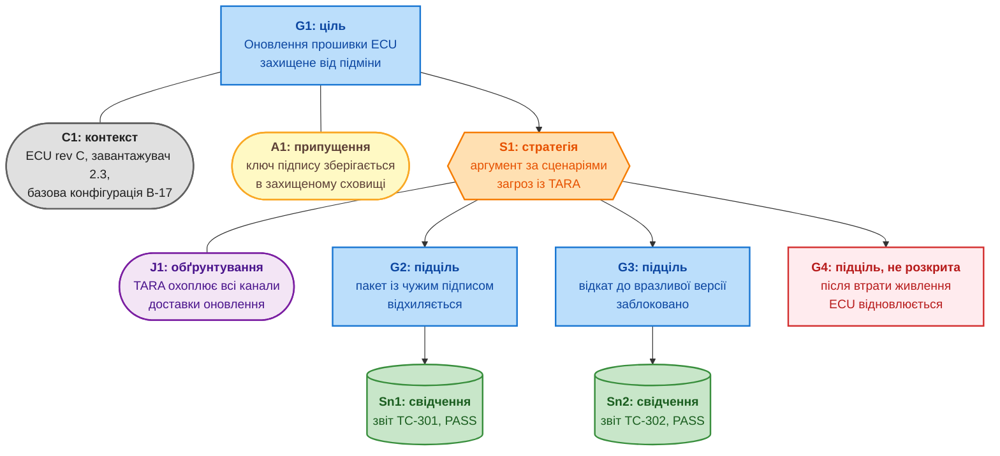
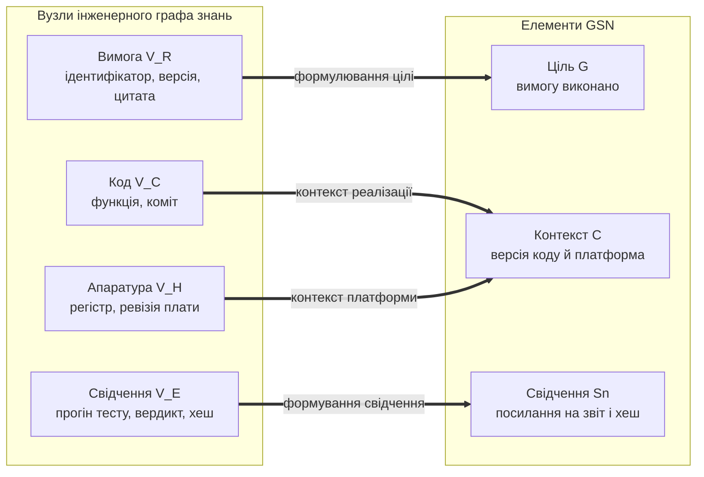
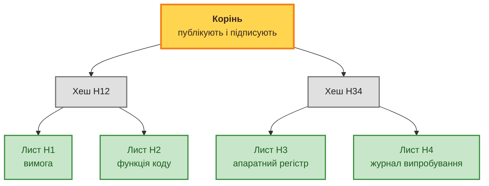
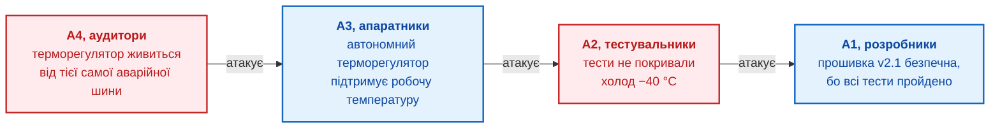

# Глава 27. Синтез сертифікаційних доказів за Goal Structuring Notation (GSN): від графа EKG до аудиторського звіту

> **Книга:** [Архітектура доказових експертних систем](README.md) · [Частина VI: Передовий край: регуляторна сертифікація та нейро-символьний ШІ](part-06-frontiers-neuro-symbolic.md)  
> **Попередня глава:** [Глава 26. Неперервне навчання (Continual Learning) на досвіді та подолання зсуву системного журналу](ch26-continual-learning.md)  
> **Наступна глава:** [Глава 28. Дворежимні експертні системи: поєднання строгої дедукції (Fail-Closed) та евристичного дорадчого виведення (CBR)](ch28-dual-mode-expert-systems.md)  
> **Зміст книги:** [README.md](README.md)  
> **Автор:** [Микола Федчик](about-the-author.md)  
> **Рівень:** середній і поглиблений: системні архітектори, інженери й аудитори функційної безпеки, розробники критичних систем  
> **Очікувані результати:** будувати обґрунтування безпеки в нотації GSN з цілей, стратегій, контекстів, припущень, обґрунтувань і свідчень; синтезувати каркас аргументу з інженерного графа знань; перевіряти аргумент формальними правилами повноти, підтвердженості свідчень, узгодженості контекстів і відсутності циклів; фіксувати цілісність аргументу деревом Меркла й вибірково розкривати окремі свідчення з доказом включення; облікувати заперечення через рамку аргументації Зунга; розрізняти, що перевіряє машина, а що лишається відповідальністю фахівця.

Обґрунтування безпеки (*safety case*) має переконати незалежного оцінювача, що виріб прийнятно безпечний у визначеному застосуванні. На практиці обґрунтування часто перетворюється на документ, який пишуть наприкінці проєкту, щоб пройти перевірку. Незалежний огляд обставин втрати літака Nimrod MR2 XV230 Королівських повітряних сил Великої Британії (*Royal Air Force*, RAF) в Афганістані 2006 року, який провів Чарльз Геддон-Кейв, назвав обґрунтування безпеки цього літака «жалюгідною роботою від початку до кінця» і констатував, що складання обґрунтування стало «по суті паперовою вправою з проставлянням галочок» [[1]](#src-1).

Ця глава відповідає на запитання: **як перетворити перевірені інженерні факти на аргумент безпеки, який машина може перевірити на повноту й цілісність, і де закінчується те, що машина здатна довести?** Теза глави: **нотація GSN дає аргументу явну структуру, інженерний граф знань дає цій структурі простежувані свідчення, формальні правила знаходять нерозкриті цілі й непідтверджені свідчення, дерево Меркла фіксує, на яких саме артефактах побудовано аргумент, а рамка аргументації Зунга не дає неспростованим запереченням непомітно зникнути. Машина перевіряє структуру, цілісність і логічну форму, але не істинність засновків і не достатність стратегії: ці питання лишаються за фахівцем.**

## Чому обґрунтування безпеки перетворюється на паперову вправу

Огляд Геддон-Кейва описує механізм, який повторюється далеко за межами авіації. Ті, хто складав обґрунтування, виходили з припущення, що літак «і так безпечний», бо успішно літав тридцять років, і тому документ став формальністю, а не аналізом [[1]](#src-1). Серед системних недоліків огляд окремо називає режим обґрунтувань безпеки, який був неефективним і марнотратним [[1]](#src-1). Із цього випадку випливають чотири інженерні проблеми.

**Відрив документа від виробу.** Обґрунтування пишуть після розробки, тому текст може стверджувати, що прошивка використовує два незалежні таймери, тоді як у коді останньої версії обидва канали давно перейшли на спільний таймер. Документ лишається узгодженим сам із собою, але не з виробом.

**Відповідність процедурі замість аналізу.** Виконання кожного пункту переліку не означає, що аргумент переконливий: проставлена галочка свідчить, що крок зроблено, але не свідчить, що крок виявив реальні небезпеки.

**Масштаб ручної перевірки.** Обґрунтування складного виробу посилається на тисячі вимог, звітів і журналів випробувань. Оцінювач фізично не може вручну звірити кожне посилання з поточною версією артефакта, тому перевіряє вибірково.

**Інтелектуальна власність.** Виробник неохоче передає сторонньому оцінювачеві весь вихідний код і схемотехніку, а оцінювачеві потрібна впевненість, що показані йому фрагменти справді належать до того самого аргументу.

Експертна система з попередніх частин книги має для цих проблем готовий матеріал: [Глава 9](ch09-engineering-knowledge-graph-traceability.md) зберігає вимоги, код, апаратні регістри й результати випробувань в інженерному графі знань (*Engineering Knowledge Graph*, EKG), а [Глава 25](ch25-how-expert-systems-learn.md) показує, як ланцюги від вимоги до доказу проходять іспит. Залишається подати ці ланцюги у формі, яку визнає оцінювач.

## Нотація GSN

Нотація структурування цілей (*Goal Structuring Notation*, GSN) є графічною мовою аргументів безпеки. Чинну версію 3 стандарту GSN підтримує Робоча група з аргументів гарантування (*Assurance Case Working Group*, ACWG) Клубу критичних для безпеки систем (*Safety-Critical Systems Club*, SCSC). Стандарт має дві функції: дати авторитетне визначення нотації й описати найкращу практику для тих, хто створює, читає й затверджує інженерні аргументи [[2]](#src-2). Аргумент GSN складається з шести основних елементів:

- **ціль** (*goal*) є твердженням, яке треба довести, наприклад «оновлення прошивки ECU захищене від підміни пакета»;
- **стратегія** (*strategy*) описує спосіб, яким ціль розкладають на підцілі, наприклад «аргумент за сценаріями загроз із TARA»;
- **контекст** (*context*) задає межі, у яких твердження чинне: ревізію апаратури, версію завантажувача, базову конфігурацію;
- **припущення** (*assumption*) фіксує те, що аргумент приймає без доведення, наприклад «ключ підпису зберігається в захищеному сховищі»;
- **обґрунтування** (*justification*) пояснює, чому обрана стратегія достатня;
- **свідчення** (*solution*) посилається на конкретний доказ: звіт випробування, результат статичного аналізу, протокол перевірки.

Ціль, яку ще не підтримує жодна стратегія чи свідчення, позначають як нерозкриту (*undeveloped*). Версія 3 стандарту додала діалектичну нотацію: відношення «заперечує» (*challenges*) дозволяє записати контраргумент або контрсвідчення до будь-якого елемента, а позначка «спростовано» (*defeated*) показує елемент, який заперечення подолало. Робоча група прямо пов'язує це нововведення з критикою Геддон-Кейва щодо упередженості обґрунтувань безпеки [[3]](#src-3). Схема показує аргумент для захищеного оновлення прошивки електронного блоку керування (*Electronic Control Unit*, ECU), який уже розглядала [Глава 25](ch25-how-expert-systems-learn.md).



Аргумент читають згори вниз. Ціль G1 чинна лише в контексті C1 і за припущення A1. Стратегія S1 розкладає G1 на три підцілі, а обґрунтування J1 пояснює, чому трьох підцілей достатньо. Дві підцілі спираються на звіти випробувань, а підціль G4 виділено червоним: свідчення для неї немає, тому весь аргумент поки неповний. Саме таку прогалину машинна перевірка має знаходити автоматично.

## Синтез аргументу з інженерного графа знань

Вручну аргумент GSN складають тижнями в графічному редакторі, і він застаріває з першою ж зміною коду. Якщо вимоги, код, апаратні регістри й результати випробувань уже зберігаються в EKG, каркас аргументу можна вивести обходом графа. Схема показує, які вузли графа стають якими елементами GSN.



Синтез виконують у п'ять кроків. Спершу формулюють кореневу ціль для виробу $\mathcal{S}$ у конфігурації $\mathcal{K}$:

```math
G_{\mathrm{root}}=\text{«}\mathcal{S}\text{ у конфігурації }\mathcal{K}\text{ виконує обов'язкові вимоги документа }\mathrm{STD}\text{»}.
```

- Для кореневої цілі $G_{\mathrm{root}}$ символ $\mathcal{S}$ є виробом, а $\mathcal{K}$ його конфігурацією;
- $\mathrm{STD}$ позначає нормативний документ із вимогами;
- Знак $=$ задає текст цілі: виріб у визначеній конфігурації має виконувати обов'язкові вимоги названого документа.

Читається так: це формулювання того, що аргумент має обґрунтувати для конкретного виробу, конфігурації та документа. Формула не доводить виконання вимог, а лише задає ціль перевірки.

Далі запит до графа відбирає обов'язкові вимоги за модальністю, яку [Глава 14](ch14-requirements-detection-and-formalization.md) витягла з тексту стандарту:

```math
\mathcal{R}_{\mathrm{mand}}=\{\,r\in V_R \mid r.\mathrm{modality}\in\{\mathrm{SHALL},\mathrm{MUST}\}\,\}.
```

- Множина $\mathcal{R}_{\mathrm{mand}}$ містить обов'язкові вимоги, а $r$ є окремою вимогою;
- $V_R$ є множиною вузлів вимог у графі, $\in$ означає належність до множини, а вертикальна риска читається «за умови, що»;
- $r.\mathrm{modality}$ є полем модальності вимоги, а $`\{\mathrm{SHALL},\mathrm{MUST}\}`$ перелічує дві модальності обов'язковості;
- Фігурні дужки задають множину, а зовнішні дужки-умови відбирають лише ті вузли, чиє поле модальності збігається з одним із цих значень.

Отже, запит не добирає рекомендації чи дозволи, а відбирає вимоги зі значенням `SHALL` або `MUST`. Коректність добору залежить від правильного розпізнавання модальності у вузлах графа.

Для кожної вимоги $r\in\mathcal{R}_{\mathrm{mand}}$ створюють підціль $G_r$: «вимогу $r$ реалізовано й перевірено», з точною цитатою вимоги та її хешем. Через ребра `satisfies` і `configures` знаходять функції коду $c\in V_C$ і регістри $h\in V_H$, пов'язані з вимогою, і додають їх як контекст із комітом і ревізією. Нарешті, через ребра `verifies` і `produced_by` знаходять свідчення $e\in V_E$: звіти тестів автомата станів, мутаційного тестування, структурного покриття, записи шини на апаратному стенді. Кожне знайдене свідчення стає елементом $Sn$.

Автоматичний синтез має межу, яку варто назвати прямо. Граф дає цілі, контексти й свідчення, але не дає стратегій і обґрунтувань: чому розкладання за сценаріями загроз достатнє, вирішує фахівець. Юен Денні та Ганеш Пай описали методологію, у якій автоматично згенеровані фрагменти аргументу, отримані формальним методом для програмного забезпечення, поєднуються з фрагментами, які фахівці побудували вручну за результатами системного аналізу безпеки [[4]](#src-4). Синтез за графом відповідає саме такому розподілу ролей: машина збирає простежувану частину, людина відповідає за аргументаційну.

## Формальні правила перевірки аргументу

Синтезоване дерево має пройти перевірку до того, як потрапить до оцінювача. Аргумент $\mathcal{T}$ вважають структурно коректним, якщо виконано чотири правила:

```math
\mathrm{Valid}_{\mathrm{GSN}}(\mathcal{T})\iff\bigwedge_{i=1}^{4}\mathcal{P}_i(\mathcal{T}).
```

- Перевірка $\mathrm{Valid}_{\mathrm{GSN}}(\mathcal{T})$ оцінює структурну коректність аргументу $\mathcal{T}$;
- $\iff$ означає «тоді й лише тоді», а $\bigwedge_{i=1}^{4}$ вимагає одночасного виконання чотирьох умов;
- $i$ нумерує умови від 1 до 4, а $\mathcal{P}_i(\mathcal{T})$ є перевіркою з номером $i$ для цього аргументу.

Практично аргумент проходить структурну перевірку лише за істинності всіх чотирьох предикатів. Результат не засвідчує правдивість свідчень або достатність аргументації.

**Правило повноти розкриття.** Кожна ціль підтримана хоча б однією стратегією, підціллю чи свідченням, тобто нерозкритих цілей немає:

```math
\mathcal{P}_1:\ \forall g\in\mathrm{Goals}(\mathcal{T})\ \ \deg^{+}(g)>0.
```

- У першому правилі $g$ є ціллю, а $\mathrm{Goals}(\mathcal{T})$ множиною всіх цілей аргументу $\mathcal{T}$;
- $\forall$ означає «для кожної», а $\deg^{+}(g)$ є кількістю вихідних ребер підтримки з цілі $g$;
- $>0$ вимагає щонайменше одного такого ребра, а $\mathcal{P}_1$ позначає першу перевірку.

Перевірка виявляє цілі без розкриття. Вона не оцінює якість стратегії чи свідчення, на які веде ребро.

**Правило підтвердженості свідчень.** Кожне свідчення має позитивний вердикт, а хеш артефакта, на який свідчення посилається, збігається з хешем, записаним у вузлі:

```math
\mathcal{P}_2:\ \forall s\in\mathrm{Solutions}(\mathcal{T})\ \ s.\mathrm{verdict}=\mathrm{PASS}\ \land\ H(s.\mathrm{artifact})=s.\mathrm{digest}.
```

- У другому правилі $s$ є вузлом розв'язання або свідчення з множини $\mathrm{Solutions}(\mathcal{T})$;
- $s.\mathrm{verdict}$ є вердиктом вузла й має дорівнювати $\mathrm{PASS}$;
- $H(s.\mathrm{artifact})$ є хешем артефакта, а $s.\mathrm{digest}$ записаним у вузлі очікуваним хешем;
- $\forall$ перевіряє кожен такий вузол, $\land$ вимагає одночасно позитивного вердикту й збігу хешів, а $=$ означає рівність хешів.

Правило підтверджує, що зафіксований артефакт не змінився та має вердикт `PASS`. Воно не підтверджує, що тест перевіряє потрібну властивість.

**Правило узгодженості контекстів.** Жодна гілка не поєднує взаємовиключних контекстів, наприклад звіт, отриманий на ревізії плати D, у гілці, чинній для ревізії C:

```math
\mathcal{P}_3:\ \forall g\in\mathrm{Goals}(\mathcal{T})\ \ \mathrm{Consistent}(\mathrm{Context}(g)).
```

- У третьому правилі $g$ проходить усі цілі з $\mathrm{Goals}(\mathcal{T})$;
- $\mathrm{Context}(g)$ є контекстом, прив'язаним до цілі, а $\mathrm{Consistent}(\cdot)$ перевіряє його внутрішню узгодженість;
- $\forall$ вимагає узгодженості кожного контексту, а $\mathcal{P}_3$ позначає третій предикат.

Читається так: кожна гілка аргументу має стосуватися сумісних версій виробу, коду й випробувань. Перевірка залежить від повноти правил узгодження контексту.

**Правило відсутності циклів.** Граф підтримки ациклічний, тож аргумент «A безпечне, бо безпечне Б, а Б безпечне, бо безпечне A» неможливий:

```math
\mathcal{P}_4:\ \mathrm{IsDAG}(\mathcal{T}).
```

- У четвертому правилі $\mathcal{T}$ є графом аргументу;
- $\mathrm{IsDAG}(\mathcal{T})$ перевіряє, чи є граф орієнтованим ациклічним графом, тобто чи немає шляху ребер назад до початкового вузла;
- $\mathcal{P}_4$ позначає четвертий предикат перевірки.

Отже, граф не може підтримувати ціль через замкнене коло цілей. Ациклічність усуває циклічне обґрунтування, але не перевіряє його зміст.

Ці правила перевіряють форму аргументу, а не його зміст. Джон Рашбі, розглядаючи формалізацію обґрунтувань безпеки, наголошує, що мета формалізму полягає в механічній перевірці логічної коректності аргументу, а не в заміні GSN, і що логіка гарантує висновок лише за умови засновків, у яких аналітик може бути не цілком упевнений [[5]](#src-5). Правило $\mathcal{P}_2$ підтверджує, що звіт TC-301 існує, не змінений і має вердикт PASS, але не підтверджує, що тест TC-301 справді перевіряє відхилення чужого підпису.

## Цілісність аргументу: дерево Меркла й вибіркове розкриття

Після перевірки аргумент передають оцінювачеві. Потрібно, щоб оцінювач міг переконатися: показані йому вузли належать саме до того аргументу, який перевіряли, і жоден вузол не змінили після перевірки. Для цього над канонічними записами вузлів будують дерево Меркла, яке Ральф Меркл запропонував для цифрових підписів [[6]](#src-6). Кожен лист є хешем запису вузла, кожен внутрішній вузол є хешем пари нащадків, а корінь фіксує весь аргумент одним значенням. Схема показує дерево для чотирьох записів.



Зміна будь-якого листа змінює хеші на шляху до кореня, тому опублікований і підписаний корінь фіксує весь аргумент. Щоб перевірити один лист, не потрібні інші записи: досить шляху включення, тобто хешів братніх вузлів на шляху від листа до кореня. Специфікація прозорості сертифікатів RFC 6962 визначає хеш дерева з префіксом `0x00` для листів і `0x01` для внутрішніх вузлів; таке розділення доменів потрібне для стійкості до пошуку другого прообразу [[7]](#src-7):

```math
\mathrm{MTH}(\{d_0\})=\mathrm{SHA256}(\mathtt{0x00}\,\|\,d_0),
\qquad
\mathrm{MTH}(D_n)=\mathrm{SHA256}\bigl(\mathtt{0x01}\,\|\,\mathrm{MTH}(D_{0:k})\,\|\,\mathrm{MTH}(D_{k:n})\bigr).
```

- Для функції $\mathrm{MTH}$ аргумент $`\{d_0\}`$ є одним записом, а $D_n$ є послідовністю з $n$ листів;
- $\mathrm{SHA256}$ є хеш-функцією SHA-256 зі стандарту FIPS 180-4 [[8]](#src-8), а $d_0$ є байтами запису листа;
- Префікси $\mathtt{0x00}$ і $\mathtt{0x01}$ позначають відповідно лист і внутрішній вузол, а $`\|`$ означає конкатенацію байтів;
- $k$ є найбільшим степенем двійки, меншим за $n$; $D_{0:k}$ і $D_{k:n}$ є лівою та правою частинами послідовності, хеші яких рекурсивно об'єднуються.

На практиці одиночний лист хешують із префіксом `0x00`, а гілку дерева утворюють конкатенацією префікса `0x01` і двох дочірніх хешів. Хеші мають фіксовану довжину, але корінь засвідчує цілісність даних, а не їхню правдивість. Алгоритм перевірки шляху включення наводить RFC 9162 [[9]](#src-9). Щоб хеш запису не залежав від порядку полів і пробілів, запис серіалізують канонічно, наприклад за схемою канонікалізації JSON із RFC 8785 [[10]](#src-10).

Межі цього механізму треба розуміти точно. Корінь Меркла доводить цілісність і належність: показаний оцінювачеві запис входить до зафіксованого аргументу й не змінений. Корінь не доводить, що запис правдивий, тест коректний, а аргумент достатній. Механізм також не є доказом із нульовим розголошенням: оцінювач бачить кожен розкритий запис повністю, а нерозкриті записи просто не бачить і не може оцінити. Хеші сусідніх листів у шляху включення теж можуть розкрити вміст: якщо запис короткий і передбачуваний, оцінювач може перебрати кандидатів і захешувати кожного. Тому до кожного запису додають випадкову або секретно виведену сіль, яку розкривають лише разом із самим записом. Вибіркове розкриття зменшує обсяг переданих даних, але відповідальність за зміст нерозкритих частин лишається на виробникові й на тому, хто підписав корінь.

## Заперечення як частина аргументу: рамка Зунга

Дерево GSN добре подає вже узгоджені докази. Під час розробки й розслідувань, однак, різні групи висувають конкурентні твердження, а нові випробування спростовують старі. Якщо заперечення живуть в окремому листуванні, аргумент виглядає завершеним, хоча одне із заперечень ніхто не відбив. Діалектична нотація GSN версії 3 дозволяє записати заперечення в самому аргументі [[3]](#src-3), а формальну семантику для вирішення, які твердження вистояли, дає абстрактна рамка аргументації Фан Мінь Зунга [[11]](#src-11).

Рамка аргументації є парою $AF=\langle\mathcal{A},\mathcal{R}\rangle$, де $\mathcal{A}$ є скінченною множиною аргументів, а $\mathcal{R}\subseteq\mathcal{A}\times\mathcal{A}$ відношенням атаки: $(B,A)\in\mathcal{R}$ означає, що аргумент $B$ атакує аргумент $A$. Схема показує чотири аргументи з обговорення прошивки.



Зунг визначив кілька семантик прийнятності. Множина аргументів $S$ є **допустимою**, якщо всередині неї немає атак і для кожного аргументу $B$, що атакує член $S$, у $S$ є аргумент, що атакує $B$. **Обґрунтоване розширення** (*grounded extension*) є найменшою повною множиною, тобто позицією найбільшого скептицизму: до неї входить лише те, що захищене від усіх атак без жодних припущень. **Кращі розширення** (*preferred extensions*) є максимальними допустимими множинами й відповідають альтернативним узгодженим позиціям [[11]](#src-11). Для схеми обґрунтоване розширення обчислюють покроково: A4 ніхто не атакує, тому A4 прийнято; A3 атакований прийнятим A4, тому A3 відкинуто; A2 атакований лише відкинутим A3, тому A2 прийнято; A1 атакований прийнятим A2, тому A1 відкинуто. Обґрунтоване розширення дорівнює $`\{A2,A4\}`$.

Звідси правило для обґрунтування безпеки: ціль переходить до аргументу як встановлена лише тоді, коли аргумент на її користь належить до обґрунтованого розширення. Твердження A1 «прошивка безпечна» до аргументу не переходить: у термінах GSN версії 3 ціль має неспростоване заперечення A2, і поки тест на холоді не виконано або живлення терморегулятора не розділено, ціль лишається відкритою.

## Програмна перевірка: від правил до доказу включення

Програма нижче зводить механізми глави в один прогін. Вона будує аргумент зі схеми GSN, спершу перевіряє цілісність посилань (перевірка P0: кожне посилання веде на наявний вузол і звіт), потім правила $\mathcal{P}_1$–$`\mathcal{P}_4`$. Правило $\mathcal{P}_1$ тут також відхиляє стратегію без дочірніх елементів, а $\mathcal{P}_3$ звіряє ревізію не лише контекстів, а й стенда, на якому отримано свідчення. Далі програма додає відсутнє свідчення, обчислює корінь Меркла за RFC 6962, показує виявлення підміни звіту, перевіряє доказ включення й обчислює обґрунтоване розширення. Кожен запис листа має сіль (*salt*), обчислену із секрету виробника: без солі оцінювач, який отримав хеш сусіднього листа в доказі включення, міг би вгадати короткий передбачуваний запис перебором кандидатів. Потрібна лише стандартна бібліотека Python 3.10 або новішого; канонікалізацію JSON спрощено до сортування ключів, що достатньо для рядків і цілих чисел у прикладі.

<details>
<summary>Приклад мовою Python: перевірка аргументу GSN, дерево Меркла й обґрунтоване розширення</summary>

```python
"""Перевірка аргументу GSN, дерево Меркла за RFC 6962 і обґрунтоване розширення Зунга.

Лише стандартна бібліотека Python 3.10+.
"""
import copy
import hashlib
import hmac
import json

ARTIFACTS = {  # вміст звітів, на які посилаються свідчення
    "rep-sig": b"TC-301 wrong signature: package rejected, verdict PASS",
    "rep-rollback": b"TC-302 rollback to 2.1: blocked, verdict PASS",
}
NODES = [
    {"id": "G1", "type": "goal", "text": "Оновлення прошивки ECU захищене від підміни", "supported_by": ["S1"], "context": ["C1"]},
    {"id": "C1", "type": "context", "text": "ECU rev C, завантажувач 2.3, базова конфігурація B-17", "hw": "C"},
    {"id": "S1", "type": "strategy", "text": "Аргумент за сценаріями загроз із TARA", "supported_by": ["G2", "G3", "G4"]},
    {"id": "G2", "type": "goal", "text": "Пакет із чужим підписом відхиляється", "supported_by": ["Sn1"]},
    {"id": "G3", "type": "goal", "text": "Відкат до вразливої версії заблоковано", "supported_by": ["Sn2"]},
    {"id": "G4", "type": "goal", "text": "Після втрати живлення ECU відновлюється", "supported_by": []},
    {"id": "Sn1", "type": "solution", "artifact": "rep-sig", "verdict": "PASS", "hw": "C"},
    {"id": "Sn2", "type": "solution", "artifact": "rep-rollback", "verdict": "PASS", "hw": "C"},
]
SECRET = b"producer-salt-key"  # секрет виробника; фіксований лише для відтворюваності прикладу


def sha(data):
    return hashlib.sha256(data).digest()


def seal(nodes, artifacts):
    for node in nodes:
        if node["type"] == "solution":
            node["digest"] = sha(artifacts[node["artifact"]]).hex()


def validate(nodes, artifacts):
    by_id = {n["id"]: n for n in nodes}
    problems = []
    for n in nodes:  # P0: посилання ведуть на наявні вузли й звіти
        for ref in n.get("supported_by", []) + n.get("context", []):
            if ref not in by_id:
                problems.append(f"P0: {n['id']} посилається на відсутній вузол {ref}")
        if n["type"] == "solution" and n["artifact"] not in artifacts:
            problems.append(f"P0: свідчення {n['id']} без звіту {n['artifact']}")
    if problems:
        return problems
    for n in nodes:  # P1: жодної нерозкритої цілі чи порожньої стратегії
        if n["type"] in ("goal", "strategy") and not n.get("supported_by"):
            kind = "ціль" if n["type"] == "goal" else "стратегія"
            problems.append(f"P1: {kind} {n['id']} не розкрита")
    for n in nodes:  # P2: свідчення пройдене й хеш збігається
        if n["type"] == "solution":
            if n["verdict"] != "PASS" or sha(artifacts[n["artifact"]]).hex() != n.get("digest"):
                problems.append(f"P2: свідчення {n['id']} не підтверджене")
    hw = {n["hw"] for n in nodes if "hw" in n}
    if len(hw) > 1:  # P3: контексти й свідчення стосуються однієї ревізії
        problems.append(f"P3: суперечливі ревізії {sorted(hw)}")
    state = {}

    def cyclic(node_id):  # P4: граф без циклів
        state[node_id] = "active"
        for child in by_id[node_id].get("supported_by", []):
            if state.get(child) == "active" or (child not in state and cyclic(child)):
                return True
        state[node_id] = "done"
        return False

    if any(cyclic(n["id"]) for n in nodes if n["id"] not in state):
        problems.append("P4: цикл в аргументі")
    return problems


def leaves(nodes, secret):  # сіль приховує вміст нерозкритих записів від перебору
    records = []
    for n in nodes:
        salt = hmac.new(secret, n["id"].encode(), hashlib.sha256).hexdigest()
        records.append(json.dumps({**n, "salt": salt}, sort_keys=True, ensure_ascii=False, separators=(",", ":")))
    return [r.encode("utf-8") for r in sorted(records)]


def mth(items):  # хеш дерева Меркла за RFC 6962
    if len(items) == 1:
        return sha(b"\x00" + items[0])
    k = 1
    while k * 2 < len(items):
        k *= 2
    return sha(b"\x01" + mth(items[:k]) + mth(items[k:]))


def path(m, items):  # шлях включення за RFC 6962
    if len(items) == 1:
        return []
    k = 1
    while k * 2 < len(items):
        k *= 2
    if m < k:
        return path(m, items[:k]) + [mth(items[k:])]
    return path(m - k, items[k:]) + [mth(items[:k])]


def verify_inclusion(index, size, leaf, proof, root):  # алгоритм RFC 9162, 2.1.3.2
    fn, sn, r = index, size - 1, sha(b"\x00" + leaf)
    for p in proof:
        if sn == 0:
            return False
        if fn & 1 or fn == sn:
            r = sha(b"\x01" + p + r)
            while not fn & 1 and fn != 0:
                fn, sn = fn >> 1, sn >> 1
        else:
            r = sha(b"\x01" + r + p)
        fn, sn = fn >> 1, sn >> 1
    return sn == 0 and r == root


def grounded(arguments, attacks):  # найменша нерухома точка за Зунгом
    accepted, rejected = set(), set()
    while True:
        new_in = {a for a in arguments - accepted - rejected
                  if all(b in rejected for b, t in attacks if t == a)}
        new_out = {a for a in arguments - accepted - rejected
                   if any(b in accepted | new_in for b, t in attacks if t == a)}
        if not new_in and not new_out:
            return accepted, rejected
        accepted |= new_in
        rejected |= new_out


def test_validator():
    def broken(change):
        nodes = copy.deepcopy(NODES)
        change({n["id"]: n for n in nodes})
        return validate(nodes, ARTIFACTS)

    assert broken(lambda n: n["S1"]["supported_by"].append("G9"))[0].startswith("P0")
    assert broken(lambda n: n["Sn1"].update(artifact="rep-missing"))[0].startswith("P0")
    assert "P1: стратегія S1 не розкрита" in broken(lambda n: n["S1"].update(supported_by=[]))
    assert "P4: цикл в аргументі" in broken(lambda n: n["G2"]["supported_by"].append("G1"))
    assert "P3: суперечливі ревізії ['C', 'D']" in broken(lambda n: n["Sn2"].update(hw="D"))


seal(NODES, ARTIFACTS)
test_validator()
print("1. Перевірка аргументу:", validate(NODES, ARTIFACTS) or "усі правила виконано")
G4 = next(n for n in NODES if n["id"] == "G4")
ARTIFACTS["rep-power"] = b"TC-303 rev D power cut during write: recovered, verdict PASS"
NODES.append({"id": "Sn3", "type": "solution", "artifact": "rep-power", "verdict": "PASS", "hw": "D"})
G4["supported_by"] = ["Sn3"]
seal(NODES, ARTIFACTS)
print("2. Додано Sn3 зі стенда rev D:", validate(NODES, ARTIFACTS))
ARTIFACTS["rep-power"] = b"TC-303 rev C power cut during write: recovered, verdict PASS"
NODES[-1]["hw"] = "C"
seal(NODES, ARTIFACTS)
print("3. TC-303 повторено на rev C:", validate(NODES, ARTIFACTS) or "усі правила виконано")
items = leaves(NODES, SECRET)
root = mth(items)
print("4. Корінь Меркла:", root.hex()[:16], "для", len(items), "вузлів")
ARTIFACTS["rep-sig"] = ARTIFACTS["rep-sig"].replace(b"rejected", b"accepted")
print("5. Звіт TC-301 змінено:", validate(NODES, ARTIFACTS))
for n in NODES:
    if n["id"] == "Sn1":
        n["digest"] = sha(ARTIFACTS["rep-sig"]).hex()
print("6. Хеш у вузлі теж оновлено:", validate(NODES, ARTIFACTS) or "усі правила виконано",
      "| корінь збігається з опублікованим:", mth(leaves(NODES, SECRET)) == root)
index = next(i for i, r in enumerate(items) if b'"id":"Sn2"' in r)
proof = path(index, items)
print("7. Доказ включення Sn2:", verify_inclusion(index, len(items), items[index], proof, root),
      f"({len(proof)} хеші замість {len(items) - 1} інших вузлів)")
forged = next(r for r in leaves(NODES, SECRET) if b'"id":"Sn1"' in r)
original = next(i for i, r in enumerate(items) if b'"id":"Sn1"' in r)
print("   Доказ включення зміненого Sn1:", verify_inclusion(original, len(items), forged, path(original, items), root))
accepted, _ = grounded({"A1", "A2", "A3", "A4"}, {("A2", "A1"), ("A3", "A2"), ("A4", "A3")})
print("8. Обґрунтоване розширення:", sorted(accepted))
mutual = {"A5", "A6"}
accepted, rejected = grounded(mutual, {("A5", "A6"), ("A6", "A5")})
print("   Взаємна атака A5 і A6: прийнято", sorted(accepted), "| нерозв'язано", sorted(mutual - accepted - rejected))
```

</details>

Запуск `python gsn_merkle.py` дає:

<details>
<summary>Вивід програми</summary>

```text
1. Перевірка аргументу: ['P1: ціль G4 не розкрита']
2. Додано Sn3 зі стенда rev D: ["P3: суперечливі ревізії ['C', 'D']"]
3. TC-303 повторено на rev C: усі правила виконано
4. Корінь Меркла: 8d2bbbc813e23883 для 9 вузлів
5. Звіт TC-301 змінено: ['P2: свідчення Sn1 не підтверджене']
6. Хеш у вузлі теж оновлено: усі правила виконано | корінь збігається з опублікованим: False
7. Доказ включення Sn2: True (4 хеші замість 8 інших вузлів)
   Доказ включення зміненого Sn1: False
8. Обґрунтоване розширення: ['A2', 'A4']
   Взаємна атака A5 і A6: прийнято [] | нерозв'язано ['A5', 'A6']
```

</details>

Рядок 1 знаходить ту саму прогалину, що й червоний вузол на схемі GSN: ціль G4 без свідчення. Рядок 2 показує типову пастку: звіт TC-303 має вердикт PASS, але його отримано на ревізії плати D, тоді як аргумент чинний для ревізії C, тому правило $\mathcal{P}_3$ зупиняє такий аргумент. Лише після повторення тесту на ревізії C усі правила виконано, і рядок 4 фіксує аргумент коренем Меркла. Рядки 5 і 6 показують два рівні захисту від підміни. Якщо змінити звіт TC-301 так, що чужий пакет нібито прийнято, правило $\mathcal{P}_2$ одразу бачить розбіжність хешу. Якщо порушник оновить і хеш у вузлі, внутрішні правила знову виконано, але новий корінь не збігається з опублікованим, тому підміну виявить кожен, хто має підписаний корінь. Рядок 7 показує вибіркове розкриття: оцінювач перевіряє належність свідчення Sn2 до аргументу за чотирма хешами шляху, не бачачи восьми інших вузлів, а змінений запис Sn1 перевірку включення не проходить. Рядок 8 підтверджує ручне обчислення: обґрунтоване розширення $`\{A2,A4\}`$ не містить твердження A1. Останній рядок показує третій статус: два взаємно атакуючі аргументи не прийнято й не відкинуто, тож суперечка лишається нерозв'язаною. Для обґрунтування безпеки нерозв'язаний аргумент не є ні доведеним, ні спростованим; потрібне нове свідчення або рішення відповідальної особи. Вбудований тест перед прогоном перевіряє посилання на відсутній вузол чи звіт, порожню стратегію, цикл і свідчення з іншої ревізії.

Приклад має межі. Канонікалізацію спрощено, секрет солі зафіксовано в коді лише для відтворюваності, а ключ підпису кореня й інфраструктуру публікації не показано. Перевірка $\mathcal{P}_3$ розглядає лише одну ознаку контексту й вимагає однієї ревізії для всього аргументу; реальний аргумент може мати гілки для різних варіантів з окремо обґрунтованим перенесенням свідчень. Сіль захищає лише від перебору вмісту за хешем і лише доки секрет не розкрито; структура дерева й кількість листів усе одно видимі. Головна межа не технічна: програма не знає, чи справді тест TC-303 перериває живлення в найгірший момент запису. Цю частину аргументу перевіряє фахівець.

## Сучасні засоби й аналіз даних для аргументів гарантування

Навчальна програма зберігає аргумент у власному словнику й сама перевіряє цілісність. У виробничому процесі аргумент передають між організаціями, а свідчення створюють різні конвеєри. Для цих задач існують відкриті моделі й засоби. Жоден із них не оцінює достатності аргументу.

| Засіб або модель | Прикладна роль | Що не гарантується |
|---|---|---|
| Метамодель SACM від OMG [[12]](#src-12) | обмін аргументами й свідченнями між інструментами системної інженерії | структура обміну не визначає критеріїв достатності предметного аргументу |
| Атестації in-toto й походження SLSA [[13]](#src-13) [[14]](#src-14) | підписані метадані про те, хто, з яких входів і на якій платформі створив артефакт свідчення | атестація свідчить про процес створення, а не про правильність тесту; перевірник має довіряти парі «підписувач і платформа» |
| Журнал прозорості Rekor [[15]](#src-15) | публікація кореня або атестації в журналі лише з дописуванням, перевірка включення й узгодженості журналу | публічний журнал розкриває метадані, тому закритим проєктам потрібен власний екземпляр і політика доступу |
| Засоби аргументації на основі програмування наборів відповідей, наприклад ASPARTIX [[16]](#src-16) | обчислення обґрунтованих, кращих та інших розширень для великих рамок | семантику розширень обирає людина; засіб не вирішує, яке заперечення суттєве |

Робін Блумфілд і Джон Рашбі в маніфесті Assurance 2.0 пропонують неперервне поступове гарантування з більшою увагою до міркування, свідчень і явних спростувачів (*defeaters*) [[17]](#src-17). Джон Ґуденаф, Чарльз Вайнсток і Арі Кляйн описали елімінативну аргументацію (*eliminative argumentation*): довіра до твердження зростає з кількістю усунених причин сумніву [[18]](#src-18). Для експертної системи з цього випливає практичне правило: кожне спрацьоване правило цієї глави (нерозкрита ціль, чужа ревізія, змінений хеш) стає записаним спростувачем, а не забутим рядком журналу перевірки.

З аналізу даних для аргументів гарантування корисні два напрями. Перший напрям відновлює пропущені зв'язки простежуваності між вимогами, кодом і тестами: Цзінь Го, Цзінхуей Чень і Джейн Клеланд-Гуанг навчили нейронну мережу пропонувати такі зв'язки за наявними трасами проєкту [[19]](#src-19). Другий напрям аналізує історію зауважень оцінювачів: які типи цілей, стратегій і свідчень частіше повертають на доопрацювання. Обидва напрями дають кандидатів для перегляду. Запропонований моделлю зв'язок стає ребром графа лише після затвердження фахівцем, інакше аргумент спиратиметься на статистичну схожість текстів.

## Висновок

Відповідь на головне питання глави така: перевірені інженерні факти перетворюються на аргумент безпеки, коли інженерний граф знань дає цілям, контекстам і свідченням простежуване походження, нотація GSN дає аргументу явну структуру, а машинна перевірка знаходить нерозкриті цілі, непідтверджені свідчення, суперечливі контексти й цикли. Дерево Меркла фіксує, на яких саме записах побудовано аргумент, і дає змогу розкривати окремі свідчення з доказом включення. Рамка аргументації Зунга вирішує, які твердження вистояли проти заперечень, і не дає неспростованому запереченню зникнути з аргументу.

Глава показала ці механізми на одному прикладі. Огляд Геддон-Кейва пояснив, чому обґрунтування, написане як паперова вправа, не захищає. Програма знайшла нерозкриту ціль G4, відхилила свідчення з іншої ревізії плати, підтвердила повний аргумент після повторення тесту, виявила підміну звіту на двох рівнях і перевірила належність свідчення Sn2 до аргументу за чотирма хешами шляху замість восьми записів. Обчислення обґрунтованого розширення $`\{A2,A4\}`$ показало, що твердження «прошивка безпечна» не можна вносити до аргументу, поки заперечення про холод не відбите, а взаємна атака дала нерозв'язаний статус, який не можна тлумачити ні як успіх, ні як спростування.

Межі глави такі. Машина перевіряє форму аргументу, цілісність записів і логіку прийнятності заперечень, але не істинність засновків, якість тестів і достатність стратегії. Корінь Меркла не є доказом із нульовим розголошенням і не робить нерозкриті частини перевіреними. Атестації й журнали прозорості підтверджують походження свідчення, а не його достатність. Синтез за графом будує простежувану частину аргументу, а стратегії й обґрунтування лишаються відповідальністю фахівців. Рішення про сертифікацію ухвалює уповноважений орган за галузевими правилами, а не експертна система. [Глава 28](ch28-dual-mode-expert-systems.md) розглядає, як одна експертна система може працювати і в строгому режимі, потрібному для такого аргументу, і в дорадчому режимі, де фахівцеві потрібні гіпотези.

## Запитання для самоперевірки

1. Які недоліки обґрунтування безпеки літака Nimrod назвав огляд Геддон-Кейва і які чотири інженерні проблеми з них випливають?
2. Чим стратегія відрізняється від обґрунтування в нотації GSN? Який із цих елементів не можна вивести з інженерного графа знань і чому?
3. Що означає нерозкрита ціль і яке з правил $\mathcal{P}_1$–$`\mathcal{P}_4`$ її знаходить?
4. Чому правило $\mathcal{P}_2$ не доводить, що тест справді перевіряє заявлену властивість?
5. Навіщо RFC 6962 використовує різні префікси `0x00` і `0x01` для листів і внутрішніх вузлів дерева Меркла?
6. У програмі порушник змінив звіт і оновив хеш у вузлі. Чому внутрішні правила цього не помітили і що саме виявило підміну?
7. Чому корінь Меркла з доказом включення не є доказом із нульовим розголошенням?
8. Обчисліть обґрунтоване розширення для рамки з атаками $A2\to A1$ і $A3\to A2$ без аргументу A4. Чи увійде A1 до розширення?
9. Як діалектична нотація GSN версії 3 відповідає на критику упередженості обґрунтувань безпеки?
10. Чому звіт із вердиктом PASS, отриманий на іншій ревізії плати, не може закрити ціль аргументу? Навіщо листам дерева Меркла сіль?

## Словник

| Український термін | Англійський відповідник | Коротке пояснення |
|---|---|---|
| Обґрунтування безпеки | Safety case | Структурований аргумент із доказами, що виріб прийнятно безпечний у визначеному застосуванні |
| Аргумент гарантування | Assurance case | Ширше поняття аргументу з доказами для будь-якої властивості, не лише безпеки |
| Ціль | Goal | Твердження аргументу, яке треба довести |
| Стратегія | Strategy | Спосіб розкладання цілі на підцілі |
| Контекст | Context | Межі, у яких твердження чинне |
| Припущення | Assumption | Твердження, яке аргумент приймає без доведення |
| Обґрунтування | Justification | Пояснення, чому обрана стратегія достатня |
| Свідчення | Solution | Посилання на конкретний доказ |
| Нерозкрита ціль | Undeveloped goal | Ціль без жодної стратегії, підцілі чи свідчення |
| Заперечення | Challenge | Контраргумент або контрсвідчення до елемента аргументу |
| Спростований елемент | Defeated element | Елемент аргументу, який подолало заперечення |
| Дерево Меркла | Merkle tree | Дерево хешів, корінь якого фіксує всі листи |
| Шлях включення | Inclusion (audit) path | Хеші братніх вузлів, достатні для перевірки належності листа до дерева |
| Канонікалізація | Canonicalization | Приведення запису до єдиного байтового подання перед хешуванням |
| Рамка аргументації | Argumentation framework | Пара з множини аргументів і відношення атаки |
| Допустима множина | Admissible set | Безконфліктна множина аргументів, що захищає себе від усіх атак |
| Обґрунтоване розширення | Grounded extension | Найменша повна множина прийнятих аргументів, позиція найбільшого скептицизму |
| Краще розширення | Preferred extension | Максимальна допустима множина аргументів |
| Сіль | Salt | Випадкове або секретно виведене значення в записі, яке унеможливлює вгадування вмісту за хешем |
| Спростувач | Defeater | Записана причина сумніву в твердженні, стратегії чи свідченні |
| Атестація | Attestation | Підписані метадані про походження артефакту |
| Журнал прозорості | Transparency log | Журнал лише з дописуванням, для якого можна перевірити включення запису й відсутність перезапису |

## Абревіатури

| Скорочення | Розшифрування | Значення |
|---|---|---|
| ACWG | Assurance Case Working Group | робоча група SCSC з аргументів гарантування |
| ASP | Answer Set Programming | програмування наборів відповідей |
| ECU | Electronic Control Unit | електронний блок керування |
| EKG | Engineering Knowledge Graph | інженерний граф знань |
| FIPS | Federal Information Processing Standard | федеральний стандарт обробки інформації США |
| GSN | Goal Structuring Notation | нотація структурування цілей |
| JSON | JavaScript Object Notation | текстовий формат структурованих даних |
| MTH | Merkle Tree Hash | хеш дерева Меркла за RFC 6962 |
| OMG | Object Management Group | консорціум стандартів моделювання |
| RAF | Royal Air Force | Королівські повітряні сили Великої Британії |
| RFC | Request for Comments | серія документів IETF зі специфікаціями інтернету |
| SACM | Structured Assurance Case Metamodel | метамодель структурованих аргументів гарантування |
| SCSC | Safety-Critical Systems Club | Клуб критичних для безпеки систем |
| SHA-256 | Secure Hash Algorithm 256 | криптографічна хеш-функція з 256-бітним виходом |
| SLSA | Supply-chain Levels for Software Artifacts | рамка вимог до походження програмних артефактів |
| TARA | Threat Analysis and Risk Assessment | аналіз загроз та оцінювання ризиків |

## Джерела

1. <a id="src-1"></a>Charles Haddon-Cave. [*The Nimrod Review: An Independent Review into the Broader Issues Surrounding the Loss of the RAF Nimrod MR2 Aircraft XV230 in Afghanistan in 2006*](https://www.gov.uk/government/publications/the-nimrod-review). HC 1025, The Stationery Office, London, 2009.
2. <a id="src-2"></a>Assurance Case Working Group. [*Goal Structuring Notation Community Standard, Version 3*](https://doi.org/10.65391/r1386). SCSC-141C, Safety-Critical Systems Club, 2021.
3. <a id="src-3"></a>Assurance Case Working Group, GSN Standard Working Group. [*Goal Structuring Notation Standard: Changes from Version 2 to Version 3*](https://scsc.uk/file/gc-main/GSNv2-to-v3_changes-1092.pdf). Safety-Critical Systems Club, 2021.
4. <a id="src-4"></a>Ewen Denney, Ganesh Pai. [*Automating the Assembly of Aviation Safety Cases*](https://doi.org/10.1109/TR.2014.2335995). *IEEE Transactions on Reliability*, 63(4), 830–849, 2014.
5. <a id="src-5"></a>John Rushby. [*Formalism in Safety Cases*](https://www.csl.sri.com/users/rushby/abstracts/sss10). *Making Systems Safer: Proceedings of the Eighteenth Safety-Critical Systems Symposium*, Springer, 3–17, 2010.
6. <a id="src-6"></a>Ralph C. Merkle. [*A Certified Digital Signature*](https://doi.org/10.1007/0-387-34805-0_21). *Advances in Cryptology: CRYPTO '89 Proceedings*, LNCS 435, Springer, 218–238, 1990.
7. <a id="src-7"></a>Ben Laurie, Adam Langley, Emilia Kasper. [*RFC 6962: Certificate Transparency*](https://www.rfc-editor.org/rfc/rfc6962). IETF, 2013.
8. <a id="src-8"></a>NIST. [*FIPS 180-4: Secure Hash Standard (SHS)*](https://doi.org/10.6028/NIST.FIPS.180-4). 2015.
9. <a id="src-9"></a>Ben Laurie, Eran Messeri, Rob Stradling. [*RFC 9162: Certificate Transparency Version 2.0*](https://www.rfc-editor.org/rfc/rfc9162). IETF, 2021.
10. <a id="src-10"></a>Anders Rundgren, Bret Jordan, Samuel Erdtman. [*RFC 8785: JSON Canonicalization Scheme (JCS)*](https://www.rfc-editor.org/rfc/rfc8785). IETF, 2020.
11. <a id="src-11"></a>Phan Minh Dung. [*On the Acceptability of Arguments and Its Fundamental Role in Nonmonotonic Reasoning, Logic Programming and n-Person Games*](https://doi.org/10.1016/0004-3702(94)00041-X). *Artificial Intelligence*, 77(2), 321–357, 1995.
12. <a id="src-12"></a>Object Management Group. [*Structured Assurance Case Metamodel (SACM), Version 2.3*](https://www.omg.org/spec/SACM/2.3). OMG, 2023.
13. <a id="src-13"></a>Учасники in-toto. [*in-toto Attestation Framework Spec*](https://github.com/in-toto/attestation/blob/main/spec/README.md). Специфікація, версія 1.2.
14. <a id="src-14"></a>SLSA. [*Provenance*](https://slsa.dev/spec/v1.0/provenance). Специфікація SLSA 1.0; чинну версію специфікації фіксують у досліді.
15. <a id="src-15"></a>Sigstore. [*Rekor*](https://docs.sigstore.dev/logging/overview/). Документація журналу прозорості.
16. <a id="src-16"></a>Wolfgang Dvořák, Sarah Alice Gaggl, Anna Rapberger, Johannes Peter Wallner, Stefan Woltran. [*The ASPARTIX System Suite*](https://www.dbai.tuwien.ac.at/research/argumentation/aspartix/). COMMA, 461–462, 2020.
17. <a id="src-17"></a>Robin Bloomfield, John Rushby. [*Assurance 2.0: A Manifesto*](https://arxiv.org/abs/2004.10474). arXiv:2004.10474, 2020.
18. <a id="src-18"></a>John B. Goodenough, Charles B. Weinstock, Ari Z. Klein. [*Eliminative Argumentation: A Basis for Arguing Confidence in System Properties*](https://doi.org/10.1184/R1/6573413.v1). CMU/SEI-2015-TR-005, Software Engineering Institute, 2015.
19. <a id="src-19"></a>Jin Guo, Jinghui Cheng, Jane Cleland-Huang. [*Semantically Enhanced Software Traceability Using Deep Learning Techniques*](https://doi.org/10.1109/ICSE.2017.9). ICSE, 2017.

---

[← Глава 26. Неперервне навчання](ch26-continual-learning.md) | [Зміст книги](README.md) | [Частина VI](part-06-frontiers-neuro-symbolic.md) | [Глава 28. Дворежимні експертні системи →](ch28-dual-mode-expert-systems.md)
