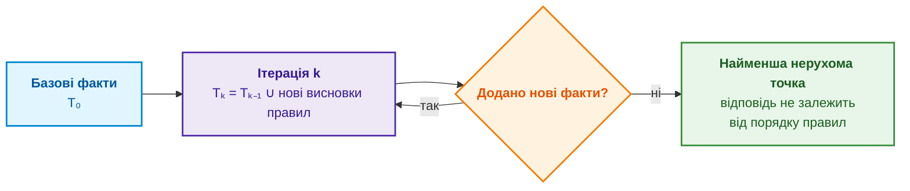
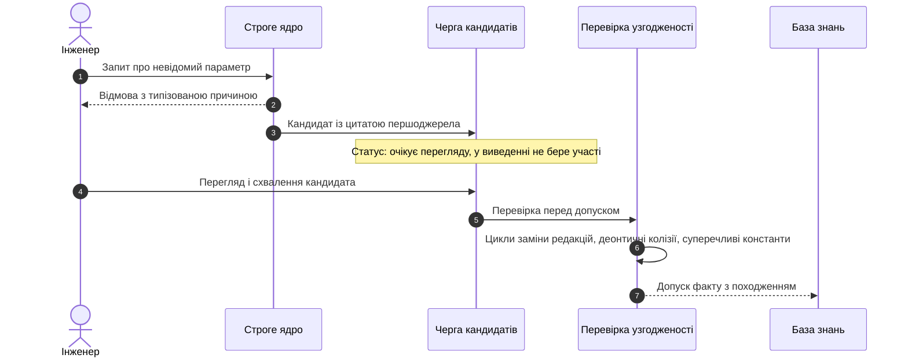

# Глава 28. Дворежимні експертні системи: поєднання строгої дедукції (Fail-Closed) та евристичного дорадчого виведення (CBR)

> **Книга:** [Архітектура доказових експертних систем](README.md) · [Частина VI: Передовий край: регуляторна сертифікація та нейро-символьний ШІ](part-06-frontiers-neuro-symbolic.md)  
> **Попередня глава:** [Глава 27. Синтез сертифікаційних доказів за Goal Structuring Notation (GSN): від графа EKG до аудиторського звіту](ch27-safety-case-gsn-synthesis.md)  
> **Наступна глава:** [Глава 29. Нейро-символьна архітектура (Neuro-Symbolic AI): поєднання мовних моделей та детермінованої доказовості на Go та Ollama](ch29-neuro-symbolic-architecture.md)  
> **Зміст книги:** [README.md](README.md)  
> **Автор:** [Микола Федчик](about-the-author.md)  
> **Рівень:** середній і поглиблений: системні архітектори, інженери зі знань, інженери з верифікації, аудитори функційної безпеки  
> **Очікувані результати:** формально відокремлювати строгий результат від дорадчих гіпотез; будувати строге ядро на правилах Горна з обчисленням найменшої нерухомої точки й стратифікованим запереченням; повертати контрприклад замість голого «ні» для кванторів над скінченними доменами; знаходити деонтичні колізії в нормативних текстах; розрізняти дедукцію, індукцію й абдукцію за Пірсом і застосовувати редукцію до першопричини; формувати гіпотези за прецедентами з критеріями переведення у факт; перетворювати відмову на кандидата для бази знань без обходу фахового перегляду.

Аудитор, який перевіряє обґрунтування безпеки з [Глави 27](ch27-safety-case-gsn-synthesis.md), має отримувати лише твердження з точним джерелом, а за відсутності джерела отримувати відмову. Така поведінка є закритою при відмові (*fail-closed*): коли знань бракує, експертна система нічого не вигадує. Інженер, який о другій ночі налагоджує стенд, потребує іншого. Йому корисна підказка «схожий збій уже бачили, причиною був заблокований порт», навіть якщо підказку не підтверджує жоден стандарт. Якщо видати аудиторові підказку як факт, аргумент безпеки втрачає довіру. Якщо відмовити інженерові в будь-якій підказці, експертна система стає марною саме тоді, коли знань найбільше бракує.

Ця глава відповідає на запитання: **як одна експертна система може водночас бути строгим джерелом доказів і корисним порадником, не дозволяючи пораді непомітно стати доказом?** Теза глави: **відповідь має дві частини з різним статусом. Строга частина виводиться детермінованими правилами з цитованих фактів і за нестачі знань є типізованою відмовою. Дорадча частина складається з гіпотез, кожна з яких позначена як непідтверджена, має метод отримання й критерій переведення у факт. Гіпотеза не потрапляє ні до строгого виведення, ні до аргументу безпеки, доки не пройде той самий перегляд, що й будь-який кандидат на зміну знань.**

## Два режими й один інваріант

У строгому режимі відповідь на запит $q$ є строгим результатом $\mathcal{T}_{\mathrm{strict}}(q)$: або твердження з цитатами першоджерел, або відмова $\mathrm{Refusal}(\rho)$ з типізованою причиною $\rho$ неповноти знань. У дорадчому режимі відповідь є впорядкованою парою:

```math
\mathcal{Y}_{\mathrm{ext}}(q)=\bigl\langle\,\mathcal{T}_{\mathrm{strict}}(q),\ \mathcal{H}(q)\,\bigr\rangle,
\qquad
\mathcal{H}(q)=\{h_1,\dots,h_k\}.
```

Строга частина в дорадчому режимі не змінюється: дорадчий режим лише додає до неї множину гіпотез $\mathcal{H}(q)$. Кожна гіпотеза є кортежем із п'яти полів:

```math
h_i=\langle\,\sigma_i,\ \mu_i,\ c_i,\ \mathcal{O}_i,\ \mathcal{P}_i\,\rangle,
```

де $\sigma_i$ є змістом гіпотези, $\mu_i$ методом отримання (дедуктивне розширення за явного припущення, індуктивне узагальнення, аналогія з прецедентом, абдуктивне пояснення), $c_i$ оцінкою впевненості, $\mathcal{O}_i$ спостереженнями, що підтримують гіпотезу, а $\mathcal{P}_i$ критеріями переведення гіпотези у факт: що перевірити на стенді, який пункт стандарту знайти, хто має затвердити зміну. Головний інваріант формулюється так:

```math
\forall h\in\mathcal{H}(q):\quad \mathrm{EvidenceGrounded}(h)=\mathrm{false}\ \land\ h\notin\mathrm{SafetyCase}.
```

Гіпотеза за визначенням не спирається на перевірене джерело й не потрапляє до обґрунтування безпеки з [Глави 27](ch27-safety-case-gsn-synthesis.md). Шлях гіпотези до бази знань проходить через цикл кандидатів із [Глави 26](ch26-continual-learning.md): перевірку критеріїв $\mathcal{P}_i$, фаховий перегляд і правило допуску. Інваріант має сенс лише тоді, коли строге ядро справді детерміноване й завершується, тому спершу про строге ядро.

## Строге ядро: правила Горна й найменша нерухома точка

Процедурні правила у вигляді вкладених умов у коді важко перевіряти: порядок виконання впливає на результат, а взаємні виклики тисяч правил можуть зациклитися. Строге ядро тому будують декларативно, мовою Datalog. Серж Абітбуль, Річард Халл і Віктор Віану в підручнику з основ баз даних описують Datalog як мову правил над скінченною множиною фактів без функціональних символів [[1]](#src-1). Кожне правило є клаузою Горна:

```math
H(\vec X)\leftarrow B_1(\vec X_1)\land\dots\land B_m(\vec X_m)\land\neg N_1(\vec Y_1)\land\dots\land\neg N_k(\vec Y_k),
```

де $H$ є головою правила, $B_i$ позитивними атомами тіла, а $N_j$ атомами заперечення за відсутністю (*negation as failure*). Обчислення починають із базових фактів і застосовують усі правила, доки нові факти перестають з'являтися. Схема показує цей процес.



Для правил без заперечення результат є найменшою нерухомою точкою: найменшою множиною фактів, замкненою відносно всіх правил. Оскільки нові константи не з'являються, кількість можливих фактів скінченна, тому обчислення завершується, а для фіксованого набору правил потребує поліноміального від кількості фактів часу [[1]](#src-1). Заперечення порушує монотонність: факт, виведений із «$`N`$ не відомо», може стати хибним, коли $N$ виведуть пізніше. Стратифікація розв'язує проблему: правила ділять на шари так, щоб заперечуваний предикат повністю обчислювався в нижчому шарі до того, як його заперечують [[1]](#src-1). Програми з рекурсією через заперечення стратифікації не мають, і строге ядро їх відхиляє на етапі завантаження бази правил.

Строге ядро повертає не лише «так» чи «ні». **Квантор загальності над скінченним доменом** перевіряє твердження на кшталт «для кожної команди протоколу в базі знань є задокументована відповідь»:

```math
\forall c\in\mathrm{Commands}:\ \exists s\ \ \mathrm{DocumentedReply}(c,s).
```

Якщо твердження хибне, ядро повертає контрприклад, тобто конкретну команду без відповіді, а не логічний нуль. Контрприклад одразу показує, де база знань неповна.

**Деонтичний контроль** перевіряє нормативні тексти на колізії модальностей. Георг Генрік фон Врігт у праці, з якої почалася сучасна деонтична логіка, розглядав зобов'язання, заборону й дозвіл як модальні оператори над діями [[2]](#src-2). Позначимо зобов'язання через $\mathsf{O}$ (`MUST`), а заборону через $\mathsf{F}$ (`MUST NOT`). Тоді одночасне зобов'язання й заборона тієї самої дії в тій самій області застосування є колізією:

```math
\mathsf{O}(a,s)\land\mathsf{F}(a,s)\ \Rightarrow\ \bot .
```

Знайдена колізія не розв'язується автоматично: ядро блокує допуск суперечливої редакції правил і передає колізію власникові нормативного документа. Строге ядро забезпечує відповідь, яку можна відтворити й перевірити. Проте інженерні задачі потребують не лише дедукції, і наступний розділ розділяє форми міркування, які працюють у двох режимах.

## Три форми міркування Пірса і редукція

Чарльз Сандерс Пірс у статті 1878 року «Дедукція, індукція і гіпотеза» розрізнив три форми висновку [[3]](#src-3). Дедукція застосовує загальне правило до випадку й отримує результат. Індукція з випадків і результатів узагальнює правило. Гіпотеза пояснює дивний результат припущенням, що спостережуваний випадок підпадає під певне правило, і Пірс зауважив, що як загальне правило гіпотеза є слабким видом аргументу. Сучасна література розглядає цю форму як абдукцію. Ігор Довен у Стенфордській енциклопедії філософії підкреслює, що в Пірса абдукція означає прийняття гіпотези не як істинної чи підтвердженої, а як гідного кандидата для подальшої перевірки [[4]](#src-4). Саме такий статус має дорадча гіпотеза експертної системи. Для дворежимної експертної системи класифікація Пірса визначає статус результату.

**Дедукція працює в строгому режимі.** Зворотне виведення від цілі будує дерево пояснення, у якому кожен вузол є фактом із цитатою або висновком правила з посиланням на посилки, як описує [Глава 20](ch20-explanation-engine.md). Результат дедукції успадковує статус посилок: з цитованих фактів виходить строгий висновок.

**Індукція працює в дорадчому режимі.** З журналів сесій протоколу можна синтезувати автомат скінченних станів, що узагальнює спостережені переходи. Такий автомат є гіпотезою про специфікацію, а не специфікацією: журнали показують лише ті послідовності, які траплялися. Щоб порівняти синтезований автомат з автоматом зі стандарту, обидва мінімізують, наприклад алгоритмом Джона Гопкрофта, який за час $O(n\log n)$ об'єднує еквівалентні стани [[5]](#src-5):

```math
s_1\sim s_2\iff\forall w\in\Sigma^{*}:\ \bigl(\hat\delta(s_1,w)\in F\iff\hat\delta(s_2,w)\in F\bigr),
```

де $\Sigma$ є алфавітом команд, $\hat\delta$ розширеною функцією переходів, а $F$ множиною допустимих станів. Розбіжність мінімальних автоматів указує на перехід, який журнали бачили, а стандарт не дозволяє, або навпаки.

**Абдукція працює в дорадчому режимі.** Пояснення збою найімовірнішою причиною є гіпотезою, навіть коли ймовірність висока; [Глава 24](ch24-system-diagnosis.md) показує, як такі гіпотези ранжувати й перевіряти.

**Редукція не належить до тріади Пірса, але потрібна обом режимам.** Редукція стискає довгий ланцюг до суттєвого. Для діагностики сесії SMTP редукція зводить помилку на кроці DATA до однієї невиконаної передумови. Стандарт RFC 5321 прямо дозволяє серверові відповісти кодом 503 («команда поза послідовністю») або 554 («немає дійсних отримувачів») на команду DATA, якщо перед нею не було прийнятої команди MAIL або RCPT [[6]](#src-6). Тому код 503 на кроці DATA редукується до строгого висновку «не було прийнятої команди RCPT» з цитатою стандарту. Мінімальну множину суперечливих обмежень знаходить алгоритм QuickXPlain з [Глави 20](ch20-explanation-engine.md), а цілісність ланцюга доведення фіксує дерево Меркла з [Глави 27](ch27-safety-case-gsn-synthesis.md).

## Дорадчий режим: прецеденти й гіпотези

Найпрактичнішим джерелом дорадчих гіпотез є пам'ять розв'язаних випадків. Міркування за прецедентами (*Case-Based Reasoning*, CBR) за Агнаром Аамодтом та Енріком Плазою повторює чотири кроки: знайти схожий випадок, повторно використати рішення, переглянути рішення з урахуванням відмінностей і зберегти новий досвід [[7]](#src-7). Схожість наборів симптомів зручно міряти коефіцієнтом Жаккара, який Поль Жаккар запропонував для порівняння видового складу рослинності [[8]](#src-8):

```math
J(S_{\mathrm{in}},S_{\mathrm{case}})=\frac{|S_{\mathrm{in}}\cap S_{\mathrm{case}}|}{|S_{\mathrm{in}}\cup S_{\mathrm{case}}|}.
```

Якщо $J$ перевищує поріг $\theta$, прецедент стає гіпотезою з методом «аналогія з прецедентом», оцінкою $c=J$ і критерієм переведення: відтворити умови прецедента й підтвердити причину. Поріг $\theta$ не задають на око: поріг калібрують на розмічених випадках, як описує [Глава 25](ch25-how-expert-systems-learn.md), бо коефіцієнт Жаккара міряє схожість, а не ймовірність, що гіпотеза правильна.

Типовий приклад: інженер повідомляє про тайм-аут з'єднання на порту 25. Строге ядро не має факту про причину й відмовляє. Дорадчий режим знаходить прецедент, у якому провайдер блокував вихідний порт 25, і пропонує дію з того прецедента: надсилати повідомлення через порт подання 587, який стандарт RFC 6409 визначає для подання повідомлень, залишаючи порт 25 для пересилання між серверами [[9]](#src-9). Посилання на RFC 6409 підтверджує, що порт 587 існує й призначений для подання, але не підтверджує, що саме блокування порту спричинило поточний тайм-аут. Тому вся рекомендація лишається гіпотезою.

## Відмова як джерело знань

Відмова строгого ядра є не лише коректною відповіддю, а й сигналом про прогалину. Коли ядро відмовляє, експертна система може шукати в першоджерелах фрагменти, які стосуються запиту, і створювати кандидатів на нові факти: суб'єкт, відношення, значення, документ і точний діапазон байтів цитати, як у верифікаторі цитат з [Глави 15](ch15-knowledge-extraction-and-kb-construction.md). Кандидат має статус «очікує перегляду» й не використовується строгим ядром, доки інженер зі знань його не схвалить. Діаграма показує цей шлях.



Перевірка узгодженості перед допуском шукає три класи порушень. **Цикли заміни редакцій** виникають, коли документ A скасовує документ B, а B скасовує A. **Деонтичні колізії** виникають, коли та сама дія в тій самій області водночас обов'язкова й заборонена. **Суперечливі константи** виникають, коли одна редакція стандарту має два різні значення того самого параметра, наприклад два порти за замовчуванням. Розв'язаний інцидент після підтвердження причини зберігають як новий прецедент, і цикл замикається: відмова породжує кандидата, перевірений кандидат стає фактом, перевірений випадок стає прецедентом для майбутніх гіпотез.

## Програмна перевірка: два режими на одному прикладі

Програма нижче реалізує механізми глави в мініатюрі. Строге ядро обчислює найменшу нерухому точку для двох правил Горна над фактами з RFC 5321, відповідає на запити з цитатами й відмовляє за нестачі фактів. Дорадчий режим шукає прецедент за коефіцієнтом Жаккара. Програма також перевіряє квантор загальності з контрприкладом, шукає деонтичні колізії й показує, що кандидат на факт не впливає на строгу відповідь до схвалення. Потрібна лише стандартна бібліотека Python 3.10 або новішого.

```python
"""Дворежимна експертна система в мініатюрі: строгий вивід із цитатами й дорадчі гіпотези.

Лише стандартна бібліотека Python 3.10+.
"""
FACTS = {  # (суб'єкт, відношення, значення) -> цитата першоджерела
    ("SMTP", "max_line_octets", "1000"): "RFC 5321, 4.5.3.1.6",
    ("MAIL", "precedes", "RCPT"): "RFC 5321, 3.3",
    ("RCPT", "precedes", "DATA"): "RFC 5321, 3.3",
    ("HELO", "documented_reply", "250"): "RFC 5321, 4.3.2",
    ("MAIL", "documented_reply", "250"): "RFC 5321, 4.3.2",
    ("RCPT", "documented_reply", "250"): "RFC 5321, 4.3.2",
    ("DATA", "documented_reply", "354"): "RFC 5321, 4.3.2",
}
RULES = [  # Horn-правила: голова <- тіло; змінні пишуть великими літерами
    (("X", "must_precede", "Y"), [("X", "precedes", "Y")]),
    (("X", "must_precede", "Z"), [("X", "precedes", "Y"), ("Y", "must_precede", "Z")]),
]
CASES = [  # перевірені прецеденти: симптоми, причина, дія
    ({"timeout", "port-25", "connect", "home-network"}, "провайдер блокує вихідний порт 25",
     "надсилати через порт подання 587 (RFC 6409)"),
    ({"503", "data", "sequence"}, "DATA без прийнятої команди RCPT", "перевірити відповідь на RCPT"),
]
NORMS = [("MUST", "use-tls", "submission"), ("MUST NOT", "use-tls", "submission"), ("MUST", "use-tls", "relay")]


def is_var(term):
    return term.isupper() and len(term) == 1


def match(pattern, fact, binding):
    binding = dict(binding)
    for p, f in zip(pattern, fact):
        if is_var(p):
            if binding.setdefault(p, f) != f:
                return None
        elif p != f:
            return None
    return binding


def solve(body, known, binding=None):
    if not body:
        yield binding or {}
        return
    for fact in list(known):
        b = match(body[0], fact, binding or {})
        if b is not None:
            for rest in solve(body[1:], known, b):
                yield rest


def least_fixed_point(facts, rules):
    known = {f: ("аксіома", [src]) for f, src in facts.items()}
    rounds = 0
    while True:
        rounds += 1
        new = {}
        for head, body in rules:
            for b in solve(body, known):
                fact = tuple(b.get(t, t) for t in head)
                if fact not in known and fact not in new:
                    premises = [tuple(b.get(t, t) for t in atom) for atom in body]
                    new[fact] = ("правило", sorted({c for p in premises for c in known[p][1]}))
        if not new:
            return known, rounds
        known.update(new)


def strict(known, subject, relation):
    hits = [(f, why) for f, why in known.items() if f[0] == subject and f[1] == relation]
    if not hits:
        return {"kind": "refusal", "reason": "немає підтвердженого факту"}
    return {"kind": "answer", "values": [(f[2], why[1]) for f, why in hits]}


def extended(known, subject, relation, symptoms, theta=0.4):
    hypotheses = []
    for case_symptoms, cause, action in CASES:
        j = len(symptoms & case_symptoms) / len(symptoms | case_symptoms)
        if j >= theta:
            hypotheses.append({"cause": cause, "action": action, "jaccard": round(j, 2),
                               "evidence_grounded": False,
                               "promote_if": "відтворити симптоми на стенді й підтвердити причину"})
    return {"strict": strict(known, subject, relation), "hypotheses": hypotheses}


known, rounds = least_fixed_point(FACTS, RULES)
print(f"1. Найменша нерухома точка: {len(known)} фактів після {rounds} раундів")
print("2. Строго: MAIL must_precede ->", strict(known, "MAIL", "must_precede")["values"])
print("3. Строго: довжина рядка SMTP ->", strict(known, "SMTP", "max_line_octets")["values"])
print("4. Строго: тайм-аут на порту 25 ->", strict(known, "port-25", "timeout_cause"))
reply = extended(known, "port-25", "timeout_cause", {"timeout", "port-25", "connect", "office-network"})
print("5. Дорадчо:", reply["strict"]["kind"], "+", reply["hypotheses"])
commands = ["HELO", "MAIL", "RCPT", "DATA", "VRFY"]
missing = [c for c in commands if not strict(known, c, "documented_reply")["kind"] == "answer"]
print("6. Для кожної команди є задокументована відповідь?", not missing, "| контрприклад:", missing[:1])
conflicts = sorted({(a, s) for m1, a, s in NORMS for m2, a2, s2 in NORMS
                    if (m1, m2) == ("MUST", "MUST NOT") and (a, s) == (a2, s2)})
print("7. Деонтичні колізії:", conflicts)
proposal = {("port-25", "timeout_cause", "ISP block"): "кандидат з журналу інциденту INC-77"}
print("8. Кандидат до схвалення ->", strict(known, "port-25", "timeout_cause")["kind"])
known.update({f: ("схвалено фахівцем", [src]) for f, src in proposal.items()})
print("   Після схвалення ->", strict(known, "port-25", "timeout_cause")["values"])
```

Запуск `python dual_mode.py` дає:

```text
1. Найменша нерухома точка: 10 фактів після 3 раундів
2. Строго: MAIL must_precede -> [('RCPT', ['RFC 5321, 3.3']), ('DATA', ['RFC 5321, 3.3'])]
3. Строго: довжина рядка SMTP -> [('1000', ['RFC 5321, 4.5.3.1.6'])]
4. Строго: тайм-аут на порту 25 -> {'kind': 'refusal', 'reason': 'немає підтвердженого факту'}
5. Дорадчо: refusal + [{'cause': 'провайдер блокує вихідний порт 25', 'action': 'надсилати через порт подання 587 (RFC 6409)', 'jaccard': 0.6, 'evidence_grounded': False, 'promote_if': 'відтворити симптоми на стенді й підтвердити причину'}]
6. Для кожної команди є задокументована відповідь? False | контрприклад: ['VRFY']
7. Деонтичні колізії: [('use-tls', 'submission')]
8. Кандидат до схвалення -> refusal
   Після схвалення -> [('ISP block', ['кандидат з журналу інциденту INC-77'])]
```

Рядок 1 показує, що з семи базових фактів ядро вивело три нові й зупинилося на третьому раунді, коли новий раунд нічого не додав. Рядок 2 містить виведений транзитивно факт «MAIL має передувати DATA», і цитата цього висновку успадкована від посилок, тобто від розділу 3.3 RFC 5321. Рядок 3 відповідає цитованим фактом, рядок 4 відмовляє. Рядок 5 демонструє інваріант: строга частина в дорадчому режимі лишилася відмовою, а гіпотеза про блокування порту має коефіцієнт Жаккара 0,6, позначку `evidence_grounded: False` і критерій переведення у факт. Рядок 6 знаходить контрприклад VRFY: стандарт описує відповіді на VRFY, але в базі знань прикладу такого факту немає, тому контрприклад указує на неповноту бази знань, а не стандарту. Рядок 7 знаходить колізію «обов'язково й заборонено використовувати TLS для подання» в синтетичному наборі норм, а норма для пересилання з колізією не конфліктує, бо має іншу область застосування. Рядок 8 показує, що кандидат не впливає на строгу відповідь до схвалення, а після схвалення відповідь цитує походження кандидата.

Приклад має межі. Правила й факти мінімальні, наївне обчислення нерухомої точки повторно перевіряє всі факти в кожному раунді, а реальні рушії Datalog використовують напівнаївне обчислення й індекси. Норми про TLS і прецеденти синтетичні. Поріг $\theta=0{,}4$ узято для ілюстрації, а не з калібрування.

## Порівняння режимів

Таблиця зводить відмінності між строгим режимом, дорадчим режимом і вільною генерацією мовної моделі без строгого ядра.

| Критерій | Строгий режим | Дорадчий режим | Вільна генерація мовної моделі |
|---|---|---|---|
| Призначення | аудит, обґрунтування безпеки, нормативні відповіді | налагодження, дослідження, діагностика на стенді | чернетки текстів, мозковий штурм |
| Статус відповіді | висновок із цитатами першоджерел або типізована відмова | строгий блок без змін плюс позначені гіпотези | текст без гарантованого зв'язку з джерелами |
| Реакція на нестачу знань | відмова з причиною | відмова плюс гіпотези з критеріями перевірки | правдоподібна відповідь, яка може бути вигаданою |
| Відтворюваність | однакова відповідь для однакової бази знань | строгий блок відтворюваний, гіпотези залежать від пам'яті прецедентів | залежить від параметрів декодування |
| Участь в обґрунтуванні безпеки | так, через свідчення GSN | лише строгий блок | ні |
| Шлях до бази знань | не застосовно | через критерії переведення, перегляд і правило допуску | лише як кандидат після незалежної перевірки |

Таблиця не стверджує, що мовна модель марна. [Глава 29](ch29-neuro-symbolic-architecture.md) показує, як мовна модель працює всередині такої архітектури: перетворює запит на структуру, яку перевіряє строге ядро, і формулює пояснення, не маючи права змінити результат правила.

## Висновок

Відповідь на головне питання глави така: одна експертна система може бути і строгим джерелом доказів, і порадником, якщо відповідь складається з двох частин із різним статусом, а інваріант забороняє гіпотезі потрапити до строгого виведення чи обґрунтування безпеки без перевірки. Строга частина спирається на правила Горна з найменшою нерухомою точкою, стратифікованим запереченням, кванторами з контрприкладами й деонтичним контролем. Дорадча частина спирається на індукцію, абдукцію й прецеденти, а кожна гіпотеза несе метод отримання й критерій переведення у факт.

Програма показала інваріант на одному прикладі: строга відповідь на питання про тайм-аут лишилася відмовою, гіпотеза з коефіцієнтом Жаккара 0,6 з'явилася поруч із позначкою непідтвердженості, а кандидат на факт почав впливати на строгу відповідь лише після схвалення. Квантор загальності знайшов прогалину бази знань, а деонтична перевірка знайшла колізію норм в одній області застосування. Класифікація Пірса пояснила, чому дедукція належить до строгого режиму, а індукція й абдукція до дорадчого, і чому редукція до першопричини з цитатою стандарту може бути строгим висновком.

Межі глави такі. Строгий режим гарантує відтворюваність і простежуваність лише відносно бази знань: хибний цитований факт дає хибний строгий висновок. Стратифікація виключає частину корисних рекурсивних правил із запереченням. Оцінка впевненості гіпотези за схожістю прецедентів не є ймовірністю й потребує калібрування. Дорадчий режим корисний лише тоді, коли користувачі бачать і розуміють позначку непідтвердженості, тому інтерфейс має відокремлювати строгий блок від гіпотез так само чітко, як формальна модель. [Глава 29](ch29-neuro-symbolic-architecture.md) розглядає, як мовна модель вбудовується в цю архітектуру, не руйнуючи інваріанта.

## Запитання для самоперевірки

1. Чому строга частина відповіді в дорадчому режимі має бути такою самою, як у строгому режимі?
2. Які п'ять полів має гіпотеза і навіщо потрібен критерій переведення у факт?
3. Чому обчислення найменшої нерухомої точки для Datalog завжди завершується? Що змінює заперечення і як стратифікація відновлює коректність?
4. Чим контрприклад квантора загальності кращий за голе «ні»? Що означає контрприклад VRFY у програмі: неповноту стандарту чи бази знань?
5. Сформулюйте деонтичну колізію й поясніть, чому дві норми з різними областями застосування в програмі не конфліктують.
6. Як Пірс розрізняв дедукцію, індукцію й гіпотезу? Який режим експертної системи відповідає кожній формі?
7. Чому код 503 на команду DATA можна редукувати до строгого висновку з цитатою RFC 5321, а тайм-аут на порту 25 ні?
8. Чому коефіцієнт Жаккара 0,6 не означає 60-відсоткової ймовірності правильності гіпотези?
9. Які три класи порушень шукає перевірка узгодженості перед допуском нового факту?

## Словник

| Український термін | Англійський відповідник | Коротке пояснення |
|---|---|---|
| Закритість при відмові | Fail-closed | Поведінка, за якої нестача знань дає відмову, а не здогадку |
| Строгий результат | Strict result | Висновок із цитатами першоджерел або типізована відмова |
| Дорадча гіпотеза | Advisory hypothesis | Позначене непідтвердженим припущення з методом отримання й критерієм перевірки |
| Критерій переведення у факт | Promotion criterion | Умова, після виконання якої гіпотеза може стати кандидатом на факт |
| Клауза Горна | Horn clause | Правило з однією головою й кон'юнкцією атомів у тілі |
| Найменша нерухома точка | Least fixed point | Найменша множина фактів, замкнена відносно всіх правил |
| Заперечення за відсутністю | Negation as failure | Вважання атома хибним, якщо його не виведено |
| Стратифікація | Stratification | Поділ правил на шари, щоб заперечуваний предикат обчислювався раніше |
| Контрприклад | Counterexample | Конкретний елемент домену, на якому твердження хибне |
| Деонтична колізія | Deontic conflict | Одночасне зобов'язання й заборона тієї самої дії в тій самій області |
| Дедукція | Deduction | Висновок від правила й випадку до результату |
| Індукція | Induction | Узагальнення правила з випадків і результатів |
| Абдукція | Abduction | Пояснення результату припущенням про випадок і правило |
| Редукція до першопричини | Root-cause reduction | Зведення довгого ланцюга збою до суттєвої невиконаної передумови |
| Мінімізація автомата | Automaton minimization | Об'єднання еквівалентних станів скінченного автомата |
| Коефіцієнт Жаккара | Jaccard index | Відношення розміру перетину множин до розміру їхнього об'єднання |
| Кандидат на факт | Fact candidate | Пропозиція нового факту з цитатою, що очікує перегляду |

## Абревіатури

| Скорочення | Розшифрування | Значення |
|---|---|---|
| CBR | Case-Based Reasoning | міркування за прецедентами |
| GSN | Goal Structuring Notation | нотація структурування цілей |
| RFC | Request for Comments | серія документів IETF зі специфікаціями інтернету |
| SMTP | Simple Mail Transfer Protocol | протокол передавання електронної пошти |
| TLS | Transport Layer Security | протокол захисту транспортного рівня |

## Джерела

1. <a id="src-1"></a>Serge Abiteboul, Richard Hull, Victor Vianu. [*Foundations of Databases*](http://webdam.inria.fr/Alice/). Addison-Wesley, 1995. Розділи 12–15: Datalog, обчислення Datalog, рекурсія й заперечення.
2. <a id="src-2"></a>Georg Henrik von Wright. [*Deontic Logic*](https://doi.org/10.1093/mind/LX.237.1). *Mind*, 60(237), 1–15, 1951.
3. <a id="src-3"></a>Charles Sanders Peirce. [*Illustrations of the Logic of Science VI: Deduction, Induction, and Hypothesis*](https://en.wikisource.org/wiki/Popular_Science_Monthly/Volume_13/August_1878/Illustrations_of_the_Logic_of_Science_VI). *Popular Science Monthly*, 13, 1878.
4. <a id="src-4"></a>Igor Douven. [*Peirce on Abduction*](https://plato.stanford.edu/entries/abduction/peirce.html). Додаток до статті «Abduction», *The Stanford Encyclopedia of Philosophy*, 2011, редакція 2025.
5. <a id="src-5"></a>John Hopcroft. [*An n log n Algorithm for Minimizing States in a Finite Automaton*](https://doi.org/10.1016/B978-0-12-417750-5.50022-1). *Theory of Machines and Computations*, Academic Press, 189–196, 1971.
6. <a id="src-6"></a>John Klensin. [*RFC 5321: Simple Mail Transfer Protocol*](https://www.rfc-editor.org/rfc/rfc5321). IETF, 2008.
7. <a id="src-7"></a>Agnar Aamodt, Enric Plaza. [*Case-Based Reasoning: Foundational Issues, Methodological Variations, and System Approaches*](https://doi.org/10.3233/AIC-1994-7104). *AI Communications*, 7(1), 39–59, 1994.
8. <a id="src-8"></a>Paul Jaccard. [*The Distribution of the Flora in the Alpine Zone*](https://doi.org/10.1111/j.1469-8137.1912.tb05611.x). *New Phytologist*, 11(2), 37–50, 1912.
9. <a id="src-9"></a>Randall Gellens, John Klensin. [*RFC 6409: Message Submission for Mail*](https://www.rfc-editor.org/rfc/rfc6409). IETF, 2011.

---

[← Глава 27. Синтез сертифікаційних доказів](ch27-safety-case-gsn-synthesis.md) | [Зміст книги](README.md) | [Частина VI](part-06-frontiers-neuro-symbolic.md) | [Глава 29. Нейро-символьна архітектура →](ch29-neuro-symbolic-architecture.md)
