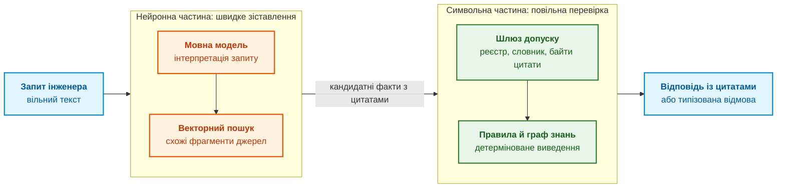
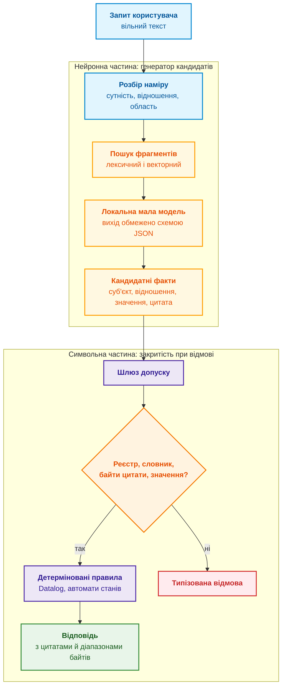
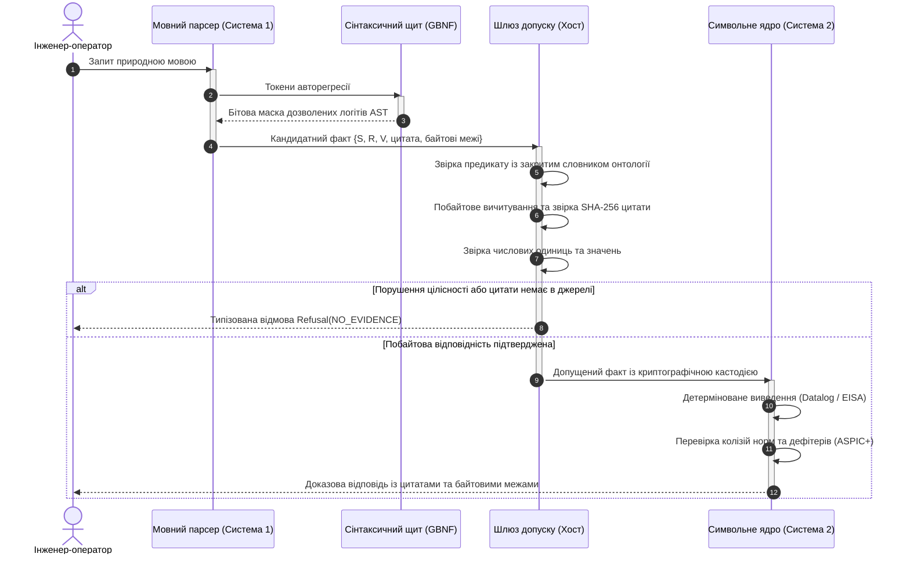
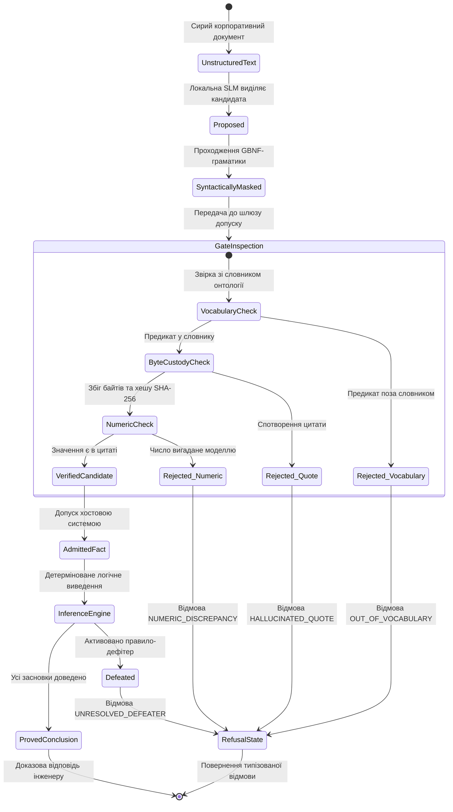

# Глава 29. Нейро-символьна архітектура: мовні моделі та перевірка доказових підстав

> **Книга:** [Архітектура доказових експертних систем](README.md) · [Частина VI: Нейро-символьні відповіді, гіпотези та прогалини знань](part-06-frontiers-neuro-symbolic.md)  
> **Попередня глава:** [Глава 28. Дворежимні експертні системи: строгий висновок і дорадча гіпотеза](ch28-dual-mode-expert-systems.md)  
> **Наступна глава:** [Глава 34. Прогалини знань: реляційний пошук, абдукція та діалог уточнення](ch34-deterministic-relational-analysis-abduction-and-socratic-dialogue.md)  
> **Зміст книги:** [README.md](README.md)  
> **Автор:** [Микола Федчик](about-the-author.md)  
> **Рівень:** поглиблений: системні архітектори, інженери машинного навчання, розробники критичних систем  
> **Очікувані результати:** пояснювати, чому правдоподібність тексту мовної моделі не є доказом; розподіляти обов'язки між мовною моделлю, яка пропонує кандидатів, і символьним ядром, яке їх затверджує; будувати шлюз допуску з реєстром редакцій документів, закритим словником відношень, перевіркою дослівної цитати за байтами та перевіркою значення; обмежувати вихід локальної моделі схемою JSON через Ollama; перевіряти, чи пояснення моделі не містить неперевірених чисел; розрізняти адаптовану й базову модель за поведінкою на граничних випадках.

## Анотація

У главі розглянуто нейро-символьну архітектуру експертних систем третьої хвилі штучного інтелекту (NeSy), яка поєднує гнучкість обробки природної мови великими та малими мовними моделями (LLM/SLM) із суворою верифікованістю детермінованого символьного ядра. Проаналізовано фундаментальний епістемічний розрив між статистичною правдоподібністю авторегресивного тексту та формальною істинністю знань у критичних інженерних доменах (ISO 26262 ASIL D, DO-178C DAL A). Сформульовано архітектурний принцип «модель пропонує, символьне ядро затверджує». Досліджено світовий досвід провідних індустріальних та академічних лабораторій (AlphaProof від DeepMind, PRM OpenAI, Cicero від Meta FAIR, конвеєри DSPy, школи MIT та Imperial College London). Детально описано влаштування побайтового шлюзу допуску, що виконує валідацію координат цитат, контроль схем JSON, перевірку значень за замкненими словниками та блокування непогоджених числових галюцинацій. Наведено повну виробничу реалізацію перевіреного нейро-символьного конвеєра мовою Go з використанням локальної моделі через рантайм Ollama.

Якщо розробник вбудованого контролера гальмування чи авіоніки запитає у генеративного асистента: «який максимальний час реакції сторожового таймера безпеки (watchdog)?», мовна модель миттєво й переконливо згенерує відповідь: «100 мілісекунд». Але в нормативній специфікації виробу для рівня ASIL D (ISO 26262) або DAL A (DO-178C) зафіксовано жорсткі 10 мілісекунд: решта 90 мс — це статистична галюцинація, підтягнута моделлю з побутових описів мікроконтролерів. Якщо розробник довіриться авторитетно сформульованому тексту нейромережі, контролер у разі апаратного збою не встигне перезапуститися до виходу на небезпечну траєкторію. З іншого боку, строге логічне ядро з [Глави 28](ch28-dual-mode-expert-systems.md) знає точну нормативну відповідь із цитатою стандарту, але мовчки повертає відмову лише тому, що інженер сформулював запит живою мовою («сторожовик процесора»), тоді як у базі знань сутність зареєстрована як «апаратний сторожовий таймер безпеки WDOG-1». Перша система небезпечна прихованими галюцинаціями, друга — непридатна для щоденної інженерної роботи через надмірну формальну жорсткість.

Ця глава відповідає на запитання: **як поєднати гнучкість мовної моделі зі строгістю символьного ядра так, щоб жодне твердження моделі не потрапило до відповіді без перевірки?** Теза глави: **мовна модель пропонує, символьне ядро затверджує. Модель інтерпретує запит, пропонує кандидатні факти з дослівними цитатами й формулює пояснення. Шлюз допуску перевіряє кожного кандидата за реєстром редакцій документів, закритим словником відношень, байтами цитати й значенням. Висновок роблять лише детерміновані правила над допущеними фактами, а все, що не пройшло перевірки, стає відмовою або позначеною гіпотезою.** Глава показує цю архітектуру на робочій програмі мовою Go з локальною моделлю через Ollama.

## 1. Епістемічний розрив: чому правдоподібність не є істинністю

Авторегресивна мовна модель $\mathcal{M}$ навчається передбачати наступний токен за попередніми:

$$P_{\mathcal{M}}(w_t\mid w_1,\dots,w_{t-1}),\qquad \hat{w}_{1:N}=\arg\max_{w_{1:N}}\prod_{t=1}^{N}P_{\mathcal{M}}(w_t\mid w_{<t})$$

Позначення:

- $\mathcal{M}$ є мовною моделлю;
- $`w_t`$ є токеном на позиції $t$, а $`w_1,\dots,w_{t-1}`$ є токенами, які йому передують;
- $`P_{\mathcal{M}}(w_t\mid w_1,\dots,w_{t-1})`$ є ймовірністю наступного токена за контексту попередніх токенів, у межах від 0 до 1;
- $N$ є довжиною послідовності токенів, а $`w_{1:N}`$ позначає всю послідовність від першого токена до $N$-го;
- $`w_{<t}`$ скорочено позначає всі токени перед позицією $t$;
- $`\prod_{t=1}^{N}`$ означає перемноження ймовірностей токенів на позиціях від 1 до $N$;
- $`\arg\max_{w_{1:N}}`$ вибирає послідовність із найбільшим добутком цих ймовірностей;
- $`\hat w_{1:N}`$ є вибраною моделлю послідовністю, а капелюшок позначає оцінений результат.

Читається так: модель оцінює кожен наступний токен за попередніми, а декодування шукає послідовність із найбільшою сукупною ймовірністю. Це максимум правдоподібності серед кандидатів, а не ймовірність того, що текст відповідає дійсності.

Найправдоподібніша послідовність не обов'язково є правильною: максимізація правдоподібності нічого не каже про відповідність тексту документу, фізичному процесу чи стандарту. Адам Калаї та співавтори пояснюють галюцинації саме так: якщо модель не може відрізнити хибне твердження від факту, помилки виникають із природного статистичного тиску навчання, а поширені способи оцінювання моделей ще й винагороджують вгадування замість визнання невизначеності [[1]](#src-1). Звідси інженерний висновок для експертної системи: правило допуску має винагороджувати відмову, а не впевнену відповідь.

Високої точності моделі на тестах для критичних застосувань теж недостатньо. Рікі Батлер і Джордж Фінеллі показали, що кількісно підтвердити надвисоку надійність програмного забезпечення для життєво критичних систем статистичними методами неможливо: класичні методи оцінювання надійності вимагають непомірного обсягу тестування [[2]](#src-2). Якщо надвисоку надійність не можна довести тестуванням звичайної програми, тим паче її не можна довести тестуванням мовної моделі. Довіру тому будують не на частоті правильних відповідей, а на структурі, яку можна перевірити: цитаті, правилі, аргументі з [Глави 27](ch27-safety-case-gsn-synthesis.md).

Покрокові міркування моделі не замінюють перевірки. Джейсон Вей та співавтори показали, що підказка з ланцюжком міркувань (*chain-of-thought*) поліпшує результати мовних моделей на задачах міркування [[3]](#src-3). Проте Майлз Терпін та співавтори виявили, що такі пояснення можуть систематично спотворювати справжню причину відповіді: коли модель штовхали до хибної відповіді прихованою ознакою в підказці, модель генерувала правдоподібне обґрунтування хибної відповіді, не згадуючи цієї ознаки, а точність падала до 36 % на наборі з 13 задач [[4]](#src-4). Ланцюжок міркувань є текстом, а не протоколом виведення.

Межу видно і з боку творчості. Том Захаві з Google DeepMind у позиційній статті стверджує, що генеративний штучний інтелект опанував індукцію, тобто статистичне узагальнення, швидко опановує дедукцію, але не має механізму абдукції, тобто висування нових пояснювальних гіпотез [[5]](#src-5). Денис Ювженко розбирає цю аргументацію українською мовою на прикладах із дедукцією, індукцією й абдукцією [[6]](#src-6). Для експертної системи висновок збігається з [Главою 28](ch28-dual-mode-expert-systems.md): гіпотези, зокрема гіпотези мовної моделі, мають статус кандидатів для перевірки. Наступний розділ розглядає, як цей розподіл ролей описують у когнітивній науці й у дослідженнях нейро-символьного штучного інтелекту.

## 2. Когнітивна дихотомія System 1 / System 2: межі інженерної аналогії

Деніел Канеман розрізняв у мисленні людини дві форми: інтуїтивну, яка працює без зусиль і спирається на доступність думок, і свідоме міркування, яке працює повільно й підпорядковується правилам [[7]](#src-7). У літературі ці форми часто називають Системою 1 і Системою 2. Для архітектури експертної системи розрізнення корисне як аналогія: нейронна частина швидко зіставляє вільне формулювання з відомими образами, а символьна частина повільно й відтворювано перевіряє твердження. Аналогія не означає, що нейромережа моделює людську інтуїцію: аналогія лише описує розподіл обов'язків. Схема показує цей розподіл.



Ідея гібридної архітектури не нова. Артур д'Авіла Гарсес, Крисія Брода й Дов Габбай систематизували нейро-символьні системи навчання ще на початку 2000-х років [[8]](#src-8), а Гері Маркус запропонував гібридний підхід, який спирається на знання й міркування, як шлях до надійнішого штучного інтелекту [[9]](#src-9). Систематичний огляд Брендона Колелоу та Вільяма Реглі показує, де в цій галузі лишаються прогалини: із 167 відібраних праць 2020–2024 років більшість зосереджена на навчанні й виведенні (63 %), пояснюваність і довіра представлені менше (28 %), а метакогніція, тобто міркування про власне міркування, є найменш дослідженою (5 %) [[10]](#src-10). Доказова експертна система працює саме в зоні пояснюваності й довіри. Таблиця порівнює три підходи за властивостями, важливими для цієї зони.

| Властивість | Мовна модель із пошуком | Класичні правила | Нейро-символьна архітектура |
|---|---|---|---|
| Розуміння вільного формулювання | високе | низьке, ламається на синонімах | високе, за рахунок мовної моделі |
| Відтворюваність висновку | залежить від параметрів декодування | повна для однакової бази знань | повна в символьному ядрі |
| Зв'язок висновку з джерелом | непрямий, через знайдені фрагменти | прямий, через правила й факти | прямий, через допущені цитати |
| Поведінка за нестачі знань | правдоподібна, можливо вигадана відповідь | відмова | відмова або позначена гіпотеза |
| Вартість супроводу знань | низька для тексту, висока для контролю | висока ручна праця | автоматичне видобування кандидатів із перевіркою |

Таблиця не стверджує, що нейро-символьна архітектура безпомилкова. Ядро відтворювано повторює й помилку хибного цитованого факту. Перевага полягає в тому, що кожну помилку можна простежити до конкретного факту, правила чи рішення шлюзу.

## 3. Принцип розподілу обов'язків: статистичний генератор проти символьного верифікатора

Схема показує повний шлях запиту через нейро-символьну експертну систему.



Нейронна частина розв'язує задачу, з якою правила справляються погано: перетворює вільне формулювання на структуру. Пошук із доповненням генерації (*Retrieval-Augmented Generation*, RAG), який описали Патрік Льюїс та співавтори, поєднує пошук фрагментів у корпусі документів із генерацією відповіді [[11]](#src-11). У нейро-символьній архітектурі генерація має вужчу роль: модель не пише відповідь користувачеві, а пропонує кандидатні факти з дослівними цитатами знайдених фрагментів.

Символьна частина забезпечує три інваріанти. **Інваріант доказовості:** кожне стверджувальне твердження відповіді спирається на дослівну цитату із зареєстрованої редакції документа з точним діапазоном байтів. **Інваріант закритості при відмові:** якщо факту немає або він неоднозначний, експертна система повертає типізовану відмову або запит на уточнення, а не правдоподібну відповідь. **Інваріант детермінованого висновку:** висновок роблять лише правила над допущеними фактами, а мовна модель не ухвалює рішень про істинність.

Мовна модель у такій архітектурі виконує кілька ролей, і для кожної ролі символьна частина має окрему перевірку. Таблиця показує один із можливих поділів.

| Роль мовної моделі | Що робить модель | Що перевіряє символьна частина |
|---|---|---|
| Оцінка достатності | сигналізує, чи знайдені фрагменти стосуються запиту | наявність документів у реєстрі; рішення про відмову ухвалює ядро |
| План відповіді | розкладає запит на сутність, відношення й область | належність відношення до закритого словника |
| Видобування кандидатів | пропонує факти з дослівними цитатами | реєстр редакції, байти цитати, значення в цитаті |
| Пояснення | формулює зв'язний текст за деревом доведення | кожне число й ідентифікатор пояснення має бути в допущених фактах |
| Дорадчі гіпотези | пропонує припущення в дорадчому режимі | ізоляція від строгого блоку, позначка непідтвердженості ([Глава 28](ch28-dual-mode-expert-systems.md)) |
| Узагальнення правил | пропонує кандидатів на нові правила з прецедентів | статус кандидата, перевірка суперечностей, цикл допуску ([Глава 26](ch26-continual-learning.md)) |

У кожному рядку модель лише пропонує, а останнє слово має детермінована перевірка.

## 4. Світовий ландшафт нейро-символьних архітектур: індустріальні та академічні парадигми

Концепція розділення Системи 1 (нейромережева інтуїція й обробка входу) та Системи 2 (символьне міркування й верифікація) у період 2024–2026 років стала головним вектором розвитку провідних світових наукових центрів та індустріальних лабораторій. Проте конкретні способи сполучення цих систем кардинально різняться за рівнем строгості, обчислювальною складністю та придатністю до експлуатації в реальному часі.

### 4.1. Досвід Alphabet / DeepMind: AlphaProof та інтерактивні доводжувачі Lean

У системі **AlphaProof** дослідники Google DeepMind продемонстрували здатність гібридної системи розв'язувати складні математичні задачі рівня Міжнародної математичної олімпіади (IMO 2024) [[29]](#src-29). Архітектурно AlphaProof поєднує мовну модель Gemini, донавчену на формальних доказах, з детермінованим ядром інтерактивного прувера **Lean 4** [[20]](#src-20). Модель виступає генератором тактик доведення, тоді як компілятор Lean механічно валідує кожен синтаксичний та логічний крок. Якщо тактика моделі хибна, ядро повертає помилку типізації, відкидаючи гілку дерева пошуку.

> **Урок для доказових систем:** Розділення *«LLM формулює гіпотезу $\to$ формальне ядро верифікує її»* є беззаперечним стандартом надійності.
> 
> **Межа застосовності:** Lean 4 створювався для інтерактивної роботи математиків, а не для бортових контролерів. Пошук одного доведення вимагає секунд або хвилин потужних серверних процесорів x86. Для вбудованих автомобільних (ISO 26262 ASIL D) чи авіаційних (DO-178C DAL A) систем, де ліміт реакції на подію становить $< 100\,\mu\text{s}$, такий підхід непридатний. Експертна система реального часу потребує ультрашвидкого спеціалізованого символьного ядра з детермінованим часом виконання та нульовими динамічними алокаціями пам'яті.

### 4.2. Досвід OpenAI: процесні винагороди (PRM) та межі латентного міркування

OpenAI у дослідженнях Хантера Лайтмана та співавторів запропонувала концепцію покрокової перевірки міркувань — **Process-Supervised Reward Models (PRM)**, відому за працею *«Let's Verify Step by Step»* [[25]](#src-25). На відміну від оцінювання лише кінцевого результату (*Outcome Supervision*), PRM навчає модель оцінювати коректність кожного окремого кроку ланцюжка думок (*Chain of Thought, CoT*). Подальший розвиток ця ідея отримала в серії моделей міркування o1/o3 через виділення додаткового бюджету обчислень на етапі інференсу (*Test-Time Compute*).

> **Урок для доказових систем:** Перевірка процесу формування висновку на кожному логічному переході значно ефективніша за перевірку фінальної відповіді.
> 
> **Пастка, якої слід уникати:** У моделях o1/o3 внутрішній ланцюжок думок (*Hidden CoT*) залишається послідовністю нейромережевих токенів. Він схильний до витончених софізмів та правдоподібних псевдо-доведень. Перевірка «ШІ перевіряє ШІ» без зовнішнього математичного рушія породжує системну сикофантію та модельний колапс [[3]](#src-3). Ланцюжок міркувань є лише текстом, а не доказовим деревом (*Proof Tree*).

### 4.3. Досвід Meta FAIR: стратегічний діалог та фільтрація в архітектурі Cicero

Найбільш показовим інженерним тріумфом практичного нейро-символьного тандему стала розробка дипломатичного агента **Cicero** дослідниками Meta FAIR [[24]](#src-24). Система досягла рівня майстра у стратегічній настільній грі «Diplomacy», де перемога вимагає як координації природною мовою, так і прогнозування зради:
* **Мовна модель (Система 1):** веде переговори з гравцями-людьми, аналізує наміри партнерів і перетворює діалогові репліки на структуровані повідомлення про можливі альянси;
* **Символьний планувальник (Система 2):** розраховує оптимальні тактичні ходи на основі алгоритму пошуку за теорією ігор (ітеративне обчислення рівноваги Неша з урахуванням довіри).

Cicero фільтрує пропозиції мовної моделі: якщо модель обіцяє союзнику хід, який суперечить стратегічному плануванню ядра, репліка примусово блокується й переформульовується. Цей принцип повністю відповідає формулі «мовна модель пропонує — символьне ядро затверджує».

### 4.4. Досвід Stanford HAI: скомпільовані декларативні конвеєри DSPy

Омар Хаттаб та співавтори у Стенфордському університеті створили фреймворк **DSPy** (*Declarative Self-improving Python*) [[26]](#src-26), який замінює крихку ручну промпт-інженерію алгоритмічною компіляцією обмежень. Замість написання довгих текстових підказок інженер описує сигнатуру задачі у вигляді типів входу й виходу, а оптимізатор (телепромптер) автоматично синтезує демонстрації, налаштовує параметри та збирає траси виконання.

> **Урок для доказових систем:** Декларативні специфікації усувають суб'єктивність ручного формулювання запитів і дають змогу автоматично будувати надійні екстрактори знань.

### 4.5. Академічні школи: MIT NSCL та фреймворки аргументації ASPIC+

Фундаментальні дослідження в MIT CSAIL (Цзяюань Мао, Джош Тененбаум та співавтори) над системою **Neuro-Symbolic Concept Learner (NSCL)** [[27]](#src-27) довели перевагу семантичного заземлення: нейромережа навчається сприймати візуальний або текстовий вхід не шляхом простої апроксимації функцій, а шляхом трансляції сцени у квазісимвольні програмні дерева, які виконуються детермінованим функціональним рушієм.

З іншого боку, школа обчислювальної аргументації Імперського коледжу Лондона (Франческа Тоні та Санджай Модгіл) розробила формалізм **ASPIC+** [[28]](#src-28). Цей апарат дозволяє системі не просто виводити факти за дедукцією, а вирішувати правові та технічні колізії норм через механізм заперечувальних обставин (*rebutting* та *undercutting defeaters*), коли локальна норма стандарту (*Lex Specialis*) або новіша редакція регламенту (*Lex Posterior*) детерміновано переважає базову загальну норму.

### 4.6. Часовий протокол взаємодії в нейро-символьному тандемі

Діаграма послідовності показує часовий протокол обміну повідомленнями між компонентами під час обробки інженерного запиту.



### 4.7. Життєвий цикл та верифікація кандидатного факту

Діаграма станів ілюструє переходи стану знання від сирого неструктурованого тексту до затвердженого факту або безпечної відмови.



Найважливіша з перевірок, шлюз допуску кандидатних фактів, має технічну тонкість, через яку на практиці падає більшість наївних реалізацій.

## 5. Побайтовий шлюз допуску: заземлення на координати першоджерел

Цитату перевіряють за байтами, бо саме байти зберігає файл і саме від байтів обчислюють хеш. Модель, однак, мислить токенами й символами. У кодуванні UTF-8 символи займають від одного до чотирьох октетів [[12]](#src-12): латинська літера займає один байт, кирилична два. Якщо модель повідомить діапазон цитати в символах, для українського тексту межі змістяться, і символьне ядро прочитає уламок чужого речення. Звідси правило проєктування: модель повертає дослівну цитату, а діапазон байтів обчислює хост. Якщо модель усе ж надала діапазон, хост перевіряє його, а за розбіжності шукає цитату дослівно й приймає знайдений діапазон лише тоді, коли цитата трапляється в документі рівно один раз.

Шлюз виконує п'ять перевірок у фіксованому порядку:

1. **Реєстр редакцій.** Хеш SHA-256 документа збігається з хешем затвердженої редакції в реєстрі джерел, тому факт не прийде з чернетки чи застарілої версії ([Глава 15](ch15-knowledge-extraction-and-kb-construction.md)).
2. **Відмова моделі.** Якщо модель сама повідомила, що відповіді в контексті немає, відмову фіксують як результат, а не як помилку.
3. **Закритий словник.** Відношення належить до множини відношень, які вміють використовувати правила ядра; довільний предикат природної мови не допускають.
4. **Дослівна цитата.** Байти документа в діапазоні збігаються з цитатою, або цитата однозначно знаходиться в документі.
5. **Значення в цитаті.** Значення факту справді міститься в цитаті; число, якого немає в цитаті, є вигадкою моделі.

Ті самі ідеї застосовують до пояснення. Мовна модель може гарно сформулювати висновок, але будь-яке число чи ідентифікатор у поясненні має бути присутнім у допущених фактах. Якщо пояснення містить неперевірене число, експертна система показує не текст моделі, а детермінований шаблон із цитатами.

## 6. Локальні малі мовні моделі (SLM) як детерміновані генератори кандидатів

Для генерації кандидатів зручно використовувати малі мовні моделі (*Small Language Model*, SLM) розміром від одиниць до кількох мільярдів параметрів, запущені локально. Локальний запуск не передає інженерних документів у хмару й працює в ізольованому середовищі з [Глави 25](ch25-how-expert-systems-learn.md). Вузька задача видобування фактів не потребує широких знань великої моделі: потрібна дисципліна формату й готовність відмовитися.

**Обмеження виходу схемою.** Сайбо Ген та співавтори показали, що декодування з граматичними обмеженнями дає змогу генерувати структуровані виходи без донавчання моделі [[13]](#src-13), а Брендон Віллард і Ремі Луф описали ефективну реалізацію такого керованого декодування через скінченні автомати [[14]](#src-14). На практиці бібліотека llama.cpp обмежує вихід граматиками у форматі GBNF [[15]](#src-15), а Ollama приймає схему JSON у параметрі `format` і генерує відповідь, що відповідає схемі [[16]](#src-16). Обмеження гарантує форму відповіді, а не її істинність: модель, змушена видати поле `value`, може заповнити поле вигадкою, тому шлюз допуску лишається обов'язковим.

**Фіксація параметрів.** Параметри генерації й системну інструкцію зручно закріпити у файлі моделі Ollama (*Modelfile*), який описує документація Ollama [[17]](#src-17). Приклад нижче задає нульову температуру, обмежує довжину відповіді й фіксує контракт видобування фактів. Ім'я базової моделі є прикладом і залежить від обраної моделі.

<details>
<summary>Файл моделі Ollama (Modelfile)</summary>

```dockerfile
FROM qwen2.5:3b

# Нульова температура прибирає випадковість вибору токенів
PARAMETER temperature 0
PARAMETER num_predict 512

SYSTEM """You extract candidate facts from technical specifications.
Return a JSON array of objects with fields subject, relation, value and quote.
The quote must be an exact verbatim substring of the given passage.
Use only these relations: max_length_octets, timeout.
If the passage states no such fact, return an empty array []."""
```

</details>

Файл реєструють командою `ollama create fact-extractor -f Modelfile`. Нульова температура робить вибір токенів детермінованим за однакових умов виконання, але не робить відповідь правильною.

**Адаптація моделі.** Якщо базова модель погано дотримується контракту, її доналаштовують методами з [Глави 25](ch25-how-expert-systems-learn.md), наприклад адаптером LoRA. Навчальний набір має містити багато негативних прикладів, у яких правильною відповіддю є порожній масив або відмова, інакше модель навчиться завжди щось видобувати. Для різних предметних областей, наприклад мережевих протоколів і автомобільної безпеки, доцільно перевірити окремі адаптери: послідовне навчання однієї мережі на різних задачах може спричинити катастрофічну інтерференцію, яку описали Майкл Макклоскі й Ніл Коен [[18]](#src-18). Вибір між одним і кількома адаптерами роблять за результатами іспиту на окремих наборах для кожної області.

**Як відрізнити адаптовану модель від базової.** Перед розгортанням корисно переконатися, що до експертної системи підключено саме адаптовану модель. Різницю видно не у швидкості, а в поведінці на граничних випадках.

| Перевірка | Базова модель | Адаптована модель |
|---|---|---|
| Запит про параметр, якого у фрагменті немає | вгадує правдоподібне значення або відповідає розлогим коментарем | повертає порожній масив або відмову |
| Цитата з кириличного тексту | цитата перефразована або з пропущеними словами, тож дослівного збігу немає | цитата збігається з байтами документа |
| Чистота формату | обгортає JSON розміткою Markdown, додає вступ і висновок | повертає лише JSON за схемою |
| Дотримання словника | вигадує відношення природною мовою | використовує лише дозволені відношення |

Ці перевірки варто автоматизувати як частину регресійного іспиту з [Глави 25](ch25-how-expert-systems-learn.md): якщо оновлення моделі або підміна адаптера погіршує хоча б один рядок таблиці, оновлення не допускають.

## 7. Програмна реалізація верифікованого нейро-символьного конвеєра на Go з Ollama

Програма нижче реалізує шлюз допуску мовою Go без зовнішніх бібліотек. Документ має кириличний текст, щоб показати різницю між байтами й символами, а реєстр зберігає хеш затвердженої редакції. Якщо задано змінну середовища `OLLAMA_MODEL`, програма просить локальну модель Ollama видобути факти за схемою JSON. Без моделі, або якщо Ollama недоступна, програма використовує записані відповіді моделі з типовими помилками: правильну пропозицію, пропозицію з діапазоном у символах замість байтів, дві пропозиції з вигаданими значеннями, пропозицію з відношенням поза словником і відмову. Значення перевіряють як цілу лексему, а не як підрядок: інакше вигадане «100» пройшло б перевірку для цитати про 1000 октетів, а порожнє значення проходило б завжди. Наприкінці програма перевіряє пояснення моделі на неперевірені числа за тим самим правилом цілих лексем.

<details>
<summary>Приклад мовою Go: шлюз допуску з локальною моделлю Ollama</summary>

```go
// Шлюз допуску нейро-символьної експертної системи: мовна модель пропонує, ядро перевіряє.
// Запуск: go run . (Ollama необов'язкова: без змінної OLLAMA_MODEL використано записані пропозиції).
package main

import (
	"bytes"
	"crypto/sha256"
	"encoding/hex"
	"encoding/json"
	"fmt"
	"net/http"
	"os"
	"regexp"
	"strings"
	"time"
)

const docID = "gw-spec-v3"

var document = []byte("Специфікація шлюзу, розділ 4.2.\nМаксимальна довжина рядка становить 1000 октетів.\nТайм-аут очікування команди: 5 хвилин.\n")

// Реєстр джерел зберігає хеш затвердженої редакції документа.
var registry = map[string]string{docID: "02291fbf65ce9738b868cf379f70c612bdba115ce91aabaf1b3f8f6a1b0d403d"}

// Закритий словник відношень, які вміє використовувати символьне ядро.
var vocabulary = map[string]bool{"max_length_octets": true, "timeout": true}

type Proposal struct {
	Refusal   bool   `json:"refusal,omitempty"`
	Reason    string `json:"reason,omitempty"`
	Subject   string `json:"subject,omitempty"`
	Relation  string `json:"relation,omitempty"`
	Value     string `json:"value,omitempty"`
	Quote     string `json:"quote,omitempty"`
	ByteStart int    `json:"byte_start,omitempty"`
	ByteEnd   int    `json:"byte_end,omitempty"`
}

// Записані відповіді моделі: правильна, зі зсувом у символах замість байтів,
// з вигаданим значенням, з відношенням поза словником і відмова.
var recorded = []Proposal{
	{Subject: "рядок", Relation: "max_length_octets", Value: "1000", Quote: "Максимальна довжина рядка становить 1000 октетів.", ByteStart: 55, ByteEnd: 143},
	{Subject: "рядок", Relation: "max_length_octets", Value: "1000", Quote: "Максимальна довжина рядка становить 1000 октетів.", ByteStart: 32, ByteEnd: 81},
	{Subject: "команда", Relation: "timeout", Value: "300 секунд", Quote: "Тайм-аут очікування команди: 5 хвилин.", ByteStart: 144, ByteEnd: 212},
	{Subject: "рядок", Relation: "max_length_octets", Value: "100", Quote: "Максимальна довжина рядка становить 1000 октетів.", ByteStart: 55, ByteEnd: 143},
	{Subject: "шлюз", Relation: "recommended_vendor", Value: "Acme", Quote: "Специфікація шлюзу, розділ 4.2.", ByteStart: 0, ByteEnd: 54},
	{Refusal: true, Reason: "unsupported_in_context"},
}

type Fact struct {
	Proposal
	Digest, Note string
}

// containsToken вимагає значення як цілої лексеми, щоб «100» не збігалося з «1000».
func containsToken(text, value string) bool {
	if strings.TrimSpace(value) == "" {
		return false
	}
	return regexp.MustCompile(`(^|[^\p{L}\p{N}])` + regexp.QuoteMeta(value) + `($|[^\p{L}\p{N}])`).MatchString(text)
}

func admit(p Proposal) (Fact, string) {
	sum := sha256.Sum256(document)
	if hex.EncodeToString(sum[:]) != registry[docID] {
		return Fact{}, "редакція документа не збігається з реєстром"
	}
	if p.Refusal {
		return Fact{}, "модель відмовилася: " + p.Reason
	}
	if !vocabulary[p.Relation] {
		return Fact{}, "відношення поза закритим словником: " + p.Relation
	}
	quote := []byte(p.Quote)
	if len(quote) == 0 {
		return Fact{}, "немає цитати"
	}
	note := "діапазон моделі підтверджено"
	if p.ByteStart < 0 || p.ByteEnd > len(document) || p.ByteStart >= p.ByteEnd ||
		!bytes.Equal(document[p.ByteStart:p.ByteEnd], quote) {
		switch bytes.Count(document, quote) {
		case 0:
			return Fact{}, "цитати немає в джерелі"
		case 1:
			p.ByteStart = bytes.Index(document, quote)
			p.ByteEnd = p.ByteStart + len(quote)
			note = "діапазон моделі хибний, хост знайшов цитату дослівно"
		default:
			return Fact{}, "цитата неоднозначна"
		}
	}
	if !containsToken(p.Quote, p.Value) {
		return Fact{}, "значення не підтверджене цитатою: " + p.Value
	}
	d := sha256.Sum256(quote)
	return Fact{Proposal: p, Digest: hex.EncodeToString(d[:6]), Note: note}, ""
}

func known(f Fact, facts []Fact) bool {
	for _, g := range facts {
		if g.Relation == f.Relation && g.ByteStart == f.ByteStart && g.ByteEnd == f.ByteEnd {
			return true
		}
	}
	return false
}

// askOllama просить локальну модель повернути пропозиції у форматі JSON за схемою.
func askOllama(model, passage string) ([]Proposal, error) {
	str := map[string]string{"type": "string"}
	schema := map[string]any{"type": "array", "items": map[string]any{
		"type":       "object",
		"properties": map[string]any{"subject": str, "relation": str, "value": str, "quote": str},
		"required":   []string{"subject", "relation", "value", "quote"},
	}}
	body, _ := json.Marshal(map[string]any{
		"model": model, "stream": false, "format": schema,
		"options": map[string]any{"temperature": 0},
		"messages": []map[string]string{
			{"role": "system", "content": "Extract facts as JSON with an exact verbatim quote from the passage. Return [] if none."},
			{"role": "user", "content": passage},
		},
	})
	client := http.Client{Timeout: 60 * time.Second}
	resp, err := client.Post("http://localhost:11434/api/chat", "application/json", bytes.NewReader(body))
	if err != nil {
		return nil, err
	}
	defer resp.Body.Close()
	if resp.StatusCode != http.StatusOK {
		return nil, fmt.Errorf("Ollama: %s", resp.Status)
	}
	var out struct {
		Message struct{ Content string } `json:"message"`
	}
	if err := json.NewDecoder(resp.Body).Decode(&out); err != nil {
		return nil, err
	}
	var proposals []Proposal
	return proposals, json.Unmarshal([]byte(out.Message.Content), &proposals)
}

// ungrounded повертає числа з пояснення, яких немає в жодній допущеній цитаті.
func ungrounded(narrative string, facts []Fact) []string {
	var missing []string
	for _, n := range regexp.MustCompile(`\d+`).FindAllString(narrative, -1) {
		found := false
		for _, f := range facts {
			found = found || containsToken(f.Quote, n)
		}
		if !found {
			missing = append(missing, n)
		}
	}
	return missing
}

func main() {
	proposals, origin := recorded, "записані відповіді моделі"
	if model := os.Getenv("OLLAMA_MODEL"); model != "" {
		if live, err := askOllama(model, string(document)); err == nil {
			proposals, origin = live, "Ollama, модель "+model
		} else {
			fmt.Println("Ollama недоступна:", err)
		}
	}
	fmt.Println("Джерело пропозицій:", origin)
	var facts []Fact
	for i, p := range proposals {
		f, reason := admit(p)
		switch {
		case reason != "":
			fmt.Printf("%d. ВІДХИЛЕНО: %s\n", i+1, reason)
		case known(f, facts):
			fmt.Printf("%d. ДУБЛІКАТ уже допущеного факту (%s)\n", i+1, f.Note)
		default:
			facts = append(facts, f)
			fmt.Printf("%d. ДОПУЩЕНО: %s %s = %s, %s [%d, %d), sha256:%s (%s)\n",
				i+1, f.Subject, f.Relation, f.Value, docID, f.ByteStart, f.ByteEnd, f.Digest, f.Note)
		}
	}
	narrative := "Максимальна довжина рядка становить 1000 октетів, а тайм-аут команди дорівнює 300 секундам."
	if missing := ungrounded(narrative, facts); len(missing) > 0 {
		fmt.Println("Пояснення моделі містить неперевірені числа", missing, "-> детермінований шаблон:")
		for _, f := range facts {
			fmt.Printf("  За %s [%d, %d): %s\n", docID, f.ByteStart, f.ByteEnd, f.Quote)
		}
	}
}
```

Граничні тести шлюзу збережіть поруч як `main_test.go` і запустіть командою `go test .`.

```go
package main

import "testing"

func TestAdmissionBoundaries(t *testing.T) {
	base := recorded[0]
	if _, reason := admit(base); reason != "" {
		t.Fatalf("valid proposal rejected: %s", reason)
	}
	for _, value := range []string{"100", "", " ", "000"} {
		p := base
		p.Value = value
		if _, reason := admit(p); reason == "" {
			t.Fatalf("value %q accepted as part of 1000", value)
		}
	}
	p := base
	p.Quote = "довжина рядка"
	p.ByteStart, p.ByteEnd = 0, 0
	if _, reason := admit(p); reason == "" {
		t.Fatal("quote without the value accepted")
	}
	facts := []Fact{{Proposal: base}}
	if missing := ungrounded("Ліміт 10 октетів і 1000 октетів.", facts); len(missing) != 1 || missing[0] != "10" {
		t.Fatalf("partial number treated as grounded: %v", missing)
	}
}
```

</details>

Запуск `go run .` у каталозі з файлом `go.mod` (його створює команда `go mod init ch29gate`) дає:

<details>
<summary>Вивід програми</summary>

```text
Джерело пропозицій: записані відповіді моделі
1. ДОПУЩЕНО: рядок max_length_octets = 1000, gw-spec-v3 [55, 143), sha256:5fc027f3d330 (діапазон моделі підтверджено)
2. ДУБЛІКАТ уже допущеного факту (діапазон моделі хибний, хост знайшов цитату дослівно)
3. ВІДХИЛЕНО: значення не підтверджене цитатою: 300 секунд
4. ВІДХИЛЕНО: значення не підтверджене цитатою: 100
5. ВІДХИЛЕНО: відношення поза закритим словником: recommended_vendor
6. ВІДХИЛЕНО: модель відмовилася: unsupported_in_context
Пояснення моделі містить неперевірені числа [300] -> детермінований шаблон:
  За gw-spec-v3 [55, 143): Максимальна довжина рядка становить 1000 октетів.
```

</details>

Перша пропозиція проходить усі п'ять перевірок, і шлюз допускає факт із діапазоном байтів $[55, 143)$ та хешем цитати. Друга пропозиція містить ту саму цитату, але діапазон $[32, 81)$ відлічено в символах: речення починається з 32-го символу, але з 55-го байта, бо кожна кирилична літера займає два байти. Шлюз не довіряє діапазону моделі, знаходить цитату дослівно рівно один раз і розпізнає дублікат уже допущеного факту. Третя пропозиція цитує правильне речення про тайм-аут у 5 хвилин, але подає значення «300 секунд». Арифметично це те саме, однак рядка «300 секунд» у цитаті немає, тому шлюз відхиляє перетворене моделлю значення: перетворення одиниць має виконувати правило ядра, а не модель. Четверта пропозиція цитує правильне речення про 1000 октетів, але подає значення «100»: це число є підрядком цитати, але не цілою лексемою, тому шлюз її відхиляє. П'ята пропозиція використовує відношення поза словником, а шоста є коректною відмовою моделі. Останні рядки показують перевірку пояснення: модель згадала число 300, якого немає в жодній допущеній цитаті, тому користувач бачить детермінований шаблон із цитатою. Тест `TestAdmissionBoundaries` додатково відхиляє порожнє значення, значення з пробілів і частину числа, а також перевіряє, що число 10 у поясненні не вважається підтвердженим цитатою про 1000.

Програма має межі. Записані пропозиції ілюструють типові помилки, а реальна модель може помилятися інакше. Перевірка лексеми не порівнює семантику: значення «5» пройде для цитати «5 хвилин», хоча одиницю не перевірено, тому виробничий шлюз має розбирати число й одиницю як типізовану пару. Перевірка пояснення шукає лише числа, тоді як повна перевірка має охоплювати ідентифікатори, одиниці й заперечення. З установленою Ollama й змінною `OLLAMA_MODEL` програма надсилає документ локальній моделі, але шлюз перевіряє відповідь моделі так само, як записані пропозиції.

## 8. Дворежимне виконання та семантична маршрутизація

Шлюз допуску природно поєднується з двома режимами з [Глави 28](ch28-dual-mode-expert-systems.md). У строгому режимі відповідь будують лише з допущених фактів і правил, а будь-яка невизначеність дає відмову або запит на уточнення. У дорадчому режимі строгий блок лишається незмінним, а відхилені пропозиції моделі й гіпотези за прецедентами додаються окремо з позначкою непідтвердженості й критерієм переведення у факт. Відхилена третя пропозиція з прикладу добре ілюструє різницю: у строгому режимі користувач бачить лише факт про 5 хвилин із цитатою, а в дорадчому режимі може побачити ще й гіпотезу моделі з поясненням, чому шлюз її відхилив.

### 8.1. Відновлення структури запиту з ізольованою перевіркою хостом

Запитання інженерів мають велику граматичну й лексичну варіативність, яку важко повністю покрити регулярними виразами чи статичною граматикою. Коли детермінований розбір запиту не розпізнає структуру, експертна система без резервного шляху відмовляє, а система з вільною генерацією відповідає без перевірки. Обидві поведінки погані для інженера: перша марна, друга небезпечна.

Резервний шлях складається з трьох кроків:

1. **Дорадче відновлення структури.** Локальна мала модель отримує нерозпізнаний запит і повертає не текст відповіді, а структуру запиту: сутність, відношення й обмеження. Вихід моделі обмежено схемою JSON, як у прикладі вище.
2. **Перевірка структури хостом.** Жоден елемент запропонованої структури не потрапляє до рушія виведення без детермінованої перевірки. Хост перевіряє, що сутність існує в індексі бази знань, що відношення належить до закритого словника й допустиме для цього типу сутності, а факти для відповіді проходять той самий шлюз дослівної цитати.
3. **Позначка в сліді доведення.** Якщо всі перевірки пройдено, відповідь отримує позначку про відновлену структуру запиту, щоб рецензент бачив, що інтерпретацію запропонувала модель. Якщо хоча б одна перевірка не пройдена, експертна система повертає типізоване уточнення або відмову.

Резервний шлях змінює лише інтерпретацію запиту, а не статус відповіді: факт у відповіді має ту саму цитату, що й за детермінованого розбору. Ризик полягає в іншому: модель може правильно сформувати структуру, але для іншого запитання, ніж мав на увазі інженер. Тому в сліді доведення зберігають вихідний текст запиту поруч із відновленою структурою, а частку відновлених запитів, які користувачі потім уточнювали, вимірюють окремо. Числовий ефект резервного шляху на частку відмов і помилкових інтерпретацій залежить від корпусу запитів і моделі, тому його вимірюють на власному корпусі перед увімкненням резервного шляху.

## 9. Інструментальні засоби керованої генерації та граматичного обмеження

Приклад використовує JSON-схему Ollama й шлюз на Go. У виробничій експертній системі доступні й інші засоби, кожен з яких звужує окремий клас помилок моделі.

| Засіб | Прикладна роль | Що не гарантується |
|---|---|---|
| Структурований вихід Ollama зі схемою JSON [[16]](#src-16) | форма відповіді моделі, поля й типи без додаткового розбору тексту | правильність значень у полях; документація радить також передати схему в підказці й перевірити відповідь окремо |
| Граматики GBNF у llama.cpp [[15]](#src-15) | обмеження виходу довільною граматикою, зокрема закритим словником відношень | граматика не знає змісту документа; дозволене відношення може бути хибним для цього фрагмента |
| Перевірка моделлю логічного висновку (*Natural Language Inference*, NLI) | додаткова оцінка, чи підтримує цитата твердження, коли значення сформульоване іншими словами | оцінка ймовірнісна; вона може бути додатковим фільтром, але не замінює дослівного збігу для строгого режиму |
| Програмування наборів відповідей і Datalog ([Глава 28](ch28-dual-mode-expert-systems.md)) | детерміноване виведення над допущеними фактами | коректність лише відносно допущених фактів і правил |

З аналізу даних для шлюзу допуску корисний облік відхилень. Кожну відхилену пропозицію записують із причиною: значення поза цитатою, відношення поза словником, неоднозначна цитата, відмова моделі. Розподіл причин за версіями моделі й адаптера показує, яка зміна погіршила дисципліну формату, ще до того, як помилка потрапить до користувача. Кластеризація відхилених відношень поза словником підказує, яких відношень бракує ядру, але нове відношення з'являється лише через зміну правил і їхній допуск, а не через частоту пропозицій моделі.

## 10. Перспективні науково-дослідні напрями нейро-символьної інтеграції

Нейро-символьна архітектура відкриває кілька напрямів, де інженерна практика ще не усталилася. Кожен напрям продовжує ідею цієї глави: модель пропонує, перевірювана структура затверджує.

**Експертна система з агентами замість агента з пошуком.** У поширеній схемі програмного агента мовна модель сама вирішує, який інструмент викликати. Для критичних застосувань доцільніша зворотна схема: повноваження лишаються за детермінованим ядром знань і контрактами дій з [Глави 21](ch21-from-recommendation-to-action.md), а агенти спостерігають, формулюють запити до бази знань і виконують лише дозволені дії.

**Постійна база знань замість одноразового пошуку.** Андрей Карпати описав шаблон, у якому мовна модель не шукає фрагменти в сирих документах під час кожного запиту, а поступово будує й підтримує постійну вікі з пов'язаних статей у форматі Markdown [[19]](#src-19). Для доказової експертної системи такий шаблон корисний як джерело кандидатів: статті вікі пришвидшують пошук, але факт потрапляє до бази знань лише через шлюз допуску.

**Метакогніція.** Огляд Колелоу та Реглі називає метакогніцію найменш дослідженою частиною нейро-символьного штучного інтелекту [[10]](#src-10). Для експертної системи метакогніція означає явні перевірки власного стану: чи достатньо знань, чи немає суперечностей, яку стратегію виведення обрати, чи не час відмовитися. Частину таких перевірок уже реалізують квантори з контрприкладами й деонтичний контроль з [Глави 28](ch28-dual-mode-expert-systems.md).

**Формальна перевірка баз правил.** Помічники доведення на кшталт Lean 4, який описали Леонардо де Моура й Себастьян Ульріх [[20]](#src-20), дають змогу довести властивості бази правил, наприклад відсутність певного класу суперечностей, ще до розгортання. Перенесення інженерних онтологій у помічники доведення лишається трудомістким і є відкритою дослідницькою задачею.

**Виведення знань з експлуатації.** Відкликаний стандарт чи скомпрометований ключ треба прибрати з усіх залежних висновків. У графі знань з [Глави 9](ch09-engineering-knowledge-graph-traceability.md) відкликання поширюється каскадом за ребрами залежностей. У вагах моделі видалити конкретний факт значно складніше: Люка Бурту та співавтори запропонували організувати навчання так, щоб вплив окремих прикладів можна було прибрати повторним навчанням лише частини моделі [[21]](#src-21). Це ще одна причина зберігати мінливі факти в базі знань, а не у вагах.

**Конфіденційний аудит.** Дерево Меркла з [Глави 27](ch27-safety-case-gsn-synthesis.md) фіксує цілісність, але розкриває перевіреному оцінювачеві зміст показаних записів. Докази з нульовим розголошенням, наприклад компактні неінтерактивні аргументи Єнса Ґрота [[22]](#src-22), у принципі дозволяють довести властивість приховних даних без їхнього розкриття. Перетворення інженерних вимог на арифметичні обмеження таких доказів поки що є дослідницькою задачею.

**Самоузгодженість виведення кандидатів (Self-Consistency).** За неоднозначних або складних формулювань вимог одноразова генерація кандидатної структури мовною моделлю ризикує випадковою помилкою жадібного декодування. Ван та співавтори показали, що вибірка множини незалежних шляхів міркувань і вибір мажоритарного консенсусу суттєво підвищують надійність виведення порівняно з жадібним пошуком [[23]](#src-23). Для експертної системи це дає статистичний фільтр стійкості: на детермінований шлюз допуску передається лише та структура фактів, яку модель підтвердила на кількох незалежних трасах генерації.

Інші напрями, пов'язані з фізичним світом, книга розглядає в додатках: робототехніку й кіберфізичні системи в [Додатку Б](appendix-b-robotics-and-cyber-physical-systems.md), автономну навігацію в [Додатку В](appendix-c-autonomous-navigation-and-geosearch.md), аналогові та нейроморфні обчислення в [Додатку Г](appendix-d-analog-expert-systems-and-neuromorphic-computing.md) і [Додатку Д](appendix-e-mixed-signal-neuromorphic-expert-systems.md).

## Висновки
Відповідь на головне питання глави така: гнучкість мовної моделі й строгість символьного ядра поєднуються, коли модель лише пропонує, а ядро затверджує. Модель інтерпретує запит, пропонує кандидатні факти з дослівними цитатами й формулює пояснення. Шлюз допуску перевіряє редакцію документа, словник відношень, байти цитати й значення, а висновок роблять детерміновані правила. Усе, що не пройшло перевірки, стає відмовою або позначеною гіпотезою.

Глава показала, чому такий поділ необхідний: правдоподібність тексту не є істинністю, ланцюжок міркувань моделі може спотворювати справжню причину відповіді, а надвисоку надійність не можна довести статистичним тестуванням. Програма мовою Go показала шлюз у дії: з шести пропозицій моделі шлюз допустив один факт, розпізнав дублікат із хибним діапазоном у символах замість байтів, відхилив значення «300 секунд», якого немає в цитаті, відхилив «100» як частину числа 1000, відхилив відношення поза словником і зафіксував відмову моделі. Перевірка пояснення замінила текст моделі з неперевіреним числом на детермінований шаблон із цитатою.

Межі глави такі. Шлюз перевіряє, що твердження дослівно підтримане зареєстрованим документом, але не перевіряє, чи правильний сам документ. Закритий словник обмежує виразність: нове відношення потребує зміни правил ядра, а не лише підказки моделі. Перевірка пояснення в прикладі охоплює лише числа, а перевірка значення звіряє лексему без одиниці вимірювання. Обмеження виходу схемою гарантує форму, але не зміст, а нульова температура дає відтворюваність, але не правильність.

Наступна в тематичному порядку [глава 34](ch34-deterministic-relational-analysis-abduction-and-socratic-dialogue.md) розглядає прогалину, яку шлюз не може закрити: пошук відсутньої підстави, позначену гіпотезу й діалог уточнення. [Глава 38](ch38-curing-machine-hallucinations-and-knowledge-deficits.md) окремо систематизує контроль непідтверджених відповідей. [Додаток А](appendix-a-evidence-governed-framework.md) об'єднує методи книги в практичний процес дослідження.

## Запитання для самоперевірки
1. Чому максимізація правдоподібності послідовності токенів не гарантує істинності тексту? Як Калаї та співавтори пояснюють стійкість галюцинацій?
2. Що показали Батлер і Фінеллі щодо статистичного підтвердження надвисокої надійності і що з цього випливає для мовних моделей у критичних застосуваннях?
3. Чому ланцюжок міркувань моделі не можна вважати протоколом виведення? Наведіть результат Терпіна та співавторів.
4. Які три інваріанти забезпечує символьна частина нейро-символьної архітектури?
5. Чому діапазон цитати має обчислювати хост, а не модель? Поясніть зсув $[32, 81)$ проти $[55, 143)$ у програмі.
6. Чому шлюз відхилив значення «300 секунд», хоча 5 хвилин дорівнюють 300 секундам? Де в архітектурі має відбуватися перетворення одиниць?
7. Що гарантує обмеження виходу моделі схемою JSON і чого воно не гарантує?
8. Як відрізнити адаптовану модель від базової? Наведіть чотири перевірки.
9. Чому для мінливих фактів база знань краща за ваги моделі з погляду виведення знань з експлуатації?
10. Чому шлюз перевіряє значення як цілу лексему, а не як підрядок? Чого така перевірка все одно не виявляє?

## Словник
| Український термін | Англійський відповідник | Коротке пояснення |
|---|---|---|
| Нейро-символьна архітектура | Neuro-symbolic architecture | Поєднання нейронних моделей і символьного виведення з розподілом обов'язків |
| Авторегресивна модель | Autoregressive model | Модель, що генерує послідовність, передбачаючи кожен наступний токен за попередніми |
| Галюцинація | Hallucination | Правдоподібне, але хибне твердження мовної моделі |
| Ланцюжок міркувань | Chain of thought | Покроковий текст міркування, який модель генерує перед відповіддю |
| Абдукція | Abduction | Висування пояснювальної гіпотези для спостережуваного результату |
| Метакогніція | Meta-cognition | Міркування експертної системи про власне міркування й стан знань |
| Пошук із доповненням генерації | Retrieval-augmented generation | Генерація відповіді на основі знайдених фрагментів документів |
| Кандидатний факт | Fact proposal | Пропозиція моделі з суб'єктом, відношенням, значенням і цитатою |
| Шлюз допуску | Admission gate | Детермінована перевірка, яку має пройти кандидатний факт |
| Реєстр джерел | Source registry | Перелік затверджених редакцій документів із хешами |
| Закритий словник | Closed vocabulary | Скінченна множина відношень, які вміє використовувати ядро |
| Дослівна цитата | Verbatim quote | Фрагмент, що байт у байт збігається з текстом джерела |
| Декодування з обмеженнями | Constrained decoding | Генерація, за якої недопустимі токени маскують відповідно до граматики чи схеми |
| Файл моделі | Modelfile | Файл Ollama з базовою моделлю, параметрами генерації й системною інструкцією |
| Катастрофічна інтерференція | Catastrophic interference | Втрата попередніх навичок мережі під час навчання новій задачі |
| Виведення знань з експлуатації | Knowledge retirement | Видалення відкликаного знання з усіх залежних висновків |
| Машинне розучування | Machine unlearning | Видалення впливу окремих навчальних прикладів із моделі |
| Доказ із нульовим розголошенням | Zero-knowledge proof | Доказ властивості даних без розкриття самих даних |
| Лексема | Token (lexical unit) | Неперервна послідовність літер або цифр, відокремлена іншими символами |
| Відновлення структури запиту | Query frame recovery | Дорадче перетворення нерозпізнаного запиту на сутність, відношення й обмеження з подальшою перевіркою хостом |

## Абревіатури
| Скорочення | Розшифрування | Значення |
|---|---|---|
| GBNF | GGML Backus–Naur Form | формат граматик llama.cpp для обмеження виходу моделі |
| JSON | JavaScript Object Notation | текстовий формат структурованих даних |
| LLM | Large Language Model | велика мовна модель |
| LoRA | Low-Rank Adaptation | низькорангова адаптація |
| NLI | Natural Language Inference | розпізнавання логічного висновку між двома текстами |
| RAG | Retrieval-Augmented Generation | генерація з доповненням знайденими фрагментами |
| SHA-256 | Secure Hash Algorithm 256 | криптографічна хеш-функція з 256-бітним виходом |
| SLM | Small Language Model | мала мовна модель |
| UTF-8 | Unicode Transformation Format, 8-bit | кодування символів Юнікоду послідовностями від одного до чотирьох октетів |

## Джерела
1. <a id="src-1"></a>Adam Tauman Kalai, Ofir Nachum, Santosh S. Vempala, Edwin Zhang. [*Why Language Models Hallucinate*](https://arxiv.org/abs/2509.04664). arXiv:2509.04664, 2025.
2. <a id="src-2"></a>Ricky W. Butler, George B. Finelli. [*The Infeasibility of Quantifying the Reliability of Life-Critical Real-Time Software*](https://doi.org/10.1109/32.210303). *IEEE Transactions on Software Engineering*, 19(1), 3–12, 1993.
3. <a id="src-3"></a>Jason Wei, Xuezhi Wang, Dale Schuurmans, Maarten Bosma та ін. [*Chain-of-Thought Prompting Elicits Reasoning in Large Language Models*](https://arxiv.org/abs/2201.11903). NeurIPS, 2022.
4. <a id="src-4"></a>Miles Turpin, Julian Michael, Ethan Perez, Samuel R. Bowman. [*Language Models Don't Always Say What They Think: Unfaithful Explanations in Chain-of-Thought Prompting*](https://arxiv.org/abs/2305.04388). NeurIPS, 2023.
5. <a id="src-5"></a>Tom Zahavy. [*LLMs Can't Jump*](https://www.tomzahavy.com/files/llms-cant-jump.pdf). Позиційна стаття, Google DeepMind, 2026.
6. <a id="src-6"></a>Денис Ювженко. [*Стрибок, якого не вміє ШІ*](https://dou.ua/forums/topic/61201/). DOU, 2026.
7. <a id="src-7"></a>Daniel Kahneman. [*A Perspective on Judgment and Choice: Mapping Bounded Rationality*](https://doi.org/10.1037/0003-066X.58.9.697). *American Psychologist*, 58(9), 697–720, 2003.
8. <a id="src-8"></a>Artur S. d'Avila Garcez, Krysia B. Broda, Dov M. Gabbay. [*Neural-Symbolic Learning Systems: Foundations and Applications*](https://doi.org/10.1007/978-1-4471-0211-3). Springer, 2002.
9. <a id="src-9"></a>Gary Marcus. [*The Next Decade in AI: Four Steps Towards Robust Artificial Intelligence*](https://arxiv.org/abs/2002.06177). arXiv:2002.06177, 2020.
10. <a id="src-10"></a>Brandon C. Colelough, William Regli. [*Neuro-Symbolic AI in 2024: A Systematic Review*](https://arxiv.org/abs/2501.05435). arXiv:2501.05435, 2025.
11. <a id="src-11"></a>Patrick Lewis, Ethan Perez, Aleksandra Piktus, Fabio Petroni та ін. [*Retrieval-Augmented Generation for Knowledge-Intensive NLP Tasks*](https://arxiv.org/abs/2005.11401). NeurIPS, 2020.
12. <a id="src-12"></a>François Yergeau. [*RFC 3629: UTF-8, a Transformation Format of ISO 10646*](https://www.rfc-editor.org/rfc/rfc3629). IETF, 2003.
13. <a id="src-13"></a>Saibo Geng, Martin Josifoski, Maxime Peyrard, Robert West. [*Grammar-Constrained Decoding for Structured NLP Tasks without Finetuning*](https://arxiv.org/abs/2305.13971). EMNLP, 2023.
14. <a id="src-14"></a>Brandon T. Willard, Rémi Louf. [*Efficient Guided Generation for Large Language Models*](https://arxiv.org/abs/2307.09702). arXiv:2307.09702, 2023.
15. <a id="src-15"></a>llama.cpp contributors. [*GBNF Guide*](https://github.com/ggml-org/llama.cpp/blob/master/grammars/README.md). Документація llama.cpp.
16. <a id="src-16"></a>Ollama. [*Structured Outputs*](https://docs.ollama.com/capabilities/structured-outputs). Документація Ollama.
17. <a id="src-17"></a>Ollama. [*Modelfile Reference*](https://github.com/ollama/ollama/blob/main/docs/modelfile.mdx). Документація Ollama.
18. <a id="src-18"></a>Michael McCloskey, Neal J. Cohen. [*Catastrophic Interference in Connectionist Networks: The Sequential Learning Problem*](https://doi.org/10.1016/S0079-7421(08)60536-8). *Psychology of Learning and Motivation*, 24, 109–165, 1989.
19. <a id="src-19"></a>Andrej Karpathy. [*LLM Wiki*](https://gist.github.com/karpathy/442a6bf555914893e9891c11519de94f). GitHub Gist.
20. <a id="src-20"></a>Leonardo de Moura, Sebastian Ullrich. [*The Lean 4 Theorem Prover and Programming Language*](https://doi.org/10.1007/978-3-030-79876-5_37). CADE 28, LNCS 12699, 625–635, 2021.
21. <a id="src-21"></a>Lucas Bourtoule, Varun Chandrasekaran, Christopher A. Choquette-Choo, Hengrui Jia та ін. [*Machine Unlearning*](https://arxiv.org/abs/1912.03817). IEEE Symposium on Security and Privacy, 2021.
22. <a id="src-22"></a>Jens Groth. [*On the Size of Pairing-Based Non-interactive Arguments*](https://doi.org/10.1007/978-3-662-49896-5_11). EUROCRYPT 2016, LNCS 9666, 305–326, 2016.
23. <a id="src-23"></a>Xuezhi Wang et al. [*Self-Consistency Improves Chain of Thought Reasoning in Language Models*](https://research.google/pubs/self-consistency-improves-chain-of-thought-reasoning-in-language-models/). *Proceedings of the 11th International Conference on Learning Representations (ICLR 2023)*, 2023.
24. <a id="src-24"></a>Anton Bakhtin, Noam Brown, Emily Dinan, Gabriele Farina, Colin Flaherty, Daniel Fried та ін. [*Human-level play in the game of Diplomacy by combining language models with strategic reasoning*](https://doi.org/10.1126/science.ade9097). *Science*, 378(6624), 1067–1074, 2022.
25. <a id="src-25"></a>Hunter Lightman, Vineet Kosaraju, Yura Burda, Harri Edwards, Bowen Baker, Teddy Lee, Jan Leike, John Schulman, Ilya Sutskever, Karl Cobbe. [*Let's Verify Step by Step*](https://arxiv.org/abs/2305.20050). arXiv:2305.20050, 2023.
26. <a id="src-26"></a>Omar Khattab, Arnav Singhvi, Paridhi Maheshwari, Zhiyuan Zhang, Keshav Santhanam, Sri Vardhamanan та ін. [*DSPy: Compiling Declarative Language Model Calls into Self-Improving Pipelines*](https://arxiv.org/abs/2310.03714). arXiv:2310.03714, 2023.
27. <a id="src-27"></a>Jiayuan Mao, Chuang Gan, Pushmeet Kohli, Joshua B. Tenenbaum, Jiajun Wu. [*The Neuro-Symbolic Concept Learner: Interpreting Scenes, Words, and Sentences From Natural Supervision*](https://openreview.net/forum?id=rJgMlhRctm). *International Conference on Learning Representations (ICLR 2019)*, 2019.
28. <a id="src-28"></a>Sanjay Modgil, Francesca Toni. [*The ASPIC+ framework for structured argumentation: a tutorial*](https://doi.org/10.1080/19462166.2013.869766). *Argument & Computation*, 5(1), 31–62, 2014.
29. <a id="src-29"></a>Google DeepMind (AlphaProof & AlphaGeometry Teams). [*AI achieves silver-medal standard solving International Mathematical Olympiad problems*](https://deepmind.google/discover/blog/ai-solves-imo-problems-at-silver-medal-level/). Google DeepMind Research, 2024.

---

[← Глава 28](ch28-dual-mode-expert-systems.md) | [Зміст книги](README.md) | [Частина VI](part-06-frontiers-neuro-symbolic.md) | [Глава 34 →](ch34-deterministic-relational-analysis-abduction-and-socratic-dialogue.md)
