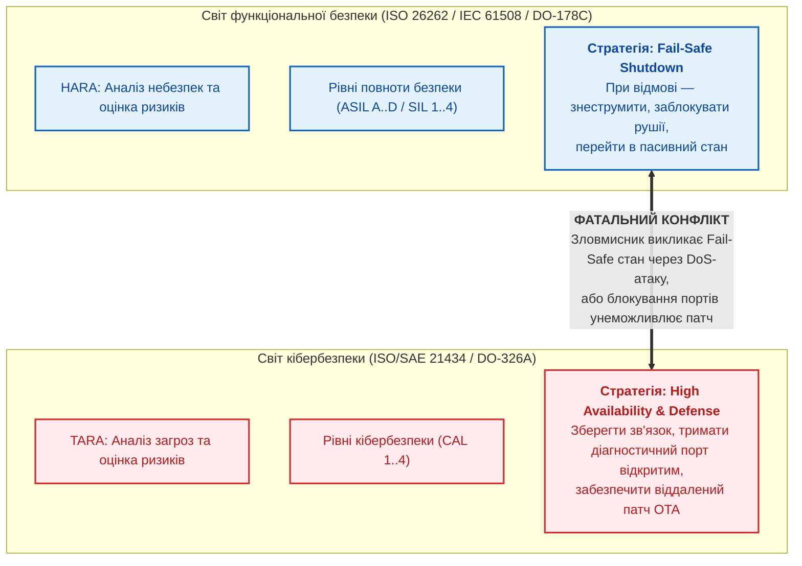
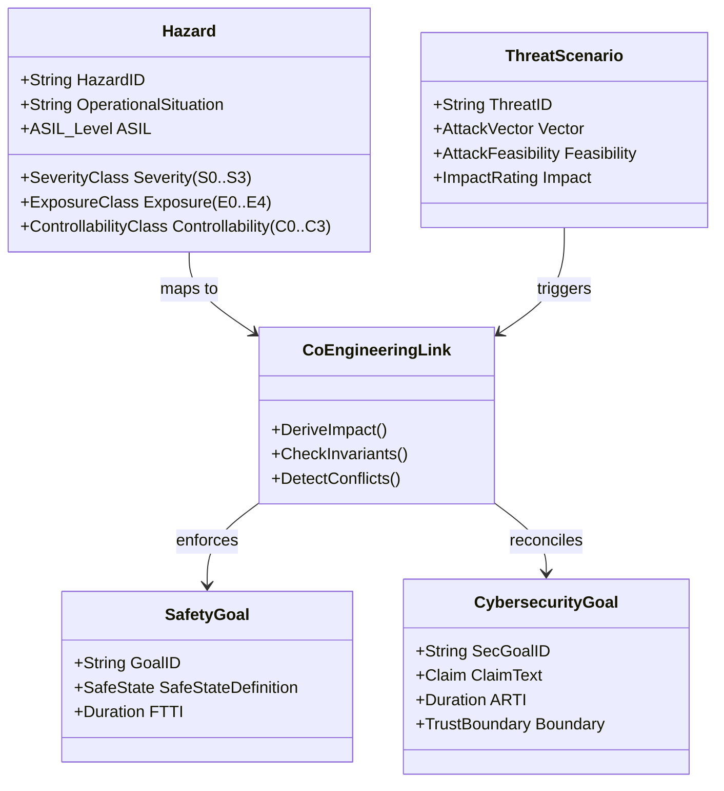
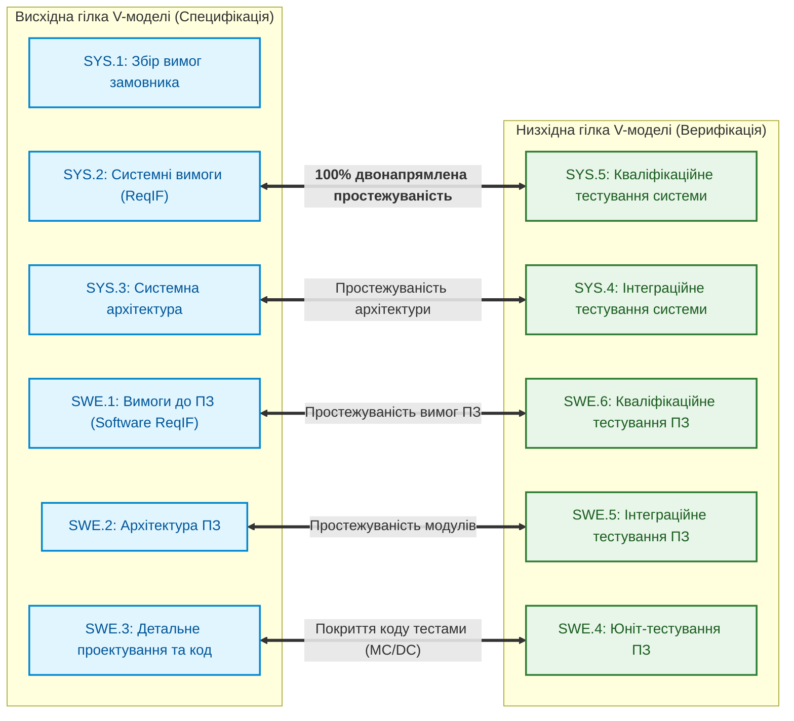
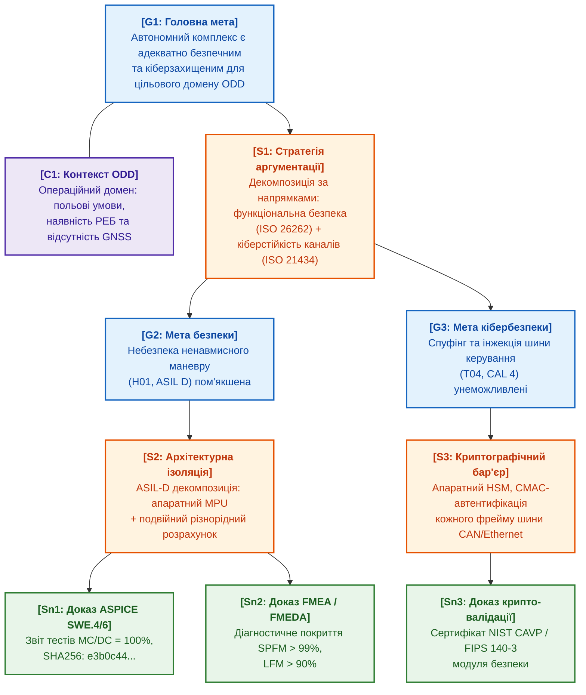
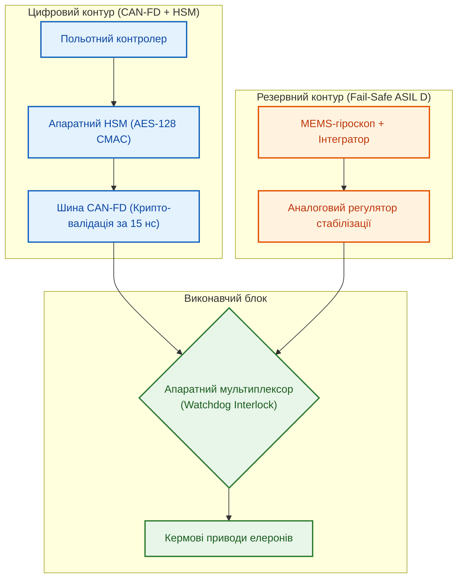

# Глава 30. Ко-інженерія функціональної безпеки та кібербезпеки: гармонізація суперечливих стандартів та спільний синтез GSN-доказів (ISO 26262, ISO/SAE 21434, ASPICE 4.0)

> **Книга:** [Архітектура доказових експертних систем](README.md) · [Частина VI: Передовий край: регуляторна сертифікація та нейро-символьний ШІ](part-06-frontiers-neuro-symbolic.md)  
> **Попередня глава:** [Глава 29. Нейро-символьна архітектура (Neuro-Symbolic AI)](ch29-neuro-symbolic-architecture.md)  
> **Наступна глава:** [Глава 31. Силогістичний рушій та решітки знань](ch31-syllogistic-reasoning-and-relation-lattices.md)  
> **Зміст книги:** [README.md](README.md)  
> **Автор:** [Микола Федчик](about-the-author.md)  
> **Пов'язані глави книги:** [Глава 9. Інженерний граф знань (EKG)](ch09-engineering-knowledge-graph-traceability.md) · [Глава 14. Детекція вимог у стандартах](ch14-requirements-detection-and-formalization.md) · [Глава 27. Синтез сертифікаційних доказів за Goal Structuring Notation (GSN)](ch27-safety-case-gsn-synthesis.md) · [Глава 28. Дворежимні експертні системи](ch28-dual-mode-expert-systems.md)  
> **Суміжні дослідження автора:** [Військові експертні системи: БПЛА, ППО, РЕР/РЕБ](../MilTech/Military-Expert-Systems-UAS-AD-ELINT-EW-UA.md) · [Військова кібернетика](../MilTech/Ukrainian-Military-Cybernetics-UA.md)  
> **Рівень:** системні інженери безпеки (Safety Managers), архітектори кібербезпеки (Security Engineers), лід-розробники вбудованих та автономних систем (Robotics, DefTech, Automotive): просунутий  
> **Очікувані результати:** проєктувати контури ко-інженерії функціональної безпеки (*Safety*) та кібербезпеки (*Cybersecurity*); автоматично зіставляти сценарії загроз TARA із небезпеками HARA; детектувати та формально розв'язувати колізії між безпечними аварійними станами (*Fail-Safe States*) та доступністю для кіберзахисту; парсити інженерні вимоги у форматі ReqIF за стандартом ASPICE 4.0; верифікувати часові бюджети FTTI та ARTI; синтезувати єдині верифіковані дерева доказів безпеки у нотації Goal Structuring Notation (GSN) із вивантаженням у криптографічні сертифікати доказів.

---

## Анотація

У цій главі розглядається подолання класичного інженерного розриву між функціональною безпекою (*Functional Safety*, ISO 26262, IEC 61508) та кібербезпекою (*Cybersecurity*, ISO/SAE 21434, DO-326A) у складних кіберфізичних, автономних та оборонних комплексах. Історично ці дві дисципліни розвивалися ізольовано: команди функціональної безпеки проектували системи захисту від випадкових апаратних відмов та систематичних помилок ПЗ, орієнтуючись на концепцію безумовного аварійного відключення (*Fail-Safe Shutdown*). Фахівці з кібербезпеки, навпаки, аналізували навмисні дії зловмисника, ставлячи за мету збереження доступності, неперервність телеметрії та можливість дистанційного оновлення прошивки.

Проте в сучасних роботизованих платформах, безпілотних апаратах та автономних транспортних засобах будь-яка кібератака (спуфінг сенсорів, інжекція пакетів у бортові шини CAN/Ethernet) безпосередньо спричиняє фізичну небезпеку життю людини чи зрив місії (*Cyber-Induced Physical Hazard*). На базі досвіду проєктування ядра доказової експертної системи розглядаються математичні моделі та алгоритми ко-інженерного виведення: детерміноване відображення рівнів тяжкості HARA на оцінку впливу TARA, формалізація часових бюджетів відмовостійкості (FTTI проти ARTI), верифікація 100% двонапрямленої простежуваності V-моделі ASPICE 4.0 над стандартом ReqIF та автоматичний наскрізний синтез GSN-дерев сертифікаційних доказів із вивантаженням у криптографічні сертифікати доказів.

---

## 1. Проблема відокремлених силосів (The Silo Problem)

У промисловості, транспортному машинобудуванні та оборонному секторі традиційно склався розкол між двома інженерними культурами:



### 1.1. Чотири архетипові міжкатегоріальні колізії

Роздільне проектування безпеки та кіберзахисту породжує фундаментальні архітектурні протиріччя, які класичні ручні експертизи виявляють надто пізно — вже на етапі натурних випробувань або після катастрофи:

1. **Кібер-індуковані фізичні аварії (Cyber-Induced Physical Hazards):**  
   Зловмисник, що здійснює спуфінг пакетів на шині бортової мережі або інжектує хибні координати в навігаційний тракт безпілотника, не просто порушує конфіденційність чи цілісність даних — він безпосередньо провокує небезпечну подію (наприклад, аварійне скидання висоти або блокування поворотного керма на повній швидкості). Традиційний аналіз HARA не розглядає навмисні дії, а TARA часто обмежується ІТ-наслідками (втрата сесії, витік логів).
2. **Конфлікт «Fail-Safe проти Availability»:**  
   Класичний алгоритм функціональної безпеки при виявленні невідповідності контрольної суми CRC у шині вимагає негайного переходу в безпечний стан (*Fail-Safe State*) — наприклад, аварійного знеструмлення си силового інвертора. Для зловмисника це створює ідеальний вектор атаки типу «відмова в обслуговуванні» (DoS): достатньо згенерувати низькоінтенсивний пакетний шум, щоб автоматика безпеки сама заглушила двигун у польоті чи зупинила машину на залізничному переїзді.
3. **Конфлікт життєвих циклів (Fast OTA Patching vs Rigorous V-Model):**  
   Вимога кібербезпеки оперативно закривати вразливості нульового дня шляхом швидких оновлень «по повітрю» (*Over-The-Air*, OTA) вступає в пряму суперечність із вимогами функціональної безпеки, згідно з якими будь-яка зміна бінарного коду вимагає повного циклу повторної сертифікації V-моделі (тривалістю від кількох місяців до року із повторними стендовими випробуваннями).
4. **Конфлікт діагностичних інтерфейсів (Debug Ports vs Attack Surface):**  
   Стандарти функціональної безпеки (ISO 26262-5) вимагають розвинених діагностичних портів (JTAG, OBD-II, UDS) для перевірки цілісності сенсорів, моніторингу реле та зняття аварійних дампів пам'яті. З точки зору кібербезпеки (ISO/SAE 21434, Clause 10) кожен такий фізичний або логічний інтерфейс є неприпустимим розширенням поверхні атаки, через який зловмисник може отримати доступ до налагоджувального термінала ядра.

---

## 2. Математичний та онтологічний апарат ко-інженерії

Щоб експертна система могла в автоматичному режимі гармонізувати стандарти, вимоги ISO 26262 та ISO/SAE 21434 відображаються у спільний топологічний простір інженерного графа знань (EKG, [Глава 9](ch09-engineering-knowledge-graph-traceability.md)).



### 2.1. Відображення TARA на HARA

В аналізі загроз TARA (розділ 15 стандарту ISO/SAE 21434) оцінка впливу на безпеку (*Safety Impact*) не може призначатися довільно чи на основі суб'єктивних припущень. Вона математично та детерміновано виводиться з оцінки тяжкості шкоди HARA (*Severity*, $S_0\dots S_3$ згідно з ISO 26262-3):

$$
\text{SafetyImpact}_{\text{TARA}}(\text{Threat}) = \begin{cases}
\text{Severe}, & \text{якщо } \exists H \in \text{ImpactedHazards}(\text{Threat}) : \text{Severity}(H) = S_3 \\
\text{Major}, & \text{якщо } \exists H : \text{Severity}(H) = S_2 \land \forall H : \text{Severity}(H) \le S_2 \\
\text{Moderate}, & \text{якщо } \exists H : \text{Severity}(H) = S_1 \land \forall H : \text{Severity}(H) \le S_1 \\
\text{Negligible}, & \text{якщо } \forall H : \text{Severity}(H) = S_0
\end{cases}
$$

де шкала тяжкості за ISO 26262 відповідає таким фізичним критеріям:
- $S_3$ — небезпека зі смертельними наслідками або катастрофічними руйнуваннями (летальні випадки, знищення апарата);
- $S_2$ — тяжкі травми із загрозою життю або незворотні ушкодження здоров'я;
- $S_1$ — легкі та середні ушкодження, що не загрожують життю;
- $S_0$ — відсутність тілесних ушкоджень.

### 2.2. Часовий бюджет ко-інженерії: FTTI проти ARTI

Один із найбільш критичних аспектів спільного проектування — це гармонізація часових характеристик реакції системи. У функціональній безпеці ключовим параметром є **інтервал часу стійкості до відмов (Fault Tolerant Time Interval, FTTI)** — максимальний час від виникнення первинної апаратно-програмної несправності до переходу системи в небезпечний стан:

$$
\text{FTTI} \ge \text{FDTI} + \text{FRTI}
$$

де:
- $\text{FDTI}$ (*Fault Detection Time Interval*) — час від моменту виникнення відмови до її достовірного виявлення вбудованою діагностикою;
- $\text{FRTI}$ (*Fault Reaction Time Interval*) — час, необхідний системі для переведення об'єкта в безпечний стан (*Safe State*).

У кібербезпеці аналогом виступає **інтервал часу реакції на атаку (Attack Response Time Interval, ARTI)**:

$$
\text{ARTI} = \text{ATDI} + \text{ATRI}
$$

де $\text{ATDI}$ (*Attack Detection Time Interval*) — затримка розпізнавання аномалії системою IDS/IPS, а $\text{ATRI}$ (*Attack Reaction Time Interval*) — час активації контрзаходів (ізоляція скомпрометованого вузла, перемикання на резервний шифрований канал).

**Фундаментальний інваріант ко-інженерної безпеки:**

$$
\forall \text{Threat } t \text{ impacting Hazard } H : \quad \text{ARTI}(t) + \text{FRTI}(H) < \text{FTTI}(H)
$$

Якщо для певного вектора кібератаки час детекції та блокування $\text{ARTI}$ перевищує запас $\text{FTTI}$, програмні засоби кібербезпеки **не здатні запобігти фізичній аварії**. У цьому разі експертна система сигналізує про архітектурну неспроможність проєкту та вимагає впровадження **апаратного рубежу безпеки** (*Hardware Safety Interlock*), що спрацьовує на фізичному рівні без участі основного процесора.

### 2.3. Загальна матриця сумісного ризику

Сукупний кібер-фізичний ризик активу обчислюється як композиція ймовірності успіху атаки та інженерного рівня критичності безпеки:

$$
\mathcal{R}_{\text{co-eng}} = \Psi \Big( \text{ASIL}(H), \; \text{CAL}(\text{Threat}) \Big)
$$

де рівень кібербезпеки $\text{CAL} \in \{1, 2, 3, 4\}$ встановлюється на основі складності реалізації загрози (*Attack Feasibility* за шкалою CVSS/ISO 21434: High, Medium, Low, Very Low). 

| Рівень ASIL (ISO 26262) | CAL 1 (Висока складність) | CAL 2 (Середня) | CAL 3 (Низька) | CAL 4 (Тривіальна) |
|---|---|---|---|---|
| **ASIL D** | Посилений моніторинг | Апаратна ізоляція (MPU) | Крипто-автентифікація | **Заборона зв'язку / HSM** |
| **ASIL C** | Базові перевірки | Програмне розділення | Крипто-автентифікація | Апаратна ізоляція |
| **ASIL B** | Логування подій | Базові перевірки | Програмне розділення | Крипто-автентифікація |
| **ASIL A / QM** | Без обмежень | Логування подій | Базові перевірки | Програмне розділення |

Якщо актив має найвищий рівень функціональної безпеки ($\text{ASIL D}$) та критичний кібер-вектор ($\text{CAL 4}$), експертна система накладає суворий інваріант: **заборона програмної реалізації без апаратної ізоляції пам'яті (MPU/IOMMU), апаратного модуля безпеки (HSM) та криптографічного підтвердження кожного командного кадру**.

---

## 3. Обробка та верифікація вимог у форматі ReqIF (ASPICE 4.0)

В авіаційній, автомобільній та оборонній індустріях обмін вимогами між замовником, генеральним підрядником (Tier-1) та розробниками мікроелектроніки (Tier-2) здійснюється через відкритий XML-стандарт **ReqIF (Requirements Interchange Format)**, стандартизований консорціумом OMG [[8]](#src-8).



### 3.1. Структура ReqIF та нормативні атрибути

Файл ReqIF є стандартизованим XML-документом, у якому кожна вимога кодується елементом `<SPEC-OBJECT>`, а зв'язки між ними — елементами `<SPEC-RELATION>`. Нижче наведено фрагмент реальної специфікації вимоги безпеки польотного контролера:

```xml
<?xml version="1.0" encoding="UTF-8"?>
<REQ-IF xmlns="http://www.omg.org/spec/ReqIF/20110401/reqif.xsd">
  <CORE-CONTENT>
    <REQ-IF-CONTENT>
      <SPEC-OBJECTS>
        <SPEC-OBJECT IDENTIFIER="REQ-SWE1-042" LAST-CHANGE="2026-09-15T10:00:00Z">
          <VALUES>
            <ATTRIBUTE-VALUE-STRING THE-VALUE="SYS_SEC_AUTH_CMD">
              <DEFINITION><ATTRIBUTE-DEFINITION-STRING-REF>ATTR-NAME</ATTRIBUTE-DEFINITION-STRING-REF></DEFINITION>
            </ATTRIBUTE-VALUE-STRING>
            <ATTRIBUTE-VALUE-STRING THE-VALUE="Кожен фрейм керування кермовими приводами SHALL містити CMAC AES-128 тег автентифікації.">
              <DEFINITION><ATTRIBUTE-DEFINITION-STRING-REF>ATTR-DESC</ATTRIBUTE-DEFINITION-STRING-REF></DEFINITION>
            </ATTRIBUTE-VALUE-STRING>
            <ATTRIBUTE-VALUE-ENUMERATION>
              <VALUES><ENUM-VALUE-REF>ENUM-ASIL-D</ENUM-VALUE-REF></VALUES>
              <DEFINITION><ATTRIBUTE-DEFINITION-ENUMERATION-REF>ATTR-ASIL</ATTRIBUTE-DEFINITION-ENUMERATION-REF></DEFINITION>
            </ATTRIBUTE-VALUE-ENUMERATION>
            <ATTRIBUTE-VALUE-ENUMERATION>
              <VALUES><ENUM-VALUE-REF>ENUM-CAL-4</ENUM-VALUE-REF></VALUES>
              <DEFINITION><ATTRIBUTE-DEFINITION-ENUMERATION-REF>ATTR-CAL</ATTRIBUTE-DEFINITION-ENUMERATION-REF></DEFINITION>
            </ATTRIBUTE-VALUE-ENUMERATION>
          </VALUES>
        </SPEC-OBJECT>
      </SPEC-OBJECTS>
      <SPEC-RELATIONS>
        <SPEC-RELATION IDENTIFIER="REL-089">
          <SOURCE><SPEC-OBJECT-REF>REQ-SWE1-042</SPEC-OBJECT-REF></SOURCE>
          <TARGET><SPEC-OBJECT-REF>REQ-SYS2-015</SPEC-OBJECT-REF></TARGET>
          <TYPE><SPEC-RELATION-TYPE-REF>REL-TYPE-REFINES</SPEC-RELATION-TYPE-REF></TYPE>
        </SPEC-RELATION>
      </SPEC-RELATIONS>
    </REQ-IF-CONTENT>
  </CORE-CONTENT>
</REQ-IF>
```

### 3.2. Автоматична перевірка метрик повноти ASPICE 4.0

Стандарт Automotive SPICE (ASPICE 4.0, виданий VDA QMC у 2023 році [[9]](#src-9)) та авіаційний еквівалент DO-178C встановлюють суворі критерії двонапрямленої простежуваності (*Bidirectional Traceability*). Формальний валідатор графа знань перевіряє три ключові інваріанти сертифікації:

1. **Інваріант відсутності «висячих» вимог ($\mathcal{I}_{\text{no-orphan}}$):**  
   Кожна програмна вимога $r \in \text{SWE.1}$ зобов'язана бути спадкоємцем хоча б однієї системної вимоги $s \in \text{SYS.2}$:

   $$
   \forall r \in \text{Reqs}_{\text{SWE.1}} : \exists s \in \text{Reqs}_{\text{SYS.2}} \quad \text{Refines}(r, s)
   $$

2. **Інваріант повноти тестового покриття ($\mathcal{I}_{\text{test-cov}}$):**  
   Для кожної вимоги критичного рівня ($\text{ASIL} \ge B$ або $\text{CAL} \ge 3$) обов'язково має існувати хоча б один затверджений верифікаційний тест із позитивним статусом:

   $$
   \forall r \in \text{Reqs}_{\text{SWE.1}} : \Big(\text{ASIL}(r) \ge B \lor \text{CAL}(r) \ge 3\Big) \implies \exists t \in \text{Tests}_{\text{SWE.6}} : \text{Verifies}(t, r) \land \text{Status}(t) = \text{Passed}
   $$

3. **Метрика MC/DC для коду рівня ASIL D:**  
   Для високонадійних програмних блоків (ASIL D / DO-178C Level A) інструмент статичного та динамічного аналізу повинен зафіксувати 100% покриття за критерієм модифікованої умови/рішення (*Modified Condition / Decision Coverage*):

   $$
   \text{Coverage}_{\text{MC/DC}}(M) = 1.0 \quad (100\%)
   $$

   При цьому кожен логічний стан складного умовного виразу (наприклад, `if (crc_ok && auth_valid && !timeout)`) повинен бути перевірений у такий спосіб, щоб зміна значення саме однієї умови призводила до зміни результату всього виразу незалежно від решти умов.

---

## 4. Синтез доказів безпеки за стандартом Goal Structuring Notation (GSN)

Замість написання сотень сторінок суб'єктивних описових звітів, сучасний регуляторний аудит спирається на побудову формальних дерев аргументації у нотації **Goal Structuring Notation (GSN Community Standard v3)** [[2]](#src-2), [[3]](#src-3).



### 4.1. Генерація сертифікатів доказів `.zproof`

Кожен листовий вузол рішення (*Solution, Sn*) формується не текстовим описом, а строгим криптографічним фактом. Експертна система синтезує JSON-документ формату `.zproof`:
1. `AssertionID`: однозначний ідентифікатор цілі GSN або нормативного твердження.
2. `ProofType`: клас сертифікаційного свідчення (`MC_DC_Coverage`, `Hardware_Root_Of_Trust`, `Traceability_Matrix`).
3. `EvidenceDigests`: масив криптографічних хешів SHA-256 артефактів першоджерел (вихідний код C/Rust/Go, звіти тестування, прошивки).
4. `ByteRanges`: точні зміщення байтів у нормативному звіті чи лозі тестування.
5. `Signature`: цифровий підпис ECDSA P-256 або Ed25519 експертного ядра.

```json
{
  "zproof_version": "1.0",
  "assertion_id": "GOAL-G2-ASIL-D-DECOMPOSITION",
  "proof_type": "MC_DC_Coverage",
  "timestamp_utc": "2026-10-02T12:00:00Z",
  "root_evidence": {
    "artifact_uri": "reports/verification/mcdc_swe4_actuator.log",
    "sha256": "4b227777d4dd1fc61c6f884f48641d02b4d121d3fd328cb08b5531fcacdabf8a",
    "byte_start": 4120,
    "byte_end": 4890,
    "literal_quote": "TOTAL MCDC COVERAGE: 100.0% (48/48 CONDITIONS SATISFIED)"
  },
  "signing_authority": {
    "key_id": "audit-sec-core-01",
    "signature": "MEYCIQDx9vJ...base64...ECDSA=="
  }
}
```

Такий формат дозволяє зовнішньому аудитору верифікувати математичну цілісність усього дерева сертифікації без доступу до комерційної таємниці чи повного коду прошивки: достатньо перевірити хеші та підпис утилітою командного рядка за частки секунди.

---

## 5. Архітектурне втілення в експертній системі (еталонна реалізація ядра на Go)

У архітектурі доказової системи підсистема ко-інженерії функціональної безпеки та кібербезпеки організована як детермінований модуль відповідності стандартам (`compliance`). Наведений нижче лістинг демонструє ядро перевірки часових бюджетів, детекції міжкатегоріальних колізій та валідації ASPICE-простежуваності:

```go
package compliance

import (
	"crypto/ecdsa"
	"crypto/rand"
	"crypto/sha256"
	"encoding/json"
	"errors"
	"fmt"
	"time"
)

// SeverityClass визначає рівень тяжкості HARA за ISO 26262-3
type SeverityClass string

const (
	SeverityS0 SeverityClass = "S0" // Negligible (відсутність травм)
	SeverityS1 SeverityClass = "S1" // Moderate (легкі та середні травми)
	SeverityS2 SeverityClass = "S2" // Major (важкі травми з загрозою життю)
	SeverityS3 SeverityClass = "S3" // Severe (смертельні випадки / катастрофа)
)

// ThreatImpact визначає категорію впливу TARA за ISO/SAE 21434
type ThreatImpact string

const (
	ImpactNegligible ThreatImpact = "Negligible"
	ImpactModerate   ThreatImpact = "Moderate"
	ImpactMajor      ThreatImpact = "Major"
	ImpactSevere     ThreatImpact = "Severe"
)

// ThreatScenario описує сценарій кібератаки на критичний актив
type ThreatScenario struct {
	ID                string
	Name              string
	AttackFeasibility string        // High, Medium, Low, Very Low
	SafetySeverity    SeverityClass // Пов'язана небезпека HARA
	ARTIDuration      time.Duration // Attack Response Time Interval
}

// SafetyGoal описує ціль функціональної безпеки
type SafetyGoal struct {
	ID        string
	SafeState string        // Назва безпечного стану (напр. EMERGENCY_LANDING)
	FTTI      time.Duration // Fault Tolerant Time Interval
	FRTI      time.Duration // Fault Reaction Time Interval
}

// DeriveTARAImpact детерміновано транслює тяжкість HARA у вплив TARA
func DeriveTARAImpact(s SeverityClass) ThreatImpact {
	switch s {
	case SeverityS3:
		return ImpactSevere
	case SeverityS2:
		return ImpactMajor
	case SeverityS1:
		return ImpactModerate
	default:
		return ImpactNegligible
	}
}

// VerifyTimingBudget перевіряє умову ARTI + FRTI < FTTI
func VerifyTimingBudget(sg SafetyGoal, ts ThreatScenario) error {
	totalReaction := ts.ARTIDuration + sg.FRTI
	if totalReaction >= sg.FTTI {
		return fmt.Errorf("ПОРУШЕННЯ ЧАСОВОГО БЮДЖЕТУ: ARTI (%v) + FRTI (%v) = %v >= FTTI (%v). Кіберзахист не встигне заблокувати небезпеку!",
			ts.ARTIDuration, sg.FRTI, totalReaction, sg.FTTI)
	}
	return nil
}

// DetectCoEngineeringConflicts перевіряє несумісність Fail-Safe стану з вимогами безпеки
func DetectCoEngineeringConflicts(safetyState string, secRequirements []string) []string {
	var conflicts []string
	if safetyState == "SHUTDOWN_COMMUNICATION" || safetyState == "POWER_OFF_BUS" {
		for _, req := range secRequirements {
			if req == "MAINTAIN_INCIDENT_LOGGING_STREAM" || req == "ALLOW_EMERGENCY_PATCH" || req == "BROADCAST_TELEMETRY" {
				conflicts = append(conflicts, fmt.Sprintf(
					"КРИТИЧНА КОЛІЗІЯ: Безпечний стан безпеки '%s' унеможливлює вимогу кіберзахисту '%s'",
					safetyState, req,
				))
			}
		}
	}
	return conflicts
}

// ReqIFObject представляє вершину вимоги у форматі ReqIF
type ReqIFObject struct {
	ID       string
	Text     string
	ASIL     string
	CAL      string
	ParentID string // Посилання на вищу системну вимогу
	HasMCDC  bool   // Чи є підтверджене покриття 100% MC/DC
}

// ValidateASPICETraceability перевіряє інваріанти ASPICE 4.0 у графовій структурі
func ValidateASPICETraceability(objects []ReqIFObject) []string {
	var violations []string
	for _, obj := range objects {
		// Інваріант 1: Відсутність висячих вимог (No Orphans)
		if obj.ParentID == "" {
			violations = append(violations, fmt.Sprintf("ASPICE SWE.1 Orphan: Вимога %s не має батьківської вимоги SYS.2", obj.ID))
		}
		// Інваріант 2: Для ASIL D обов'язкове покриття MC/DC
		if obj.ASIL == "ASIL_D" && !obj.HasMCDC {
			violations = append(violations, fmt.Sprintf("ASPICE SWE.4 Coverage: Вимога %s (ASIL D) не має 100%% покриття MC/DC", obj.ID))
		}
	}
	return violations
}

// ZProofCertificate — структура криптографічного сертифіката доказу
type ZProofCertificate struct {
	AssertionID  string `json:"assertion_id"`
	ProofType    string `json:"proof_type"`
	TimestampUTC string `json:"timestamp_utc"`
	DigestHex    string `json:"digest_hex"`
	SignatureR   string `json:"sig_r"`
	SignatureS   string `json:"sig_s"`
}

// SynthesizeZProof генерує та підписує сертифікат безпеки ECDSA
func SynthesizeZProof(assertionID, proofType, evidenceData string, privKey *ecdsa.PrivateKey) (*ZProofCertificate, error) {
	digest := sha256.Sum256([]byte(evidenceData))
	r, s, err := ecdsa.Sign(rand.Reader, privKey, digest[:])
	if err != nil {
		return nil, errors.New("помилка криптографічного підпису свідчення")
	}

	return &ZProofCertificate{
		AssertionID:  assertionID,
		ProofType:    proofType,
		TimestampUTC: time.Now().UTC().Format(time.RFC3339),
		DigestHex:    fmt.Sprintf("%x", digest),
		SignatureR:   r.Text(16),
		SignatureS:   s.Text(16),
	}, nil
}
```

---

## 6. Практичний інженерний кейс: Автономний безпілотний перехоплювач (UAV C-UAS)

Щоб продемонструвати прикладну цінність формальної ко-інженерії, розглянемо розрахунок бортового комплексу автономного безпілотного перехоплювача, що діє в зоні активного радіоелектронного придушення (РЕБ).

### 6.1. Постановка інженерної задачі

Перехоплювач виконує автономне зближення та кінетичне ураження ворожого дрона. На борту встановлено:
- Оптико-електронну головку самонаведення;
- Цифрову шину керування сервоприводами CAN-FD;
- Резервний аналоговий канал кутової стабілізації на базі MEMS-гіроскопів ([Додаток Г](appendix-d-analog-expert-systems-and-neuromorphic-computing.md)).



### 6.2. Вхідні матриці HARA та TARA

| ID | Об'єкт аналізу | Клас небезпеки HARA | Рівень ASIL | Сценарій атаки TARA | Вплив TARA | Рівень CAL |
|---|---|---|---|---|---|---|
| **H-01 / T-01** | Кермо висоти | Смертельний неконтрольований піке ($S_3, E_4, C_3$) | **ASIL D** | Інжекція хибних CAN-кадрів диверсійним РЕБ | Severe | **CAL 4** |
| **H-02 / T-02** | Тракт GNSS | Зрив наведення у повітрі ($S_1, E_3, C_2$) | **ASIL A** | Спуфінг навігаційного сигналу L1/L2 | Moderate | **CAL 2** |
| **H-03 / T-03** | Телеметрія | Втрата контролю оператором ($S_2, E_4, C_2$) | **ASIL B** | DoS-глушіння каналу передачі даних | Major | **CAL 3** |

### 6.3. Виявлена ко-інженерна колізія

У разі реалізації загрози `T-01` (інжекція некоректних кутових швидкостей) класичний модуль функціональної безпеки дрона згідно з правилом ISO 26262 виявляє 3 послідовні помилки перевірки достовірності датчиків і генерує команду:
```
ACTION: TRANSITION_TO_SAFE_STATE -> SHUTDOWN_ALL_ACTUATORS_AND_GLIDE
```
Проте під час бойової роботи на низькій висоті повне відключення рушіїв призводить до падіння апарата на цивільну інфраструктуру або позиції дружніх сил. Тобто безпечний стан функціональної безпеки перетворюється на катастрофу в умовах навмисної кібератаки.

### 6.4. Розв'язання колізії експертною системою

Експертне ядро, використовуючи правила силогістичного рушія ([Глава 31](ch31-syllogistic-reasoning-and-relation-lattices.md)), синтезує гармонізований контракт поведінки:

1. **Часовий бюджет:** $\text{FTTI} = 60\text{ мс}$ (максимальний час до входження в штопор). Встановлено вимогу: апаратна фільтрація CAN-кадрів повинна займати не більше $\text{ARTI} = 20\text{ мкс}$. Програмна детекція забороняється, впроваджується апаратний блок автентифікації на базі FPGA/ASIC.
2. **Декомпозиція ASIL D (ISO 26262-9):**  
   Основний мікроконтролер розглядається як $\text{ASIL B(D)} + \text{CAL 4}$. Його вихідні пакети захищаються кодом автентифікації повідомлень CMAC (AES-128).  
   Паралельно працює незалежний аналоговий контур рівня $\text{ASIL B(D)} + \text{CAL 1}$, який повністю ізольований від будь-яких зовнішніх цифрових шин і виконує виключно демпфування кутових коливань.
3. **Апаратний перемикач (Watchdog Switch):**  
   Якщо цифровий контур зазнає DoS-атаки і не видає валідний крипто-підпис понад 10 мс, апаратний мультиплексор перемикає керування на аналоговий контур стабілізації горизонту. Перехоплювач не падає і не вимикає двигуни, а переходить у керований режим польоту за курсом без використання супутникової навігації.

---

## 7. Регуляторний аудит: контрольний чек-лист для сертифікації

При проходженні сертифікаційного аудиту за стандартами ISO 26262:2018, ISO/SAE 21434:2021 та DO-326A/DO-178C незалежний аудитор здійснює перевірку проекту за формальним чек-листом, що транслюється у запити до графа EKG:

1. **Єдність реєстру активів:** Чи кожен актив, зазначений у розділі HARA, має відповідний запис у матриці TARA? (Запит EKG: перевірка бієкції між вузлами `SafetyAsset` та `CyberAsset`).
2. **Обґрунтування FTTI/ARTI:** Чи містить технічний звіт підтверджені осцилограмами та логами вимірювання інтервалів виявлення та блокування загроз? Чи виконується сувора нерівність $\text{ARTI} + \text{FRTI} < \text{FTTI}$?
3. **ReqIF-простежуваність:** Чи повністю відсутні в системній специфікації SWE.1 вимоги без батьківських цілей SYS.2 (вимоги-сироти) та вимоги без прив'язаних тестів SWE.6?
4. **Покриття MC/DC для ASIL D:** Чи надано машиночитні логи покриття звітів верифікації коду, що свідчать про досягнення 100.0% покриття для всіх модулів, що керують критичними виконавчими механізмами?
5. **Валідація ланцюга постачання (Supply Chain):** Чи всі сторонні бінарні бібліотеки (SOUP/COTS) мають сертифікати походження, хеші SHA-256 та звіти про відсутність відомих вразливостей (CVE)?

---

## Висновки

1. **Нерозривність дисциплін:** У сучасних кіберфізичних системах функціональна безпека та кібербезпека є двома проекціями єдиного інженерного ризику. Спроба роздільного проектування неминуче призводить до фатальних колізій між вимогою зупинки системи (*Fail-Safe*) та потребою збереження керування під час атаки (*Availability*).
2. **Детермінізм замість суб'єктивізму:** Відображення оцінки впливу TARA на рівні тяжкості HARA повинно спиратися на математичні інваріанти, виключаючи людський фактор та суб'єктивні заниження ризиків.
3. **Часовий бюджет — головний критерій:** Якщо сумарний час розпізнавання атаки та реакції захисту $\text{ARTI}$ перевищує інтервал стійкості до відмов $\text{FTTI}$, жодні програмні протоколи не врятують систему. У таких точках необхідне впровадження фізичної або апаратної ізоляції.
4. **Машиночитна сертифікація:** Використання відкритого стандарту обміну вимогами ReqIF, інженерного графа EKG та дерев цілей GSN з криптографічними сертифікатами доказів дозволяє перетворити виснажливий процес аудиту на автоматизоване компілювання верифікованих доказів.

---

## Запитання для самоперевірки

1. Чому оцінка тяжкості TARA повинна детерміновано виводитися з HARA, і які катастрофічні наслідки може мати їх роздільне суб'єктивне визначення?
2. Поясніть сутність колізії «Fail-Safe проти Availability». За яких умов автоматика функціональної безпеки сама стає інструментом реалізації кібератаки?
3. Що таке FTTI та ARTI, і яке математичне співвідношення між ними визначає можливість чи неможливість захисту системи чисто програмними засобами?
4. Які три ключові інваріанти сертифікації ASPICE 4.0 перевіряються експертною системою на базі аналізу структури ReqIF?
5. У чому полягає перевага підписаних сертифікатів доказів формату `.zproof` над класичними паперовими сертифікаційними звітами?
6. Як декомпозиція вимог за стандартом ISO 26262-9 дозволяє одночасно задовольнити найвищий рівень функціональної безпеки (ASIL D) та забезпечити кіберзахист каналу керування?

---

## Словник

| Український термін | Англійський відповідник | Коротке пояснення |
|---|---|---|
| Функціональна безпека | Functional Safety | Властивість системи усувати невиправданий ризик фізичної шкоди, викликаної збоями в роботі апаратури чи ПЗ |
| Кібербезпека | Cybersecurity | Захист систем, мереж та програм від навмисних цифрових атак, несанкціонованого доступу та спотворення даних |
| Ко-інженерія | Co-Engineering | Одночасне та узгоджене проектування кількох системних дисциплін у спільному інженерному просторі |
| Аналіз небезпек та оцінка ризиків | HARA (Hazard Analysis and Risk Assessment) | Систематичний метод виявлення небезпечних подій та призначення рівнів повноти безпеки (ASIL) за ISO 26262 |
| Аналіз загроз та оцінка ризиків | TARA (Threat Analysis and Risk Assessment) | Метод виявлення сценаріїв кібератак, векторів загроз та оцінки їх критичності за ISO/SAE 21434 |
| Рівень повноти безпеки автомобіля | ASIL (Automotive Safety Integrity Level) | Клас критичності за ISO 26262 від A (найнижчий) до D (найсуворіший) |
| Рівень кібербезпеки | CAL (Cybersecurity Assurance Level) | Ступінь впевненості у захисті від атак за шкалою ISO/SAE 21434 від 1 до 4 |
| Інтервал часу стійкості до відмов | FTTI (Fault Tolerant Time Interval) | Максимальний інтервал часу від виникнення відмови до настання небезпечної фізичної події |
| Інтервал часу реакції на атаку | ARTI (Attack Response Time Interval) | Час, необхідний системі для детекції кібератаки та активації захисних бар'єрів |
| Формат обміну вимогами | ReqIF (Requirements Interchange Format) | Відкритий XML-стандарт консорціуму OMG для передачі вимог між різнорідними інженерними середовищами |
| Покриття модифікованої умови/рішення | MC/DC (Modified Condition/Decision Coverage) | Суворий метод структурного тестування ПЗ, де кожна умова перевіряється на незалежний вплив на результат |
| Нотація структурування цілей | GSN (Goal Structuring Notation) | Графічна мова для явної структуризації сертифікаційних аргументів безпеки |
| Апаратний модуль безпеки | HSM (Hardware Security Module) | Ізольований апаратний криптографічний співпроцесор для збереження ключів та швидкого обчислення підписів/CMAC |
| Модуль захисту пам'яті | MPU (Memory Protection Unit) | Апаратний вузол мікроконтролера, що контролює права доступу процесорних завдань до адресного простору |

---

## Абревіатури

| Скорочення | Розшифрування | Значення |
|---|---|---|
| ARTI | Attack Response Time Interval | інтервал часу реакції на кібератаку |
| ASIL | Automotive Safety Integrity Level | рівень повноти безпеки автомобіля за стандартом ISO 26262 |
| ASPICE | Automotive Software Process Improvement and Capability Determination | стандарт оцінки та вдосконалення процесів розробки ПЗ для автопрому |
| CAL | Cybersecurity Assurance Level | рівень гарантії кібербезпеки за стандартом ISO/SAE 21434 |
| CAN-FD | Controller Area Network Flexible Data-Rate | промисловий стандарт бортової мережі зв'язку з підвищеною швидкістю передачі даних |
| CMAC | Cipher-based Message Authentication Code | блочний алгоритм обчислення коду автентифікації повідомлень на базі симетричного шифрування (AES) |
| DoS | Denial of Service | атака типу «відмова в обслуговуванні» |
| EKG | Engineering Knowledge Graph | інженерний граф знань проєкту |
| FTTI | Fault Tolerant Time Interval | інтервал часу стійкості до відмов |
| GSN | Goal Structuring Notation | нотація структурування сертифікаційних цілей |
| HARA | Hazard Analysis and Risk Assessment | аналіз небезпек та оцінка ризиків функціональної безпеки |
| HSM | Hardware Security Module | апаратний модуль безпеки |
| MC/DC | Modified Condition / Decision Coverage | покриття коду за модифікованою умовою та рішенням |
| MPU | Memory Protection Unit | апаратний блок захисту пам'яті процесора |
| ODD | Operational Design Domain | експлуатаційний домен проектування автономної системи |
| OTA | Over-The-Air | технологія бездротового дистанційного оновлення прошивки |
| ReqIF | Requirements Interchange Format | відкритий формат обміну вимогами консорціуму OMG |
| TARA | Threat Analysis and Risk Assessment | аналіз загроз та оцінювання ризиків кібербезпеки |
| VDA | Verband der Automobilindustrie | Союз автомобільної промисловості Німеччини |

---

## Джерела

1. <a id="src-1"></a>International Organization for Standardization. [*ISO 26262:2018: Road Vehicles — Functional Safety (Parts 1–12)*](https://www.iso.org/standard/68383.html). ISO, Geneva, Switzerland, 2018.
2. <a id="src-2"></a>International Organization for Standardization, SAE International. [*ISO/SAE 21434:2021: Road Vehicles — Cybersecurity Engineering*](https://www.iso.org/standard/70918.html). ISO/SAE, Geneva, Switzerland, 2021.
3. <a id="src-3"></a>Assurance Case Working Group. [*Goal Structuring Notation Community Standard, Version 3*](https://doi.org/10.65391/r1386). SCSC-141C, Safety-Critical Systems Club, 2021.
4. <a id="src-4"></a>RTCA / EUROCAE. [*DO-178C / ED-12C: Software Considerations in Airborne Systems and Equipment Certification*](https://www.rtca.org/). RTCA, Washington, D.C., 2011.
5. <a id="src-5"></a>RTCA / EUROCAE. [*DO-326A / ED-202A: Airworthiness Security Process Specification*](https://www.rtca.org/). RTCA, Washington, D.C., 2014.
6. <a id="src-6"></a>International Electrotechnical Commission. [*IEC 61508: Functional Safety of Electrical/Electronic/Programmable Electronic Safety-related Systems (Parts 1–7)*](https://www.iec.ch/). IEC, Geneva, Switzerland, 2010.
7. <a id="src-7"></a>Charles Haddon-Cave. [*The Nimrod Review: An Independent Review into the Broader Issues Surrounding the Loss of the RAF Nimrod MR2 Aircraft XV230 in Afghanistan in 2006*](https://www.gov.uk/government/publications/the-nimrod-review). HC 1025, The Stationery Office, London, 2009.
8. <a id="src-8"></a>Object Management Group (OMG). [*Requirements Interchange Format (ReqIF), Version 1.2*](https://www.omg.org/spec/ReqIF/). OMG Specification formal/2013-10-01, 2013.
9. <a id="src-9"></a>VDA QMC Working Group 13. [*Automotive SPICE Process Assessment / Reference Model, Version 4.0*](https://vda-qmc.de/). Verband der Automobilindustrie e.V. (VDA), Berlin, 2023.
10. <a id="src-10"></a>John Rushby. [*Formalism in Safety Cases*](https://www.csl.sri.com/users/rushby/abstracts/sss10). *Making Systems Safer: Proceedings of the Eighteenth Safety-Critical Systems Symposium*, Springer, 3–17, 2010.
11. <a id="src-11"></a>Ewen Denney, Ganesh Pai. [*Automating the Assembly of Aviation Safety Cases*](https://doi.org/10.1109/TR.2014.2335995). *IEEE Transactions on Reliability*, 63(4), 830–849, 2014.
12. <a id="src-12"></a>Chunho Lee, Erkuden Rios, et al. [*Combined Safety and Security Co-Engineering for Cyber-Physical Systems: A Systematic Survey*](https://doi.org/10.1145/3543851). *ACM Computing Surveys*, 55(4), 1–38, 2022.
13. <a id="src-13"></a>Phan Minh Dung. [*On the Acceptability of Arguments and Its Fundamental Role in Nonmonotonic Reasoning, Logic Programming and n-Person Games*](https://doi.org/10.1016/0004-3702(94)00041-X). *Artificial Intelligence*, 77(2), 321–357, 1995.
14. <a id="src-14"></a>Anders Rundgren, Bret Jordan, Samuel Erdtman. [*RFC 8785: JSON Canonicalization Scheme (JCS)*](https://www.rfc-editor.org/rfc/rfc8785). IETF, 2020.
15. <a id="src-15"></a>National Institute of Standards and Technology. [*NIST Special Publication 800-38B: Recommendation for Block Cipher Modes of Operation: The CMAC Mode for Authentication*](https://doi.org/10.6028/NIST.SP.800-38B). NIST, Gaithersburg, MD, 2005.

---

[← Глава 29. Нейро-символьна архітектура](ch29-neuro-symbolic-architecture.md) · [Зміст книги](README.md) · [Глава 31. Силогістичний рушій та решітки знань →](ch31-syllogistic-reasoning-and-relation-lattices.md)
