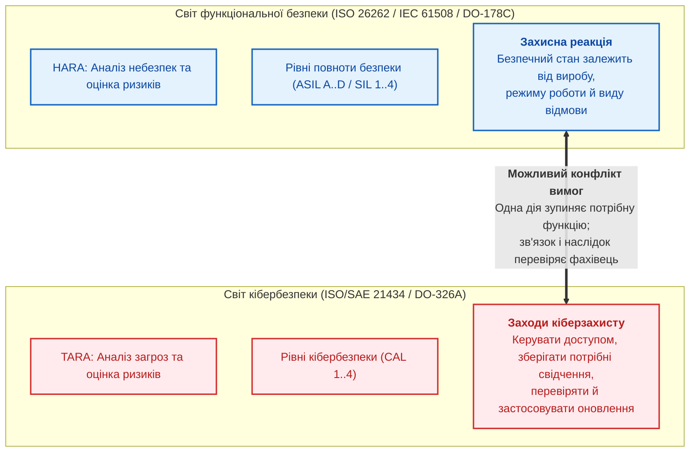
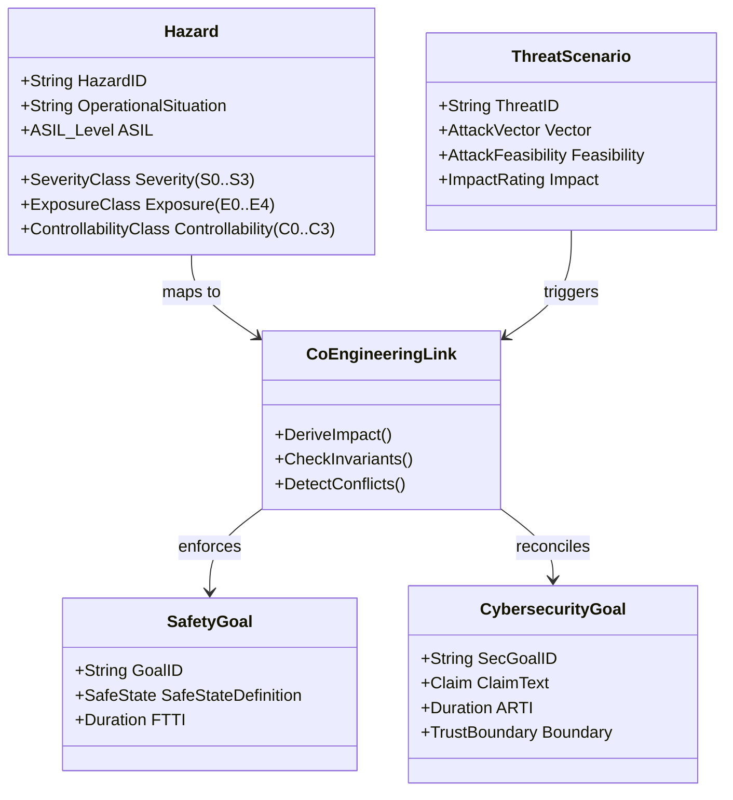
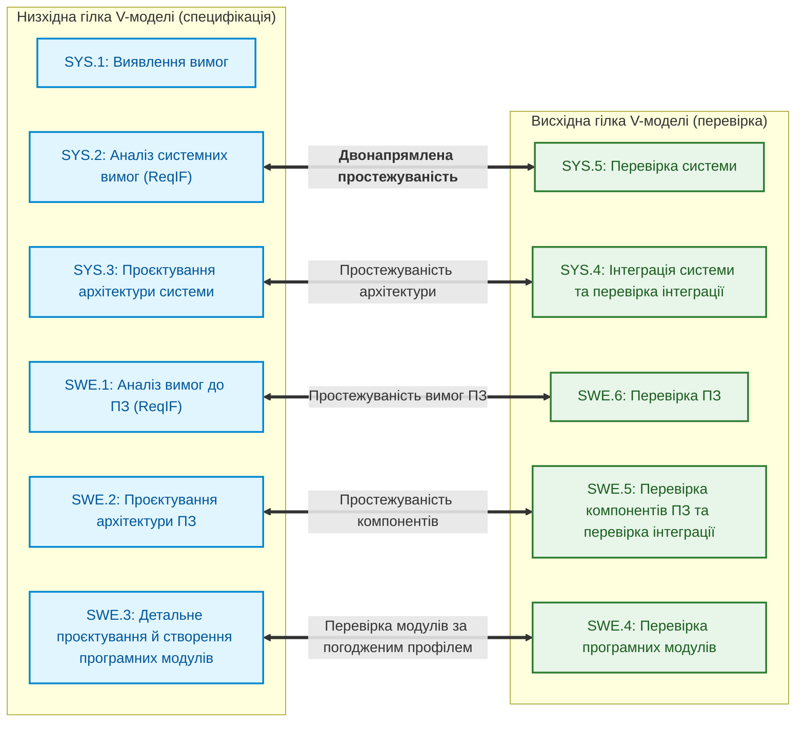
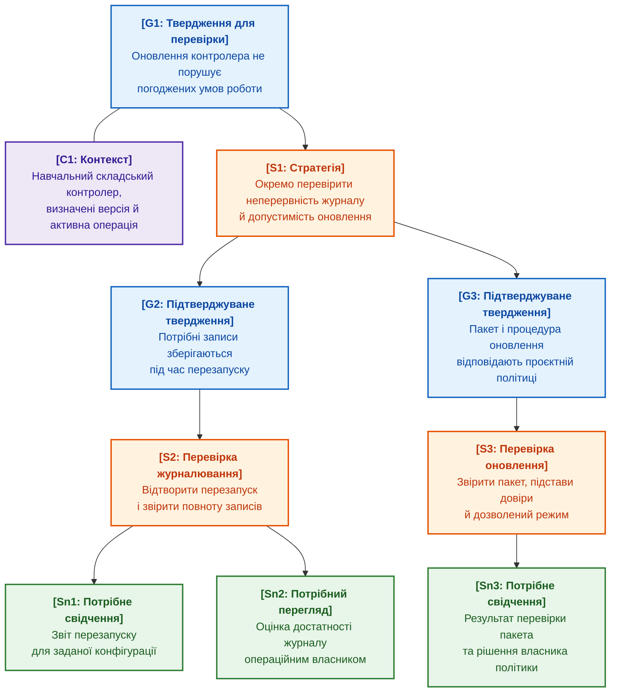

# Глава 30. Спільне проєктування функціональної безпеки та кібербезпеки

> **Книга:** [Архітектура доказових експертних систем](README.md) · [Частина V: Верифікація, діагностика, навчання та обґрунтування безпеки](part-05-verification-and-learning.md)  
> **Попередня глава:** [Глава 27. Обґрунтування безпеки: синтез і перевірка аргументів](ch27-safety-case-gsn-synthesis.md)  
> **Наступна глава:** [Глава 28. Дворежимні експертні системи: строгий висновок і дорадча гіпотеза](ch28-dual-mode-expert-systems.md)  
> **Зміст книги:** [README.md](README.md)  
> **Автор:** [Микола Федчик](about-the-author.md)  
> **Рівень:** системні інженери безпеки (Safety Managers), архітектори кібербезпеки (Security Engineers), лід-розробники вбудованих та автономних систем (Robotics, DefTech, Automotive): просунутий  
> **Очікувані результати:** відокремлювати предметне оцінювання ризику від перевірки погодженої політики; виявляти конфлікти між захисною реакцією та доступністю; перевіряти часові входи й простежуваність вимог; пояснювати межі цифрового підпису свідчення; оцінювати потребу кваліфікації експертної системи як інструмента.

---

## Анотація

Уявіть автономний логістичний тягач або безпілотний транспортний засіб на автомагістралі. Модуль виявлення аномалій кібербезпеки (ISO/SAE 21434) фіксує невідомі кадри на шині CAN і, виконуючи політику негайної нейтралізації загроз, ініціює скидання шлюзу або надсилає команду аварійного знеструмлення приводу. Але саме в цю частку секунди електропривод утримує кут коліс під час об'їзду перешкоди: функціональна безпека (ISO 26262, ASIL D) суворо вимагає збереження працездатності приводу (*Fail-Operational*). Раптове знеструмлення за наказом кіберзахисту спричиняє миттєве занесення й фатальну аварію. Протилежна крайність не менш руйнівна: якщо правила функціональної безпеки безумовно блокують будь-які захисні оновлення чи ізоляцію скомпрометованих вузлів під час руху, зловмисник отримує необмежене вікно для компрометації бортової мережі й перехоплення кермування.

Функціональна безпека (*functional safety*) та кібербезпека (*cybersecurity*) розглядають різні класи загроз, але застосовують захисні заходи до одних і тих самих фізичних контролерів, шин обміну та часових бюджетів. ISO/SAE 21434 задає автомобільний контекст кібербезпеки [[1]](#src-1), а серія ISO 26262 — контекст функціональної безпеки [[2]](#src-2). Безпечний стан системи завжди залежить від ситуаційного контексту, режиму руху та конкретного виробу; він ніколи не зводиться до сліпого знеструмлення живлення чи ігнорування аномалій.

У контексті доказових експертних систем спільне проєктування функціональної безпеки та кібербезпеки виступає не окремим довідковим розділом системної інженерії, а фундаментальним базисом верифікації бази знань: саме експертна система забезпечує формальний пошук взаємовиключних або небезпечних правил до того, як вони потраплять у виконавчий тракт. Запитання глави: **як експертна система допомагає виявити приховані конфлікти між вимогами функціональної безпеки й кіберзахисту ще на етапі проєктування, не підмінюючи предметного аналізу й відповідальності інженера?** Глава показує явні зв'язки між вимогами, навчальні перевірки часу й простежуваності, підписаний запис свідчення та кваліфікацію інструмента. Приклад оновлення складського контролера є синтетичним: він ілюструє метод, але не стверджує застосовності автомобільних стандартів до складського обладнання. Експертна система готує матеріал для оцінювання, а не видає сертифікацію продукту.

---

## 1. Проблема роздільних інженерних культур

Проєктування доказової бази знань для кіберфізичних систем неминуче стикається з історичним розколом між двома незалежними інженерними культурами — функціональної безпеки та кібербезпеки. У промисловості, транспортному машинобудуванні та оборонному секторі ці дисципліни розвивалися ізольовано, спираючись на власні стандарти, метрики та регуляторні приписи, що створює системний ризик взаємовиключних вимог:



### 1.1. Чотири архетипові міжкатегоріальні колізії

Роздільне проєктування може приховати взаємний вплив заходів. Наведені ситуації є класами питань для спільного перегляду, не доказом неминучої помилки ручної експертизи:

1. **Фізичні небезпеки, спричинені кібератакою:**  
  Порушення цілісності керувальних даних може мати фізичний наслідок. Фахівці мають встановити сценарій, умови й причинний зв'язок між загрозою та небезпекою. Аналіз кібербезпеки автомобільного виробу не обмежується конфіденційністю даних; експертна система не повинна приписувати всім методикам такого обмеження.
2. **Конфлікт захисної реакції й доступності:**  
  Захисна реакція може перервати потрібну функцію. Помилка контрольної суми не задає універсального наказу знеструмити виріб: реакцію визначають режим, тип відмови, резервування й вимоги виробу. Потрібно перевірити, чи погоджена реакція не створює нової небезпеки, а не оголосити доступність або зупинку безумовним пріоритетом.
3. **Конфлікт швидкого оновлення й повної перевірки змін:**  
  Термінове оновлення може конфліктувати з потребою перевірити вплив зміни. Обсяг повторної перевірки визначають змінені функції, залежності й застосовний процес; не кожна зміна вимагає однакового повного повторення всіх робіт. Експертна система готує перелік зачеплених вимог і свідчень, а власник процесу визначає достатній набір перевірок.
4. **Конфлікт діагностичного доступу й поверхні атаки:**  
  Діагностичний доступ може бути потрібним для обслуговування й водночас створювати додатковий ризик. Це не означає ані загальної вимоги тримати всі порти відкритими, ані загальної заборони діагностики. У моделі потрібно назвати дозволену роль, режим виробу, спосіб автентифікації, перелік операцій і умови закриття доступу.

---

## 2. Математичний та онтологічний апарат ко-інженерії

Вимоги й погоджені зв'язки між загрозами та небезпеками записують в інженерний граф знань (EKG, *Engineering Knowledge Graph*) з [Глави 9](ch09-engineering-knowledge-graph-traceability.md). Граф дозволяє виконати перевірку, але не встановлює сам, який фізичний наслідок спричинить атака.



### 2.1. Відображення TARA на HARA

Аналіз небезпек та оцінювання ризиків HARA (*Hazard Analysis and Risk Assessment*) і аналіз загроз та оцінювання ризиків TARA (*Threat Analysis and Risk Assessment*) пов'язують через конкретний сценарій і область застосування. Фахівець спочатку підтверджує, які небезпеки зачіпає загроза. Лише потім програма може застосувати погоджену таблицю категорій. Наступна формула є **навчальною політикою проєкту**, а не універсальним алгоритмом або дослівною вимогою ISO/SAE 21434.

Формула застосовна лише до непорожнього, перевіреного переліку небезпек із відомими рівнями тяжкості. Порожній перелік або невідома тяжкість дають відмову від оцінки, як у Go-коді розділу 5, а не категорію `Negligible`.

```math
\text{SafetyImpact}_{\text{TARA}}(\text{Threat}) = \begin{cases}
\text{Severe}, & \text{якщо } \exists H \in \text{ImpactedHazards}(\text{Threat}) : \text{Severity}(H) = S_3, \\
\text{Major}, & \text{якщо } \exists H : \text{Severity}(H) = S_2 \land \forall H : \text{Severity}(H) \le S_2, \\
\text{Moderate}, & \text{якщо } \exists H : \text{Severity}(H) = S_1 \land \forall H : \text{Severity}(H) \le S_1, \\
\text{Negligible}, & \text{якщо } \forall H : \text{Severity}(H) = S_0.
\end{cases}
```

Позначення у шкалі оцінки впливу:

- $\text{SafetyImpact}_{\text{TARA}}(\text{Threat})$ є категорією впливу загрози за навчальною політикою;
- $\text{Threat}$ позначає аналізований вектор кібератаки;
- $\text{ImpactedHazards}(\text{Threat})$ є множиною фізичних небезпек, які провокує ця атака;
- $H$ позначає окрему небезпеку з погодженої множини; усі квантори формули обмежено цією множиною;
- $\text{Severity}(H)$ є рівнем тяжкості наслідків за стандартом ISO 26262;
- $S_3$ стосується загрозливих для життя травм із невизначеним виживанням або смертельних травм;
- $S_2$ стосується тяжких травм і травм із загрозою життю за ймовірного виживання;
- $S_1$ відповідає легким або середнім ушкодженням;
- $S_0$ фіксує відсутність тілесних ушкоджень.

У межах навчальної політики хоча б одна підтверджена небезпека рівня $S_3$ дає категорію $\text{Severe}$. Але встановлення причинного зв'язку між загрозою й небезпекою залишається предметною роботою. Оцінка для одного сценарію не переноситься автоматично на інший виріб або режим.

### 2.2. Часовий бюджет ко-інженерії: FTTI проти ARTI

Спільне проєктування потребує узгодити часові характеристики захисних реакцій. У функціональній безпеці визначальним параметром є **інтервал часу стійкості до відмов (Fault Tolerant Time Interval, FTTI)**. ISO 26262-1:2018 визначає його як мінімальний проміжок часу від виникнення несправності в елементі до можливої небезпечної події [[2]](#src-2). Формулювання звірено не з офіційним текстом стандарту, а з дослівними цитатами в двох рецензованих статтях Філіппа Кіліана та співавторів, які посилаються саме на ISO 26262-1:2018 [[3]](#src-3), [[4]](#src-4). Слово «мінімальний» важливе: FTTI обмежує найшвидший шлях до небезпеки, а не середній. FTTI є властивістю цілі безпеки й визначається на рівні елемента з аналізу HARA [[3]](#src-3), а час оброблення несправності (*Fault Handling Time Interval*, FHTI) є властивістю конкретного механізму безпеки [[4]](#src-4). Навчальна умова балансу часу має такий вигляд:

```math
\text{FHTI} = \text{FDTI} + \text{FRTI} \le \text{FTTI}.
```

Складники часового балансу стійкості:

- $\text{FTTI}$ є інтервалом часу стійкості до відмов (*Fault Tolerant Time Interval*), у мілісекундах;
- $\text{FHTI}$ є часом оброблення несправності механізмом безпеки (*Fault Handling Time Interval*), тобто сумою FDTI і FRTI, у мілісекундах;
- $\text{FDTI}$ є проміжком часу від виникнення несправності до її виявлення (*Fault Detection Time Interval*), у мілісекундах;
- $\text{FRTI}$ є проміжком часу від виявлення несправності до досягнення безпечного стану або аварійного режиму роботи (*Fault Reaction Time Interval*), у мілісекундах.

Наведена нерівність дозволяє сумі часу виявлення й реакції не перевищувати FTTI. За навчальних 100 мс і 30 мс залишок становить 70 мс. Якщо політика потребує додатного резерву, рівність потрібно заборонити окремо; саме такий суворіший профіль перевіряє код розділу 5. Для реального виробу вимірювання мають враховувати найгірші умови й визначені межі інтервалів.

Для навчального сценарію введемо **інтервал часу реакції на атаку** (*Attack Response Time Interval*, ARTI). Це позначення часової моделі прикладу, не заявлений універсальний нормативний аналог FTTI:

```math
\text{ARTI} = \text{ATDI} + \text{ATRI}.
```

Параметри часу реагування на кібератаку:

- $\text{ARTI}$ є загальним інтервалом часу реакції на атаку (*Attack Response Time Interval*), у мілісекундах або мікросекундах;
- $\text{ATDI}$ є затримкою розпізнавання аномалії системою виявлення або запобігання вторгненням (*Attack Detection Time Interval*), у мілісекундах;
- $\text{ATRI}$ є часом активації захисних контрзаходів (*Attack Reaction Time Interval*), наприклад ізоляції вузла чи перемикання на резервний шифрований канал, у мілісекундах.

Вираз показує, що загальний час блокування вторгнення складається з моменту ідентифікації підозрілого кадру та часу апаратного вимкнення скомпрометованого порту.

**Головний інваріант ко-інженерної безпеки:**

```math
\forall \text{Threat } t \text{ impacting Hazard } H : \quad \text{ARTI}(t) + \text{FRTI}(H) < \text{FTTI}(H).
```

У цій нерівності:

- $t$ є сценарієм кібератаки, що впливає на фізичну небезпеку $H$;
- $\text{ARTI}(t)$ є інтервалом детекції та реакції на атаку $t$, у мілісекундах;
- $\text{FRTI}(H)$ є часом фізичного переведення приводу в безпечний стан, у мілісекундах;
- $\text{FTTI}(H)$ є граничним часом стійкості до відмови для небезпеки $H$, у мілісекундах.

Перевищення погодженого бюджету означає, що саме розглянутий шлях реакції не виконує критерій. Воно не доводить неможливості будь-якого програмного захисту й не визначає єдиного апаратного рішення. Потрібно перевірити модель часу, альтернативні реакції й незалежність захисних механізмів. ARTI та FRTI тут є послідовними інтервалами без перекриття; інакше додавання подвійно врахує частину реакції.

### 2.3. Загальна матриця сумісного ризику

Автоматичне призначення архітектури за парою категорій приховує припущення. Навчальну функцію вибору політики можна записати так:

```math
\mathcal{R}_{\text{co-eng}} = \Psi \Big( \text{ASIL}(H), \; \text{CAL}(\text{Threat}) \Big).
```

У моделі сумісного ризику:

- $\mathcal{R}_{\text{co-eng}}$ є результатом вибору додаткових перевірок за політикою проєкту, а не числовою ймовірністю;
- $\Psi$ є функцією відображення пари категорій у вимоги захисту;
- $\text{ASIL}(H)$ є рівнем повноти безпеки за стандартом ISO 26262 (від QM до ASIL D);
- $\text{CAL}(\text{Threat})$ є рівнем гарантії кібербезпеки за стандартом ISO/SAE 21434 (від CAL 1 до CAL 4).

Рівень гарантії кібербезпеки CAL (*Cybersecurity Assurance Level*) не слід ототожнювати з імовірністю успіху атаки або простою шкалою її складності. Рівень повноти безпеки автомобіля ASIL (*Automotive Safety Integrity Level*) також не є числовою ймовірністю. Проєкт повинен документувати оцінювання категорій і окремо обґрунтовувати заходи захисту. Без цих підстав функцію $\Psi$ застосовувати не можна.

Наприклад, політика може вимагати незалежного перегляду для критичного активу та додаткового випробування для зміни автентифікації. Це визначає роботу, яку треба виконати, а не автоматично наказує певний чип чи криптографічний алгоритм. Перелік таких правил погоджують фахівці з обох дисциплін.

---

## 3. Обробка та верифікація вимог у форматі ReqIF (ASPICE 4.0)

В авіаційній, автомобільній та оборонній індустріях обмін вимогами між замовником, генеральним підрядником (Tier-1) та розробниками мікроелектроніки (Tier-2) здійснюється через відкритий XML-стандарт **ReqIF (Requirements Interchange Format)**, стандартизований консорціумом OMG [[5]](#src-5).



### 3.1. Структура ReqIF та нормативні атрибути

Файл ReqIF є стандартизованим XML-документом, у якому вимога може бути записана елементом `<SPEC-OBJECT>`, а зв'язки задаються елементами `<SPEC-RELATION>`. Нижче наведено навчальний фрагмент. Визначення типів, заголовок і частину обов'язкових метаданих опущено, тому фрагмент не є самодостатнім валідним файлом ReqIF:

<details>
<summary>Навчальний фрагмент ReqIF: вимога й зв'язок уточнення</summary>

```xml
<?xml version="1.0" encoding="UTF-8"?>
<REQ-IF xmlns="http://www.omg.org/spec/ReqIF/20110401/reqif.xsd">
  <CORE-CONTENT>
    <REQ-IF-CONTENT>
      <SPEC-OBJECTS>
        <SPEC-OBJECT IDENTIFIER="REQ-SWE1-042" LAST-CHANGE="2026-09-15T10:00:00Z">
          <VALUES>
            <ATTRIBUTE-VALUE-STRING THE-VALUE="SYS_SEC_AUTH_CMD">
              <DEFINITION><ATTRIBUTE-DEFINITION-STRING-REF>ATTR-NAME</ATTRIBUTE-DEFINITION-STRING-REF></DEFINITION>
            </ATTRIBUTE-VALUE-STRING>
            <ATTRIBUTE-VALUE-STRING THE-VALUE="Кожен фрейм керування кермовими приводами SHALL містити CMAC AES-128 тег автентифікації.">
              <DEFINITION><ATTRIBUTE-DEFINITION-STRING-REF>ATTR-DESC</ATTRIBUTE-DEFINITION-STRING-REF></DEFINITION>
            </ATTRIBUTE-VALUE-STRING>
            <ATTRIBUTE-VALUE-ENUMERATION>
              <VALUES><ENUM-VALUE-REF>ENUM-ASIL-D</ENUM-VALUE-REF></VALUES>
              <DEFINITION><ATTRIBUTE-DEFINITION-ENUMERATION-REF>ATTR-ASIL</ATTRIBUTE-DEFINITION-ENUMERATION-REF></DEFINITION>
            </ATTRIBUTE-VALUE-ENUMERATION>
            <ATTRIBUTE-VALUE-ENUMERATION>
              <VALUES><ENUM-VALUE-REF>ENUM-CAL-4</ENUM-VALUE-REF></VALUES>
              <DEFINITION><ATTRIBUTE-DEFINITION-ENUMERATION-REF>ATTR-CAL</ATTRIBUTE-DEFINITION-ENUMERATION-REF></DEFINITION>
            </ATTRIBUTE-VALUE-ENUMERATION>
          </VALUES>
        </SPEC-OBJECT>
      </SPEC-OBJECTS>
      <SPEC-RELATIONS>
        <SPEC-RELATION IDENTIFIER="REL-089">
          <SOURCE><SPEC-OBJECT-REF>REQ-SWE1-042</SPEC-OBJECT-REF></SOURCE>
          <TARGET><SPEC-OBJECT-REF>REQ-SYS2-015</SPEC-OBJECT-REF></TARGET>
          <TYPE><SPEC-RELATION-TYPE-REF>REL-TYPE-REFINES</SPEC-RELATION-TYPE-REF></TYPE>
        </SPEC-RELATION>
      </SPEC-RELATIONS>
    </REQ-IF-CONTENT>
  </CORE-CONTENT>
</REQ-IF>
```

</details>

### 3.2. Автоматична перевірка метрик повноти ASPICE 4.0

Модель процесів Automotive SPICE 4.0 [[6]](#src-6) і авіаційний документ DO-178C мають різні області застосування; вони не є еквівалентними стандартами. Automotive SPICE 4.0 вимагає забезпечити узгодженість і встановити двонапрямлену простежуваність (*bidirectional traceability*), зокрема між програмними й системними вимогами (базова практика SWE.1.BP5) та між заходами перевірки й програмними вимогами (SWE.6.BP4); результати перевірки окремо простежують до заходів перевірки [[6]](#src-6). Наступні умови є навчальним профілем автоматичної перевірки частини цих зв'язків, а не перекладом базових практик. Пороги й винятки профілю потрібно обґрунтувати для конкретного проєкту, а не приписувати універсальній сертифікації.

**Інваріант відсутності вимог без системного зв'язку ($\mathcal{I}_{\text{no-orphan}}$).**  
Кожна програмна вимога $`r \in \text{Reqs}_{\text{SWE.1}}`$ зобов'язана бути спадкоємцем хоча б однієї системної вимоги $`s \in \text{Reqs}_{\text{SYS.2}}`$:

```math
\forall r \in \text{Reqs}_{\text{SWE.1}} : \exists s \in \text{Reqs}_{\text{SYS.2}} \quad \text{Refines}(r, s).
```

Символи інваріанта простежуваності:

- $r$ є окремою вимогою до програмного забезпечення рівня SWE.1;
- $\text{Reqs}_{\text{SWE.1}}$ є повною множиною програмних вимог підсистеми;
- $s$ є системною вимогою архітектурного рівня SYS.2;
- $\text{Refines}(r, s)$ означає відношення декомпозиції та уточнення вимоги $s$ через детальніший опис $r$.

Ця умова перевіряє зв'язок між відомими вимогами. Вона не доводить відсутності зайвих функцій у коді. Похідні вимоги можуть мати інший погоджений шлях обґрунтування; їх не слід відкидати лише через відсутність прямого батьківського запису.

**Інваріант повноти тестового покриття ($\mathcal{I}_{\text{test-cov}}$).**  
Для кожної вимоги підвищеного або критичного рівня ($\text{ASIL} \ge B$ або $\text{CAL} \ge 3$) обов'язково має існувати хоча б один затверджений верифікаційний тест із позитивним статусом:

```math
\forall r \in \text{Reqs}_{\text{SWE.1}} : \Big(\text{ASIL}(r) \ge B \lor \text{CAL}(r) \ge 3\Big) \implies \exists t \in \text{Tests}_{\text{SWE.6}} : \text{Verifies}(t, r) \land \text{Status}(t) = \text{Passed}.
```

Позначення в умові тестового покриття:

- $r$ є перевірюваною вимогою рівня SWE.1;
- $\text{ASIL}(r)$ та $\text{CAL}(r)$ є рівнями безпеки та кіберзахисту цієї вимоги;
- $t$ є верифікаційним тестом зі списку $\text{Tests}_{\text{SWE.6}}$;
- $\text{Verifies}(t, r)$ задає зв'язок підтвердження вимоги тестом;
- $\text{Status}(t) = \text{Passed}$ фіксує успішне виконання тесту на стенді.

Якщо для критичної вимоги тест відсутній або завершився збоєм, інваріант набуває значення «хиба». Експертна система тоді позначає пакет свідчень як неповний і показує відсутній зв'язок, а рішення про подальші дії ухвалює власник процесу.

**Метрика MC/DC для коду рівня ASIL D.**  
Критерій покриття модифікованої умови та рішення MC/DC (*Modified Condition/Decision Coverage*) показує незалежний вплив умов на рішення. Приклад нижче задає ціль повного покриття для обраного модуля. Вимоги до методу й обґрунтування непокритих елементів залежать від застосовного стандарту; ASIL D і авіаційний рівень A не слід зводити до однієї універсальної умови.

```math
\text{Coverage}_{\text{MC/DC}}(M) = 1{,}0 \quad (100\,\%).
```

де:

- $M$ є модулем коду, що реалізує функції безпеки рівня ASIL D;
- $\text{Coverage}_{\text{MC/DC}}(M)$ є часткою умов, для яких показано незалежний вплив на рішення, у межах від 0 до 1,0;
- значення 1,0 (100 %) означає, що такий вплив показано для кожної умови кожного рішення модуля.

Для виразу `if (crc_ok && auth_valid && !timeout)` кожна з трьох умов потребує пари тестів, у якій змінюється значення цієї умови й через це змінюється результат усього виразу. У варіанті з унікальною причиною решта умов у парі залишається незмінною; варіант із маскуванням дозволяє змінювати інші умови, якщо їхній вплив замасковано. Обраний варіант і обґрунтування непокритих умов фіксують у плані перевірки.

---

## 4. Синтез доказів безпеки за стандартом Goal Structuring Notation (GSN)

Нотація структурування цілей GSN (*Goal Structuring Notation*) допомагає явно зв'язати твердження, аргументацію, контекст і свідчення [[7]](#src-7). Вона не замінює звітів випробувань і не робить аргумент правильним лише через заповнення графа. Машина збирає каркас і перевіряє визначені структурні умови, а достатність аргументу оцінюють фахівці. Межі формалізації обґрунтувань розглядає Джон Рашбі [[8]](#src-8).



### 4.1. Підписаний запис свідчення

Листовий вузол аргументу (*Solution, Sn*) посилається на конкретне свідчення. Навчальний підписаний запис містить його хеш і метадані. Це не стандартний формат сертифікації й не криптографічне доведення істинності твердження:
1. `AssertionID`: однозначний ідентифікатор цілі GSN або нормативного твердження.
2. `ProofType`: клас сертифікаційного свідчення (`MC_DC_Coverage`, `Hardware_Root_Of_Trust`, `Traceability_Matrix`).
3. `EvidenceDigests`: масив криптографічних хешів SHA-256 артефактів першоджерел (вихідний код C/Rust/Go, звіти тестування, прошивки).
4. `ByteRanges`: точні зміщення байтів у нормативному звіті чи лозі тестування.
5. `Signature`: підпис погодженого подання запису, включно з ідентифікатором твердження, типом, часом і хешем свідчення. Підпис лише байтів свідчення не захищає метадані від підміни.

<details>
<summary>Навчальний опис свідчення; підпис не обчислено</summary>

```json
{
  "record_version": "1.0",
  "assertion_id": "GOAL-G2-ASIL-D-DECOMPOSITION",
  "proof_type": "MC_DC_Coverage",
  "timestamp_utc": "2026-10-02T12:00:00Z",
  "root_evidence": {
    "artifact_uri": "reports/verification/mcdc_swe4_actuator.log",
    "sha256": "4b227777d4dd1fc61c6f884f48641d02b4d121d3fd328cb08b5531fcacdabf8a",
    "byte_start": 4120,
    "byte_end": 4890,
    "literal_quote": "TOTAL MCDC COVERAGE: 100.0% (48/48 CONDITIONS SATISFIED)"
  },
  "signing_authority": {
    "key_id": "audit-sec-core-01",
    "signature": null
  }
}
```

</details>

Підпис підтверджує походження й цілісність підписаних даних. Без доступу до свідчення або незалежного результату його перевірки аудитор не може з одного хеша оцінити виконання вимоги. Підпис одного листового запису також не захищає весь граф аргументації. Подання й правила перевірки погоджують між підписувачем і перевірником; Go-приклад нижче використовує однакову структуру в обох функціях, а не заявляє міжмовної канонізації.

---

## 5. Навчальні перевірки в експертній системі мовою Go

Наведений модуль `compliance` демонструє навчальну політику зіставлення вже погоджених категорій, перевірку часових бюджетів, кілька умов до записів вимог і правило оновлення з розділу 6.2, яке відрізняє конфлікт від нестачі свідчень. Модуль не встановлює, яку небезпеку спричиняє загроза, не читає повну модель виробу й не доводить відповідності стандартам. Невідомі категорії та недопустимі часові значення повертають помилку, а не дозвіл. Для запуску потрібен Go 1.20 або новіший; залежності лише зі стандартної бібліотеки.

<details>
<summary>Приклад мовою Go: модуль відповідності стандартам і верифікації часових бюджетів</summary>

```go
package compliance

import (
	"crypto/ecdsa"
	"crypto/rand"
	"crypto/sha256"
	"encoding/json"
	"errors"
	"fmt"
	"math/big"
	"time"
)

// SeverityClass визначає рівень тяжкості HARA за ISO 26262-3
type SeverityClass string

const (
	SeverityS0 SeverityClass = "S0" // Negligible (відсутність травм)
	SeverityS1 SeverityClass = "S1" // Moderate (легкі та середні травми)
	SeverityS2 SeverityClass = "S2" // Major (важкі травми з загрозою життю)
	SeverityS3 SeverityClass = "S3" // Severe (смертельні випадки / катастрофа)
)

// ThreatImpact визначає категорію впливу TARA за ISO/SAE 21434
type ThreatImpact string

const (
	ImpactNegligible ThreatImpact = "Negligible"
	ImpactModerate   ThreatImpact = "Moderate"
	ImpactMajor      ThreatImpact = "Major"
	ImpactSevere     ThreatImpact = "Severe"
)

// ThreatScenario описує сценарій кібератаки на критичний актив
type ThreatScenario struct {
	ID                string
	Name              string
	AttackFeasibility string        // High, Medium, Low, Very Low
	SafetySeverity    SeverityClass // Пов'язана небезпека HARA
	ARTIDuration      time.Duration // Attack Response Time Interval
}

// SafetyGoal описує ціль функціональної безпеки
type SafetyGoal struct {
	ID        string
	SafeState string        // Назва безпечного стану (напр. EMERGENCY_LANDING)
	FTTI      time.Duration // Fault Tolerant Time Interval
	FRTI      time.Duration // Fault Reaction Time Interval
}

func DeriveTARAImpact(severity SeverityClass) (ThreatImpact, error) {
	switch severity {
	case SeverityS3:
		return ImpactSevere, nil
	case SeverityS2:
		return ImpactMajor, nil
	case SeverityS1:
		return ImpactModerate, nil
	case SeverityS0:
		return ImpactNegligible, nil
	default:
		return "", fmt.Errorf("unknown severity: %q", severity)
	}
}

// VerifyTimingBudget перевіряє умову ARTI + FRTI < FTTI
func VerifyTimingBudget(sg SafetyGoal, ts ThreatScenario) error {
	if sg.FTTI <= 0 || sg.FRTI < 0 || ts.ARTIDuration < 0 {
		return errors.New("invalid timing input")
	}
	if sg.FRTI >= sg.FTTI || ts.ARTIDuration >= sg.FTTI-sg.FRTI {
		return errors.New("timing budget exceeded or no reserve remains")
	}
	return nil
}

// UpdateFinding є результатом правила POLICY-UPDATE-1 з розділу 6.2
type UpdateFinding string

const (
	FindingNoConflict      UpdateFinding = "no_conflict"
	FindingConflict        UpdateFinding = "conflict"
	FindingMissingEvidence UpdateFinding = "missing_evidence"
)

// RestartTest описує звіт про перезапуск журналювання для однієї конфігурації
type RestartTest struct {
	ID               string
	Configuration    string
	RecordsPreserved bool // записи збережено незалежним шляхом під час перезапуску
}

// UpdateContext містить погоджені входи правила
type UpdateContext struct {
	ActiveOperation   bool   // REQ-OBS-1: активна операція потребує журналу
	UpdateRestartsLog bool   // FACT-RESTART-1: оновлення перезапускає журналювання
	Configuration     string // поточна конфігурація контролера
	Tests             []RestartTest
}

// EvaluateUpdatePolicy відрізняє підтверджений конфлікт від нестачі свідчень
func EvaluateUpdatePolicy(ctx UpdateContext) (UpdateFinding, []string) {
	if !ctx.ActiveOperation || !ctx.UpdateRestartsLog {
		return FindingNoConflict, nil
	}
	if ctx.Configuration == "" {
		return FindingMissingEvidence, nil
	}
	var preserved, lost []string
	for _, test := range ctx.Tests {
		if test.Configuration != ctx.Configuration {
			continue
		}
		if test.RecordsPreserved {
			preserved = append(preserved, test.ID)
		} else {
			lost = append(lost, test.ID)
		}
	}
	switch {
	case len(lost) > 0:
		return FindingConflict, lost
	case len(preserved) > 0:
		return FindingNoConflict, preserved
	default:
		return FindingMissingEvidence, nil
	}
}

// ReqIFObject представляє вершину вимоги у форматі ReqIF
type ReqIFObject struct {
	ID           string
	Text         string
	ASIL         string
	CAL          string
	ParentID     string // Посилання на вищу системну вимогу
	RequiresMCDC bool
	HasMCDC      bool // Чи є підтверджене покриття 100% MC/DC
}

func ValidateProjectTraceability(objects []ReqIFObject, approvedParents map[string]bool) []string {
	var violations []string
	for _, obj := range objects {
		if !approvedParents[obj.ParentID] {
			violations = append(violations, fmt.Sprintf("%s: approved parent is missing", obj.ID))
		}
		if obj.RequiresMCDC && !obj.HasMCDC {
			violations = append(violations, fmt.Sprintf("%s: required coverage evidence is missing", obj.ID))
		}
	}
	return violations
}

type EvidenceRecord struct {
	AssertionID  string `json:"assertion_id"`
	ProofType    string `json:"proof_type"`
	TimestampUTC string `json:"timestamp_utc"`
	DigestHex    string `json:"digest_hex"`
	SignatureR   string `json:"sig_r"`
	SignatureS   string `json:"sig_s"`
}

func recordDigest(record *EvidenceRecord) ([32]byte, error) {
	payload, err := json.Marshal(struct {
		AssertionID, ProofType, TimestampUTC, DigestHex string
	}{record.AssertionID, record.ProofType, record.TimestampUTC, record.DigestHex})
	return sha256.Sum256(payload), err
}

func SignEvidence(assertionID, proofType, evidenceData string, privKey *ecdsa.PrivateKey) (*EvidenceRecord, error) {
	if privKey == nil || assertionID == "" || proofType == "" {
		return nil, errors.New("missing signing key or record metadata")
	}
	evidenceDigest := sha256.Sum256([]byte(evidenceData))
	record := &EvidenceRecord{
		AssertionID: assertionID, ProofType: proofType,
		TimestampUTC: time.Now().UTC().Format(time.RFC3339),
		DigestHex:    fmt.Sprintf("%x", evidenceDigest),
	}
	digest, err := recordDigest(record)
	if err != nil {
		return nil, err
	}
	r, s, err := ecdsa.Sign(rand.Reader, privKey, digest[:])
	if err != nil {
		return nil, err
	}
	record.SignatureR, record.SignatureS = r.Text(16), s.Text(16)
	return record, nil
}

func VerifyEvidence(record *EvidenceRecord, evidenceData string, publicKey *ecdsa.PublicKey) bool {
	if record == nil || publicKey == nil {
		return false
	}
	evidenceDigest := sha256.Sum256([]byte(evidenceData))
	if record.DigestHex != fmt.Sprintf("%x", evidenceDigest) {
		return false
	}
	r, validR := new(big.Int).SetString(record.SignatureR, 16)
	s, validS := new(big.Int).SetString(record.SignatureS, 16)
	digest, err := recordDigest(record)
	return validR && validS && err == nil && ecdsa.Verify(publicKey, digest[:], r, s)
}
```

Для перевірки збережіть модуль як `compliance.go`, а наступний блок як `compliance_test.go` в тій самій директорії. Команда `go test compliance.go compliance_test.go` не потребує сторонніх бібліотек або файла модуля.

```go
package compliance

import (
	"crypto/ecdsa"
	"crypto/elliptic"
	"crypto/rand"
	"testing"
	"time"
)

func TestSeverityPolicy(t *testing.T) {
	known := map[SeverityClass]ThreatImpact{
		SeverityS0: ImpactNegligible, SeverityS1: ImpactModerate,
		SeverityS2: ImpactMajor, SeverityS3: ImpactSevere,
	}
	for severity, expected := range known {
		actual, err := DeriveTARAImpact(severity)
		if err != nil || actual != expected {
			t.Fatalf("%q: got %q, %v", severity, actual, err)
		}
	}
	for _, severity := range []SeverityClass{"", "S4"} {
		if actual, err := DeriveTARAImpact(severity); err == nil || actual != "" {
			t.Fatalf("unknown %q was accepted", severity)
		}
	}
}

func TestTimingPolicy(t *testing.T) {
	for _, testCase := range []struct {
		limit, reaction, detection time.Duration
		wantError                  bool
	}{
		{100, 20, 79, false}, {100, 20, 80, true},
		{100, -1, 20, true}, {100, 20, -1, true},
		{0, 0, 0, true}, {100, 120, 0, true},
	} {
		goal := SafetyGoal{FTTI: testCase.limit, FRTI: testCase.reaction}
		scenario := ThreatScenario{ARTIDuration: testCase.detection}
		if err := VerifyTimingBudget(goal, scenario); (err != nil) != testCase.wantError {
			t.Fatalf("%+v: got %v", testCase, err)
		}
	}
}

func TestProjectTraceability(t *testing.T) {
	parents := map[string]bool{"SYS-1": true}
	valid := ReqIFObject{ID: "REQ-1", ParentID: "SYS-1", RequiresMCDC: true, HasMCDC: true}
	if len(ValidateProjectTraceability([]ReqIFObject{valid}, parents)) != 0 {
		t.Fatal("valid links rejected")
	}
	valid.ParentID = "unknown"
	valid.HasMCDC = false
	if len(ValidateProjectTraceability([]ReqIFObject{valid}, parents)) != 2 {
		t.Fatal("missing links were accepted")
	}
}

func TestUpdatePolicyFindings(t *testing.T) {
	base := UpdateContext{ActiveOperation: true, UpdateRestartsLog: true, Configuration: "cfg-B"}
	lost := RestartTest{ID: "TEST-RESTART-1", Configuration: "cfg-B", RecordsPreserved: false}
	kept := RestartTest{ID: "TEST-RESTART-2", Configuration: "cfg-B", RecordsPreserved: true}
	other := RestartTest{ID: "TEST-RESTART-0", Configuration: "cfg-A", RecordsPreserved: true}
	for _, testCase := range []struct {
		name  string
		tests []RestartTest
		want  UpdateFinding
	}{
		{"lost records", []RestartTest{lost}, FindingConflict},
		{"no test for configuration", []RestartTest{other}, FindingMissingEvidence},
		{"records preserved", []RestartTest{kept}, FindingNoConflict},
		{"contradicting reports", []RestartTest{kept, lost}, FindingConflict},
	} {
		ctx := base
		ctx.Tests = testCase.tests
		if got, _ := EvaluateUpdatePolicy(ctx); got != testCase.want {
			t.Fatalf("%s: got %s, want %s", testCase.name, got, testCase.want)
		}
	}
	idle := base
	idle.ActiveOperation = false
	if got, _ := EvaluateUpdatePolicy(idle); got != FindingNoConflict {
		t.Fatalf("idle controller: got %s", got)
	}
	unknown := base
	unknown.Configuration = ""
	unknown.Tests = []RestartTest{lost}
	if got, _ := EvaluateUpdatePolicy(unknown); got != FindingMissingEvidence {
		t.Fatalf("unknown configuration: got %s", got)
	}
}

func TestEvidenceBinding(t *testing.T) {
	key, err := ecdsa.GenerateKey(elliptic.P256(), rand.Reader)
	if err != nil {
		t.Fatal(err)
	}
	record, err := SignEvidence("REQ-42", "test", "passed", key)
	if err != nil {
		t.Fatal(err)
	}
	if !VerifyEvidence(record, "passed", &key.PublicKey) {
		t.Fatal("valid record rejected")
	}
	if VerifyEvidence(record, "failed", &key.PublicKey) {
		t.Fatal("changed evidence accepted")
	}
	record.AssertionID = "REQ-99"
	if VerifyEvidence(record, "passed", &key.PublicKey) {
		t.Fatal("changed metadata accepted")
	}
}
```

</details>

Тести перевіряють відомі й невідомі категорії, часові входи, посилання на погоджених батьків, три результати правила оновлення, зокрема суперечливі звіти й звіт для іншої конфігурації, і зв'язування підпису з даними та метаданими. Значення `time.Duration` у тестах задано в наносекундах; для реального запису одиницю вказують явно, наприклад `100 * time.Millisecond`. Порівняння через залишок бюджету не приховує переповнення суми. Прапорець `RequiresMCDC` задає погоджений профіль проєкту, а не автоматичне тлумачення ASIL. Обробку похідних вимог, довіру до ключа, його чинність і відкликання приклад не реалізує.

---

## 6. Практичний кейс: оновлення складського контролера

Складський контролер приймає оновлення програмного забезпечення та веде журнал станів. Команда хоче закрити вразливість, але перезапуск контролера перериває потік спостереження. Приклад навчальний; достатність захисту й потрібний безпечний стан визначає предметний фахівець, не наведені числа або автомобільні категорії.

### 6.1. Погоджені входи

| Запис | Зміст | Підстава |
|---|---|---|
| `REQ-OBS-1`, редакція 2 | під час активної операції журнал станів має залишатися доступним | погоджена вимога операційного власника |
| `REQ-UPD-1`, редакція 3 | встановлювати лише перевірений пакет оновлення | погоджена політика оновлень |
| `FACT-RESTART-1` | процедура оновлення перезапускає процес журналювання | аналіз процедури й відтворюваний тест |
| `TEST-RESTART-1` | під час перезапуску записи не надходять у центральний журнал | звіт для визначеної версії й конфігурації |

Зв'язки між дією, процесом журналювання та вимогою отримано не з подібності текстів. Інженер перевірив процедуру, тест і конфігурацію; кандидатні зв'язки пройшли перегляд. Підпис звіту захищає запис від зміни, але не встановлює, чи методика випробування достатня.

### 6.2. Висновок правила

Правило `POLICY-UPDATE-1` перевіряє три умови: активна операція потребує журналу, оновлення перезапускає процес журналу й немає прийнятого свідчення про незалежне збереження записів. За виконання умов правило повертає **конфлікт вимог**, ідентифікатори підстав і вимогу фахового рішення. Правило не робить висновку, що будь-яке оновлення заборонене або що потрібен певний апаратний модуль.

Якщо тест не охоплює поточної конфігурації, результат є «бракує свідчень». Цей результат відрізняється від підтвердженого конфлікту. Функція `EvaluateUpdatePolicy` з розділу 5 реалізує саме це розрізнення: звіт про втрату записів для поточної конфігурації дає конфлікт, звіт лише для іншої конфігурації або невідома конфігурація дають «бракує свідчень», а звіт про збереження записів знімає конфлікт. Суперечливі звіти для однієї конфігурації правило трактує як конфлікт, бо успішний повторний прогін не скасовує зафіксованої втрати записів, доки фахівець не з'ясує причину розбіжності. Повний граф джерел, версій і станів функція не реалізує.

### 6.3. Альтернативи й перевірки

| Кандидат на дію | Що потрібно перевірити | Хто погоджує |
|---|---|---|
| оновлення в паузі між операціями | що пауза справді настала й повторний запуск не порушує процедури | операційний власник |
| незалежний запис журналу під час перезапуску | повноту, порядок, часові мітки й відновлення після обриву | власник журналювання |
| відкладення оновлення | строк відкладення, ризик вразливості й тимчасові обмеження | відповідальний за кібербезпеку |

Кожна альтернатива є кандидатом із власним тестом, а не автоматичним «гармонізованим» рішенням. Після схвалення експертна система фіксує вибір, винятки, версії й строк чинності рішення. Новий пакет знань змінює поточну оцінку, але не переписує стару історію. Такий самий механізм застосовний до оновлення сервісу, що веде фінансовий журнал або керує довготривалими завданнями.

---

## 7. Кваліфікація самої експертної системи як програмного інструмента (ISO 26262-8, розділ 11)

Попередні розділи показали навчальні перевірки вимог і підписаний запис свідчення. Аудитор поставить запитання до самої експертної системи: чому результатам цього інструмента можна довіряти? Для автомобільних проєктів форму відповіді задає розділ 11 частини 8 стандарту ISO 26262 «Впевненість у використанні програмних інструментів» (*Confidence in the use of software tools*) [[9]](#src-9). Стандарт не вимагає сертифікувати кожен інструмент: потрібно оцінити наслідок його помилки й незалежні заходи її виявлення.

### 7.1. Вплив інструмента, виявлення помилки й рівень довіри

Оцінка спирається на дві характеристики конкретного сценарію використання інструмента. Вплив інструмента (*Tool Impact*, TI) показує, чи може несправність інструмента внести помилку в елемент, пов'язаний із безпекою, або не виявити наявну помилку: TI1 означає, що такої можливості немає, TI2 охоплює решту випадків. Виявлення помилки інструмента (*Tool error Detection*, TD) показує, наскільки впевнено інші заходи процесу запобіжать хибному результату інструмента або виявлять його: TD1 означає високий ступінь впевненості, TD2 середній, TD3 решту випадків. З цих двох оцінок виводять рівень довіри до інструмента (*Tool Confidence Level*, TCL).

```math
\mathrm{TCL}(\mathrm{TI}, \mathrm{TD}) =
\begin{cases}
1, & \mathrm{TI} = \mathrm{TI1} \;\lor\; \mathrm{TD} = \mathrm{TD1},\\
2, & \mathrm{TI} = \mathrm{TI2} \;\land\; \mathrm{TD} = \mathrm{TD2},\\
3, & \mathrm{TI} = \mathrm{TI2} \;\land\; \mathrm{TD} = \mathrm{TD3}.
\end{cases}
```

Складники класифікації інструмента:

- $\mathrm{TI}$ є оцінкою впливу інструмента для одного сценарію використання й набуває значень TI1 або TI2;
- $\mathrm{TD}$ є оцінкою того, наскільки впевнено процес запобіжить хибному результату інструмента або виявить його, і набуває значень TD1, TD2 або TD3;
- $\lor$ означає логічне «або», а $\land$ означає логічне «і»;
- $\mathrm{TCL}$ є рівнем довіри від 1 до 3: TCL1 не потребує кваліфікації, TCL2 і TCL3 потребують кваліфікації, а для TCL3 вимоги до неї суворіші.

Формулу читають так: інструмент не потребує кваліфікації, якщо його помилка не може зашкодити продукту (TI1) або помилку майже напевно виявить незалежний захід (TD1). Кваліфікація потрібна лише тоді, коли помилка інструмента може потрапити в продукт, і процес не гарантує, що помилку зупинить. Таблиця застосовує формулу до трьох сценаріїв використання однієї й тієї самої експертної системи.

| Сценарій використання експертної системи | TI | Захід, що виявляє помилку інструмента | TD | TCL |
|---|---|---|---|---|
| Пошук норм і показ цитат; рішення ухвалює інженер після читання першоджерела | TI2: пропущена норма може не потрапити до вимог | незалежний перелік застосовних стандартів і побайтова перевірка кожної цитати | TD1 | TCL1 |
| Виявлення прогалин простежуваності ReqIF (розділ 3.2) | TI2: пропущена прогалина не потрапить до звіту аудиту | вибіркова ручна перевірка й порівняльний прогін іншим інструментом | TD2 | TCL2 |
| Побудова аргументу без рецензування людиною | TI2: хибний аргумент потрапляє до обґрунтування безпеки | незалежного заходу немає | TD3 | TCL3 |

Таблиця ілюструє логіку класифікації, а не дає готових оцінок: TD залежить від того, які перевірки справді виконує процес конкретного проєкту. З таблиці випливає два практичні наслідки. По-перше, класифікують не експертну систему взагалі, а кожен сценарій її використання. По-друге, найдешевший спосіб знизити TCL полягає не в кваліфікації, а в незалежному заході виявлення. Цитати з байтовими межами, дерево доведення й позначена відмова, які книга описує в [Главах 20](ch20-explanation-engine.md) і [31](ch31-syllogistic-reasoning-and-relation-lattices.md), саме таким заходом і є: рецензент перевіряє кожне твердження за першоджерелом, не довіряючи інструменту на слово.

### 7.2. Методи кваліфікації й особливість експертної системи

Для TCL2 і TCL3 стандарт пропонує чотири методи кваліфікації, а рекомендованість кожного методу залежить від TCL і від ASIL продукту [[9]](#src-9):

1. підвищення впевненості через досвід використання (*increased confidence from use*);
2. оцінювання процесу розроблення інструмента;
3. валідація програмного інструмента;
4. розроблення інструмента відповідно до стандарту безпеки.

Для експертної системи найпрактичніший метод є валідацією: еталонний набір випадків із відомими правильними відповідями, метаморфні й порівняльні перевірки ([Глава 23](ch23-knowledge-base-verification.md)), виміряні частоти хибних відповідей і відмов. Особливість експертної системи полягає в тому, що поведінку інструмента визначає не лише версія механізму виведення, а й покоління пакета знань ([Глава 32](ch32-high-performance-knowledge-packs-mmap-and-harvesting.md)). Тому версією кваліфікованого інструмента є пара «версія механізму виведення і ідентифікатор покоління пакета знань», і кожне нове покоління пакета потребує повторного прогону валідаційного набору. Метод досвіду використання для експертної системи слабкий з тієї самої причини: історія використання накопичується для конкретної пари версій, а знання оновлюються швидше, ніж накопичується статистика.

Авіаційні проєкти розв'язують ту саму задачу за розділом 12.2 DO-178C [[10]](#src-10) і документом DO-330 [[11]](#src-11). Рівень кваліфікації інструмента (*Tool Qualification Level*, TQL, від TQL-1 до TQL-5) визначають за трьома критеріями й рівнем бортового ПЗ: чи може вихід інструмента внести помилку в бортове ПЗ, чи автоматизує інструмент перевірку, якою замінюють інші перевірки, чи інструмент може лише не виявити помилку. Логіка збігається з ISO 26262-8: оцінюють наслідок помилки інструмента й незалежність її виявлення.

### 7.3. Комплект документів кваліфікації

Результат класифікації й кваліфікації оформлюють так, щоб аудитор міг перевірити його незалежно від розробника експертної системи. Практично це три документи:

1. **Звіт про класифікацію інструмента:** перелік сценаріїв використання, оцінки TI і TD з обґрунтуванням і отриманий TCL для кожного сценарію.
2. **Звіт про кваліфікацію:** обраний метод, валідаційний набір, виміряні результати і пара версій «механізм виведення і покоління пакета знань», для якої результати чинні.
3. **Настанова з використання інструмента:** дозволені сценарії, обов'язкові людські перевірки, відомі несправності й обхідні шляхи, середовище виконання.

Третій документ найкорисніший для інженерів: настанова прямо каже, для чого експертній системі довіряти не можна. Цей негативний результат є такою самою частиною кваліфікації, як і позитивний, і саме негативний результат не дає інструменту непомітно розширити сферу застосування. Контрольний перелік аудиту в наступному розділі тому містить окремий пункт про кваліфікацію інструментів.

---

## 8. Проєктний перелік для підготовки перегляду

Це навчальний перелік запитань, не універсальний сертифікаційний перелік і не дослівні вимоги кількох стандартів. Власник процесу визначає застосовні нормативні пункти, докази та допустимі винятки. Запит до графа перевіряє лише те, що формалізовано:

1. **Зв'язки ризиків:** чи схвалено відношення між конкретними сценаріями загроз і небезпек? Відповідність може бути «багато до багатьох», а не бієкцією.
2. **Час:** чи визначено одиниці, межі інтервалів, найгірші умови й потрібний резерв? Чи застосовна саме погоджена навчальна нерівність до сценарію?
3. **Простежуваність:** чи ведуть зв'язки на правильні затверджені версії й чи обґрунтовано похідні вимоги без прямого батька? Непорожній ідентифікатор не підтверджує зв'язку.
4. **Покриття:** чи відповідає метод і рівень структурного покриття погодженому профілю? Позначка ASIL D сама не встановлює універсальної вимоги стовідсоткового MC/DC.
5. **Залежності:** чи зафіксовано склад і версії сторонніх компонентів, походження, відомі вразливості й рішення щодо ризику? Відсутність записаної вразливості не доводить відсутності вразливостей.
6. **Кваліфікація інструментів:** Чи класифіковано експертну систему та інші інструменти за ISO 26262-8 для кожного сценарію використання, і чи збігається пара версій «механізм виведення і покоління пакета знань» у звіті про кваліфікацію з тією, що сформувала подані докази?

---

## 9. Сучасні засоби й аналіз даних для спільної інженерії

Розділи 2–8 припускали, що погоджені записи вже існують: зв'язки загроз і небезпек, вимоги з батьками, звіти тестів, склад компонентів. На практиці ці записи виробляють різні інструменти, і експертна система отримує їх у різних форматах. Тому постає прикладне запитання: які відкриті методи й формати дають машинно-читані свідчення для перевірок цієї глави і чого кожен із них не гарантує.

| Метод або формат | Що дає експертній системі | Чого не гарантує |
|---|---|---|
| STPA-Sec, системно-теоретичний аналіз процесів для безпеки й кібербезпеки [[12]](#src-12) | одну функціональну структуру керування для аналізу небезпек і вразливостей; перелік небезпечних або незахищених керувальних дій як факти графа | повноти моделі керування; автори прямо пишуть, що повноту не можна довести, а людська рецензія залишається обов'язковою |
| ReqIF і бібліотека `reqif` для Python [[5]](#src-5), [[13]](#src-13) | розбір, форматування й перевірку файла ReqIF за офіційною схемою OMG перед завантаженням до графа | схема перевіряє структуру, а не правильність тексту вимоги чи зв'язку |
| CycloneDX 1.7, стандартизований як ECMA-424 [[14]](#src-14) | перелік складу програмного забезпечення (*Software Bill of Materials*, SBOM): компоненти, залежності, сервіси, відомі вразливості, позначку повноти переліку | перелік повний лише настільки, наскільки повний процес збирання; позначка повноти є твердженням виробника переліку |
| OpenVEX 0.2.0, реалізація формату VEX (*Vulnerability Exploitability eXchange*) [[15]](#src-15) | твердження «продукт, вразливість, статус, час» зі статусами `not_affected`, `affected`, `fixed`, `under_investigation` і машинно-читаним обґрунтуванням | статус `not_affected` є твердженням постачальника; специфікація сама зазначає, що деякі обґрунтування важко довести |
| Uptane 2.1.0 [[16]](#src-16) | вимоги до перевірки оновлень у транспортному засобі: два репозиторії метаданих, повна й часткова перевірка, захист від відкату та заморожування оновлень | захист від шкідливого коду в довіреному пакеті й компрометації збірки стандарт виводить за свої межі; для цього потрібні атестації походження з [Глави 27](ch27-safety-case-gsn-synthesis.md) |

Таблиця показує спільну межу: кожен засіб формалізує одну частину свідчень і не встановлює причинності між загрозою та фізичною небезпекою. Ця причинність, як і в розділі 2.1, залишається предметним рішенням.

**STPA-Sec як спільна модель.** Вільям Янг і Ненсі Левесон запропонували розширити системно-теоретичний аналіз процесів (*System-Theoretic Process Analysis*, STPA) на кібербезпеку [[12]](#src-12). Обидва аналізи будують одну функціональну структуру керування й шукають чотири види небезпечних керувальних дій: дію, що веде до небезпеки; відсутню потрібну дію; дію зарано, запізно або не в тій послідовності; дію, що триває задовго або припиняється зарано. Відмінність STPA-Sec, за авторами, полягає лише в тому, що причинні сценарії останнього кроку охоплюють і навмисні дії. Для цієї глави це важливо з двох причин. По-перше, третій і четвертий види дій прямо пов'язані з часовим бюджетом розділу 2.2: реакція на атаку, що настала запізно, є небезпечною керувальною дією, навіть якщо сама дія правильна. По-друге, обидві команди працюють з одним переліком керувальних дій, тому експертна система може перевіряти, що кожна небезпечна дія має обмеження, кожне обмеження має вимогу, а кожна вимога має тест. Автори зазначили, що формальне порівняння STPA-Sec із червоними командами на 2014 рік ще тривало, тому перевагу методу для кібербезпеки слід вважати гіпотезою, яку проєкт перевіряє на власних даних.

**Склад компонентів і статус вразливостей.** Пункт 5 переліку з розділу 8 питає про залежності й відомі вразливості. CycloneDX описує компоненти, залежності й вразливості, а OpenVEX додає до кожної пари «продукт, вразливість» статус і час. Твердження в OpenVEX упорядковані в часі: нове твердження уточнює попереднє, тому експертна система має зберігати історію статусів, а не лише останній. Перевірки стають простими правилами: вразливість зі статусом `affected` без запису про дію є незакритою; статус `under_investigation`, старший за погоджений строк, потребує ескалації; `not_affected` без машинно-читаного обґрунтування не приймається.

**Аналіз даних над свідченнями.** Три прийоми з аналізу даних доповнюють правила глави, але дають лише кандидатів для перевірки:

1. **Зіставлення складу компонентів зі стрічками вразливостей.** З'єднання компонентів SBOM за ідентифікаторами пакетів із публічними базами вразливостей дає кандидатні пари «компонент, вразливість». Неточні назви й версії дають і хибні збіги, і пропуски, тому кожна пара отримує статус VEX від відповідального фахівця, а частку хибних збігів вимірюють на розміченій вибірці.
2. **Пошук прогалин простежуваності.** Запити до графа знаходять вимоги без батька, критичні вимоги без тесту й тести, прив'язані до застарілої редакції вимоги. Пошук асоціативних правил над історією змін показує, які типи вимог найчастіше втрачають зв'язки після зміни; цей результат визначає порядок ручного перегляду, а не замінює перегляду. Методи відновлення зв'язків простежуваності розглянуто в [Главі 27](ch27-safety-case-gsn-synthesis.md).
3. **Аналіз історії розв'язаних конфліктів.** Кейси на зразок розділу 6 накопичуються: пара «захисна реакція, захід кібербезпеки», рішення, винятки й строк чинності. Кластеризація таких пар підказує запитання для переліку перегляду нового проєкту. Збіг із минулим кейсом є аналогією, а не доказом: умови нового виробу потрібно перевірити окремо.

Ці прийоми змінюють порядок і повноту людської перевірки, але не її статус. Тому для кожного прийому вимірюють власну похибку: частку хибних збігів SBOM, тривалість відкритих статусів VEX і повноту пошуку прогалин.

---

## Висновки
Експертна система допомагає зіставляти погоджені вимоги, знаходити конфлікт і пояснювати відсутню підставу. Вона не встановлює автоматично причинності між загрозою й небезпекою та не замінює предметного оцінювання ризику. Кейс складського контролера розділив конфлікт, нестачу даних і кандидатні дії, а функція `EvaluateUpdatePolicy` відтворила це розрізнення в коді. Go-тести перевірили невідомі входи, часову межу, простежуваність, три результати правила оновлення та захист метаданих підписом.

Відкриті методи й формати роблять свідчення машинно-читаними: STPA-Sec дає спільну модель керування, CycloneDX і OpenVEX описують склад компонентів і статус вразливостей, Uptane задає перевірку оновлень. Кожен із цих засобів звужує одну частину ручної роботи, але не встановлює достатності свідчень.

Підписаний запис не є сертифікацією виробу, а нотація аргументації не доводить достатності свідчень. Кваліфікація інструмента залежить від сценарію використання та незалежності перевірок. Визначення FTTI, FDTI, FRTI і FHTI звірено з дослівними цитатами ISO 26262-1:2018 у рецензованих статтях, а назви процесів і базові практики простежуваності з текстом Automotive SPICE 4.0; для сертифікаційного проєкту визначення беруть із ліцензованої копії стандарту. Погоджені предметні політики, тести й рішення відповідальних осіб залишаються потрібними навіть за повної автоматизації збирання записів.

---

## Запитання для самоперевірки
1. Які підстави потрібні, перш ніж програма застосує погоджену таблицю впливу до зв'язку загрози й небезпеки? Чому порожній перелік небезпек не означає найнижчий ризик?
2. Поясніть сутність конфлікту захисної реакції й доступності. За яких умов автоматика функціональної безпеки сама стає інструментом реалізації кібератаки?
3. За яких припущень можна додавати ARTI й FRTI? Чому перевищення бюджету одного шляху не доводить неможливості будь-якого іншого рішення?
4. Чому непорожнє поле `ParentID` не доводить правильності посилання на батьківську вимогу?
5. Які дані захищає підпис запису свідчення й чого підпис не доводить про продукт?
6. Які свідчення потрібні для оновлення складського контролера під час активної операції? Хто погоджує альтернативну дію?
7. Чому одна й та сама експертна система може мати TCL1 в одному сценарії використання і TCL3 в іншому, і чому нове покоління пакета знань вимагає повторної валідації інструмента?
8. Чому правило оновлення повертає «бракує свідчень», а не «конфлікту немає», якщо є лише звіт для іншої конфігурації?
9. Які перевірки можна автоматизувати над парою CycloneDX і OpenVEX, і чому статус `not_affected` залишається твердженням, а не доведеним фактом?
10. Як часовий бюджет розділу 2.2 пов'язаний із видами небезпечних керувальних дій у STPA-Sec?

---

## Словник
| Український термін | Англійський відповідник | Коротке пояснення |
|---|---|---|
| Функціональна безпека | Functional Safety | Властивість системи усувати невиправданий ризик фізичної шкоди, викликаної збоями в роботі апаратури чи ПЗ |
| Кібербезпека | Cybersecurity | Захист систем, мереж та програм від навмисних цифрових атак, несанкціонованого доступу та спотворення даних |
| Ко-інженерія | Co-Engineering | Одночасне та узгоджене проектування кількох системних дисциплін у спільному інженерному просторі |
| Аналіз небезпек та оцінка ризиків | HARA (Hazard Analysis and Risk Assessment) | Систематичний метод виявлення небезпечних подій та призначення рівнів повноти безпеки (ASIL) за ISO 26262 |
| Аналіз загроз та оцінка ризиків | TARA (Threat Analysis and Risk Assessment) | Метод виявлення сценаріїв кібератак, векторів загроз та оцінки їх критичності за ISO/SAE 21434 |
| Рівень повноти безпеки автомобіля | ASIL (Automotive Safety Integrity Level) | Клас критичності за ISO 26262 від A (найнижчий) до D (найсуворіший) |
| Рівень кібербезпеки | CAL (Cybersecurity Assurance Level) | Ступінь впевненості у захисті від атак за шкалою ISO/SAE 21434 від 1 до 4 |
| Інтервал часу стійкості до відмов | FTTI (Fault Tolerant Time Interval) | Мінімальний проміжок часу від виникнення несправності в елементі до можливої небезпечної події за ISO 26262-1:2018 |
| Час оброблення несправності | FHTI (Fault Handling Time Interval) | Сума часу виявлення й часу реакції на несправність; властивість конкретного механізму безпеки |
| Інтервал часу реакції на атаку | ARTI (Attack Response Time Interval) | Час, необхідний системі для детекції кібератаки та активації захисних бар'єрів |
| Формат обміну вимогами | ReqIF (Requirements Interchange Format) | Відкритий XML-стандарт консорціуму OMG для передачі вимог між різнорідними інженерними середовищами |
| Покриття модифікованої умови/рішення | MC/DC (Modified Condition/Decision Coverage) | Суворий метод структурного тестування ПЗ, де кожна умова перевіряється на незалежний вплив на результат |
| Нотація структурування цілей | GSN (Goal Structuring Notation) | Графічна мова для явної структуризації сертифікаційних аргументів безпеки |
| Апаратний модуль безпеки | HSM (Hardware Security Module) | Ізольований апаратний криптографічний співпроцесор для збереження ключів та швидкого обчислення підписів/CMAC |
| Модуль захисту пам'яті | MPU (Memory Protection Unit) | Апаратний вузол мікроконтролера, що контролює права доступу процесорних завдань до адресного простору |
| Кваліфікація програмного інструмента | Software tool qualification | Підтвердження доказами, що інструменту можна довіряти в певному сценарії використання |
| Вплив інструмента | TI (Tool Impact) | Оцінка того, чи може несправність інструмента внести або пропустити помилку в елементі, пов'язаному з безпекою |
| Виявлення помилки інструмента | TD (Tool error Detection) | Оцінка того, наскільки впевнено інші заходи процесу виявлять хибний результат інструмента |
| Рівень довіри до інструмента | TCL (Tool Confidence Level) | Рівень від 1 до 3 за ISO 26262-8, який визначає, чи потрібна кваліфікація інструмента |
| Небезпечна керувальна дія | Unsafe control action | Дія контролера, яка в певному контексті веде до небезпеки: надана, не надана, надана не вчасно або не тієї тривалості |
| Перелік складу програмного забезпечення | SBOM (Software Bill of Materials) | Машинно-читаний перелік компонентів і залежностей продукту |
| Твердження про експлуатованість вразливості | VEX statement | Запис «продукт, вразливість, статус, час», який повідомляє, чи зачіпає вразливість продукт |

---

## Абревіатури
| Скорочення | Розшифрування | Значення |
|---|---|---|
| ARTI | Attack Response Time Interval | інтервал часу реакції на кібератаку |
| ATDI | Attack Detection Time Interval | час розпізнавання атаки в навчальній моделі глави |
| ATRI | Attack Reaction Time Interval | час активації захисних заходів у навчальній моделі глави |
| ASIL | Automotive Safety Integrity Level | рівень повноти безпеки автомобіля за стандартом ISO 26262 |
| ASPICE | Automotive Software Process Improvement and Capability Determination | стандарт оцінки та вдосконалення процесів розробки ПЗ для автопрому |
| CAL | Cybersecurity Assurance Level | рівень гарантії кібербезпеки за стандартом ISO/SAE 21434 |
| CAN-FD | Controller Area Network Flexible Data-Rate | промисловий стандарт бортової мережі зв'язку з підвищеною швидкістю передачі даних |
| CMAC | Cipher-based Message Authentication Code | блочний алгоритм обчислення коду автентифікації повідомлень на базі симетричного шифрування (AES) |
| DoS | Denial of Service | атака типу «відмова в обслуговуванні» |
| EKG | Engineering Knowledge Graph | інженерний граф знань проєкту |
| FDTI | Fault Detection Time Interval | проміжок часу від виникнення несправності до її виявлення |
| FHTI | Fault Handling Time Interval | час оброблення несправності, сума FDTI і FRTI |
| FRTI | Fault Reaction Time Interval | проміжок часу від виявлення несправності до безпечного стану або аварійного режиму |
| FTTI | Fault Tolerant Time Interval | інтервал часу стійкості до відмов |
| GSN | Goal Structuring Notation | нотація структурування сертифікаційних цілей |
| HARA | Hazard Analysis and Risk Assessment | аналіз небезпек та оцінка ризиків функціональної безпеки |
| HSM | Hardware Security Module | апаратний модуль безпеки |
| MC/DC | Modified Condition / Decision Coverage | покриття коду за модифікованою умовою та рішенням |
| MPU | Memory Protection Unit | апаратний блок захисту пам'яті процесора |
| ODD | Operational Design Domain | експлуатаційний домен проектування автономної системи |
| OTA | Over-The-Air | технологія бездротового дистанційного оновлення прошивки |
| ReqIF | Requirements Interchange Format | відкритий формат обміну вимогами консорціуму OMG |
| SBOM | Software Bill of Materials | перелік складу програмного забезпечення |
| STPA | System-Theoretic Process Analysis | системно-теоретичний аналіз процесів |
| STPA-Sec | STPA for Security | розширення STPA на навмисні причинні сценарії |
| TARA | Threat Analysis and Risk Assessment | аналіз загроз та оцінювання ризиків кібербезпеки |
| TCL | Tool Confidence Level | рівень довіри до програмного інструмента за ISO 26262-8 |
| TD | Tool error Detection | оцінка виявлення помилки інструмента за ISO 26262-8 |
| TI | Tool Impact | оцінка впливу інструмента на елемент, пов'язаний із безпекою, за ISO 26262-8 |
| TQL | Tool Qualification Level | рівень кваліфікації інструмента за DO-178C і DO-330 |
| VDA | Verband der Automobilindustrie | Союз автомобільної промисловості Німеччини |
| VEX | Vulnerability Exploitability eXchange | формат тверджень про те, чи зачіпає вразливість продукт |

---

## Джерела
1. <a id="src-1"></a>International Organization for Standardization, SAE International. [*ISO/SAE 21434:2021: Road Vehicles - Cybersecurity Engineering*](https://www.iso.org/standard/70918.html). ISO/SAE, Geneva, Switzerland, 2021.
2. <a id="src-2"></a>International Organization for Standardization. [*ISO 26262:2018: Road Vehicles - Functional Safety (Parts 1–12)*](https://www.iso.org/standard/68383.html). ISO, Geneva, Switzerland, 2018.
3. <a id="src-3"></a>Philipp Kilian, Armin Köhler, Patrick Van Bergen та ін. [*Principle Guidelines for Safe Power Supply Systems Development*](https://doi.org/10.1109/ACCESS.2021.3100711). *IEEE Access*, 9, 107751–107766, 2021.
4. <a id="src-4"></a>Philipp Kilian, Armin J. Köhler, Patrick Van Bergen та ін. [*Best Practices for Advanced Modeling of Safety Mechanisms in an FTA*](https://doi.org/10.1109/ACCESS.2023.3284751). *IEEE Access*, 11, 60109–60129, 2023.
5. <a id="src-5"></a>Object Management Group (OMG). [*Requirements Interchange Format (ReqIF), Version 1.2*](https://www.omg.org/spec/ReqIF/1.2/About-ReqIF). OMG, 2016.
6. <a id="src-6"></a>VDA Working Group 13. [*Automotive SPICE Process Assessment / Reference Model, Version 4.0*](https://vda-qmc.de/wp-content/uploads/2023/12/Automotive-SPICE-PAM-v40.pdf). VDA QMC, 2023-11-29.
7. <a id="src-7"></a>Assurance Case Working Group. [*Goal Structuring Notation Community Standard, Version 3*](https://doi.org/10.65391/r1386). SCSC-141C, Safety-Critical Systems Club, 2021.
8. <a id="src-8"></a>John Rushby. [*Formalism in Safety Cases*](https://www.csl.sri.com/users/rushby/abstracts/sss10). *Making Systems Safer: Proceedings of the Eighteenth Safety-Critical Systems Symposium*, Springer, 3–17, 2010.
9. <a id="src-9"></a>ISO. [*ISO 26262-8:2018. Road vehicles: Functional safety: Part 8: Supporting processes*](https://www.iso.org/standard/68390.html). ISO, Geneva, Switzerland, 2018. Розділ 11: Confidence in the use of software tools.
10. <a id="src-10"></a>RTCA / EUROCAE. [*DO-178C / ED-12C: Software Considerations in Airborne Systems and Equipment Certification*](https://www.rtca.org/). RTCA, Washington, D.C., 2011.
11. <a id="src-11"></a>RTCA. [*DO-330: Software Tool Qualification Considerations*](https://www.rtca.org/). RTCA, Washington, D.C., 2011.
12. <a id="src-12"></a>William Young, Nancy G. Leveson. [*An Integrated Approach to Safety and Security Based on Systems Theory*](https://doi.org/10.1145/2556938). *Communications of the ACM*, 57(2), 31–35, 2014.
13. <a id="src-13"></a>StrictDoc Project. [*reqif: Python library for ReqIF format*](https://github.com/strictdoc-project/reqif). Реліз 0.1.0.
14. <a id="src-14"></a>OWASP Foundation, Ecma International TC54. [*CycloneDX Specification, Version 1.7 (ECMA-424)*](https://cyclonedx.org/specification/overview/). 2025.
15. <a id="src-15"></a>OpenVEX. [*OpenVEX Specification v0.2.0*](https://github.com/openvex/spec/blob/main/OPENVEX-SPEC.md). Реалізація документа CISA *Minimum Requirements for VEX*, квітень 2023.
16. <a id="src-16"></a>Uptane Community, Joint Development Foundation Projects. [*Uptane Standard for Design and Implementation 2.1.0*](https://uptane.org/docs/latest/standard/uptane-standard).

---

[← Глава 27](ch27-safety-case-gsn-synthesis.md) | [Зміст книги](README.md) | [Частина V](part-05-verification-and-learning.md) | [Глава 28 →](ch28-dual-mode-expert-systems.md)
