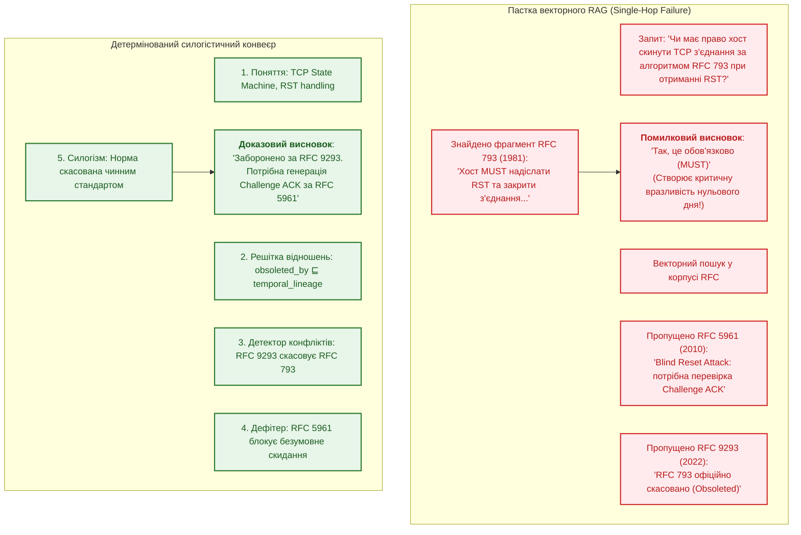
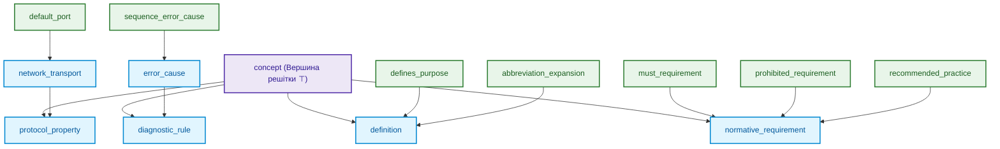
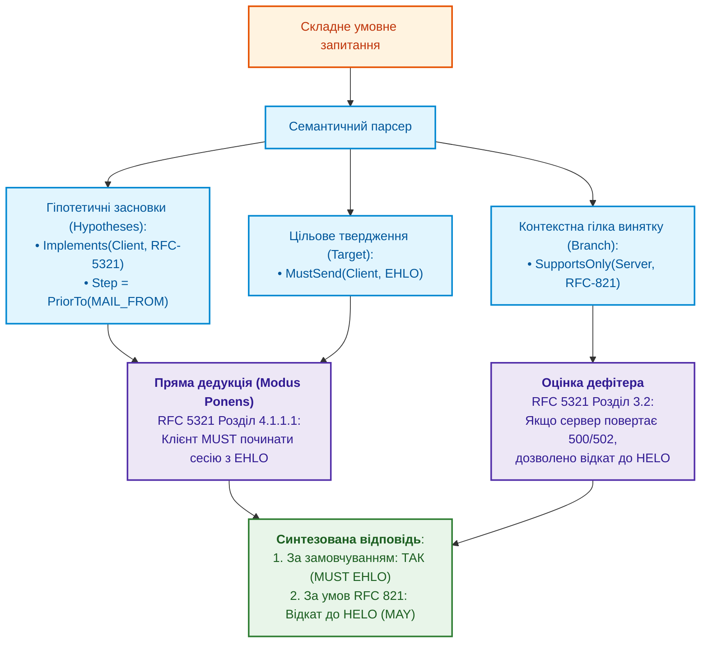

# Глава 31. Силогістичний рушій та решітки знань: багатоходова дедукція, дефітери та розв'язання суперечностей у багатодоменних стандартах

> **Книга:** [Архітектура доказових експертних систем](README.md) · [Частина VI: Передовий край: регуляторна сертифікація та нейро-символьний ШІ](part-06-frontiers-neuro-symbolic.md)  
> **Попередня глава:** [Глава 30. Ко-інженерія функціональної безпеки та кібербезпеки](ch30-safety-cybersecurity-co-engineering.md)  
> **Наступна глава:** [Глава 32. Високопродуктивні інженерні бази знань: mmap-індексування з нульовою десеріалізацією, побайтовий нейро-символьний харвестинг та інженерія знаннєвої щільності](ch32-high-performance-knowledge-packs-mmap-and-harvesting.md)  
> **Зміст книги:** [README.md](README.md)  
> **Автор:** [Микола Федчик](about-the-author.md)  
> **Пов'язані глави книги:** [Глава 2. Філософія для інженера](ch02-epistemology-of-machine-knowledge.md) · [Глава 6. Прикладна математика експертних систем](ch06-applied-mathematics-for-expert-systems.md) · [Глава 13. Варіативність природної мови](ch13-language-variability-vs-determinism.md) · [Глава 20. Рушій пояснень](ch20-explanation-engine.md) · [Глава 27. Синтез сертифікаційних доказів за GSN](ch27-safety-case-gsn-synthesis.md) · [Глава 29. Нейро-символьна архітектура](ch29-neuro-symbolic-architecture.md)  
> **Суміжні дослідження автора:** [Військові експертні системи: БПЛА, ППО, РЕР/РЕБ](../MilTech/Military-Expert-Systems-UAS-AD-ELINT-EW-UA.md) · [Військова кібернетика](../MilTech/Ukrainian-Military-Cybernetics-UA.md)  
> **Рівень:** розробники логічних рушіїв, системні архітектори, інженери знань, фахівці з формальних методів: просунутий  
> **Очікувані результати:** проєктувати багатоходові силогістичні ядра виведення; будувати ациклічні онтологічні решітки відношень (*Relation Lattices*) зі спрямованою субсумцією; реалізовувати тризначну логіку Кліні (Strong Kleene 3VL) для подолання хиби замкненого світу; формалізувати теорію спростувачів (Defeaters) за Джоном Поллоком; автоматично виявляти деонтичні колізії та лінії застарівання між стандартами; парсити складнопідрядні умовні запитання оператора; будувати інтерактивні дерева доведень (Proof DAG) із побайтовою прив'язкою до першоджерел.

---

## Анотація

У цій главі розглядається системний перехід від поверхового статистичного пошуку текстових збігів (характерного для RAG та наївних експертних систем) до багатоходового детермінованого силогістичного міркування. Більшість прикладних систем штучного інтелекту страждають від «однокрокової сліпоти» (*Single-Hop Retrieval Bias*): вони здатні витягти пряму відповідь, якщо вона зафіксована в одному реченні, але зазнають цілковитого краху або продукують галюцинації, коли висновок вимагає синтезу трьох-п'яти розрізнених норм із різних специфікацій, урахування контекстуальних винятків (*Defeaters*) та перевірки міждокументних ліній застарівання.

Спираючись на досвід побудови промислового доказового ядра, ми досліджуємо класичну епістемологічну тріаду: **«Поняття, Судження, Висновок/Силогізм»**. Детально викладається математичний апарат онтологічних решіток відношень (Relation Lattice DAG) із механізмом спрямованої субсумції, тризначна логіка Кліні (Strong Kleene 3VL), деонтичне моделювання винятків за теорією Джона Поллока, алгоритм розв'язання міжспецифікаційних суперечностей (на прикладі еволюції TCP: RFC 793 $\to$ RFC 5961 $\to$ RFC 9293) та архітектура інтерактивного інспектора дерев доведень (Proof DAG) у термінальному інтерфейсі.

---

## 1. Проблема однокрокової сліпоти та криза дедукції

Сучасні конвеєри семантичного пошуку спираються на оптимізацію косинусної близькості векторних ембедингів:

```math
\text{Query} \xrightarrow{\text{Embed}} \mathbf{v}_q \implies \arg\max_k \cos(\mathbf{v}_q, \mathbf{v}_k).
```

Позначення векторного пошуку:

- $\text{Query}$ є текстовим запитом інженера або оператора;
- $\text{Embed}$ позначає функцію перетворення тексту у вектор дійсних чисел;
- $\mathbf{v}_q$ є вектором запиту в латентному просторі;
- $\mathbf{v}_k$ є збереженими векторами фрагментів документів;
- $\cos(\mathbf{v}_q, \mathbf{v}_k)$ є косинусною подібністю векторів у межах від $-1$ до $1$;
- $\arg\max_k$ вибирає індекс фрагмента з найвищою геометричною близькістю.

Ця формула описує механізм семантичного зіставлення, де вибір базується лише на схожості слів, а не на логічній чинності норми.

Такий підхід демонструє принципову неспроможність при аналізі формальних інженерних стандартів:



### 1.1. Чому статистичні моделі роблять критичні помилки?

1. **Ізоляція нормативних засновків:** Норма загального правила зафіксована в одному базовому стандарті, специфічний виняток задано в додатку до іншого, а юридична або технічна відміна правила з'являється у третьому документі через двадцять років. Жоден векторний ембединг не здатний зв'язати три документи в єдиний логічний ланцюг без явної графової моделі знань.
2. **Плутанина деонтичних модальностей:** Статистичні моделі вважають слова `MUST`, `SHOULD`, `RECOMMENDED`, `MAY` семантично подібними (оскільки вони зустрічаються в однакових контекстах), повністю ігноруючи їх суворе деонтичне значення, закріплене стандартом RFC 2119 / RFC 8174 [[7]](#src-7).
3. **Хиба замкненого світу (Closed-World Fallacy):** Якщо в локальній базі знань відсутній запис про явну заборону певної дії, наївні логічні системи автоматично роблять висновок, що дія дозволена (принцип заперечення як невдачі, *Negation as Failure* у класичному Пролозі). В інженерії безпеки це неприпустимо: відсутність даних означає стан «невідомо», що вимагає блокування операції (*Fail-Closed*).

---

## 2. Тріада мислення: Поняття, Судження, Висновок (Concept, Judgment, Inference)

Аристотелівська логіка та семіотика Чарльза Пірса визначають трирівневу структуру мислення, яка в доказовому ядрі реалізується як послідовність типізованих структур:

```mermaid
flowchart LR
    accTitle: Тріада мислення: Поняття, Судження, Висновок
    accDescr: Структурний перехід від сутностей та предикатів до доведених силогізмів.

    subgraph Level1["1. Рівень Понять (Concepts)"]
        direction TB
        TERM["<b>Термін (Terminus)</b><br/>• Інтенсіонал (Ознаки)<br/>• Екстенсіонал (Обсяг)"]
        LATTICE["<b>Онтологічна решітка</b><br/>Субсумція: Sub ⊑ Super"]
    end

    subgraph Level2["2. Рівень Суджень (Judgments)"]
        direction TB
        PROP["<b>Пропозиція (Proposition)</b><br/>Subject, Relation, Object"]
        MODAL["<b>Деонтична модальність</b><br/>MUST, SHOULD, MAY, MUST_NOT"]
        DEFEAT["<b>Дефітери (Defeaters)</b><br/>Умови винятків (UNLESS)"]
    end

    subgraph Level3["3. Рівень Висновку (Inference)"]
        direction TB
        PREM["<b>Засновки силогізму</b><br/>Major Premise + Minor Premise"]
        RULES["<b>Правила виводу</b><br/>Modus Ponens / Subsumption"]
        DAG["<b>Merkle Proof DAG</b><br/>Криптографічне дерево доказу"]
    end

    Level1 ==> Level2 ==> Level3

    classDef c1 fill:#e1f5fe,stroke:#0288d1,stroke-width:2px,color:#01579b;
    classDef c2 fill:#fff3e0,stroke:#e65100,stroke-width:2px,color:#bf360c;
    classDef c3 fill:#e8f5e9,stroke:#2e7d32,stroke-width:2px,color:#1b5e20;

    class TERM,LATTICE c1;
    class PROP,MODAL,DEFEAT c2;
    class PREM,RULES,DAG c3;
```



### 2.1. Поняття (Concept / Terminus)

Поняття фіксує абстрактну сутність або фізичний об'єкт інженерного домену. Воно математично описується парою множин:
- **Інтенсіонал (Зміст поняття):** Множина суттєвих ознак, властивостей та інваріантів, які відрізняють це поняття від інших:

```math
\text{Intension}(C) = \{ P_1, P_2, \dots, P_k \}.
```

Складники інтенсіоналу:

- $C$ є поняттям предметної області;
- $\text{Intension}(C)$ є множиною суттєвих ознак та інваріантів поняття;
- $P_1, \dots, P_k$ є предикатами властивостей, які однозначно визначають сутність;
- $k$ є кількістю обов'язкових ознак у визначенні.

- **Екстенсіонал (Обсяг поняття):** Множина всіх конкретних сутностей або спеціалізацій, які задовольняють ознаки інтенсіоналу:

```math
\text{Extension}(C) = \{ x \mid \forall P \in \text{Intension}(C) : P(x) = \text{True} \}.
```

Символи екстенсіоналу:

- $\text{Extension}(C)$ є обсягом поняття, тобто множиною всіх конкретних об'єктів;
- $x$ позначає окрему інженерну сутність або екземпляр;
- $\forall P$ вимагає істинності кожної ознаки $P$ з інтенсіоналу для даного об'єкта;
- $\text{True}$ фіксує відповідність об'єкта правилу.

Між поняттями діє **закон зворотного відношення між змістом і обсягом**: що ширший інтенсіонал (більше обмежувальних ознак додається до визначення), то вужчим стає екстенсіонал (менша кількість об'єктів йому відповідає).

### 2.2. Судження (Judgment / Proposition)

Судження стверджує або заперечує наявність відношення між поняттями. У доказовій системі судження формалізується як розширений семантичний кортеж:

```math
\mathcal{J} = \langle \text{Subject}, \; \mathcal{R}, \; \text{Object}, \; \mathcal{M}, \; \mathcal{D}, \; \text{Provenance} \rangle.
```

Складники семантичного судження:

- $\mathcal{J}$ є формальним кортежем нормативного судження;
- $\text{Subject}$ та $\text{Object}$ є концептами в інженерному просторі;
- $\mathcal{R}$ є типом відношення з решітки відношень;
- $`\mathcal{M} \in \{ \text{MUST}, \text{MUST-NOT}, \text{SHOULD}, \text{SHOULD-NOT}, \text{MAY} \}`$ є нормативною деонтичною модальністю;
- $`\mathcal{D} = \{ d_1, d_2, \dots \}`$ є множиною умов спростування (*Defeaters*);
- $\text{Provenance}$ є дескриптором першоджерела (ідентифікатор документа, SHA-256 та байтові зміщення).

### 2.3. Висновок (Inference / Syllogism)

Силогізм є детермінованим кроком виведення, в якому з двох засновків (великої та малої посилок), що мають спільний середній термін ($M$), з логічною необхідністю випливає третє судження (висновок):

```math
\frac{\text{Major Premise: } \forall x : M(x) \xrightarrow{\mathcal{M}} P(x), \quad \text{Minor Premise: } M(S)}{\text{Conclusion: } S \xrightarrow{\mathcal{M}} P}.
```

Складові елементи силогізму:

- $\text{Major Premise}$ є великою посилкою загального правила для всіх об'єктів класу $M$;
- $\text{Minor Premise}$ є малою посилкою факту належності конкретного суб'єкта $S$ до класу $M$;
- $M$ є середнім терміном (*terminus medius*), що пов'язує обидві посилки;
- $\text{Conclusion}$ є логічно неминучим висновком про обов'язковість властивості $P$ для суб'єкта $S$;
- $\mathcal{M}$ позначає збережену модальність нормативного припису.

**Приклад у машинному аудиті протоколів:**
1. **Велика посилка ($P_{\text{major}}$):** Будь-який мережевий сервер, що обробляє протокол SMTP за RFC 5321 ($M$), **MUST** відповідати кодом 220 на успішне встановлення TCP-з'єднання ($P$).
2. **Мала посилка ($P_{\text{minor}}$):** Цільовий поштовий агент `MailRelay-01` є мережевим сервером SMTP за RFC 5321 ($M$).
3. **Висновок ($C$):** `MailRelay-01` **MUST** надіслати код 220 на нове TCP-з'єднання ($P$).

---

## 3. Онтологічна решітка відношень (Relation Lattice DAG) та семантика субсумції

Коли користувач ставить узагальнене запитання: *«Які вимоги до безпеки протоколу X?»*, система не має права обмежуватися пошуком предикату з буквальним іменем `security_requirement`. Факти в реальних базах знань екстраговані з різних розділів і мають предикати `must_encrypt_channel`, `authenticate_peer_certificate`, `validate_sequence_number`.

Замість крихких конструкцій `switch-case` чи неточного векторного пошуку, предикати відношень організуються у формальний ациклічний орієнтований граф: **Решітку відношень (Relation Lattice DAG)**:

```math
\mathcal{L} = \langle \mathcal{R}, \sqsubseteq, \sqcup, \sqcap, \top, \bot \rangle.
```

Позначення структури решітки:

- $\mathcal{L}$ є алгебраїчною решіткою відношень;
- $\mathcal{R}$ є множиною всіх типів інженерних відношень;
- $\sqsubseteq$ є відношенням часткового порядку субсумції (спеціалізації);
- $\sqcup$ є операцією точної верхньої межі (найменшого спільного узагальнення);
- $\sqcap$ є операцією точної нижньої межі (найбільшої спільної спеціалізації);
- $\top$ є універсальним кореневим відношенням («concept»);
- $\bot$ є порожнім суперечливим відношенням.

де відношення часткового порядку $R_1 \sqsubseteq R_2$ означає: «відношення $R_1$ є частковим випадком (субсумується) більш загального відношення $R_2$».



### 3.1. Математичні закони спрямованої субсумції

Решітка задовольняє аксіоми частково впорядкованої множини (посету):
1. **Рефлексивність:** $\forall R \in \mathcal{R} : R \sqsubseteq R$.
2. **Антисиметричність:** $\forall R_1, R_2 \in \mathcal{R} : (R_1 \sqsubseteq R_2 \land R_2 \sqsubseteq R_1) \implies R_1 = R_2$.
3. **Транзитивність:** $\forall R_1, R_2, R_3 \in \mathcal{R} : (R_1 \sqsubseteq R_2 \land R_2 \sqsubseteq R_3) \implies R_1 \sqsubseteq R_3$.

**Правило спрямованої дедукції (Query Generalization):**  
Фактичне відношення $R_{\text{fact}}$ задовольняє запит із предикатом $R_{\text{query}}$ тоді і тільки тоді, коли воно знаходиться в піддереві нащадків запитаного відношення:

```math
\text{Matches}(R_{\text{query}}, R_{\text{fact}}) \iff R_{\text{fact}} \sqsubseteq^* R_{\text{query}}.
```

У правилі спрямованої субсумції:

- $\text{Matches}$ є булевою перевіркою відповідності факту умовам запиту;
- $R_{\text{query}}$ є предикатом із запитання користувача;
- $R_{\text{fact}}$ є предикатом, зафіксованим у базі знань;
- $\sqsubseteq^*$ позначає рефлексивно-транзитивне замикання субсумції (наявність шляху узагальнення).

**Заборона зворотної спеціалізації (Strict Specialization Invariant):**  
Якщо запит оператора вимагає конкретне суворе правило $R_{\text{specific}}$ (наприклад, `prohibited_requirement`), заборонено повертати загальний факт вищого рівня $R_{\text{general}}$ (`normative_requirement`), оскільки загальна норма не гарантує виконання специфічної заборони:

```math
R_{\text{general}} \not\sqsubseteq^* R_{\text{specific}} \quad \text{коли } R_{\text{specific}} \sqsubset R_{\text{general}}.
```

Позначення заборони зворотної спеціалізації:

- $R_{\text{general}}$ є загальним предикатом вищого рівня решітки;
- $R_{\text{specific}}$ є строгим предикатом підпорядкованого рівня;
- $\not\sqsubseteq^*$ забороняє відповідність: наявність загального дозволу не доводить виконання спеціальної суворої норми.

---

## 4. Тризначна логіка Кліні (Strong Kleene 3VL) та дефітери Джона Поллока

Класична булева логіка $`\mathbb{B} = \{ \text{True}, \text{False} \}`$ базується на гіпотезі замкненого світу (*Closed-World Assumption, CWA*). Проте в інженерних доказових системах закритість світу неприпустима: відсутність протоколу тестування не доводить, що система повністю працездатна: вона доводить лише те, що **факт невідомий**.

Для коректної роботи в умовах неповної інформації ядро реалізує **сильну тризначну логіку Кліні (Strong Kleene 3-Valued Logic, 3VL)**:

```math
\mathcal{V}_3 = \{ \text{True}, \; \text{False}, \; \text{Unknown} \}.
```

Значення тризначної логіки Кліні:

- $\mathcal{V}_3$ є простором істинності Strong Kleene 3VL;
- $\text{True}$ фіксує доведену істинність твердження;
- $\text{False}$ фіксує доведену хибність;
- $\text{Unknown}$ позначає відсутність даних або невизначеність без права припущення про хибність.

### 4.1. Таблиці істинності Strong Kleene 3VL

| $A$ | $B$ | $A \land B$ | $A \lor B$ | $\neg A$ | $A \to B$ |
| :---: | :---: | :---: | :---: | :---: | :---: |
| $\text{True}$ | $\text{True}$ | $\text{True}$ | $\text{True}$ | $\text{False}$ | $\text{True}$ |
| $\text{True}$ | $\text{False}$ | $\text{False}$ | $\text{True}$ | $\text{False}$ | $\text{False}$ |
| $\text{True}$ | $\text{Unknown}$ | $\mathbf{Unknown}$ | $\text{True}$ | $\text{False}$ | $\mathbf{Unknown}$ |
| $\text{False}$ | $\text{True}$ | $\text{False}$ | $\text{True}$ | $\text{True}$ | $\text{True}$ |
| $\text{False}$ | $\text{False}$ | $\text{False}$ | $\text{False}$ | $\text{True}$ | $\text{True}$ |
| $\text{False}$ | $\text{Unknown}$ | $\text{False}$ | $\mathbf{Unknown}$ | $\text{True}$ | $\text{True}$ |
| $\text{Unknown}$ | $\text{True}$ | $\mathbf{Unknown}$ | $\text{True}$ | $\mathbf{Unknown}$ | $\text{True}$ |
| $\text{Unknown}$ | $\text{False}$ | $\text{False}$ | $\mathbf{Unknown}$ | $\mathbf{Unknown}$ | $\mathbf{Unknown}$ |
| $\text{Unknown}$ | $\text{Unknown}$ | $\mathbf{Unknown}$ | $\mathbf{Unknown}$ | $\mathbf{Unknown}$ | $\mathbf{Unknown}$ |

### 4.2. Порядок інформованості та принцип Fail-Closed

У логіці Кліні вводиться частковий порядок за інформованістю ($\le_i$):

```math
\text{Unknown} \le_i \text{True}, \quad \text{Unknown} \le_i \text{False}.
```

Порядок за інформованістю:

- $\le_i$ є частковим порядком зростання знань (*information ordering*);
- нерівності стверджують, що стан $\text{Unknown}$ містить мінімальну інформацію, а перехід до $\text{True}$ чи $\text{False}$ збільшує визначеність без порушення монотонності.

Функція $f$ є монотонною за інформованістю, якщо збільшення знань (перехід від $\text{Unknown}$ до $\text{True}$ або $\text{False}$) ніколи не змінює вже відомого детермінованого результату на протилежний.

> [!CRITICAL]
> **Архітектурний закон Fail-Closed Gate:**  
> Якщо значення безпекового або сертифікаційного інваріанта дорівнює $\text{Unknown}$, логічний рушій **забороняє затвердження операції**. Замість галюцинації система повертає типізовану відмову з роз'ясненням браку фактів (`KindClarification`).

### 4.3. Формалізація теорії дефітерів (John Pollock's Defeaters)

У реальних стандартах норми мають правдоподібний (defeasible) характер: вони діють доти, доки не спрацює виняткова умова. Американський філософ Джон Поллок виділив два класи спростувачів (*Defeaters*) [[6]](#src-6):

1. **Спростувач спростування (Rebutting Defeater):**  
   Атакує безпосередньо сам висновок, виводячи протилежне твердження:

```math
A \implies P, \quad B \implies \neg P.
```

Параметри прямого спростувача:

- $A$ та $B$ є засновками двох конкуруючих правил;
- $P$ є стверджуваним висновком, а $\neg P$ є його повним логічним запереченням;
- якщо правило $B$ має вищий пріоритет (новіший стандарт чи вужча норма), воно спростовує правило $A$.

2. **Підривний спростувач (Undercutting Defeater):**  
   Атакує зв'язок між засновком та висновком, стверджуючи, що за даних умов правило перестає діяти, хоча висновок не обов'язково є хибним:

```math
U \implies \neg (A \hookrightarrow P).
```

Складники підривного спростувача:

- $U$ є винятковою контекстною умовою (наприклад, стан радіомовчання);
- $A \hookrightarrow P$ позначає нормативний зв'язок між засновком і обов'язком дії;
- $\neg (A \hookrightarrow P)$ анулює зобов'язання діяти без твердження протилежного.

```mermaid
flowchart LR
    accTitle: Схема активації підривного дефітера
    accDescr: Умова винятку нейтралізує зв'язок між правилом і обов'язком дії.

    RULE["Загальне правило: MUST ping heartbeat every 10s"]
    DEF["Підривний дефітер: UNLESS radio silence is engaged"]
    ENV["Стан сенсорів: Режим маскування (Silent Mode) = ON"]

    ENV -->|"Активує умову"| DEF
    DEF -->|"Підриває зв'язок (Undercuts)"| RULE
    RULE --> RES["<b>Результат</b>: Вимога пінгу скасована, тривога не генерується"]

    classDef r fill:#e1f5fe,stroke:#0288d1,stroke-width:2px,color:#01579b;
    classDef d fill:#ffebee,stroke:#d32f2f,stroke-width:2px,color:#b71c1c;
    classDef res fill:#e8f5e9,stroke:#2e7d32,stroke-width:2px,color:#1b5e20;

    class RULE r;
    class DEF,ENV d;
    class RES res;
```



---

## 5. Дослідження міждокументних конфліктів: еволюція протоколу TCP

Щоб побачити дедуктивний рушій у дії, розглянемо хрестоматійний випадок нормативного конфлікту в трьох поколіннях специфікацій транспорту Інтернету:
1. **RFC 793 (1981):** Базова специфікація TCP стверджує: *«Якщо стан з'єднання SYN-RECEIVED або ESTABLISHED, і отримано сегмент із прапорцем RST, номер черги якого потрапляє у вікно прийому, хост MUST негайно скинути з'єднання та перейти в стан CLOSED»*.
2. **RFC 5961 (2010):** Виявлено вразливість «сліпого скидання» (*Blind Reset Attack*): зловмиснику достатньо вгадати номер черги в межах великого вікна (наприклад, 1 ГБ). Стандарт змінює норму: *«Якщо RST потрапляє у вікно, але не дорівнює точно RCV.NXT, хост MUST-NOT закривати з'єднання. Натомість він MUST надіслати контрольний пакет Challenge ACK»*.
3. **RFC 9293 (2022):** Офіційно замінює (*Obsoletes*) RFC 793, інтегруючи вимоги RFC 5961 як обов'язкові для всіх сучасних реалізацій стеків TCP.

### 5.1. Трасування станів у Datalog-подібному представленні

```datalog
% 1. Базові факти з RFC 793
raw_rule(rfc793, on_rst_in_window, action_close, must).

% 2. Факти застарівання (Lineage)
obsoletes(rfc9293, rfc793).

% 3. Дефітер безпеки з RFC 5961
defeater(rfc5961, on_rst_in_window, seq_not_exact_match, action_challenge_ack, must_not).

% 4. Мета-правило розв'язання конфлікту застарівання
active_norm(Doc, Rule, Action, Modal) :-
    raw_rule(Doc, Rule, Action, Modal),
    not obsoleted_by_active(Doc).

obsoleted_by_active(Doc) :-
    obsoletes(NewDoc, Doc),
    document_status(NewDoc, active).
```

Коли оператор запитує: *«Чи повинна система закрити сокет при отриманні RST у вікні?»*, силогістичний рушій виконує чотири кроки дедукції:
1. Знаходить первинне правило в RFC 793.
2. Активує відношення `obsoleted_by(RFC-9293, RFC-793)` і маркує норму як `Superseded`.
3. Завантажує актуальну специфікацію RFC 9293 / RFC 5961.
4. Оцінює дефітер `seq_not_exact_match`: якщо точного збігу черги немає, повертає деонтичний наказ: `MUST-NOT close` та `MUST send Challenge-ACK`.

---

## 6. Багатоходова умовна граматика запитань (Conditional Syllogistic NLQ)

Запити технічних фахівців рідко бувають простими констатаціями. Зазвичай вони формулюються як складні гіпотетичні конструкції:  
*«Якщо наш клієнт реалізує протокол SMTP за стандартом RFC 5321, чи зобов'язаний він надсилати команду EHLO перед MAIL FROM, і як він повинен діяти, якщо сервер підтримує лише застарілий RFC 821?»*

Парсер природної мови ядра транслює такий запит у **План умовного доведення (`ConditionalQueryPlan`)**:



---

## 7. Інтерактивна інспекція дерева доведень (Interactive Proof DAG)

Найвища форма довіри до експертної системи досягається тоді, коли кожен крок міркування можна переглянути та побайтово верифікувати. У термінальному інтерфейсі TUI (псевдографіка стилю Midnight Commander) за це відповідає інспектор **F7 Proof DAG**:

<details>
<summary>Приклад дерева виведення Proof DAG у текстовому форматі</summary>

```text
┌─ [F7] Дерево силогістичного доведення (Proof DAG) ───────────────────────────┐
│                                                                             │
│ [GOAL] Клієнт зобов'язаний відправити EHLO перед виконанням транзакції      │
│   │                                                                         │
│   ├── [STRATEGY] Дедукція Modus Ponens (Правило RFC 5321 Розділ 4.1.1.1)    │
│   │     │                                                                   │
│   │     ├── [MAJOR PREMISE] Усі клієнти SMTP MUST ініціювати сесію EHLO     │
│   │     │     └── [EVIDENCE] RFC 5321 (байти 14200..14350, SHA256: 4a2f...) │
│   │     │                                                                   │
│   │     └── [MINOR PREMISE] Цільова система є клієнтом SMTP                 │
│   │           └── [HYPOTHESIS] Задано в запитанні користувача               │
│   │                                                                         │
│   └── [DEFEATER CHECK] Перевірка підтримки застарілих серверів (RFC 821)    │
│         ├── [EXCEPTION CLAUSE] Якщо сервер відповів 500/502 (Command Unrec) │
│         └── [FALLBACK ACTION] Дозволено надіслати HELO (RFC 5321 Розділ 3.2)│
│                                                                             │
├─────────────────────────────────────────────────────────────────────────────┤
│ <Enter> Відкрити байти першоджерела (F5) | <F2> Експорт .zproof | <Esc> Вихід│
└─────────────────────────────────────────────────────────────────────────────┘
```

</details>

При навігації стрілками курсор виділяє вузли дерева. Натискання `<Enter>` активує шлюз цитування: екран розділяється навпіл, і у правій панелі відкривається текст стандарту з підсвіченими точними байтами першоджерела.

---

## 8. Еталонна реалізація силогістичного рушія на Go

Нижче наведено програмну реалізацію ядра багатоходового силогістичного виведення з підтримкою решітки відношень, тризначної логіки Кліні та перевірки дефітерів:

<details>
<summary>Приклад мовою Go: силогістичний рушій та решітка відношень</summary>

```go
package syllogism

import (
	"errors"
	"fmt"
)

// Kleene3VL моделює тризначну логіку Кліні
type Kleene3VL int

const (
	Unknown Kleene3VL = 0
	True    Kleene3VL = 1
	False   Kleene3VL = -1
)

func (v Kleene3VL) And(other Kleene3VL) Kleene3VL {
	if v == False || other == False {
		return False
	}
	if v == True && other == True {
		return True
	}
	return Unknown
}

func (v Kleene3VL) Or(other Kleene3VL) Kleene3VL {
	if v == True || other == True {
		return True
	}
	if v == False && other == False {
		return False
	}
	return Unknown
}

func (v Kleene3VL) Not() Kleene3VL {
	return -v
}

// RelationLattice забезпечує перевірку субсумції предикатів
type RelationLattice struct {
	parentMap map[string]string // child -> parent
}

func NewRelationLattice() *RelationLattice {
	l := &RelationLattice{parentMap: make(map[string]string)}
	// Заповнення базової ієрархії відношень
	l.AddRelation("must_requirement", "normative_requirement")
	l.AddRelation("prohibited_requirement", "normative_requirement")
	l.AddRelation("normative_requirement", "concept")
	l.AddRelation("obsoleted_by", "lineage_relation")
	return l
}

func (l *RelationLattice) AddRelation(child, parent string) {
	l.parentMap[child] = parent
}

// Subsumes перевіряє: чи є subRelation окремим випадком superRelation
func (l *RelationLattice) Subsumes(superRelation, subRelation string) bool {
	curr := subRelation
	for curr != "" {
		if curr == superRelation {
			return true
		}
		curr = l.parentMap[curr]
	}
	return false
}

// Provenance описує фізичне першоджерело цитати
type Provenance struct {
	DocumentID string
	ByteStart  int
	ByteEnd    int
	SHA256     string
}

// Premise представляє засновок судження
type Premise struct {
	ID         string
	Subject    string
	Predicate  string
	Object     string
	Modality   string // MUST, MUST_NOT, SHOULD
	Provenance Provenance
}

// Defeater представляє умову скасування правила
type Defeater struct {
	ConditionPredicate string
	FallbackAction     string
	IsRebutting        bool // true = спростування, false = підрив зв'язку
}

// Rule репрезентує дедуктивну норму
type Rule struct {
	MajorPremise Premise
	Defeaters    []Defeater
}

// Engine є ядром силогістичного дедуктора
type Engine struct {
	lattice *RelationLattice
	rules   []Rule
}

func NewEngine(lattice *RelationLattice) *Engine {
	return &Engine{lattice: lattice}
}

// InferConclusion виконує крок силогістичного виведення
func (e *Engine) InferConclusion(minorSubject, requestedRelation string, envConditions map[string]bool) (string, error) {
	for _, rule := range e.rules {
		// 1. Перевірка субсумції предикату через онтологічну решітку
		if !e.lattice.Subsumes(requestedRelation, rule.MajorPremise.Predicate) {
			continue
		}

		// 2. Перевірка активності дефітерів (винятків)
		for _, def := range rule.Defeaters {
			if active, exists := envConditions[def.ConditionPredicate]; exists && active {
				return fmt.Sprintf("ДЕФІТЕР АКТИВОВАНО: Норму скасовано умовою '%s'. Дія: %s",
					def.ConditionPredicate, def.FallbackAction), nil
			}
		}

		// 3. Успішне застосування Modus Ponens
		return fmt.Sprintf("ВИСНОВОК ДЕДУКЦІЇ: %s %s %s (за стандартом %s, байти %d..%d)",
			minorSubject, rule.MajorPremise.Modality, rule.MajorPremise.Object,
			rule.MajorPremise.Provenance.DocumentID,
			rule.MajorPremise.Provenance.ByteStart, rule.MajorPremise.Provenance.ByteEnd), nil
	}

	return "", errors.New("недостатньо фактів для дедуктивного висновку (Стан: Unknown)")
}
```

</details>

---

## Висновки

1. **Кінець епохи однокрокових евристик:** Інженерні стандарти вимагають багатоходового силогістичного виведення, що об'єднує нормативні засновки, винятки та поточні факти середовища. Однокрокові моделі принципово сліпі до міждокументних ліній застарівання.
2. **Онтологічна решітка як фундамент повноти:** Ациклічний граф предикатів забезпечує строгу спрямовану субсумцію, дозволяючи коректно відповідати на абстрактні запитання без ризику хибної генералізації та втрати детермінізму.
3. **Строга доказовість та безпека:** Тризначна логіка Кліні унеможливлює дію хиби замкненого світу, переводячи стан невизначеності у типізований запит уточнення, а інтерактивне дерево Proof DAG забезпечує абсолютну прозорість кожного логічного кроку.

---

## Запитання для самоперевірки

1. Чому однокроковий векторний пошук (RAG) виявляється безпорадним у ситуаціях, коли нормативний стандарт $A$ офіційно скасований стандартом $B$?
2. У чому полягає суттєва відмінність між спрямованою субсумцією узагальненого запиту та забороною спеціалізації для суворого правила?
3. Як таблиця істинності тризначної логіки Кліні захищає систему від хиби замкненого світу (*Closed-World Fallacy*)?
4. Поясніть різницю між спростовуючим (*Rebutting*) та підривним (*Undercutting*) дефітерами за теорією Джона Поллока.
5. Яким чином комбінація посилок у багатоходовому силогізмі дозволяє синтезувати коректну відповідь на складнопідрядний умовний запит користувача?

---

## Словник

| Український термін | Англійський відповідник | Коротке пояснення |
|---|---|---|
| Силогізм | Syllogism | Дедуктивний умовивід, у якому з двох засновків виводиться третє судження |
| Дедукція | Deduction | Метод логічного виведення від загального правила до часткового факту |
| Решітка відношень | Relation Lattice | Частково впорядкована множина предикатів, організована у формі ациклічного графа (DAG) |
| Субсумція | Subsumption | Відношення категоризації, за якого поняття або предикат включається до обсягу більш загального поняття |
| Дефітер (Спростувач) | Defeater | Умова чи свідчення, що позбавляє засновок або правило доказової сили |
| Підривний дефітер | Undercutting Defeater | Спростувач, який руйнує зв'язок між засновком і висновком правила |
| Тризначна логіка Кліні | Strong Kleene 3VL | Система логіки з трьома значеннями істинності: Істина, Хиба, Невідомо |
| Принцип замкненого світу | Closed-World Assumption | Припущення про те, що будь-яке невідоме твердження вважається хибним |
| Дерево доведення | Proof DAG | Ациклічний граф кроків дедуктивного виведення з посиланням на першоджерела |
| Деонтична модальність | Deontic Modality | Характеристика нормативності судження (обов'язково, заборонено, дозволено) |

---

## Абревіатури

| Скорочення | Розшифрування | Значення |
|---|---|---|
| 3VL | Three-Valued Logic | тризначна логіка |
| ACK | Acknowledgment | квитанція підтвердження прийому в мережевих протоколах |
| CWA | Closed-World Assumption | припущення про замкненість предметного світу |
| DAG | Directed Acyclic Graph | спрямований ациклічний граф |
| EKG | Engineering Knowledge Graph | інженерний граф знань |
| FSM | Finite State Machine | скінченний автомат станів |
| GSN | Goal Structuring Notation | нотація структурування аргументів безпеки |
| NLQ | Natural Language Query | запит природною мовою |
| RAG | Retrieval-Augmented Generation | генерація відповідей із доповненням пошуком за схожістю |
| RST | Reset | біт аварійного скидання сесії в заголовку TCP |
| TCP | Transmission Control Protocol | протокол керування передачею даних в Інтернеті |
| TUI | Terminal User Interface | текстовий термінальний інтерфейс користувача |

---

## Джерела

1. <a id="src-1"></a>Aristotle. [*Prior Analytics (Organon)*](https://plato.stanford.edu/entries/aristotle-logic/). Translated by Robin Smith, Hackett Publishing, Indianapolis, 1989.
2. <a id="src-2"></a>Charles Sanders Peirce. [*Collected Papers of Charles Sanders Peirce (Vols. I–VI)*](https://doi.org/10.4159/harvard.9780674594340). Harvard University Press, Cambridge, MA, 1931–1935.
3. <a id="src-3"></a>Stephen Kleene. [*Introduction to Metamathematics*](https://doi.org/10.2307/2268953). D. Van Nostrand Co., Inc., New York, 1952.
4. <a id="src-4"></a>Serge Abiteboul, Richard Hull, Victor Vianu. [*Foundations of Databases: The Logical Level*](http://webdam.inria.fr/Alice/). Addison-Wesley, Reading, MA, 1995.
5. <a id="src-5"></a>Phan Minh Dung. [*On the Acceptability of Arguments and Its Fundamental Role in Nonmonotonic Reasoning, Logic Programming and n-Person Games*](https://doi.org/10.1016/0004-3702(94)00041-X). *Artificial Intelligence*, 77(2), 321–357, 1995.
6. <a id="src-6"></a>John L. Pollock. [*Cognitive Carpentry: A Blueprint for How to Build a Person*](https://mitpress.mit.edu/9780262661133/). MIT Press, Cambridge, MA, 1995.
7. <a id="src-7"></a>Scott Bradner. [*RFC 2119: Key words for use in RFCs to Indicate Requirement Levels*](https://www.rfc-editor.org/rfc/rfc2119). IETF, 1997.
8. <a id="src-8"></a>Barry Leiba. [*RFC 8174: Ambiguity of Uppercase vs Lowercase in RFC 2119 Key Words*](https://www.rfc-editor.org/rfc/rfc8174). IETF, 2017.
9. <a id="src-9"></a>Jon Postel. [*RFC 793: Transmission Control Protocol*](https://www.rfc-editor.org/rfc/rfc793). IETF, 1981.
10. <a id="src-10"></a>Anantha Ramaiah, Randall Stewart, Michael Dalal. [*RFC 5961: Improving TCP's Robustness to Blind In-Window Attacks*](https://www.rfc-editor.org/rfc/rfc5961). IETF, 2010.
11. <a id="src-11"></a>Wesley Eddy. [*RFC 9293: Transmission Control Protocol (TCP)*](https://www.rfc-editor.org/rfc/rfc9293). IETF, 2022.
12. <a id="src-12"></a>John C. Klensin. [*RFC 5321: Simple Mail Transfer Protocol*](https://www.rfc-editor.org/rfc/rfc5321). IETF, 2008.
13. <a id="src-13"></a>Jonathan Postel. [*RFC 821: Simple Mail Transfer Protocol*](https://www.rfc-editor.org/rfc/rfc821). IETF, 1982.
14. <a id="src-14"></a>George Lakoff. [*Women, Fire, and Dangerous Things: What Categories Reveal About the Mind*](https://doi.org/10.7208/chicago/9780226471013.001.0001). University of Chicago Press, Chicago, 1987.
15. <a id="src-15"></a>Assurance Case Working Group. [*Goal Structuring Notation Community Standard, Version 3*](https://doi.org/10.65391/r1386). SCSC-141C, Safety-Critical Systems Club, 2021.

---

[← Глава 30. Ко-інженерія безпеки](ch30-safety-cybersecurity-co-engineering.md) · [Зміст книги](README.md) · [Глава 32. Високопродуктивні інженерні бази знань →](ch32-high-performance-knowledge-packs-mmap-and-harvesting.md)
