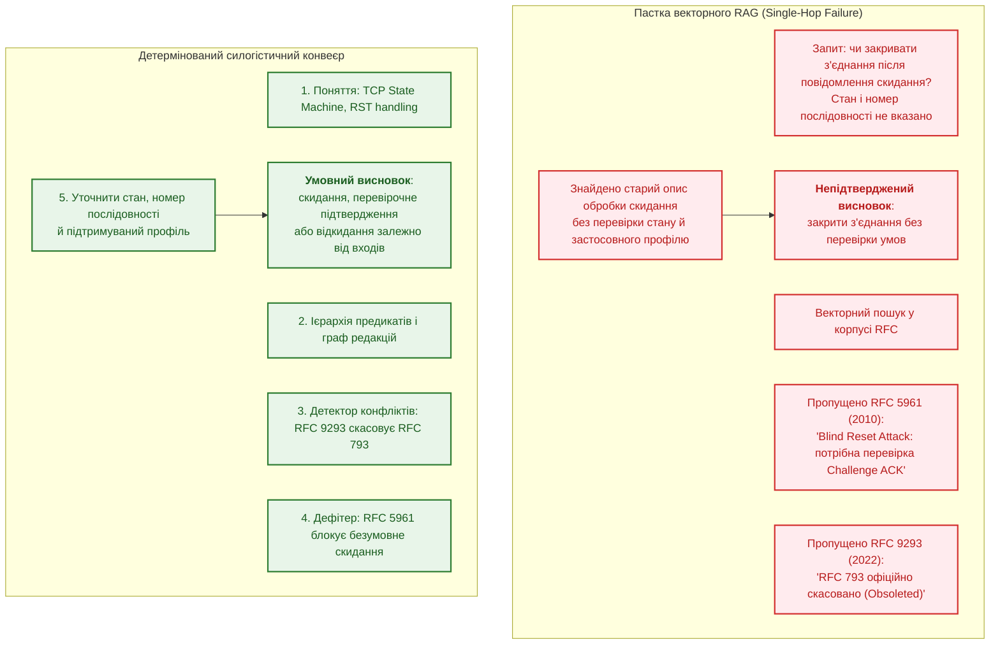
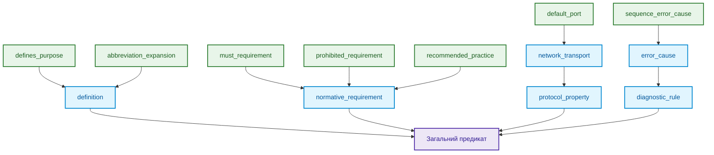
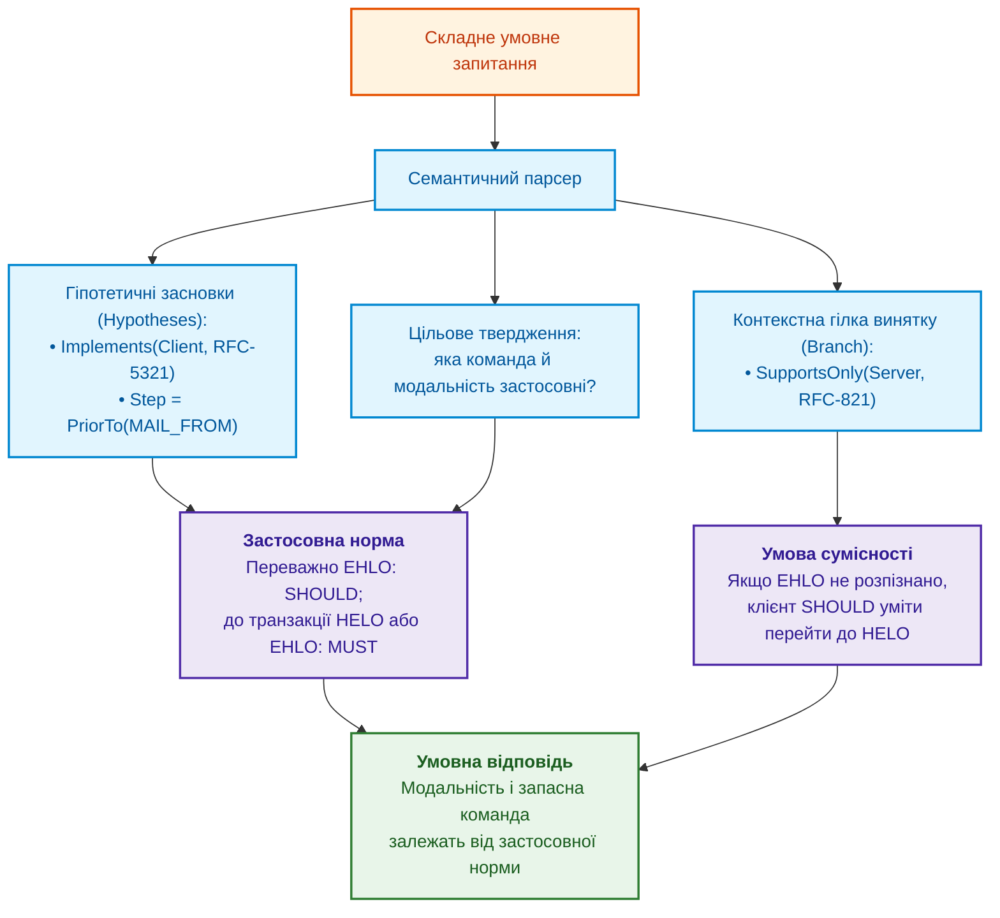

# Глава 31. Багатоходове виведення: ієрархії предикатів, винятки та чинність норм

> **Книга:** [Архітектура доказових експертних систем](README.md) · [Частина VI: Передовий край: регуляторна сертифікація та нейро-символьний ШІ](part-06-frontiers-neuro-symbolic.md)  
> **Попередня глава:** [Глава 30. Ко-інженерія функціональної безпеки та кібербезпеки](ch30-safety-cybersecurity-co-engineering.md)  
> **Наступна глава:** [Глава 32. Високопродуктивні інженерні бази знань: mmap-індексування з нульовою десеріалізацією, побайтовий нейро-символьний харвестинг та інженерія знаннєвої щільності](ch32-high-performance-knowledge-packs-mmap-and-harvesting.md)  
> **Зміст книги:** [README.md](README.md)  
> **Автор:** [Микола Федчик](about-the-author.md)  
> **Пов'язані глави книги:** [Глава 2. Філософія для інженера](ch02-epistemology-of-machine-knowledge.md) · [Глава 6. Прикладна математика експертних систем](ch06-applied-mathematics-for-expert-systems.md) · [Глава 13. Варіативність природної мови](ch13-language-variability-vs-determinism.md) · [Глава 20. Рушій пояснень](ch20-explanation-engine.md) · [Глава 27. Синтез сертифікаційних доказів за GSN](ch27-safety-case-gsn-synthesis.md) · [Глава 29. Нейро-символьна архітектура](ch29-neuro-symbolic-architecture.md)  
> **Суміжні дослідження автора:** [Військові експертні системи: БПЛА, ППО, РЕР/РЕБ](../MilTech/Military-Expert-Systems-UAS-AD-ELINT-EW-UA.md) · [Військова кібернетика](../MilTech/Ukrainian-Military-Cybernetics-UA.md)  
> **Рівень:** розробники логічних рушіїв, системні архітектори, інженери знань, фахівці з формальних методів: просунутий  
> **Очікувані результати:** відрізняти добір джерел від логічного виведення; будувати ієрархію предикатів без зворотної спеціалізації; відмовляти за невідомого стану винятку; перевіряти чинність норми в заданому контексті; читати слід виведення й розуміти межі навчального кроку на Go.

---

## Анотація

Користувач запитує, як обробити мережеве повідомлення, але не називає стан з'єднання й підтримуваний профіль протоколу. Навіть чинний знайдений документ не дає права опустити ці умови. Запитання глави: **як отримати висновок із кількох перевірених підстав і не перетворити невідомий виняток на дозвіл?**

Глава розділяє пошук джерел, ієрархію предикатів, оцінювання винятків і вибір чинної норми. Пошук може бути багатоходовим або графовим; його результат усе одно потребує перевірки. Навчальний Go-приклад реалізує лише один крок виведення, а не повний промисловий рушій. Детермінованість виконання не доводить правильності вилучених фактів, моделей понять або предметних правил.

---

## 1. Проблема однокрокової сліпоти та криза дедукції

Сучасні конвеєри семантичного пошуку спираються на оптимізацію косинусної близькості векторних ембедингів:

```math
\text{Query} \xrightarrow{\text{Embed}} \mathbf{v}_q \implies \arg\max_k \cos(\mathbf{v}_q, \mathbf{v}_k).
```

Позначення векторного пошуку:

- $\text{Query}$ є текстовим запитом інженера або оператора;
- $\text{Embed}$ позначає функцію перетворення тексту у вектор дійсних чисел;
- $\mathbf{v}_q$ є вектором запиту в латентному просторі;
- $\mathbf{v}_k$ є збереженими векторами фрагментів документів;
- $\cos(\mathbf{v}_q, \mathbf{v}_k)$ є косинусною подібністю векторів у межах від $-1$ до $1$;
- $\arg\max_k$ вибирає індекс фрагмента з найвищою геометричною близькістю.

Формула описує ранжування за векторною подібністю змісту, а не перевірку логічної чинності норми. Подібність не обмежується збігом слів, але й не є доказом застосовності.

Схема показує можливу помилку конвеєра, який не перевіряє умов застосування знайденої норми:



### 1.1. Чому статистичні моделі роблять критичні помилки?

1. **Ізоляція нормативних засновків:** Норма загального правила зафіксована в одному базовому стандарті, специфічний виняток задано в додатку до іншого, а юридична або технічна відміна правила з'являється у третьому документі через двадцять років. Жоден векторний ембединг не здатний зв'язати три документи в єдиний логічний ланцюг без явної графової моделі знань.
2. **Плутанина деонтичних модальностей:** Статистичні моделі вважають слова `MUST`, `SHOULD`, `RECOMMENDED`, `MAY` семантично подібними (оскільки вони зустрічаються в однакових контекстах), повністю ігноруючи їх суворе деонтичне значення, закріплене стандартом RFC 2119 / RFC 8174 [[1]](#src-1).
3. **Хиба замкненого світу (Closed-World Fallacy):** Якщо в локальній базі знань відсутній запис про явну заборону певної дії, наївні логічні системи автоматично роблять висновок, що дія дозволена (принцип заперечення як невдачі, *Negation as Failure* у класичному Пролозі). В інженерії безпеки це неприпустимо: відсутність даних означає стан «невідомо», що вимагає блокування операції (*Fail-Closed*).

---

## 2. Тріада мислення: Поняття, Судження, Висновок (Concept, Judgment, Inference)

Для навчальної моделі розділимо поняття, судження й крок виведення. Класичні категоричні силогізми Аристотеля є історичною опорою [[2]](#src-2), але сучасний нормативний кортеж нижче є інженерним поданням книги, не дослівною моделлю Аристотеля або Пірса.

```mermaid
flowchart LR
    accTitle: Тріада мислення: Поняття, Судження, Висновок
    accDescr: Структурний перехід від сутностей та предикатів до доведених силогізмів.

    subgraph Level1["1. Рівень Понять (Concepts)"]
        direction TB
        TERM["<b>Термін (Terminus)</b><br/>• Інтенсіонал (Ознаки)<br/>• Екстенсіонал (Обсяг)"]
        LATTICE["<b>Ієрархія предикатів</b><br/>Субсумція: Sub ⊑ Super"]
    end

    subgraph Level2["2. Рівень Суджень (Judgments)"]
        direction TB
        PROP["<b>Пропозиція (Proposition)</b><br/>Subject, Relation, Object"]
        MODAL["<b>Деонтична модальність</b><br/>MUST, SHOULD, MAY, MUST_NOT"]
        DEFEAT["<b>Дефітери (Defeaters)</b><br/>Умови винятків (UNLESS)"]
    end

    subgraph Level3["3. Рівень Висновку (Inference)"]
        direction TB
        PREM["<b>Засновки силогізму</b><br/>Major Premise + Minor Premise"]
        RULES["<b>Правила виводу</b><br/>Modus Ponens / Subsumption"]
        DAG["<b>Слід виведення</b><br/>правило · підстави · результат"]
    end

    Level1 ==> Level2 ==> Level3

    classDef c1 fill:#e1f5fe,stroke:#0288d1,stroke-width:2px,color:#01579b;
    classDef c2 fill:#fff3e0,stroke:#e65100,stroke-width:2px,color:#bf360c;
    classDef c3 fill:#e8f5e9,stroke:#2e7d32,stroke-width:2px,color:#1b5e20;

    class TERM,LATTICE c1;
    class PROP,MODAL,DEFEAT c2;
    class PREM,RULES,DAG c3;
```



### 2.1. Поняття (Concept / Terminus)

Поняття фіксує абстрактну сутність або фізичний об'єкт інженерного домену. Воно математично описується парою множин:
- **Інтенсіонал (Зміст поняття):** Множина суттєвих ознак, властивостей та інваріантів, які відрізняють це поняття від інших:

```math
\text{Intension}(C) = \{ P_1, P_2, \dots, P_k \}.
```

Складники інтенсіоналу:

- $C$ є поняттям предметної області;
- $\text{Intension}(C)$ є множиною суттєвих ознак та інваріантів поняття;
- $P_1, \dots, P_k$ є предикатами властивостей, які однозначно визначають сутність;
- $k$ є кількістю обов'язкових ознак у визначенні.

- **Екстенсіонал (Обсяг поняття):** Множина всіх конкретних сутностей або спеціалізацій, які задовольняють ознаки інтенсіоналу:

```math
\text{Extension}(C) = \{ x \mid \forall P \in \text{Intension}(C) : P(x) = \text{True} \}.
```

Символи екстенсіоналу:

- $\text{Extension}(C)$ є обсягом поняття, тобто множиною всіх конкретних об'єктів;
- $x$ позначає окрему інженерну сутність або екземпляр;
- $\forall P$ вимагає істинності кожної ознаки $P$ з інтенсіоналу для даного об'єкта;
- $\text{True}$ фіксує відповідність об'єкта правилу.

Між поняттями діє **закон зворотного відношення між змістом і обсягом**: що ширший інтенсіонал (більше обмежувальних ознак додається до визначення), то вужчим стає екстенсіонал (менша кількість об'єктів йому відповідає).

### 2.2. Судження (Judgment / Proposition)

Судження стверджує або заперечує наявність відношення між поняттями. У доказовій системі судження формалізується як розширений семантичний кортеж:

```math
\mathcal{J} = \langle \text{Subject}, \; \mathcal{R}, \; \text{Object}, \; \mathcal{M}, \; \mathcal{D}, \; \text{Provenance} \rangle.
```

Складники семантичного судження:

- $\mathcal{J}$ є формальним кортежем нормативного судження;
- $\text{Subject}$ та $\text{Object}$ є концептами в інженерному просторі;
- $\mathcal{R}$ є предикатом з ієрархії відношень;
- $`\mathcal{M} \in \{ \text{MUST}, \text{MUST-NOT}, \text{SHOULD}, \text{SHOULD-NOT}, \text{MAY} \}`$ є нормативною деонтичною модальністю;
- $`\mathcal{D} = \{ d_1, d_2, \dots \}`$ є множиною умов спростування (*Defeaters*);
- $\text{Provenance}$ є дескриптором першоджерела (ідентифікатор документа, SHA-256 та байтові зміщення).

### 2.3. Висновок (Inference / Syllogism)

Силогізм є детермінованим кроком виведення, в якому з двох засновків (великої та малої посилок), що мають спільний середній термін ($M$), з логічною необхідністю випливає третє судження (висновок):

```math
\frac{\text{Major Premise: } \forall x : M(x) \xrightarrow{\mathcal{M}} P(x), \quad \text{Minor Premise: } M(S)}{\text{Conclusion: } S \xrightarrow{\mathcal{M}} P}.
```

Складові елементи силогізму:

- $\text{Major Premise}$ є великою посилкою загального правила для всіх об'єктів класу $M$;
- $\text{Minor Premise}$ є малою посилкою факту належності конкретного суб'єкта $S$ до класу $M$;
- $M$ є середнім терміном (*terminus medius*), що пов'язує обидві посилки;
- $\text{Conclusion}$ є логічно неминучим висновком про обов'язковість властивості $P$ для суб'єкта $S$;
- $\mathcal{M}$ позначає збережену модальність нормативного припису.

**Приклад у машинному аудиті протоколів:** простий протокол передавання пошти SMTP (*Simple Mail Transfer Protocol*) розділяє клієнта й сервер. У розділі 4.1.1.1 RFC 5321 клієнт має виконати `HELO` або `EHLO` перед поштовою транзакцією [[3]](#src-3).

1. Великий засновок: для клієнта SMTP перед початком поштової транзакції потрібна команда `HELO` або `EHLO`.
2. Малий засновок: у підтвердженому або явно гіпотетичному контексті `MailClient-01` є таким клієнтом і починає транзакцію.
3. Умовний висновок: для `MailClient-01` застосовна саме ця вимога, не безумовна вимога лише `EHLO`.

Якщо роль клієнта задано тільки в запитанні «що буде, якщо», висновок також залишається гіпотетичним. Для фактичного аудиту потрібний незалежно встановлений стан. Успішне TCP-з'єднання саме по собі не гарантує прийняття поштової сесії: розділ 3.1 допускає початкову відмову 554.

---

## 3. Ієрархія предикатів і семантика субсумції

Коли користувач ставить узагальнене запитання: *«Які вимоги до безпеки протоколу X?»*, система не має права обмежуватися пошуком предикату з буквальним іменем `security_requirement`. Факти в реальних базах знань екстраговані з різних розділів і мають предикати `must_encrypt_channel`, `authenticate_peer_certificate`, `validate_sequence_number`.

Для узагальнених запитів предикати організують в ациклічну ієрархію. Досяжність у графі задає частковий порядок спеціалізації:

```math
\mathcal{L} = \langle \mathcal{R}, \sqsubseteq \rangle.
```

Позначення ієрархії:

- $\mathcal{L}$ є частково впорядкованою множиною предикатів;
- $\mathcal{R}$ є множиною всіх типів інженерних відношень;
- $\sqsubseteq$ є відношенням часткового порядку субсумції (спеціалізації);

Відношення $R_1 \sqsubseteq R_2$ означає, що предикат $R_1$ спеціалізує $R_2$. Наприклад, `must_requirement` спеціалізує `normative_requirement`. Ієрархію можна назвати решіткою лише після встановлення єдиних найменшої верхньої та найбільшої нижньої меж для кожної пари. Наведений граф і код таких операцій не визначають; для перевірки шляху вони не потрібні.



### 3.1. Математичні закони спрямованої субсумції

Частковий порядок має такі властивості:
1. **Рефлексивність:** $\forall R \in \mathcal{R} : R \sqsubseteq R$.
2. **Антисиметричність:** $\forall R_1, R_2 \in \mathcal{R} : (R_1 \sqsubseteq R_2 \land R_2 \sqsubseteq R_1) \implies R_1 = R_2$.
3. **Транзитивність:** $\forall R_1, R_2, R_3 \in \mathcal{R} : (R_1 \sqsubseteq R_2 \land R_2 \sqsubseteq R_3) \implies R_1 \sqsubseteq R_3$.

**Правило спрямованої дедукції (Query Generalization):**  
Фактичне відношення $R_{\text{fact}}$ задовольняє запит із предикатом $R_{\text{query}}$ тоді і тільки тоді, коли воно знаходиться в піддереві нащадків запитаного відношення:

```math
\text{Matches}(R_{\text{query}}, R_{\text{fact}}) \iff R_{\text{fact}} \sqsubseteq^* R_{\text{query}}.
```

У правилі спрямованої субсумції:

- $\text{Matches}$ є булевою перевіркою відповідності факту умовам запиту;
- $R_{\text{query}}$ є предикатом із запитання користувача;
- $R_{\text{fact}}$ є предикатом, зафіксованим у базі знань;
- $\sqsubseteq^*$ позначає рефлексивно-транзитивне замикання субсумції (наявність шляху узагальнення).

**Заборона зворотної спеціалізації (Strict Specialization Invariant):**  
Якщо запит оператора вимагає конкретне суворе правило $R_{\text{specific}}$ (наприклад, `prohibited_requirement`), заборонено повертати загальний факт вищого рівня $R_{\text{general}}$ (`normative_requirement`), оскільки загальна норма не гарантує виконання специфічної заборони:

```math
R_{\text{general}} \not\sqsubseteq^* R_{\text{specific}} \quad \text{коли } R_{\text{specific}} \sqsubset R_{\text{general}}.
```

Позначення заборони зворотної спеціалізації:

- $R_{\text{general}}$ є загальним предикатом вищого рівня ієрархії;
- $R_{\text{specific}}$ є строгим предикатом підпорядкованого рівня;
- $\not\sqsubseteq^*$ забороняє відповідність: наявність загального дозволу не доводить виконання спеціальної суворої норми.

### 3.2. Зіставлення фрази з предикатом

У промисловому конвеєрі запитання оператора рідко формулюються в канонічних термінах внутрішньої онтології. Інженер може запитати: *«Який дефолтний порт для BGP?»*, *«Чи скасовано протокол RFC 821?»* або *«Ким замінено цей стандарт?»*. 

Словник або мовний аналізатор спочатку зіставляє фразу з відомим предикатом. Ієрархія сама не розуміє природної мови й не створює синонімів.

1. Відоме однозначне зіставлення фіксує конкретний предикат і версію словника.
2. Для узагальненого запиту перевіряють шлях від цього предиката до потрібного предка; зворотної спеціалізації не виконують.
3. Невідома або неоднозначна фраза потребує уточнення чи перегляду кандидата на зіставлення. Вона не має визначеного предка лише тому, що в тексті є слово «застарілий».

Час і точність аналізу вимірюють на конкретних запитах. Детермінований словник також може містити помилкове зіставлення, тому відтворюваність не означає правильності.

### 3.3. Дисамбігуація полісемії за лінією чинності (Lineage-based Disambiguation)

Особливою проблемою технічних корпусів є **полісемія назв сутностей**: одна й та сама назва документа або протоколу зустрічається в десятках специфікацій різних років. Наприклад, назва *«Simple Mail Transfer Protocol»* належить одночасно RFC 821 (1982), RFC 2821 (2001) та RFC 5321 (2008).

Якщо користувач запитує документ за назвою без явного номера стандарту, наївний пошук виявить три різні факти, що призведе до конфлікту або помилкового вибору застарілої версії. 

Для усунення цієї проблеми силогістичне ядро застосовує **дисамбігуацію за графом чинності**:
1. Резолвер перевіряє редакцію, область, дату й мету запиту: поточний аудит чи історичне відтворення.
2. Єдину застосовну редакцію можна вибрати для поточного запиту, але не для запиту про стару реалізацію лише через її новішу дату.
3. Кілька застосовних редакцій або невідомий статус породжують уточнення. Лінія заміщення документа не визначає автоматично, який профіль підтримує конкретний виріб.

---

## 4. Тризначна логіка Кліні (Strong Kleene 3VL) та дефітери Джона Поллока

Два булеві значення самі по собі не задають припущення закритого світу (*Closed-World Assumption*, CWA). Це окреме рішення про те, як трактувати відсутній факт. У цій моделі відсутній результат перевірки має стан «невідомо». Для явно оголошеної повної ділянки даних можна застосувати інший режим, як пояснює [Глава 7](ch07-knowledge-base-typology.md).

Для навчальної роботи з неповною інформацією використано **сильну тризначну логіку Кліні** (*Strong Kleene 3-Valued Logic*, 3VL) [[4]](#src-4):

```math
\mathcal{V}_3 = \{ \text{True}, \; \text{False}, \; \text{Unknown} \}.
```

Значення тризначної логіки Кліні:

- $\mathcal{V}_3$ є простором істинності Strong Kleene 3VL;
- $\text{True}$ фіксує доведену істинність твердження;
- $\text{False}$ фіксує доведену хибність;
- $\text{Unknown}$ позначає відсутність даних або невизначеність без права припущення про хибність.

### 4.1. Таблиці істинності Strong Kleene 3VL

| $A$ | $B$ | $A \land B$ | $A \lor B$ | $\neg A$ | $A \to B$ |
| :---: | :---: | :---: | :---: | :---: | :---: |
| $\text{True}$ | $\text{True}$ | $\text{True}$ | $\text{True}$ | $\text{False}$ | $\text{True}$ |
| $\text{True}$ | $\text{False}$ | $\text{False}$ | $\text{True}$ | $\text{False}$ | $\text{False}$ |
| $\text{True}$ | $\text{Unknown}$ | $\mathbf{Unknown}$ | $\text{True}$ | $\text{False}$ | $\mathbf{Unknown}$ |
| $\text{False}$ | $\text{True}$ | $\text{False}$ | $\text{True}$ | $\text{True}$ | $\text{True}$ |
| $\text{False}$ | $\text{False}$ | $\text{False}$ | $\text{False}$ | $\text{True}$ | $\text{True}$ |
| $\text{False}$ | $\text{Unknown}$ | $\text{False}$ | $\mathbf{Unknown}$ | $\text{True}$ | $\text{True}$ |
| $\text{Unknown}$ | $\text{True}$ | $\mathbf{Unknown}$ | $\text{True}$ | $\mathbf{Unknown}$ | $\text{True}$ |
| $\text{Unknown}$ | $\text{False}$ | $\text{False}$ | $\mathbf{Unknown}$ | $\mathbf{Unknown}$ | $\mathbf{Unknown}$ |
| $\text{Unknown}$ | $\text{Unknown}$ | $\mathbf{Unknown}$ | $\mathbf{Unknown}$ | $\mathbf{Unknown}$ | $\mathbf{Unknown}$ |

### 4.2. Порядок інформованості та принцип Fail-Closed

У логіці Кліні вводиться частковий порядок за інформованістю ($\le_i$):

```math
\text{Unknown} \le_i \text{True}, \quad \text{Unknown} \le_i \text{False}.
```

Порядок за інформованістю:

- $\le_i$ є частковим порядком зростання знань (*information ordering*);
- нерівності стверджують, що стан $\text{Unknown}$ містить мінімальну інформацію, а перехід до $\text{True}$ чи $\text{False}$ збільшує визначеність без порушення монотонності.

Функція $f$ є монотонною за інформованістю, якщо збільшення знань (перехід від $\text{Unknown}$ до $\text{True}$ або $\text{False}$) ніколи не змінює вже відомого детермінованого результату на протилежний.

> [!CRITICAL]
> **Архітектурний закон Fail-Closed Gate:**  
> Якщо значення потрібної умови дорівнює $\text{Unknown}$, навчальна політика не допускає операції й повертає причину нестачі фактів. Це поведінка перевірки, не автоматичне сертифікаційне рішення.

### 4.3. Формалізація теорії дефітерів (John Pollock's Defeaters)

У реальних стандартах норми мають правдоподібний (defeasible) характер: вони діють доти, доки не спрацює виняткова умова. Американський філософ Джон Поллок виділив два класи спростувачів (*Defeaters*) [[5]](#src-5):

1. **Спростувач спростування (Rebutting Defeater):**  
   Атакує безпосередньо сам висновок, виводячи протилежне твердження:

```math
A \implies P, \quad B \implies \neg P.
```

Параметри прямого спростувача:

- $A$ та $B$ є засновками двох конкуруючих правил;
- $P$ є стверджуваним висновком, а $\neg P$ є його повним логічним запереченням;
- якщо правило $B$ має вищий пріоритет (новіший стандарт чи вужча норма), воно спростовує правило $A$.

2. **Підривний спростувач (Undercutting Defeater):**  
   Атакує зв'язок між засновком та висновком, стверджуючи, що за даних умов правило перестає діяти, хоча висновок не обов'язково є хибним:

```math
U \implies \neg (A \hookrightarrow P).
```

Складники підривного спростувача:

- $U$ є винятковою контекстною умовою (наприклад, стан радіомовчання);
- $A \hookrightarrow P$ позначає нормативний зв'язок між засновком і обов'язком дії;
- $\neg (A \hookrightarrow P)$ анулює зобов'язання діяти без твердження протилежного.

```mermaid
flowchart LR
    accTitle: Схема активації підривного дефітера
    accDescr: Умова винятку нейтралізує зв'язок між правилом і обов'язком дії.

    RULE["Загальне правило: MUST ping heartbeat every 10s"]
    DEF["Підривний дефітер: UNLESS radio silence is engaged"]
    ENV["Стан сенсорів: Режим маскування (Silent Mode) = ON"]

    ENV -->|"Активує умову"| DEF
    DEF -->|"Підриває зв'язок (Undercuts)"| RULE
    RULE --> RES["<b>Результат</b>: Вимога пінгу скасована, тривога не генерується"]

    classDef r fill:#e1f5fe,stroke:#0288d1,stroke-width:2px,color:#01579b;
    classDef d fill:#ffebee,stroke:#d32f2f,stroke-width:2px,color:#b71c1c;
    classDef res fill:#e8f5e9,stroke:#2e7d32,stroke-width:2px,color:#1b5e20;

    class RULE r;
    class DEF,ENV d;
    class RES res;
```



---

## 5. Дослідження міждокументних конфліктів: еволюція протоколу TCP

Протокол керування передаванням TCP (*Transmission Control Protocol*) показує, чому новіша редакція не означає загальної заборони старої дії. RFC 793 описував початкову поведінку [[6]](#src-6); RFC 5961 запропонував захист від сліпого скидання [[7]](#src-7); RFC 9293 замінив RFC 793 і в розділі 3.10.7.4 явно розділив поведінку реалізацій із підтримкою цього захисту та без нього [[8]](#src-8).

Для станів, перелічених у розділі 3.10.7.4, за підтримки захисту RFC 5961 перевірка повідомлення скидання RST (*reset*) має три випадки:

| Умова номера послідовності | Дія | Чого не можна виснувати |
|---|---|---|
| поза поточним вікном приймання | відкинути сегмент без відповіді | що будь-яке скидання заборонене |
| точно дорівнює `RCV.NXT`, наступному очікуваному номеру | виконати скидання відповідно до стану з'єднання | що завжди потрібне перевірочне підтвердження |
| у вікні, але не дорівнює `RCV.NXT` | надіслати перевірочне підтвердження (*challenge ACK*) й відкинути сегмент | що самого потрапляння у вікно досить для закриття |

Якщо стан або підтримуваний профіль невідомі, експертна система уточнює запит. Відношення заміщення документа не обчислює цих входів і не замінює читання умов чинної норми.

### 5.1. Трасування станів у Datalog-подібному представленні

Нижче лише псевдокод вибору редакції, не виконувана повна модель протоколу. Реєстр статусів документів має бути оголошений повним для запитаної області; інакше заперечення за відсутністю запису приховає невідомий статус.

```prolog
% 1. Базові факти з RFC 793
raw_rule(rfc793, on_rst_in_window, action_close, must).

% 2. Факти застарівання (Lineage)
obsoletes(rfc9293, rfc793).

% 3. Дефітер безпеки з RFC 5961
defeater(rfc5961, on_rst_in_window, seq_not_exact_match, action_challenge_ack, must_not).

% 4. Мета-правило розв'язання конфлікту застарівання
active_norm(Doc, Rule, Action, Modal) :-
    raw_rule(Doc, Rule, Action, Modal),
    not obsoleted_by_active(Doc).

obsoleted_by_active(Doc) :-
    obsoletes(NewDoc, Doc),
    document_status(NewDoc, active).
```

Для відповіді рушій спочатку обирає редакцію, потім перевіряє стан з'єднання, підтримку захисту й положення номера послідовності. Лише після цих кроків можна застосувати один із рядків таблиці. Псевдокод вище не моделює самих цих перевірок і не є доказом повноти мережевого стека.

---

## 6. Багатоходова умовна граматика запитань (Conditional Syllogistic NLQ)

Запити технічних фахівців рідко бувають простими констатаціями. Зазвичай вони формулюються як складні гіпотетичні конструкції:  
*«Якщо наш клієнт реалізує протокол SMTP за стандартом RFC 5321, чи зобов'язаний він надсилати команду EHLO перед MAIL FROM, і як він повинен діяти, якщо сервер підтримує лише застарілий RFC 821?»*

Наступна схема є проєктом умовного плану, не результатом виконання Go-програми. Розділи 3.2 і 4.1.1.1 RFC 5321 розрізняють переважне використання `EHLO` зі статусом `SHOULD` та вимогу `MUST` виконати `HELO` або `EHLO` до транзакції [[3]](#src-3). Спільне читання з розділом 4.1.4 потрібне, щоб не опустити послідовності команд і режиму сумісності.



---

## 7. Інтерактивна інспекція дерева доведень (Interactive Proof DAG)

Інспектор має показувати правило, підстави, невідомі входи й статус результату. Наступний текст є навчальним макетом, не екраном перевіреної реалізації. Байтових зміщень і хешів тут навмисно немає: їх обчислюють для конкретного файла, а не вигадують у схемі.

<details>
<summary>Навчальний макет сліду умовного виведення</summary>

```text
Мета: визначити команду початку поштової транзакції
    Підстава: RFC 5321, розділи 3.2, 4.1.1.1 і 4.1.4
    Умова: об'єкт є клієнтом SMTP
        Статус: гіпотеза користувача, не перевірений факт
    Норма: переважно EHLO (SHOULD), перед транзакцією HELO або EHLO (MUST)
    Умова сумісності: сервер не розпізнав EHLO
        Статус: невідомо, потрібна відповідь сервера
    Результат: лише умовний висновок, не фактичний дозвіл на дію
```

</details>

У реалізації кожна підстава має відкривати зафіксовану версію джерела. Відображення цитати перевіряє походження, а коректність кроку перевіряють окремо за правилом і входами. Макет не реалізує навігації, експорту чи криптографічної перевірки.

---

## 8. Навчальний крок виведення на Go

Приклад виконує один крок над явно заданим правилом і підтвердженою належністю об'єкта до класу. Він не реалізує повного багатоходового рушія, перевірки джерел або розв'язання конкуренції правил. Невідомий стан винятку дає відмову, а додавання циклу до ієрархії відхиляється. Для виконання потрібен Go 1.20 або новіший, сторонніх залежностей немає.

<details>
<summary>Приклад мовою Go: ієрархія предикатів і один крок виведення</summary>

```go
package syllogism

import (
	"errors"
	"fmt"
)

// Kleene3VL моделює тризначну логіку Кліні
type Kleene3VL int

const (
	Unknown Kleene3VL = 0
	True    Kleene3VL = 1
	False   Kleene3VL = -1
)

func (v Kleene3VL) And(other Kleene3VL) Kleene3VL {
	if v == False || other == False {
		return False
	}
	if v == True && other == True {
		return True
	}
	return Unknown
}

func (v Kleene3VL) Or(other Kleene3VL) Kleene3VL {
	if v == True || other == True {
		return True
	}
	if v == False && other == False {
		return False
	}
	return Unknown
}

func (v Kleene3VL) Not() Kleene3VL {
	return -v
}

type RelationHierarchy struct {
	parentMap map[string]string // child -> parent
}

func NewRelationHierarchy() *RelationHierarchy {
    return &RelationHierarchy{parentMap: map[string]string{
        "must_requirement": "normative_requirement",
        "prohibited_requirement": "normative_requirement",
        "normative_requirement": "concept",
        "obsoleted_by": "lineage_relation",
    }}
}

func (hierarchy *RelationHierarchy) AddRelation(child, parent string) error {
    if child == "" || parent == "" || hierarchy.Subsumes(child, parent) {
        return errors.New("invalid relation or cycle")
    }
    if previous, exists := hierarchy.parentMap[child]; exists && previous != parent {
        return errors.New("this example supports one parent per predicate")
    }
    hierarchy.parentMap[child] = parent
    return nil
}

// Subsumes перевіряє: чи є subRelation окремим випадком superRelation
func (hierarchy *RelationHierarchy) Subsumes(superRelation, subRelation string) bool {
	curr := subRelation
    seen := make(map[string]bool)
	for curr != "" {
        if seen[curr] { return false }
        seen[curr] = true
		if curr == superRelation {
			return true
		}
        curr = hierarchy.parentMap[curr]
	}
	return false
}

// Provenance описує фізичне першоджерело цитати
type Provenance struct {
	DocumentID string
	ByteStart  int
	ByteEnd    int
	SHA256     string
}

// Premise представляє засновок судження
type Premise struct {
	ID         string
	Subject    string
	Predicate  string
	Object     string
	Modality   string // MUST, MUST_NOT, SHOULD
	Provenance Provenance
}

// Defeater представляє умову скасування правила
type Defeater struct {
	ConditionPredicate string
	FallbackAction     string
	IsRebutting        bool // true = спростування, false = підрив зв'язку
}

// Rule репрезентує дедуктивну норму
type Rule struct {
	MajorPremise Premise
	Defeaters    []Defeater
}

// Engine є ядром силогістичного дедуктора
type Engine struct {
    hierarchy *RelationHierarchy
	rules   []Rule
}

func NewEngine(hierarchy *RelationHierarchy) *Engine {
    return &Engine{hierarchy: hierarchy}
}

// InferConclusion виконує крок силогістичного виведення
func (e *Engine) InferConclusion(minorSubject, minorClass, requestedRelation string, envConditions map[string]Kleene3VL) (string, error) {
    if minorSubject == "" || minorClass == "" {
        return "", errors.New("confirmed object and class are required")
    }
    var matched *Rule
	for _, rule := range e.rules {
        if rule.MajorPremise.Subject != minorClass || !e.hierarchy.Subsumes(requestedRelation, rule.MajorPremise.Predicate) {
			continue
		}
        if matched != nil {
            return "", errors.New("multiple applicable rules require conflict resolution")
		}
        candidate := rule
        matched = &candidate
	}
    if matched == nil {
        return "", errors.New("insufficient facts for inference")
    }
    for _, exception := range matched.Defeaters {
        state, exists := envConditions[exception.ConditionPredicate]
        if !exists || state == Unknown || state != True && state != False {
            return "", errors.New("exception state is unknown")
        }
        if state == True {
            return "", fmt.Errorf("rule blocked by %s; proposed action: %s", exception.ConditionPredicate, exception.FallbackAction)
        }
    }
    return fmt.Sprintf("%s %s %s; source: %s", minorSubject,
        matched.MajorPremise.Modality, matched.MajorPremise.Object,
        matched.MajorPremise.Provenance.DocumentID), nil
}
```

Збережіть модуль як `syllogism.go`, а наступний блок як `syllogism_test.go`; команда `go test syllogism.go syllogism_test.go` виконує перевірки.

```go
package syllogism

import "testing"

func TestHierarchyAndInference(t *testing.T) {
    hierarchy := NewRelationHierarchy()
    if !hierarchy.Subsumes("concept", "must_requirement") { t.Fatal("generalization failed") }
    if hierarchy.Subsumes("must_requirement", "concept") { t.Fatal("reverse specialization accepted") }
    if hierarchy.AddRelation("concept", "must_requirement") == nil { t.Fatal("cycle accepted") }
    engine := NewEngine(hierarchy)
    engine.rules = []Rule{{
        MajorPremise: Premise{Subject: "Client", Predicate: "must_requirement", Object: "authenticate", Modality: "MUST"},
        Defeaters: []Defeater{{ConditionPredicate: "exception"}},
    }}
    if _, err := engine.InferConclusion("client-1", "Client", "normative_requirement", map[string]Kleene3VL{"exception": False}); err != nil { t.Fatal(err) }
    if _, err := engine.InferConclusion("client-1", "Client", "normative_requirement", nil); err == nil { t.Fatal("missing exception treated as false") }
    if _, err := engine.InferConclusion("client-1", "Client", "normative_requirement", map[string]Kleene3VL{"exception": True}); err == nil { t.Fatal("active exception ignored") }
    if _, err := engine.InferConclusion("server-1", "Server", "normative_requirement", map[string]Kleene3VL{"exception": False}); err == nil { t.Fatal("unrelated class accepted") }
    engine.rules = append(engine.rules, engine.rules[0])
    if _, err := engine.InferConclusion("client-1", "Client", "normative_requirement", map[string]Kleene3VL{"exception": False}); err == nil { t.Fatal("competing rules ignored") }
    if Unknown.Not() != Unknown || Unknown.And(False) != False || Unknown.Or(True) != True { t.Fatal("three-valued logic failed") }
}
```

</details>

Ієрархія цього прикладу має лише одного батька на предикат і не реалізує операцій решітки. Передані клас і стани умов мають походити з перевірених фактів; рядок із запитання користувача таким фактом не стає. Тест навмисно подає відсутній стан винятку, сторонній клас, цикл і конкурентне правило. В усіх цих випадках висновок не повинен з'явитися лише через порядок перебору правил.

---

## Висновок

Ієрархія предикатів дозволяє узагальнювати запит, але не доводить повноти знань і не є автоматично решіткою. Чинна редакція норми, підтверджений клас об'єкта та відомі стани винятків є різними передумовами висновку. Мережевий приклад показав, чому дія залежить від стану й профілю, а Go-тест перевірив відмови за невідомого винятку, циклу, стороннього класу та конкурентних правил.

Навчальна реалізація виконує один крок і не перевіряє достатності джерел, повноти набору правил чи багатокрокового плану. Слід виведення має показувати ці межі, а не приховувати їх за назвою «доказ». Для промислового застосування потрібні окремі перевірки фактів, конфліктів, завершення обчислень і відтворюваності результату.

---

## Запитання для самоперевірки

1. Чому однокроковий векторний пошук (RAG) виявляється безпорадним у ситуаціях, коли нормативний стандарт $A$ офіційно скасований стандартом $B$?
2. У чому полягає суттєва відмінність між спрямованою субсумцією узагальненого запиту та забороною спеціалізації для суворого правила?
3. Як таблиця істинності тризначної логіки Кліні захищає систему від хиби замкненого світу (*Closed-World Fallacy*)?
4. Поясніть різницю між спростовуючим (*Rebutting*) та підривним (*Undercutting*) дефітерами за теорією Джона Поллока.
5. Яким чином комбінація посилок у багатоходовому силогізмі дозволяє синтезувати коректну відповідь на складнопідрядний умовний запит користувача?

---

## Словник

| Український термін | Англійський відповідник | Коротке пояснення |
|---|---|---|
| Силогізм | Syllogism | Дедуктивний умовивід, у якому з двох засновків виводиться третє судження |
| Дедукція | Deduction | Метод логічного виведення від загального правила до часткового факту |
| Ієрархія предикатів | Predicate hierarchy | Ациклічна структура спеціалізації предикатів, яка задає частковий порядок |
| Решітка | Lattice | Частково впорядкована множина з єдиною найменшою верхньою й найбільшою нижньою межею кожної пари |
| Субсумція | Subsumption | Відношення категоризації, за якого поняття або предикат включається до обсягу більш загального поняття |
| Дефітер (Спростувач) | Defeater | Умова чи свідчення, що позбавляє засновок або правило доказової сили |
| Підривний дефітер | Undercutting Defeater | Спростувач, який руйнує зв'язок між засновком і висновком правила |
| Тризначна логіка Кліні | Strong Kleene 3VL | Система логіки з трьома значеннями істинності: Істина, Хиба, Невідомо |
| Принцип замкненого світу | Closed-World Assumption | Припущення про те, що будь-яке невідоме твердження вважається хибним |
| Дерево доведення | Proof DAG | Ациклічний граф кроків дедуктивного виведення з посиланням на першоджерела |
| Деонтична модальність | Deontic Modality | Характеристика нормативності судження (обов'язково, заборонено, дозволено) |

---

## Абревіатури

| Скорочення | Розшифрування | Значення |
|---|---|---|
| 3VL | Three-Valued Logic | тризначна логіка |
| ACK | Acknowledgment | квитанція підтвердження прийому в мережевих протоколах |
| CWA | Closed-World Assumption | припущення про замкненість предметного світу |
| DAG | Directed Acyclic Graph | спрямований ациклічний граф |
| EKG | Engineering Knowledge Graph | інженерний граф знань |
| FSM | Finite State Machine | скінченний автомат станів |
| GSN | Goal Structuring Notation | нотація структурування аргументів безпеки |
| NLQ | Natural Language Query | запит природною мовою |
| RAG | Retrieval-Augmented Generation | генерація відповідей із доповненням пошуком за схожістю |
| RST | Reset | біт аварійного скидання сесії в заголовку TCP |
| TCP | Transmission Control Protocol | протокол керування передачею даних в Інтернеті |
| TUI | Terminal User Interface | текстовий термінальний інтерфейс користувача |

---

## Джерела

1. <a id="src-1"></a>Scott Bradner. [*RFC 2119: Key words for use in RFCs to Indicate Requirement Levels*](https://www.rfc-editor.org/rfc/rfc2119). IETF, 1997.
2. <a id="src-2"></a>Robin Smith. [*Aristotle's Logic*](https://plato.stanford.edu/entries/aristotle-logic/). *Stanford Encyclopedia of Philosophy*. Огляд, не текст перекладу «Першої аналітики».
3. <a id="src-3"></a>John C. Klensin. [*RFC 5321: Simple Mail Transfer Protocol*](https://www.rfc-editor.org/rfc/rfc5321). IETF, 2008.
4. <a id="src-4"></a>Stephen Kleene. [*Introduction to Metamathematics*](https://openlibrary.org/works/OL5959470W). D. Van Nostrand Co., Inc., New York, 1952.
5. <a id="src-5"></a>John L. Pollock. [*Cognitive Carpentry: A Blueprint for How to Build a Person*](https://mitpress.mit.edu/9780262661133/). MIT Press, Cambridge, MA, 1995.
6. <a id="src-6"></a>Jon Postel. [*RFC 793: Transmission Control Protocol*](https://www.rfc-editor.org/rfc/rfc793). IETF, 1981.
7. <a id="src-7"></a>Anantha Ramaiah, Randall Stewart, Michael Dalal. [*RFC 5961: Improving TCP's Robustness to Blind In-Window Attacks*](https://www.rfc-editor.org/rfc/rfc5961). IETF, 2010.
8. <a id="src-8"></a>Wesley Eddy. [*RFC 9293: Transmission Control Protocol (TCP)*](https://www.rfc-editor.org/rfc/rfc9293). IETF, 2022.

---

[← Глава 30. Ко-інженерія безпеки](ch30-safety-cybersecurity-co-engineering.md) · [Зміст книги](README.md) · [Глава 32. Високопродуктивні інженерні бази знань →](ch32-high-performance-knowledge-packs-mmap-and-harvesting.md)
