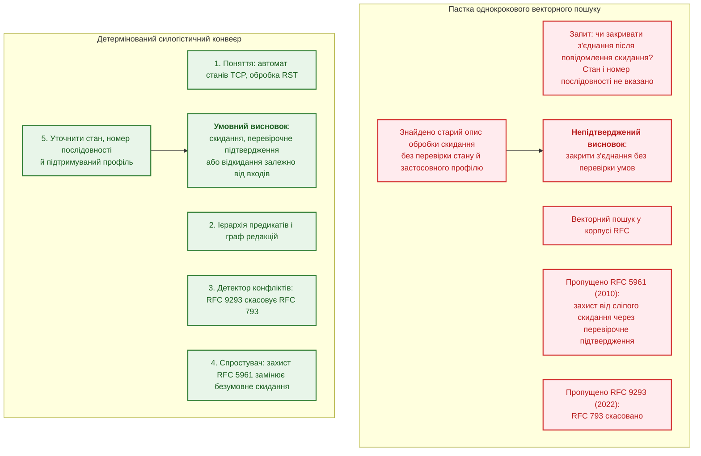
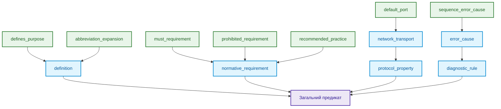
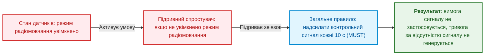
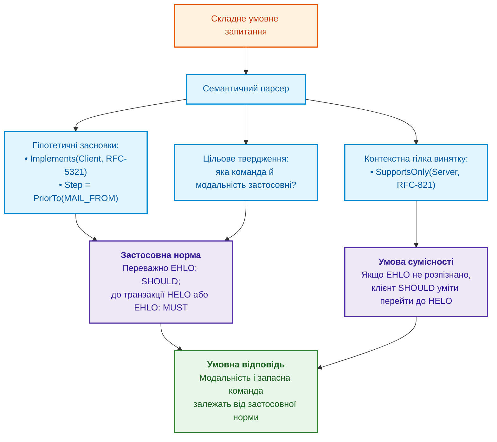

# Глава 31. Багатоходове виведення: ієрархії предикатів, винятки та чинність норм

> **Книга:** [Архітектура доказових експертних систем](README.md) · [Частина VI: Передовий край: регуляторна сертифікація та нейро-символьний ШІ](part-06-frontiers-neuro-symbolic.md)  
> **Попередня глава:** [Глава 30. Ко-інженерія функціональної безпеки та кібербезпеки](ch30-safety-cybersecurity-co-engineering.md)  
> **Наступна глава:** [Глава 32. Високопродуктивні інженерні бази знань: mmap-індексування з нульовою десеріалізацією, побайтовий допуск знань від мовних моделей та інженерія знаннєвої щільності](ch32-high-performance-knowledge-packs-mmap-and-harvesting.md)  
> **Зміст книги:** [README.md](README.md)  
> **Автор:** [Микола Федчик](about-the-author.md)  
> **Пов'язані глави книги:** [Глава 2. Філософія для інженера](ch02-epistemology-of-machine-knowledge.md) · [Глава 6. Прикладна математика експертних систем](ch06-applied-mathematics-for-expert-systems.md) · [Глава 13. Варіативність природної мови](ch13-language-variability-vs-determinism.md) · [Глава 20. Рушій пояснень](ch20-explanation-engine.md) · [Глава 27. Синтез сертифікаційних доказів за GSN](ch27-safety-case-gsn-synthesis.md) · [Глава 29. Нейро-символьна архітектура](ch29-neuro-symbolic-architecture.md)  
> **Суміжні дослідження автора:** [Військові експертні системи: БПЛА, ППО, РЕР/РЕБ](../MilTech/Military-Expert-Systems-UAS-AD-ELINT-EW-UA.md) · [Військова кібернетика](../MilTech/Ukrainian-Military-Cybernetics-UA.md)  
> **Рівень:** розробники логічних рушіїв, системні архітектори, інженери знань, фахівці з формальних методів: просунутий  
> **Очікувані результати:** відрізняти добір джерел від логічного виведення; будувати ієрархію предикатів без зворотної спеціалізації; відмовляти за невідомого стану винятку; розрізняти спростувач висновку й підривний спростувач; перевіряти чинність норми в заданому контексті програмою мовою ASP із закритою відмовою; оцінювати, що дають RDFS, SPARQL, ASPIC+ і видобування знань для ієрархій і винятків; читати слід виведення й розуміти межі навчального кроку на Go.

---

## Анотація

Користувач запитує, як обробити мережеве повідомлення, але не називає стан з'єднання й підтримуваний профіль протоколу. Навіть чинний знайдений документ не дає права опустити ці умови. Запитання глави: **як отримати висновок із кількох перевірених підстав і не перетворити невідомий виняток на дозвіл?**

Глава розділяє пошук джерел, ієрархію предикатів, оцінювання винятків і вибір чинної норми. Пошук може бути багатоходовим або графовим; його результат усе одно потребує перевірки. Навчальний Go-приклад реалізує лише один крок виведення, а не повний промисловий рушій; модель мовою ASP перевіряє вибір чинної норми для одного фрагмента TCP на дев'яти сценаріях. Детермінованість виконання не доводить правильності вилучених фактів, моделей понять або предметних правил.

---

## 1. Чому однокроковий пошук не дає нормативного висновку

Сучасні конвеєри семантичного пошуку спираються на оптимізацію косинусної близькості векторних ембедингів:

```math
\text{Query} \xrightarrow{\text{Embed}} \mathbf{v}_q \implies \arg\max_k \cos(\mathbf{v}_q, \mathbf{v}_k).
```

Позначення векторного пошуку:

- $\text{Query}$ є текстовим запитом інженера або оператора;
- $\text{Embed}$ позначає функцію перетворення тексту у вектор дійсних чисел;
- $\mathbf{v}_q$ є вектором запиту в латентному просторі;
- $\mathbf{v}_k$ є збереженими векторами фрагментів документів;
- $\cos(\mathbf{v}_q, \mathbf{v}_k)$ є косинусною подібністю векторів у межах від $-1$ до $1$;
- $\arg\max_k$ вибирає індекс фрагмента з найвищою геометричною близькістю.

Формула описує ранжування за векторною подібністю змісту, а не перевірку логічної чинності норми. Подібність не обмежується збігом слів, але й не є доказом застосовності.

Схема показує можливу помилку конвеєра, який не перевіряє умов застосування знайденої норми:



### 1.1. Де саме пошук за подібністю втрачає логіку норм

1. **Засновки розкидані між документами.** Загальне правило зафіксоване в одному стандарті, виняток у другому, а скасування старої редакції в третьому, виданому через десятиліття. Пошук за подібністю ранжує кожен фрагмент окремо. Він може повернути всі три фрагменти, але не встановлює, що третій документ скасовує перший, а другий звужує його умову. Ці зв'язки задають явні відношення між документами й нормами, які треба зберігати в графі знань.
2. **Сила припису не зберігається у векторі.** Слова `MUST`, `SHOULD`, `RECOMMENDED` і `MAY` трапляються в однакових контекстах, тому їхні вектори можуть бути близькими. Близькість векторів не гарантує збереження різниці в силі припису, яку фіксують RFC 2119 і RFC 8174 [[1]](#src-1) [[2]](#src-2). RFC 8174 додає ще одну тонкість: нормативне значення мають лише ключові слова, написані великими літерами, а модель подібності не зобов'язана зберігати різницю регістру. Тому модальність зберігають окремим полем судження, а не виводять із подібності тексту.
3. **Відсутність запису трактують як заперечення.** Якщо в базі знань немає запису про заборону дії, логічний рушій із запереченням як невдачею (*negation as failure*, як у Пролозі) виснує, що заборони немає. Це допустимо лише для ділянки даних, яку явно оголошено повною. У решті випадків відсутність даних означає стан «невідомо», і операцію блокують за принципом закритої відмови (*fail-closed*).

---

## 2. Поняття, судження й висновок

Для навчальної моделі розділимо поняття, судження й крок виведення. Класичні категоричні силогізми Аристотеля є історичною опорою [[3]](#src-3), але сучасний нормативний кортеж нижче є інженерним поданням книги, не дослівною моделлю Аристотеля або Пірса.

```mermaid
flowchart LR
    accTitle: Тріада мислення: Поняття, Судження, Висновок
    accDescr: Структурний перехід від сутностей та предикатів до доведених силогізмів.

    subgraph Level1["1. Рівень понять"]
        direction TB
        TERM["<b>Термін</b><br/>• інтенсіонал (ознаки)<br/>• екстенсіонал (обсяг)"]
        LATTICE["<b>Ієрархія предикатів</b><br/>субсумція: Sub ⊑ Super"]
    end

    subgraph Level2["2. Рівень суджень"]
        direction TB
        PROP["<b>Судження</b><br/>суб'єкт, відношення, об'єкт"]
        MODAL["<b>Деонтична модальність</b><br/>MUST, SHOULD, MAY, MUST_NOT"]
        DEFEAT["<b>Спростувачі</b><br/>умови винятків (UNLESS)"]
    end

    subgraph Level3["3. Рівень висновку"]
        direction TB
        PREM["<b>Засновки силогізму</b><br/>велика й мала посилки"]
        RULES["<b>Правила виведення</b><br/>modus ponens, субсумція"]
        DAG["<b>Слід виведення</b><br/>правило · підстави · результат"]
    end

    Level1 ==> Level2 ==> Level3

    classDef c1 fill:#e1f5fe,stroke:#0288d1,stroke-width:2px,color:#01579b;
    classDef c2 fill:#fff3e0,stroke:#e65100,stroke-width:2px,color:#bf360c;
    classDef c3 fill:#e8f5e9,stroke:#2e7d32,stroke-width:2px,color:#1b5e20;

    class TERM,LATTICE c1;
    class PROP,MODAL,DEFEAT c2;
    class PREM,RULES,DAG c3;
```



### 2.1. Поняття

Поняття фіксує абстрактну сутність або фізичний об'єкт інженерного домену. Воно математично описується парою множин:
- **Інтенсіонал (Зміст поняття):** Множина суттєвих ознак, властивостей та інваріантів, які відрізняють це поняття від інших:

```math
\text{Intension}(C) = \{ P_1, P_2, \dots, P_k \}.
```

Складники інтенсіоналу:

- $C$ є поняттям предметної області;
- $\text{Intension}(C)$ є множиною суттєвих ознак та інваріантів поняття;
- $P_1, \dots, P_k$ є предикатами властивостей, які однозначно визначають сутність;
- $k$ є кількістю обов'язкових ознак у визначенні.

- **Екстенсіонал (Обсяг поняття):** Множина всіх конкретних сутностей або спеціалізацій, які задовольняють ознаки інтенсіоналу:

```math
\text{Extension}(C) = \{ x \mid \forall P \in \text{Intension}(C) : P(x) = \text{True} \}.
```

Символи екстенсіоналу:

- $\text{Extension}(C)$ є обсягом поняття, тобто множиною всіх конкретних об'єктів;
- $x$ позначає окрему інженерну сутність або екземпляр;
- $\forall P$ вимагає істинності кожної ознаки $P$ з інтенсіоналу для даного об'єкта;
- $\text{True}$ фіксує відповідність об'єкта правилу.

Між поняттями діє **закон зворотного відношення між змістом і обсягом**: що ширший інтенсіонал (більше обмежувальних ознак додається до визначення), то вужчим стає екстенсіонал (менша кількість об'єктів йому відповідає).

### 2.2. Судження

Судження стверджує або заперечує наявність відношення між поняттями. У доказовій системі судження формалізується як розширений семантичний кортеж:

```math
\mathcal{J} = \langle \text{Subject}, \; \mathcal{R}, \; \text{Object}, \; \mathcal{M}, \; \mathcal{D}, \; \text{Provenance} \rangle.
```

Складники семантичного судження:

- $\mathcal{J}$ є формальним кортежем нормативного судження;
- $\text{Subject}$ та $\text{Object}$ є концептами в інженерному просторі;
- $\mathcal{R}$ є предикатом з ієрархії відношень;
- $`\mathcal{M} \in \{ \text{MUST}, \text{MUST-NOT}, \text{SHOULD}, \text{SHOULD-NOT}, \text{MAY} \}`$ є нормативною деонтичною модальністю;
- $`\mathcal{D} = \{ d_1, d_2, \dots \}`$ є множиною умов спростування, або спростувачів (*defeaters*);
- $\text{Provenance}$ є дескриптором першоджерела (ідентифікатор документа, SHA-256 та байтові зміщення).

### 2.3. Висновок

Силогізм є детермінованим кроком виведення, в якому з двох засновків (великої та малої посилок), що мають спільний середній термін ($M$), з логічною необхідністю випливає третє судження (висновок):

```math
\frac{\text{Major Premise: } \forall x : M(x) \xrightarrow{\mathcal{M}} P(x), \quad \text{Minor Premise: } M(S)}{\text{Conclusion: } S \xrightarrow{\mathcal{M}} P}.
```

Складові елементи силогізму:

- $\text{Major Premise}$ є великою посилкою загального правила для всіх об'єктів класу $M$;
- $\text{Minor Premise}$ є малою посилкою факту належності конкретного суб'єкта $S$ до класу $M$;
- $M$ є середнім терміном (*terminus medius*), що пов'язує обидві посилки;
- $\text{Conclusion}$ є логічно неминучим висновком про обов'язковість властивості $P$ для суб'єкта $S$;
- $\mathcal{M}$ позначає збережену модальність нормативного припису.

**Приклад у машинному аудиті протоколів:** простий протокол передавання пошти SMTP (*Simple Mail Transfer Protocol*) розділяє клієнта й сервер. У розділі 4.1.1.1 RFC 5321 клієнт має виконати `HELO` або `EHLO` перед поштовою транзакцією [[4]](#src-4).

1. Великий засновок: для клієнта SMTP перед початком поштової транзакції потрібна команда `HELO` або `EHLO`.
2. Малий засновок: у підтвердженому або явно гіпотетичному контексті `MailClient-01` є таким клієнтом і починає транзакцію.
3. Умовний висновок: для `MailClient-01` застосовна саме ця вимога, не безумовна вимога лише `EHLO`.

Якщо роль клієнта задано тільки в запитанні «що буде, якщо», висновок також залишається гіпотетичним. Для фактичного аудиту потрібний незалежно встановлений стан. Успішне TCP-з'єднання саме по собі не гарантує прийняття поштової сесії: розділ 3.1 допускає початкову відмову 554.

---

## 3. Ієрархія предикатів і семантика субсумції

Коли користувач ставить узагальнене запитання: *«Які вимоги до безпеки протоколу X?»*, система не має права обмежуватися пошуком предикату з буквальним іменем `security_requirement`. Факти в реальних базах знань екстраговані з різних розділів і мають предикати `must_encrypt_channel`, `authenticate_peer_certificate`, `validate_sequence_number`.

Для узагальнених запитів предикати організують в ациклічну ієрархію. Досяжність у графі задає частковий порядок спеціалізації:

```math
\mathcal{L} = \langle \mathcal{R}, \sqsubseteq \rangle.
```

Позначення ієрархії:

- $\mathcal{L}$ є частково впорядкованою множиною предикатів;
- $\mathcal{R}$ є множиною всіх типів інженерних відношень;
- $\sqsubseteq$ є відношенням часткового порядку субсумції (спеціалізації);

Відношення $R_1 \sqsubseteq R_2$ означає, що предикат $R_1$ спеціалізує $R_2$. Наприклад, `must_requirement` спеціалізує `normative_requirement`. Ієрархію можна назвати решіткою лише після встановлення єдиних найменшої верхньої та найбільшої нижньої меж для кожної пари. Наведений граф і код таких операцій не визначають; для перевірки шляху вони не потрібні.



### 3.1. Математичні закони спрямованої субсумції

Частковий порядок має такі властивості:
1. **Рефлексивність:** $\forall R \in \mathcal{R} : R \sqsubseteq R$.
2. **Антисиметричність:** $\forall R_1, R_2 \in \mathcal{R} : (R_1 \sqsubseteq R_2 \land R_2 \sqsubseteq R_1) \implies R_1 = R_2$.
3. **Транзитивність:** $\forall R_1, R_2, R_3 \in \mathcal{R} : (R_1 \sqsubseteq R_2 \land R_2 \sqsubseteq R_3) \implies R_1 \sqsubseteq R_3$.

**Правило узагальнення запиту.**  
Фактичне відношення $R_{\text{fact}}$ задовольняє запит із предикатом $R_{\text{query}}$ тоді і тільки тоді, коли воно знаходиться в піддереві нащадків запитаного відношення:

```math
\text{Matches}(R_{\text{query}}, R_{\text{fact}}) \iff R_{\text{fact}} \sqsubseteq^* R_{\text{query}}.
```

У правилі спрямованої субсумції:

- $\text{Matches}$ є булевою перевіркою відповідності факту умовам запиту;
- $R_{\text{query}}$ є предикатом із запитання користувача;
- $R_{\text{fact}}$ є предикатом, зафіксованим у базі знань;
- $\sqsubseteq^*$ позначає рефлексивно-транзитивне замикання субсумції (наявність шляху узагальнення).

**Заборона зворотної спеціалізації.**  
Якщо запит оператора вимагає конкретне суворе правило $R_{\text{specific}}$ (наприклад, `prohibited_requirement`), заборонено повертати загальний факт вищого рівня $R_{\text{general}}$ (`normative_requirement`), оскільки загальна норма не гарантує виконання специфічної заборони:

```math
R_{\text{general}} \not\sqsubseteq^* R_{\text{specific}} \quad \text{коли } R_{\text{specific}} \sqsubset R_{\text{general}}.
```

Позначення заборони зворотної спеціалізації:

- $R_{\text{general}}$ є загальним предикатом вищого рівня ієрархії;
- $R_{\text{specific}}$ є строгим предикатом підпорядкованого рівня;
- $\not\sqsubseteq^*$ забороняє відповідність: наявність загального дозволу не доводить виконання спеціальної суворої норми.

### 3.2. Зіставлення фрази з предикатом

У промисловому конвеєрі запитання оператора рідко формулюються в канонічних термінах внутрішньої онтології. Інженер може запитати: *«Який дефолтний порт для BGP?»*, *«Чи скасовано протокол RFC 821?»* або *«Ким замінено цей стандарт?»*. 

Словник або мовний аналізатор спочатку зіставляє фразу з відомим предикатом. Ієрархія сама не розуміє природної мови й не створює синонімів.

1. Відоме однозначне зіставлення фіксує конкретний предикат і версію словника.
2. Для узагальненого запиту перевіряють шлях від цього предиката до потрібного предка; зворотної спеціалізації не виконують.
3. Невідома або неоднозначна фраза потребує уточнення чи перегляду кандидата на зіставлення. Вона не має визначеного предка лише тому, що в тексті є слово «застарілий».

Час і точність аналізу вимірюють на конкретних запитах. Детермінований словник також може містити помилкове зіставлення, тому відтворюваність не означає правильності.

### 3.3. Розрізнення однойменних документів за лінією чинності

Особливою проблемою технічних корпусів є **полісемія назв сутностей**: одна й та сама назва документа або протоколу зустрічається в десятках специфікацій різних років. Наприклад, назва *«Simple Mail Transfer Protocol»* належить одночасно RFC 821 (1982), RFC 2821 (2001) та RFC 5321 (2008).

Якщо користувач запитує документ за назвою без явного номера стандарту, наївний пошук виявить три різні факти, що призведе до конфлікту або помилкового вибору застарілої версії. 

Для усунення цієї проблеми силогістичне ядро застосовує **дисамбігуацію за графом чинності**:
1. Резолвер перевіряє редакцію, область, дату й мету запиту: поточний аудит чи історичне відтворення.
2. Єдину застосовну редакцію можна вибрати для поточного запиту, але не для запиту про стару реалізацію лише через її новішу дату.
3. Кілька застосовних редакцій або невідомий статус породжують уточнення. Лінія заміщення документа не визначає автоматично, який профіль підтримує конкретний виріб.

---

## 4. Тризначна логіка Кліні та спростувачі Поллока

Два булеві значення самі по собі не задають припущення закритого світу (*Closed-World Assumption*, CWA). Це окреме рішення про те, як трактувати відсутній факт. У цій моделі відсутній результат перевірки має стан «невідомо». Для явно оголошеної повної ділянки даних можна застосувати інший режим, як пояснює [Глава 7](ch07-knowledge-base-typology.md).

Для навчальної роботи з неповною інформацією використано **сильну тризначну логіку Кліні** (*Strong Kleene 3-Valued Logic*, 3VL) [[5]](#src-5):

```math
\mathcal{V}_3 = \{ \text{True}, \; \text{False}, \; \text{Unknown} \}.
```

Значення тризначної логіки Кліні:

- $\mathcal{V}_3$ є простором істинності Strong Kleene 3VL;
- $\text{True}$ фіксує доведену істинність твердження;
- $\text{False}$ фіксує доведену хибність;
- $\text{Unknown}$ позначає відсутність даних або невизначеність без права припущення про хибність.

### 4.1. Таблиця істинності сильної логіки Кліні

| $A$ | $B$ | $A \land B$ | $A \lor B$ | $\neg A$ | $A \to B$ |
| :---: | :---: | :---: | :---: | :---: | :---: |
| $\text{True}$ | $\text{True}$ | $\text{True}$ | $\text{True}$ | $\text{False}$ | $\text{True}$ |
| $\text{True}$ | $\text{False}$ | $\text{False}$ | $\text{True}$ | $\text{False}$ | $\text{False}$ |
| $\text{True}$ | $\text{Unknown}$ | $\mathbf{Unknown}$ | $\text{True}$ | $\text{False}$ | $\mathbf{Unknown}$ |
| $\text{False}$ | $\text{True}$ | $\text{False}$ | $\text{True}$ | $\text{True}$ | $\text{True}$ |
| $\text{False}$ | $\text{False}$ | $\text{False}$ | $\text{False}$ | $\text{True}$ | $\text{True}$ |
| $\text{False}$ | $\text{Unknown}$ | $\text{False}$ | $\mathbf{Unknown}$ | $\text{True}$ | $\text{True}$ |
| $\text{Unknown}$ | $\text{True}$ | $\mathbf{Unknown}$ | $\text{True}$ | $\mathbf{Unknown}$ | $\text{True}$ |
| $\text{Unknown}$ | $\text{False}$ | $\text{False}$ | $\mathbf{Unknown}$ | $\mathbf{Unknown}$ | $\mathbf{Unknown}$ |
| $\text{Unknown}$ | $\text{Unknown}$ | $\mathbf{Unknown}$ | $\mathbf{Unknown}$ | $\mathbf{Unknown}$ | $\mathbf{Unknown}$ |

### 4.2. Порядок інформованості й закрита відмова

У логіці Кліні вводиться частковий порядок за інформованістю ($\le_i$):

```math
\text{Unknown} \le_i \text{True}, \quad \text{Unknown} \le_i \text{False}.
```

Порядок за інформованістю:

- $\le_i$ є частковим порядком зростання знань (*information ordering*);
- нерівності стверджують, що стан $\text{Unknown}$ містить мінімальну інформацію, а перехід до $\text{True}$ чи $\text{False}$ збільшує визначеність без порушення монотонності.

Функція $f$ є монотонною за інформованістю, якщо збільшення знань (перехід від $\text{Unknown}$ до $\text{True}$ або $\text{False}$) ніколи не змінює вже відомого детермінованого результату на протилежний.

> [!IMPORTANT]
> **Правило закритої відмови.**  
> Якщо значення потрібної умови дорівнює $\text{Unknown}$, навчальна політика не допускає операції й повертає причину нестачі фактів. Це поведінка перевірки, не автоматичне сертифікаційне рішення.

### 4.3. Спростувачі за Поллоком

У реальних стандартах норми мають спростовний (*defeasible*) характер: вони діють доти, доки не спрацює виняткова умова. Американський філософ Джон Поллок виділив два класи спростувачів (*defeaters*) [[6]](#src-6):

1. **Спростувач висновку (*rebutting defeater*)**  
   Атакує безпосередньо сам висновок, виводячи протилежне твердження:

```math
A \implies P, \quad B \implies \neg P.
```

Параметри прямого спростувача:

- $A$ та $B$ є засновками двох конкуруючих правил;
- $P$ є стверджуваним висновком, а $\neg P$ є його повним логічним запереченням;
- сам спростувач висновку лише створює конфлікт двох аргументів; який із них перемагає, вирішує окреме відношення переваги, наприклад «вужча норма переважає загальну».

2. **Підривний спростувач (*undercutting defeater*)**  
   Атакує зв'язок між засновком та висновком, стверджуючи, що за даних умов правило перестає діяти, хоча висновок не обов'язково є хибним:

```math
U \implies \neg (A \hookrightarrow P).
```

Складники підривного спростувача:

- $U$ є винятковою контекстною умовою (наприклад, стан радіомовчання);
- $A \hookrightarrow P$ позначає нормативний зв'язок між засновком і обов'язком дії;
- $\neg (A \hookrightarrow P)$ анулює зобов'язання діяти без твердження протилежного.



Різниця між двома класами має інженерний наслідок. Підривний спростувач залишає експертну систему без висновку: правило не застосовне, і відповідь має назвати вимкнене правило й умову винятку, не пропонуючи заміни. Спростувач висновку дає інший висновок, і тоді питання стоїть лише про перевагу між двома аргументами. Модгіл і Праккен у структурованій аргументації ASPIC+ формалізували обидва види атак разом із третім, підривом засновку (*undermining*) [[7]](#src-7). У цій моделі підривна атака на застосування правила успішна незалежно від переваги, а атаки на висновок і засновок залежать від порядку переваги між аргументами. Навчальна програма в розділі 8 відтворює саме цю різницю: підривний спростувач повертає відмову без пропозиції дії, а спростувач висновку повертає інший висновок разом із власним джерелом. Перевагу там задає автор бази знань, коли прикріплює спростувач до правила; два незалежні правила з протилежними висновками без такої переваги дають відмову.

---

## 5. Дослідження міждокументних конфліктів: еволюція протоколу TCP

Протокол керування передаванням TCP (*Transmission Control Protocol*) показує, чому новіша редакція не означає загальної заборони старої дії. RFC 793 описував початкову поведінку [[8]](#src-8); RFC 5961 запропонував захист від сліпого скидання [[9]](#src-9); RFC 9293 замінив RFC 793 і в розділі 3.10.7.4 явно розділив поведінку реалізацій із підтримкою цього захисту та без нього [[10]](#src-10).

Для станів, перелічених у розділі 3.10.7.4, за підтримки захисту RFC 5961 перевірка повідомлення скидання RST (*reset*) має три випадки:

| Умова номера послідовності | Дія | Чого не можна виснувати |
|---|---|---|
| поза поточним вікном приймання | відкинути сегмент без відповіді | що будь-яке скидання заборонене |
| точно дорівнює `RCV.NXT`, наступному очікуваному номеру | виконати скидання відповідно до стану з'єднання | що завжди потрібне перевірочне підтвердження |
| у вікні, але не дорівнює `RCV.NXT` | надіслати перевірочне підтвердження (*challenge ACK*) й відкинути сегмент | що самого потрапляння у вікно досить для закриття |

Без підтримки захисту RFC 9293 зберігає поведінку RFC 793: за розділом 3.5.3 скидання чинне, якщо його номер послідовності потрапляє у вікно, а сегмент поза вікном відкидається.

Якщо стан або підтримуваний профіль невідомі, експертна система уточнює запит. Відношення заміщення документа не обчислює цих входів і не замінює читання умов чинної норми.

### 5.1. Виконувана модель вибору норми мовою ASP

Таблицю вище можна закодувати як програму в стійких моделях (*answer set programming*, ASP) і виконати розв'язувачем clingo, який розробили Гебзер, Камінські, Кауфман і Шауб [[11]](#src-11). ASP підходить для цієї задачі з двох причин. Перша причина: мова має заперечення як невдачу, тож правило «документ чинний, якщо його не заміщено» записується одним рядком. Друга причина: для стратифікованої програми, тобто програми без циклів через заперечення, розв'язувач повертає рівно одну стійку модель, і висновок не залежить від порядку правил. Заперечення як невдача водночас є головним ризиком: відсутній запис про заміщення робить стару редакцію чинною. Тому програма містить правила закритої відмови для шести випадків: бракує вхідного факту; стан з'єднання поза моделлю; норма посилається на документ поза реєстром; повноту реєстру для цієї області не підтверджено; дві чинні редакції дають різні дії; жодна чинна норма не застосовна.

<details>
<summary>Модель вибору норми мовою ASP (файл norms.lp)</summary>

```prolog
% Реєстр документів і лінія заміщення за даними RFC Editor.
document(rfc793). document(rfc9293).
obsoletes(rfc9293, rfc793).
% Реєстр звірено з індексом RFC Editor для області «обробка RST у TCP».
complete(tcp_rst).

% norm(Документ, Захист RFC 5961, Положення номера послідовності, Дія).
% RFC 9293, розділ 3.10.7.4: з підтримкою захисту діють три перевірки.
norm(rfc9293, yes, out_of_window, drop).
norm(rfc9293, yes, exact, reset).
norm(rfc9293, yes, in_window_not_exact, challenge_ack).
% Без захисту скидання чинне, якщо номер потрапляє у вікно (розділ 3.5.3).
norm(rfc9293, no, out_of_window, drop).
norm(rfc9293, no, exact, reset).
norm(rfc9293, no, in_window_not_exact, reset).
% RFC 793 не знав про захист RFC 5961 і скидав з'єднання за будь-якого номера у вікні.
norm(rfc793, P, out_of_window, drop) :- protection(P).
norm(rfc793, P, exact, reset) :- protection(P).
norm(rfc793, P, in_window_not_exact, reset) :- protection(P).
protection(yes; no).

% Модель охоплює лише синхронізовані стани, де скидання переводить з'єднання в CLOSED.
synchronized(established; fin_wait_1; fin_wait_2; close_wait; closing; last_ack; time_wait).

% Чинна редакція: документ із реєстру, який не заміщено.
superseded(D) :- obsoletes(_, D).
active(D) :- document(D), not superseded(D).

% Закрита відмова: кожна причина блокує відповідь і пояснює, чого бракує.
required(state; protection; seq).
known(K) :- input(K, _).
clarify(missing(K)) :- required(K), not known(K).
clarify(out_of_model(S)) :- input(state, S), not synchronized(S).
clarify(unregistered_source(D)) :- norm(D, _, _, _), not document(D).
clarify(registry_incomplete) :- not complete(tcp_rst).

candidate(D, A) :- active(D), input(protection, P), input(seq, Q), norm(D, P, Q, A).
clarify(conflict(A1, A2)) :- candidate(_, A1), candidate(_, A2), A1 < A2.
has_candidate :- candidate(_, _).
clarify(no_applicable_norm) :- known(protection), known(seq), not has_candidate.

blocked :- clarify(_).
answer(A, D) :- candidate(D, A), not blocked.

#show answer/2.
#show clarify/1.
```

</details>

Програма мовою Python додає до моделі вхідні факти дев'яти сценаріїв, а в трьох сценаріях видаляє один факт реєстру, щоб відтворити помилку самої бази знань. Для запуску потрібен пакет clingo (`pip install clingo`), приклад перевірено з Python 3.14 і clingo 5.8.2. Обидва файли кладуть в один каталог і запускають командою `python check_norms.py`.

<details>
<summary>Приклад мовою Python: сценарії перевірки моделі (файл check_norms.py)</summary>

```python
"""Запускає модель вибору норми norms.lp на сценаріях і перевіряє очікувані відповіді."""
from pathlib import Path

import clingo

PROGRAM = Path(__file__).with_name("norms.lp").read_text(encoding="utf-8")


def solve(facts, drop=()):
    program = PROGRAM
    for fact in drop:
        assert fact in program, fact
        program = program.replace(fact, "", 1)  # видаляє лише факт, а не згадку в правилі
    ctl = clingo.Control(["--warn=none"])
    ctl.add("base", [], program + "\n" + facts)
    ctl.ground([("base", [])])
    models = []
    ctl.solve(on_model=lambda m: models.append(sorted(str(s) for s in m.symbols(shown=True))))
    assert len(models) == 1, models  # стратифікована програма має одну стійку модель
    return models[0]


SYNC = "input(state, established). "
SCENARIOS = [
    ("захист є, номер у вікні, але не точний", SYNC + "input(protection, yes). input(seq, in_window_not_exact).",
     (), ["answer(challenge_ack,rfc9293)"]),
    ("захист є, номер точний", SYNC + "input(protection, yes). input(seq, exact).",
     (), ["answer(reset,rfc9293)"]),
    ("захисту немає, номер у вікні", SYNC + "input(protection, no). input(seq, in_window_not_exact).",
     (), ["answer(reset,rfc9293)"]),
    ("номер поза вікном", SYNC + "input(protection, yes). input(seq, out_of_window).",
     (), ["answer(drop,rfc9293)"]),
    ("підтримка захисту невідома", SYNC + "input(seq, in_window_not_exact).",
     (), ["clarify(missing(protection))"]),
    ("стан LISTEN поза моделлю", "input(state, listen). input(protection, yes). input(seq, exact).",
     (), ["clarify(out_of_model(listen))"]),
    ("бракує факту заміщення", SYNC + "input(protection, yes). input(seq, in_window_not_exact).",
     ("obsoletes(rfc9293, rfc793).",), ["clarify(conflict(challenge_ack,reset))"]),
    ("RFC 9293 немає в реєстрі", SYNC + "input(protection, yes). input(seq, in_window_not_exact).",
     ("document(rfc9293).",), ["clarify(no_applicable_norm)", "clarify(unregistered_source(rfc9293))"]),
    ("повноту реєстру не підтверджено", SYNC + "input(protection, yes). input(seq, exact).",
     ("complete(tcp_rst).",), ["clarify(registry_incomplete)"]),
]

for name, facts, drop, expected in SCENARIOS:
    got = solve(facts, drop)
    assert got == expected, (name, got, expected)
    print(f"{name:<40} -> {', '.join(got)}")
print("усі сценарії збігаються з очікуваними")
```

</details>

Запуск `python check_norms.py` дає:

<details>
<summary>Вивід програми</summary>

```text
захист є, номер у вікні, але не точний   -> answer(challenge_ack,rfc9293)
захист є, номер точний                   -> answer(reset,rfc9293)
захисту немає, номер у вікні             -> answer(reset,rfc9293)
номер поза вікном                        -> answer(drop,rfc9293)
підтримка захисту невідома               -> clarify(missing(protection))
стан LISTEN поза моделлю                 -> clarify(out_of_model(listen))
бракує факту заміщення                   -> clarify(conflict(challenge_ack,reset))
RFC 9293 немає в реєстрі                 -> clarify(no_applicable_norm), clarify(unregistered_source(rfc9293))
повноту реєстру не підтверджено          -> clarify(registry_incomplete)
усі сценарії збігаються з очікуваними
```

</details>

Перші чотири сценарії відтворюють таблицю RFC 9293: за підтримки захисту номер у вікні, але не точний, дає перевірочне підтвердження, а без захисту той самий номер дає скидання. П'ятий і шостий сценарії показують закриту відмову за неповних входів: програма не припускає, що захист підтримано, і не застосовує норм синхронізованих станів до стану LISTEN. Останні три сценарії моделюють помилки самої бази знань. Без факту заміщення обидві редакції стають чинними, і програма повідомляє про конфлікт дій замість того, щоб мовчки обрати одну з них. Якщо RFC 9293 немає в реєстрі, його норми не можуть дати відповіді, а RFC 793 заміщений, тому програма називає обидві причини відмови. Якщо повноту реєстру не оголошено, програма відмовляє навіть за коректних входів: без такого оголошення відсутність запису не можна відрізнити від невідомого статусу.

Межі моделі такі: вона охоплює лише обробку біта RST у синхронізованих станах, отримує положення номера послідовності як готовий вхідний факт, а не обчислює його за значеннями `RCV.NXT` і `RCV.WND`, і не замінює тестування мережевого стека. Реєстр документів у практиці заповнюють із машинно читаного індексу, а не вручну, і факт `complete(tcp_rst)` ставлять лише після звірки з датою та версією цього індексу.

Якщо реєстр документів розбито на шарди, оголошення повноти `complete(tcp_rst)` стосується об'єднання шардів, а не тих, що відповіли. Редакції RFC 793, 5961 і 9293 утворюють одну родину документів і мають лежати в одному шарді, бо чинність норми визначає ланцюжок заміщень. Якщо цей шард мовчить, програма відмовляє з причиною `registry_incomplete`, а не застосовує норми з шардів, що відповіли: відсутня редакція зі скасуванням зробила би стару норму чинною. Правила розбиття наведено в [Главі 7](ch07-knowledge-base-typology.md), реалізацію в розділі 10 [Глави 32](ch32-high-performance-knowledge-packs-mmap-and-harvesting.md).

---

## 6. Умовні запитання з кількома кроками

Запити технічних фахівців рідко бувають простими констатаціями. Зазвичай вони формулюються як складні гіпотетичні конструкції:  
*«Якщо наш клієнт реалізує протокол SMTP за стандартом RFC 5321, чи зобов'язаний він надсилати команду EHLO перед MAIL FROM, і як він повинен діяти, якщо сервер підтримує лише застарілий RFC 821?»*

Наступна схема є проєктом умовного плану, не результатом виконання Go-програми. Розділи 3.2 і 4.1.1.1 RFC 5321 розрізняють переважне використання `EHLO` зі статусом `SHOULD` та вимогу `MUST` виконати `HELO` або `EHLO` до транзакції [[4]](#src-4). Спільне читання з розділом 4.1.4 потрібне, щоб не опустити послідовності команд і режиму сумісності.



---

## 7. Перегляд сліду виведення

Інспектор має показувати правило, підстави, невідомі входи й статус результату. Наступний текст є навчальним макетом, не екраном перевіреної реалізації. Байтових зміщень і хешів тут навмисно немає: їх обчислюють для конкретного файла, а не вигадують у схемі.

<details>
<summary>Навчальний макет сліду умовного виведення</summary>

```text
Мета: визначити команду початку поштової транзакції
    Підстава: RFC 5321, розділи 3.2, 4.1.1.1 і 4.1.4
    Умова: об'єкт є клієнтом SMTP
        Статус: гіпотеза користувача, не перевірений факт
    Норма: переважно EHLO (SHOULD), перед транзакцією HELO або EHLO (MUST)
    Умова сумісності: сервер не розпізнав EHLO
        Статус: невідомо, потрібна відповідь сервера
    Результат: лише умовний висновок, не фактичний дозвіл на дію
```

</details>

У реалізації кожна підстава має відкривати зафіксовану версію джерела. Відображення цитати перевіряє походження, а коректність кроку перевіряють окремо за правилом і входами. Макет не реалізує навігації, експорту чи криптографічної перевірки.

---

## 8. Навчальний крок виведення на Go

Приклад виконує один крок над явно заданим правилом і підтвердженою належністю об'єкта до класу. Він не реалізує повного багатоходового рушія, перевірки джерел або розв'язання конкуренції правил. Невідомий стан винятку дає відмову, додавання циклу до ієрархії відхиляється, а два класи спростувачів дають різний результат: спростувач висновку повертає інший висновок із власним джерелом, а підривний спростувач лише блокує правило. Для виконання потрібен Go 1.20 або новіший, сторонніх залежностей немає.

<details>
<summary>Приклад мовою Go: ієрархія предикатів і один крок виведення</summary>

```go
package syllogism

import (
	"errors"
	"fmt"
)

// Kleene3VL моделює тризначну логіку Кліні
type Kleene3VL int

const (
	Unknown Kleene3VL = 0
	True    Kleene3VL = 1
	False   Kleene3VL = -1
)

func (v Kleene3VL) And(other Kleene3VL) Kleene3VL {
	if v == False || other == False {
		return False
	}
	if v == True && other == True {
		return True
	}
	return Unknown
}

func (v Kleene3VL) Or(other Kleene3VL) Kleene3VL {
	if v == True || other == True {
		return True
	}
	if v == False && other == False {
		return False
	}
	return Unknown
}

func (v Kleene3VL) Not() Kleene3VL {
	return -v
}

type RelationHierarchy struct {
	parentMap map[string]string // child -> parent
}

func NewRelationHierarchy() *RelationHierarchy {
	return &RelationHierarchy{parentMap: map[string]string{
		"must_requirement":       "normative_requirement",
		"prohibited_requirement": "normative_requirement",
		"normative_requirement":  "concept",
		"obsoleted_by":           "lineage_relation",
	}}
}

func (hierarchy *RelationHierarchy) AddRelation(child, parent string) error {
	if child == "" || parent == "" || hierarchy.Subsumes(child, parent) {
		return errors.New("invalid relation or cycle")
	}
	if previous, exists := hierarchy.parentMap[child]; exists && previous != parent {
		return errors.New("this example supports one parent per predicate")
	}
	hierarchy.parentMap[child] = parent
	return nil
}

// Subsumes перевіряє: чи є subRelation окремим випадком superRelation
func (hierarchy *RelationHierarchy) Subsumes(superRelation, subRelation string) bool {
	seen := make(map[string]bool)
	for curr := subRelation; curr != ""; curr = hierarchy.parentMap[curr] {
		if seen[curr] {
			return false
		}
		seen[curr] = true
		if curr == superRelation {
			return true
		}
	}
	return false
}

// Provenance описує фізичне першоджерело цитати
type Provenance struct {
	DocumentID string
	ByteStart  int
	ByteEnd    int
	SHA256     string
}

// Premise представляє засновок судження
type Premise struct {
	ID         string
	Subject    string
	Predicate  string
	Object     string
	Modality   string // MUST, MUST_NOT, SHOULD
	Provenance Provenance
}

// Defeater описує виняток, прикріплений автором бази знань до правила.
// Підривний спростувач (IsRebutting == false) лише скасовує застосовність правила.
// Спростувач висновку (IsRebutting == true) дає інший висновок FallbackAction
// з власного джерела Source; прикріплення до правила кодує його перевагу.
type Defeater struct {
	ConditionPredicate string
	FallbackAction     string
	IsRebutting        bool
	Source             string
}

// Rule репрезентує дедуктивну норму
type Rule struct {
	MajorPremise Premise
	Defeaters    []Defeater
}

// Engine є ядром силогістичного дедуктора
type Engine struct {
	hierarchy *RelationHierarchy
	rules     []Rule
}

func NewEngine(hierarchy *RelationHierarchy) *Engine {
	return &Engine{hierarchy: hierarchy}
}

// InferConclusion виконує крок силогістичного виведення
func (e *Engine) InferConclusion(minorSubject, minorClass, requestedRelation string, envConditions map[string]Kleene3VL) (string, error) {
	if minorSubject == "" || minorClass == "" {
		return "", errors.New("confirmed object and class are required")
	}
	var matched *Rule
	for _, rule := range e.rules {
		if rule.MajorPremise.Subject != minorClass || !e.hierarchy.Subsumes(requestedRelation, rule.MajorPremise.Predicate) {
			continue
		}
		if matched != nil {
			return "", errors.New("multiple applicable rules require conflict resolution")
		}
		candidate := rule
		matched = &candidate
	}
	if matched == nil {
		return "", errors.New("insufficient facts for inference")
	}
	// Спершу всі умови винятків мають бути відомі: висновок не залежить від порядку перевірки.
	var active []Defeater
	for _, exception := range matched.Defeaters {
		state, exists := envConditions[exception.ConditionPredicate]
		if !exists || (state != True && state != False) {
			return "", fmt.Errorf("exception state is unknown: %s", exception.ConditionPredicate)
		}
		if state == True {
			active = append(active, exception)
		}
	}
	premise := matched.MajorPremise
	switch {
	case len(active) > 1:
		return "", errors.New("several active defeaters require conflict resolution")
	case len(active) == 1 && !active[0].IsRebutting:
		return "", fmt.Errorf("rule from %s is not applicable while %s holds", premise.Provenance.DocumentID, active[0].ConditionPredicate)
	case len(active) == 1:
		return fmt.Sprintf("%s %s; source: %s; defeats rule from %s", minorSubject,
			active[0].FallbackAction, active[0].Source, premise.Provenance.DocumentID), nil
	}
	return fmt.Sprintf("%s %s %s; source: %s", minorSubject,
		premise.Modality, premise.Object, premise.Provenance.DocumentID), nil
}
```

Збережіть модуль як `syllogism.go`, а наступний блок як `syllogism_test.go`; команда `go test syllogism.go syllogism_test.go` виконує перевірки.

```go
package syllogism

import (
	"strings"
	"testing"
)

func TestHierarchyAndInference(t *testing.T) {
	hierarchy := NewRelationHierarchy()
	if !hierarchy.Subsumes("concept", "must_requirement") {
		t.Fatal("generalization failed")
	}
	if hierarchy.Subsumes("must_requirement", "concept") {
		t.Fatal("reverse specialization accepted")
	}
	if hierarchy.AddRelation("concept", "must_requirement") == nil {
		t.Fatal("cycle accepted")
	}
	engine := NewEngine(hierarchy)
	engine.rules = []Rule{{
		MajorPremise: Premise{Subject: "Client", Predicate: "must_requirement", Object: "authenticate", Modality: "MUST"},
		Defeaters:    []Defeater{{ConditionPredicate: "exception"}},
	}}
	if _, err := engine.InferConclusion("client-1", "Client", "normative_requirement", map[string]Kleene3VL{"exception": False}); err != nil {
		t.Fatal(err)
	}
	if _, err := engine.InferConclusion("client-1", "Client", "normative_requirement", nil); err == nil {
		t.Fatal("missing exception treated as false")
	}
	if _, err := engine.InferConclusion("client-1", "Client", "normative_requirement", map[string]Kleene3VL{"exception": True}); err == nil {
		t.Fatal("active exception ignored")
	}
	if _, err := engine.InferConclusion("server-1", "Server", "normative_requirement", map[string]Kleene3VL{"exception": False}); err == nil {
		t.Fatal("unrelated class accepted")
	}
	engine.rules = append(engine.rules, engine.rules[0])
	if _, err := engine.InferConclusion("client-1", "Client", "normative_requirement", map[string]Kleene3VL{"exception": False}); err == nil {
		t.Fatal("competing rules ignored")
	}
	if Unknown.Not() != Unknown || Unknown.And(False) != False || Unknown.Or(True) != True {
		t.Fatal("three-valued logic failed")
	}
}

func TestRebuttingAndUndercuttingDefeaters(t *testing.T) {
	engine := NewEngine(NewRelationHierarchy())
	rst := Rule{
		MajorPremise: Premise{Subject: "SynchronizedConnection", Predicate: "must_requirement",
			Object: "reset_connection", Modality: "MUST", Provenance: Provenance{DocumentID: "rfc9293"}},
		Defeaters: []Defeater{{ConditionPredicate: "rfc5961_and_seq_not_exact",
			FallbackAction: "MUST send_challenge_ack", IsRebutting: true, Source: "rfc9293#3.10.7.4"}},
	}
	engine.rules = []Rule{rst}
	conditions := map[string]Kleene3VL{"rfc5961_and_seq_not_exact": False}
	got, err := engine.InferConclusion("conn-1", "SynchronizedConnection", "normative_requirement", conditions)
	if err != nil || got != "conn-1 MUST reset_connection; source: rfc9293" {
		t.Fatalf("base rule: %q, %v", got, err)
	}
	conditions["rfc5961_and_seq_not_exact"] = True
	got, err = engine.InferConclusion("conn-1", "SynchronizedConnection", "normative_requirement", conditions)
	if err != nil || !strings.Contains(got, "send_challenge_ack") || !strings.Contains(got, "rfc9293#3.10.7.4") {
		t.Fatalf("rebutting defeater must yield the contrary conclusion with its source: %q, %v", got, err)
	}
	engine.rules[0].Defeaters[0].IsRebutting = false
	got, err = engine.InferConclusion("conn-1", "SynchronizedConnection", "normative_requirement", conditions)
	if err == nil || got != "" || strings.Contains(err.Error(), "challenge") {
		t.Fatalf("undercutting defeater must block without proposing an action: %q, %v", got, err)
	}
	engine.rules[0].Defeaters = append(engine.rules[0].Defeaters, Defeater{ConditionPredicate: "radio_silence"})
	conditions["radio_silence"] = Unknown
	conditions["rfc5961_and_seq_not_exact"] = False
	if _, err = engine.InferConclusion("conn-1", "SynchronizedConnection", "normative_requirement", conditions); err == nil {
		t.Fatal("unknown second exception ignored")
	}
}
```

</details>

Ієрархія цього прикладу має лише одного батька на предикат і не реалізує операцій решітки. Передані клас і стани умов мають походити з перевірених фактів; рядок із запитання користувача таким фактом не стає. Перший тест навмисно подає відсутній стан винятку, сторонній клас, цикл і конкурентне правило. В усіх цих випадках висновок не повинен з'явитися лише через порядок перебору правил. Другий тест перевіряє різницю між класами спростувачів на нормі RFC 9293. За активного спростувача висновку програма повертає перевірочне підтвердження з посиланням на розділ 3.10.7.4, а якщо той самий спростувач оголосити підривним, вона відмовляє без пропозиції дії. Невідомий стан другого винятку блокує висновок, навіть коли перший виняток відомий і неактивний.

---

## 9. Сучасні засоби й видобування знань для ієрархій і винятків

Навчальні програми цієї глави показують механізми на кількох правилах. У базі знань із тисячами предикатів і сотнями документів виникають два практичні запитання: які готові засоби вже реалізують ці механізми і звідки взяти кандидатів у ієрархію та винятки, не виписуючи їх вручну. Таблиця зіставляє механізм глави, засіб чи метод, його результат і межу.

| Механізм глави | Засіб або метод | Що дає | Межа |
|---|---|---|---|
| Ієрархія предикатів і узагальнення запиту | Відношення `rdfs:subPropertyOf` і правило виведення rdfs7 [[12]](#src-12); шляхи властивостей SPARQL 1.1 [[13]](#src-13) | Стандартний формат ієрархії й узагальнення під час запиту | RDFS монотонна і не виражає винятків |
| Вибір чинної редакції й закрита відмова | ASP і розв'язувач clingo [[11]](#src-11) | Декларативні правила із запереченням як невдачею й одна стійка модель для стратифікованої програми | Повнота реєстру залишається зовнішнім припущенням |
| Спростувачі й перевага | Структурована аргументація ASPIC+ [[7]](#src-7) | Формальна семантика атак і переваг, за якою можна перевірити рушій | Порядок переваги задає експерт, а не формалізм |
| Норми з винятками як програма | Мова Catala Мерігу, Шатена й Проценко [[14]](#src-14) | Винятки як конструкція мови й програма, яку можна тестувати поруч із текстом норми | Мову створено для законодавства; для технічних стандартів потрібна власна модель домену |
| Кандидати в ієрархію з тексту | Шаблони Герст (*Hearst patterns*) [[15]](#src-15) | Пари «підпоняття, надпоняття» з корпусу документів | Шаблон дає кандидата з помилками, потрібен перегляд |
| Кандидати правил і підвластивостей з бази фактів | Видобування правил AMIE [[16]](#src-16) | Правила вигляду «якщо $r_1(x,y)$, то $r_2(x,y)$» з оцінкою достовірності | Статистична підтримка не є нормативною силою |

Перший рядок таблиці найближчий до розділу 3. Правило rdfs7 стверджує: якщо властивість $a$ є підвластивістю $b$ і факт $x\,a\,y$ відомий, то випливає факт $x\,b\,y$. Це та сама умова $\text{Matches}$ із розділу 3.1, і та сама заборона зворотної спеціалізації: з факту з надвластивістю факт із підвластивістю не випливає. Шлях властивостей SPARQL вигляду `?p rdfs:subPropertyOf* :normative_requirement` знаходить усі підвластивості під час запиту, тож виведені факти не треба зберігати заздалегідь. Межа RDFS теж важлива: семантика RDFS монотонна, тобто новий факт не може скасувати вже виведений. Тому ієрархію зручно зберігати в RDF, а винятки й вибір редакції виражати в ASP чи окремому рушії. Це той самий поділ, що й між розділом 3 та розділами 4 і 5 цієї глави.

Два останні рядки таблиці приходять із суміжних галузей, видобування тексту й інтелектуального аналізу даних. Герст показала, що лексико-синтаксичні шаблони на кшталт «X, як-от Y і Z» дають пари «підпоняття, надпоняття» без розмічених даних. У стандартах такі фрази трапляються часто, наприклад «транспортні протоколи, як-от TCP і UDP». AMIE працює вже не з текстом, а з базою фактів: алгоритм шукає правила, що часто виконуються в даних, і оцінює їхню достовірність за припущення часткової повноти (*partial completeness assumption*, PCA). За цим припущенням, якщо база знає хоча б один об'єкт відношення для даного суб'єкта, вона вважається повною для цієї пари суб'єкта й відношення, а про суб'єкти без жодного факту нічого не припускається. Це проміжне положення між припущенням замкненого світу й повною відкритістю, про яке йшлося в розділі 4. AMIE застосовує його лише для оцінки кандидатів, і так само його треба використовувати в експертній системі. Правило «якщо `must_encrypt_channel(x, y)`, то `security_requirement(x, y)`» із високою достовірністю стає кандидатом у ребро ієрархії. До ієрархії воно потрапляє лише після підтвердження експертом і перевірки циклів, як у методі `AddRelation` із розділу 8.

Отже, готові засоби покривають кожен механізм глави окремо, але жоден із них не поєднує ієрархію, винятки, вибір редакції й закриту відмову автоматично. Методи видобування знань зменшують ручну роботу з побудови ієрархії, але дають лише кандидатів, які проходять той самий шлюз допуску, що й факти з [Глави 15](ch15-knowledge-extraction-and-kb-construction.md).

---

## Висновок

Ієрархія предикатів дозволяє узагальнювати запит, але не доводить повноти знань і не є автоматично решіткою. Чинна редакція норми, підтверджений клас об'єкта та відомі стани винятків є різними передумовами висновку. Модель мовою ASP показала на дев'яти сценаріях, що дія для повідомлення RST залежить від стану з'єднання, підтримки захисту RFC 5961 і положення номера послідовності. Пропущений факт заміщення, документ поза реєстром чи непідтверджена повнота реєстру дають там закриту відмову, а не мовчазний вибір старої редакції. Тести мовою Go перевірили відмови за невідомого винятку, циклу, стороннього класу та конкурентних правил, а також різницю між спростувачем висновку й підривним спростувачем.

Навчальна реалізація виконує один крок і не перевіряє достатності джерел, повноти набору правил чи багатокрокового плану. Слід виведення має показувати ці межі, а не приховувати їх за назвою «доказ». Готові засоби, від RDFS і SPARQL до ASP та ASPIC+, реалізують окремі механізми глави, а видобування знань із тексту й баз фактів дає лише кандидатів для перегляду експертом. Для промислового застосування потрібні окремі перевірки фактів, конфліктів, завершення обчислень і відтворюваності результату.

---

## Запитання для самоперевірки

1. Чому однокроковий векторний пошук не встановлює, що нормативний стандарт $A$ скасований стандартом $B$, навіть коли повертає обидва документи?
2. У чому полягає суттєва відмінність між спрямованою субсумцією узагальненого запиту та забороною спеціалізації для суворого правила?
3. Як таблиця істинності тризначної логіки Кліні захищає від хибного застосування припущення замкненого світу?
4. Поясніть різницю між спростувачем висновку й підривним спростувачем за Поллоком. Як ця різниця проявляється у відповіді експертної системи і яка з атак у ASPIC+ успішна незалежно від переваги?
5. Яким чином комбінація посилок у багатоходовому силогізмі дозволяє синтезувати коректну відповідь на складнопідрядний умовний запит користувача?
6. Чому в моделі мовою ASP відсутній факт заміщення дає конфлікт, а не відповідь за старою редакцією, і навіщо потрібен факт `complete(tcp_rst)`?
7. Чим правило rdfs7 у RDFS схоже на перевірку `Subsumes` і чого RDFS не може виразити?
8. Як використати правила, знайдені AMIE або шаблонами Герст, не перетворивши статистичну підтримку на нормативну силу?

---

## Словник

| Український термін | Англійський відповідник | Коротке пояснення |
|---|---|---|
| Силогізм | Syllogism | Дедуктивний умовивід, у якому з двох засновків виводиться третє судження |
| Дедукція | Deduction | Метод логічного виведення від загального правила до часткового факту |
| Ієрархія предикатів | Predicate hierarchy | Ациклічна структура спеціалізації предикатів, яка задає частковий порядок |
| Решітка | Lattice | Частково впорядкована множина з єдиною найменшою верхньою й найбільшою нижньою межею кожної пари |
| Субсумція | Subsumption | Відношення категоризації, за якого поняття або предикат включається до обсягу більш загального поняття |
| Спростувач | Defeater | Умова чи свідчення, що позбавляє засновок або правило доказової сили |
| Спростувач висновку | Rebutting defeater | Спростувач, який виводить твердження, протилежне висновку правила |
| Підривний спростувач | Undercutting defeater | Спростувач, який руйнує зв'язок між засновком і висновком правила |
| Структурована аргументація | Structured argumentation | Формальна модель аргументів, атак і переваг, за якою визначають прийнятні висновки |
| Програмування в стійких моделях | Answer set programming | Декларативне програмування, де розв'язок є стійкою моделлю логічної програми |
| Стратифікована програма | Stratified program | Логічна програма без циклів через заперечення, яка має рівно одну стійку модель |
| Заперечення як невдача | Negation as failure | Висновок «не P» з того, що P не вдалося вивести |
| Припущення часткової повноти | Partial completeness assumption | База вважається повною для пари «суб'єкт, відношення», якщо знає хоча б один об'єкт цієї пари |
| Шаблони Герст | Hearst patterns | Лексико-синтаксичні шаблони для видобування пар «підпоняття, надпоняття» з тексту |
| Тризначна логіка Кліні | Strong Kleene 3VL | Система логіки з трьома значеннями істинності: Істина, Хиба, Невідомо |
| Принцип замкненого світу | Closed-World Assumption | Припущення про те, що будь-яке невідоме твердження вважається хибним |
| Дерево доведення | Proof DAG | Ациклічний граф кроків дедуктивного виведення з посиланням на першоджерела |
| Деонтична модальність | Deontic Modality | Характеристика нормативності судження (обов'язково, заборонено, дозволено) |
| Родина документів | Document family | Усі редакції одного нормативного джерела, пов'язані в графі версій заміщеннями й винятками; одиниця розміщення під час розбиття бази знань |
| Мовчання шарда | Shard silence | Стан, коли потрібний шард не відповів або відповів із покоління, відмінного від закріпленого; не дорівнює відсутності факту |

---

## Абревіатури

| Скорочення | Розшифрування | Значення |
|---|---|---|
| 3VL | Three-Valued Logic | тризначна логіка |
| ACK | Acknowledgment | квитанція підтвердження прийому в мережевих протоколах |
| AMIE | Association Rule Mining under Incomplete Evidence | видобування правил із неповної бази фактів |
| ASP | Answer Set Programming | програмування в стійких моделях |
| ASPIC+ | Argumentation Service Platform with Integrated Components | модель структурованої аргументації Модгіла й Праккена |
| CWA | Closed-World Assumption | припущення про замкненість предметного світу |
| DAG | Directed Acyclic Graph | спрямований ациклічний граф |
| GSN | Goal Structuring Notation | нотація структурування аргументів безпеки |
| PCA | Partial Completeness Assumption | припущення часткової повноти бази фактів |
| RDF | Resource Description Framework | модель даних із трійок «суб'єкт, властивість, об'єкт» |
| RDFS | RDF Schema | словник класів і властивостей для RDF з правилами виведення |
| RFC | Request for Comments | серія документів зі специфікаціями інтернету |
| RST | Reset | біт аварійного скидання сесії в заголовку TCP |
| SMTP | Simple Mail Transfer Protocol | простий протокол передавання пошти |
| SPARQL | SPARQL Protocol and RDF Query Language | мова запитів до даних RDF |
| TCP | Transmission Control Protocol | протокол керування передачею даних в Інтернеті |

---

## Джерела

1. <a id="src-1"></a>Scott Bradner. [*RFC 2119: Key words for use in RFCs to Indicate Requirement Levels*](https://www.rfc-editor.org/rfc/rfc2119). IETF, 1997.
2. <a id="src-2"></a>Barry Leiba. [*RFC 8174: Ambiguity of Uppercase vs Lowercase in RFC 2119 Key Words*](https://www.rfc-editor.org/rfc/rfc8174). IETF, 2017.
3. <a id="src-3"></a>Robin Smith. [*Aristotle's Logic*](https://plato.stanford.edu/entries/aristotle-logic/). *Stanford Encyclopedia of Philosophy*. Огляд, не текст перекладу «Першої аналітики».
4. <a id="src-4"></a>John C. Klensin. [*RFC 5321: Simple Mail Transfer Protocol*](https://www.rfc-editor.org/rfc/rfc5321). IETF, 2008.
5. <a id="src-5"></a>Stephen Kleene. [*Introduction to Metamathematics*](https://openlibrary.org/works/OL5959470W). D. Van Nostrand Co., Inc., New York, 1952.
6. <a id="src-6"></a>John L. Pollock. [*Cognitive Carpentry: A Blueprint for How to Build a Person*](https://mitpress.mit.edu/9780262661133/). MIT Press, Cambridge, MA, 1995.
7. <a id="src-7"></a>Sanjay Modgil, Henry Prakken. [*The ASPIC+ Framework for Structured Argumentation: A Tutorial*](https://doi.org/10.1080/19462166.2013.869766). *Argument & Computation*, 5(1), 31–62, 2014.
8. <a id="src-8"></a>Jon Postel. [*RFC 793: Transmission Control Protocol*](https://www.rfc-editor.org/rfc/rfc793). IETF, 1981.
9. <a id="src-9"></a>Anantha Ramaiah, Randall Stewart, Michael Dalal. [*RFC 5961: Improving TCP's Robustness to Blind In-Window Attacks*](https://www.rfc-editor.org/rfc/rfc5961). IETF, 2010.
10. <a id="src-10"></a>Wesley Eddy. [*RFC 9293: Transmission Control Protocol (TCP)*](https://www.rfc-editor.org/rfc/rfc9293). IETF, 2022.
11. <a id="src-11"></a>Martin Gebser, Roland Kaminski, Benjamin Kaufmann, Torsten Schaub. [*Multi-shot ASP Solving with clingo*](https://doi.org/10.1017/S1471068418000054). *Theory and Practice of Logic Programming*, 19(1), 27–82, 2019.
12. <a id="src-12"></a>Patrick J. Hayes, Peter F. Patel-Schneider (ред.). [*RDF 1.1 Semantics*](https://www.w3.org/TR/rdf11-mt/). W3C Recommendation, 2014.
13. <a id="src-13"></a>Steve Harris, Andy Seaborne (ред.). [*SPARQL 1.1 Query Language*](https://www.w3.org/TR/sparql11-query/). W3C Recommendation, 2013.
14. <a id="src-14"></a>Denis Merigoux, Nicolas Chataing, Jonathan Protzenko. [*Catala: A Programming Language for the Law*](https://doi.org/10.1145/3473582). *Proceedings of the ACM on Programming Languages*, 5(ICFP), 2021.
15. <a id="src-15"></a>Marti A. Hearst. [*Automatic Acquisition of Hyponyms from Large Text Corpora*](https://aclanthology.org/C92-2082/). COLING 1992, Volume 2.
16. <a id="src-16"></a>Luis Galárraga, Christina Teflioudi, Katja Hose, Fabian M. Suchanek. [*AMIE: Association Rule Mining under Incomplete Evidence in Ontological Knowledge Bases*](https://doi.org/10.1145/2488388.2488425). Proceedings of WWW 2013, 413–422.

---

[← Глава 30. Ко-інженерія безпеки](ch30-safety-cybersecurity-co-engineering.md) · [Зміст книги](README.md) · [Глава 32. Високопродуктивні інженерні бази знань →](ch32-high-performance-knowledge-packs-mmap-and-harvesting.md)
