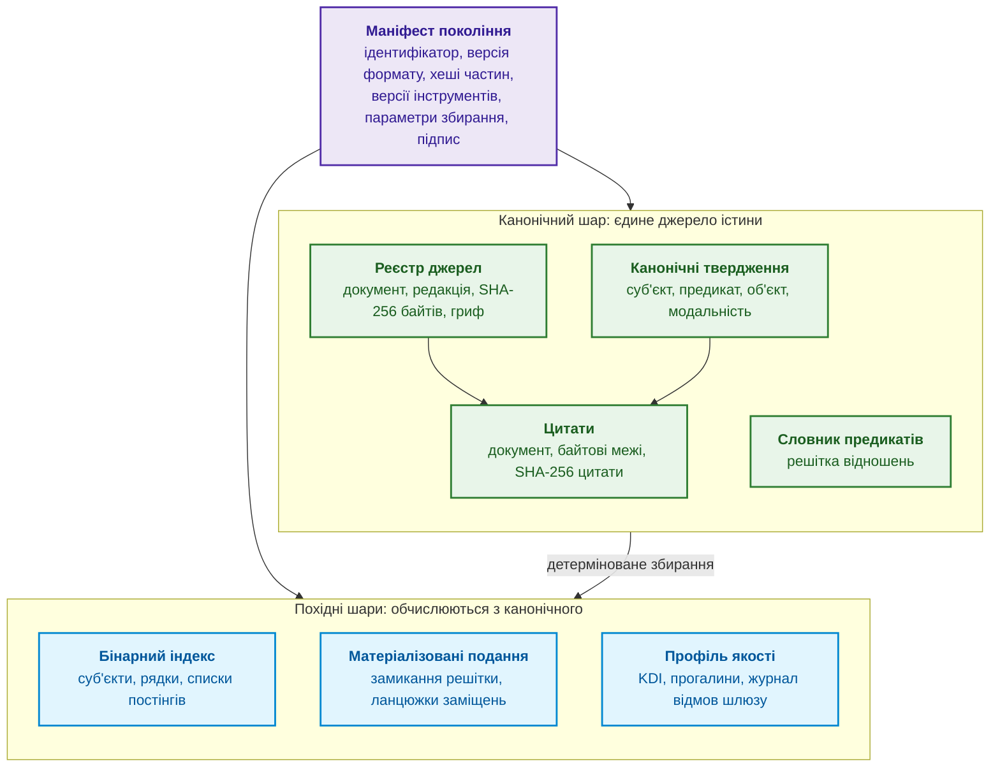
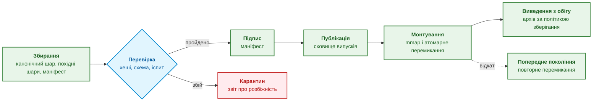
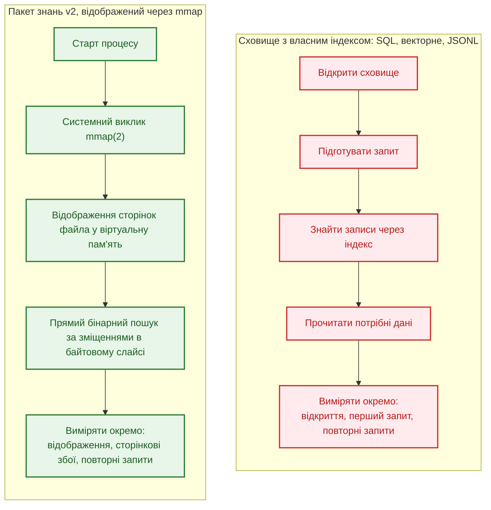
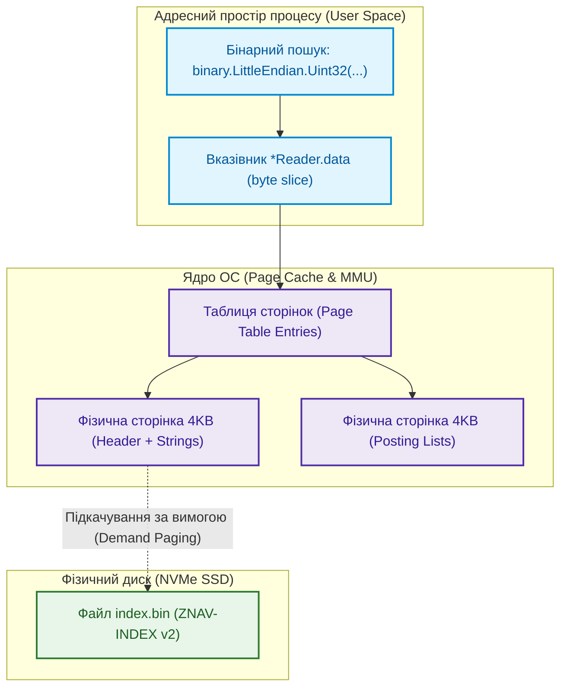
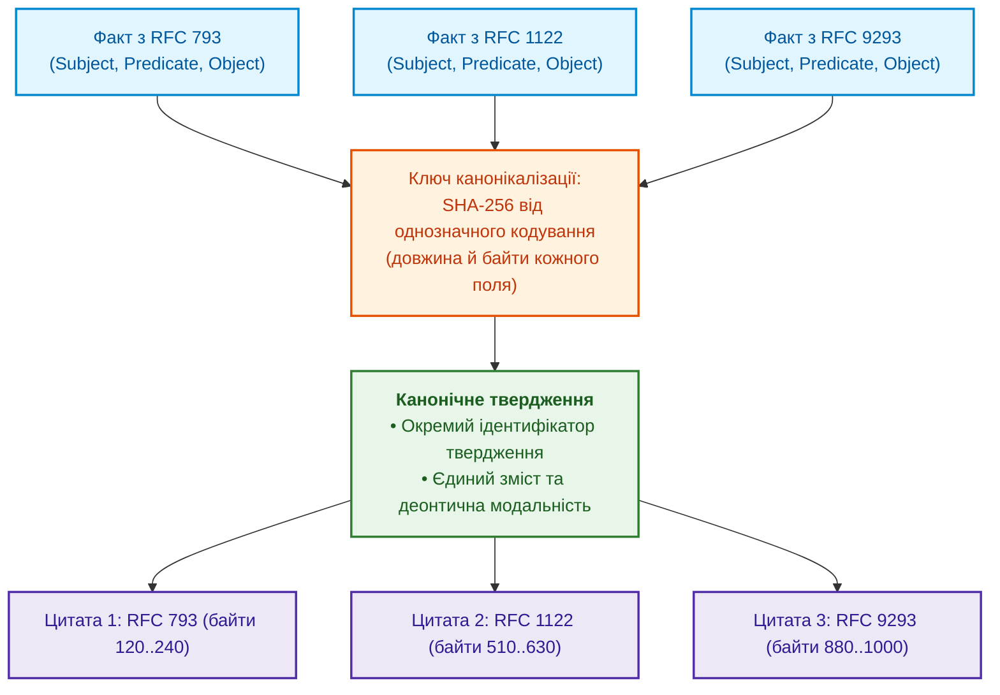
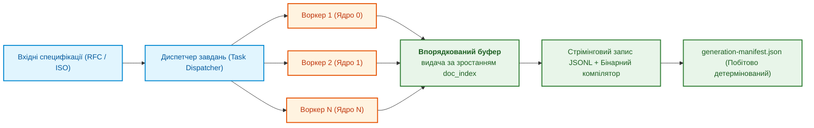
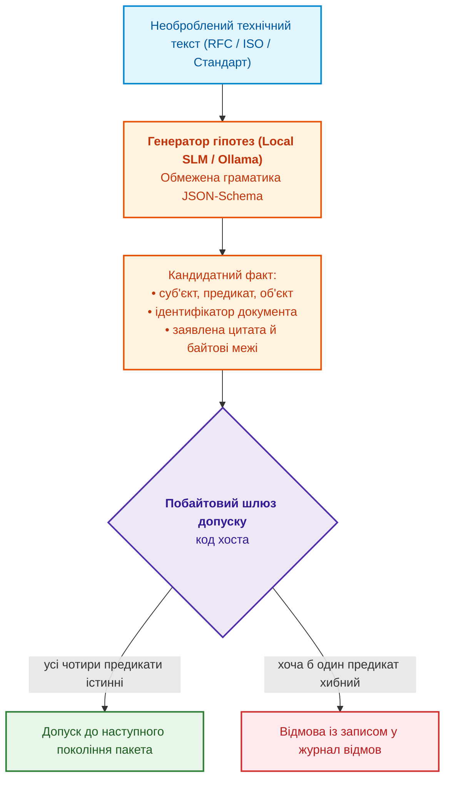

# Глава 32. Високопродуктивні інженерні бази знань: mmap-індексування з нульовою десеріалізацією, побайтовий допуск знань від мовних моделей та інженерія знаннєвої щільності

> **Книга:** [Архітектура доказових експертних систем](README.md) · [Частина VI: Передовий край: регуляторна сертифікація та нейро-символьний ШІ](part-06-frontiers-neuro-symbolic.md)  
> **Попередня глава:** [Глава 31. Багатоходове виведення: ієрархії предикатів, винятки та чинність норм](ch31-syllogistic-reasoning-and-relation-lattices.md)
> **Зміст книги:** [README.md](README.md)  
> **Автор:** [Микола Федчик](about-the-author.md)  
> **Пов'язані глави книги:** [Глава 7. Типологія баз знань](ch07-knowledge-base-typology.md) · [Глава 15. Екстракція знань і побудова бази знань](ch15-knowledge-extraction-and-kb-construction.md) · [Глава 17. Технологічний стек](ch17-implementation-stack.md) · [Глава 18. Інфраструктура виконання](ch18-execution-infrastructure.md) · [Глава 26. Неперервне навчання](ch26-continual-learning.md) · [Глава 29. Нейро-символьна архітектура](ch29-neuro-symbolic-architecture.md)  
> **Рівень:** системні архітектори, розробники баз даних та індексаторів, інженери знань, фахівці з високопродуктивних систем (High Performance Computing, Edge AI): просунутий  
> **Очікувані результати:** пояснювати склад пакета знань, його інваріанти, життєвий цикл і відмінності двох поколінь формату; обирати, які похідні подання обчислювати під час збирання пакета; проєктувати бінарні пакети знань нульової десеріалізації на базі системного виклику `mmap(2)` і визначати, коли `mmap(2)` не підходить; окремо вимірювати відкриття, перший і повторні запити та перевіряти тестом відсутність виділень пам'яті в купі під час пошуку; перевіряти недовірений бінарний індекс до першого запиту й шукати збої читача фазингом; розуміти віртуальну пам'ять ОС, підкачування сторінок, вирівнювання записів і системний виклик `madvise(2)`; забезпечувати детермінованість і побітову відтворюваність маніфестів під час багатопотокового збирання (`--concurrency / -j`); застосовувати безвтратне інвертоване кластерування фактів з однозначним ключем і збереженням точного графа цитувань; будувати конвеєри неперервного збагачення бази знань, де локальна мала мовна модель (SLM) пропонує гіпотези, а побайтовий шлюз допуску вирішує, що потрапить до пакета; профілювати інженерні корпуси за індексом знаннєвої щільності ($KDI$), відрізняти щільність від повноти й оцінювати повноту видобування методом повторного вилову; розбивати пакет на шарди за ключем-родиною документів, перевіряти повноту, неперетин і відновлюваність розбиття й не читати мовчання шарда як відсутність факту.

---

## Анотація

Глава розглядає інженерну проблему переходу від прототипу експертної системи з кількома тисячами правил до промислової бази знань галузевого масштабу: десятки тисяч специфікацій, сотні тисяч нормативних фактів і мікросекундний час реакції у вбудованих застосуваннях. На такому масштабі експертна система впирається не в логіку виведення, а в спосіб зберігання й постачання знань. Текстові дампи змушують процес експертної системи під час кожного старту розбирати мільйони записів і створювати об'єкти в купі, клієнт-серверна реляційна СКБД (RDBMS) і векторне сховище додають мережевий обмін і окремий сервер, а змінна база даних не дає прив'язати відповідь до точного стану знань. У системах реального часу до цього додаються непередбачувані паузи збирача сміття (*garbage collection pauses*).

Глава описує авторську розробку: пакет знань, тобто незмінний самоописовий артефакт випуску бази знань, і бінарний формат його індексу ZNAV-INDEX. Спочатку глава пояснює, з чого складається пакет знань, які інваріанти пакет зберігає, як проходить життєвий цикл пакета і чим друге покоління формату (**Knowledge Pack v2**) відрізняється від першого. Далі розглянуто механізми, на яких тримається друге покоління: нульову десеріалізацію через відображення файлу в пам'ять (`mmap`) і межі застосовності цього підходу, специфікацію ZNAV-INDEX v2 у порівнянні з v1, безвтратне кластерування фактів з однозначним ключем і графом цитувань, паралельне збирання з побітово відтворюваним маніфестом, конвеєр нейро-символьного збагачення бази знань із побайтовим шлюзом допуску, індекс знаннєвої щільності корпусу ($KDI$) разом з оцінкою повноти видобування та читача індексу, який перевіряє недовірений файл до першого запиту, а також шардування незмінного пакета за родиною документів з перевіркою розбиття й маршрутизацією, яка відрізняє мовчання шарда від відсутності факту.

---

## 1. Пакет знань: як база знань стає артефактом випуску

Експертна система відповідає з конкретного стану знань. Аудитор, який через рік перевіряє висновок, має отримати той самий набір тверджень і цитат. Для автономного вузла потрібний локальний артефакт, для утиліти командного рядка може бути важливим швидке відкриття. Змінне сховище без версій і знімків не гарантує відтворення старої відповіді. Однак реляційні бази також можуть мати незмінні знімки, а SQLite не потребує окремого сервера. Пакет є одним способом виконати ці вимоги, не єдиним.

Попередні глави вже використовували незмінний знімок бази знань як готову деталь. [Глава 10](ch10-knowledge-acquisition-systems.md) описала випуск бази знань із канонічним маніфестом і атомарним відкатом, [Глава 15](ch15-knowledge-extraction-and-kb-construction.md) поставила незмінний бінарний пакет поряд із реляційним сховищем предикатів і графом понять, [Глава 18](ch18-execution-infrastructure.md) показала дворівневий індекс, відображений у пам'ять, а [Глава 22](ch22-cybernetics-edge-to-backend.md) описала підписаний пакет знань для оновлення периферійних вузлів. Цей розділ збирає ці частини в одну архітектуру: що лежить усередині пакета, які властивості пакет зберігає між версіями і як формат пакета змінився між двома поколіннями.

> [!NOTE]
> Формат пакета знань і формат бінарного індексу ZNAV-INDEX є авторськими розробками для дослідницького прототипу експертної системи. Перше покоління створено на початку 2026 року для простежуваності висновків на корпусі мережевих специфікацій, друге описує інший спосіб індексування. Це практичний приклад, не стандарт і не гарантія відсутності помилок. Числа автора залежать від корпусу, обладнання та меж вимірювання; у розділі 2 пояснено, які результати ще потребують відкритого відтворення.

### 1.1. Пакет знань як продукт збирання

Аналогія зі скомпільованою програмою показує суть підходу. Інженер не редагує виконуваний файл, що вже працює у виробництві: інженер змінює вихідний код, збирає нову версію, перевіряє нову версію й розгортає її, а стару версію зберігає для відкату. Пакет знань переносить цю дисципліну на знання: джерела й прийняті твердження відіграють роль вихідного коду, збирач пакета відіграє роль компілятора, а пакет є виконуваним артефактом для механізму виведення.

**Пакет знань** (*knowledge pack*) є незмінним, самоописовим і версійованим набором файлів, що містить канонічні твердження бази знань разом із цитатами першоджерел, похідні індекси для швидкого виведення та маніфест, який зв'язує вміст пакета з джерелами, інструментами й параметрами збирання. **Покоління пакета** (*generation*) є одним таким випуском: нові знання створюють нове покоління, а не змінюють наявне. Слово «покоління» в цій главі має два значення, і їх не варто плутати: покоління пакета означає черговий випуск знань, а покоління формату (v1, v2) означає версію самої будови пакета.

### 1.2. Склад пакета: канонічний шар, похідні шари й маніфест

Частини пакета мають різний статус. Канонічний шар є єдиним джерелом істини, похідні шари обчислюються з канонічного шару заради швидкості, а маніфест описує все разом. Схема показує загальну будову; які саме файли має кожне покоління формату, підсумовує таблиця розділу 1.5.



Фіолетовий блок є маніфестом, зелені блоки утворюють канонічний шар, сині блоки є похідними шарами. Таблиця пояснює, що містить кожна частина і хто її читає.

| Частина пакета | Що містить | Статус | Хто читає |
|---|---|---|---|
| Маніфест покоління | ідентифікатор покоління, версія формату, хеші всіх частин, перелік джерел, версії збирача й моделей, параметри збирання, підпис | опис пакета | механізм виведення під час монтування, аудитор |
| Реєстр джерел | ідентифікатор документа, редакція, хеш SHA-256 байтів документа, гриф доступу, статус чинності | канонічна | шлюз допуску, аудитор |
| Канонічні твердження | суб'єкт, предикат, об'єкт, деонтична модальність, ідентифікатор твердження | канонічна | механізм виведення |
| Цитати | документ, байтові межі, хеш цитати; одне твердження може мати кілька цитат | канонічна | рушій пояснень ([Глава 20](ch20-explanation-engine.md)), аудитор |
| Словник предикатів | дозволені предикати та їхня решітка ([Глава 31](ch31-syllogistic-reasoning-and-relation-lattices.md)) | канонічна | шлюз допуску, силогістичний рушій |
| Бінарний індекс | таблиці суб'єктів, рядків і постінгів (розділ 4) | похідна | механізм виведення |
| Матеріалізовані подання | заздалегідь обчислені замикання й ланцюжки (розділ 1.6) | похідна | механізм виведення |
| Профіль якості | $KDI$ за категоріями знань, прогалини, статистика відмов шлюзу (розділи 7 і 8) | похідна | інженер знань, процедура випуску |

Розподіл на канонічне й похідне є головним проєктним рішенням пакета. Похідні шари ніхто не редагує вручну: їх обчислює збирач, а перевірка пакета повторює обчислення й порівнює хеші. Розбіжність хешів означає дефект збирача або підміну файлу, і пакет не допускають до монтування. Той самий розподіл робить дешевою зміну формату індексу: новий формат є новим похідним шаром того самого канонічного шару, тож знання не треба видобувати з документів повторно, а перевірка відтворюваності одразу показує, чи відповідає новий індекс старим знанням.

### 1.3. Інваріанти пакета

Інваріант пакета є властивістю, яку зберігає кожне покоління й перевіряє кожен споживач. Порушення будь-якого інваріанта робить пакет непридатним для доказової експертної системи, тому інваріанти перевіряють автоматично під час збирання й монтування.

1. **Незмінність.** Після публікації жоден байт пакета не змінюється. Виправлення, відкликання джерела чи нове твердження створюють нове покоління, а відкликання оформлюють позначкою видалення (*tombstone*), як описано в [Главі 10](ch10-knowledge-acquisition-systems.md).
2. **Адресація за вмістом.** Ідентифікатор покоління обчислюють як хеш канонічного маніфесту (формулу наведено в [Главі 10](ch10-knowledge-acquisition-systems.md)), а маніфест містить хеші всіх частин пакета. Зміна будь-якого байта будь-якої частини змінює ідентифікатор, тож відповідь експертної системи, яка посилається на ідентифікатор покоління, посилається на точний стан знань. Однакову серіалізацію маніфесту на різних машинах забезпечує канонічна схема JSON, наприклад JCS [[1]](#src-1).
3. **Відтворюваність похідних шарів.** Похідні шари є детермінованою функцією канонічного шару й параметрів збирання. Цей інваріант не залежить від кількості потоків збирача (розділ 6).
4. **Самоопис і версія формату.** Кожна бінарна частина починається із сигнатури, номера версії формату й прапорців. Читач відмовляється монтувати частину з невідомою основною версією (поведінка *fail-closed*), а необов'язкові розширення позначають прапорцями, які старий читач може безпечно пропустити. Такий самий прийом давно використовує формат зображень PNG: регістр першої літери назви блоку (*chunk*) повідомляє декодеру, чи можна пропустити невідомий блок без втрати сенсу зображення [[2]](#src-2).
5. **Відокремлення змінного стану.** Зворотний зв'язок інженерів, статистика навчання, кеші й журнали зберігаються поза пакетом ([Глава 25](ch25-how-expert-systems-learn.md), [Глава 26](ch26-continual-learning.md)). Навчання експертної системи створює кандидатів у наступне покоління, а не змінює чинне покоління.
6. **Межі доступу.** Пакет не має обходити розмежування доступу ([Глава 10](ch10-knowledge-acquisition-systems.md)): або кожне твердження й кожна цитата несуть мітку доступу, яку механізм виведення перевіряє перед видачею, або пакет збирають окремо для кожного рівня доступу (розбиття пакета на шарди за ознаками описано в розділі 10 і у [Главі 7](ch07-knowledge-base-typology.md)).

Разом ці інваріанти перетворюють пакет на доказ, а не на кеш: за ідентифікатором покоління аудитор отримує ті самі байти, ті самі цитати й той самий індекс, які бачила експертна система в момент відповіді.

### 1.4. Життєвий цикл пакета

Інваріанти визначають, яким має бути пакет, а життєвий цикл визначає, через які кроки пакет проходить від збирання до архіву. Схема показує ці кроки й гілку карантину.



1. **Збирання.** Збирач читає канонічні твердження, які пройшли шлюз допуску (розділ 7), будує похідні шари й маніфест. Стиснення частин пакета, якщо воно потрібне, виконує центральний процесор: класичні алгоритми стиснення не відображаються на тензорні операції нейронного процесора ([Глава 18](ch18-execution-infrastructure.md)).
2. **Перевірка.** Перевірка повторно обчислює похідні шари, звіряє схему й хеші, проганяє екзаменаційну матрицю й регресійні тести ([Глава 23](ch23-knowledge-base-verification.md), [Глава 25](ch25-how-expert-systems-learn.md)).
3. **Підпис.** Маніфест підписують відповідальні особи; для периферійних вузлів діє порогова схема підписів ([Глава 22](ch22-cybernetics-edge-to-backend.md)).
4. **Публікація.** Пакет потрапляє до сховища випусків і поетапно доходить до споживачів ([Глава 10](ch10-knowledge-acquisition-systems.md)).
5. **Монтування й перемикання.** Механізм виведення відображає файли нового покоління в пам'ять, перевіряє заголовки й хеші та атомарно перемикає вказівник активного покоління. Запити, що вже виконуються, завершуються на старому відображенні, а старе відображення звільняють, коли лічильник активних читачів досягає нуля. Відкат є тим самим перемиканням на попереднє покоління.
6. **Виведення з обігу.** Старе покоління не видаляють, доки на нього посилаються видані відповіді, сертифікати доказів ([Глава 30](ch30-safety-cybersecurity-co-engineering.md)) чи аргументи безпеки ([Глава 27](ch27-safety-case-gsn-synthesis.md)); скільки поколінь зберігати, визначає політика зберігання.

Отже, відкат у такій архітектурі не є аварійною процедурою: відкат є звичайним монтуванням іншого покоління, яке вже пройшло перевірку раніше.

### 1.5. Два покоління формату

Будова пакета змінювалася разом із масштабом корпусу. Таблиця порівнює покоління формату за властивостями, що визначають поведінку експертної системи; стовпець другого покоління підсумовує розділи 3–8 цієї глави.

| Властивість | Перше покоління (v1) | Друге покоління (v2) |
|---|---|---|
| Склад файлів пакета | маніфест `pack.json` (метадані, хеш джерела), текстові `chunks.jsonl` (4096-байтні блоки з SHA-256) та сирий `facts.jsonl` (витягнуті факти без бінарного індексу) | маніфест `generation-manifest.json`, потік канонічних тверджень у форматі JSONL, бінарний індекс `index.bin` у форматі ZNAV-INDEX v2 |
| Формат канонічних тверджень | JSONL (недедупліковані об'єкти тверджень із довільним порядком ключів) | JSONL, записаний у детермінованому порядку (розділ 6) |
| Завантаження під час старту | потоковий розбір усього JSONL у купу процесу (heap) під час старту; тривалість 5–15 с на великому корпусі | відображення файлу індексу в пам'ять без розбору (розділ 3) |
| Цитати | посилання на документ, розділ та номер 4096-байтного чанка; точні побайтові зрізи та хеші цитат з'явилися пізніше | байтові межі в першоджерелі й SHA-256 цитати (розділ 7.1) |
| Повторювані твердження | дублювання записів або евристичне «голосування більшістю», що знищувало історичні версії та контекст | безвтратне кластерування з усіма цитатами (розділ 5) |
| Паралельне збирання | однопотоковий збирач або недетермінований паралелізм (хеші результату різнилися між запусками) | побітово однаковий результат за будь-якої кількості потоків (розділ 6) |
| Допуск кандидатів | евристичні регулярні вирази або підказки LLM без обов'язкового побайтового підтвердження в хості | чотири предикати побайтового шлюзу допуску (розділ 7.1) |
| Профіль якості й матеріалізовані подання | відсутні (обчислювалися зовнішніми ad-hoc скриптами або в рантаймі під час запиту) | зберігає всередині пакета як явні похідні артефакти, зафіксовані в єдиному маніфесті покоління |
| Сумісність поколінь | не застосовується | пакети v1 не підтримуються напряму; збирач перезбирає їх із канонічного шару першоджерел за специфікацією v2 |

Перехід між поколіннями формату варто пояснювати вимірюваннями, а не вподобаннями. Архівні показники автора для прямого розбору JSONL наведено в розділі 2.2 разом із межами їх перевірки. Окрема проблема v1, залежність порядку записів від виконання потоків, змінювала хеш збирання й ускладнювала побітове відтворення. Для v2 порядок канонізації та запису потрібно перевіряти незалежно від швидкості читання.

### 1.6. Матеріалізовані подання: що обчислювати під час збирання

Механізм виведення багато разів обчислює ті самі похідні відношення: транзитивне замикання решітки предикатів ([Глава 31](ch31-syllogistic-reasoning-and-relation-lattices.md)), ланцюжки заміщень редакцій документів ([Глава 15](ch15-knowledge-extraction-and-kb-construction.md)), обернені списки «об'єкт → твердження». Кожне таке відношення можна обчислювати під час запиту або зберегти в пакеті заздалегідь. У теорії баз даних це питання відоме як задача вибору матеріалізованих подань (*materialized view selection*): збережене подання прискорює запити, але займає місце й потребує оновлення, коли змінюються вихідні дані [[3]](#src-3). Мбайоссум та співавтори формалізували задачу вибору для онтологічних (семантичних) баз даних і показали, що різноманіття моделей даних і мов запитів у таких базах вимагає спільної мови, якою можна описати й порівняти різні методи вибору [[4]](#src-4).

Для пакета знань задача має особливість: пакет незмінний, тож подання не оновлюють під час роботи. Вартість підтримки подання переходить у час збирання й у розмір пакета, бо кожне нове покоління обчислює подання заново. Формально вибір зводиться до класичної постановки з бюджетом розміру.

```math
V^{*} = \arg\min_{V \subseteq \mathcal{V}} \sum_{q \in Q} f_q \cdot c(q \mid V) \quad \text{за умови} \quad \sum_{v \in V} s(v) \le S_{\max}
```

Складники задачі вибору:

- $\mathcal{V}$ є множиною кандидатів у матеріалізовані подання, наприклад замикання решітки предикатів, ланцюжки заміщень, обернений індекс за об'єктом;
- $V$ є обраною підмножиною кандидатів, а $V^{*}$ є підмножиною, що дає найменшу сумарну вартість запитів;
- $Q$ є множиною типових запитів механізму виведення, а $f_q$ є частотою запиту $q$ за журналом запитів, у запитах за хвилину;
- $c(q \mid V)$ є вартістю відповіді на запит $q$ за наявності подань із $V$, у мікросекундах процесорного часу;
- $s(v)$ є розміром подання $v$ у пакеті, а $S_{\max}$ є бюджетом розміру, який допускає цільовий вузол, у мегабайтах.

У загальному випадку задача вибору є NP-складною, тому на практиці подання відбирають жадібно, за вигодою на одиницю розміру. Харінараян, Раджараман і Ульман показали для решітки подань куба даних, що жадібний вибір заданої кількості подань дає щонайменше частку $(e-1)/e$, тобто близько 63 %, від вигоди оптимального вибору [[5]](#src-5), а Гупта поширив постановку на загальніші графи подань [[6]](#src-6).

Результат читають так: подання варто зберегти в пакеті, якщо зважена частотою економія часу запитів більша за вигоду, яку той самий обсяг бюджету дав би іншому поданню. Приклад. Нехай пакет для периферійного вузла має бюджет 20 МБ на подання, а кандидатів двоє. Замикання решітки предикатів займає 2 МБ і скорочує перевірку субсумції з 40 до 1,5 мкс; таких перевірок 10 000 за хвилину, тож замикання економить 10 000 · 38,5 мкс = 385 мс процесорного часу щохвилини, або близько 192 мс на мегабайт. Обернений індекс за об'єктом займає 30 МБ і скорочує рідкісний запит (100 за хвилину) з 900 до 5 мкс, тобто економить близько 90 мс щохвилини, або 3 мс на мегабайт. Обернений індекс не вміщується в бюджет і має в 64 рази меншу вигоду на мегабайт, тож до пакета потрапляє лише замикання. Якщо бюджет зростає до 40 МБ, жадібний відбір додає й обернений індекс.

Межа застосовності методу пов'язана з даними: частоти $f_q$ беруть із журналу запитів попереднього покоління, тож для нового домену без журналу вибір спирається на оцінку інженера знань і переглядається після першого покоління. Матеріалізоване подання залишається похідним шаром, тому перевірка пакета повторно обчислює подання так само, як бінарний індекс.

Розділ 1 визначив, що таке пакет знань і які властивості пакет мусить зберігати. Наступні розділи показують, чому друге покоління формату відмовилося від розбору тексту під час старту і як влаштовані механізми, що забезпечують інваріанти на рівні байтів.

---

## 2. Вибір сховища: порівнювати однакову роботу

Реляційне сховище, векторний індекс і незмінний бінарний пакет виконують різні задачі. Порівнювати їх можна лише після визначення однакових даних, запиту, результату й меж вимірювання. Нижче діаграма показує можливі шляхи читання, а не універсальний рейтинг продуктів.



### 2.1. Які витрати й гарантії потрібно розділити

1. **Вартість розбору під час відкриття:**  
    Розбір усього текстового корпусу під час відкриття може коштувати дорожче за читання готового індексу. Але реляційна база не зобов'язана десеріалізувати весь корпус на старті. Збирання сміття стосується конкретного середовища виконання й представлення даних, а не всіх реалізацій на C++, Rust і Go однаково.
2. **Семантична неточність векторного пошуку:**  
    Граф HNSW шукає найближчі вектори наближено [[7]](#src-7). Це інша семантика запиту, ніж точна вибірка за ідентифікатором. Пошук повертає кандидатів; чинність, доступ і підстави перевіряються окремо. Векторне сховище також може підтримувати точний пошук, тому властивість одного індексу не слід приписувати всім продуктам.
3. **Руйнування простежуваності та незмінності:**  
    Операції зміни даних не є автоматично неконтрольованими. Реляційне сховище може мати обмежені права, журнал і незмінні знімки. Незмінність опублікованого пакета є властивістю процедури випуску й політики доступу, а не виключною властивістю `mmap`.

### 2.2. Архівні вимірювання та протокол порівняння

Наступна таблиця зберігає архівні вимірювання автора на корпусі зі 100 000 фактів. Вони не є контрольованим рейтингом: відкриття відображення, підключення до сервера й завантаження індексу мають різні межі. Повні відкриті реалізації альтернатив і вихідні результати прогонів не наведено, тому читач не може незалежно відтворити всю таблицю. Показники сервера й клієнта не слід складати або порівнювати як пам'ять одного процесу.

<details>
<summary>Архівні результати автора; різні межі вимірювання</summary>

| Архітектура сховища | Час холодного старту | Латентність одиничного запиту ($P_{99}$) | Споживання RAM (RSS) | Алокації пам'яті на запит | Паузи GC на 10k QPS |
|---|---|---|---|---|---|
| **Direct JSONL Ingest** | 14,8 с | 850 мкс | 1,42 ГБ | 145 KB/op (320 allocs) | 45 мс |
| **SQLite (B-Tree, in-memory)** | 3,2 с | 45 мкс | 380 МБ | 4,2 KB/op (28 allocs) | 8 мс |
| **PostgreSQL (Local Unix Socket)** | 0,8 с (connect) | 1,2 мс | 520 МБ (server) | 12 KB/op (socket buffers) | Немає (server GC) |
| **Vector DB (HNSW Index)** | 22,5 с | 4,8 мс | 2,85 ГБ | 85 KB/op | 65 мс |
| **Knowledge Pack v2 (`mmap`)** | **4,2 мкс** | **1,5 мкс** | **18 МБ (Shared)** | **0 B/op (0 allocs)** | **0,0 мс (Zero GC)** |

За записом автора, вимірювання виконано 28 вересня 2026 року на AMD EPYC 7763, накопичувачі Samsung PM9A3 і Linux 6.8 для нормативного корпусу. Значення 4,2 мкс означає лише відображення файла й перевірку заголовка, не повну готовність усіх сторінок. Воно не доводить переваги над першим запитом до іншого сховища.

</details>

Для нового порівняння потрібно зафіксувати: генератор і хеш даних, версії інструментів, однакові точкові запити, знайдені й відсутні ключі, порядок запусків, стан кешів операційної системи та сирі результати кількох прогонів. Відкриття, перший запит і повторні запити вимірюють окремо. Спочатку перевіряють рівність відповідей, а лише потім затримки.

### 2.3. Відкритий навчальний стенд SQLite і `mmap`

Стенд нижче використовує лише стандартну бібліотеку Python 3. Він генерує однакові пари цілих чисел для SQLite і простого бінарного файла, виконує точний пошук і перевіряє кожну відповідь. Бінарний файл є навчальним індексом, не реалізацією ZNAV-INDEX. Це порівняння двох шляхів читання через Python, а не доказ нульових алокацій Go-читача. Документація модулів описує доступні операції й платформні обмеження [[8]](#src-8).

<details>
<summary>Самодостатній стенд: генератор, точні запити й результати в JSON</summary>

```python
import argparse
import json
import mmap
import platform
import random
import sqlite3
import statistics
import struct
import tempfile
import time
from contextlib import closing
from pathlib import Path

HEADER = struct.Struct("<8sQ")
RECORD = struct.Struct("<QQ")


def lookup_mapped(mapped, count, key):
    left, right = 0, count
    while left < right:
        middle = (left + right) // 2
        stored_key, value = RECORD.unpack_from(mapped, HEADER.size + middle * RECORD.size)
        if stored_key == key:
            return value
        if stored_key < key:
            left = middle + 1
        else:
            right = middle
    return None


def measure(count=100000, query_count=10000):
    if count < 1 or query_count < 1:
        raise ValueError("positive record and query counts required")
    generator = random.Random(7)
    keys = [-1, 0, count - 1, count] + [generator.randrange(count + 10) for _ in range(query_count)]
    results = []
    with tempfile.TemporaryDirectory() as directory:
        database_path = Path(directory) / "facts.sqlite"
        binary_path = Path(directory) / "facts.bin"
        with closing(sqlite3.connect(database_path)) as database:
            database.execute("CREATE TABLE facts (id INTEGER PRIMARY KEY, value INTEGER NOT NULL)")
            database.executemany("INSERT INTO facts VALUES (?, ?)", ((key, key * 2 + 1) for key in range(count)))
            database.commit()
        with binary_path.open("wb") as output:
            output.write(HEADER.pack(b"ESTEST01", count))
            for key in range(count):
                output.write(RECORD.pack(key, key * 2 + 1))
        for round_index, order in enumerate((("sqlite", "mapped"), ("mapped", "sqlite"))):
            for backend in order:
                started = time.perf_counter_ns()
                if backend == "sqlite":
                    database = sqlite3.connect(database_path.as_uri() + "?mode=ro", uri=True)
                    cursor = database.cursor()
                    def lookup(key):
                        row = cursor.execute("SELECT value FROM facts WHERE id = ?", (key,)).fetchone()
                        return None if row is None else row[0]
                else:
                    input_file = binary_path.open("rb")
                    mapped = mmap.mmap(input_file.fileno(), 0, access=mmap.ACCESS_READ)
                    assert HEADER.unpack_from(mapped) == (b"ESTEST01", count)
                    def lookup(key):
                        return lookup_mapped(mapped, count, key)
                open_ns = time.perf_counter_ns() - started
                timings = []
                try:
                    for key in keys:
                        started = time.perf_counter_ns()
                        actual = lookup(key)
                        timings.append(time.perf_counter_ns() - started)
                        expected = key * 2 + 1 if 0 <= key < count else None
                        assert actual == expected, (backend, key, actual, expected)
                finally:
                    if backend == "sqlite":
                        database.close()
                    else:
                        mapped.close()
                        input_file.close()
                ordered = sorted(timings[1:])
                results.append({"backend": backend, "round": round_index,
                                "open_ns": open_ns, "first_lookup_ns": timings[0],
                                "median_ns": statistics.median(ordered),
                                "p95_ns": ordered[(len(ordered) * 95 + 99) // 100 - 1]})
        return {"python": platform.python_version(), "platform": platform.platform(),
                "sqlite": sqlite3.sqlite_version, "records": count, "queries": len(keys),
                "cache_state": "not_reset", "results": results}


if __name__ == "__main__":
    parser = argparse.ArgumentParser()
    parser.add_argument("--records", type=int, default=100000)
    parser.add_argument("--queries", type=int, default=10000)
    arguments = parser.parse_args()
    print(json.dumps(measure(arguments.records, arguments.queries), indent=2))
```

</details>

Стенд змінює порядок запуску й перевіряє крайні та відсутні ключі, але не очищає кеш операційної системи. Збирання даних уже прогріває частину сторінок; `first_lookup_ns` означає перший запит після відкриття, не доведений холодний доступ до накопичувача. Медіана й 95-й процентиль описують виміряні виклики, а не гарантовану затримку. Час збирання, підпис, повноту пакета, пам'ять процесів і паралельні запити потрібно досліджувати окремо.

Якщо для цих даних SQLite швидший, результат не слід приховувати: він означає, що конкретний Python-шлях двійкового пошуку не виправдав очікування. Вибір сховища має спиратися на потрібні операції та виміряні обмеження, а не на наперед визначеного переможця.

---

## 3. Анатомія нульової десеріалізації: системні механізми `mmap(2)`

Технологія нульової десеріалізації спирається на пряме відображення дискового файлу у віртуальний адресний простір процесу за допомогою виклику ядра Linux `mmap(2)` [[9]](#src-9). Виклик отримує дескриптор відкритого файла, довжину й зміщення відображуваного діапазону, права доступу до сторінок (для пакета знань лише `PROT_READ`) і прапорець спільного чи приватного відображення, а повертає адресу, з якої процес читає байти файла як звичайну пам'ять. Схема показує, які структури операційної системи стоять між вказівником читача й файлом на накопичувачі.



### 3.1. Механіка сторінкового підкачування та системний виклик `madvise(2)`

1. **Підкачування за вимогою (*demand paging*):**  
   Під час виклику `mmap(2)` ядро Linux не читає файл у пам'ять одразу, а лише створює опис ділянки віртуального адресного простору (структуру `vm_area_struct`). Перше звернення до сторінки, якої ще немає в кеші сторінок, спричиняє виняток процесора, сторінковий збій (*page fault*): потік читача зупиняється, доки ядро читає сторінку з накопичувача й записує відповідність у таблицю сторінок [[10]](#src-10). Ядро може заодно прочитати й сусідні сторінки, тож вартість першого запиту залежить від стану кешу й не визначається лише форматом файла.
2. **Порада ядру викликом `madvise(2)`:**  
   Щоб зменшити кількість сторінкових збоїв під час перших запитів, читач може викликати `unix.Madvise(data, unix.MADV_WILLNEED)` з пакета `golang.org/x/sys/unix`. Прапорець `MADV_WILLNEED` лише повідомляє ядру, що діапазон знадобиться найближчим часом; документація виклику формулює наслідок обережно: можливо, варто прочитати частину сторінок наперед [[11]](#src-11). Порада не гарантує, що весь індекс опиниться в пам'яті до першого запиту, і не захищає сторінки від пізнішого витіснення, тому ефект поради потрібно вимірювати, а не передбачати.
3. **Вирівнювання записів (*alignment*):**  
   Заголовок займає рівно 64 байти, тож таблиця суб'єктів починається зі зміщення 0x40, кратного розміру лінії кешу процесора (64 байти на x86-64 і на більшості ядер ARM Cortex-A). Записи таблиці мають фіксований розмір 16 байтів, тому чотири записи займають одну лінію кешу, і крок двійкового пошуку читає запис із однієї лінії кешу [[12]](#src-12). Поля всередині запису читач мовою Go розбирає функціями пакета `encoding/binary`, яким вирівнювання не потрібне, а векторні інструкції (SIMD) для порівняння рядків застосовує сама функція `bytes.Compare` зі стандартної бібліотеки Go, незалежно від вирівнювання даних.

### 3.2. Коли відображення файла в пам'ять не підходить

Переваги `mmap(2)` мають чітку межу застосовності. Кротті, Ляйс і Павло проаналізували використання `mmap(2)` замість власного буферного пулу в СКБД і назвали чотири групи проблем: безпеку транзакцій під час запису, непередбачувані зупинки вводу-виводу, обробку помилок вводу-виводу й продуктивність [[13]](#src-13). Зупинка вводу-виводу виникає тому, що операційна система може будь-коли витіснити сторінку, і навіть запит лише на читання наштовхується на блокувальний сторінковий збій, якого програма не може передбачити. Помилка читання з накопичувача приходить не кодом повернення, а сигналом `SIGBUS` у будь-якому місці коду, що торкається відображеної пам'яті. Продуктивність обмежують, зокрема, скидання записів TLB на всіх ядрах процесора (*TLB shootdown*) під час витіснення сторінок. Висновок авторів жорсткий: використовувати `mmap(2)` у СКБД можна хіба тоді, коли робочий набір даних уміщується в пам'ять, а навантаження лише читає.

Незмінний пакет знань відповідає саме цьому винятку: пакет ніхто не змінює після публікації (інваріант 1 розділу 1.3), а розмір індексу периферійного пакета відомий під час збирання, тож відповідність пам'яті цільового вузла можна перевірити до розгортання. Якщо ж індекс більший за доступну пам'ять або вузол ділить пам'ять з іншими процесами під навантаженням, кожен промах кешу сторінок перетворюється на непередбачувану затримку запиту, і явне читання з власним буфером стає кращим вибором. Окремий ризик створює зміна файла після монтування: перевірка індексу під час відкриття (розділ 9) має силу лише доти, доки байти файла не змінюються, а усічення відображеного файла іншим процесом призводить до сигналу `SIGBUS` під час наступного звернення. Тому пакет монтують з каталогу, доступного лише для читання. Якщо індекс перевищує пам'ять одного вузла, альтернативою явному читанню є розбиття пакета на шарди, яке розглядає розділ 10.

---

## 4. Специфікація бінарного формату ZNAV-INDEX v2

Бінарний файл індексу є монолітним масивом байтів із жорстким макетом розділів:

<details>
<summary>Специфікація заголовка та макета бінарного файлу ZNAV-INDEX v2</summary>

```text
+-----------------------------------------------------------------------+
| Magic 'ZNAV' (4B) | Version (2B) | Flags (2B) | AssertionsCount (4B)  |  0x00 - 0x0B
| TotalSubjects (4B) | StringTableOff (8B) | PostingsOff (8B)           |  0x0C - 0x1F
| SubjectIndexOff (8B) | CRC32 Checksum (4B) | Reserved Padding (20B)   |  0x20 - 0x3F
+-----------------------------------------------------------------------+  0x40
| Таблиця суб'єктів (Впорядкований масив SubjectEntry, розмір 16B кожен)   |
| [StrOff:4B][StrLen:2B][PostingsOff:4B][PostingsCount:2B][Reserved:4B] |
| ... (N = TotalSubjects, двійковий пошук за O(log N))                  |
+-----------------------------------------------------------------------+
| Таблиця рядків (UTF-8, дедупліковані імена суб'єктів та предикатів)   |
+-----------------------------------------------------------------------+
| Списки постінгів (по 8 байтів: зміщення тверджень у файлі тверджень) |
+-----------------------------------------------------------------------+
```

</details>

Завдяки впорядкованості масиву `SubjectEntry` пошук будь-якого терміну виконується за алгоритмом класичного бінарного пошуку $\mathcal{O}(\log_2 N)$. Жодна стрічка не копіюється в купу: функція читання повертає підзріз (*slice*) байтового масиву mmap, і збирач сміття не отримує нових об'єктів для обходу.

Канонічному формату ZNAV-INDEX v2 відповідає саме розміщення з еталонного Go-коду розділу 9. Усі числа записано в порядку байтів від молодшого до старшого (*little-endian*). Заголовок займає рівно 64 байти: поле `SubjectIndexOff` (8 байтів, зміщення 0x20–0x27) задає абсолютне зміщення початку впорядкованого масиву `SubjectEntry`, після нього йде `CRC32Checksum` (4 байти, 0x28–0x2B) та 20 зарезервованих байтів (`Reserved`, 0x2C–0x3F). Контрольну суму CRC32 у варіанті IEEE рахують лише за байтами 0x00–0x27, тобто за всім заголовком до самого поля суми. Цілісність решти файла захищає не CRC32, а хеш SHA-256 файла в маніфесті покоління (інваріант 2 розділу 1.3). Явне поле `SubjectIndexOff` дозволяє в майбутньому розширити заголовок без жорсткої прив'язки таблиці суб'єктів до зміщення 0x40.

Розділи файла йдуть у фіксованому порядку: заголовок, таблиця суб'єктів, таблиця рядків, списки постінгів. Поля `StrOff` і `PostingsOff` у записі суб'єкта є абсолютними зміщеннями від початку файла, і кожне зміщення разом із довжиною має лежати всередині свого розділу. Двійковий пошук дає правильний результат лише тоді, коли імена суб'єктів у таблиці строго зростають за побайтовим порівнянням. Ці три вимоги специфікації збирач гарантує під час запису, а читач перевіряє під час відкриття, бо файл могли пошкодити або підмінити дорогою.

### 4.1. Що змінилося порівняно з ZNAV-INDEX v1

Формат індексу має ті самі два покоління, що й формат пакета (розділ 1.5). Таблиця ставить поруч елементи формату; стовпець v2 взято зі специфікації вище.

| Елемент формату | ZNAV-INDEX v1 | ZNAV-INDEX v2 |
|---|---|---|
| Сигнатура й версія | ASCII `ZNAV`, версія як `uint32` (значення 1), без прапорців | `ZNAV`, версія у 2 байтах, прапорці у 2 байтах |
| Заголовок | 28 байтів (Magic: 4B, Version: 4B, EntityDirOff: 8B, Assertions: 4B, Citations: 4B), без CRC32 | 64 байти, контрольна сума CRC32 заголовка |
| Пошук суб'єкта | неструктурований каталог сутностей у кінці файлу, розбирався під час старту в хеш-карту Go (`map[string][]uint64`) | відсортований масив записів по 16 байтів, двійковий пошук |
| Таблиця рядків | рядки імен записувалися індивідуально для кожної сутності (`uint16` довжина + UTF-8 байти) без спільної таблиці | UTF-8, дедупліковані імена суб'єктів і предикатів |
| Списки постінгів | послідовний масив 64-бітних зміщень JSON-рядків у файлі (`uint64`), без групування за предикатами | зміщення тверджень у файлі тверджень |
| Відкриття файлу | `mmap(2)` файлу з обов'язковим подальшим розбором каталогу та алокаціями в купу | `mmap(2)` без копіювання |
| Межі розрядності | 32-бітні лічильники фактів (до $4 \cdot 10^9$), 64-бітне зміщення каталогу | 16-бітні довжина імені й кількість постінгів, 32-бітні зміщення в записі суб'єкта |
| Виміряні показники | час відкриття 12–15 мс (розбір каталогу), виділення 12–18 МБ пам'яті в купі під час відкриття, латентність пошуку ~25–30 мкс | таблиця розділу 2.2 |

Розрядність полів v2 задає межі, які збирач мусить перевіряти. Шістнадцятибітне поле `PostingsCount` обмежує один суб'єкт 65 535 твердженнями, шістнадцятибітне поле `StrLen` обмежує ім'я суб'єкта 65 535 байтами, а 32-бітні зміщення в записі суб'єкта обмежують адресовану частину файлу 4 ГіБ. Для частого суб'єкта у великому корпусі, наприклад суб'єкта «TCP» у повному наборі RFC, перша межа досяжна, тож збирач має зупинятися з помилкою, а не мовчки обрізати список постінгів. Усунення такої межі вимагатиме нової версії формату й саме для цього заголовок містить поле версії й резервні байти (інваріант 4 розділу 1.3).

---

## 5. Алгоритм безвтратного інвертованого кластерування фактів

У процесі аналізу десятків нормативних стандартів одне й те саме твердження багаторазово цитується різними документами. Наприклад, поле контрольної суми TCP визначено ще в RFC 793 [[14]](#src-14), вимогу *«відправник MUST формувати контрольну суму, отримувач MUST її перевіряти»* сформульовано в RFC 1122 [[15]](#src-15), а RFC 9293 повторює її як вимоги MUST-2 і MUST-3 [[16]](#src-16).

Наївна екстракція створює три однакові записи, що роздуває індекс. Однак просте видалення дублікатів неприпустиме: інженерний аудит вимагає знати кожен первинний документ, номер розділу та точні байти цитати.

Для вирішення цієї проблеми застосовано **алгоритм безвтратного інвертованого кластерування**:



### 5.1. Ключ кластера: однозначне кодування полів

Кластеризатор зливає два записи тоді й лише тоді, коли збігаються їхні ключі, тому ключ має однозначно відповідати четвірці «суб'єкт, предикат, об'єкт, модальність». Найпростіший спосіб, тобто з'єднати поля через роздільник і хешувати отриманий рядок, цієї вимоги не виконує. Четвірки («a|b», «c», «d», «MUST») і («a», «b|c», «d», «MUST») дають той самий рядок `a|b|c|d|MUST`, і кластеризатор злив би два різні твердження в одне, приписавши цитати одного твердження іншому. Хеш-функція тут не допомагає: SHA-256 [[17]](#src-17) робить випадковий збіг хешів двох різних рядків практично неймовірним, але однакові рядки дають однаковий хеш за визначенням. Неоднозначність треба усунути до хешування, тому програма записує перед байтами кожного поля довжину поля у вигляді 8-байтного числа.

Друга вимога стосується текстового подання полів. Літеру «й» можна закодувати однією кодовою точкою Unicode (U+0439) або двома (літера «и» U+0438 і комбінований знак бреве U+0306), і побайтове порівняння вважатиме ці записи різними. Додаток UAX #15 до стандарту Unicode визначає нормальні форми, у яких канонічно еквівалентні рядки мають однакове двійкове подання [[18]](#src-18). Нормалізацію до форми NFC виконує екстрактор ([Глава 15](ch15-knowledge-extraction-and-kb-construction.md)) до кластерування; стандартна бібліотека Go не містить функції нормалізації, тому кластеризатор нижче приймає вже нормалізовані поля.

Третя вимога: результат не має залежати від порядку вхідних фактів. Кластеризатор сортує цитати кожного твердження за документом, байтовими межами й хешем цитати, відкидає точні повтори однієї цитати, а самі твердження сортує за ключем.

<details>
<summary>Приклад мовою Go: безвтратне кластерування фактів з однозначним ключем</summary>

```go
package clustering

import (
	"crypto/sha256"
	"encoding/binary"
	"encoding/hex"
	"sort"
)

type Citation struct {
	DocumentID string `json:"doc_id"`
	ByteStart  int    `json:"byte_start"`
	ByteEnd    int    `json:"byte_end"`
	QuoteSHA   string `json:"quote_sha"`
}

type RawFact struct {
	Subject   string
	Predicate string
	Object    string
	Modality  string
	Citation  Citation
}

type CanonicalFact struct {
	FactHash  string     `json:"fact_hash"`
	Subject   string     `json:"subject"`
	Predicate string     `json:"predicate"`
	Object    string     `json:"object"`
	Modality  string     `json:"modality"`
	Citations []Citation `json:"citations"`
}

// factKey хешує однозначне кодування полів: перед байтами кожного поля
// записано його довжину, тож ("a|b", "c") і ("a", "b|c") дають різні ключі.
func factKey(fields ...string) string {
	h := sha256.New()
	var size [8]byte
	for _, field := range fields {
		binary.BigEndian.PutUint64(size[:], uint64(len(field)))
		h.Write(size[:])
		h.Write([]byte(field))
	}
	return hex.EncodeToString(h.Sum(nil))
}

func citationLess(a, b Citation) bool {
	if a.DocumentID != b.DocumentID {
		return a.DocumentID < b.DocumentID
	}
	if a.ByteStart != b.ByteStart {
		return a.ByteStart < b.ByteStart
	}
	if a.ByteEnd != b.ByteEnd {
		return a.ByteEnd < b.ByteEnd
	}
	return a.QuoteSHA < b.QuoteSHA
}

// ClusterFacts виконує детерміноване безвтратне об'єднання фактів.
// Поля мають бути заздалегідь нормалізовані екстрактором (наприклад, Unicode NFC).
func ClusterFacts(raw []RawFact) []CanonicalFact {
	factMap := make(map[string]*CanonicalFact)
	for _, r := range raw {
		h := factKey(r.Subject, r.Predicate, r.Object, r.Modality)
		if existing, found := factMap[h]; found {
			existing.Citations = append(existing.Citations, r.Citation)
			continue
		}
		factMap[h] = &CanonicalFact{FactHash: h, Subject: r.Subject, Predicate: r.Predicate,
			Object: r.Object, Modality: r.Modality, Citations: []Citation{r.Citation}}
	}

	result := make([]CanonicalFact, 0, len(factMap))
	for _, v := range factMap {
		// Порядок цитат не залежить від порядку вхідних даних; точні повтори цитати відкидаються.
		sort.Slice(v.Citations, func(i, j int) bool { return citationLess(v.Citations[i], v.Citations[j]) })
		unique := v.Citations[:0]
		for i, c := range v.Citations {
			if i == 0 || c != v.Citations[i-1] {
				unique = append(unique, c)
			}
		}
		v.Citations = unique
		result = append(result, *v)
	}
	sort.Slice(result, func(i, j int) bool { return result[i].FactHash < result[j].FactHash })
	return result
}
```

</details>

<details>
<summary>Тести мовою Go: роздільник усередині поля й незалежність від порядку входу</summary>

```go
package clustering

import (
	"reflect"
	"testing"
)

func TestDelimiterInsideFieldDoesNotMergeFacts(t *testing.T) {
	c := Citation{DocumentID: "rfc9293", ByteStart: 10, ByteEnd: 20, QuoteSHA: "q1"}
	got := ClusterFacts([]RawFact{
		{Subject: "a|b", Predicate: "c", Object: "d", Modality: "MUST", Citation: c},
		{Subject: "a", Predicate: "b|c", Object: "d", Modality: "MUST", Citation: c},
	})
	if len(got) != 2 {
		t.Fatalf("різні твердження злито: отримано %d записів", len(got))
	}
}

func TestOutputDoesNotDependOnInputOrder(t *testing.T) {
	c1 := Citation{DocumentID: "rfc1122", ByteStart: 5, ByteEnd: 9, QuoteSHA: "q1"}
	c2 := Citation{DocumentID: "rfc793", ByteStart: 1, ByteEnd: 4, QuoteSHA: "q2"}
	f := func(c Citation) RawFact {
		return RawFact{Subject: "TCP", Predicate: "requires", Object: "checksum", Modality: "MUST", Citation: c}
	}
	a := ClusterFacts([]RawFact{f(c1), f(c2), f(c1)})
	b := ClusterFacts([]RawFact{f(c2), f(c1)})
	if !reflect.DeepEqual(a, b) {
		t.Fatalf("вихід залежить від порядку входу:\n%v\n%v", a, b)
	}
	if len(a) != 1 || len(a[0].Citations) != 2 {
		t.Fatalf("очікувалось 1 твердження з 2 різними цитатами, отримано %v", a)
	}
}
```

</details>

Запуск `go test` у каталозі пакета виконує два тести. Перший тест подає дві четвірки з роздільником усередині поля й перевіряє, що кластеризатор повертає два окремі твердження; з ключем, побудованим через роздільник `|`, цей тест не проходить. Другий тест подає ті самі факти у двох порядках, один з яких містить повтор цитати, і перевіряє рівність результатів.

На корпусі мережевих специфікацій автора кластерування зменшило кількість записів тверджень приблизно в $4{,}2$ раза. Це число залежить від частки повторів у конкретному корпусі й не переноситься на інші корпуси. Жодна цитата при цьому не губиться: кластерування лише переносить цитати під канонічне твердження, тож повнота графа цитувань є властивістю алгоритму, а тест лише ілюструє цю властивість на прикладі.

Кластеризатор зливає тільки точно однакові четвірки. Твердження, що відрізняються формулюванням об'єкта, наприклад «контрольна сума» і «контрольна сума сегмента», залишаються окремими записами. Для пошуку таких майже-дублікатів підходить метод Бродера: схожість двох текстів як частку спільних фрагментів (міру Жаккара) оцінюють порівнянням коротких відбитків, без попарного порівняння повних текстів [[19]](#src-19); пізніше метод отримав назву MinHash. Результат такої оцінки є лише кандидатом на злиття, який розглядає інженер знань. Автоматичне злиття майже однакових тверджень уже втрачає інформацію, бо різниця формулювань може бути нормативно значущою.

---

## 6. Паралельний стрімінговий конвеєр компіляції та побітова відтворюваність

При переході на багатоядерні системи (наприклад, 32 чи 64 процесорних ядра) визначальною вимогою до збирання пакетів знань стає **побітова відтворюваність** (*bit-for-bit reproducibility*). Проєкт Reproducible Builds визначає збирання відтворюваним, якщо з того самого вихідного коду, середовища збирання й інструкцій збирання будь-хто може отримати побітово однакові копії заданих артефактів, а однаковість перевіряють порівнянням криптографічних хешів [[20]](#src-20). Для пакета знань вихідним кодом є канонічний шар, а артефактами є бінарні індекси й маніфест:

> [!IMPORTANT]
> **Інваріант паралельного збирання:**  
> Хеші SHA-256 бінарних індексів і маніфесту `generation-manifest.json` до підпису зобов'язані бути побітово однаковими незалежно від кількості потоків збирача. Сам підпис не входить у порівняння: поширені схеми підпису, наприклад ECDSA з випадковим числом, дають різні байти підпису для тих самих даних.

```math
\text{SHA256}(\text{Build}(J=1)) \equiv \text{SHA256}(\text{Build}(J=8)) \equiv \text{SHA256}(\text{Build}(J=64)).
```

Позначення інваріанта багатопотокового збирання:

- $\text{Build}(J=k)$ є бінарним виходом компіляції знань при запуску на $k$ паралельних потоках процесора;
- $J$ позначає рівень паралелізму (`-j` або `--concurrency`);
- $\text{SHA256}$ є криптографічним гешем згенерованого бінарного артефакту;
- $\equiv$ вимагає абсолютної побітової ідентичності контрольних сум незалежно від апаратного планувальника потоків операційної системи.



### 6.1. Алгоритм впорядкованого буфера

Воркери завершують документи в довільному порядку, тому впорядкований буфер утримує результат документа з номером $i$, доки не передасть далі всі документи з меншими номерами. Найпростіший буфер має дві тихі вади. Повторний результат для вже виданого номера, наприклад після перезапуску завдання, яке зависло, або перезаписав би утримуваний результат, або загубився б без сліду. Збій одного воркера залишає дірку в нумерації, і буфер мовчки зупиняє вихід на першому пропущеному документі, а маніфест обчислюється з обрізаного потоку. Тому метод `Push` повертає помилку для повторного номера й номера поза діапазоном, а метод `Close` повідомляє про пропущені документи.

<details>
<summary>Приклад мовою Go: впорядкований буфер з виявленням повторів і пропусків</summary>

```go
package pipeline

import (
	"fmt"
	"sort"
	"sync"
)

type DocumentResult struct {
	DocIndex int
	Payload  []byte
}

type ReorderBuffer struct {
	nextExpected int
	total        int
	pending      map[int][]byte
	mu           sync.Mutex
	output       func([]byte)
}

// NewReorderBuffer створює буфер для total документів з індексами 0..total-1.
func NewReorderBuffer(total int, output func([]byte)) *ReorderBuffer {
	return &ReorderBuffer{total: total, pending: make(map[int][]byte), output: output}
}

// Push фіксує результат воркера та передає дані далі лише у строго зростаючому порядку DocIndex.
func (b *ReorderBuffer) Push(res DocumentResult) error {
	b.mu.Lock()
	defer b.mu.Unlock()

	if res.DocIndex < b.nextExpected || res.DocIndex >= b.total {
		return fmt.Errorf("індекс %d уже виданий або поза межами 0..%d", res.DocIndex, b.total-1)
	}
	if _, dup := b.pending[res.DocIndex]; dup {
		return fmt.Errorf("повторний результат для індексу %d", res.DocIndex)
	}
	b.pending[res.DocIndex] = res.Payload

	for {
		data, exists := b.pending[b.nextExpected]
		if !exists {
			return nil
		}
		delete(b.pending, b.nextExpected)
		b.output(data)
		b.nextExpected++
	}
}

// Close повідомляє про пропущені документи: без цієї перевірки збій одного воркера
// мовчки обрізав би вихід на першій дірці.
func (b *ReorderBuffer) Close() error {
	b.mu.Lock()
	defer b.mu.Unlock()
	if b.nextExpected == b.total {
		return nil
	}
	held := make([]int, 0, len(b.pending))
	for i := range b.pending {
		held = append(held, i)
	}
	sort.Ints(held)
	return fmt.Errorf("бракує документа %d; утримано без видачі: %v", b.nextExpected, held)
}
```

</details>

<details>
<summary>Тести мовою Go: однаковий вихід за 1, 8 і 64 воркерів</summary>

```go
package pipeline

import (
	"bytes"
	"math/rand"
	"strconv"
	"sync"
	"testing"
)

func TestConcurrentWorkersGiveSameOutput(t *testing.T) {
	const total = 1000
	run := func(workers int, seed int64) []byte {
		var out bytes.Buffer
		buf := NewReorderBuffer(total, func(p []byte) { out.Write(p) })
		order := rand.New(rand.NewSource(seed)).Perm(total)
		jobs := make(chan int)
		var wg sync.WaitGroup
		for w := 0; w < workers; w++ {
			wg.Add(1)
			go func() {
				defer wg.Done()
				for i := range jobs {
					if err := buf.Push(DocumentResult{DocIndex: i, Payload: []byte(strconv.Itoa(i) + "\n")}); err != nil {
						t.Error(err)
					}
				}
			}()
		}
		for _, i := range order {
			jobs <- i
		}
		close(jobs)
		wg.Wait()
		if err := buf.Close(); err != nil {
			t.Fatal(err)
		}
		return out.Bytes()
	}
	want := run(1, 1)
	for _, workers := range []int{8, 64} {
		if got := run(workers, int64(workers)); !bytes.Equal(got, want) {
			t.Fatalf("вихід при %d воркерах відрізняється від виходу при 1 воркері", workers)
		}
	}
}

func TestDuplicateAndGapAreReported(t *testing.T) {
	buf := NewReorderBuffer(3, func([]byte) {})
	if err := buf.Push(DocumentResult{DocIndex: 0}); err != nil {
		t.Fatal(err)
	}
	if err := buf.Push(DocumentResult{DocIndex: 0}); err == nil {
		t.Fatal("повтор уже виданого індексу не виявлено")
	}
	if err := buf.Push(DocumentResult{DocIndex: 2}); err != nil {
		t.Fatal(err)
	}
	if err := buf.Push(DocumentResult{DocIndex: 2}); err == nil {
		t.Fatal("повтор утримуваного індексу не виявлено")
	}
	if err := buf.Close(); err == nil {
		t.Fatal("пропущений документ 1 не виявлено")
	}
}
```

</details>

Перший тест подає 1000 документів у випадковому порядку на 1, 8 і 64 воркерах і порівнює вихідні потоки побайтово; другий тест перевіряє виявлення повторів і пропуску. Запуск із прапорцем `-race` додатково шукає гонитви даних між воркерами.

Порядок запису є не єдиним джерелом розбіжностей між збираннями. Специфікація мови Go не визначає порядок обходу словника `map` [[21]](#src-21), тому кожен обхід словника перед записом має проходити через сортування, як у кластеризаторі розділу 5.1. Мітки часу в маніфесті змінюються між запусками; специфікація `SOURCE_DATE_EPOCH` проєкту Reproducible Builds вимагає брати час збирання зі змінної середовища, значення якої залежить лише від вихідних даних, зазвичай від часу їхньої останньої зміни [[20]](#src-20). Абсолютні шляхи до файлів, мовні налаштування середовища й версії інструментів теж потрапляють у вихід, тому маніфест фіксує версії інструментів, а збирач записує лише відносні шляхи.

---

## 7. Неперервне нейро-символьне збагачення бази знань

Ручна розмітка не масштабується на тисячі специфікацій. Конвеєр нижче розділяє ролі: локальна мала мовна модель (SLM) лише пропонує кандидатні факти, а рішення про допуск ухвалює детермінований код хоста, тобто програми експертної системи, яка викликає модель і сама читає байти першоджерела. Модель працює з обмеженою граматикою виходу (схемою JSON), тож хост отримує структурований кандидат, а не вільний текст ([Глава 29](ch29-neuro-symbolic-architecture.md)).



### 7.1. Математичні умови шлюзу допуску

Кандидатне твердження $\mathcal{C} = \langle s, p, o, d, q, b_s, b_e \rangle$ допускається до наступного покоління пакета знань тоді і тільки тоді, коли виконується кон'юнкція чотирьох предикатів:

```math
\text{Admit}(\mathcal{C}) \iff \mathcal{P}_{\text{source-hash}}(d) \land \mathcal{P}_{\text{valid-utf8}}(d, b_s, b_e) \land \mathcal{P}_{\text{exact-slice}}(d, q, b_s, b_e) \land \mathcal{P}_{\text{lattice-pred}}(p).
```

Складові предикати шлюзу допуску:

- $\mathcal{C} = \langle s, p, o, d, q, b_s, b_e \rangle$ є кандидатним кортежем: суб'єкт $s$, предикат $p$, об'єкт $o$, ідентифікатор документа $d$, заявлена цитата $q$ і заявлені байтові межі $b_s$, $b_e$;
- $\mathcal{P}_{\text{source-hash}}(d)$ перевіряє, що хеш SHA-256 байтів документа $d$, які хост читає з диска, збігається з хешем затвердженої редакції в реєстрі джерел пакета (розділ 1.2), тобто цитата вирізається саме з тієї редакції, яку затвердив інженер знань;
- $\mathcal{P}_{\text{valid-utf8}}(d, b_s, b_e)$ перевіряє, що зміщення $b_s$ та $b_e$ лежать у межах документа $d$ і потрапляють точно на межі кодових точок UTF-8, тобто не розривають багатобайтних символів;
- $\mathcal{P}_{\text{exact-slice}}(d, q, b_s, b_e)$ вимагає, щоб підзріз документа $d$ від байта $b_s$ до $b_e$ побайтово збігався з цитатою $q$;
- $\mathcal{P}_{\text{lattice-pred}}(p)$ підтверджує, що предикат $p$ є зареєстрованим вузлом решітки відношень ($\exists \text{Top} : p \sqsubseteq^* \text{Top}$).

Хеш SHA-256 цитати для запису в пакет хост обчислює сам з вирізаних байтів. Значенню хешу, яке міг би надіслати генератор гіпотез, хост не довіряє: модель або її обгортка могли б обчислити хеш власної перефразованої цитати, і перевірка «хеш цитати збігається з хешем у кандидаті» нічого б не доводила. Доказову силу шлюзу дають тільки байти, які хост сам прочитав із затвердженої редакції документа.

Будь-яка спроба моделі перефразувати текст призводить до негайного відкидання факту без забруднення бази знань. Межа шлюзу теж важлива: шлюз перевіряє, що цитата $q$ справді є в першоджерелі, але не перевіряє, чи правильно модель витлумачила цитату. Трійку $\langle s, p, o \rangle$ із точною цитатою, але хибним тлумаченням шлюз пропустить, тому такі помилки виявляють екзаменаційні тести й вибіркове рецензування інженером ([Глава 25](ch25-how-expert-systems-learn.md)).

---

## 8. Інженерія знаннєвої щільності: індекс $KDI$ та епістемічне профілювання

Для профілювання корпусу автор використовує **індекс знаннєвої щільності** (*knowledge density index*, $KDI$), тобто зважену кількість видобутих формальних знань на мегабайт тексту джерела:

```math
KDI = \frac{\sum_{i=1}^M w(t_i) \cdot N(t_i)}{\text{Size}_{\text{MB}}(\text{SourceCorpus})}.
```

Параметри розрахунку щільності знань:

- $KDI$ є індексом знаннєвої щільності (*Knowledge Density Index*), вираженим у зважених фактах на мегабайт тексту;
- $M$ є кількістю категорій знань у класифікаторі;
- $N(t_i)$ позначає кількість виділених фактів типу $t_i$;
- $w(t_i)$ є інженерною вагою типу знань за шкалою формальної значущості;
- $\text{Size}_{\text{MB}}(\text{SourceCorpus})$ є обсягом первинного корпусу документації, у мегабайтах.

Шкала формальної значущості вагових коефіцієнтів $w(t_i)$:
- формальні граматики у формі ABNF [[22]](#src-22): $w = 5{,}0$;
- переходи скінченних автоматів (FSM): $w = 4{,}0$;
- суворі нормативні заборони (`MUST_NOT`): $w = 3{,}5$;
- обов'язкові норми (`MUST`): $w = 3{,}0$;
- рекомендації (`SHOULD`): $w = 2{,}0$;
- базові словникові дефініції: $w = 1{,}0$.

Ваги є експертним рішенням автора, а не виміряною величиною: вага відображає, наскільки формальний тип знання і наскільки легко знання цього типу перевірити автоматично. Інша шкала ваг дасть інші значення $KDI$, тож порівнювати можна лише корпуси, профільовані за однією шкалою.

### 8.1. Емпіричний профіль знаннєвої щільності за галузевими корпусами

Таблиця наводить профілі чотирьох корпусів з архіву автора. Стовпці з кількостями об'єднують кілька типів знань з різними вагами, тому значення $KDI$ не можна перерахувати з таблиці точно; кожне значення лежить між межами, які дають найменша й найбільша ваги кожної групи.

| Корпус документів | Обсяг тексту | Формальні FSM / ABNF | Нормативні вимоги | Словникові дефініції | Розрахунковий $KDI$ | Висновок профілювання |
|---|---|---|---|---|---|---|
| **Транспортні протоколи IETF (TCP, QUIC)** | 12,4 МБ | 142 | 1 840 | 410 | **542,7** | щільність значно вища за поріг; повноту оцінюють окремо |
| **ISO 26262 (функційна безпека автомобілів)** | 28,0 МБ | 88 | 2 950 | 1 120 | **375,4** | щільність вища за поріг |
| **DO-178C (програмне забезпечення авіоніки)** | 8,5 МБ | 12 | 680 | 340 | **278,8** | щільність вища за поріг |
| **Неструктурований корпус польових інструкцій** | 45,0 МБ | 0 | 115 | 85 | **9,5** | **прогалина ($`KDI < 25`$)** |

Поріг $KDI_{\text{threshold}} = 25$ зважених фактів на мегабайт автор обрав емпірично для цієї шкали ваг. Якщо для критичного стандарту (наприклад, протоколу керування батареєю безпілотника) індекс $KDI$ опускається нижче порогу, процедура профілювання позначає **епістемічну прогалину** (*knowledge gap*) і планує додатковий раунд видобування з фокусом на таблицях і автоматах станів, які екстрактор пропустив.

### 8.2. Щільність не є повнотою: оцінка методом повторного вилову

Високий $KDI$ не означає, що видобуто всі знання корпусу. Щільність показує, скільки знань знайдено на мегабайт, але не показує, скільки знань екстрактор пропустив. Корпус із високою щільністю формальних фактів може мати пропущені таблиці, а корпус із низькою щільністю може бути видобутий майже повністю, бо містить мало формальних знань. Для оцінки повноти потрібна оцінка невідомої загальної кількості тверджень у корпусі.

Таку оцінку дає метод повторного вилову (*capture-recapture*), запозичений з екології, де ним оцінюють чисельність популяції тварин. Ейк і співавтори застосували метод в інспекціях проєктної документації програмного забезпечення: кілька рецензентів незалежно шукають дефекти, а з кількості дефектів, знайдених кількома рецензентами одночасно, оцінюють кількість дефектів, яких не знайшов ніхто [[23]](#src-23). Для бази знань роль рецензентів грають два незалежні екстрактори, наприклад правилові шаблони й локальна модель із шлюзом допуску розділу 7. Якщо перший екстрактор знайшов $n_1$ тверджень, другий знайшов $n_2$, а $m$ тверджень знайшли обидва, оцінка Лінкольна-Петерсена дає:

```math
\hat{N} = \frac{n_1 \cdot n_2}{m}, \qquad \widehat{R}_{\cup} = \frac{n_1 + n_2 - m}{\hat{N}}.
```

Позначення оцінки повноти:

- $n_1$, $n_2$ є кількостями канонічних тверджень, які знайшли перший і другий екстрактори на тому самому корпусі;
- $m$ є кількістю тверджень, які знайшли обидва екстрактори; збіг визначає ключ кластера з розділу 5.1;
- $\hat{N}$ є оцінкою загальної кількості тверджень у корпусі;
- $\widehat{R}_{\cup}$ є оцінкою повноти (*recall*), тобто частки знайдених тверджень, для об'єднання результатів обох екстракторів.

Приклад. На одному розділі стандарту правилові шаблони знайшли 180 тверджень, модель знайшла 150, і 120 тверджень збіглися. Тоді $\hat{N} = 180 \cdot 150 / 120 = 225$, об'єднання містить $180 + 150 - 120 = 210$ тверджень, а оцінка повноти дорівнює $210 / 225 \approx 0{,}93$. Отже, приблизно 15 тверджень, імовірно, не знайшов жоден екстрактор.

Метод має дві умови, які на практиці порушуються. Перша умова вимагає незалежності екстракторів. Якщо обидва екстрактори пропускають ті самі таблиці, бо обидва працюють з текстовим шаром документа, збіг $m$ завищений, оцінка $\hat{N}$ занижена, а оцінка повноти завищена. Друга умова вимагає однакової ймовірності знайти кожне твердження, хоча твердження з таблиць і приміток знаходити важче. Тому оцінку повторного вилову читають як оптимістичну межу повноти й перевіряють вибірковою ручною розміткою кількох розділів. Разом два показники доповнюють один одного: $KDI$ показує, де знань мало, а оцінка повторного вилову показує, скільки знань, імовірно, залишилося в документі невидобутим.

---

## 9. Еталонна реалізація читача mmap-індексу на Go

Читач індексу ZNAV-INDEX v2 нижче розділено на дві частини. Переносима функція `Parse` перевіряє вже відображені байти: сигнатуру, версію, CRC32 заголовка, межі всіх розділів, межі кожного запису й строге впорядкування таблиці суб'єктів. Після успішної перевірки жоден запит не виходить за межі файла, тож функція `LookupSubject` не потребує перевірок на кожному кроці пошуку. Функцію `OpenFile` винесено в окремий файл з умовою збирання `//go:build linux`, бо функція `syscall.Mmap` не є переносимим інтерфейсом: на Windows відображення файла виконують інші системні виклики. Повна перевірка коштує $\mathcal{O}(N)$ під час відкриття, тому час відкриття з перевіркою слід вимірювати окремо від часу пошуку; архівне значення 4,2 мкс з розділу 2.2 такої перевірки не містить.

<details>
<summary>Приклад мовою Go: переносима перевірка й пошук у ZNAV-INDEX v2</summary>

```go
package mmapindex

import (
	"bytes"
	"encoding/binary"
	"errors"
	"fmt"
	"hash/crc32"
)

const (
	headerSize  = 64
	crcOffset   = 0x28 // CRC32 (IEEE) рахується за байтами 0x00..0x27
	entrySize   = 16
	postingSize = 8 // кожен постінг є uint64-зміщенням твердження у файлі тверджень
)

// Reader читає перевірений індекс ZNAV-INDEX v2 без копіювання байтів.
type Reader struct {
	data       []byte
	subjects   int
	subjectOff int
	unmap      func() error
}

// Parse перевіряє весь індекс до першого запиту: після успішного Parse
// жоден запит LookupSubject не виходить за межі data.
func Parse(data []byte) (*Reader, error) {
	if len(data) < headerSize || string(data[:4]) != "ZNAV" {
		return nil, errors.New("некоректна сигнатура або усічений заголовок ZNAV-INDEX")
	}
	le := binary.LittleEndian
	if v := le.Uint16(data[4:6]); v != 2 {
		return nil, fmt.Errorf("непідтримувана версія формату %d", v)
	}
	if crc32.ChecksumIEEE(data[:crcOffset]) != le.Uint32(data[crcOffset:crcOffset+4]) {
		return nil, errors.New("контрольна сума заголовка не збігається")
	}
	n := uint64(le.Uint32(data[0x0C:0x10]))
	strOff, postOff, subjOff := le.Uint64(data[0x10:0x18]), le.Uint64(data[0x18:0x20]), le.Uint64(data[0x20:0x28])
	size := uint64(len(data))
	// Розділи йдуть у порядку: заголовок, таблиця суб'єктів, таблиця рядків, постінги.
	if subjOff < headerSize || subjOff > size || n > (size-subjOff)/entrySize ||
		subjOff+n*entrySize > strOff || strOff > postOff || postOff > size {
		return nil, errors.New("межі розділів індексу не узгоджені з розміром файлу")
	}
	r := &Reader{data: data, subjects: int(n), subjectOff: int(subjOff)}
	var prev []byte
	for i := 0; i < r.subjects; i++ {
		e := data[r.subjectOff+i*entrySize:]
		s, sl := uint64(le.Uint32(e[0:4])), uint64(le.Uint16(e[4:6]))
		p, pc := uint64(le.Uint32(e[6:10])), uint64(le.Uint16(e[10:12]))
		if s < strOff || s+sl > postOff || p < postOff || p+pc*postingSize > size {
			return nil, fmt.Errorf("запис суб'єкта %d посилається за межі свого розділу", i)
		}
		name := data[s : s+sl]
		if i > 0 && bytes.Compare(prev, name) >= 0 {
			return nil, fmt.Errorf("таблиця суб'єктів не впорядкована строго на записі %d", i)
		}
		prev = name
	}
	return r, nil
}

func (r *Reader) entry(i int) (name, postings []byte) {
	le := binary.LittleEndian
	e := r.data[r.subjectOff+i*entrySize:]
	s, sl := int(le.Uint32(e[0:4])), int(le.Uint16(e[4:6]))
	p, pc := int(le.Uint32(e[6:10])), int(le.Uint16(e[10:12]))
	return r.data[s : s+sl], r.data[p : p+pc*postingSize]
}

// LookupSubject виконує двійковий пошук за O(log N) без виділення пам'яті в купі.
// Запит передають як []byte, бо перетворення string -> []byte може виділити пам'ять.
// Результат є підзрізом відображеного файла: по 8 байтів на кожне зміщення твердження.
func (r *Reader) LookupSubject(query []byte) ([]byte, bool) {
	low, high := 0, r.subjects-1
	for low <= high {
		mid := int(uint(low+high) >> 1)
		name, postings := r.entry(mid)
		switch c := bytes.Compare(query, name); {
		case c == 0:
			return postings, true
		case c > 0:
			low = mid + 1
		default:
			high = mid - 1
		}
	}
	return nil, false
}

// Close звільняє відображення, якщо Reader створено функцією OpenFile.
func (r *Reader) Close() error {
	if r.unmap == nil {
		return nil
	}
	return r.unmap()
}
```

</details>

<details>
<summary>Приклад мовою Go: відображення файла індексу в пам'ять на Linux</summary>

```go
//go:build linux

package mmapindex

import (
	"errors"
	"os"
	"syscall"
)

// OpenFile відображає файл індексу лише для читання й перевіряє його функцією Parse.
// Перевірка має силу, лише поки файл не змінюють: усічення відображеного файла
// іншим процесом спричиняє сигнал SIGBUS під час наступного звернення.
func OpenFile(path string) (*Reader, error) {
	f, err := os.Open(path)
	if err != nil {
		return nil, err
	}
	defer f.Close()

	fi, err := f.Stat()
	if err != nil {
		return nil, err
	}
	if fi.Size() < headerSize {
		return nil, errors.New("файл коротший за заголовок ZNAV-INDEX")
	}
	data, err := syscall.Mmap(int(f.Fd()), 0, int(fi.Size()), syscall.PROT_READ, syscall.MAP_SHARED)
	if err != nil {
		return nil, err
	}
	r, err := Parse(data)
	if err != nil {
		_ = syscall.Munmap(data)
		return nil, err
	}
	r.unmap = func() error { return syscall.Munmap(data) }
	return r, nil
}
```

</details>

<details>
<summary>Тести мовою Go: пошук без виділень, пошкоджені індекси й фазинг</summary>

```go
package mmapindex

import (
	"encoding/binary"
	"hash/crc32"
	"testing"
)

// build збирає коректний індекс; імена мають бути впорядковані за зростанням.
func build(names []string, postings [][]uint64) []byte {
	le := binary.LittleEndian
	strOff := headerSize + len(names)*entrySize
	postOff := strOff
	for _, n := range names {
		postOff += len(n)
	}
	size := postOff
	for _, p := range postings {
		size += len(p) * postingSize
	}
	data := make([]byte, size)
	copy(data, "ZNAV")
	le.PutUint16(data[4:], 2)
	le.PutUint32(data[0x08:], uint32(len(names)))
	le.PutUint32(data[0x0C:], uint32(len(names)))
	le.PutUint64(data[0x10:], uint64(strOff))
	le.PutUint64(data[0x18:], uint64(postOff))
	le.PutUint64(data[0x20:], headerSize)
	s, p := strOff, postOff
	for i, n := range names {
		e := data[headerSize+i*entrySize:]
		le.PutUint32(e[0:], uint32(s))
		le.PutUint16(e[4:], uint16(len(n)))
		le.PutUint32(e[6:], uint32(p))
		le.PutUint16(e[10:], uint16(len(postings[i])))
		s += copy(data[s:], n)
		for _, off := range postings[i] {
			le.PutUint64(data[p:], off)
			p += postingSize
		}
	}
	le.PutUint32(data[crcOffset:], crc32.ChecksumIEEE(data[:crcOffset]))
	return data
}

func sample() []byte {
	return build([]string{"IP", "TCP", "UDP"}, [][]uint64{{7}, {120, 510}, {}})
}

func TestLookupWithoutAllocations(t *testing.T) {
	r, err := Parse(sample())
	if err != nil {
		t.Fatal(err)
	}
	p, ok := r.LookupSubject([]byte("TCP"))
	if !ok || len(p) != 2*postingSize || binary.LittleEndian.Uint64(p[8:]) != 510 {
		t.Fatalf("неправильні постінги для TCP: %v %v", p, ok)
	}
	if _, ok := r.LookupSubject([]byte("QUIC")); ok {
		t.Fatal("знайдено відсутній суб'єкт QUIC")
	}
	q := []byte("UDP")
	if allocs := testing.AllocsPerRun(1000, func() { r.LookupSubject(q) }); allocs != 0 {
		t.Fatalf("пошук виділяє пам'ять: %.1f виділень на виклик", allocs)
	}
}

func TestRejectsDamagedIndex(t *testing.T) {
	le := binary.LittleEndian
	cases := map[string]func([]byte) []byte{
		"усічений файл":        func(d []byte) []byte { return d[:headerSize+5] },
		"змінена сигнатура":    func(d []byte) []byte { d[0] = 'X'; return d },
		"зіпсований заголовок": func(d []byte) []byte { d[0x08]++; return d },
		"рядок поза розділом":  func(d []byte) []byte { le.PutUint32(d[headerSize:], 1<<20); return d },
		"постінги поза файлом": func(d []byte) []byte { le.PutUint16(d[headerSize+10:], 999); return d },
		"порушено впорядкування": func(d []byte) []byte {
			a, b := d[headerSize:headerSize+entrySize], d[headerSize+entrySize:headerSize+2*entrySize]
			tmp := append([]byte(nil), a...)
			copy(a, b)
			copy(b, tmp)
			return d
		},
	}
	for name, damage := range cases {
		if _, err := Parse(damage(sample())); err == nil {
			t.Errorf("%s: пошкоджений індекс прийнято", name)
		}
	}
}

// FuzzParse шукає вхід, на якому Parse або LookupSubject панікує.
// Звичайний go test запускає лише початкові приклади; пошук: go test -fuzz=FuzzParse.
func FuzzParse(f *testing.F) {
	f.Add(sample())
	f.Add(sample()[:headerSize])
	f.Fuzz(func(t *testing.T, in []byte) {
		data := append([]byte(nil), in...)
		if len(data) >= headerSize {
			// Без перерахунку CRC майже всі мутації зупинялися б на перевірці заголовка.
			binary.LittleEndian.PutUint32(data[crcOffset:], crc32.ChecksumIEEE(data[:crcOffset]))
		}
		r, err := Parse(data)
		if err != nil {
			return
		}
		for i := 0; i < r.subjects; i++ {
			name, _ := r.entry(i)
			if _, ok := r.LookupSubject(name); !ok {
				t.Fatalf("суб'єкт %q з таблиці не знайдено", name)
			}
		}
	})
}
```

</details>

Тести використовують функцію `build`, яка збирає коректний індекс із трьох суб'єктів. Перший тест перевіряє знайдений і відсутній ключ та рахує виділення пам'яті функцією `testing.AllocsPerRun`; результат 0 підтверджує відсутність виділень у купі для виклику `LookupSubject`, а не для всього читача. Другий тест псує індекс шістьма способами (усічення, сигнатура, заголовок, зміщення рядка, кількість постінгів, порядок записів) і вимагає, щоб функція `Parse` відхилила кожен варіант.

Фазинг (*fuzzing*) автоматично змінює вхідні байти й шукає вхід, на якому код панікує або порушує перевірку тесту [[24]](#src-24). Звичайний `go test` проганяє лише початкові приклади, а команда `go test -fuzz=FuzzParse -fuzztime=60s` на машині автора виконала близько 23 мільйонів змінених входів без жодної паніки. Ціль фазингу перераховує CRC32 заголовка перед розбором, інакше майже кожна зміна зупинялася б на перевірці контрольної суми й не доходила б до перевірки меж. Відсутність паніки за 60 секунд не доводить коректності читача, але виявляє класи помилок, які ручний перегляд коду легко пропускає. Перевірка не охоплює функцію `OpenFile`: для цієї функції потрібен тест на Linux із файлом, який інший процес усікає після монтування.

---

## 10. Шардування незмінного пакета знань

Розділ 3.2 показав, що `mmap(2)` перестає виправдовуватися, коли індекс більший за пам'ять вузла, і запропонував у цьому разі явне читання з власним буфером. Є друга відповідь: розбити пакет на кілька шардів, кожен з яких обслуговує окремий вузол. Вона потрібна й тоді, коли вузли мають різні рівні доступу або різні профілі знань. [Глава 7](ch07-knowledge-base-typology.md) визначила три рішення (фрагментацію, шардування й групування за ознаками) і шість правил розбиття. Цей розділ показує, як правила виконано в незмінному пакеті: що додається до маніфесту, як обчислюється розміщення, як збирач перевіряє розбиття й що повертає запит, коли частина шардів мовчить. Реалізація навчальна: вузли є об'єктами в пам'яті одного процесу, а мережі, копій шардів і виведення через межі шардів у ній немає.

### 10.1. Що додається до маніфесту

Шард є мінімальним пакетом: файли тверджень, цитат і індексу лише для своєї частини знань. Довідкові дані (словник предикатів, реєстр редакцій) лежать в усіх шардах однаковою копією. Маніфест покоління отримує розділ `sharding`; цей розділ входить до канонічного маніфесту, тож змінює ідентифікатор покоління (інваріант 2 розділу 1.3).

<details>
<summary>Приклад JSON: розділ маніфесту покоління про шардування</summary>

```json
{
  "generation": "g-2026-10-04-01",
  "sharding": {
    "key": "lineage",
    "placement": "rendezvous-sha256-v1",
    "shards": ["s0", "s1", "s2", "s3"],
    "reference_digest": "sha256:<хеш довідкових даних>",
    "files": {
      "s0": {"facts": "sha256:<хеш>", "citations": "sha256:<хеш>", "index": "sha256:<хеш>"},
      "s1": {"facts": "sha256:<хеш>", "citations": "sha256:<хеш>", "index": "sha256:<хеш>"}
    }
  }
}
```

</details>

Поле `key` називає ознаку розбиття, `placement` називає функцію розміщення разом із версією, щоб читач не вгадував її, а `reference_digest` задає хеш довідкових даних, який мають повторювати всі шарди. Три наслідки випливають з інваріантів пакета:

- зміна набору шардів або функції розміщення створює нове покоління, а не змінює чинне (інваріант 1);
- хеші файлів кожного шарда окремі, тож вузол перевіряє кожен шард окремо; оновлення, яке не торкнулося шарда, лишає його файли без змін, якщо ідентифікатор покоління зберігається лише в маніфесті, а не всередині файлів шарда;
- читач відмовляється монтувати шард, чий хеш або `reference_digest` не збігається з маніфестом (поведінка *fail-closed*, інваріант 4).

### 10.2. Розміщення за найбільшою вагою

Функція розміщення має бути детермінованою, залежати лише від ключа й набору шардів і переміщувати мало ключів, коли набір змінюється. Найпростіша функція, залишок хеша від ділення на кількість шардів, останньої вимоги не виконує: коли шардів стає на один більше, змінюється дільник, і більшість ключів переходить в інший шард. Консистентне хешування Каргера та співавторів [[25]](#src-25) і хешування за найбільшою вагою (*rendezvous hashing*) Талера й Равішанкара [[26]](#src-26) розв'язують цю вимогу різними способами. Перше розставляє шарди на кільці значень хеша, друге обчислює вагу кожної пари «ключ, шард» і обирає шард із найбільшою вагою:

```math
\mathrm{shard}(k, S) = \arg\max_{s \in S} h(k, s)
```

- $k$ є ключем розбиття, у цій главі родиною документів, а $S$ є набором ідентифікаторів шардів;
- $h(k,s)$ є вагою пари: перші 64 біти SHA-256 від ключа й ідентифікатора шарда, кожен з яких записано разом із довжиною, як у ключі кластера розділу 5.1;
- $\arg\max$ повертає шард із найбільшою вагою; за рівних ваг, що практично неможливо, обирають менший за порядком ідентифікатор, щоб результат лишався відтворюваним.

Для навчальної реалізації обрано хешування за найбільшою вагою, бо воно не потребує кільця чи віртуальних вузлів, які довелося б зберігати й версіювати в маніфесті: функція залежить лише від ключа й переліку ідентифікаторів. Ціною є $\mathcal{O}(|S|)$ обчислень хеша на ключ, що для десятків шардів несуттєво. Тести перевіряють дві властивості. Перша: результат не залежить від порядку шардів у переліку. Друга: коли до чотирьох шардів додають п'ятий, ключ може лише перейти до нового шарда, а ймовірність переходу дорівнює $1/(n+1)$, де $n$ є кількістю шардів до додавання. На 5000 ключів частка переходу становила 0,193 за очікуваних 0,2, і жоден ключ не перейшов між старими шардами. Залишок від ділення на ті самі ключі перемістив 0,805, тобто близько $n/(n+1)=0{,}8$.

### 10.3. Побудова шардів і перевірка розбиття

Збирач розподіляє твердження за родиною документа, цитати йдуть за своїми твердженнями, а кожен шард отримує копію довідкових даних і впорядковується за хешем твердження, щоб результат не залежав від порядку входу (розділ 6). Перед публікацією функція `VerifyPartition` перевіряє правила з Глави 7. Таблиця зіставляє перевірки з тим, що вони виявляють.

| Перевірка | Що виявляє | Правило з Глави 7 |
|---|---|---|
| повнота | твердження, якого немає в жодному шарді | повнота фрагментації |
| неперетин | твердження в двох шардах | неперетин |
| відновлюваність | у шарді є твердження чи цитата, яких немає у вхідному наборі, або кількість цитат відрізняється | відновлюваність |
| цілісність родини | родина документів розділена між шардами | правило 1 |
| похідне розміщення | цитата лежить не в шарді свого твердження | правило 3 |
| довідкові дані | шарди мають різні `RefDigest` | правило 2 |

Код нижче містить розміщення, побудову шардів, перевірку розбиття, маршрутизатор і два показники з Глави 7: частку розрізаних залежностей і нерівномірність навантаження. Маршрутизатор розглянуто в розділі 10.4.

<details>
<summary>Приклад мовою Go: розміщення, побудова й перевірка шардів, маршрутизатор</summary>

```go
package shard

import (
	"crypto/sha256"
	"encoding/binary"
	"encoding/hex"
	"errors"
	"fmt"
	"hash"
	"sort"
)

type Fact struct {
	Hash    string // ключ канонічного твердження з розділу 5.1
	Subject string
	Lineage string // родина документів: усі редакції одного стандарту
	Doc     string // конкретна редакція документа
}

type Citation struct {
	FactHash string
	Doc      string
}

type Shard struct {
	ID         string
	Generation string
	Facts      []Fact     // за зростанням Hash
	Citations  []Citation // лише цитати тверджень цього шарда
	RefDigest  string     // хеш довідкових даних, однаковий у всіх шардах
}

// writeParts записує перед кожним рядком його довжину, щоб різні набори рядків не давали однакових байтів.
func writeParts(h hash.Hash, parts ...string) {
	var n [8]byte
	for _, s := range parts {
		binary.BigEndian.PutUint64(n[:], uint64(len(s)))
		h.Write(n[:])
		h.Write([]byte(s))
	}
}

func score(key, shardID string) uint64 {
	h := sha256.New()
	writeParts(h, key, shardID)
	return binary.BigEndian.Uint64(h.Sum(nil)[:8])
}

// Assign обирає шард з найбільшою вагою пари (ключ, шард): rendezvous-хешування.
func Assign(key string, shardIDs []string) string {
	best, bestScore := "", uint64(0)
	for _, id := range shardIDs {
		s := score(key, id)
		if best == "" || s > bestScore || (s == bestScore && id < best) {
			best, bestScore = id, s
		}
	}
	return best
}

// RefDigest хешує довідкові дані (предикат -> батьківський предикат) незалежно від порядку обходу.
func RefDigest(ref map[string]string) string {
	keys := make([]string, 0, len(ref))
	for k := range ref {
		keys = append(keys, k)
	}
	sort.Strings(keys)
	h := sha256.New()
	for _, k := range keys {
		writeParts(h, k, ref[k])
	}
	return hex.EncodeToString(h.Sum(nil))
}

// Build розподіляє твердження за родиною документа, цитати йдуть за своїми твердженнями.
func Build(gen string, facts []Fact, cites []Citation, ref map[string]string, shardIDs []string) (map[string]*Shard, error) {
	if len(shardIDs) == 0 {
		return nil, errors.New("список шардів порожній")
	}
	digest := RefDigest(ref)
	parts := make(map[string]*Shard, len(shardIDs))
	for _, id := range shardIDs {
		parts[id] = &Shard{ID: id, Generation: gen, RefDigest: digest}
	}
	owner := make(map[string]string, len(facts))
	for _, f := range facts {
		id := Assign(f.Lineage, shardIDs)
		parts[id].Facts = append(parts[id].Facts, f)
		owner[f.Hash] = id
	}
	for _, c := range cites {
		id, ok := owner[c.FactHash]
		if !ok {
			return nil, fmt.Errorf("цитата посилається на невідоме твердження %s", c.FactHash)
		}
		parts[id].Citations = append(parts[id].Citations, c)
	}
	for _, p := range parts {
		sort.Slice(p.Facts, func(i, j int) bool { return p.Facts[i].Hash < p.Facts[j].Hash })
		sort.Slice(p.Citations, func(i, j int) bool {
			a, b := p.Citations[i], p.Citations[j]
			return a.FactHash < b.FactHash || (a.FactHash == b.FactHash && a.Doc < b.Doc)
		})
	}
	return parts, nil
}

// VerifyPartition перевіряє повноту, неперетин, відновлюваність, цілісність родин і цитат та однакові довідкові дані.
func VerifyPartition(facts []Fact, cites []Citation, parts map[string]*Shard) error {
	ids := make([]string, 0, len(parts))
	for id := range parts {
		ids = append(ids, id)
	}
	sort.Strings(ids)

	input := make(map[string]bool, len(facts))
	for _, f := range facts {
		input[f.Hash] = true
	}
	var errs []error
	where := map[string]string{}
	lineageShard := map[string]string{}
	for _, id := range ids {
		for _, f := range parts[id].Facts {
			if prev, dup := where[f.Hash]; dup {
				errs = append(errs, fmt.Errorf("неперетин: твердження %s у шардах %s і %s", f.Hash, prev, id))
			}
			where[f.Hash] = id
			if !input[f.Hash] {
				errs = append(errs, fmt.Errorf("відновлюваність: зайве твердження %s у шарді %s", f.Hash, id))
			}
			if prev, ok := lineageShard[f.Lineage]; ok && prev != id {
				errs = append(errs, fmt.Errorf("родина %s розділена між шардами %s і %s", f.Lineage, prev, id))
			}
			lineageShard[f.Lineage] = id
		}
	}
	for _, f := range facts {
		if _, ok := where[f.Hash]; !ok {
			errs = append(errs, fmt.Errorf("повнота: твердження %s немає в жодному шарді", f.Hash))
		}
	}

	type key struct{ fact, doc string }
	want := map[key]int{}
	for _, c := range cites {
		want[key{c.FactHash, c.Doc}]++
	}
	got := map[key]int{}
	for _, id := range ids {
		for _, c := range parts[id].Citations {
			got[key{c.FactHash, c.Doc}]++
			if owner, ok := where[c.FactHash]; !ok || owner != id {
				errs = append(errs, fmt.Errorf("цитата %s/%s у шарді %s, а її твердження в шарді %q", c.FactHash, c.Doc, id, owner))
			}
		}
	}
	for k, n := range want {
		if got[k] != n {
			errs = append(errs, fmt.Errorf("цитата %s/%s: очікувано %d, у шардах %d", k.fact, k.doc, n, got[k]))
		}
	}

	for i := 1; i < len(ids); i++ {
		if parts[ids[i]].RefDigest != parts[ids[0]].RefDigest {
			errs = append(errs, fmt.Errorf("довідкові дані шарда %s відрізняються від шарда %s", ids[i], ids[0]))
		}
	}
	return errors.Join(errs...)
}

var ErrUnavailable = errors.New("шард недоступний")

type Node interface {
	// Lookup повертає покоління, яке обслуговує вузол, і твердження суб'єкта.
	Lookup(subject string) (generation string, facts []Fact, err error)
}

type Local struct {
	Shard *Shard
	Down  bool
}

func (n Local) Lookup(subject string) (string, []Fact, error) {
	if n.Down {
		return "", nil, ErrUnavailable
	}
	var out []Fact
	for _, f := range n.Shard.Facts {
		if f.Subject == subject {
			out = append(out, f)
		}
	}
	return n.Shard.Generation, out, nil
}

type Verdict int

const (
	Found   Verdict = iota // усі потрібні шарди відповіли, твердження є
	Partial                // твердження є, але частина потрібних шардів не відповіла
	Absent                 // усі потрібні шарди відповіли, тверджень немає
	Unknown                // потрібні шарди не відповіли, нічого не знайдено
)

func (v Verdict) String() string {
	return [...]string{"знайдено", "знайдено частково", "відсутнє", "невідомо"}[v]
}

type Router struct {
	Generation string
	ShardIDs   []string
	Directory  map[string]string // суб'єкт -> родина документів; малий довідник у кожному вузлі
	Nodes      map[string]Node
}

// Ask опитує один шард, якщо родина відома, інакше всі; відсутність дозволена лише за повної відповіді.
func (r *Router) Ask(subject string) (Verdict, []Fact) {
	targets := r.ShardIDs
	if lineage, ok := r.Directory[subject]; ok {
		targets = []string{Assign(lineage, r.ShardIDs)}
	}
	var found []Fact
	complete := true
	for _, id := range targets {
		gen, facts, err := r.Nodes[id].Lookup(subject)
		if err != nil || gen != r.Generation {
			complete = false
			continue
		}
		found = append(found, facts...)
	}
	sort.Slice(found, func(i, j int) bool { return found[i].Hash < found[j].Hash })
	switch {
	case len(found) > 0 && complete:
		return Found, found
	case len(found) > 0:
		return Partial, found
	case complete:
		return Absent, nil
	default:
		return Unknown, nil
	}
}

type Edge struct{ From, To string } // залежність виведення між двома редакціями документів

// CutFraction рахує частку залежностей, кінці яких розміщено в різних шардах.
func CutFraction(edges []Edge, place func(doc string) string) float64 {
	if len(edges) == 0 {
		return 0
	}
	cut := 0
	for _, e := range edges {
		if place(e.From) != place(e.To) {
			cut++
		}
	}
	return float64(cut) / float64(len(edges))
}

// Imbalance повертає відношення найбільшого шарда до середнього за кількістю тверджень.
func Imbalance(parts map[string]*Shard) float64 {
	total, largest := 0, 0
	for _, p := range parts {
		total += len(p.Facts)
		if len(p.Facts) > largest {
			largest = len(p.Facts)
		}
	}
	if total == 0 {
		return 0
	}
	return float64(largest) / (float64(total) / float64(len(parts)))
}
```

</details>

### 10.4. Маршрутизація й чотири підсумки запиту

Маршрутизатор виконує правила 5 і 6 з Глави 7. Довідник «суб'єкт → родина» малий, тож його копія є в кожному вузлі. Якщо суб'єкт у довіднику є, запит іде до одного шарда родини, інакше до всіх шардів. Вузол повідомляє покоління, яке змонтував; відповідь із покоління, відмінного від маніфесту, маршрутизатор прирівнює до мовчання. Підсумок залежить від двох умов: чи відповіли всі потрібні шарди й чи знайдено твердження. Знайдені твердження маршрутизатор сортує за хешем, тож порядок відповіді не залежить від того, який шард відповів першим.

| Сценарій тесту | Підсумок |
|---|---|
| усі шарди працюють, суб'єкт є в довіднику | знайдено |
| недоступний шард, який не належить родині суб'єкта | знайдено, бо потрібен лише шард родини |
| недоступний шард родини | невідомо |
| шард родини змонтував інше покоління | невідомо |
| суб'єкта немає в довіднику, усі шарди відповіли | відсутнє |
| суб'єкта немає в довіднику, один шард мовчить | невідомо |
| суб'єкта немає в довіднику, твердження є на шарді, що відповів, а інший шард мовчить | знайдено частково |

Останній сценарій найнебезпечніший: твердження знайдено, і природна реакція системи полягає в тому, щоб відповісти ним. Але мовчущий шард міг би містити заміщувальну редакцію або виняток, тому підсумок «знайдено частково» забороняє заявляти чинність норми. Окремий тест псує розбиття п'ятьма способами (втрата твердження, твердження в двох шардах, розділена родина, цитата не в шарді твердження, різні довідкові дані) і вимагає, щоб `VerifyPartition` виявила кожен дефект.

<details>
<summary>Тести мовою Go: розміщення, перевірка розбиття, мовчання шарда, розрізані залежності</summary>

```go
package shard

import (
	"crypto/sha256"
	"encoding/binary"
	"encoding/hex"
	"fmt"
	"math/rand"
	"testing"
)

var shardIDs = []string{"s0", "s1", "s2", "s3"}

var ref = map[string]string{"must_not": "norm", "must": "norm", "should": "norm"}

// corpus будує 24 родини з 1-4 редакціями; кожна редакція має 5 тверджень про ті самі суб'єкти.
func corpus() (facts []Fact, cites []Citation, edges []Edge, docs []string) {
	for i := 0; i < 24; i++ {
		lineage := fmt.Sprintf("L%02d", i)
		revs := 1 + i%4
		for r := 0; r < revs; r++ {
			doc := fmt.Sprintf("%s-r%d", lineage, r)
			docs = append(docs, doc)
			for j := 0; j < 5; j++ {
				subject := fmt.Sprintf("%s-subj%d", lineage, j)
				sum := sha256.Sum256([]byte(doc + "\x00" + subject))
				h := hex.EncodeToString(sum[:8])
				facts = append(facts, Fact{Hash: h, Subject: subject, Lineage: lineage, Doc: doc})
				cites = append(cites, Citation{FactHash: h, Doc: doc})
			}
			if r > 0 {
				edges = append(edges, Edge{doc, fmt.Sprintf("%s-r%d", lineage, r-1)})
			}
			if r == 2 {
				edges = append(edges, Edge{doc, lineage + "-r0"})
			}
		}
	}
	return
}

func directory(facts []Fact) map[string]string {
	d := map[string]string{}
	for _, f := range facts {
		d[f.Subject] = f.Lineage
	}
	return d
}

func TestAssignDoesNotDependOnShardOrder(t *testing.T) {
	shuffled := []string{"s3", "s1", "s0", "s2"}
	for i := 0; i < 500; i++ {
		key := fmt.Sprintf("L%03d", i)
		if Assign(key, shardIDs) != Assign(key, shuffled) {
			t.Fatalf("ключ %s: результат залежить від порядку шардів", key)
		}
	}
}

func TestAddingShardMovesOnlyKeysToTheNewShard(t *testing.T) {
	grown := append(append([]string{}, shardIDs...), "s4")
	const total = 5000
	moved := 0
	for i := 0; i < total; i++ {
		key := fmt.Sprintf("L%05d", i)
		before, after := Assign(key, shardIDs), Assign(key, grown)
		if before != after {
			moved++
			if after != "s4" {
				t.Fatalf("ключ %s перейшов у старий шард %s", key, after)
			}
		}
	}
	// очікується близько 1/5 ключів
	if share := float64(moved) / total; share < 0.17 || share > 0.23 {
		t.Fatalf("перейшло %.3f ключів, очікувалось близько 0.2", share)
	}
	t.Logf("додавання п'ятого шарда перемістило %.3f ключів", float64(moved)/total)
}

func TestModuloRehashingMovesMostKeys(t *testing.T) {
	const total = 5000
	moved := 0
	for i := 0; i < total; i++ {
		sum := sha256.Sum256([]byte(fmt.Sprintf("L%05d", i)))
		h := binary.BigEndian.Uint64(sum[:8])
		if h%4 != h%5 {
			moved++
		}
	}
	share := float64(moved) / total
	t.Logf("залишок від ділення: перехід з 4 на 5 шардів перемістив %.3f ключів", share)
	if share < 0.75 {
		t.Fatalf("перемістилося лише %.3f ключів, очікувалось близько 0.8", share)
	}
}

func TestBuildKeepsLineagesAndCitationsTogether(t *testing.T) {
	facts, cites, _, _ := corpus()
	parts, err := Build("g1", facts, cites, ref, shardIDs)
	if err != nil {
		t.Fatal(err)
	}
	if err := VerifyPartition(facts, cites, parts); err != nil {
		t.Fatalf("коректне розбиття не пройшло перевірку: %v", err)
	}
}

func TestVerifyPartitionDetectsDefects(t *testing.T) {
	facts, cites, _, _ := corpus()
	damage := map[string]func(map[string]*Shard){
		"втрачене твердження": func(p map[string]*Shard) {
			for _, s := range p {
				if len(s.Facts) > 0 {
					s.Facts = s.Facts[1:]
					return
				}
			}
		},
		"твердження у двох шардах": func(p map[string]*Shard) {
			p["s0"].Facts = append(p["s0"].Facts, p["s1"].Facts[0])
		},
		"розділена родина": func(p map[string]*Shard) {
			// переносимо одне твердження до іншого шарда разом з цитатою
			from, to := p["s0"], p["s1"]
			f := from.Facts[0]
			from.Facts, to.Facts = from.Facts[1:], append(to.Facts, f)
			for i, c := range from.Citations {
				if c.FactHash == f.Hash {
					from.Citations = append(from.Citations[:i], from.Citations[i+1:]...)
					to.Citations = append(to.Citations, c)
					break
				}
			}
		},
		"цитата не в шарді твердження": func(p map[string]*Shard) {
			c := p["s0"].Citations[0]
			p["s0"].Citations = p["s0"].Citations[1:]
			p["s1"].Citations = append(p["s1"].Citations, c)
		},
		"різні довідкові дані": func(p map[string]*Shard) { p["s2"].RefDigest = "інший" },
	}
	for name, apply := range damage {
		parts, err := Build("g1", facts, cites, ref, shardIDs)
		if err != nil {
			t.Fatal(err)
		}
		apply(parts)
		if VerifyPartition(facts, cites, parts) == nil {
			t.Errorf("%s: дефект не виявлено", name)
		}
	}
}

func TestUnavailableShardNeverGivesAbsence(t *testing.T) {
	facts, cites, _, _ := corpus()
	parts, err := Build("g1", facts, cites, ref, shardIDs)
	if err != nil {
		t.Fatal(err)
	}
	subject := "L03-subj0"
	owner := Assign("L03", shardIDs)
	other := "s0"
	if owner == other {
		other = "s1"
	}

	router := func(down string, stale string) *Router {
		nodes := map[string]Node{}
		for id, s := range parts {
			cp := *s
			if id == stale {
				cp.Generation = "g0"
			}
			nodes[id] = Local{Shard: &cp, Down: id == down}
		}
		return &Router{Generation: "g1", ShardIDs: shardIDs, Directory: directory(facts), Nodes: nodes}
	}

	cases := []struct {
		name    string
		r       *Router
		subject string
		want    Verdict
	}{
		{"усі шарди працюють, суб'єкт відомий", router("", ""), subject, Found},
		{"недоступний сторонній шард не заважає відомому суб'єкту", router(other, ""), subject, Found},
		{"недоступний шард родини", router(owner, ""), subject, Unknown},
		{"шард родини має інше покоління", router("", owner), subject, Unknown},
		{"невідомий суб'єкт, усі шарди відповіли", router("", ""), "немає-такого", Absent},
		{"невідомий суб'єкт, один шард мовчить", router(other, ""), "немає-такого", Unknown},
	}
	for _, c := range cases {
		if got, _ := c.r.Ask(c.subject); got != c.want {
			t.Errorf("%s: отримано %q, очікувалось %q", c.name, got, c.want)
		}
	}

	// суб'єкт без запису в довіднику: твердження є лише в частині шардів, а один шард мовчить
	r := router(other, "")
	delete(r.Directory, subject)
	if got, found := r.Ask(subject); got != Partial || len(found) == 0 {
		t.Errorf("часткова відповідь: отримано %q і %d тверджень", got, len(found))
	}
}

func TestLineageKeyHasNoCutEdges(t *testing.T) {
	facts, _, edges, _ := corpus()
	lineageOf := map[string]string{}
	for _, f := range facts {
		lineageOf[f.Doc] = f.Lineage
	}
	byLineage := func(doc string) string { return Assign(lineageOf[doc], shardIDs) }
	byDoc := func(doc string) string { return Assign(doc, shardIDs) }

	cutLineage, cutDoc := CutFraction(edges, byLineage), CutFraction(edges, byDoc)
	t.Logf("залежностей між редакціями: %d; розрізано за ключем-родиною %.3f, за ключем-документом %.3f", len(edges), cutLineage, cutDoc)
	if cutLineage != 0 {
		t.Fatalf("ключ-родина розрізав залежності: %.3f", cutLineage)
	}
	if cutDoc < 0.4 {
		t.Fatalf("ключ-документ розрізав лише %.3f залежностей; приклад не показує різниці", cutDoc)
	}

	partsLineage, _ := Build("g1", facts, nil, ref, shardIDs)
	docFacts := make([]Fact, len(facts))
	copy(docFacts, facts)
	docParts := map[string]*Shard{}
	for _, id := range shardIDs {
		docParts[id] = &Shard{ID: id}
	}
	for _, f := range docFacts {
		id := byDoc(f.Doc)
		docParts[id].Facts = append(docParts[id].Facts, f)
	}
	t.Logf("нерівномірність (найбільший шард до середнього): родина %.2f, документ %.2f", Imbalance(partsLineage), Imbalance(docParts))
}

func TestRendezvousSpreadIsRoughlyEven(t *testing.T) {
	rng := rand.New(rand.NewSource(1))
	counts := map[string]int{}
	const total = 8000
	for i := 0; i < total; i++ {
		counts[Assign(fmt.Sprintf("k%d", rng.Int63()), shardIDs)]++
	}
	for id, n := range counts {
		if share := float64(n) / total; share < 0.2 || share > 0.3 {
			t.Errorf("шард %s отримав частку %.3f, очікувалось близько 0.25", id, share)
		}
	}
}
```

</details>

### 10.5. Результати й межі

Усі вісім тестів проходять із прапорцем `-race`, `go vet` і `gofmt` зауважень не мають. Таблиця збирає вимірювання, які друкують тести.

| Вимірювання | Результат | Що показує |
|---|---|---|
| частка ключів, що перейшли, коли до 4 шардів додали п'ятий: хешування за найбільшою вагою | 0,193 | ключі переходять лише до нового шарда |
| те саме: залишок від ділення на кількість шардів | 0,805 | майже все розбиття змінюється |
| частка розрізаних залежностей (48 залежностей між редакціями): ключ-родина | 0 | редакції однієї родини лежать разом |
| те саме: ключ-документ | 0,750 | 36 із 48 залежностей розірвано |
| нерівномірність навантаження $\beta$: ключ-родина | 1,67 | найбільший шард майже вдвічі більший за середній |
| те саме: ключ-документ | 1,47 | рівномірніше, але ціною розірваного виведення |

Показники підтверджують компроміс із Глави 7: крупніша одиниця розміщення зберігає залежності виведення й гірше вирівнює навантаження. Межі результату такі:

- корпус синтетичний: 24 родини по одній-чотири редакції, і числа ілюструють механізм, а не переносяться на реальний корпус;
- вузли є об'єктами в пам'яті, а недоступність змодельовано прапорцем, тож затримки мережі, тайм-аутів і часткових збоїв під час відповіді немає;
- копій шардів немає: недоступність шарда означає недоступність його родин, а в експлуатації кожен шард тримають у кількох копіях, і тоді виникає окреме питання узгодженості копій;
- твердження, яке цитують документи кількох родин, не розв'язано: кластеризатор розділу 5 зливає такі твердження лише в межах одного шарда, і розв'язком може бути копія твердження в шардах усіх його родин або окремий шард спільних тверджень;
- метод `Lookup` виконує лінійний пошук і не є читачем ZNAV-INDEX з розділу 9, а виведення через межі шардів, наприклад транзитивне замикання ґратки предикатів, винесено в довідкові дані й між шардами не виконується.

---

## Висновки

1. **Пакет знань як артефакт випуску:** авторський формат пакета розділяє канонічний шар (джерела, твердження, цитати, словник предикатів), похідні шари й маніфест. Шість інваріантів (незмінність, адресація за вмістом, відтворюваність похідного, самоопис, відокремлення змінного стану, межі доступу) дають змогу прив'язати кожну відповідь до точного стану знань і змінювати формат індексу без повторного видобування знань.
2. **Вартість читання й межа `mmap(2)`:** відображення файла може прибрати попередній розбір текстового корпусу, але не прибирає сторінкових збоїв і не задає універсальної затримки старту. Підхід виправданий для незмінного пакета, що вміщується в пам'ять вузла, і втрачає перевагу, коли індекс більший за пам'ять. Відкриття, перший запит і повторні запити потрібно вимірювати окремо; рівність відповідей передує порівнянню швидкості.
3. **Безвтратне кластерування:** об'єднання однакових тверджень прибирає дублювання без втрати цитат, якщо ключ кластера однозначно кодує поля, поля нормалізовані до хешування, а цитати впорядковані. З'єднання полів через роздільник зливає різні твердження, і хеш-функція цього не виправляє. Майже однакові твердження зливає лише інженер знань.
4. **Побітова відтворюваність:** паралельний конвеєр збирання дає однакові хеші індексів і маніфесту до підпису незалежно від числа потоків (`--concurrency / -j`), якщо впорядкований буфер виявляє повтори й пропуски, обходи словників відсортовані, а час і шляхи зафіксовані.
5. **Шлюз допуску знань від мовної моделі:** побайтове порівняння цитати з байтами затвердженої редакції документа не пускає до пакета вигадані чи перефразовані цитати локальних мовних моделей (SLM). Доказову силу дають лише байти, які хост прочитав сам, а не хеші, які надіслала модель. Хибне тлумачення справжньої цитати шлюз не зупиняє, і цю помилку виявляють екзаменаційні тести.
6. **Щільність і повнота знань:** $KDI$ показує, де знань на мегабайт мало, і направляє наступний раунд видобування, але не вимірює повноти. Повноту оцінює метод повторного вилову для двох незалежних екстракторів, і цю оцінку читають як оптимістичну межу.
7. **Перевірка недовіреного індексу:** читач бінарного індексу перевіряє контрольну суму, межі й впорядкування до першого запиту, тому пошук не потребує перевірок і не виділяє пам'яті. Тести пошкоджених файлів і фазинг виявляють пропущені перевірки, але не доводять коректності читача.
8. **Шардування незмінного пакета:** шард є мінімальним пакетом, а карта шардів і хеші їхніх файлів входять до маніфесту. Ключ-родина документів не розриває залежностей виведення, але гірше вирівнює навантаження: на синтетичному корпусі частка розрізаних залежностей дорівнює 0 проти 0,750, а нерівномірність 1,67 проти 1,47. Хешування за найбільшою вагою переміщує майже $1/(n+1)$ ключів під час додавання шарда, а залишок від ділення майже $n/(n+1)$. Мовчання шарда не є відсутністю факту: без відповіді всіх потрібних шардів одного покоління підсумок «відсутнє» заборонено.

---

## Запитання для самоперевірки

1. Чим канонічний шар пакета знань відрізняється від похідних шарів, і як перевірка пакета використовує цю відмінність?
2. Чому відкат до попереднього покоління пакета є звичайним монтуванням, а не аварійною процедурою?
3. Чим вибір матеріалізованих подань для незмінного пакета відрізняється від вибору для змінної бази даних?
4. Чому відображення файла, підключення до сервера й завантаження індексу не є однаковою роботою? Що навчальний стенд вимірює, а чого не доводить про холодний старт?
5. За яких умов Кротті, Ляйс і Павло допускають використання `mmap(2)` у СКБД, і чому незмінний пакет знань потрапляє або не потрапляє під ці умови?
6. Які дві тихі вади має найпростіший впорядкований буфер, і які ще джерела розбіжностей, крім порядку запису, порушують побітову відтворюваність маніфесту?
7. Чому ключ `SHA-256(s|p|o|m)` зливає різні твердження, і як кодування довжини полів та нормалізація Unicode усувають цю ваду?
8. За якими чотирма предикатами шлюз допуску відхиляє кандидати, запропоновані локальною моделлю, чому хост не довіряє хешу цитати від моделі, і якої помилки шлюз не виявляє?
9. Чому високий $KDI$ не доводить повноти видобування? Обчисліть оцінку Лінкольна-Петерсена для $n_1 = 90$, $n_2 = 60$, $m = 45$ і поясніть, у який бік зміщує оцінку залежність між екстракторами.
10. Як фіксований розмір запису таблиці суб'єктів і вирівнювання її початку за межею лінії кешу впливають на вартість кроку двійкового пошуку?
11. Які перевірки має виконати читач недовіреного індексу ZNAV-INDEX v2 до першого запиту, і чому ціль фазингу перераховує CRC32 заголовка?
12. Чим фрагментація, шардування й групування за ознаками відрізняються, і які три правила має виконувати фрагментація ([Глава 7](ch07-knowledge-base-typology.md))?
13. Чому ключем шардування обрано родину документів, а не окремий документ? Що виграє й що втрачає пакет за цього вибору?
14. Чому підсумок «знайдено частково» забороняє заявляти чинність норми, а підсумок «невідомо» забороняє заперечення навіть у закритій ділянці?
15. Чому залишок від ділення на кількість шардів переміщує більшу частку ключів, ніж хешування за найбільшою вагою, і яка ціна цього хешування на ключ?

---

## Словник

| Український термін | Англійський відповідник | Коротке пояснення |
|---|---|---|
| Відображення пам'яті | Memory Mapping (mmap) | Системний виклик для відображення файлів безпосередньо у віртуальний адресний простір процесу |
| Нульова десеріалізація | Zero-Deserialization | Технологія читання бінарних структур даних без попереднього розбору та створення об'єктів у купі |
| Сторінковий збій | Page fault | Виняток процесора під час звернення до сторінки віртуальної пам'яті, якої немає в фізичній пам'яті; ядро підвантажує сторінку, а потік чекає |
| Списки постінгів | Postings Lists | Впорядковані масиви ідентифікаторів або зміщень фактів, прив'язані до конкретного терміна чи суб'єкта |
| Безвтратне кластерування | Lossless fact clustering | Об'єднання однакових тверджень із збереженням усіх посилань на першоджерела |
| Однозначне кодування ключа | Injective key encoding | Кодування полів, за якого різні набори полів завжди дають різні послідовності байтів, наприклад запис довжини перед кожним полем |
| Нормалізація Unicode | Unicode normalization | Приведення канонічно еквівалентних рядків до однакового двійкового подання, наприклад до форми NFC |
| Побітова відтворюваність | Bit-for-bit reproducibility | Властивість збирання давати побітово однакові артефакти з тих самих вихідних даних, середовища й інструкцій збирання |
| Впорядкований буфер | Reorder buffer | Буфер, що утримує результати паралельних воркерів і видає їх у порядку номерів документів |
| Нейро-символьне збагачення бази знань | Neuro-symbolic harvesting | Видобування формальних фактів, у якому мовна модель пропонує кандидатів, а детермінований код хоста вирішує, що допустити |
| Шлюз допуску | Admission gate | Детермінований програмний фільтр, що перевіряє побайтову відповідність цитати затвердженій редакції першоджерела |
| Індекс знаннєвої щільності | Knowledge density index (KDI) | Відношення зваженої кількості видобутих формальних знань до обсягу тексту джерела; повноти не вимірює |
| Повнота видобування | Recall | Частка тверджень корпусу, які екстрактор знайшов |
| Метод повторного вилову | Capture-recapture | Оцінка невідомої загальної кількості об'єктів за перетином результатів двох незалежних пошуків |
| Фазинг | Fuzzing | Автоматичне тестування, яке змінює вхідні дані й шукає вхід, що спричиняє паніку чи порушення перевірки тесту |
| Сигнал SIGBUS | SIGBUS | Сигнал операційної системи, який отримує процес під час звернення до відображеної сторінки, яку неможливо прочитати, наприклад після усічення файла |
| Вирівнювання пам'яті | Memory Alignment | Розміщення даних за адресами, кратними розміру машинного слова або векторного регістра (SIMD) |
| Покоління пакета знань | Pack generation | Один незмінний випуск пакета знань із власним ідентифікатором; нові знання створюють нове покоління |
| Покоління формату | Format version | Версія самої будови пакета (v1, v2), яку читач перевіряє перед монтуванням |
| Канонічний шар пакета | Canonical layer | Джерела, твердження, цитати й словник предикатів, що є єдиним джерелом істини пакета |
| Похідний шар пакета | Derived layer | Індекс, подання чи профіль, які збирач детерміновано обчислює з канонічного шару й перевірка може повторити |
| Матеріалізоване подання | Materialized view | Заздалегідь обчислений і збережений результат запиту чи виведення, який прискорює повторні запити ціною місця |
| Лінія кешу | Cache line | Найменший блок даних, яким процесор обмінюється з оперативною пам'яттю (зазвичай 64 байти) |
| Шард | Shard | Частина пакета знань, яку обслуговує один вузол; містить твердження, цитати й індекс своєї частини знань |
| Шардування пакета знань | Pack sharding | Розбиття пакета на шарди, кожен з яких є мінімальним пакетом; карта шардів і хеші їхніх файлів входять до маніфесту |
| Ключ розбиття | Partition key | Ознака, за якою функція розміщення обирає шард; в цій главі це родина документів |
| Родина документів | Document family | Усі редакції одного нормативного джерела, які пов'язані в графі версій заміщеннями й винятками |
| Хешування за найбільшою вагою | Rendezvous hashing | Розміщення, за якого ключ потрапляє до шарда з найбільшою вагою пари «ключ, шард»; додавання шарда переміщує ключі лише до нового шарда |
| Консистентне хешування | Consistent hashing | Розміщення на кільці значень хеша, за якого зміна кількості шардів переміщує невелику частку ключів |
| Довідкові дані | Reference data | Малі дані, що їх читає кожен запит; їх копіюють у всі шарди й перевіряють за хешем |
| Довідник суб'єктів | Subject directory | Малий довідник «суб'єкт → родина документів», за яким маршрутизатор обирає шард |
| Маршрутизатор | Router | Компонент, що спрямовує запит до шарда або до всіх шардів і повертає один із чотирьох підсумків: знайдено, знайдено частково, відсутнє, невідомо |
| Мовчання шарда | Shard silence | Стан, коли потрібний шард не відповів або відповів із покоління, відмінного від маніфесту; це не дорівнює відсутності факту |
| Частка розрізаних залежностей | Edge cut fraction | Частка залежностей між документами, кінці яких розміщено в різних шардах |
| Нерівномірність навантаження | Load imbalance | Відношення найбільшого шарда до середнього за кількістю тверджень |

---

## Абревіатури

| Скорочення | Розшифрування | Значення |
|---|---|---|
| ABNF | Augmented Backus-Naur Form | розширена форма Бекуса-Наура для специфікації протокольних граматик |
| CRC | Cyclic Redundancy Check | циклічний надлишковий код для виявлення випадкових пошкоджень даних |
| ECDSA | Elliptic Curve Digital Signature Algorithm | алгоритм цифрового підпису на еліптичних кривих |
| FSM | Finite State Machine | скінченний автомат переходів та станів |
| GC | Garbage Collection | автоматичне збирання невикористаної динамічної пам'яті |
| HNSW | Hierarchical Navigable Small World | граф-структура для швидкого наближеного пошуку найближчих векторів |
| IEEE | Institute of Electrical and Electronics Engineers | міжнародна організація інженерів; у назві CRC32 IEEE позначає стандартний поліном |
| IETF | Internet Engineering Task Force | організація, що розробляє стандарти Інтернету та публікує їх як RFC |
| ISO | International Organization for Standardization | Міжнародна організація зі стандартизації |
| JCS | JSON Canonicalization Scheme | схема канонічної серіалізації JSON, що дає однакові байти для однакових даних |
| JSON | JavaScript Object Notation | текстовий формат структурованих даних з об'єктів і масивів |
| JSONL | JSON Lines | текстовий формат, у якому кожен рядок є окремим об'єктом JSON |
| KDI | Knowledge Density Index | індекс знаннєвої щільності інженерного корпусу |
| LLM | Large Language Model | велика мовна модель |
| MMU | Memory Management Unit | апаратний блок керування віртуальною пам'яттю та трансляції адрес |
| NFC | Normalization Form C | нормальна форма Unicode з канонічним розкладанням і наступним канонічним складанням символів |
| NVMe | Non-Volatile Memory Express | швидкісний протокол доступу до твердотільних накопичувачів по шині PCIe |
| PNG | Portable Network Graphics | формат растрових зображень із самоописовими блоками даних |
| QUIC | QUIC (назва протоколу, не скорочення) | транспортний протокол Інтернету поверх UDP |
| RDBMS | Relational Database Management System | реляційна система керування базами даних |
| RFC | Request for Comments | серія документів, у якій IETF публікує стандарти Інтернету |
| RSS | Resident Set Size | обсяг фізичної оперативної пам'яті, зайнятий процесом |
| SHA | Secure Hash Algorithm | родина криптографічних хеш-функцій; SHA-256 дає 256-бітний відбиток |
| SIMD | Single Instruction, Multiple Data | набір процесорних інструкцій для паралельної векторної обробки даних |
| SLM | Small Language Model | компактна локальна мовна нейромережа |
| TCP | Transmission Control Protocol | протокол керування передачею з гарантованим порядком доставки |
| TLB | Translation Lookaside Buffer | апаратний кеш процесора для прискореної трансляції віртуальних адрес у фізичні |
| UAX | Unicode Standard Annex | додаток до стандарту Unicode, що є його нормативною частиною |
| UDP | User Datagram Protocol | протокол передачі датаграм без встановлення з'єднання |
| UTF-8 | Unicode Transformation Format, 8-bit | зміннодовжинне кодування символів Unicode від одного до чотирьох байтів |
| СКБД | система керування базами даних | програмне забезпечення, яке зберігає дані й виконує запити до них |

---

## Джерела

1. <a id="src-1"></a>Anders Rundgren, Bret Jordan, Samuel Erdtman. [*RFC 8785: JSON Canonicalization Scheme (JCS)*](https://www.rfc-editor.org/rfc/rfc8785). IETF, 2020.
2. <a id="src-2"></a>World Wide Web Consortium. [*Portable Network Graphics (PNG) Specification (Second Edition)*](https://www.w3.org/TR/2003/REC-PNG-20031110/). W3C Recommendation, 10 November 2003; той самий текст опубліковано як ISO/IEC 15948:2004.
3. <a id="src-3"></a>Serge Abiteboul, Richard Hull, Victor Vianu. [*Foundations of Databases: The Logical Level*](http://webdam.inria.fr/Alice/). Addison-Wesley, Reading, MA, 1995.
4. <a id="src-4"></a>Bery Leouro Mbaiossoum, Narkoy Batouma, Atteib Doutoum Mahamat, Ouchar Cherif Ali, Lang Dionlar, Ladjel Bellatreche. [*Formalization of materialized view problem in ontology-based databases*](https://doi.org/10.11591/ijeecs.v40.i3.pp1430-1438). *Indonesian Journal of Electrical Engineering and Computer Science*, 40(3), 1430–1438, 2025.
5. <a id="src-5"></a>Venky Harinarayan, Anand Rajaraman, Jeffrey D. Ullman. [*Implementing Data Cubes Efficiently*](https://doi.org/10.1145/235968.233333). *Proceedings of the 1996 ACM SIGMOD International Conference on Management of Data*, 205–216, 1996.
6. <a id="src-6"></a>Himanshu Gupta. [*Selection of Views to Materialize in a Data Warehouse*](https://doi.org/10.1007/3-540-62222-5_39). *Database Theory, ICDT '97*, Lecture Notes in Computer Science, vol. 1186, 98–112. Springer, 1997.
7. <a id="src-7"></a>Yury Malkov, Dmitry Yashunin. [*Efficient and Robust Approximate Nearest Neighbor Search Using Hierarchical Navigable Small World Graphs*](https://doi.org/10.1109/TPAMI.2018.2889473). *IEEE Transactions on Pattern Analysis and Machine Intelligence*, 42(4), 824–836, 2020.
8. <a id="src-8"></a>Python Software Foundation. [*sqlite3: DB-API 2.0 Interface for SQLite Databases*](https://docs.python.org/3/library/sqlite3.html) та [*mmap: Memory-Mapped File Support*](https://docs.python.org/3/library/mmap.html). Офіційна документація стандартної бібліотеки Python.
9. <a id="src-9"></a>Michael Kerrisk. [*The Linux Programming Interface: A Linux and UNIX System Programming Handbook*](https://man7.org/tlpi/). No Starch Press, San Francisco, CA, 2010.
10. <a id="src-10"></a>Abraham Silberschatz, Peter B. Galvin, Greg Gagne. [*Operating System Concepts (10th Edition)*](https://www.os-book.com/). John Wiley & Sons, Hoboken, NJ, 2018.
11. <a id="src-11"></a>The Linux man-pages project. [*madvise(2): give advice about use of memory*](https://man7.org/linux/man-pages/man2/madvise.2.html). Linux man-pages 6.19, 2026.
12. <a id="src-12"></a>Ulrich Drepper. [*What Every Programmer Should Know About Memory*](https://people.freebsd.org/~lstewart/articles/cpumemory.pdf). Red Hat, Inc., 2007.
13. <a id="src-13"></a>Andrew Crotty, Viktor Leis, Andrew Pavlo. [*Are You Sure You Want to Use MMAP in Your Database Management System?*](https://www.cidrdb.org/cidr2022/papers/p13-crotty.pdf). *12th Conference on Innovative Data Systems Research (CIDR 2022)*, 2022.
14. <a id="src-14"></a>Jon Postel. [*RFC 793: Transmission Control Protocol*](https://www.rfc-editor.org/rfc/rfc793). IETF, 1981.
15. <a id="src-15"></a>Robert Braden. [*RFC 1122: Requirements for Internet Hosts - Communication Layers*](https://www.rfc-editor.org/rfc/rfc1122). IETF, 1989.
16. <a id="src-16"></a>Wesley Eddy. [*RFC 9293: Transmission Control Protocol (TCP)*](https://www.rfc-editor.org/rfc/rfc9293). IETF, 2022.
17. <a id="src-17"></a>National Institute of Standards and Technology. [*FIPS 180-4: Secure Hash Standard (SHS)*](https://doi.org/10.6028/NIST.FIPS.180-4). NIST, 2015.
18. <a id="src-18"></a>Ken Whistler (ed.). [*Unicode Standard Annex #15: Unicode Normalization Forms*](https://www.unicode.org/reports/tr15/). Unicode 18.0.0, revision 58. Unicode Consortium, 2026.
19. <a id="src-19"></a>Andrei Z. Broder. [*On the Resemblance and Containment of Documents*](https://doi.org/10.1109/SEQUEN.1997.666900). *Proceedings of Compression and Complexity of SEQUENCES 1997*, 21–29. IEEE, 1997.
20. <a id="src-20"></a>Reproducible Builds project. [*Definitions: When is a build reproducible?*](https://reproducible-builds.org/docs/definition/) та Chris Lamb, Ximin Luo. [*SOURCE_DATE_EPOCH specification*](https://reproducible-builds.org/specs/source-date-epoch/), revision 1.1, 2017.
21. <a id="src-21"></a>The Go Authors. [*The Go Programming Language Specification: For statements with range clause*](https://go.dev/ref/spec#For_range). Офіційна специфікація мови Go.
22. <a id="src-22"></a>Dave Crocker, Paul Overell. [*RFC 5234: Augmented BNF for Syntax Specifications: ABNF*](https://www.rfc-editor.org/rfc/rfc5234). IETF, 2008.
23. <a id="src-23"></a>Stephen G. Eick, Catherine Loader, M. David Long, Lawrence G. Votta, Scott Vander Wiel. [*Estimating Software Fault Content before Coding*](https://doi.org/10.1145/143062.143090). *Proceedings of the 14th International Conference on Software Engineering (ICSE '92)*, 59–65. ACM, 1992.
24. <a id="src-24"></a>The Go Authors. [*Go Fuzzing*](https://go.dev/doc/security/fuzz/). Офіційна документація Go.
25. <a id="src-25"></a>David R. Karger, Eric Lehman, Tom Leighton, Rina Panigrahy, Matthew Levine, Daniel Lewin. [*Consistent Hashing and Random Trees: Distributed Caching Protocols for Relieving Hot Spots on the World Wide Web*](https://doi.org/10.1145/258533.258660). *Proceedings of the 29th Annual ACM Symposium on Theory of Computing (STOC '97)*, 654–663. ACM, 1997.
26. <a id="src-26"></a>David G. Thaler, Chinya V. Ravishankar. [*Using Name-Based Mappings to Increase Hit Rates*](https://doi.org/10.1109/90.663936). *IEEE/ACM Transactions on Networking*, 6(1), 1–14, 1998.

---

[← Глава 31. Багатоходове виведення](ch31-syllogistic-reasoning-and-relation-lattices.md) · [Зміст книги](README.md) · [До Додатків →](appendix-a-evidence-governed-framework.md)
