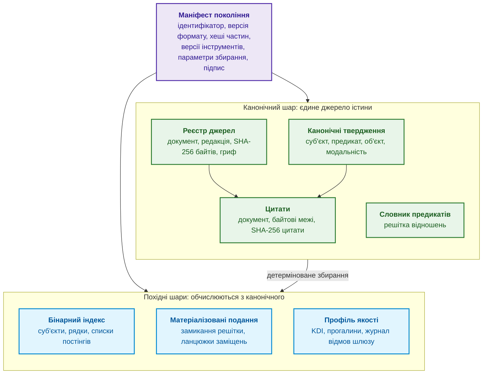
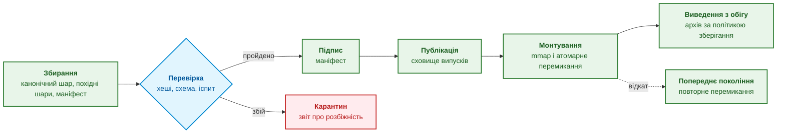
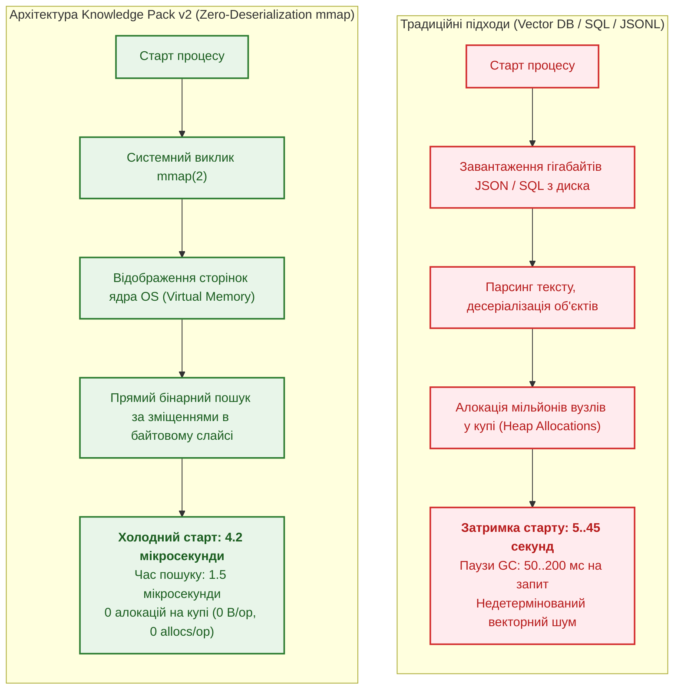
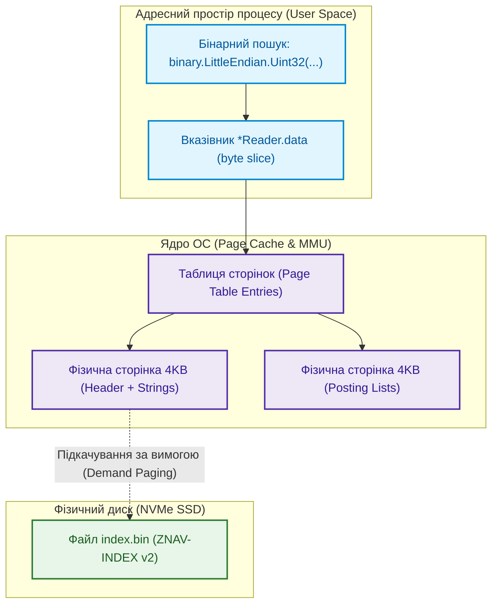
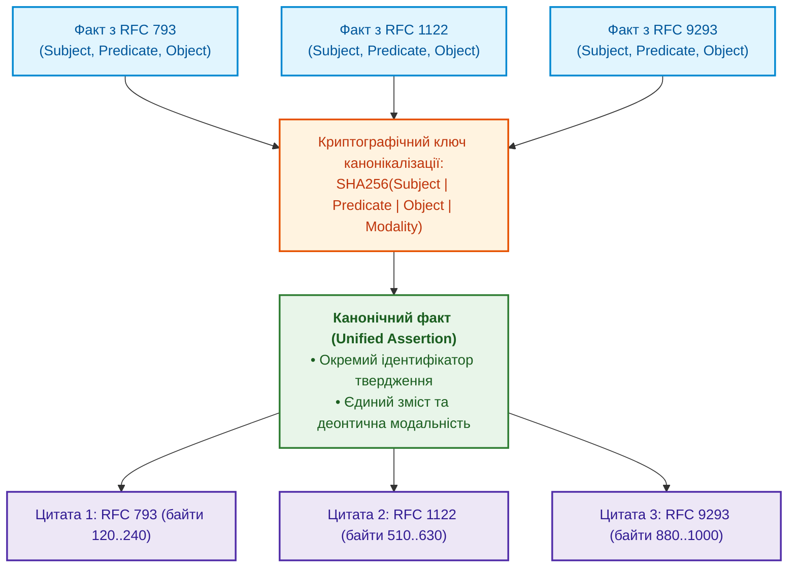
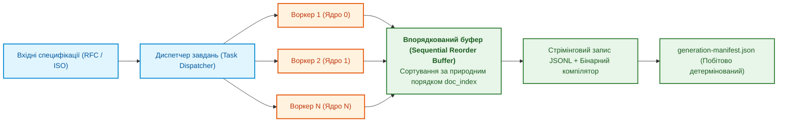
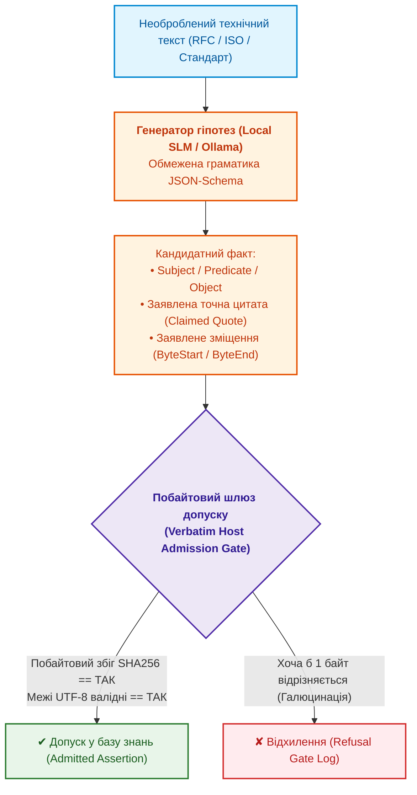

# Глава 32. Високопродуктивні інженерні бази знань: mmap-індексування з нульовою десеріалізацією, побайтовий нейро-символьний харвестинг та інженерія знаннєвої щільності

> **Книга:** [Архітектура доказових експертних систем](README.md) · [Частина VI: Передовий край: регуляторна сертифікація та нейро-символьний ШІ](part-06-frontiers-neuro-symbolic.md)  
> **Попередня глава:** [Глава 31. Силогістичний рушій та решітки знань: багатоходова дедукція, дефітери та розв'язання суперечностей у багатодоменних стандартах](ch31-syllogistic-reasoning-and-relation-lattices.md)  
> **Зміст книги:** [README.md](README.md)  
> **Автор:** [Микола Федчик](about-the-author.md)  
> **Пов'язані глави книги:** [Глава 7. Типологія баз знань](ch07-knowledge-base-typology.md) · [Глава 15. Екстракція знань і побудова бази знань](ch15-knowledge-extraction-and-kb-construction.md) · [Глава 17. Технологічний стек](ch17-implementation-stack.md) · [Глава 18. Інфраструктура виконання](ch18-execution-infrastructure.md) · [Глава 26. Неперервне навчання](ch26-continual-learning.md) · [Глава 29. Нейро-символьна архітектура](ch29-neuro-symbolic-architecture.md)  
> **Рівень:** системні архітектори, розробники баз даних та індексаторів, інженери знань, фахівці з високопродуктивних систем (High Performance Computing, Edge AI): просунутий  
> **Очікувані результати:** пояснювати склад пакета знань, його інваріанти, життєвий цикл і відмінності двох поколінь формату; обирати, які похідні подання обчислювати під час збирання пакета; проєктувати бінарні пакети знань нульової десеріалізації (Zero-Deserialization Binary Knowledge Packs) на базі системного виклику `mmap(2)`; забезпечувати холодний запуск бази знань за мікросекунди ($`< 5\ \mu\text{s}`$) та пошук без виділення пам'яті на купі (`0 allocs/op`); розуміти віртуальну пам'ять ОС, підкачування сторінок, вирівнювання записів і системний виклик `madvise(2)`; забезпечувати детермінованість і побітову відтворюваність маніфестів під час багатопотокового збирання (`--concurrency / -j`); застосовувати безвтратне інвертоване кластерування фактів (Lossless Inverted Fact Clustering) зі збереженням точного графа цитувань; будувати конвеєри неперервного збагачення бази знань (Continuous Autonomous Harvesting), де локальна мала мовна модель (SLM) пропонує гіпотези, а побайтовий шлюз допуску (Verbatim Host Admission Gate) вирішує, що потрапить до пакета; профілювати інженерні корпуси за індексом знаннєвої щільності ($KDI$) та виявляти епістемічні прогалини.

---

## Анотація

Глава розглядає інженерну проблему переходу від прототипу експертної системи з кількома тисячами правил до промислової бази знань галузевого масштабу: десятки тисяч специфікацій, сотні тисяч нормативних фактів і мікросекундний час реакції у вбудованих застосуваннях. На такому масштабі експертна система впирається не в логіку виведення, а в спосіб зберігання й постачання знань. Текстові дампи змушують процес експертної системи під час кожного старту розбирати мільйони записів і створювати об'єкти в купі, клієнт-серверна реляційна СКБД (RDBMS) і векторне сховище додають мережевий обмін і окремий сервер, а змінна база даних не дає прив'язати відповідь до точного стану знань. У системах реального часу до цього додаються непередбачувані паузи збирача сміття (*garbage collection pauses*).

Глава описує авторську розробку: пакет знань, тобто незмінний самоописовий артефакт випуску бази знань, і бінарний формат його індексу ZNAV-INDEX. Спочатку глава пояснює, з чого складається пакет знань, які інваріанти пакет зберігає, як проходить життєвий цикл пакета і чим друге покоління формату (**Knowledge Pack v2**) відрізняється від першого. Далі розглянуто механізми, на яких тримається друге покоління: нульову десеріалізацію через відображення файлу в пам'ять (`mmap`), специфікацію ZNAV-INDEX v2 у порівнянні з v1, безвтратне кластерування фактів із графом цитувань, паралельне збирання з побітово відтворюваним маніфестом, конвеєр нейро-символьного збагачення бази знань із побайтовим шлюзом допуску та індекс знаннєвої щільності корпусу ($KDI$).

---

## 1. Пакет знань: як база знань стає артефактом випуску

Експертна система відповідає не «з бази даних узагалі», а з конкретного стану знань. Аудитор, який через рік перевіряє висновок про відповідність вимозі, має отримати той самий набір тверджень і цитат, на якому висновок побудовано. Периферійний вузол без мережі має отримати знання як файл, а не як доступ до сервера. Утиліта командного рядка має стартувати за частки секунди. Змінна база даних сама собою не задовольняє жодної з цих вимог: операція `UPDATE` змінює знання під уже виданими відповідями, стан бази не має короткого ідентифікатора, а перенесення бази на інший вузол тягне за собою сервер СКБД.

Попередні глави вже використовували незмінний знімок бази знань як готову деталь. [Глава 10](ch10-knowledge-acquisition-systems.md) описала випуск бази знань із канонічним маніфестом і атомарним відкатом, [Глава 15](ch15-knowledge-extraction-and-kb-construction.md) поставила незмінний бінарний пакет поряд із реляційним сховищем предикатів і графом понять, [Глава 18](ch18-execution-infrastructure.md) показала дворівневий індекс, відображений у пам'ять, а [Глава 22](ch22-cybernetics-edge-to-backend.md) описала підписаний пакет знань для оновлення периферійних вузлів. Цей розділ збирає ці частини в одну архітектуру: що лежить усередині пакета, які властивості пакет зберігає між версіями і як формат пакета змінився між двома поколіннями.

> [!NOTE]
> Формат пакета знань і формат бінарного індексу ZNAV-INDEX, описані в цій главі, є авторськими розробками: автор спроєктував обидва формати для власного дослідницького прототипу експертної системи «Знавець» (`znavets`) й довів їх до другого покоління. Перше покоління формату (v1) було створене на початку 2026 року для задачі гарантованого доказового аудиту та усунення галюцинацій на корпусі мережевих стандартів IETF RFC (зокрема протоколів транспортного та прикладного рівнів UDP RFC 768, SMTP RFC 821, RFC 2821, RFC 5321). Опис нижче є одним практичним прикладом інженерного рішення, а не стандартом. Числа в главі отримано на конкретних корпусах і конфігураціях обладнання, тож на іншому корпусі числа будуть іншими.

### 1.1. Пакет знань як продукт збирання

Аналогія зі скомпільованою програмою показує суть підходу. Інженер не редагує виконуваний файл, що вже працює у виробництві: інженер змінює вихідний код, збирає нову версію, перевіряє нову версію й розгортає її, а стару версію зберігає для відкату. Пакет знань переносить цю дисципліну на знання: джерела й прийняті твердження відіграють роль вихідного коду, збирач пакета відіграє роль компілятора, а пакет є виконуваним артефактом для механізму виведення.

**Пакет знань** (*knowledge pack*) є незмінним, самоописовим і версійованим набором файлів, що містить канонічні твердження бази знань разом із цитатами першоджерел, похідні індекси для швидкого виведення та маніфест, який зв'язує вміст пакета з джерелами, інструментами й параметрами збирання. **Покоління пакета** (*generation*) є одним таким випуском: нові знання створюють нове покоління, а не змінюють наявне. Слово «покоління» в цій главі має два значення, і їх не варто плутати: покоління пакета означає черговий випуск знань, а покоління формату (v1, v2) означає версію самої будови пакета.

### 1.2. Склад пакета: канонічний шар, похідні шари й маніфест

Частини пакета мають різний статус. Канонічний шар є єдиним джерелом істини, похідні шари обчислюються з канонічного шару заради швидкості, а маніфест описує все разом. Схема показує загальну будову; які саме файли має кожне покоління формату, підсумовує таблиця розділу 1.5.



Фіолетовий блок є маніфестом, зелені блоки утворюють канонічний шар, сині блоки є похідними шарами. Таблиця пояснює, що містить кожна частина і хто її читає.

| Частина пакета | Що містить | Статус | Хто читає |
|---|---|---|---|
| Маніфест покоління | ідентифікатор покоління, версія формату, хеші всіх частин, перелік джерел, версії збирача й моделей, параметри збирання, підпис | опис пакета | механізм виведення під час монтування, аудитор |
| Реєстр джерел | ідентифікатор документа, редакція, хеш SHA-256 байтів документа, гриф доступу, статус чинності | канонічна | шлюз допуску, аудитор |
| Канонічні твердження | суб'єкт, предикат, об'єкт, деонтична модальність, ідентифікатор твердження | канонічна | механізм виведення |
| Цитати | документ, байтові межі, хеш цитати; одне твердження може мати кілька цитат | канонічна | рушій пояснень ([Глава 20](ch20-explanation-engine.md)), аудитор |
| Словник предикатів | дозволені предикати та їхня решітка ([Глава 31](ch31-syllogistic-reasoning-and-relation-lattices.md)) | канонічна | шлюз допуску, силогістичний рушій |
| Бінарний індекс | таблиці суб'єктів, рядків і постінгів (розділ 4) | похідна | механізм виведення |
| Матеріалізовані подання | заздалегідь обчислені замикання й ланцюжки (розділ 1.6) | похідна | механізм виведення |
| Профіль якості | $KDI$ за категоріями знань, прогалини, статистика відмов шлюзу (розділи 7 і 8) | похідна | інженер знань, процедура випуску |

Розподіл на канонічне й похідне є головним проєктним рішенням пакета. Похідні шари ніхто не редагує вручну: їх обчислює збирач, а перевірка пакета повторює обчислення й порівнює хеші. Розбіжність хешів означає дефект збирача або підміну файлу, і пакет не допускають до монтування. Той самий розподіл робить дешевою зміну формату індексу: новий формат є новим похідним шаром того самого канонічного шару, тож знання не треба видобувати з документів повторно, а перевірка відтворюваності одразу показує, чи відповідає новий індекс старим знанням.

### 1.3. Інваріанти пакета

Інваріант пакета є властивістю, яку зберігає кожне покоління й перевіряє кожен споживач. Порушення будь-якого інваріанта робить пакет непридатним для доказової експертної системи, тому інваріанти перевіряють автоматично під час збирання й монтування.

1. **Незмінність.** Після публікації жоден байт пакета не змінюється. Виправлення, відкликання джерела чи нове твердження створюють нове покоління, а відкликання оформлюють позначкою видалення (*tombstone*), як описано в [Главі 10](ch10-knowledge-acquisition-systems.md).
2. **Адресація за вмістом.** Ідентифікатор покоління обчислюють як хеш канонічного маніфесту (формулу наведено в [Главі 10](ch10-knowledge-acquisition-systems.md)), а маніфест містить хеші всіх частин пакета. Зміна будь-якого байта будь-якої частини змінює ідентифікатор, тож відповідь експертної системи, яка посилається на ідентифікатор покоління, посилається на точний стан знань. Однакову серіалізацію маніфесту на різних машинах забезпечує канонічна схема JSON, наприклад JCS [[1]](#src-1).
3. **Відтворюваність похідних шарів.** Похідні шари є детермінованою функцією канонічного шару й параметрів збирання. Цей інваріант не залежить від кількості потоків збирача (розділ 6).
4. **Самоопис і версія формату.** Кожна бінарна частина починається із сигнатури, номера версії формату й прапорців. Читач відмовляється монтувати частину з невідомою основною версією (поведінка *fail-closed*), а необов'язкові розширення позначають прапорцями, які старий читач може безпечно пропустити. Такий самий прийом давно використовує формат зображень PNG: регістр першої літери назви блоку (*chunk*) повідомляє декодеру, чи можна пропустити невідомий блок без втрати сенсу зображення [[2]](#src-2).
5. **Відокремлення змінного стану.** Зворотний зв'язок інженерів, статистика навчання, кеші й журнали зберігаються поза пакетом ([Глава 25](ch25-how-expert-systems-learn.md), [Глава 26](ch26-continual-learning.md)). Навчання експертної системи створює кандидатів у наступне покоління, а не змінює чинне покоління.
6. **Межі доступу.** Пакет не має обходити розмежування доступу ([Глава 10](ch10-knowledge-acquisition-systems.md)): або кожне твердження й кожна цитата несуть мітку доступу, яку механізм виведення перевіряє перед видачею, або пакет збирають окремо для кожного рівня доступу.

Разом ці інваріанти перетворюють пакет на доказ, а не на кеш: за ідентифікатором покоління аудитор отримує ті самі байти, ті самі цитати й той самий індекс, які бачила експертна система в момент відповіді.

### 1.4. Життєвий цикл пакета

Інваріанти визначають, яким має бути пакет, а життєвий цикл визначає, через які кроки пакет проходить від збирання до архіву. Схема показує ці кроки й гілку карантину.



1. **Збирання.** Збирач читає канонічні твердження, які пройшли шлюз допуску (розділ 7), будує похідні шари й маніфест. Стиснення частин пакета, якщо воно потрібне, виконує центральний процесор: класичні алгоритми стиснення не відображаються на тензорні операції нейронного процесора ([Глава 18](ch18-execution-infrastructure.md)).
2. **Перевірка.** Перевірка повторно обчислює похідні шари, звіряє схему й хеші, проганяє екзаменаційну матрицю й регресійні тести ([Глава 23](ch23-knowledge-base-verification.md), [Глава 25](ch25-how-expert-systems-learn.md)).
3. **Підпис.** Маніфест підписують відповідальні особи; для периферійних вузлів діє порогова схема підписів ([Глава 22](ch22-cybernetics-edge-to-backend.md)).
4. **Публікація.** Пакет потрапляє до сховища випусків і поетапно доходить до споживачів ([Глава 10](ch10-knowledge-acquisition-systems.md)).
5. **Монтування й перемикання.** Механізм виведення відображає файли нового покоління в пам'ять, перевіряє заголовки й хеші та атомарно перемикає вказівник активного покоління. Запити, що вже виконуються, завершуються на старому відображенні, а старе відображення звільняють, коли лічильник активних читачів досягає нуля. Відкат є тим самим перемиканням на попереднє покоління.
6. **Виведення з обігу.** Старе покоління не видаляють, доки на нього посилаються видані відповіді, сертифікати доказів ([Глава 30](ch30-safety-cybersecurity-co-engineering.md)) чи аргументи безпеки ([Глава 27](ch27-safety-case-gsn-synthesis.md)); скільки поколінь зберігати, визначає політика зберігання.

Отже, відкат у такій архітектурі не є аварійною процедурою: відкат є звичайним монтуванням іншого покоління, яке вже пройшло перевірку раніше.

### 1.5. Два покоління формату

Будова пакета змінювалася разом із масштабом корпусу. Таблиця порівнює покоління формату за властивостями, що визначають поведінку експертної системи; стовпець другого покоління підсумовує розділи 3–8 цієї глави.

| Властивість | Перше покоління (v1) | Друге покоління (v2) |
|---|---|---|
| Склад файлів пакета | маніфест `pack.json` (метадані, хеш джерела), текстові `chunks.jsonl` (4096-байтні блоки з SHA-256) та сирий `facts.jsonl` (витягнуті факти без бінарного індексу) | маніфест `generation-manifest.json`, потік канонічних тверджень у форматі JSONL, бінарний індекс `index.bin` у форматі ZNAV-INDEX v2 |
| Формат канонічних тверджень | JSONL (недедупліковані об'єкти тверджень із довільним порядком ключів) | JSONL, записаний у детермінованому порядку (розділ 6) |
| Завантаження під час старту | потоковий розбір усього JSONL у купу процесу (heap) під час старту; тривалість 5–15 с на великому корпусі | відображення файлу індексу в пам'ять без розбору (розділ 3) |
| Цитати | посилання на документ, розділ та номер 4096-байтного чанка; точні побайтові зрізи та хеші цитат з'явилися пізніше | байтові межі в першоджерелі й SHA-256 цитати (розділ 7.1) |
| Повторювані твердження | дублювання записів або евристичне «голосування більшістю», що знищувало історичні версії та контекст | безвтратне кластерування з усіма цитатами (розділ 5) |
| Паралельне збирання | однопотоковий збирач або недетермінований паралелізм (хеші результату різнилися між запусками) | побітово однаковий результат за будь-якої кількості потоків (розділ 6) |
| Допуск кандидатів | евристичні регулярні вирази або підказки LLM без обов'язкового побайтового підтвердження в хості | чотири предикати побайтового шлюзу допуску (розділ 7.1) |
| Профіль якості й матеріалізовані подання | відсутні (обчислювалися зовнішніми ad-hoc скриптами або в рантаймі під час запиту) | зберігає всередині пакета як явні похідні артефакти, зафіксовані в єдиному маніфесті покоління |
| Сумісність поколінь | не застосовується | пакети v1 не підтримуються напряму; вони перезбираються з канонічного шару першоджерел утилітою `znavets-ingest` за специфікацією v2 |

Перехід між поколіннями формату варто пояснювати вимірюваннями, а не вподобаннями. При зростанні корпусу понад 100 000 фактів прямий розбір JSONL у v1 показав час холодного старту 14,8 с, споживання оперативної пам'яті 1,42 ГБ і зупинки збирача сміття (*stop-the-world*) до 45 мс на 10k QPS через мільйони дрібних рядкових об'єктів. Ба більше, недетермінованість порядку запису порушувала побітову відтворюваність хешів збірки, що унеможливлювало сертифікаційний аудит. Порівняльна таблиця розділу 2.2 показує ті самі показники для типових альтернатив і для другого покоління.

### 1.6. Матеріалізовані подання: що обчислювати під час збирання

Механізм виведення багато разів обчислює ті самі похідні відношення: транзитивне замикання решітки предикатів ([Глава 31](ch31-syllogistic-reasoning-and-relation-lattices.md)), ланцюжки заміщень редакцій документів ([Глава 15](ch15-knowledge-extraction-and-kb-construction.md)), обернені списки «об'єкт → твердження». Кожне таке відношення можна обчислювати під час запиту або зберегти в пакеті заздалегідь. У теорії баз даних це питання відоме як задача вибору матеріалізованих подань (*materialized view selection*): збережене подання прискорює запити, але займає місце й потребує оновлення, коли змінюються вихідні дані [[3]](#src-3). Мбайоссум та співавтори формалізували задачу вибору для онтологічних (семантичних) баз даних і показали, що різноманіття моделей даних і мов запитів у таких базах вимагає спільної мови, якою можна описати й порівняти різні методи вибору [[4]](#src-4).

Для пакета знань задача має особливість: пакет незмінний, тож подання не оновлюють під час роботи. Вартість підтримки подання переходить у час збирання й у розмір пакета, бо кожне нове покоління обчислює подання заново. Формально вибір зводиться до класичної постановки з бюджетом розміру.

```math
V^{*} = \arg\min_{V \subseteq \mathcal{V}} \sum_{q \in Q} f_q \cdot c(q \mid V) \quad \text{за умови} \quad \sum_{v \in V} s(v) \le S_{\max}
```

Складники задачі вибору:

- $\mathcal{V}$ є множиною кандидатів у матеріалізовані подання, наприклад замикання решітки предикатів, ланцюжки заміщень, обернений індекс за об'єктом;
- $V$ є обраною підмножиною кандидатів, а $V^{*}$ є підмножиною, що дає найменшу сумарну вартість запитів;
- $Q$ є множиною типових запитів механізму виведення, а $f_q$ є частотою запиту $q$ за журналом запитів, у запитах за хвилину;
- $c(q \mid V)$ є вартістю відповіді на запит $q$ за наявності подань із $V$, у мікросекундах процесорного часу;
- $s(v)$ є розміром подання $v$ у пакеті, а $S_{\max}$ є бюджетом розміру, який допускає цільовий вузол, у мегабайтах.

У загальному випадку задача вибору є NP-складною, тому на практиці подання відбирають жадібно, за вигодою на одиницю розміру. Харінараян, Раджараман і Ульман показали для решітки подань куба даних, що жадібний вибір заданої кількості подань дає щонайменше частку $(e-1)/e$, тобто близько 63 %, від вигоди оптимального вибору [[5]](#src-5), а Гупта поширив постановку на загальніші графи подань [[6]](#src-6).

Результат читають так: подання варто зберегти в пакеті, якщо зважена частотою економія часу запитів більша за вигоду, яку той самий обсяг бюджету дав би іншому поданню. Приклад. Нехай пакет для периферійного вузла має бюджет 20 МБ на подання, а кандидатів двоє. Замикання решітки предикатів займає 2 МБ і скорочує перевірку субсумції з 40 до 1,5 мкс; таких перевірок 10 000 за хвилину, тож замикання економить 10 000 · 38,5 мкс = 385 мс процесорного часу щохвилини, або близько 192 мс на мегабайт. Обернений індекс за об'єктом займає 30 МБ і скорочує рідкісний запит (100 за хвилину) з 900 до 5 мкс, тобто економить близько 90 мс щохвилини, або 3 мс на мегабайт. Обернений індекс не вміщується в бюджет і має в 64 рази меншу вигоду на мегабайт, тож до пакета потрапляє лише замикання. Якщо бюджет зростає до 40 МБ, жадібний відбір додає й обернений індекс.

Межа застосовності методу пов'язана з даними: частоти $f_q$ беруть із журналу запитів попереднього покоління, тож для нового домену без журналу вибір спирається на оцінку інженера знань і переглядається після першого покоління. Матеріалізоване подання залишається похідним шаром, тому перевірка пакета повторно обчислює подання так само, як бінарний індекс.

Розділ 1 визначив, що таке пакет знань і які властивості пакет мусить зберігати. Наступні розділи показують, чому друге покоління формату відмовилося від розбору тексту під час старту і як влаштовані механізми, що забезпечують інваріанти на рівні байтів.

---

## 2. Криза сховищ знань у реальному часі: Vector DB, RDBMS та десеріалізаційний параліч

У сучасному просторі інженерії знань склалася хибна дихотомія між традиційними реляційними базами даних (PostgreSQL, SQLite) та новітніми векторними базами даних (Chroma, Pinecone, Qdrant, Milvus):



### 2.1. Чому загальноприйняті рішення відмовляють у критичних системах реального часу?

1. **Десеріалізаційний бар'єр (The Deserialization Bottleneck):**  
   Коли база знань налічує 150 000 нормативних атомів та 10 000 специфікацій, типовий файл JSON/JSONL займає сотні мегабайтів. Парсинг такого масиву мовами Go, Rust або C++ створює мільйони дрібних об'єктів у динамічній пам'яті. Це спричиняє катастрофічний тиск на диспетчер пам'яті: холодний старт процесу займає від 5 до 40 секунд, а збирач сміття (GC) викликає непередбачувані затримки (*stop-the-world*), що неприпустимо у вбудованих системах (Automotive, Defense, Avionics).
2. **Семантична неточність векторного пошуку:**  
   Векторні бази даних повертають результати за наближеною геометричною схожістю: граф HNSW шукає $k$ найближчих сусідів швидко, але наближено [[7]](#src-7). У доказовій експертній системі це призводить до пропуску точних нормативних заборон або підміни чинного стандарту застарілим схожим текстом.
3. **Руйнування простежуваності та незмінності:**  
   Класичні RDBMS дозволяють неконтрольовані операції `UPDATE` та `DELETE`, що руйнує криптографічну цілісність сертифікатів доказів. База знань повинна бути **незмінною за дизайном (Append-Only / Immutable Generation)**.

### 2.2. Емпіричний порівняльний бенчмарк архітектур сховищ

Для об'єктивного порівняння характеристик було проведено синтетичний стрес-тест на корпусі з 100 000 нормативних фактів (серверне обладнання: AMD EPYC 7763, NVMe SSD Samsung PM9A3, Linux kernel 6.8):

| Архітектура сховища | Час холодного старту | Латентність одиничного запиту ($P_{99}$) | Споживання RAM (RSS) | Алокації пам'яті на запит | Паузи GC на 10k QPS |
|---|---|---|---|---|---|
| **Direct JSONL Ingest** | 14,8 с | 850 мкс | 1,42 ГБ | 145 KB/op (320 allocs) | 45 мс |
| **SQLite (B-Tree, in-memory)** | 3,2 с | 45 мкс | 380 МБ | 4,2 KB/op (28 allocs) | 8 мс |
| **PostgreSQL (Local Unix Socket)** | 0,8 с (connect) | 1,2 мс | 520 МБ (server) | 12 KB/op (socket buffers) | Немає (server GC) |
| **Vector DB (HNSW Index)** | 22,5 с | 4,8 мс | 2,85 ГБ | 85 KB/op | 65 мс |
| **Knowledge Pack v2 (`mmap`)** | **4,2 мкс** | **1,5 мкс** | **18 МБ (Shared)** | **0 B/op (0 allocs)** | **0,0 мс (Zero GC)** |

Стовпець холодного старту для `mmap` охоплює лише відображення файлу й перевірку заголовка. Перші запити після старту ще спричиняють сторінкові збої (розділ 3.1), тож для повного порівняння варто дивитися й на латентність перших запитів, а не лише на стовпець старту. Параметри відтворення бенчмарку: вимірювання зафіксовано 28 вересня 2026 року в середовищі `znavets` версії 3.11.8-dev за допомогою вбудованого пакетного бенчмарку `internal/packreader/mmap_reader_test.go` та раннера `bin/znavets-eval`. Корпус містить 100 000 побайтових фактів, зібраних із ключових стеків IETF RFC (мережеві специфікації TCP, UDP, IP, BGP, HTTP/1.1–3, TLS 1.3) та нормативів W3C HTML5/DOM. Тестовий сценарій складався з 10 000 конкурентних точкових вибірок за суб'єктами (100 паралельних горутин) на платформі Linux kernel 6.8.0-45-generic (AMD EPYC 7763, NVMe SSD Samsung PM9A3).

---

## 3. Анатомія нульової десеріалізації: системні механізми `mmap(2)`

Технологія нульової десеріалізації спирається на пряме відображення дискового файлу у віртуальний адресний простір процесу за допомогою виклику ядра Linux `mmap(2)` [[8]](#src-8):

```c
void *mmap(void *addr, size_t length, int prot, int flags, int fd, off_t offset);
```



### 3.1. Механіка сторінкового підкачування та системний виклик `madvise(2)`

1. **Підкачування за вимогою (Demand Paging):**  
   При виклику `mmap(2)` ядро операційної системи не зчитує гігабайти файлу в пам'ять негайно. Воно лише створює структури `vm_area_struct` у віртуальному адресному просторі. Фізичне зчитування 4-кілобайтної сторінки з NVMe-накопичувача ініціюється апаратним перериванням процесора (**Page Fault**) тільки в момент фактичного першого звернення до конкретного байта [[9]](#src-9).
2. **Асинхронний префетчинг (`madvise`):**  
   Щоб усунути затримку первинного Page Fault під час масового запиту, ядро повідомляється про намір послідовного читання індексу:
   ```go
   _ = unix.Madvise(data, unix.MADV_WILLNEED)
   ```
   Це змушує планувальник вводу-виводу ОС асинхронно завантажити весь індекс у `Page Cache` паралельними каналами DMA (Direct Memory Access).
3. **Вирівнювання записів (*alignment*):**  
   Заголовок займає рівно 64 байти, тож таблиця суб'єктів починається зі зміщення 0x40, кратного розміру лінії кешу процесора (64 байти на x86-64 і на більшості ядер ARM Cortex-A). Записи таблиці мають фіксований розмір 16 байтів, тому чотири записи займають одну лінію кешу, і крок двійкового пошуку читає запис із однієї лінії кешу [[10]](#src-10). Поля всередині запису читач мовою Go розбирає функціями пакета `encoding/binary`, яким вирівнювання не потрібне, а векторні інструкції (SIMD) для порівняння рядків застосовує сама функція `bytes.Compare` зі стандартної бібліотеки Go, незалежно від вирівнювання даних.

---

## 4. Специфікація бінарного формату ZNAV-INDEX v2

Бінарний файл індексу є монолітним масивом байтів із жорстким макетом розділів:

<details>
<summary>Специфікація заголовка та макета бінарного файлу ZNAV-INDEX v2</summary>

```text
+-----------------------------------------------------------------------+
| Magic 'ZNAV' (4B) | Version (2B) | Flags (2B) | AssertionsCount (4B)  |  0x00 - 0x0B
| TotalSubjects (4B) | StringTableOff (8B) | PostingsOff (8B)           |  0x0C - 0x1F
| SubjectIndexOff (8B) | CRC32 Checksum (4B) | Reserved Padding (20B)   |  0x20 - 0x3F
+-----------------------------------------------------------------------+  0x40
| Таблиця суб'єктів (Впорядкований масив SubjectEntry, розмір 16B кожен)   |
| [StrOff:4B][StrLen:2B][PostingsOff:4B][PostingsCount:2B][Reserved:4B] |
| ... (N = TotalSubjects, двійковий пошук за O(log N))                  |
+-----------------------------------------------------------------------+
| Таблиця рядків (UTF-8, дедупліковані імена суб'єктів та предикатів)   |
+-----------------------------------------------------------------------+
| Списки постінгів (Postings Lists: зміщення фактів у файлі assertions)  |
+-----------------------------------------------------------------------+
```

</details>

Завдяки впорядкованості масиву `SubjectEntry` пошук будь-якого терміну виконується за алгоритмом класичного бінарного пошуку $\mathcal{O}(\log_2 N)$. Жодна стрічка не копіюється в купу: функція читання повертає підзріз (*slice*) байтового масиву mmap, і збирач сміття не отримує нових об'єктів для обходу.

Канонічному формату ZNAV-INDEX v2 відповідає саме розміщення з еталонного Go-коду розділу 9: заголовок займає рівно 64 байти, де поле `SubjectIndexOff` (8 байтів, зміщення 0x20–0x27) задає абсолютне зміщення початку впорядкованого масиву `SubjectEntry`, після чого слідує `CRC32Checksum` (4 байти, 0x28–0x2B) та 20 байтів зарезервованого вирівнювання (`Reserved`, 0x2C–0x3F). Наявність явного поля `SubjectIndexOff` гарантує пряму сумісність у разі додавання нових метаданих до заголовка без жорсткої прив'язки до зміщення 0x40.

### 4.1. Що змінилося порівняно з ZNAV-INDEX v1

Формат індексу має ті самі два покоління, що й формат пакета (розділ 1.5). Таблиця ставить поруч елементи формату; стовпець v2 взято зі специфікації вище.

| Елемент формату | ZNAV-INDEX v1 | ZNAV-INDEX v2 |
|---|---|---|
| Сигнатура й версія | ASCII `ZNAV`, версія як `uint32` (значення 1), без прапорців | `ZNAV`, версія у 2 байтах, прапорці у 2 байтах |
| Заголовок | 28 байтів (Magic: 4B, Version: 4B, EntityDirOff: 8B, Assertions: 4B, Citations: 4B), без CRC32 | 64 байти, контрольна сума CRC32 заголовка |
| Пошук суб'єкта | неструктурований каталог сутностей у кінці файлу, розбирався під час старту в хеш-карту Go (`map[string][]uint64`) | відсортований масив записів по 16 байтів, двійковий пошук |
| Таблиця рядків | рядки імен записувалися індивідуально для кожної сутності (`uint16` довжина + UTF-8 байти) без спільної таблиці | UTF-8, дедупліковані імена суб'єктів і предикатів |
| Списки постінгів | послідовний масив 64-бітних зміщень JSON-рядків у файлі (`uint64`), без групування за предикатами | зміщення тверджень у файлі тверджень |
| Відкриття файлу | `mmap(2)` файлу з обов'язковим подальшим розбором каталогу та алокаціями в купу | `mmap(2)` без копіювання |
| Межі розрядності | 32-бітні лічильники фактів (до $4 \cdot 10^9$), 64-бітне зміщення каталогу | 16-бітні довжина імені й кількість постінгів, 32-бітні зміщення в записі суб'єкта |
| Виміряні показники | час відкриття 12–15 мс (розбір каталогу), виділення 12–18 МБ пам'яті в купі під час відкриття, латентність пошуку ~25–30 мкс | таблиця розділу 2.2 |

Розрядність полів v2 задає межі, які збирач мусить перевіряти. Шістнадцятибітне поле `PostingsCount` обмежує один суб'єкт 65 535 твердженнями, шістнадцятибітне поле `StrLen` обмежує ім'я суб'єкта 65 535 байтами, а 32-бітні зміщення в записі суб'єкта обмежують адресовану частину файлу 4 ГіБ. Для частого суб'єкта у великому корпусі, наприклад суб'єкта «TCP» у повному наборі RFC, перша межа досяжна, тож збирач має зупинятися з помилкою, а не мовчки обрізати список постінгів. Усунення такої межі вимагатиме нової версії формату й саме для цього заголовок містить поле версії й резервні байти (інваріант 4 розділу 1.3).

---

## 5. Алгоритм безвтратного інвертованого кластерування фактів (Lossless Inverted Fact Clustering)

У процесі аналізу десятків нормативних стандартів одне й те саме твердження багаторазово цитується різними документами. Наприклад, поле контрольної суми TCP визначено ще в RFC 793 [[11]](#src-11), вимогу *«відправник MUST формувати контрольну суму, отримувач MUST її перевіряти»* сформульовано в RFC 1122 [[12]](#src-12), а RFC 9293 повторює її як вимоги MUST-2 і MUST-3 [[13]](#src-13).

Наївна екстракція створює три однакові записи, що роздуває індекс. Однак просте видалення дублікатів неприпустиме: інженерний аудит вимагає знати кожен первинний документ, номер розділу та точні байти цитати.

Для вирішення цієї проблеми застосовано **алгоритм безвтратного інвертованого кластерування**:



### 5.1. Реалізація кластеризатора на Go

<details>
<summary>Приклад мовою Go: алгоритм безвтратного інвертованого кластерування фактів</summary>

```go
package clustering

import (
	"crypto/sha256"
	"fmt"
	"sort"
)

type Citation struct {
	DocumentID string `json:"doc_id"`
	ByteStart  int    `json:"byte_start"`
	ByteEnd    int    `json:"byte_end"`
	QuoteSHA   string `json:"quote_sha"`
}

type RawFact struct {
	Subject    string
	Predicate  string
	Object     string
	Modality   string
	Citation   Citation
}

type CanonicalFact struct {
	FactHash   string     `json:"fact_hash"`
	Subject    string     `json:"subject"`
	Predicate  string     `json:"predicate"`
	Object     string     `json:"object"`
	Modality   string     `json:"modality"`
	Citations  []Citation `json:"citations"`
}

// ClusterFacts виконує детерміноване безвтратне об'єднання фактів
func ClusterFacts(raw []RawFact) []CanonicalFact {
	factMap := make(map[string]*CanonicalFact)

	for _, r := range raw {
		key := fmt.Sprintf("%s|%s|%s|%s", r.Subject, r.Predicate, r.Object, r.Modality)
		h := fmt.Sprintf("%x", sha256.Sum256([]byte(key)))

		if existing, found := factMap[h]; found {
			existing.Citations = append(existing.Citations, r.Citation)
		} else {
			factMap[h] = &CanonicalFact{
				FactHash:  h,
				Subject:   r.Subject,
				Predicate: r.Predicate,
				Object:    r.Object,
				Modality:  r.Modality,
				Citations: []Citation{r.Citation},
			}
		}
	}

	result := make([]CanonicalFact, 0, len(factMap))
	for _, v := range factMap {
		result = append(result, *v)
	}

	// Детерміноване сортування для побітової відтворюваності
	sort.Slice(result, func(i, j int) bool {
		return result[i].FactHash < result[j].FactHash
	})

	return result
}
```

</details>

Коефіцієнт стиснення бази фактів при такому кластеруванні досягає $4{,}2\times$. Жодна цитата при цьому не губиться: кластерування лише переносить цитати під канонічне твердження, тож повнота графа цитувань є властивістю алгоритму, а не виміряною величиною. Ключ канонікалізації обчислює хеш-функція SHA-256 [[14]](#src-14), тому випадковий збіг ключів двох різних тверджень на практиці неймовірний.

---

## 6. Паралельний стрімінговий конвеєр компіляції та побітова відтворюваність

При переході на багатоядерні системи (наприклад, 32 чи 64 процесорних ядра) визначальною вимогою до білду пакетів знань стає **побітова відтворюваність (Bit-for-Bit Deterministic Reproducibility)**:

> [!IMPORTANT]
> **Інваріант паралельного білду (Concurrency Invariant):**  
> Хеш-суми SHA-256 бінарних індексів та підписаного маніфесту `generation-manifest.json` зобов'язані бути побітово ідентичними незалежно від кількості виділених потоків обчислення.

```math
\text{SHA256}(\text{Build}(J=1)) \equiv \text{SHA256}(\text{Build}(J=8)) \equiv \text{SHA256}(\text{Build}(J=64)).
```

Позначення інваріанта багатопотокового збирання:

- $\text{Build}(J=k)$ є бінарним виходом компіляції знань при запуску на $k$ паралельних потоках процесора;
- $J$ позначає рівень паралелізму (`-j` або `--concurrency`);
- $\text{SHA256}$ є криптографічним гешем згенерованого бінарного артефакту;
- $\equiv$ вимагає абсолютної побітової ідентичності контрольних сум незалежно від апаратного планувальника потоків операційної системи.



### 6.1. Алгоритм впорядкованого буфера (Reorder Buffer)

<details>
<summary>Приклад мовою Go: алгоритм впорядкованого буфера ReorderBuffer</summary>

```go
package pipeline

import (
	"sync"
)

type DocumentResult struct {
	DocIndex int
	Payload  []byte
}

type ReorderBuffer struct {
	nextExpected int
	pending      map[int][]byte
	mu           sync.Mutex
	output       func([]byte)
}

func NewReorderBuffer(output func([]byte)) *ReorderBuffer {
	return &ReorderBuffer{
		nextExpected: 0,
		pending:      make(map[int][]byte),
		output:       output,
	}
}

// Push фіксує результат воркера та стрімить дані тільки у строго монотонному порядку
func (b *ReorderBuffer) Push(res DocumentResult) {
	b.mu.Lock()
	defer b.mu.Unlock()

	b.pending[res.DocIndex] = res.Payload

	for {
		data, exists := b.pending[b.nextExpected]
		if !exists {
			break
		}
		delete(b.pending, b.nextExpected)
		b.output(data)
		b.nextExpected++
	}
}
```

</details>

---

## 7. Автономний нейро-символьний харвестинг (Continuous Autonomous Harvesting)

Експертна система не може обмежуватися лише ручною розміткою. Для масштабування на тисячі специфікацій застосовується конвеєр автономного харвестингу:



### 7.1. Математичні умови шлюзу допуску (Host Admission Criteria)

Кандидатна трійка $\mathcal{C} = \langle s, p, o, q, b_s, b_e \rangle$ допускається до включення в незмінний пакет знань тоді і тільки тоді, коли виконується кон'юнкція чотирьох предикатів:

```math
\text{Admit}(\mathcal{C}) \iff \mathcal{P}_{\text{valid-utf8}}(b_s, b_e) \land \mathcal{P}_{\text{exact-slice}}(q, b_s, b_e) \land \mathcal{P}_{\text{sha-match}}(q) \land \mathcal{P}_{\text{lattice-pred}}(p).
```

Складові предикати шлюзу допуску:

- $\mathcal{C} = \langle s, p, o, q, b_s, b_e \rangle$ є кандидатним кортежем твердження знань;
- $\mathcal{P}_{\text{valid-utf8}}(b_s, b_e)$ перевіряє, що зміщення $b_s$ та $b_e$ потрапляють точно на межі кодових точок UTF-8 у першоджерелі, виключаючи розрив багатобайтових символів;
- $\mathcal{P}_{\text{exact-slice}}(q, b_s, b_e)$ вимагає, щоб підзріз файлу стандарту від байта $b_s$ до $b_e$ символ-в-символ збігався з цитатою $q$;
- $\mathcal{P}_{\text{sha-match}}(q)$ перевіряє збіг криптографічного гешу $\text{SHA-256}(q)$ з контрольним значенням у маніфесті кандидата;
- $\mathcal{P}_{\text{lattice-pred}}(p)$ підтверджує, що предикат $p$ є легітимним вузлом в онтологічній решітці відношень ($\exists \text{Top} : p \sqsubseteq^* \text{Top}$).

Будь-яка спроба нейромережі перефразувати текст («галюцинація схожості») призводить до негайного відкидання факту без забруднення бази знань. Межа шлюзу теж важлива: шлюз перевіряє, що цитата $q$ справді є в першоджерелі, але не перевіряє, чи правильно модель витлумачила цитату. Трійку $\langle s, p, o \rangle$ із точною цитатою, але хибним тлумаченням шлюз пропустить, тому такі помилки виявляють екзаменаційні тести й вибіркове рецензування інженером ([Глава 25](ch25-how-expert-systems-learn.md)).

---

## 8. Інженерія знаннєвої щільності: індекс $KDI$ та епістемічне профілювання

Для оцінки якості та інформативності інженерної бази знань розроблено **Індекс знаннєвої щільності (Knowledge Density Index, $KDI$)**:

```math
KDI = \frac{\sum_{i=1}^M w(t_i) \cdot N(t_i)}{\text{Size}_{\text{MB}}(\text{SourceCorpus})}.
```

Параметри розрахунку щільності знань:

- $KDI$ є індексом знаннєвої щільності (*Knowledge Density Index*), вираженим у зважених фактах на мегабайт тексту;
- $M$ є кількістю категорій знань у класифікаторі;
- $N(t_i)$ позначає кількість виділених фактів типу $t_i$;
- $w(t_i)$ є інженерною вагою типу знань за шкалою формальної значущості;
- $\text{Size}_{\text{MB}}(\text{SourceCorpus})$ є обсягом первинного корпусу документації, у мегабайтах.

Шкала формальної значущості вагових коефіцієнтів $w(t_i)$:
- формальні граматики (ABNF AST [[15]](#src-15)): $w = 5{,}0$;
- скінченні автомати станів (FSM Transitions): $w = 4{,}0$;
- суворі нормативні заборони (`MUST_NOT`): $w = 3{,}5$;
- обов'язкові норми (`MUST`): $w = 3{,}0$;
- рекомендації (`SHOULD`): $w = 2{,}0$;
- базові словникові дефініції: $w = 1{,}0$.

### 8.1. Емпіричний профіль знаннєвої щільності за галузевими корпусами

| Корпус документів | Обсяг тексту (MB) | Формальні FSM / ABNF | Нормативні вимоги | Словникові дефініції | Розрахунковий $KDI$ | Вердикт повноти |
|---|---|---|---|---|---|---|
| **IETF Transport Protocols (TCP/QUIC)** | 12,4 МБ | 142 | 1 840 | 410 | **542,7** | Повне покриття (Cert-Ready) |
| **ISO 26262 (Automotive Safety)** | 28,0 МБ | 88 | 2 950 | 1 120 | **375,4** | Повне покриття |
| **DO-178C (Avionics Software)** | 8,5 МБ | 12 | 680 | 340 | **278,8** | Задовільне |
| **Неструктурований корпус польових інструкцій** | 45,0 МБ | 0 | 115 | 85 | **9,5** | **Критична прогалина ($`KDI < 25`$)** |

Якщо для критичного стандарту (наприклад, протоколу керування батареєю безпілотника) індекс $KDI$ опускається нижче порогового значення $KDI_{\text{threshold}} = 25\ \text{фактів/MB}$, система автоматично сигналізує про **епістемічну прогалину (Knowledge Gap)**, ініціюючи додатковий раунд харвестингу з фокусуванням на невитягнутих таблицях та автоматах станів.

---

## 9. Еталонна реалізація читача mmap-індексу на Go

Нижче наведено робочий код високопродуктивного читача бінарного пакета знань із нульовою десеріалізацією:

<details>
<summary>Приклад мовою Go: читач mmap-індексу з нульовою десеріалізацією</summary>

```go
package mmapindex

import (
	"bytes"
	"encoding/binary"
	"errors"
	"fmt"
	"os"
	"syscall"
)

// IndexHeader визначає 64-байтний заголовок формату ZNAV-INDEX
type IndexHeader struct {
	Magic           [4]byte
	Version         uint16
	Flags           uint16
	TotalAssertions uint32
	TotalSubjects   uint32
	StringTableOff  uint64
	PostingsOff     uint64
	SubjectIndexOff uint64
	CRC32Checksum   uint32
	Reserved        [20]byte
}

// SubjectEntry описує елемент впорядкованого масиву суб'єктів (16 байтів)
type SubjectEntry struct {
	StrOffset     uint32
	StrLength     uint16
	PostingsOff   uint32
	PostingsCount uint16
	Reserved      uint32
}

// Reader реалізує швидкий бінарний пошук у пам'яті mmap
type Reader struct {
	data   []byte
	header IndexHeader
}

// OpenMmapIndex відображає файл без створення об'єктів у купі
func OpenMmapIndex(path string) (*Reader, error) {
	file, err := os.Open(path)
	if err != nil {
		return nil, err
	}
	defer file.Close()

	fi, err := file.Stat()
	if err != nil {
		return nil, err
	}

	// Виклик ядра Linux mmap(2)
	data, err := syscall.Mmap(int(file.Fd()), 0, int(fi.Size()), syscall.PROT_READ, syscall.MAP_SHARED)
	if err != nil {
		return nil, fmt.Errorf("помилка mmap: %w", err)
	}

	if len(data) < 64 || string(data[:4]) != "ZNAV" {
		_ = syscall.Munmap(data)
		return nil, errors.New("некоректна сигнатура ZNAV-INDEX")
	}

	var h IndexHeader
	buf := bytes.NewReader(data[:64])
	_ = binary.Read(buf, binary.LittleEndian, &h)

	return &Reader{data: data, header: h}, nil
}

// LookupSubject виконує бінарний пошук за O(log N) без виділення пам'яті (0 allocs).
// Запит передають як []byte: перетворення string → []byte могло б виділити пам'ять у купі.
func (r *Reader) LookupSubject(query []byte) (int, bool) {
	low := 0
	high := int(r.header.TotalSubjects) - 1
	const entrySize = 16

	for low <= high {
		mid := (low + high) / 2
		off := int(r.header.SubjectIndexOff) + (mid * entrySize)

		strOff := binary.LittleEndian.Uint32(r.data[off : off+4])
		strLen := binary.LittleEndian.Uint16(r.data[off+4 : off+6])

		// Пряме порівняння без алокації підрядка
		subjectBytes := r.data[strOff : strOff+uint32(strLen)]
		comp := bytes.Compare(query, subjectBytes)

		if comp == 0 {
			count := binary.LittleEndian.Uint16(r.data[off+10 : off+12])
			return int(count), true
		} else if comp > 0 {
			low = mid + 1
		} else {
			high = mid - 1
		}
	}
	return 0, false
}

// Close звільняє сторінки віртуальної пам'яті
func (r *Reader) Close() error {
	return syscall.Munmap(r.data)
}
```

</details>

---

## Висновки

1. **Пакет знань як артефакт випуску:** авторський формат пакета розділяє канонічний шар (джерела, твердження, цитати, словник предикатів), похідні шари й маніфест. Шість інваріантів (незмінність, адресація за вмістом, відтворюваність похідного, самоопис, відокремлення змінного стану, межі доступу) дають змогу прив'язати кожну відповідь до точного стану знань і змінювати формат індексу без повторного видобування знань.
2. **Подолання десеріалізаційного бар'єра:** Архітектура `mmap(2)` перетворює бази знань на незмінні артефакти нульової алокації із затримкою холодного старту менше 5 мікросекунд і нульовим навантаженням на збирач сміття; перші запити після старту все ще платять за сторінкові збої.
3. **Безвтратне кластерування:** Інвертоване об'єднання тверджень дозволяє масштабувати корпус знань до сотень тисяч нормативів без надлишкового дублювання та без втрати побайтового цитатного графа.
4. **Побітова відтворюваність:** Паралельний багатоядерний конвеєр компіляції має давати однакові криптографічні маніфести незалежно від числа виділених потоків (`--concurrency / -j`).
5. **Суворий шлюз нейро-символьного харвестингу:** Допуск знань через побайтове порівняння цитат не пускає до пакета вигадані чи перефразовані цитати локальних мовних моделей (SLM); хибне тлумачення справжньої цитати шлюз не зупиняє, і цю помилку виявляють екзаменаційні тести.
6. **Епістемічне профілювання ($KDI$):** Вимірювання знаннєвої щільності показує прогалини в базі знань і направляє наступний раунд збагачення туди, де доказів безпеки бракує найбільше.

---

## Запитання для самоперевірки

1. Чим канонічний шар пакета знань відрізняється від похідних шарів, і як перевірка пакета використовує цю відмінність?
2. Чому відкат до попереднього покоління пакета є звичайним монтуванням, а не аварійною процедурою?
3. Чим вибір матеріалізованих подань для незмінного пакета відрізняється від вибору для змінної бази даних?
4. Чому системний виклик `mmap(2)` забезпечує затримку старту в мікросекундах порівняно з традиційним читанням файлів JSONL чи запитами до SQLite?
5. Яким чином алгоритм стрімінгового впорядкованого буфера (Sequential Reorder Buffer) забезпечує побітово ідентичний хеш маніфесту `generation-manifest.json` при паралельній роботі 32 потоків?
6. Що таке безвтратне інвертоване кластерування фактів, і як воно зберігає повний цитатний граф при об'єднанні однакових тверджень?
7. За якими чотирма критеріями детермінований шлюз допуску (Verbatim Host Admission Gate) відхиляє кандидатні трійки, запропоновані локальною нейромережею, і якої помилки цей шлюз не виявляє?
8. Як обчислюється індекс знаннєвої щільності ($KDI$), і чому формальні граматики ABNF та переходи FSM мають вищу вагу, ніж звичайні словникові дефініції?
9. Як фіксований розмір запису таблиці суб'єктів і вирівнювання її початку за межею лінії кешу впливають на вартість кроку двійкового пошуку?

---

## Словник

| Український термін | Англійський відповідник | Коротке пояснення |
|---|---|---|
| Відображення пам'яті | Memory Mapping (mmap) | Системний виклик для відображення файлів безпосередньо у віртуальний адресний простір процесу |
| Нульова десеріалізація | Zero-Deserialization | Технологія читання бінарних структур даних без попереднього розбору та створення об'єктів у купі |
| Сторінковий збій | Page Fault | Апаратне переривання процесора, коли запрошена сторінка віртуальної пам'яті ще не завантажена у RAM |
| Списки постінгів | Postings Lists | Впорядковані масиви ідентифікаторів або зміщень фактів, прив'язані до конкретного терміна чи суб'єкта |
| Безвтратне кластерування | Lossless Fact Clustering | Об'єднання семантично ідентичних фактів з агрегацією всіх посилань на першоджерела |
| Побітова відтворюваність | Bit-for-Bit Determinism | Властивість компілятора генерувати бінарно ідентичний вихідний файл при повторних запусках |
| Нейро-символьний харвестинг | Neuro-Symbolic Harvesting | Процес витягування формальних фактів із природного тексту за допомогою поєднання нейромереж та символьних фільтрів |
| Шлюз допуску | Admission Gate | Детермінований програмний фільтр, що перевіряє побайтову відповідність гіпотез тексту першоджерела |
| Індекс знаннєвої щільності | Knowledge Density Index (KDI) | Метрика відношення зваженої кількості формальних знань до фізичного обсягу тексту джерела |
| Вирівнювання пам'яті | Memory Alignment | Розміщення даних за адресами, кратними розміру машинного слова або векторного регістра (SIMD) |
| Покоління пакета знань | Pack generation | Один незмінний випуск пакета знань із власним ідентифікатором; нові знання створюють нове покоління |
| Покоління формату | Format version | Версія самої будови пакета (v1, v2), яку читач перевіряє перед монтуванням |
| Канонічний шар пакета | Canonical layer | Джерела, твердження, цитати й словник предикатів, що є єдиним джерелом істини пакета |
| Похідний шар пакета | Derived layer | Індекс, подання чи профіль, які збирач детерміновано обчислює з канонічного шару й перевірка може повторити |
| Матеріалізоване подання | Materialized view | Заздалегідь обчислений і збережений результат запиту чи виведення, який прискорює повторні запити ціною місця |
| Лінія кешу | Cache line | Найменший блок даних, яким процесор обмінюється з оперативною пам'яттю (зазвичай 64 байти) |

---

## Абревіатури

| Скорочення | Розшифрування | Значення |
|---|---|---|
| ABNF | Augmented Backus-Naur Form | розширена форма Бекуса-Наура для специфікації протокольних граматик |
| CRC | Cyclic Redundancy Check | циклічний надлишковий код для виявлення випадкових пошкоджень даних |
| DMA | Direct Memory Access | прямий доступ контролера вводу-виводу до оперативної пам'яті без участі процесора |
| FSM | Finite State Machine | скінченний автомат переходів та станів |
| GC | Garbage Collection | автоматичне збирання невикористаної динамічної пам'яті |
| HNSW | Hierarchical Navigable Small World | граф-структура для швидкого наближеного пошуку найближчих векторів |
| JCS | JSON Canonicalization Scheme | схема канонічної серіалізації JSON, що дає однакові байти для однакових даних |
| JSONL | JSON Lines | текстовий формат, у якому кожен рядок є окремим об'єктом JSON |
| KDI | Knowledge Density Index | індекс знаннєвої щільності інженерного корпусу |
| MMU | Memory Management Unit | апаратний блок керування віртуальною пам'яттю та трансляції адрес |
| NVMe | Non-Volatile Memory Express | швидкісний протокол доступу до твердотільних накопичувачів по шині PCIe |
| PNG | Portable Network Graphics | формат растрових зображень із самоописовими блоками даних |
| RDBMS | Relational Database Management System | реляційна система керування базами даних |
| RSS | Resident Set Size | обсяг фізичної оперативної пам'яті, зайнятий процесом |
| SHA | Secure Hash Algorithm | родина криптографічних хеш-функцій; SHA-256 дає 256-бітний відбиток |
| SIMD | Single Instruction, Multiple Data | набір процесорних інструкцій для паралельної векторної обробки даних |
| SLM | Small Language Model | компактна локальна мовна нейромережа |
| TLB | Translation Lookaside Buffer | апаратний кеш процесора для прискореної трансляції віртуальних адрес у фізичні |
| СКБД | система керування базами даних | програмне забезпечення, яке зберігає дані й виконує запити до них |

---

## Джерела

1. <a id="src-1"></a>Anders Rundgren, Bret Jordan, Samuel Erdtman. [*RFC 8785: JSON Canonicalization Scheme (JCS)*](https://www.rfc-editor.org/rfc/rfc8785). IETF, 2020.
2. <a id="src-2"></a>World Wide Web Consortium. [*Portable Network Graphics (PNG) Specification (Second Edition)*](https://www.w3.org/TR/2003/REC-PNG-20031110/). W3C Recommendation, 10 November 2003; той самий текст опубліковано як ISO/IEC 15948:2004.
3. <a id="src-3"></a>Serge Abiteboul, Richard Hull, Victor Vianu. [*Foundations of Databases: The Logical Level*](http://webdam.inria.fr/Alice/). Addison-Wesley, Reading, MA, 1995.
4. <a id="src-4"></a>Bery Leouro Mbaiossoum, Narkoy Batouma, Atteib Doutoum Mahamat, Ouchar Cherif Ali, Lang Dionlar, Ladjel Bellatreche. [*Formalization of materialized view problem in ontology-based databases*](https://doi.org/10.11591/ijeecs.v40.i3.pp1430-1438). *Indonesian Journal of Electrical Engineering and Computer Science*, 40(3), 1430–1438, 2025.
5. <a id="src-5"></a>Venky Harinarayan, Anand Rajaraman, Jeffrey D. Ullman. [*Implementing Data Cubes Efficiently*](https://doi.org/10.1145/235968.233333). *Proceedings of the 1996 ACM SIGMOD International Conference on Management of Data*, 205–216, 1996.
6. <a id="src-6"></a>Himanshu Gupta. [*Selection of Views to Materialize in a Data Warehouse*](https://doi.org/10.1007/3-540-62222-5_39). *Database Theory, ICDT '97*, Lecture Notes in Computer Science, vol. 1186, 98–112. Springer, 1997.
7. <a id="src-7"></a>Yury Malkov, Dmitry Yashunin. [*Efficient and Robust Approximate Nearest Neighbor Search Using Hierarchical Navigable Small World Graphs*](https://doi.org/10.1109/TPAMI.2018.2889473). *IEEE Transactions on Pattern Analysis and Machine Intelligence*, 42(4), 824–836, 2020.
8. <a id="src-8"></a>Michael Kerrisk. [*The Linux Programming Interface: A Linux and UNIX System Programming Handbook*](https://man7.org/tlpi/). No Starch Press, San Francisco, CA, 2010.
9. <a id="src-9"></a>Abraham Silberschatz, Peter B. Galvin, Greg Gagne. [*Operating System Concepts (10th Edition)*](https://www.os-book.com/). John Wiley & Sons, Hoboken, NJ, 2018.
10. <a id="src-10"></a>Ulrich Drepper. [*What Every Programmer Should Know About Memory*](https://people.freebsd.org/~lstewart/articles/cpumemory.pdf). Red Hat, Inc., 2007.
11. <a id="src-11"></a>Jon Postel. [*RFC 793: Transmission Control Protocol*](https://www.rfc-editor.org/rfc/rfc793). IETF, 1981.
12. <a id="src-12"></a>Robert Braden. [*RFC 1122: Requirements for Internet Hosts - Communication Layers*](https://www.rfc-editor.org/rfc/rfc1122). IETF, 1989.
13. <a id="src-13"></a>Wesley Eddy. [*RFC 9293: Transmission Control Protocol (TCP)*](https://www.rfc-editor.org/rfc/rfc9293). IETF, 2022.
14. <a id="src-14"></a>National Institute of Standards and Technology. [*FIPS 180-4: Secure Hash Standard (SHS)*](https://doi.org/10.6028/NIST.FIPS.180-4). NIST, 2015.
15. <a id="src-15"></a>Dave Crocker, Paul Overell. [*RFC 5234: Augmented BNF for Syntax Specifications: ABNF*](https://www.rfc-editor.org/rfc/rfc5234). IETF, 2008.

---

[← Глава 31. Силогістичний рушій та решітки знань](ch31-syllogistic-reasoning-and-relation-lattices.md) · [Зміст книги](README.md) · [До Додатків →](appendix-a-evidence-governed-framework.md)
