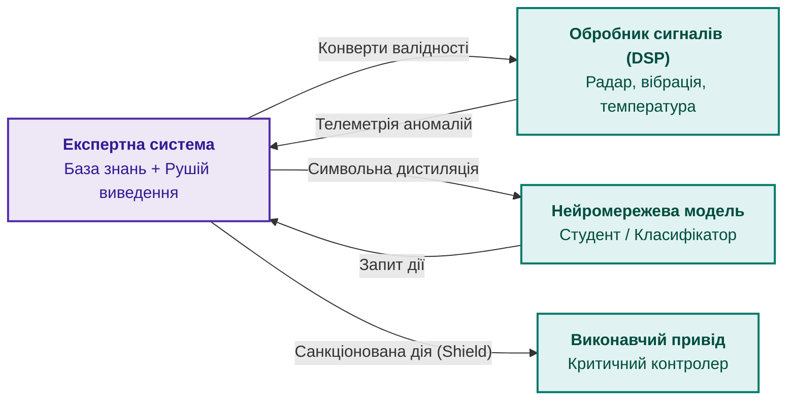
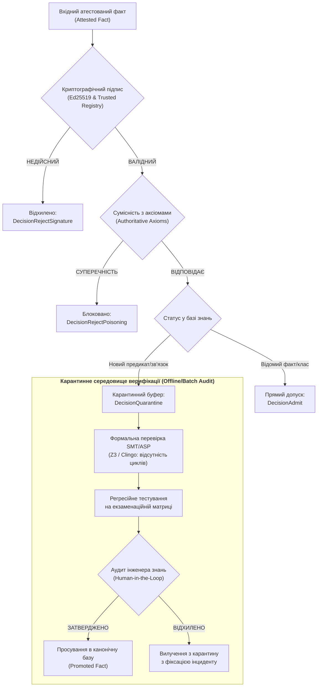

# Глава 33. Міжсистемний обмін знаннями: постачання правил стороннім системам, навчання моделей і захищений зворотний зв'язок

> **Книга:** [Архітектура доказових експертних систем](README.md) · [Частина VII: Реалізація, розгортання та обмін знаннями](part-07-runtime-and-knowledge-exchange.md)  
> **Попередня глава:** [Глава 35. Реактивна експертна система: події, відкликання й адаптація знань](ch35-self-organizing-expert-systems-synergetics-and-npu-runtime.md)  
> **Наступна глава:** [Глава 40. Розподілена архітектура доказової експертної системи: епістемічна SOA, семантична маршрутизація, ієрархія пам'яті та багатоджерельний дефезитивний арбітраж](ch40-distributed-epistemic-architectures-soa-and-cluster-scaling.md)  
> **Зміст книги:** [README.md](README.md)  
> **Автор:** [Микола Федчик](about-the-author.md)  
> **Рівень:** системні архітектори, інженери знань, розробники розподілених систем і вбудованих обчислювачів: просунутий  
> **Очікувані результати:** проєктувати інтерфейси постачання знань експертної системи для сторонніх споживачів; транслювати логічні інваріанти у числові конверти валідності для цифрових сигнальних процесорів і комп'ютерного зору; організовувати символьну дистиляцію правил у нейромережеві моделі за допомогою семантичних функцій втрат; застосовувати формальні щити безпеки для підкріплюваного навчання агентів; обирати формати обміну знаннями (JSON-LD, форми SHACL, підписані пакети); налаштовувати брокер NATS і сервіси gRPC для асинхронного та низьколатентного обміну фактами; розмежовувати доступ за решіткою рівнів конфіденційності та генерувати докази включення Меркла; захищати базу знань від отруєння через криптографічну атестацію та шлюзи допуску; збирати телеметрію контрприкладів від периферійних систем для формування екзаменаційних кандидатів донавчання.

---

## Анотація

Уявіть автономний ударний або розвідувальний ройовий безпілотний комплекс чи роботизовану фабрику (DefTech, IEC 61508 / ISO 26262). Нейромережевий класифікатор комп'ютерного зору (CV) виявляє силует об'єкта й передає векторні координати на привід наведення або маніпулятор. Якщо нейромережа не має детермінованого формального щита безпеки (*Safety Shield*), галюцинація через оптичну заваду або атаку змагальних збурень (*adversarial patch*) призведе до хибного наведення на дружній чи цивільний об'єкт. І навпаки: якщо польовий зв'язок передає телеметрію без криптографічної атестації (підписи Ed25519 та дерева Меркла), зловмисник через ін'єкцію контрприкладів скомпрометує базу знань, заблокувавши роботу всієї місії. Експертна система більше не може бути ізольованим консультантом для людини-оператора: вона зобов'язана виконувати роль супервізора в реальному часі.

Ця глава розглядає інженерну організацію міжсистемного обміну знаннями, в якому експертна система виступає водночас джерелом верифікованих норм, формальним учителем для інших моделей і захищеним отримувачем зовнішнього досвіду. Спочатку глава визначає системні ролі експертної системи у гетерогенному середовищі: нормативний оракул, щит безпеки для нейромережевих агентів та генератор перевіреного курікулуму. Далі розглянуто трансляцію предикатних обмежень у числові конверти валідності для цифрових сигнальних процесорів (DSP), методи символьної дистиляції знань у нейронні мережі за допомогою семантичних функцій втрат, а також протоколи низьколатентного обміну (NATS, gRPC, JSON-LD, SHACL). На завершення викладено механізми захисту від отруєння знань, розмежування прав за решіткою міток безпеки та робочий модуль атестації на Go.

---

## 1. Експертна система як постачальник знань і вчитель сторонніх систем

Традиційна інженерія знань розглядала експертну систему як кінцевого радника для людини-оператора: оператор уводить факти через діалоговий інтерфейс, рушій логічного виведення застосовує правила, а пояснювальний модуль повертає текстове обґрунтування. У кіберфізичних комплексах, роботизованих платформах і розподілених центрах керування споживачем висновку частіше стає інша інформаційна система: алгоритм планування траєкторії, мікроконтролер виконавчого механізму або конвеєр підготовки даних для навчання глибоких нейромереж.

Пряма передача неструктурованих даних між такими підсистемами спричиняє розрив семантичного контексту. Якщо сигнальний обробник передає нейромережі числовий масив без знання фізичних інваріантів об'єкта, модель може вивчити хибні статистичні кореляції. Якщо ж стороння модель генерує керівні команди без перевірки нормативним оракулом, виникає ризик виходу за межі експлуатаційної безпеки. Експертна система усуває цей розрив, виконуючи три взаємопов'язані ролі:

1. **Нормативний оракул (Normative Oracle):** експертна система надає стороннім компонентам точні вердикти щодо допустимості дій, перевіряючи поточний стан на відповідність стандартам, безпековим інваріантам і ліцензійним обмеженням ([Глава 21](ch21-from-recommendation-to-action.md)).
2. **Формальний супервізор або щит безпеки (Safety Shield):** перед подачею команд на виконавчі приводи експертна система перехоплює дії сторонніх контролерів або нейромережевих агентів, блокуючи небезпечні переходи за правилами Fail-Closed ([Глава 28](ch28-dual-mode-expert-systems.md)).
3. **Генератор верифікованого курікулуму (Curriculum Generator):** експертна система синтезує навчальні вибірки для сторонніх моделей машинного навчання, маркуючи дані формальними доказами та гарантуючи відсутність суперечностей у навчальному матеріалі.



---

## 2. Постачання знань обробникам фізичних сигналів та сенсорної інформації

Фізичні сенсори (радари, лідари, віброперетворювачі, спектроаналізатори, тепловізійні матриці) формують потоки неперервних числових сигналів. Цифрові сигнальні процесори (DSP) і модулі комп'ютерного зору (CV) перетворюють ці сигнали на часові ряди, карти глибини та вектори ознак. Однак обробники сигналів оперують статистичними й спектральними характеристиками (швидке перетворення Фур'є, вейвлет-фільтри, матриці коваріації) і позбавлені предметного контексту. Вони не знають, що температура редуктора не може фізично зрости на сорок градусів за дві мілісекунди, або що падіння амплітуди відбитого імпульсу на певній частоті зумовлене зміною атмосферного тиску, а не відмовою випромінювача.

### 2.1. Переклад логічних норм у числові конверти валідності

Експертна система транслює декларативні онтологічні аксіоми у строгі числові параметри фільтрації, які називаються **конвертами валідності (validity envelopes)**. Конверт валідності визначає гіпероб'єм у просторі вимірювань, усередині якого сигнал вважається фізично вірогідним:

```math
\mathcal{E}_s = \left\{ y(t) \in \mathbb{R}^d \;\middle|\; y_{\min} \le y(t) \le y_{\max} \;\land\; \left\|\frac{dy}{dt}\right\| \le \Delta_{\max} \;\land\; \Phi(y(t), x_{\text{state}}) = 1 \right\}
```

де $y_{\min}$ та $y_{\max}$ задають стаціонарні межі діапазону сенсора, $\Delta_{\max}$ обмежує фізично допустиму швидкість зміни процесу, а $\Phi$ позначає булевий предикат контекстної відповідності поточному режиму роботи агрегата $x_{\text{state}}$, визначеному в [Главі 22](ch22-cybernetics-edge-to-backend.md).

Коли експертна система експортує конверт валідності у сигнальний процесор або фільтр Калмана, вона задає строби інновацій (innovation gating) на основі відстані Махаланобіса Бар-Шалома та співавторів [[1]](#src-1):

```math
d_M^2(t) = \tilde{y}^T(t) S^{-1}(t) \tilde{y}(t) \le \gamma_{\text{threshold}}
```

де $\tilde{y}(t) = y(t) - \hat{y}(t|t-1)$ позначає нев'язку передбачення, $S(t)$ є коваріаційною матрицею нев'язки, а поріг $\gamma_{\text{threshold}}$ обчислюється рушієм експертної системи залежно від критичності поточного експлуатаційного режиму. Якщо спостереження перевищує поріг, сигнальний процесор не вносить його у вектор оцінки стану, а позначає як аномалію і формує звіт про інцидент для експертної системи.

### 2.2. Предикатні правила детекції завад та сенсорного спуфінгу

Завдяки зв'язку з інженерною онтологією експертна система виявляє узгоджені аномалії, які окремий сенсорний канал вважає валідними. Наприклад, якщо геопозиція за супутниковим приймачем показує швидкість 120 км/год, але інерціальна система фіксує нульове поздовжнє прискорення, а колісні одометри реєструють нерухомий вал, окремі обчислювачі можуть піддатися супутниковому спуфінгу. Експертна система застосовує крос-сенсорні інваріанти:

```math
\forall t \quad \left| v_{\text{GNSS}}(t) - v_{\text{odo}}(t) \right| > \epsilon_v \implies \text{SpoofingSuspected}(\text{GNSS}, t) \land \text{DegradeWeight}(\text{GNSS}, 0)
```

Експертна система надсилає сигнальному процесору директиву на динамічне обнулення ваги недовіреного каналу у комплексному фільтрі злиття інформації.

---

## 3. Навчання сторонніх систем: символьна дистиляція та верифікований курікулум

Коли сторонньою системою є нейромережевий класифікатор або контролер, експертна система може виступати вчителем. Пряме навчання нейромереж на сирих емпіричних вибірках часто веде до порушення базових фізичних чи логічних законів: комп'ютерний зір може виявити дорожній знак у місці, забороненому геометрією сцени, або класифікатор електромережі прогнозує від'ємний опір ізоляції.

### 3.1. Символьна дистиляція знань через семантичні функції втрат

Символьна дистиляція знань (Symbolic Knowledge Distillation) передає правила логічного виведення у вагові коефіцієнти штучної нейромережі. Підхід спирається на механізм апостеріорної регуляризації Ху та співавторів [[2]](#src-2), де експертна система генерує розподіл цільових ймовірностей $q(y|x)$, що задовольняє набір логічних правил $\mathcal{R} = \{(r_k, \lambda_k)\}$, мінімізуючи дивергенцію Кульбака-Лейблера відносно базової нейромережі $p_\theta(y|x)$:

```math
\min_{q} \text{KL}(q(y|x) \parallel p_\theta(y|x)) - \sum_{k} \lambda_k \mathbb{E}_{q}[\mathbf{1}_{r_k}(x, y)]
```

де $\mathbf{1}_{r_k}(x, y)$ дорівнює одиниці, якщо пара $(x, y)$ задовольняє правило $r_k$, а $\lambda_k \ge 0$ визначає вагову жорсткість правила. Розв'язок оптимізаційної задачі має вигляд розподілу Гіббса:

```math
q^*(y|x) \propto p_\theta(y|x) \exp\left( \sum_k \lambda_k \mathbf{1}_{r_k}(x, y) \right)
```

Отриманий розподіл $q^*(y|x)$ слугує псевдоеталоном (soft labels) для навчання мережі-студента через функцію втрат крос-ентропії.

Для прямого наскрізного диференціювання логічних обмежень застосовують семантичні функції втрат Сюя та співавторів [[3]](#src-3). Якщо формальне правило представлене пропозиційною формулою $\alpha$ над виходами класифікатора, семантична втрата визначається як від'ємний логарифм імовірності істинності формули:

```math
\mathcal{L}_{\text{semantic}}(\theta, \alpha) = -\log \sum_{y \models \alpha} \prod_{j: y_j = 1} p_\theta(\hat{y}_j = 1 \mid x) \prod_{j: y_j = 0} (1 - p_\theta(\hat{y}_j = 1 \mid x))
```

Під час зворотного поширення помилки градієнт семантичної втрати штрафує вагові коефіцієнти мережі за будь-яке наближення виходів до конфігурацій, що порушують логічні інваріанти експертної системи.

### 3.2. Формальні щити безпеки (Shielding) у навчанні агентів

Під час підкріплюваного навчання (Reinforcement Learning, RL) агент досліджує простір станів методом спроб і помилок. У критичних застосуваннях випадкове дослідження може спричинити фізичне руйнування механізму або перехід у заборонений аварійний стан.

Експертна система реалізує архітектуру формального екранування або щита за Альшіхом та співавторами [[4]](#src-4). Щит синтезується з безпекових специфікацій, виражених формулами лінійної темпоральної логіки (Linear Temporal Logic, LTL). Експертна система обчислює множину безпечних дій у поточному стані $\mathcal{A}_{\text{safe}}(s_t) \subseteq \mathcal{A}$. Якщо дія агента $a_t \notin \mathcal{A}_{\text{safe}}(s_t)$, щит перехоплює команду, підставляючи найближчу допустиму безпечну дію $a_t' = \arg\min_{a \in \mathcal{A}_{\text{safe}}} \|a - a_t\|$, і повертає агенту штраф у функції винагороди. Таким чином, стороння система вчиться оптимізувати цільову функцію виключно в межах допустимого безпекового конверта.

---

## 4. Формати, способи та технології міжсистемного обміну знаннями

Для передачі знань між різнорідними комп'ютерними системами потрібні протоколи й формати, що забезпечують однозначність інтерпретації структури тверджень, збереження контексту походження фактів та мінімальні накладні витрати на серіалізацію.

| Вимога | Рекомендований формат / технологія | Обґрунтування застосування |
|---|---|---|
| Семантична сумісність графів | JSON-LD 1.1 [[5]](#src-5) | Зв'язування локальних ключів тверджень з глобальними IRI онтологій без втрати читабельності |
| Валідація структурних обмежень | SHACL W3C [[6]](#src-6) | Декларативний опис обов'язкових атрибутів, діапазонів і кардинальності зв'язків фактів |
| Предикатні правила та виведення | RIF / RuleML | Стандартизований синтаксис для обміну логічними правилами першого порядку |
| Промисловий обмін на шині даних | NATS JetStream за Югстером та співавторами [[7]](#src-7) | Асинхронний брокер з підтримкою суб'єктної фільтрації, персистентності потоків та семантики at-least-once |
| Низьколатентні точкові перевірки | gRPC поверх HTTP/2 та Protobuf | Синхронні запити валідації дій та отримання конвертів із затримкою до 1 мікросекунди |
| Незмінні пакети знань | ZNAV-INDEX / mmap ([Глава 32](ch32-high-performance-knowledge-packs-mmap-and-harvesting.md)) | Пакетне поширення оновлень бази знань з нульовою десеріалізацією для вбудованих вузлів |

### 4.1. Семантичний контракт повідомлення на базі JSON-LD

Нижче наведено приклад повідомлення, яким експертна система експортує верифікований конверт валідності сенсора для підлеглого сигнального процесора через брокер повідомлень:

<details>
<summary>Приклад семантичного повідомлення JSON-LD для експорту конверта валідності</summary>

```json
{
  "@context": {
    "es": "https://standards.iso.org/iso/26262/ontology#",
    "xsd": "http://www.w3.org/2001/XMLSchema#"
  },
  "@id": "urn:es:envelope:motor_current:gen42",
  "@type": "es:SensorValidityEnvelope",
  "es:signalName": "motor_phase_u_current",
  "es:unit": "amperes",
  "es:minValue": { "@type": "xsd:double", "@value": -50.0 },
  "es:maxValue": { "@type": "xsd:double", "@value": 50.0 },
  "es:maxSlewRate": { "@type": "xsd:double", "@value": 1500.0 },
  "es:provenance": {
    "es:derivedFromStandard": "ISO-26262-Part-4",
    "es:ruleHash": "9e1c5f8b4a2e3d7c",
    "es:certifiedGeneration": "gen-2026-10-04-v1"
  }
}
```

</details>

### 4.2. Суб'єктна маршрутизація в NATS JetStream

Брокер NATS використовує ієрархічні текстові суб'єкти (subjects), що дозволяє спрямовувати знання за категоріями, доменами безпеки та типами споживачів:

- `knowledge.export.dsp.envelopes.<subsystem>`: публікація конвертів валідності для сигнальних процесорів конкретної підсистеми;
- `knowledge.export.models.distillation.<domain>`: поширення навчальних корпусів і псевдоеталонів для сторонніх моделей;
- `knowledge.feedback.telemetry.anomalies.<sensor_id>`: приймання звітів про вихід спостережень за межі встановленого конверта;
- `knowledge.control.quarantine.admission`: канал координації шлюзу допуску нових фактів.

Завдяки механізму збереження черги повідомлень JetStream гарантує, що сторонній вузол, тимчасово відключений від мережі ([Глава 22](ch22-cybernetics-edge-to-backend.md)), після відновлення зв'язку вичитає всі актуальні оновлення без втрати послідовності.

---

## 5. Умови, правила збереження семантики та онтологічне узгодження

Коли знання передаються між незалежно розробленими інформаційними системами, виникає небезпека семантичного спотворення: предикат з однієї онтології може мати ширше або вужче тлумачення в іншій.

### 5.1. Консервативні розширення та локальність модулів

Згідно з теорією модульності онтологій Куенки Грау та співавторів [[8]](#src-8), експорт фрагмента знань $\mathcal{M}$ з вихідної онтології $\mathcal{O}_1$ до цільової системи $\mathcal{O}_2$ є коректним тоді і тільки тоді, коли $\mathcal{M}$ є **консервативним розширенням (conservative extension)** відносно виділеної сигнатури $\Sigma$:

```math
\mathcal{O}_1 \models \psi \iff \mathcal{M} \models \psi \quad \text{для всіх формул } \psi \text{ над сигнатурою } \Sigma
```

Це гарантує дві фундаментальні властивості:
1. **Безпека імпорту:** імпорт модуля не змінює зв'язків між внутрішніми поняттями цільової онтології, які не стосуються спільної сигнатури $\Sigma$.
2. **Повнота виведення:** всі наслідки над сигнатурою $\Sigma$, які могли бути виведені у повній вихідній онтології $\mathcal{O}_1$, можуть бути виведені виключно з виділеного модуля $\mathcal{M}$ без завантаження всієї бази знань.

### 5.2. Правила збереження семантичних типів

Під час трансляції знань забороняються операції неявного звуження або розширення типів даних:
- **Заборона втрати точності модальностей:** якщо вихідне твердження є деонтичною рекомендацією `SHOULD`, воно не має транслюватися у безумовну заборону `MUST NOT` стороннього протоколу без явної згоди інженера знань ([Глава 14](ch14-requirements-detection-and-formalization.md)).
- **Ізоляція частково замкненого світу (PCWA):** твердження, отримані в умовах припущення про замкненість окремої предметної області ([Глава 07](ch07-knowledge-base-typology.md)), маркуються спеціальним прапорцем повноти `scope: closed`. Стороння система не має права застосовувати правило заперечення як відмови (Negation-as-Failure) до фактів, що надходять з відкритих відкритих доменів (`scope: open`).

---

## 6. Розмежування доступу та безпека знань: решітка міток і селективне розкриття

У складних інженерних і оборонних проєктах база знань містить твердження з різними грифами конфіденційності, правами інтелектуальної власності та обмеженнями експортного контролю. Експертна система зобов'язана запобігати витоку закритих знань до сторонніх систем з нижчим рівнем допуску.

### 6.1. Багаторівнева безпека на базі решітки міток Дена

Розмежування доступу базується на класичній моделі решітки безпечних інформаційних потоків Деннінг [[9]](#src-9) та моделі Белла-ЛаПадули [[10]](#src-10). Множина міток безпеки формує частково впорядковану решітку $(\mathcal{L}, \le, \sqcap, \sqcup)$:

```math
\mathcal{L} = \mathcal{C} \times 2^{\mathcal{K}}
```

де $\mathcal{C} = \{\text{Public} < \text{Internal} < \text{Restricted} < \text{Critical}\}$ визначає лінійну ієрархію рівнів конфіденційності, а $\mathcal{K}$ є множиною категоріальних обмежень (наприклад, конкретні назви проєктів або консорціумів).

Мітка суб'єкта $L_s = (c_s, K_s)$ домінує над міткою об'єкта знання $L_o = (c_o, K_o)$ тоді і тільки тоді, коли:

```math
L_s \ge L_o \iff (c_s \ge c_o) \land (K_o \subseteq K_s)
```

**Правило безпечного експорту знань:** твердження $f$, помічене міткою $L(f)$, може бути передане сторонній системі з допуском $L_{\text{recipient}}$ лише у випадку, коли рівень допуску отримувача домінує над міткою факту: $L_{\text{recipient}} \ge L(f)$. Усі факти, для яких ця умова порушується, детерміновано відсікаються шлюзом експорту до серіалізації.

### 6.2. Селективне розкриття доказів через дерева Меркла

Коли стороння аудиторська система вимагає підтвердження того, що певна вимога чи тест дійсно входять до затвердженого випуску бази знань, повне розкриття бази знань може розкрити конфіденційні деталі прошивки чи топології.

Для розв'язання цієї проблеми експертна система використовує криптографічні дерева Меркла Меркла [[11]](#src-11). Корінь дерева $R_{\text{Merkle}}$ публікується у відкритому сертифікаті випуску ([Глава 32](ch32-high-performance-knowledge-packs-mmap-and-harvesting.md)). Щоб довести присутність конкретного факту $f_i$ з хешем $H(f_i)$, експертна система генерує компактний шлях аутентифікації довжиною $O(\log N)$, який називається **доказом включення Меркла (Merkle inclusion proof)**:

```math
\pi(f_i) = \langle h_1, h_2, \dots, h_{\lceil \log_2 N \rceil} \rangle
```

Стороння система самостійно перераховує згортку:

```math
H(\dots H(H(f_i), h_1) \dots) = R_{\text{Merkle}}
```

Це математично підтверджує присутність факту в затвердженому маніфесті без розкриття жодного з сусідніх фактів бази знань.

---

## 7. Підтвердження фактів (Fact Attestation) та захист від отруєння знань

При отриманні спостережень, результатів тестування чи правил від сторонніх систем експертна система наражається на ризик **отруєння знань (knowledge poisoning)**. Зловмисник або скомпрометований сенсорний вузол може надсилати спотворені факти (наприклад, стверджуючи, що критична температура становить 500 °C замість 100 °C або що аварійний клапан повинен залишатися закритим під час перевищення тиску), що паралізує або спотворить подальше логічне виведення.

### 7.1. Криптографічна атестація фактів за схемою Ed25519

Кожен експортований факт підписується цифровим підписом системи-джерела за схемою Ed25519 Бернштейна та співавторів [[12]](#src-12). Структура атестованого факту містить канонічні байти твердження, ідентифікатор джерела та криптографічний підпис:

```math
\sigma = \text{Ed25519}_{\text{Sign}}(SK_{\text{source}}, \text{SHA-256}(s \parallel p \parallel o \parallel \text{level} \parallel \text{source\textunderscore id}))
```

Перевірка підпису гарантує цілісність даних та неспростовність авторства (non-repudiation) згідно з принципами ланцюжків постачання артефактів in-toto Торрес-Аріаса та співавторів [[13]](#src-13).

### 7.2. Таксономія загроз: форми атак отруєння знань (Knowledge Poisoning)

Отруєння бази знань у доказових системах класифікується за чотирма основними векторами впливу:

1. **Пряма інверсія аксіоми (Axiom Inversion / Overwrite):**  
   Атакуючий вузол (навіть володіючи валідним сертифікатом доступу) надсилає твердження, що прямо суперечить засадничим законам фізики чи нормам безпеки:
   ```math
   \text{Attestation}: (\texttt{emergency\textunderscore brake}, \texttt{status\textunderscore on\textunderscore failure}, \texttt{DISABLED})
   ```
   Мета: зняття захисних блокувань у критичний момент.
2. **Прихований семантичний дрейф (Stealth Semantic Drift):**  
   Атака розтягується в часі: щосекунди надсилаються ледь помітні дельти числових меж або допусків (наприклад, граничний струм зсувається на $+0{,}1\%$ за кожне спостереження). Окремо кожен факт проходить локальний фільтр аномалій, але накопичувальний ефект виводить систему за безпечний експлуатаційний конверт.
3. **Індукція зациклення розв'язувача (Cyclic Denial-of-Reasoning):**  
   Впровадження циклічних взаємозалежностей між новими предикатами:
   ```math
   P_1(x) \leftarrow P_2(x), \quad P_2(x) \leftarrow P_3(x), \quad P_3(x) \leftarrow P_1(x)
   ```
   Це провокує експоненційне зростання обчислювальної складності або зависання під час резолюційного виведення чи пошуку найменшої нерухомої точки.
4. **Атака Сивіли у зворотному зв'язку (Sybil Consensus Poisoning):**  
   Компрометація пулу сенсорів для одночасної відправки фіктивних контрприкладів, що штучно перевищують поріг $N_{\text{threshold}}$ і змушують систему вважати фальшиву аномалію реальним зсувом фізичного середовища.

### 7.3. Шлюз вхідного контролю та життєвий цикл карантину знань

Щоб нейтралізувати зазначені загрози, шлюз вхідного контролю (Admission Controller) реалізує суворий багатоетапний **життєвий цикл карантину знань (Knowledge Quarantine Lifecycle)**:



1. **Криптографічна валідація:** факт відхиляється (`DecisionRejectSignature`), якщо відкритий ключ джерела відсутній у списку довірених або підпис не відповідає згортці байтів.
2. **Перевірка суперечностей з аксіомами:** факт відхиляється негайно (`DecisionRejectPoisoning`), якщо його предикат прямо заперечує встановлені фундаментальні аксіоми безпеки.
3. **Карантинний буфер (Quarantine Buffer):** синтаксично коректні факти, що містять раніше невідомі предикати або нові структурні зв'язки, не потрапляють одразу до робочого простору виведення. Вони поміщаються в ізольований буфер кандидатів (`DecisionQuarantine`), де проходять регресійні тести та перевірку формальним розв'язувачем Z3 або Clingo ([Глава 23](ch23-knowledge-base-verification.md)) на відсутність циклів, прихованих протиріч та збереження інваріантів безпеки перед остаточним допуском.

---

## 8. Зворотний зв'язок (Feedback Loop) та донавчання експертної системи

Взаємодія між системами є двостороннім процесом. Коли підлеглі системи (DSP, комп'ютерний зір, автономні агенти) працюють у фізичному середовищі, вони стикаються з **крайовими випадками (corner cases)**: несподівані поєднання погодних умов, аномальні спектри вібрації на нових режимах чи нестандартні протокольні відповіді мережевого обладнання.

### 8.1. Черга контрприкладів та агрегація інцидентів

Якщо сторонній обробник фіксує вихід сигналу за межі встановленого конверта або нейромережа фіксує високу ентропію класифікації, формується структурований звіт про аномалію. Звіти потрапляють у чергу зворотного зв'язку (Feedback Queue).

Колектор зворотного зв'язку агрегує інциденти. Окремий одиночний викид може бути випадковою фізичною завадою сенсора і не вимагає перегляду правил. Але якщо кількість однотипних контрприкладів для певного сигналу перевищує статистичний поріг $N_{\text{threshold}}$, колектор позначає це явище як стійку аномалію, що свідчить про зміну фізичних характеристик середовища.

### 8.2. Живлення циклу неперервного навчання

Накопичені верифіковані контрприклади стають вхідним матеріалом для:
- Поповнення екзаменаційної матриці з [Глави 25](ch25-how-expert-systems-learn.md): новий контрприклад додається до обов'язкових негативних або граничних тестів, формуючи новий зріз складності.
- Алгоритмів виявлення системного зсуву з [Глави 26](ch26-continual-learning.md): потік звітів аналізується статистичним тестом кумулятивних сум (CUSUM) для раннього попередження про деградацію сенсорів або зсув робочої точки.
- Корекції конвертів валідності: інженер знань або автоматичний оптимізатор пропонує оновлені межі $\mathcal{E}_s'$, які проходять повний цикл екзаменаційного тестування перед випуском нового покоління пакета знань.

---

## 9. Програмна реалізація мовою Go: модуль xchange

Розглянемо практичну реалізацію ядра міжсистемного обміну знаннями на мові Go. Пакет `xchange` демонструє:
1. Експорт знань із фільтрацією за решіткою рівнів доступу та цифровим підписом Ed25519.
2. Шлюз вхідного контролю фактів із захистом від отруєння знань (перевірка підпису та аксіоматичних суперечностей).
3. Валідацію числових сигналів сенсорним конвертом.
4. Зворотний зв'язок: колектор аномалій із фіксацією порогу для запуску циклу донавчання.

Код не використовує сторонніх бібліотек, спираючись виключно на стандартний пакет Go (`crypto/ed25519`, `crypto/sha256`, `sync`, `math`).

<details>
<summary>Вихідний код модуля xchange (Go): xchange.go</summary>

```go
package xchange

import (
	"crypto/ed25519"
	"crypto/sha256"
	"encoding/hex"
	"errors"
	"fmt"
	"math"
	"sync"
	"time"
)

// SecurityLevel позначає рівень конфіденційності в решітці доступу.
type SecurityLevel int

const (
	LevelPublic SecurityLevel = iota
	LevelInternal
	LevelRestricted
	LevelCritical
)

// Dominates перевіряє умову потоку інформації в решітці безпеки (L_sub >= L_obj).
func (l SecurityLevel) Dominates(other SecurityLevel) bool {
	return l >= other
}

// Fact описує атомарне інженерне твердження.
type Fact struct {
	Subject   string        `json:"subject"`
	Predicate string        `json:"predicate"`
	Object    string        `json:"object"`
	Level     SecurityLevel `json:"level"`
	SourceID  string        `json:"source_id"`
}

// Digest обчислює канонічний криптографічний хеш SHA-256 для факту.
func (f Fact) Digest() [32]byte {
	h := sha256.New()
	fmt.Fprintf(h, "%s|%s|%s|%d|%s", f.Subject, f.Predicate, f.Object, f.Level, f.SourceID)
	var d [32]byte
	copy(d[:], h.Sum(nil))
	return d
}

// AttestedFact об'єднує факт із криптографічним цифровим підписом системи-постачальника.
type AttestedFact struct {
	Fact      Fact   `json:"fact"`
	Signature string `json:"signature"`
}

// SignalEnvelope перекладає символьну норму експертної системи у валідаційні межі для DSP та сенсорів.
type SignalEnvelope struct {
	SignalName string  `json:"signal_name"`
	MinValue   float64 `json:"min_value"`
	MaxValue   float64 `json:"max_value"`
	MaxDelta   float64 `json:"max_delta"`
}

// ValidateSample перевіряє фізичну допустимість нового вимірювання за межами діапазону та швидкості зміни.
func (e SignalEnvelope) ValidateSample(prevVal, curVal float64) error {
	if curVal < e.MinValue || curVal > e.MaxValue {
		return fmt.Errorf("signal %s value %.3f out of range [%.3f, %.3f]", e.SignalName, curVal, e.MinValue, e.MaxValue)
	}
	if e.MaxDelta > 0 && prevVal != 0 {
		diff := math.Abs(curVal - prevVal)
		if diff > e.MaxDelta {
			return fmt.Errorf("signal %s jump %.3f exceeds max delta %.3f", e.SignalName, diff, e.MaxDelta)
		}
	}
	return nil
}

// KnowledgeExporter експортує знання стороннім системам з фільтрацією за решіткою доступу та підписом.
type KnowledgeExporter struct {
	SystemID   string
	PrivateKey ed25519.PrivateKey
	PublicKey  ed25519.PublicKey
}

// NewKnowledgeExporter створює експортер знань із новою парою ключів Ed25519.
func NewKnowledgeExporter(systemID string) (*KnowledgeExporter, error) {
	pub, priv, err := ed25519.GenerateKey(nil)
	if err != nil {
		return nil, err
	}
	return &KnowledgeExporter{
		SystemID:   systemID,
		PrivateKey: priv,
		PublicKey:  pub,
	}, nil
}

// Export фільтрує факти за рівнем допуску отримувача й підписує дозволені твердження.
func (e *KnowledgeExporter) Export(facts []Fact, recipientClearance SecurityLevel) []AttestedFact {
	var out []AttestedFact
	for _, f := range facts {
		if !recipientClearance.Dominates(f.Level) {
			continue
		}
		f.SourceID = e.SystemID
		digest := f.Digest()
		sig := ed25519.Sign(e.PrivateKey, digest[:])
		out = append(out, AttestedFact{
			Fact:      f,
			Signature: hex.EncodeToString(sig),
		})
	}
	return out
}

// AdmissionDecision визначає вердикт вхідного контролю факту.
type AdmissionDecision int

const (
	DecisionAdmit AdmissionDecision = iota
	DecisionRejectSignature
	DecisionRejectPoisoning
	DecisionQuarantine
)

// AdmissionController перевіряє справжність вхідних фактів і захищає від отруєння знань.
type AdmissionController struct {
	mu          sync.RWMutex
	trustedKeys map[string]ed25519.PublicKey
	axioms      map[string]string
	knownPreds  map[string]bool
	quarantine  map[string]AttestedFact
}

// NewAdmissionController ініціалізує шлюз вхідного контролю.
func NewAdmissionController() *AdmissionController {
	return &AdmissionController{
		trustedKeys: make(map[string]ed25519.PublicKey),
		axioms:      make(map[string]string),
		knownPreds:  make(map[string]bool),
		quarantine:  make(map[string]AttestedFact),
	}
}

// RegisterTrustedSource додає відкритий ключ довіреного постачальника знань.
func (ac *AdmissionController) RegisterTrustedSource(sourceID string, pub ed25519.PublicKey) {
	ac.mu.Lock()
	defer ac.mu.Unlock()
	ac.trustedKeys[sourceID] = pub
}

// RegisterKnownPredicate реєструє перевірений і безпечний предикат базової онтології.
func (ac *AdmissionController) RegisterKnownPredicate(predicate string) {
	ac.mu.Lock()
	defer ac.mu.Unlock()
	ac.knownPreds[predicate] = true
}

// SetAuthoritativeAxiom фіксує непорушну норму, спростування якої кваліфікується як отруєння знань.
func (ac *AdmissionController) SetAuthoritativeAxiom(subject, predicate, object string) {
	ac.mu.Lock()
	defer ac.mu.Unlock()
	key := subject + "#" + predicate
	ac.axioms[key] = object
	ac.knownPreds[predicate] = true
}

// Ingest здійснює атестацію факту: перевірку підпису, сумісності з аксіомами та маршрутизацію в карантин.
func (ac *AdmissionController) Ingest(af AttestedFact) AdmissionDecision {
	ac.mu.Lock()
	defer ac.mu.Unlock()

	pub, ok := ac.trustedKeys[af.Fact.SourceID]
	if !ok {
		return DecisionRejectSignature
	}

	sigBytes, err := hex.DecodeString(af.Signature)
	if err != nil || len(sigBytes) != ed25519.SignatureSize {
		return DecisionRejectSignature
	}

	digest := af.Fact.Digest()
	if !ed25519.Verify(pub, digest[:], sigBytes) {
		return DecisionRejectSignature
	}

	key := af.Fact.Subject + "#" + af.Fact.Predicate
	if existing, hasAxiom := ac.axioms[key]; hasAxiom {
		if existing != af.Fact.Object {
			return DecisionRejectPoisoning
		}
	}

	// Якщо предикат раніше не атестовано — скеровуємо в карантинний буфер
	if !ac.knownPreds[af.Fact.Predicate] {
		ac.quarantine[key] = af
		return DecisionQuarantine
	}

	return DecisionAdmit
}

// PromoteFromQuarantine переводить перевірений SMT/ASP-розв'язувачем факт у статус затверджених.
func (ac *AdmissionController) PromoteFromQuarantine(key string) (AttestedFact, bool) {
	ac.mu.Lock()
	defer ac.mu.Unlock()
	af, ok := ac.quarantine[key]
	if !ok {
		return AttestedFact{}, false
	}
	delete(ac.quarantine, key)
	ac.knownPreds[af.Fact.Predicate] = true
	return af, true
}

// AnomalyReport фіксує крайовий випадок чи порушення меж сенсорної інформації стороннім процесором.
type AnomalyReport struct {
	ConsumerID  string    `json:"consumer_id"`
	SignalName  string    `json:"signal_name"`
	ObservedVal float64   `json:"observed_val"`
	Detail      string    `json:"detail"`
	ReportedAt  time.Time `json:"reported_at"`
}

// FeedbackCollector збирає зворотний зв'язок від підлеглих систем і формує кандидатів на донавчання.
type FeedbackCollector struct {
	mu        sync.Mutex
	threshold int
	incidents map[string][]AnomalyReport
}

// NewFeedbackCollector створює колектор зворотного зв'язку з порогом спрацьовування.
func NewFeedbackCollector(threshold int) *FeedbackCollector {
	return &FeedbackCollector{
		threshold: threshold,
		incidents: make(map[string][]AnomalyReport),
	}
}

// Record реєструє новий звіт і повертає true, якщо накопичено достатньо свідчень для запуску іспиту донавчання.
func (fc *FeedbackCollector) Record(rep AnomalyReport) (bool, error) {
	if rep.SignalName == "" {
		return false, errors.New("empty signal name in report")
	}
	fc.mu.Lock()
	defer fc.mu.Unlock()

	fc.incidents[rep.SignalName] = append(fc.incidents[rep.SignalName], rep)
	if len(fc.incidents[rep.SignalName]) >= fc.threshold {
		return true, nil
	}
	return false, nil
}

// IncidentCount повертає кількість накопичених повідомлень про аномалії для сигналу.
func (fc *FeedbackCollector) IncidentCount(signalName string) int {
	fc.mu.Lock()
	defer fc.mu.Unlock()
	return len(fc.incidents[signalName])
}
```

</details>

<details>
<summary>Модульні тести (Go): xchange_test.go</summary>

```go
package xchange

import (
	"testing"
	"time"
)

func TestExportAndAccessControl(t *testing.T) {
	exp, err := NewKnowledgeExporter("es-primary-node")
	if err != nil {
		t.Fatalf("NewKnowledgeExporter failed: %v", err)
	}

	facts := []Fact{
		{Subject: "motor_current", Predicate: "max_amps", Object: "25.0", Level: LevelPublic},
		{Subject: "motor_firmware", Predicate: "signing_key", Object: "sec-key-99", Level: LevelRestricted},
	}

	// Отримувач із публічним допуском отримує лише публічний факт
	publicAttested := exp.Export(facts, LevelPublic)
	if len(publicAttested) != 1 {
		t.Fatalf("expected 1 fact for public clearance, got %d", len(publicAttested))
	}
	if publicAttested[0].Fact.Subject != "motor_current" {
		t.Errorf("unexpected subject: %s", publicAttested[0].Fact.Subject)
	}

	// Отримувач із допуском Restricted отримує обидва факти
	restrictedAttested := exp.Export(facts, LevelRestricted)
	if len(restrictedAttested) != 2 {
		t.Fatalf("expected 2 facts for restricted clearance, got %d", len(restrictedAttested))
	}
}

func TestAdmissionAndPoisoningDefense(t *testing.T) {
	exp, err := NewKnowledgeExporter("es-primary-node")
	if err != nil {
		t.Fatalf("NewKnowledgeExporter failed: %v", err)
	}

	ac := NewAdmissionController()
	ac.RegisterTrustedSource("es-primary-node", exp.PublicKey)
	ac.RegisterKnownPredicate("nominal_celsius")
	ac.SetAuthoritativeAxiom("safety_valve", "state_at_overpressure", "OPEN")

	facts := []Fact{
		{Subject: "coolant_temp", Predicate: "nominal_celsius", Object: "85.0", Level: LevelPublic},
	}
	attested := exp.Export(facts, LevelPublic)
	if len(attested) != 1 {
		t.Fatalf("expected 1 attested fact, got %d", len(attested))
	}

	// 1. Успішний допуск валідного факту з відомим предикатом
	if dec := ac.Ingest(attested[0]); dec != DecisionAdmit {
		t.Errorf("expected DecisionAdmit, got %v", dec)
	}

	// 2. Підробка вмісту (недійсний підпис)
	tampered := attested[0]
	tampered.Fact.Object = "120.0"
	if dec := ac.Ingest(tampered); dec != DecisionRejectSignature {
		t.Errorf("expected DecisionRejectSignature for tampered fact, got %v", dec)
	}

	// 3. Спроба отруєння знань: валідно підписаний факт суперечить аксіомі
	poisoningFact := []Fact{
		{Subject: "safety_valve", Predicate: "state_at_overpressure", Object: "CLOSED", Level: LevelPublic},
	}
	attestedPoison := exp.Export(poisoningFact, LevelPublic)
	if dec := ac.Ingest(attestedPoison[0]); dec != DecisionRejectPoisoning {
		t.Errorf("expected DecisionRejectPoisoning, got %v", dec)
	}

	// 4. Новий невідомий предикат спрямовується в карантин
	candidateFact := []Fact{
		{Subject: "coolant_pump", Predicate: "experimental_flow_rate", Object: "42.0", Level: LevelPublic},
	}
	attestedCandidate := exp.Export(candidateFact, LevelPublic)
	if dec := ac.Ingest(attestedCandidate[0]); dec != DecisionQuarantine {
		t.Errorf("expected DecisionQuarantine for novel predicate, got %v", dec)
	}

	// 5. Просування з карантину після успішної верифікації
	promoted, ok := ac.PromoteFromQuarantine("coolant_pump#experimental_flow_rate")
	if !ok || promoted.Fact.Object != "42.0" {
		t.Errorf("failed to promote fact from quarantine")
	}
	// Після просування предикат стає відомим і допускається безпосередньо
	if dec := ac.Ingest(attestedCandidate[0]); dec != DecisionAdmit {
		t.Errorf("expected DecisionAdmit after promotion, got %v", dec)
	}
}

func TestSignalEnvelopeValidation(t *testing.T) {
	env := SignalEnvelope{
		SignalName: "accelerometer_z",
		MinValue:   -20.0,
		MaxValue:   20.0,
		MaxDelta:   5.0,
	}

	// Нормальний замір
	if err := env.ValidateSample(9.8, 10.5); err != nil {
		t.Errorf("expected sample in envelope, got err: %v", err)
	}

	// Вихід за межі діапазону
	if err := env.ValidateSample(10.0, 25.4); err == nil {
		t.Error("expected error for range overshoot, got nil")
	}

	// Неприпустимий стрибок за 1 такт
	if err := env.ValidateSample(5.0, 12.0); err == nil {
		t.Error("expected error for sudden jump exceeding max delta, got nil")
	}
}

func TestFeedbackCollectorThreshold(t *testing.T) {
	fc := NewFeedbackCollector(3)

	for i := 1; i <= 2; i++ {
		triggered, err := fc.Record(AnomalyReport{
			ConsumerID:  "dsp-radar-node",
			SignalName:  "radar_doppler",
			ObservedVal: 154.2,
			Detail:      "envelope violation",
			ReportedAt:  time.Now(),
		})
		if err != nil {
			t.Fatalf("unexpected error: %v", err)
		}
		if triggered {
			t.Errorf("threshold should not trigger at count %d", i)
		}
	}

	// Третій інцидент досягає порогу
	triggered, err := fc.Record(AnomalyReport{
		ConsumerID:  "dsp-radar-node",
		SignalName:  "radar_doppler",
		ObservedVal: 155.0,
		Detail:      "envelope violation",
		ReportedAt:  time.Now(),
	})
	if err != nil {
		t.Fatalf("unexpected error: %v", err)
	}
	if !triggered {
		t.Error("expected threshold trigger on 3rd report")
	}
	if cnt := fc.IncidentCount("radar_doppler"); cnt != 3 {
		t.Errorf("expected 3 incidents, got %d", cnt)
	}
}
```

</details>

Тести перевіряють чотири критичні сценарії:
- Відсікання конфіденційного факту отримувачу з недостатнім рівнем допуску (`Dominates`).
- Виявлення спроби підробки байтів факту за порушенням підпису Ed25519.
- Блокування отруєння знань при спробі замінити аксіому безпеки на протилежне значення навіть при валідному підписі джерела.
- Захист сенсорного тракту від неприпустимих стрибків вимірювань і перевищення фізичного діапазону.
- Акумуляція аномалій для передачі контрприкладів у конвеєр донавчання експертної системи.

---

## Висновки
1. **Міжсистемна роль експертної системи:** у розподілених гетерогенних комплексах експертна система діє як нормативний оракул, формальний щит безпеки для виконавчих приводів та генератор верифікованого курікулуму для сторонніх моделей.
2. **Конверти валідності для фізичних сигналів:** предикатні правила експертної системи транслюються у числові межі значень, допустимі швидкості наростання та строби інновацій фільтрів Калмана, забезпечуючи захист сенсорних обчислювачів (DSP, CV) від шумів і навмисного спуфінгу.
3. **Символьна дистиляція та безпечне підкріплюване навчання:** логічні інваріанти передаються нейромережам через семантичні функції втрат або апостеріорну регуляризацію розподілу цільових імовірностей, а формальні щити блокують небезпечні дії агентів у режимі реального часу.
4. **Стандартизовані протоколи обміну:** сумісність забезпечується серіалізацією JSON-LD, формами обмежень SHACL та підписаними бінарними пакетами знань, а мережева доставка реалізується через брокер NATS JetStream з гарантією доставки або низьколатентний gRPC.
5. **Збереження семантики через модульність:** правила безпечного експорту гарантують властивість консервативного розширення та локальності модулів, запобігаючи неконтрольованій зміні поведінки цільової системи та втраті модальностей вимог.
6. **Решітка рівнів безпеки та селективне розкриття:** передача фактів контролюється домінуванням міток конфіденційності в решітці Дена, а докази включення Меркла дозволяють сторонньому аудитору перевірити автентичність норми без витоку закритого вмісту всієї бази знань.
7. **Захист від отруєння знань:** шлюз вхідного контролю верифікує криптографічні підписи Ed25519, блокує факти, що заперечують базові аксіоми безпеки, та скеровує нові твердження у карантинний буфер для формальної перевірки розв'язувачем.
8. **Керований зворотний зв'язок:** сторонні системи повертають структуровані звіти про контрприклади й граничні аномалії, які після досягнення статистичного порогу поповнюють екзаменаційні матриці та живлять алгоритми виявлення дрейфу без небезпечного прямого самонавчання на сирих спостереженнях.

---

## Запитання для самоперевірки
1. У чому полягає різниця між сирим обміном даними через брокер повідомлень та міжсистемним постачанням знань?
2. Як логічне обмеження на швидкість наростання температури транслюється у параметри фільтрації цифрового сигнального процесора (DSP)?
3. Яким чином семантична функція втрат забезпечує виконання логічних інваріантів під час градієнтного спуску штучної нейромережі?
4. Чому формальний щит безпеки (Shielding) у підкріплюваному навчанні перехоплює дії агента, і як це впливає на цільову функцію винагороди?
5. Яку роль відіграє властивість консервативного розширення онтологічного модуля при передачі правил сторонній інформаційній системі?
6. Як решітка рівнів конфіденційності запобігає витоку закритих інженерних знань при експорті фактів до систем загального доступу?
7. Як за допомогою дерева Меркла довести сторонньому аудитору факт затвердження правила без відкриття вмісту сусідніх правил бази знань?
8. Які перевірки виконує шлюз вхідного контролю (Admission Controller) для нейтралізації спроб отруєння бази знань (Knowledge Poisoning)?
9. Чому поодинокий сенсорний викид не повинен викликати автоматичне оновлення правил експертної системи, і як колектор аномалій визначає необхідність ініціалізації циклу донавчання?
10. Яким чином контрприклади від сторонніх систем взаємодіють з екзаменаційними матрицями ([Глава 25](ch25-how-expert-systems-learn.md)) та контролем дрейфу даних ([Глава 26](ch26-continual-learning.md))?

---

## Словник
| Український термін | Англійський відповідник | Коротке пояснення |
|---|---|---|
| Постачання знань | Knowledge Provisioning | Процес експорту верифікованих логічних тверджень, обмежень та правил стороннім системам |
| Символьна дистиляція | Symbolic Knowledge Distillation | Перенесення формальних логічних правил експертної системи у ваги нейромережі через семантичні втрати |
| Конверт валідності | Validity Envelope | Числові межі значень та швидкостей зміни, у межах яких фізичний сигнал вважається достовірним |
| Формальний щит безпеки | Safety Shield | Механізм перехоплення й заміни неприпустимих дій зовнішніх контролерів для дотримання інваріантів |
| Консервативне розширення | Conservative Extension | Властивість модульного розширення онтології, що гарантує незмінність висновків над вихідною сигнатурою |
| Решітка рівнів безпеки | Security Lattice | Частково впорядкована структура міток конфіденційності для формального контролю інформаційних потоків |
| Селективне розкриття | Selective Disclosure | Метод доведення автентичності окремого твердження без розкриття решти закритого контексту |
| Доказ включення Меркла | Merkle Inclusion Proof | Криптографічний шлях хешів дерева Меркла, що підтверджує присутність елемента у затвердженому маніфесті |
| Атестація факту | Fact Attestation | Криптографічне засвідчення походження та цілісності твердження цифровим підписом системи-джерела |
| Отруєння знань | Knowledge Poisoning | Зловмисне або помилкове впровадження суперечливих фактів для порушення коректності логічного виведення |
| Шлюз вхідного контролю | Admission Controller | Програмний компонент, що виконує перевірку підписів, аксіом та сумісності вхідних фактів до їх збереження |
| Карантинний буфер | Quarantine Buffer | Ізольоване сховище нових фактів і правил для проходження формальних перевірок та екзаменаційних тестів |
| Черга контрприкладів | Counterexample Queue | Буфер накопичення повідомлень про аномалії та граничні випадки від сторонніх систем для донавчання |

---

## Абревіатури
| Скорочення | Розшифрування | Значення |
|---|---|---|
| ABAC | Attribute-Based Access Control | атрибутна модель керування доступом на основі характеристик суб'єкта й об'єкта |
| CV | Computer Vision | комп'ютерний зір, комплекс методів обробки та аналізу зображень і відеопотоків |
| DSP | Digital Signal Processor | цифровий сигнальний процесор, апаратний обчислювач для швидкісної обробки сигналів |
| GNSS | Global Navigation Satellite System | глобальна навігаційна супутникова система |
| IRI | Internationalized Resource Identifier | інтернаціоналізований ідентифікатор ресурсу в семантичному вебі |
| JSON | JavaScript Object Notation | текстовий формат обміну структурованими даними |
| JSON-LD | JavaScript Object Notation for Linked Data | стандарт представлення зв'язаних семантичних даних у форматі JSON |
| LTL | Linear Temporal Logic | лінійна темпоральна логіка для специфікації властивостей часової поведінки систем |
| MLS | Multi-Level Security | багатоуровнева модель безпеки для розмежування доступу за категоріями конфіденційності |
| NATS | Neural Autonomic Transport System (назва платформи) | високопродуктивний розподілений брокер обміну повідомленнями |
| PCWA | Partial Closed World Assumption | припущення про частково замкнений світ для окремих фрагментів бази знань |
| RIF | Rule Interchange Format | стандарт W3C для обміну правилами логічного виведення між різними рушіями |
| RL | Reinforcement Learning | підкріплюване навчання, клас алгоритмів машинного навчання на основі винагороди |
| RuleML | Rule Markup Language | мова розмітки для вираження й обміну логічними правилами |
| SHACL | Shapes Constraint Language | мова W3C для валідації структурних обмежень і графів RDF |
| SHA | Secure Hash Algorithm | криптографічний алгоритм хешування даних; SHA-256 створює 256-бітний дайджест |
| SMT | Satisfiability Modulo Theories | розв'язання задач здійсненності формул з урахуванням теорій предикатів |

---

## Джерела
1. <a id="src-1"></a>Yaakov Bar-Shalom, X. Rong Li, Thiagalingam Kirubarajan. [*Estimation with Applications to Tracking and Navigation: Theory Algorithms and Software*](https://doi.org/10.1002/0471221279). John Wiley & Sons, New York, 2001.
2. <a id="src-2"></a>Zhiting Hu, Xuezhe Ma, Zhengzhong Liu, Eduard Hovy, Eric P. Xing. [*Harnessing Deep Neural Networks with Logic Rules*](https://doi.org/10.18653/v1/P16-1228). *Proceedings of the 54th Annual Meeting of the Association for Computational Linguistics (Volume 1: Long Papers)*, 2410–2420, 2016.
3. <a id="src-3"></a>Jingyi Xu, Zilu Zhang, Tal Friedman, Yitao Liang, Guy Van den Broeck. [*A Semantic Loss Function for Deep Learning with Symbolic Knowledge*](https://proceedings.mlr.press/v80/xu18h.html). *Proceedings of the 35th International Conference on Machine Learning*, PMLR 80, 5502–5511, 2018.
4. <a id="src-4"></a>Mohammed Alshiekh, Roderick Bloem, Rüdiger Ehlers, Bettina Könighofer, Scott Niekum, Ufuk Topcu. [*Safe Reinforcement Learning via Shielding*](https://doi.org/10.1609/aaai.v32i1.11797). *Proceedings of the AAAI Conference on Artificial Intelligence*, 32(1), 2669–2678, 2018.
5. <a id="src-5"></a>Manu Sporny, Dave Longley, Gregg Kellogg, Markus Lanthaler, Pierre-Antoine Champin, Niklas Lindström. [*JSON-LD 1.1: A JSON-based Serialization for Linked Data*](https://www.w3.org/TR/json-ld11/). W3C Recommendation 16 July 2020.
6. <a id="src-6"></a>Holger Knublauch, Dimitris Kontokostas. [*Shapes Constraint Language (SHACL)*](https://www.w3.org/TR/shacl/). W3C Recommendation 20 July 2017.
7. <a id="src-7"></a>Patrick Th. Eugster, Pascal A. Felber, Rachid Guerraoui, Anne-Marie Kermarrec. [*The Many Faces of Publish/Subscribe*](https://doi.org/10.1145/857076.857078). *ACM Computing Surveys*, 35(2), 114–131, 2003.
8. <a id="src-8"></a>Bernardo Cuenca Grau, Ian Horrocks, Yevgeny Kazakov, Ulrike Sattler. [*Modular Reuse of Ontologies: Theory and Practice*](https://doi.org/10.1613/jair.2375). *Journal of Artificial Intelligence Research*, 31, 273–318, 2008.
9. <a id="src-9"></a>Dorothy E. Denning. [*A Lattice Model of Secure Information Flow*](https://doi.org/10.1145/360051.360056). *Communications of the ACM*, 19(5), 236–243, 1976.
10. <a id="src-10"></a>David E. Bell, Leonard J. LaPadula. [*Secure Computer System: Unified Exposition and Multics Interpretation*](https://csrc.nist.gov/publications/detail/white-paper/1976/03/01/secure-computer-system-unified-exposition-and-multics-interpretation/final). Technical Report ESD-TR-75-306, The MITRE Corporation, Bedford, MA, 1976.
11. <a id="src-11"></a>Ralph C. Merkle. [*A Digital Signature Based on a Conventional Encryption Function*](https://doi.org/10.1007/3-540-48184-2_32). *Advances in Cryptology - CRYPTO '87*, Lecture Notes in Computer Science, vol. 293, 369–378. Springer, Berlin, Heidelberg, 1987.
12. <a id="src-12"></a>Daniel J. Bernstein, Niels Duif, Tanja Lange, Peter Schwabe, Bo-Yin Yang. [*High-Speed High-Security Signatures*](https://doi.org/10.1007/s13389-012-0027-1). *Journal of Cryptographic Engineering*, 2(2), 77–89, 2012.
13. <a id="src-13"></a>Santiago Torres-Arias, Hammad Afzali, Trishank Karthik Kuppusamy, Radu Curtmola, Justin Cappos. [*in-toto: Providing Farm-to-Table Guarantees for Bits and Bytes*](https://www.usenix.org/conference/usenixsecurity19/presentation/torres-arias). *28th USENIX Security Symposium (USENIX Security 19)*, 1393–1410, 2019.

---

[← Глава 35](ch35-self-organizing-expert-systems-synergetics-and-npu-runtime.md) | [Зміст книги](README.md) | [Частина VII](part-07-runtime-and-knowledge-exchange.md) | [Глава 40 →](ch40-distributed-epistemic-architectures-soa-and-cluster-scaling.md)
