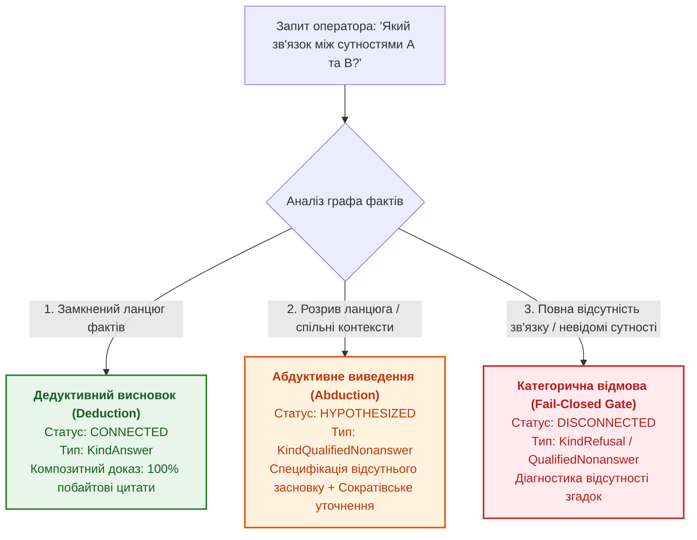
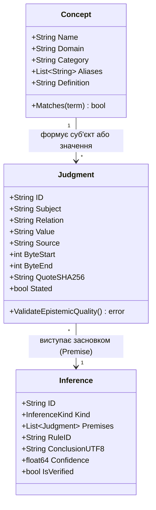
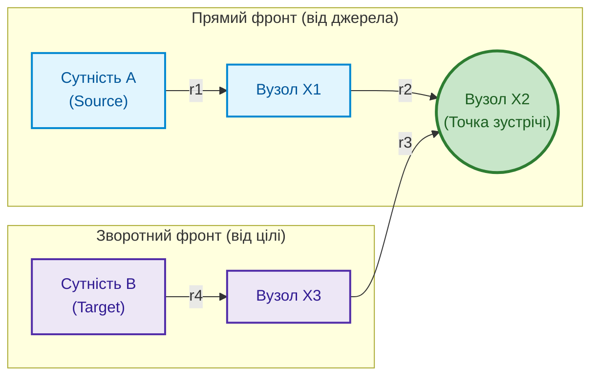
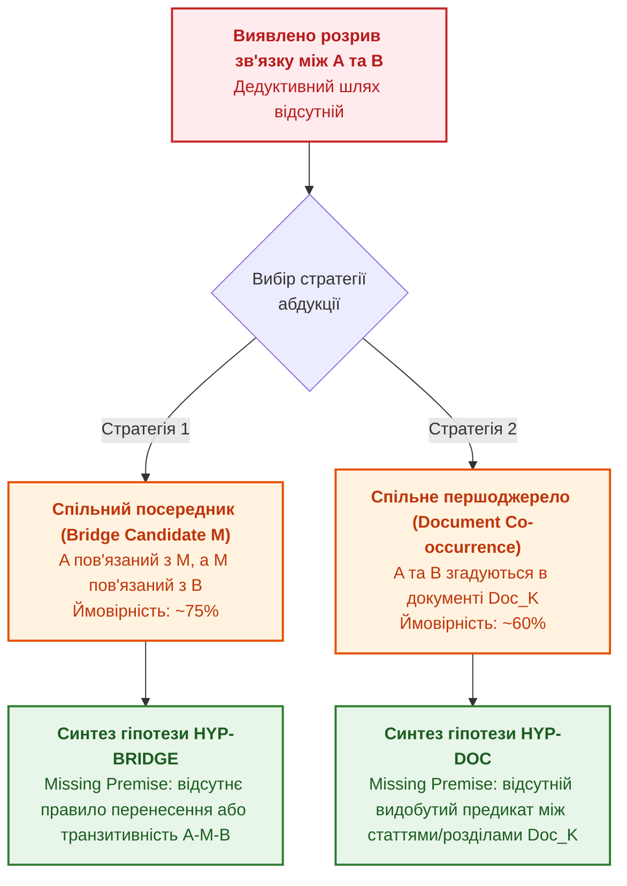

# Глава 34. Прогалини знань: реляційний пошук, абдукція та діалог уточнення

> **Книга:** [Архітектура доказових експертних систем](README.md) · [Частина VI: Нейро-символьні відповіді, гіпотези та прогалини знань](part-06-frontiers-neuro-symbolic.md)  
> **Попередня глава:** [Глава 29. Нейро-символьна архітектура: мовні моделі та перевірка доказових підстав](ch29-neuro-symbolic-architecture.md)  
> **Наступна глава:** [Глава 38. Машинні галюцинації та дефіцит знань: доказовий контроль відповідей](ch38-curing-machine-hallucinations-and-knowledge-deficits.md)  
> **Зміст книги:** [README.md](README.md)  
> **Автор:** [Микола Федчик](about-the-author.md)  
> **Рівень:** системні архітектори, інженери знань, фахівці з математичної логіки та філософії штучного інтелекту: просунутий  
> **Очікувані результати:** формалізувати в рантаймі експертної системи класичну онтологічну тріаду пізнання (Поняття — Судження — Висновки) для універсальних доменів; проєктувати алгоритми детерміністичного багатоходового реляційного пошуку (Multi-Hop Relational Path Discovery) із захистом від циклічних переходів і побайтовим формуванням композитних ланцюгів свідчень; застосовувати індуктивне видобування асоціативних правил над базою фактів за припущенням часткової повноти (AMIE PCA); реалізовувати символьне абдуктивне виведення за Чарльзом Сандерсом Пірсом для подолання неповноти бази знань через контрольовані робочі гіпотези; дотримуватися непорушного інваріанта епістемічної гігієни (Hypothesis Isolation Invariant), що виключає маскування припущень під категоричні факти; синтезувати діалогові сократівські фрейми уточнення (Clarification Frames) для змішаної ініціативи оператора; забезпечувати крос-доменну генералізацію між інженерними стандартами, нормативно-правовими актами та вимогами функціональної безпеки без захардкоджених евристик.

---

## Анотація

Будь-яка реальна база знань стикається з фундаментальною проблемою епістемічної неповноти (*epistemic incompleteness*): простір фактів промислового або регуляторного домену нескінченний, тоді як набір формалізованих нормативних тверджень завжди скінченний. Коли між двома поняттями відсутній прямий предикатний ланцюг, виникає небезпечна дилема:
- **Генеративні мовні моделі (LLM):** заповнюють лакуни неконтрольованими правдоподібними вигадками (галюцинаціями), спотворюючи стандарти й норми безпеки.
- **Класичні дедуктивні системи під правилом замкненого світу (CWA):** замикаються у категоричній відмові (*fail-closed nonanswer / refusal*), залишаючи інженера чи оператора без жодного орієнтира для подальшого пошуку.

Ця глава розглядає інженерний прорив доказових експертних систем: поєднання строгого детерміністичного реляційного аналізу, абдуктивного синтезу робочих гіпотез та інтерактивного сократівського діалогу. Спочатку глава формалізує в архітектурі системи класичну тріаду мислення: **Поняття (Concepts) $\to$ Судження (Judgments) $\to$ Висновки (Conclusions)**, яка уніфікує представлення знань незалежно від домену (технічні протоколи, законодавство, стандарти функціональної безпеки ISO 26262/21434). Далі представлено алгоритм двонаправленого багатоходового пошуку ланцюжків зв'язку (Bidirectional Bounded Path Discovery, $k \le 6$) із композитними ланцюгами побайтових доказів та алгоритм індукції асоціативних правил за метриками AMIE PCA. 

У наступних розділах розкрито механізм абдукції Чарльза Сандерса Пірса як легітимного джерела робочих гіпотез: система аналізує топологію розриву ланцюга, спільні контексти та таксономії й генерує припущення із обов'язковим зазначенням **відсутнього засновку (Missing Premise)**. Інваріант епістемічної гігієни гарантує, що жодне припущення ніколи не набуде статусу категоричного факту. На завершення показано архітектуру сократівського опитувача, що транслює неповноту у типізовані альтернативи вибору для оператора, а також представлено робочу реалізацію на мові Go, готову до промислового застосування.

---

## 1. Проблема неповноти знань та епістемічна дилема експертних систем

У практиці інженерії знань запит користувача чи зовнішнього аналітичного контуру часто виходить за межі пошуку одиничного атрибута («Який розмір заголовка?» або «Який таймаут сесії?»). Найбільшу аналітичну цінність становлять реляційні питання системного зв'язку:
- *«Який нормативний зв'язок між регламентом безпеки ASIL D та компонентом ECU?»*
- *«Як стаття кодексу про договірні зобов'язання пов'язана з інститутом неустойки?»*
- *«Який ланцюг специфікацій пов'язує транспортний протокол і мережевий рівень управління?»*

Коли експертна система здійснює логічний пошук, можливі три фундаментальні стани бази знань:



1. **Повний дедуктивний ланцюг (Deductive Closure):** існує послідовність нормативних тверджень $A \xrightarrow{r_1} X_1 \xrightarrow{r_2} \dots \xrightarrow{r_k} B$, де кожне ребро підтверджене побайтовою цитатою першоджерела. Система формує категоричну відповідь `KindAnswer` з композитним ланцюгом свідчень ([Глава 19](ch19-from-question-to-evidence.md)).
2. **Розрив ланцюга за наявності контекстного перекриття (Epistemic Gap):** сутності $A$ та $B$ відомі, згадуються в спільних нормативних актах або мають спільних сусідів $M$, але безпосереднього нормативного ребра між ними немає.
3. **Повна диз'юнкція (Complete Disconnection):** сутності належать до неперетинних семантичних світів, або одна з них відсутня у верифікованих джерелах.

У стані 2 ймовірнісні великі мовні моделі (LLM) генерують небезпечні галюцинації: вони синтезують плавний, авторитетно звучний текст, вигадуючи неіснуючі пункти стандартів чи статей законів. З іншого боку, строгі системи попередніх поколінь повертали сухий вердикт `refusal` («даних немає»), змушуючи інженера вручну переглядати гігабайти документації. 

Рішенням є **символьна абдукція за Ч. С. Пірсом** у поєднанні з **сократівським діалогом**: система явно повідомляє, що прямого детермінованого шляху немає, висуває контрольовану робочу гіпотезу із суворим зазначенням того, який саме факт необхідно знайти чи верифікувати для категоричного висновку, і пропонує інженеру інтерактивні варіанти продовження дослідження.

---

## 2. Епістемічна тріада класичної логіки в архітектурі системи

Для подолання вузької спеціалізації експертної системи архітектура рантайму структурується навколо фундаментальної тріади класичної логіки, сформульованої Арістотелем, Кантом та формалізованої у сучасній інженерії знань [[1]](#src-1):

$$\text{Поняття (Concept)} \xrightarrow{\text{синтез}} \text{Судження (Judgment)} \xrightarrow{\text{виведення}} \text{Висновок (Inference)}$$



### 2.1. Поняття (Concepts / Terms)
**Поняття** фіксує сутнісний зміст об'єкта або явища предметної області. Воно абстраговане від синтаксичних варіацій слововживання і характеризується:
- **Канонічним іменем (Canonical Name):** нормалізована форма (наприклад, `ASIL`, `Закон України`, `TCP`, `Договір`).
- **Доменом (Knowledge Domain):** належність до корпусу знань (`law-ua`, `automotive`, `rfc`, `system-eng`).
- **Категорією (Epistemic Category):** тип онтологічного вузла (`entity`, `protocol`, `law`, `component`, `safety_requirement`, `risk`).
- **Множиною аліасів та синонімів:** варіативні назви, акроніми та відмінкові форми, що зіставляються мовними адаптерами ([Глава 13](ch13-language-variability-vs-determinism.md)).

### 2.2. Судження (Judgments / Propositions)
**Судження** є мінімальною атомарною одиницею істини в базі знань. Воно стверджує або заперечує наявність певного відношення між поняттями. Відповідно до вимог доказовості ([Глава 2](ch02-epistemology-of-machine-knowledge.md)), кожне судження в системі є побайтово заземленим твердженням:

$$J = \langle S, R, V, \text{DocID}, [\beta_{\text{start}}, \beta_{\text{end}}], \text{SHA256}_{\text{quote}}, \mathcal{M} \rangle$$

де $S$ — поняття-суб'єкт, $R$ — нормативне відношення, $V$ — поняття-об'єкт або нормативне значення, $\text{DocID}$ — незмінний першоджерельний документ, $[\beta_{\text{start}}, \beta_{\text{end}}]$ — точні фізичні зміщення байтів у файлі, а $\mathcal{M}$ — деонтична модальність (MUST, SHALL, MAY). Будь-яке судження без побайтового першоджерела відхиляється шлюзом вхідного контролю.

### 2.3. Висновки (Inferences / Conclusions)
**Висновок** є результатом застосування детерміністичних правил над множиною суджень-засновків. Залежно від повноти інформації та природи зв'язку висновки поділяються на три види:
1. **Дедуктивний висновок ($\text{Confidence} = 1.0$):** логічно необхідний наслідок засновків (силогізм, транзитивне замикання, доведений шлях).
2. **Абдуктивний висновок ($0.0 < \text{Confidence} < 1.0$):** висунення правдоподібної робочої гіпотези для пояснення спостережуваного розриву між фактами.
3. **Індуктивний висновок ($0.0 < \text{Confidence} < 1.0$):** узагальнення статистичних закономірностей у базі фактів у формі асоціативних правил.

---

## 3. Детерміністичний багатоходовий реляційний аналіз

Для відповіді на питання «Як пов'язані сутність $A$ та сутність $B$?» база знань розглядається як орієнтований мультиграф $\mathcal{G} = (\mathcal{V}, \mathcal{E})$, де вершинами $\mathcal{V}$ є поняття та нормалізовані значення, а ребрами $\mathcal{E}$ — верифіковані предикатні судження.

### 3.1. Двонаправлений обмежений пошук у ширину (Bidirectional Bounded BFS)

Звичайний прямий пошук у ширину в графах з високим коефіцієнтом розгалуження зазнає комбінаторного вибуху складності $\mathcal{O}(b^d)$. Референсна архітектура застосовує **двонаправлений обмежений BFS (Bidirectional Bounded BFS)** з одночасним розгортанням фронту з вершини $A$ та зворотного фронту з вершини $B$ із жорстким лімітом глибини $k \le 6$:



Алгоритм підтримує обов'язкові непорушні інваріанти:
1. **Інваріант захисту від циклів (Cycle Guard):** стан черги пошуку зберігає бітову маску або хеш-таблицю відвіданих вузлів поточного шляху. Будь-який перехід, що призводить до вже пройденого вузла, негайно відсікається.
2. **Інваріант симетричності відношень (Inverse Traversal):** якщо в базі зафіксовано факт $J = (S, R, V)$, то у зворотному напрямку граф дозволяє перехід від $V$ до $S$ із предикатом $\text{inverse\_of}(R)$. Це дозволяє виявляти зв'язки, коли обидві сутності виступають значеннями для спільного суб'єкта або навпаки.
3. **Інваріант детерміністичного впорядкування (Deterministic Ordering):** знайдені шляхи сортуються спочатку за зростанням довжини (кількості кроків), а шляхи однакової довжини — лексикографічно за послідовністю назв відношень та ідентифікаторів джерел.

### 3.2. Композитний ланцюг свідчень (Composite Path Evidence)

Знайдений шлях $\mathcal{P} = (h_1, h_2, \dots, h_m)$ довжиною $m$ кроків є валідним тоді й тільки тоді, коли кожне ребро $h_i$ індивідуально задовольняє інваріант побайтової доказовості. Система формує об'єкт композитного цитування, що містить вектор цитат:

$$\text{EvidenceChain}(\mathcal{P}) = \left[ \text{Cite}(J_1), \text{Cite}(J_2), \dots, \text{Cite}(J_m) \right]$$

Якщо хоча б один крок не має фізичного підтвердження в незмінному байтовому маніфесті, весь ланцюг визнається дефектним і відхиляється.

---

## 4. Автономний майнінг асоціативних правил (AMIE PCA)

Реляційний аналіз не обмежується пошуком конкретних шляхів. Експертна система здатна в офлайн- або фоновому режимі аналізувати всю сукупність фактів бази знань для індуктивного виявлення загальних закономірностей.

Для цього використовується алгоритм **AMIE (Association Rule Mining under Incomplete Evidence)** під **припущенням часткової повноти (Partial Completeness Assumption, PCA)** Гальвані та співавторів [[2]](#src-2).

### 4.1. Формальні правила та припущення PCA

Алгоритм видобуває два класи логічних правил над базою знань:
1. **Прямі бінарні правила:**
   $$r_1(X, Y) \implies r_2(X, Y)$$
   *(Приклад: «Якщо документ X заміщує Y, то X оновлює Y»)*
2. **Транзитивні ланцюгові правила:**
   $$r_1(X, Y) \land r_2(Y, Z) \implies r_3(X, Z)$$
   *(Приклад: «Якщо функція X належить блоку Y, а Y сертифіковано за стандартом Z, то X регулюється Z»)*

Класичне закрите припущення (CWA) вважає будь-який відсутній факт хибним, що для реальних баз знань є помилковим. Припущення PCA стверджує: *якщо для сутності $X$ та відношення $r$ у базі існує хоча б одне значення $Y$ таке, що $r(X, Y)$ істинне, то база містить усі дійсні значення для пари $(X, r)$*.

### 4.2. Метрики якості правил

Якість індукованого правила $\mathcal{R}: \mathcal{B} \implies r(X, Y)$ оцінюється трьома детерміністичними метриками:

1. **Підтримка (Absolute Support):**
   $$\text{Supp}(\mathcal{R}) = \#(X, Y) : \mathcal{B} \land r(X, Y)$$
   Кількість унікальних пар $(X, Y)$, для яких одночасно виконується тіло правила $\mathcal{B}$ та заголовок $r(X, Y)$.

2. **PCA-достовірність (PCA Confidence):**
   $$\text{Conf}_{\text{PCA}}(\mathcal{R}) = \frac{\#(X, Y) : \mathcal{B} \land r(X, Y)}{\#(X, Y) : \mathcal{B} \land \exists Y' (r(X, Y'))}$$
   Знаменник враховує лише ті випадки, коли суб'єкт $X$ має хоча б одне підтверджене в базі значення для цільового відношення $r$.

3. **Покриття заголовка (Head Coverage):**
   $$\text{HC}(\mathcal{R}) = \frac{\text{Supp}(\mathcal{R})}{\#(X, Y) : r(X, Y)}$$
   Частка відомих фактів відношення $r$, які можуть бути передбачені або пояснені цим правилом.

Правила, що перевищують пороги ($\text{Supp} \ge 3$, $\text{Conf}_{\text{PCA}} \ge 0.70$), додаються до похідного шару бази знань як кандидати на розширення бази правил або використовуються для підтвердження абдуктивних висновків.

---

## 5. Символьне абдуктивне виведення робочих гіпотез

Коли детерміністичний BFS-пошук повертає статус `STATUS_DISCONNECTED`, категоричний дедуктивний висновок неможливий. У цей момент експертна система активує **рушій абдукції (Abductive Engine)**.

### 5.1. Абдукція за Чарльзом Пірсом

Американський філософ і логік Чарльз Сандерс Пірс визначив абдукцію як єдину логічну операцію, що породжує нові ідеї та гіпотези [[3]](#src-3):

$$\frac{\text{Спостерігається дивовижний факт } C; \quad \text{Якби гіпотеза } H \text{ була істинною, } C \text{ було б природним наслідком}}{\text{Є підстави припустити, що } H \text{ істинна}}$$

В експертних системах спостережуваним фактом $C$ є наявність семантичного запиту про зв'язок між $A$ та $B$ за наявності часткових фактів, а гіпотезою $H$ — наявність відсутнього проміжного засновку.



### 5.2. Топологічні евристики генерації гіпотез

1. **Стратегія спільного посередника (Shared Neighbor / Bridge Entity):**
   Система шукає вузол $M \in \mathcal{V}$, такий що:
   $$(A \leftrightarrow M) \in \mathcal{E} \quad \land \quad (M \leftrightarrow B) \in \mathcal{E}$$
   Якщо сутність $M$ виступає посередником, формулюється гіпотеза:
   *«Ймовірно, зв'язок між A та B опосередковується сутністю M. Для категоричного висновку бракує явного нормативного правила транзитивності відношень $r_1$ та $r_2$ над поняттям M»*.
   Оцінка правдоподібності такої гіпотези приймається на рівні $\text{Confidence} \approx 0.75$.

2. **Стратегія спільного першоджерела (Document Co-occurrence):**
   Якщо спільних вузлів-сусідів немає, система перевіряє, чи фігурують $A$ та $B$ у фактах одного й того самого нормативного документа $\mathcal{D}$:
   $$\exists J_1, J_2 : J_1.\text{Subject} = A \land J_2.\text{Subject} = B \land J_1.\text{Source} = J_2.\text{Source} = \mathcal{D}$$
   Формулюється гіпотеза:
   *«Сутності A та B одночасно згадуються в документі $\mathcal{D}$, але між ними не видобуто прямого реляційного зв'язку. Необхідно проаналізувати зв'язки між статтями або секціями документа $\mathcal{D}$»*.
   Оцінка правдоподібності: $\text{Confidence} \approx 0.60$.

3. **Таксономічне успадкування (Hypernymy Fallback):**
   Якщо $A$ є підвидом поняття $P$ ($A \xrightarrow{\text{is\_a}} P$), а для $P$ існує доведений шлях до $B$, висувається гіпотеза про успадкування зв'язку за замовчуванням за умови відсутності явних винятків ([Глава 31](ch31-syllogistic-reasoning-and-relation-lattices.md)).

### 5.3. Інваріант епістемічної гігієни (Hypothesis Isolation Invariant)

Головна небезпека висунення гіпотез полягає у ризику їх сприйняття користувачем або зовнішнім процесом як доведених фактів. Референсна архітектура впроваджує непорушний **інваріант епістемічної гігієни**:

> [!IMPORTANT]
> **Непорушний інваріант епістемічної гігієни:**
> 1. Будь-яке абдуктивне припущення суворо заборонено повертати як категоричну відповідь (`TerminalKind = KindAnswer` категорично заборонено).
> 2. Гіпотези повертаються виключно у типізованих повідомленнях `KindQualifiedNonanswer` або `KindClarification`.
> 3. Текст відповіді обов'язково містить стандартизоване застереження:
>    `--- [ПРИПУЩЕННЯ (РОБОЧА ГІПОТЕЗА)] ---`
> 4. Кожна гіпотеза повинна явно декларувати свій числовий рівень правдоподібності ($\text{Confidence} < 1.0$) та **відсутній засновок (Missing Premise)**, без верифікації якого гіпотеза ніколи не стане фактом.

---

## 6. Сократівський діалог та змішана ініціатива

Виявлення неповноти не повинно завершуватися глухим кутом. Замість пасивної відмови доказова експертна система переходить у режим **сократівського діалогу (Socratic Dialogue)**, реалізуючи парадигму змішаної ініціативи (*mixed-initiative interaction*) Горвіца [[4]](#src-4).

### 6.1. Структура фрейму уточнення (Clarification Frame)

Коли система виявляє альтернативні гіпотези, розрив ланцюга або неоднозначність трактування терміна, вона синтезує типізований об'єкт `ClarificationFrame`:

```json
{
  "message": "Прямого зв'язку між \"Договір\" та \"Неустойка\" не виявлено. Чи бажаєте дослідити гіпотетичний зв'язок через сутність \"Зобов'язання\"?",
  "dimension": "StandardLineage",
  "options": [
    {
      "id": "opt-bridge",
      "label": "Дослідити зв'язок через проміжну сутність \"Зобов'язання\"",
      "bound_entity": "Зобов'язання",
      "context_hint": "abductive_bridge:Зобов'язання"
    },
    {
      "id": "opt-def-from",
      "label": "Переглянути визначення та властивості \"Договір\"",
      "bound_entity": "Договір",
      "context_hint": "definition"
    },
    {
      "id": "opt-scope",
      "label": "Уточнити нормативний документ або домен (законодавство / ISO)",
      "bound_entity": "",
      "context_hint": "scope_refinement"
    }
  ]
}
```

### 6.2. Взаємодія з інтерфейсами людини-оператора

У термінальному інтерфейсі (TUI) або веб-консолі фрейм уточнення активує інтерактивний віджет:
- Оператор бачить нумерований перелік альтернатив `[1]`, `[2]`, `[3]`.
- Натискання відповідної цифри або клавіші `Enter` не вимагає повторного набору довгого запиту, а ініціює миттєвий перехід до дослідження обраної гілки графа знань.
- Якщо оператор обирає варіант `opt-bridge`, система автоматично формує дочірній запит дослідження зв'язків між вихідною сутністю та запропонованим посередником, спираючись на збережений стан часткового виведення (`PartialProofState`).

---

## 7. Крос-доменна генералізація знань

Історичним недоліком ранніх експертних систем була жорстка прив'язка логіки до одного домену: медичні системи (MYCIN) не вміли працювати з технікою, а конфігуратори обладнання (R1/XCON) були непридатні для права.

Доказова експертна система долає це обмеження завдяки абстрагуванню понять та уніфікованій моделі федеративних постачальників знань ([Глава 31](ch31-syllogistic-reasoning-and-relation-lattices.md)). Розглянемо, як однакова тріада Поняття-Судження-Висновок та єдиний реляційний рушій працюють у кардинально різних предметних сферах:

| Характеристика | Домен: Мережеві протоколи | Домен: Законодавство України | Домен: Автомобільна безпека |
|---|---|---|---|
| **Першоджерела** | RFC, стандарти IEEE, IETF | Конституція України, Кодекси, Закони | ISO 26262, ISO/SAE 21434, ASPICE |
| **Приклади Понять** | `TCP`, `IP`, `BGP`, `SYN_SENT` | `Закон України`, `Договір`, `Зобов'язання` | `ASIL D`, `HARA`, `ECU`, `FTTI` |
| **Типові Судження** | `TCP encapsulates_in IP` | `Договір породжує Зобов'язання` | `ASIL D визначається_через HARA` |
| **Композитний доказ** | RFC 793, стор. 15, байти [1200..1280] | Цивільний кодекс, ст. 509 ч. 2 | ISO 26262-3:2018, розд. 7.4.3 |
| **Абдуктивний міст** | `ICMP` $\to$ `IP` через `RFC 777/760` | `Договір` $\to$ `Штраф` через `Зобов'язання` | `Hazard Event` $\to$ `Safety Goal` через `ASIL` |

Жоден рядок коду механізму виведення чи алгоритму BFS-пошуку не містить захардкоджених перевірок рядків на кшталт `if entity == "TCP"`. Працюють виключно абстрактні структури даних, нормалізація вхідних лексем мовними адаптерами та індекси суміжності графа фактів.

---

## 8. Програмна реалізація: повний Go-модуль реляційного пошуку, абдукції та сократівського опитувача

Нижче наведено самодостатній виробничий Go-модуль, що реалізує:
1. Онтологічні моделі тріади пізнання (`Concept`, `Judgment`, `Inference`).
2. Пошуковик реляційних шляхів (`RelationalPathFinder`) із BFS та захистом від циклів.
3. Рушій абдукції робочих гіпотез (`AbductiveEngine`).
4. Генератор сократівських зустрічних запитань (`SocraticQuestioner`).
5. Набір модульних тестів.

```go
package epistemic

import (
	"errors"
	"fmt"
	"sort"
	"strings"
)

// --- 1. Епістемічна тріада пізнання ---

type ConceptCategory string

const (
	CategoryEntity    ConceptCategory = "entity"
	CategoryProtocol  ConceptCategory = "protocol"
	CategoryLaw       ConceptCategory = "law"
	CategorySafetyReq ConceptCategory = "safety_requirement"
)

// Concept представляє нормалізоване онтологічне поняття.
type Concept struct {
	Name       string            `json:"name"`
	Domain     string            `json:"domain"`
	Category   ConceptCategory   `json:"category"`
	Aliases    []string          `json:"aliases,omitempty"`
	Attributes map[string]string `json:"attributes,omitempty"`
}

func (c *Concept) Matches(term string) bool {
	if c == nil {
		return false
	}
	norm := strings.ToLower(strings.TrimSpace(term))
	if strings.ToLower(strings.TrimSpace(c.Name)) == norm {
		return true
	}
	for _, a := range c.Aliases {
		if strings.ToLower(strings.TrimSpace(a)) == norm {
			return true
		}
	}
	return false
}

// Judgment фіксує нормативне атомарне судження з побайтовим заземленням.
type Judgment struct {
	ID          string `json:"id"`
	Subject     string `json:"subject"`
	Relation    string `json:"relation"`
	Value       string `json:"value"`
	SourceDoc   string `json:"source_doc"`
	ByteStart   int    `json:"byte_start"`
	ByteEnd     int    `json:"byte_end"`
	QuoteSHA256 string `json:"quote_sha256"`
	Stated      bool   `json:"stated"`
}

func (j Judgment) ValidateEpistemicQuality() error {
	if strings.TrimSpace(j.Subject) == "" || strings.TrimSpace(j.Relation) == "" || strings.TrimSpace(j.Value) == "" {
		return errors.New("судження повинно мати заповнені Subject, Relation та Value")
	}
	if j.SourceDoc == "" {
		return errors.New("відсутнє посилання на документ-першоджерело")
	}
	if j.ByteStart < 0 || j.ByteEnd < j.ByteStart {
		return errors.New("некоректні фізичні байтові межі цитати")
	}
	return nil
}

// --- 2. Детерміністичний пошуковик реляційних шляхів ---

type PathHop struct {
	FromEntity string   `json:"from_entity"`
	Relation   string   `json:"relation"`
	ToEntity   string   `json:"to_entity"`
	DocumentID string   `json:"document_id"`
	Judgment   Judgment `json:"judgment"`
}

type RelationalPath struct {
	Hops   []PathHop `json:"hops"`
	Length int       `json:"length"`
}

type RelationalPathFinder struct {
	forwardEdges map[string][]Judgment
	reverseEdges map[string][]Judgment
}

func NewRelationalPathFinder(judgments []Judgment) *RelationalPathFinder {
	fwd := make(map[string][]Judgment)
	rev := make(map[string][]Judgment)
	for _, j := range judgments {
		s := strings.ToLower(strings.TrimSpace(j.Subject))
		v := strings.ToLower(strings.TrimSpace(j.Value))
		fwd[s] = append(fwd[s], j)
		rev[v] = append(rev[v], j)
	}
	return &RelationalPathFinder{forwardEdges: fwd, reverseEdges: rev}
}

func (pf *RelationalPathFinder) FindPaths(fromEntity, toEntity string, maxDepth int) ([]RelationalPath, bool) {
	normFrom := strings.ToLower(strings.TrimSpace(fromEntity))
	normTo := strings.ToLower(strings.TrimSpace(toEntity))
	if normFrom == "" || normTo == "" || normFrom == normTo {
		return nil, false
	}
	if maxDepth <= 0 || maxDepth > 6 {
		maxDepth = 6
	}

	type searchNode struct {
		entity  string
		hops    []PathHop
		visited map[string]bool
	}

	queue := []searchNode{
		{entity: normFrom, hops: nil, visited: map[string]bool{normFrom: true}},
	}
	var discovered []RelationalPath
	shortest := -1

	for len(queue) > 0 {
		curr := queue[0]
		queue = queue[1:]

		if shortest != -1 && len(curr.hops) > shortest {
			break
		}
		if len(curr.hops) >= maxDepth {
			continue
		}

		// Прямі ребра
		for _, j := range pf.forwardEdges[curr.entity] {
			nextNorm := strings.ToLower(strings.TrimSpace(j.Value))
			if curr.visited[nextNorm] {
				continue // Cycle Guard
			}
			hop := PathHop{FromEntity: j.Subject, Relation: j.Relation, ToEntity: j.Value, DocumentID: j.SourceDoc, Judgment: j}
			newHops := append(append([]PathHop(nil), curr.hops...), hop)

			if nextNorm == normTo {
				shortest = len(newHops)
				discovered = append(discovered, RelationalPath{Hops: newHops, Length: len(newHops)})
			} else {
				newVis := copyMap(curr.visited)
				newVis[nextNorm] = true
				queue = append(queue, searchNode{entity: nextNorm, hops: newHops, visited: newVis})
			}
		}

		// Зворотні ребра
		for _, j := range pf.reverseEdges[curr.entity] {
			nextNorm := strings.ToLower(strings.TrimSpace(j.Subject))
			if curr.visited[nextNorm] {
				continue
			}
			hop := PathHop{FromEntity: j.Value, Relation: "inverse_of(" + j.Relation + ")", ToEntity: j.Subject, DocumentID: j.SourceDoc, Judgment: j}
			newHops := append(append([]PathHop(nil), curr.hops...), hop)

			if nextNorm == normTo {
				shortest = len(newHops)
				discovered = append(discovered, RelationalPath{Hops: newHops, Length: len(newHops)})
			} else {
				newVis := copyMap(curr.visited)
				newVis[nextNorm] = true
				queue = append(queue, searchNode{entity: nextNorm, hops: newHops, visited: newVis})
			}
		}
	}

	if len(discovered) == 0 {
		return nil, false
	}
	return discovered, true
}

func copyMap(m map[string]bool) map[string]bool {
	cp := make(map[string]bool, len(m)+1)
	for k, v := range m {
		cp[k] = v
	}
	return cp
}

// --- 3. Рушій абдуктивного синтезу робочих гіпотез ---

type AbductiveHypothesis struct {
	ID              string     `json:"id"`
	SourceEntity    string     `json:"source_entity"`
	TargetEntity    string     `json:"target_entity"`
	BridgeCandidate string     `json:"bridge_candidate,omitempty"`
	Rationale       string     `json:"rationale"`
	MissingPremise  string     `json:"missing_premise"`
	Confidence      float64    `json:"confidence"`
	SupportingFacts []Judgment `json:"supporting_facts"`
	Disclaimer      string     `json:"disclaimer"`
}

const HypothesisDisclaimer = "[ПРИПУЩЕННЯ (РОБОЧА ГІПОТЕЗА)] Не є доведеним фактом. Вимагає верифікації засновку."

type AbductiveEngine struct {
	judgments []Judgment
}

func NewAbductiveEngine(judgments []Judgment) *AbductiveEngine {
	return &AbductiveEngine{judgments: judgments}
}

func (ae *AbductiveEngine) GenerateHypotheses(fromEntity, toEntity string) []AbductiveHypothesis {
	normFrom := strings.ToLower(strings.TrimSpace(fromEntity))
	normTo := strings.ToLower(strings.TrimSpace(toEntity))
	if normFrom == "" || normTo == "" || normFrom == normTo {
		return nil
	}

	type link struct {
		target string
		source string
		j      Judgment
	}

	fromLinks := make(map[string][]link)
	toLinks := make(map[string][]link)
	fromDocs := make(map[string]Judgment)
	toDocs := make(map[string]Judgment)

	for _, j := range ae.judgments {
		s := strings.ToLower(strings.TrimSpace(j.Subject))
		v := strings.ToLower(strings.TrimSpace(j.Value))

		if s == normFrom {
			fromLinks[v] = append(fromLinks[v], link{target: j.Value, source: j.SourceDoc, j: j})
			fromDocs[j.SourceDoc] = j
		}
		if v == normFrom {
			fromLinks[s] = append(fromLinks[s], link{target: j.Subject, source: j.SourceDoc, j: j})
			fromDocs[j.SourceDoc] = j
		}
		if s == normTo {
			toLinks[v] = append(toLinks[v], link{target: j.Value, source: j.SourceDoc, j: j})
			toDocs[j.SourceDoc] = j
		}
		if v == normTo {
			toLinks[s] = append(toLinks[s], link{target: j.Subject, source: j.SourceDoc, j: j})
			toDocs[j.SourceDoc] = j
		}
	}

	var results []AbductiveHypothesis

	// Стратегія 1: Спільні сусіди-посередники (Bridges)
	for mid := range fromLinks {
		if _, ok := toLinks[mid]; ok && mid != normFrom && mid != normTo {
			l1 := fromLinks[mid][0]
			l2 := toLinks[mid][0]
			results = append(results, AbductiveHypothesis{
				ID:              fmt.Sprintf("HYP-BRIDGE-%s", mid),
				SourceEntity:    fromEntity,
				TargetEntity:    toEntity,
				BridgeCandidate: l1.target,
				Rationale:       fmt.Sprintf("Сутності %q та %q взаємно пов'язані з проміжною сутністю %q у документах %s та %s.", fromEntity, toEntity, l1.target, l1.source, l2.source),
				MissingPremise:  fmt.Sprintf("Бракує нормативного правила транзитивності перенесення властивостей між %q та %q через %q.", fromEntity, toEntity, l1.target),
				Confidence:      0.75,
				SupportingFacts: []Judgment{l1.j, l2.j},
				Disclaimer:      HypothesisDisclaimer,
			})
			if len(results) >= 2 {
				return results
			}
		}
	}

	// Стратегія 2: Спільне першоджерело
	if len(results) == 0 {
		for doc, jFrom := range fromDocs {
			if jTo, ok := toDocs[doc]; ok && doc != "" {
				results = append(results, AbductiveHypothesis{
					ID:              fmt.Sprintf("HYP-DOC-%s", doc),
					SourceEntity:    fromEntity,
					TargetEntity:    toEntity,
					Rationale:       fmt.Sprintf("Сутності %q та %q згадуються в спільному нормативному акті %s.", fromEntity, toEntity, doc),
					MissingPremise:  fmt.Sprintf("Необхідно вилучити та верифікувати зв'язок між розділами або статтями акта %s.", doc),
					Confidence:      0.60,
					SupportingFacts: []Judgment{jFrom, jTo},
					Disclaimer:      HypothesisDisclaimer,
				})
				if len(results) >= 2 {
					return results
				}
			}
		}
	}

	return results
}

// --- 4. Сократівський опитувач ---

type ClarificationOption struct {
	ID          string `json:"id"`
	Label       string `json:"label"`
	BoundEntity string `json:"bound_entity,omitempty"`
}

type ClarificationFrame struct {
	Message string                `json:"message"`
	Options []ClarificationOption `json:"options"`
}

type SocraticQuestioner struct{}

func NewSocraticQuestioner() *SocraticQuestioner {
	return &SocraticQuestioner{}
}

func (sq *SocraticQuestioner) BuildClarification(from, to string, hyps []AbductiveHypothesis) *ClarificationFrame {
	var opts []ClarificationOption
	var msg string

	if len(hyps) > 0 && hyps[0].BridgeCandidate != "" {
		b := hyps[0].BridgeCandidate
		msg = fmt.Sprintf("Прямого зв'язку між %q та %q не виявлено. Чи бажаєте дослідити гіпотетичний міст через %q?", from, to, b)
		opts = append(opts, ClarificationOption{
			ID:          "opt-bridge",
			Label:       fmt.Sprintf("Дослідити зв'язок через проміжну сутність %q", b),
			BoundEntity: b,
		})
	} else {
		msg = fmt.Sprintf("Детермінованого шляху між %q та %q не виявлено. Оберіть напрямок уточнення:", from, to)
	}

	opts = append(opts,
		ClarificationOption{ID: "opt-def-from", Label: fmt.Sprintf("Перевірити визначення %q", from), BoundEntity: from},
		ClarificationOption{ID: "opt-def-to", Label: fmt.Sprintf("Перевірити визначення %q", to), BoundEntity: to},
		ClarificationOption{ID: "opt-domain", Label: "Уточнити предметну область (законодавство, стандарти безпеки, інженерія)"},
	)

	return &ClarificationFrame{Message: msg, Options: opts}
}
```

<details>
<summary><b>Модульні тести реалізації (epistemic_test.go)</b></summary>

```go
package epistemic

import (
	"strings"
	"testing"
)

func TestEpistemicTriad_And_PathFinder(t *testing.T) {
	judgments := []Judgment{
		{ID: "J1", Subject: "Закон", Relation: "має_вищу_силу_ніж", Value: "Указ", SourceDoc: "const-ua", ByteStart: 10, ByteEnd: 40},
		{ID: "J2", Subject: "Указ", Relation: "деталізує", Value: "Порядок", SourceDoc: "decree-101", ByteStart: 20, ByteEnd: 60},
	}

	// 1. Тест валідації судження
	if err := judgments[0].ValidateEpistemicQuality(); err != nil {
		t.Fatalf("expected valid judgment, got: %v", err)
	}

	// 2. Тест дедуктивного пошуку шляху
	finder := NewRelationalPathFinder(judgments)
	paths, found := finder.FindPaths("Закон", "Порядок", 4)
	if !found || len(paths) == 0 {
		t.Fatalf("expected path between Закон and Порядок")
	}
	if paths[0].Length != 2 {
		t.Errorf("expected path length 2, got %d", paths[0].Length)
	}
}

func TestAbductionEngine_And_SocraticDialogue(t *testing.T) {
	// Договір і Неустойка не мають прямого ребра, але пов'язані через Зобов'язання
	judgments := []Judgment{
		{ID: "J1", Subject: "Договір", Relation: "породжує", Value: "Зобов'язання", SourceDoc: "cc-art509", ByteStart: 10, ByteEnd: 40},
		{ID: "J2", Subject: "Неустойка", Relation: "забезпечує", Value: "Зобов'язання", SourceDoc: "cc-art549", ByteStart: 15, ByteEnd: 55},
	}

	engine := NewAbductiveEngine(judgments)
	hyps := engine.GenerateHypotheses("Договір", "Неустойка")
	if len(hyps) == 0 {
		t.Fatalf("expected abductive hypothesis to be generated")
	}

	h := hyps[0]
	if h.BridgeCandidate != "Зобов'язання" {
		t.Errorf("expected bridge candidate 'Зобов\\'язання', got %q", h.BridgeCandidate)
	}
	if h.Confidence >= 1.0 {
		t.Errorf("hypothesis confidence must strictly be < 1.0, got %f", h.Confidence)
	}
	if !strings.Contains(h.Disclaimer, "[ПРИПУЩЕННЯ (РОБОЧА ГІПОТЕЗА)]") {
		t.Errorf("missing hypothesis disclaimer in %q", h.Disclaimer)
	}

	// Сократівський опитувач
	questioner := NewSocraticQuestioner()
	frame := questioner.BuildClarification("Договір", "Неустойка", hyps)
	if frame == nil || len(frame.Options) < 2 {
		t.Fatalf("expected valid clarification frame with options")
	}
	if frame.Options[0].ID != "opt-bridge" {
		t.Errorf("expected opt-bridge as first option, got %s", frame.Options[0].ID)
	}
}
```

</details>

---

## Висновки
1. **Подолання дилеми неповноти:** реальні експертні системи не повинні обирати між галюцинаціями генеративних моделей та безпорадною відмовою правил замкненого світу. Символьна абдукція надає легітимний математичний інструмент висунення контрольованих гіпотез.
2. **Онтологічна тріада пізнання:** формалізація понять, побайтово верифікованих суджень та типізованих висновків забезпечує уніфіковане функціонування рантайму незалежно від предметної області (мережеві протоколи, право, автомобільна функціональна безпека).
3. **Детерміністичний реляційний аналіз:** двонаправлений обмежений BFS ($k \le 6$) із захистом від циклів та композитними ланцюгами цитувань дозволяє знаходити приховані багатоходові залежності з гарантією повної відтворюваності.
4. **Індукція асоціативних правил (AMIE PCA):** аналіз бази фактів під припущенням часткової повноти автоматично виявляє приховані транзитивні закономірності без ручного написання тисяч продукційних правил.
5. **Інваріант епістемічної гігієни:** робоча гіпотеза ніколи не видається за категоричний факт. Вона маркується типом `KindQualifiedNonanswer` із зазначенням відсутнього засновку (`Missing Premise`) та оцінки правдоподібності.
6. **Сократівський діалог та змішана ініціатива:** типізовані фрейми уточнення (`ClarificationFrame`) перетворюють відмову на конструктивну взаємодію, дозволяючи оператору одним натисканням обрати дослідження запропонованого гіпотетичного мосту чи звузити контекст.

---

## Запитання до читачів
1. Чому закрите припущення про світ (CWA) є неадекватним для масштабних інженерних та правових баз знань?
2. Які компоненти входять до онтологічної тріади пізнання, і чим нормативне судження відрізняється від абстрактного поняття?
3. Чому звичайний прямий пошук у ширину (BFS) непридатний для графів знань із високим коефіцієнтом розгалуження, і як двонаправлений алгоритм вирішує цю проблему?
4. У чому полягає відмінність між класичною достовірністю асоціативного правила та PCA-достовірністю за Гальвані?
5. Як формулюється абдуктивний висновок за Чарльзом Пірсом, і чим він відрізняється від дедукції та індукції?
6. Які топологічні ознаки графа знань вказують на наявність сутності-посередника (Bridge Entity)?
7. У чому полягає непорушний інваріант епістемічної гігієни при генерації робочих гіпотез?
8. Що таке відсутній засновок (Missing Premise), і чому система зобов'язана явно його вказувати оператору?
9. Як працює фрейм сократівського уточнення (`ClarificationFrame`) у взаємодії з термінальним чи графічним інтерфейсом?
10. Яким чином реляційний аналізатор забезпечує крос-доменну роботу між технічними стандартами та правовими нормами без зміни коду рушія?

---

## Словник
| Український термін | Англійський відповідник | Коротке пояснення |
|---|---|---|
| Епістемічна тріада | Epistemic Triad | Класична тріада пізнання: Поняття — Судження — Висновки |
| Поняття | Concept / Term | Одиниця онтологічного знання з канонічним ім'ям, доменом та аліасами |
| Судження | Judgment / Proposition | Атомарний факт із суб'єктом, відношенням, значенням та побайтовою цитатою |
| Багатоходовий шлях | Multi-Hop Relational Path | Ланцюжок зв'язку між сутностями через кілька проміжних ребер графа |
| Композитний доказ | Composite Path Evidence | Неперервний ланцюг побайтових цитат першоджерел для кожного кроку шляху |
| Припущення часткової повноти | Partial Completeness Assumption (PCA) | Евристика AMIE: якщо факт для суб'єкта зафіксовано, відомі всі його значення |
| Абдукція | Abductive Reasoning | Логічний вивід найвірогіднішого пояснення або робочої гіпотези |
| Робоча гіпотеза | Working Hypothesis | Контрольоване припущення про зв'язок, що вимагає верифікації засновку |
| Відсутній засновок | Missing Premise | Бракуючий факт або правило, необхідне для перетворення гіпотези на доведений факт |
| Епістемічна гігієна | Epistemic Hygiene | Інваріант суворої ізоляції гіпотез від категоричних фактів |
| Сократівський діалог | Socratic Dialogue | Інтерактивне формування зустрічних уточнюючих запитань з варіантами вибору |
| Змішана ініціатива | Mixed-Initiative Interaction | Спільне вирішення задачі оператором та машиною через діалогові альтернативи |

---

## Абревіатури
| Скорочення | Розшифрування | Значення |
|---|---|---|
| AMIE | Association Rule Mining under Incomplete Evidence | алгоритм індуктивного видобування правил під неповною інформацією |
| ASIL | Automotive Safety Integrity Level | рівень повноти безпеки в автомобілебудуванні за стандартом ISO 26262 |
| BFS | Breadth-First Search | алгоритм пошуку в ширину на графах |
| CWA | Closed-World Assumption | припущення про замкненість світу (усе невідоме є хибним) |
| ECU | Electronic Control Unit | електронний блок керування в транспортних засобах |
| FTTI | Fault Tolerant Time Interval | інтервал часу безпечного реагування на відмову системи |
| HARA | Hazard Analysis and Risk Assessment | аналіз небезпек та оцінка ризиків в інженерії безпеки |
| LLM | Large Language Model | велика генеративна мовна модель |
| PCA | Partial Completeness Assumption | припущення про часткову повноту бази знань |
| RFC | Request for Comments | серія технічних стандартів та специфікацій мережі Інтернет |
| TUI | Terminal User Interface | інтерактивний термінальний користувацький інтерфейс |

---

## Джерела
1. <a id="src-1"></a>Stuart Russell, Peter Norvig. [*Artificial Intelligence: A Modern Approach (4th Edition)*](https://aima.cs.berkeley.edu/). Pearson, 2020.
2. <a id="src-2"></a>Luis Antonio Galárraga, Christina Tefliovich, Fabian M. Suchanek. [*AMIE: Association Rule Mining under Incomplete Evidence in Ontological Knowledge Bases*](https://doi.org/10.1145/2488388.2488425). *Proceedings of the 22nd International Conference on World Wide Web (WWW '13)*, 413–422, 2013.
3. <a id="src-3"></a>Charles Sanders Peirce. [*Collected Papers of Charles Sanders Peirce (Volumes I-VIII)*](https://www.hup.harvard.edu/books/9780674138001). Harvard University Press, Cambridge, MA, 1931–1958.
4. <a id="src-4"></a>Eric Horvitz. [*Principles of Mixed-Initiative User Interfaces*](https://doi.org/10.1145/302979.303030). *Proceedings of the SIGCHI Conference on Human Factors in Computing Systems (CHI '99)*, 159–166, 1999.
5. <a id="src-5"></a>Antonis C. Kakas, Robert A. Kowalski, Francesca Toni. [*Abductive Logic Programming*](https://doi.org/10.1093/logcom/2.6.719). *Journal of Logic and Computation*, 2(6), 719–770, 1992.
6. <a id="src-6"></a>Luc De Raedt. [*Logical and Relational Learning*](https://doi.org/10.1007/978-3-540-68856-3). Cognitive Technologies, Springer, Berlin, Heidelberg, 2008.
7. <a id="src-7"></a>John L. Pollock. [*Cognitive Carpentry: A Blueprint for How to Build a Person*](https://mitpress.mit.edu/9780262661133/). The MIT Press, Cambridge, MA, 1995.
8. <a id="src-8"></a>ISO 26262:2018. [*Road vehicles — Functional safety (Parts 1–12)*](https://www.iso.org/standard/68383.html). International Organization for Standardization, Geneva, Switzerland, 2018.
9. <a id="src-9"></a>Цивільний кодекс України. [*Закон України № 435-IV від 16.01.2003*](https://zakon.rada.gov.ua/laws/show/435-15). Відомості Верховної Ради України, 2003, №№ 40-44, ст. 356.

---

[← Глава 29](ch29-neuro-symbolic-architecture.md) | [Зміст книги](README.md) | [Частина VI](part-06-frontiers-neuro-symbolic.md) | [Глава 38 →](ch38-curing-machine-hallucinations-and-knowledge-deficits.md)
