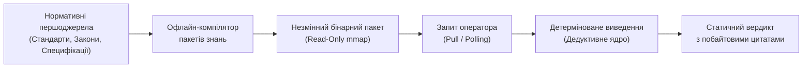
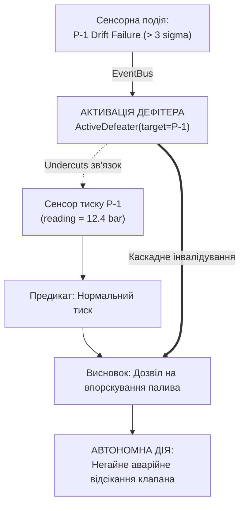
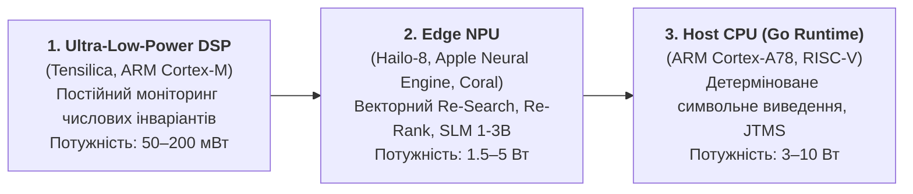

# Глава 35. Реактивні експертні системи: подійно-орієнтований рантайм, апаратне прискорення NPU та динамічна еволюція онтологій без операторського втручання

> **Книга:** [Архітектура доказових експертних систем](README.md) · [Частина VI: Передовий край: регуляторна сертифікація та нейро-символьний ШІ](part-06-frontiers-neuro-symbolic.md)  
> **Попередня глава:** [Глава 34. Детерміністичний реляційний аналіз, абдукція та сократівський діалог: відкриття прихованих зв'язків між фактами, подолання неповноти бази знань через робочі гіпотези та епістемічна тріада пізнання](ch34-deterministic-relational-analysis-abduction-and-socratic-dialogue.md)  
> **Наступна глава:** [Додаток А. Практичний фреймворк доказового дослідження в складних інженерних проєктах](appendix-a-evidence-governed-framework.md)  
> **Зміст книги:** [README.md](README.md)  
> **Автор:** [Микола Федчик](about-the-author.md)  
> **Рівень:** системні архітектори, інженери знань, фахівці з безпеки та апаратного прискорення: просунутий  
> **Очікувані результати:** проєктувати подійно-орієнтовані архітектури експертних систем реального часу (Real-Time Reactive Expert Systems); організовувати неблокуючу обробку потоків телеметрії та зовнішніх подій через реактивну шину; реалізовувати дворівневу модель пам'яті знань L0/L1 (незмінний золотий базис `mmap` та динамічний дельта-граф із підтримкою CRDT); впроваджувати системи підтримки істинності (Truth Maintenance Systems, JTMS/RMS) із миттєвою каскадною інвалідацією через активні дефітери (*Active Defeaters*); розподіляти задачі динамічного виведення (Re-Search, Re-Ranking, Re-Thinking) на енергоефективні апаратні прискорювачі (Edge NPU/DSP) у лімітах 1–5 Вт; аналізувати світові прецеденти автономної діагностики (NASA Livingstone 2, Mobileye RSS).

## 1. Обмеження статичних експертних систем: від припущення замкненого світу до живої сенсорики

Класична інженерія знань другої та ранньої третьої хвиль ШІ будувалася навколо концепції **замкненості на етапі збирання (Build-Time Closure)**:



Такий підхід забезпечує ідеальну побайтову доказовість і відтворюваність результату, проте в реальних кіберфізичних комплексах (автономні БПЛА, безпілотний транспорт, промислові контролери енергомереж, критичні медичні монітори) він стикається з трьома критичними бар'єрами:

1. **Інформаційна сліпота до подій середовища (Environment Blindness):**  
   Система оперує виключно знаннями, матеріалізованими під час останньої компіляції пакета. Якщо сенсор деградує, виникає відмова живлення або змінюється динамічний правовий статус операції (наприклад, перетин кордону юрисдикцій чи вхід у зону дії тимчасового розпорядження NOTAM), статичне ядро продовжує продукувати застарілі висновки, доки оператор явно не передасть нові вхідні змінні.
2. **Пасивна парадигма «запит — відповідь» (Pull-Driven Latency):**  
   Класичний рантайм пасивно очікує ініціативи від користувача. Він не здатен проактивно сповістити про назрівання аварійної відмови або автономно перевести підпорядковані виконавчі приводи в захисний стан (*Fail-Safe Mode*).
3. **Енергетична та часова непридатність пакетного перезавантаження (Batch Rebuild Overhead):**  
   Повне перезбирання пакетів знань займає секунди або хвилини, тоді як реакція на фізичну подію (заклинювання клапана чи втрата сигналу супутника) вимагає детермінованої адаптації за одиниці мілісекунд ($< 5\,\text{ms}$).

Вирішенням є перехід від пасивного сховища знань до **реактивної експертної системи**, що сприймає фізичний світ через потоки подій і безперервно еволюціонує внутрішню онтологію за детермінованими правилами.

---

## 2. Реактивне програмування та потоки подій як епістемічні імпульси

У реактивному рантаймі будь-яка зміна зовнішнього або внутрішнього світу представляється як типізована **подія (Event)**, що транслюється крізь неблокуючу шину повідомлень:

$$E = \langle \text{id}, \text{topic}, \text{source}, \text{timestamp}, \text{priority}, \text{payload}, \sigma_{\text{digest}} \rangle$$

```mermaid
flowchart TD
    subgraph Потоки подій (Event Sources)
        S1["Телеметрія сенсорів<br/>(IMU, CAN, VIO, Температура)"] -->|telemetry.*| EB["Реактивна шина подій<br/>(EventBus / Ring Buffer)"]
        S2["Зовнішні канали регулятора<br/>(API законодавства, NOTAM)"] -->|normative.*| EB
        S3["Внутрішня діагностика<br/>(Heartbeats, Watchdog)"] -->|diagnostic.*| EB
    end

    EB --> DISP["Реактивний диспетчер<br/>(Priority Router)"]

    DISP -->|Аварія сенсора| DEF["Активатор дефітерів<br/>(Truth Maintenance / JTMS)"]
    DISP -->|Зміна режиму польоту| RS["Re-Search & Re-Rank<br/>(Edge NPU Microservices)"]
    DISP -->|Новий нормативний факт| QA["Карантинний контролер<br/>(Admission Gate)"]
```

Шина подій (`EventBus`) реалізує патерн кільцевого буфера без блокувань (LMAX Disruptor pattern), що гарантує наносекундні затримки диспетчеризації подій між ядрами центрального процесора без створення тиску на збирач сміття.

---

## 3. Багаторівнева гібридна пам'ять L0 / L1: незмінний золотий базис та динамічний дельта-граф

Для збереження непорушного інваріанта побайтової доказовості (Evidence-Grounded Invariant) система розділяє знання на два строго ізольовані шари:

$$\mathcal{KB}_{\text{runtime}} = \mathcal{KB}_{L0} \oplus \Delta\mathcal{KB}_{L1}$$

| Шар пам'яті | Носій та формат | Змінність | Зміст знань | Затримка доступу |
|---|---|---|---|---|
| **L0 (Golden Master)** | Бінарний файл `mmap`, Read-Only | Абсолютно незмінний | Фізичні закони, базові стандарти IETF/ISO, конституційні норми | $< 1\,\mu\text{s}$ (Zero-Copy) |
| **L1 (Streaming Delta)** | Оперативна пам'ять (In-Memory CRDT) | Динамічний потоковий | Поточні стани апаратури, ситуативні винятки, заперечувальні обставини | $< 100\,\text{ns}$ |
| **Quarantine Buffer** | Ізольований буфер кандидатів | Тимчасовий ізольований | Неперевірені факти від сторонніх агентів до проходження SMT-тестів | Не бере участі у виведенні |

### Алгоритм розв'язання фактів (Evidence Resolution Priority):
При запиті предикатного значення для ключа $\text{Key} = \text{Subject} \mathbin{\#} \text{Predicate}$:
1. **Перевірка активних дефітерів:** Якщо на даний $\text{Key}$ накладено активну заперечувальну обставину $\text{Defeater}$, запит негайно повертає помилку відхилення підстави (*Defeated State*).
2. **Пошук у шарі L1:** Якщо в динамічному шарі знайдено запис:
   - Якщо це надгробок видалення (*Tombstone*), факт вважається спростованим/відкликаним.
   - Інакше повертається актуальне динамічне значення L1.
3. **Відкат до шару L0:** Якщо запис у L1 відсутній, значення вичитується з незмінного золотого базису L0.

---

## 4. Спростовне супроводження істинності (Truth Maintenance Systems): динамічні активні дефітери

У класичній системі збереження істинності Дойла (Justification-Based Truth Maintenance System, JTMS) кожне твердження спирається на множину підстав:

$$\text{Node} = \langle \text{Datum}, \text{IN-List}, \text{OUT-List} \rangle$$

де $\text{IN-List}$ — факти, які мають бути істинними, а $\text{OUT-List}$ — заперечувальні обставини, які мають бути хибними (відсутніми) для визнання висновку валідним.



Коли сенсорна подія сигналізує про фізичну аномалію (наприклад, розбіжність показників дубльованих датчиків понад $3\sigma$), реактивний рушій генерує **активний дефітер (Active Defeater)**:

$$\text{Fault}(\text{Sensor}_A) \implies \text{ActivateDefeater}(\text{Sensor}_A \mathbin{\#} \text{reading})$$

Це миттєво підриває кореневий засновок (*Undercutting Defeater*). Усі похідні висновки графа залежностей автоматично втрачають силу, переводячи систему в режим безпечної зупинки або підключення резервного сенсорного каналу.

---

## 5. Спеціалізовані мікросервіси динамічного контуру: Re-Search, Re-Ranking, Re-Thinking

Реактивний цикл не обмежується простим блокуванням фактів. Він запускає трійку спеціалізованих сервісів, що адаптують базу знань:

### 5.1. Re-Search (Динамічний добір знань)
Коли подія фіксує перехід системи у новий режим (наприклад, супутник входить у зону тіні Землі, або БПЛА переходить у фазу аварійної посадки), мікросервіс Re-Search виконує цільове превентивне підвантаження (*Prefetching*) відповідних фрагментів знань із розподілених шардів у пам'ять L1 до того, як виникне гостра потреба в дедукції.

### 5.2. Re-Ranking (Контекстне перезважування предикатів)
Норми та правила мають динамічні пріоритети. У штатному режимі найвищий пріоритет мають правила оптимізації витрати ресурсів; у разі аварійної події сервіс Re-Ranking за мікросекунди перебудовує решітку переваг на користь інваріантів збереження живучості (*Survival Dominance*):

$$\text{Priority}(\text{SafetyRule}) \gg \text{Priority}(\text{EfficiencyRule})$$

### 5.3. Re-Thinking (Спростовний резолвінг за AGM)
При виявленні логічних конфліктів унаслідок надходження нової інформації запускається процедура ревізії переконань Альчуррона–Герденфорса–Макінсона (AGM Belief Revision) та ізоляція мінімальних конфліктних підмножин (MUC) за алгоритмом QuickXplain, що дозволяє системі детерміновано відкинути найменш авторитетні припущення.

---

## 6. Енергоефективне апаратне прискорення на Edge: NPU, DSP проти серверних GPU

У кіберфізичних системах живлення від акумуляторів унеможливлює використання серверних графічних процесорів (GPU), що споживають $200\text{–}700\,\text{W}$. Реактивна експертна система використовує багаторівневий розподіл обов'язків:



* **DSP ($< 200\,\text{mW}$):** працює на частоті сенсорів ($1\text{–}10\,\text{kHz}$), перевіряючи граничні числові конверти валідності без пробудження центрального процесора.
* **NPU ($1.5\text{–}5\,\text{W}$):** виконує квантовані моделі малого масштабу (SLM INT4) та векторні індекси для класифікації неструктурованих спостережень та швидкого ранжування кандидатів.
* **Host CPU ($3\text{–}10\,\text{W}$):** виконує строгу детерміновану логіку, криптографічні перевірки підписів Ed25519 та супровід цілісності бази фактів.

---

## 7. Прецеденти у світовій практиці та індустрії

1. **NASA Deep Space 1 та EO-1 (Модельно-орієнтована автономія Livingstone 2):**  
   Система Livingstone на борту зонда Deep Space 1 поєднувала декларативну модель апарата у вигляді якісних кінцевих автоматів із реактивним виведенням. Коли відмовляв клапан двигуна, система за мілісекунди оновлювала граф можливих станів апарата й автономно змінювала конфігурацію маневру без допомоги наземного центру управління.
2. **Mobileye RSS (Responsibility-Sensitive Safety):**  
   Формальна модель математичної безпеки реалізована як реактивний предикатний щит. Потокові дані детекцій від лідарів та камер щосекунди перетворюються на динамічні просторові судження. Якщо траєкторний планувальник пропонує маневр, що порушує предикат безпечної дистанції, реактивний щит миттєво блокує сигнал керування приводами коліс.
3. **Авіаційна безпека (Honeywell Runway Overrun Warning System - ROAS):**  
   Бортовий реактивний процесор зіставляє динаміку посадки літака (вітер, вага, залишкова довжина ЗПС) з нормативними межами, автоматично ескалуючи стан від моніторингу до примусової голосової команди екіпажу на друге коло.

---

## 8. Програмна реалізація мовою Go: пакет `reactive`

Нижче наведено повну самодостатню реалізацію реактивного рантайму, що демонструє неблокуючу шину подій, дворівневу пам'ять L0/L1 з активними дефітерами, карантин фактів та диспетчеризацію NPU-сервісів:

```go
package reactive

import (
	"context"
	"crypto/sha256"
	"encoding/hex"
	"fmt"
	"sort"
	"strings"
	"sync"
	"time"
)

// Priority визначає рівень терміновості події.
type Priority int

const (
	PriorityNormal Priority = iota
	PriorityHigh
	PriorityCritical
)

// Event моделює автономний сенсорний або зовнішній сигнал.
type Event struct {
	ID        string         `json:"id"`
	Topic     string         `json:"topic"`
	Source    string         `json:"source"`
	Payload   map[string]any `json:"payload"`
	Timestamp time.Time      `json:"timestamp"`
	Priority  Priority       `json:"priority"`
}

// Digest генерує криптографічний відбиток події.
func (e *Event) Digest() string {
	h := sha256.New()
	fmt.Fprintf(h, "%s:%s:%s:%d:%d", e.ID, e.Topic, e.Source, e.Timestamp.UnixNano(), e.Priority)
	return hex.EncodeToString(h.Sum(nil))
}

// Fact представляє атомарне судження в онтології.
type Fact struct {
	Subject    string    `json:"subject"`
	Predicate  string    `json:"predicate"`
	Object     string    `json:"object"`
	Source     string    `json:"source"`
	Timestamp  time.Time `json:"timestamp"`
	IsTombston bool      `json:"is_tombstone"`
}

func (f Fact) Key() string {
	return f.Subject + "#" + f.Predicate
}

// ActiveDefeater описує активну заперечувальну обставину, активовану подією.
type ActiveDefeater struct {
	DefeaterID string    `json:"defeater_id"`
	TargetKey  string    `json:"target_key"`
	Reason     string    `json:"reason"`
	CreatedAt  time.Time `json:"created_at"`
}

// EventBus реалізує високошвидкісну pub/sub шину з підтримкою шаблонів топіків.
type EventBus struct {
	mu          sync.RWMutex
	subscribers map[string][]chan Event
	closed      bool
}

func NewEventBus() *EventBus {
	return &EventBus{
		subscribers: make(map[string][]chan Event),
	}
}

func (eb *EventBus) Subscribe(topic string, bufferSize int) <-chan Event {
	eb.mu.Lock()
	defer eb.mu.Unlock()
	ch := make(chan Event, bufferSize)
	eb.subscribers[topic] = append(eb.subscribers[topic], ch)
	return ch
}

func (eb *EventBus) Publish(event Event) {
	eb.mu.RLock()
	defer eb.mu.RUnlock()
	if eb.closed {
		return
	}
	for pattern, chList := range eb.subscribers {
		if pattern == "*" || pattern == event.Topic || (strings.HasSuffix(pattern, ".*") && strings.HasPrefix(event.Topic, strings.TrimSuffix(pattern, ".*"))) {
			for _, ch := range chList {
				select {
				case ch <- event:
				default:
				}
			}
		}
	}
}

func (eb *EventBus) Close() {
	eb.mu.Lock()
	defer eb.mu.Unlock()
	if eb.closed {
		return
	}
	eb.closed = true
	for _, chList := range eb.subscribers {
		for _, ch := range chList {
			close(ch)
		}
	}
	eb.subscribers = nil
}

// DeltaStore забезпечує гібридне зберігання L0/L1, активні дефітери та карантин.
type DeltaStore struct {
	mu              sync.RWMutex
	l0Static        map[string]Fact
	l1Delta         map[string]Fact
	activeDefeaters map[string]ActiveDefeater
	quarantine      map[string]Fact
}

func NewDeltaStore() *DeltaStore {
	return &DeltaStore{
		l0Static:        make(map[string]Fact),
		l1Delta:         make(map[string]Fact),
		activeDefeaters: make(map[string]ActiveDefeater),
		quarantine:      make(map[string]Fact),
	}
}

func (ds *DeltaStore) LoadL0(facts []Fact) {
	ds.mu.Lock()
	defer ds.mu.Unlock()
	for _, f := range facts {
		ds.l0Static[f.Key()] = f
	}
}

func (ds *DeltaStore) IngestL1(f Fact) {
	ds.mu.Lock()
	defer ds.mu.Unlock()
	ds.l1Delta[f.Key()] = f
}

func (ds *DeltaStore) PutQuarantine(f Fact) {
	ds.mu.Lock()
	defer ds.mu.Unlock()
	ds.quarantine[f.Key()] = f
}

func (ds *DeltaStore) ReleaseQuarantine(key string) (Fact, bool) {
	ds.mu.Lock()
	defer ds.mu.Unlock()
	f, ok := ds.quarantine[key]
	if !ok {
		return Fact{}, false
	}
	delete(ds.quarantine, key)
	ds.l1Delta[key] = f
	return f, true
}

func (ds *DeltaStore) ActivateDefeater(d ActiveDefeater) {
	ds.mu.Lock()
	defer ds.mu.Unlock()
	ds.activeDefeaters[d.TargetKey] = d
}

func (ds *DeltaStore) DeactivateDefeater(targetKey string) {
	ds.mu.Lock()
	defer ds.mu.Unlock()
	delete(ds.activeDefeaters, targetKey)
}

func (ds *DeltaStore) Query(subject, predicate string) (Fact, error) {
	ds.mu.RLock()
	defer ds.mu.RUnlock()
	key := subject + "#" + predicate

	if def, isDefeated := ds.activeDefeaters[key]; isDefeated {
		return Fact{}, fmt.Errorf("fact defeated: %s (reason: %s)", key, def.Reason)
	}

	if f, ok := ds.l1Delta[key]; ok {
		if f.IsTombston {
			return Fact{}, fmt.Errorf("fact retracted: %s", key)
		}
		return f, nil
	}

	if f, ok := ds.l0Static[key]; ok {
		return f, nil
	}
	return Fact{}, fmt.Errorf("fact not found: %s", key)
}

// StateContext зберігає оперативний контекст апарата.
type StateContext struct {
	EmergencyMode bool
	CurrentPhase  string
}

// NPUServiceDispatcher симулює роботу низькоспоживаючих апаратних прискорювачів.
type NPUServiceDispatcher struct{}

func NewNPUServiceDispatcher() *NPUServiceDispatcher {
	return &NPUServiceDispatcher{}
}

func (d *NPUServiceDispatcher) ReSearch(ctx context.Context, phase string) []Fact {
	if phase == "EMERGENCY_DESCENT" {
		return []Fact{
			{Subject: "cabin_pressurization", Predicate: "target_altitude_ft", Object: "10000", Source: "npu_research"},
		}
	}
	return nil
}

func (d *NPUServiceDispatcher) ReRank(facts []Fact, sCtx StateContext) []Fact {
	ranked := make([]Fact, len(facts))
	copy(ranked, facts)
	sort.SliceStable(ranked, func(i, j int) bool {
		if sCtx.EmergencyMode && ranked[i].Predicate == "emergency_action" {
			return true
		}
		return false
	})
	return ranked
}

// ReactiveEngine координує реакцію експертної системи на потокові сигнали.
type ReactiveEngine struct {
	mu           sync.RWMutex
	eventBus     *EventBus
	deltaStore   *DeltaStore
	npu          *NPUServiceDispatcher
	stateContext StateContext
	alerts       []string
}

func NewReactiveEngine(eb *EventBus, ds *DeltaStore, npu *NPUServiceDispatcher) *ReactiveEngine {
	return &ReactiveEngine{
		eventBus:   eb,
		deltaStore: ds,
		npu:        npu,
	}
}

func (re *ReactiveEngine) HandleEvent(ctx context.Context, ev Event) {
	re.mu.Lock()
	defer re.mu.Unlock()

	switch ev.Topic {
	case "telemetry.sensor_fault":
		targetKey, _ := ev.Payload["target_key"].(string)
		reason, _ := ev.Payload["reason"].(string)
		if targetKey != "" {
			re.deltaStore.ActivateDefeater(ActiveDefeater{
				DefeaterID: ev.ID,
				TargetKey:  targetKey,
				Reason:     reason,
				CreatedAt:  ev.Timestamp,
			})
			re.alerts = append(re.alerts, fmt.Sprintf("DEFEATER_ON: %s", targetKey))
		}

	case "environment.phase_change":
		phase, _ := ev.Payload["phase"].(string)
		re.stateContext.CurrentPhase = phase
		if phase == "EMERGENCY_DESCENT" {
			re.stateContext.EmergencyMode = true
		}
		discovered := re.npu.ReSearch(ctx, phase)
		for _, f := range discovered {
			re.deltaStore.IngestL1(f)
		}
	}
}

func (re *ReactiveEngine) GetAlerts() []string {
	re.mu.RLock()
	defer re.mu.RUnlock()
	res := make([]string, len(re.alerts))
	copy(res, re.alerts)
	return res
}
```

---

## 9. Модульні тести: верифікація реактивного рантайму

```go
package reactive

import (
	"context"
	"testing"
	"time"
)

func TestReactiveEngine_SensorFault_And_JTMS_Invalidation(t *testing.T) {
	eb := NewEventBus()
	defer eb.Close()

	ds := NewDeltaStore()
	ds.LoadL0([]Fact{
		{Subject: "pitot_tube_1", Predicate: "airspeed_knots", Object: "250"},
	})

	npu := NewNPUServiceDispatcher()
	engine := NewReactiveEngine(eb, ds, npu)

	// До події факт доступний
	f, err := ds.Query("pitot_tube_1", "airspeed_knots")
	if err != nil || f.Object != "250" {
		t.Fatalf("expected 250 knots before fault, got %v", f)
	}

	// Аварійна подія відмови датчика
	ev := Event{
		ID:        "evt-09",
		Topic:     "telemetry.sensor_fault",
		Source:    "sensor_supervisor",
		Timestamp: time.Now(),
		Priority:  PriorityCritical,
		Payload: map[string]any{
			"target_key": "pitot_tube_1#airspeed_knots",
			"reason":     "icing_detected_heater_off",
		},
	}

	engine.HandleEvent(context.Background(), ev)

	// Після події активується дефітер: факт негайно відхиляється
	_, err = ds.Query("pitot_tube_1", "airspeed_knots")
	if err == nil {
		t.Fatal("expected query to fail under active defeater, but succeeded")
	}

	alerts := engine.GetAlerts()
	if len(alerts) != 1 || alerts[0] != "DEFEATER_ON: pitot_tube_1#airspeed_knots" {
		t.Fatalf("unexpected alerts: %v", alerts)
	}
}

func TestReactiveEngine_PhaseShift_And_NPU_ReSearch(t *testing.T) {
	eb := NewEventBus()
	defer eb.Close()

	ds := NewDeltaStore()
	npu := NewNPUServiceDispatcher()
	engine := NewReactiveEngine(eb, ds, npu)

	// Подія зміни фази польоту
	ev := Event{
		ID:        "evt-10",
		Topic:     "environment.phase_change",
		Source:    "fsm_navigator",
		Timestamp: time.Now(),
		Priority:  PriorityHigh,
		Payload: map[string]any{
			"phase": "EMERGENCY_DESCENT",
		},
	}

	engine.HandleEvent(context.Background(), ev)

	// NPU Re-Search динамічно підвантажив факт у L1
	f, err := ds.Query("cabin_pressurization", "target_altitude_ft")
	if err != nil || f.Object != "10000" {
		t.Fatalf("expected 10000 ft dynamically ingested by Re-Search, got err: %v", err)
	}
}

func TestQuarantineBuffer_Lifecycle(t *testing.T) {
	ds := NewDeltaStore()
	unverified := Fact{Subject: "external_regulator", Predicate: "rule_v2", Object: "APPLY"}

	ds.PutQuarantine(unverified)

	// Факту немає в робочому просторі
	if _, err := ds.Query("external_regulator", "rule_v2"); err == nil {
		t.Fatal("quarantined fact must not be queryable")
	}

	// Звільнення з карантину після SMT-перевірки
	if _, ok := ds.ReleaseQuarantine(unverified.Key()); !ok {
		t.Fatal("failed to release from quarantine")
	}

	// Тепер факт доступний у L1
	if f, err := ds.Query("external_regulator", "rule_v2"); err != nil || f.Object != "APPLY" {
		t.Fatalf("expected fact queryable after quarantine release, got %v", f)
	}
}
```

---

## 10. Висновки

1. **Подійно-орієнтована парадигма (Reactive Knowledge Paradigm):** Перехід від статичних пакетів знань до реактивного контуру дозволяє експертній системі функціонувати в ролі живого кібернетичного регулятора, адаптуючись до потоків сенсорики в режимі реального часу ($< 5\,\text{ms}$).
2. **Дворівнева гібридна пам'ять L0/L1:** Поєднання незмінного золотого базису (`mmap`) з оперативним динамічним дельта-графом (CRDT) повністю зберігає інваріант побайтової доказовості першоджерел, додаючи епізодичну гнучкість.
3. **Спростовне супроводження істинності (JTMS):** Використання активних дефітерів дозволяє негайно інвалідувати скомпрометовані гілки виведення при отриманні сигналів про аномалії сенсорів, унеможливлюючи ухвалення катастрофічних рішень на хибних засновках.
4. **Апаратний розподіл на Edge:** Експлуатація енергоефективних NPU та DSP (1–5 Вт) для фонового векторного добору (Re-Search), контекстного перезважування (Re-Ranking) та квантованих SLM забезпечує повну автономність без залучення важких GPU чи хмарної інфраструктури.

---

## 11. Запитання для самоперевірки

1. Чому класичне припущення замкненого світу (CWA) та статичні незмінні `mmap`-пакети виявляються непридатними для автономних кіберфізичних систем?
2. Яким чином подія сенсорної відмови трансформується в активний дефітер (*Active Defeater*) у термінах систем підтримки істинності (JTMS)?
3. У чому полягає різниця між підривом підстави (*Undercutting Defeater*) та спростуванням протилежним фактом (*Rebutting Defeater*) при реактивному моніторингу?
4. Як структура дворівневої пам'яті L0/L1 гарантує одночасно побайтову доказовість базових норм та мікросекундну адаптацію до динамічних спостережень?
5. Чому видалення факту в реактивному шарі L1 вимагає використання надгробків (*Tombstones*), а не звичайного очищення пам'яті?
6. Які специфічні задачі виконує мікросервіс Re-Search при зміні фази роботи керованого апарата?
7. Як сервіс Re-Ranking забезпечує домінування інваріантів функціональної безпеки над енергоефективністю в аварійному режимі?
8. Які переваги дає залучення локальних NPU (Hailo, Coral, Apple Neural Engine) у порівнянні з традиційними графічними прискорювачами (GPU) у батарейних системах?
9. Яку роль відіграє карантинний буфер (Quarantine Buffer) при отриманні реактивних оновлень онтології від сторонніх систем?
10. Як у системі NASA Livingstone 2 було реалізовано автономне відновлення планів польоту на основі модельної діагностики відмов?

---

## 12. Словник термінів

* **Реактивна експертна система (Reactive Expert System)** — експертна система, виведення та стан знань якої керуються асинхронними потоками подій реального часу без обов'язкового операторського запиту.
* **Активний дефітер (Active Defeater)** — динамічна умова або стан у системі супроводження істинності, що негайно блокує чинність певного факту чи правила внаслідок сенсорної аномалії або зміни зовнішніх умов.
* **Шар L0 (Golden Master Base)** — незмінний, криптографічно підписаний та відображений у пам'ять шар фундаментальних знань, аксіом і стандартів.
* **Шар L1 (Streaming Delta-Graph)** — високопродуктивний оперативний шар дельта-змін, епізодичних фактів та заперечувальних обставин, що мутує в рантаймі.
* **Re-Search** — реактивний сервіс динамічного превентивного добору знань із розподілених баз при зміні операційного контексту.
* **Re-Ranking** — динамічний сервіс контекстного перерахунку пріоритетів і решіток переваг для правил та інваріантів безпеки.
* **Re-Thinking** — процедура спростовного резолвінгу та ревізії переконань (AGM) для усунення протиріч при надходженні нових контрприкладів.
* **NPU (Neural Processing Unit)** — спеціалізований енергоефективний апаратний співпроцесор для векторних матричних обчислень та виконання квантованих нейромереж на периферійних пристроях.

---

## 13. Список рекомендованих джерел

1. **Doyle, J.** (1979). A truth maintenance system. *Artificial Intelligence*, 12(3), 231–272. (Класична праця Джона Дойла про системи підтримки істинності JTMS).
2. **Muscettola, N., Nayak, P. P., Pell, B., & Williams, B. C.** (1998). Remote Agent: To boldly go where no AI has gone before. *Artificial Intelligence*, 103(1-2), 5–47. (Архітектура автономного агента NASA з реактивною моделлю діагностики).
3. **Kurien, J., & Nayak, P. P.** (2000). Back to the future for model-based diagnosis. In *AAAI/IAAI* (pp. 130–135). (Опис рушія Livingstone 2 для автономних космічних апаратів).
4. **Shalev-Shwartz, S., Shammah, S., & Shashua, A.** (2017). On a formal model of safe and scalable self-driving cars. *arXiv preprint arXiv:1708.06374*. (Формальна модель безпеки Mobileye RSS із предикатними моніторами реального часу).
5. **Könighofer, B., Bloem, R., et al.** (2018). Shielded Reinforcement Learning. In *AAAI Conference on Artificial Intelligence*. (Синтез формальних щитів безпеки для динамічних середовищ).
6. **Alchourrón, C. E., Gärdenfors, P., & Makinson, D.** (1985). On the logic of theory change: Partial meet contraction and revision functions. *Journal of Symbolic Logic*, 50(2), 510–530. (Фундамент логіки AGM для ревізії переконань).
7. **Junker, U.** (2004). QUICKXPLAIN: Preferred explanations and relaxations for over-constrained problems. In *AAAI* (Vol. 4, pp. 167–172). (Алгоритм виділення мінімальних конфліктних підмножин).
8. **Platzer, A.** (2018). *Logical Foundations of Cyber-Physical Systems*. Springer. (Диференціальна динамічна логіка для перевірки безпеки кіберфізичних систем).
9. **Thompson, M., et al.** (2011). Disruptor: High performance alternative to bounded queues for exchanging data between threads. *LMAX Technical Whitepaper*. (Архітектура неблокуючих кільцевих буферів для обробки подій реального часу).
