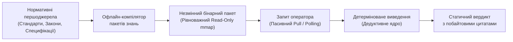
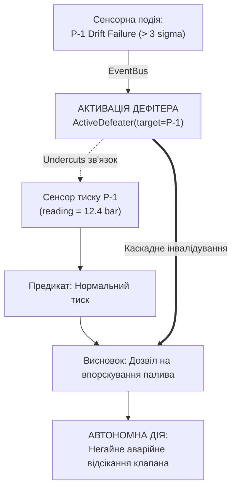
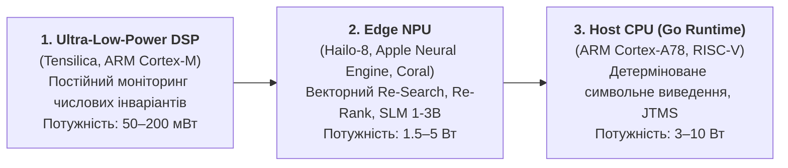

# Глава 35. Реактивна експертна система: події, відкликання й адаптація знань

> **Книга:** [Архітектура доказових експертних систем](README.md) · [Частина VII: Реалізація, розгортання та обмін знаннями](part-07-runtime-and-knowledge-exchange.md)  
> **Попередня глава:** [Глава 22. Кібернетичний цикл керування: сенсори, периферія та зворотний зв'язок](ch22-cybernetics-edge-to-backend.md)  
> **Наступна глава:** [Глава 33. Міжсистемний обмін знаннями: постачання правил стороннім системам, навчання моделей і захищений зворотний зв'язок](ch33-inter-system-knowledge-exchange-and-model-teaching.md)  
> **Зміст книги:** [README.md](README.md)  
> **Автор:** [Микола Федчик](about-the-author.md)  
> **Рівень:** системні архітектори, інженери знань, фахівці з безпеки та апаратного прискорення: просунутий  
> **Очікувані результати:** проєктувати самоорганізовані та подійно-орієнтовані архітектури експертних систем реального часу (Self-Organizing Real-Time Expert Systems); застосовувати закони синергетики (дисипативні структури Іллі Пригожина, принцип підпорядкування Германа Хакена, параметри порядку) до еволюції онтологій знань; організовувати неблокуючу обробку потоків телеметрії та зовнішніх подій через реактивну шину; реалізовувати дворівневу модель пам'яті знань L0/L1 (незмінний золотий базис-атрактор `mmap` та динамічний дельта-граф із підтримкою CRDT); впроваджувати системи підтримки істинності (Truth Maintenance Systems, JTMS/RMS) із миттєвою каскадною інвалідацією через активні дефітери (*Active Defeaters*) як механізм експорту ентропії; розподіляти задачі динамічного виведення (Re-Search, Re-Ranking, Re-Thinking) на енергоефективні апаратні прискорювачі (Edge NPU/DSP) у лімітах 1–5 Вт; аналізувати світові прецеденти автономної діагностики та самоорганізації (NASA Livingstone 2, Mobileye RSS).

## 1. Обмеження статичних експертних систем: від припущення замкненого світу до живої сенсорики та синергетики знань

Класична інженерія знань другої та ранньої третьої хвиль ШІ будувалася навколо концепції **термодинамічної рівноваги та замкненості на етапі збирання (Build-Time Closure)**:



Такий підхід забезпечує ідеальну побайтову доказовість і відтворюваність результату, проте в реальних кіберфізичних комплексах (автономні БПЛА, безпілотний транспорт, промислові контролери енергомереж, критичні медичні монітори) він стикається з фундаментальними обмеженнями:

1. **Інформаційна сліпота до подій середовища (Environment Blindness):**  
   Система оперує виключно знаннями, матеріалізованими під час останньої компіляції пакета. Якщо сенсор деградує, виникає відмова живлення або змінюється динамічний правовий статус операції (наприклад, перетин кордону юрисдикцій чи вхід у зону дії тимчасового розпорядження NOTAM), статичне ядро продовжує продукувати застарілі висновки, доки оператор явно не передасть нові вхідні змінні.
2. **Пасивна парадигма «запит / відповідь» (Pull-Driven Latency):**  
   Класичний рантайм пасивно очікує ініціативи від користувача. Він не здатен проактивно сповістити про назрівання аварійної відмови або автономно перевести підпорядковані виконавчі приводи в захисний стан (*Fail-Safe Mode*).
3. **Енергетична та часова непридатність пакетного перезавантаження (Batch Rebuild Overhead):**  
   Повне перезбирання пакетів знань займає секунди або хвилини, тоді як реакція на фізичну подію (заклинювання клапана чи втрата сигналу супутника) вимагає детермінованої адаптації за одиниці мілісекунд ($< 5\,\text{ms}$).

### Різниця між простою реактивністю та синергетичною самоорганізацією

Традиційна реактивна архітектура (Event-Driven Architecture) здатна сприймати зовнішні сигнали через обробники подій:

$$\text{Event} \longrightarrow \text{Action}$$

Проте жорстка зв'язка «подія $\to$ дія» є лише рефлекторною автоматизацією першого роду. Вона не здатна адаптувати власну внутрішню модель світу при зіткненні з непередбаченими комбінаціями факторів.

Справжня **самоорганізація експертної системи (Self-Organizing Knowledge System)**, фундамент якої закладено працями Германа Хакена та Іллі Пригожина [[10]](#src-10), виникає тоді, коли відкрита система:
* **Неперервно перебуває в нерівноважному стані**, обмінюючись інформацією із середовищем;
* **Автономно реструктурує онтологічний граф** і решітки пріоритетів без втручання людини;
* **Згортає мільйони сенсорних спостережень у макроскопічні параметри порядку** за принципом підпорядкування Хакена;
* **Зберігає абсолютну стійкість та доказовість**, використовуючи незмінний золотий базис L0 як глобальний фазовий атрактор істини.

---

## 2. Реактивне програмування та потоки подій як епістемічні імпульси

У реактивному рантаймі будь-яка зміна зовнішнього або внутрішнього світу представляється як типізована **подія (Event)**, що транслюється крізь неблокуючу шину повідомлень:

$$E = \langle \text{id}, \text{topic}, \text{source}, \text{timestamp}, \text{priority}, \text{payload}, \sigma_{\text{digest}} \rangle$$

```mermaid
flowchart TD
    subgraph Потоки подій (Event Sources)
        S1["Телеметрія сенсорів<br/>(IMU, CAN, VIO, Температура)"] -->|telemetry.*| EB["Реактивна шина подій<br/>(EventBus / Ring Buffer)"]
        S2["Зовнішні канали регулятора<br/>(API законодавства, NOTAM)"] -->|normative.*| EB
        S3["Внутрішня діагностика<br/>(Heartbeats, Watchdog)"] -->|diagnostic.*| EB
    end

    EB --> DISP["Реактивний диспетчер<br/>(Priority Router)"]

    DISP -->|Аварія сенсора| DEF["Активатор дефітерів<br/>(Truth Maintenance / JTMS)"]
    DISP -->|Зміна режиму польоту| RS["Re-Search & Re-Rank<br/>(Edge NPU Microservices)"]
    DISP -->|Новий нормативний факт| QA["Карантинний контролер<br/>(Admission Gate)"]
```

Шина подій (`EventBus`) реалізує патерн кільцевого буфера без блокувань (LMAX Disruptor pattern), що гарантує наносекундні затримки диспетчеризації подій між ядрами центрального процесора без створення тиску на збирач сміття.

---

## 3. Багаторівнева гібридна пам'ять L0 / L1: незмінний золотий базис та динамічний дельта-граф

Для збереження непорушного інваріанта побайтової доказовості (Evidence-Grounded Invariant) система розділяє знання на два строго ізольовані шари:

$$\mathcal{KB}_{\text{runtime}} = \mathcal{KB}_{L0} \oplus \Delta\mathcal{KB}_{L1}$$

| Шар пам'яті | Носій та формат | Змінність | Зміст знань | Затримка доступу |
|---|---|---|---|---|
| **L0 (Golden Master)** | Бінарний файл `mmap`, Read-Only | Абсолютно незмінний | Фізичні закони, базові стандарти IETF/ISO, конституційні норми | $< 1\,\mu\text{s}$ (Zero-Copy) |
| **L1 (Streaming Delta)** | Оперативна пам'ять (In-Memory CRDT) | Динамічний потоковий | Поточні стани апаратури, ситуативні винятки, заперечувальні обставини | $< 100\,\text{ns}$ |
| **Quarantine Buffer** | Ізольований буфер кандидатів | Тимчасовий ізольований | Неперевірені факти від сторонніх агентів до проходження SMT-тестів | Не бере участі у виведенні |

### Алгоритм розв'язання фактів (Evidence Resolution Priority):
При запиті предикатного значення для ключа $\text{Key} = \text{Subject} \mathbin{\#} \text{Predicate}$:
1. **Перевірка активних дефітерів:** Якщо на даний $\text{Key}$ накладено активну заперечувальну обставину $\text{Defeater}$, запит негайно повертає помилку відхилення підстави (*Defeated State*).
2. **Пошук у шарі L1:** Якщо в динамічному шарі знайдено запис:
   - Якщо це надгробок видалення (*Tombstone*), факт вважається спростованим/відкликаним.
   - Інакше повертається актуальне динамічне значення L1.
3. **Відкат до шару L0:** Якщо запис у L1 відсутній, значення вичитується з незмінного золотого базису L0.

### 3.1. Синергетика динамічної бази знань: самоорганізація, дисипативні структури та принцип підпорядкування

З позицій нерівноважної термодинаміки та синергетики Іллі Пригожина й Германа Хакена [[10]](#src-10), експертна система, занурена у фізичне середовище, є **відкритою нерівноважною інформаційною системою**. Безперервний приплив зовнішніх подій (телеметрія сенсорів, потоки нормативних дельт, асинхронні повідомлення шини) створює постійний обмін ентропією із середовищем $\frac{dS_{\text{ext}}}{dt}$, який у пасивній системі лише збільшує невпорядкованість ($dS_{\text{ext}}/dt > 0$).

У пасивній системі такий потік неминуче спричиняє **ентропійний колапс (знаннєве отруєння)**: накопичення застарілих фактів, циклічні суперечності, деградацію швидкодії та розрив логічного виведення. Щоб база знань зберігала високу впорядкованість та субмікросекундну швидкодію, вона повинна функціонувати як **дисипативна структура**, експортуючи ентропію назовні:

$$\frac{dS_{\text{sys}}}{dt} = \frac{dS_{\text{int}}}{dt} + \frac{dS_{\text{ext}}}{dt}, \qquad \frac{dS_{\text{int}}}{dt} \ge 0, \qquad \frac{dS_{\text{sys}}}{dt} \le 0 \iff \frac{dS_{\text{ext}}}{dt} \le -\frac{dS_{\text{int}}}{dt}$$

Тут $S_{\text{sys}}$ є ентропією самої системи, $dS_{\text{int}}/dt \ge 0$ є внутрішнім виробництвом ентропії в необоротних процесах (за другим законом термодинаміки воно не буває від'ємним), а $dS_{\text{ext}}/dt$ є обміном із середовищем. Впорядкованість зберігається, коли експорт ентропії ($dS_{\text{ext}}/dt < 0$) за модулем не менший за її внутрішнє виробництво. Для бази знань це аналогія: «ентропією» названо міру безладу фактів (суперечності, застарілі записи), а не термодинамічну величину.

В архітектурі самоорганізованої бази знань цей синергетичний імператив спирається на **чотири фундаментальні закони інформаційної синергетики**:

#### 1. Закон нерівноважного інформаційного припливу (Non-Equilibrium Influx)
Рівноважна база знань (статичний офлайн-пакет) мертва: вона нездатна реагувати на зміну середовища без повного перезавантаження. Самоорганізація можлива лише **далеко від термодинамічної рівноваги**: в умовах неперервного припливу епістемічних імпульсів від сенсорів та зовнішніх шин. Потік подій підтримує базу знань у стані динамічної чутливості до фазових переходів середовища.

#### 2. Принцип підпорядкування Хакена та семантичні параметри порядку (Slaving Principle & Order Parameters)
У фізичному середовищі функціонують мільйони «швидких» мікроскопічних змінних $\mathbf{q}_{\text{fast}}$ (покази акселерометрів, напруги на шинах живлення, мікросекундні флуктуації тиску, частота обертання роторів із частотою опитування $1\text{–}10\,\text{kHz}$). Спроба обробляти кожну швидку змінну через окреме предикатне правило призводить до комбінаторного вибуху та перевантаження пам'яті.

Згідно з **принципом підпорядкування Германа Хакена (Slaving Principle)**, поведінка складних багатовимірних систем визначається не окремими мікроскопічними змінними, а кількома повільними колективними змінними: **параметрами порядку (Order Parameters)** $\boldsymbol{\xi}_{\text{order}}$:

$$\mathbf{q}_{\text{fast}}(t) = \mathbf{f}\bigl(\boldsymbol{\xi}_{\text{order}}(t), \text{noise}\bigr)$$

У самоорганізованій експертній системі параметрами порядку виступають інтегральні семантичні макростани онтології:
$$\boldsymbol{\xi}_{\text{order}} \in \{\text{NominalFlight}, \text{HydraulicDegradation}, \text{SevereIcingRisk}, \text{AirspaceRestricted}\}$$

Швидкі сенсорні змінні агрегуються периферійними процесорами (DSP/NPU) і «підпорядковуються» поточному параметру порядку. Коли сенсорний потік демонструє колективну когерентну зміну, виникає **фазовий перехід онтології**: параметр порядку змінює своє значення, що миттєво перебудовує конфігурацію всього простору активних правил без необхідності поодинокої диспетчеризації мільйонів сирих відліків.

```mermaid
flowchart TD
    subgraph Мікроскопічні швидкі змінні (q_fast: 1-10 kHz)
        S1["Вібрація ротора 1"]
        S2["Струм обмотки фази B"]
        S3["Температура мастила"]
        S4["Тиск у контурі охолодження"]
    end

    subgraph Апаратна когерентна редукція (Edge DSP / NPU)
        REDUC["Векторний когерентний синтез<br/>(Haken Slaving Projection)"]
    end

    subgraph Макроскопічний параметр порядку (xi_order)
        OP["<b>Параметр порядку:</b><br/>BearingPreFailureImminence"]
    end

    subgraph Макродинаміка онтології (L1 Runtime)
        RULE["Реструктуризація решітки правил:<br/>Survival Dominance Mode"]
    end

    S1 --> REDUC
    S2 --> REDUC
    S3 --> REDUC
    S4 --> REDUC
    REDUC ==>|Підпорядкування| OP
    OP ==>|Фазовий перехід онтології| RULE
    RULE -.->|Колова причинність (Circular Causality)| REDUC
```

#### 3. Обмежена самоорганізація під доказовими атракторами (Constrained Self-Organization under Truth Attractors)
У класичній синергетиці самоорганізація відкритих систем може приводити до хаотичних атракторів чи непередбачуваних біфуркацій (що в мовних моделях проявляється як некеровані галюцинації). В інженерних доказових системах допускається виключно **обмежена самоорганізація (Constrained Self-Organization)**:
* **Золотий базис L0 (`mmap`) виступає як абсолютний фазовий атрактор істинності $\mathcal{A}_{\text{truth}}$:** Жодна емерджентна реструктуризація в динамічному шарі L1 не здатна деформувати, підмінити чи скасувати конституційні норми, базові фізичні інваріанти та сертифіковані межі безпеки L0.
* **JTMS-інвалідація як експорт ентропії:** Активація активного дефітера (*Active Defeater*) миттєво анігілює підграфи скомпрометованих міркувань, експортуючи інформаційний хаос назовні та повертаючи фазову траєкторію системи в компактний захисний басейн притягання (*Safe Attractor Basin*).
* **Карантинний шлюз як напівпроникна селективна мембрана:** Нові емерджентні факти сторонніх агентів проходять крізь SMT-мембрану (шлюз допуску) лише за умови строгой узгодженості з інваріантами $\mathcal{A}_{\text{truth}}$, захищаючи систему від знаннєвого отруєння.

#### 4. Апаратний енергетичний метаболізм (Edge Hardware Metabolism)
Самоорганізація є термодинамічним процесом, що вимагає безперервного споживання вільної енергії для локального зменшення ентропії (за принципом Ервіна Шредінгера: «система живиться негативною ентропією»). У батарейних автономних комплексах цей інформаційний метаболізм реалізують мікропроцесори Edge NPU/DSP із наднизьким енергоспоживанням (1–5 Вт), виконуючи безперервне перетравлення сенсорного шуму та підтримку когерентності бази знань без залучення енергоємного головного CPU.

---

## 4. Спростовне супроводження істинності (Truth Maintenance Systems): динамічні активні дефітери

У класичній системі збереження істинності Дойла (Justification-Based Truth Maintenance System, JTMS) кожне твердження спирається на множину підстав:

$$\text{Node} = \langle \text{Datum}, \text{IN-List}, \text{OUT-List} \rangle$$

де $\text{IN-List}$ містить факти, які мають бути істинними, а $\text{OUT-List}$ містить заперечувальні обставини, які мають бути хибними (відсутніми) для визнання висновку валідним.



Коли сенсорна подія сигналізує про фізичну аномалію (наприклад, розбіжність показників дубльованих датчиків понад $3\sigma$), реактивний рушій генерує **активний дефітер (Active Defeater)**:

$$\text{Fault}(\text{Sensor}_A) \implies \text{ActivateDefeater}(\text{Sensor}_A \mathbin{\#} \text{reading})$$

Це миттєво підриває кореневий засновок (*Undercutting Defeater*). Усі похідні висновки графа залежностей автоматично втрачають силу, переводячи систему в режим безпечної зупинки або підключення резервного сенсорного каналу.

---

## 5. Синергетичний рушій самоорганізації: мікросервіси Re-Search, Re-Ranking та Re-Thinking

Самоорганізація не є монолітним процесом. Вона розгортається через трійку спеціалізованих мікросервісів, які безперервно підтримують гомеостаз бази знань та керують фазовими переходами:

```mermaid
flowchart LR
    subgraph Зовнішнє збурення
        P["Зсув параметра порядку<br/>(xi_order drift)"]
    end

    subgraph Контур самоорганізації (Self-Organization Loop)
        RS["<b>1. Re-Search</b><br/>Закон Ешбі: динамічний добір<br/>підграфів та різноманітності"]
        RR["<b>2. Re-Ranking</b><br/>Фазовий перехід: перебудова<br/>решітки домінування норм"]
        RT["<b>3. Re-Thinking</b><br/>Дисипація суперечностей:<br/>AGM-ревізія та QuickXplain"]
    end

    subgraph Результат в онтології L1
        KB["Когерентна адаптована онтологія<br/>без участі оператора"]
    end

    P --> RS
    RS --> RR
    RR --> RT
    RT --> KB
    KB -.->|Зворотний зв'язок| RS
```

### 5.1. Re-Search: еволюційний добір знань та закон необхідної різноманітності Ешбі
Згідно із законом Ешбі, різноманітність керуючої системи повинна бути не меншою за різноманітність збурень середовища. Коли параметр порядку $\boldsymbol{\xi}_{\text{order}}$ фіксує дрейф робочої точки (наприклад, супутник переходить у тінь Землі або БПЛА входить у зону радіоелектронного придушення), мікросервіс Re-Search автономно:
* Ініціює випереджальний добір (*Prefetching*) відповідних нормативних та процедурних підграфів із постійних сховищ L0 у високошвидкісний кеш L1;
* Забезпечує, що в оперативній пам'яті завжди присутній точний набір правил, необхідний для парирування нових загроз ще до того, як виникне гостра аварійна ситуація;
* Працює на базі квантованих матричних індексів на Edge NPU, витрачаючи $< 1.5\,\text{W}$.

### 5.2. Re-Ranking: адаптивна реструктуризація решіток переваг
Норми, цілі та правила не мають фіксованої статичної ваги. Їхня значущість змінюється залежно від відстані до точок біфуркації. Сервіс Re-Ranking здійснює субмілісекундну перебудову решіток пріоритетів без оператора:
* **Штатний режим (Equilibrium Basin):** домінують правила енергетичної ефективності, точності навігації та економії палива:
  $$\text{Priority}(\text{FuelEfficiency}) \succ \text{Priority}(\text{EmergencyRedundancy})$$
* **Передбіфуркаційний стан (Critical Slowing Down detected):** сервіс здійснює фазову переконфігурацію онтології на користь виживання (*Survival Dominance*):
  $$\text{Priority}(\text{SafetyShield}) \gg \text{Priority}(\text{MissionGoal}) \gg \text{Priority}(\text{Efficiency})$$
Це гарантує, що жодне оптимізаційне правило не зможе заблокувати спрацьовування захисних інваріантів при наближенні катастрофи.

### 5.3. Re-Thinking: дисипація протиріч та спростовний резолвінг за AGM
Коли приплив нової сенсорної інформації породжує логічну суперечність із раніше прийнятими гіпотезами (наприклад, суперечливі свідчення резервних датчиків або неможлива просторова комбінація), сервіс Re-Thinking здійснює **інформаційну дисипацію**:
* Застосовує постулати ревізії переконань Альчуррона–Герденфорса–Макінсона (AGM Belief Revision) для детермінованого стиснення (*Contraction*) конфліктних множин;
* Локалізує мінімальні некогерентні підмножини (Minimal Unsatisfiable Cores, MUC) за алгоритмом QuickXplain;
* Детерміновано відсікає найменш надійні гіпотези, ретрактуючи похідні факти без руйнування цілісності фундаментального ядра L0. База знань самостійно скидає ентропійну напругу, відновлюючи строгу несуперечливість.

---

## 6. Енергоефективне апаратне прискорення на Edge: NPU, DSP проти серверних GPU

У кіберфізичних системах живлення від акумуляторів унеможливлює використання серверних графічних процесорів (GPU), що споживають $200\text{–}700\,\text{W}$. Реактивна експертна система використовує багаторівневий розподіл обов'язків:



* **DSP ($< 200\,\text{mW}$):** працює на частоті сенсорів ($1\text{–}10\,\text{kHz}$), перевіряючи граничні числові конверти валідності без пробудження центрального процесора.
* **NPU ($1.5\text{–}5\,\text{W}$):** виконує квантовані моделі малого масштабу (SLM INT4) та векторні індекси для класифікації неструктурованих спостережень та швидкого ранжування кандидатів.
* **Host CPU ($3\text{–}10\,\text{W}$):** виконує строгу детерміновану логіку, криптографічні перевірки підписів Ed25519 та супровід цілісності бази фактів.

Принципову перевагу спеціалізованих тензорних прискорювачів над універсальними процесорами обґрунтували Джоуппі та співавтори в аналізі архітектури TPU [[15]](#src-15): матричне множення на базі систолічного масиву (*systolic array*) передає проміжні результати безпосередньо між сусідніми обчислювальними комірками без постійного звернення до енерговитратного регістрового файлу та ієрархії кешів. В енергоефективній периферійній експертній системі це забезпечує багаторазовий виграш енергоефективності (TOPS/Watt) при векторному пошуку та квантованому нейромережевому ранжуванні, зберігаючи обмежений енергетичний бюджет для символьних обчислень центрального процесора.

---

## 7. Прецеденти у світовій практиці та індустрії

1. **NASA Deep Space 1 та EO-1 (Модельно-орієнтована автономія Livingstone 2):**  
   Система Livingstone на борту зонда Deep Space 1 поєднувала декларативну модель апарата у вигляді якісних кінцевих автоматів із реактивним виведенням. Коли відмовляв клапан двигуна, система за мілісекунди оновлювала граф можливих станів апарата й автономно змінювала конфігурацію маневру без допомоги наземного центру управління.
2. **Mobileye RSS (Responsibility-Sensitive Safety):**  
   Формальна модель математичної безпеки реалізована як реактивний предикатний щит. Потокові дані детекцій від лідарів та камер щосекунди перетворюються на динамічні просторові судження. Якщо траєкторний планувальник пропонує маневр, що порушує предикат безпечної дистанції, реактивний щит миттєво блокує сигнал керування приводами коліс.
3. **Авіаційна безпека (Honeywell Runway Overrun Warning System - ROAS):**  
   Бортовий реактивний процесор зіставляє динаміку посадки літака (вітер, вага, залишкова довжина ЗПС) з нормативними межами, автоматично ескалуючи стан від моніторингу до примусової голосової команди екіпажу на друге коло.

---

## 8. Програмна реалізація мовою Go: пакет `reactive`

Нижче наведено повну самодостатню реалізацію реактивного рантайму, що демонструє неблокуючу шину подій, дворівневу пам'ять L0/L1 з активними дефітерами, карантин фактів та диспетчеризацію NPU-сервісів:

```go
package reactive

import (
	"context"
	"crypto/sha256"
	"encoding/hex"
	"fmt"
	"sort"
	"strings"
	"sync"
	"time"
)

// Priority визначає рівень терміновості події.
type Priority int

const (
	PriorityNormal Priority = iota
	PriorityHigh
	PriorityCritical
)

// Event моделює автономний сенсорний або зовнішній сигнал.
type Event struct {
	ID        string         `json:"id"`
	Topic     string         `json:"topic"`
	Source    string         `json:"source"`
	Payload   map[string]any `json:"payload"`
	Timestamp time.Time      `json:"timestamp"`
	Priority  Priority       `json:"priority"`
}

// Digest генерує криптографічний відбиток події.
func (e *Event) Digest() string {
	h := sha256.New()
	fmt.Fprintf(h, "%s:%s:%s:%d:%d", e.ID, e.Topic, e.Source, e.Timestamp.UnixNano(), e.Priority)
	return hex.EncodeToString(h.Sum(nil))
}

// Fact представляє атомарне судження в онтології.
type Fact struct {
	Subject    string    `json:"subject"`
	Predicate  string    `json:"predicate"`
	Object     string    `json:"object"`
	Source     string    `json:"source"`
	Timestamp  time.Time `json:"timestamp"`
	IsTombston bool      `json:"is_tombstone"`
}

func (f Fact) Key() string {
	return f.Subject + "#" + f.Predicate
}

// ActiveDefeater описує активну заперечувальну обставину, активовану подією.
type ActiveDefeater struct {
	DefeaterID string    `json:"defeater_id"`
	TargetKey  string    `json:"target_key"`
	Reason     string    `json:"reason"`
	CreatedAt  time.Time `json:"created_at"`
}

// EventBus реалізує високошвидкісну pub/sub шину з підтримкою шаблонів топіків.
type EventBus struct {
	mu          sync.RWMutex
	subscribers map[string][]chan Event
	closed      bool
}

func NewEventBus() *EventBus {
	return &EventBus{
		subscribers: make(map[string][]chan Event),
	}
}

func (eb *EventBus) Subscribe(topic string, bufferSize int) <-chan Event {
	eb.mu.Lock()
	defer eb.mu.Unlock()
	ch := make(chan Event, bufferSize)
	eb.subscribers[topic] = append(eb.subscribers[topic], ch)
	return ch
}

func (eb *EventBus) Publish(event Event) {
	eb.mu.RLock()
	defer eb.mu.RUnlock()
	if eb.closed {
		return
	}
	for pattern, chList := range eb.subscribers {
		if pattern == "*" || pattern == event.Topic || (strings.HasSuffix(pattern, ".*") && strings.HasPrefix(event.Topic, strings.TrimSuffix(pattern, ".*"))) {
			for _, ch := range chList {
				select {
				case ch <- event:
				default:
				}
			}
		}
	}
}

func (eb *EventBus) Close() {
	eb.mu.Lock()
	defer eb.mu.Unlock()
	if eb.closed {
		return
	}
	eb.closed = true
	for _, chList := range eb.subscribers {
		for _, ch := range chList {
			close(ch)
		}
	}
	eb.subscribers = nil
}

// DeltaStore забезпечує гібридне зберігання L0/L1, активні дефітери та карантин.
type DeltaStore struct {
	mu              sync.RWMutex
	l0Static        map[string]Fact
	l1Delta         map[string]Fact
	activeDefeaters map[string]ActiveDefeater
	quarantine      map[string]Fact
}

func NewDeltaStore() *DeltaStore {
	return &DeltaStore{
		l0Static:        make(map[string]Fact),
		l1Delta:         make(map[string]Fact),
		activeDefeaters: make(map[string]ActiveDefeater),
		quarantine:      make(map[string]Fact),
	}
}

func (ds *DeltaStore) LoadL0(facts []Fact) {
	ds.mu.Lock()
	defer ds.mu.Unlock()
	for _, f := range facts {
		ds.l0Static[f.Key()] = f
	}
}

func (ds *DeltaStore) IngestL1(f Fact) {
	ds.mu.Lock()
	defer ds.mu.Unlock()
	ds.l1Delta[f.Key()] = f
}

func (ds *DeltaStore) PutQuarantine(f Fact) {
	ds.mu.Lock()
	defer ds.mu.Unlock()
	ds.quarantine[f.Key()] = f
}

func (ds *DeltaStore) ReleaseQuarantine(key string) (Fact, bool) {
	ds.mu.Lock()
	defer ds.mu.Unlock()
	f, ok := ds.quarantine[key]
	if !ok {
		return Fact{}, false
	}
	delete(ds.quarantine, key)
	ds.l1Delta[key] = f
	return f, true
}

func (ds *DeltaStore) ActivateDefeater(d ActiveDefeater) {
	ds.mu.Lock()
	defer ds.mu.Unlock()
	ds.activeDefeaters[d.TargetKey] = d
}

func (ds *DeltaStore) DeactivateDefeater(targetKey string) {
	ds.mu.Lock()
	defer ds.mu.Unlock()
	delete(ds.activeDefeaters, targetKey)
}

func (ds *DeltaStore) Query(subject, predicate string) (Fact, error) {
	ds.mu.RLock()
	defer ds.mu.RUnlock()
	key := subject + "#" + predicate

	if def, isDefeated := ds.activeDefeaters[key]; isDefeated {
		return Fact{}, fmt.Errorf("fact defeated: %s (reason: %s)", key, def.Reason)
	}

	if f, ok := ds.l1Delta[key]; ok {
		if f.IsTombston {
			return Fact{}, fmt.Errorf("fact retracted: %s", key)
		}
		return f, nil
	}

	if f, ok := ds.l0Static[key]; ok {
		return f, nil
	}
	return Fact{}, fmt.Errorf("fact not found: %s", key)
}

// StateContext зберігає оперативний контекст апарата.
type StateContext struct {
	EmergencyMode bool
	CurrentPhase  string
}

// NPUServiceDispatcher симулює роботу низькоспоживаючих апаратних прискорювачів.
type NPUServiceDispatcher struct{}

func NewNPUServiceDispatcher() *NPUServiceDispatcher {
	return &NPUServiceDispatcher{}
}

func (d *NPUServiceDispatcher) ReSearch(ctx context.Context, phase string) []Fact {
	if phase == "EMERGENCY_DESCENT" {
		return []Fact{
			{Subject: "cabin_pressurization", Predicate: "target_altitude_ft", Object: "10000", Source: "npu_research"},
		}
	}
	return nil
}

func (d *NPUServiceDispatcher) ReRank(facts []Fact, sCtx StateContext) []Fact {
	ranked := make([]Fact, len(facts))
	copy(ranked, facts)
	sort.SliceStable(ranked, func(i, j int) bool {
		if sCtx.EmergencyMode && ranked[i].Predicate == "emergency_action" {
			return true
		}
		return false
	})
	return ranked
}

// ReactiveEngine координує реакцію експертної системи на потокові сигнали.
type ReactiveEngine struct {
	mu           sync.RWMutex
	eventBus     *EventBus
	deltaStore   *DeltaStore
	npu          *NPUServiceDispatcher
	stateContext StateContext
	alerts       []string
}

func NewReactiveEngine(eb *EventBus, ds *DeltaStore, npu *NPUServiceDispatcher) *ReactiveEngine {
	return &ReactiveEngine{
		eventBus:   eb,
		deltaStore: ds,
		npu:        npu,
	}
}

func (re *ReactiveEngine) HandleEvent(ctx context.Context, ev Event) {
	re.mu.Lock()
	defer re.mu.Unlock()

	switch ev.Topic {
	case "telemetry.sensor_fault":
		targetKey, _ := ev.Payload["target_key"].(string)
		reason, _ := ev.Payload["reason"].(string)
		if targetKey != "" {
			re.deltaStore.ActivateDefeater(ActiveDefeater{
				DefeaterID: ev.ID,
				TargetKey:  targetKey,
				Reason:     reason,
				CreatedAt:  ev.Timestamp,
			})
			re.alerts = append(re.alerts, fmt.Sprintf("DEFEATER_ON: %s", targetKey))
		}

	case "environment.phase_change":
		phase, _ := ev.Payload["phase"].(string)
		re.stateContext.CurrentPhase = phase
		if phase == "EMERGENCY_DESCENT" {
			re.stateContext.EmergencyMode = true
		}
		discovered := re.npu.ReSearch(ctx, phase)
		for _, f := range discovered {
			re.deltaStore.IngestL1(f)
		}
	}
}

func (re *ReactiveEngine) GetAlerts() []string {
	re.mu.RLock()
	defer re.mu.RUnlock()
	res := make([]string, len(re.alerts))
	copy(res, re.alerts)
	return res
}
```

---

## 9. Модульні тести: верифікація реактивного рантайму

```go
package reactive

import (
	"context"
	"testing"
	"time"
)

func TestReactiveEngine_SensorFault_And_JTMS_Invalidation(t *testing.T) {
	eb := NewEventBus()
	defer eb.Close()

	ds := NewDeltaStore()
	ds.LoadL0([]Fact{
		{Subject: "pitot_tube_1", Predicate: "airspeed_knots", Object: "250"},
	})

	npu := NewNPUServiceDispatcher()
	engine := NewReactiveEngine(eb, ds, npu)

	// До події факт доступний
	f, err := ds.Query("pitot_tube_1", "airspeed_knots")
	if err != nil || f.Object != "250" {
		t.Fatalf("expected 250 knots before fault, got %v", f)
	}

	// Аварійна подія відмови датчика
	ev := Event{
		ID:        "evt-09",
		Topic:     "telemetry.sensor_fault",
		Source:    "sensor_supervisor",
		Timestamp: time.Now(),
		Priority:  PriorityCritical,
		Payload: map[string]any{
			"target_key": "pitot_tube_1#airspeed_knots",
			"reason":     "icing_detected_heater_off",
		},
	}

	engine.HandleEvent(context.Background(), ev)

	// Після події активується дефітер: факт негайно відхиляється
	_, err = ds.Query("pitot_tube_1", "airspeed_knots")
	if err == nil {
		t.Fatal("expected query to fail under active defeater, but succeeded")
	}

	alerts := engine.GetAlerts()
	if len(alerts) != 1 || alerts[0] != "DEFEATER_ON: pitot_tube_1#airspeed_knots" {
		t.Fatalf("unexpected alerts: %v", alerts)
	}
}

func TestReactiveEngine_PhaseShift_And_NPU_ReSearch(t *testing.T) {
	eb := NewEventBus()
	defer eb.Close()

	ds := NewDeltaStore()
	npu := NewNPUServiceDispatcher()
	engine := NewReactiveEngine(eb, ds, npu)

	// Подія зміни фази польоту
	ev := Event{
		ID:        "evt-10",
		Topic:     "environment.phase_change",
		Source:    "fsm_navigator",
		Timestamp: time.Now(),
		Priority:  PriorityHigh,
		Payload: map[string]any{
			"phase": "EMERGENCY_DESCENT",
		},
	}

	engine.HandleEvent(context.Background(), ev)

	// NPU Re-Search динамічно підвантажив факт у L1
	f, err := ds.Query("cabin_pressurization", "target_altitude_ft")
	if err != nil || f.Object != "10000" {
		t.Fatalf("expected 10000 ft dynamically ingested by Re-Search, got err: %v", err)
	}
}

func TestQuarantineBuffer_Lifecycle(t *testing.T) {
	ds := NewDeltaStore()
	unverified := Fact{Subject: "external_regulator", Predicate: "rule_v2", Object: "APPLY"}

	ds.PutQuarantine(unverified)

	// Факту немає в робочому просторі
	if _, err := ds.Query("external_regulator", "rule_v2"); err == nil {
		t.Fatal("quarantined fact must not be queryable")
	}

	// Звільнення з карантину після SMT-перевірки
	if _, ok := ds.ReleaseQuarantine(unverified.Key()); !ok {
		t.Fatal("failed to release from quarantine")
	}

	// Тепер факт доступний у L1
	if f, err := ds.Query("external_regulator", "rule_v2"); err != nil || f.Object != "APPLY" {
		t.Fatalf("expected fact queryable after quarantine release, got %v", f)
	}
}
```

---

## Висновки
1. **Синергетична самоорганізація проти простої реактивності:** Звичайна реактивність ($\mathrm{Event} \to \mathrm{Action}$) є механічним рефлексом. Справжня самоорганізація бази знань виникає у відкритій нерівноважній системі за законами Пригожина й Хакена, де мільйони швидких сенсорних змінних підпорядковуються макроскопічним параметрам порядку, а топологія онтології автономно еволюціонує без операторського втручання.
2. **Дворівнева гібридна пам'ять як фазовий атрактор (L0/L1):** Незмінний золотий базис (`mmap`) гарантує, що нелінійна синергетична динаміка шару L1 залишається строго обмеженою (Constrained Self-Organization) і не деградує в галюцинації чи отруєння знань ($\text{ZHR} = 1{,}00$, $\text{FCP} = 100\%$).
3. **JTMS та карантин як інформаційна дисипація:** Активні дефітери (*Active Defeaters*) миттєво відсікають нестійкі гілки міркувань, експортуючи ентропію назовні ($dS_{\text{ext}}/dt < 0$), а карантинний буфер діє як напівпроникна селективна мембрана для сторонніх знань.
4. **Тріада Re-Search, Re-Ranking, Re-Thinking як двигун адаптації:** Закон необхідної різноманітності Ешбі реалізується через автономний добір нормативних підграфів (Re-Search), перебудову решіток пріоритетів норм (Re-Ranking) та розв'язання конфліктів за AGM (Re-Thinking).
5. **Апаратний енергетичний метаболізм на Edge:** Використання мікропотужних NPU та DSP (1–5 Вт) забезпечує термодинамічне живлення процесів боротьби з ентропією безпосередньо на борту автономних платформ без залежності від хмарних серверів.

## Реактивне виконання в маршруті експлуатації

Глава 17 визначає семантичні вимоги до інструментів, глава 18 обґрунтовує апаратне розміщення, а глава 22 розділяє часові горизонти фізичного керування. Ця глава додає реактивне виконання й перегляд підстав за подіями. Дослідницьку аналогію синергетичної самоорганізації слід відрізняти від перевіреної поведінки конкретного обробника подій.

## Подальший шлях пізнання

Наступна в тематичному порядку [глава 33](ch33-inter-system-knowledge-exchange-and-model-teaching.md) завершує основний маршрут контрактом міжсистемного обміну. Кандидати з подій і зовнішнього зворотного зв'язку проходять процедури [Частини V](part-05-verification-and-learning.md). Прикладні напрями зібрано в [додатках](README.md#додатки).

## Запитання до читачів
1. У чому полягає принципова відмінність між простою подійною реактивністю ($\mathrm{Event} \to \mathrm{Action}$) та синергетичною самоорганізацією бази знань за Германом Хакеном?
2. Як принцип підпорядкування Хакена дозволяє подолати «прокляття розмірності» при обробці високочастотних сенсорних потоків (1–10 кГц)?
3. Чому шар пам'яті L0 розглядається як глобальний фазовий атрактор істинності для динамічного шару L1?
4. Яким чином подія сенсорної відмови трансформується в активний дефітер (*Active Defeater*) у термінах систем підтримки істинності (JTMS)?
5. У чому полягає різниця між підривом підстави (*Undercutting Defeater*) та спростуванням протилежним фактом (*Rebutting Defeater*) при реактивному моніторингу?
6. Як мікросервіси Re-Search, Re-Ranking та Re-Thinking реалізують закон необхідної різноманітності Ешбі та керують фазовими переходами онтології?
7. Чому видалення факту в реактивному шарі L1 вимагає використання надгробків (*Tombstones*), а не звичайного очищення пам'яті?
8. Яку термодинамічну роль відіграють периферійні процесори NPU/DSP як орган «енергетичного метаболізму» в дисипативній структурі бази знань?
9. Яку функцію виконує карантинний буфер (Quarantine Buffer) при отриманні емерджентних оновлень онтології від сторонніх систем?
10. Як у системі NASA Livingstone 2 було реалізовано автономне відновлення планів польоту на основі якісної біфуркації станів та модельної діагностики?

## Словник
| Український термін | Англійський відповідник | Коротке пояснення |
|---|---|---|
| **Самоорганізована експертна система** | Self-Organizing Expert System | Відкрита нерівноважна система, що автономно адаптує топологію бази знань під впливом потоків подій, зберігаючи інваріанти доказовості. |
| **Принцип підпорядкування Хакена** | Haken's Slaving Principle | Синергетичний закон, згідно з яким швидкі мікроскопічні змінні системи підпорядковуються небагатьом повільним параметрам порядку. |
| **Параметр порядку онтології** | Ontological Order Parameter | Макроскопічна семантична змінна вищого рівня, що визначає конфігурацію активних логічних правил і режим функціонування. |
| **Дисипативна структура знань** | Dissipative Knowledge Structure | Відкрита інформаційна модель, що підтримує впорядкованість через постійний експорт ентропії (інвалідація хибних засновків, дефітери). |
| **Фазовий атрактор істинності** | Truth Attractor Basin | Простір допустимих станів, що задається незмінним базисом L0, до якого система гарантовано повертається при збуреннях. |
| **Активний дефітер** | Active Defeater | Динамічна умова в системі супроводження істинності, що негайно блокує чинність факту чи правила внаслідок сенсорної аномалії. |
| **Шар L0** | Golden Master Base | Незмінний, криптографічно підписаний та відображений у пам'ять (`mmap`) шар фундаментальних аксіом і стандартів. |
| **Шар L1** | Streaming Delta-Graph | Високопродуктивний оперативний шар дельта-змін, епізодичних фактів та заперечувальних обставин, що мутує в рантаймі. |
| **Re-Search** | Re-Search | Сервіс автономного випереджального добору нормативних підграфів із розподілених баз знань за законом Ешбі. |
| **Re-Ranking** | Re-Ranking | Динамічний сервіс контекстного перерахунку пріоритетів і решіток переваг для правил під час фазових переходів. |
| **Re-Thinking** | Re-Thinking | Процедура спростовного резолвінгу та ревізії переконань (AGM) для усунення ентропійних конфліктів при контрприкладах. |
| **Карантин знань** | Knowledge Quarantine | Ізольований буфер для перевірки сторонніх гіпотез на узгодженість з інваріантами перед злиттям із базою знань. |

## Абревіатури
| Абревіатура | Повна назва | Значення в контексті глави |
|---|---|---|
| **AGM** | Alchourrón, Gärdenfors, Makinson | Стандартна логічна парадигма ревізії переконань та усунення суперечностей |
| **CBR** | Case-Based Reasoning | Міркування на основі прецедентів |
| **CRDT** | Conflict-free Replicated Data Type | Конфліктно-вільні репліковані типи даних для розподілених графів знань |
| **CWA** | Closed World Assumption | Припущення про замкненість світу |
| **DSP** | Digital Signal Processor | Цифровий сигнальний процесор для первинної фільтрації сенсорних потоків |
| **FCP** | False Claim Prevention | Відсоток запобігання непідтвердженим твердженням (інваріант = 100%) |
| **FSM** | Finite State Machine | Скінченний автомат станів системи |
| **JTMS** | Justification-based Truth Maintenance System | Система підтримки істинності на основі обґрунтувань |
| **NPU** | Neural Processing Unit | Енергоефективний нейроморфний співпроцесор для Edge-обчислень (1–5 Вт) |
| **RMS** | Reason Maintenance System | Система супроводження міркувань та розв'язання конфліктів |
| **SLM** | Small Language Model | Компактна локальна мовна модель для онбордної генерації гіпотез |
| **ZHR** | Zero Hallucination Rate | Коефіцієнт нульових галюцинацій (інваріант = 1,00) |

## Джерела
1. **Haken, H.** (1977). *Synergetics: An Introduction. Nonequilibrium Phase Transitions and Self-Organization in Physics, Chemistry, and Biology*. Springer-Verlag.
2. **Haken, H.** (1983). *Advanced Synergetics: Instability Hierarchies of Self-Organizing Systems and Devices*. Springer-Verlag.
3. **Prigogine, I., & Stengers, I.** (1984). *Order out of Chaos: Man's New Dialogue with Nature*. Bantam Books.
4. **Ashby, W. R.** (1956). *An Introduction to Cybernetics*. Chapman & Hall.
5. **Wiener, N.** (1948). *Cybernetics: Or Control and Communication in the Animal and the Machine*. MIT Press.
6. **Doyle, J.** (1979). A truth maintenance system. *Artificial Intelligence*, 12(3), 231–272.
7. **Muscettola, N., Nayak, P. P., Pell, B., & Williams, B. C.** (1998). Remote Agent: To boldly go where no AI has gone before. *Artificial Intelligence*, 103(1-2), 5–47.
8. **Kurien, J., & Nayak, P. P.** (2000). Back to the future for model-based diagnosis. In *AAAI/IAAI* (pp. 130–135).
9. **Shalev-Shwartz, S., Shammah, S., & Shashua, A.** (2017). On a formal model of safe and scalable self-driving cars. *arXiv preprint arXiv:1708.06374*.
10. **Könighofer, B., Bloem, R., et al.** (2018). Shielded Reinforcement Learning. In *AAAI Conference on Artificial Intelligence*.
11. **Alchourrón, C. E., Gärdenfors, P., & Makinson, D.** (1985). On the logic of theory change: Partial meet contraction and revision functions. *Journal of Symbolic Logic*, 50(2), 510–530.
12. **Junker, U.** (2004). QUICKXPLAIN: Preferred explanations and relaxations for over-constrained problems. In *AAAI* (Vol. 4, pp. 167–172).
13. **Platzer, A.** (2018). *Logical Foundations of Cyber-Physical Systems*. Springer.
14. **Thompson, M., et al.** (2011). Disruptor: High performance alternative to bounded queues for exchanging data between threads. *LMAX Technical Whitepaper*.
15. <a id="src-15"></a>**Jouppi, N. P., et al.** (2017). In-datacenter performance analysis of a tensor processing unit. In *Proceedings of the 44th Annual International Symposium on Computer Architecture (ISCA)* (pp. 1–12). [research.google](https://research.google/pubs/in-datacenter-performance-analysis-of-a-tensor-processing-unit/).

---

[← Глава 22](ch22-cybernetics-edge-to-backend.md) | [Зміст книги](README.md) | [Частина VII](part-07-runtime-and-knowledge-exchange.md) | [Глава 33 →](ch33-inter-system-knowledge-exchange-and-model-teaching.md)
