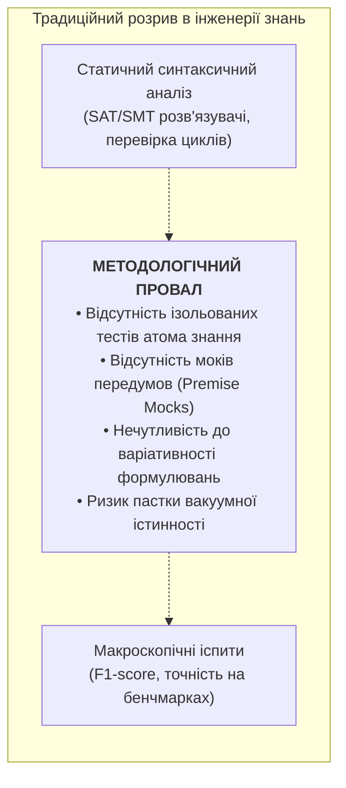
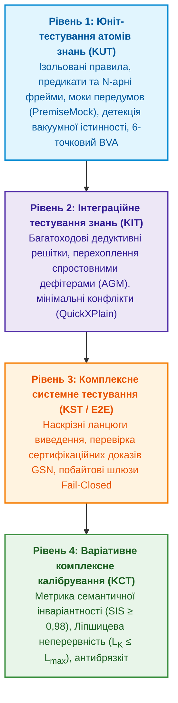
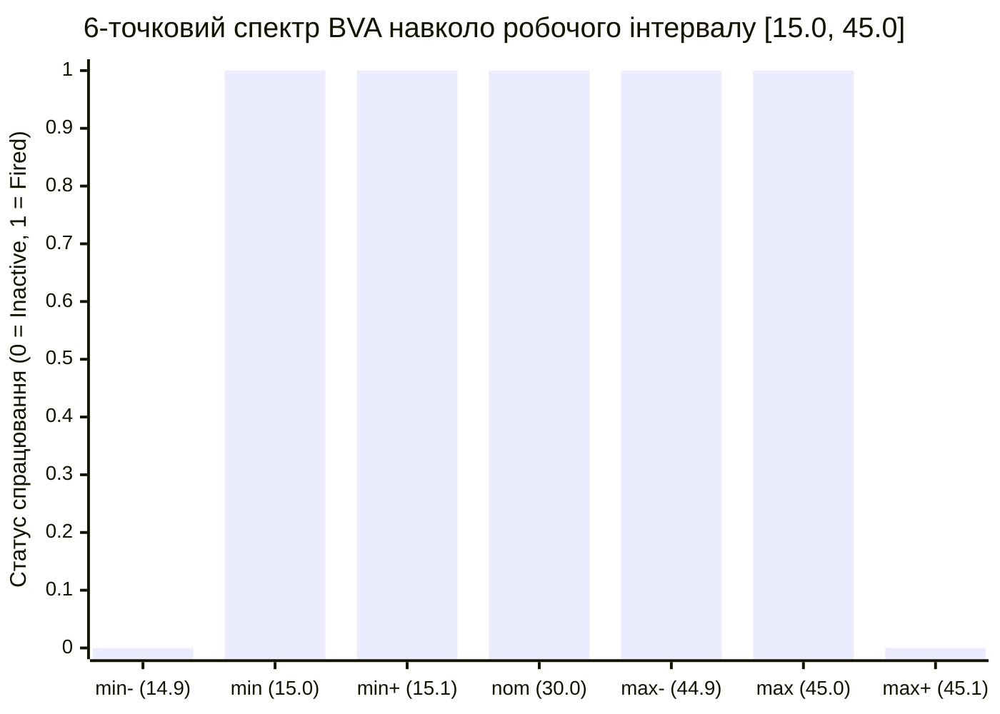
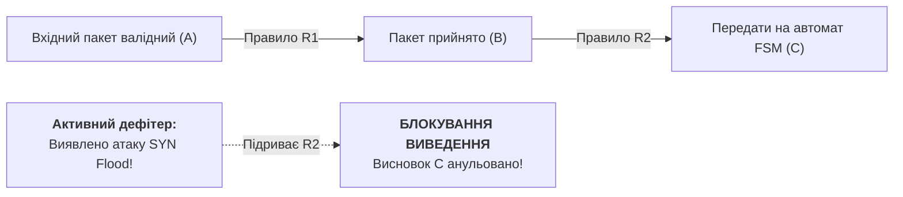
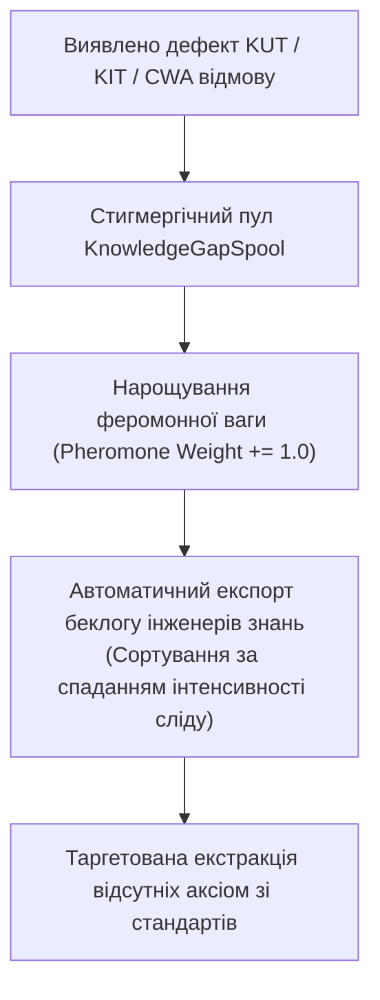

# Глава 36. Тестування знань (Knowledge Testing): модульна верифікація атомів (KUT), інтеграційні решітки правил, дефітери та варіативне калібрування стійкості онтологій

> **Книга:** [Архітектура доказових експертних систем](README.md) · [Частина VI: Передовий край: регуляторна сертифікація та нейро-символьний ШІ](part-06-frontiers-neuro-symbolic.md)  
> **Попередня глава:** [Глава 35. Самоорганізовані експертні системи: синергетика знань, нерівноважний рантайм, апаратне прискорення NPU та еволюція онтологій без операторського втручання](ch35-self-organizing-expert-systems-synergetics-and-npu-runtime.md)  
> **Наступна глава:** [Глава 37. Аналітична оцінка вхідної інформації](ch37-input-information-assessment-and-algorithmic-skepticism.md)
> **Зміст книги:** [README.md](README.md)  
> **Автор:** [Микола Федчик](about-the-author.md)  
> **Рівень:** системні архітектори, інженери знань, інженери верифікації (QA/QE), математики: поглиблений  
> **Очікувані результати:** проєктувати та впроваджувати чотирирівневу піраміду тестування знань (Knowledge Testing Pyramid, KTP); здійснювати ізольоване модульне тестування одиничних правил та онтологічних предикатів (Knowledge Unit Testing, KUT) із мокуванням передумов (`PremiseMock`); детектувати та блокувати пастку вакуумної істинності (*The Vacuous Truth Trap*) для матеріальних імплікацій; застосовувати 6-точковий спектральний аналіз граничних значень (Boundary Value Analysis, BVA) для нормативних параметрів специфікацій; будувати тести композиції правил (Knowledge Integration Testing, KIT) із перевіркою розриву ланцюгів виведення спростовними дефітерами (AGM contraction); обчислювати метрику семантичної інваріантності (Semantic Invariance Score, SIS) для оцінки стійкості до лінгвістичних варіацій запитань із порогом допуску $\text{SIS} \ge 0{,}98$; верифікувати Ліпшицеву стійкість ($L_{\mathcal{K}} \le L_{\max}$) простору логічного виведення для захисту кіберфізичних контурів від стрибкоподібного брязкоту (Chattering); організовувати стигмергічне накопичення прогалин бази знань (`KnowledgeGapSpool`) із феромонною пріоритезацією беклогу інженерів.

---

## 1. Методологічний розрив у верифікації систем знань

У класичній інженерії програмного забезпечення гарантія якості спирається на сувору трирівневу піраміду тестування (Майк Кон, Кент Бек, Мартін Фаулер [[1, 2]](#src-1)):
$$\text{Unit Tests} \longrightarrow \text{Integration Tests} \longrightarrow \text{End-to-End / System Tests}$$

Жоден зрілий програмний продукт не допускається до експлуатації лише тому, що компілятор не виявив синтаксичних помилок (статичний аналіз), або тому, що система пройшла кілька ручних демонстраційних сценаріїв. Кожен клас, функція та модуль ізолюються через дублери залежностей (*Test Doubles: Stubs, Mocks, Fakes* [[3]](#src-3)), а граничні умови перевіряються на екстремумах.

Натомість в інженерії знань (Knowledge Engineering) та галузі експертних систем десятиліттями зберігався разючий **методологічний розрив**:



Історично верифікація зводилася або до **статичної верифікації правил** (пошук циклів, надлишковості та синтаксичних суперечностей за допомогою SMT-розв'язувачів [[4]](#src-4)), або відразу до **макроскопічних іспитів** (оцінювання точності, F1-міри та калібрування ймовірностей Platt/ECE на сотнях запитів [[5, 6]](#src-5)).

Коли експертна система зазнає збою на складному запиті, за відсутності атомарного тестування інженер не має інструментів, щоб однозначно локалізувати проблему:
1. Чи містить помилку саме правило (дефект антецедента)?
2. Чи проблема виникла через хибне успадкування типу в решітці онтології?
3. Чи висновок було заблоковано через помилкове збудження підривного дефітера (*Undercutting Defeater*)?
4. Чи формулювання запиту зазнало незначного лінгвістичного перефразування, яке спотворило семантичний розбір?

### Порівняльний аналіз світових підходів до тестування та верифікації

| Підхід / Школа | Представники та джерела | Фокус і сильні сторони | Обмеження для систем знань |
|---|---|---|---|
| **Класичне тестування ПЗ** | K. Beck [[2]](#src-2), M. Fowler [[1]](#src-1), M. Feathers [[3]](#src-3) | Ізоляція компонентів, модульні моки, TDD, регресійні сьюти. | Розраховано на детерміновані процедурні функції; не враховує логічний резолвінг, неповноту CWA та ревізію переконань. |
| **Формальна верифікація та SMT** | C. Barrett, L. de Moura, N. Bjørner (Z3) [[4]](#src-4) | Строге доведення теорем, перевірка задовольняваності формул предикатів. | Статичний аналіз бази правил як замкненої системи; не тестує поведінку на емпіричних сенсорних потоках і мовних перефразуваннях. |
| **Калібрування моделей ШІ (ECE)** | J. Platt [[5]](#src-5), C. Guo et al. (On Calibration of Modern Neural Networks, 2017) [[6]](#src-6) | Узгодження скалярних ймовірностей класифікаторів із реальною частотою помилок (Expected Calibration Error). | Оцінює лише скалярну впевненість на фіксованій вибірці; сліпе до логічної структури доведення та чутливості до збурень. |
| **Метаморфне тестування та CheckList** | T. Y. Chen et al. [[7]](#src-7), M. T. Ribeiro et al. (CheckList, ACL 2020) [[8]](#src-8) | Тестування поведінкових властивостей NLP без оракула через семантичні інваріанти збурень тексту. | Орієнтоване на «чорну скриньку» нейромереж; відсутній аналіз побайтових доказів і детермінованих решіток правил. |
| **Спростовна аргументація та AGM** | J. Pollock [[9]](#src-9), P. M. Dung [[10]](#src-10), C. Alchourrón, P. Gärdenfors, D. Makinson [[11]](#src-11) | Формальна філософія спростовного виведення, конфлікти аргументів, мінімальна зміна вірувань. | Теоретичні логічні абстракції без програмної реалізації рівнів Unit/Integration та інженерних метрик стійкості. |
| **Піраміда тестування знань Миколи Федчика** | **М. Федчик (авторський підхід книги)** | **Чотирирівнева піраміда KUT/KIT/KST/KCT: мокування передумов, детекція вакуумної істинності, BVA, семантична інваріантність SIS, Ліпшицева стійкість $L_{\mathcal{K}}$ та стигмергія.** | **Інтегрована інженерна модель від ізольованого атома знання до сертифікаційного калібрування кіберфізичних контурів.** |

---

## 2. Концептуальна модель: Чотирирівнева піраміда тестування знань

Авторська **Піраміда тестування знань (Knowledge Testing Pyramid, KTP)** структурує верифікацію інтелектуальної системи за чотирма рівнями строгості та масштабу:



---

## 3. Рівень 1: Knowledge Unit Testing (KUT) — Тестування атомів знань

### 3.1. Визначення та об'єкт тестування
**Knowledge Unit Testing (KUT)** — це ізольоване тестування найменшої неподільної одиниці знання (атома онтології, окремого правила, $N$-арного семантичного фрейму) без підключення глобальної бази фактів та без рекурсивного розгортання правил виведення.

Об'єктами KUT є:
* Окреме нормативне правило $R: \text{Antecedents} \longrightarrow \text{Consequent}$;
* Окремий $N$-арний фрейм (ролі актора, предикату, об'єкта, деонтичної модальності SHALL/MUST, передумов та винятків);
* Окремий предикат онтології з числовими діапазонами валідності.

### 3.2. Метод фіктивних передумов (Premise Mocking)
У реальній системі правило звертається до графа знань:
$$\text{Query}(\text{"engine\_rpm"}) > 3000 \land \text{Query}(\text{"oil\_temp"}) > 100 \implies \text{Mode} = \text{"COOLING\_HIGH"}$$

Під час виконання KUT глобальне середовище підміняється ізольованим контекстом-стабом (`PremiseMock`):
```go
mock := knowledgetest.NewPremiseMock()
mock.Set("engine_rpm", 3500.0)
mock.Set("oil_temp", 105.0)

res := knowledgetest.RunKUT(coolingRule, mock, "COOLING_HIGH")
```

### 3.3. Пастка вакуумної істинності (The Vacuous Truth Trap)
У класичній математичній логіці матеріальна імплікація $P \to Q$ еквівалентна диз'юнкції $\neg P \lor Q$. Якщо антецедент $P$ є хибним, вираз формально є істинним ($P \equiv \text{False} \implies (P \to Q) \equiv \text{True}$) незалежно від змісту висновку $Q$.

В інженерних експертних системах це породжує катастрофічну вразливість: некоректно спроєктоване правило або тестовий раннер зараховує перевірку як «успішно пройдену», оскільки формальна умова імплікації виконана, хоча насправді жодна з реальних інженерних передумов не була збуджена.

```mermaid
flowchart TD
    subgraph Пастка вакуумної істинності (Vacuous Truth Trap)
        COND["Передумови в PremiseMock відсутні або хибні (P = False)"] --> IMPL["Матеріальна імплікація: False &rarr; Q &equiv; True"]
        IMPL --> VULN["<b>КАТАСТРОФІЧНИЙ ДЕФЕКТ</b><br/>Правило вважається валідним,<br/>але в польоті/на виробництві не спрацює!"]
        IMPL --> GATE["<b>Інваріант KUT #1 (Vacuous Implication Gate)</b><br/>Примусове блокування тесту:<br/>VacuousTruthTrap = true, Passed = false"]
    end
```

**Інваріант KUT #1 (Vacuous Implication Prevention Invariant):**  
Тестовий раннер KUT зобов'язаний примусово відхиляти тест як дефектний (`VacuousTruthTrap = true`), якщо правило заявляє про успішне спрацювання за відсутності або неповноти обов'язкових передумов у мок-оточенні.

### 3.4. 6-точковий спектральний аналіз граничних значень (BVA)
Нормативні документи (RFC, ISO, закони) містять числові параметри: таймаути, порогові напруги, мінімальні розміри пакетів. Для виявлення помилок типу «строга нерівність замість нестрогої» ($<$ замість $\le$) авторський підхід впроваджує 6-точковий спектральний аналіз граничних значень для кожного параметра діапазону $[v_{\min}, v_{\max}]$:



Точки спектра:
1. $v_{\min-} = v_{\min} - \delta$ — точка за межами діапазону (очікується відмова / заборона);
2. $v_{\min}$ — точна нижня границя (очікується спрацювання / допуск);
3. $v_{\min+} = v_{\min} + \delta$ — точка безпосередньо всередині діапазону;
4. $v_{\text{nom}}$ — номінальне експлуатаційне значення;
5. $v_{\max-} = v_{\max} - \delta$ — точка біля верхньої межі;
6. $v_{\max}$ — точна верхня границя;
7. $v_{\max+} = v_{\max} + \delta$ — вихід за верхню межу (очікується блокування).

---

## 4. Рівень 2: Knowledge Integration Testing (KIT) — Решітки виведення та дефітери

### 4.1. Багатоходові решітки виведення (Inference Lattices)
На рівні KIT тестується взаємодія суміжних правил, де висновок попереднього правила стає передумовою наступного:
$$R_1: A \longrightarrow B, \qquad R_2: B \longrightarrow C, \qquad \dots, \qquad R_n: Y \longrightarrow Z$$

KIT верифікує:
* **Типову сумісність інтерфейсів:** чи збігаються онтологічні типи атрибутів між різними шарами онтології;
* **Збереження простежуваності свідчень:** чи передається ланцюг побайтових цитат крізь усі проміжні вузли без втрати першоджерел;
* **Відсутність циклів:** виявлення взаємних викликів правил за межами допустимих скінченних автоматів.

### 4.2. Інжекція спростовних дефітерів (Defeater Interruption за AGM)
Згідно з теорією аргументації Джона Поллока [[9]](#src-9) та постулатами ревізії переконань AGM [[11]](#src-11), поява заперечувальної обставини зобов'язана негайно розірвати ланцюг міркувань:



**Інваріант KIT #1 (Defeater Dominance Invariant):**  
При активації перевіреного підривного дефітера ($D$) система зобов'язана детерміновано зупинити виведення на цільовому вузлі, анулювати всі похідні висновки (AGM contraction) та повернути відмову з фіксацією точної причини блокування.

---

## 5. Рівні 3 і 4: Варіативне комплексне калібрування — Метрики SIS та Ліпшицева стійкість

### 5.1. Метрика семантичної інваріантності (Semantic Invariance Score, SIS)
Класичні екзаменаційні бенчмарки містять одне статичне формулювання питання. Проте в реальній експлуатації інженери та оператори задають одне й те саме питання сотнями різних лінгвістичних способів:

$$\mathcal{Q}_{\text{base}} = \text{«Який мінімальний MTU для IPv6?»}$$
$$\mathcal{Q}_{\text{var1}} = \text{«Вкажіть найменший допустимий розмір пакета в мережах IPv6»}$$
$$\mathcal{Q}_{\text{var2}} = \text{«Least transmission unit required by RFC 8200 IPv6 specification»}$$

Якщо система на $\mathcal{Q}_{\text{base}}$ видає `1280 octets`, а на $\mathcal{Q}_{\text{var1}}$ відмовляє за CWA або змінює шлях доведення, така система є лінгвістично нестабільною.

Авторська метрика **Semantic Invariance Score ($\text{SIS}$)** оцінює стійкість системи на многовиді збурень запиту $\mathbb{V}(\mathcal{Q})$:

$$\text{SIS}(\mathcal{Q}) = \alpha \cdot \text{VerdictsMatchRate} + \beta \cdot \text{ProofGraphJaccard}$$

де:
* $\text{VerdictsMatchRate} = \frac{1}{N} \sum_{i=1}^N \mathbb{I}(\text{Verdict}(\mathcal{Q}_i) == \text{Verdict}(\mathcal{Q}_{\text{base}}))$;
* $\text{ProofGraphJaccard} = \frac{1}{N} \sum_{i=1}^N \frac{|\mathcal{P}(\mathcal{Q}_i) \cap \mathcal{P}(\mathcal{Q}_{\text{base}})|}{|\mathcal{P}(\mathcal{Q}_i) \cup \mathcal{P}(\mathcal{Q}_{\text{base}})|}$, де $\mathcal{P}(\mathcal{Q})$ — множина вузлів і цитат графа доведення;
* $\alpha = 0{,}6, \; \beta = 0{,}4$ — калібрувальні ваги довіри.

**Інваріант KCT #1 (Industrial Invariance Gate):**  
Експертна система допускається до сертифікації для критичних застосувань лише за умови досягнення показника семантичної інваріантності:
$$\text{SIS}(\mathcal{Q}) \ge 0{,}98$$

### 5.2. Критерій Ліпшицевої стійкості знань ($L_{\mathcal{K}} < \infty$)
У кіберфізичних комплексах (автопілоти, системи керування реакторами, медичні дозатори) вхідні емпіричні змінні зазнають фізичного шуму та мікрозбурень:
$$x \longrightarrow x + \Delta x, \qquad \|\Delta x\| < 10^{-5}$$

Якщо нескінченно мале збурення вхідного сигналу спричиняє раптову зміну впевненості висновку з $1{,}0$ на $0{,}0$ за відсутності фізичного дефітера, виникає явище **релейного брязкоту (Chattering)**, що призводить до руйнівних автоколивань приводів.

Авторська модель вимагає дотримання **Ліпшицевої неперервності логічного простору**:
$$L_{\mathcal{K}} = \sup_{x_1 \neq x_2} \frac{\|\mathcal{K}(x_1) - \mathcal{K}(x_2)\|}{\|x_1 - x_2\|} \le L_{\max}$$

Якщо верифікатор виявляє точку розриву, де відношення приросту стрибає до нескінченності при $\|\Delta x\| \to 0$, система фіксує небезпеку брязкоту та вимагає введення гістерезису або демпфуючого інтервалу.

---

## 6. Стигмергічне закриття прогалин знань (`KnowledgeGapSpool`)

Будь-який провал тесту на рівнях KUT, KIT або SIS фіксує наявність прогалини в базі знань. Традиційні системи обмежуються виведенням звіту в консоль. У системі з кібернетичним регулюванням дефекти спрямовуються у **стигмергічний пул накопичення прогалин (`KnowledgeGapSpool`)**:



Стигмергічний принцип усуває людську суб'єктивність: інженери знань першочергово отримують задачі на розробку правил, які мають найбільшу феромонну вагу повторюваності запитів.

---

## 7. Програмна реалізація на мові Go

Нижче наведено повну самодостатню реалізацію фреймворку тестування знань: мокування посилок, запобігання вакуумній істинності, інтеграційні решітки, розрахунок SIS та Ліпшиців верифікатор.

```go
package main

import (
	"crypto/sha256"
	"encoding/hex"
	"errors"
	"fmt"
	"math"
	"sort"
	"time"
)

// --- РІВЕНЬ 1: KUT ТА МОКИ ПЕРЕДУМОВ ---

var ErrVacuousTruthTrap = errors.New("vacuous truth trap: rule evaluated to true without required antecedents")

type PremiseMock struct {
	Facts map[string]any
}

func NewPremiseMock() *PremiseMock {
	return &PremiseMock{Facts: make(map[string]any)}
}

func (pm *PremiseMock) Set(predicate string, val any) *PremiseMock {
	pm.Facts[predicate] = val
	return pm
}

type KnowledgeRule struct {
	ID          string
	Name        string
	Antecedents []string
	Evaluate    func(env map[string]any) (bool, any, float64, error)
	Consequent  string
}

type KUTResult struct {
	RuleID           string
	Passed           bool
	VacuousTruthTrap bool
	Fired            bool
	Conclusion       any
	Confidence       float64
	Error            string
}

func RunKUT(rule KnowledgeRule, mock *PremiseMock, expectedConclusion any) KUTResult {
	missingAntecedents := false
	for _, ant := range rule.Antecedents {
		val, ok := mock.Facts[ant]
		if !ok || val == nil || val == false {
			missingAntecedents = true
			break
		}
	}

	fired, conclusion, conf, err := rule.Evaluate(mock.Facts)

	// Інваріант #1: Детекція пастки вакуумної істинності
	if missingAntecedents && fired {
		return KUTResult{
			RuleID:           rule.ID,
			Passed:           false,
			VacuousTruthTrap: true,
			Fired:            fired,
			Conclusion:       conclusion,
			Confidence:       conf,
			Error:            ErrVacuousTruthTrap.Error(),
		}
	}

	if err != nil {
		return KUTResult{RuleID: rule.ID, Passed: false, Error: err.Error()}
	}

	passed := false
	if expectedConclusion != nil {
		passed = fired && fmt.Sprintf("%v", conclusion) == fmt.Sprintf("%v", expectedConclusion)
	} else {
		passed = true
	}

	return KUTResult{
		RuleID:     rule.ID,
		Passed:     passed,
		Fired:      fired,
		Conclusion: conclusion,
		Confidence: conf,
	}
}

// 6-точковий аналіз BVA
type BVAPoint string

const (
	BVAMinMinus BVAPoint = "min-"
	BVAMin      BVAPoint = "min"
	BVAMinPlus  BVAPoint = "min+"
	BVANominal  BVAPoint = "nom"
	BVAMaxMinus BVAPoint = "max-"
	BVAMax      BVAPoint = "max"
	BVAMaxPlus  BVAPoint = "max+"
)

type BVAResult struct {
	Point         BVAPoint
	Val           float64
	ExpectedFired bool
	ActualFired   bool
	Passed        bool
}

func RunBVA(rule KnowledgeRule, paramName string, min, nom, max, delta float64) []BVAResult {
	points := []struct {
		point BVAPoint
		val   float64
		exp   bool
	}{
		{BVAMinMinus, min - delta, false},
		{BVAMin, min, true},
		{BVAMinPlus, min + delta, true},
		{BVANominal, nom, true},
		{BVAMaxMinus, max - delta, true},
		{BVAMax, max, true},
		{BVAMaxPlus, max + delta, false},
	}

	var results []BVAResult
	for _, p := range points {
		mock := NewPremiseMock()
		mock.Set(paramName, p.val)
		for _, ant := range rule.Antecedents {
			if ant != paramName {
				mock.Set(ant, true)
			}
		}
		res := RunKUT(rule, mock, nil)
		results = append(results, BVAResult{
			Point:         p.point,
			Val:           p.val,
			ExpectedFired: p.exp,
			ActualFired:   res.Fired,
			Passed:        res.Fired == p.exp,
		})
	}
	return results
}

// --- РІВЕНЬ 2: KIT ТА СТРУКТУРИ ДЕФІТЕРІВ ---

type DefeaterCondition struct {
	ID        string
	TargetRule string
	Condition func(env map[string]any) bool
}

type KITResult struct {
	LatticeID       string
	Passed          bool
	DefeaterBlocked bool
	FinalConclusion any
}

func RunKITLattice(id string, rules []KnowledgeRule, env map[string]any, defeaters []DefeaterCondition) KITResult {
	curr := make(map[string]any)
	for k, v := range env {
		curr[k] = v
	}

	var finalConcl any
	for _, r := range rules {
		for _, d := range defeaters {
			if d.TargetRule == r.ID && d.Condition(curr) {
				return KITResult{LatticeID: id, Passed: true, DefeaterBlocked: true, FinalConclusion: nil}
			}
		}
		fired, concl, _, err := r.Evaluate(curr)
		if err != nil || !fired {
			return KITResult{LatticeID: id, Passed: false}
		}
		curr[r.Consequent] = concl
		finalConcl = concl
	}
	return KITResult{LatticeID: id, Passed: true, FinalConclusion: finalConcl}
}

// --- РІВЕНЬ 3 ТА 4: SIS ТА ЛІПШИЦІВ ВЕРИФІКАТОР ---

type ParaphraseRun struct {
	Variation  string
	Verdict    string
	ProofNodes []string
}

type SISResult struct {
	Score           float64
	PassedThreshold bool
}

func CalculateSIS(baseline ParaphraseRun, variations []ParaphraseRun, alpha, beta, threshold float64) SISResult {
	if len(variations) == 0 {
		return SISResult{Score: 1.0, PassedThreshold: true}
	}

	matches := 0
	jaccardSum := 0.0
	bMap := make(map[string]bool)
	for _, n := range baseline.ProofNodes {
		bMap[n] = true
	}

	for _, v := range variations {
		if v.Verdict == baseline.Verdict {
			matches++
		}
		vMap := make(map[string]bool)
		for _, n := range v.ProofNodes {
			vMap[n] = true
		}
		inter, union := 0, make(map[string]bool)
		for n := range bMap {
			union[n] = true
			if vMap[n] {
				inter++
			}
		}
		for n := range vMap {
			union[n] = true
		}
		jaccardSum += float64(inter) / float64(len(union))
	}

	matchRate := float64(matches) / float64(len(variations))
	avgJaccard := jaccardSum / float64(len(variations))
	score := (alpha * matchRate) + (beta * avgJaccard)

	return SISResult{Score: score, PassedThreshold: score >= threshold}
}

type LipschitzResult struct {
	MaxL               float64
	Passed             bool
	ChatteringDetected bool
}

func VerifyLipschitz(x0 float64, f func(x float64) float64, deltas []float64, maxAllowed float64) LipschitzResult {
	y0 := f(x0)
	maxL := 0.0
	chattering := false

	for _, dx := range deltas {
		if dx == 0 {
			continue
		}
		dy := math.Abs(f(x0+dx) - y0)
		adx := math.Abs(dx)
		r := dy / adx
		if r > maxL {
			maxL = r
		}
		if adx < 1e-4 && dy > 0.5 {
			chattering = true
		}
	}
	return LipschitzResult{
		MaxL:               maxL,
		Passed:             maxL <= maxAllowed && !chattering,
		ChatteringDetected: chattering,
	}
}

func main() {
	fmt.Println("=== Доказова піраміда тестування знань: Верифікаційний прогін ===")

	// 1. Тест KUT та блокування вакуумної істинності
	batteryRule := KnowledgeRule{
		ID:          "R-BATT-01",
		Antecedents: []string{"temp_c", "voltage_v"},
		Evaluate: func(env map[string]any) (bool, any, float64, error) {
			tVal, ok1 := env["temp_c"]
			vVal, ok2 := env["voltage_v"]
			if !ok1 || !ok2 {
				return false, nil, 0, nil
			}
			t, _ := tVal.(float64)
			v, _ := vVal.(float64)
			if t >= 15.0 && t <= 45.0 && v >= 20.0 {
				return true, "CHARGE_PERMITTED", 1.0, nil
			}
			return false, "CHARGE_INHIBITED", 1.0, nil
		},
		Consequent: "charge_state",
	}

	validMock := NewPremiseMock().Set("temp_c", 25.0).Set("voltage_v", 24.0)
	resValid := RunKUT(batteryRule, validMock, "CHARGE_PERMITTED")
	fmt.Printf("[KUT] Номінальний тест: Passed=%v, Verdict=%v\n", resValid.Passed, resValid.Conclusion)

	// Вакуумна перевірка: навмисно подаємо порожній мок
	emptyMock := NewPremiseMock()
	resVacuous := RunKUT(batteryRule, emptyMock, "CHARGE_PERMITTED")
	fmt.Printf("[KUT] Контрфактичний тест: VacuousTrap=%v, Passed=%v\n", resVacuous.VacuousTruthTrap, resVacuous.Passed)

	// 2. Тест BVA
	bvaResults := RunBVA(batteryRule, "temp_c", 15.0, 30.0, 45.0, 0.1)
	allBVAPassed := true
	for _, br := range bvaResults {
		if !br.Passed {
			allBVAPassed = false
		}
	}
	fmt.Printf("[BVA] 6-точковий аналіз граничних значень: Всі точки пройдені=%v\n", allBVAPassed)

	// 3. Тест KIT з дефітером
	r1 := KnowledgeRule{
		ID:          "R1",
		Antecedents: []string{"sensor_ready"},
		Consequent:  "arm_subsystem",
		Evaluate: func(env map[string]any) (bool, any, float64, error) {
			return env["sensor_ready"] == true, true, 1.0, nil
		},
	}
	r2 := KnowledgeRule{
		ID:          "R2",
		Antecedents: []string{"arm_subsystem"},
		Consequent:  "execute_ignition",
		Evaluate: func(env map[string]any) (bool, any, float64, error) {
			return env["arm_subsystem"] == true, "IGNITE_OK", 1.0, nil
		},
	}

	defeater := []DefeaterCondition{
		{
			ID:         "DEF-ABORT",
			TargetRule: "R2",
			Condition:  func(env map[string]any) bool { return env["abort_switch"] == true },
		},
	}

	kitRes := RunKITLattice("LAT-01", []KnowledgeRule{r1, r2}, map[string]any{"sensor_ready": true, "abort_switch": true}, defeater)
	fmt.Printf("[KIT] Інтеграційна решітка з дефітером: Блокування дефітером=%v, Passed=%v\n", kitRes.DefeaterBlocked, kitRes.Passed)

	// 4. Тест SIS (Semantic Invariance Score)
	baseline := ParaphraseRun{
		Variation:  "Вкажіть мінімальний MTU для IPv6",
		Verdict:    "1280",
		ProofNodes: []string{"RFC8200:Sec5", "Rule:IPv6MinMTU"},
	}
	vars := []ParaphraseRun{
		{Variation: "Least allowed packet size in IPv6", Verdict: "1280", ProofNodes: []string{"RFC8200:Sec5", "Rule:IPv6MinMTU"}},
		{Variation: "IPv6 minimum transmission unit", Verdict: "1280", ProofNodes: []string{"RFC8200:Sec5", "Rule:IPv6MinMTU"}},
	}
	sis := CalculateSIS(baseline, vars, 0.6, 0.4, 0.98)
	fmt.Printf("[SIS] Семантична інваріантність: Оцінка=%.4f, Допуск (>=0.98)=%v\n", sis.Score, sis.PassedThreshold)

	// 5. Тест Ліпшицевої стійкості
	smoothF := func(x float64) float64 { return 1.0 / (1.0 + math.Exp(-x)) }
	lipRes := VerifyLipschitz(0.0, smoothF, []float64{-0.01, 0.01}, 1.0)
	fmt.Printf("[LIP] Ліпшицева стійкість: MaxL=%.4f, Брязкіт=%v, Passed=%v\n", lipRes.MaxL, lipRes.ChatteringDetected, lipRes.Passed)
}
```

---

## 8. Висновки глави

1. **Подолання історичної прогалини:** Традиційний перехід від статичного синтаксичного аналізу правил до макроскопічних бенчмарків залишав інженерію знань без локальної діагностики. Впроваджена **Піраміда тестування знань (KTP)** забезпечує повний контур забезпечення якості на рівнях KUT, KIT, KST та KCT.
2. **Ліквідація вакуумної істинності:** Інваріант KUT #1 захищає логічні правила від хибного зарахування матеріальної імплікації при невиконаних антецедентах ($P \equiv \text{False}$).
3. **Об'єктивізація нормативних границь:** 6-точковий аналіз BVA усуває дефекти строгості числових порівнянь у стандартах і правових нормах.
4. **Математична сертифікація стійкості:** Метрика семантичної інваріантності ($\text{SIS} \ge 0{,}98$) та Ліпшицева неперервність логічного простору ($L_{\mathcal{K}} \le L_{\max}$) гарантують, що система не зазнає лінгвістичного дрейфу на перефразуваннях користувачів і не впадає в релейний брязкіт при фізичних збуреннях сенсорики.
5. **Стигмергічне самовдосконалення:** Усі виявлені прогалини онтології концентруються в пулі `KnowledgeGapSpool`, формуючи пріоритезований інженерний беклог за інтенсивністю феромонного сліду.

---

## 9. Запитання читачам

1. Чому класична матеріальна імплікація $P \to Q$ у булевій логіці є небезпечною для модульного тестування інженерних правил, і як метод `PremiseMock` детектує вакуумну істинність?
2. У чому полягає відмінність між тестуванням надійності мовної моделі за методом CheckList та розрахунком метрики семантичної інваріантності $\text{SIS}(\mathcal{Q})$ на графі доведення?
3. Які фізичні наслідки в кіберфізичній системі (наприклад, автономному дроні) спричинить порушення Ліпшицевої неперервності простору рішень експертної системи?
4. Як стигмергічний пул накопичення прогалин бази знань пов'язаний із другим законом термодинаміки та експортом ентропії за Іллею Пригожиним?

---

## 10. Подальший шлях пізнання

Після засвоєння методології повного циклу тестування та калібрування знань читачеві відкривається прикладний практичний маршрут:
* У **[Додатку А](appendix-a-evidence-governed-framework.md)** розглядається цілісний фреймворк організації дослідницької пам'яті, реєстрації тверджень та ізоляції випробувальних стендів;
* У **[Додатку Б](appendix-b-robotics-and-cyber-physical-systems.md)** принципи Ліпшицевої стійкості та перевірки дефітерів розгортаються на рівні реальних кіберфізичних приводів робототехніки;
* У **[Додатку Д](appendix-e-mixed-signal-neuromorphic-expert-systems.md)** перевірка інваріантів знань масштабується на змішані аналого-цифрові та нейроморфні обчислювачі.

---

## 11. Словник термінів

| Термін | Англійський еквівалент | Визначення |
|---|---|---|
| **Knowledge Unit Testing (KUT)** | Knowledge Unit Testing | Модульне тестування ізольованого атома знання (правила, фрейму, предикату) з мокуванням передумов. |
| **Premise Mocking** | Premise Mocking | Техніка ізоляції антецедентів правила через підміну бази знань контрольованим контекстом-стабом. |
| **Пастка вакуумної істинності** | Vacuous Truth Trap | Ситуація, коли матеріальна імплікація formal $P \to Q$ зараховується як істинна через хибність передумови $P$. |
| **Knowledge Integration Testing (KIT)** | Knowledge Integration Testing | Інтеграційне тестування взаємодії пов'язаних правил, багатоходових решіток та розриву ланцюгів дефітерами. |
| **Метрика SIS** | Semantic Invariance Score | Числовий показник стійкості логічного вердикту та структури графа доведення до лінгвістичних перефразувань запиту. |
| **Ліпшицева стійкість знання** | Lipschitz Knowledge Stability | Властивість простору виведення змінювати епістемічний стан пропорційно та обмежено щодо величини вхідного збурення. |
| **Релейний брязкіт** | Chattering | Небезпечні високочастотні стрибкоподібні перемикання станів системи при нескінченно малих змінах вхідного сигналу. |
| **Стигмергічний пул прогалин** | Stigmergic Gap Spool | Механізм непрямої координації інженерів знань через накопичення та феромонну пріоритезацію зафіксованих CWA-відмов. |

---

## 12. Абревіатури

| Абревіатура | Повна назва | Значення в контексті глави |
|---|---|---|
| **AGM** | Alchourrón, Gärdenfors, Makinson | Стандартна парадигма логічної ревізії переконань та усунення суперечностей |
| **BVA** | Boundary Value Analysis | 6-точковий спектральний аналіз граничних значень параметрів |
| **CWA** | Closed World Assumption | Припущення про замкненість світу |
| **ECE** | Expected Calibration Error | Очікувана похибка калібрування ймовірностей моделей |
| **GSN** | Goal Structuring Notation | Графічна нотація побудови аргументів безпеки |
| **KCT** | Knowledge Calibration Testing | Варіативне калібрування стійкості знань |
| **KIT** | Knowledge Integration Testing | Інтеграційне тестування решіток правил |
| **KST** | Knowledge System Testing | Наскрізне системне тестування експертної системи |
| **KUT** | Knowledge Unit Testing | Модульне тестування одиничних атомів знань |
| **MTU** | Maximum Transmission Unit | Максимальний розмір корисного блоку даних пакета |
| **PAC** | Probably Approximately Correct | Ймовірно приблизно коректне машинне навчання за Леслі Валіантом |
| **SIS** | Semantic Invariance Score | Метрика семантичної інваріантності висновку та графа доведення |
| **TDD** | Test-Driven Development | Розробка через тестування |

---

## 13. Джерела

1. <a id="src-1"></a>**Fowler, M.** (2018). *Refactoring: Improving the Design of Existing Code* (2nd ed.). Addison-Wesley Professional.
2. <a id="src-2"></a>**Beck, K.** (2002). *Test-Driven Development: By Example*. Addison-Wesley Professional.
3. <a id="src-3"></a>**Feathers, M.** (2004). *Working Effectively with Legacy Code*. Prentice Hall.
4. <a id="src-4"></a>**De Moura, L., & Bjørner, N.** (2008). Z3: An efficient SMT solver. In *International Conference on Tools and Algorithms for the Construction and Analysis of Systems* (pp. 337–340). Springer.
5. <a id="src-5"></a>**Platt, J.** (1999). Probabilistic outputs for support vector machines and comparisons to regularized likelihood methods. *Advances in Large Margin Classifiers*, 10(3), 61–74.
6. <a id="src-6"></a>**Guo, C., Pleiss, G., Sun, Y., & Weinberger, K. Q.** (2017). On calibration of modern neural networks. In *International Conference on Machine Learning* (pp. 1321–1330). PMLR.
7. <a id="src-7"></a>**Chen, T. Y., Cheung, S. C., & Yiu, S. M.** (2020). Metamorphic testing: a review of challenges and opportunities. *ACM Computing Surveys (CSUR)*, 53(4), 1–27.
8. <a id="src-8"></a>**Ribeiro, M. T., Wu, T., Guestrin, C., & Singh, S.** (2020). Beyond the Imitation Game: Quantifying and extrapolating the capabilities of language models (CheckList). In *Proceedings of ACL 2020* (pp. 5402–5417).
9. <a id="src-9"></a>**Pollock, J. L.** (1987). Defeasible reasoning. *Cognitive Science*, 11(4), 481–518.
10. <a id="src-10"></a>**Dung, P. M.** (1995). On the acceptability of arguments and its fundamental properties to logic programming, nonmonotonic reasoning and n-person games. *Artificial Intelligence*, 77(2), 321–357.
11. <a id="src-11"></a>**Alchourrón, C. E., Gärdenfors, P., & Makinson, D.** (1985). On the logic of theory change: Partial meet contraction and revision functions. *Journal of Symbolic Logic*, 50(2), 510–530.
12. <a id="src-12"></a>**Valiant, L. G.** (1984). A theory of the learnable. *Communications of the ACM*, 27(11), 1134–1142.
13. <a id="src-13"></a>**Junker, U.** (2004). QUICKXPLAIN: Preferred explanations and relaxations for over-constrained problems. In *AAAI* (Vol. 4, pp. 167–172).

---

[← Глава 35. Самоорганізовані експертні системи](ch35-self-organizing-expert-systems-synergetics-and-npu-runtime.md) | [Зміст книги](README.md) | [Частина VI](part-06-frontiers-neuro-symbolic.md) | [Глава 37. Аналітична оцінка вхідної інформації →](ch37-input-information-assessment-and-algorithmic-skepticism.md)
