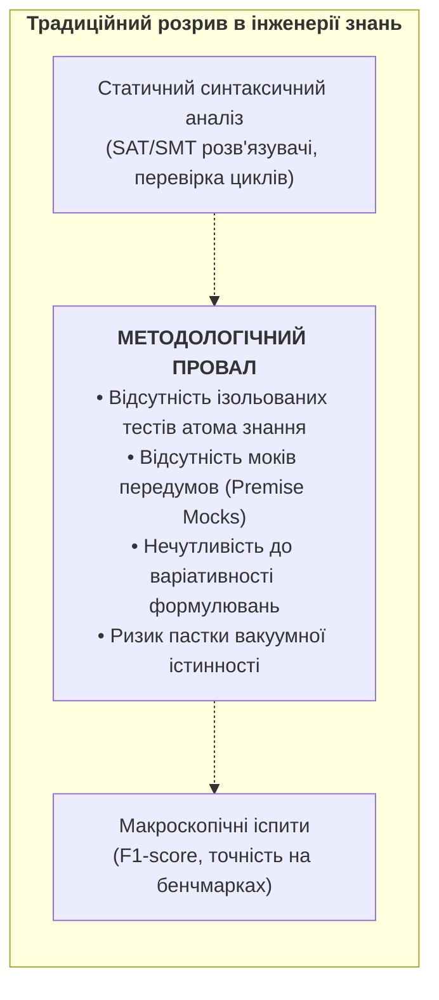
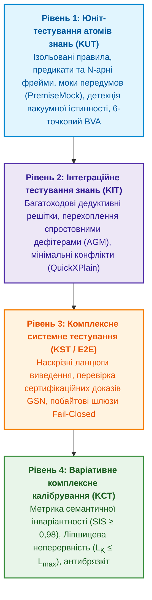
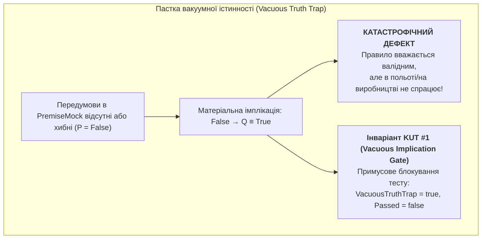
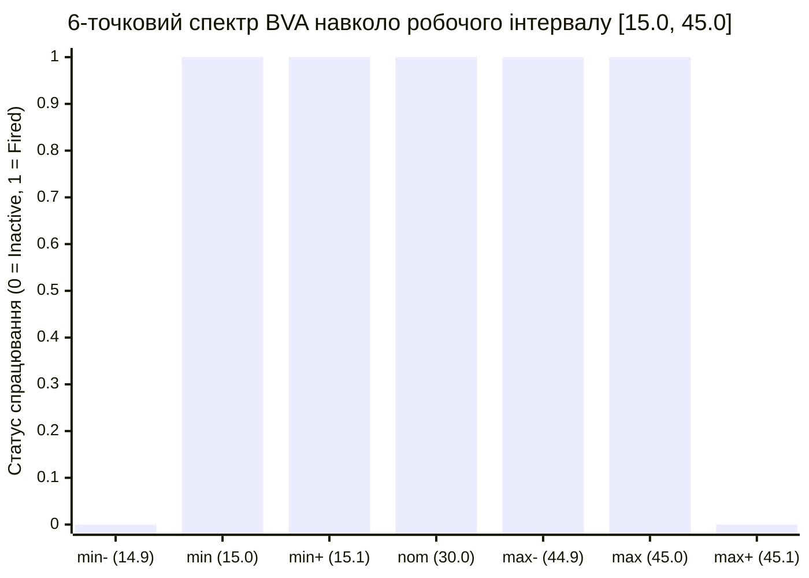
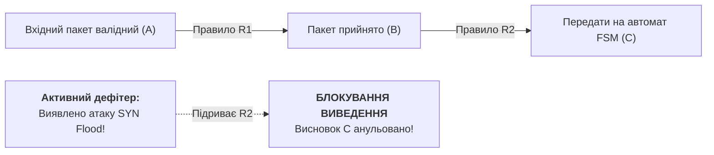
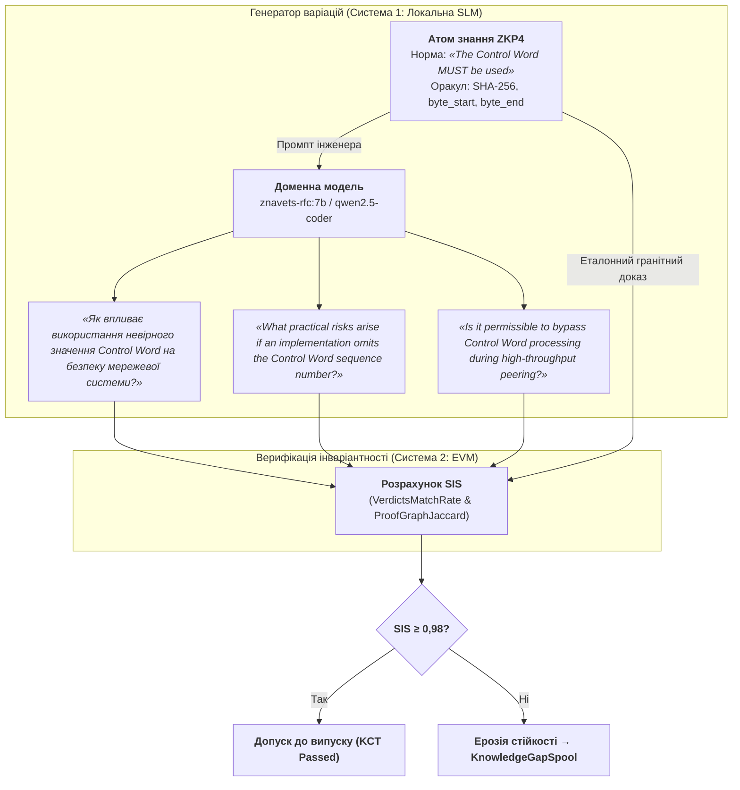
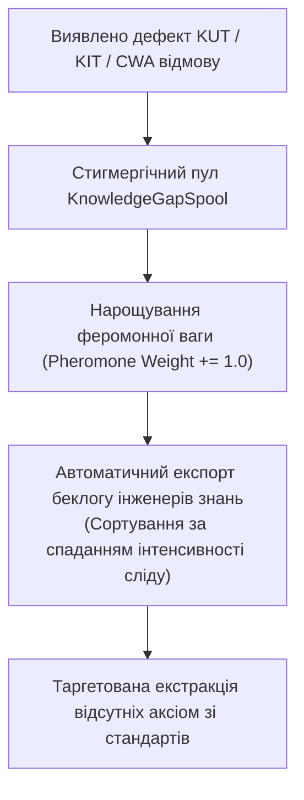

# Глава 36. Піраміда тестування знань: правила, взаємодії та стійкість відповідей

> **Книга:** [Архітектура доказових експертних систем](README.md) · [Частина V: Верифікація, діагностика, навчання та обґрунтування безпеки](part-05-verification-and-learning.md)  
> **Попередня глава:** [Глава 23. Верифікація бази знань: як перевірити несуперечливість, повноту та надійність правил](ch23-knowledge-base-verification.md)  
> **Наступна глава:** [Глава 24. Технічна діагностика: як не сплутати симптом із першопричиною в умовах неповноти](ch24-system-diagnosis.md)  
> **Зміст книги:** [README.md](README.md)  
> **Автор:** [Микола Федчик](about-the-author.md)  
> **Рівень:** системні архітектори, інженери знань, інженери верифікації (QA/QE), математики: поглиблений  
> **Очікувані результати:** проєктувати та впроваджувати чотирирівневу піраміду тестування знань (Knowledge Testing Pyramid, KTP); здійснювати ізольоване модульне тестування одиничних правил та онтологічних предикатів (Knowledge Unit Testing, KUT) із мокуванням передумов (`PremiseMock`); детектувати та блокувати пастку вакуумної істинності (*The Vacuous Truth Trap*) для матеріальних імплікацій; застосовувати 6-точковий спектральний аналіз граничних значень (Boundary Value Analysis, BVA) для нормативних параметрів специфікацій; будувати тести композиції правил (Knowledge Integration Testing, KIT) із перевіркою розриву ланцюгів виведення спростовними дефітерами (AGM contraction); обчислювати метрику семантичної інваріантності (Semantic Invariance Score, SIS) для оцінки стійкості до лінгвістичних варіацій запитань із порогом допуску $\text{SIS} \ge 0{,}98$; верифікувати Ліпшицеву стійкість ($L_{\mathcal{K}} \le L_{\max}$) простору логічного виведення для захисту кіберфізичних систем від стрибкоподібного брязкоту (Chattering); організовувати стигмергічне накопичення прогалин бази знань (`KnowledgeGapSpool`) із феромонною пріоритезацією беклогу інженерів.

---

## Анотація

У главі досліджено методологію багаторівневої верифікації та калібрування правил у доказових експертних системах на базі авторської піраміди тестування знань (*Knowledge Testing Pyramid, KTP*). Визначено математичні та архітектурні інструменти, що гарантують стійкість виведення проти сенсорного шуму та унеможливлюють деградацію бази знань у місійно-критичних застосунках.

У критично важливих кіберфізичних системах (ISO 26262 ASIL D, EN 50128 SIL 4, DO-178C Level A) відсутність ізольованої верифікації правил і перевірки границь виведення призводить до двох катастрофічних відмов: пастки вакуумної істинності (*The Vacuous Truth Trap*, коли хибний чи неініціалізований антецедент матеріальної імплікації $A \to B$ автоматично робить правило істинним і хибно збуджує аварійні актуатори) та високочастотного брязкоту (*Chattering*, коли незначний шум у сенсорних каналах на межі предикатів викликає стрибкоподібні перемикання рішень, руйнуючи електромеханічні приводи). 

Ця глава вирішує проблему шляхом побудови чотирирівневої піраміди тестування знань (*Knowledge Testing Pyramid, KTP*): від ізольованого модульного тестування правил (*KUT*) із мокуванням передумов (`PremiseMock`) та 6-точкового спектрального аналізу границь (*BVA*), крізь інтеграційне тестування спростовних ланцюгів виведення (*KIT*), до системного оцінювання семантичної інваріантності ($\text{SIS} \ge 0{,}98$) і варіаційного калібрування Ліпшицевої стійкості ($L_{\mathcal{K}} \le L_{\max}$) простору логічних висновків.

---

## 1. Методологічний розрив у верифікації систем знань

Для впорядкування перевірок програмного забезпечення використовують піраміду тестування Майка Кона [[1]](#src-1). Розробка через тестування Кента Бека [[2]](#src-2) додає практику явних очікувань для окремого компонента. У цій главі піраміду подано як шлях від ізольованих перевірок до інтеграційних і наскрізних:

```math
\text{Unit Tests} \longrightarrow \text{Integration Tests} \longrightarrow \text{End-to-End / System Tests}
```

Жоден зрілий програмний продукт не допускається до експлуатації лише тому, що компілятор не виявив синтаксичних помилок (статичний аналіз), або тому, що система пройшла кілька ручних демонстраційних сценаріїв. Кожен клас, функція та модуль ізолюються через дублери залежностей (*Test Doubles: Stubs, Mocks, Fakes* [[3]](#src-3)), а граничні умови перевіряються на екстремумах.

Натомість в інженерії знань (Knowledge Engineering) та галузі експертних систем десятиліттями зберігався разючий **методологічний розрив**:



Історично верифікація зводилася або до **статичної верифікації правил** (пошук циклів, надлишковості та синтаксичних суперечностей за допомогою SMT-розв'язувачів [[4]](#src-4)), або відразу до **макроскопічних іспитів** (оцінювання точності, F1-міри та калібрування ймовірностей Platt/ECE на сотнях запитів [[5, 6]](#src-5)).

Коли експертна система зазнає збою на складному запиті, за відсутності атомарного тестування інженер не має інструментів, щоб однозначно локалізувати проблему:
1. Чи містить помилку саме правило (дефект антецедента)?
2. Чи проблема виникла через хибне успадкування типу в решітці онтології?
3. Чи висновок було заблоковано через помилкове збудження підривного дефітера (*Undercutting Defeater*)?
4. Чи формулювання запиту зазнало незначного лінгвістичного перефразування, яке спотворило семантичний розбір?

### 1.1. Порівняльний аналіз світових підходів до тестування та верифікації

| Підхід / Школа | Представники та джерела | Фокус і сильні сторони | Обмеження для систем знань |
|---|---|---|---|
| **Класичне тестування ПЗ** | M. Cohn [[1]](#src-1), K. Beck [[2]](#src-2), M. Feathers [[3]](#src-3) | Ізоляція компонентів, модульні моки, TDD, регресійні сьюти. | Розраховано на детерміновані процедурні функції; не враховує логічний резолвінг, неповноту CWA та ревізію переконань. |
| **Формальна верифікація та SMT** | C. Barrett, L. de Moura, N. Bjørner (Z3) [[4]](#src-4) | Строге доведення теорем, перевірка задовольняваності формул предикатів. | Статичний аналіз бази правил як замкненої системи; не тестує поведінку на емпіричних сенсорних потоках і мовних перефразуваннях. |
| **Калібрування моделей ШІ (ECE)** | J. Platt [[5]](#src-5), C. Guo et al. (On Calibration of Modern Neural Networks, 2017) [[6]](#src-6) | Узгодження скалярних ймовірностей класифікаторів із реальною частотою помилок (Expected Calibration Error). | Оцінює лише скалярну впевненість на фіксованій вибірці; сліпе до логічної структури доведення та чутливості до збурень. |
| **Метаморфне тестування та CheckList** | T. Y. Chen et al. [[7]](#src-7), M. T. Ribeiro et al. (CheckList, ACL 2020) [[8]](#src-8) | Тестування поведінкових властивостей NLP без оракула через семантичні інваріанти збурень тексту. | Орієнтоване на «чорну скриньку» нейромереж; відсутній аналіз побайтових доказів і детермінованих решіток правил. |
| **Спростовна аргументація та AGM** | J. Pollock [[9]](#src-9), P. M. Dung [[10]](#src-10), C. Alchourrón, P. Gärdenfors, D. Makinson [[11]](#src-11) | Формальна філософія спростовного виведення, конфлікти аргументів, мінімальна зміна вірувань. | Теоретичні логічні абстракції без програмної реалізації рівнів Unit/Integration та інженерних метрик стійкості. |
| **Чотирирівнева піраміда тестування знань (KTP)** | **Методологія цієї книги (KTP framework)** | **Чотирирівнева модель KUT/KIT/KST/KCT: мокування передумов, детекція вакуумної істинності, BVA, семантична інваріантність SIS, Ліпшицева стійкість $L_{\mathcal{K}}$ та стигмергія.** | **Інтегрована інженерна модель від ізольованого атома знання до сертифікаційного калібрування кіберфізичних систем.** |

---

## 2. Концептуальна модель: Чотирирівнева піраміда тестування знань

Авторська **Піраміда тестування знань (Knowledge Testing Pyramid, KTP)** структурує верифікацію інтелектуальної системи за чотирма рівнями строгості та масштабу:



---

## 3. Рівень 1: Knowledge Unit Testing (KUT) — Тестування атомів знань

### 3.1. Визначення та об'єкт тестування
**Knowledge Unit Testing (KUT)** — це ізольоване тестування найменшої неподільної одиниці знання (атома онтології, окремого правила, $N$-арного семантичного фрейму) без підключення глобальної бази фактів та без рекурсивного розгортання правил виведення.

Об'єктами KUT є:
* Окреме нормативне правило $R: \text{Antecedents} \longrightarrow \text{Consequent}$;
* Окремий $N$-арний фрейм (ролі актора, предикату, об'єкта, деонтичної модальності SHALL/MUST, передумов та винятків);
* Окремий предикат онтології з числовими діапазонами валідності.

### 3.2. Метод фіктивних передумов (Premise Mocking)
У реальній системі правило звертається до графа знань:

```math
\mathtt{Query}(\mathtt{"engine\_rpm"}) > 3000 \land \mathtt{Query}(\mathtt{"oil\_temp"}) > 100 \implies \mathtt{Mode} = \mathtt{"COOLING\_HIGH"}
```

Під час виконання KUT глобальне середовище підміняється ізольованим контекстом-стабом (`PremiseMock`):
```go
mock := knowledgetest.NewPremiseMock()
mock.Set("engine_rpm", 3500.0)
mock.Set("oil_temp", 105.0)

res := knowledgetest.RunKUT(coolingRule, mock, "COOLING_HIGH")
```

### 3.3. Пастка вакуумної істинності (The Vacuous Truth Trap)
У класичній математичній логіці матеріальна імплікація $P \to Q$ еквівалентна диз'юнкції $\neg P \lor Q$. Якщо антецедент $P$ є хибним, вираз формально є істинним ($P \equiv \text{False} \implies (P \to Q) \equiv \text{True}$) незалежно від змісту висновку $Q$.

В інженерних експертних системах це породжує катастрофічну вразливість: некоректно спроєктоване правило або тестовий раннер зараховує перевірку як «успішно пройдену», оскільки формальна умова імплікації виконана, хоча насправді жодна з реальних інженерних передумов не була збуджена.



**Інваріант KUT #1 (Vacuous Implication Prevention Invariant):**  
Тестовий раннер KUT зобов'язаний примусово відхиляти тест як дефектний (`VacuousTruthTrap = true`), якщо правило заявляє про успішне спрацювання за відсутності або неповноти обов'язкових передумов у мок-оточенні.

Перед запуском правила тест має задавати незалежний очікуваний результат. Прапорець, який саме правило записало як «вакуумна істинність», не є незалежним оракулом: дефектне правило може не встановити власного прапорця помилки. Для правила з обов'язковою передумовою потрібні щонайменше три випадки:

| Контрольований стан передумови | Очікувана поведінка правила | Що є дефектом |
|---|---|---|
| Передумову підтверджено | Правило спрацьовує та повертає очікуваний наслідок | Правило не спрацювало або підмінило наслідок |
| Передумову спростовано | Правило не виводить наслідок; результат має статус «не застосовується» | Наслідок виведено попри хибну передумову |
| Значення передумови невідоме | Рушій зберігає невідомість і називає потрібне свідчення | Відсутність факту мовчки перетворено на хибу або дозвіл |

Значення булевого факту `false` не означає відсутності факту. Наприклад, правило, яке перевіряє вимкнений режим обслуговування, може потребувати саме підтвердженого значення `false`. Тест має перевіряти умову правила, а не вважати будь-який хибний булевий атрибут відсутньою передумовою. Тризначну логіку розглянуто в [главі 6](ch06-applied-mathematics-for-expert-systems.md).

### 3.4. 6-точковий спектральний аналіз граничних значень (BVA)
Нормативні документи (RFC, ISO, закони) містять числові параметри: таймаути, порогові напруги, мінімальні розміри пакетів. Для виявлення помилок типу «строга нерівність замість нестрогої» ($<$ замість $\le$) авторський підхід впроваджує 6-точковий спектральний аналіз граничних значень для кожного параметра діапазону $[v_{\min}, v_{\max}]$:



Точки спектра:
1. $v_{\min-} = v_{\min} - \delta$ — точка за межами діапазону (очікується відмова / заборона);
2. $v_{\min}$ — точна нижня границя (очікується спрацювання / допуск);
3. $v_{\min+} = v_{\min} + \delta$ — точка безпосередньо всередині діапазону;
4. $v_{\text{nom}}$ — номінальне експлуатаційне значення;
5. $v_{\max-} = v_{\max} - \delta$ — точка біля верхньої межі;
6. $v_{\max}$ — точна верхня границя;
7. $v_{\max+} = v_{\max} + \delta$ — вихід за верхню межу (очікується блокування).

---

## 4. Рівень 2: Knowledge Integration Testing (KIT) — Решітки виведення та дефітери

### 4.1. Багатоходові решітки виведення (Inference Lattices)
На рівні KIT тестується взаємодія суміжних правил, де висновок попереднього правила стає передумовою наступного:

```math
R_1: A \longrightarrow B, \qquad R_2: B \longrightarrow C, \qquad \dots, \qquad R_n: Y \longrightarrow Z
```

KIT верифікує:
* **Типову сумісність інтерфейсів:** чи збігаються онтологічні типи атрибутів між різними шарами онтології;
* **Збереження простежуваності свідчень:** чи передається ланцюг побайтових цитат крізь усі проміжні вузли без втрати першоджерел;
* **Відсутність циклів:** виявлення взаємних викликів правил за межами допустимих скінченних автоматів.

Приклад семантичного зсуву: перше правило повертає «таймаут сокета», а друге очікує «таймаут установлення з'єднання». Однакова числова одиниця й схожа назва не встановлюють тотожності величин. Інтеграційний тест спочатку подає значення без правила відповідності й очікує блокування композиції, потім додає схвалену відповідність із потрібним контекстом і перевіряє дозволений перехід. Така пара випадків відрізняє перевірку змісту від політики, яка блокує будь-який ланцюг.

### 4.2. Інжекція спростовних дефітерів (Defeater Interruption за AGM)
Згідно з теорією аргументації Джона Поллока [[9]](#src-9) та постулатами ревізії переконань AGM [[11]](#src-11), поява заперечувальної обставини зобов'язана негайно розірвати ланцюг міркувань:



**Інваріант KIT #1 (Defeater Dominance Invariant):**  
При активації перевіреного підривного дефітера ($D$) система зобов'язана детерміновано зупинити виведення на цільовому вузлі, анулювати всі похідні висновки (AGM contraction) та повернути відмову з фіксацією точної причини блокування.

Підрив підстави й спростування наслідку потребують різних очікувань. Повідомлення «датчик не калібрований» підриває використання вимірювання як доказу перегріву, але не доводить відсутності перегріву й не видаляє вимірювання з журналу. Свідчення «температура нижча за поріг», отримане іншим придатним каналом, заперечує сам висновок про перегрів. Інтеграційні тести мають перевіряти збереження первинного запису, причину відкликання й альтернативні підстави, а не лише кінцеву відмову [[9]](#src-9).

### 4.3. Мінімальний конфлікт як перевірюваний результат

Якщо обмеження несумісні, корисно перевірити не лише статус конфлікту, а й пояснення конфлікту. Алгоритм QuickXPlain Ульріха Юнкера знаходить конфлікт, мінімальний за включенням, за визначених передумов перевірки узгодженості [[12]](#src-12). Мінімальність означає, що вилучення будь-якого елемента знайденої підмножини усуває її несумісність; найменшої кількості елементів серед усіх можливих конфліктів алгоритм не обіцяє.

У навчальному випадку одночасно задано три обмеження: температура не нижча за 95 °C, температура не вища за 90 °C і тиск не вищий за 10 бар. За узгодженого фонового опису конфлікт утворюють два температурні обмеження. Обмеження тиску не повинно потрапити до цього пояснення. Незалежна перевірка підтверджує несумісність пари та узгодженість кожного з двох однокомпонентних наборів.

Окремі контрольні випадки потрібні для порожнього набору, сумісного набору та несумісного фонового опису. Помилку передумов алгоритму не можна подавати як мінімальний конфлікт. Реалізацію й перевірки QuickXPlain наведено в [главі 20](ch20-explanation-engine.md), тому тут алгоритм не дублюється.

---

## 5. Рівні 3 і 4: наскрізні перевірки та варіативне калібрування

### 5.1. Наскрізне тестування експертної системи

Наскрізне тестування експертної системи (*Knowledge System Testing*, KST) перевіряє весь шлях від репліки користувача до рішення та пакета обґрунтування. Успішний модульний тест правила не підтверджує, що пошук вибрав чинне джерело, мовний аналіз зберіг заперечення, а пояснення відтворило фактичний висновок.

| Межа перевірки | Контрольний випадок | Незалежне очікування |
|---|---|---|
| Джерело → твердження | правильна цитата, але число стосується іншого об'єкта | збіг байтів не дає права прийняти хибне тлумачення |
| Передумови → граф доведення | вилучено одну обов'язкову посилку | наслідок не допускається; пакет називає відсутню підставу |
| Граф → пояснення | до тексту додано число, якого немає в трасі | непідтверджений текст блокується або замінюється перевіреним поданням |
| Доступ і версія → видача | джерело відкликано після попереднього успішного запиту | нова видача не використовує відкликану підставу |

Для кожного негативного випадку потрібний парний позитивний: чинне джерело, повні передумови, правильне пояснення й дозволений доступ. Інакше постійна відмова виглядатиме успішним проходженням перевірок. Контракти підстав і пояснень докладно розглянуто в главах [19](ch19-from-question-to-evidence.md) та [20](ch20-explanation-engine.md), а керований допуск нової версії в [главі 25](ch25-how-expert-systems-learn.md).

### 5.2. Метрика семантичної інваріантності (Semantic Invariance Score, SIS)
Класичні екзаменаційні бенчмарки містять одне статичне формулювання питання. Проте в реальній експлуатації інженери та оператори задають одне й те саме питання сотнями різних лінгвістичних способів:

```math
\begin{aligned}
\mathcal{Q}_{\text{base}} &= \text{«Який мінімальний MTU для IPv6?»}, \\
\mathcal{Q}_{\text{var1}} &= \text{«Вкажіть найменший допустимий розмір пакета в мережах IPv6»}, \\
\mathcal{Q}_{\text{var2}} &= \text{«Least transmission unit required by RFC 8200 IPv6 specification»}.
\end{aligned}
```

Якщо система на $\mathcal{Q}_{\text{base}}$ видає `1280 octets`, а на $\mathcal{Q}_{\text{var1}}$ відмовляє за CWA або змінює шлях доведення, така система є лінгвістично нестабільною.

Авторська метрика **Semantic Invariance Score ($\text{SIS}$)** оцінює стійкість системи на многовиді збурень запиту $\mathbb{V}(\mathcal{Q})$:

```math
\text{SIS}(\mathcal{Q}) = \alpha \cdot \mathrm{VerdictsMatchRate} + \beta \cdot \mathrm{ProofGraphJaccard}
```

де:
- $\mathrm{VerdictsMatchRate} = \frac{1}{N} \sum_{i=1}^{N} I\left(\mathrm{Verdict}(Q_i) = \mathrm{Verdict}(Q_{\mathrm{base}})\right) \in [0, 1]$ — частка збурених запитів із $N$ варіантів, де вердикт тотожно збігається з вердиктом на базове формулювання;
- $\mathrm{ProofGraphJaccard} = \frac{1}{N} \sum_{i=1}^{N} \frac{\lvert P(Q_i) \cap P(Q_{\mathrm{base}})\rvert}{\lvert P(Q_i) \cup P(Q_{\mathrm{base}})\rvert} \in [0, 1]$ — усереднений коефіцієнт Жаккара схожості множин вузлів і цитат графа доведення $P(Q)$;
- $\alpha, \beta \in [0, 1]$ — калібрувальні ваги довіри ($\alpha = 0{,}6,\; \beta = 0{,}4$, де $\alpha + \beta = 1{,}0$);
- $\text{SIS}(\mathcal{Q}) \in [0, 1]$ — результуючий інтегральний показник семантичної інваріантності.

**Критерій допуску та реакція рантайму:**  
Для автоматизованого шлюзу варіативного допуску діють порогові правила:

```math
\text{SIS}(\mathcal{Q}) \ge 0{,}98
```

- `ACCEPT_INVARIANT`: якщо $\text{SIS}(\mathcal{Q}) \ge 0{,}98$ і $\mathrm{VerdictsMatchRate} = 1{,}00$, база знань визнається інваріантною до збурень запиту та отримує підпис релізу Ed25519;
- `QUALIFIED_REVIEW`: якщо $0{,}85 \le \text{SIS}(\mathcal{Q}) < 0{,}98$, система детектує дрейф структури аргументів, блокує публікацію й ескалує звіт інженеру знань із підсвічуванням розбіжностей у графах доведення;
- `REJECT_DRIFT`: якщо $\text{SIS}(\mathcal{Q}) < 0{,}85$ або $\mathrm{VerdictsMatchRate} < 1{,}00$, реліз примусово відхиляється тестовим конвеєром CI/CD.

**Практичний приклад розрахунку:**  
Нехай для запиту згенеровано вибірку з $N = 10$ мовних варіацій ($Q_1, \dots, Q_{10}$). На всіх 10 варіантах вердикт збігся з базовим (`1280 octets`), тобто $\mathrm{VerdictsMatchRate} = 10/10 = 1{,}00$. У 9 варіаціях графи доведення виявилися ідентичними базі ($\frac{\lvert P_i \cap P_{\mathrm{base}} \rvert}{\lvert P_i \cup P_{\mathrm{base}} \rvert} = 1{,}00$), а в одній варіації $Q_8$ генератор підставив синонімічне розширене визначення, сформувавши граф із 5 вузлів проти 4 базових при перетині 4 вузли ($\frac{4}{5} = 0{,}80$). Тоді:
```math
\mathrm{ProofGraphJaccard} = \frac{9 \times 1{,}00 + 1 \times 0{,}80}{10} = 0{,}980.
```
Значення індексу становить:
```math
\text{SIS}(\mathcal{Q}) = 0{,}6 \times 1{,}00 + 0{,}4 \times 0{,}980 = 0{,}600 + 0{,}392 = 0{,}992.
```
Оскільки $0{,}992 \ge 0{,}98$, пакет отримує статус `ACCEPT_INVARIANT`.

Середня оцінка не повинна приховувати зміну критичного вердикту. Додатково перевіряють кожне підтверджено еквівалентне формулювання: вердикт має збігатися з еталонним, а кожна використана підстава має лишатися допустимою. Втрата частини вузлів повинна змінювати оцінку схожості графів навіть тоді, коли решта вузлів не змінилася. Альтернативний правильний доказ не є дефектом сам по собі; політику допустимих змін графа визначають до випробування.

Порожній набір варіацій не дає оцінки стійкості. Два порожні графи теж не підтверджують доказової відповіді: спочатку перевіряють наявність і придатність підстав, а вже потім схожість графів. Поріг 0,98 та ваги 0,6 і 0,4 є параметрами навчального прикладу, не вимогами галузевого стандарту. Успіх на скінченному наборі не доводить інваріантності для всіх можливих запитань і не є сертифікацією.

### 5.3. Критерій Ліпшицевої стійкості знань ($L_{\mathcal{K}} < \infty$)
У кіберфізичних комплексах (автопілоти, системи керування реакторами, медичні дозатори) вхідні емпіричні змінні зазнають фізичного шуму та мікрозбурень:

```math
x \longrightarrow x + \Delta x, \qquad \|\Delta x\| < 10^{-5}.
```

Якщо нескінченно мале збурення вхідного сигналу спричиняє раптову зміну впевненості висновку з $1{,}0$ на $0{,}0$ за відсутності фізичного дефітера, виникає явище **релейного брязкоту (Chattering)**, що призводить до руйнівних автоколивань приводів.

Авторська модель вимагає дотримання **Ліпшицевої неперервності логічного простору**:

```math
L_{\mathcal{K}} = \sup_{x_1 \neq x_2} \frac{\|\mathcal{K}(x_1) - \mathcal{K}(x_2)\|}{\|x_1 - x_2\|} \le L_{\max}.
```

**Параметри та інженерні обмеження:**
- $x_1, x_2 \in \mathbb{R}^n$ — вектори вхідних фізичних спостережень у допустимому просторі станів;
- $\mathcal{K}(x) \in [0, 1]^m$ — вектор упевненості або числових рекомендацій експертної системи;
- $\|\cdot\|$ — евклідова або чебишовська норма у відповідному векторному просторі;
- $L_{\mathcal{K}} \ge 0$ — емпірична константа Ліпшиця логічного відображення знань;
- $L_{\max}$ — гранично допустимий поріг крутизни відгуку (наприклад, $L_{\max} = 10{,}0\,\text{бар}^{-1}$).

**Операційні рішення та числовий приклад:**
- Якщо верифікатор виявляє точку розриву, де відношення приросту стрибає до нескінченності ($L_{\mathcal{K}} > L_{\max}$) при $\|\Delta x\| \to 0$, система фіксує небезпеку брязкоту (`CHATTERING_FAULT`), блокує пряму видачу сигналу на виконавчий тракт і вимагає введення гістерезису або демпфуючого інтервалу.
- Числовий приклад: датчик тиску олії передає значення $x_1 = 2{,}999\,\text{бар}$ (де логічний висновок формує впевненість штатного режиму $\mathcal{K}(x_1) = 1{,}00$) та $x_2 = 3{,}001\,\text{бар}$ (де за відсутності зони нечутливості впевненість стрибає до $\mathcal{K}(x_2) = 0{,}00$). При кроці збурення $\|x_1 - x_2\| = 0{,}002\,\text{бар}$ градієнт реакції становить:
```math
L_{\mathcal{K}} = \frac{\lvert 1{,}00 - 0{,}00 \rvert}{0{,}002\,\text{бар}} = 500\,\text{бар}^{-1} \gg L_{\max} = 10\,\text{бар}^{-1}.
```
- Дія системи: правило маркується як небезпечне для фізичних виконавчих приводів (`REJECT_UNSTABLE_RULE`), а компілятор правил формує директиву на введення гістерезисного коридору $\pm 0{,}15\,\text{бар}$.

### 5.4. Нейро-символічна генерація збурень запиту $\mathbb{V}(\mathcal{Q})$ через локальні SLM

Обчислення метрики $\text{SIS}(\mathcal{Q})$ вимагає представницької множини збурень $\mathbb{V}(\mathcal{Q}) = \{\mathcal{Q}_1, \mathcal{Q}_2, \dots, \mathcal{Q}_N\}$. Традиційно в інженерії знань існувало два незадовільних підходи до формування цієї множини:
1. **Ручне перефразування експертами:** надзвичайно дороге, суб'єктивне й обмежене кількома десятками варіантів;
2. **Шаблонні алгоритмічні підстановки:** страждають на ілюзію підглядання через ключові слова, оскільки копіюють лексеми антецедентів правила в запитання.

Для масштабного та строгого калібрування впроваджується **нейро-символічний синтезатор збурень** (втілений в інструменті `zkp-benchgen` з модулем Ollama):



Такий підхід забезпечує подвійний цикл калібрування:
- **Масовий матричний стрес-тест:** швидкі алгоритмічні генератори продукують сотні тисяч прикладів ($> 250\,000$ тест/с) для аудиту пропускної здатності, витоків пам'яті та коректності переходу регістрових станів.
- **Нейро-символічний золотий калібратор:** паралельний пул локальних моделей (SLM Workers) генерує високоентропійні, автентичні мовні збурення ($1\,000$ – $10\,000$ випадків) для сертифікаційного розрахунку $\text{SIS} \ge 0{,}98$. При цьому еталонний оракул (System 2 EVM) залишається на 100 % захищеним від витоку даних і суб'єктивних упереджень.

---

## 6. Тестові контракти для різних способів виведення

Один зелений індикатор не має однакового змісту для правила, статистичного узагальнення й робочої гіпотези. Тестовий контракт визначає, який результат очікується, за якими підставами перевіряється результат і чого успішна перевірка не встановлює.

| Спосіб виведення | Що перевіряє тест | Контрольний дефект | Межа результату |
|---|---|---|---|
| Дедукція | застосовність правила, усі потрібні посилки та очікуваний наслідок | висновок після вилучення обов'язкової посилки | перевірено наслідок у заданій моделі, не істинність усіх її посилок |
| Індукція | якість узагальнення на незалежних випадках, покриття й обмеження вибірки | правило працює лише на навчальних прикладах або не покриває жодного випадку | оцінка стосується перевіреної сукупності й припущень |
| Абдукція | сумісність гіпотези з відомими фактами, пояснення спостереження та план перевірки | гіпотеза суперечить відомому факту або не має розрізнювальної перевірки | придатна гіпотеза ще не є доведеною причиною |
| Спростовне міркування | реакцію на підрив підстави, спростування й альтернативне обґрунтування | використано відкликану підставу або приховано нерозв'язаний конфлікт | результат залежить від прийнятої семантики аргументації та чинних свідчень |
| Міркування за прецедентами | область застосування аналогії, адаптацію рішення та відомі контрприклади | близький випадок перенесено на іншу ревізію без перевірки | схожість допомагає добору, але не доводить придатності рішення |

Теоретичні гарантії індуктивного навчання потребують явних припущень про клас гіпотез, вибірку та допустиму похибку. Модель ймовірнісно приблизно коректного навчання (*Probably Approximately Correct*, PAC) Леслі Валіанта [[13]](#src-13) не дозволяє приписати гарантію довільному правилу лише через кількість прикладів. Міркування за прецедентами (*Case-Based Reasoning*, CBR) також не зводиться до порівняння двох відстаней: релевантний негативний випадок породжує перевірку застосовності, а не універсальну заборону для всіх аналогій. Методи виведення пояснює [глава 6](ch06-applied-mathematics-for-expert-systems.md), а статус гіпотези й прецеденту [глава 28](ch28-dual-mode-expert-systems.md).

Такі контракти дають конкретний результат діагностики тесту: дефект правила, несумісна композиція, непідтверджене пояснення або недостатній набір випадків. Наступний розділ показує, як передати знайдений дефект у керований процес роботи над знаннями.

---

## 7. Стигмергічне закриття прогалин знань (`KnowledgeGapSpool`)

Будь-який провал тесту на рівнях KUT, KIT або SIS фіксує наявність прогалини в базі знань. Традиційні системи обмежуються виведенням звіту в консоль. У системі з кібернетичним регулюванням дефекти спрямовуються у **стигмергічний пул накопичення прогалин (`KnowledgeGapSpool`)**:



Стигмергічний принцип усуває людську суб'єктивність: інженери знань першочергово отримують задачі на розробку правил, які мають найбільшу феромонну вагу повторюваності запитів.

---

## 8. Програмна реалізація мовою Go

Нижче наведено навчальну реалізацію: мокування посилок, перевірку спрацювання, послідовну композицію правил, розрахунок SIS та оцінювання обраних збурень. Приклад не реалізує всі контракти розділів 3–6: зокрема, `KUTResult` не має окремого статусу невідомості, а `RunKITLattice` не є повним рушієм підтримання альтернативних підстав. Перевірка кількох числових точок не доводить глобальної Ліпшицевої неперервності.

Приклад і тести потребують Go 1.22 або новішого. Усі залежності належать до стандартної бібліотеки. Граничні перевірки отримують явний базовий контекст, а результат розрахунку SIS окремо показує повноту набору й збіг усіх вердиктів.

<details>
<summary>Навчальна програма перевірки правил і варіативних відповідей на Go</summary>

```go
package main

import (
	"errors"
	"fmt"
	"math"
)

// --- РІВЕНЬ 1: KUT ТА МОКИ ПЕРЕДУМОВ ---

var ErrVacuousTruthTrap = errors.New("vacuous truth trap: rule evaluated to true without required antecedents")

type PremiseMock struct {
	Facts map[string]any
}

func NewPremiseMock() *PremiseMock {
	return &PremiseMock{Facts: make(map[string]any)}
}

func (pm *PremiseMock) Set(predicate string, val any) *PremiseMock {
	pm.Facts[predicate] = val
	return pm
}

type KnowledgeRule struct {
	ID          string
	Name        string
	Antecedents []string
	Evaluate    func(env map[string]any) (bool, any, float64, error)
	Consequent  string
}

type KUTResult struct {
	RuleID           string
	Passed           bool
	VacuousTruthTrap bool
	Fired            bool
	Conclusion       any
	Confidence       float64
	Error            string
}

func RunKUT(rule KnowledgeRule, mock *PremiseMock, expectedConclusion any) KUTResult {
	missingAntecedents := false
	for _, ant := range rule.Antecedents {
		val, ok := mock.Facts[ant]
		if !ok || val == nil {
			missingAntecedents = true
			break
		}
	}

	fired, conclusion, conf, err := rule.Evaluate(mock.Facts)

	// Інваріант #1: Детекція пастки вакуумної істинності
	if missingAntecedents && fired {
		return KUTResult{
			RuleID:           rule.ID,
			Passed:           false,
			VacuousTruthTrap: true,
			Fired:            fired,
			Conclusion:       conclusion,
			Confidence:       conf,
			Error:            ErrVacuousTruthTrap.Error(),
		}
	}

	if err != nil {
		return KUTResult{RuleID: rule.ID, Passed: false, Error: err.Error()}
	}

	passed := false
	if expectedConclusion != nil {
		passed = fired && fmt.Sprintf("%v", conclusion) == fmt.Sprintf("%v", expectedConclusion)
	} else {
		passed = !fired
	}

	return KUTResult{
		RuleID:     rule.ID,
		Passed:     passed,
		Fired:      fired,
		Conclusion: conclusion,
		Confidence: conf,
	}
}

// 6-точковий аналіз BVA
type BVAPoint string

const (
	BVAMinMinus BVAPoint = "min-"
	BVAMin      BVAPoint = "min"
	BVAMinPlus  BVAPoint = "min+"
	BVANominal  BVAPoint = "nom"
	BVAMaxMinus BVAPoint = "max-"
	BVAMax      BVAPoint = "max"
	BVAMaxPlus  BVAPoint = "max+"
)

type BVAResult struct {
	Point         BVAPoint
	Val           float64
	ExpectedFired bool
	ActualFired   bool
	Passed        bool
}

func RunBVA(rule KnowledgeRule, paramName string, min, nom, max, delta float64, baseFacts map[string]any) []BVAResult {
	points := []struct {
		point BVAPoint
		val   float64
		exp   bool
	}{
		{BVAMinMinus, min - delta, false},
		{BVAMin, min, true},
		{BVAMinPlus, min + delta, true},
		{BVANominal, nom, true},
		{BVAMaxMinus, max - delta, true},
		{BVAMax, max, true},
		{BVAMaxPlus, max + delta, false},
	}

	var results []BVAResult
	for _, p := range points {
		mock := NewPremiseMock()
		for predicate, value := range baseFacts {
			mock.Set(predicate, value)
		}
		mock.Set(paramName, p.val)
		res := RunKUT(rule, mock, nil)
		results = append(results, BVAResult{
			Point:         p.point,
			Val:           p.val,
			ExpectedFired: p.exp,
			ActualFired:   res.Fired,
			Passed:        res.Error == "" && !res.VacuousTruthTrap && res.Fired == p.exp,
		})
	}
	return results
}

// --- РІВЕНЬ 2: KIT ТА СТРУКТУРИ ДЕФІТЕРІВ ---

type DefeaterCondition struct {
	ID         string
	TargetRule string
	Condition  func(env map[string]any) bool
}

type KITResult struct {
	LatticeID       string
	Passed          bool
	DefeaterBlocked bool
	FinalConclusion any
}

func RunKITLattice(id string, rules []KnowledgeRule, env map[string]any, defeaters []DefeaterCondition) KITResult {
	curr := make(map[string]any)
	for k, v := range env {
		curr[k] = v
	}

	var finalConcl any
	for _, r := range rules {
		for _, d := range defeaters {
			if d.TargetRule == r.ID && d.Condition(curr) {
				return KITResult{LatticeID: id, Passed: true, DefeaterBlocked: true, FinalConclusion: nil}
			}
		}
		fired, concl, _, err := r.Evaluate(curr)
		if err != nil || !fired {
			return KITResult{LatticeID: id, Passed: false}
		}
		curr[r.Consequent] = concl
		finalConcl = concl
	}
	return KITResult{LatticeID: id, Passed: true, FinalConclusion: finalConcl}
}

// --- РІВЕНЬ 3 ТА 4: SIS ТА ЛІПШИЦІВ ВЕРИФІКАТОР ---

type ParaphraseRun struct {
	Variation  string
	Verdict    string
	ProofNodes []string
}

type SISResult struct {
	Score            float64
	PassedThreshold  bool
	Complete         bool
	AllVerdictsMatch bool
}

func CalculateSIS(baseline ParaphraseRun, variations []ParaphraseRun, alpha, beta, threshold float64) SISResult {
	for _, parameter := range []float64{alpha, beta, threshold} {
		if math.IsNaN(parameter) || math.IsInf(parameter, 0) || parameter < 0 || parameter > 1 {
			return SISResult{}
		}
	}
	if len(variations) == 0 || len(baseline.ProofNodes) == 0 || math.Abs(alpha+beta-1) > 1e-12 {
		return SISResult{}
	}

	matches := 0
	jaccardSum := 0.0
	complete := true
	bMap := make(map[string]bool)
	for _, n := range baseline.ProofNodes {
		bMap[n] = true
	}

	for _, v := range variations {
		if len(v.ProofNodes) == 0 {
			complete = false
		}
		if v.Verdict == baseline.Verdict {
			matches++
		}
		vMap := make(map[string]bool)
		for _, n := range v.ProofNodes {
			vMap[n] = true
		}
		inter, union := 0, make(map[string]bool)
		for n := range bMap {
			union[n] = true
			if vMap[n] {
				inter++
			}
		}
		for n := range vMap {
			union[n] = true
		}
		jaccardSum += float64(inter) / float64(len(union))
	}

	matchRate := float64(matches) / float64(len(variations))
	avgJaccard := jaccardSum / float64(len(variations))
	score := (alpha * matchRate) + (beta * avgJaccard)
	allVerdictsMatch := matches == len(variations)

	return SISResult{
		Score:            score,
		PassedThreshold:  complete && allVerdictsMatch && score >= threshold,
		Complete:         complete,
		AllVerdictsMatch: allVerdictsMatch,
	}
}

type LipschitzResult struct {
	MaxL               float64
	Passed             bool
	ChatteringDetected bool
}

func VerifyLipschitz(x0 float64, f func(x float64) float64, deltas []float64, maxAllowed float64) LipschitzResult {
	y0 := f(x0)
	maxL := 0.0
	chattering := false

	for _, dx := range deltas {
		if dx == 0 {
			continue
		}
		dy := math.Abs(f(x0+dx) - y0)
		adx := math.Abs(dx)
		r := dy / adx
		if r > maxL {
			maxL = r
		}
		if adx < 1e-4 && dy > 0.5 {
			chattering = true
		}
	}
	return LipschitzResult{
		MaxL:               maxL,
		Passed:             maxL <= maxAllowed && !chattering,
		ChatteringDetected: chattering,
	}
}

func main() {
	fmt.Println("=== Доказова піраміда тестування знань: Верифікаційний прогін ===")

	// 1. Тест KUT та блокування вакуумної істинності
	batteryRule := KnowledgeRule{
		ID:          "R-BATT-01",
		Antecedents: []string{"temp_c", "voltage_v"},
		Evaluate: func(env map[string]any) (bool, any, float64, error) {
			tVal, ok1 := env["temp_c"]
			vVal, ok2 := env["voltage_v"]
			if !ok1 || !ok2 {
				return false, nil, 0, nil
			}
			t, _ := tVal.(float64)
			v, _ := vVal.(float64)
			if t >= 15.0 && t <= 45.0 && v >= 20.0 {
				return true, "CHARGE_PERMITTED", 1.0, nil
			}
			return false, "CHARGE_INHIBITED", 1.0, nil
		},
		Consequent: "charge_state",
	}

	validMock := NewPremiseMock().Set("temp_c", 25.0).Set("voltage_v", 24.0)
	resValid := RunKUT(batteryRule, validMock, "CHARGE_PERMITTED")
	fmt.Printf("[KUT] Номінальний тест: Passed=%v, Verdict=%v\n", resValid.Passed, resValid.Conclusion)

	// Вакуумна перевірка: навмисно подаємо порожній мок
	emptyMock := NewPremiseMock()
	resVacuous := RunKUT(batteryRule, emptyMock, "CHARGE_PERMITTED")
	fmt.Printf("[KUT] Контрфактичний тест: VacuousTrap=%v, Passed=%v\n", resVacuous.VacuousTruthTrap, resVacuous.Passed)

	// 2. Тест BVA
	bvaResults := RunBVA(batteryRule, "temp_c", 15.0, 30.0, 45.0, 0.1, map[string]any{"voltage_v": 24.0})
	allBVAPassed := true
	for _, br := range bvaResults {
		if !br.Passed {
			allBVAPassed = false
		}
	}
	fmt.Printf("[BVA] 6-точковий аналіз граничних значень: Всі точки пройдені=%v\n", allBVAPassed)

	// 3. Тест KIT з дефітером
	r1 := KnowledgeRule{
		ID:          "R1",
		Antecedents: []string{"sensor_ready"},
		Consequent:  "arm_subsystem",
		Evaluate: func(env map[string]any) (bool, any, float64, error) {
			return env["sensor_ready"] == true, true, 1.0, nil
		},
	}
	r2 := KnowledgeRule{
		ID:          "R2",
		Antecedents: []string{"arm_subsystem"},
		Consequent:  "execute_ignition",
		Evaluate: func(env map[string]any) (bool, any, float64, error) {
			return env["arm_subsystem"] == true, "IGNITE_OK", 1.0, nil
		},
	}

	defeater := []DefeaterCondition{
		{
			ID:         "DEF-ABORT",
			TargetRule: "R2",
			Condition:  func(env map[string]any) bool { return env["abort_switch"] == true },
		},
	}

	kitRes := RunKITLattice("LAT-01", []KnowledgeRule{r1, r2}, map[string]any{"sensor_ready": true, "abort_switch": true}, defeater)
	fmt.Printf("[KIT] Інтеграційна решітка з дефітером: Блокування дефітером=%v, Passed=%v\n", kitRes.DefeaterBlocked, kitRes.Passed)

	// 4. Тест SIS (Semantic Invariance Score)
	baseline := ParaphraseRun{
		Variation:  "Вкажіть мінімальний MTU для IPv6",
		Verdict:    "1280",
		ProofNodes: []string{"RFC8200:Sec5", "Rule:IPv6MinMTU"},
	}
	vars := []ParaphraseRun{
		{Variation: "Least allowed packet size in IPv6", Verdict: "1280", ProofNodes: []string{"RFC8200:Sec5", "Rule:IPv6MinMTU"}},
		{Variation: "IPv6 minimum transmission unit", Verdict: "1280", ProofNodes: []string{"RFC8200:Sec5", "Rule:IPv6MinMTU"}},
	}
	sis := CalculateSIS(baseline, vars, 0.6, 0.4, 0.98)
	fmt.Printf("[SIS] Семантична інваріантність: Оцінка=%.4f, Допуск (>=0.98)=%v\n", sis.Score, sis.PassedThreshold)

	// 5. Тест Ліпшицевої стійкості
	smoothF := func(x float64) float64 { return 1.0 / (1.0 + math.Exp(-x)) }
	lipRes := VerifyLipschitz(0.0, smoothF, []float64{-0.01, 0.01}, 1.0)
	fmt.Printf("[LIP] Ліпшицева стійкість: MaxL=%.4f, Брязкіт=%v, Passed=%v\n", lipRes.MaxL, lipRes.ChatteringDetected, lipRes.Passed)
}
```

</details>

`RunBVA` змінює лише перевірюваний параметр; решта передумов надходить із заданого контексту. У прикладі напруга є числом 24,0 В, а не автоматично підставленим булевим `true`. Функція перевіряє шість граничних точок і додаткову номінальну точку. `CalculateSIS` не допускає порожнього набору або порожньої підстави й не маскує одну зміну вердикту високою середньою оцінкою. Поле `Complete` перевіряють до тлумачення поля `Score`.

### 8.1. Незалежні тести тестового інструмента

Зелений звіт не доводить правильності тестового інструмента. Нижче очікування задано незалежно від прапорців правила: тест відхиляє довільне спрацювання, розрізняє відоме `false` й відсутній факт та перевіряє явний контекст граничного тесту. Для SIS потрібні окремі негативні випадки: порожній набір, порожня підстава, втрата вузла й одна зміна вердикту серед ста варіацій.

<details>
<summary>Модульні тести навчального пакета Go</summary>

```go
package main

import "testing"

func TestKUTIndependentExpectations(t *testing.T) {
	alwaysFires := KnowledgeRule{
		ID:          "defective",
		Antecedents: []string{"ready"},
		Evaluate: func(env map[string]any) (bool, any, float64, error) {
			return true, "ALLOW", 1, nil
		},
	}
	if result := RunKUT(alwaysFires, NewPremiseMock().Set("ready", true), nil); result.Passed {
		t.Fatal("unexpected firing was accepted without an independent expected conclusion")
	}
	if result := RunKUT(alwaysFires, NewPremiseMock(), "ALLOW"); result.Passed || !result.VacuousTruthTrap {
		t.Fatal("firing without a required fact was accepted")
	}
	knownFalse := KnowledgeRule{
		ID:          "maintenance-disabled",
		Antecedents: []string{"maintenance"},
		Evaluate: func(env map[string]any) (bool, any, float64, error) {
			value, exists := env["maintenance"]
			return exists && value == false, "ALLOW", 1, nil
		},
	}
	if result := RunKUT(knownFalse, NewPremiseMock().Set("maintenance", false), "ALLOW"); !result.Passed || result.VacuousTruthTrap {
		t.Fatal("a known false fact was treated as a missing fact")
	}
	if result := RunKUT(knownFalse, NewPremiseMock(), "ALLOW"); result.Passed || result.Fired {
		t.Fatal("a missing fact was treated as a known false fact")
	}
}

func TestBVAUsesTypedContext(t *testing.T) {
	rule := KnowledgeRule{
		ID:          "temperature-band",
		Antecedents: []string{"temp_c", "voltage_v"},
		Evaluate: func(env map[string]any) (bool, any, float64, error) {
			temperature, hasTemperature := env["temp_c"].(float64)
			voltage, hasVoltage := env["voltage_v"].(float64)
			return hasTemperature && hasVoltage && temperature >= 15 && temperature <= 45 && voltage >= 20, "ALLOW", 1, nil
		},
	}
	context := map[string]any{"voltage_v": 24.0}
	results := RunBVA(rule, "temp_c", 15, 30, 45, 0.1, context)
	if len(results) != 7 {
		t.Fatalf("expected six boundary points and one nominal point, got %d", len(results))
	}
	for _, result := range results {
		if !result.Passed {
			t.Errorf("boundary %s failed at %g", result.Point, result.Val)
		}
	}
	if len(context) != 1 || context["voltage_v"] != 24.0 {
		t.Fatal("boundary testing mutated the supplied context")
	}
}

func TestSISEmptyAndIncompleteEvidence(t *testing.T) {
	baseline := ParaphraseRun{Verdict: "ALLOW", ProofNodes: []string{"source", "rule"}}
	if result := CalculateSIS(baseline, nil, 0.6, 0.4, 0.98); result.Complete || result.PassedThreshold {
		t.Fatal("an empty variation set was accepted")
	}
	if result := CalculateSIS(ParaphraseRun{Verdict: "ALLOW"}, []ParaphraseRun{baseline}, 0.6, 0.4, 0.98); result.Complete || result.PassedThreshold {
		t.Fatal("an empty baseline proof was accepted")
	}
	if result := CalculateSIS(baseline, []ParaphraseRun{{Verdict: "ALLOW"}}, 0.6, 0.4, 0); result.Complete || result.PassedThreshold {
		t.Fatal("an empty variation proof was accepted")
	}
	if result := CalculateSIS(baseline, []ParaphraseRun{baseline}, 0.8, 0.4, 0.98); result.Complete || result.PassedThreshold {
		t.Fatal("unnormalized weights were accepted")
	}
	partial := ParaphraseRun{Verdict: "ALLOW", ProofNodes: []string{"source"}}
	if result := CalculateSIS(baseline, []ParaphraseRun{partial}, 0.6, 0.4, 0.98); !result.Complete || result.Score >= 1 || result.PassedThreshold {
		t.Fatal("loss of a proof node was not reflected in the score")
	}
	if result := CalculateSIS(baseline, []ParaphraseRun{baseline}, 0.6, 0.4, 0.98); !result.Complete || !result.AllVerdictsMatch || !result.PassedThreshold || result.Score != 1 {
		t.Fatal("a complete matching variation was rejected")
	}
}

func TestSISRejectsOneVerdictChangeDespiteHighAverage(t *testing.T) {
	baseline := ParaphraseRun{Verdict: "ALLOW", ProofNodes: []string{"source", "rule"}}
	variations := make([]ParaphraseRun, 100)
	for index := range variations {
		variations[index] = baseline
	}
	variations[99] = ParaphraseRun{Verdict: "DENY", ProofNodes: baseline.ProofNodes}
	result := CalculateSIS(baseline, variations, 0.6, 0.4, 0.98)
	if !result.Complete || result.Score < 0.98 || result.AllVerdictsMatch || result.PassedThreshold {
		t.Fatalf("one changed verdict was hidden by the average: %+v", result)
	}
}
```

</details>

Команда `go test -v` перевіряє інструмент, а не якість реальної бази знань. Наведені варіації є синтетичними записами результатів, не виходами мовного аналізатора. Тести не доводять семантичної еквівалентності запитань, правильності правил або безпеки фізичного регулятора.

---

## Висновки
Піраміда тестування відповідає на запитання, де виник дефект і яка перевірка може локалізувати дефект. Ізольовані тести перевіряють правило й контрольовані передумови, інтеграційні тести перевіряють композицію та відкликання підстав, наскрізні тести перевіряють пакет рішення, а варіативні тести перевіряють обрані зміни входу.

Очікування задають незалежно від відповіді перевірюваного правила. Хибна передумова не дозволяє вивести наслідок, невідома передумова не стає хибною автоматично, мінімальний конфлікт не обов'язково має найменшу кількість елементів. Критерії для дедукції, індукції, абдукції, спростовних міркувань і прецедентів відрізняються, бо результати цих методів мають різний доказовий статус.

Межі результатів визначає контрольний набір і реалізована модель. Висока середня оцінка не компенсує зміну критичного вердикту, кілька збурень не доводять глобальної стійкості, а демонстраційний прогін не є сертифікацією. Черга прогалин готує матеріал для перевірки й нового випуску знань, але не надає права автоматично змінювати чинні норми.

### Подальший шлях пізнання

Після засвоєння методології повного циклу тестування та калібрування знань читачеві відкривається прикладний практичний маршрут:
* У **[Додатку А](appendix-a-evidence-governed-framework.md)** розглядається цілісний фреймворк організації дослідницької пам'яті, реєстрації тверджень та ізоляції випробувальних стендів;
* У **[Додатку Б](appendix-b-robotics-and-cyber-physical-systems.md)** принципи Ліпшицевої стійкості та перевірки дефітерів розгортаються на рівні реальних кіберфізичних приводів робототехніки;
* У **[Додатку Д](appendix-e-mixed-signal-neuromorphic-expert-systems.md)** перевірка інваріантів знань масштабується на змішані аналого-цифрові та нейроморфні обчислювачі.

---

## Запитання для самоперевірки
1. Чому класична матеріальна імплікація $P \to Q$ у булевій логіці є небезпечною для модульного тестування інженерних правил, і як метод `PremiseMock` детектує вакуумну істинність?
2. У чому полягає відмінність між тестуванням надійності мовної моделі за методом CheckList та розрахунком метрики семантичної інваріантності $\text{SIS}(\mathcal{Q})$ на графі доведення?
3. Які фізичні наслідки в кіберфізичній системі (наприклад, автономному дроні) спричинить порушення Ліпшицевої неперервності простору рішень експертної системи?
4. Як стигмергічний пул накопичення прогалин бази знань пов'язаний із другим законом термодинаміки та експортом ентропії за Іллею Пригожиним?
5. Як незалежний тест відрізняє відоме значення `false` від відсутнього факту, а підрив свідчення від спростування висновку?
6. Чому висока середня оцінка SIS не компенсує одну зміну критичного вердикту, а мінімальний конфлікт не обов'язково є найменшим за кількістю обмежень?

---

## Словник
| Термін | Англійський еквівалент | Визначення |
|---|---|---|
| **Knowledge Unit Testing (KUT)** | Knowledge Unit Testing | Модульне тестування ізольованого атома знання (правила, фрейму, предикату) з мокуванням передумов. |
| **Premise Mocking** | Premise Mocking | Техніка ізоляції антецедентів правила через підміну бази знань контрольованим контекстом-стабом. |
| **Пастка вакуумної істинності** | Vacuous Truth Trap | Ситуація, коли матеріальна імплікація formal $P \to Q$ зараховується як істинна через хибність передумови $P$. |
| **Knowledge Integration Testing (KIT)** | Knowledge Integration Testing | Інтеграційне тестування взаємодії пов'язаних правил, багатоходових решіток та розриву ланцюгів дефітерами. |
| **Наскрізне тестування експертної системи** | Knowledge System Testing | Перевірка повного шляху від запиту й джерел до рішення та пакета обґрунтування. |
| **Мінімальний конфлікт** | Minimal conflict | Несумісна підмножина обмежень, яка стає сумісною після вилучення будь-якого елемента за незмінного узгодженого фону. |
| **Метрика SIS** | Semantic Invariance Score | Числовий показник стійкості логічного вердикту та структури графа доведення до лінгвістичних перефразувань запиту. |
| **Ліпшицева стійкість знання** | Lipschitz Knowledge Stability | Властивість простору виведення змінювати епістемічний стан пропорційно та обмежено щодо величини вхідного збурення. |
| **Релейний брязкіт** | Chattering | Небезпечні високочастотні стрибкоподібні перемикання станів системи при нескінченно малих змінах вхідного сигналу. |
| **Стигмергічний пул прогалин** | Stigmergic Gap Spool | Механізм непрямої координації інженерів знань через накопичення та феромонну пріоритезацію зафіксованих CWA-відмов. |

---

## Абревіатури
| Абревіатура | Повна назва | Значення в контексті глави |
|---|---|---|
| **AGM** | Alchourrón, Gärdenfors, Makinson | Стандартна парадигма логічної ревізії переконань та усунення суперечностей |
| **BVA** | Boundary Value Analysis | 6-точковий спектральний аналіз граничних значень параметрів |
| **CBR** | Case-Based Reasoning | Міркування за прецедентами |
| **CWA** | Closed World Assumption | Припущення про замкненість світу |
| **ECE** | Expected Calibration Error | Очікувана похибка калібрування ймовірностей моделей |
| **GSN** | Goal Structuring Notation | Графічна нотація побудови аргументів безпеки |
| **KCT** | Knowledge Calibration Testing | Варіативне калібрування стійкості знань |
| **KIT** | Knowledge Integration Testing | Інтеграційне тестування решіток правил |
| **KST** | Knowledge System Testing | Наскрізне системне тестування експертної системи |
| **KUT** | Knowledge Unit Testing | Модульне тестування одиничних атомів знань |
| **MTU** | Maximum Transmission Unit | Максимальний розмір корисного блоку даних пакета |
| **PAC** | Probably Approximately Correct | Ймовірно приблизно коректне машинне навчання за Леслі Валіантом |
| **SIS** | Semantic Invariance Score | Метрика семантичної інваріантності висновку та графа доведення |
| **TDD** | Test-Driven Development | Розробка через тестування |

---

## Джерела
1. <a id="src-1"></a>**Cohn, M.** (2009). [*Succeeding with Agile: Software Development Using Scrum*](https://www.mountaingoatsoftware.com/books/succeeding-with-agile-software-development-using-scrum). Addison-Wesley Professional.
2. <a id="src-2"></a>**Beck, K.** (2002). *Test-Driven Development: By Example*. Addison-Wesley Professional.
3. <a id="src-3"></a>**Feathers, M.** (2004). *Working Effectively with Legacy Code*. Prentice Hall.
4. <a id="src-4"></a>**De Moura, L., & Bjørner, N.** (2008). Z3: An efficient SMT solver. In *International Conference on Tools and Algorithms for the Construction and Analysis of Systems* (pp. 337–340). Springer.
5. <a id="src-5"></a>**Platt, J.** (1999). Probabilistic outputs for support vector machines and comparisons to regularized likelihood methods. *Advances in Large Margin Classifiers*, 10(3), 61–74.
6. <a id="src-6"></a>**Guo, C., Pleiss, G., Sun, Y., & Weinberger, K. Q.** (2017). On calibration of modern neural networks. In *International Conference on Machine Learning* (pp. 1321–1330). PMLR.
7. <a id="src-7"></a>**Chen, T. Y., Cheung, S. C., & Yiu, S. M.** (2020). Metamorphic testing: a review of challenges and opportunities. *ACM Computing Surveys (CSUR)*, 53(4), 1–27.
8. <a id="src-8"></a>**Ribeiro, M. T., Wu, T., Guestrin, C., & Singh, S.** (2020). [*Beyond Accuracy: Behavioral Testing of NLP Models with CheckList*](https://aclanthology.org/2020.acl-main.442/). In *Proceedings of the 58th Annual Meeting of the Association for Computational Linguistics* (pp. 4902–4912). DOI: 10.18653/v1/2020.acl-main.442.
9. <a id="src-9"></a>**Pollock, J. L.** (1987). Defeasible reasoning. *Cognitive Science*, 11(4), 481–518.
10. <a id="src-10"></a>**Dung, P. M.** (1995). On the acceptability of arguments and its fundamental properties to logic programming, nonmonotonic reasoning and n-person games. *Artificial Intelligence*, 77(2), 321–357.
11. <a id="src-11"></a>**Alchourrón, C. E., Gärdenfors, P., & Makinson, D.** (1985). On the logic of theory change: Partial meet contraction and revision functions. *Journal of Symbolic Logic*, 50(2), 510–530.
12. <a id="src-12"></a>**Junker, U.** (2004). QUICKXPLAIN: Preferred explanations and relaxations for over-constrained problems. In *AAAI* (Vol. 4, pp. 167–172).
13. <a id="src-13"></a>**Valiant, L. G.** (1984). A theory of the learnable. *Communications of the ACM*, 27(11), 1134–1142.

---

[← Глава 23](ch23-knowledge-base-verification.md) | [Зміст книги](README.md) | [Частина V](part-05-verification-and-learning.md) | [Глава 24 →](ch24-system-diagnosis.md)
