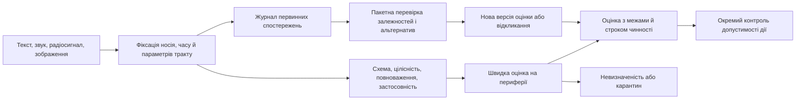

# Глава 37. Оцінювання вхідної інформації: джерела, свідчення та невизначеність

> **Книга:** [Архітектура доказових експертних систем](README.md) · [Частина III: Здобуття знань, мовний аналіз та оцінювання входу](part-03-knowledge-engineering-nlp.md)  
> **Попередня глава:** [Глава 15. Вилучення знань і побудова бази знань: факти, граматики та автомати](ch15-knowledge-extraction-and-kb-construction.md)  
> **Наступна глава:** [Глава 16. Архітектура експертної системи: від формального знання до доказового рішення](ch16-expert-systems-architecture.md)  
> **Зміст книги:** [README.md](README.md)  
> **Автор:** [Микола Федчик](about-the-author.md)  
> **Рівень:** поглиблений: інженери знань, аналітики, архітектори периферійних і потокових обчислень  
> **Очікувані результати:** розділяти сигнал, джерело й твердження; оцінювати незалежність свідчень, невизначеність і суперечності; будувати автоматичний шлюз допуску для потокової та пакетної обробки без обов'язкового ручного перегляду кожного повідомлення.

## Анотація

У критично важливих розподілених комплексах (SCADA енергомереж, автомобільна телеметрія за ISO/SAE 21434, системи протиаварійного захисту за IEC 61508 SIL 3) наївний допуск вхідних повідомлень безпосередньо у базу фактів призводить до катастрофічних системних відмов. Якщо експертна система розглядає кожен синтаксично коректний мережевий пакет чи спрацювання сенсора як беззаперечне свідчення, вона стає вразливою до трьох фатальних ефектів: рефлексивного обману (атаки підміни та повтору, *spoofing/replay*), псевдопідтвердження залежними копіями (ефект «інформаційного відлуння», коли десять ретрансляцій одного спотвореного сигналу хибно сприймаються як десять незалежних доказів) та помилкового аварійного зупинення (*scramming*) через некорельований сенсорний шум.

Ця глава вирішує проблему побудови автоматизованого контрольно-пропускного шлюзу допуску інформації (`IngressAdmissionGate`). У дослідженні перенесено перевірені методи аналітики оцінювання свідчень (аналіз конкуруючих гіпотез ACH Річардса Г'юера, двовимірну модель невизначеності PHIA/AnCR та шкалу надійності NATO STANAG 2022) у площину строгих структур даних, логарифмічних відношень правдоподібності, фільтрації перетину коваріацій (*Covariance Intersection*) і відтворюваних алгоритмів експертного скепсису з політиками автоматичного карантину.

## 1. Від повідомлення до знання

На вузол надходять три повідомлення: текст «насос працює», звук із характерною частотою обертання й цифровий пакет зі статусом `RUNNING`. Три повідомлення ще не означають три незалежні підтвердження. Текст і пакет могли бути породжені одним контролером, а звук міг належати сусідньому насосу. Потрібно встановити об'єкт, час, походження й альтернативне пояснення кожного повідомлення.

У цій главі розвідка означає аналітичну діяльність із перетворення неповних відомостей на обґрунтовану оцінку для рішення. Авторський зв'язок між «відати», «знати» й розвідувальною роботою є смисловим входом до теми, не етимологічним доказом походження слова. Спільне з інженерією знань полягає у встановленні підстав, альтернатив і меж висновку.

Пропоноване розділення входу:

| Об'єкт | Що відомо | Чого ще не встановлено |
|---|---|---|
| Сигнал | приймач зафіксував напругу, відліки або байти | що сигнал означає |
| Спостереження | аналізатор виділив слово, частоту, контур або подію | чи правильно визначено об'єкт і контекст |
| Твердження | зафіксовано «насос P-7 працює о 12:03» | чи достатні підстави твердження |
| Оцінка | відомі перевірки, альтернативи й невизначеність | чи дозволено використовувати оцінку для конкретної дії |

Підпис цифрового пакета підтверджує автора підпису та цілісність пакета за прийнятої моделі ключів, але не справність датчика. Якісний звук підтверджує якість запису, але не тотожність насоса. Перший результат глави: інформацію не можна допустити у базу фактів лише тому, що канал доставив повідомлення без помилки.

## 2. Дев'ять аналітичних традицій: метод, свідчення й межі перенесення

Розвідувальні служби не публікують повних робочих алгоритмів. Тому порівнювати потрібно конкретні доступні документи, а не приписувати країні «байєсівську» чи «нейромережеву» школу за загальним враженням. Нижче офіційний опис діяльності відокремлено від історичного дослідження та авторської пропозиції для експертної системи (ЕС). Відсутність відкритої методики означає прогалину цього огляду, а не відсутність аналітичних засобів у служби.

### 2.1. Радянська традиція: індикатори й небезпека замкненої картини

Бенджамін Фішер у дослідженні програми РЯН, присвяченої ранньому попередженню про ракетно-ядерний напад, описує організацію спостереження за індикаторами намірів у 1980-х роках [[3]](#src-3). Це ретроспективне американське дослідження радянської практики, не загальнодоступний радянський нормативний алгоритм. Придатний для перенесення елемент: заздалегідь визначені ознаки, строки спостереження й критерії перегляду оцінки. Непридатне перенесення: накопичувати будь-які зміни як підтвердження єдиної наперед обраної загрози.

Тімоті Томас аналізує теорію рефлексивного керування з радянськими витоками й подальшими російськими розробками [[4]](#src-4). Для цієї глави важливий захисний висновок: відомості можуть бути сформовані так, щоб змінити модель рішення одержувача. ЕС має розглядати залежність повідомлень і можливість навмисного введення в оману. Сам факт походження повідомлення з певної країни не є доказом обману. Відкриті джерела цього огляду не встановлюють універсальної радянської числової шкали достовірності або її реалізації у програмі.

### 2.2. Американська традиція: аналіз конкуруючих гіпотез

Г'юер пропонує аналіз конкуруючих гіпотез (*Analysis of Competing Hypotheses*, ACH): зіставити ті самі свідчення з кількома поясненнями, шукати несумісності та перевіряти залежність результату від припущень [[1]](#src-1). Для насоса P-7 альтернативами є робота насоса, шум сусіднього агрегата та застарілий статус контролера. Звук, можливий за всіх трьох пояснень, слабко розрізняє гіпотези, хоча звучить переконливо.

Матриця ACH дисциплінує аналіз, але не перетворює кількість позначок «узгоджується» на апостеріорну ймовірність. У програмному поданні потрібні гіпотези, свідчення, зв'язки підтримки й спростування та залежності між свідченнями. Математичну вагу дає модель правдоподібності, розглянута в розділі 7, а не назва методу. Американська традиція неоднорідна: рекомендації аналітикам, військові процедури й стандарти обміну не є одним алгоритмом.

### 2.3. Британська традиція: дві мови невизначеності

Відкрита британська настанова 2025 року містить шкалу словесного вираження ймовірності PHIA, тобто *Professional Head of Intelligence Assessment*, і рейтинги аналітичної впевненості *Analytical Confidence Ratings* (AnCR) [[2]](#src-2). Ймовірність відповідає на питання, наскільки можливе твердження. AnCR відповідає на питання, наскільки міцні підстави оцінки та наскільки оцінка може змінитися після отримання нових відомостей. AnCR враховує інформаційну основу, строгість аналізу та складність і мінливість середовища.

Оцінка «ймовірно, насос працює; впевненість низька через невстановлену тотожність джерела звуку» не є суперечністю. Інтервал і причина невпевненості мають залишатися окремими полями. Приблизні діапазони PHIA не є суцільним набором програмних порогів: між опублікованими діапазонами є проміжки, а їхні межі приблизні. ЕС не повинна автоматично підставляти середину словесного діапазону як виміряну ймовірність.

### 2.4. Німецька традиція: перевірка й предметне ущільнення

Федеральна розвідувальна служба Німеччини (*Bundesnachrichtendienst*, BND) у відкритому описі аналітичної роботи зазначає, що відомості нерідко надходять неповними або як непідтверджена чутка; аналітики перевіряють зміст і формують узагальнену картину [[5]](#src-5). Опис також підкреслює предметні знання й добір методу під питання. Це офіційне повідомлення про принципи роботи, не оприлюднений набір коефіцієнтів.

Для ЕС переноситься вимога предметної застосовності: експерт із мережевого трафіку не є автоматично експертом з акустики насоса. Реєстр джерел має розрізняти домен, метод вимірювання й область калібрування. Узагальнення не повинне стирати посилання на первинні відомості. Конкретний алгоритм BND для обчислення достовірності цей огляд не встановлює.

### 2.5. Французька традиція: цикл запиту й взаємодоповнювальні сенсори

Дирекція військової розвідки Франції (*Direction du renseignement militaire*, DRM) описує чотирифазний розвідувальний цикл, спрямований на задоволення інформаційних потреб, і взаємодоповнюваність сенсорів [[6]](#src-6). DRM підтримує військових та політичних споживачів оцінок. Відкритий опис не дає підстав приписувати всім французьким службам одну математичну модель.

Для ЕС корисний зв'язок «питання → потрібне спостереження → перевірка → оцінка». Камера потрібна не тому, що доступна ще одна модальність, а тому, що зображення може відрізнити P-7 від сусіднього насоса. Перехід від різних сенсорів до незалежного підтвердження потребує перевірки спільних причин похибки: однаковий час, спільне живлення або одна базова модель можуть робити результати залежними.

### 2.6. Японська традиція: міжвідомче узагальнення та координація

Поточний відкритий опис Секретаріату Кабінету Японії охоплює Національну розвідувальну раду й Національне розвідувальне бюро: збирання відомостей, міжвідомче узагальнення, комплексний аналіз та оцінювання [[7]](#src-7). Назви на актуальній сторінці відрізняються від поширеної в старіших матеріалах назви Кабінетного бюро розвідки й досліджень (*Cabinet Intelligence and Research Office*, CIRO). Огляд фіксує стан сторінки на 4 жовтня 2026 року, а не переносить стару структуру на сьогодення.

Програмний урок: міжвідомче злиття потребує узгодження об'єктів, часу та походження. Передавання одного повідомлення через два відомства не створює двох незалежних спостережень. Наукова інформатика пропонує графи походження й зіставлення сутностей, але ця пропозиція не є твердженням про конкретний закритий японський алгоритм.

### 2.7. Китайська традиція: відбір, інтеграція й технологічна обробка

Стаття 22 китайського Закону про національну розвідку говорить про застосування науково-технічних засобів для розрізнення, відбору, узагальнення й аналітичного оцінювання відомостей. Тут використано відкритий неофіційний англійський переклад China Law Translate редакції 2018 року [[8]](#src-8). Закон задає повноваження й напрям розвитку, не специфікацію машинного оцінювача.

Для ЕС цей напрям означає послідовність фільтрації, нормалізації, інтеграції й перевірки. Публікації про китайські дослідження штучного інтелекту або злиття сенсорів не доводять, що певний розвідувальний орган використовує саме ці алгоритми. В огляді не підтверджено загальної китайської шкали достовірності чи еквівалентності її категорій британським AnCR.

### 2.8. Ізраїльська традиція: критика незмінної концепції

Урі Бар-Йосеф та Арі Круглянскі досліджують аналітичний провал перед війною 1973 року через психологічну потребу в когнітивній завершеності, тобто схильність рано закрити питання й утримувати прийняте пояснення [[9]](#src-9). Це науковий аналіз конкретного випадку, не офіційна сучасна доктрина всіх ізраїльських служб. Його інженерний наслідок: успішне в минулому пояснення має залишатися відкритим до спростування.

Для ЕС потрібні незалежна процедура пошуку контрприкладу, журнал відхилених альтернатив і перевірка чутливості до вилучення найсильнішого свідчення. Популярний сюжет про «десятого аналітика», який завжди заперечує решті, не використовується тут як доведений універсальний регламент. Алгоритмічна незгода має спиратися на перевірюване альтернативне пояснення, а не на автоматичне заперечення кожного висновку.

### 2.9. Українська традиція: аналітичне опрацювання та зовнішня перевірка моделей

Закон України «Про розвідку», зокрема статті 6 і 12, відокремлює добування, аналітичне опрацювання, оброблення й надання відомостей, а також передбачає роботу з інформаційними ресурсами [[10]](#src-10). Юридичне визначення розвідувальної інформації в цьому законі вужче за побутове або загальнонаукове значення терміна. Тому відкриті публікації та дослідження не можна автоматично називати розвідувальною інформацією в юридичному сенсі.

Українська кібернетична школа дає окрему наукову основу: метод групового врахування аргументів (МГУА) Олексія Івахненка добирає структуру моделі за зовнішнім критерієм на даних, які не використано для оцінювання її параметрів [[11]](#src-11). Для ЕС це аргумент на користь відкладених перевірочних даних, а не доказ упровадження МГУА у конкретній службі. Відкрита нормативна й наукова основа існує; числові пороги реальних українських розвідувальних органів цей огляд не встановлює.

Порівняння не дає рейтингу країн. Воно дає п'ять вимог до ЕС: реєструвати підстави, утримувати альтернативи, перевіряти незалежність каналів, відокремлювати невизначеність від рішення й допускати перегляд оцінки. Спільний машинний контракт потрібний незалежно від країни походження методики.

## 3. Правоохоронна аналітика: зв'язок не дорівнює доказу вини

У розслідуванні дві особи можуть мати спільну адресу, телефон або контрагента без спільної протиправної діяльності. Тому граф зв'язків потрібний для формування перевірюваних версій, а не для автоматичного присвоєння статусу «винний». Посібник Управління ООН з наркотиків і злочинності (*United Nations Office on Drugs and Crime*, UNODC) розглядає оцінювання джерел і даних, аналіз зв'язків, хронологію подій та національну модель поліцейської аналітики Великої Британії [[12]](#src-12).

### 3.1. Національні та міжнаціональні структури

Федеральне бюро розслідувань США (*Federal Bureau of Investigation*, FBI) публічно описує використання аналітики для рішень і міжвідомчого обміну та підпорядкування збирання законодавчим і процесуальним вимогам [[13]](#src-13). Британський приклад у посібнику UNODC пов'язує аналітичні продукти з інформаційними потребами й пріоритетами роботи, але історичний посібник не слід приймати за чинну специфікацію кожного британського поліцейського підрозділу.

Міжнародна організація кримінальної поліції INTERPOL описує оперативні й стратегічні аналітичні звіти та структуровані аналітичні файли [[14]](#src-14). Агентство Європейського Союзу зі співробітництва правоохоронних органів Europol описує тематичні аналітичні проєкти, обмеження мети використання й підтримку національних розслідувань [[15]](#src-15). Міжнародна організація може збирати повідомлення багатьох учасників; кількість учасників не встановлює незалежності первинних джерел.

Для українського правоохоронного застосування окремий рівень становлять норми Кримінального процесуального кодексу України, зокрема статті 17, 84, 86 і 94: презумпція невинуватості, джерела доказів, допустимість та оцінка доказів [[16]](#src-16). Аналітичний бал ЕС не замінює процесуального рішення. Перегляд повідомлення людиною можна прибрати з рутинного первинного сортування, але не оголосити скасованими законні повноваження слідчого, прокурора чи суду.

| Аналітична задача | Придатний метод | Обов'язкове обмеження |
|---|---|---|
| Зіставлення записів про об'єкт | нормалізація та зіставлення сутностей | однакове ім'я не доводить тотожності людини |
| Виявлення зв'язків | графові запити, часові й просторові зіставлення | ребро має тип, джерело й статус перевірки |
| Упорядкування версій | ACH, байєсівська модель, контрприклади | версія не є встановленим фактом |
| Визначення пріоритету перевірки | очікувана користь, наслідки, строки | пріоритет не є оцінкою вини |
| Підготовка матеріалу для провадження | ланцюг зберігання й перевірка первинних носіїв | технічна цілісність не замінює процесуальної допустимості |

Отже, правоохоронна аналітика додає до звичайної інженерії знань цільове обмеження й ланцюг зберігання. Далі потрібно визначити, як ці вимоги працюють із машинними повідомленнями про інциденти.

## 4. Кіберзахист: від спрацювання детектора до підтвердженого інциденту

Детектор позначив незвичний вхід у мережевий сервіс. Подію може пояснювати порушення безпеки, планова робота адміністратора або неправильний годинник вузла. Форум команд реагування та безпеки (*Forum of Incident Response and Security Teams*, FIRST) у рамці послуг команд реагування на комп'ютерні інциденти (*Computer Security Incident Response Teams*, CSIRT) розділяє моніторинг, аналіз подій, кваліфікацію, приймання повідомлень, аналіз інцидентів і артефактів [[17]](#src-17). Описана рамка не задає універсального порога «це точно атака».

Національний інститут стандартів і технологій США (*National Institute of Standards and Technology*, NIST) у спеціальній публікації (*Special Publication*, SP) 800-61 Rev. 3, опублікованій 2025 року, пов'язує реагування на інциденти з керуванням кіберризиком [[18]](#src-18). Для ЕС важливе розділення: сигнал детектора → кандидат інциденту → підтверджений інцидент → оцінка впливу → рішення про реакцію. Підтвердження інциденту й установлення його причини мають різні підстави.

### 4.1. Валідація, верифікація й повторна перевірка

У цьому профілі **валідація входу** означає перевірку придатності даних до визначеної задачі: чи правильно визначено об'єкт, час і спосіб отримання. **Верифікація обробки** означає перевірку виконання заданих вимог: схеми, одиниць, цілісності, часових правил і алгоритму. Терміни в різних стандартах мають власні визначення; наведене розмежування є контрактом цієї глави, а не заміною всіх стандартних визначень.

| Етап | Що перевіряє ЕС | Що не можна вважати доведеним |
|---|---|---|
| Приймання | формат, ліміти розміру, дозволений канал, ідентичність повідомлення | факт інциденту |
| Перевірка артефакта | хеш, підпис за потреби, наявність первинного носія, історія передачі | правдивість інтерпретації |
| Зіставлення | актив, користувацький обліковий запис, час, конфігурація детектора | тотожність фактичної людини обліковому запису |
| Кореляція | зв'язок подій і спільне походження | незалежне підтвердження кожної копії |
| Кваліфікація | пояснення спрацювання та альтернативи, фактичний вплив | причина, мотив або автор інциденту |
| Повторна перевірка | нові свідчення, зміна версії правила, відкликання індикатора | чинність старого рішення після зміни підстав |

Повідомлення й вкладення розбирають в ізольованому середовищі з лімітами ресурсів, як рекомендує FIRST. Відсутність спрацювання у випробувальному середовищі не доводить нешкідливості артефакта: могли не виконатися потрібні умови. Так само три антивірусні висновки не є трьома незалежними оцінками, якщо рушії використовують спільну базу сигнатур.

### 4.2. Не плутати достовірність, тяжкість і межі поширення

Протокол світлофорного маркування (*Traffic Light Protocol*, TLP) версії 2.0 визначає межі поширення відомостей, не їхню істинність [[19]](#src-19). `TLP:CLEAR` означає відсутність обмежень цього протоколу на поширення, але не звільняє від авторського права та інших правових вимог. `TLP:RED` не робить повідомлення надійнішим.

Загальна система оцінювання вразливостей (*Common Vulnerability Scoring System*, CVSS) версії 4.0 оцінює характеристики й тяжкість вразливості [[20]](#src-20). Бал 9,8 не означає ймовірності інциденту 98 %. Для того самого активу потрібні окремі оцінки достовірності повідомлення, тяжкості наслідків і права виконати захисну дію.

Для інформаційного захисту повідомлення «опубліковано витік» також розкладають на твердження: публікація існує; наданий зразок справжній; дані належать організації; дані актуальні; отримання даних було несанкціонованим. Справжній зразок не доводить усіх інших тверджень. Перевірка відбувається на дозволеній контрольній вибірці без зайвого поширення персональних даних. Машинний пошук підробки є підставою для обережності, а не автоматичним установленням навмисного обману.

## 5. Текст, звук, радіохвилі та зображення: контракт первинного спостереження

У загальній архітектурі доказової експертної системи шлюз первинного приймання інформації (`IngressAdmissionGate`) виступає фронтальним бар'єром між фізичним середовищем спостереження та базою фактів. Якщо знехтувати контрактом первинного спостереження і допустити пряму конвертацію мультимодальних сигналів у семантичні твердження, виникає незворотна деградація доказовості: однакова текстова фраза «насос зупинено» може походити як із підписаного протоколу SCADA, так і з низькоякісного виходу моделі розпізнавання мови (ASR) чи оптичного зчитування покажчика тиску (OCR). Наївний підхід, поширений у сучасних мультимодальних конвеєрах, зберігає лише фінальний розпізнаний текст або ембеддинг. Це призводить до катастрофічних системних відмов у місійно-критичних застосуваннях (ISO 26262 ASIL D, IEC 61508 SIL 3): при виникненні аномалії система не здатна верифікувати первинні відліки, встановити дрейф апаратури або виявити атаку підміни сигналу (*sensor spoofing*). Для збереження доказовості система зобов'язана фіксувати непорушний контракт спостереження: первинний фізичний носій, часо-просторові координати фрагмента та детермінований ланцюг перетворень.

| Вхід | Швидка перевірка придатності | Що зберігати як підставу | Межа розпізнавання |
|---|---|---|---|
| Цифровий текст | кодування, структура, мова, заперечення, числа й одиниці | первинні байти, діапазон цитати, редакція | точна цитата може містити хибне повідомлення |
| Друковані чи рукописні символи | різкість, контраст, нахил, альтернативні прочитання | зображення, ділянка, версія оптичного розпізнавання (*Optical Character Recognition*, OCR) | розпізнане «8» може бути «3» |
| Аналоговий звук | насичення, шум, смуга частот, справність тракту | відліки після аналого-цифрового перетворення, час, калібрування | гучність не визначає джерела або змісту |
| Цифровий звук | пропуски кадрів, кодек, часові мітки | первинний запис і часовий інтервал | текст автоматичного розпізнавання мови (*Automatic Speech Recognition*, ASR) є похідною гіпотезою |
| Радіосигнал | смуга приймача, частота дискретизації, насичення, калібрування | прийняті відліки або перевірений опис ознак | наявність випромінювання не доводить автора чи наміру |
| Зображення й відео | геометрія, освітлення, час кадру, дублікати | кадри, ділянки, параметри камери й обробки | підпис або координати файла не доводять місця знімання |
| Аналоговий пороговий вихід | дрейф порога, невизначеність, гістерезис | значення порога, версія калібрування, часовий журнал | компаратор видає рішення за порогом, не встановлює семантичної істинності |

Принцип зберігання для аналогового входу відрізняється від побайтової цитати документа: неможливо повторно прочитати минулу неперервну хвилю без її запису. Потрібно зберегти доступне цифрове спостереження й опис вимірювального тракту. Підпис вузла після перетворення засвідчує запис, не достовірність фізичного явища до приймача. Фізичні перевірки й змішані обчислення докладніше розглянуто в [додатку Д](appendix-e-mixed-signal-neuromorphic-expert-systems.md).

Для ідеального рівномірного дискретизування дійсного низькочастотного сигналу без складових вище $B$ потрібно $f_s>2B$ та відповідний протиаліасний фільтр. Це умова збереження частотної інформації за зазначених припущень, а не умова правдивості повідомлення; загальну теорію передавання й дискретизації розглядав Клод Шеннон [[21]](#src-21). Якщо потрібна смуга до 8 кГц, 16 кГц залишають без практичного запасу для фільтра, тому частоту дискретизації обирають разом із характеристиками тракту. Для смугових і комплексних сигналів модель дискретизації інша.

Пропонований паспорт спостереження містить первинний ідентифікатор, модальність, об'єкт, час події та приймання, координати, похибку часової й просторової прив'язки, ланцюг перетворень, версії моделей, джерело та групу залежності. Запис без первинного фрагмента може залишитися сигналом для пошуку, але не повною підставою доказового висновку. Наступний крок: класифікувати стан самого твердження.

## 6. Категорії достовірності: багатовісна таксономія

У підсистемі верифікації походження знань (`EpistemicProvenanceRegistry`) класифікація вхідних свідчень визначає допустимість їхнього залучення до логічного висновку. Механічне змішування епістемічних категорій («хибне», «підозріле», «неперевірене», «оманливе») у єдиний узагальнений скалярний бал достовірності руйнує формальну логіку експертної системи: система або передчасно відкидає критично важливі аварійні сигнали зі слабких каналів, або беззастережно приймає недоведені припущення через їхню високу статистичну правдоподібність. У практиці аналізу розвідувальних і правоохоронних даних (UNODC, NATO STANAG 2022) для розв'язання цієї проблеми застосовують ортогональну двовісну шкалу $6\times6$, яка розділяє надійність джерела (літери A–F) та внутрішню обґрунтованість самого повідомлення (цифри 1–6) [[12]](#src-12).

| Код джерела | Значення у профілі 6×6 | Код повідомлення | Значення у профілі 6×6 |
|---|---|---|---|
| A | повністю надійне за наявною історією | 1 | підтверджене іншими незалежними джерелами |
| B | зазвичай надійне | 2 | ймовірно правдиве |
| C | досить надійне | 3 | можливо правдиве |
| D | зазвичай ненадійне | 4 | сумнівне |
| E | ненадійне | 5 | малоймовірне, з відомостями на користь протилежного |
| F | надійність неможливо оцінити | 6 | правдивість неможливо оцінити |

Це скорочений переказ категорій, не таблиця відсотків. Код F6 не означає ні «найгірше джерело», ні ймовірність 0,5. A1 не означає математичної певності. Той самий посібник наводить іншу шкалу $4\times4$, у якій оцінювання змісту більше спирається на особисту обізнаність джерела та підтвердження. Зведення 4×4 до 6×6 за однаковими номерами без урахування визначень некоректне.

Для ЕС пропоную зберігати не одну категорію, а такі незалежні осі:

| Вісь | Приклади значень | Чого значення не означає |
|---|---|---|
| Епістемічний тип | спостереження, повідомлене твердження, висновок, гіпотеза, норма | гіпотеза не стає фактом від високого бала |
| Стан підтвердження | невизначене, припустиме як гіпотеза, ймовірно підтримане, підтверджене за профілем, спростоване за профілем | підтвердження не універсальне поза областю перевірки |
| Суперечність | не виявлена, виявлена, нерозв'язана | суперечність не встановлює, яке джерело помилилося |
| Маніпуляція | ознак не встановлено, підозра, підтверджена підробка носія | підробка носія не завжди встановлює намір конкретної людини |
| Чинність | поточне, застаріле, відкликане | застаріле повідомлення могло бути істинним у минулому |
| Придатність | придатне, пошкоджене, поза моделлю, бракує контексту | непридатність до аналізу не означає хибності |
| Операційний допуск | дозволене для задачі, карантин, відкладена перевірка, відхилене | дозвіл використання не дорівнює доказу істинності |

«Достовірна» в інженерному профілі означатиме: твердження достатньо підтверджене за визначеною процедурою й у зазначеному контексті. «Припустима» означатиме допустиму робочу гіпотезу, не автоматично дозволену підставу дії. «Сумнівна» означатиме слабкі або нестійкі підстави. «Хибна» потребуватиме свідчення спростування. «Оманлива» потребуватиме окремого обґрунтування маніпуляції; низької ймовірності для такої мітки недостатньо.

Отже, таблиці категорій потрібні для сумісності та пояснення, а не як універсальна арифметика довіри. Для обчислення потрібні визначена подія, модель її спостереження й контроль залежностей.

### 6.1. Об'єктивізація шкали NATO 6×6 для автономних систем

У традиційній аналітиці шкала NATO STANAG 2022 формулюється як словесні настанови для офіцера-аналітика («повністю надійне», «ймовірно правдиве»). При спробі безпосереднього перенесення цієї шкали в автоматизовані та нейро-символічні системи виникає ризик класифікаційного дрейфу: мовна модель або евристичний класифікатор схильні суб'єктивно призначати індекси на основі поверхневої стилістики тексту, плутаючи категорію джерела $B$ із $D$.

Для усунення суб'єктивності доказова експертна система повинна спиратися на детерміновані критерії:
1. **Категорія надійності джерела (A–F):**
   - $A$ (повністю надійне): джерело підтверджене валідним криптографічним цифровим підписом або походить з акредитованого депозитарію стандартів (ISO, IEC, SAE, RFC);
   - $B$ (зазвичай надійне): офіційна сертифікована документація OEM-виробника або регламентний звіт випробувальної лабораторії з верифікованим ланцюгом постачання;
   - $C$ (досить надійне): внутрішній інженерний звіт чи телеметричний журнал стенда без сторонньої сертифікації, але з відомими параметрами вимірювального тракту;
   - $D$ (зазвичай ненадійне): робоча чернетка інженера, коментарі у вихідному коді, повідомлення без прив'язки до експерименту;
   - $E$ (ненадійне): неавторизовані публічні форуми, неструктуровані блоги або джерела з історією фальсифікацій чи невідповідності фізичним нормам;
   - $F$ (неможливо оцінити): нове джерело без перевіреного походження та історії.
2. **Категорія обґрунтованості повідомлення (1–6):**
   - $1$ (підтверджене): наявні щонайменше два незалежні джерела з різними ідентифікаторами груп залежності `GroupID`, що містять тотожні числові межі чи логічні інваріанти;
   - $2$ (ймовірно правдиве): твердження узгоджується з аналітичною моделлю предметної галузі, але спирається на єдину групу свідчень;
   - $3$ (можливо правдиве): твердження не суперечить системним інваріантам, проте параметричні докази чи прямі виміри відсутні;
   - $4$ (сумнівне): твердження містить граничні параметричні відхилення або внутрішні неузгодженості;
   - $5$ (малоймовірне): повідомлення прямо суперечить фундаментальним законам фізики, зафіксованим у базі знань, або відкликаним версіям стандартів;
   - $6$ (неможливо оцінити): бракує контексту, розмірностей або часових меж спостереження.

### 6.2. Два режими входу та дискретний епістемічний чекліст для корпусів знань

У загальному життєвому циклі функціонування доказової ЕС необхідно строго розмежовувати два принципово відмінні процеси надходження інформації:
1. **Режим оперативної сенсорної телеметрії (Operational Sensing Stream):** високочастотні потоки вимірювань фізичних параметрів (датчики струму, тиску, віброприскорення, відліки АЦП). Тут діють жорсткі дедлайни реального часу ($T \le 20\,\text{мс}$), відомі експериментальні частоти відмов сенсорів, і математичний апарат спирається на послідовний аналіз Вальда (SPRT), фільтрацію перетину коваріацій (CI) та неперервний логіт-висновок.
2. **Режим семантичного здобуття знань (Knowledge Ingestion & Crystallization):** періодичне або дефіцитно-орієнтоване викачування нормативних документів, інженерних регламентів, даташитів компонентів та схем для компіляції нових баз знань.

Для режиму здобуття знань пряме застосування неперервного відношення правдоподібностей $\Lambda(E) = \frac{P(E\mid H)}{P(E\mid \neg H)}$ неможливе: для довільного тексту інженерної статті чи регламенту об'єктивні числові значення апріорних ймовірностей $P(H)$ відсутні. Приписування тексту довільного логарифмічного коефіцієнта є математичною ілюзією точності (*pseudo-precision*).

Для текстових корпусів доказова ЕС впроваджує **дискретний епістемічний чекліст (Epistemic Scorecard, $S_{\mathrm{doc}} \in [0, 100]$)**:

| Компонент оцінювання | Критерій | Внесок у бал |
|---|---|---|
| **Базова авторитетність джерела** | Офіційний затверджений стандарт (ISO, IEC, SAE, IEEE, RFC) | $+40$ |
| | Сертифікований OEM-даташит компонента / заводська інструкція | $+30$ |
| | Внутрішній затверджений регламент / звіт стендових випробувань | $+20$ |
| | Неверифіковане зовнішнє джерело / інтернет-публікація | $+5$ |
| **Параметрична строгість тверджень** | Наявність чітких числових меж $[Min, Max]$ із розмірностями SI | $+20$ |
| | Наявність явно визначених умов відмови чи аварійних меж (`DEFEATERS`) | $+20$ |
| | Наявність криптографічного цифрового підпису автора або репозиторію | $+20$ |
| **Запобіжні штрафи (Red Flags)** | Документ має статус відкликаного або застарілого (*Superseded / Deprecated*) | $-50$ |
| | Виявлено логічні софізми (коло у доведенні, підміна тези) | $-30$ |
| | Порушення фізичних констант (порушення законів термодинаміки, балансу енергії) | $-100$ (`REJECT`) |

**Операційні пороги шлюзу знань:**
- $S_{\mathrm{doc}} \ge 70$ балів $\to$ `ADMIT` (допуск документа до автоматичної онтологічної екстракції норм);
- $40 \le S_{\mathrm{doc}} < 70$ балів $\to$ `DEFER` (потребує другого незалежного підтверджуючого джерела або санкціонування інженером);
- $S_{\mathrm{doc}} < 40$ балів $\to$ `DISMISS` (відхилення без витрат ресурсів на обробку).

## 7. Ймовірнісна оцінка: сила свідчення, залежність і невизначеність

### 7.1. Від базової частоти до відношення правдоподібностей

У задачах автоматизованого моніторингу промислових об'єктів (SCADA, атомна енергетика, бортові комп'ютери БПЛА) наївне сприйняття сигналу детектора без урахування апріорної частоти події спричиняє когнітивну помилку базової ставки (*base rate fallacy*). Нехай $H$ позначає фізичний стан «критична несправність вузла виникла в контрольованому інтервалі», а $E$ — апаратне або програмне спрацювання детектора. Якщо аварії трапляються вкрай рідко ($P(H) \ll 1$), навіть сенсор із 90-відсотковою чутливістю за наявності хибних спрацювань генеруватиме потік тривог, де абсолютна більшість є шумом. Для детермінованого оновлення оцінки вхідний шлюз ЕС обчислює оновлені апостеріорні шанси через відношення правдоподібностей:

```math
O(H\mid E)=O(H)\,\Lambda(E),\qquad O(H)=\frac{P(H)}{1-P(H)},\qquad
\Lambda(E)=\frac{P(E\mid H)}{P(E\mid\neg H)}.
```

**Параметри та допустимі діапазони:**
- $P(H) \in (0, 1)$ — апріорна ймовірність події (базова частота дефекту, наприклад $P(H) = 10^{-4}$ за годину напрацювання).
- $O(H) \in (0, \infty)$ — апріорні шанси події (безрозмірнісне відношення ймовірності події до ймовірності її відсутності).
- $P(E\mid H) \in [0, 1]$ — чутливість детектора (частка істинно позитивних спрацювань, True Positive Rate).
- $P(E\mid\neg H) \in [0, 1]$ — рівень хибних тривог детектора (частка хибно позитивних спрацювань, False Positive Rate).
- $\Lambda(E) \in [0, \infty)$ — відношення правдоподібностей (*Likelihood Ratio*, LR), що вимірює діагностичну силу свідчення $E$. Знаменник зобов'язаний бути ненульовим ($P(E\mid\neg H) > 0$).
- $O(H\mid E) \in [0, \infty)$ — оновлені апостеріорні шанси гіпотези після надходження свідчення $E$.

**Практичне застосування та інженерні висновки:**
- Розрахунок виконується сервісом валідації свідчень при кожній зміні дискретного стану вхідних сенсорів.
- Градація діагностичної сили: значення $\Lambda(E) > 1$ зміщує баланс на користь гіпотези несправності $H$; $\Lambda(E) = 1$ свідчить про повну інформаційну нейтральність входу (сигнал ігнорується); $\Lambda(E) < 1$ свідчить на користь штатної роботи $\neg H$.
- Приклад системного рішення: нехай базова частота відмови $P(H) = 0{,}01$, чутливість $P(E\mid H) = 0{,}90$, а рівень хибних тривог $P(E\mid\neg H) = 0{,}10$, що дає $\Lambda(E) = 9{,}0$. Апостеріорна ймовірність після спрацювання детектора становить $P(H\mid E) = \frac{0{,}01 \times 0{,}90}{0{,}01 \times 0{,}90 + 0{,}99 \times 0{,}10} = \frac{0{,}009}{0{,}108} \approx 0{,}083$ (8,3 %). Експертна система робить категоричний висновок: спрацювання детектора недостатнє для аварійної зупинки технологічного процесу (*nuisance trip* за стандартом IEC 61508). Система автоматично блокує аварійний виконавчий сигнал, призначає події статус `DEFER_INSUFFICIENT_EVIDENCE` і запускає регламент цільового запиту додаткових спостережень.

### 7.2. Десять копій не створюють десяти підтверджень

При потоковій обробці розподілених повідомлень виникає загроза інформаційного відлуння (*circular reporting*): коли одна первинна телеграма транслюється мережею через десять ретрансляторів, наївний байєсівський оцінювач сприймає їх як десять незалежних сенсорів і штучно роздуває впевненість до 99,99 %. Щоб унеможливити подібні відмови, накопичення логарифмічних шансів для послідовності свідчень здійснюється виключно з урахуванням умовної залежності від попередньої історії:

```math
\log O(H\mid E_{1:n})=\log O(H)+
\sum_{i=1}^{n}\log\frac{P(E_i\mid H,E_{1:i-1})}{P(E_i\mid\neg H,E_{1:i-1})}.
```

**Параметри та допустимі діапазони:**
- $\log O(H) \in (-\infty, +\infty)$ — початкові логарифмічні апріорні шанси у логітах (безрозмірнісні одиниці $\text{nats}$ або $\text{dB}$).
- $E_i$ — $i$-те вхідне спостереження в потоковому пулі фактів ($i = 1, \dots, n$).
- $E_{1:i-1}$ — множина всіх раніше оброблених і зв'язаних свідчень до кроку $i$ включно (для $i=1$ множина порожня).
- $\frac{P(E_i\mid H,E_{1:i-1})}{P(E_i\mid\neg H,E_{1:i-1})}$ — умовне відношення правдоподібностей свідчення $E_i$ з урахуванням історії $E_{1:i-1}$.
- $\log O(H\mid E_{1:n})$ — результуючі логарифмічні шанси гіпотези після обробки серії свідчень.

**Практичне застосування та інженерні висновки:**
- Шлюз вводу веде спрямований граф походження (*provenance graph*) кожного факту. Просте додавання незалежних логарифмічних доданків дозволене тоді й лише тоді, коли граф гарантує строгу умовну незалежність джерел $P(E_i \mid H, E_{1:i-1}) = P(E_i \mid H)$.
- Якщо спостереження $E_i$ є дублікатом або ретрансляцією вже врахованого $E_j$, умовна ймовірність детерміновано дорівнює одиниці як під гіпотезою $H$, так і під $\neg H$. Відношення правдоподібності перетворюється на $\frac{1}{1} = 1$, а логарифмічний внесок дорівнює тотожному нулю ($\log 1 = 0$).
- Інженерне правило відсікання: при надходженні десяти передруків вихідна оцінка $P(H\mid E) \approx 0{,}471$ (за $P(H)=0{,}1$, $\Lambda=8$) залишається непорушною. Лише підтверджене незалежне спостереження (наприклад, оптичний датчик за наявності акустичного сенсора з $\Lambda=4$) збільшує апостеріорну ймовірність до $32/41 \approx 0{,}780$. Будь-який вхід без доведеної незалежності групується в єдиний пул залежності `GroupID`.

### 7.3. Інтервал оцінки замість удаваної точності

В умовах неповної вибірки калібрування сенсорів або неточних експертних оцінок точкові значення апріорної ймовірності та вагових коефіцієнтів є псевдонауковою фікцією. Для гарантування надійності доказова ЕС зобов'язана виконувати робастне інтервальне оцінювання епістемічної невизначеності за допомогою логіт-оболонок:

```math
L_{\min}=\mathop{\mathrm{logit}}(p_{0,\min})+\sum_{g\in\mathcal{G}}\ell_{g,\min},\qquad
L_{\max}=\mathop{\mathrm{logit}}(p_{0,\max})+\sum_{g\in\mathcal{G}}\ell_{g,\max},\qquad
[p_{\min},p_{\max}]=[\sigma(L_{\min}),\sigma(L_{\max})].
```

**Параметри та допустимі діапазони:**
- $p_{0,\min}, p_{0,\max} \in (0, 1)$ — межі інтервалу апріорної ймовірності за умови $p_{0,\min} \le p_{0,\max}$.
- $\mathop{\mathrm{logit}}(p) = \log\frac{p}{1-p}$ — функція логіт-перетворення з інтервалу $(0, 1)$ на дійсну вісь $(-\infty, +\infty)$.
- $\mathcal{G}$ — множина верифікованих незалежних груп свідчень.
- $\ell_{g,\min}, \ell_{g,\max} \in (-\infty, +\infty)$ — нижня та верхня межі логарифма відношення правдоподібностей для незалежної групи $g$ ($\ell_{g} = \log \Lambda_g$).
- $\sigma(L) = \frac{1}{1 + e^{-L}}$ — стандартна логістична сигмоїда, що повертає значення на інтервал $[0, 1]$.
- $[p_{\min}, p_{\max}] \subseteq [0, 1]$ — результуючий гарантований інтервал апостеріорної ймовірності.

**Практичне застосування та інженерні висновки:**
- Модуль ухвалення рішень зіставляє отриманий інтервал $[p_{\min}, p_{\max}]$ із проектними порогами безпеки:
  - Поріг допуску факту: якщо $p_{\min} \ge \tau_{\mathrm{accept}}$ (наприклад, $\tau_{\mathrm{accept}} = 0{,}95$), факт переходить у статус `SUPPORTED` і допускається до резолюційного виведення.
  - Поріг відхилення гіпотези: якщо $p_{\max} \le \tau_{\mathrm{reject}}$ (наприклад, $\tau_{\mathrm{reject}} = 0{,}05$), гіпотеза спростовується зі статусом `COUNTER_SUPPORTED`.
  - Зона епістемічної невизначеності: якщо інтервал охоплює зону між порогами або його ширина перевищує допуск ($p_{\max} - p_{\min} > \Delta_{\mathrm{tol}}$), система генерує статус `DEFER` (відкладене рішення).
- Числовий сценарій: за апріорного інтервалу $[0{,}05; 0{,}15]$ і двох незалежних груп із межами $\Lambda_1 \in [6; 10]$ та $\Lambda_2 \in [2; 5]$ система отримує результуючий діапазон $[0{,}387; 0{,}898]$. Попри те, що обидва свідчення підтримують гіпотезу аварії, нижня межа $0{,}387$ не дає формальних підстав для високовпевненого втручання. ЕС утримує захисну систему від помилкових зупинів і ініціює дозбір фактів.

### 7.4. Конфлікт і невідома кореляція

Коли кілька сенсорів вимірюють неперервні фізичні координати чи термодинамічні параметри об'єкта, похибки їхніх вимірювань практично завжди взаємно корельовані через спільне живлення, механічну вібрацію шасі або температурний дрейф. Застосування класичного фільтра Калмана за невідомої крос-кореляції призводить до катастрофічного штучного заниження коваріації похибки та розбіжності фільтра. Для гарантовано узгодженого злиття застосовують метод перетину коваріацій (*Covariance Intersection*, CI) Саймона Джулієра та Джеффрі Ульмана [[23]](#src-23):

```math
P_{\mathrm{CI}}^{-1}=\omega P_1^{-1}+(1-\omega)P_2^{-1},\qquad
\hat x_{\mathrm{CI}}=P_{\mathrm{CI}}\bigl(\omega P_1^{-1}\hat x_1+(1-\omega)P_2^{-1}\hat x_2\bigr),\qquad 0\le\omega\le1.
```

**Параметри та допустимі діапазони:**
- $\hat x_1, \hat x_2 \in \mathbb{R}^d$ — вектори оцінки стану розмірності $d$, отримані від двох вимірювальних каналів (наприклад, оцінки температури підшипника та тиску оливи).
- $P_1, P_2 \in \mathbb{S}_{++}^d$ — симетричні додатно визначені матриці коваріації похибок оцінки розмірності $d\times d$.
- $\omega \in [0, 1]$ — ваговий скалярний коефіцієнт опуклого поєднання матриць інформації.
- $P_{\mathrm{CI}} \in \mathbb{S}_{++}^d$ — результуюча консервативна матриця коваріації похибки об'єднаної оцінки.
- $\hat x_{\mathrm{CI}} \in \mathbb{R}^d$ — результуючий вектор оцінки стану після злиття.

**Практичне застосування та інженерні висновки:**
- Параметр $\omega$ оптимізується детермінованим числовим алгоритмом (одномірний пошук Золотого перетину на відрізку $[0, 1]$) за критерієм мінімізації сліду $\min_\omega \mathrm{Tr}(P_{\mathrm{CI}})$ або детермінанта $\min_\omega \det(P_{\mathrm{CI}})$.
- Математична гарантія CI полягає в тому, що еліпсоїд розсіювання результуючої коваріації $P_{\mathrm{CI}}$ охоплює перетин вихідних еліпсоїдів ($P_{\mathrm{CI}} \ge P_1 \cap P_2$), повністю виключаючи небезпеку надмірної впевненості. Для двох скалярних вимірювань з однаковою дисперсією $\sigma_1^2 = \sigma_2^2 = 4$ метод CI видає $\sigma_{\mathrm{CI}}^2 = 4$ (на відміну від наївного фільтра Калмана, який видав би помилкову дисперсію $2$).
- Контроль допуску: якщо результуючий слід $\mathrm{Tr}(P_{\mathrm{CI}})$ перевищує норматив граничної дисперсії вимірювального тракту за ISO 26262, система фіксує аномальний розсинхрон каналів, відхиляє злите значення та переводить тракт керування в режим захисної ізоляції каналів.

## 8. Експертний скепсис як алгоритм

У тракті автоматизованого логічного виведення підсистема алгоритмічного скепсису є критичним захисним бар'єром, який запобігає проникненню маніпулятивних або випадково спотворених фактів у робочу пам'ять інтерпретатора. Скепсис експертної системи не тотожний песимістичному заниженню ймовірностей чи параноїдальному вибору найгіршого сценарію. Це строга детермінована процедура, що формалізує аудит доказової бази: які саме спостереження підтримують твердження, наскільки висновок чутливий до вилучення ключового джерела, і за яких умов оцінка підлягає негайному відкликанню. Наївне припущення про те, що класифікатор або нейромережевий екстрактор знань самостійно фільтрує неправдиву інформацію, призводить до аварійних збоїв у режимі реального часу (ISO 26262 ASIL D): експертна система ухвалює незворотні керуючі рішення на основі артефактів, сфальсифікованих єдиним датчиком або скомпрометованим джерелом даних. Алгоритмічний скепсис поєднує формальну матрицю ACH, контроль груп залежності та жорстку політику безпечної відмови:

1. Сформувати твердження з об'єктом, часом, одиницями й областю застосування; нечіткий вхід залишити невизначеним.
2. Перевірити носій, дозволеність використання й справність тракту; порушення цілісності спрямувати в карантин.
3. Відновити первинні спостереження; копії не рахувати повторно, залежні групи не зливати без спільної моделі.
4. Побудувати щонайменше предметну альтернативу й альтернативу похибки спостереження; генератор гіпотез не затверджує власних гіпотез.
5. Обчислити оцінку з невизначеністю та явно перевірити контрсвідчення; нерозв'язаний конфлікт не приховувати середнім балом.
6. Перевірити чутливість: вилучити найсильніше незалежне свідчення, змінити допустимі параметри й повторити розрахунок.
7. Допустити оцінку лише до конкретної задачі або запросити додаткове спостереження; після відкликання підстав перерахувати залежні висновки.

Для кількісної оцінки залежності висновку від окремого джерела шлюз аудиту розраховує показник чутливості за методом вилучення групи свідчень (*Leave-One-Group-Out Sensitivity*):

```math
S_{\mathrm{leave}}=\max_{g\in\mathcal{G}}\left|p(H\mid E)-p(H\mid E\setminus E_g)\right|.
```

**Параметри та допустимі діапазони:**
- $p(H\mid E) \in [0, 1]$ — апостеріорна ймовірність гіпотези $H$, розрахована за повним набором наявних свідчень $E$.
- $\mathcal{G}$ — множина верифікованих незалежних груп свідчень, задіяних у поточному висновку.
- $E_g$ — підмножина спостережень, що належать до групи залежності $g$ (наприклад, усі повідомлення від одного оптичного сенсора або телеметричного шлюзу).
- $E\setminus E_g$ — редукований набір свідчень після тимчасового вилучення всієї групи $g$.
- $p(H\mid E\setminus E_g) \in [0, 1]$ — перерахована апостеріорна ймовірність без урахування свідчень групи $g$.
- $S_{\mathrm{leave}} \in [0, 1]$ — безрозмірнісний показник крихкості оцінки (максимальний абсолютний зсув імовірності).

**Практичне застосування та інженерні висновки:**
- Розрахунок чутливості ініціюється автоматично перед генерацією команди на спрацювання виконавчого механізму (наприклад, аварійного скидання тиску чи активації резервного каналу зв'язку).
- Якщо $S_{\mathrm{leave}} > \tau_{\mathrm{fragile}}$ (де проектний поріг зазвичай становить $\tau_{\mathrm{fragile}} = 0{,}25$), висновок кваліфікується як критично залежний від єдиної точки відмови свідчень (*Single Point of Evidence Failure*).
- Приклад розрахунку: у конфігурації з розділу 7.2 вилучення другої групи свідчень змінює оцінку з 0,780 до 0,471 ($|0{,}780 - 0{,}471| = 0{,}309$). Вилучення першої групи залишає оцінку $4/13 \approx 0{,}308$, що дає зсув $|0{,}780 - 0{,}308| = 0{,}472$. Максимальний зсув $S_{\mathrm{leave}} = 0{,}472 > 0{,}25$.
- Інженерне рішення: система блокує виконання автоматичної незворотної дії, призначає твердженню категорію `FRAGILE_EVIDENCE` і видає оператору запит на підтвердження із зазначенням конкретного сенсорного каналу, відмова якого руйнує гіпотезу.

Ціна помилки визначає поріг дії, але не змінює фізичної істинності. У простому двоваріантному рішенні з нульовими втратами за правильний результат дія допустима за $p>C_{\mathrm{FP}}/(C_{\mathrm{FP}}+C_{\mathrm{FN}})$, де $C_{\mathrm{FP}}$ є втратою від хибного позитивного рішення, а $C_{\mathrm{FN}}$ від пропуску. За втрат 99 і 1 поріг становить 0,99; за втрат 1 і 99 поріг становить 0,01. Одна й та сама оцінка може дозволяти додаткове спостереження й не дозволяти незворотну дію. Для інтервальної оцінки перевіряють ризик у всьому допустимому інтервалі, а повноваження контролює окрема політика [глави 21](ch21-from-recommendation-to-action.md).

Негативне свідчення потребує моделі спостережуваності. «На камері немає насоса» підтримує відсутність лише за відомої видимості, покриття й здатності детектора знайти насос. Відсутність журналу на вузлі, який не вів журналювання, не є свідченням відсутності інциденту. Саме ці перевірки відрізняють алгоритмічний скепсис від загальної недовіри.

## 9. Реальний час і пакетна обробка без перегляду кожного повідомлення

Периферійний вузол має обмеження часу й енергії; центральний аналітичний сервер може повторно зіставити довші часові ряди та більші графи. Обидва режими повинні використовувати один контракт свідчень і однакові правила залежностей. Різниця полягає в бюджеті обчислень та доступних відомостях, не в дозволі периферійному вузлу називати слабкий сигнал фактом.

Діаграма показує, як вихід швидкої оцінки залишається відкритим до пізнішого перегляду:



Журнал дозволяє пояснити не тільки поточну оцінку, а й рішення, яке було доступне вузлу до приходу запізнілих даних. Відкликане рішення не стирається, але не залишається чинною підставою нового висновку. Динамічний шар фактів і механізм відкликання пов'язуються з [главою 35](ch35-self-organizing-expert-systems-synergetics-and-npu-runtime.md).

| Властивість | Потоковий периферійний режим | Пакетний режим |
|---|---|---|
| Фізична якість | локальні порогові перевірки й діагностика тракту | перевірка дрейфу та історії калібрування |
| Походження | доступний локальний граф спостережень | зіставлення походження між вузлами й постачальниками |
| Альтернативи | перевірені обмежені моделі | ширший аналіз гіпотез і довших часових рядів |
| Невизначеність | явна відмова за нестачі підстав | повторний розрахунок із новими відомостями |
| Дія | лише попередньо дозволена політикою | може підготувати нове обґрунтування, але не підмінює повноважень |
| Відтворення | за зафіксованими входами й версіями | відтворення та пояснення відмінності з раннім результатом |

### 9.1. Послідовне рішення зі скінченним бюджетом

Для виявлення деградації обладнання чи кібератак у високочастотних телеметричних потоках (вібраційні спектри турбін, коливання напруги в енергомережі) фіксований обсяг вибірки або занадто повільний для аварійного захисту, або призводить до надмірних витрат обчислювальних ресурсів. Послідовний тест відношення правдоподібностей (*Sequential Probability Ratio Test*, SPRT) Абрагама Вальда забезпечує математично оптимальне раннє ухвалення рішення при мінімальній середній кількості спостережень [[24]](#src-24):

```math
Z_n=\sum_{i=1}^{n}\log\frac{f_1(x_i)}{f_0(x_i)},\qquad
a\approx\log\frac{\beta}{1-\alpha},\qquad
b\approx\log\frac{1-\beta}{\alpha}.
```

**Параметри та допустимі діапазони:**
- $x_i$ — $i$-й виміряний відлік фізичної величини (наприклад, вібраційне прискорення у $\text{м/с}^2$ або мережевий джиттер у $\text{мс}$).
- $f_0(x), f_1(x)$ — густини ймовірності розподілу вимірювань за нульової гіпотези норми $H_0$ та альтернативної гіпотези несправності чи атаки $H_1$.
- $\alpha \in (0, 0{,}5)$ — проектна гранична ймовірність помилки I роду (хибна тривога, False Alarm Rate).
- $\beta \in (0, 0{,}5)$ — проектна гранична ймовірність помилки II роду (пропуск аварійного стану, Missed Detection Rate).
- $a, b \in (-\infty, +\infty)$ — нижній та верхній пороги ухвалення рішення ($a < 0 < b$).
- $Z_n \in (-\infty, +\infty)$ — кумулятивна логарифмічна статистика правдоподібності на кроці $n$.

**Практичне застосування та інженерні висновки:**
- Алгоритм виконується ітеративно на кожному кроці квантування часу:
  - Спрацювання захисту: якщо $Z_n \ge b$, тест зупиняється, фіксується істинність гіпотези $H_1$ і шлюз генерує детермінований аварійний сигнал.
  - Підтвердження норми: якщо $Z_n \le a$, тест зупиняється, гіпотеза аварії відхиляється на користь норми $H_0$, а суматор скидається в 0.
  - Продовження моніторингу: якщо $a < Z_n < b$, наявної вибірки недостатньо для гарантованого рішення; знімається наступний відлік $x_{n+1}$.
- Обмеження скінченного бюджету: якщо лічильник кроків досягає проектного ліміту часу $n = N_{\max}$, а межі не перетнуто ($a < Z_N < b$), системі суворо заборонено ухвалювати рішення випадковим вибором чи евристикою. Подія переводиться в статус `SPRT_TIMEOUT_INCONCLUSIVE`, генерується повідомлення про деградацію спостережуваності та активується режим підвищеної готовності. Для $\alpha = \beta = 0{,}01$ пороги становлять $a \approx -4{,}595$, $b \approx +4{,}595$.

### 9.2. Запізнення, перевантаження й часові мітки

У системах критичного контролю час реакції програмного шлюзу входить до безпосереднього бюджету функціональної безпеки — інтервалу часу толерантності до відмов (*Fault Tolerant Time Interval*, FTTI за ISO 26262 та IEC 61508). Порушення часового ліміту еквівалентне фізичній відмові вузла. Доказове проектування вимагає строгого балансу затримки за найгіршим сценарієм виконання (*Worst-Case Execution Time*, WCET):

```math
T_{\mathrm{queue}}+T_{\mathrm{capture}}+T_{\mathrm{parse}}+T_{\mathrm{checks}}+T_{\mathrm{inference}}+T_{\mathrm{dispatch}}\le D.
```

**Параметри та допустимі діапазони:**
- $T_{\mathrm{queue}}$ — максимальний час перебування вхідного повідомлення у черзі приймання ($\text{мс}$).
- $T_{\mathrm{capture}}$ — апаратна затримка фізичного зчитування сигналу або оцифрування АЦП ($\text{мс}$).
- $T_{\mathrm{parse}}$ — час синтаксичного розбору пакета, перевірки схеми та десеріалізації структури ($\text{мс}$).
- $T_{\mathrm{checks}}$ — час валідації криптографічних підписів, обчислення хешів та перевірки прав доступу ($\text{мс}$).
- $T_{\mathrm{inference}}$ — час виконання алгоритму оцінювання свідчень (SPRT, інтервальний логіт-висновок або CI) ($\text{мс}$).
- $T_{\mathrm{dispatch}}$ — час запису результату в журнал походження та передачі команди виконавчому механізму ($\text{мс}$).
- $D$ — директивний часовий дедлайн реального часу (FTTI або тривалість циклу керування RTOS, наприклад $D = 20\,\text{мс}$).

**Практичне застосування та інженерні висновки:**
- Усі складові вимірюються на цільовій апаратній платформі (ARM Cortex-R / Infineon AURIX) у режимі стресового навантаження.
- Якщо сума компонентів наближається до дедлайну ($\sum T > 0{,}85 D$), планувальник шлюзу активує захисний протокол скидання низькопріоритетного навантаження (*load shedding*): відключається розширене журналювання контексту, а аналіз фокусується виключно на критичних аварійних ознаках.
- Якщо $\sum T > D$, шлюз фіксує аварію реального часу `DEADLINE_EXCEEDED`, вхідні пакети вікна маркуються як недостовірні через протермінування, а керований об'єкт переводиться в детермінований безпечний стан (*fail-safe mode*).

### 9.3. Патерн Fail-Early: каскадна воронка попереднього відсіювання

Якщо кожне вхідне повідомлення чи документ спрямовувати безпосередньо у важкі аналітичні блоки (великі мовні моделі SLM/LLM чи повні графові перевірки колізій), система зазнає обчислювального колапсу. Енергетичні та часові витрати на семантичний розбір зашумленого середовища неминуче вичерпають доступний обчислювальний бюджет процесора.

Для запобігання перевантаженню контрольно-пропускний шлюз реалізує **каскадну воронку відсіювання (Fail-Early Funnel)**, у якій до 95% непридатного або нерелевантного входу відкидається на дешевих мікросекундних етапах:

1. **Рівень 0: Фільтрація метаданих і системного допуску (CPU, $<0{,}1\,\text{мс}$):**
   - Перевірка допустимості розширення файлу та його синтаксичної структури (PDF, Markdown, C/C++, JSON, DBC);
   - Контроль максимального ліміту обсягу (відсікання нерелевантних дампів пам'яті чи медіафайлів);
   - Атрибутивна перевірка повноважень доступу (ABAC) та перевірка ліцензійної чистоти (відсікання вірусних ліцензій GPL/AGPL для комерційних кодових баз та середовищ розгортання).
2. **Рівень 1: Детерміновані сигнатури та регулярні вирази ($<2\,\text{мс}$):**
   - Пошук деонтичних маркерів обов'язковості (`SHALL`, `MUST`, `REQUIRED`, «зобов'язаний», «заборонено»);
   - Контроль наявності числових діапазонів із розмірностями фізичних величин системи SI (Ампери, Вольти, Паскалі, секунди);
   - Документи без конкретних предикатів або нормативних вимог відсіюються на цьому рівні без залучення нейромереж.
3. **Рівень 2: Легка семантична модель (SLM, $50\text{--}200\,\text{мс}$):**
   - Компактна спеціалізована модель (1B–3B параметрів) виконує класифікацію предметної галузі (чи стосується текст цільового вузла, наприклад гальмівної системи або теплового захисту батареї);
   - Виконується швидка перевірка розмірностей фізичних величин (*Dimensionality Sanity Check*): виявлення грубих невідповідностей (наприклад, тиск оливи $1000\,\text{бар}$ або напруга акумулятора $50\,000\,\text{В}$).
4. **Рівень 3: Глибока аналітична експертиза та екстракція (LLM / Резолюційне ядро, секунди):**
   - Залучається **виключно для відібраних 2–5% джерел-кандидатів**, які успішно подолали попередні бар'єри;
   - Виконується структурована екстракція умов, детекція софізмів та фіксація точних байтових меж цитат для криптографічного закріплення у доказах.

Каскадна архітектура гарантує, що ресурсомісткі аналітичні інструменти працюють лише з високоякісним семантичним матеріалом, зберігаючи детермінізм і швидкодію шлюзу.

## 10. Аналітичні програми: що вони дають доказовій ЕС

Список програм корисний лише тоді, коли не змішує платформу керування даними, геоінформаційний аналіз і детектор мережевого інциденту. Наукова стаття, надана читачем, розглядає розвідку з відкритих джерел (*Open-Source Intelligence*, OSINT) у військовому контексті [[26]](#src-26). OSINT характеризує походження даних, не гарантує відкритої ліцензії, правдивості або допустимості їхнього використання. Розвідка за зображеннями (*Imagery Intelligence*, IMINT), геопросторова (*Geospatial Intelligence*, GEOINT), за сигналами (*Signals Intelligence*, SIGINT) та людськими джерелами (*Human Intelligence*, HUMINT) можуть перетинатися за походженням одного повідомлення.

Таблиця нижче спирається на відкриті описи постачальників, перевірені 4 жовтня 2026 року. Це не незалежний рейтинг точності чи швидкодії. Для кожного продукту зазначено область роботи й перевірку, яку має вимагати власник ЕС.

| Постачальник і продукт | Публічно описана спеціалізація | Корисний результат для ЕС | Що окремо перевіряти перед автоматичним допуском |
|---|---|---|---|
| i2 Group / N. Harris Computer Corporation: i2 Analyst's Notebook [[27]](#src-27) | сутності, зв'язки, події, часові подання, аналіз мереж | структуровані кандидати зв'язків і часові ланцюги | джерело кожного ребра, версія імпорту, незлиті альтернативи |
| Palantir Technologies: Gotham та Foundry [[28]](#src-28) | інтеграція різнорідних даних, операційні подання й робочі процеси | узгоджений об'єктний контекст і походження перетворень | семантика полів, залежні джерела, повноваження, можливість відтворення |
| Maltego Technologies: Maltego Graph та пов'язані продукти [[29]](#src-29) | аналіз зв'язків, підключення джерел, пошук і моніторинг OSINT | граф отриманих відомостей із прив'язкою до запитів | версія перетворення, первинний запис, спільний постачальник даних |
| DataWalk [[30]](#src-30) | інтеграція даних, онтологія, граф знань, зіставлення сутностей | спільне подання об'єктів із багатьох сховищ | хибні злиття та розділення сутностей, коректність онтологічних відповідностей |
| Recorded Future [[31]](#src-31) | аналітика кіберзагроз, цифрових ризиків та пріоритизація | зовнішні індикатори й пояснення ризикових оцінок | час чинності, локальна застосовність, причина бала, хибні спрацювання |
| ChapsVision: Argonos та засоби аналітичного опрацювання [[32]](#src-32) | інтеграція неоднорідних даних, пошук, аналіз тексту, звуку й зображень | нормалізовані записи та кандидати змістових зв'язків | похибка кожного перетворення, джерело, локальне розгортання й права доступу |
| Esri: ArcGIS Pro [[33]](#src-33) | просторовий аналіз, робота із зображеннями, 2D/3D та часовими даними | координати, зміни, геометричні й часові відношення | система координат, просторова похибка, час знімання, геометричні перетворення |
| MISP (*Malware Information Sharing Platform*, історична назва платформи обміну відомостями про шкідливе програмне забезпечення) [[34]](#src-34) | структурований обмін індикаторами, подіями, таксономіями й спостереженнями | машинно-читані відомості про кіберзагрози | походження, дублікати, відкликання та правила довіри спільноти |
| Microsoft: Sentinel [[35]](#src-35) | керування інформацією й подіями безпеки (*Security Information and Event Management*, SIEM), аналітичні правила та інциденти | корельовані події й кандидати інцидентів | версія правила, повнота журналів, точність прив'язки активів, хибні тривоги |

Зіставлення категорій дає різні архітектурні ролі. Ситуаційна обізнаність і командування та керування (*Command and Control*, C2) споживають поточну картину; графові платформи структурують зв'язки; геоінформаційні програми перевіряють просторові твердження; засоби аналітики кіберзагроз (*Cyber Threat Intelligence*, CTI) постачають індикатори; SIEM зіставляє локальні події. Жодна з цих ролей сама не дорівнює експертному допуску знання.

**i2 Analyst's Notebook не слід плутати з Jupyter Notebook.** Перший продукт є спеціалізованим засобом візуального аналізу. Виконуваний дослідницький блокнот може допомогти перерахувати формулу, але не замінює моделі джерел і структури справи. У поточних матеріалах i2 постачальником зазначено i2 Group / N. Harris Computer Corporation; стару назву «IBM i2» не слід без перевірки використовувати як поточне найменування постачальника.

Назва «Cobwebs Web Intelligence» із початкового переліку потребує окремої звірки чинного продукту, постачальника та умов використання. Під час цього огляду сторінки PenLink/Tangles повертали перенаправлення на сторонні службові адреси, тому поточні характеристики, власність і програмний інтерфейс Cobwebs/Tangles не вважаються підтвердженими. Непідтверджений рядок не включено до порівняння підтверджених продуктів. Аналогічно загальний напис «ChapsVision OSINT» не є точною версією продукту; для випробування потрібні назва компонента й його конфігурація.

### 10.1. Чого бракує графу для доказового висновку

Візуальний граф може показати шлях між насосом, звуком і контролером. Але для висновку потрібно знати тип кожного ребра: «повідомляє про», «отримано з», «підтверджує», «суперечить» або «скопійовано з». Наявність шляху не доводить композиції довільних відношень. Центральність вузла чи щільність зв'язків не є ймовірністю правдивості твердження.

У приймальному випробуванні платформа має експортувати первинні ідентифікатори, походження, час, версію перетворення, невизначеність та статус оцінки. ЕС повинна отримувати запис, а не лише зображення графа. Потрібно перевірити повторний імпорт, копії одного повідомлення, два різні об'єкти з однаковим ім'ям, відсутній первинний носій і відкликання свідчення. Якщо платформа не експортує потрібного поля, відсутність потрібно позначити; адаптер не має вигадувати його.

### 10.2. Стандартизований обмін не означає стандартизованої істинності

Мова структурованого подання відомостей про загрози (*Structured Threat Information Expression*, STIX) 2.1 розділяє спостережені дані, індикатор, спостереження загрози, звіт і думку [[36]](#src-36). Поле `confidence` від 0 до 100 передає впевненість автора у правильності даних. Стандарт не робить це поле каліброваною ймовірністю; пропущене поле означає невизначену впевненість, не нульову. Нормативні таблиці перетворення шкал STIX забезпечують сумісне подання, а не емпіричне калібрування чужої оцінки.

Формат обміну описом інцидентів (*Incident Object Description Exchange Format*, IODEF) призначений для структурованої передачі повідомлень про інциденти. Його версію 2 визначено документом RFC 7970 із серії *Request for Comments*, документів інтернет-стандартизації [[37]](#src-37). Нотація об'єктів JavaScript (*JavaScript Object Notation*, JSON) та розширювана мова розмітки (*Extensible Markup Language*, XML) задають способи структурованого запису. Документ JSON або XML, що проходить перевірку схеми, може містити хибні відомості. IODEF використовує XML; розділ 4.3 RFC 7970 прямо вимагає перевірок семантичних обмежень на додачу до схеми. Стандартний об'єкт `Incident` у STIX 2.1 також не є повною моделлю розслідування; потрібний профіль або розширення, що зберігає критерії підтвердження.

Для периферійного вузла доцільно компілювати обмежені правила й калібровані моделі з перевіреної версії знань, а не переносити всю серверну платформу на борт. Центральна платформа зберігає історію, просторові подання та ширший граф. Шлюз ЕС перевіряє відомості після інтеграції, а автоматичне рішення залишається прив'язаним до версій усіх компонентів.

### 10.3. Розділення інфраструктурного екстрактора та епістемічного контролера

Поширена інженерна помилка полягає у спробі вбудувати підтримку всіх існуючих корпоративних файлових форматів (CAD/CAM, PDF, Word, XML, Confluence, PLM Teamcenter) безпосередньо в логічне ядро експертної системи. Це призводить до розмивання архітектурних меж і перетворення ядра на громіздкий конвертер форматів.

Доказове проектування вимагає строгого розмежування обов'язків:
1. **Інфраструктурний конвеєр перетворень (Ingestion Transport Layer):**
   - Делегується надійним, зрілим відкритим утилітам: Apache Tika, Pandoc, Unstructured для нормалізації документів у текстовий вигляд, а також векторним і текстовим індексаторам (pgvector у PostgreSQL, Ripgrep, Meilisearch) для швидкого первинного пошуку за ключовими словами;
   - Завдання цього рівня суто технічне: доставити сирий фрагмент даних у пам'ять із фіксацією вихідного шляху (URI) та типу носія.
2. **Епістемічний контролер допуску (Epistemic Governance & Custody Layer):**
   - Ядро доказової ЕС не бере участі в низькорівневому парсингу пропрієтарних бінарників;
   - Воно отримує нормалізований фрагмент разом із його первинним байтовим образом, обчислює контрольний хеш (SHA-256), перевіряє ланцюг зберігання, виконує алгоритмічний скепсис і генерує контракт спостереження.

Таке архітектурне розділення унеможливлює розбухання ядра системи, забезпечуючи легку адаптацію до нових корпоративних платформ без модифікації правил верифікації знань.

## 11. Навчальний алгоритм: інтервал, копії та відкладене рішення

Повний аналізатор тексту, звуку або інцидентів виходить за межі одного прикладу. Невеликий модуль нижче перевіряє конкретну властивість: повторне надходження того самого первинного спостереження не збільшує впевненість. Модуль застосовує інтервальну модель розділу 7.3 та відмовляється від злиття залежних спостережень без спільної моделі.

Потрібні Go 1.22 або новіша версія й стандартна бібліотека. `Gate` має надходити від довірених локальних перевірок, не з поля зовнішнього повідомлення. Коефіцієнти, групи залежності й їхня каліброваність також встановлюються довіреним адаптером; програма не перевіряє криптографії, не розпізнає сигналу й не доводить незалежності груп. Результат `SUPPORTED` означає підтримку гіпотези в навчальному профілі, не універсально доведений факт або дозвіл дії.

<details>
<summary>Go: інтервальний оцінювач із контролем походження (assessment.go)</summary>

```go
package assessment

import (
	"math"
	"sort"
)

type Interval struct {
	Low, High float64
}

type Evidence struct {
	ObservationID string
	GroupID       string
	LogLR         Interval
}

type Gate struct {
	Integrity, Applicable, Calibrated, ConflictFree bool
}

type Policy struct {
	Prior                    Interval
	RejectBelow, AcceptAbove float64
	MinGroups, MaxItems      int
}

type Result struct {
	Kind, Reason string
	Probability  Interval
	Groups       int
}

func finite(value float64) bool {
	return !math.IsNaN(value) && !math.IsInf(value, 0)
}

func sigmoid(value float64) float64 {
	if value >= 0 {
		return 1 / (1 + math.Exp(-value))
	}
	exponential := math.Exp(value)
	return exponential / (1 + exponential)
}

func Assess(policy Policy, gate Gate, inputs []Evidence) Result {
	hold := func(reason string) Result { return Result{Kind: "DEFER", Reason: reason} }
	values := []float64{policy.Prior.Low, policy.Prior.High, policy.RejectBelow, policy.AcceptAbove}
	for _, value := range values {
		if !finite(value) {
			return hold("invalid_policy")
		}
	}
	if policy.Prior.Low <= 0 || policy.Prior.High >= 1 || policy.Prior.Low > policy.Prior.High ||
		policy.RejectBelow <= 0 || policy.AcceptAbove >= 1 || policy.RejectBelow >= policy.AcceptAbove ||
		policy.MinGroups < 1 || policy.MaxItems < 1 {
		return hold("invalid_policy")
	}
	if !gate.Integrity {
		return Result{Kind: "QUARANTINE", Reason: "integrity"}
	}
	if !gate.Applicable || !gate.Calibrated || !gate.ConflictFree {
		return hold("gate")
	}
	if len(inputs) == 0 || len(inputs) > policy.MaxItems {
		return hold("input_budget")
	}
	observations := make(map[string]Evidence)
	groups := make(map[string]Evidence)
	for _, input := range inputs {
		if input.ObservationID == "" || input.GroupID == "" || !finite(input.LogLR.Low) ||
			!finite(input.LogLR.High) || input.LogLR.Low > input.LogLR.High {
			return hold("invalid_evidence")
		}
		if previous, found := observations[input.ObservationID]; found {
			if previous != input {
				return hold("observation_identity_conflict")
			}
			continue
		}
		if _, found := groups[input.GroupID]; found {
			return hold("joint_model_required")
		}
		observations[input.ObservationID] = input
		groups[input.GroupID] = input
	}
	identifiers := make([]string, 0, len(groups))
	for identifier := range groups {
		identifiers = append(identifiers, identifier)
	}
	sort.Strings(identifiers)
	low := math.Log(policy.Prior.Low) - math.Log1p(-policy.Prior.Low)
	high := math.Log(policy.Prior.High) - math.Log1p(-policy.Prior.High)
	for _, identifier := range identifiers {
		low += groups[identifier].LogLR.Low
		high += groups[identifier].LogLR.High
		if !finite(low) || !finite(high) {
			return hold("numeric_budget")
		}
	}
	result := Result{Kind: "DEFER", Reason: "insufficient_support",
		Probability: Interval{sigmoid(low), sigmoid(high)}, Groups: len(groups)}
	if result.Groups < policy.MinGroups {
		return result
	}
	if result.Probability.Low >= policy.AcceptAbove {
		result.Kind, result.Reason = "SUPPORTED", "profile_threshold"
	} else if result.Probability.High <= policy.RejectBelow {
		result.Kind, result.Reason = "COUNTER_SUPPORTED", "profile_threshold"
	}
	return result
}
```

</details>

Сортування груп забезпечує однаковий порядок числового підсумовування на тій самій платформі. Це не обіцянка побітової тотожності математичної бібліотеки всіх платформ. У реальній реалізації потрібно обмежити абсолютні значення логарифмічних шансів і перевірити поведінку біля порогів; за потреби застосувати інтервальну арифметику зі спрямованим округленням. Порожній ідентифікатор або нескінченний коефіцієнт дає відкладене рішення, не мовчазний допуск. Для результату з `Groups == 0` поле `Probability` не обчислене; нульові значення цього поля не означають нульової ймовірності гіпотези.

Тести охоплюють копії, порядок надходження, залежні групи, пошкоджені входи й числову невизначеність. Окремий випадок показує, що достовірне за профілем контрсвідчення може підтримати протилежну гіпотезу, але не встановлює навмисного обману.

<details>
<summary>Go: контрольні випадки (assessment_test.go); запуск go test assessment.go assessment_test.go</summary>

```go
package assessment

import (
	"math"
	"testing"
)

func TestAssessment(t *testing.T) {
	policy := Policy{Prior: Interval{0.05, 0.15}, RejectBelow: 0.05,
		AcceptAbove: 0.95, MinGroups: 2, MaxItems: 100}
	gate := Gate{true, true, true, true}
	first := Evidence{"controller-1", "controller", Interval{math.Log(6), math.Log(10)}}
	second := Evidence{"sound-1", "microphone", Interval{math.Log(2), math.Log(5)}}
	baseline := Assess(policy, gate, []Evidence{first, second})
	if baseline.Kind != "DEFER" || baseline.Groups != 2 ||
		math.Abs(baseline.Probability.Low-0.3870967741935484) > 1e-12 ||
		math.Abs(baseline.Probability.High-0.8982035928143712) > 1e-12 {
		t.Fatalf("unexpected baseline: %+v", baseline)
	}
	if copyResult := Assess(policy, gate, []Evidence{first, first, second}); copyResult != baseline {
		t.Fatalf("copy changed assessment: %+v", copyResult)
	}
	if reordered := Assess(policy, gate, []Evidence{second, first}); reordered != baseline {
		t.Fatalf("order changed assessment: %+v", reordered)
	}
	strong := Evidence{"camera-1", "camera", Interval{math.Log(100), math.Log(120)}}
	if supported := Assess(policy, gate, []Evidence{first, second, strong}); supported.Kind != "SUPPORTED" {
		t.Fatalf("expected supported: %+v", supported)
	}
	negative := []Evidence{
		{"negative-1", "negative-a", Interval{math.Log(0.01), math.Log(0.02)}},
		{"negative-2", "negative-b", Interval{math.Log(0.01), math.Log(0.02)}},
	}
	if result := Assess(policy, gate, negative); result.Kind != "COUNTER_SUPPORTED" {
		t.Fatalf("expected counter-support: %+v", result)
	}
	dependent := second
	dependent.GroupID = first.GroupID
	mutated := first
	mutated.GroupID = "forged-independent"
	invalid := first
	invalid.LogLR.Low = math.NaN()
	for _, testCase := range []struct {
		name, reason string
		inputs       []Evidence
	}{
		{"dependent", "joint_model_required", []Evidence{first, dependent}},
		{"changed_identity", "observation_identity_conflict", []Evidence{first, mutated}},
		{"nonfinite", "invalid_evidence", []Evidence{invalid}},
		{"empty", "input_budget", nil},
	} {
		t.Run(testCase.name, func(t *testing.T) {
			result := Assess(policy, gate, testCase.inputs)
			if result.Kind != "DEFER" || result.Reason != testCase.reason {
				t.Fatalf("unexpected: %+v", result)
			}
		})
	}
	for _, testCase := range []struct {
		name string
		gate Gate
		kind string
	}{
		{"integrity", Gate{false, true, true, true}, "QUARANTINE"},
		{"conflict", Gate{true, true, true, false}, "DEFER"},
		{"uncalibrated", Gate{true, true, false, true}, "DEFER"},
		{"out_of_scope", Gate{true, false, true, true}, "DEFER"},
	} {
		t.Run(testCase.name, func(t *testing.T) {
			if result := Assess(policy, testCase.gate, []Evidence{first, second, strong}); result.Kind != testCase.kind {
				t.Fatalf("gate bypass: %+v", result)
			}
		})
	}
}
```

</details>

Навчальний модуль виконує автоматичне первинне рішення без читання кожного повідомлення людиною. Модуль не є повною розвідувальною платформою, не виявляє всіх підробок і не виконує процесуальних рішень. Власник ЕС заздалегідь затверджує області моделей і політику, а аудит та перегляд потрібні для нових класів входу й небезпечних наслідків. Доказова перевірка таких властивостей пов'язується з [главою 36](ch36-knowledge-testing-pyramid-and-variational-calibration.md).

## Висновки

Текст, звук, радіосигнал або зображення стає підставою висновку не після успішного приймання, а після перевірки носія, походження, застосовності, змісту й незалежності підтверджень. Розвідувальні та правоохоронні методики дають дисципліну роботи з альтернативами й невизначеністю; практики CSIRT додають кваліфікацію інциденту, збереження артефактів і повторну перевірку. Математичний апарат перетворює ці вимоги на відношення правдоподібностей, інтервали, правила злиття та критерії зупинки, якщо виконано припущення моделей.

Розгляд дев'яти традицій не встановив дев'яти універсальних національних алгоритмів. Там, де оприлюднено лише повноваження або загальну процедуру, конкретні коефіцієнти залишилися невідомими. Комерційні програми допомагають інтегрувати, структурувати й візуалізувати відомості, але потрібний ЕС контракт доказів визначає власник застосування, не рекламна назва платформи.

На прикладі показано дві перевірювані межі: копії одного спостереження не додають підтримки, а невизначеність параметрів може залишати рішення відкладеним навіть за кількох позитивних свідчень. «Сумнівне», «хибне», «оманливе» й «непридатне» мають різні підстави. Автоматизація прибирає обов'язковий ручний перегляд рутинних повідомлень, але не прибирає дозволів, калібрування, правових обмежень і відповідальності за дію. Важливим інженерним висновком є необхідність розмежування високочастотної сенсорної телеметрії (де діють неперервний Байєс і тест Вальда) та неструктурованих текстових корпусів знань: для останніх обчислення неперервних логітів замінюється прозорим дискретним епістемічним чеклістом (Scorecard), а каскадна воронка (Fail-Early) запобігає вичерпанню обчислювальних ресурсів когнітивних моделей. Огляд не містить незалежного випробування комерційних платформ, польової оцінки розпізнавачів або вимірювання затримки на цільовому периферійному вузлі.

## Запитання для самоперевірки
1. Чому наявність багатьох передруків або повторів одного повідомлення не збільшує апостеріорної ймовірності гіпотези?
2. У чому полягає відмінність між аналітичною впевненістю, достовірністю джерела та ймовірністю самого твердження?
3. Як метод аналізу конкуруючих гіпотез (ACH) запобігає упередженню підтвердження під час первинного оцінювання інформації?
4. За яких умов алгоритмічний скепсис залишає рішення «відкладеним», і чому цей статус відрізняється від «відхилено»?
5. Чому консервативний алгоритм перетину коваріацій (Covariance Intersection) є безпечнішим за наївне байєсове злиття в умовах невідомої кореляції сенсорів?
6. Чому для неструктурованих інженерних текстів дискретний епістемічний чекліст (Scorecard) є робастнішим за неперервне байєсове оцінювання, і як каскадна воронка (Fail-Early) запобігає перевантаженню аналізатора?

## Словник
| Термін | Значення в цій главі |
|---|---|
| Аналітична впевненість | оцінка міцності та стійкості підстав висновку, окрема від імовірності твердження |
| Група залежності | спостереження, які не можна враховувати як незалежні без спільної моделі |
| Первинне спостереження | зафіксований результат отримання даних до передруків і похідних інтерпретацій |
| Кваліфікація інциденту | перевірка, чи потенційний інцидент відповідає визначеним критеріям, і встановлення його категорії |
| Ланцюг зберігання | історія отримання, передачі, доступу й обробки носія з перевірками цілісності |
| Алгоритмічний скепсис | відтворювана перевірка підстав, альтернатив, залежностей, контрсвідчень і чутливості висновку |
| Оболонка оцінок | межі результатів для визначеної множини допустимих параметрів, не обов'язково довірчий інтервал |
| Перетин коваріацій | спосіб обережного злиття узгоджених числових оцінок за невідомої взаємної кореляції |
| Водяна мітка | оцінка прогресу потоку за часом подій для керування вікнами й запізненням |
| Відкладене рішення | явний результат нестачі підстав або бюджету, не твердження про хибність входу |
| Епістемічний чекліст | детермінована дискретна бальна шкала аудиту документа за атрибутами авторитетності, параметричної строгості та наявності запобіжних санкцій |
| Каскадна воронка | багаторівневий конвеєр відсіювання непридатного входу від дешевих мікросекундних перевірок метаданих до ресурсомістких когнітивних моделей |

## Абревіатури
| Скорочення | Розшифрування |
|---|---|
| ЕС | експертна система |
| РЯН | ракетно-ядерний напад; назва радянської програми попередження |
| ACH | Analysis of Competing Hypotheses, аналіз конкуруючих гіпотез |
| PHIA | Professional Head of Intelligence Assessment, керівник професійної спільноти розвідувального оцінювання |
| AnCR | Analytical Confidence Rating, рейтинг аналітичної впевненості |
| BND | Bundesnachrichtendienst, Федеральна розвідувальна служба Німеччини |
| DRM | Direction du renseignement militaire, Дирекція військової розвідки Франції |
| CIRO | Cabinet Intelligence and Research Office, історична назва японського Кабінетного бюро розвідки й досліджень |
| МГУА | метод групового врахування аргументів |
| UNODC | United Nations Office on Drugs and Crime, Управління ООН з наркотиків і злочинності |
| FBI | Federal Bureau of Investigation, Федеральне бюро розслідувань США |
| FIRST | Forum of Incident Response and Security Teams, Форум команд реагування та безпеки |
| CSIRT | Computer Security Incident Response Team, команда реагування на комп'ютерні інциденти |
| NIST | National Institute of Standards and Technology, Національний інститут стандартів і технологій США |
| SP | Special Publication, спеціальна публікація NIST |
| TLP | Traffic Light Protocol, протокол світлофорного маркування меж поширення |
| CVSS | Common Vulnerability Scoring System, загальна система оцінювання вразливостей |
| OCR / ASR | Optical Character Recognition / Automatic Speech Recognition, оптичне розпізнавання символів / автоматичне розпізнавання мови |
| CI | Covariance Intersection, перетин коваріацій |
| SPRT | Sequential Probability Ratio Test, послідовний тест відношення правдоподібностей |
| OSINT | Open-Source Intelligence, розвідка з відкритих джерел |
| IMINT / GEOINT | Imagery Intelligence / Geospatial Intelligence, розвідка за зображеннями / геопросторова розвідка |
| SIGINT / HUMINT | Signals Intelligence / Human Intelligence, розвідка за сигналами / людськими джерелами |
| C2 | Command and Control, командування та керування |
| CTI | Cyber Threat Intelligence, аналітика кіберзагроз |
| SIEM | Security Information and Event Management, керування інформацією й подіями безпеки |
| MISP | Malware Information Sharing Platform, історичне розшифрування назви платформи обміну відомостями про загрози |
| STIX | Structured Threat Information Expression, структуроване подання відомостей про загрози |
| IODEF | Incident Object Description Exchange Format, формат обміну описом інцидентів |
| RFC | Request for Comments, серія документів інтернет-стандартів |
| JSON / XML | JavaScript Object Notation / Extensible Markup Language, нотація об'єктів JavaScript / розширювана мова розмітки |
| FP / FN | False Positive / False Negative, хибний позитивний результат / пропуск |
| LR | Likelihood Ratio, відношення правдоподібностей; LogLR у коді є його логарифмом |

## Джерела
1. <a id="src-1"></a>Richards J. Heuer, Jr. *Psychology of Intelligence Analysis*. Central Intelligence Agency, Center for the Study of Intelligence, 1999. Особливо глави 3, 5, 8 і 11. [Відкрита публікація](https://www.cia.gov/resources/csi/books-monographs/psychology-of-intelligence-analysis-2/).
2. <a id="src-2"></a>UK Intelligence Analysis Profession. *Explaining Uncertainty in UK Intelligence Assessment*. 24 March 2025. [PHIA Probability Yardstick та Analytical Confidence Ratings](https://www.gov.uk/government/publications/explaining-uncertainty-in-uk-intelligence-assessment/explaining-uncertainty-in-uk-intelligence-assessment).
3. <a id="src-3"></a>Benjamin B. Fischer. *A Cold War Conundrum: The 1983 Soviet War Scare*. CIA, Center for the Study of Intelligence. Ретроспективне дослідження програми РЯН. [Відкрита публікація](https://www.cia.gov/resources/csi/books-monographs/a-cold-war-conundrum/).
4. <a id="src-4"></a>Timothy L. Thomas. *Russia's Reflexive Control Theory and the Military*. Journal of Slavic Military Studies, 2004. [DOI](https://doi.org/10.1080/13518040490450529). Дослідження зовнішнього автора, не нормативний документ радянської служби.
5. <a id="src-5"></a>Bundesnachrichtendienst. *Analyse: Was uns auszeichnet*. Офіційний опис аналітичної роботи. [BND](https://www.bnd.bund.de/DE/Die_Arbeit/Analyse/analyse_node.html).
6. <a id="src-6"></a>Direction du renseignement militaire. *Nos missions; Le cycle du renseignement*. [Міністерство збройних сил Франції](https://www.defense.gouv.fr/drm/nos-missions).
7. <a id="src-7"></a>Cabinet Secretariat of Japan. *National Intelligence Council and National Intelligence Bureau*. Поточна сторінка японською мовою, станом на 2026-10-04. [Секретаріат Кабінету](https://www.cas.go.jp/jp/gaiyou/jimu/nic_nib.html).
8. <a id="src-8"></a>*PRC National Intelligence Law*, adopted 2017, amended 2018, articles 3 and 22. Неофіційний англійський переклад. [China Law Translate](https://www.chinalawtranslate.com/en/national-intelligence-law-of-the-p-r-c-2017/).
9. <a id="src-9"></a>Uri Bar-Joseph, Arie W. Kruglanski. *Intelligence Failure and Need for Cognitive Closure: On the Psychology of the Yom Kippur Surprise*. Political Psychology, 2003. [DOI](https://doi.org/10.1111/0162-895X.00317).
10. <a id="src-10"></a>Закон України *«Про розвідку»*, № 912-IX від 17.09.2020. Статті 1, 6, 12. [Верховна Рада України](https://zakon.rada.gov.ua/laws/show/912-20#Text).
11. <a id="src-11"></a>A. G. Ivakhnenko. *Polynomial Theory of Complex Systems*. IEEE Transactions on Systems, Man, and Cybernetics, SMC-1(4), 1971, pp. 364-378. [DOI](https://doi.org/10.1109/TSMC.1971.4308320).
12. <a id="src-12"></a>United Nations Office on Drugs and Crime. *Criminal Intelligence: Manual for Analysts*. 2011. Особливо розділи 3–6, таблиці 4-1–4-4. [Відкритий PDF](https://www.unodc.org/documents/organized-crime/Law-Enforcement/Criminal_Intelligence_for_Analysts.pdf).
13. <a id="src-13"></a>Federal Bureau of Investigation. *Intelligence*. Офіційний опис аналітичної діяльності та обмежень збирання. [FBI](https://www.fbi.gov/how-we-investigate/intelligence).
14. <a id="src-14"></a>INTERPOL. *Criminal intelligence analysis*. [Офіційний опис](https://www.interpol.int/How-we-work/Criminal-intelligence-analysis).
15. <a id="src-15"></a>Europol. *Europol Analysis Projects*. Оновлено 14.08.2025. [Офіційний опис](https://www.europol.europa.eu/operations-services-innovation/europol-analysis-projects).
16. <a id="src-16"></a>*Кримінальний процесуальний кодекс України*, № 4651-VI від 13.04.2012. Статті 17, 84, 86, 94. [Верховна Рада України](https://zakon.rada.gov.ua/laws/show/4651-17#Text).
17. <a id="src-17"></a>FIRST. *CSIRT Services Framework*, Version 2.1. Опис послуг, не конкретний алгоритм реалізації. Розділи 5, 6, 8. [Текст рамки](https://www.first.org/standards/frameworks/csirts/csirt_services_framework_v2.1).
18. <a id="src-18"></a>Alexander Nelson, Sanjay Rekhi, Murugiah Souppaya, Karen Scarfone. *Incident Response Recommendations and Considerations for Cybersecurity Risk Management: A CSF 2.0 Community Profile*. NIST SP 800-61 Rev. 3, April 2025. [Офіційна публікація](https://csrc.nist.gov/pubs/sp/800/61/r3/final).
19. <a id="src-19"></a>FIRST. *Traffic Light Protocol: Definitions and Usage Guidance*, Version 2.0. 2022. [Специфікація](https://www.first.org/tlp/).
20. <a id="src-20"></a>FIRST. *Common Vulnerability Scoring System version 4.0: Specification Document*. [Специфікація](https://www.first.org/cvss/v4.0/specification-document).
21. <a id="src-21"></a>Claude E. Shannon. *Communication in the Presence of Noise*. Proceedings of the IRE, 37(1), 1949, pp. 10-21. [DOI](https://doi.org/10.1109/JRPROC.1949.232969).
22. <a id="src-22"></a>Chuan Guo, Geoff Pleiss, Yu Sun, Kilian Q. Weinberger. *On Calibration of Modern Neural Networks*. ICML 2017, PMLR 70, pp. 1321-1330. [Стаття](https://proceedings.mlr.press/v70/guo17a.html).
23. <a id="src-23"></a>Simon J. Julier, Jeffrey K. Uhlmann. *A Non-divergent Estimation Algorithm in the Presence of Unknown Correlations*. American Control Conference, 1997. [DOI](https://doi.org/10.1109/ACC.1997.609105).
24. <a id="src-24"></a>Abraham Wald. *Sequential Tests of Statistical Hypotheses*. Annals of Mathematical Statistics, 16(2), 1945, pp. 117-186. [DOI](https://doi.org/10.1214/aoms/1177731118).
25. <a id="src-25"></a>Tyler Akidau et al. *The Dataflow Model: A Practical Approach to Balancing Correctness, Latency, and Cost in Massive-Scale, Unbounded, Out-of-Order Data Processing*. Proceedings of the VLDB Endowment, 8(12), 2015, pp. 1792-1803. [Сторінка авторської публікації](https://research.google/pubs/the-dataflow-model-a-practical-approach-to-balancing-correctness-latency-and-cost-in-massive-scale-unbounded-out-of-order-data-processing/), [PDF журналу](https://www.vldb.org/pvldb/vol8/p1792-akidau.pdf).
26. <a id="src-26"></a>Agata Ziółkowska. *Open source intelligence (OSINT) as an element of military recon*. Security and Defence Quarterly, 19(2), 2018, pp. 65-77. Оглядова стаття, не каталог перевірених продуктів. [DOI](https://doi.org/10.5604/01.3001.0012.1474), [сторінка журналу](https://securityanddefence.pl/Open-source-intelligence-OSINT-as-an-element-of-military-recon%2C103337%2C0%2C2.html).
27. <a id="src-27"></a>i2 Group. *i2 Analyst's Notebook*. [Опис продукту](https://i2group.com/solutions/i2-analysts-notebook).
28. <a id="src-28"></a>Palantir Technologies. *Gotham*; *Foundry Data Integration*. [Gotham](https://www.palantir.com/platforms/gotham/), [Foundry](https://www.palantir.com/platforms/foundry/data-integration/).
29. <a id="src-29"></a>Maltego Technologies. *Maltego investigation platform*. [Продукти й опис](https://www.maltego.com/).
30. <a id="src-30"></a>DataWalk. *DataWalk platform*. [Опис платформи](https://datawalk.com/).
31. <a id="src-31"></a>Recorded Future. *Threat intelligence platform*. [Опис продуктів](https://www.recordedfuture.com/).
32. <a id="src-32"></a>ChapsVision. *Argonos and analytical capabilities*. [Продукти й можливості](https://www.chapsvision.com/).
33. <a id="src-33"></a>Esri. *ArcGIS Pro*. [Опис продукту](https://www.esri.com/en-us/arcgis/products/arcgis-pro/overview).
34. <a id="src-34"></a>MISP Project. *MISP: Open Source Threat Intelligence and Sharing Platform*. [Документація](https://www.misp-project.org/).
35. <a id="src-35"></a>Microsoft. *Microsoft Sentinel overview*. [Документація](https://learn.microsoft.com/en-us/azure/sentinel/overview).
36. <a id="src-36"></a>Bret Jordan, Rich Piazza, Trey Darley, eds. *STIX Version 2.1*. OASIS Standard, 10 June 2021. Розділи 3.2, 3.6, 4.6, 4.14, 5.2 та додаток A. [Специфікація](https://docs.oasis-open.org/cti/stix/v2.1/os/stix-v2.1-os.html).
37. <a id="src-37"></a>Roman Danyliw. *RFC 7970: The Incident Object Description Exchange Format Version 2*. November 2016. [RFC Editor](https://www.rfc-editor.org/rfc/rfc7970.html).

---

[← Глава 15](ch15-knowledge-extraction-and-kb-construction.md) | [Зміст книги](README.md) | [Частина III](part-03-knowledge-engineering-nlp.md) | [Глава 16 →](ch16-expert-systems-architecture.md)
