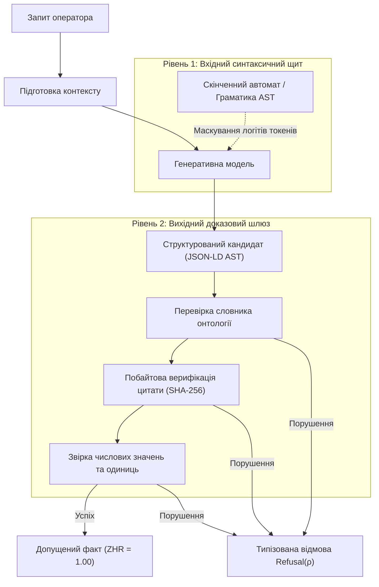
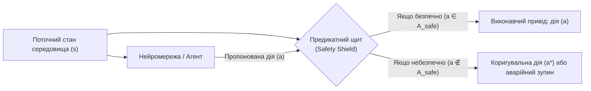

# Глава 38. Машинні галюцинації та дефіцит знань: доказовий контроль відповідей

> **Книга:** [Архітектура доказових експертних систем](README.md) · [Частина VI: Нейро-символьні відповіді, гіпотези та прогалини знань](part-06-frontiers-neuro-symbolic.md)  
> **Попередня глава:** [Глава 34. Прогалини знань: реляційний пошук, абдукція та діалог уточнення](ch34-deterministic-relational-analysis-abduction-and-socratic-dialogue.md)  
> **Наступна глава:** [Глава 17. Технологічний стек: критерії вибору інструментів, мов програмування та рушіїв правил](ch17-implementation-stack.md)  
> **Зміст книги:** [README.md](README.md)  
> **Автор:** [Микола Федчик](about-the-author.md)  
> **Рівень:** поглиблений: інженери знань, архітектори нейро-символьних систем, розробники критичного програмного забезпечення  
> **Очікувані результати:** розуміти математичні та статистичні причини машинних галюцинацій; будувати дворівневі детерміновані шлюзи перевірки виходів мовних моделей; розрізняти відсутність інформації, брак знань і робочу гіпотезу; застосовувати символьну абдукцію за Чарльзом Пірсом та сократівський діалог замість вигадування фактів; впроваджувати предикатні щити для програмного й апаратного екранування нейромереж; використовувати доведені знання для зворотного навчання й цільового забування (*machine unlearning*).

## 1. Анатомія машинної галюцинації: чому мовна модель не здатна вилікувати себе сама

Розгляньмо інженерну ситуацію: оператор системи охолодження запитує систему підтримки рішень про параметри промислового насоса P-7 та допустимість тимчасового блокування перепускного клапана V-2 під час сервісної промивки магістралі. Автономна мовна модель без зовнішнього символьного контролю формулює зв'язну, переконливу й стилістично бездоганну відповідь:

> «Згідно з регламентом експлуатації, максимальний робочий тиск для насоса P-7 становить 25 бар, а перепускний клапан V-2 дозволено заблокувати на час промивки магістралі для стабілізації потоку рідини».

У реальному технічному паспорті обладнання та стандарті безпеки зафіксовано зовсім інші норми: граничний тиск становить 16 бар, а клапан V-2 є аварійним елементом захисту від гідравлічного удару, блокування якого категорично заборонене за будь-яких умов. Відповідь моделі містить дві небезпечні помилки: вигадане числове значення та смертельно небезпечну рекомендацію. При цьому модель висловлює твердження з високою статистичною впевненістю.

Таке явище в комп'ютерній лінгвістиці називають машинною галюцинацією або конфабуляцією: генерацією тексту, який синтаксично узгоджений із контекстом, але фактологічно хибний або не підтверджений жодним зареєстрованим джерелом. Дослідження Адама Калаї та Сантоша Вемпали розкриває фундаментальну причину цієї проблеми [[1]](#src-1). Авторегресійні мовні моделі навчаються мінімізувати крос-ентропійну функцію втрат: вони максимізують правдоподібність наступного токена у послідовності. Стандартні метрики оцінювання точності суворо штрафують модель за відмову відповідати («не знаю») так само, як і за помилку, і водночас винагороджують випадкове вгадування. В умовах браку інформації у власних вагах статистично оптимальною стратегією для моделі стає конфабуляція: синтез найбільш гладкого й правдоподібного тексту з типових шаблонів мови.

У фундаментальному огляді Цзі та співавторів систематизовано три незалежні класи дефектів генерації [[2]](#src-2):

1. **Фактологічна помилка (*factuality error*):** згенероване твердження прямо суперечить об'єктивним фактам реального світу або фізичним законам.
2. **Помилка вірності джерелу (*faithfulness / attribution error*):** твердження суперечить наданому текстовому контексту або приписує цитаті зміст, якого в первинному документі немає.
3. **Логічний розрив виведення (*reasoning breakdown*):** модель правильно повторює окремі факти, але робить між ними хибний дедуктивний перехід або потрапляє в пастку вакуумної істинності.

Поширене переконання, нібито архітектура пошуку з доповненою генерацією (*Retrieval-Augmented Generation*, RAG) остаточно розв'язує проблему галюцинацій, є інженерною ілюзією. Семантичний пошук за векторною близькістю ембеддінгів знаходить пасажі, схожі за лексикою, але не гарантує їхньої нормативної релевантності. Отримавши знайдений фрагмент, мовна модель продовжує авторегресійну генерацію: вона може додати вигадане число, опустити важливе заперечення («не дозволено» перетворюється на «дозволено») або заповнити лакуну у знаннях уривками зі своєї параметричної пам'яті.

Спроба змусити модель перевіряти саму себе через послідовні запити («перевір, чи ти не помилилася») наштовхується на системне обмеження: якщо модель не має внутрішнього критерію розрізнення факту від вигадки, повторний прогін є такою самою генерацією тексту. Шумайлов та співавтори у виданні Nature довели явище модельного колапсу (*model collapse*): рекурсивне навчання моделей на згенерованих текстах веде до незворотної деградації знань і втрати рідкісних подій із хвостів розподілу [[3]](#src-3).

Вилікувати машинну галюцинацію всередині самої нейромережі неможливо: для цього потрібен зовнішній математичний і логічний суддя. Цю роль виконує доказова експертна система.

## 2. Детермінована доказова терапія: дворівневий шлюз нульових галюцинацій

У нейро-символьній архітектурі мовна модель позбавляється статусу джерела знань. Вона розглядається як неперевірений генератор пропозицій (*candidate generator*), а експертна система виступає ізольованим шлюзом верифікації. Щоб гарантувати відсутність вигадок, застосовують дворівневий бар'єр перевірки.



### Рівень 1: Граматично кероване декодування

Перший бар'єр перехоплює процес генерації на рівні вибору окремих токенів. Віллард і Луф запропонували підхід ефективної керованої генерації (*Efficient Guided Generation*), відомий за інструментом Outlines [[4]](#src-4). Замість вільного текстового потоку інженер задає строгу граматику виходу у вигляді схеми JSON або абстрактного синтаксичного дерева онтології (*AST*).

На кожному кроці авторегресії скінченний автомат аналізує вже згенеровану послідовність символів і формує бітову маску дозволених переходів. Усі токени словника моделі, які порушують структуру схеми, примусово отримують логіт $-\infty$. Модель фізично не здатна згенерувати некоректне поле, пропустити обов'язковий ідентифікатор або вставити вільний ліричний відступ. На виході формується валідне синтаксичне дерево твердження.

### Рівень 2: Побайтовий шлюз допуску

Синтаксична правильність не гарантує змістовної істинності. Сформований об'єкт проходить вихідний шлюз доказовості хостової системи:

1. **Реєстр закритих відношень:** предикат твердження звіряється із затвердженою онтологією. Будь-яке вигадане відношення відкидається зі статусом `OUT_OF_VOCABULARY`.
2. **Побайтова верифікація цитати:** кожне твердження зобов'язане містити точні координати байтів у канонічному файлі першоджерела (`byte_start`, `byte_end`) та контрольний геш цитати SHA-256. Ізольований модуль без звернення до ШІ вичитує байти з диска, обчислює геш і звіряє символи такт-у-такт. Якщо модель змінила хоча б один символ чи змістила індекс, твердження маркується як `HALLUCINATED_QUOTE`.
3. **Звірка числових екстремумів та розмірностей:** якщо висновок містить числове значення (наприклад, поріг тиску 16 бар), числовий екстрактор перевіряє факт його наявності всередині самої верифікованої цитати.

Показник нульових галюцинацій (*Zero-Hallucination Rate*, ZHR) визначається як частка стверджувальних відповідей системи $`\mathcal{C}_{\mathrm{asserted}}`$, які мають повний побайтовий ланцюг доведеного заземлення у першоджерело $`\mathcal{C}_{\mathrm{grounded}}`$:

```math
\mathrm{ZHR} = \frac{|\mathcal{C}_{\mathrm{grounded}}|}{|\mathcal{C}_{\mathrm{asserted}}|}.
```

Вимога $`\mathrm{ZHR} = 1{,}00`$ означає: система ніколи не стверджує фактів, яких немає в її верифікованих джерелах. Якщо доказ не зібрався, система не маскує прогалину статистичною вигадкою, а переходить у режим обробки епістемічного дефіциту.

| Рівень захисту | Метод реалізації | Що усуває | Чого не гарантує |
|---|---|---|---|
| Інструкції в запиті (*Prompting*) | системна вказівка «не вигадуй» | незначний суб'єктивний шум | відсутність галюцинацій, доказовість |
| Традиційний RAG | пошук за векторною подібністю | повне незнання контексту | точність цитування, захист від вигадування фактів із контексту |
| Граматичний щит (Рівень 1) | скінченні автомати на рівні логітів | порушення синтаксису й формату схеми | фактологічну правдивість значень |
| Побайтовий шлюз (Рівень 2) | верифікація зрізів файлу за гешем SHA-256 | неправдиві цитати, вигадані числа | повноту зовнішнього корпусу знань |

## 3. Епістемічний дефіцит: відкритий світ і шлюз безпечної відмови

Коли експертній системі бракує знань для відповіді на запит, це не є аварією чи програмною помилкою. Це нормальний стан будь-якої реальної бази знань, що функціонує в умовах **епістемічного дефіциту** (*epistemic incompleteness*).

Класичні бази даних спираються на припущення замкненого світу (*Closed-World Assumption*, CWA): те, що не записано в таблиці, вважається безумовно хибним. Доказова інженерія знань використовує припущення відкритого світу (*Open-World Assumption*, OWA): якщо зв'язок між об'єктами не зафіксовано в базі фактів, він вважається **невідомим**, а не хибним.

Нехай запит $Q$ вимагає доведення множини необхідних цільових предикатів $`\mathcal{P}_{\mathrm{required}}(Q)`$, а поточна база знань дозволяє детерміновано довести лише підмножину $`\mathcal{P}_{\mathrm{proven}}(Q) \subseteq \mathcal{P}_{\mathrm{required}}(Q)`$. Міра епістемічного дефіциту $`D_{\mathrm{epistemic}}(Q)`$ визначається співвідношенням:

```math
D_{\mathrm{epistemic}}(Q) = 1 - \frac{|\mathcal{P}_{\mathrm{proven}}(Q)|}{|\mathcal{P}_{\mathrm{required}}(Q)|},\qquad D_{\mathrm{epistemic}} \in [0, 1].
```

За $`D_{\mathrm{epistemic}} = 0`$ система генерує категоричну відповідь на основі повного дедуктивного доведення. Якщо ж $`D_{\mathrm{epistemic}} > 0`$, система активує **шлюз безпечної відмови (Fail-Closed Gate)**.

Оператор безпечної відмови $`\mathrm{Refusal}(\rho)`$ є повноцінним типізованим результатом роботи експертної системи. Причина відмови $\rho$ вказує на конкретний характер дефіциту знань:

* `NO_EVIDENCE`: у зареєстрованих документах відсутні сутності чи первинні атрибути, зазначені в запиті;
* `AMBIGUOUS_EVIDENCE`: знайдено кілька взаємно суперечливих цитат без критерію їхньої семантичної чи часової переваги;
* `OUT_OF_DOMAIN`: запит стосується явищ, що лежать за межами формалізованої аксіоматики онтології;
* `CALIBRATION_DEFICIT`: сенсорні спостереження не мають зафіксованої метрологічної похибки або термін дії повірки датчика сплив;
* `UNRESOLVED_DEFEATER`: логічний висновок заблоковано активним дефітером у системі супроводження істинності.

Політика безпечної відмови забезпечує повноту перехоплення ризиків ($`\text{FCP} = 100\%`$): жодне рішення, що спирається на неповні або гіпотетичні засновки, не допускається до керування фізичними виконавчими пристроями чи нормативної публікації.

## 4. Абдуктивні замикання за Пірсом: подолання неповноти без конфабуляцій

Категорична відмова $`\mathrm{Refusal}`$ захищає від катастрофи, але сама по собі не допомагає інженеру знайти рішення. Коли людині бракує фактів, вона не вигадує випадкові твердження, а висуває обґрунтовану гіпотезу.

Чарльз Сандерс Пірс визначив логічну тріаду пізнання: дедукція виводить наслідок із правила й засновку; індукція виводить загальне правило з повторюваних спостережень; **абдукція** виводить найбільш імовірну передумову з відомого правила та спостережуваного наслідку [[5]](#src-5).

Символьна абдукція у доказовій експертній системі формулюється так: якщо спостережено цільову подію $Q$, а база правил містить дедуктивний інваріант $P \land \Delta \to Q$, де контекст $\Delta$ істинний, але засновок $P$ відсутній у базі фактів, система формує абдуктивне замикання:

```math
\text{Абдуктивна гіпотеза: можливо, виконується } P.
```

На відміну від мовної моделі, яка зливає гіпотезу з фактом, експертна система дотримується непорушного принципу **епістемічної гігієни**:
1. Згенероване замикання отримує статус `model_hypothesis`.
2. Гіпотеза ізолюється в динамічному шарі оперативної пам'яті (L1) і ніколи не записується в золотий незмінний базис знань (L0).
3. Система ініціює **сократівський діалог** з інженером: формує типізований фрейм уточнення (*Clarification Frame*), де прямо вказує відсутню передумову й запитує цільову дію.

Для насоса P-7 скорочений фрейм виглядає так:

> **Фрейм епістемічного уточнення CF-042:**  
> - **Цільове твердження:** Дозвіл на сервісну промивку магістралі насоса P-7.  
> - **Встановлені факти:** Живлення вимкнено, температура магістралі стабільна (22 °C).  
> - **Відсутня обов'язкова передумова:** Стан датчика зворотного тиску PT-104 не підтверджено сертифікатом калібрування.  
> - **Абдуктивна гіпотеза:** Якщо тиск у магістралі скинуто до атмосферного ($`< 0{,}2\,\text{bar}`$), промивка є допустимою.  
> - **Запит до оператора:** Проведіть фізичне дренування або підтвердіть показники манометра M-1.

Абдукція не створює ілюзії знання: вона точно окреслює межу між тим, що доведено, і тим, що вимагає зовнішньої фізичної перевірки.

## 5. Предикатне екранування нейромереж: предикатні щити

У системах реального часу, де нейромережа або планувальник на основі ШІ генерує команди для фізичних приводів чи формує юридичні дії, часу на діалог з оператором може не бути. У таких системах застосовують **предикатні щити (Neuro-Symbolic Shields)**, концепцію яких розвинули Кьонігсгофер і співавтори [[6]](#src-6), а також Шалев-Шварц, Шамма та Шашуа в математичній моделі безпеки Mobileye RSS [[7]](#src-7).

Предикатний щит є детермінованим скінченним автоматом, що реалізує формальні інваріанти безпеки $`\Phi = \{\phi_1, \phi_2, \dots, \phi_m\}`$. Щит розміщується безпосередньо між вектором команд моделі $`\mathbf{a} \in \mathcal{A}`$ та виконавчим механізмом.



Математично задача щита полягає в проєкції бажаної дії $`\mathbf{a}`$ на підпростір безпечних дій $`\mathcal{A}_{\mathrm{safe}}(s)`$:

```math
\mathbf{a}^* = \arg\min_{\mathbf{a}' \in \mathcal{A}_{\mathrm{safe}}(s)} \|\mathbf{a}' - \mathbf{a}\|.
```

Якщо нейромережа пропонує дію, що порушує просторовий інваріант дистанції, критичний тиск або послідовність подачі напруги, предикатний щит миттєво підміняє сигнал на найближчу безпечну коригувальну дію $`\mathbf{a}^*`$ або ініціює кероване захисне знеструмлення за час, менший за граничний інтервал стійкості до відмов (*Fault Tolerant Time Interval*, FTTI).

У генеративних текстових системах аналогом такого щита є предикатне маскування логітів на рівні словника: якщо обрання наступного токена призводить до переходу стану онтологічного автомата в заборонену область, відповідний вихід софтмаксу анулюється ще до завершення формулювання слова.

## 6. Зворотне лікування моделей: навчання та машинне забування на верифікованих знаннях

Експертна система не лише захищає світ від помилок нейромережі під час виконання. Вона може виступати вчителем, виправляючи дефекти самої моделі на рівні її вагових коефіцієнтів.

### Пряма оптимізація переваг за доказовими парами (DPO)

Традиційне навчання з підкріпленням на основі людських відгуків (*RLHF*) спирається на суб'єктивні оцінки розмітників, які часто віддають перевагу гладким і ввічливим, але фактологічно хибним відповідям. Рафайлов та співавтори запропонували метод прямої оптимізації переваг (*Direct Preference Optimization*, DPO) [[8]](#src-8), що усуває потребу в окремій моделі винагороди.

Експертна система автоматично формує еталонні навчальні пари $`(x, y_w, y_l)`$:
* $x$ є вхідним інженерним або нормативним запитом;
* $`y_w`$ є бажаною відповіддю (*winning*), сформованою із залученням побайтового шлюзу цитування, верифікованих числових меж та експертних правил;
* $`y_l`$ є галюцинованою відповіддю (*losing*), запропонованою базовою мовною моделлю й відхиленою детермінованим шлюзом допуску через неправдиве цитування чи порушення правил онтології.

Функція втрат DPO оптимізує параметри моделі $\theta$ відносно опорної моделі $`\pi_{\mathrm{ref}}`$:

```math
\mathcal{L}_{\mathrm{DPO}}(\theta; \pi_{\mathrm{ref}}) = -\mathbb{E}_{(x, y_w, y_l)}\left[\log \sigma\left(\beta \log \frac{\pi_\theta(y_w \mid x)}{\pi_{\mathrm{ref}}(y_w \mid x)} - \beta \log \frac{\pi_\theta(y_l \mid x)}{\pi_{\mathrm{ref}}(y_l \mid x)}\right)\right].
```

Тут $\sigma$ позначає логістичну функцію, а $\beta$ є коефіцієнтом регуляризації. Модель цілеспрямовано штрафується за будь-яку спробу конфабуляції й навчається формулювати типізовану відмову за браку підтверджених цитат.

### Машинне забування скомпрометованих фактів (Machine Unlearning)

Якщо нормативний документ втратив чинність або встановлено факт навмисного отруєння навчальних даних, старе твердження треба видалити з пам'яті моделі. Просте перетреновування гігантської нейромережі з нуля є енергетично й економічно нереалістичним.

Бурту та співавтори розробили архітектуру SISA (*Sharded, Isolated, Sliced, Aggregated*) для точкового машинного забування (*Machine Unlearning*) [[9]](#src-9). Експертна система відстежує простежуваність знань: вона знає, який саме шард і зріз навчальних даних містив скомпрометований факт. Замість повної перебудови моделі оновлюється лише ізольована підмережа, що займає лічені хвилини.

### Статистична самоузгодженість (Self-Consistency)

Для складних силогізмів Ван та співавтори запропонували метод самоузгодженості (*Self-Consistency*) [[10]](#src-10): модель генерує множину $N$ незалежних трас міркувань при ненульовій температурі, а кінцевий висновок обирається за мажоритарним голосуванням.

В експертній системі цей метод модифікується: голосування відбувається не за текстом, а за структурованими семантичними графами виведення. На детермінований шлюз потрапляє лише консенсусне ядро тверджень, що суттєво зменшує дисперсію помилок.

Динамічну підтримку узгодженості фактів забезпечують системи підтримання істинності Дойла (JTMS) [[11]](#src-11): каскадне відкликання дефітерів миттєво інвалідує всі похідні судження при зміні базових знань, що узгоджується з принципами RAG [[12]](#src-12) та моделлю семантичного ретрівера REALM [[13]](#src-13).

## 7. Програмна реалізація мовою Go: модуль `antihallucination`

Нижче наведено самодостатню реалізацію модуля `antihallucination` мовою Go. Програма виконує перевірку належності предикатів закритій онтології, здійснює побайтову верифікацію цитат у канонічному тексті за контрольним гешем SHA-256, перевіряє заземлення числових значень у тексті цитати, формує типізовану відмову за браку доказів та демонструє механізм абдуктивного замикання при виявленні неповноти правила.

Для запуску потрібні Go 1.22 або новіша версія та стандартна бібліотека.

<details>
<summary>Go: детермінований шлюз захисту від галюцинацій (antihallucination.go)</summary>

```go
package antihallucination

import (
	"crypto/sha256"
	"encoding/hex"
	"fmt"
	"strconv"
	"strings"
)

type ByteSpan struct {
	Start int
	End   int
}

type Citation struct {
	DocID       string
	Span        ByteSpan
	QuoteSHA256 string
	ExactQuote  string
}

type SourceDocument struct {
	ID      string
	Content []byte
}

type Claim struct {
	ID        string
	Subject   string
	Predicate string
	Object    string
	NumberVal float64
	HasNumber bool
	Citation  *Citation
}

type Rule struct {
	Premises   []string
	Conclusion string
}

type Verdict string

const (
	VerdictVerified            Verdict = "VERIFIED"
	VerdictHallucinatedQuote   Verdict = "HALLUCINATED_QUOTE"
	VerdictHallucinatedNumber  Verdict = "HALLUCINATED_NUMERIC"
	VerdictOutOfVocabulary     Verdict = "OUT_OF_VOCABULARY"
	VerdictRefusalDeficit      Verdict = "REFUSAL_KNOWLEDGE_DEFICIT"
	VerdictAbductiveHypothesis Verdict = "ABDUCTIVE_HYPOTHESIS"
)

type Result struct {
	Verdict Verdict
	Reason  string
	Detail  string
}

func HashBytes(data []byte) string {
	sum := sha256.Sum256(data)
	return hex.EncodeToString(sum[:])
}

func VerifyCitation(doc SourceDocument, cit Citation) error {
	if cit.DocID != doc.ID {
		return fmt.Errorf("document_mismatch: citation doc %s != source %s", cit.DocID, doc.ID)
	}
	if cit.Span.Start < 0 || cit.Span.End > len(doc.Content) || cit.Span.Start >= cit.Span.End {
		return fmt.Errorf("invalid_byte_span: [%d:%d] outside [0:%d]", cit.Span.Start, cit.Span.End, len(doc.Content))
	}
	slice := doc.Content[cit.Span.Start:cit.Span.End]
	if string(slice) != cit.ExactQuote {
		return fmt.Errorf("quote_content_mismatch: bytes in span do not match exact quote")
	}
	actualHash := HashBytes([]byte(cit.ExactQuote))
	if actualHash != cit.QuoteSHA256 {
		return fmt.Errorf("hash_mismatch: computed %s != declared %s", actualHash, cit.QuoteSHA256)
	}
	return nil
}

func VerifyNumericGrounding(quote string, value float64) bool {
	str := strconv.FormatFloat(value, 'f', -1, 64)
	if strings.Contains(quote, str) {
		return true
	}
	intStr := strconv.Itoa(int(value))
	if float64(int(value)) == value && strings.Contains(quote, intStr) {
		return true
	}
	return false
}

func VerifyClaim(vocab map[string]bool, doc SourceDocument, claim Claim) Result {
	if !vocab[claim.Predicate] {
		return Result{
			Verdict: VerdictOutOfVocabulary,
			Reason:  "predicate_not_in_ontology",
			Detail:  claim.Predicate,
		}
	}
	if claim.Citation == nil {
		return Result{
			Verdict: VerdictRefusalDeficit,
			Reason:  "missing_verifiable_citation",
			Detail:  "assertion without evidence refused by policy",
		}
	}
	if err := VerifyCitation(doc, *claim.Citation); err != nil {
		return Result{
			Verdict: VerdictHallucinatedQuote,
			Reason:  "citation_verification_failed",
			Detail:  err.Error(),
		}
	}
	if claim.HasNumber {
		if !VerifyNumericGrounding(claim.Citation.ExactQuote, claim.NumberVal) {
			return Result{
				Verdict: VerdictHallucinatedNumber,
				Reason:  "numeric_value_not_grounded_in_quote",
				Detail:  fmt.Sprintf("number %v not found in quote", claim.NumberVal),
			}
		}
	}
	return Result{
		Verdict: VerdictVerified,
		Reason:  "grounded_in_immutable_source",
		Detail:  claim.ID,
	}
}

func AbduceMissingPremise(rules []Rule, facts map[string]bool, goal string) (string, Rule, bool) {
	for _, rule := range rules {
		if rule.Conclusion != goal {
			continue
		}
		var missing []string
		for _, premise := range rule.Premises {
			if !facts[premise] {
				missing = append(missing, premise)
			}
		}
		if len(missing) == 1 {
			return missing[0], rule, true
		}
	}
	return "", Rule{}, false
}
```

</details>

Комплект контрольних тестів перевіряє всі граничні стани шлюзу: підтвердження істинного заземленого твердження, виявлення маніпуляцій з індексами цитати, виявлення вигаданих чисел, блокування предикатів поза онтологією, активацію шлюзу безпечної відмови за браку цитати та формування абдуктивної гіпотези при неповноті передумов правила.

<details>
<summary>Go: контрольні верифікаційні тести (antihallucination_test.go)</summary>

```go
package antihallucination

import (
	"strings"
	"testing"
)

func TestAntiHallucination(t *testing.T) {
	rawDoc := "Стандарт ISO-13849: максимальний робочий тиск насоса P-7 становить 16 бар. При перевищенні тиску спрацьовує перепускний клапан V-2."
	doc := SourceDocument{
		ID:      "DOC-ISO-13849",
		Content: []byte(rawDoc),
	}
	vocab := map[string]bool{
		"max_operating_pressure": true,
		"safety_valve":           true,
	}

	quote1 := "максимальний робочий тиск насоса P-7 становить 16 бар"
	start1 := strings.Index(rawDoc, quote1)
	end1 := start1 + len(quote1)

	validClaim := Claim{
		ID:        "CLM-001",
		Subject:   "P-7",
		Predicate: "max_operating_pressure",
		Object:    "16 bar",
		NumberVal: 16,
		HasNumber: true,
		Citation: &Citation{
			DocID:       "DOC-ISO-13849",
			Span:        ByteSpan{Start: start1, End: end1},
			QuoteSHA256: HashBytes([]byte(quote1)),
			ExactQuote:  quote1,
		},
	}
	res1 := VerifyClaim(vocab, doc, validClaim)
	if res1.Verdict != VerdictVerified {
		t.Fatalf("expected VERIFIED, got %+v", res1)
	}

	halluNumberClaim := validClaim
	halluNumberClaim.NumberVal = 25
	res2 := VerifyClaim(vocab, doc, halluNumberClaim)
	if res2.Verdict != VerdictHallucinatedNumber {
		t.Fatalf("expected HALLUCINATED_NUMERIC, got %+v", res2)
	}

	halluQuoteClaim := validClaim
	badCit := *validClaim.Citation
	badCit.Span.Start = start1 + 5
	halluQuoteClaim.Citation = &badCit
	res3 := VerifyClaim(vocab, doc, halluQuoteClaim)
	if res3.Verdict != VerdictHallucinatedQuote {
		t.Fatalf("expected HALLUCINATED_QUOTE, got %+v", res3)
	}

	badPredClaim := validClaim
	badPredClaim.Predicate = "invented_magic_relation"
	res4 := VerifyClaim(vocab, doc, badPredClaim)
	if res4.Verdict != VerdictOutOfVocabulary {
		t.Fatalf("expected OUT_OF_VOCABULARY, got %+v", res4)
	}

	deficitClaim := validClaim
	deficitClaim.Citation = nil
	res5 := VerifyClaim(vocab, doc, deficitClaim)
	if res5.Verdict != VerdictRefusalDeficit {
		t.Fatalf("expected REFUSAL_KNOWLEDGE_DEFICIT, got %+v", res5)
	}

	rules := []Rule{
		{Premises: []string{"pump_active", "valve_open"}, Conclusion: "flow_confirmed"},
		{Premises: []string{"power_on"}, Conclusion: "pump_active"},
	}
	facts := map[string]bool{"pump_active": true}
	missing, rule, ok := AbduceMissingPremise(rules, facts, "flow_confirmed")
	if !ok || missing != "valve_open" || rule.Conclusion != "flow_confirmed" {
		t.Fatalf("abduction failed: got missing=%s, ok=%v", missing, ok)
	}
}
```

</details>

Тести наочно демонструють ключовий принцип: жодна мовна модель не здатна обійти детермінований шлюз. Будь-яка неточність призводить або до прямого виявлення галюцинації, або до безпечної відмови з пропозицією перевірити конкретний фізичний факт через сократівський діалог.

## Висновок

Машинна галюцинація є природним наслідком оптимізації статистичної правдоподібності за відсутності епістемічних рамок істини. Намагатися усунути галюцинації збільшенням розміру мовної моделі чи додатковими шарами інструкцій означає боротися з наслідками замість причини.

Дійсне подолання галюцинацій досягається архітектурним розподілом ролей:
1. Мовна модель виступає виключно генератором пропозицій і семантичним інтерпретатором неструктурованого тексту.
2. Детерміновані шлюзи на основі граматик, побайтового контролю цитат за гешами SHA-256 та предикатних словників онтології забезпечують стовідсотковий відсів вигадок ($`\text{ZHR} = 1{,}00`$).
3. Природний епістемічний дефіцит розв'язується не фальсифікацією фактів, а типізованою безпечною відмовою ($`\text{FCP} = 100\%`$) або сократівським діалогом через символьні абдуктивні замикання за Чарльзом Пірсом.
4. Предикатні щити гарантують динамічну безпеку виконавчих приводів за мілісекундні інтервали часу.
5. Накопичені верифіковані знання слугують еталоном для донавчання моделей через DPO та цільового машинного забування застарілих норм.

У результаті штучний інтелект перетворюється з джерела непередбачуваних ризиків на надійний інструмент інженерного аналізу, керований строгою логікою доказової експертної системи.

## Словник
| Термін | Значення в цій главі |
|---|---|
| Машинна галюцинація (конфабуляція) | генерація мовною моделлю синтаксично правдоподібного тексту, який не має підтвердження у зареєстрованих першоджерелах |
| Епістемічний дефіцит | стан неповноти знань, за якого наявних фактів і правил недостатньо для категоричного дедуктивного висновку |
| Побайтовий шлюз допуску | детермінований програмний модуль, що верифікує точний діапазон байтів цитати та її криптографічний геш у незмінному файлі |
| Коефіцієнт нульових галюцинацій (ZHR) | частка стверджувальних відповідей системи, які спираються на побайтово доведені цитати першоджерел |
| Шлюз безпечної відмови (Fail-Closed) | архітектурний принцип примусового переходу системи в режим відмови від твердження при виявленні неповноти знань |
| Абдуктивне замикання | логічне виведення найбільш імовірної відсутньої передумови за відомим правилом і спостережуваним наслідком |
| Сократівський діалог | генерація системою типізованих фреймів уточнення із зазначенням відсутніх засновків замість категоричної відповіді |
| Предикатний щит | детермінований модуль моніторингу безпеки, що блокує недопустимі дії моделі або коригує логіти виходу |
| Машинне забування (Machine Unlearning) | метод видалення впливу конкретних застарілих або скомпрометованих фактів із параметрів моделі без повного перетреновування |
| Граматично кероване декодування | перехоплення й маскування логітів токенів на кожному кроці генерації для гарантії відповідності схемі чи синтаксичному дереву |

## Абревіатури
| Скорочення | Розшифрування |
|---|---|
| ШІ | штучний інтелект |
| ЕС | експертна система |
| RAG | Retrieval-Augmented Generation, пошук із доповненою генерацією |
| ZHR | Zero-Hallucination Rate, коефіцієнт нульових галюцинацій |
| FCP | Fail-Closed Policy, політика безпечної відмови |
| AST | Abstract Syntax Tree, абстрактне синтаксичне дерево |
| CWA | Closed-World Assumption, припущення замкненого світу |
| OWA | Open-World Assumption, припущення відкритого світу |
| DPO | Direct Preference Optimization, пряма оптимізація переваг |
| SFT | Supervised Fine-Tuning, навчання з учителем |
| RLHF | Reinforcement Learning from Human Feedback, навчання з підкріпленням за відгуками людей |
| SISA | Sharded, Isolated, Sliced, Aggregated, архітектура машинного забування |
| JTMS | Justification-Based Truth Maintenance System, система супроводження істинності на основі підстав |
| FTTI | Fault Tolerant Time Interval, інтервал часу стійкості до відмов |
| UCUM | Unified Code for Units of Measure, єдиний код для одиниць вимірювання |
| JSON-LD | JavaScript Object Notation for Linked Data, формат зв'язаних даних |
| SHA | Secure Hash Algorithm, безпечний алгоритм гешування |

## Джерела
1. <a id="src-1"></a>Adam Tauman Kalai, Santosh S. Vempala. *Calibrated Language Models Must Hallucinate*. In *Proceedings of the 56th Annual ACM Symposium on Theory of Computing (STOC 2024)*, 2024. [DOI](https://doi.org/10.1145/3618260.3649777). Див. також: Adam Tauman Kalai, Ofir Nachum, Santosh S. Vempala, Edwin Zhang. *Evaluating large language models for accuracy incentivizes hallucinations*. Nature, 2026. [DOI](https://doi.org/10.1038/s41586-026-10549-w).
2. <a id="src-2"></a>Ziwei Ji, Nayeon Lee, Rita Frieske, Tiezheng Yu, Dan Su, Yan Xu, Etsuko Ishii, Ye Jin Bang, Andrea Madotto, Pascale Fung. *Survey of Hallucination in Natural Language Generation*. ACM Computing Surveys, 55(12), 2023, pp. 1–38. [DOI](https://doi.org/10.1145/3571730).
3. <a id="src-3"></a>Ilia Shumailov, Zakhar Shumaylov, Yiren Zhao, Nicolas Papernot, Ross Anderson, Yarin Gal. *AI models collapse when trained on recursively generated data*. Nature, 631, 2024, pp. 755–759. [DOI](https://doi.org/10.1038/s41586-024-07566-y).
4. <a id="src-4"></a>Brandon T. Willard, Rémi Louf. *Efficient Guided Generation for Large Language Models*. arXiv preprint arXiv:2307.09702, 2023. [arXiv](https://arxiv.org/abs/2307.09702).
5. <a id="src-5"></a>Charles Sanders Peirce. *Pragmatism as a Principle and Method of Right Thinking: The 1903 Harvard Lectures on Pragmatism*. Редакція Patricia Ann Turrisi, State University of New York Press, 1997.
6. <a id="src-6"></a>Bettina Könighofer, Roderick Bloem et al. *Shielded Reinforcement Learning*. In *Proceedings of the AAAI Conference on Artificial Intelligence*, 32(1), 2018. [AAAI](https://ojs.aaai.org/index.php/AAAI/article/view/11674).
7. <a id="src-7"></a>Shai Shalev-Shwartz, Shaked Shammah, Amnon Shashua. *On a Formal Model of Safe and Scalable Self-Driving Cars*. arXiv preprint arXiv:1708.06374, 2017. [arXiv](https://arxiv.org/abs/1708.06374).
8. <a id="src-8"></a>Rafael Rafailov, Archit Sharma, Eric Mitchell, Christopher D. Manning, Stefano Ermon, Chelsea Finn. *Direct Preference Optimization: Your Language Model is Secretly a Reward Model*. In *Advances in Neural Information Processing Systems (NeurIPS 2023)*, 36, 2023. [NeurIPS](https://proceedings.neurips.cc/paper_files/paper/2023/hash/a85b405ed65c6477a4fe8302b5e06ce7-Abstract-Conference.html).
9. <a id="src-9"></a>Lucas Bourtoule, Varun Chandrasekaran, Christopher A. Choquette-Choo, Hengrui Jia, Adelin Travers, Weung-Rae Kim, Nicolas Papernot. *Machine Unlearning*. In *IEEE Symposium on Security and Privacy (S&P 2021)*, 2021, pp. 141–159. [DOI](https://doi.org/10.1109/SP40001.2021.00019).
10. <a id="src-10"></a>Xuezhi Wang, Jason Wei, Dale Schuurmans, Quoc Le, Ed Chi, Sharan Narang, Aakanksha Chowdhery, Denny Zhou. *Self-Consistency Improves Chain of Thought Reasoning in Language Models*. In *Proceedings of the 11th International Conference on Learning Representations (ICLR 2023)*, 2023. [research.google](https://research.google/pubs/self-consistency-improves-chain-of-thought-reasoning-in-language-models/).
11. <a id="src-11"></a>Jon Doyle. *A Truth Maintenance System*. Artificial Intelligence, 12(3), 1979, pp. 231–272. [DOI](https://doi.org/10.1016/0004-3702(79)90008-0).
12. <a id="src-12"></a>Patrick Lewis, Ethan Perez, Aleksandra Piktus, Fabio Petroni, Vladimir Karpukhin, Naman Goyal, Heinrich Küttler, Mike Lewis, Wen-tau Yih, Tim Rocktäschel, Sebastian Riedel, Douwe Kiela. *Retrieval-Augmented Generation for Knowledge-Intensive NLP Tasks*. In *Advances in Neural Information Processing Systems (NeurIPS 2020)*, 33, 2020, pp. 9459–9474.
13. <a id="src-13"></a>Kelvin Guu, Kenton Lee, Zora Tung, Panupong Pasupat, Ming-Wei Chang. *REALM: Retrieval-Augmented Language Model Pre-Training*. In *Proceedings of the 37th International Conference on Machine Learning (ICML 2020)*, PMLR 119, 2020, pp. 3929–3938. [research.google](https://research.google/pubs/realm-retrieval-augmented-language-model-pre-training/).

---

[← Глава 34](ch34-deterministic-relational-analysis-abduction-and-socratic-dialogue.md) | [Зміст книги](README.md) | [Частина VI](part-06-frontiers-neuro-symbolic.md) | [Глава 17 →](ch17-implementation-stack.md)
