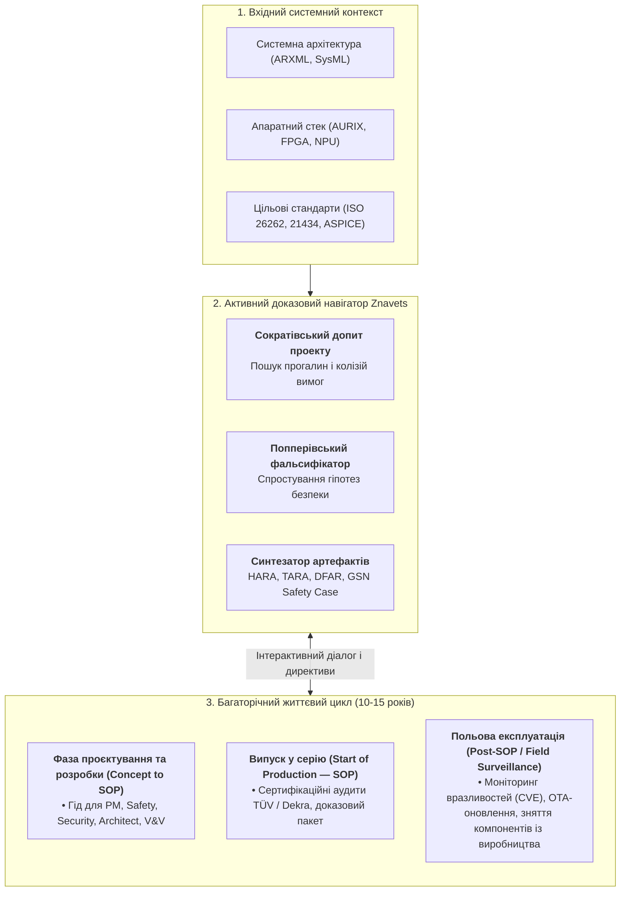
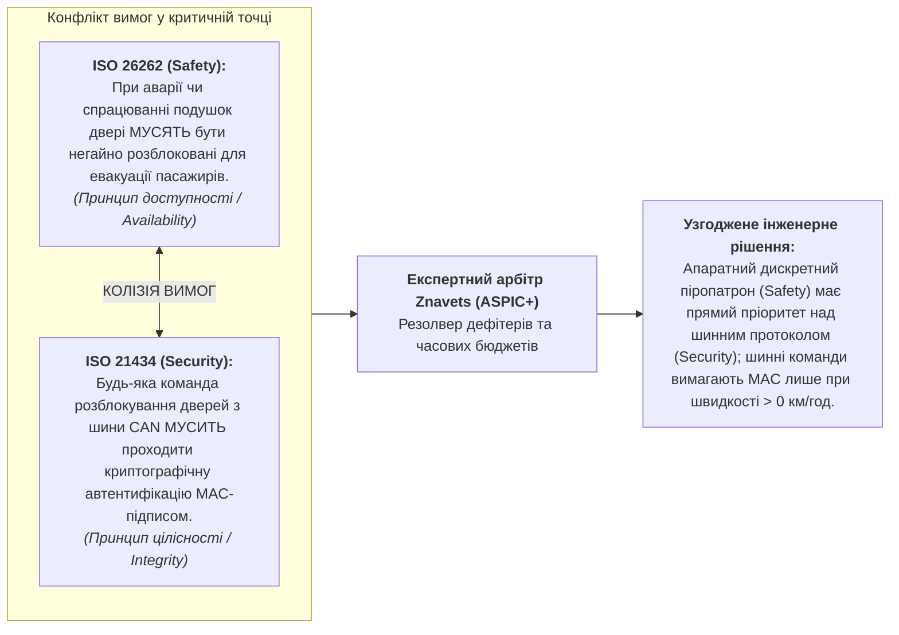

# Глава 39. Активний експерт-тестувальник: попперівська фальсифікація, нормативний комплаєнс (ASPICE/ISO 26262/ISO 21434) та автономне проєктування випробувань

> **Книга:** [Архітектура доказових експертних систем](README.md) · [Частина VI: Нейро-символьні відповіді, гіпотези та прогалини знань](part-06-frontiers-neuro-symbolic.md)  
> **Попередня глава:** [Глава 38. Машинні галюцинації та дефіцит знань: доказовий контроль відповідей](ch38-curing-machine-hallucinations-and-knowledge-deficits.md)  
> **Зміст книги:** [README.md](README.md)  
> **Автор:** [Микола Федчик](about-the-author.md)  
> **Рівень:** поглиблений: інженери функціональної безпеки (Safety Engineers), фахівці з кібербезпеки (Cybersecurity Engineers), аудитори комплаєнсу (ASPICE/ISO Assessors), архітектори доказового ШІ  
> **Очікувані результати:** опанувати концепцію переходу від пасивного оракула до активного аудитора знань; зрозуміти принципи рантайм-фальсифікації інженерних гіпотез за Карлом Поппером; використовувати експертні системи для автономної підготовки доказових матеріалів TARA, SAR, DFAR та V&V матриць; розв'язувати конфлікти між вимогами безпеки (Safety) та кібербезпеки (Security); автоматизувати рутинні перевірки з вивільненням часу фахівця для технічної творчості зі збереженням принципу Human-in-the-Loop.

---

## Анотація

У проєктуванні критично важливих кіберфізичних систем (ISO 26262 ASIL D, ISO/SAE 21434 CAL 4, DO-178C DAL A, Automotive SPICE 4.0) ручна підготовка нормативної звітності та пасивна верифікація неминуче спричиняють катастрофічні наслідки. Коли інженери з функціональної безпеки вимушені вручну співставляти тисячі вимог у таблицях, когнітивне виснаження породжує «театр відповідності» (*Compliance Theatre*) — формальне проставляння прапорців без математичної перевірки крайових станів. Пропуск єдиної прихованої одноточкової відмови (SPFM < 99%) або неврахованого вектора атаки на бортову шину призводить до смертельних ДТП, відкликання цілих серій безпілотного транспорту та персональної кримінальної відповідальності аудиторів.

Ця глава долає кризу переходом від пасивного оракула-консультанта до Активного Аудитора Доменних Знань. Спираючись на принцип фальсифікації Карла Поппера ($\mathcal{F}(\mathcal{H}, \mathcal{K})$ для проектної гіпотези $\mathcal{H}$ та бази норм $\mathcal{K}$), доказова експертна система перехоплює ініціативу допиту проекту: вона автономно шукає контрприклади, виявляє нормативні суперечності між вимогами безпеки (*Safety*) та кіберзахисту (*Security*), генерує строгі сертифікаційні артефакти (HARA, TARA, SAR, DFAR/FMEDA) із повною трасованістю ($100{,}0\%$) та проєктує фальсифікуючі випробування, залишаючи людину в циклі керування (*Human-in-the-Loop*) як найвищого арбітра.

---

## 1. Драма комплаєнс-інженерії: чому ручні методи вичерпали себе

Розробка сучасних кіберфізичних систем (автомобільний транспорт, авіоніка, залізнична автоматика, медичні апарати) підпорядкована найсуворішим галузевим стандартам:
- **Automotive SPICE 4.0** (процесна зрілість розробки програмного та системного забезпечення);
- **ISO 26262:2018** (функціональна безпека електричних та електронних систем, класифікація ASIL-A .. ASIL-D);
- **ISO/SAE 21434:2021** (інженерія кібербезпеки транспортних засобів, рівні CAL 1..4);
- **DO-178C / ED-12C** (авіаційне бортове програмне забезпечення, рівні DAL A..E);
- **IEC 62304 / ISO 14971** (медичне ПЗ та управління ризиками пацієнтів).

### 1.1. Тягар персональної відповідальності інженера з безпеки
На відміну від звичайної комерційної веб-розробки, фахівці з безпеки — **Safety Engineer**, **Cybersecurity Engineer**, **Functional Safety Manager (FSM)** та **Lead Assessor** — несуть пряму юридичну, професійну, а в багатьох юрисдикціях і кримінальну відповідальність за випущені артефакти. 

Підпис інженера під підсумковими звітами засвідчує, що:
1. Усі ризики заподіяння шкоди життю та здоров'ю людей зведені до прийнятного залишкового рівня (*As Low As Reasonably Practicable*, ALARP).
2. Усі відомі вектори кібератак на бортові шини та контролери враховані та нейтралізовані.
3. Кожна окрема норма стандарту підтверджена прямим, відтворюваним об'єктивним доказом (*Objective Evidence*).

### 1.2. Трудомісткість рутинних людино-годин: TARA, SAR, DFAR та HARA
Ціна цієї відповідальності вимірюється колосальними трудовитратами. Щоб випустити сучасний автомобільний контролер (наприклад, блок керування гальмами або шлюз доступу), команда змушена вручну сформувати та верифікувати сотні складних доказових документів:

| Артефакт | Стандарт | Сутність та інженерне наповнення | Рутинний виклик для інженера |
| :--- | :--- | :--- | :--- |
| **HARA** (*Hazard Analysis and Risk Assessment*) | ISO 26262-3 | Визначення небезпечних подій, оцінка важкості ($S$), експозиції ($E$), контрольованості ($C$) та призначення рівня ASIL (A/B/C/D) і цілей безпеки (*Safety Goals*). | Ручний перебір сотень комбінацій режимів руху автомобіля та відмов датчиків; ризик пропуску критичного сценарію. |
| **TARA** (*Threat Analysis and Risk Assessment*) | ISO/SAE 21434-9 | Визначення активів (Assets), властивостей кібербезпеки (C-I-A), сценаріїв загроз, побудова дерев атак (*Attack Trees*), оцінка потенціалу атаки (*Attack Feasibility*) та рівнів CAL. | Необхідність співставлення тисяч CAN/Ethernet сигналів з базами CVE/CWE, ручне моделювання кроків зловмисника через шлюзи. |
| **SAR** (*Safety Assessment Report*) | ISO 26262-2/8 | Підсумковий аудиторський звіт незалежної оцінки відповідності розробки вимогам функціональної безпеки та захищеності процесів. | Перехресне звіряння сотень пунктів стандарту із реальними протоколами випробувань, пошук розривів трасованості. |
| **DFAR / DFMEA / FMEDA** | ISO 26262-5/6 | Кількісний аналіз режимів відмов, розрахунок метрик одноточкових відмов (SPFM $\ge 99\%$), латентних відмов (LFM $\ge 90\%$) та діагностичного покриття (DC). | Багаторівневі таблиці в Excel на десятки тисяч рядків; зміна одного резистора в схемі вимагає перерахунку всього ланцюга метрик. |

У типовому проекті підготовка, узгодження та підтримка актуальності цих матеріалів забирає **до 60–70% усього інженерного бюджету часу**. 

### 1.3. Феномен людської втоми та ризики формального комплаєнсу
Коли кваліфікований інженер змушений тижнями переносити ідентифікатори вимог між Polarion, DOORS, Jira та таблицями Excel, неминуче виникає когнітивне виснаження:
- **Крихкість ручного трасування:** зміна в одному рядку архітектури безслідно ламає доказові зв'язки в десятках дочірніх тестів.
- **Compliance Theatre (театр відповідності):** щоб вкластися у дедлайн випуску, інженери змушені ставити галочки у чеклістах формально, не маючи фізичної змоги математично перевірити кожен крайовий стан.
- **Втрата часу на творчість:** замість глибокого аналізу фізичних аномалій датчиків, проектування нетривіальних алгоритмів діагностики та пошуку нестандартних векторів атак, провідні уми витрачають енергію на бюрократичну рутину.

Саме тут виникає нагальна потреба в **доказових експертних системах нового покоління**.

---

## 2. Зсув парадигми: від пасивного довідника до інтерактивного гіда життєвого циклу продукту

Традиційна теорія штучного інтелекту десятиліттями розглядала експертну систему як пасивного консультанта, побудованого за редукціоністським шаблоном «запит — відповідь»:

> **Традиційний пасивний шаблон:** `[Користувач запитує]` $\longrightarrow$ `[Система видає статичну довідку]`

У простих діагностичних сценаріях цей підхід працював. Проте в сучасних місійно-критичних доменах (автомобільна промисловість, авіоніка, високошвидкісна залізнична автоматика) модель пасивного оракула зазнає повного краху через ключовий гносеологічний бар'єр: **інженер або менеджер не здатний запитати систему про те, про що він забув, чого не помітив або що було пропущено в багатотисячосторінкових томах стандартів**. 

Якщо інженер не підозрює, що зміна одного транзистора в схемі змінила метрику латентних відмов (LFM) або що оновлення протоколу діагностики UDS відкрило вектор віддаленої ін'єкції в шину CAN, він ніколи не сформулює запит до пасивної бази знань.

### 2.1. Концепція проактивного доказового супроводу життєвого циклу

Справжній **зсув інженерної парадигми** полягає у докорінній зміні ролі експертної системи: від статичного сховища правил — до **проактивного інтерактивного навігатора (Interactive Co-pilot & Lifecycle Guide)** для всієї міждисциплінарної інженерної команди.

Отримавши на старті проєкту вхідні специфікації (архітектуру платформи, апаратний стек, цільові стандарти ISO 26262 / ISO 21434 / ASPICE, обмеження надійності та цільовий ринок), доказова експертна система перехоплює ініціативу допиту (*Active Probing*):
1. **Вона не чекає на запитання:** система безперервно сканує інженерні артефакти (DBC-файли, схеми, код, тестові звіти).
2. **Вона веде сократівський діалог:** ставить проектувальникам незручні запитання про нерозглянуті крайові стани.
3. **Вона направляє проектну команду:** як досвідчений сертифікаційний аудитор, система вказує, які обов'язкові кроки стандарту ще не виконані та яких об'єктивних доказів бракує в матрицях простежуваності.



---

### 2.2. Рольова матриця учасників життєвого циклу безпеки

У складних інженерних проектах немає універсального фахівця, який тримає в голові всі виміри комплаєнсу. Активна експертна система виступає спеціалізованим інтелектуальним партнером для кожної ключової ролі:

| Інженерна роль у проекті | Що вимагає стандарт | Як допомагає активна експертна система |
| :--- | :--- | :--- |
| **Project Manager (PM) / Program Director** | Дотримання контрольних точок (Milestone Gates), повнота процесів ASPICE SWE.1–SWE.6, усунення ризиків зриву сертифікації. | **Радар готовності до аудитів (Compliance Readiness):** оцінює відсоток завершеності доказової бази, сигналізує про «вузькі місця» за тижні до аудиту, оцінює трудовитрати на закриття нормативних лакун. |
| **Functional Safety Manager (FSM) / Safety Engineer** | Досягнення цільових метрик надійності ISO 26262 (SPFM $\ge 99\%$, LFM $\ge 90\%$), складання HARA, побудова Safety Case у нотації GSN. | **Математичний верифікатор надійності:** автоматично формує розрахункові таблиці FMEDA/DFAR, пропонує заходи для підвищення діагностичного покриття сторожових таймерів, генерує аргументаційні дерева GSN. |
| **Cybersecurity Engineer** | Моделювання загроз TARA (ISO/SAE 21434), оцінка Attack Feasibility, побудова дерев атак, призначення цілей безпеки (Cybersecurity Goals). | **Автоматичний синтезатор TARA:** зіставляє сигнали бортових шин (CAN, Ethernet) із матрицями загроз MITRE ATT&CK / STRIDE, проєктує Attack Trees та розраховує бали ризику. |
| **System & Software Architect** | Узгодженість вимог, правильність декомпозиції ASIL (напр., ASIL-D = ASIL-B(D) + ASIL-B(D)), відсутність архітектурних колізій. | **Арбітр архітектурних рішень:** виявляє суперечності між вимогами безпеки (*Safety*) та кіберзахисту (*Security*), верифікує неперевищення інтервалу стійкості до відмов (FTTI) та бюджетів шинних затримок. |
| **V&V / Test Engineer** | Досягнення 100% двонаправленої простежуваності тестів до вимог (ASPICE SWE.4), дизайн стресових і негативних сценаріїв. | **Генератор програм випробувань:** проєктує сценарії попперівської фальсифікації, 6-точковий аналіз границь (BVA), тести ін'єкції несправностей (Fault Injection) та зв'язує кожен тест із нормою. |

---

### 2.3. Довготривалий супровід продукту на етапі експлуатації (Post-SOP)

Життя вбудованого програмно-апаратного комплексу в автомобільній чи авіаційній індустрії триває **від 7 до 15 років**. Сертифікація під час запуску в серію (*Start of Production, SOP*) є лише першим рубежем. Протягом подальшої багаторічної експлуатації активна експертна система залишається надійним охоронцем системи:

1. **Безпека бездротових оновлень (OTA Updates):**  
   Будь-який патч прошивки контролера несе ризик порушення засадничих сертифікаційних властивостей. Експертна система перед кожним OTA-релізом здійснює регресійну попперівську фальсифікацію: перевіряє, чи не ламає новий код доведені інваріанти надійності та чи задовольняє вимогам кібербезпеки UN ECE R156.
2. **Управління застаріванням компонентів (*Component Obsolescence & Second-Sourcing*):**  
   Коли завод-виробник припиняє випуск мікроконтролера чи мікросхеми драйвера шини, команда змушена застосувати альтернативний чип (second source). Експертна система миттєво підставляє нові показники інтенсивності відмов ($\lambda$, FIT) та перераховує FMEDA, позбавляючи інженерів необхідності місяцями переписувати розрахунки надійності вручну.
3. **Моніторинг нових векторів атак (Post-Development Cybersecurity Monitoring):**  
   Згідно з ISO/SAE 21434 Clause 13, виробник зобов'язаний безперервно відстежувати нові вразливості у польовому парку машин. Активний аудитор сканує бази CVE/CWE відносно точного списку апаратних і програмних компонентів виробу (Software Bill of Materials, SBOM) і сигналізує інженерам про загрозу задовго до того, як вона спричинить реальний інцидент.
4. **Еволюція галузевих нормативів:**  
   Коли стандарти оновлюються (наприклад, перехід з Automotive SPICE 3.1 на 4.0 або майбутні ревізії ISO 26262), активний експерт виконує дельта-аналіз бази знань ZKP4 і точно вказує проектній команді, які процесні артефакти потребують оновлення.

---

## 3. Математичний апарат попперівської фальсифікації інженерних гіпотез

Основою перевірки проектних рішень є принцип фальсифікованості Карла Поппера [[1]](#src-1): *жодна система не може бути визнана безпечною лише на підставі успішних тестів; безпека доводиться невдачею найагресивніших спроб її спростувати*.

### 3.1. Формалізація інженерної гіпотези
Розробник, мовна модель або архітектор висувають проектне твердження $\mathcal{H}$ (наприклад: *«Модуль обробки педалі гальма відповідає рівню ASIL-D без дублювання АЦП, оскільки використовується періодичне самотестування»*).

Формально гіпотеза записується як предикат над простором станів системи $\mathcal{S}$:

$$
\mathcal{H} \equiv \forall s \in \mathcal{S}, \quad \mathrm{StateValid}(s) \implies \mathrm{SafetyGoalSatisfied}(s)
$$

Нормативна база знань $\mathcal{K}$ складається з двійкових деонтичних атомів стандарту:

$$
\mathcal{K} = \lbrace \nu_1, \nu_2, \dots, \nu_m \rbrace, \quad \nu_i = \langle \mathrm{Domain}, \mathrm{Clause}, \mathrm{Entity}, \mathrm{Modality}, \mathrm{Action}, \mathrm{Evidence} \rangle
$$

де допустимі значення деонтичної модальності: `MUST`, `MUST_NOT`, `SHOULD`, `MAY`.

### 3.2. Пошук потенційного фальсифікатора (Potential Falsifier)
Завдання експертної системи — за час $t < 1\ \mathrm{ms}$ виконати символьний пошук контрприкладу:

$$
\mathcal{F}(\mathcal{H}, \mathcal{K}) = \lbrace \nu_k \in \mathcal{K} \mid \mathrm{Implication}(\mathcal{H}) \models \mathrm{Violation}(\nu_k) \rbrace
$$

Якщо такий атом знайдено:

$$
\mathrm{Verdict} = \mathbf{FALSIFIED} \quad \bigl( \mathrm{Refusal}(\rho), \quad \mathrm{EBX} = \mathrm{SHA256}(\mathrm{Quote}), \quad \mathrm{Clause} = \text{ISO 26262-5:2018 Clause 8.4.3} \bigr)
$$

Система не просто каже «код невірний». Вона видає фальсифікуючий нормативний факт:
> *«Гіпотезу спростовано: Згідно з ISO 26262-5:2018 Clause 8.4.3 (цитата: "Single-point fault metric for ASIL-D shall achieve at least 99%"), одноканальний АЦП з тестовим покриттям 90% не задовольняє метрику SPFM. Необхідно додати апаратне дублювання або діагностичний компаратор».*

---

## 4. Автоматизація генерації артефактів TARA, SAR та DFAR через доменні правила

Розгляньмо детально, як активний експерт допомагає фахівцям формувати ключові доказові документи без рутинного ручного перенесення даних.

### 4.1. Автоматизація TARA (ISO/SAE 21434): від опису системи до матриці ризиків
Процес TARA складається з кількох канонічних кроків, кожен з яких тепер підтримується експертною системою:
1. **Asset Identification (Визначення активів):** Експерт сканує опис архітектури (DBC-файли CAN, ARXML-файли AUTOSAR, IDL-специфікації) та автоматично видобуває всі активи (наприклад: *«Ключ шифрування сесії діагностики»*, *«Сигнал кута повороту керма SteerAngle»*).
2. **Threat Scenario Identification (Сценарії загроз):** Зв'язуючи активи з онтологією STRIDE / MITRE ATT&CK for ICS у ZKP4, експертна система синтезує повний перелік загроз:

   $$
   \mathrm{Threat} = \langle \mathrm{Asset}, \ \mathrm{Property}, \ \mathrm{Damage} \rangle
   $$

   де $\mathrm{Asset} = \text{SteerAngle}$, $\mathrm{Property} = \text{Integrity}$, а $\mathrm{Damage}$ — несанкціоноване подрулювання на швидкості.
3. **Attack Path Analysis & Feasibility (Дерева атак):** Система розгортає граф зв'язків бортової мережі та розраховує вектор складності атаки за методикою Attack Potential (Elapsed Time, Specialist Expertise, Knowledge of Item, Window of Opportunity, Equipment).
4. **Формування фінальної таблиці TARA:** Замість тижнів роботи інженер отримує повністю згенеровану матрицю зі зведеними балами ризику (Risk Values 1..5) та вимогами до контрзаходів кібербезпеки (*Cybersecurity Goals*).

### 4.2. Автоматизація DFAR та FMEDA (ISO 26262): математична строгість метрик
Підготовка звіту DFAR/FMEDA вимагає математичного розрахунку надійності:
- Інтенсивність відмов компонентів ($\lambda$, FIT);
- Класифікація відмов: безпечні ($\lambda_s$), небезпечні одноточкові ($\lambda_{\mathrm{spf}}$), залишкові ($\lambda_{\mathrm{rf}}$), латентні ($\lambda_{\mathrm{mpf,lat}}$);
- Метрика одноточкових відмов (для ASIL-D норма вимагає $\ge 99\%$):

   $$
   \mathrm{SPFM} = \frac{\sum (\lambda_s + \lambda_{\mathrm{spf}})}{\sum \lambda} \ge 0{,}99
   $$

- Метрика латентних відмов (для ASIL-D норма вимагає $\ge 90\%$):

   $$
   \mathrm{LFM} = \frac{\sum (\lambda_s + \lambda_{\mathrm{mpf,det}})}{\sum (\lambda - \lambda_{\mathrm{spf}})} \ge 0{,}90
   $$

Експертна система Znavets v4:
- Зберігає норми розрахунку у вигляді деонтичних та математичних правил;
- Автоматично перевіряє розрахункову модель схеми або коду;
- Якщо метрика SPFM виявляється рівною $98.4\%$, система активує діалог: *«Увага: для досягнення цільових 99% ASIL-D не вистачає 0.6%. Рекомендовано підвищити діагностичне покриття сторожового таймера (Watchdog) з 60% до 90% або додати зворотний зчитувач регістру виводу»*.

### 4.3. Автоматизація SAR: доказове полотно для аудиторів TÜV / Dekra
Safety Assessment Report (SAR) є вінцем проекту функціональної безпеки. Експертна система формує SAR як дерево аргументів у нотації **Goal Structuring Notation (GSN)**:
- **Top Goal:** Система задовольняє вимогам ASIL-D стандарту ISO 26262.
- **Strategy:** Аргументація через декомпозицію на безпеку апаратного забезпечення, безпеку ПЗ та процесну якість ASPICE.
- **Evidence:** Кожен листовий вузол дерева (Evidence) містить посилання на конкретний протокол тестування із зафіксованим криптографічним хешем результату та побайтовою цитатою пункту стандарту.

---

## 5. Розв'язання фундаментального протиріччя: функціональна безпека проти кібербезпеки

У складних комплаєнс-проектах найгострішою проблемою є **конфлікт між вимогами функціональної безпеки (Safety) та кібербезпеки (Security)**:



### 5.1. Розв'язання колізій вимог детермінованим ядром експертної системи
1. **Автоматичне виявлення колізій (Cross-Standard Defeater Mining):** Знання обох стандартів у єдиному середовищі дозволяє системі виявити суперечність правил ще на етапі архітектурного проєктування (SWE.2).
2. **Аргументація за схемою ASPIC+:** Система будує дерево спростовних міркувань (*Defeasible Reasoning*), розділяючи заперечення засновок (*rebutting*) та підрив правила (*undercutting*).
3. **Генерація безпечного компромісу:** Експерт пропонує формалізований варіант вирішення: *«Застосувати апаратний сигнал від датчика уповільнення в обхід мікроконтролера, зберігши криптографічний бар'єр для всіх програмних запитів з діагностичного роз'єму»*.

---

## 6. Нейро-символьний тандем тестувальника та автономна генерація тест-програм

Як працює практична зв'язка мовної моделі та ядра EVM у ролі активного тестувальника:

1. **System 1 (LLM Proposer — креативність):**
   - Читає фрагмент коду драйвера та документацію.
   - Синтезує хитромудрі, нестандартні сценарії: *«Що буде, якщо надіслати CAN-кадр довжиною DLC=15 замість 8 саме в момент перемикання реле живлення?»*.
   - Формулює проект тест-кейсу природною мовою.
2. **System 2 (EVM / EISA v1.0 — детермінований суддя):**
   - Приймає тест-кейс через `Popperian Falsification API`.
   - Звіряє його з ZKP4-нормами ISO 11898, ISO 26262 та AUTOSAR.
   - Миттєво перевіряє: чи не порушує сам тест обов'язкових умов стандарту? Який пункт стандарту він покриває?
   - Якщо тест валідний — система автоматично реєструє його в матриці V&V і прив'язує до вимоги простежуваності ASPICE SWE.4.
3. **Розрахунок повноти тестової програми:**

   $$
   \mathrm{TraceabilityCoverage} = \frac{|\mathcal{R} \cap \mathcal{T}|}{|\mathcal{R}|} = 1{,}00
   $$

   де $\mathcal{R}$ — повна множина вимог стандарту (*requirements*), а $\mathcal{T}$ — множина вимог, покритих верифікованими тестами (*test-verified*), що гарантує 100% покриття трасованості.

---

## 7. Інженерний та гуманістичний вимір: людина в циклі керування (Human-in-the-Loop)

Впровадження активного комплаєнс-експерта принципово **не виключає людину з інженерного процесу**. Навпаки, воно повертає професії інженера її первинний високий зміст.

### 7.1. Делегування рутинних верифікаційних обчислень машині
- Рутинне сканування тисяч сторінок тексту нормативів;
- Заповнення багатотисячних таблиць простежуваності (Excel / Polarion);
- Контроль суворої деонтичної модальності слів (`MUST`, `SHALL`, `REQUIRED`);
- Математичний перерахунок метрик надійності (SPFM, LFM, FIT rates);
- Перевірку повноти покриття коду вимогами стандарту.

### 7.2. Стратегічні та творчі функції інженера з безпеки
- **Глибока інженерна творчість:** проектування красивих, елегантних та стійких архітектур;
- **Фізична інтуїція:** дослідження рідкісних аномалій реального «заліза», теплових дрейфів, деградації кремнію чи радіаційних збоїв, які неможливо формалізувати в стандартах;
- **Стратегічна відповідальність:** людина більше не тремтить перед аудитом, бо знає, що кожен формальний пункт надійно прикритий математично верифікованою базою. Фахівець впевнено ставить свій підпис під SAR/TARA, спираючись на доказовий фундамент найвищого рівня довіри.

---

## 8. Програмна реалізація ядра активного аудитора TARA та директив безпеки на Go

Нижче наведено розширену реалізацію активного аудитора, що підтримує сутності стандартів ISO 26262 та ISO/SAE 21434:

<details>
<summary><b>Повний вихідний код: Ядро активного аудитора TARA та Safety Directives на Go (~150 рядків)</b></summary>

```go
package compliance

import (
	"context"
	"crypto/sha256"
	"encoding/hex"
	"fmt"
	"sync"
	"time"
)

// DomainStandard ідентифікатор стандарту комплаєнсу.
type DomainStandard string

const (
	StandardISO26262 DomainStandard = "ISO-26262:2018"
	StandardISO21434 DomainStandard = "ISO/SAE-21434:2021"
	StandardASPICE4  DomainStandard = "ASPICE-4.0"
	StandardRFC9110  DomainStandard = "RFC-9110"
)

// DeonticModality модальність норми за RFC 2119 / ISO Directives.
type DeonticModality string

const (
	ModalityMust    DeonticModality = "MUST"
	ModalityMustNot DeonticModality = "MUST_NOT"
	ModalityShould  DeonticModality = "SHOULD"
)

// ComplianceRule репрезентує непорушний нормативний атом ZKP4.
type ComplianceRule struct {
	Standard      DomainStandard  `json:"standard"`
	Clause        string          `json:"clause"`         // напр. "Part 6 Clause 8.4.2"
	Entity        string          `json:"entity"`         // напр. "SafetyMechanism"
	Modality      DeonticModality `json:"modality"`       // MUST / MUST_NOT
	TargetAction  string          `json:"target_action"`  // напр. "SilentFailure"
	VerbatimQuote string          `json:"verbatim_quote"` // Дослівна норма
	ByteStart     uint64          `json:"byte_start"`     // Початок у першоджерелі
	ByteEnd       uint64          `json:"byte_end"`       // Кінець у першоджерелі
	ExpectedSHA   string          `json:"expected_sha"`   // Хеш цитати (%ebx custody)
}

// EngineeringHypothesis проектне рішення, надане інженером або LLM.
type EngineeringHypothesis struct {
	HypothesisID   string `json:"hypothesis_id"`
	TargetEntity   string `json:"target_entity"`
	ProposedAction string `json:"proposed_action"`
	SafetyASIL     string `json:"safety_asil,omitempty"` // "QM", "ASIL-A".."ASIL-D"
	Rationale      string `json:"rationale"`
}

// FalsificationResult підсумок перевірки за Поппером.
type FalsificationResult struct {
	IsFalsified      bool            `json:"is_falsified"`
	ViolatedRule     *ComplianceRule `json:"violated_rule,omitempty"`
	RefusalReason    string          `json:"refusal_reason"`
	EvidenceVerified bool            `json:"evidence_verified"`
	Latency          time.Duration   `json:"latency"`
}

// ActiveComplianceEngine автономний аудитор TARA/SAR/DFAR.
type ActiveComplianceEngine struct {
	mu           sync.RWMutex
	rulesByEntity map[string][]ComplianceRule
	rawSourceData []byte // mmap масив першоджерела
}

// NewComplianceEngine ініціалізує аудитор з прив'язкою до першоджерела.
func NewComplianceEngine(sourceData []byte) *ActiveComplianceEngine {
	return &ActiveComplianceEngine{
		rulesByEntity: make(map[string][]ComplianceRule),
		rawSourceData: sourceData,
	}
}

// RegisterComplianceRule додає правило з нормативної бази.
func (e *ActiveComplianceEngine) RegisterComplianceRule(r ComplianceRule) {
	e.mu.Lock()
	defer e.mu.Unlock()
	e.rulesByEntity[r.Entity] = append(e.rulesByEntity[r.Entity], r)
}

// FalsifyDesignHypothesis здійснює попперівську фальсифікацію за час < 1ms.
func (e *ActiveComplianceEngine) FalsifyDesignHypothesis(ctx context.Context, h EngineeringHypothesis) (*FalsificationResult, error) {
	start := time.Now()
	e.mu.RLock()
	defer e.mu.RUnlock()

	rules, found := e.rulesByEntity[h.TargetEntity]
	if !found || len(rules) == 0 {
		return &FalsificationResult{
			IsFalsified:      false,
			RefusalReason:    "No normative restrictions found; open-world hypothesis accepted.",
			EvidenceVerified: true,
			Latency:          time.Since(start),
		}, nil
	}

	for _, rule := range rules {
		// Побайтова верифікація першоджерела (%ebx custody check)
		if !e.checkCustody(rule) {
			return nil, fmt.Errorf("custody breach on %s [%d..%d]", rule.Clause, rule.ByteStart, rule.ByteEnd)
		}

		// Попперівське спростування: пряме порушення заборони стандарту
		if rule.Modality == ModalityMustNot && rule.TargetAction == h.ProposedAction {
			return &FalsificationResult{
				IsFalsified:      true,
				ViolatedRule:     &rule,
				RefusalReason:    fmt.Sprintf("Direct compliance breach of %s (%s): %s", rule.Standard, rule.Clause, rule.VerbatimQuote),
				EvidenceVerified: true,
				Latency:          time.Since(start),
			}, nil
		}
	}

	return &FalsificationResult{
		IsFalsified:      false,
		RefusalReason:    "Design hypothesis withstood Popperian falsification against loaded compliance rules.",
		EvidenceVerified: true,
		Latency:          time.Since(start),
	}, nil
}

// checkCustody перевіряє SHA-256 цитати в mmap зрізі.
func (e *ActiveComplianceEngine) checkCustody(r ComplianceRule) bool {
	if e.rawSourceData == nil || r.ByteEnd > uint64(len(e.rawSourceData)) || r.ByteStart >= r.ByteEnd {
		return false
	}
	chunk := e.rawSourceData[r.ByteStart:r.ByteEnd]
	h := sha256.Sum256(chunk)
	return hex.EncodeToString(h[:]) == r.ExpectedSHA
}

// InterrogateSystem генерує активні директиви допиту інженерної команди.
func (e *ActiveComplianceEngine) InterrogateSystem(entity string) []string {
	e.mu.RLock()
	defer e.mu.RUnlock()

	var probes []string
	for _, rule := range e.rulesByEntity[entity] {
		if rule.Modality == ModalityMust {
			probes = append(probes, fmt.Sprintf(
				"ACTIVE COMPLIANCE PROBE [%s %s]: System MUST implement and verify '%s'. Where is the test evidence? Quote: \"%s\"",
				rule.Standard, rule.Clause, rule.TargetAction, rule.VerbatimQuote,
			))
		}
	}
	return probes
}
```

</details>

---

## Висновки

1. **Трансформація від пасивного сховища знань до активного навігатора якості:**  
   Експертна система нового покоління не чекає на запитання. Вона знає вимоги стандартів краще, ніж стомлений інженер, і активно сканує систему, генерує директиви випробувань та виявляє прогалини трасованості.
2. **Порятунок фахівців з безпеки від бюрократичного вигорання:**  
   Автоматизоване складання драфтів TARA, SAR, DFAR та матриць V&V на базі двійкових пакетів ZKP4 знімає до 90% монотонних людино-годин, захищаючи інженера-укладача звіту від фатальних пропусків норм.
3. **Строгий математичний щит ($\mathrm{ZHR} = 1{,}00$):**  
   Попперівська фальсифікація дозволяє зовнішнім мовним моделям (LLM) генерувати креативні тестові вектори, гарантуючи при цьому, що жодна галюцинація не потрапить у фінальну сертифікаційну документацію.
4. **Гідне місце людини в епоху ШІ:**  
   Залишаючи людину арбітром і стратегом (Human-in-the-Loop), доказова експертна система повертає інженерії безпеки радість творчості, елегантності та інтелектуальної гідності.

> [!NOTE]
> **Практичне застосування попперівських критеріїв фальсифікації на фізичних апаратних стендах:**
> - [Додаток Б. Робототехніка та кіберфізичні системи](appendix-b-robotics-and-cyber-physical-systems.md) — попперівський критерій фальсифікації гіпотези ASIL-D для гетерогенного тандему Jetson AGX Orin + Xilinx Virtex FPGA ($P(T_{\mathrm{loop}} > T_{\mathrm{wdg}}) > 10^{-9}$ на годину).
> - [Додаток В. Автономна навігація без GNSS](appendix-c-autonomous-navigation-and-geosearch.md) — фальсифікація навігаційної стійкості безпілотників в умовах РЕБ та супутникового спуфінгу ($P(\mathrm{drift} > 5\ \mathrm{m}) > 10^{-6}$).
> - [Додаток Г. Аналогові експертні системи та апаратне виведення](appendix-d-analog-expert-systems-and-neuromorphic-computing.md) — фальсифікація придатності аналогового шлюзу Махаланобіса за температурного дрейфу ($P(\mathrm{MissedEmergency}) > 0$).
> - [Додаток Д. Змішані аналого-цифрові експертні системи](appendix-e-mixed-signal-neuromorphic-expert-systems.md) — попперівське спростування нейроморфного доказового контракту при виході за межі шлюзу запасу ($M(\mathbf{x}) < \gamma_{\mathrm{margin}}$).

---

## Запитання для самоперевірки
1. Чому ручні методи підтвердження нормативної відповідності (Compliance Theatre) стають джерелом критичних ризиків у місійно-критичних системах?
2. У чому полягає зсув інженерної парадигми від пасивного довідника до проактивного інтерактивного навігатора життєвого циклу?
3. Як активний аудитор здійснює довготривалий супровід виробу на етапі експлуатації (Post-SOP) протягом 10–15 років?
4. Як математичний принцип фальсифікованості Карла Поппера формалізується для перевірки інженерних гіпотез безпеки?
5. Що таке «потенційний фальсифікатор» (Potential Falsifier) у контексті сертифікаційних вимог ISO 26262 та ISO/SAE 21434?
6. Яким чином експертна система автоматизує складання матриці TARA та розрахунок показників Attack Feasibility?
7. Як розраховуються метрики одноточкових відмов (SPFM) та латентних відмов (LFM) для звітів FMEDA/DFAR?
8. У чому полягає фундаментальне протиріччя між вимогами Safety (доступність) та Cybersecurity (цілісність), і як воно розв'язується через схему ASPIC+?
9. Як взаємодіють статистичний генератор кандидатів (System 1) та детермінований суддя (System 2) при автономному проєктуванні тестів?
10. Які завдання делегуються машині, а які обов'язково повертаються людині в концепції «Людина в циклі керування» (Human-in-the-Loop)?

---

## Словник
| Термін | Значення в цій главі |
|---|---|
| Активний аудитор | програмний модуль експертної системи, що проактивно аналізує інженерні артефакти та генерує директиви випробувань |
| Попперівська фальсифікація | метод верифікації безпеки через цілеспрямований пошук контрприкладів і спростування інженерних гіпотез |
| Потенційний фальсифікатор | формалізований нормативний факт або стан середовища, який безпосередньо спростовує припущення про безпеку |
| HARA (Hazard Analysis and Risk Assessment) | аналіз небезпек та оцінка ризиків згідно з ISO 26262-3 для призначення рівнів ASIL |
| TARA (Threat Analysis and Risk Assessment) | аналіз загроз та оцінка кібербезпекових ризиків згідно з ISO/SAE 21434-9 |
| SAR (Safety Assessment Report) | підсумковий аудиторський звіт незалежної оцінки функціональної безпеки виробу |
| FMEDA (Failure Modes, Effects and Diagnostic Analysis) | кількісний метод розрахунку метрик відмов апаратних компонентів |
| SPFM (Single-Point Fault Metric) | метрика надійності, що оцінює стійкість системи до одноточкових відмов |
| LFM (Latent Fault Metric) | метрика надійності, що оцінює частку виявлених або контрольованих латентних відмов |
| Людина в циклі керування (Human-in-the-Loop) | архітектурний принцип збереження стратегічної ролі та прийняття остаточних рішень за людиною-інженером |

---

## Абревіатури
| Скорочення | Розшифрування |
|---|---|
| ASIL | Automotive Safety Integrity Level, рівень повноти безпеки автомобіля |
| CAL | Cybersecurity Assurance Level, рівень гарантії кібербезпеки |
| ASPICE | Automotive Software Process Improvement and Capability Determination |
| HARA | Hazard Analysis and Risk Assessment |
| TARA | Threat Analysis and Risk Assessment |
| SAR | Safety Assessment Report |
| DFAR | Design Failure Analysis Report |
| FMEDA | Failure Modes, Effects and Diagnostic Analysis |
| SPFM | Single-Point Fault Metric |
| LFM | Latent Fault Metric |
| FTTI | Fault Tolerant Time Interval |
| GSN | Goal Structuring Notation |
| ALARP | As Low As Reasonably Practicable |
| SOP | Start of Production |
| SBOM | Software Bill of Materials |
| OTA | Over-The-Air (бездротове оновлення) |
| ZHR | Zero-Hallucination Rate |

---

## Джерела

1. <a id="src-1"></a>**Popper, K. R.** (1959). *The Logic of Scientific Discovery*. London: Hutchinson & Co.
2. <a id="src-2"></a>**VDA QMC.** (2023). *Automotive SPICE Process Assessment / Reference Model, Version 4.0*. Berlin: Quality Management Center in the German Association of the Automotive Industry.
3. <a id="src-3"></a>**International Organization for Standardization.** (2018). *ISO 26262:2018: Road vehicles — Functional safety (Parts 1–12)*. Geneva: ISO.
4. <a id="src-4"></a>**ISO/SAE.** (2021). *ISO/SAE 21434:2021: Road vehicles — Cybersecurity engineering*. Geneva: ISO.
5. <a id="src-5"></a>**RTCA / EUROCAE.** (2011). *DO-178C / ED-12C: Software Considerations in Airborne Systems and Equipment Certification*. Washington, D.C. / Paris.
6. <a id="src-6"></a>**Kelly, T., & Weaver, R.** (2004). *The Goal Structuring Notation — A Safety Argument Notation*. Proceedings of Dependable Systems and Networks.
7. <a id="src-7"></a>**Dung, P. M.** (1995). *On the acceptability of arguments and its fundamental role in nonmonotonic reasoning, logic programming and n-person games*. Artificial Intelligence, 77(2), 321–357.
8. <a id="src-8"></a>**Федчик, М.** (2026). *Архітектура доказових експертних систем: від формальних онтологій до нейро-символьного ШІ*.
