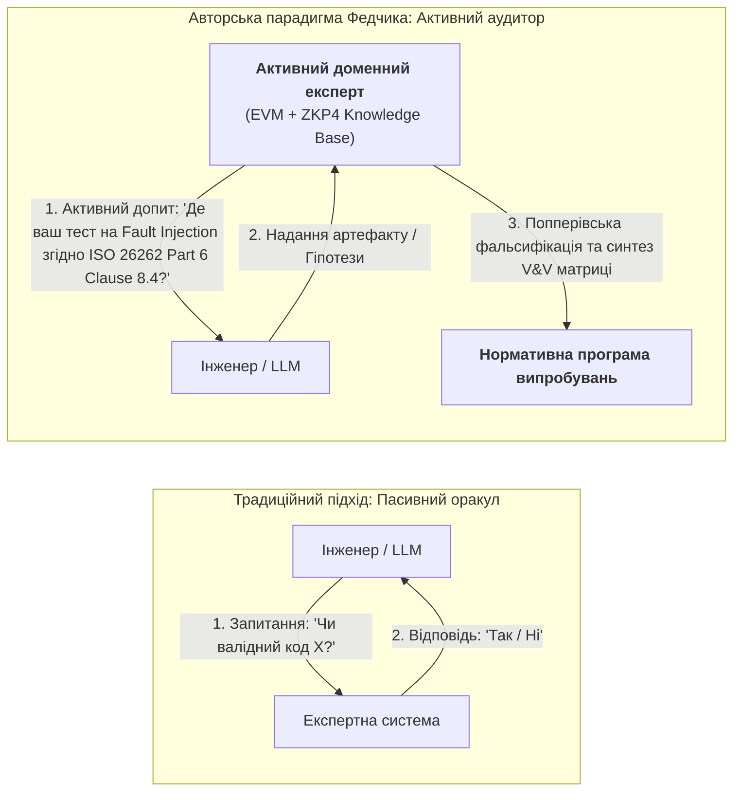
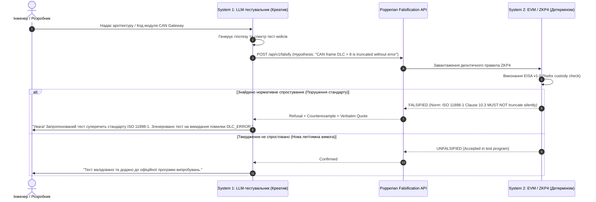

# Глава 39. Активний експерт-тестувальник: попперівська фальсифікація, нормативний комплаєнс (ASPICE/ISO 26262/ISO 21434) та автономне проєктування випробувань

> **Книга:** [Архітектура доказових експертних систем](README.md) · [Частина VI: Нейро-символьні відповіді, гіпотези та прогалини знань](part-06-frontiers-neuro-symbolic.md)  
> **Попередня глава:** [Глава 38. Машинні галюцинації та дефіцит знань: доказовий контроль відповідей](ch38-curing-machine-hallucinations-and-knowledge-deficits.md)  
> **Зміст книги:** [README.md](README.md)  
> **Автор:** [Микола Федчик](about-the-author.md)  
> **Рівень:** поглиблений: інженери з якості (QA/QC), аудитори функціональної безпеки та кібербезпеки, архітектори доказового ШІ  
> **Очікувані результати:** опанувати концепцію переходу від пасивного оракула до активного аудитора знань; зрозуміти принципи попперівської фальсифікації гіпотез мовних моделей у рантаймі; проектувати доменні комплаєнс-оракули на базі стандартів ASPICE 4.0, ISO 26262 та ISO/SAE 21434; синтезувати нормативно заземлені програми випробувань; впроваджувати нейро-символічну синергію тестувальника зі збереженням людини в контурі (Human-in-the-Loop).

---

## 1. Зсув парадигми: від пасивного оракула до активного допитувача (Active Probing)

Класична теорія експертних систем упродовж десятиліть будувалася навколо парадигми **«пасивного оракула»**: система завантажує базу правил або онтологію, перебуває в режимі очікування і починає логічне виведення лише у відповідь на прямий запит користувача:

$$\text{Запит } Q \quad \xrightarrow{\text{Експертна система}} \quad \text{Відповідь } A \ (\text{з доказом або відмовою})$$

У простих сценаріях технічної підтримки такої моделі достатньо. Проте в інженерії критичних систем (авіоніка DO-178C, автомобільні системи ISO 26262 / ASPICE 4.0, медичні прилади IEC 62304, протокольна безпека IETF RFC) пасивний підхід виявляє фундаментальну слабкість: **користувач часто не знає, про що саме потрібно запитати**.

Менеджер із якості, аудитор або тестувальник стикаються з тисячами сторінок взаємопов'язаних вимог. Рутинне заповнення матриць простежуваності (Traceability Matrix) та ручний пошук прогалин між архітектурним дизайном і тест-кейсами забирають до 70% інженерного часу. Людина втомлюється, пропускає тонкі неявні деонтичні заборони стандарту, потрапляє у пастки формальної звітності (compliance theatre) або формулює лише «щасливі» тести (happy path).

Тут виникає принципова авторська ідея **Миколи Федчика**:
> **Принцип активного доменного експерта:**  
> Якщо система володіє верифікованою машинною базою знань у предметній області (стандартами, регламентами, протоколами), вона зобов'язана не лише відповідати на запитання людини чи зовнішньої нейромережі, але й **активно ставити запитання сама**, виявляти приховані припущення, вимагати докази реалізації конкретних пунктів стандарту та **автономно генерувати вичерпну програму випробувань (Test Program)** для досліджуваного продукту.



Такий експерт-тестувальник перетворює нормативні тексти зі статичних документів на динамічні генератори перевірочних вимог.

---

## 2. Епістемологічний базис: Попперівська фальсифікація гіпотез

Математичний фундамент активного тестування спирається на критичний раціоналізм Карла Поппера [[1]](#src-1). В інженерії безпеки неможливо емпірично довести, що продукт не містить дефектів: мільйон успішних тестів не гарантують відсутності аварії, але один контрприклад остаточно спростовує безпечність.

Нехай:
- $\mathcal{P}$ — тестований продукт (програмний модуль, апаратний блок або специфікація);
- $\mathcal{H}_{\mathcal{P}}$ — гіпотеза про відповідність продукту стандарту, висунута розробником або мовною моделлю:
  $$\mathcal{H}_{\mathcal{P}} \equiv \forall s \in \mathcal{S}_{\text{system}}, \ \mathcal{P}(s) \models \mathcal{K}_{\text{norm}}$$
- $\mathcal{K}_{\text{norm}}$ — двійкова база нормативних знань ZKP4, що містить множину деонтичних атомів:
  $$\mathcal{K}_{\text{norm}} = \{ \nu_1, \nu_2, \dots, \nu_m \}, \quad \text{де } \nu_i = \langle \text{Subject}, \text{Relation}, \text{Object}, \text{Modality}, \text{ByteCoords} \rangle$$
  де $\text{Modality} \in \{ \text{MUST}, \text{MUST NOT}, \text{SHOULD}, \text{MAY} \}$.

Завдання активного експерта полягає не у верифікації твердження $\mathcal{H}_{\mathcal{P}}$ (що неможливо в загальному випадку через нескінченність простору станів $\mathcal{S}$), а в пошуку **потенційного фальсифікатора (Potential Falsifier)**:

$$\mathcal{F}(\mathcal{H}_{\mathcal{P}}) = \{ \langle \nu_k, \mathbf{x} \rangle \mid \nu_k \in \mathcal{K}_{\text{norm}} \ \land \ \mathcal{P}(\mathbf{x}) \not\models \nu_k \}$$

Якщо такий вектор $\mathbf{x}$ знайдено — гіпотезу фальсифіковано (`FALSIFIED`), а розробнику надається конкретний нормативний пункт standards-body та побайтова цитата першоджерела у регістрі `%ebx`. Якщо ж система не знаходить фальсифікатора в межах повноти бази знань, гіпотеза визнається тимчасово підтвердженою (`UNFALSIFIED`), а набір згенерованих перевірок включається в постійний регресійний репозиторій.

---

## 3. Нормативний комплаєнс як генератор тестів: ASPICE 4.0, ISO 26262, ISO 21434

Розгляньмо, як машинне доменне знання трьох провідних автомобільних стандартів перетворюється на активну програму тестування:

| Стандарт | Домен знань | Вимоги стандарту (Нормативний базис) | Активна дія експерта-тестувальника |
| :--- | :--- | :--- | :--- |
| **Automotive SPICE 4.0** | Процесна зрілість розробки (SWE.4 Unit Verification, SWE.5 Integration, SWE.6 Qualification) | *Двонаправлена простежуваність (Bidirectional Traceability)* між кожною одиничною вимогою та тестом. | **Аудит прогалин:** Сканує граф коду, виявляє гілки без призначеного нормативного атома та формує директиву: *«Вимога REQ-812 не покрита тестом на переповнення. Тестування не допущено».* |
| **ISO 26262 Part 6** | Функціональна безпека ПЗ (ASIL-B .. ASIL-D) | *Аналіз граничних значень (BVA), тестування інжекцією несправностей (Fault Injection), структурне покриття MC/DC.* | **Синтез тестових векторів:** Видобуває діапазони фізичних величин ($T_{\min}, T_{\max}$) з ZKP4 та вимагає 6-точковий стрес-прогін ($T_{\min}-1, T_{\min}, T_{\min}+1, \dots$). |
| **ISO/SAE 21434 Clause 9** | Кібербезпека дорожнього транспорту (TARA, Fuzzing, Boundary Vulnerabilities) | *Стійкість до маніпуляцій полями повідомлень, обов'язковий фазинг інтерфейсів шини CAN/Ethernet.* | **Генерація негативних сценаріїв:** Синтезує мутаційні вектори для некоректних заголовків та протокольних заборон стандарту. |

### Механізм виходу на програму тестування (V&V Coverage Matrix)
Замість написання тест-планів вручну експертна система генерує структуровану детерміновану матрицю:

$$\text{Coverage}_{\text{normative}}(\mathcal{P}) = \frac{|\{ \nu \in \mathcal{K}_{\text{norm}} \mid \exists t \in \mathcal{T}_{\mathcal{P}} : t \text{ verifies } \nu \}|}{|\mathcal{K}_{\text{norm}}|}$$

Якщо $\text{Coverage} < 1.00$, експертна система переходить у фазу активного сократівського запитування інженерної команди: *«Згідно з пунктом 8.4 стандарту, модуль зобов'язаний реагувати на втрату синхронізації годинника. Де визначено ваш тестовий драйвер для цього випадку?»*.

---

## 4. Нейро-символічний тандем: креативність LLM під наглядом детермінованої EVM

Поєднання великих мовних моделей (LLM) та символьного ядра EVM розв'язує фундаментальну дилему забезпечення якості:
- **Чисто символьний підхід (System 2):** володіє абсолютною точністю та нульовими галюцинаціями ($ZHR = 1.00$), але не здатний генерувати вільні текстові сценарії або здогадуватися про нетривіальні комбінації користувацьких дій поза формальними правилами.
- **Чисто нейромережевий підхід (System 1):** має безмежну креативність у генерації крайових випадків та розумінні контексту, але схильний галюцинувати неіснуючими вимогами та пропускати критичні заборони.

В авторській архітектурі Znavets v4 реалізується строго типізований тандем:



---

## 5. Людина в контурі (Human-in-the-Loop) як вивільнення технічної творчості

Ключовим соціально-технічним аспектом парадигми Миколи Федчика є усвідомлення меж машинного інтелекту:
> **Машина звільняє людину від каторги формалізму, але не замінює інженерну відповідальність.**

1. **Що бере на себе експертна система:**
   - 100% рутинної перевірки тисяч пунктів специфікацій, вимог простежуваності та деонтичних модальностей.
   - Миттєве виявлення пропущених обов'язкових тестів на безпеку та кібербезпеку.
   - Побайтову фіксацію доказів відповідності для аудиторів сертифікаційних органів (TÜV, Dekra, FDA).
2. **Що залишається людині (Human-in-the-Loop):**
   - Ухвалення остаточних архітектурних рішень щодо компромісів між продуктивністю та вартістю.
   - Дослідження нетривіальних фізичних аномалій обладнання, які виходять за межі текстових стандартів.
   - Стратегічне цілепокладання, інженерна творчість та проєктування інноваційних продуктів.

Замість багатоденного вичитування нормативних таблиць інженер отримує готовий інтерактивний звіт про дірки у верифікації та може зосередитися на проектуванні надійних технічних рішень.

---

## 6. Програмна реалізація: Popperian Falsification & Compliance Test API на Go

Нижче наведено робочу реалізацію сервісу активної попперівської фальсифікації та нормативної перевірки на мові Go:

```go
package compliance

import (
	"context"
	"crypto/sha256"
	"encoding/hex"
	"errors"
	"fmt"
	"sync"
	"time"
)

// Modality визначає деонтичну модальність вимоги.
type Modality string

const (
	ModalityMust    Modality = "MUST"
	ModalityMustNot Modality = "MUST_NOT"
	ModalityShould  Modality = "SHOULD"
	ModalityMay     Modality = "MAY"
)

// NormativeAtom представляє двійковий атом знань ZKP4 з байтовою кастодією.
type NormativeAtom struct {
	StandardID    string   `json:"standard_id"`    // напр., "ISO-26262-6:2018"
	Clause        string   `json:"clause"`         // напр., "Clause 8.4.2"
	Entity        string   `json:"entity"`         // напр., "SafetyMechanism"
	Modality      Modality `json:"modality"`       // MUST / MUST_NOT
	TargetAction  string   `json:"target_action"`  // напр., "InjectFaultBeforeRelease"
	VerbatimQuote string   `json:"verbatim_quote"` // Дослівна цитата
	ByteStart     uint64   `json:"byte_start"`     // Початковий байт у файлі
	ByteEnd       uint64   `json:"byte_end"`       // Кінцевий байт у файлі
	ExpectedSHA   string   `json:"expected_sha"`   // Хеш цитати (%ebx custody)
}

// Hypothesis представляє висунуте твердження щодо поведінки або тесту продукту.
type Hypothesis struct {
	ClaimID        string `json:"claim_id"`
	TargetEntity   string `json:"target_entity"`
	ActionProposed string `json:"action_proposed"`
	Context        string `json:"context"`
}

// FalsificationStatus результат попперівської перевірки.
type FalsificationStatus string

const (
	StatusFalsified   FalsificationStatus = "FALSIFIED"
	StatusUnfalsified FalsificationStatus = "UNFALSIFIED"
	StatusConflict    FalsificationStatus = "NORMATIVE_CONFLICT"
)

// FalsificationReport звіт з побайтовим доказом.
type FalsificationReport struct {
	Status        FalsificationStatus `json:"status"`
	ViolatedNorm  *NormativeAtom      `json:"violated_norm,omitempty"`
	Reason        string              `json:"reason"`
	ExecutionTime time.Duration       `json:"execution_time"`
	EvidenceValid bool                `json:"evidence_valid"`
}

// ActiveComplianceAuditor реалізує активного нормативного тестувальника.
type ActiveComplianceAuditor struct {
	mu         sync.RWMutex
	knowledge  map[string][]NormativeAtom // key: Entity
	corpusData []byte                     // mmap-першоджерело
}

// NewAuditor ініціалізує аудитора.
func NewAuditor(corpus []byte) *ActiveComplianceAuditor {
	return &ActiveComplianceAuditor{
		knowledge:  make(map[string][]NormativeAtom),
		corpusData: corpus,
	}
}

// RegisterNorm додає атом норми до бази аудитора.
func (a *ActiveComplianceAuditor) RegisterNorm(atom NormativeAtom) {
	a.mu.Lock()
	defer a.mu.Unlock()
	a.knowledge[atom.Entity] = append(a.knowledge[atom.Entity], atom)
}

// FalsifyHypothesis перевіряє гіпотезу на відповідність нормам за час < 1ms.
func (a *ActiveComplianceAuditor) FalsifyHypothesis(ctx context.Context, h Hypothesis) (*FalsificationReport, error) {
	tStart := time.Now()
	a.mu.RLock()
	defer a.mu.RUnlock()

	norms, exists := a.knowledge[h.TargetEntity]
	if !exists || len(norms) == 0 {
		return &FalsificationReport{
			Status:        StatusUnfalsified,
			Reason:        "No restricting normative clauses found for entity; open-world hypothesis admitted.",
			ExecutionTime: time.Since(tStart),
			EvidenceValid: true,
		}, nil
	}

	for _, norm := range norms {
		// Перевірка побайтової кустодії першоджерела (%ebx register check)
		if !a.verifyCustody(norm) {
			return nil, fmt.Errorf("custody breach on norm %s [%d..%d]", norm.Clause, norm.ByteStart, norm.ByteEnd)
		}

		// Попперівська фальсифікація: якщо дія прямо заборонена стандартом
		if norm.Modality == ModalityMustNot && norm.TargetAction == h.ActionProposed {
			return &FalsificationReport{
				Status:        StatusFalsified,
				ViolatedNorm:  &norm,
				Reason:        fmt.Sprintf("Direct prohibition in %s: %s", norm.StandardID, norm.VerbatimQuote),
				ExecutionTime: time.Since(tStart),
				EvidenceValid: true,
			}, nil
		}
	}

	return &FalsificationReport{
		Status:        StatusUnfalsified,
		Reason:        "Hypothesis survived Popperian falsification attempts against normative base.",
		ExecutionTime: time.Since(tStart),
		EvidenceValid: true,
	}, nil
}

// verifyCustody здійснює криптографічну перевірку цитати з масиву першоджерела.
func (a *ActiveComplianceAuditor) verifyCustody(n NormativeAtom) bool {
	if a.corpusData == nil || n.ByteEnd > uint64(len(a.corpusData)) || n.ByteStart >= n.ByteEnd {
		return false
	}
	slice := a.corpusData[n.ByteStart:n.ByteEnd]
	h := sha256.Sum256(slice)
	calcHex := hex.EncodeToString(h[:])
	return calcHex == n.ExpectedSHA
}

// GenerateTestDirectives активний допит: вимагає обов'язкові тести згідно норм MUST.
func (a *ActiveComplianceAuditor) GenerateTestDirectives(entity string) []string {
	a.mu.RLock()
	defer a.mu.RUnlock()

	var directives []string
	norms := a.knowledge[entity]
	for _, n := range norms {
		if n.Modality == ModalityMust {
			directives = append(directives, fmt.Sprintf(
				"COMPLIANCE DIRECTIVE [%s %s]: Must execute test covering action '%s'. Evidence: \"%s\"",
				n.StandardID, n.Clause, n.TargetAction, n.VerbatimQuote,
			))
		}
	}
	return directives
}
```

---

## 7. Висновки та інженерні наслідки

1. **Повна зміна парадигми експертної системи:** Експертна система перестає бути пасивним довідником і стає **активним ініціатором заходів контролю якості**. Вона самостійно формулює нормативні запитання до продукту, вимагає докази та виявляє відсутні тести.
2. **Детермінована попперівська фальсифікація:** Замість спроб статистично «вгадати» відповідність стандарту система за мілісекунди шукає нормативні контрприклади на базі вирівняних двійкових пакетів ZKP4 з побайтовою перевіркою цитат (%ebx custody).
3. **Економічний ефект для комплаєнс-проєктів:** Автоматизація до 90% рутинного аудиту за стандартами ASPICE, ISO 26262, ISO 21434, DO-178C кардинально зменшує час виходу продукту на ринок (Time to Market) та виключає людські помилки неуважності.
4. **Гуманістичний вимір інженерії знань:** Залишаючи людину в контурі (Human-in-the-Loop), доказовий ШІ повертає інженеру радість технічної творчості, беручи на себе всю тяжкість бюрократичної та нормативної рутини.

---

## Джерела до глави

1. <a id="src-1"></a>**Popper, K. R.** (1959). *The Logic of Scientific Discovery*. London: Hutchinson & Co.
2. <a id="src-2"></a>**Automotive Special Interest Group.** (2023). *Automotive SPICE Process Assessment / Reference Model, Version 4.0*. VDA QMC.
3. <a id="src-3"></a>**International Organization for Standardization.** (2018). *ISO 26262:2018: Road vehicles — Functional safety (Parts 1–12)*. Geneva: ISO.
4. <a id="src-4"></a>**ISO/SAE.** (2021). *ISO/SAE 21434:2021: Road vehicles — Cybersecurity engineering*. Geneva: ISO.
5. <a id="src-5"></a>**Beck, K.** (2002). *Test-Driven Development: By Example*. Addison-Wesley.
6. <a id="src-6"></a>**Федчик, М.** (2026). *Архітектура доказових експертних систем: від формальних онтологій до нейро-символьного ШІ*.
