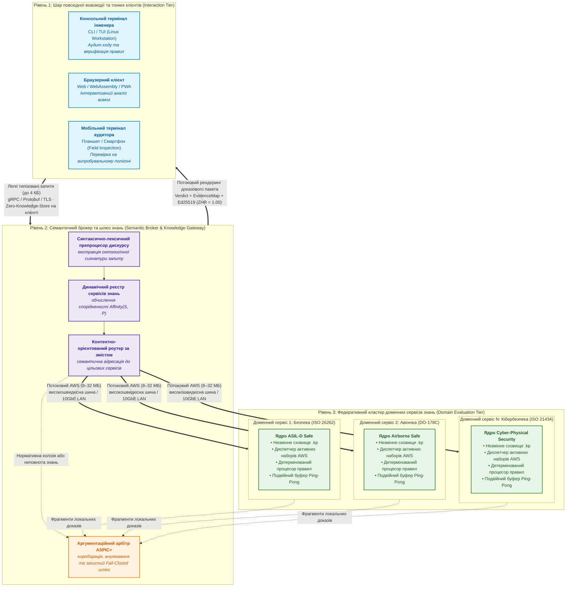
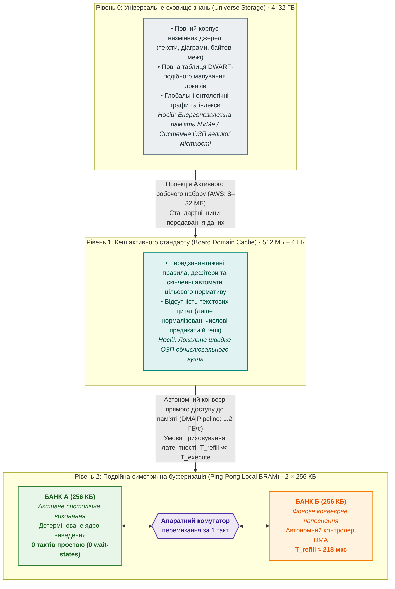
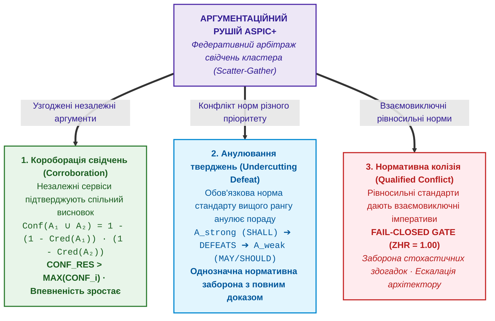

# Глава 40. Розподілена архітектура доказової експертної системи: епістемічна SOA, семантична маршрутизація, ієрархія пам'яті та багатоджерельний дефезитивний арбітраж

> **Книга:** [Архітектура доказових експертних систем](README.md) · [Частина VII: Реалізація, розгортання та обмін знаннями](part-07-runtime-and-knowledge-exchange.md)  
> **Попередня глава:** [Глава 33. Міжсистемний обмін знаннями: постачання правил стороннім системам, навчання моделей і захищений зворотний зв'язок](ch33-inter-system-knowledge-exchange-and-model-teaching.md)  
> **Зміст книги:** [README.md](README.md)  
> **Автор:** [Микола Федчик](about-the-author.md)  
> **Рівень:** поглиблений: головні системні архітектори, інженери знань, розробники розподілених систем, фахівці з комплаєнсу та безпеки  
> **Очікувані результати:** синтезувати теоретичні положення всіх розділів монографії у завершений референсний архітектурний прототип розподіленої експертної системи; проектувати триланкову сервіс-орієнтовану архітектуру (Epistemic SOA) із відокремленням тонких клієнтів від сервісів знань; реалізовувати синтаксично-лексичний препроцесинг і семантичну маршрутизацію запитів; долати розрив між макрообсягами сховищ і мікромісткістю швидкої пам'яті через активні робочі набори та подвійну конвеєрну буферизацію; організовувати федеративний пошук (Scatter-Gather) та багатоджерельну дефезитивну агрегацію свідчень (ASPIC+) при низькій впевненості джерел; приймати зважені інженерні рішення щодо масштабування та вибору класів апаратного/програмного забезпечення за бюджетом проєкту.

---

## Анотація

Усі попередні розділи цієї монографії послідовно довели фундаментальну тезу: надійна експертна система не може базуватися на стохастичних узагальненнях великих мовних моделей чи неперевірених базах фактів. Справжня експертність вимагає математичного детермінізму, формального виведення, побайтової кустодії першоджерел ($ZHR = 1.00$) та незалежного аудиту. Проте вихід системи за межі дослідницького стенда у реальне промислове середовище R&D ставить перед архітектором новий критичний виклик: **масштабованість, розподіленість і повсюдну доступність**.

Ця глава завершує теоретичний цикл монографії, формуючи для читача **референсний архітектурний прототип промислової доказової експертної системи**. Абстрагуючись від конкретних комерційних брендів мікросхем чи приватних специфікацій, глава визначає функціональні класи апаратних і програмних обчислювачів, необхідних для побудови масштабованої системи. Розглядається триланкова епістемічна сервіс-орієнтована архітектура (Epistemic SOA), де тонкі мобільні клієнти (смартфони, термінали) взаємодіють із кластером доменних сервісів через інтелектуальний семантичний брокер. Формалізується багаторівнева ієрархія пам'яті: математично доводиться умова безперервності конвеєра та повного приховування затримок ($T_{\mathrm{transfer}} \ll T_{\mathrm{compute}}$) через механізм активних робочих наборів знань і симетричну подвійну буферизацію (Ping-Pong Pipeline). Для випадків неповноти окремих баз знань розроблено модель федеративного пошуку (Scatter-Gather) та багатоджерельної дефезитивної агрегації свідчень (ASPIC+), що забезпечує короборацію, анулювання слабких рекомендацій та кваліфіковане виявлення нормативних колізій. Наприкінці наведено інженерну матрицю вибору технологій, яка дозволяє системному архітектору розгорнути працездатний прототип на доступному йому обладнанні відповідно до бюджету проєкту.

---

## 1. Синтез монографії: від локальної моделі до референсного архітектурного прототипу

Тридцять дев'ять попередніх глав цієї книги детально препарували анатомію доказового штучного інтелекту. У монографії розглянуто гносеологію машинного знання ([Глава 2](ch02-epistemology-of-machine-knowledge.md)), моделі та типологію баз знань ([Глава 7](ch07-knowledge-base-typology.md)), автоматизоване вилучення норм із першоджерел ([Глава 15](ch15-knowledge-extraction-and-kb-construction.md)), строге детерміноване виведення ([Глава 16](ch16-expert-systems-architecture.md), [Глава 31](ch31-syllogistic-reasoning-and-relation-lattices.md)), подолання машинних галюцинацій ([Глава 38](ch38-curing-machine-hallucinations-and-knowledge-deficits.md)) та попперівський комплаєнс-аудит ([Глава 39](ch39-active-compliance-auditor-and-popperian-testing.md)).

Однак у практичній інженерії виникає закономірне запитання: **як зібрати всі ці теоретичні концепції в єдину працюючу систему корпоративного рівня?**

У реальних високотехнологічних R&D проєктах (автомобілебудування, авіоніка, медичне приладобудування) нормативна база налічує десятки чинних стандартів (ISO, IEC, DO, IEEE, RFC), які разом із вербатім-першоджерелами, таблицями відповідності та дефітерами займають десятки гігабайтів інформації. Водночас інженерам-дослідникам, аудиторам і розробникам необхідний повсякденний доступ до системи:
- на робочому місці за десктопом під час проектування архітектури;
- у випробувальній лабораторії чи на полігоні з планшета або смартфона;
- в автоматизованому конвеєрі неперервної інтеграції (CI/CD) під час нічних аудитів коду.

Спроба вирішити цю задачу створенням «товстого» локального моноліту зазнає фіаско. Мобільний пристрій не здатний утримувати в оперативній пам'яті багатогігабайтні бази знань і не має обчислювальних потужностей для глибокого семантичного аналізу. З іншого боку, звичайний хмарний сервіс із популярною мовною моделлю не гарантує ні детермінізму, ні захисту від галюцинацій, ні побайтової кустодії першоджерел.

Потрібен **розподілений референсний архітектурний прототип**, побудований на принципах сервіс-орієнтованої архітектури (SOA), чіткого розмежування зон відповідальності та математично обґрунтованої ієрархії пам'яті.

---

## 2. Епістемічна сервіс-орієнтована архітектура (Epistemic SOA) та тонкі клієнти

Сервіс-орієнтована архітектура в інженерії програмного забезпечення традиційно вирішує задачі слабкого зв'язування компонентів, незалежного розгортання та повторного використання бізнес-функцій. В **епістемічних доказових системах** парадигма SOA набуває якісно нового сенсу: вона забезпечує **ізоляцію контекстів істинності** та **повсюдний доступ користувачів** без ризику втрати кустодії доказів.

### 2.1. Концепція тонкого клієнта (Thin Interaction Client)

Клієнтський пристрій кінцевого користувача (інженера з якості, розробника чи аудитора) визначається як **ультратонкий агент взаємодії**:
1. **Нульове сховище знань ($S_{\mathrm{client}} = 0$):** Клієнтська програма не зберігає бази знань і не кешує локальні копії стандартів. Це усуває проблему розсинхронізації версій норм між членами інженерної команди.
2. **Абстрагування від обчислювачів:** Клієнту не потрібні апаратні прискорювачі нейромереж (NPU/GPU) чи спеціалізовані процесори правил. Завдяки цьому інтерфейс Znavets легко функціонує на звичайних смартфонах під керуванням мобільних ОС, у веб-браузерах через WebAssembly/PWA або у текстовому терміналі інженерної робочої станції.
3. **Строга типізація запитів та відповідей:** Обмін здійснюється через високоефективні бінарні RPC-контракти (наприклад, Protocol Buffers над gRPC чи захищені WebSockets):
   - Запит від клієнта: рядок природної мови або структурований ідентифікатор інженерного артефакту (обсяг пакета $\le 2\text{--}4\,\text{КБ}$).
   - Відповідь клієнту: структурований доказовий кортеж, що містить вердикт (`ACCEPT`, `REFUSAL`, `QUALIFIED`), ідентифікатори застосованих правил, дослівні цитати з байтовими координатами у першоджерелі та 256-бітні криптографічні геші кустодії.

### 2.2. Збереження інваріанта $ZHR = 1.00$ на клієнті

Критично важливо, що тонкий клієнт не має права інтерпретувати чи самостійно узагальнювати отриману відповідь. Він виконує суто репрезентативну функцію:
$$\text{Display}(\text{Response}) = \text{Render}(\text{Verdict}, \text{EvidenceMap}, \text{Signature})$$

де:
- $\text{Verdict} \in \{\text{ACCEPT}, \text{REFUSAL}, \text{QUALIFIED}\}$ — формальний логічний статус виведення, сформований сервером;
- $\text{EvidenceMap}$ — побайтове відображення термів виведення на координати у вихідних першоджерелах;
- $\text{Signature}$ — криптографічний цифровий підпис Ed25519 доказового пакета для гарантування незмінності.

Навіть якщо зв'язок між клієнтом і брокером тимчасово переривається під час польових випробувань, отриманий результат не втрачає юридичної та технічної сили: кожен показаний інженеру факт залишається підтвердженим цифровим підписом та гешем першоджерела.

---

## 3. Семантичний брокер, препроцесор дискурсу та маршрутизація за змістом

Коли в інженерній екосистемі функціонує не одна база знань, а кластер спеціалізованих сервісів, виникає ключове завдання координації: **хто і як визначає, куди саме спрямувати запит інженера?**

У класичних веб-системах маршрутизація здійснюється за мережевими адресами чи префіксами URL (наприклад, `/api/v1/orders`). В експертних системах адресація є суто **семантичною (Content-Based Semantic Routing)** і спирається на результати роботи лінгвістичного препроцесора.

### 3.1. Синтаксично-лексичний препроцесор дискурсу

Отримавши запит, Семантичний Брокер пропускає його крізь конвеєр первинного семантичного розбору:

```mermaid
flowchart TD
    accTitle: Конвеєр синтаксично-лексичного розбору дискурсу в Семантичному Брокері
    accDescr: Поетапна трансформація природномовного запиту інженера у структуровану онтологічну сигнатуру для маршрутизації доменних правил.

    IN["&emsp;&emsp;&emsp;&emsp; <b>ВХІДНИЙ ІНЖЕНЕРНИЙ ЗАПИТ НА АУДИТ ВІДПОВІДНОСТІ (Natural Language Query)</b> &emsp;&emsp;&emsp;&emsp;<br><i>«Чи дозволено використовувати динамічне виділення пам'яті для модуля ASIL-D згідно з ISO 26262-6?»</i><br><i>Джерело надходження: робоча станція інженера / конвеєр неперервної інтеграції (CI/CD Quality Gate)</i>"]

    STEP1["&emsp;&emsp;&emsp;&emsp; <b>1. КЛАСИФІКАЦІЯ ДИСКУРСУ (Discourse Qualification)</b> &emsp;&emsp;&emsp;&emsp;<br>• Прагматичний тип: <code>NORMATIVE_COMPLIANCE_QUERY</code> &emsp;·&emsp; • Цільова модальність: <code>DEONTIC_PROHIBITION_OR_PERMISSION</code><br><i>Семантичний намір: формальна верифікація допустимості архітектурного рішення проти сертифікаційного стандарту</i>"]

    STEP2["&emsp;&emsp;&emsp;&emsp; <b>2. СИНТАКСИЧНО-ФРЕЙМОВИЙ РОЗБІР (Syntactic Frame Parsing)</b> &emsp;&emsp;&emsp;&emsp;<br>• Актор: <i>«модуль програмного забезпечення»</i> &emsp;·&emsp; • Дія: <i>«динамічне виділення пам'яті» (Dynamic Allocation)</i> &emsp;·&emsp; • Атрибут: <code>ASIL_Level = 'D'</code><br><i>Вилучення предикатно-аргументної структури вимоги для детермінованого зіставлення з онтологічними аксіомами</i>"]

    STEP3["&emsp;&emsp;&emsp;&emsp; <b>3. ЕКСТРАКЦІЯ ОНТОЛОГІЧНОЇ СИГНАТУРИ (Domain Signature Extraction)</b> &emsp;&emsp;&emsp;&emsp;<br>• Доменні маркери: <code>{ISO-26262, ASIL-D, Software-Architecture, Memory-Management}</code><br>• Профіль запиту: <code>TargetDomain = 'Automotive-Safety'</code> &emsp;·&emsp; • Норматив: <code>Standard = 'ISO-26262-6:2018'</code><br><i>Формування сигнатурного вектора запиту для обчислення коефіцієнтів спорідненості в динамічному реєстрі сервісів</i>"]

    OUT["&emsp;&emsp;&emsp;&emsp; <b>ПРИЗНАЧЕННЯ ГОЛОВНОГО ВИКОНАВЦЯ (Primary Evaluator Dispatching)</b> &emsp;&emsp;&emsp;&emsp;<br>Призначено сервіс: <b>Доменний сервіс безпеки автомобільної електроніки (ISO 26262-6:2018)</b> &emsp;·&emsp; <code>Affinity(S, P) = 1.00</code><br><i>Пакет активного набору (AWS) передається до систолічного детермінованого ядра правил через високошвидкісну локальну шину</i>"]

    IN ==> STEP1
    STEP1 ==> STEP2
    STEP2 ==> STEP3
    STEP3 ==> OUT

    classDef query fill:#e3f2fd,stroke:#1565c0,stroke-width:2px,color:#0d47a1;
    classDef step1 fill:#ede7f6,stroke:#5e35b1,stroke-width:2px,color:#311b92;
    classDef step2 fill:#fff8e1,stroke:#ffa000,stroke-width:2px,color:#e65100;
    classDef step3 fill:#e8f5e9,stroke:#2e7d32,stroke-width:2px,color:#1b5e20;
    classDef target fill:#f3e5f5,stroke:#7b1fa2,stroke-width:2px,color:#4a148c;

    class IN query;
    class STEP1 step1;
    class STEP2 step2;
    class STEP3 step3;
    class OUT target;
```

### 3.2. Динамічний реєстр сервісів знань (Knowledge Service Registry)

Семантичний Брокер підтримує в пам'яті актуальний реєстр доступних у кластері доменних сервісів. Кожен сервіс при реєстрації публікує формальний маніфест:
- **Ідентифікатор та ендпоінт:** Мережева адреса (IP/порт або черга повідомлень);
- **Простір знань (Knowledge Domain):** Набір обслуговуваних стандартів та версій онтологій (відповідно до вимог SemVer 2.0.0);
- **Клас обчислювача:** Програмний CPU, масив векторних процесорів або спеціалізоване апаратне ядро детермінованого виведення;
- **Метрики пропускної здатності:** Поточна глибина черги запитів та оцінка затримки обчислення.

Брокер обчислює функцію відповідності між онтологічною сигнатурою запиту $\mathcal{S}_{\mathrm{query}}$ та паспортом сервісу $\mathcal{P}_{\mathrm{service}}$:
$$\mathrm{Affinity}(\mathcal{S}, \mathcal{P}) = \frac{|\mathcal{S}_{\mathrm{query}} \cap \mathcal{P}_{\mathrm{domain}}|}{|\mathcal{S}_{\mathrm{query}}|}$$

де:
- $\mathcal{S}_{\mathrm{query}}$ — множина онтологічних концептів і доменних маркерів, екстрагованих із запиту інженера;
- $\mathcal{P}_{\mathrm{domain}}$ — множина підтримуваних стандартів та версій онтологій у маніфесті сервісу;
- $|\mathcal{S}_{\mathrm{query}} \cap \mathcal{P}_{\mathrm{domain}}|$ — потужність перетину онтологічних сигнатур;
- $\mathrm{Affinity}(\mathcal{S}, \mathcal{P}) \in [0, 1]$ — нормований коефіцієнт спорідненості (значення $1.0$ відповідає повному охопленню домену запиту).

Сервіс із найвищим показником близькості призначається головним виконавцем (*Primary Evaluator*).

---

## 4. Теоретична модель багаторівневої ієрархії пам'яті та подвійної буферизації

Будь-яка обчислювальна система обмежена законами фізики передавання сигналів: **чим більший обсяг пам'яті, тим більша затримка доступу до неї, і навпаки — надшвидка пам'ять, інтегрована безпосередньо в логіку обчислювача, має вкрай обмежену місткість**.

В інженерних експертних системах цей розрив досягає критичних масштабів:
1. **Макрообсяг сховища знань ($V_{\mathrm{corpus}}$):** Повний репозиторій нормативів разом із першоджерелами, деревами розбору та матрицями трасованості становить $4\text{--}32\,\text{ГБ}$.
2. **Мікрообсяг швидкої пам'яті процесора правил ($V_{\mathrm{local}}$):** Локальна пам'ять спеціалізованого процесора правил (Block RAM у кремнієвих прискорювачах або швидкий кеш L1/L2) зазвичай не перевищує кількох сотень кілобайт ($256\text{--}512\,\text{КБ}$).
3. **Пропускна здатність каналу обміну ($B_{\mathrm{channel}}$):** Передавання повного масиву знань на обчислювач під час кожного запиту спричиняє неприпустимий простої системи ($> 1$ хвилини), що руйнує комфортний діалог інженера ($0.5\text{--}2.0\,\text{с}$).

### 4.1. Концепція Активного робочого набору (Active Working Set — AWS)

Замість переміщення всього корпусу знань, семантичний диспетчер формує **Активний робочий набір (AWS)**:
$$\mathrm{AWS} = \mathrm{Closure}(\mathcal{R}_{\mathrm{target}}) = \mathcal{R}_{\mathrm{target}} \cup \mathrm{Prerequisites}(\mathcal{R}_{\mathrm{target}}) \cup \mathrm{Defeaters}(\mathcal{R}_{\mathrm{target}})$$

де:
- $\mathcal{R}_{\mathrm{target}}$ — множина цільових правил, активована онтологічною сигнатурою запиту;
- $\mathrm{Prerequisites}(\mathcal{R}_{\mathrm{target}})$ — предикати-передумови, необхідні для детермінованого розв'язання залежностей;
- $\mathrm{Defeaters}(\mathcal{R}_{\mathrm{target}})$ — множина асоційованих дефітерів (винятків і контрправил);
- $\mathrm{AWS}$ — транзитивне логічне замикання правил без текстових цитат першоджерел, оптимізоване для миттєвого завантаження в локальний кеш обчислювача.

AWS містить лише математичний скелет правил: числові ліміти, логічні умови, ідентифікатори дефітерів та 256-бітні геші цитат. Вербатім-тексти першоджерел залишаються у сховищі Рівня 0. Обсяг AWS зменшується до **$8\text{--}32\,\text{МБ}$**, що передається стандартними промисловими шинами за лічені частки секунди.

### 4.2. Математична умова безперервності конвеєра подвійної буферизації (Ping-Pong Pipeline)

Швидка пам'ять процесора правил ділиться на два симетричні банки: Банк A та Банк B.
Нехай:
- $V_{\mathrm{bank}}$ — місткість одного банку швидкої пам'яті (наприклад, $256\,\text{КБ}$);
- $B_{\mathrm{bus}}$ — пропускна здатність внутрішньої шини підкачування (наприклад, $1.2\,\text{ГБ/с}$);
- $T_{\mathrm{refill}}$ — час заповнення банку даними з локального ОЗП:
  $$T_{\mathrm{refill}} = \frac{V_{\mathrm{bank}}}{B_{\mathrm{bus}}}$$
- $T_{\mathrm{execute}}$ — час, необхідний процесору правил для повного обчислення блоку знань місткістю $V_{\mathrm{bank}}$.

**Теорема приховування затримок (Latency Hiding Invariant):**
Конвеєр виведення функціонує з максимальним коефіцієнтом використання обчислювальних ресурсів ($\eta = 1.00$) без жодного такту простою процесора тоді й тільки тоді, коли час фонового наповнення не перевищує часу виконання правил:
$$T_{\mathrm{refill}} \le T_{\mathrm{execute}}$$

Оскільки для блоку у $256\,\text{КБ}$ час підкачування становить $T_{\mathrm{refill}} \approx 218\,\mu\text{с}$, а повноцінне систолічне зіставлення пакета складних інженерних вимог проти цих правил займає $T_{\mathrm{execute}} \approx 1.5\text{--}5.0\,\text{мс}$, умова приховування виконується із запасом у кілька разів:
$$T_{\mathrm{refill}} \ll T_{\mathrm{execute}}$$
У момент, коли процесор завершує обчислення в Банку A, апаратний комутатор за **1 такт** перемикає його на вже заповнений Банк B, а каналу підкачування надається команда на заповнення Банку A. Система досягає теоретичної верхньої межі продуктивності.

### 4.3. Систолічний пакетний аудит (Batch Compliance Sweeps)

Для масової верифікації (наприклад, одночасна перевірка $M = 1\,500$ вимог безпеки проти $K = 500$ нормативних правил):
- Вимоги подаються як конвеєрний векторний потік;
- Елементарні атомарні порівняння виконуються за $1\text{--}4$ такти апаратної частоти;
- Загальний час апаратної перевірки $750\,000$ пар становить менше **$30\text{--}50\,\text{мс}$**, що забезпечує наскрізний час відповіді менше $1.0\,\text{с}$ для всієї системи.

---

## 5. Багатоджерельна дефезитивна агрегація знань (ASPIC+ / Dung)

В інженерних R&D проектах високої складності жодна окрема база знань не володіє абсолютною монополією на повноту інформації. Окремий доменний сервіс може повернути результат, який не є однозначним.

### 5.1. Тригери неповноти знань (Uncertainty Triggers)

Семантичний Брокер ідентифікує необхідність підключення додаткових сервісів за трьома строгими ознаками:
1. **Низький дискретний бал достовірності ($Score < 70/100$):** Посилання походить з негармонізованого або вторинного джерела;
2. **Неімперативний нормативний статус (Informative vs Normative):** Правило вилучено з довідкового розділу або додатку (*Guideline / May / Informative Annex*), тоді як інженер вимагає сертифікаційного вердикту;
3. **Відкритий дефіцитний стан (Ungrounded Defeater):** Правило містить умову-виняток `unless condition_X`, але в локальній базі знань факт `condition_X` відсутній.

### 5.2. Федеративний запит (Scatter-Gather) та аргументаційний арбітраж

Виявивши дефіцит, Брокер ініціює паралельне опитування (**Scatter**) суміжних сервісів кластера (наприклад, сервісу галузевих прецедентів чи загальних стандартів надійності). Отримані від різних сервісів фрагменти доказів зводяться (**Gather**) у формальну аргументаційну систему **ASPIC+**:

1. **Короборація свідчень (Corroboration):** Якщо кілька незалежних джерел дійшли одного висновку, впевненість інтегрованого аргументу математично зростає:
   $$\mathrm{Conf}(A_1 \cup A_2) = 1 - (1 - \mathrm{Cred}(A_1)) \cdot (1 - \mathrm{Cred}(A_2))$$
   де:
   - $\mathrm{Cred}(A_i) \in [0, 1)$ — дискретний рівень достовірності свідчення, наданого доменним сервісом $i$;
   - $\mathrm{Conf}(A_1 \cup A_2) \in [0, 1)$ — сукупна ймовірнісна довіра до скороборованого висновку (незалежні підтвердження підсилюють доказову базу за теоремою про об'єднання незалежних подій).
2. **Анулювання слабких тверджень (Defeat / Undercutting):** Імперативна норма стандарту з вищим рівнем нормативності ($\mathrm{Rank} = \text{Shall}$) безумовно анулює рекомендаційний аргумент нижчого рангу ($\mathrm{Rank} = \text{Should/May}$).
3. **Кваліфікована відмова при нормативній колізії (Qualified Conflict):** Якщо авторитетні стандарти однакової сили суперечать один одному, система **забороняє стохастичне вгадування компромісу**. Вона активує механізм *Fail-Closed*, повертаючи типізоване повідомлення про нормативну колізію для розгляду головним архітектором.

---

## 6. Інженерна матриця вибору технологій та масштабування за бюджетом проєкту

Головна цінність теоретичного прототипу полягає в тому, що він задає **напрямок розвитку**, а не жорсткий перелік купівельних специфікацій. Інженер-розробник може розгорнути систему на тому обладнанні, яке доступне в межах поточного бюджету його науково-дослідного чи комерційного проєкту:

| Рівень інфраструктури | Клас обладнання | Семантичний брокер і System 1 | Ядро детермінованого виведення (System 2) | Сховище та ієрархія пам'яті | Бюджетний контекст і застосування |
| :--- | :--- | :--- | :--- | :--- | :--- |
| **Рівень 1: Лабораторний стенд (Lab Prototype)** | Єдиний ПК або робоча станція розробника | Легка локальна SLM (3B-7B) на CPU / дискретному споживчому GPU | Програмне ядро (Software EVM) як бібліотека в тому ж процесі | Файлове сховище з прямим `mmap` в оперативну пам'ять ОС | **Мінімальний бюджет.** Дослідження концепцій, курсові та дисертаційні роботи, перевірка правил на малих наборах. |
| **Рівень 2: Розподілена робоча група (Team R&D Cluster)** | Виділений локальний сервер + тонкі клієнти (ПК/смартфони) | Виділений сервер із моделлю 14B; доступ через REST/gRPC брокер | Софтверний демон виведення в пам'яті з IPC-сокетом | Кешування в оперативній пам'яті сервера (32–64 GB), потокова видача на клієнти | **Середній бюджет.** Інженерні команди з 10–50 фахівців, інтеграція в корпоративний CI/CD, щоденний аудит коду. |
| **Рівень 3: Промисловий комплекс (Enterprise / ASIL-D Safe)** | Кластер серверів + апаратні плати детермінованого захисту | Гетерогенний пул моделей (14B-32B) на GPU/NPU із Circuit Breaker | Спеціалізовані апаратні плати з детермінованим кремнієвим ядром | Апаратна подвійна буферизація (Ping-Pong BRAM) + високошвидкісна шина DMA | **Високий / галузевий бюджет.** Автономний транспорт, авіоніка, критичні об'єкти енергетики, сертифікаційні лабораторії TÜV. |

---

## Висновки

1. **Ізоляція рівнів відповідальності в Epistemic SOA:** Розподілена архітектура доказової експертної системи розв'язує фундаментальну дилему масштабованості. Поділ на рівень тонких клієнтів, семантичний координаційний брокер і федеративні доменні сервіси дозволяє ізолювати контексти істинності й усунути залежність від ресурсів термінала кінцевого користувача.
2. **Гарантія інваріанта $ZHR = 1.00$ на тонкому клієнті:** Клієнт взаємодії не утримує локальних баз знань ($S_{\mathrm{client}} = 0$) і не виконує логічного виведення. Його функція обмежена рендерингом криптографічно підписаного доказового кортежу $\langle\text{Verdict}, \text{EvidenceMap}, \text{Signature}\rangle$, що гарантує збереження юридичної сили й повної відсутності галюцинацій навіть на мобільних пристроях.
3. **Онтологічна маршрутизація запитів:** Семантичний брокер відкидає наївну URL-маршрутизацію на користь контентного аналізу. Синтаксично-лексичний препроцесор екстрагує доменні маркери, а динамічний реєстр сервісів призначає головного виконавця на основі обчислення нормованого коефіцієнта спорідненості $\mathrm{Affinity}(\mathcal{S}, \mathcal{P})$.
4. **Подолання розриву місткості пам'яті:** Сепарація статичних цитат від математичного скелета правил зменшує робочий набір до компактного Активного робочого набору ($\mathrm{AWS} \le 32\,\text{МБ}$). Двобанкова конвеєрна буферизація (Ping-Pong Pipeline) забезпечує повне приховування латентності за рахунок дотримання нерівності $T_{\mathrm{refill}} \ll T_{\mathrm{execute}}$, усуваючи простої обчислювального ядра ($\eta = 1.00$).
5. **Багатоджерельний аргументаційний арбітраж:** При виявленні неповноти знань шаблон Scatter-Gather агрегує свідчення суміжних сервісів кластера за формалізмом ASPIC+. Система підсилює впевненість через короборацію свідчень, детерміновано анулює слабкі рекомендації імперативними нормами вищого рангу та активує захисний шлюз *Fail-Closed* при виявленні нерозв'язних нормативних колізій.
6. **Практична еволюція за проєктним бюджетом:** Запропонований прототип є концептуальним вектором розвитку, що масштабується від одномшинного лабораторного стенда (Рівень 1) до корпоративного R&D-кластера (Рівень 2) і промислового апаратно-детермінованого комплексу рівня ASIL-D (Рівень 3).

---

## Запитання для самоперевірки

1. Чому спроба реалізувати експертну систему як товстий локальний моноліт на мобільному пристрої інженера порушує вимоги до масштабованості та синхронізації знань?
2. Яким чином тонкий клієнт забезпечує гарантію доказовості $ZHR = 1.00$, якщо він сам не виконує логічного виведення?
3. Чим відрізняється семантична маршрутизація (Content-Based Semantic Routing) від класичної веб-маршрутизації на рівні API-шлюзів?
4. Сформулюйте математичну умову повного приховування затримок у конвеєрі подвійної буферизації. Чому час фонового підкачування має бути меншим за час виконання блоку правил?
5. Які три епістемічні тригери сигналізують Семантичному Брокеру про необхідність переходу від локальної відповіді до федеративного опитування за шаблоном Scatter-Gather?
6. Як аргументаційний рушій ASPIC+ розв'язує ситуацію нормативної колізії, коли два однаково авторитетні гармонізовані стандарти висувають взаємовиключні вимоги?
7. Опишіть шлях еволюції експертної системи від одномшинного лабораторного прототипу до промислового гетерогенного комплексу за інженерною матрицею вибору технологій.

---

## Словник

| Український термін | Англійський відповідник | Коротке пояснення |
|---|---|---|
| Епістемічна SOA | Epistemic Service-Oriented Architecture | Розподілена архітектура експертної системи з ізоляцією контекстів істинності між незалежними сервісами знань |
| Тонкий клієнт взаємодії | Thin Interaction Client | Клієнтський інтерфейс з нульовим локальним сховищем знань, призначений виключно для рендерингу підписаних доказів |
| Семантичний брокер | Semantic Broker | Центральний координатор кластера, що виконує синтаксичний препроцесинг і контентно-орієнтовану маршрутизацію запитів |
| Маршрутизація за змістом | Content-Based Semantic Routing | Спрямування запитів до сервісів знань на основі аналізу онтологічної сигнатури понять і цільових нормативів |
| Активний робочий набір | Active Working Set (AWS) | Компактне транзитивне логічне замикання цільових правил і дефітерів без текстових першоджерел |
| Подвійна буферизація Ping-Pong | Ping-Pong Double Buffering | Симетрична архітектура пам'яті з чергуванням фонового наповнення одного банку та паралельного виконання правил з іншого |
| Приховування затримок | Latency Hiding | Стан конвеєра виведення ($T_{\mathrm{refill}} \le T_{\mathrm{execute}}$), за якого час підкачування даних повністю маскується часом обчислення |
| Шаблон Scatter-Gather | Scatter-Gather Pattern | Паралельне опитування пулу розподілених сервісів кластера з подальшим зведенням результатів у єдиний аргументаційний висновок |
| Короборація свідчень | Corroboration | Математичне підсилення сукупної довіри до висновку при отриманні узгоджених доказів від незалежних джерел |
| Анулювання правила | Undercutting Defeat | Механізм немонотонної аргументації, за якого імперативна норма вищого рангу анулює дію суперечливої рекомендації |
| Кваліфікована колізія Fail-Closed | Fail-Closed Qualified Conflict Gate | Захисне блокування автоматичного компромісу при взаємовиключних вимогах рівносильних норм з ескалацією на архітектора |

---

## Абревіатури

| Скорочення | Розшифрування | Значення |
|---|---|---|
| ASIL | Automotive Safety Integrity Level | Рівень повноти безпеки автомобільної електроніки за стандартом ISO 26262 (від A до D) |
| ASPIC+ | Argumentation Service Platform with Incomplete and Conflicting Information | Формальний апарат структурування аргументів, презумпцій та правил атаки/дефіту |
| AWS | Active Working Set | Активний робочий набір знань, мінімально необхідний для обчислення запиту |
| BRAM | Block Random Access Memory | Внутрішньокристальна швидка пам'ять апаратного процесора правил з фіксованим часом доступу |
| DMA | Direct Memory Access | Прямий доступ до пам'яті для фонового апаратного перенесення даних повз ядро процесора |
| EVM | Epistemic Virtual Machine | Детермінована віртуальна машина доказового виведення логічних резолюцій |
| gRPC | Google Remote Procedure Call | Високопродуктивний бінарний RPC-фреймворк на базі HTTP/2 та Protocol Buffers |
| IPC | Inter-Process Communication | Комплекс системних механізмів обміну даними між процесами на одній машині |
| KTP | Knowledge Testing Pyramid | Багаторівнева методологія тестування баз знань від атомарних фактів до цілісних сценаріїв |
| NPU | Neural Processing Unit | Спеціалізований апаратний прискорювач тензорних операцій для штучних нейромереж |
| PWA | Progressive Web Application | Технологія створення веб-застосунків з можливістю автономного кешування інтерфейсу |
| RPC | Remote Procedure Call | Парадигма взаємодії розподілених компонентів через віддалений виклик процедур |
| SLM | Small Language Model | Компактна спеціалізована мовна модель (1B-7B) для лінгвістичного аналізу та класифікації |
| SOA | Service-Oriented Architecture | Сервіс-орієнтована архітектура програмного комплексу зі слабким зв'язуванням компонентів |
| TARA | Threat Analysis and Risk Assessment | Методологія оцінювання загроз і кібербезпекових ризиків за стандартом ISO/SAE 21434 |
| ZHR | Zero-Hallucination Rate | Метрика абсолютної відсутності безпідставних генерацій ($ZHR = 1.00$) у доказових ЕС |

---

## Джерела

[1] Dung, P. M. (1995). On the acceptability of arguments and its fundamental role in nonmonotonic reasoning, logic programming and n-person games. *Artificial Intelligence*, 77(2), 321–357.  
[2] Prakken, H. (2010). An abstract framework for argumentation with structured arguments. *Argument & Computation*, 1(2), 93–124.  
[3] Hennessy, J. L., & Patterson, D. A. (2019). *Computer Architecture: A Quantitative Approach* (6th ed.). Morgan Kaufmann. (Розділи про ієрархію пам'яті та приховування латентності).  
[4] Fielding, R. T. (2000). *Architectural Styles and the Design of Network-based Software Architectures*. Doctoral dissertation, University of California, Irvine.  
[5] ISO 26262:2018. *Road vehicles — Functional safety* (Parts 1–12). International Organization for Standardization.  
[6] RTCA DO-178C / EUROCAE ED-12C (2011). *Software Considerations in Airborne Systems and Equipment Certification*. RTCA.  
[7] NIST AI 100-1 (2023). *Artificial Intelligence Risk Management Framework (AI RMF 1.0)*. National Institute of Standards and Technology.

---

[← Глава 33](ch33-inter-system-knowledge-exchange-and-model-teaching.md) | [Зміст книги](README.md) | [Частина VII](part-07-runtime-and-knowledge-exchange.md) | [До додатків →](appendix-a-evidence-governed-framework.md)

