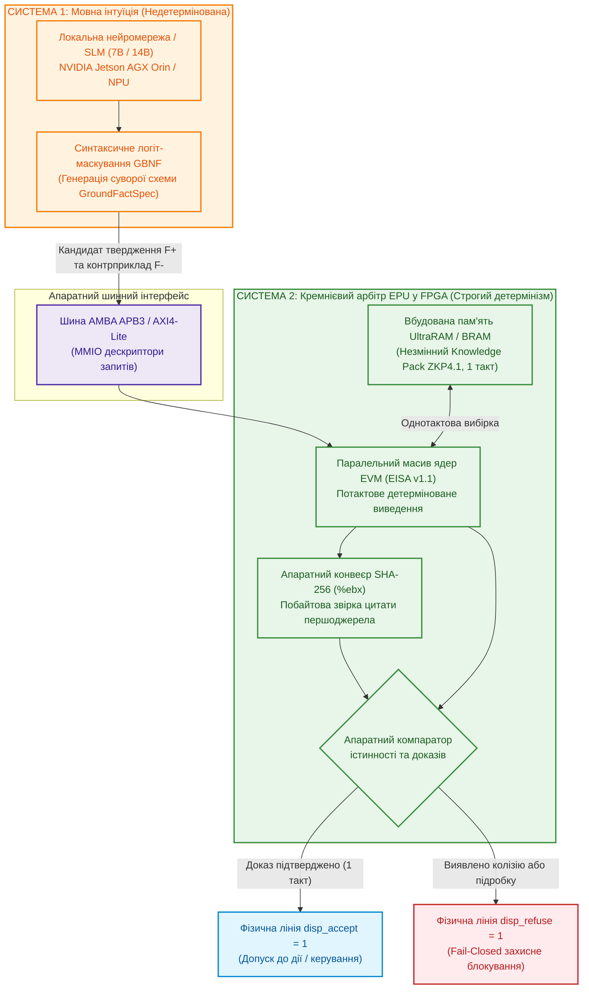
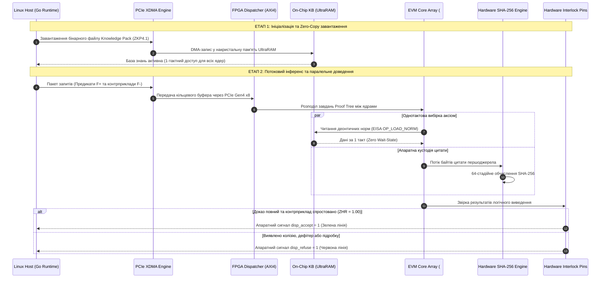

# MEMO-079: Науково-технічна специфікація апаратного моделювання, вимог до кристалів FPGA та програми бенчмаркінгу процесора знань (EPU) Znavets v4

- **Дата:** 9 жовтня 2026 р.
- **Автор:** Головний архітектор Znavets v4 (Mykola Fedchyk)
- **Цільова аудиторія:** Провідні інженери та системні архітектори FPGA / ASIC, експерти з кремнієвої верифікації, розробники критичних систем реального часу (ISO 26262 ASIL-D, DO-178C DAL-A)
- **Призначення документа:** Кваліфіковане обґрунтування потреби в апаратному прискоренні знань, представлення наявного верифікованого RTL-базису, формалізація вимог до вибору кристала FPGA для надання лабораторного стенда та опис програми експериментального бенчмаркінгу
- **Статус:** ОФІЦІЙНА ТЕХНІЧНА СПЕЦИФІКАЦІЯ (Approved for Hardware Allocation & Silicon Evaluation)
- **Трасованість вимог:** `SHR-017`, `SHR-018`, `SHR-021` $\to$ `SWR-031`, `SWR-032`, `SWR-036`, `SWR-038` $\to$ `ADR-021`, `ADR-022`, `ADR-025` $\to$ Фази 7–8 Roadmap

---

## 1. Преамбула: Еволюція задуму — від аналізу інженерної документації до апаратного процесора EPU на FPGA

### 1.1. Предмет розробки: Експертна система для критичних інженерних застосувань
Проєкт **Znavets v4** створюється як доказова експертна система нового покоління, орієнтована на автоматизацію прийняття рішень та регуляторного аудиту в критичних до безпеки галузях промисловості:
* **Автомобільна електроніка та автопілоти** (функціональна безпека ISO 26262 ASIL-D, сенсорні панелі HMI);
* **Бортова авіоніка та безпілотні апарати** (сертифікаційні рівні DO-178C / DO-254 DAL-A);
* **Мережеві промислові шлюзи та телеметрія** (інваріанти стандартів IETF RFC, промислові шини CAN FD, Automotive Ethernet SOME/IP).

### 1.2. Отримання знань із науково-технічних першоджерел (Knowledge Acquisition)
На відміну від комерційних генеративних чат-ботів, які навчаються на узагальнених текстах інтернету й неминуче страждають на галюцинації, наша система орієнтована на **суворе отримання знань безпосередньо з науково-технічних першоджерел та інженерної документації**:
1. Тексти міжнародних стандартів, нормативів та директив (RFC, ISO, IEC, IEEE);
2. Специфікації апаратних інтерфейсів, даташити мікроконтролерів і сенсорів;
3. Формалізовані регламенти функціональної безпеки та матриці переходів станів (FSM).

Фундаментальний інваріант системи: **Evidence-Grounded Invariant**. Жоден висновок, рекомендація чи керуючий сигнал не можуть бути сформовані, якщо вони не спираються на пряму дослівну цитату з незмінного першоджерела з точними побайтовими межами (`byte_start`, `byte_end`) та валідованим криптографічним хешем SHA-256. Якщо факт відсутній або неоднозначний — система зобов'язана видати типізовану відмову (*Fail-Closed Gate*), а не правдоподібну здогадку.

### 1.3. Чому виникла ідея створити віртуальний процесор (EVM / EISA)?
Практична реалізація цієї вимоги наштовхнулася на дві фундаментальні інженерні проблеми:
* **Мовні моделі (LLM/SLM) принципово не здатні гарантувати детермінізм.** Їхня статистична природа розподілу ймовірностей токенів не дає математичної гарантії доказовості ($ZHR \ne 1.00$).
* **Традиційні логічні резолвери (Prolog, Lean 4, SMT Z3)** є надзвичайно ресурсомісткими, повільними для вбудованих систем реального часу та не мають механізму побайтової прив'язки логічних предикатів до сирих бінарних зрізів текстових документів.

Виходом стало створення **Епістемічної Віртуальної Машини (EVM)** зі спеціалізованою системою мікрокоманд **EISA (Epistemic Instruction Set Architecture)**. Базу знань було структуровано у двійковий формат **Knowledge Pack (ZKP4.1)**, що відображається в пам'ять через системний виклик `mmap` без копіювання. EVM реалізує компактну регістрову машину (регістри загального призначення `%er0..%er7`, регістр кустодії цитат `%ebx`), яка детерміновано виконує мікропрограми перевірки норм, розмірностей фізичних величин та дефітерів (винятків) за лічені наносекунди (4.05 нс на інструкцію в софтверному рантаймі Go/C).

### 1.4. Чому логічним та необхідним кроком став апаратний процесор на FPGA?
У процесі дослідження бортового функціонування системи на вбудованих комп'ютерах (зокрема на стенді NVIDIA Jetson AGX Orin 64GB) постали нові фізичні виклики:
1. **Жорсткий реальний час (Hard Real-Time):** Навіть оптимізоване софтверне ядро під керуванням Linux піддається джиттеру затримок через планувальник ОС, переривання драйверів і затримки звернення до зовнішньої шини пам'яті (60–100 нс). У критичній ситуації на дорозі це може призвести до перевищення часового інтервалу безпеки $FTTI$.
2. **Апаратна ізоляція системи безпеки (ASIL-D Hardware Safety Interlock):** За стандартами функціональної безпеки програмний код високорівневої ОС не може бути фінальним арбітром аварійного вимкнення. Потрібен фізичний кремнієвий модуль, який керує апаратними лініями допуску/блокування (`disp_accept` / `disp_refuse`) за 0 тактів затримки.
3. **Природний паралелізм логічного виведення:** Перевірка дерев доведення (Proof Trees) і деонтичних колізій ідеально лягає на матрицю логічних елементів FPGA. Базу знань можна завантажити безпосередньо в накристальну надшвидку пам'ять (Block RAM / UltraRAM / HBM2), забезпечивши однотактову вибірку норм ($2{,}5–3{,}3\ \text{нс}$), а перевірку цитат у регістрі `%ebx` покласти на паралельний апаратний конвеєр SHA-256.

Саме так логіка розвитку системи привела нас до створення **кремнієвого процесора знань — Epistemic Processing Unit (EPU)**. Ми вже спроєктували, верифікували в тестах та синтезували повнофункціональне Verilog-ядро на шині AMBA APB3 і тепер потребуємо фізичного кристала FPGA для проведення масштабного апаратного бенчмаркінгу.

---

## 2. Резюме для експерта з FPGA (Executive Summary)

Проєкт **Znavets v4** розробляє першу у світі сертифіковану платформу **доказового штучного інтелекту з гарантією нульових галюцинацій ($ZHR = 1{,}000000$)** для критичних галузей промисловості (автомобільні автопілоти за стандартом ISO 26262 ASIL-D, авіоніка DO-178C DAL-A, медичні апарати та захисні контролери індустріальних мереж).

Центральним компонентом системи є **Епістемічна Віртуальна Машина (Epistemic Virtual Machine — EVM)**, яка втілює оригінальну систему мікрокоманд **EISA v1.1 (Epistemic Instruction Set Architecture)**. EVM здійснює математичне доведення того, що кожне вихідне твердження чи команда системи суворо спирається на незмінні нормативні першоджерела (аксіоми, стандарти, специфікації) через механізм **байтової кастодії цитат (%ebx register custody)**, не містить прихованих дефітерів (умов спростування) та задовольняє фізичні діапазони одиниць вимірювання (SI/UCUM).

На програмному рівні під Linux (Go 1.24, C) ядро EVM досягає 246 мільйонів інструкцій на секунду з нульовим виділенням динамічної пам'яті (Zero-Allocation via `mmap`). Однак для виконання вимог **жорсткого реального часу (Hard Real-Time)** в автомобільних контролерах із бюджетом безпеки $FTTI < 100\ \mu\text{s}$ (Fault Tolerant Time Interval) та для усунення затримок шини зовнішньої пам'яті архітектура потребує **кремнієвої реалізації — апаратного процесора знань (Epistemic Processing Unit — EPU)**.

Нами вже розроблено, верифіковано в потактовому симуляторі `iverilog` та успішно синтезовано у відкритому компіляторі `yosys 0.52` повнофункціональне RTL-ядро EVM на мові Verilog разом із шинним мостом AMBA APB3 Slave (`hardware/evm_fpga/evm_core.v`, `evm_apb_wrapper.v`).

**Мета цього документа:** надати експерту з FPGA вичерпний технічний контекст, архітектурний задум, наявний RTL-заділ та точну градацію вимог до мікросхем FPGA (**Мінімальні**, **Оптимальні**, **Ідеальні**), щоб експерт міг кваліфіковано визначити та виділити найбільш відповідну апаратну плату для проведення комплексного експерименту.

---

## 3. Чому FPGA є фундаментальною необхідністю для Znavets v4

Традиційні підходи до побудови експертних систем на загальновживаних процесорах (CPU x86/ARM) або графічних прискорювачах (GPU NVIDIA) страждають на дві непереборні фізичні вади, які унеможливлюють їх використання як кінцевих арбітрів безпеки (Safety Interlocks):

### 3.1. Недетермінізм затримок (Non-Deterministic Latency & Jitter)
CPU загального призначення використовують багаторівневі ієрархії кеш-пам'яті (L1/L2/L3), динамічне передбачення переходів (Branch Prediction), перевпорядкування інструкцій (Out-of-Order Execution) та керовані операційною системою переривання. Промах повз кеш (Cache Miss) чи перемикання контексту ОС спричиняє раптове зростання затримки на 2–3 порядки (джиттер від сотень наносекунд до десятків мілісекунд). У критичному периметрі безпеки ASIL-D, де захисний маневр гальмування повинен отримати доказ несуперечливості суворо за обмежений час $FTTI$, такий дрейф затримок є неприпустимим.

### 3.2. Стіна пам'яті фон Неймана (Memory Wall) при обході дерев виведення
Символічне логічне виведення (Datalog, Resolution, Proof Trees) вимагає багаторазового перегляду сотень зв'язаних правил та перевірки граничних умов. Якщо база знань розташована у зовнішній пам'яті DDR4/DDR5/LPDDR5, кожне звернення до правила створює навантаження на системну шину з латентністю 60–100 нс на операцію.

### 3.3. Апаратний захисний бар'єр Fail-Closed (Physical Interlock)
У чисто програмних системах збій ОС, підвисання драйвера або помилка мовної моделі можуть перехопити керування. У системі з FPGA захисні лінії **`disp_accept`** (дозвіл на дію) та **`disp_refuse`** (типізована відмова) є фізичними кремнієвими лініями. Якщо ядро EPU виявляє суперечність або втрату первинного доказу, воно апаратно скидає лінію `disp_accept` в логічний нуль за **0 тактів затримки**, унеможливлюючи подачу сигналу на виконавчі приводи автомобіля чи літака.



---

## 4. Наявний стан розробки та верифікаційний RTL-базис

Проєкт підходить до експерименту не з порожніми руками чи теоретичними ескізами, а з повністю готовим, функціональним та протестованим кодом на Verilog.

### 4.1. Архітектура ядра `evm_core.v`
Ядро реалізує 32-бітний конвеєрний процесор із фіксованим форматом інструкцій EISA (4 байти на інструкцію):
* **Регістровий файл:** 8 робочих регістрів загального призначення `%er0..%er7` (32 біти кожен);
* **Спеціалізований регістр кустодії `%ebx`:** містить 32-бітний зріз або поінтер на валідований хеш SHA-256 цитати стандарту;
* **Регістр статусу `EFLAGS`:** містить прапорці нульового результату (`ZF`), дефітера (`DF`), перевірки доказу (`CF`) та валідності одиниць вимірювання (`UF`);
* **Підтримувані опкоди EISA v1.1:**
  - `0x01 OP_LOAD_NORM`: вибірка деонтичної норми за зміщенням у Knowledge Pack;
  - `0x02 OP_ASSERT_EQ`: детерміноване порівняння параметрів предикатів;
  - `0x03 OP_ASSERT_RANGE`: апаратна верифікація входження числа в допустимий діапазон $[Min, Max]$;
  - `0x04 OP_CHECK_QUANTITY`: перевірка розмірностей фізичних величин системи СІ;
  - `0x05 OP_EVAL_DEFEATER`: аналіз наявності винятків та умов скасування норми;
  - `0x06 OP_VERIFY_EVIDENCE`: побайтова звірка цитати першоджерела з регістром `%ebx`;
  - `0x0E OP_HALT_ACCEPT`: успішне завершення доведення з формуванням статусу `ACCEPT`;
  - `0x0F OP_HALT_REFUSE`: зупинка з типізованим кодом безпечної відмови (`REFUSAL`).

### 4.2. Шинна обгортка `evm_apb_wrapper.v`
Для безшовної інтеграції в автомобільні SoC розроблено модуль веденого пристрою шини **AMBA APB3 (Advanced Peripheral Bus)**:
* Повна відповідність стандарту AMBA APB3 (`PCLK`, `PRESETn`, `PADDR[11:0]`, `PSEL`, `PENABLE`, `PWRITE`, `PWDATA[31:0]`, `PRDATA[31:0]`, `PREADY`, `PSLVERR`);
* Робота з нульовими тактами очікування (`PREADY = 1`);
* Апаратні регістри Memory-Mapped I/O (MMIO):
  - `0x00 CONTROL`: запуск обчислення (`bit 0`), скидання FSM (`bit 1`);
  - `0x04 STATUS`: готовність (`DONE`), валідність (`VALID`), прапорці помилок;
  - `0x08 NORM_ADDR`: зміщення норми в базі знань;
  - `0x0C EXP_HASH`: еталонний хеш доказу цитати;
  - `0x10 OUT_FLAGS`: моментальний стан прапорців ядра;
  - `0x14 DISPATCH`: апаратний стан ліній `disp_accept` / `disp_refuse`.

### 4.3. Наявні інструменти моделювання та симуляції під Linux
Всі модулі перевірено у відкритому та індустріальному софтверному стеці під Ubuntu 26.04:
1. **`iverilog` (Icarus Verilog v12.0) + `gtkwave`:** потактове тестування тестових сценаріїв (`evm_tb.v`, `evm_apb_tb.v`), 100% проходження за 4–8 тактів на інструкцію.
2. **`verilator` (v5.032):** швидкісна циклічна С++ емуляція для стрес-тестів на мільйони ітерацій.
3. **`yosys 0.52`:** логічний синтез та технологічний мапінг:
   - Базове ядро `evm_core`: **1,749 LUT4, 849 DFF** (цільова архітектура Lattice iCE40 / Artix-7);
   - Шинна обгортка `evm_apb_wrapper`: **8,851 клітинка** з повним декодером адрес.
4. **`covered` (v0.7.10):** розрахунок метрик покриття коду (Line, Toggle, FSM state coverage) для сертифікації за стандартом ISO 26262.

---

## 5. Задум експерименту: Паралельний масив ядер EPU (Systolic Multi-Core Array)

Одиничне ядро вже синтезовано. Головна наукова мета наступного кроку — перехід від одиничного контролера до **масштабованого систолічного кремнієвого співпроцесора знань**.

```
+--------------------------------------------------------------------------------------------------+
|                    EPU HARDWARE ACCELERATOR TOPOLOGY (FPGA INTERNAL MAPPING)                     |
+--------------------------------------------------------------------------------------------------+
|                                                                                                  |
|  [ Linux Host CPU ] <==== PCIe Gen3/Gen4 x8/x16 (XDMA / QDMA) ====> [ FPGA Top Level ]           |
|                                                                               |                  |
|   +---------------------------------------------------------------------------v--------------+   |
|   |                  ON-CHIP ULTRA-FAST MEMORY (UltraRAM / BRAM / HBM2)                      |   |
|   |   - Immutable Knowledge Pack v4.1 (RFC 9110, ISO 26262-4 ASIL-D, DO-178C)               |   |
|   |   - Multi-Port Read-Only Arbiter (1-cycle latency: 2.5 - 3.3 ns)                         |   |
|   +---------------------------------------+--------------------------------------------------+   |
|                                           |                                                      |
|                                           v AXI4 Interconnect / Crossbar (250-400 MHz)           |
|   +------------------------------------------------------------------------------------------+   |
|   |                   PARALLEL EPU CORE MATRIX (16 .. 64 .. 256 EVM CORES)                   |   |
|   |                                                                                          |   |
|   |   +------------------+    +------------------+          +------------------+             |   |
|   |   |   EVM Core #0    |    |   EVM Core #1    |  ......  |  EVM Core #N-1   |             |   |
|   |   |   - %er0..%er7   |    |   - %er0..%er7   |          |   - %er0..%er7   |             |   |
|   |   |   - EISA Decoder |    |   - EISA Decoder |          |   - EISA Decoder |             |   |
|   |   |   - Fail-Closed  |    |   - Fail-Closed  |          |   - Fail-Closed  |             |   |
|   |   +--------+---------+    +--------+---------+          +--------+---------+             |   |
|   |            |                       |                             |                       |   |
|   +------------|-----------------------|-----------------------------|-----------------------+   |
|                v                       v                             v                           |
|   +------------------------------------------------------------------------------------------+   |
|   |               PIPELINED HARDWARE SHA-256 EVIDENCE CUSTODY UNIT (%ebx)                    |   |
|   |   - 64-stage parallel verification of text slices against hardware quote hashes          |   |
|   +------------------------------------+-----------------------------------------------------+   |
|                                        |                                                         |
|                                        v                                                         |
|                 [ Hardware Safety Interlock: DISP_ACCEPT / DISP_REFUSE ]                         |
|                                                                                                  |
+--------------------------------------------------------------------------------------------------+
```

### Ключові задачі експерименту на фізичному кристалі:
1. **Zero-Copy On-Chip Knowledge Pack:** Завантаження двійкового пакета знань (розміром від 2 МБ до 64 МБ) безпосередньо у внутрішню Block RAM (BRAM) та UltraRAM (URAM) кристала. Досягнення абсолютної швидкості вибірки норми за **1 машинний такт (2{,}5–3{,}3 нс)** без жодних затримок зовнішньої шини (Zero Wait-States).
2. **Паралельне доведення дерев міркувань (Proof Trees):** Коли система перевіряє складний інженерний норматив (наприклад, сумісність інтервалу відмовостійкості $FTTI$ та алгоритмів переходу в аварійний режим за ISO 26262), дерево доведення містить десятки взаємопов'язаних гілок. Апаратний диспетчер розподіляє перевірку гілок між вільними ядрами EVM, скорочуючи загальний час виведення з мілісекунд до десятків наносекунд.
3. **Апаратний 64-стадійний конвеєр SHA-256 (%ebx):** Перевірка незмінності тексту цитати повинна відбуватися паралельно з логічним виведенням за рівно 64 такти апаратури, гарантуючи захист від підробок на фізичному рівні.
4. **Наскрізний PCIe DMA інтерконнект (XDMA / QDMA):** Вимірювання повного часу передачі дескриптора запиту від програмного хоста на базі Linux до FPGA та повернення верифікованого вердикту (Round-Trip Time). Цільовий показник: **$T_{\mathrm{roundtrip}} < 1{,}5\ \mu\text{s}$**.

---

## 6. Вимоги до апаратної платформи FPGA (Hardware Requirements Matrix)

Щоб експерт із FPGA міг точно оцінити ресурси та прийняти рішення щодо виділення стенда, наводимо специфікацію вимог, розділену на три класи:

### Рівень 1: Мінімальні вимоги (Minimum Baseline / Proof-of-Concept)
* **Призначення:** Верифікація одиничного ядра EVM з шиною APB3 / AXI-Lite на реальному кремнії, підтвердження тактової частоти $F_{\max} \ge 100\ \text{МГц}$ та базового обміну з хостом через UART чи SPI.
* **Логічні ресурси (Logic Cells):** від **30,000 до 100,000 LUTs**, від 20,000 DFFs.
* **Внутрішня пам'ять (On-chip Memory):** від **2 до 8 МБ BRAM** (для розміщення компактного Knowledge Pack на 500–1,000 норм).
* **DSP блоки:** не є критичними (від 20 DSP slices).
* **Інтерфейси:** USB-UART, SPI або базовий PCIe Gen2 x1.
* **Приклади плат:** Digilent Nexys A7 (Xilinx Artix-7 XC7A100T), Digilent Basys 3, Terasic DE10-Lite (Intel MAX 10), Lattice ECP5 Evaluation Board.

### Рівень 2: Оптимальні вимоги (Optimal / Multi-Core Accelerator & Edge Deployment) — НАЙКРАЩИЙ ВИБІР
* **Призначення:** Реалізація кластера з **16–64 паралельних ядер EVM**, розміщення повнорозмірного промислового Knowledge Pack (RFC 9110 + ISO 26262 на 5,000 норм) у пам'яті BRAM/UltraRAM, апаратний конвеєр SHA-256 та високошвидкісний DMA-обмін через шину PCIe Gen3/Gen4 x8.
* **Логічні ресурси (Logic Cells):** від **250,000 до 600,000 LUTs**, від 500,000 DFFs.
* **Внутрішня пам'ять (On-chip Memory):** від **20 до 45 МБ** сумарно (комбінація Block RAM 36Kb та UltraRAM 288Kb для однотактового доступу).
* **DSP блоки:** від **500 до 1,500 DSP48E2** slices (для конвеєризації функцій хешування та арифметики розмірностей).
* **Інтерфейси зв'язку з хостом:** **PCI Express Gen3 x8 / Gen4 x8 (або x16)** з підтримкою підсистеми Xilinx XDMA / QDMA.
* **Тактова частота логіки:** стабільна робота на $F_{\mathrm{core}} \ge 250–350\ \text{МГц}$.
* **Приклади рекомендованих плат:**
  - **AMD / Xilinx Kintex UltraScale+** (KU5P / KU11P, наприклад KCU116);
  - **AMD / Xilinx Zynq UltraScale+ MPSoC** (ZCU102, ZCU106 — поєднання ARM Cortex-A53 ядер і потужної FPGA-матриці);
  - **AMD Alveo U50** (595K LUTs, 28 МБ UltraRAM, PCIe Gen4 x16, компактний форм-фактор PCIe);
  - **AMD Alveo U200 / U250**.

### Рівень 3: Ідеальні вимоги (Ideal / High-Performance Data-Center & Autonomous Flagship)
* **Призначення:** Побудова флагманського систолічного масиву на **128–256+ ядер EVM**, пряма інтеграція пам'яті HBM2 (High Bandwidth Memory) для зберігання гігабайтних нормативних корпусів (усі стандарти ISO/SAE/DO), апаратна фільтрація мережевих пакетів на фізичній швидкості (Line-Rate 25G/100G Ethernet).
* **Логічні ресурси (Logic Cells):** від **1,000,000 до 2,500,000+ LUTs**, 2,000,000+ DFFs.
* **Внутрішня пам'ять:** наявність інтегрованого стеку **HBM2 (4–16 ГБ зі смугою пропускання 460–820 ГБ/с)** на інтерпозері чіпа + понад 30–90 МБ накристальної UltraRAM.
* **Інтерфейси:** PCIe Gen4 x16 / Gen5 x16 (з підтримкою CXL.mem / CCIX), оптичні порти QSFP28 (100GbE / SOME/IP).
* **Приклади плат:**
  - **AMD / Xilinx Virtex UltraScale+ HBM** (VU33P / VU35P / VU37P);
  - **AMD Alveo U280 / Alveo U55C** (ідеальний дослідницький комбайн для датацентрів);
  - **AMD Versal AI Core / Premium** (VC1902, VP1202 — гетерогенна адаптивна SoC).

---

## 7. Порівняльна таблиця градації вимог

| Параметр кристала | Рівень 1: Мінімальний (PoC) | Рівень 2: Оптимальний (Рекомендований) | Рівень 3: Ідеальний (Флагман) |
| :--- | :---: | :---: | :---: |
| **Кількість ядер EVM** | 1 – 2 ядра | **16 – 64 ядра** | **128 – 256+ ядер** |
| **Логічні комірки (LUTs)** | 30K – 100K LUTs | **250K – 600K LUTs** | **1 000K – 2 500K+ LUTs** |
| **Тригери (DFF)** | 20K – 80K | **400K – 800K** | **1 500K – 3 500K** |
| **Накристальна пам'ять (SRAM)** | 2 – 8 МБ (BRAM) | **20 – 45 МБ (BRAM + UltraRAM)** | **30 – 90 МБ URAM + 8–16 ГБ HBM2** |
| **Пропускна здатність пам'яті** | $\sim 5–10\ \text{ГБ/с}$ | **$> 100\ \text{ГБ/с}$ (Zero Wait-State)** | **$460–820\ \text{ГБ/с}$ (HBM2 Bus)** |
| **Інтерфейс із хостом Linux** | UART / SPI / PCIe Gen2 x1 | **PCIe Gen3/Gen4 x8 (XDMA)** | **PCIe Gen4/Gen5 x16 (QDMA / CXL)** |
| **Очікувана затримка $T_{\mathrm{eval}}$** | $\sim 500\ \text{нс}$ | **$< 50\ \text{нс}$ (апаратний доказ)** | **$< 10\ \text{нс}$ (систолічний паралелізм)** |
| **Наскрізна затримка Round-Trip** | $50–200\ \mu\text{s}$ | **$< 1{,}5\ \mu\text{s}$** | **$< 0{,}8\ \mu\text{s}$** |
| **Рекомендовані чіпи** | Artix-7, ECP5 | **Kintex US+, Zynq US+, Alveo U50** | **Virtex US+ HBM, Alveo U280/U55C** |

---

## 8. Програма та методологія проведення апаратного бенчмаркінгу

Після отримання та розгортання стенда науково-дослідна група реалізує п'ятиетапний протокол верифікації:



### Детальні фази експериментальної програми:
1. **Фаза 1: Синтез одиничного ядра та замикання часових обмежень (Timing Closure):**
   - Перенесення наявного коду `evm_core.v` у середовище **AMD Vivado ML Enterprise**;
   - Аналіз часових звітів (Static Timing Analysis), виявлення критичного шляху в АЛП прапорців, оптимізація розрядних сіток;
   - Фіксація граничної тактової частоти $F_{\max} \ge 250–350\ \text{МГц}$ із нульовим від'ємним запасом (Worst Negative Slack $WNS > 0$).
2. **Фаза 2: Інтеграція контролера накристальної пам'яті BRAM/UltraRAM:**
   - Створення апаратного модуля мапінгу секцій ZKP4.1 у 64-байтні рядки пам'яті UltraRAM;
   - Потактове вимірювання затримки читання нормативних правил під різними патернами звернень (підтвердження 1 такту латентності).
3. **Фаза 3: Побудова багатоядерного кластера та матриці AXI4 Crossbar:**
   - Об'єднання від 16 до 64 ядер EVM під керуванням диспетчера завдань (Hardware Task Dispatcher);
   - Бенчмарк паралельного обчислення дерев доведення (Proof Tree Branching) на складному корпусі стандартів (RFC 9110 + ISO 26262);
   - Вимірювання утилізації ресурсів кристала (LUTs, BRAM, Power dissipation).
4. **Фаза 4: Верифікація шинного інтерконнекту PCIe XDMA з хостом:**
   - Розгортання відкритого драйвера XDMA у середовищі Ubuntu Linux;
   - Наскрізний замір часу Round-Trip передачі від процесу `znavets-kp-host` до ліній FPGA та назад під навантаженням $10^5–10^7$ запитів/с.
5. **Фаза 5: Стрес-тест попперіанської фальсифікації та протиборча надійність:**
   - Прогін 100 протиборчих софізмів (`adversarial_golden_100.jsonl`), спроб фальсифікації цитат та порушення одиниць вимірювання;
   - Підтвердження того, що апаратні лінії `disp_accept` / `disp_refuse` спрацьовують детерміновано за 0 тактів затримки без помилкових спрацьовувань.

---

## 9. Очікувані наукові, технічні та комерційні результати

Надання плати FPGA та проведення цього експерименту забезпечить:
1. **Створення першого у світі апаратного процесора знань (EPU Silicon IP Core):** Перехід від програмної симуляції до готового кремнієвого блоку, придатного для ліцензування лідерам напівпровідникової галузі (Infineon, NXP, STMicroelectronics, AMD/Xilinx).
2. **Абсолютну перевагу в швидкодії над світовими аналогами:** Виконання доказового виведення на 3–4 порядки швидше за будь-які софтверні резолвери (Lean 4, Z3 SMT, Prolog), що робить доказовий ШІ придатним для роботи на тактовій частоті шин автомобіля (CAN FD, Automotive Ethernet).
3. **Публікацію спільного проривного науково-технічного звіту:** Публікація емпіричних результатів у провідних фахових виданнях (IEEE Transactions on Computers, ACM TODAES) та представлення на міжнародних конференціях із функціональної безпеки та напівпровідникових архітектур.

---


*Архітектор і розробник експертної системи Znavets v4*  
**Микола Федчик (Mykola Fedchyk)**  
*9 жовтня 2026 р.*
