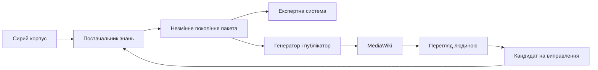

# Memo-001. MediaWiki для перегляду пакетів знань на Ubuntu 26.04

- **Ідентифікатор:** Memo-001
- **Тип документа:** технічний меморандум (інженерний memorandum)
- **Дата:** 2026-10-03
- **Статус:** запропоноване інженерне рішення та процедура пілотного впровадження; не звіт про розгорнутий сервер
- **Адресати:** адміністратор Ubuntu та розробник постачальника знань

**Мета меморандуму:** зафіксувати вибір MediaWiki, процедуру встановлення й налаштування, обов'язки Go-компонентів інтеграції та критерії приймання читабельного подання пакетів знань. Документ є окремим інженерним меморандумом, не главою книги.

## Рішення й межа відповідальності

Після обробки сирого корпусу людина має читати отримані твердження, умови, джерела й прогалини, а не розбирати серіалізацію JSON (*JavaScript Object Notation*). Для першого пілоту обираємо MediaWiki: постачальник знань (*Knowledge Provider*) створює версійований пакет знань (*Knowledge Pack*), а окремий компонент публікації будує з пакета читабельні сторінки.

MediaWiki є безкоштовним відкритим програмним забезпеченням під GNU General Public License, версія 2 або пізніша. Ліцензія програми не робить вміст приватної вікі відкритим автоматично [[1]](#src-1). Wikibase, графовий сервер і мовна модель не є передумовами цього пілоту.



Вікі є похідним поданням. Публікатор не повторює вилучення із сирого корпусу, не змінює модальності й статусів та не оголошує кандидата схваленим знанням. Експертна система й сторінка мають посилатися на те саме покоління пакета. Правки й зауваження людини проходять окрему процедуру допуску.

## Версії й передумови

Під «Ubuntu 26» у цьому memo розуміємо **Ubuntu Server 26.04 LTS** (*Long-Term Support*, тривала підтримка), 64-бітну операційну систему (ОС). PHP (*PHP: Hypertext Preprocessor*) є середовищем виконання коду MediaWiki. Офіційний пакет `php` для Ubuntu 26.04 залежить від PHP 8.5 [[2]](#src-2). На дату memo стабільний випуск MediaWiki є 1.46.2 [[3]](#src-3), а гілка 1.46 підтримує PHP від 8.3.0 до 8.5.x [[4]](#src-4).

| Компонент | Обраний профіль | Що перевірити на сервері |
|---|---|---|
| Ubuntu | 26.04 LTS, окремий сервер або віртуальна машина | випуск ОС, доступ адміністратора й резервне копіювання |
| MediaWiki | 1.46.2 або новіший перевірений випуск безпеки гілки 1.46 | підпис архіву, актуальність гілки та сумісність розширень |
| PHP | 8.5 зі штатного репозиторію Ubuntu | версію та модулі для командного рядка й Apache |
| Apache | сервер вебсторінок із локальним початковим доступом | конфігурацію, обмеження мережі й журнал помилок |
| MariaDB | штатний підтримуваний пакет Ubuntu | версію, локальне з'єднання й права окремого користувача |
| Go | підтримувана версія, узгоджена з програмою постачальника | тести генератора й клієнта без доступу до робочих секретів |

Перед інсталяцією потрібні узгоджене ім'я сервера, наприклад `wiki.example.org`, правила доступу й сертифікат захищеного з'єднання. Ім'я сервера має розпізнаватися в погодженій мережі через службу доменних імен DNS (*Domain Name System*) та відповідати сертифікату. Наведені команди призначені для нового виділеного Ubuntu-сервера, не для сервера з уже налаштованими сайтами. Команди з `sudo` виконує адміністратор; паролі вводять безпосередньо на сервері, не в чаті й не в репозиторії.

## План приймання

Інсталяція вважається придатною для пілоту лише після таких перевірок: анонімний користувач не читає вікі; читач не змінює згенерованих сторінок; публікатор створює сторінки через програмний інтерфейс API (*Application Programming Interface*); сторінки відтворюють статус, область і джерело; повторна публікація не створює зайвих ревізій; покажчик поточного покоління не змінюється після неповної публікації; відкликане джерело не залишається доступним через стару сторінку, історію чи кеш.

Ці перевірки відрізняють технічну доступність вебсервера від придатності вікі до перегляду знань. Далі наведено установлення, конфігурацію, компоненти Go та сценарій роботи читача.

## 1. Установлення на Ubuntu

### 1.1. Пакети й початковий доступ

Для пілоту достатньо Apache, MariaDB та PHP з потрібними модулями [[5]](#src-5). Перед установленням мережевий екран сервера або майданчика має дозволяти лише погоджене адміністративне з'єднання. Не відкривайте нову вікі в інтернет до налаштування доступу. Початковий вебінсталятор працюватиме лише через локальний порт і тунель захищеної оболонки SSH (*Secure Shell*).

<details>
<summary>Команди на новому Ubuntu-сервері</summary>

```bash
cat /etc/os-release
sudo apt update
sudo apt install apache2 mariadb-server php libapache2-mod-php php-cli \
    php-intl php-mbstring php-apcu php-curl php-mysql php-xml php-gmp \
    curl ca-certificates gnupg tar
sudo systemctl stop apache2
php --version
php -m
mariadb --version
```

</details>

Перевірте модулі `intl`, `mbstring`, `mysqli`, `dom`, `xml`, `xmlreader`, `fileinfo`, `json`, `openssl` і `sodium`. Наявність модуля в командному рядку не підтверджує його наявності в Apache: остаточну перевірку виконає вебінсталятор. Якщо репозиторій видав іншу основну версію PHP, спочатку звірте матрицю сумісності, не додавайте сторонній репозиторій PHP автоматично.

### 1.2. База даних

Створіть окрему базу `knowledgewiki` та локального користувача `knowledgewiki`. Початкові права на цю базу потрібні для створення схеми; глобальних адміністративних прав користувачу вікі не надають. Команди SQL (*Structured Query Language*, мова запитів реляційної бази даних) виконують у локальній сесії MariaDB. Пароль створює адміністратор у менеджері секретів і вводить лише на сервері. Наведене значення є маркером заміни, не придатним паролем.

<details>
<summary>Створення бази; пароль вводять лише на сервері</summary>

```bash
sudo systemctl enable --now mariadb
sudo env MYSQL_HISTFILE=/dev/null mariadb
```

У сесії MariaDB:

```sql
CREATE DATABASE knowledgewiki CHARACTER SET utf8mb4 COLLATE utf8mb4_unicode_ci;
CREATE USER 'knowledgewiki'@'localhost' IDENTIFIED BY 'REPLACE_WITH_A_SECRET';
GRANT ALL PRIVILEGES ON knowledgewiki.* TO 'knowledgewiki'@'localhost';
EXIT;
```

</details>

Вебінсталятор отримує цього користувача, не обліковий запис адміністратора MariaDB. Наведений запуск вимикає файлову історію клієнта, але не гарантує відсутності секрету в записі термінала або адміністративних журналах сервера. Використовуйте погоджену процедуру введення секретів. База даних не повинна слухати доступний ззовні порт.

### 1.3. Архів MediaWiki

Завантажте фіксований випуск із офіційного сервера. Перевірка лише наявності файла недостатня: потрібна перевірка підпису за довіреним відкритим ключем видавця. Посилання на підписи й відкриті ключі наведено на офіційній сторінці завантаження [[3]](#src-3). Повний відбиток ключа має бути попередньо звірений із погодженим джерелом; випадковий ключ із пошуку не є підставою довіри.

<details>
<summary>Завантаження, перевірка підпису й розміщення коду</summary>

```bash
workdir=$(mktemp -d)
cd "$workdir"
curl --fail --location --proto '=https' --tlsv1.2 \
    -O https://releases.wikimedia.org/mediawiki/1.46/mediawiki-1.46.2.tar.gz
curl --fail --location --proto '=https' --tlsv1.2 \
    -O https://releases.wikimedia.org/mediawiki/1.46/mediawiki-1.46.2.tar.gz.sig
gpg --import "$HOME/mediawiki-release-signing-key.asc"
gpg --fingerprint
gpg --verify mediawiki-1.46.2.tar.gz.sig mediawiki-1.46.2.tar.gz
```

Лише після успішної перевірки правильним ключем:

```bash
sudo install -d -m 0755 /var/www/mediawiki
sudo tar -xzf mediawiki-1.46.2.tar.gz --strip-components=1 -C /var/www/mediawiki
sudo chown -R root:root /var/www/mediawiki
sudo find /var/www/mediawiki -type d -exec chmod 0755 {} +
sudo find /var/www/mediawiki -type f -exec chmod 0644 {} +
sudo install -d -o www-data -g www-data -m 0750 /var/cache/knowledgewiki
```

</details>

Файл відкритого ключа в домашньому каталозі має надати адміністратор після перевірки відбитка. Зупиніться за помилки підпису. Apache має читати код, але не змінювати PHP-файли; запис дозволяють лише в явно визначені каталоги кешу [[6]](#src-6). Не виконуйте рекурсивний `chown www-data` для всього вебкаталогу.

### 1.4. Локальний вебінсталятор

На новому виділеному сервері задайте в `/etc/apache2/ports.conf` лише `Listen 127.0.0.1:8080`. У `/etc/apache2/sites-available/knowledgewiki-local.conf` розмістіть наведений віртуальний хост. Це початковий профіль, не остаточна конфігурація мережевого доступу.

<details>
<summary>Apache: інсталятор доступний лише локально</summary>

```apache
<VirtualHost 127.0.0.1:8080>
    ServerName localhost
    DocumentRoot /var/www/mediawiki
    <Directory /var/www/mediawiki>
        Options -Indexes
        AllowOverride None
        Require local
    </Directory>
    <Directory /var/www/mediawiki/images>
        Require all denied
    </Directory>
    <FilesMatch "(?i)^(LocalSettings\.php.*|.*\.(bak|old|orig|swp|sql|sql\.gz)|\..*)$">
        Require all denied
    </FilesMatch>
    ErrorLog ${APACHE_LOG_DIR}/knowledgewiki-error.log
    CustomLog ${APACHE_LOG_DIR}/knowledgewiki-access.log combined
</VirtualHost>
```

```bash
sudo a2dissite 000-default
sudo a2ensite knowledgewiki-local
sudo apache2ctl configtest
sudo systemctl enable --now apache2
```

На робочому комп'ютері адміністратора, не на вебсервері:

```bash
ssh -N -L 8080:127.0.0.1:8080 admin@SERVER_ADDRESS
```

</details>

Якщо локальний порт 8080 зайнятий, оберіть інший локальний порт тунелю й використайте відповідну адресу браузера. Протокол HTTP (*Hypertext Transfer Protocol*) цього початкового кроку передає локальні вебзапити всередині захищеного SSH-тунелю. Відкрийте `http://localhost:8080/mw-config/`, виберіть українську мову вмісту, базу `knowledgewiki`, сервер бази `localhost`, створеного користувача та окремий обліковий запис адміністратора вікі. Не вводьте робочі секрети через незахищену зовнішню HTTP-адресу.

Інсталятор сформує `LocalSettings.php`. Адміністратор передає файл на сервер захищеним каналом і встановлює права `root:www-data`, режим `0640`; секрети в цьому файлі не потрапляють у Git. Сам вебпроцес не повинен мати права змінювати файл. Початкову вікі ще не відкривають іншим користувачам.

Після створення схеми в локальній адміністративній сесії зменште права користувача вікі до звичайної роботи. Перед майбутньою міграцією схеми потрібний окремий адміністративний доступ або тимчасове надання потрібних прав на цю базу; після міграції права знову звужують.

<details>
<summary>Права користувача вікі після інсталяції</summary>

```sql
REVOKE ALL PRIVILEGES ON knowledgewiki.* FROM 'knowledgewiki'@'localhost';
GRANT SELECT, INSERT, UPDATE, DELETE ON knowledgewiki.* TO 'knowledgewiki'@'localhost';
```

</details>

Перевірте читання, редагування та чергу завдань після звуження прав. Якщо розширення вимагає додаткових операцій із базою, оцініть конкретну потребу, не повертайте глобальні адміністративні права.

### 1.5. Захищений доступ для читачів

Перед мережевим доступом потрібні сертифікат TLS (*Transport Layer Security*) для `wiki.example.org` і довіра до видавця сертифіката у браузерах та Go-клієнті. HTTP поверх TLS називаємо HTTPS. Для внутрішнього сервера використайте корпоративного видавця сертифікатів або погоджену процедуру отримання публічного сертифіката. Приватний ключ зберігайте з правами `0600`; у memo немає універсального способу видачі сертифіката для кожного майданчика.

У `/etc/apache2/ports.conf` додайте `Listen 443`, створіть `/etc/apache2/sites-available/knowledgewiki-tls.conf`. Приклад дозволяє мережу `10.20.0.0/16`; адміністратор має замінити цю мережу на погоджені адреси читачів і публікатора. **Перед увімкненням TLS-сайту застосуйте приватний профіль розділу 2.1 до `LocalSettings.php` і перевірте його через `php -l`.** До цього мережевий доступ лишається закритим. Самої наявності сертифіката недостатньо для авторизації.

<details>
<summary>Apache: TLS, мережеве обмеження й закритий інсталятор</summary>

```apache
<VirtualHost *:443>
    ServerName wiki.example.org
    DocumentRoot /var/www/mediawiki
    SSLEngine on
    SSLCertificateFile /etc/ssl/certs/knowledgewiki-fullchain.pem
    SSLCertificateKeyFile /etc/ssl/private/knowledgewiki.key
    SSLProtocol -all +TLSv1.2 +TLSv1.3
    <Directory /var/www/mediawiki>
        Options -Indexes
        AllowOverride None
        Require ip 127.0.0.1 ::1 10.20.0.0/16
    </Directory>
    <Directory /var/www/mediawiki/mw-config>
        Require all denied
    </Directory>
    <Directory /var/www/mediawiki/images>
        Require all denied
    </Directory>
    <FilesMatch "(?i)^(LocalSettings\.php.*|.*\.(bak|old|orig|swp|sql|sql\.gz)|\..*)$">
        Require all denied
    </FilesMatch>
    ErrorLog ${APACHE_LOG_DIR}/knowledgewiki-error.log
    CustomLog ${APACHE_LOG_DIR}/knowledgewiki-access.log combined
</VirtualHost>
```

```bash
sudo a2enmod ssl
sudo a2ensite knowledgewiki-tls
sudo apache2ctl configtest
sudo systemctl reload apache2
```

</details>

Після налаштування приватності нижче вимкніть початковий сайт: `sudo a2dissite knowledgewiki-local`, повторіть `apache2ctl configtest` і перезавантажте конфігурацію Apache. Приберіть також початковий `Listen 127.0.0.1:8080`. Мережевий екран допускає порт 443 лише з узгоджених адрес. Не відкривайте порт бази даних і не вимикайте перевірку сертифіката через `curl -k` або `InsecureSkipVerify` у Go.

## 2. Налаштування приватності й ролей

### 2.1. Одна вікі для однієї довіреної групи

MediaWiki не призначена для надійних окремих дозволів читання кожної сторінки [[7]](#src-7). У цьому пілоті всі схвалені читачі бачать однаковий дозволений корпус. Для різних клієнтів або несумісних рівнів конфіденційності потрібні окремі інсталяції й окремі профілі експорту, а не лише різні простори назв. Контроль редагування простору назв не є контролем читання [[8]](#src-8).

До кінця сформованого інсталятором `LocalSettings.php`, без другого відкривального тегу PHP, додайте конфігурацію. Читач має лише перегляд; рецензент редагує зауваження; публікатор має спеціальне право змінювати простір `Generated`. Назви груп нижче є проєктним профілем цього memo.

<details>
<summary>Фрагмент LocalSettings.php для приватної вікі</summary>

```php
$wgServer = 'https://wiki.example.org';
$wgScriptPath = '';
$wgLanguageCode = 'uk';
$wgCookieSecure = true;
$wgEnableUploads = false;
$wgEnableEmail = false;
$wgUseSiteJs = false;
$wgUseSiteCss = false;
$wgAllowUserJs = false;
$wgCacheDirectory = '/var/cache/knowledgewiki';
$wgJobRunRate = 0;
$wgEnableBotPasswords = true;

$wgGroupPermissions['*']['read'] = false;
$wgGroupPermissions['*']['edit'] = false;
$wgGroupPermissions['*']['createaccount'] = false;
$wgGroupPermissions['*']['createpage'] = false;
$wgGroupPermissions['*']['createtalk'] = false;
$wgGroupPermissions['user']['read'] = true;
$wgGroupPermissions['user']['edit'] = false;
$wgGroupPermissions['user']['createpage'] = false;
$wgGroupPermissions['user']['createtalk'] = false;
$wgWhitelistRead = [ 'Special:UserLogin' ];

define('NS_GENERATED', 3000);
define('NS_GENERATED_TALK', 3001);
$wgExtraNamespaces[NS_GENERATED] = 'Generated';
$wgExtraNamespaces[NS_GENERATED_TALK] = 'Generated_talk';
$wgNamespacesWithSubpages[NS_GENERATED] = true;
$wgNamespacesToBeSearchedDefault[NS_GENERATED] = true;
$wgAvailableRights[] = 'edit-generated';
$wgNamespaceProtection[NS_GENERATED] = [ 'edit-generated' ];

$wgGroupPermissions['knowledge-publisher']['read'] = true;
$wgGroupPermissions['knowledge-publisher']['edit'] = true;
$wgGroupPermissions['knowledge-publisher']['createpage'] = true;
$wgGroupPermissions['knowledge-publisher']['writeapi'] = true;
$wgGroupPermissions['knowledge-publisher']['edit-generated'] = true;
$wgGroupPermissions['knowledge-reviewer']['edit'] = true;
$wgGroupPermissions['knowledge-reviewer']['createpage'] = true;
$wgGroupPermissions['knowledge-reviewer']['createtalk'] = true;
$wgGroupPermissions['sysop']['edit'] = true;
$wgGroupPermissions['sysop']['createpage'] = true;
$wgGroupPermissions['sysop']['edit-generated'] = true;
$wgGrantPermissions['editpage']['edit-generated'] = true;
```

</details>

Це мінімальний профіль, не доведення відсутності витоків. Адміністратор звіряє номери просторів назв, ефективні права інших груп і встановлені розширення. На першому пілоті не додавайте рецензенту групу адміністратора або публікатора. Клієнт публікації додатково відхиляє назви сторінок поза `Generated:`; наведені права самі не обмежують публікатора лише цим простором.

Завантаження файлів вимкнене, а каталог `images` закритий Apache, бо звичайні завантажені файли можуть бути доступні напряму, незалежно від права читання вікі [[7]](#src-7). Джерела залишаються в захищеному сховищі документів; вікі посилається на контрольований переглядач джерела, який повторно перевіряє доступ. Не розміщуйте сирі пакети, дампи бази, конфігурацію чи резервні копії у вебкаталозі.

### 2.2. Обліковий запис публікатора

Адміністратор створює звичайний службовий обліковий запис `KnowledgePublisher` через сторінку створення облікових записів і на `Special:UserRights` додає лише групу `knowledge-publisher`. Власник службового облікового запису відкриває `Special:BotPasswords` і створює пароль застосунку для публікатора [[9]](#src-9). Ім'я входу має вигляд `KnowledgePublisher@PackPublisher`; точне ім'я й пароль повертає сама вікі.

Виберіть дозволи на базовий доступ, редагування існуючих сторінок і створення сторінок. Не дозволяйте видалення, керування користувачами чи зміну захисту. Для нового права `edit-generated` потрібні **і група, і дозвіл застосунку**; додавання права до `editpage` у конфігурації вище зберігає його в сесії пароля застосунку [[10]](#src-10). Перевірте склад дозволів на `Special:ListGrants` і фактичну публікацію тестової сторінки. Для виробничої інтеграції окремо оцініть протокол делегованої авторизації OAuth замість пароля застосунку.

Секрет публікатора зберігається в погодженому сховищі секретів або захищеному файлі служби, не в пакеті знань і не в аргументах процесу. Пароль застосунку дозволяє доступ через API, не звичайний вхід у браузері. Читач і адміністратор використовують власні облікові записи.

### 2.3. Розширення MediaWiki

Для першого пілоту достатньо стандартного оформлення Vector, категорій, посилань, історії та пошуку. Не встановлюйте Wikibase, Semantic MediaWiki, VisualEditor чи сторонні розширення доступу лише заради публікації сторінок. За потреби підсвічування коду можна оцінити комплектне розширення SyntaxHighlight; для складного пошуку окремо оцінюють CirrusSearch та його пошуковий сервер. Це наступні рішення з власними залежностями, не обов'язкова частина інсталяції.

Розширення мають відповідати гілці MediaWiki; довільний `master` не є фіксованою версією [[4]](#src-4). Після додавання розширення повторюють негативні перевірки доступу, зокрема для API, історії, експорту й пошуку.

## 3. Черга завдань, резервування й оновлення

Масова публікація створює фонові завдання оновлення зв'язків і категорій. Оскільки `$wgJobRunRate = 0`, чергу потрібно обробляти окремо. Спочатку перевірте обмежений прогін офіційного скрипту [[11]](#src-11).

<details>
<summary>Перевірка конфігурації й обмежений прогін черги</summary>

```bash
sudo php -l /var/www/mediawiki/LocalSettings.php
sudo -u www-data php /var/www/mediawiki/maintenance/run.php runJobs \
    --maxjobs 100 --maxtime 50 --memory-limit 256M
```

</details>

Для регулярного виконання створіть службу `/etc/systemd/system/knowledgewiki-jobs.service` і таймер `/etc/systemd/system/knowledgewiki-jobs.timer`. Ліміти нижче є початковим профілем пілоту; їх змінюють після вимірювання черги. Таймер не замінює моніторингу невдалих завдань.

<details>
<summary>Служба та таймер systemd</summary>

```ini
[Unit]
Description=Knowledge wiki bounded job runner
After=mariadb.service

[Service]
Type=oneshot
User=www-data
Group=www-data
WorkingDirectory=/var/www/mediawiki
ExecStart=/usr/bin/php maintenance/run.php runJobs --maxjobs 100 --maxtime 50 --memory-limit 256M
TimeoutStartSec=90
NoNewPrivileges=true
```

```ini
[Unit]
Description=Run knowledge wiki jobs periodically

[Timer]
OnBootSec=1min
OnUnitActiveSec=1min
Unit=knowledgewiki-jobs.service

[Install]
WantedBy=timers.target
```

```bash
sudo systemctl daemon-reload
sudo systemctl enable --now knowledgewiki-jobs.timer
sudo systemctl list-timers knowledgewiki-jobs.timer
sudo journalctl -u knowledgewiki-jobs.service --no-pager -n 50
```

</details>

Резервуйте базу даних, `LocalSettings.php`, перелік версій розширень і журнал відповідності пакета сторінкам. Для нового пілоту без завантажень це основні відновлювані артефакти. Зберігайте копії поза вебкаталогом, із шифруванням і окремими правами; перевірте відновлення на ізольованій вікі. Копія лише PHP-коду не відновить знань і правок.

Оновлення спочатку проходить тестову інсталяцію та резервування. Новий код MediaWiki розміщують окремо, переносять контрольовану конфігурацію, запускають `php maintenance/run.php update` за офіційною процедурою оновлення й повторюють перевірки. Зміна схеми бази може унеможливити простий відкат тільки PHP-файлів. Не запускайте міграцію без плану відновлення бази.

## 4. Компоненти Go в постачальниках знань

### 4.1. Межі програмних пакетів

Кожен постачальник має видавати узгоджений пакет, але не мусить сам знати правила MediaWiki. Адаптер публікації можна спочатку вбудувати в програму постачальника; спільні обов'язки лишаються окремими Go-пакетами. Назви в таблиці є **пропозицією структури**, не повідомленням про наявні модулі вашого програмного забезпечення.

| Пропонований пакет | Обов'язок | Що пакет не робить |
|---|---|---|
| `packreader` | використати чинний читач, перевірити маніфест, формат, цілісність і підстави довіри | не оголосити пакет схваленим лише за правильним хешем |
| `publicationpolicy` | відфільтрувати дозволені поля, джерела й статуси для конкретної вікі | не знизити мітку доступу автоматично |
| `readmodel` | побудувати сторінки пакета, тверджень, понять і джерел | не повторити вилучення з сирого документа |
| `wikirender` | детерміновано сформувати вікірозмітку з типізованих даних | не виконувати розмітку з цитованого тексту |
| `mediawikiclient` | сесія, вхід, токени, читання ревізій, створення й перевірка сторінок | не писати напряму в MariaDB |
| `publicationjournal` | зберегти стан доставки, хеші сторінок і ідентифікатори ревізій | не використовувати журнал як незалежне джерело знань |
| `publicationworkflow` | повна публікація покоління, перевірка, перемикання й відкликання | не перемикати поточне покоління після часткового успіху |

Власний формат пакета підключають через вже наявний читач. Не розробляйте нову канонізацію чи криптографічний формат спеціально для вікі. У профілі експорту фіксують версію схеми, генератора й політики доступу; зміна цих версій створює інше подання навіть для того самого пакета.

### 4.2. Бібліотеки Go

Перший клієнт може використовувати лише стандартну бібліотеку Go [[12]](#src-12). Спеціальна стороння бібліотека MediaWiki не є обов'язковою: потрібні кілька типізованих операцій Action API, а не весь набір можливостей вікі.

| Пакет або модуль | Для чого використати |
|---|---|
| `net/http`, `net/http/cookiejar` | клієнт із тайм-аутом і збереженням сесійних cookie |
| `net/url` | кодування параметрів форми й перевірка адреси сервера |
| `encoding/json` | відповіді API й машинний журнал доставки |
| `context`, `time` | скасування, терміни виконання й обмежений повтор |
| `crypto/sha256`, `encoding/hex` | хеш згенерованого вмісту й безпечні стабільні назви сторінок |
| `html`, `strings`, `fmt` | екранування й шаблонне подання; екранування HTML (*HyperText Markup Language*, мова веброзмітки) саме по собі не екранує всю вікірозмітку |
| `log/slog` | журнал результатів без паролів, cookie, токенів і тексту закритих джерел |
| `testing`, `net/http/httptest` | тести генератора й підставного сервера API |
| `golang.org/x/time/rate` | за потреби обмежити частоту запитів через `Limiter.Wait(ctx)` [[13]](#src-13) |

Для зовнішнього модуля фіксують сумісну версію в `go.mod` і `go.sum`, перевіряють ліцензію й мінімальну версію Go. Пілот не потребує окремого SQL-драйвера або брокера повідомлень, якщо програма постачальника вже має стійку чергу й журнал. Не додавайте універсальний повтор усіх POST-запитів: після втрати відповіді запис сторінки міг уже відбутися.

### 4.3. Мінімальний перевірюваний генератор

Генератор має зберегти зміст і не дозволити цитаті вставити шаблон, категорію або посилання. Приклад нижче обгортає динамічні поля в `nowiki` й екранує символи, які могли б закрити цей елемент. Назва сторінки залежить від покоління, профілю подання й ідентифікатора твердження, не від довільного заголовка документа.

Це **частковий приклад генератора**, не готовий клієнт публікації та не реалізація читача вашого пакета. Тест розміщують поряд із програмним пакетом і виконують `go test -v render.go render_test.go`.

<details>
<summary>Go: формування читабельної сторінки та тести</summary>

Програмний пакет `render.go`:

```go
package wikirender

import (
    "crypto/sha256"
    "encoding/hex"
    "fmt"
    "html"
    "strings"
)

type Statement struct {
    ID, Generation, Profile string
    Text, Scope, Modality   string
    SourceID, SourceSpan    string
    Status                 string
}

func digest(value string) string {
    sum := sha256.Sum256([]byte(value))
    return hex.EncodeToString(sum[:])
}

func literal(value string) string {
    return "<nowiki>" + html.EscapeString(value) + "</nowiki>"
}

func Render(statement Statement) (string, string, error) {
    for _, value := range []string{statement.ID, statement.Generation, statement.Profile,
        statement.Text, statement.Scope, statement.Modality, statement.SourceID, statement.SourceSpan} {
        if strings.TrimSpace(value) == "" {
            return "", "", fmt.Errorf("incomplete statement metadata")
        }
    }
    statuses := map[string]string{
        "candidate": "Кандидат, не допущений до міркування",
        "released":  "Допущено в цьому поколінні пакета",
        "revoked":   "Відкликано, не використовувати для нового рішення",
    }
    status, known := statuses[statement.Status]
    if !known {
        return "", "", fmt.Errorf("unknown statement status")
    }
    title := "Generated:Pack/" + digest(statement.Generation) + "/View/" +
        digest(statement.Profile) + "/Statement/" + digest(statement.ID)
    text := fmt.Sprintf("== Твердження ==\n%s\n\n"+
        "* Ідентифікатор: %s\n* Статус: %s\n* Область: %s\n* Модальність: %s\n"+
        "* Джерело: %s\n* Фрагмент джерела: %s\n* Покоління пакета: %s\n* Профіль подання: %s\n",
        literal(statement.Text), literal(statement.ID), literal(status), literal(statement.Scope),
        literal(statement.Modality), literal(statement.SourceID), literal(statement.SourceSpan),
        literal(statement.Generation), literal(statement.Profile))
    return title, text, nil
}
```

Тест `render_test.go`:

```go
package wikirender

import (
    "strings"
    "testing"
)

func TestRenderBoundaries(t *testing.T) {
    statement := Statement{
        ID: "ASSERT-1", Generation: "PACK-17", Profile: "review-v1",
        Text: "Час відповіді <= 100 мс", Scope: "випуск 3.2", Modality: "MUST",
        SourceID: "REQ-204@2", SourceSpan: "section 4.2", Status: "candidate",
    }
    title, text, err := Render(statement)
    if err != nil || !strings.HasPrefix(title, "Generated:Pack/") ||
        !strings.Contains(text, "не допущений до міркування") {
        t.Fatalf("invalid candidate page: %s %v", title, err)
    }
    nextTitle, nextText, err := Render(statement)
    if err != nil || nextTitle != title || nextText != text {
        t.Fatal("render is not deterministic")
    }
    statement.Profile = "review-v2"
    profileTitle, _, err := Render(statement)
    if err != nil || profileTitle == title {
        t.Fatal("different publication profiles collided")
    }
    statement.Profile = "review-v1"
    statement.Text = "</nowiki>{{Injected}}[[Category:Injected]]"
    _, hostileText, err := Render(statement)
    if err != nil || strings.Contains(hostileText, "</nowiki>{{Injected}}") ||
        !strings.Contains(hostileText, "&lt;/nowiki&gt;") {
        t.Fatal("dynamic input escaped its literal block")
    }
    statement.Generation = "PACK-18"
    changedTitle, _, err := Render(statement)
    if err != nil || changedTitle == title {
        t.Fatal("different generations collided")
    }
    statement.Status = "invented"
    if _, _, err := Render(statement); err == nil {
        t.Fatal("unknown status accepted")
    }
    statement.Status = "candidate"
    statement.SourceID = ""
    if _, _, err := Render(statement); err == nil {
        t.Fatal("missing source accepted")
    }
}
```

</details>

Локальний тест перевіряє стабільність імен, обов'язкові поля й вихід рядкового генератора. Він не перевіряє сам парсер MediaWiki. Перед робочим використанням передайте в тестовий `action=parse` цитати з `{{...}}`, `[[...]]`, `</nowiki>`, знаками порівняння й багаторядковими полями та перевірте видимий текст і відсутність небажаних включень. Мовна модель може створювати окремий позначений переказ, але не замінює цей генератор канонічних полів.

## 5. Контракт публікації через API

### 5.1. Сесія й запис сторінки

Клієнт використовує лише погоджену адресу `https://wiki.example.org/api.php`. Параметри передають як форму через `url.Values`, не як довільний рядок і не як JSON-тіло. Створення сторінки виконує `action=edit`; модуль підтримує контроль базової ревізії та помилки конфлікту [[14]](#src-14).

| Крок | Операція клієнта | Перевірка результату |
|---|---|---|
| 1 | отримати токен входу: `action=query`, `meta=tokens`, `type=login` | токен присутній; секрети не журналюються |
| 2 | POST `action=login` з ім'ям пароля застосунку, паролем і токеном | вхід успішний, cookie збережено |
| 3 | отримати токен захисту CSRF (*Cross-Site Request Forgery*, міжсайтна підробка запиту): `meta=tokens`, `type=csrf`, `assert=user` | сесія авторизована, токен присутній |
| 4 | прочитати сторінку: `action=query`, `prop=revisions`, `rvprop=ids|content`, `rvslots=main`, `formatversion=2`, `assert=user` | перевірити ідентифікатор ревізії й вміст основного слота |
| 5 | створити відсутню сторінку з `createonly=1`, або змінити дозволений покажчик із `baserevid` | `edit.result=Success`, зберегти нову ревізію; незмінний вміст не записувати повторно |
| 6 | повторно прочитати створену сторінку | її текст і хеш відповідають плану публікації |

Для запису задають `title`, `text`, `summary`, `token`, `assert=user`, `format=json`, `formatversion=2`; для пілоту можна додати погоджений `maxlag`. Не позначайте редагування як `bot=1`, якщо службовий запис не отримав відповідного права. HTTP 200 не означає успіху: MediaWiki може повернути об'єкт `error` у тілі відповіді.

Клієнт має обмежений час запиту й розмір відповіді, перевіряє TLS, не пересилає секрети на інший сервер після перенаправлення, задає впізнаваний `User-Agent` і не журналює тіло входу. `badtoken` потребує перевірки сесії та оновлення токена; `assertuserfailed`, `permissiondenied` і `editconflict` не лікують нескінченним повтором. За 429, 503 або `maxlag` дозволений обмежений повтор із врахуванням `Retry-After` та скасуванням через `context`.

Після мережевої помилки запису клієнт спочатку читає цільову сторінку: попередній запис міг відбутися. Якщо вміст уже збігається, клієнт лише доповнює журнал. Якщо незмінна сторінка має інший вміст, публікація зупиняється з конфліктом, не перезаписує сторінку мовчки.

### 5.2. Публікація цілого покоління

У MediaWiki немає однієї транзакції на всі сторінки покоління. Публікатор тому виконує запропонований протокол:

1. Перевірити пакет і актуальну політику доставки. Побудувати повний план дозволених сторінок із їхніми хешами та посиланнями.
2. Створити сторінки під окремим поколінням і профілем, без зміни покажчика поточного подання. Усі внутрішні посилання мають вести в те саме подання.
3. Перевірити наявність, вміст, статуси й переходи. Кожна очікувана сторінка має відповідати плану.
4. Останньою створити сторінку маніфесту подання зі статусом «публікацію завершено», кількістю об'єктів і посиланням на журнал.
5. Змінити лише `Generated:Current` із контролем `baserevid`. Ця сторінка є індексом-покажчиком, не місцем перезаписування всіх тверджень.

Журнал зберігає покоління, профіль, версію генератора, назву сторінки, хеш вмісту, ідентифікатор ревізії, результат і код помилки. Одночасна публікація потребує координатора або блокування на рівні журналу. Частково записане покоління не є чинним; за великого корпусу його можна приховати від звичайного маршруту читання, але простір назв сам не приховає сторінок від читача з правом читати всю вікі.

### 5.3. Зміна статусу й відкликання

Поточний статус використання не слід виводити лише з історичного прапорця пакета. Нове покоління не видаляє автоматично старих ревізій MediaWiki. За відкликання правила без зміни прав читання історичну сторінку можна залишити з виразною актуальною позначкою й прибрати з поточного покажчика.

За відкликання права читати дані однієї зміни тексту недостатньо. Потрібна окрема процедура вилучення або приховування старих ревізій, очищення пошуку й кешів та обробки резервних копій. Публікатору не надають ці адміністративні права заради звичайного імпорту. Для пілоту з чутливими даними доступ до вікі блокують на мережевому рівні до завершення й перевірки процедури. Не публікуйте чутливі дані, якщо строк і повнота такого відкликання ще не перевірені.

## 6. Як людині переглядати результати

### 6.1. Сторінки першого пілоту

Публікатор створює читабельний індекс, а не змушує читача набирати довгі технічні ідентифікатори. Повні ідентифікатори залишаються в полях сторінки; у посиланнях показують зрозумілі назви.

| Сторінка | Що читач бачить |
|---|---|
| `Generated:Current` | поточний завершений пакет, профіль і дата публікації |
| огляд покоління | джерела, кількість кандидатів і допущених об'єктів, відхилення, конфлікти та прогалини |
| сторінка поняття | визначення, пов'язані твердження, правила й винятки |
| сторінка твердження | зміст, модальність, область, статус, походження й посилання на джерело |
| сторінка джерела | редакція документа та отримані з неї об'єкти |
| порівняння поколінь | додані, змінені, відкликані об'єкти й зміни статусів |
| сторінка зауваження | проблема, ідентифікатор об'єкта, посилання на покоління, автор і стан розгляду |

Порівняння поколінь створює публікатор за ідентифікаторами об'єктів. Звичайна історія MediaWiki порівнює ревізії однієї сторінки й не замінює такого міжпоколінного звіту. Для кожного статусу потрібне зрозуміле текстове пояснення, не лише колір.

### 6.2. Маршрут перегляду

1. Увійти власним обліковим записом на `https://wiki.example.org/index.php?title=Generated:Current` і перевірити покоління та профіль.
2. Відкрити огляд пакета: що оброблено, що відхилено, які ділянки залишилися невідомими. Не трактувати відсутній запис як доведену відсутність факту.
3. Перейти до потрібного поняття або знайти термін через пошук. Перевірити, чи знайдена сторінка належить поточному, історичному або неповному поколінню.
4. Прочитати твердження, його умови й модальність; відкрити точну редакцію та фрагмент джерела в захищеному переглядачі.
5. Відкрити порівняння поколінь і перевірити, які знання або підстави змінилися після нового оброблення корпусу.
6. За помилки передати повідомлення рецензенту; рецензент створює зауваження у звичайному просторі сторінок або обговоренні та називає ідентифікатор твердження й покоління. Звичайний читач за цим профілем не має права створити сторінку. Згенеровану сторінку не редагують замість виправлення пакета.

Огляд розрізняє **отримані кандидати**, **допущені знання** й **виведені результати**. Сторінка кандидата показує, що постачальник вилучив із корпусу; сторінка допущеного об'єкта показує, що доступне для міркування в заданому контексті. Повний перелік можливих висновків не виникає лише з імпорту: частина висновків потребує фактів конкретного випадку й запуску правил.

## 7. Перевірки перед введенням у використання

Починають із синтетичного нечутливого пакета та двох поколінь. Негативні перевірки є обов'язковими, бо успішне відкриття головної сторінки не підтверджує ні приватності, ні правильності експорту.

| Перевірка | Очікуваний результат |
|---|---|
| читання сторінки, пошук, API, експорт і історія без входу | закритий вміст не повертається |
| запис у `Generated:` від звичайного читача або рецензента | відмова |
| запис від службового облікового запису й обраного дозволу застосунку | успіх лише для погоджених операцій |
| повторна публікація того самого плану | незмінні сторінки не отримують зайвих ревізій |
| втрачена відповідь на успішний запис | повторне читання розпізнає вже записаний вміст |
| збій перед останньою сторінкою покоління | `Generated:Current` лишається попереднім |
| кандидат, невідома область або чужий випуск | статус і обмеження залишаються видимими, допуск не вигадується |
| цитата з розміткою або завершенням `nowiki` | видимий текст збережено, чужа розмітка не виконується |
| відкликання й відкат | актуальна заборона не зникає після повернення старого покажчика |
| відновлення резервної копії | вікі відновлюється, актуальні відкликання перевіряються до відкриття доступу |

Під час підготовки memo виконано наведені Go-тести генератора: повторюваність, розділення поколінь і профілів, невідомий статус, відсутнє джерело й екранування закривального тега. Також перевірено структуру Markdown і порядок джерел. Установлення Apache, перевірка PHP-конфігурації, права MediaWiki, відображення через `action=parse`, публікація й відновлення потребують окремого Ubuntu-сервера. У поточному Windows-середовищі PHP й окремий Bash не доступні; серверні команди та конфігурацію не запускали. Цей memo не стверджує, що інтеграційні випробування вже виконані.

## Висновок

Перший пілот складається з приватної MediaWiki на Ubuntu 26.04 та адаптера, який читає вже створені пакети. Людина отримує огляд, сторінки тверджень і джерел, порівняння поколінь та канал зауважень. MediaWiki не стає джерелом істини для експертної системи, а JSON не стає інтерфейсом для звичайного читача. Виробничий допуск залежить від перевірених прав, узгодженості публікації й можливості відкликати всі похідні копії.

## Словник

| Термін | Значення в memo |
|---|---|
| Постачальник знань | програма, що перетворює дозволений корпус на пакет кандидатів або допущених об'єктів |
| Покоління пакета | незмінний випуск знань із визначеним ідентифікатором |
| Профіль подання | версійовані правила вибору полів, доступу й оформлення для конкретної вікі |
| Публікатор | компонент, що доставляє перевірений план сторінок у MediaWiki |
| Вікірозмітка | текстовий формат MediaWiki для заголовків, посилань і оформлення |
| Пароль застосунку | окремий секрет службового доступу до API з обмеженими дозволами |
| Похідне подання | відтворюване представлення знань, яке можна перебудувати з пакета |
| Ревізія сторінки | конкретна збережена версія сторінки MediaWiki, не тотожна поколінню пакета |

## Абревіатури

| Скорочення | Розшифрування | Значення |
|---|---|---|
| API | Application Programming Interface | програмний інтерфейс |
| CSRF | Cross-Site Request Forgery | міжсайтна підробка запиту; токен захищає зміну стану |
| DNS | Domain Name System | розпізнавання погодженого імені сервера |
| GNU GPL | GNU General Public License | ліцензія вільного програмного забезпечення |
| HTML | HyperText Markup Language | мова розмітки вебсторінок |
| HTTP | Hypertext Transfer Protocol | протокол передавання вебзапитів |
| HTTPS | HTTP over TLS | захищене передавання вебзапитів |
| JSON | JavaScript Object Notation | формат серіалізації структурованих даних |
| LTS | Long-Term Support | тривала підтримка випуску |
| ОС | операційна система | Ubuntu Server у цьому memo |
| PHP | PHP: Hypertext Preprocessor | середовище виконання коду MediaWiki |
| SQL | Structured Query Language | мова запитів реляційної бази даних |
| SSH | Secure Shell | захищене адміністративне з'єднання й тунель |
| TLS | Transport Layer Security | захист транспортного з'єднання |

## Джерела

1. <a id="src-1"></a>MediaWiki. [Project:Copyrights](https://www.mediawiki.org/wiki/Project:Copyrights). Ліцензія програми та відмінність від ліцензування вмісту.
2. <a id="src-2"></a>Canonical. [Ubuntu 26.04: package php](https://packages.ubuntu.com/resolute/php). Метапакет PHP 8.5.
3. <a id="src-3"></a>MediaWiki. [Download](https://www.mediawiki.org/wiki/Download). Підтримувані випуски й підписи архівів.
4. <a id="src-4"></a>MediaWiki. [Compatibility](https://www.mediawiki.org/wiki/Compatibility). Матриця сумісності PHP та розширень.
5. <a id="src-5"></a>MediaWiki. [Installation requirements](https://www.mediawiki.org/wiki/Manual:Installation_requirements). Потрібні компоненти сервера й модулі PHP.
6. <a id="src-6"></a>MediaWiki. [Security](https://www.mediawiki.org/wiki/Manual:Security). Права файлів, секрети й захист вебкаталогу.
7. <a id="src-7"></a>MediaWiki. [Preventing access](https://www.mediawiki.org/wiki/Manual:Preventing_access). Приватна вікі, прямий доступ до файлів і межі окремих дозволів читання.
8. <a id="src-8"></a>MediaWiki. [Namespace protection](https://www.mediawiki.org/wiki/Manual:$wgNamespaceProtection). Дозволи редагування просторів назв.
9. <a id="src-9"></a>MediaWiki. [Bot passwords](https://www.mediawiki.org/wiki/Manual:Bot_passwords). Обмежений службовий доступ до API.
10. <a id="src-10"></a>MediaWiki. [Grant permissions](https://www.mediawiki.org/wiki/Manual:$wgGrantPermissions). Перетин прав облікового запису та дозволів застосунку.
11. <a id="src-11"></a>MediaWiki. [runJobs.php](https://www.mediawiki.org/wiki/Manual:RunJobs.php). Обмежені прогони черги через `maintenance/run.php`.
12. <a id="src-12"></a>Go Authors. [Standard library](https://pkg.go.dev/std). Документація HTTP-клієнта, кодування, криптографічних хешів і тестування.
13. <a id="src-13"></a>Go Authors. [golang.org/x/time/rate](https://pkg.go.dev/golang.org/x/time/rate). Обмеження частоти з підтримкою `context`.
14. <a id="src-14"></a>MediaWiki. [API:Edit](https://www.mediawiki.org/wiki/API:Edit). Запис сторінок, базові ревізії, токени й помилки.