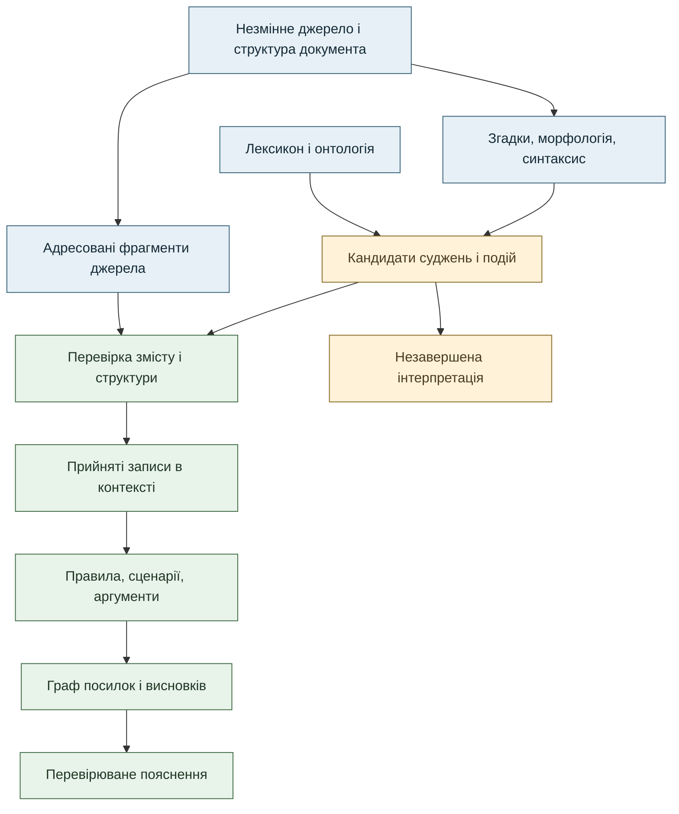

# Memo-019. Одиниці знань і онтологія RFC: від мовних шарів документа до перевірюваного виведення

**Тип:** дослідницький та інженерний меморандум.

**Дата:** 2026-10-04.

**Статус:** дослідження джерел і проєкт протоколу випробувань. Низьку якість видобування повідомив автор запиту; числові результати на робочому корпусі, реалізація екстрактора й схема робочої бази знань у цьому дослідженні недоступні. Пропозиції не є виміряним поліпшенням.

**Пов'язані глави:** [7](../ch07-knowledge-base-typology.md), [12](../ch12-linguistic-analysis-and-local-models.md), [14](../ch14-requirements-detection-and-formalization.md), [15](../ch15-knowledge-extraction-and-kb-construction.md), [20](../ch20-explanation-engine.md), [23](../ch23-knowledge-base-verification.md), [25](../ch25-how-expert-systems-learn.md), [26](../ch26-continual-learning.md), [28](../ch28-dual-mode-expert-systems.md), [31](../ch31-syllogistic-reasoning-and-relation-lattices.md), [32](../ch32-high-performance-knowledge-packs-mmap-and-harvesting.md).

## Питання й гіпотези

Як збільшити повноту видобування й корисність знань із документів серії Request for Comments (RFC), не перетворюючи припущення мовної моделі на підтверджені факти?

Робоча теза: одиницею зберігання має бути типізоване твердження або подія з умовами, походженням і статусом перевірки; трійка «суб'єкт, відношення, об'єкт» є одним поданням, а не універсальною одиницею змісту. Дерево класів понять потрібне для навігації, але залежності правил, подій і доказів утворюють граф із різними типами ребер.

H-REP: типізовані записи з умовами, ролями й винятками зменшують кількість неправильних відповідей порівняно з трійками за однакового набору видобутих фрагментів. Дешевий спростувальний тест: обидва подання виконують ті самі питання про умовну норму, заперечення й послідовність подій; якщо відмінностей немає, розширення формату на цьому зрізі не виправдане.

H-DET: структурний і морфосинтаксичний аналіз разом із кількома спеціалізованими екстракторами знаходить більше правильно розмічених одиниць, ніж один запит до мовної моделі, за незмінного порога точності. H-DEP: міжреченнєві посилання й зіставлення редакцій поліпшують відповіді на багатокрокові питання, а не лише збільшують кількість ребер. H-EXPL: формування пояснення з перевіреного графа аргументу зменшує частку непідтверджених тверджень порівняно з вільним переказом знайденого тексту.

H-ML: навчання на фахово розмічених складних прикладах поліпшує збереження умов і заперечень більше, ніж збільшення моделі без зміни розмітки. Спростувальний тест: порівняти адаптовану й початкову модель на прихованих родинах RFC за однакового бюджету обчислень; відсутність приросту або погіршення точності означатиме відмову від запропонованої адаптації.

## Межі дослідження

Потрібно окремо виміряти три втрати: екстрактор не знаходить одиницю; серіалізатор втрачає її семантику; рушій виведення не використовує вже збережене знання. Глави 14–15 вже описують модальності, числові обмеження й автомати. Без огляду робочої реалізації не можна стверджувати, що саме формат трійок спричинив усі пропуски.

«Максимальна кількість одиниць» не є достатньою метрикою: дублювання й надмірне дроблення збільшують кількість записів без нового знання. Еталон має містити визначену гранулярність одиниць, а випробування повинні вимірювати повноту разом із точністю й правильністю кінцевих відповідей.

Опрацьовано першоджерела з онтологій, мовної розмітки, навчання моделей, паспортів моделей, нотацій даних і правил, а також огляди NLP для видобування знань. Ліцензію, ознаку архіву й дату останніх змін бібліотек NLP перевірено через програмний інтерфейс GitHub 2026-10-04; ці дані не оцінюють якості бібліотек. Запущено лише Go-приклад перевірки повторних ключів JSON. Не виконано запусків моделей, адаптації ваг, повної розмітки RFC або міграції робочої бази знань. Наведені схеми, пороги приймання й пріоритети є інженерними пропозиціями. Приклади протоколу Transmission Control Protocol (TCP), тобто протоколу керування передаванням, потрібні для перевірки представлення знань, а не для заміни специфікації TCP.

## 1. Чому RFC потребує окремого протоколу видобування

### 1.1. Нормативність не зводиться до пошуку ключових слів

RFC 8174 Баррі Лейби уточнює конвенцію Best Current Practice 14 (BCP 14), тобто усталеної практики щодо нормативних ключових слів. Спеціальне значення мають визначені конвенцією слова у верхньому регістрі. Водночас RFC 8174 прямо зазначає, що нормативний текст не обов'язково містить такі слова. Екстрактор, який шукає лише MUST і SHOULD, може пропустити нормативний алгоритм або обмеження, описане звичайною мовою [[1]](#src-1).

Пропоную два незалежні виходи класифікатора: дискурсивна функція фрагмента, наприклад норма, визначення, пояснення, приклад, та модальність конкретного твердження. Відсутність MUST не перетворює норму на довідку; наявність MUST у цитаті чи описі старої редакції не робить норму чинною для всіх профілів.

### 1.2. Структура документа є частиною змісту

RFC 7991 Пола Гоффмана описує словник Extensible Markup Language (XML), розширюваної мови розмітки, для RFC: секції, посилання, переліки, таблиці, програмний текст і метадані оновлень. Втрата заголовка таблиці або вступного речення перед переліком може змінити інтерпретацію всіх дочірніх пунктів. RFC 7991 не слід вважати вичерпною схемою всіх сучасних XML-документів RFC: специфікація передбачала подальші зміни словника [[2]](#src-2).

Структурний парсер має зберігати батьківські секції, порядок кроків, заголовки колонок, посилання на інші секції та окремо код і граматики. Граматику Augmented Backus-Naur Form (ABNF), тобто розширеної форми Бекуса-Наура, не потрібно обробляти як звичайний абзац.

### 1.3. Конкретні втрати на прикладах TCP

RFC 9293 за редакцією Веслі Едді містить різні типи знань. Таблиця показує, що саме екстрактор і формат мають зберегти; перефразування в таблиці не є дослівними цитатами [[3]](#src-3).

| Фрагмент RFC 9293 | Одиниці, які потрібно розрізняти | Небезпечне спрощення |
|---|---|---|
| §3.1, контрольна сума | обов'язок відправника сформувати контрольну суму, MUST-2; обов'язок одержувача перевірити контрольну суму, MUST-3 | один запис «TCP використовує контрольну суму» втрачає двох виконавців і дві дії |
| §3.1, значущість полів прапорців | значення поля та умова, за якої поле потрібно інтерпретувати | безумовне твердження про значущість поля |
| §3.3.2, діаграма станів | узагальнені переходи плюс обмеження діаграми; повні умови описані в тексті | оголошення діаграми повною специфікацією переходів |
| §3.10, обробка подій | поточний стан, порядок перевірок, умови, дії й дострокове завершення обробки | неупорядкований перелік незалежних дій |
| §3.10.7.4, перевірка скидання з'єднання | різні гілки перевірки номера послідовності й область застосування захисного профілю | правило «отримане скидання завжди закриває з'єднання» |
| §3.8.4, keepalive | заборона вважати з'єднання мертвим лише через відсутність відповіді на окрему перевірку, MUST-29 | твердження «немає відповіді, отже з'єднання мертве» |

Опис типової події в RFC не доводить, що подія вже відбулася в конкретній мережі. Окремий запис журналу може засвідчувати спостереження події; нормативний документ описує дозволену або необхідну поведінку. Формат повинен розрізняти специфікацію події та її спостережений екземпляр.

Для початкової діагностики достатньо десяти повністю розмічених секцій, а не всього корпусу. На кожній секції потрібно порівняти еталон, вихід екстрактора до серіалізації, збережений запис і відповідь рушія. Перший етап, на якому зникає роль, умова чи заперечення, визначає місце наступного виправлення.

## 2. Що вважати атомарною одиницею знань

**Атомарність** тут означає найменшу погоджену одиницю, яку можна перевірити або використати без втрати необхідної області застосування. Атомарність не означає «один іменник», «одне речення» або «одна трійка». Умова може бути спільною для кількох атомарних обов'язків; у такому разі обов'язки посилаються на один контекст, а не відкидають умову.

| Тип запису | Семантичний контракт | Приклад або межа |
|---|---|---|
| Згадка | конкретне входження мовного виразу в джерелі | «receiver» у певному абзаці; згадка ще не є глобальним поняттям |
| Поняття | визначення, критерій розпізнавання, область застосування | контрольна сума; одна назва може мати кілька значень |
| Об'єкт | конкретний ідентифікований учасник предметної області | певне TCP-з'єднання, а не клас усіх з'єднань |
| Тип відношення | ролі аргументів і дозволена семантика | `part_of`, `requires`, `precedes`; типи не взаємозамінні |
| Судження | типізована пропозиція з кванторами, модальністю й контекстом | обов'язок перевірити контрольну суму; судження не автоматично факт |
| Подія | учасники, момент або інтервал, контекст і зміни стану | отримання сегмента; описана, спостережена й змодельована події мають різні статуси |
| Правило | формалізовані передумови, висновок або впорядковані дії | перехід стану за певного входу; відсутні умови блокують виконання |
| Висновок | результат конкретного застосування затверджених правил | висновок із посиланнями на посилки та версії правил |
| Гіпотеза | припущення, аргументи, заперечення й спосіб перевірки | можливе пояснення тайм-ауту, не встановлена причина |
| Блок незавершеної інтерпретації | джерело й відомі кандидати без удаваної повної формалізації | нерозв'язана кореференція або неоднозначна умова |

Слово **факт** потрібно резервувати для твердження, прийнятого за визначеною процедурою й у визначеному контексті. Навіть прийняття факту не робить твердження позаконтекстним або непомильним. Статуси «видобуто з документа», «підтверджено спостереженням», «виведено» та «припущено» мають бути різними полями, а не одним числом упевненості.

**Пошуковий фрагмент** є одиницею подання тексту екстрактору або пошуку. **Векторне подання**, англійською embedding, є числовим представленням фрагмента для зіставлення. Один фрагмент може містити нуль, одну або багато одиниць знань; одна одиниця може вимагати кількох фрагментів. Векторна близькість не визначає тотожність одиниць і не підтверджує логічний зв'язок.

Наташа Ной і Алан Ректор описали шаблон багатомісного відношення: окремий вузол екземпляра відношення пов'язує учасників із типізованими ролями й уточненнями. У Resource Description Framework (RDF), моделі опису ресурсів, такий об'єкт серіалізують багатьма трійками. Отже, проблема не в трійковій основі RDF, а у втратному зведенні складного твердження до одного ребра. Документ авторів є приміткою робочої групи World Wide Web Consortium (W3C), консорціуму розроблення вебстандартів, а не рекомендацією W3C [[4]](#src-4).

Для події передавання потрібні щонайменше ролі відправника, одержувача й переданого об'єкта, а за потреби також час, канал і контекст. Повторне передавання між тими самими учасниками не є тією самою подією. Дедуплікація за парою учасників знищить повторні події.

## 3. Деталізація онтології: не одне дерево, а узгоджені подання

### 3.1. Розділити навігацію, класи та ролі

Simple Knowledge Organization System (SKOS), проста модель організації знань, придатна для словників понять, назв, визначень і навігації. За специфікацією Алістера Майлза та Шона Бехгофера `broader` не є автоматично транзитивним; транзитивне подання має окремий предикат `broaderTransitive`. Відношення `related` симетричне, але не транзитивне. SKOS допускає полієрархії та не забороняє цикли загалом: прикладне обмеження на цикли потрібно задати окремо [[5]](#src-5).

Навігаційний зв'язок «передавання даних / контрольна сума» не означає, що контрольна сума є підкласом передавання. Для класів використовується `subclass_of`; для частин, ролей, залежностей і тем потрібні інші відношення. Навігаційне дерево можна побудувати як проєкцію графа, зберігши всі додаткові батьківські зв'язки в основному поданні.

**Лексична одиниця** є словом або сталим багатослівним виразом; **лексичне значення** пов'язує одиницю з її значенням у конкретному домені. OntoLex-Lemon за редакцією Філіппа Чіміано, Джона Маккрея й Пола Буйтелаара розрізняє `LexicalEntry`, `Form` і `LexicalSense`, пов'язує значення з онтологічним ресурсом та підтримує синтаксико-семантичні відповідності. Звіт OntoLex є звітом спільноти, не стандартом W3C; сам OntoLex не замінює модель анотування тексту [[6]](#src-6).

Пропонований ланцюг ідентифікації: конкретна згадка → словоформа → лексична одиниця → вибране лексичне значення → поняття, клас або відношення. Наприклад, «window» у TCP потрібно відрізняти від вікна графічного інтерфейсу. Приєднання згадки лише за лемою створює помилкове злиття понять.

### 3.2. Формальна класифікація не є перевіркою заповненості

Web Ontology Language (OWL), мова вебонтологій, задає формальну семантику класів і властивостей. Профілі OWL 2 EL, OWL 2 QL та OWL 2 RL обмежують виразність для різних обчислювальних задач: великих класифікацій, переписування запитів і правилового виведення відповідно. EL, QL та RL тут є офіційними позначеннями профілів. Профілі не утворюють просту вкладену шкалу «від слабкого до сильного» [[7]](#src-7).

Для першого прототипу рекомендую обмежений профіль класів і явних правил. Не потрібно очікувати, що OWL самостійно інтерпретує обов'язок SHOULD, скасовує норму новішою редакцією або виконує всі арифметичні перевірки TCP. Відсутність твердження в онтології не означає його хибність; закритість конкретного реєстру потрібно оголосити в прикладному контракті.

**Верхньорівнева онтологія** визначає загальні категорії до введення предметних термінів. Basic Formal Ontology (BFO), базова формальна онтологія, створена для інтеграції й аналізу в різних доменах та не містить спеціальних термінів окремих наук [[8]](#src-8). Рекомендація для RFC: спершу відокремити документ, інформаційний об'єкт, учасника, роль, процес і спостереження в прикладній моделі. Повне приєднання BFO відкласти до появи конкретної потреби в міждоменній сумісності; змішування кількох верхніх онтологій без перевірки відповідностей не рекомендоване.

Shapes Constraint Language (SHACL), мова обмежень для RDF-графів, за редакцією Голгера Кнублауха й Дімітара Контокостаса перевіряє типи, кількість значень, шляхи та інші умови структури. Успішна перевірка SHACL не доводить істинність змісту або правильність прочитання RFC. Семантика рекурсивних форм у рекомендації 2017 року не визначена, тому для першого профілю потрібні нерекурсивні перевірки або явно зафіксоване розширення рушія [[9]](#src-9).

### 3.3. Критерій деталізації: питання, на які має відповісти база

**Перевірне питання до онтології** задає очікувану здатність представлення. Деталізація виправдана, якщо новий клас, роль або відношення дозволяє правильно розрізнити потрібні відповіді. Запропоновані питання для першого профілю:

1. Хто зобов'язаний сформувати контрольну суму, а хто перевірити контрольну суму?
2. За якої умови поле має значення та які передумови залишилися невідомими?
3. Який крок обробки зупиняє виконання наступних кроків?
4. Яка редакція й профіль визначають застосовну норму?
5. Яке твердження описує специфікацію події, а яке засвідчує спостережену подію?
6. Які висновки зміняться після відкликання конкретного джерела або правила?
7. Які альтернативні гіпотези сумісні зі спостереженням і чим гіпотези можна розрізнити?

Для кожного поняття рекомендую картку: стабільний ідентифікатор, визначення, приклади й контрприклади, домен, допустимі ролі, батьківські класи, джерело визначення, мовні назви, статус перевірки та версію. Для відношення потрібні напрям, типи аргументів, арність, правила тотожності, дозволена транзитивність, оберненість і правила композиції. Відсутність визначення або прикладного питання є причиною відкласти додавання нового поняття.

## 4. Запропонований багатошаровий формат бази знань

### 4.1. Шари й незалежні ідентифікатори

Нижче подано авторську схему, яка поєднує розглянуті шаблони, але не є новим стандартом. Стрілки показують посилання або перетворення; стрілка сама по собі не означає доведення істинності.



Схема залишає місце для знань, які екстрактор ще не зміг формалізувати. Блок незавершеної інтерпретації можна шукати й повторно обробляти, але не подавати рушію як затверджене правило. Такий блок запобігає втраті документа без удаваного завершення аналізу.

| Шар | Обов'язковий зміст | Що не можна змішувати |
|---|---|---|
| Джерело | байти, формат, адреса отримання, хеш, редакція, структура секцій, доступ | адреса вебсторінки не гарантує незмінності байтів |
| Мовна розмітка | токени, словоформи, леми, морфологічні ознаки, синтаксичні ребра, згадки | токенізація моделі не є семантичною атомізацією |
| Лексикон і поняття | значення, визначення, відповідності згадок і понять | однаковий текст назви не означає тотожності понять |
| Судження й події | ролі, модальність, область заперечення, умови, квантори, часовий і нормативний контекст | норма не є спостереженим фактом виконання |
| Правила й аргументи | формальні передумови, порядок дій, винятки, версія семантики | заявлена автором причина не є автоматично встановленою причиною |
| Пошукові подання | фрагменти, вектори, індекси, версії моделей і зв'язки з записами | індекс не є первинним сховищем семантики |

### 4.2. Спільний конверт запису

**Конверт запису** містить метадані, спільні для типізованих одиниць. Корисне навантаження конверта має схему конкретного типу; подія й норма не повинні мати однакові довільні текстові поля.

| Поле | Контракт |
|---|---|
| `id`, `revision`, `schema_version`, `kind` | логічний ідентифікатор, редакція запису, версія схеми й вид одиниці |
| `ontology_profile`, `context_id` | версія словника й контекст інтерпретації |
| `payload` | типізована структура з визначеними операторами, не вільний текст правила |
| `evidence` | адресовані фрагменти з ролями: підтримка, умова, виняток, визначення або заперечення |
| `provenance` | хто, чим і коли створив або перевірив запис |
| `epistemic_status`, `review_status` | окремо походження змісту й стан його розгляду |
| `confidence` | оцінка певної моделі для певної задачі, з версією калібрування; не ймовірність істинності за означенням |
| `validity`, `supersedes` | застосовність у редакції чи часовому інтервалі та явні зв'язки заміни |
| `access_policy` | права на запис і залежні джерела; перевірка до пошуку, виведення й пояснення |

Для `payload` потрібно підтримати щонайменше: багатомісний фрейм, типізований терм або формулу, норму, подію, перехід стану, послідовність дій, величину з одиницею вимірювання та частково інтерпретований блок. Усі записи не потрібно заповнювати всіма полями: застосовність поля визначає схема виду одиниці.

**Абстрактне синтаксичне дерево** (Abstract Syntax Tree, AST) формули має явно представляти `and`, `or`, `not`, квантори, порівняння й звернення до типізованих ролей. Текст «A and B unless C» не можна зберігати як три непов'язані ребра. Якщо область заперечення не встановлена, запис залишається кандидатом.

### 4.3. Адреса доказу: байти не є символами

Web Annotation Data Model, модель вебанотацій за редакцією Роберта Сандерсона, Паоло Чіккарезе й Бенджаміна Янга, визначає селектори фрагментів. `TextPositionSelector` рахує нормалізовані кодові точки Unicode, не байти; `DataPositionSelector` адресує байти; `TextQuoteSelector` зберігає цитату з оточенням. Підміна цих координат зміщує адреси після нормалізації або появи небазових символів [[10]](#src-10).

Пропоную зберігати первинний доказ як `source_revision + source_hash + byte_ranges`, де діапазон `[start, end)` задається у байтах конкретного незмінного артефакту. Для читання й пошуку можна додати текстову цитату, структурний шлях і символьні позиції з явною назвою координат. Перетворення XML або HyperText Markup Language (HTML), мови гіпертекстової розмітки, на текст має зберігати карту відповідності; після декодування сутностей або згортання пробілів доказ може вимагати кількох діапазонів.

Кожне суттєве поле має власну підтримку: окремо виконавець, дія, умова, модальність і виняток. Один загальний лінк на довгу секцію недостатній для перевірки правильності цих полів. Кілька доказових фрагментів потрібно позначати як спільно необхідні або альтернативні; перелік посилань без цієї семантики не визначає силу аргументу.

PROV-O, онтологія походження за редакцією Тімоті Лебо, Сатьї Саху й Дебори Макгіннесс, розрізняє сутності, діяльності та агентів і підтримує кваліфіковані зв'язки. Формат може використати PROV-O для протоколу видобування й перевірки. `wasDerivedFrom` засвідчує походження об'єкта, але не замінює доказ логічного випливання або причинності [[11]](#src-11).

### 4.4. Час події, чинність норми й час запису

OWL-Time за редакцією Саймона Кокса й Кріса Літтла представляє моменти, інтервали, тривалості й часові відношення. У цьому мемо використано фіксовану рекомендацію від 19 жовтня 2017 року. Часовий порядок сам по собі не встановлює причинного зв'язку [[12]](#src-12).

Пропоную окремі поля для часу події, області чинності твердження та часу внесення або відкликання запису. Чинність нормативного профілю може залежати від редакції й функції протоколу, а не тільки від календарної дати. Пізніше опублікований RFC не скасовує автоматично всі судження з ранішого RFC; потрібна перевірка області оновлення.

Для числових величин потрібно зберігати тип, одиницю, точність, спосіб округлення й сире подання. Порівняння номерів послідовності TCP потребує окремої семантики модульної арифметики; звичайного цілочисельного `<` недостатньо [[3]](#src-3).

## 5. Формати опису, обміну та виконання

### 5.1. Рекомендований поділ відповідальності

Не пропоную замінювати робочу базу знань одним універсальним файловим форматом. Потрібна первинна семантична модель і явні відображення в кілька представлень. JavaScript Object Notation (JSON), текстовий формат об'єктів, з JSON Schema 2020-12 придатний для типізованих конвертів. JSON Schema має окремі частини Core і Validation; відповідність схемі підтверджує форму даних, не зміст джерела [[13]](#src-13).

Наведені нижче варіанти є пропозицією до архітектури, а не твердженням про вже реалізовані адаптери.

| Представлення | Пропонована роль | Обмеження й умова вибору |
|---|---|---|
| JSON Lines із JSON Schema | послідовність версійованих конвертів для обміну й відтворюваного імпорту | міжзаписові посилання й семантика формул потребують додаткових перевірок |
| RDF із названими графами, Turtle або TriG | онтологія, багатомісні фрейми, походження, інтеграційні запити | трійки допустимі, якщо адаптер зберігає всі ролі й уточнення; названий граф сам по собі не задає статусу істинності |
| JSON for Linked Data (JSON-LD), JSON для пов'язаних даних | зовнішній обмін RDF-поданням у JSON-синтаксисі | контекст відповідностей має бути зафіксований і перевірений, без неконтрольованого мережевого завантаження |
| YAML Ain't Markup Language (YAML), формат серіалізації даних | ручне редагування словників і профілів перед компіляцією | не первинний формат хешування; неоднозначні типи, дублікати ключів і виконувані теги потрібно відхиляти |
| Реляційні таблиці | транзакційний реєстр записів, редакцій, розгляду й доказів | складні фрейми можна нормалізувати в таблиці ролей; вибір реляційного сховища не вимагає спрощення семантики |
| AST і правила Datalog або Answer Set Programming (ASP), програмування множин відповідей | обмежене виконуване подання затверджених правил | модальності й винятки потребують явної семантики; текст мовної моделі не виконується без перевірки |
| Бінарний пакет та індекси | швидке читання прийнятої редакції бази знань | похідний артефакт: зберігає версії схеми й онтології, перевіряється після компіляції |
| Таблиці навчальних прикладів | навчання екстракторів і оцінювання | навчальна розмітка не тотожна прийнятим фактам; права й походження зберігаються |

Для першого досліду рекомендую JSON Lines як контрольне подання, RDF як графову проєкцію та чинні пакети з [глави 32](../ch32-high-performance-knowledge-packs-mmap-and-harvesting.md) як ціль виконання. Остаточний вибір первинного сховища потрібно зробити після перевірки втрат і транзакційних вимог. Окремий формат пошукових векторів залишається похідним.

### 5.2. Мінімальний приклад норми

Приклад нижче показує дві різні дії з §3.1 RFC 9293. JSON є синтаксично коректним проєктним прикладом, але не готовим імпортним пакетом: ідентифікатори, ревізії онтології та адреси доказів демонстраційні. Байтові позиції не вигадані; до отримання конкретного артефакту поле адресації залишається незаповненим, а записи не можуть бути прийняті.

<details>
<summary>JSON: кандидати двох обов'язків щодо контрольної суми</summary>

```json
{
	"schema_version": "0.1.0",
	"ontology_profile": "demo:tcp-ontology:0.1.0",
	"source": {
		"id": "demo:rfc9293-source",
		"url": "https://www.rfc-editor.org/rfc/rfc9293.html",
		"artifact_hash": null,
		"coordinate_system": "raw-byte-half-open"
	},
	"contexts": [
		{
			"id": "demo:tcp-checksum-context",
			"protocol": "tcp",
			"specification": "RFC9293",
			"section": "3.1"
		}
	],
	"records": [
		{
			"id": "demo:checksum-generate",
			"revision": 1,
			"kind": "norm",
			"context_id": "demo:tcp-checksum-context",
			"payload": {
				"modality": "obligation",
				"source_keyword": "MUST",
				"body": {
					"predicate": "tcp:generate_checksum",
					"roles": {
						"actor_role": "tcp:sender",
						"object_kind": "tcp:checksum"
					}
				},
				"requirement_id": "MUST-2"
			},
			"evidence": [
				{"role": "support", "section": "3.1", "byte_ranges": null}
			],
			"epistemic_status": "source_interpretation",
			"review_status": "candidate",
			"access_policy": {"classification": "public"}
		},
		{
			"id": "demo:checksum-check",
			"revision": 1,
			"kind": "norm",
			"context_id": "demo:tcp-checksum-context",
			"payload": {
				"modality": "obligation",
				"source_keyword": "MUST",
				"body": {
					"predicate": "tcp:check_checksum",
					"roles": {
						"actor_role": "tcp:receiver",
						"object_kind": "tcp:checksum"
					}
				},
				"requirement_id": "MUST-3"
			},
			"evidence": [
				{"role": "support", "section": "3.1", "byte_ranges": null}
			],
			"epistemic_status": "source_interpretation",
			"review_status": "candidate",
			"access_policy": {"classification": "public"}
		}
	]
}
```

</details>

Спільний контекст не зливає обов'язків: відправник і одержувач залишаються окремими ролями. Приклад не описує всі властивості контрольної суми й не доводить відповідність будь-якої реалізації TCP. Майбутній профіль імпорту має вимагати непорожні перевірені докази й протокол розгляду для статусу `accepted`.

### 5.3. Тотожність, версії й міграція

Логічний ідентифікатор поняття, ідентифікатор редакції запису та хеш байтового артефакту виконують різні задачі. Для судження семантичний ключ має включати типізоване тіло, модальність, область заперечення, умови, квантори й контекст. Доказові фрагменти з кількох документів можуть підтримувати одне судження, але залишаються окремими записами походження.

Для події потрібний критерій тотожності екземпляра, наприклад ідентифікатор журналу та порядковий номер події. Однакові ролі й часовий інтервал не завжди достатні. При невизначеності потрібно зберігати кандидатний зв'язок відповідності, а не виконувати необоротне злиття.

Профіль серіалізації має визначити кодування UTF-8 (Unicode Transformation Format, 8-bit), порядок полів, порядок множин і послідовностей, подання чисел, обробку невідомих полів і дублікатів ключів. Канонізація байтів для хешу не є канонізацією змісту. Невідоме семантичне поле потрібно або зберегти, або відхилити; мовчазне відкидання поля при міграції заборонене.

Контроль зворотного перетворення має перевіряти `record → RDF → record` і `record → binary pack → record`: ролі, формули, порядок дій, доступ, джерела й статуси не змінюються. Необхідна не рівність форматованого тексту, а рівність нормалізованої типізованої структури й відповідей на контрольні питання. Для старих трійок без умов міграція не повинна вигадувати втрачені умови: потрібне повторне видобування або статус неповної інтерпретації.

### 5.4. Інші нотації об'єктів, графів і правил

JSON є лише однією з нотацій даних. Для бази знань вибір нотації визначає три практичні властивості: чи дає однакове значення однакові байти для хешу й підпису, чи переживають дані зміну схеми і чи може запис нести уточнення без втрати змісту. Нотація не задає значення норми RFC: семантику визначає профіль бази знань, а нотація переносить цей профіль без втрат або з втратами.

Перша таблиця порівнює нотації дерев даних, тобто об'єктів, масивів і скалярних значень.

| Нотація | Статус | Корисна властивість | Межа або ризик |
|---|---|---|---|
| JSON [[14]](#src-14) | RFC 8259, Internet Standard | найширша підтримка, текстова діагностика | імена в об'єкті лише SHOULD бути різними; обробка повторів залежить від бібліотеки |
| I-JSON [[15]](#src-15) | RFC 7493, Proposed Standard | профіль JSON: об'єкти MUST NOT мати повторних імен; числа узгоджуються з IEEE 754 binary64 | профіль потрібно явно вимагати й перевіряти під час імпорту |
| JCS [[16]](#src-16) | RFC 8785, Informational | канонічні байти JSON: рекурсивне сортування імен властивостей, порядок елементів масиву не змінюється | рівність байтів після JCS не означає семантичної рівності записів |
| JSON Text Sequences [[17]](#src-17) | RFC 7464, Proposed Standard | потокове подання: кожен запис починається символом-роздільником записів 0x1E | поширений формат JSON Lines є домовленістю спільноти, а не RFC |
| YAML 1.2.2 [[18]](#src-18) | специфікація, ред. 2021-10-01 | зручне ручне редагування, якорі, теги | тип скаляра залежить від схеми розбору; не придатний як первинне джерело для хешу |
| TOML 1.0.0 [[19]](#src-19) | специфікація | мінімальний формат конфігурації | не призначений для графів і багатомісних фреймів |
| CBOR [[20]](#src-20) і CDDL [[21]](#src-21) | RFC 8949, Internet Standard; RFC 8610, Proposed Standard | компактне двійкове подання, теги типів, детерміноване кодування; CDDL описує структури CBOR і JSON | відображення чисел і тегів між JSON і CBOR потрібно перевіряти зворотним перетворенням |
| MessagePack [[22]](#src-22) | специфікація проєкту | компактне двійкове подання, типи-розширення, визначені застосунком | канонічне кодування й значення розширень потрібно задати власним профілем |
| BSON 1.1 [[23]](#src-23) | специфікація | двійкові впорядковані пари ключ-значення | порядок полів входить у байти, тому хеш залежить від порядку |
| Amazon Ion [[24]](#src-24) | специфікація Amazon | десятковий тип довільної точності, мітки часу з точністю, символи, анотації на будь-якому значенні; текстове й двійкове кодування мають одну модель даних | модель не містить посилань, тому довільний орієнтований граф потребує власних ідентифікаторів |
| edn [[25]](#src-25) | специфікація проєкту | теги розширення, множини, ключові слова | без схем і посилальних типів; автори називають специфікацію неформальною |
| S-вирази SPKI [[26]](#src-26) | RFC 9804, Informational, 2025 | канонічна форма для створення й перевірки цифрових підписів | малий набір типів; семантику записів задає застосунок |
| Protocol Buffers [[27]](#src-27) | документація Google | схема з номерами полів, правила безпечної зміни схеми, збереження невідомих полів у двійковому розборі | серіалізація не канонічна; перетворення в JSON втрачає невідомі поля |
| Apache Avro 1.12.0 [[28]](#src-28) | специфікація Apache | двійкові дані без імен полів, розв'язання схем записувача й читача, канонічна форма схеми й відбитки | без схеми записувача дані не читаються; відбиток схеми не є засобом захисту |
| ASN.1 з DER [[29]](#src-29) | ITU-T X.690 | DER задає єдине кодування значення, придатне для підписів | потрібні засоби ASN.1; схема не описує семантики норм |
| CUE [[30]](#src-30) | мова й реалізація на Go | типи й значення в одній решітці; поєднання обмежень асоціативне, комутативне й ідемпотентне; перевірка JSON і YAML | мова перевірки й шаблонів, а не формат обміну фактами |

Однозначні байти для хешу дають JCS, детерміноване кодування CBOR, DER і канонічна форма S-виразів. Серіалізація Protocol Buffers не канонічна, BSON включає порядок полів у байти, а YAML залежить від схеми розбору; ці нотації придатні для транспорту чи редагування, але не для обчислення семантичного ідентифікатора. Зміну схеми з визначеними правилами сумісності описують Protocol Buffers, Avro, CDDL і JSON Schema.

Повторні імена в JSON показують тиху втрату змісту. Стандартний пакет Go `encoding/json` приймає об'єкт із двома полями `actor_role` без помилки й залишає останнє значення. Приклад нижче порівнює стандартний розбір із мінімальною суворою перевіркою перед імпортом; програма не має сторонніх залежностей і пройшла `gofmt`, `go vet` та `go run` (Go 1.22).

<details>
<summary>Go: виявлення повторних ключів JSON перед імпортом</summary>

```go
package main

import (
	"encoding/json"
	"errors"
	"fmt"
	"io"
	"strings"
)

func checkValue(dec *json.Decoder) error {
	tok, err := dec.Token()
	if err != nil {
		return err
	}
	delim, ok := tok.(json.Delim)
	if !ok {
		return nil
	}
	switch delim {
	case '{':
		seen := map[string]bool{}
		for dec.More() {
			keyTok, err := dec.Token()
			if err != nil {
				return err
			}
			key := keyTok.(string)
			if seen[key] {
				return fmt.Errorf("duplicate key %q", key)
			}
			seen[key] = true
			if err := checkValue(dec); err != nil {
				return err
			}
		}
	case '[':
		for dec.More() {
			if err := checkValue(dec); err != nil {
				return err
			}
		}
	}
	_, err = dec.Token() // closing '}' or ']'
	return err
}

func strictValidate(data string) error {
	dec := json.NewDecoder(strings.NewReader(data))
	dec.UseNumber()
	if err := checkValue(dec); err != nil {
		return err
	}
	if _, err := dec.Token(); err != io.EOF {
		return errors.New("trailing data after JSON value")
	}
	return nil
}

func main() {
	input := `{"actor_role":"tcp:sender","actor_role":"tcp:receiver"}`
	var record map[string]any
	err := json.Unmarshal([]byte(input), &record)
	fmt.Printf("encoding/json: error=%v actor_role=%v\n", err, record["actor_role"])
	fmt.Printf("strict check: %v\n", strictValidate(input))
	fmt.Printf("strict check (valid): %v\n", strictValidate(`{"roles":[{"actor_role":"tcp:sender"}]}`))
}
```

Вивід:

```text
encoding/json: error=<nil> actor_role=tcp:receiver
strict check: duplicate key "actor_role"
strict check (valid): <nil>
```

</details>

Стандартний розбір замінив роль відправника роллю одержувача без повідомлення про помилку. Сувора перевірка зупиняє імпорт на першому повторі й не змінює даних. Валідатор JSON Schema, який отримує вже розібраний об'єкт, такого повтору не побачить, тому перевірку повторів потрібно виконувати над байтами до розбору.

Друга таблиця стосується моделей графів, тверджень і правил.

| Модель або нотація | Статус | Що дає для одиниць знань | Межа |
|---|---|---|---|
| RDF 1.2: терміни-трійки й реіфікатори [[31]](#src-31) | W3C Candidate Recommendation Snapshot, 7 квітня 2026; чинною рекомендацією залишається RDF 1.1 | опис пропозиції без її ствердження: реіфікована пропозиція не мусить бути істинною, тож кандидат і джерело твердження можна записати без запису факту | статус кандидата в рекомендації; версія «1.2-basic» не містить термінів-трійок, тому частина засобів їх не прийме |
| HDT [[32]](#src-32) | W3C Member Submission, 2011 | двійкове RDF із заголовком, словником і трійками; стиснення й доступ за індексом без повного розпакування | не є стандартом W3C; не додає власної моделі кваліфікаторів |
| Граф властивостей [[33]](#src-33) і мова GQL [[34]](#src-34) | ISO/IEC 39075:2024 | вузли й ребра мають мітки та пари «властивість-значення»; уточнення можна зберігати на ребрі | GQL визначає структури даних і мову керування ними, а не логічне виведення; ребро з властивостями не замінює багатомісного фрейму з кількома учасниками |
| Модель тверджень Wikidata [[35]](#src-35) | модель даних Wikibase | твердження містить основне значення, кваліфікатори, посилання на джерела й ранг | ранг є критерієм відбору, а не мірою істинності |
| Common Logic [[36]](#src-36) | ISO/IEC 24707:2018 | мови логіки першого порядку з декларативною семантикою й перекладом у спільний XML-синтаксис | стандарт не задає теорії доведення й правил виведення |
| LegalRuleML [[37]](#src-37) | OASIS Standard, 30 серпня 2021 | деонтичні оператори обов'язку, дозволу й заборони; спростовні правила й перевага одного правила над іншим; альтернативні тлумачення; зв'язок N:M між правилами й положеннями тексту; часовий статус норм | створено для правових норм; застосування до RFC є пропозицією цього мемо |

Wikidata і RDF 1.2 показують, що поширені моделі вже вийшли за межі простої трійки: твердження має кваліфікатори, джерела, ранг або окремий реіфікатор. Для норм RFC найближчою моделлю є LegalRuleML. Відображення MUST на обов'язок, MUST NOT на заборону і MAY на дозвіл є пропозицією цього мемо. Для SHOULD прямого відповідника немає: RFC 2119 визначає SHOULD як рекомендацію, від якої за певних обставин можна відступити після зважування всіх наслідків [[38]](#src-38). Таке значення доцільно моделювати спростовним обов'язком із вимогою обґрунтувати відступ; модель потребує перевірки фахівцем домену.

Третя таблиця описує формати мовної розмітки, якими аналізатори передають дані екстрактору.

| Формат або архітектура | Що зберігає | Межа |
|---|---|---|
| CoNLL-U [[39]](#src-39) | рядок слова з 10 полів: ID, FORM, LEMMA, UPOS, XPOS, FEATS, HEAD, DEPREL, DEPS, MISC; поле MISC містить інші анотації | байтові координати джерела не входять до визначених полів, тому профіль має записувати їх, наприклад, у MISC |
| NIF 2.0 [[40]](#src-40) | формат на основі RDF і OWL для обміну між засобами NLP; повторно використовує PROV-O, LAF (ISO 24612) і фрагментні ідентифікатори RFC 5147 | RFC 5147 адресує простий текст за символами або рядками, тому байтову адресу первинного артефакту потрібно зберігати окремо |
| UIMA [[41]](#src-41) | архітектура для створення, композиції й розподіленого розгортання рушіїв аналізу | архітектура конвеєра, а не формат одиниць знань |
| PENMAN [[42]](#src-42) | текстове подання графів AMR | семантичний граф речення, а не нормативний запис із доказами |

Рекомендований профіль прототипу:

1. Обмін і контрольне подання: JSON у профілі I-JSON з JSON Schema 2020-12; повторні ключі відхиляються до розбору; хеш запису обчислюється над байтами JCS.
2. Компактне двійкове подання: CBOR з детермінованим кодуванням і схемою CDDL, якщо пакети з [глави 32](../ch32-high-performance-knowledge-packs-mmap-and-harvesting.md) потребують меншого розміру; перевірка зворотного перетворення JSON і CBOR обов'язкова.
3. Графова проєкція: RDF 1.1 з названими графами для сумісності; терміни-трійки RDF 1.2 лише в дослідному профілі для незатверджених кандидатів; поля кваліфікаторів, посилань і рангу за зразком моделі тверджень Wikidata.
4. Норми: внутрішнє AST залишається первинним; LegalRuleML слугує еталоном повноти полів модальності, сили правила, альтернатив і зв'язку з текстом.
5. Мовний шар: CoNLL-U для токенів, лем, ознак і залежностей; байтові діапазони записуються в поле MISC; NIF або Web Annotation використовуються для публікації в RDF.
6. Транспорт між сервісами може використовувати Protocol Buffers за умови перевірки зворотного перетворення; хеш і семантичний ідентифікатор не обчислюються над байтами Protocol Buffers, BSON або YAML.

## 6. Машинне навчання для текстів: задачі й межі

### 6.1. Навчання, аналіз та інтерпретація не є однією операцією

**Машинне навчання** (Machine Learning, ML) змінює параметри моделі за даними. **Оброблення природної мови** (Natural Language Processing, NLP) включає аналіз тексту, який може використовувати навчені моделі, граматики та правила. **Інтерпретація** в цьому мемо означає відображення висловлювання в типізоване судження з урахуванням домену й контексту. Жоден із трьох термінів не є синонімом формального доведення.

Jacob Devlin та співавтори описали Bidirectional Encoder Representations from Transformers (BERT), двонапрямні представлення кодувальника на основі трансформерів: переднавчання на нерозміченому тексті дає представлення, які адаптують до конкретних задач. Результати BERT на мовних тестах не є доказом повноти нормативного видобування RFC [[43]](#src-43).

| Задача | Що вивчає або обчислює засіб | Артефакт у запропонованій базі |
|---|---|---|
| Текстове переднавчання | закономірності мовного корпусу | версія ваг і паспорт навчання, не новий затверджений факт |
| Класифікація фрагментів | функцію фрагмента: норма, визначення, пояснення, приклад | мітка кандидата з адресою джерела |
| Розпізнавання згадок і термінів | межі виразів та можливі типи | згадки, лексичні кандидати, альтернативи прив'язування |
| Морфосинтаксичний аналіз | леми, граматичні ознаки й залежності | версійована мовна розмітка |
| Семантична інтерпретація | ролі, модальності, умови, заперечення | фрейм або формула-кандидат |
| Документне видобування зв'язків | зв'язки між згадками з різних речень і секцій | типізовані ребра з кількома доказовими фрагментами |
| Навчання пошуку | ранжування фрагментів і контекстів | похідні вектори й оцінки релевантності |
| Вербалізація | мовне представлення вже вибраного змісту | пояснення, пов'язане з планом і перевіреними записами |

**Контекстне навчання на прикладах** означає передавання прикладів у запиті без зміни ваг. **Доучування** змінює ваги або адаптер. **Поповнення бази знань** додає перевірені записи. Потрібно вести три різні протоколи: зміна запиту, зміна моделі, зміна бази знань.

### 6.2. Лексика й морфологія: потрібна перевірювана розмітка

Peng Qi та співавтори описали Stanza, інструментарій із токенізацією, лематизацією, морфологічними ознаками, синтаксичним аналізом і розпізнаванням сутностей. Стаття також описує інтерфейс до Stanford CoreNLP для додаткових задач; наявність такого інтерфейсу не означає однакової підтримки всіх задач для кожної мови й пакета [[44]](#src-44).

Universal Dependencies (UD), універсальні залежності, задають схему синтаксичних відношень, зокрема підмета, об'єкта, підрядних частин і пасивних конструкцій. Синтаксичний підмет не завжди є виконавцем дії. У пасивній конструкції підмет може позначати об'єкт дії; відповідність синтаксису й семантичним ролям має бути окремою операцією [[45]](#src-45).

Для RFC рекомендую зберігати оригінальний токен, лему, частину мови, граматичні ознаки, синтаксичну голову, тип залежності й адреси джерела. Терміни на кшталт `RCV.NXT`, номери секцій, формули й код потрібно захищати від звичайної лематизації. Наявність слова `not` ще не визначає область заперечення: екстрактор має встановити, який предикат або модальний оператор заперечено.

Вихід розпізнавання іменованих сутностей (Named Entity Recognition, NER) не покриває весь домен RFC: поле заголовка, таймер або умова стану можуть не належати до стандартних іменованих сутностей. Потрібні доменні типи згадок і словник багатослівних термінів, а не лише стандартні категорії «особа / організація / місце».

### 6.3. Семантичні графи й міжреченнєвий контекст

Abstract Meaning Representation (AMR), абстрактне представлення змісту, запропоноване Laura Banarescu та співавторами, є окремим напрямом семантичної розмітки [[46]](#src-46). Для цього дослідження AMR доцільно випробувати як проміжне кандидатне представлення ролей і предикатів, але не оголошувати автоматично повною моделлю нормативної семантики RFC. Збереження часових, модальних і кванторних відмінностей потрібно перевіряти на конкретному парсері й версії розмітки.

Yuan Yao та співавтори створили DocRED для видобування відношень на рівні документа, де зв'язок може вимагати кількох речень. Корпус побудовано з Wikipedia та Wikidata; його результати не переносяться без випробувань на умови, винятки й редакції RFC [[47]](#src-47).

**Кореференція** означає, що кілька згадок позначають одного учасника; **анафора** включає посилання на раніше введений зміст. Фраза «in this case» може посилатися не на об'єкт, а на всю умову попередньої гілки. Пропоную окремі записи кандидатів кореференції, успадкованого контексту й області дії заголовка або вступної частини переліку. Нерозв'язане посилання не можна підміняти найближчим іменником.

### 6.4. Що й коли доучувати

Suchin Gururangan та співавтори показали користь Domain-Adaptive Pretraining (DAPT), доменно-адаптивного переднавчання, і Task-Adaptive Pretraining (TAPT), адаптивного переднавчання на даних задачі, для досліджених доменів і класифікацій. Стаття не встановлює необхідності DAPT для RFC і не доводить поліпшення збереження заперечень у нормативних правилах [[48]](#src-48).

Рекомендований порядок: спершу виправити структуру входу й розмітку, потім перевірити приклади в запиті, далі виконати Supervised Fine-Tuning (SFT), доучування з учителем, на конкретному контракті видобування. Low-Rank Adaptation (LoRA), низькорангова адаптація Edward Hu та співавторів, зменшує кількість параметрів, які навчаються, але не усуває потреби в якісних прикладах і прихованому тесті [[49]](#src-49). DAPT має сенс лише якщо локальний аналіз помилок вказує на проблему доменної мови, а дешевші зміни не усувають проблему.

Навчальний приклад має містити не лише речення й правильний JSON. Потрібні структурний контекст, повні докази, затверджене тлумачення, негативний або мінімально змінений приклад і пояснення причини відхилення. Пара «одержувач MUST перевірити / відправник MUST перевірити» перевіряє ролі; пара з переміщеною умовою перевіряє область застосування. Синтетичні пари позначаються як синтетичні й перевіряються фахівцем, а не додаються до еталону як оригінальні норми RFC.

### 6.5. Слабке навчання й активна розмітка

Alexander Ratner та співавтори описали Snorkel: функції розмітки задають евристичні мітки, а статистична модель поєднує зашумлені й залежні сигнали. Для RFC функціями можуть бути нормативні слова, структура переліку, словник термінів і синтаксичні шаблони. Узгоджені евристики можуть мати спільну помилку, тому згенеровані мітки не замінюють незалежної еталонної розмітки [[50]](#src-50).

**Активне навчання** у запропонованому процесі відбирає приклади для фахівця: розбіжності моделей, нові терміни, складні умови й помилки контрольних питань. Частина бюджету обов'язково йде на випадкові секції, включно із секціями, де екстрактор не запропонував нічого. Інакше відбір лише невпевнених кандидатів не покаже пропущених одиниць і впевнених помилок.

**Катастрофічне забування** означає втрату раніше засвоєних можливостей після доучування. Для його контролю пропоную незмінний регресійний набір старих доменів, змішування перевірених навчальних прикладів і повернення до попередньої версії адаптера при регресії. Автоматичне доучування на всіх прийнятих користувачем відповідях без перевірки походження не рекомендоване.

### 6.6. Що відомо з досліджень про NLP і потреби систем видобування знань

Висока оцінка на загальному тесті розпізнавання ще не означає, що експертна система отримала придатне знання. Огляди й корпуси нижче відповідають на інше питання: які властивості видобутого знання потрібні для виведення, пояснення й супроводу. Таблиця подає встановлений джерелом результат окремо від наслідку, який пропонує це мемо.

| Джерело | Встановлений результат або теза | Наслідок для експертної системи |
|---|---|---|
| Каллен і Брайман, 1988 [[51]](#src-51) | набуття знань тривалий час вважали головним обмеженням розробки експертних систем | вимірювати вартість отримання й перевірки одиниці знань, а не лише якість моделі |
| Вімаласурія і Доу, 2010 [[52]](#src-52) | у видобуванні на основі онтології онтологія відіграє центральну роль у процесі; огляд виділяє спільну архітектуру систем, засоби й метрики | онтологія є входом екстрактора, а не лише схемою сховища; якість оцінювати за елементами онтології |
| Вонг, Лю, Беннамун, 2012 [[53]](#src-53) | (напів)автоматичне навчання онтологій із тексту має невирішені проблеми, які визначають подальші дослідження | нові поняття й відношення з тексту є кандидатами для розгляду фахівцем |
| Гоган та співавтори, 2021 [[33]](#src-33) | графові моделі даних різняться; знання подають і видобувають поєднанням дедуктивних та індуктивних методів | явно вибрати модель графа й відокремити дедуктивні висновки від статистичних |
| Гаштеовський, Гемулла, Дель Корро, 2017 [[54]](#src-54) | MinIE переносить полярність, модальність, атрибуцію й кількості з тексту факту в семантичні анотації та прибирає надто специфічні частини; точність і повнота конкурентні з іншими системами відкритого видобування | мінімальний факт без полярності й модальності є втратним; ці анотації обов'язкові поля конверта |
| Саурі і Пустейовський, 2009 [[55]](#src-55) | у FactBank фактуальність подій розмічено відносно джерел; корпус має 208 документів, узгодженість розмітників κ = 0,81 | статус події (відбулася, не відбулася, невизначена) прив'язувати до джерела твердження |
| Фаркаш та співавтори, 2010 [[56]](#src-56) | спільне завдання CoNLL-2010 окремо оцінювало виявлення маркерів невпевненості та їхньої області дії | маркер невпевненості й область дії є окремими задачами, так само як заперечення |
| Лоренс і Рід, 2019 [[57]](#src-57) | аргументаційний аналіз виявляє структуру висновку й міркування, викладену як аргументи, тобто не лише позицію, а й підстави позиції | альтернативні гіпотези зберігати як граф аргументів із посилками й запереченнями |
| Чжао та співавтори, 2021 [[58]](#src-58) | 404 праці NLP4RE: 67,08 % пропонують рішення з лабораторною оцінкою або прикладом, лише 7 % оцінено в промислових умовах; зі 130 засобів для завантаження доступні 17; найчастіше використовують розмітку частин мови, токенізацію, CoreNLP і GATE | вимагати відтворюваних засобів і випробувань на власному корпусі |
| Пан та співавтори, 2024 [[59]](#src-59) | великі мовні моделі є чорними скриньками й часто погано фіксують фактичні знання; графи знань явні, але їх важко будувати й розвивати | мовна модель формує кандидатів і варіанти тексту, граф знань забезпечує перевірку й пояснення |
| Міхіндукуласурія та співавтори, 2023 [[60]](#src-60) | Text2KGBench оцінює генерування фактів за онтологією: відповідність поняттям, відношенням і обмеженням domain/range, вірність вхідним реченням; сім метрик, серед них галюцинації | окремо вимірювати відповідність онтології та непідтверджені факти |
| Цзі та співавтори, 2023 [[61]](#src-61) | генерування тексту глибинними моделями схильне до галюцинацій, тобто непередбаченого тексту | для пояснень потрібні перевірки з розділу 9 |
| Райтер і Дейл, 1997 [[62]](#src-62) | генерування тексту складається з визначення змісту, планування дискурсу, агрегації речень, лексикалізації, генерування посилальних виразів і мовної реалізації | план пояснення відокремлювати від мовної реалізації |

Джерела сходяться в п'яти вимогах. Видобутий запис залишається кандидатом, доки його не перевірено. Полярність, модальність, фактуальність і джерело твердження є частиною змісту, а не необов'язковими мітками. Онтологія керує видобуванням і є мірилом відповідності. Засоби й корпуси потрібно відтворювати на власних даних. Вибір змісту пояснення відокремлюється від його мовного оформлення.

Межа перенесення: більшість результатів отримано на новинах, Вікіпедії або англомовних наукових текстах, а найближчий до RFC огляд NLP4RE стосується вимог загалом. Жодне з джерел не вимірювало якості видобування норм RFC, тому висновки задають вимоги до протоколу з розділу 11, а не очікувані числа.

### 6.7. Бібліотеки NLP: Go та інші мови

Глава 17 пропонує Go для сервісів, черг і координації експертної системи ([глава 17](../ch17-implementation-stack.md)), а найповніші засоби морфологічного й синтаксичного аналізу здебільшого написано на Python, Java або C++. Для вибору потрібні не лише можливості, а й ліцензія та стан супроводу. Значення в таблицях отримано з програмного інтерфейсу GitHub 2026-10-04. Дата останніх змін не свідчить про якість, а значення ліцензії NOASSERTION означає, що файл ліцензії потрібно перевірити вручну.

| Бібліотека Go | Призначення | Ліцензія, стан | Примітка |
|---|---|---|---|
| [golang.org/x/text](https://github.com/golang/text) | нормалізація Unicode, мовні теги, перетворення тексту | BSD-3-Clause | основа нормалізації NFC і карти координат |
| [rivo/uniseg](https://github.com/rivo/uniseg), [blevesearch/segment](https://github.com/blevesearch/segment) | сегментація Unicode за UAX #29 | MIT; Apache-2.0 | межі графем, слів і речень без мовної моделі |
| [neurosnap/sentences](https://github.com/neurosnap/sentences) | багатомовний поділ на речення | MIT, останні зміни 2024-02 | перевірити на номерах секцій і скороченнях RFC |
| [kljensen/snowball](https://github.com/kljensen/snowball) | стемери Snowball | MIT | README перелічує, зокрема, російську, шведську, норвезьку, угорську; українського стемера немає |
| [aaaton/golem](https://github.com/aaaton/golem) | лематизатор | MIT | перелік мов перевірити окремо |
| [jdkato/prose](https://github.com/jdkato/prose) | токенізація, частини мови, іменовані сутності | NOASSERTION | README: розпізнавання сутностей лише англійською |
| [pemistahl/lingua-go](https://github.com/pemistahl/lingua-go) | визначення мови | Apache-2.0 | корисне для змішаних мовних фрагментів |
| [james-bowman/nlp](https://github.com/james-bowman/nlp) | TF-IDF, латентно-семантичний аналіз | MIT, останні зміни 2021-05 | ризик супроводу |
| [sugarme/tokenizer](https://github.com/sugarme/tokenizer), [daulet/tokenizers](https://github.com/daulet/tokenizers) | токенізатори моделей; друга бібліотека є прив'язкою до Hugging Face Tokenizers на Rust | Apache-2.0; MIT | прив'язка потребує нативної бібліотеки |
| [knights-analytics/hugot](https://github.com/knights-analytics/hugot) | конвеєри трансформерів, зокрема featureExtraction і crossEncoder | Apache-2.0 | бекенди: чистий Go, ONNX Runtime, OpenXLA |
| [yalue/onnxruntime_go](https://github.com/yalue/onnxruntime_go) | прив'язка до ONNX Runtime | MIT | використовується в прикладах [глави 17](../ch17-implementation-stack.md) |
| [nlpodyssey/spago](https://github.com/nlpodyssey/spago), [nlpodyssey/cybertron](https://github.com/nlpodyssey/cybertron) | машинне навчання й трансформери на чистому Go | BSD-2-Clause; останні зміни 2025-04 і 2024-06 | перевірити підтримку потрібних архітектур моделей |
| [ollama/ollama](https://github.com/ollama/ollama), [tmc/langchaingo](https://github.com/tmc/langchaingo) | локальний сервер моделей; ланцюжки викликів мовних моделей | MIT | формування кандидатів, а не перевірка фактів |

| Бібліотека Go для нотацій | Нотація | Ліцензія, стан | Примітка |
|---|---|---|---|
| [fxamacker/cbor](https://github.com/fxamacker/cbor) | CBOR | MIT | набір параметрів Core Deterministic Encoding і відхилення повторних ключів |
| [gowebpki/jcs](https://github.com/gowebpki/jcs) | JCS | Apache-2.0 | канонічні байти JSON для хешу |
| [santhosh-tekuri/jsonschema](https://github.com/santhosh-tekuri/jsonschema) | JSON Schema 2020-12 | Apache-2.0 | перевірка форми конверта |
| [piprate/json-gold](https://github.com/piprate/json-gold) | JSON-LD | Apache-2.0 | контексти зберігати локально |
| [protocolbuffers/protobuf-go](https://github.com/protocolbuffers/protobuf-go) | Protocol Buffers | BSD-3-Clause | транспорт між сервісами |
| [amazon-ion/ion-go](https://github.com/amazon-ion/ion-go) | Amazon Ion | Apache-2.0, останні зміни 2024-06 | ризик супроводу |
| [vmihailenco/msgpack](https://github.com/vmihailenco/msgpack) | MessagePack | BSD-2-Clause, останні зміни 2024-06 | ризик супроводу |
| [goccy/go-yaml](https://github.com/goccy/go-yaml), [BurntSushi/toml](https://github.com/BurntSushi/toml) | YAML; TOML | MIT | бібліотеку `go-yaml/yaml` архівовано, останні зміни 2025-04 |
| [cue-lang/cue](https://github.com/cue-lang/cue) | CUE | Apache-2.0 | перевірка профілів і словників |
| [hamba/avro](https://github.com/hamba/avro) | Apache Avro | MIT, архівовано | не обирати як нову залежність |

| Засіб | Мова реалізації | Ліцензія, стан | Роль |
|---|---|---|---|
| [spaCy](https://github.com/explosion/spaCy) | Python | MIT | токенізація, морфологія, синтаксис; для української опубліковано конвеєри `uk_core_news_sm`, `md`, `lg`, `trf` ([каталог](https://spacy.io/models/uk)) |
| [Stanza](https://github.com/stanfordnlp/stanza) | Python | NOASSERTION | конвеєр розмітки за UD [[44]](#src-44) |
| [UDPipe](https://github.com/ufal/udpipe) | C++ | MPL-2.0 | токенізація, теги, леми й синтаксис за UD |
| [Stanford CoreNLP](https://github.com/stanfordnlp/CoreNLP) | Java | GPL-3.0 | кореференція та інші задачі; ліцензія обмежує вбудовування |
| [Apache OpenNLP](https://github.com/apache/opennlp) | Java | Apache-2.0 | статистичні моделі класичних задач NLP |
| [GATE](https://github.com/GateNLP/gate-core), [Apache UIMA](https://github.com/apache/uima-uimaj) | Java | LGPL-3.0; Apache-2.0 | конвеєри анотаторів |
| [NLTK](https://github.com/nltk/nltk), [Flair](https://github.com/flairNLP/flair) | Python | Apache-2.0; NOASSERTION | дослідні й навчальні конвеєри |
| [GLiNER](https://github.com/urchade/GLiNER) | Python | Apache-2.0 | розпізнавання сутностей довільних типів |
| [amrlib](https://github.com/bjascob/amrlib), [penman](https://github.com/goodmami/penman) | Python | MIT | розбір AMR і нотація PENMAN |
| [HeidelTime](https://github.com/HeidelTime/heideltime) | Java | GPL-3.0, останні зміни 2023-04 | розпізнавання часових виразів |
| [DeepKE](https://github.com/zjunlp/DeepKE), [OpenNRE](https://github.com/thunlp/OpenNRE) | Python | MIT; OpenNRE має останні зміни 2024-01 | видобування відношень і побудова графів знань |
| [Hugging Face Tokenizers](https://github.com/huggingface/tokenizers), [llama.cpp](https://github.com/ggml-org/llama.cpp) | Rust; C++ | Apache-2.0; MIT | токенізація; локальне виконання моделей |
| [tokenize-uk](https://github.com/lang-uk/tokenize-uk) | Python | MIT | поділ українського тексту на речення й слова |
| [pymorphy3](https://github.com/no-plagiarism/pymorphy3) | Python | MIT | морфологічний аналіз і словозміна для російської та української |
| [dict_uk](https://github.com/brown-uk/dict_uk) (ВЕСУМ) | Groovy | GitHub: GPL-3.0; README згадує CC BY-NC-SA 4.0 | словник частин мови й словоформ; умови використання даних перевірити до вбудовування |
| [UD_Ukrainian-IU](https://github.com/UniversalDependencies/UD_Ukrainian-IU) | дані CoNLL-U | CC BY-NC-SA 4.0 (LICENSE.txt) | трибанк для навчання й оцінювання синтаксичного розбору |

Серед перевірених репозиторіїв немає засобу на чистому Go для повного морфосинтаксичного аналізу української мови. Тому Go доцільно залишити імпорт, структурний аналіз, нормалізацію Unicode, карту байтових координат, перевірку схем, правила, пакування й керування конвеєром. Морфологію й синтаксис виконує окремий процес на UDPipe, spaCy або Stanza, який повертає CoNLL-U з байтовими діапазонами в полі MISC і версією моделі. Кодувальники векторних подань і класифікатори можна виконувати в процесі Go через hugot або onnxruntime_go; виклик нативних бібліотек через cgo додає платформні вимоги, описані в главі 17. Ліцензія GPL-3.0 у CoreNLP і HeidelTime та некомерційна ліцензія UD_Ukrainian-IU можуть заборонити окремі способи поширення, тому ліцензію моделі й навчальних даних потрібно записувати в паспорт конвеєра.

## 7. Конвеєр видобування: більше одиниць без втрати контексту

Nelson Liu та співавтори показали залежність відповідей досліджених мовних моделей від позиції потрібної інформації в довгому контексті. Робота не доводить однакову поведінку всіх нових моделей, але дає причину перевіряти довжину й позицію доказів. Велике контекстне вікно не є гарантією повного прочитання RFC [[63]](#src-63).

Пропонований конвеєр виконується в такому порядку:

1. **Імпорт джерела.** Зафіксувати байти, хеш, метадані редакції й доступ. Для XML заборонити зовнішні сутності та неявне завантаження; текст документа є даними, не інструкціями для інструментів.
2. **Структурний аналіз.** Отримати секції, таблиці, переліки, код і посилання; зберегти карту координат і успадкований контекст.
3. **Мовна розмітка.** Знайти терміни, морфологічні ознаки й синтаксичні залежності; окремо опрацювати символи протоколу.
4. **Паралельне формування кандидатів.** Правила й парсери працюють із числами, граматиками та переходами; спеціалізовані моделі шукають згадки й фрейми; контекстна модель розглядає складні умови й анафору. Об'єднання кандидатів не дорівнює голосуванню за істинність.
5. **Документне зв'язування.** Розв'язати посилання на секції, кореференцію, спільні умови, визначення термінів та області оновлень. Контекстний пакет включає потрібні пов'язані секції, не довільно весь документ.
6. **Перевірка полів.** Перевірити адреси, типи, ролі, модальність, заперечення, квантори, порядок дій і область чинності. Формальну структуру перевіряти окремо від семантичної інтерпретації.
7. **Розгляд і приймання.** Фахівець затверджує ризикові одиниці; нерозв'язані блоки та відхилені кандидати зберігаються з причиною.
8. **Компіляція подань.** Побудувати графові, пошукові й бінарні проєкції; виконати перевірку зворотного перетворення й контрольних питань.
9. **Аудит пропусків.** Незалежно перечитати вибрані повні секції, зіставити з еталоном і повернути класи помилок у розмітку та регресійні тести.

Особлива увага потрібна одиницям без очевидного словесного маркера: визначенням через таблицю, умовам із заголовка, обмеженням у примітці та наслідкам, які потребують кількох затверджених правил. Додаток B RFC 9293 із вимогами корисний як допоміжний реєстр покриття, але не є повною еталонною розміткою понять, подій і залежностей [[3]](#src-3).

## 8. Прямі залежності, наслідки, прогноз і альтернативні гіпотези

### 8.1. Ребро графа повинно мати вид зв'язку

Прямий зв'язок прямо сформульований або однозначно представлений у структурі джерела. Похідний зв'язок отримано за затвердженим правилом із кількох посилок. Неявний зв'язок, лише запропонований моделлю, залишається гіпотезою інтерпретації, навіть якщо його названо «логічним».

| Зв'язок | Дозволене використання | Заборонене автоматичне узагальнення |
|---|---|---|
| `subclass_of` | класифікація за обраним формальним профілем | перетворення тематичного зв'язку на підклас |
| `part_of` | склад об'єкта за визначеним різновидом частини | будь-яка транзитивність без контракту типу частини |
| `requires` | необхідна передумова певної дії або властивості | оголошення передумови достатньою причиною |
| `precedes` | порядок кроків або подій | висновок про причинність |
| `supports` | доказова підтримка судження | автоматичне приймання без перевірки змісту |
| `defeats` | умова, яка спростовує аргумент або блокує правило | перетворення невідомого винятку на відсутній виняток |
| `updates` | метадані документів і кандидат області заміни | скасування всіх норм попереднього RFC |
| `causes` | окрема причинна модель або джерельне твердження про причину | трактування часової або векторної близькості як доказу причини |

Наприклад, залежність відповіді від визначення терміна може бути інформаційною, а залежність дії від стану з'єднання є умовою виконання. Ці залежності не потрібно зливати в універсальне `depends_on` із довільною транзитивністю. Для композиції потрібні типи входу й виходу, формальне правило, умови застосування та приклад, на якому композицію заборонено.

### 8.2. Висновок має відтворюваний граф аргументу

**Граф аргументу** містить посилки, застосовані правила й висновки. Окремий вузол застосування правила пов'язує всі необхідні посилки, а не створює незалежні ребра, кожне з яких нібито достатнє. Для висновку потрібно зберігати версії правил, підстановки змінних, контекст, докази, винятки й протокол перевірки.

Якщо бракує передумови, результат має називати передумову й статус «невідомо». Якщо одночасно є підтримка твердження та його заперечення, потрібний статус конфлікту й обрана семантика розв'язання. Скасування джерела інвалідує залежні аргументи; альтернативний незалежний доказ може зберегти висновок після повторної перевірки.

Для подій і переходів пропоную виконувану модель: поточний стан, вхідна подія, охоронна умова, впорядковані дії, новий стан і умова припинення обробки. Таку модель перевіряють трасами й контрприкладами. Нормативний перехід прогнозує поведінку лише за припущення відповідності реалізації специфікації; сам RFC не доводить відповідності реалізації.

### 8.3. Причинність і прогноз мають інші вимоги

Judea Pearl у *Causality* розрізняє спостереження, втручання та причинні моделі. Для цього мемо практичний наслідок полягає в тому, що зв'язки `precedes`, `correlates_with` або спільна поява в тексті не дають права створювати підтверджений `causes` [[64]](#src-64).

Рекомендований запис прогнозу містить ціль, горизонт, початкові спостереження, модель або правила, припущення, умови порушення прогнозу й спосіб перевірки. Для детермінованого сценарію потрібно явно зазначати припущення про поведінку реалізації й середовища. Для статистичного прогнозу потрібні дані оцінювання, калібрування та межі перенесення. Нормативний RFC сам по собі не дає розподілу частот для обчислення ймовірності майбутньої події.

### 8.4. Абдуктивні альтернативи: можливе пояснення не є висновком

**Абдукція** в цьому протоколі означає пошук гіпотез, за яких спостереження можна пояснити. Наприклад, відсутність очікуваного підтвердження може бути сумісною з втратою даних, втратою підтвердження, затримкою або помилкою спостереження. Перелік не є повним; жодну причину не можна встановити лише з факту відсутності підтвердження.

Картка гіпотези має містити: спостереження, припущені умови, механізм, підтримку, заперечення, альтернативи та розрізнювальну перевірку. Якщо доступна лише сумісність з описом RFC, ранжувати гіпотези можна за поясненими спостереженнями й кількістю припущень, але не називати оцінку каліброваною ймовірністю. Приклад розрізнювальної перевірки: порівняти дозволені журнали обох кінців з'єднання; недоступні журнали не замінювати вигаданими подіями.

## 9. Варіативні пояснення зі сталим перевіреним змістом

**План пояснення** є впорядкованим набором прийнятих тверджень, висновків, умов, альтернатив і посилань, доступних конкретному читачеві. План складає рушій виведення або контрольований компонент підготовки відповіді, а не мовна модель зі своїх параметричних знань.

Пропоную три рівні генерації:

| Рівень | Що може змінюватися | Межа гарантії |
|---|---|---|
| Шаблони | порядок затверджених блоків, погоджені терміни, деталізація | зміст контролюється граматикою шаблонів і тестами слотів |
| Контрольована мова | конструкції з фіксованими значеннями та зворотним парсером | гарантія відносна до визначеної граматики й відповідності плану |
| Вільна вербалізація | природні перефразування малої або великої мовної моделі | загальна повна детермінована перевірка семантичної еквівалентності не заявляється |

Для вільної вербалізації модель має отримувати тільки план і дозволені визначення. Кожне змістове речення пов'язується з ідентифікаторами записів. Числа, учасники, модальності, заперечення й умови перевіряються окремо. Зворотне видобування та модель Natural Language Inference (NLI), розпізнавання мовного випливання, можуть виявляти помилки, але не є формальним доказом точності довільного переказу.

Високоризикова відповідь повинна використовувати шаблон або контрольовану мову; при невдалих перевірках вільного переказу потрібне повернення до цього подання. Варіативність дозволена в порядку викладу й ступені деталізації, а не в модальності, числах, причинних твердженнях або статусі гіпотези.

Контрольна пара: «специфікація вимагає перевірки контрольної суми» не еквівалентна «одержувач уже перевірив контрольну суму». Інша пара: заборона певного висновку з однієї невдалої keepalive-перевірки не означає, що з'єднання гарантовано працездатне. Обидві помилки мають бути в наборі перевірки пояснень [[3]](#src-3).

## 10. Пропозиції моделей та інших засобів

**Мала мовна модель** (Small Language Model, SLM) і **велика мовна модель** (Large Language Model, LLM) не мають універсальної числової межі. Нижче наведено конкретні розміри й ролі, а не твердження «більша модель краща». Це цільовий перелік кандидатів станом на дату мемо, не повний рейтинг усіх доступних моделей. Жодного кандидата не випробувано тут на RFC.

| Засіб і перевірене джерело | Роль у досліді | Що потрібно перевірити |
|---|---|---|
| `fastino/gliner2-base-v1`, 205 млн параметрів, Apache-2.0 [[65]](#src-65) | дешеве формування кандидатів сутностей, типів і структур; паспорт указує англійську мову | доменні згадки, довгі умови, заперечення; модель-кодувальник не замінює вербалізатор |
| `numind/NuExtract-2.0-2B` і `numind/NuExtract-2.0-8B`, MIT [[66]](#src-66) | спеціалізоване заповнення структурованих шаблонів; почати з текстового режиму | повнота вкладених полів і міжреченнєвого контексту; не переносити ліцензію цих варіантів на всі споріднені моделі |
| `numind/NuExtract3`, у тексті паспорта сімейство 4B, Apache-2.0 [[67]](#src-67) | новіший спеціалізований кандидат для тексту, таблиць і документних зображень | витрати й семантична точність на RFC; паспорт описує внутрішній тест виробника, не еталон RFC; фактичний розмір завантажених ваг перевіряти окремо |
| `Qwen/Qwen3-4B`, 4,0 млрд параметрів, Apache-2.0 [[68]](#src-68) | бюджетний контекстний екстрактор і контрольований вербалізатор | відмова при браку даних, точність українських формулювань, збереження області умови |
| `Qwen/Qwen3-8B`, 8,2 млрд, та `Qwen/Qwen3-14B`, 14,8 млрд, Apache-2.0 [[69]](#src-69) | складніший документний контекст і незалежний порівняльний кандидат | приріст відносно 4B і спеціалізованих моделей на тому самому вході, а не лише плавність пояснення |
| `mistralai/Mistral-Small-3.1-24B-Instruct-2503`, 24 млрд, Apache-2.0 [[70]](#src-70) | порівняння з іншим сімейством; паспорт прямо включає українську | ресурсна ціна, точність норм і фактична сумісність обраного рушія |
| `Qwen/Qwen3-Embedding-0.6B`, 0,6 млрд, Apache-2.0 [[71]](#src-71) | пошук контексту й кандидатів відповідностей | повнота доказового контексту, збереження точних символів; близькість не підтверджує відношення |
| `Qwen/Qwen3-Reranker-0.6B`, 0,6 млрд, Apache-2.0 [[72]](#src-72) | повторне ранжування вже знайдених фрагментів | втрати рідкісних умов і винятків після скорочення кандидатів; оцінка релевантності не є оцінкою істинності |
| Stanza, UD, структурні парсери, формальні перевірки [[9]](#src-9) [[13]](#src-13) [[44]](#src-44) [[45]](#src-45) | мовна розмітка, структура, типи й обмеження | підтримка конкретної мови та пакета; структурна правильність не засвідчує інтерпретації |

Початковий практичний набір: структурний парсер + Stanza + GLiNER2 для кандидатів; NuExtract 2B/8B або NuExtract3 для полів; Qwen3-8B для складного контексту й пояснення. Порівнювати весь комбінований набір із дешевшими варіантами потрібно на однакових секціях і за однаковим бюджетом розгляду. Не потрібно запускати всі моделі для кожного речення.

У NuExtract тип `verbatim-string` призначений для дослівного видобування, тоді як `string` дозволяє абстрагування або перефразування. Для доказу рекомендую перший тип із незалежною перевіркою адреси; назва типу не гарантує правильного виходу [[66]](#src-66) [[67]](#src-67).

Для моделей Qwen3 у переліку паспорт указує 32 768 токенів контексту без розширення та розширення через Yet another RoPE extensioN (YaRN), метод розширення позиційного кодування, до 131 072. RoPE означає Rotary Position Embedding, обертальне позиційне подання. Розширення може впливати на короткі входи; потрібне окреме випробування. Режим генерування міркувань має власні рекомендації щодо декодування, зокрема застереження проти жадібного декодування. Температура нуль не гарантує ні правильності, ні побайтового відтворення між різними рушіями [[68]](#src-68) [[69]](#src-69).

Для будь-якого досліду зафіксувати версію ваг, токенізатор, шаблон діалогу, параметри декодування, точність чисел, квантування й версію рушія. Паспортні можливості не є локальним вимірюванням. Код, завантажений із дозволом `trust_remote_code=True`, має пройти окремий перегляд і бути зафіксований за редакцією; цей прапорець не можна вмикати як непомітну зручність.

Приблизна пам'ять лише для щільних ваг дорівнює кількості параметрів, помноженій на байти параметра. Для 8,2 млрд параметрів і двох байтів це приблизно 16,4 ГБ без кешу уваги, тимчасових буферів і додаткових компонентів. Чотирибітове квантування також потребує метаданих і може змінити точність; можливість розміщення в пам'яті не є доказом прийнятної швидкості або якості.

## 11. Протокол випробувань

### 11.1. Еталон і відсутність витоку

Перший етап: десять повністю розмічених секцій RFC 9293 різних типів, включно з §3.1, §3.8.4 та гілками §3.10. Два фахівці незалежно визначають згадки, судження, умови, події й залежності; розбіжності розглядає третій учасник або погоджувальна сесія. Межі одиниць, мінімально достатні докази й правила еквівалентності фіксуються до оцінювання моделей. Для секцій із невідомим повним еталоном повноту не можна називати виміряною.

Для наступного етапу потрібні щонайменше три неперетинні родини протоколів. Документи однієї родини, попередники, оновлення та близькі редакції не розподіляються між навчанням і фінальним тестом. Окремо зберігається тест перенесення на нову редакцію всередині родини. RFC міг бути в початковому корпусі переднавчання сторонньої моделі; цей ризик не усувається тільки локальним поділом даних і має бути зазначений у звіті.

Мінімальні складні зрізи: норми без ключових слів; пасив і спільний виконавець; заперечення; кілька вкладених умов; винятки; таблиці; кореференція; кілька доказових секцій; заміна редакції; порядок кроків; модульна арифметика; відсутність потрібних даних. Для кожного зрізу звітувати кількість прикладів: випадкове високе значення на двох прикладах не є надійним висновком.

### 11.2. Порівняльні варіанти

| Дослід | Змінна | Що залишається сталим |
|---|---|---|
| REP-01 | спрощені трійки проти типізованих записів | однаковий вручну перевірений зміст, питання й контекст; окремо оцінити повний RDF-фрейм |
| DET-01 | парсери й правила; GLiNER2; NuExtract; Qwen; комбінований конвеєр | еталон, профіль онтології, джерела, бюджет і процедура підрахунку |
| CTX-01 | окреме речення, структурна секція, секція з посиланнями | модель і декодування; враховувати додаткові токени й час |
| ML-01 | початковий запит, приклади в запиті, SFT/LoRA | прихований тест, версія схеми й бюджет налаштування |
| DEP-01 | прямі зв'язки проти затвердженої композиції | посилки й набір багатокрокових питань |
| EXPL-01 | шаблон, контрольована мова, вільний переказ | той самий план пояснення й доступні докази |
| SER-01 | JSON, CBOR, RDF, пакет і зворотне перетворення | однакова семантична структура до перетворення |
| SER-02 | повторні ключі, порядок полів, канонізація JCS і детерміноване кодування CBOR | однаковий набір записів; порівнюються хеші й відновлена структура |

REP-01 має окремо оцінити плоску трійку та багатомісний RDF-фрейм. Інакше дослід помилково приписуватиме семантичну втрату самому RDF. DET-01 вимірюється до серіалізації, SER-01 після серіалізації; така ізоляція дозволяє перевірити H-DET та H-REP незалежно.

### 11.3. Метрики, які не можна підміняти кількістю записів

Нехай $G$ є множиною погоджених еталонних одиниць, $P$ є множиною видобутих кандидатів, а $M$ є кількістю коректних однозначних відповідностей між $G$ і $P$. Дублікати не збільшують $M$. Точність і повнота визначаються так:

$$
\operatorname{Precision}=\frac{M}{|P|},\qquad
\operatorname{Recall}=\frac{M}{|G|}.
$$

При нульовому знаменнику метрика позначається як незастосовна з поясненням, не автоматично як 100 %. Повнота оцінюється на повністю розмічених секціях; правильна структура JSON не рахується як коректна відповідність, якщо втрачено умову або роль. Окремо можна звітувати частковий збіг полів, але частковий збіг не замінює метрики цілих суджень.

| Об'єкт оцінювання | Обов'язковий показник |
|---|---|
| Згадки й поняття | точність меж, прив'язування до значення, помилкові злиття |
| Судження | повний збіг ролей, модальності, заперечення, кванторів і умов |
| Докази | коректність координат і окрема фахова оцінка достатності доказу |
| Залежності | точність типу, напряму, умов і доказового шляху |
| Збереження | кількість утрачених або змінених семантичних полів на зворотному перетворенні |
| Виведення | правильні відповіді, правильні відмови, конфлікти, необґрунтовані висновки |
| Прогноз і гіпотези | виконані передумови, перевірка прогнозу, розрізнюваність альтернатив; калібрування лише за наявності даних |
| Пояснення | непідтверджені речення, пропущені умови, зміна модальності чи статусу гіпотези |
| Витрати | час на секцію, пікова пам'ять, токени, час фахівця, частка повторного опрацювання |

Показники потрібно подавати до і після приймання кандидатів. Висока точність після відхилення майже всіх записів може приховувати низьку повноту. Для порівняння моделей використовувати однакову точку робочої точності, а також показувати криві точності й повноти та невизначеність оцінок із повторним відбором цілих секцій або родин документів.

### 11.4. Попередні умови приймання й зупинки

Числа нижче є запропонованими початковими воротами якості, не результатами дослідів і не універсальними порогами для всіх застосувань.

| Перевірка | Попередній критерій |
|---|---|
| Адреси прийнятих доказів | 100 % відтворюються на зафіксованих байтах; будь-яка невідповідність блокує запис |
| Зворотне перетворення | нуль утрачених ролей, умов, модальностей, доказів і правил доступу на контрольному наборі |
| DET-01 | приріст повноти щонайменше 5 відсоткових пунктів при точності не нижче 0,95 на погодженому тесті |
| ML-01 | позитивний приріст на прихованих родинах без регресії на критичних зрізах; статистично непереконливий приріст не оголошувати перемогою |
| Критичні висновки | нуль неправильних ствердних відповідей на фіксованому наборі заперечень, умов і недостатніх даних; нуль помилок на скінченному наборі не доводить нульового ризику |
| Пояснення | нуль непідтверджених тверджень на контрольному наборі; невдала перевірка повертає відповідь до шаблону |
| Доступ | недоступні записи, докази й похідні пояснення не розкриваються |

Зупинити ускладнення онтології, якщо нові типи не поліпшують контрольних відповідей і не усувають зафіксованих втрат. Зупинити доучування, якщо модель втрачає критичні розрізнення або приріст не виправдовує витрат. Не випускати новий формат, якщо адаптер мовчки відкидає невідомі поля чи змінює порядок дій.

## 12. Інженерні пропозиції та порядок реалізації

| Пріоритет і завдання | Відповідальна роль | Перевірюваний результат |
|---|---|---|
| P0: аудит десяти секцій | доменний фахівець і відповідальний за оцінювання | еталон, журнал розбіжностей і карта втрат за етапами |
| P0: профіль одиниць 0.1 | інженер знань | словник типів, ролей, умов і статусів; контрольні питання з очікуваними відповідями |
| P0: доказовий конверт | інженер імпорту | адресовані фрагменти, карта координат і перевірка перед прийманням |
| P1: адаптери форматів | інженер сховища | JSON/RDF/пакет без втрат; явно відхилені непідтримані поля |
| P1: порівняння екстракторів | інженер NLP/ML | DET-01 та CTX-01 із виміряною повнотою, точністю й витратами |
| P1: типізовані залежності | інженер правил і фахівець домену | затверджені правила композиції, докази й негативні тести |
| P1: пояснення з плану | інженер пояснень | EXPL-01, повернення до шаблону й незмінний перевірений зміст |
| P2: адаптація моделі | інженер ML | ML-01 після накопичення перевірених помилок; окремий паспорт набору й адаптера |
| P2: прогнози й абдукція | фахівець домену й інженер моделей | картки припущень, перевірки прогнозів і розрізнювальні тести альтернатив |

Не рекомендую починати з масового генерування нових класів або доучування на всьому RFC-корпусі. Перша зміна має усувати конкретний клас втрат, підтверджений аудитом. Доказові адреси й відтворюваність створюють умови для такого аудиту, але не підміняють змістового розгляду.

## Висновок

Досліджені джерела підтримують багатошарове представлення: мовні згадки й словоформи, значення й поняття, багатомісні судження, події, правила та походження. Навігаційне дерево залишається корисним поданням, але не замінює типізованих графів залежностей і доказів. Трійки RDF можна залишити як спосіб серіалізації, якщо складні одиниці не спрощуються до одного ребра.

Для RFC найперше потрібно перевірити нормативність без ключових слів, успадковані умови, ролі, заперечення, міжсекційні посилання й редакції. Машинне навчання пропонується для аналізу та кандидатної інтерпретації; навчальний процес, поповнення бази знань і формальне виведення залишаються різними процедурами. Поліпшення якості на робочому корпусі поки не встановлено: наступними доказовими кроками мають бути аудит десяти секцій та ізольовані досліди представлення, видобування й збереження.

Огляд нотацій показує, що вимоги до хешування, еволюції схеми й кваліфікаторів закриває комбінація нотацій, а не одна нотація: JSON у профілі I-JSON із JCS для обміну, детермінований CBOR для компактних пакетів, RDF для графової проєкції й LegalRuleML як еталон моделі норм. Для мовного шару Go доцільно залишити керування конвеєром, Unicode й координати, а морфосинтаксичний аналіз виконувати окремим процесом із виходом CoNLL-U; ліцензії мовних ресурсів потрібно перевіряти до вбудовування.

## Словник

| Термін | Значення |
|---|---|
| Одиниця знань | типізований об'єкт, твердження, правило, подія або висновок із визначеною семантикою й походженням |
| Гранулярність | погоджена межа, за якою зміст розбивають на окремі одиниці |
| Типізоване твердження | запис про об'єкт або подію, який зберігає ролі, умови, заперечення й область застосування |
| Еталонна розмітка | узгоджені фахівцями одиниці та зв'язки для оцінювання видобування |
| Атомарність | найменша погоджена одиниця перевірки без втрати необхідного контексту |
| Згадка | конкретне входження виразу в незмінному джерелі |
| Лексична одиниця | слово або сталий багатослівний вираз із формами й значеннями |
| Лексичне значення | значення лексичної одиниці, пов'язане з певним онтологічним ресурсом |
| Фрейм | типізований запис із ролями учасників та уточненнями |
| Модальність | обов'язковість, заборона, дозвіл, рекомендація або інший визначений статус пропозиції |
| Область заперечення | частина формули чи судження, до якої застосовано заперечення |
| Квантор | оператор загальності або існування для визначеної множини об'єктів |
| Полієрархія | структура, у якій поняття може мати кілька батьківських понять |
| Верхньорівнева онтологія | загальні категорії для побудови й інтеграції предметних онтологій |
| Перевірне питання до онтології | питання з очікуваною відповіддю, яке перевіряє достатність представлення |
| Пошуковий фрагмент | одиниця тексту для пошуку або входу екстрактора, не обов'язково одна одиниця знань |
| Векторне подання | числове представлення для зіставлення; не доказ істинності чи тотожності |
| Конверт запису | спільні метадані й посилання навколо типізованого корисного навантаження |
| Походження | протокол джерел, операцій та відповідальних за створення й перевірку запису |
| Кореференція | відповідність кількох згадок одному учаснику |
| Анафора | посилання мовного виразу на раніше введений зміст |
| Інтерпретація | відображення висловлювання в судження з визначеними ролями й контекстом |
| Доучування | зміна ваг або адаптера моделі на нових навчальних даних |
| Слабке навчання | використання зашумлених евристичних міток для навчального процесу |
| Активне навчання | добір прикладів для додаткової фахової розмітки |
| Катастрофічне забування | втрата попередніх можливостей моделі після нового навчання |
| Зворотне перетворення | перевірка відновлення семантичної структури після зміни представлення |
| Граф аргументу | посилки, вузли застосування правил і висновки з визначеним контекстом |
| Абдукція | побудова перевірюваних гіпотез для пояснення спостереження |
| Прогноз | твердження про майбутній результат із горизонтом, моделлю й припущеннями |
| План пояснення | упорядкований дозволений зміст відповіді до його мовного оформлення |
| Контрольована мова | обмежена граматика з визначеною відповідністю між текстом і формальним змістом |
| Нотація даних | синтаксис і модель для запису значень; не задає предметної семантики |
| Канонічна серіалізація | правило, за яким однакове значення завжди дає однакові байти |
| Еволюція схеми | зміна схеми з визначеними правилами читання старих і нових даних |
| Кваліфікатор твердження | уточнення, яке належить твердженню, а не його суб'єкту |
| Граф властивостей | граф, у якому вузли й ребра мають мітки та пари «властивість-значення» |
| Термін-трійка | трійка RDF 1.2 у позиції об'єкта іншої трійки; позначає пропозицію без її ствердження |
| Деонтичний оператор | оператор обов'язку, дозволу або заборони |
| Спростовне правило | правило, висновок якого може заблокувати виняток або сильніше правило |
| Фактуальність події | оцінка того, чи подано подію як таку, що відбулася, не відбулася або невизначена, з погляду певного джерела |
| Маркер невпевненості | мовний засіб, який послаблює ствердження; англійською hedge |
| Аргументаційний аналіз | автоматичне виявлення структури висновків і міркувань у тексті |
| Навчання онтології з тексту | (напів)автоматичне отримання понять і відношень із тексту |
| Відкрите видобування інформації | видобування поверхневих відношень без заздалегідь заданої схеми |
| Рушій аналізу | компонент конвеєра, який додає до тексту певний вид розмітки |
| cgo | механізм Go для виклику коду мовою C |

## Абревіатури

| Скорочення | Розшифрування |
|---|---|
| RFC | Request for Comments, серія документів про інтернет-протоколи й суміжні питання |
| TCP | Transmission Control Protocol, протокол керування передаванням |
| BCP | Best Current Practice, усталена практика інтернет-стандартизації |
| XML | Extensible Markup Language, розширювана мова розмітки |
| ABNF | Augmented Backus-Naur Form, розширена форма Бекуса-Наура |
| RDF | Resource Description Framework, модель опису ресурсів |
| W3C | World Wide Web Consortium, консорціум розроблення вебстандартів |
| SKOS | Simple Knowledge Organization System, проста модель організації знань |
| OWL | Web Ontology Language, мова вебонтологій |
| EL / QL / RL | офіційні позначення профілів OWL 2 для класифікації, переписування запитів і правилового виведення відповідно |
| BFO | Basic Formal Ontology, базова формальна онтологія |
| SHACL | Shapes Constraint Language, мова обмежень для RDF-графів |
| AST | Abstract Syntax Tree, абстрактне синтаксичне дерево |
| HTML | HyperText Markup Language, мова гіпертекстової розмітки |
| PROV-O | PROV Ontology, онтологія походження |
| JSON | JavaScript Object Notation, текстовий формат об'єктів |
| JSON-LD | JSON for Linked Data, JSON для пов'язаних даних |
| YAML | YAML Ain't Markup Language, формат серіалізації даних |
| ASP | Answer Set Programming, програмування множин відповідей |
| UTF-8 | Unicode Transformation Format, 8-bit, кодування Unicode |
| ML | Machine Learning, машинне навчання |
| NLP | Natural Language Processing, оброблення природної мови |
| BERT | Bidirectional Encoder Representations from Transformers, двонапрямні представлення кодувальника на основі трансформерів |
| UD | Universal Dependencies, універсальні залежності |
| NER | Named Entity Recognition, розпізнавання іменованих сутностей |
| AMR | Abstract Meaning Representation, абстрактне представлення змісту |
| DAPT | Domain-Adaptive Pretraining, доменно-адаптивне переднавчання |
| TAPT | Task-Adaptive Pretraining, адаптивне переднавчання на даних задачі |
| SFT | Supervised Fine-Tuning, доучування з учителем |
| LoRA | Low-Rank Adaptation, низькорангова адаптація |
| NLI | Natural Language Inference, розпізнавання мовного випливання |
| SLM | Small Language Model, мала мовна модель |
| LLM | Large Language Model, велика мовна модель |
| YaRN | Yet another RoPE extensioN, метод розширення позиційного кодування; RoPE означає Rotary Position Embedding, обертальне позиційне подання |
| I-JSON | Internet JSON, профіль JSON для взаємодії |
| JCS | JSON Canonicalization Scheme, схема канонізації JSON |
| IEEE | Institute of Electrical and Electronics Engineers, інститут інженерів з електротехніки й електроніки |
| TOML | Tom's Obvious, Minimal Language, мінімальний формат конфігурації |
| CBOR | Concise Binary Object Representation, стисле двійкове подання об'єктів |
| CDDL | Concise Data Definition Language, мова опису структур CBOR і JSON |
| BSON | Binary JSON, двійковий формат документів |
| edn | extensible data notation, розширювана нотація даних |
| SPKI | Simple Public Key Infrastructure, проста інфраструктура відкритих ключів |
| ASN.1 | Abstract Syntax Notation One, нотація абстрактного синтаксису |
| DER | Distinguished Encoding Rules, правила однозначного кодування ASN.1 |
| ITU-T | International Telecommunication Union Telecommunication Standardization Sector, сектор стандартизації електрозв'язку Міжнародного союзу електрозв'язку |
| CUE | назва мови перевірки й конфігурації даних |
| HDT | Header-Dictionary-Triples, двійковий формат RDF |
| GQL | Graph Query Language, мова запитів до графів властивостей |
| ISO/IEC | International Organization for Standardization / International Electrotechnical Commission |
| OASIS | Organization for the Advancement of Structured Information Standards |
| CoNLL-U | формат UD, похідний від формату конференції Conference on Computational Natural Language Learning (CoNLL) |
| NIF | NLP Interchange Format, формат обміну даними NLP |
| LAF | Linguistic Annotation Framework, ISO 24612 |
| UIMA | Unstructured Information Management Architecture, архітектура керування неструктурованою інформацією |
| PENMAN | назва текстової нотації графів, похідна від проєкту Penman |
| NLP4RE | Natural Language Processing for Requirements Engineering, NLP для інженерії вимог |
| UAX | Unicode Standard Annex, додаток до стандарту Unicode |
| NFC | Normalization Form C, нормальна форма Unicode з канонічним складанням |
| ONNX | Open Neural Network Exchange, формат обміну нейромережами |
| TF-IDF | term frequency-inverse document frequency, вагова схема термінів |
| BSD | Berkeley Software Distribution; у таблицях назва дозвільної ліцензії |
| GPL / LGPL | GNU General Public License / GNU Lesser General Public License |
| MPL | Mozilla Public License |
| CC BY-NC-SA | Creative Commons Attribution-NonCommercial-ShareAlike, ліцензія із зазначенням авторства, без комерційного використання, з поширенням на тих самих умовах |

## Джерела

Дати й характеристики моделей наведено за опрацьованими паспортами станом на 2026-10-04. Паспорт моделі є джерелом опису виробника, не незалежним підтвердженням якості на RFC. Посилання на живі паспорти потрібно зафіксувати за редакцією перед відтворюваним експериментом.

<a id="src-1"></a>
1. Barry Leiba. *RFC 8174: Ambiguity of Uppercase vs Lowercase in RFC 2119 Key Words*. BCP 14, May 2017. [RFC Editor](https://www.rfc-editor.org/rfc/rfc8174.html).

<a id="src-2"></a>
2. Paul Hoffman. *RFC 7991: The "xml2rfc" Version 3 Vocabulary*. Informational, December 2016. [RFC Editor](https://www.rfc-editor.org/rfc/rfc7991.html).

<a id="src-3"></a>
3. Wesley Eddy, ed. *RFC 9293: Transmission Control Protocol (TCP)*. Internet Standard, August 2022. §3.1, §3.3.2, §3.8.4, §3.10, Appendix B. [RFC Editor](https://www.rfc-editor.org/rfc/rfc9293.html).

<a id="src-4"></a>
4. Natasha Noy, Alan Rector. *Defining N-ary Relations on the Semantic Web*. W3C Working Group Note, 12 April 2006. [W3C](https://www.w3.org/TR/swbp-n-aryRelations/).

<a id="src-5"></a>
5. Alistair Miles, Sean Bechhofer. *SKOS Simple Knowledge Organization System Reference*. W3C Recommendation, 18 August 2009. [W3C](https://www.w3.org/TR/skos-reference/).

<a id="src-6"></a>
6. Philipp Cimiano, John P. McCrae, Paul Buitelaar, eds. *Lexicon Model for Ontologies: Community Report*. Final Community Group Report, 10 May 2016. [OntoLex-Lemon](https://www.w3.org/2016/05/ontolex/).

<a id="src-7"></a>
7. W3C OWL Working Group. *OWL 2 Web Ontology Language Profiles, Second Edition*. Recommendation, 11 December 2012. [W3C](https://www.w3.org/TR/owl2-profiles/).

<a id="src-8"></a>
8. BFO project. *Basic Formal Ontology: overview and publications*. [Сторінка проєкту](https://bfo-ontology.github.io/).

<a id="src-9"></a>
9. Holger Knublauch, Dimitris Kontokostas, eds. *Shapes Constraint Language (SHACL)*. W3C Recommendation, 20 July 2017. [W3C](https://www.w3.org/TR/shacl/).

<a id="src-10"></a>
10. Robert Sanderson, Paolo Ciccarese, Benjamin Young, eds. *Web Annotation Data Model*. W3C Recommendation, 23 February 2017. [W3C](https://www.w3.org/TR/annotation-model/).

<a id="src-11"></a>
11. Timothy Lebo, Satya Sahoo, Deborah McGuinness, eds. *PROV-O: The PROV Ontology*. W3C Recommendation, 30 April 2013. [W3C](https://www.w3.org/TR/prov-o/).

<a id="src-12"></a>
12. Simon Cox, Chris Little, eds. *Time Ontology in OWL*. W3C Recommendation, 19 October 2017. [Фіксована редакція](https://www.w3.org/TR/2017/REC-owl-time-20171019/).

<a id="src-13"></a>
13. JSON Schema project. *Specification: Draft 2020-12*. [Огляд специфікації](https://json-schema.org/specification).

<a id="src-14"></a>
14. Tim Bray, ed. *RFC 8259: The JavaScript Object Notation (JSON) Data Interchange Format*. Internet Standard, December 2017. [RFC Editor](https://www.rfc-editor.org/rfc/rfc8259.html).

<a id="src-15"></a>
15. Tim Bray, ed. *RFC 7493: The I-JSON Message Format*. Proposed Standard, March 2015. [RFC Editor](https://www.rfc-editor.org/rfc/rfc7493.html).

<a id="src-16"></a>
16. Anders Rundgren, Bret Jordan, Samuel Erdtman. *RFC 8785: JSON Canonicalization Scheme (JCS)*. Informational, June 2020. [RFC Editor](https://www.rfc-editor.org/rfc/rfc8785.html).

<a id="src-17"></a>
17. Nico Williams. *RFC 7464: JavaScript Object Notation (JSON) Text Sequences*. Proposed Standard, February 2015. [RFC Editor](https://www.rfc-editor.org/rfc/rfc7464.html).

<a id="src-18"></a>
18. YAML Language Development Team. *YAML Ain't Markup Language (YAML) Version 1.2*, Revision 1.2.2, 2021-10-01. [yaml.org](https://yaml.org/spec/1.2.2/).

<a id="src-19"></a>
19. TOML project. *TOML v1.0.0: Tom's Obvious, Minimal Language*. [toml.io](https://toml.io/en/v1.0.0).

<a id="src-20"></a>
20. Carsten Bormann, Paul Hoffman. *RFC 8949: Concise Binary Object Representation (CBOR)*. Internet Standard, December 2020. §4.2. [RFC Editor](https://www.rfc-editor.org/rfc/rfc8949.html).

<a id="src-21"></a>
21. Henk Birkholz, Christoph Vigano, Carsten Bormann. *RFC 8610: Concise Data Definition Language (CDDL)*. Proposed Standard, June 2019. [RFC Editor](https://www.rfc-editor.org/rfc/rfc8610.html).

<a id="src-22"></a>
22. MessagePack project. *MessagePack specification*. [GitHub](https://github.com/msgpack/msgpack/blob/master/spec.md).

<a id="src-23"></a>
23. BSON project. *BSON Specification Version 1.1*. [bsonspec.org](https://bsonspec.org/spec.html).

<a id="src-24"></a>
24. Amazon. *Amazon Ion Specification*. [amazon-ion.github.io](https://amazon-ion.github.io/ion-docs/docs/spec.html).

<a id="src-25"></a>
25. edn-format contributors. *edn: extensible data notation*. [GitHub](https://github.com/edn-format/edn).

<a id="src-26"></a>
26. Ronald Rivest, Donald Eastlake 3rd. *RFC 9804: Simple Public Key Infrastructure (SPKI) S-Expressions*. Informational, June 2025. [RFC Editor](https://www.rfc-editor.org/rfc/rfc9804.html).

<a id="src-27"></a>
27. Google. *Language Guide (proto 3)*; *Proto Serialization Is Not Canonical*. [protobuf.dev](https://protobuf.dev/programming-guides/proto3/), [protobuf.dev](https://protobuf.dev/programming-guides/serialization-not-canonical/).

<a id="src-28"></a>
28. Apache Software Foundation. *Apache Avro 1.12.0 Specification*. [avro.apache.org](https://avro.apache.org/docs/1.12.0/specification/).

<a id="src-29"></a>
29. ITU-T. *Recommendation X.690: ASN.1 encoding rules: Specification of Basic Encoding Rules (BER), Canonical Encoding Rules (CER) and Distinguished Encoding Rules (DER)*. [ITU](https://www.itu.int/rec/T-REC-X.690).

<a id="src-30"></a>
30. CUE project. *CUE: Introduction*. [cuelang.org](https://cuelang.org/docs/introduction/).

<a id="src-31"></a>
31. Olaf Hartig, Pierre-Antoine Champin, Andy Seaborne, Gregg Kellogg, eds. *RDF 1.2 Concepts and Abstract Data Model*. W3C Candidate Recommendation Snapshot, 7 April 2026. [W3C](https://www.w3.org/TR/2026/CR-rdf12-concepts-20260407/).

<a id="src-32"></a>
32. Javier D. Fernández, Miguel A. Martínez-Prieto, Claudio Gutierrez, Axel Polleres. *Binary RDF Representation for Publication and Exchange (HDT)*. W3C Member Submission, 30 March 2011. [W3C](https://www.w3.org/submissions/2011/SUBM-HDT-20110330/).

<a id="src-33"></a>
33. Aidan Hogan et al. *Knowledge Graphs*. ACM Computing Surveys, 54(4), 2021, pp. 1-37. [DOI](https://doi.org/10.1145/3447772).

<a id="src-34"></a>
34. ISO/IEC. *ISO/IEC 39075:2024 Information technology: Database languages: GQL*. Edition 1, April 2024. [ISO](https://www.iso.org/standard/76120.html).

<a id="src-35"></a>
35. Denny Vrandečić, Markus Krötzsch. *Wikidata: A Free Collaborative Knowledgebase*. Communications of the ACM, 57(10), 2014, pp. 78-85. [DOI](https://doi.org/10.1145/2629489); [Wikibase DataModel](https://www.mediawiki.org/wiki/Wikibase/DataModel).

<a id="src-36"></a>
36. ISO/IEC. *ISO/IEC 24707:2018 Information technology: Common Logic (CL): A framework for a family of logic-based languages*. Edition 2, July 2018. [ISO](https://www.iso.org/standard/66249.html).

<a id="src-37"></a>
37. Monica Palmirani, Guido Governatori, Tara Athan, Harold Boley, Adrian Paschke, Adam Wyner, eds. *LegalRuleML Core Specification Version 1.0*. OASIS Standard, 30 August 2021. [OASIS](https://docs.oasis-open.org/legalruleml/legalruleml-core-spec/v1.0/os/legalruleml-core-spec-v1.0-os.html).

<a id="src-38"></a>
38. Scott Bradner. *RFC 2119: Key words for use in RFCs to Indicate Requirement Levels*. BCP 14, March 1997. [RFC Editor](https://www.rfc-editor.org/rfc/rfc2119.html).

<a id="src-39"></a>
39. Universal Dependencies contributors. *CoNLL-U Format*. [UD](https://universaldependencies.org/format.html).

<a id="src-40"></a>
40. Sebastian Hellmann, Jens Lehmann, Sören Auer, Martin Brümmer. *Integrating NLP Using Linked Data*. ISWC 2013, LNCS, pp. 98-113. [DOI](https://doi.org/10.1007/978-3-642-41338-4_7); [NIF 2.0](https://nlp2rdf.org/).

<a id="src-41"></a>
41. David Ferrucci, Adam Lally. *UIMA: An Architectural Approach to Unstructured Information Processing in the Corporate Research Environment*. Natural Language Engineering, 10(3-4), 2004, pp. 327-348. [DOI](https://doi.org/10.1017/S1351324904003523).

<a id="src-42"></a>
42. Michael Wayne Goodman. *Penman: An Open-Source Library and Tool for AMR Graphs*. ACL System Demonstrations, 2020, pp. 312-319. [ACL Anthology](https://aclanthology.org/2020.acl-demos.35/).

<a id="src-43"></a>
43. Jacob Devlin, Ming-Wei Chang, Kenton Lee, Kristina Toutanova. *BERT: Pre-training of Deep Bidirectional Transformers for Language Understanding*. NAACL-HLT, 2019, pp. 4171-4186. [ACL Anthology](https://aclanthology.org/N19-1423/).

<a id="src-44"></a>
44. Peng Qi, Yuhao Zhang, Yuhui Zhang, Jason Bolton, Christopher D. Manning. *Stanza: A Python Natural Language Processing Toolkit for Many Human Languages*. ACL System Demonstrations, 2020, pp. 101-108. [ACL Anthology](https://aclanthology.org/2020.acl-demos.14/).

<a id="src-45"></a>
45. Universal Dependencies contributors. *Universal Dependency Relations, UD v2*. [Схема відношень](https://universaldependencies.org/u/dep/).

<a id="src-46"></a>
46. Laura Banarescu et al. *Abstract Meaning Representation for Sembanking*. 7th Linguistic Annotation Workshop, 2013, pp. 178-186. [ACL Anthology](https://aclanthology.org/W13-2322/).

<a id="src-47"></a>
47. Yuan Yao et al. *DocRED: A Large-Scale Document-Level Relation Extraction Dataset*. ACL, 2019, pp. 764-777. [ACL Anthology](https://aclanthology.org/P19-1074/).

<a id="src-48"></a>
48. Suchin Gururangan et al. *Don't Stop Pretraining: Adapt Language Models to Domains and Tasks*. ACL, 2020, pp. 8342-8360. [ACL Anthology](https://aclanthology.org/2020.acl-main.740/).

<a id="src-49"></a>
49. Edward J. Hu et al. *LoRA: Low-Rank Adaptation of Large Language Models*. arXiv:2106.09685, 2021. [arXiv](https://arxiv.org/abs/2106.09685).

<a id="src-50"></a>
50. Alexander Ratner et al. *Snorkel: Rapid Training Data Creation with Weak Supervision*. Proceedings of the VLDB Endowment, 11(3), 2017, pp. 269-282. [arXiv](https://arxiv.org/abs/1711.10160).

<a id="src-51"></a>
51. J. Cullen, A. Bryman. *The Knowledge Acquisition Bottleneck: Time for Reassessment?* Expert Systems, 5(3), 1988, pp. 216-225. [DOI](https://doi.org/10.1111/j.1468-0394.1988.tb00065.x).

<a id="src-52"></a>
52. Daya C. Wimalasuriya, Dejing Dou. *Ontology-Based Information Extraction: An Introduction and a Survey of Current Approaches*. Journal of Information Science, 36(3), 2010, pp. 306-323. [DOI](https://doi.org/10.1177/0165551509360123).

<a id="src-53"></a>
53. Wilson Wong, Wei Liu, Mohammed Bennamoun. *Ontology Learning from Text: A Look Back and into the Future*. ACM Computing Surveys, 44(4), 2012, pp. 1-36. [DOI](https://doi.org/10.1145/2333112.2333115).

<a id="src-54"></a>
54. Kiril Gashteovski, Rainer Gemulla, Luciano Del Corro. *MinIE: Minimizing Facts in Open Information Extraction*. EMNLP, 2017, pp. 2630-2640. [ACL Anthology](https://aclanthology.org/D17-1278/).

<a id="src-55"></a>
55. Roser Saurí, James Pustejovsky. *FactBank: A Corpus Annotated with Event Factuality*. Language Resources and Evaluation, 43(3), 2009, pp. 227-268. [DOI](https://doi.org/10.1007/s10579-009-9089-9); [LDC2009T23](https://catalog.ldc.upenn.edu/LDC2009T23).

<a id="src-56"></a>
56. Richárd Farkas et al. *The CoNLL-2010 Shared Task: Learning to Detect Hedges and their Scope in Natural Language Text*. CoNLL Shared Task, 2010, pp. 1-12. [ACL Anthology](https://aclanthology.org/W10-3001/).

<a id="src-57"></a>
57. John Lawrence, Chris Reed. *Argument Mining: A Survey*. Computational Linguistics, 45(4), 2019, pp. 765-818. [DOI](https://doi.org/10.1162/coli_a_00364).

<a id="src-58"></a>
58. Liping Zhao, Waad Alhoshan, Alessio Ferrari, Keletso J. Letsholo et al. *Natural Language Processing for Requirements Engineering: A Systematic Mapping Study*. ACM Computing Surveys, 54(3), 2021, pp. 1-41. [DOI](https://doi.org/10.1145/3444689).

<a id="src-59"></a>
59. Shirui Pan, Linhao Luo, Yufei Wang, Chen Chen, Jiapu Wang, Xindong Wu. *Unifying Large Language Models and Knowledge Graphs: A Roadmap*. IEEE Transactions on Knowledge and Data Engineering, 36(7), 2024, pp. 3580-3599. [DOI](https://doi.org/10.1109/TKDE.2024.3352100).

<a id="src-60"></a>
60. Nandana Mihindukulasooriya, Sanju Tiwari, Carlos F. Enguix, Kusum Lata. *Text2KGBench: A Benchmark for Ontology-Driven Knowledge Graph Generation from Text*. ISWC 2023, LNCS, pp. 247-265. [DOI](https://doi.org/10.1007/978-3-031-47243-5_14); [arXiv](https://arxiv.org/abs/2308.02357).

<a id="src-61"></a>
61. Ziwei Ji et al. *Survey of Hallucination in Natural Language Generation*. ACM Computing Surveys, 55(12), 2023, pp. 1-38. [DOI](https://doi.org/10.1145/3571730).

<a id="src-62"></a>
62. Ehud Reiter, Robert Dale. *Building Applied Natural Language Generation Systems*. Natural Language Engineering, 3(1), 1997, pp. 57-87. [DOI](https://doi.org/10.1017/S1351324997001502).

<a id="src-63"></a>
63. Nelson F. Liu et al. *Lost in the Middle: How Language Models Use Long Contexts*. arXiv:2307.03172, 2023. [arXiv](https://arxiv.org/abs/2307.03172).

<a id="src-64"></a>
64. Judea Pearl. *Causality: Models, Reasoning, and Inference*. Second Edition, Cambridge University Press, 2009. [Авторська сторінка](https://bayes.cs.ucla.edu/BOOK-2K/).

<a id="src-65"></a>
65. Fastino. *GLiNER2 base v1, model card*. [Hugging Face](https://huggingface.co/fastino/gliner2-base-v1).

<a id="src-66"></a>
66. NuMind. *NuExtract 2.0, model cards*. [2B](https://huggingface.co/numind/NuExtract-2.0-2B), [8B](https://huggingface.co/numind/NuExtract-2.0-8B).

<a id="src-67"></a>
67. NuMind. *NuExtract3, model card*. 2026. [Hugging Face](https://huggingface.co/numind/NuExtract3).

<a id="src-68"></a>
68. Qwen Team. *Qwen3-4B, model card*. 2025. [Hugging Face](https://huggingface.co/Qwen/Qwen3-4B).

<a id="src-69"></a>
69. Qwen Team. *Qwen3-8B and Qwen3-14B, model cards*. 2025. [8B](https://huggingface.co/Qwen/Qwen3-8B), [14B](https://huggingface.co/Qwen/Qwen3-14B).

<a id="src-70"></a>
70. Mistral AI. *Mistral-Small-3.1-24B-Instruct-2503, model card*. 2025. [Hugging Face](https://huggingface.co/mistralai/Mistral-Small-3.1-24B-Instruct-2503).

<a id="src-71"></a>
71. Qwen Team. *Qwen3-Embedding-0.6B, model card*. 2025. [Hugging Face](https://huggingface.co/Qwen/Qwen3-Embedding-0.6B).

<a id="src-72"></a>
72. Qwen Team. *Qwen3-Reranker-0.6B, model card*. 2025. [Hugging Face](https://huggingface.co/Qwen/Qwen3-Reranker-0.6B).