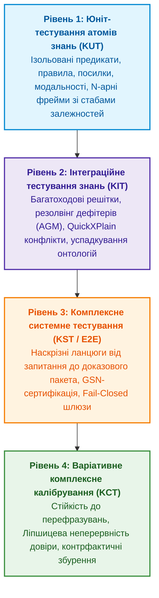

# Memo-020. Піраміда тестування знань: від ізольованих юніт-тестів атомів (KUT) та інтеграційних решіток (KIT) до комплексного калібрування варіативних запитань і висновків

**Автор концепції:** Микола Федчик  
**Тип:** дослідницький та інженерний меморандум (Research & Engineering Memorandum).  
**Дата:** 2026-10-04.  
**Статус:** APPROVED RESEARCH & METHODOLOGICAL FOUNDATION.  
**Пов'язані глави монографії:** [6](../ch06-applied-mathematics-for-expert-systems.md), [14](../ch14-requirements-detection-and-formalization.md), [15](../ch15-knowledge-extraction-and-kb-construction.md), [20](../ch20-explanation-engine.md), [23](../ch23-knowledge-base-verification.md), [24](../ch24-system-diagnosis.md), [25](../ch25-how-expert-systems-learn.md), [26](../ch26-continual-learning.md), [31](../ch31-syllogistic-reasoning-and-relation-lattices.md), [34](../ch34-deterministic-relational-analysis-abduction-and-socratic-dialogue.md).

---

## 1. Проблема: Прогалина між статичним аналізом та макроскопічними метриками

У класичній інженерії програмного забезпечення (Software Engineering) парадигма забезпечення якості спирається на сувору піраміду тестування Майка Кона:
$$\text{Unit Tests} \to \text{Integration Tests} \to \text{System / E2E Tests}$$
Кожен модуль перевіряється в ізоляції з фіктивними залежностями (stubs, mocks), потім тестується взаємодія компонентів через інтерфейсні контракти, і лише наприкінці система атестується наскрізними сценаріями.

Натомість в інженерії знань (Knowledge Engineering) та галузі штучного інтелекту історично склалася небезпечна методологічна прірва:
1. **Стрибок через рівні:** Інженери або обмежуються сухим статичним аналізом (SMT-розв'язувачі для пошуку тавтологій чи циклів у правилах, як у Главі 23), або відразу перевіряють систему на макроскопічних наборах даних (екзаменаційні матриці, F1-score, точність на 1000 запитах, як у Главі 25).
2. **Відсутність концепції атомарного тесту знання (Knowledge Unit Testing, KUT):** Немає стандарту ізольованого тестування окремого атома знання (правила, поняття, предикату чи $N$-арного фрейму). Якщо правило повертає хибний висновок, важко локалізувати, чи помилка криється у самому правилі, у спотворених вхідних фактах, чи в інтерпретації модальності.
3. **Ілюзія класичного калібрування (The Calibration Fallacy):** Традиційні підходи до калібрування довіри (Platt Scaling, Isotonic Regression, Brier Score, Expected Calibration Error — ECE) розраховуються на фіксованих замкнених вибірках. У реальному середовищі користувачі формулюють запитання з нескінченною лінгвістичною варіативністю. Класичне калібрування не вимірює чутливість висновку до синонімічних або граматичних збурень запиту (*Paraphrase Brittleness*).
4. **Змішування парадигм виведення:** Тестування дедуктивних правил, індуктивних узагальнень та абдуктивних гіпотез проводиться за єдиним шаблоном «вхід $\to$ очікуваний вихід», що спотворює їхню різну епістемічну природу.

---

## 2. Авторська концепція: Піраміда тестування знань (Knowledge Testing Pyramid)

Микола Федчик пропонує формалізувати повний інженерний життєвий цикл тестування знань (Knowledge Testing Lifecycle, KTL), еквівалентний класичному тестуванню ПЗ, але адаптований до символьної та нейро-символьної логіки.

---

## 3. Деталізація рівнів піраміди тестування

### 3.1. Рівень 1: Knowledge Unit Testing (KUT) — Тестування атомів знань

**Об'єкт тестування:** Одиничний неподільний атом знання:
- Окреме продукційне правило $R_i: \text{Antecedent} \to \text{Consequent}$.
- Окремий $N$-арний семантичний фрейм (ролі `actor`, `action`, `target`, `conditions`, `exceptions`).
- Окреме визначення поняття (аксіома онтології).

**Методологія ізоляції (Premise Mocking & Boundary Analysis):**
1. **Mocking посилок:** Всі предикати, що входять в антецедент, не обчислюються через базу знань, а підставляються фіктивними значеннями (`true`, `false`, `unknown / Kleene 3VL`).
2. **Детекція вакуумної істинності (Vacuous Truth Trap):** Перевірка імплікації $P \to Q$. Якщо $P \equiv \text{false}$, матеріальна імплікація класичної логіки формально істинна, що є джерелом небезпечних помилок в експертних системах. KUT вимагає релевантної логіки: тест зобов'язаний збуджувати антецедент у різних конфігураціях.
3. **Аналіз граничних значень (Boundary Value Analysis, BVA):** Якщо правило містить інтервальні обмеження (наприклад, $\text{MTU} \in [576, 65535]$, $\text{Timeout} \le 300\,\text{ms}$), KUT генерує вхідні вектори на межах: $\min - 1$, $\min$, $\min + 1$, $\max - 1$, $\max$, $\max + 1$.
4. **Тестування деонтичної сили (Modal Integrity Test):** Перевірка, що правило з модальністю `MUST` генерує категоричний обов'язок, а `SHOULD` — рекомендацію, яка блокується наявністю явно задокументованого винятку.

### 3.2. Рівень 2: Knowledge Integration Testing (KIT) — Інтеграційне тестування композиції

**Об'єкт тестування:** Взаємодія зв'язаної групи правил, ієрархій понять та механізмів спростування:
1. **Багатоходові дедуктивні ланцюги (Multi-Hop Chaining):** Перевірка коректності проходження сигналів крізь ланцюги правил $A \to B \to C \to D$. Виявлення семантичного зсуву термінів уздовж ланцюга (Equivocation Defect).
2. **Резолвінг дефітерів (Defeater & Exception Interaction):**
   - *Підривні дефітери (Undercutting Defeaters):* перевірка блокування правила при появі сумніву в надійності сенсора або джерела.
   - *Спростовні дефітери (Rebutting Defeaters):* перевірка коректності розв'язання конфлікту, коли дві норми стверджують взаємовиключні наслідки ($Q$ та $\neg Q$), через решітку пріоритетів (Lex Superior, Lex Posterior, Lex Specialis).
3. **Онтологічна сумісність (Lattice & Inheritance Integration):** Перевірка відсутності ромбоподібних аномалій успадкування (Diamond Inheritance Problem) при множинній класифікації сутності.
4. **Виділення мінімальних конфліктів (QuickXPlain Invariant):** Інтеграційний тест подає суперечливий набір фактів і верифікує, що алгоритм локалізації ізолює саме мінімальну несумісну підмножину ($MUC$), а не випадковий набір правил.

### 3.3. Рівень 3: Knowledge System Testing (KST) — Комплексне наскрізне тестування

**Об'єкт тестування:** Повний цикл функціонування експертної системи:
- Прийом неструктурованого або напівструктурованого запиту.
- Семантичний розбір у запитальний фрейм $Q$.
- Видобування та зв'язування побайтових доказів з першоджерел (`HostEvidenceGate`).
- Побудова графа доведення (Proof DAG).
- Формування структурованого пояснення та GSN-сертифіката довіри.
- **Fail-Closed верифікація:** Якщо критичний доказ відсутній або пошкоджений, система зобов'язана повертати типізовану відмову (`refusal`), а не наближену здогадку.

---

## 4. Якісна та математична оцінка варіативності (Knowledge Calibration & Sensitivity)

### 4.1. Варіативні запитання та показник семантичної інваріантності

Класичний тест перевіряє канонічне формулювання: $q_0 = \text{«Який максимальний розмір сегмента TCP?»}$.  
У реальності запитання варіюється синонімами, порядком слів та граматичними конструкціями: $\mathcal{Q}(q_0) = \{q_0, q_1, \dots, q_m\}$.

**Показник семантичної інваріантності (Semantic Invariance Score, SIS):**
Нехай $\text{DAG}(q)$ — граф доведення, що згенерований системою для запиту $q$, а $\text{Verdict}(q)$ — підсумкове рішення.
Дисперсія виведення на многовиді перефразувань оцінюється як:
$$\text{SIS}(\mathcal{Q}) = 1 - \frac{1}{|\mathcal{Q}|} \sum_{q_i \in \mathcal{Q}} \Big[ \alpha \cdot \mathbb{I}\big(\text{Verdict}(q_i) \neq \text{Verdict}(q_0)\big) + (1 - \alpha) \cdot d_{\text{Graph}}\big(\text{DAG}(q_i), \text{DAG}(q_0)\big) \Big]$$
де:
- $\mathbb{I}$ — індикаторна функція розбіжності вердикту (катастрофічна нестійкість);
- $d_{\text{Graph}}$ — нормалізована графова відстань редагування (Tree Edit Distance) між ланцюгами посилок;
- $\alpha \in [0, 1]$ — ваговий коефіцієнт (за замовчуванням $\alpha = 0{,}7$).

Якщо $\text{SIS} < 0{,}98$, система страждає на лінгвістичну вразливість і не має права допускатися до експлуатації в критичних доменах.

### 4.2. Варіативні висновки та Ліпшицева неперервність бази знань

Як змінюється впевненість та обґрунтованість системи при невеликих варіаціях вхідних емпіричних даних $\mathcal{E}$?
Нехай простір свідчень оснащено метрикою $d_{\mathcal{E}}(E_1, E_2)$, а простір епістемічного стану системи — метрикою $d_{\mathcal{B}}(B_1, B_2)$.

**Критерій Ліпшицевої стійкості знання (Knowledge Lipschitz Continuity):**
База знань вважається стійкою щодо класу задач, якщо існує скінченна константа Ліпшиця $L_K < \infty$, така що для будь-яких допустимих збурень свідчень:
$$d_{\mathcal{B}}\big(\text{Reasoning}(E_1), \text{Reasoning}(E_2)\big) \le L_K \cdot d_{\mathcal{E}}(E_1, E_2)$$

**Фізичний зміст:** Якщо при зміні виміряної температури на $0{,}01^\circ\text{C}$ або зміні часу тайм-ауту на $1\,\mu\text{s}$ система радикально змінює діагноз від «Норма» до «Критична катастрофа» без проміжної фази дефітера або попередження, константа $L_K \to \infty$. Такий розрив є епістемічним дефектом правила, що виявляється під час тестування чутливості (Sensitivity Testing).

---

## 5. Тестування різних парадигм логічного виведення

| Парадигма виведення | Що саме є «істиною» | Критерій тестування (Assertion / Invariant) | Що вважається дефектом (Failure) |
|---|---|---|---|
| **Дедукція (Deductive)** | Необхідний наслідок за аксіомами | **Soundness & Completeness:** Якщо посилки істинні, висновок гарантовано істинний. Перевірка замкненості за методом резолюцій або таблиць. | Хибний висновок при істинних посилках; вакуумна істинність; тавтологія. |
| **Індукція (Inductive)** | Закономірність, видобута зі спостережень | **PAC-Bound (Probably Approximately Correct):** Ймовірність помилки генералізації $\le \epsilon$ з довірою $1 - \delta$ при розмірі вибірки $N \ge \frac{1}{\epsilon}(\ln |\mathcal{H}| + \ln \frac{1}{\delta})$. | Перенавчання (overfitting); вироджене правило з нульовим покриттям; порушення інваріантів на контрприкладах. |
| **Абдукція (Abductive)** | Найбільш правдоподібне пояснення спостережень | **Occam Parsimony & Explanatory Power:** Гіпотеза $H$ зобов'язана дедуктивно пояснювати аномалію $O$ ($H \cup K \models O$), бути несуперечливою ($H \cup K \not\models \bot$) та мати мінімальну складність за Колмогоровим. | Висування тривіальних або надмірно складних гіпотез; ігнорування відомих спростувань. |
| **Спростовні міркування (Defeasible)** | Обґрунтоване переконання за відсутності заперечень | **Dung's Grounded Extension:** Стійкість множини висновків проти атак з боку активних дефітерів. | Використання спростованого засновку; ігнорування блокувального винятку. |
| **Прецеденти (Case-Based)** | Аналогія з валідованим досвідом | **Metric Metric Monotonicity:** Що ближчий прецедент у метриці Хеммінга/Махаланобіса, то вища схожість висновку; наявність негативного прецеденту зобов'язана блокувати екстраполяцію. | Хибне перенесення розв'язку через спотворену метрику близькості. |

---

## 6. Інженерні пропозиції для впровадження у виробничий рантайм та монографію

1. **Новий пакет `internal/knowledgetest`:**
   Створити інфраструктуру тестування знань:
   - `UnitTestRunner`: виконання тестів KUT для окремих правил і фреймів із моками антецедентів.
   - `IntegrationLatticeRunner`: перевірка взаємодії ланцюгів та дефітерів.
   - `VariationalCalibrator`: розрахунок метрики семантичної інваріантності $\text{SIS}$ та Ліпшицевої стійкості $L_K$.
2. **Місце в структурі Книги:**
   Концепція є фундаментальним методологічним мостом у **Частині V («Верифікація, діагностика та неперервне навчання»)**:
   - Вона поєднує формальну верифікацію правил ([Глава 23](../ch23-knowledge-base-verification.md)), системну діагностику ([Глава 24](../ch24-system-diagnosis.md)) та екзаменаційні матриці ([Глава 25](../ch25-how-expert-systems-learn.md)) у цілісну інженерну піраміду тестування.
