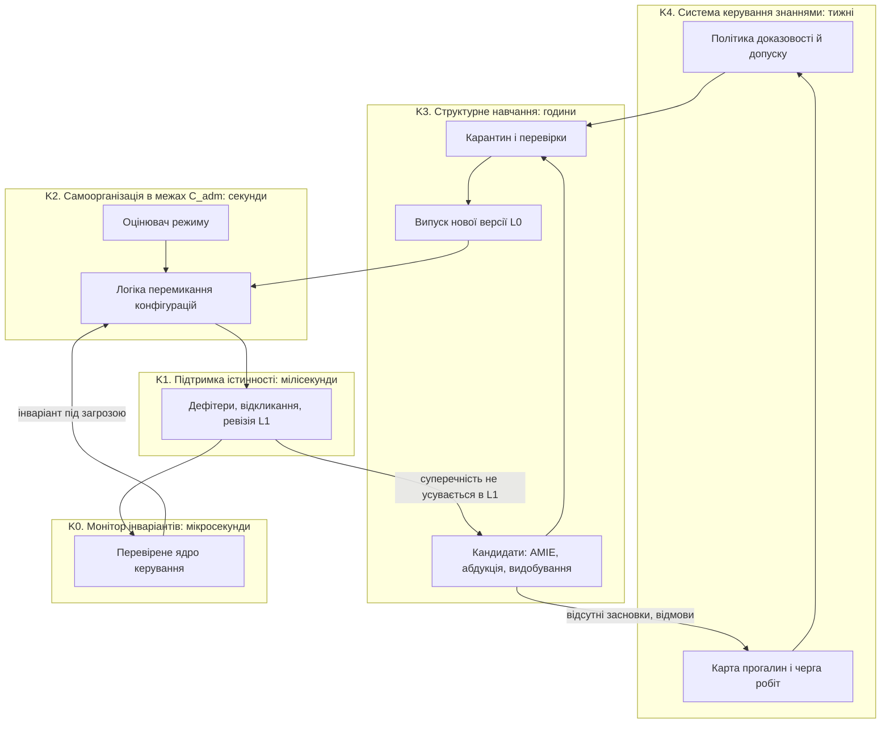

# Memo-020. Самоорганізовані експертні системи та системи керування знаннями: концепція і наукове підґрунтя з позицій сучасної кібернетики

**Тип:** концептуальний і дослідницький меморандум.

**Дата:** 2026-10-04.

**Статус:** огляд першоджерел і проєкт концепції. Бібліографічні дані перевірено через Crossref 2026-10-04. Код глав 34 і 35 проаналізовано читанням, без запуску. Випробувань концепції не виконано. Рівні зрілості парадигм є експертною класифікацією автора мемо, а не результатом метааналізу.

**Пов'язані глави:** [11](../ch11-knowledge-elicitation-from-experts.md), [20](../ch20-explanation-engine.md), [22](../ch22-cybernetics-edge-to-backend.md), [23](../ch23-knowledge-base-verification.md), [25](../ch25-how-expert-systems-learn.md), [26](../ch26-continual-learning.md), [33](../ch33-inter-system-knowledge-exchange-and-model-teaching.md), [34](../ch34-deterministic-relational-analysis-abduction-and-socratic-dialogue.md), [35](../ch35-self-organizing-expert-systems-synergetics-and-npu-runtime.md).

## Питання й теза

Що саме доказова експертна система (ЕС) може змінювати в собі без участі оператора, щоб і далі давати відтворювані висновки з побайтовими цитатами? Які наукові парадигми вже дають для такої зміни операційні визначення, а не лише метафори?

Теза мемо: самоорганізація доказової ЕС є регулюванням із кількома контурами, розділеними за часовими масштабами. Швидкі контури вибирають і перемикають конфігурації в межах множини, допустимість якої доведено до запуску. Повільний контур змінює саму базу знань лише через карантин, перевірки та випуск нової версії незмінного шару L0. Система керування знаннями (СКЗ) замикає найповільніший контур: сліди прогалин, які залишає ЕС, упорядковують роботу інженерів знань.

H-ADM: якщо швидкі контури обирають лише серед заздалегідь перевірених конфігурацій, то на довільних потоках подій жодна активна конфігурація не порушує інваріантів безпеки, а частка правильних рішень не нижча, ніж у ЕС із фіксованою конфігурацією. Спростування: знайдено потік подій, на якому перемикання дає гірший результат за фіксовану конфігурацію або виводить ЕС за межі допустимої множини.

H-CSD: зростання дисперсії й автокореляції першого порядку в сигналах об'єкта керування попереджає про наближення до критичного переходу раніше, ніж пороговий монітор, за прийнятної частки хибних тривог. Спростування: на симуляторі з відомою біфуркацією виграш у часі відсутній або досягається лише ціною неприйнятних хибних тривог.

H-INC: контур ревізії переконань зменшує міру суперечливості шару L1, не відкликаючи жодного факту L0. Спростування: зменшення досягається лише видаленням фактів L0 або міра не зменшується.

H-STIG: черга робіт інженерів знань, упорядкована за слідами прогалин (незакриті сократівські фрейми, відсутні засновки, спрацювання дефітерів), швидше закриває прогалини, що найчастіше блокують відповіді, ніж черга «першим прийшов, першим обслужений». Спростування: за однакових ресурсів різниці в часі закриття немає.

## Межі дослідження

Мемо спирається на текст глав 34 і 35 станом на коміт `4fe1ffe` і на першоджерела з кібернетики, теорії керування, штучного інтелекту, програмної інженерії та керування знаннями. Зауваження підрозділу 1.1 повторно перевірено на коміті `238165b`. Поведінку коду глав на виконанні не перевірено. Висновки про код зроблено з читання, і кожен висновок пов'язано з конкретною конструкцією мови Go. Термін «самоорганізація» вживається в значенні, визначеному в розділі 2; інші значення з популярної літератури не розглядаються.

## 1. Що вже встановили глави 34 і 35

Глава 34 описує, як ЕС поводиться з неповнотою знань. Два поняття з'єднує доведений ланцюг суджень із цитатами, або робоча гіпотеза з явно названим відсутнім засновком, або обґрунтована відмова. Абдукція за Пірсом, видобування правил AMIE за припущенням часткової повноти та сократівські фрейми уточнення породжують кандидатів у нові знання й канал запитань до оператора. Інваріант ізоляції гіпотез забороняє видавати припущення за факт.

Глава 35 описує ЕС, занурену в потік подій. Незмінний шар L0, відображений у пам'ять через `mmap`, і змінний дельта-шар L1 розділяють сертифіковане знання та ситуативні факти. Система підтримки істинності з активними дефітерами відкликає висновки, засновки яких підірвала сенсорна відмова. Сервіси Re-Search, Re-Ranking і Re-Thinking добирають підграфи, перебудовують пріоритети норм і усувають суперечності. Обчислення розподілено між цифровим сигнальним процесором (DSP), нейронним процесором (NPU) і центральним процесором.

Разом глави дають компоненти, але не регуляторну структуру, яка їх пов'язує. Не визначено, які змінні вважаються організацією ЕС, хто дозволяє зміну кожної з них і за яким критерієм зміну вважати поліпшенням. Глава 35 також подає частину фізичних аналогій як закони. Таблиця відокремлює встановлене знання від аналогій.

| Твердження глави | Наукове підґрунтя | Статус для ЕС | Що змінити |
|---|---|---|---|
| Абдукція породжує гіпотези; гіпотеза не стає фактом без засновку (гл. 34) | Пірс і абдуктивне логічне програмування (джерела 3 і 5 глави 34) | встановлене | залишити |
| Видобування правил AMIE з PCA-достовірністю (гл. 34) | Галаррага та співавтори [[1]](#src-1) | встановлене | виправити перелік авторів (підрозділ 1.1) |
| Правдоподібність гіпотез 0,75 і 0,60 (гл. 34) | відсутнє | інженерна константа | замінити порядковою шкалою або калібрувати на розмічених прогалинах |
| Система підтримки істинності й дефітери (гл. 35) | Дойл [[2]](#src-2), де Клеєр [[3]](#src-3), Поллок [[4]](#src-4) | встановлене | назвати активний дефітер підривальним дефітером за Поллоком |
| Ревізія за AGM і QuickXplain (гл. 35) | Алчуррон, Ґерденфорс, Макінсон [[5]](#src-5) | встановлене для однієї ревізії | для повторних ревізій потрібні постулати Дарвіша й Перла [[6]](#src-6); субмілісекундну тривалість не виміряно |
| Принцип підпорядкування й параметри порядку (гл. 35) | Хакен [[7]](#src-7), [[8]](#src-8) | математичний результат для систем поблизу нестійкості з розділенням часових масштабів | для ЕС залишається аналогією, доки не показано розділення масштабів (підрозділ 3.3) |
| «Чотири закони інформаційної синергетики» й нерівність $dS_{\text{total}}/dt \le 0$ (гл. 35) | баланс ентропії Пригожина [[9]](#src-9) стосується фізичних систем | аналогія, не закон | замінити вимірними показниками узгодженості (підрозділ 3.4) |
| L0 як «фазовий атрактор істинності» (гл. 35) | архітектура Simplex [[10]](#src-10), захисні щити [[11]](#src-11) | інженерна практика під іншою назвою | описати як перевірене ядро керування з модулем перемикання |
| Критичне сповільнення перед біфуркацією (гл. 35) | Шеффер та співавтори [[12]](#src-12) | встановлене в екології й кліматології | визначити показники й межі (підрозділ 3.3) |
| Закон необхідної різноманітності Ешбі (гл. 35) | Ешбі [[13]](#src-13) | встановлене | вимірювати різноманітність збурень і відповідей (підрозділ 3.1) |
| CRDT у шарі L1 (гл. 35) | Шапіро та співавтори [[14]](#src-14) | встановлене для збіжності реплік | збіжність реплік не означає логічної несуперечливості (підрозділ 3.6) |
| Прецедент Livingstone (гл. 35) | Мускеттола та співавтори [[15]](#src-15), Гейден та співавтори [[16]](#src-16) | встановлене | залишити |
| $\text{ZHR} = 1{,}00$ і $\text{FCP} = 100\,\%$ у висновках (гл. 35) | у главі немає вимірювання | не підтверджене | видалити або послатися на протокол і результат |

Найміцніше підґрунтя мають механізми підтримки істинності, ревізії переконань, модельної діагностики й абдукції. Синергетична й термодинамічна мова глави 35 корисна як дидактична картина, але в нинішньому вигляді не дає перевірюваних передбачень.

### 1.1. Дефекти посилань і коду, що впливають на концепцію

1. У главі 35 маркер `[[9]](#src-9)` для праць Хакена й Пригожина веде на якір, якого немає в списку джерел, а пункт 10 списку є працею про захисні щити для навчання з підкріпленням. Ту саму працю в списку приписано «Könighofer, B., Bloem, R., et al.», тоді як першим автором статті AAAI 2018 є Мохаммед Альшейх [[11]](#src-11).
2. Шину `EventBus` у главі 35 описано як кільцевий буфер у стилі LMAX Disruptor, але реалізовано каналами Go з гілкою `default:` в операторі `select`. Коли буфер підписника заповнений, подія мовчки відкидається, зокрема подія з пріоритетом `PriorityCritical`. Для ЕС, яка обіцяє реакцію на відмову сенсора, втрата критичної події без лічильника й без переходу в безпечний стан суперечить заявленій меті.
3. Функція порівняння в `ReRank` повертає `true` для будь-якої пари, де перший елемент має предикат `emergency_action`, навіть коли другий елемент теж аварійний. Таке порівняння не задає строгого слабкого порядку, якого вимагає `sort.SliceStable`, тому порядок аварійних правил не визначений.
4. Глава 34 декларує двонаправлений пошук у ширину, але `FindPaths` розгортає лише прямий фронт від джерела, хоча й з оберненими ребрами. Складність залишається $\mathcal{O}(b^d)$, а не $\mathcal{O}(b^{d/2})$.
5. `GenerateHypotheses` у главі 34 перебирає мапи Go `fromLinks` і `fromDocs`. Специфікація Go не визначає порядку обходу мап, тому за кількох посередників набір із двох повернених гіпотез може змінюватися між запусками. Це порушує інваріант детермінованого впорядкування з підрозділу 3.1 тієї самої глави.
6. На джерела 5–9 глави 34 немає посилань у тексті. У джерелі 2 замість Christina Teflioudi написано «Christina Tefliovich» і пропущено Катю Хозе [[1]](#src-1).
7. Глава 35 стверджує, що онтологія еволюціонує «без операторського втручання», і водночас вимагає проходження карантину й перевірок. Без розмежування рівнів змін із розділу 2 ці два твердження суперечать одне одному.

## 2. Робоче визначення самоорганізації для доказової ЕС

Ґершенсон і Гейліген показали, що «самоорганізація» залежить від спостерігача: систему називають самоорганізованою щодо вибраних змінних і масштабу опису [[17]](#src-17). Отже, перш ніж стверджувати самоорганізацію ЕС, потрібно назвати змінні, які вважаються її організацією. Шалізі зі співавторами запропонували вимірювати самоорганізацію як зростання статистичної складності оптимального прогнозувального подання процесу [[18]](#src-18), а Прокопенко, Бошетті й Райан систематизували інформаційно-теоретичні міри складності, самоорганізації та емерджентності [[19]](#src-19). Ці праці дають мову вимірювання, але не готовий показник для бази знань.

Нехай $\mathcal{C}_{\text{adm}}$ є множиною конфігурацій ЕС (активні підграфи правил, решітка пріоритетів, режим виведення), для кожної з яких до запуску доведено інваріанти безпеки й доказовості. Мемо пропонує вважати, що ЕС самоорганізується щодо змінної конфігурації $C(t)$, якщо одночасно виконано три умови:

1. $C(t)$ змінюється внутрішніми правилами ЕС у відповідь на події, без зовнішньої команди, яка задає саме нове значення $C$.
2. Після зміни вимірний показник якості не гіршає: міра суперечливості L1 зменшується або частка правильних рішень на контрольних сценаріях зростає.
3. Для всіх моментів часу $t$ виконується $C(t) \in \mathcal{C}_{\text{adm}}$.

Зміни, які виводять ЕС за межі $\mathcal{C}_{\text{adm}}$, наприклад нове правило, нове поняття чи зміна L0, за цим визначенням є навчанням бази знань, а не самоорганізацією. Такі зміни проходять контур допуску з глав 23, 25 і 33. Таблиця розкладає зміни ЕС на п'ять рівнів.

| Рівень | Часовий масштаб | Що змінюється | Хто дозволяє зміну | Механізм |
|---|---|---|---|---|
| 0. Рефлекс | мікросекунди–мілісекунди | вихідна дія | правило, перевірене до запуску | монітор інваріантів, «подія → дія» |
| 1. Адаптація стану | мілісекунди–секунди | значення в L1, статуси фактів | система підтримки істинності | дефітери, надгробки, відкликання висновків |
| 2. Самоорганізація в $\mathcal{C}_{\text{adm}}$ | секунди–хвилини | режим, активні підграфи, пріоритети | оцінювач режиму й логіка перемикання | Re-Search, Re-Ranking, Re-Thinking |
| 3. Структурне навчання | години–тижні | правила, поняття, L0 | процедура допуску й рецензент | AMIE, абдукція, видобування, карантин, випуск |
| 4. Організаційна самоорганізація СКЗ | тижні–роки | пріоритети робіт, політики, онтологія домену | інженери знань і власник політики | стигмергія, SECI, модель життєздатної системи |

Рівні 0–2 можуть працювати на борту без людини. Рівень 3 може починатися автоматично, але закінчується рішенням про допуск. Рівень 4 описує людей і процеси, а не програму.

## 3. Концепція: багатоконтурна керована самоорганізація

Діаграма показує контури, їхні часові масштаби та межі повноважень. Стрілки від повільних контурів до швидких передають обмеження; стрілки у зворотному напрямку передають сигнал, що швидший контур вичерпав свої можливості.

Головна властивість схеми полягає в тому, що жоден контур не змінює змінних повільнішого контуру. Контур K2 перемикає конфігурації, але не створює нових. Контур K1 відкликає висновки в L1, але не змінює L0. Контур K3 створює нову версію L0 лише через допуск. Такий поділ відтворює подвійний зворотний зв'язок Ешбі (підрозділ 3.1) і робить кожну автономну зміну перевірюваною.

### 3.1. Ультрастабільність Ешбі й закон необхідної різноманітності

Ешбі описав ультрастабільну систему двома контурами зворотного зв'язку: перший контур підтримує поточну поведінку, другий ступінчасто змінює параметри першого, коли суттєві змінні виходять за допустимі межі [[20]](#src-20). У ЕС суттєвими змінними є інваріанти безпеки й доказовості, перший контур є виведенням у поточній конфігурації, а ступінчаста зміна є перемиканням конфігурації в K2. Ця модель точніше описує Re-Ranking із глави 35, ніж фазовий перехід у фізичному сенсі: пріоритети змінюються дискретно й лише тоді, коли поточна конфігурація перестає утримувати суттєві змінні.

Закон необхідної різноманітності вимагає, щоб різноманітність відповідей регулятора була не меншою за різноманітність збурень, які він має компенсувати [[13]](#src-13). Для ЕС із цього виходить перевірювана вимога: перелічити класи збурень (відмови сенсорів, зміни режимів, нові норми) і для кожного класу показати конфігурацію з $\mathcal{C}_{\text{adm}}$, яка утримує інваріанти. Класи без такої конфігурації становлять дефіцит різноманітності, і цей дефіцит закриває K3, а не K2.

### 3.2. Теорема доброго регулятора й принцип внутрішньої моделі

Конант і Ешбі довели, що найпростіший оптимальний регулятор системи має бути її моделлю [[21]](#src-21). Френсіс і Вонгем для лінійних систем показали, що регулятор, який стійко відстежує сигнали й компенсує збурення, мусить містити модель процесу, що ці сигнали породжує [[22]](#src-22). Для ЕС із цього випливають дві вимоги. По-перше, шар L0 має містити модель керованого об'єкта й нормативного середовища, а не лише перелік правил реакції. По-друге, самоорганізація не компенсує відсутньої моделі: якщо в L0 немає знання про клас збурень, ЕС може лише позначити прогалину. Тому абдуктивні гіпотези глави 34 потрапляють у K3 як кандидати, а не в K2 як робочі правила.

### 3.3. Параметри порядку й ранні сигнали без фізичних метафор

У синергетиці Хакена параметр порядку виникає поблизу нестійкості, коли кілька повільних мод підпорядковують собі швидкі змінні, і швидкі змінні можна адіабатично виключити [[7]](#src-7). Хакен окремо розглянув інформаційне тлумачення цього підходу [[8]](#src-8). Для ЕС аналогом параметра порядку є оцінка режиму об'єкта, наприклад «штатний політ» чи «деградація гідравліки». Перенесення стає більше ніж метафорою за двох вимірних умов: режим змінюється на порядки повільніше за сенсорні змінні, а умовний розподіл сенсорних змінних за відомого режиму стабільний. Обидві умови перевіряються на записах телеметрії. Перемикання режимів потребує гістерезису, інакше шум біля межі режимів спричинить часті перемикання конфігурації.

Критичне сповільнення має операційне визначення: поблизу багатьох біфуркацій система повільніше повертається після малих збурень, тому зростають дисперсія й автокореляція першого порядку її змінних [[12]](#src-12). Дакос та співавтори порівняли методи виявлення таких сигналів на модельованих рядах [[23]](#src-23), а Боеттігер і Гастінгс показали, що на коротких рядах і без контролю частоти хибних тривог ці показники легко переоцінити [[24]](#src-24). Тому в концепції сигнал критичного сповільнення лише підвищує готовність ЕС: запускає попередній добір підграфів і частіший контроль. Незворотну дію запускає тільки монітор інваріантів K0.

### 3.4. Узгодженість замість «експорту ентропії»

Пригожин описав зміну ентропії відкритої системи як суму обміну з середовищем і внутрішнього виробництва ентропії, яке не буває від'ємним; упорядкована дисипативна структура існує, коли обмін компенсує виробництво [[9]](#src-9). Ентропія в цьому балансі є термодинамічною величиною речовини й енергії. Ландауер показав, що стирання одного біта вимагає розсіяння щонайменше $kT \ln 2$ енергії, де $k$ є сталою Больцмана, а $T$ абсолютною температурою [[25]](#src-25). Ця межа на багато порядків менша за енергоспоживання сучасних процесорів і нічого не говорить про логічну якість бази знань. Тому «експорт ентропії» через дефітери в главі 35 є метафорою.

Ту саму інженерну думку можна виразити вимірно. Система підтримки істинності Дойла [[2]](#src-2) і система на основі припущень де Клеєра [[3]](#src-3) зберігають залежності висновків від засновків. Абстрактна аргументація Дунга [[26]](#src-26) і структурована аргументація ASPIC+ [[27]](#src-27) визначають, які аргументи приймаються за наявності нападів, а Поллок розрізнив спростувальні й підривальні дефітери [[4]](#src-4). Постулати AGM [[5]](#src-5) описують одну ревізію, тому для послідовності ревізій потрібні постулати Дарвіша й Перла [[6]](#src-6). Гантер і Конечний запропонували міри суперечливості бази, зокрема значення Шеплі для внеску кожної формули в конфлікт [[28]](#src-28). На цій основі мемо пропонує показники для контуру K1.

| Показник | Визначення | Очікувана зміна після Re-Thinking |
|---|---|---|
| Кількість мінімальних несумісних підмножин | число MUS серед активних тверджень L1 разом із L0 | зменшується до нуля або до задокументованих конфліктів |
| Внесок у конфлікт | значення Шеплі за Гантером і Конечним для кожного твердження | першими відкликаються твердження L1 з найбільшим внеском |
| Частка застарілих фактів | частка фактів L1, старших за допустимий вік свого типу | не зростає під тривалим потоком подій |
| Час відкликання | час від події-дефітера до відкликання останнього залежного висновку | не перевищує бюджету безпечного інтервалу |
| Невизначеність режиму | ентропія Шеннона розподілу оцінювача режиму | зменшується після розрізнювальних даних; рахується лише для каліброваного оцінювача |

### 3.5. L0 і L1 як Simplex-архітектура та контрольована самоорганізація

Ша описав архітектуру Simplex: просте перевірене ядро керування, складне високопродуктивне ядро й модуль рішення, який передає керування перевіреному ядру, коли стан наближається до межі безпечної області [[10]](#src-10). Альшейх зі співавторами формалізували захисний щит, що блокує дії навчуваного агента, які порушують специфікацію в часовій логіці [[11]](#src-11). Шар L0 разом із монітором інваріантів відповідає перевіреному ядру, а шар L1 і моделі на NPU відповідають високопродуктивному ядру. Ця назва точніша за «атрактор істинності», бо одразу задає, що треба довести: інваріантність безпечної області для перевіреного ядра й коректність модуля перемикання.

Термін «обмежена самоорганізація» з глави 35 має пряме першоджерело в органічних обчисленнях. Шмек зі співавторами описали архітектуру спостерігача й контролера: самоорганізовані компоненти діють автономно, спостерігач вимірює їхню емерджентну поведінку, а контролер втручається лише тоді, коли поведінка виходить за задані межі [[29]](#src-29), [[30]](#src-30). Ця архітектура відповідає контуру K2 разом із монітором K0.

### 3.6. MAPE-K, моделі під час виконання й потокове виведення

Кефарт і Чесс сформулювали автономні обчислення як цикл моніторингу, аналізу, планування й виконання над спільним знанням (MAPE-K) [[31]](#src-31). Блер, Бенкомо й Франс описали моделі під час виконання як причинно пов'язані з системою подання, які можна аналізувати й змінювати під час роботи [[32]](#src-32). У термінах MAPE-K сервіс Re-Search відповідає аналізу й попередньому плануванню, Re-Ranking відповідає плануванню, а Re-Thinking відповідає аналізу й оновленню знання. Дорожня карта де Лемоса зі співавторами визнає гарантування властивостей самоадаптивних систем відкритою задачею [[33]](#src-33). Обмеження змін множиною $\mathcal{C}_{\text{adm}}$ зводить цю задачу до перевірки скінченної множини конфігурацій і логіки перемикання.

Огляд Делл'Альйо, Делла Валле, ван Гармелена й Бернстайна систематизує моделі й системи міркувань над потоками даних [[34]](#src-34). Для розподіленого L1 глава 35 пропонує безконфліктні репліковані типи даних (CRDT). Шапіро зі співавторами довели, що такі типи даних гарантують збіжність реплік без координації [[14]](#src-14). Збіжність означає, що репліки прийдуть до однакового стану, але не означає, що цей стан логічно несуперечливий: дві репліки можуть однаково зберігати твердження і його заперечення. Тому над CRDT потрібна та сама підтримка істинності, що й над локальним L1.

### 3.7. Модельна діагностика як прецедент рівнів 1 і 2

Райтер сформулював діагностику з перших принципів як пошук мінімальних множин компонентів, припущення про несправність яких узгоджує модель зі спостереженнями [[35]](#src-35). Де Клеєр і Вільямс побудували на цій основі діагностику кількох несправностей [[36]](#src-36). Remote Agent із рушієм Livingstone виконував модельну діагностику й переконфігурацію на борту апарата Deep Space 1 [[15]](#src-15), а Livingstone 2 пізніше випробували на супутнику Earth Observing One [[16]](#src-16). Ці системи є найближчим перевіреним прецедентом рівнів 1 і 2: модель апарата задана заздалегідь, а автономно змінюються лише оцінка стану й конфігурація.

## 4. Самоорганізація системи керування знаннями

СКЗ охоплює людей, процедури й інструменти, які створюють і супроводжують базу знань ЕС. На цьому рівні самоорганізація стосується розподілу уваги експертів та інженерів знань.

Нонака описав створення організаційного знання як спіраль перетворень між неявним і явним знанням: соціалізацію, екстерналізацію, комбінацію та інтерналізацію (модель SECI) [[37]](#src-37). У книзі цим перетворенням відповідають сесії з експертами (глава 11), формалізація вимог (глава 14), видобування й побудова бази знань разом з AMIE (глави 15 і 34) та пояснення, які навчають оператора (глава 20).

Гейліген визначив стигмергію як координацію через сліди дій у спільному середовищі: слід однієї дії стимулює наступну дію без центрального плану [[38]](#src-38). ЕС із механізмами глави 34 уже залишає такі сліди: незакриті сократівські фрейми, вибрані оператором варіанти, відсутні засновки абдуктивних гіпотез, відхилення в карантині, спрацювання дефітерів. Якщо записувати ці сліди в спільну карту прогалин разом із частотою та наслідками для відповідей, черга робіт інженерів знань упорядковується без ручного планування. Гіпотеза H-STIG перевіряє, чи такий порядок кращий за звичайну чергу.

Модель життєздатної системи Бера [[39]](#src-39) дає структуру для СКЗ, а Ахтерберг і Врінс застосували цю модель саме до керування знаннями [[40]](#src-40). Мемо пропонує таку відповідність. Система 1 складається з доменних баз знань і ЕС. Система 2 узгоджує онтології й розв'язує конфлікти між доменами. Система 3 відповідає за перевірку й випуск (глава 23), а система 3* виконує вибірковий аудит. Система 4 стежить за зовнішнім середовищем: нові RFC, стандарти, карта прогалин. Система 5 визначає політику доказовості й допуску. Рекурсивність моделі дозволяє застосувати ту саму схему до однієї ЕС і до організації, що супроводжує кілька ЕС.

Для розподілених ЕС корисний голонічний підхід: еталонна архітектура PROSA для виробничих систем поєднує автономних агентів-голонів зі стабільною ієрархією відповідальності [[41]](#src-41). Українська кібернетична школа дала окреме першоджерело для рівня 3. Метод групового врахування аргументів (МГУА) Івахненка добирає структуру моделі за зовнішнім критерієм, тобто за якістю на даних, які не використовувалися для оцінювання параметрів [[42]](#src-42). Той самий принцип варто застосувати до кандидатів AMIE: правило допускається за результатами на відкладених фактах, а не лише за порогами підтримки й достовірності на тій самій базі.

## 5. Перспективні парадигми: зрілість наукового підґрунтя

Таблиця класифікує парадигми за зрілістю для доказових ЕС. Рівень А означає теорію з інженерною практикою в критичних системах. Рівень Б означає встановлену теорію, перенесення якої на ЕС потребує дослідів. Рівень В означає дослідницький фронт зі спірними результатами. Рівень Г означає аналогію без операційного визначення для ЕС.

| Парадигма | Першоджерело | Що встановлено | Рівень для ЕС | Роль у концепції |
|---|---|---|---|---|
| Модельна діагностика | [[35]](#src-35), [[36]](#src-36), [[15]](#src-15) | діагностика за моделлю й бортова переконфігурація | А | рівні 1 і 2 |
| Перевірене ядро й захисний щит | [[10]](#src-10), [[11]](#src-11) | межа між перевіреним і високопродуктивним керуванням | А | K0, зв'язок L0 з L1 |
| Підтримка істинності, аргументація, ревізія переконань | [[2]](#src-2), [[3]](#src-3), [[26]](#src-26), [[27]](#src-27), [[5]](#src-5), [[6]](#src-6) | формальна семантика відкликання й конфліктів | А для систем підтримки істинності, Б для повторної ревізії в реальному часі | K1 |
| Автономні обчислення й моделі під час виконання | [[31]](#src-31), [[32]](#src-32), [[33]](#src-33) | цикл MAPE-K у програмних системах; гарантування залишається відкритою задачею | А для програм, Б для доказових ЕС | K2 |
| Потокове виведення й CRDT | [[34]](#src-34), [[14]](#src-14) | моделі міркувань над потоками; збіжність реплік | А | розподілений L1 |
| Ультрастабільність і необхідна різноманітність | [[13]](#src-13), [[20]](#src-20) | подвійний контур адаптації; нижня межа різноманітності регулятора | Б | структура K1 і K2, перевірка покриття збурень |
| Добрий регулятор і внутрішня модель | [[21]](#src-21), [[22]](#src-22) | регулятор повинен містити модель об'єкта | А в теорії керування, Б для баз знань | вимога до змісту L0 |
| Контрольована самоорганізація | [[29]](#src-29), [[30]](#src-30) | архітектура спостерігача й контролера | Б | K2 разом із K0 |
| Ранні сигнали критичних переходів | [[12]](#src-12), [[23]](#src-23), [[24]](#src-24) | дисперсія й автокореляція перед біфуркаціями; відомі межі методу | Б | підвищення готовності в K2 |
| Синергетика Хакена | [[7]](#src-7), [[8]](#src-8) | параметри порядку поблизу нестійкості | Б як метод зменшення розмірності, Г як «закони інформаційної синергетики» | оцінювач режиму за умов підрозділу 3.3 |
| Модель життєздатної системи | [[39]](#src-39), [[40]](#src-40) | структура життєздатної організації; застосування до керування знаннями | А в управлінській кібернетиці, Б для СКЗ з ЕС | K4 |
| Спіраль створення знання SECI | [[37]](#src-37) | модель перетворень неявного і явного знання | А в керуванні знаннями | K4 |
| Стигмергія | [[38]](#src-38) | координація через сліди в середовищі | Б | карта прогалин |
| Голонічні системи | [[41]](#src-41) | автономія з ієрархією у виробничому керуванні | А у виробництві, Б для ЕС | розподілені ЕС |
| МГУА | [[42]](#src-42) | добір структури моделі за зовнішнім критерієм | А для індукції моделей, Б для правил | допуск кандидатів у K3 |
| Інформаційні міри самоорганізації | [[17]](#src-17), [[18]](#src-18), [[19]](#src-19) | самоорганізація відносна спостерігача; статистична складність | В | майбутні показники K2 |
| Принцип вільної енергії й активний висновок | [[43]](#src-43) | спільна модель сприйняття й дії через мінімізацію вільної енергії | В, предмет дискусій | можливий формалізм для K2 |
| Дисипативні структури | [[9]](#src-9), [[25]](#src-25) | термодинаміка відкритих фізичних систем | Г для бази знань | лише дидактична аналогія |
| Автопоезис | [[44]](#src-44) | система відтворює власні компоненти | Г для ЕС, бо компоненти бази знань створюють люди й екстрактори | не використовувати як вимогу |
| Кібернетика другого порядку | [[45]](#src-45) | спостерігач є частиною описуваної системи | Б | оператор і сократівський діалог як частина контуру |

Найміцніше підґрунтя для самоорганізованої доказової ЕС дають не синергетика й термодинаміка, а класична кібернетика Ешбі, теорія керування, модельна діагностика, формальні моделі підтримки істинності та інженерія гарантованого виконання. Ранні сигнали критичних переходів, контрольована самоорганізація органічних обчислень і стигмергічна організація СКЗ мають першоджерела й зрозумілий шлях до вимірювання, тому є найперспективнішими напрямами досліджень. Принцип вільної енергії та інформаційні міри самоорганізації варто відстежувати, але не закладати в архітектуру без дослідів.

## 6. Програма перевірки концепції

| Тест | Що перевіряє | Спосіб | Критерій приймання |
|---|---|---|---|
| SO-01 | H-ADM: допустимість конфігурацій | генерування випадкових потоків подій і перевірка $C(t) \in \mathcal{C}_{\text{adm}}$ на кожному кроці | нуль порушень; кожне перемикання записано в журнал |
| SO-02 | H-CSD: ранні сигнали | симулятор об'єкта з відомою біфуркацією; порівняння з пороговим монітором | виграш у часі за фіксованої частки хибних тривог |
| SO-03 | H-INC: ревізія без втрати L0 | інжекція суперечливих фактів у L1 | число MUS зменшується; жоден факт L0 не відкликано |
| SO-04 | втрата подій | перевантаження шини подіями всіх пріоритетів | жодної втраченої критичної події; некритичні втрати пораховано |
| SO-05 | детермінізм | повторне відтворення того самого журналу подій | однакова послідовність конфігурацій і гіпотез |
| SO-06 | H-STIG: карта прогалин | два періоди роботи з чергою за слідами та чергою «першим прийшов» | менший час закриття прогалин, що найчастіше блокують відповіді |
| SO-07 | різноманітність | перелік класів збурень і відповідних конфігурацій | кожен клас має конфігурацію або позначений як дефіцит |
| SO-08 | енергобюджет | вимірювання джоулів на рішення для DSP, NPU і центрального процесора | бюджет дотримано на цільовій платі |

Концепцію відкидають, якщо SO-01 знаходить конфігурацію поза $\mathcal{C}_{\text{adm}}$, SO-03 зменшує суперечності лише відкликанням L0 або SO-05 дає різні послідовності на однаковому журналі.

## 7. Рекомендації для глав 34 і 35

1. Розділити в главі 35 встановлені механізми й аналогії: назвати синергетичні й термодинамічні формулювання аналогіями, прибрати нерівність $dS_{\text{total}}/dt \le 0$ як закон для бази знань і додати вимірні показники з підрозділу 3.4.
2. Описати L0 і монітор інваріантів як Simplex-архітектуру з посиланнями на Ша й Альшейха, а «обмежену самоорганізацію» пов'язати з органічними обчисленнями.
3. Ввести розмежування рівнів змін із розділу 2 і замінити «еволюцію онтології без операторського втручання» на «перемикання між перевіреними конфігураціями без оператора й навчання бази знань через допуск».
4. Додати визначення критичного сповільнення з показниками й межами методу за Шеффером, Дакосом, Боеттігером і Гастінгсом.
5. Виправити шину подій: для критичних подій використати окремий канал без відкидання або блокувальне надсилання з тайм-аутом і переходом у безпечний стан; рахувати відкинуті некритичні події. Прибрати згадку LMAX Disruptor або реалізувати кільцевий буфер.
6. Виправити функцію порівняння в `ReRank`, щоб вона задавала строгий слабкий порядок.
7. Виправити джерела глави 35: додати якорі, узгодити маркери з номерами, вказати авторів статті про щити й звірити назву статті Курієна та Наяка, яку не вдалося знайти в Crossref.
8. У главі 34 або реалізувати двонаправлений пошук, або описати фактичний однонаправлений; сортувати ключі мап перед перебором у `GenerateHypotheses`; виправити авторів AMIE; послатися на джерела 5–9 у тексті або прибрати їх.
9. Замінити числа 0,75 і 0,60 у главі 34 порядковою шкалою правдоподібності або описати процедуру калібрування.

## Висновок

Самоорганізована доказова ЕС можлива, якщо самоорганізацію визначено щодо названих змінних і обмежено множиною конфігурацій, перевіреною до запуску. Тоді автономія швидких контурів не суперечить доказовості, а зміни бази знань залишаються в повільному контурі з допуском. Глави 34 і 35 уже містять потрібні компоненти: генератор кандидатів, ізоляцію гіпотез, підтримку істинності, розділення L0 і L1, сервіси перебудови. Бракує регуляторної структури, вимірних показників і чіткої межі між встановленим знанням та аналогією.

З позицій сучасної кібернетики найбільше первинного підґрунтя мають ультрастабільність і закон необхідної різноманітності Ешбі, теорема доброго регулятора, модельна діагностика, формальні моделі підтримки істинності, Simplex-архітектура, цикл MAPE-K, модель життєздатної системи, спіраль SECI і МГУА. Ранні сигнали критичних переходів, контрольована самоорганізація та стигмергічна СКЗ мають першоджерела, але ще потребують дослідів на ЕС. Синергетика й дисипативні структури залишаються корисною мовою пояснення, доки для них не показано вимірних умов перенесення. Мемо не містить результатів випробувань; програма розділу 6 визначає, які результати потрібні, щоб концепцію прийняти або відкинути.

## Словник

| Термін | Значення |
|---|---|
| Самоорганізація щодо змінної | зміна названої змінної організації ЕС за внутрішніми правилами, без зовнішньої команди, що задає нове значення |
| Допустима конфігурація | конфігурація ЕС з множини $\mathcal{C}_{\text{adm}}$, для якої інваріанти безпеки й доказовості доведено до запуску |
| Ультрастабільність | властивість системи з двома контурами, у якій другий контур змінює параметри першого, коли суттєві змінні виходять за межі |
| Суттєва змінна | змінна, вихід якої за межі означає втрату життєздатності системи; для ЕС це інваріанти безпеки й доказовості |
| Необхідна різноманітність | вимога, щоб різноманітність відповідей регулятора була не меншою за різноманітність збурень |
| Добрий регулятор | регулятор, який містить модель керованої системи |
| Принцип внутрішньої моделі | результат теорії керування: стійке відстеження сигналів вимагає моделі процесу, що їх породжує |
| Параметр порядку | повільна колективна змінна, якій поблизу нестійкості підпорядковуються швидкі змінні |
| Критичне сповільнення | уповільнення повернення системи після малих збурень поблизу біфуркації |
| Перевірене ядро керування | простий контролер архітектури Simplex із доведеною безпечністю |
| Захисний щит | компонент, що блокує дії, які порушують формальну специфікацію безпеки |
| Спостерігач і контролер | архітектура органічних обчислень для контрольованої самоорганізації |
| Підривальний дефітер | обставина, що знищує зв'язок між засновком і висновком, не стверджуючи протилежного висновку |
| Спростувальний дефітер | обставина, що підтримує висновок, протилежний атакованому |
| Міра суперечливості | числова оцінка ступеня суперечливості бази тверджень |
| Мінімальна несумісна підмножина | суперечлива множина тверджень, кожна власна підмножина якої несуперечлива |
| Стигмергія | координація дій через сліди, залишені в спільному середовищі |
| Карта прогалин | журнал незакритих запитань, відсутніх засновків і відмов, упорядкований за частотою й наслідками |
| Модель життєздатної системи | модель Бера з п'ятьма рекурсивними системами керування організацією |
| Голон | автономна одиниця, яка водночас є частиною більшого цілого |
| Зовнішній критерій | у МГУА: критерій якості моделі на даних, не використаних для оцінювання її параметрів |
| Модель під час виконання | причинно пов'язане з системою подання, яке аналізують і змінюють під час роботи |
| Кібернетика другого порядку | кібернетика, яка включає спостерігача до описуваної системи |

## Абревіатури

| Скорочення | Розшифрування |
|---|---|
| AAAI | Association for the Advancement of Artificial Intelligence, асоціація розвитку штучного інтелекту |
| AGM | Alchourrón, Gärdenfors, Makinson, автори постулатів ревізії переконань |
| AMIE | Association Rule Mining under Incomplete Evidence, видобування асоціативних правил за неповних даних |
| ASPIC+ | Argumentation Service Platform with Integrated Components, рамка структурованої аргументації |
| CRDT | Conflict-free Replicated Data Type, безконфліктний реплікований тип даних |
| DSP | Digital Signal Processor, цифровий сигнальний процесор |
| ЕС | експертна система |
| L0, L1 | незмінний і змінний шари пам'яті знань із глави 35 |
| MAPE-K | Monitor, Analyze, Plan, Execute over Knowledge, цикл моніторингу, аналізу, планування й виконання над знанням |
| МГУА | метод групового врахування аргументів |
| MUS | Minimal Unsatisfiable Subset, мінімальна несумісна підмножина |
| NPU | Neural Processing Unit, нейронний процесор |
| PCA | Partial Completeness Assumption, припущення часткової повноти |
| PROSA | Product-Resource-Order-Staff Architecture, еталонна архітектура голонічних виробничих систем |
| RFC | Request for Comments, серія документів інтернет-стандартів |
| SECI | Socialization, Externalization, Combination, Internalization, спіраль створення знання Нонаки |
| СКЗ | система керування знаннями |
| ZHR, FCP | позначення показників у висновках глави 35, для яких у главі немає вимірювання |

## Джерела

1. Luis Antonio Galárraga, Christina Teflioudi, Katja Hose, Fabian Suchanek. *AMIE: Association Rule Mining under Incomplete Evidence in Ontological Knowledge Bases*. WWW 2013, pp. 413-422. [DOI](https://doi.org/10.1145/2488388.2488425).

2. Jon Doyle. *A Truth Maintenance System*. Artificial Intelligence, 12(3), 1979, pp. 231-272. [DOI](https://doi.org/10.1016/0004-3702%2879%2990008-0).

3. Johan de Kleer. *An Assumption-Based TMS*. Artificial Intelligence, 28(2), 1986, pp. 127-162. [DOI](https://doi.org/10.1016/0004-3702%2886%2990080-9).

4. John L. Pollock. *Defeasible Reasoning*. Cognitive Science, 11(4), 1987, pp. 481-518. [DOI](https://doi.org/10.1207/s15516709cog1104_4).

5. Carlos E. Alchourrón, Peter Gärdenfors, David Makinson. *On the Logic of Theory Change: Partial Meet Contraction and Revision Functions*. Journal of Symbolic Logic, 50(2), 1985, pp. 510-530. [DOI](https://doi.org/10.2307/2274239).

6. Adnan Darwiche, Judea Pearl. *On the Logic of Iterated Belief Revision*. Artificial Intelligence, 89(1-2), 1997, pp. 1-29. [DOI](https://doi.org/10.1016/S0004-3702%2896%2900038-0).

7. Hermann Haken. *Synergetics: An Introduction*. Springer, 1977. [DOI](https://doi.org/10.1007/978-3-642-96363-6).

8. Hermann Haken. *Information and Self-Organization: A Macroscopic Approach to Complex Systems*. Springer, 1988. [DOI](https://doi.org/10.1007/978-3-662-07893-8).

9. Ilya Prigogine. *Time, Structure, and Fluctuations*. Science, 201(4358), 1978, pp. 777-785. [DOI](https://doi.org/10.1126/science.201.4358.777).

10. Lui Sha. *Using Simplicity to Control Complexity*. IEEE Software, 18(4), 2001, pp. 20-28. [DOI](https://doi.org/10.1109/MS.2001.936213).

11. Mohammed Alshiekh, Roderick Bloem, Rüdiger Ehlers, Bettina Könighofer, Scott Niekum, Ufuk Topcu. *Safe Reinforcement Learning via Shielding*. Proceedings of the AAAI Conference on Artificial Intelligence, 32(1), 2018. [DOI](https://doi.org/10.1609/aaai.v32i1.11797).

12. Marten Scheffer et al. *Early-Warning Signals for Critical Transitions*. Nature, 461, 2009, pp. 53-59. [DOI](https://doi.org/10.1038/nature08227).

13. W. Ross Ashby. *An Introduction to Cybernetics*. Chapman & Hall, 1956. [Principia Cybernetica](http://pespmc1.vub.ac.be/books/IntroCyb.pdf).

14. Marc Shapiro, Nuno Preguiça, Carlos Baquero, Marek Zawirski. *Conflict-Free Replicated Data Types*. SSS 2011, LNCS 6976, pp. 386-400. [DOI](https://doi.org/10.1007/978-3-642-24550-3_29).

15. Nicola Muscettola, P. Pandurang Nayak, Barney Pell, Brian C. Williams. *Remote Agent: To Boldly Go Where No AI System Has Gone Before*. Artificial Intelligence, 103(1-2), 1998, pp. 5-47. [DOI](https://doi.org/10.1016/S0004-3702%2898%2900068-X).

16. Sandra Hayden, Adam Sweet, Scott Christa. *Livingstone Model-Based Diagnosis of Earth Observing One*. AIAA 1st Intelligent Systems Technical Conference, 2004, AIAA 2004-6225. [DOI](https://doi.org/10.2514/6.2004-6225).

17. Carlos Gershenson, Francis Heylighen. *When Can We Call a System Self-Organizing?* ECAL 2003, LNCS 2801, pp. 606-614. [DOI](https://doi.org/10.1007/978-3-540-39432-7_65).

18. Cosma Rohilla Shalizi, Kristina Lisa Shalizi, Robert Haslinger. *Quantifying Self-Organization with Optimal Predictors*. Physical Review Letters, 93(11), 118701, 2004. [DOI](https://doi.org/10.1103/PhysRevLett.93.118701).

19. Mikhail Prokopenko, Fabio Boschetti, Alex J. Ryan. *An Information-Theoretic Primer on Complexity, Self-Organization, and Emergence*. Complexity, 15(1), 2009, pp. 11-28. [DOI](https://doi.org/10.1002/cplx.20249).

20. W. Ross Ashby. *Design for a Brain: The Origin of Adaptive Behaviour*. 2nd ed., Chapman & Hall, 1960. [DOI](https://doi.org/10.1037/11592-000).

21. Roger C. Conant, W. Ross Ashby. *Every Good Regulator of a System Must Be a Model of That System*. International Journal of Systems Science, 1(2), 1970, pp. 89-97. [DOI](https://doi.org/10.1080/00207727008920220).

22. Bruce A. Francis, W. Murray Wonham. *The Internal Model Principle of Control Theory*. Automatica, 12(5), 1976, pp. 457-465. [DOI](https://doi.org/10.1016/0005-1098%2876%2990006-6).

23. Vasilis Dakos et al. *Methods for Detecting Early Warnings of Critical Transitions in Time Series Illustrated Using Simulated Ecological Data*. PLoS ONE, 7(7), e41010, 2012. [DOI](https://doi.org/10.1371/journal.pone.0041010).

24. Carl Boettiger, Alan Hastings. *Quantifying Limits to Detection of Early Warning for Critical Transitions*. Journal of the Royal Society Interface, 9(75), 2012, pp. 2527-2539. [DOI](https://doi.org/10.1098/rsif.2012.0125).

25. Rolf Landauer. *Irreversibility and Heat Generation in the Computing Process*. IBM Journal of Research and Development, 5(3), 1961, pp. 183-191. [DOI](https://doi.org/10.1147/rd.53.0183).

26. Phan Minh Dung. *On the Acceptability of Arguments and Its Fundamental Role in Nonmonotonic Reasoning, Logic Programming and n-Person Games*. Artificial Intelligence, 77(2), 1995, pp. 321-357. [DOI](https://doi.org/10.1016/0004-3702%2894%2900041-X).

27. Sanjay Modgil, Henry Prakken. *The ASPIC+ Framework for Structured Argumentation: A Tutorial*. Argument & Computation, 5(1), 2014, pp. 31-62. [DOI](https://doi.org/10.1080/19462166.2013.869766).

28. Anthony Hunter, Sébastien Konieczny. *On the Measure of Conflicts: Shapley Inconsistency Values*. Artificial Intelligence, 174(14), 2010, pp. 1007-1026. [DOI](https://doi.org/10.1016/j.artint.2010.06.001).

29. Hartmut Schmeck, Christian Müller-Schloer, Emre Çakar, Moez Mnif, Urban Richter. *Adaptivity and Self-Organization in Organic Computing Systems*. ACM Transactions on Autonomous and Adaptive Systems, 5(3), 2010, pp. 1-32. [DOI](https://doi.org/10.1145/1837909.1837911).

30. Christian Müller-Schloer, Hartmut Schmeck, Theo Ungerer, eds. *Organic Computing: A Paradigm Shift for Complex Systems*. Birkhäuser, 2011. [DOI](https://doi.org/10.1007/978-3-0348-0130-0).

31. Jeffrey O. Kephart, David M. Chess. *The Vision of Autonomic Computing*. Computer, 36(1), 2003, pp. 41-50. [DOI](https://doi.org/10.1109/MC.2003.1160055).

32. Gordon Blair, Nelly Bencomo, Robert B. France. *Models@run.time*. Computer, 42(10), 2009, pp. 22-27. [DOI](https://doi.org/10.1109/MC.2009.326).

33. Rogério de Lemos et al. *Software Engineering for Self-Adaptive Systems: A Second Research Roadmap*. LNCS 7475, 2013, pp. 1-32. [DOI](https://doi.org/10.1007/978-3-642-35813-5_1).

34. Daniele Dell'Aglio, Emanuele Della Valle, Frank van Harmelen, Abraham Bernstein. *Stream Reasoning: A Survey and Outlook*. Data Science, 1(1-2), 2017, pp. 59-83. [DOI](https://doi.org/10.3233/DS-170006).

35. Raymond Reiter. *A Theory of Diagnosis from First Principles*. Artificial Intelligence, 32(1), 1987, pp. 57-95. [DOI](https://doi.org/10.1016/0004-3702%2887%2990062-2).

36. Johan de Kleer, Brian C. Williams. *Diagnosing Multiple Faults*. Artificial Intelligence, 32(1), 1987, pp. 97-130. [DOI](https://doi.org/10.1016/0004-3702%2887%2990063-4).

37. Ikujiro Nonaka. *A Dynamic Theory of Organizational Knowledge Creation*. Organization Science, 5(1), 1994, pp. 14-37. [DOI](https://doi.org/10.1287/orsc.5.1.14).

38. Francis Heylighen. *Stigmergy as a Universal Coordination Mechanism I: Definition and Components*. Cognitive Systems Research, 38, 2016, pp. 4-13. [DOI](https://doi.org/10.1016/j.cogsys.2015.12.002).

39. Stafford Beer. *The Viable System Model: Its Provenance, Development, Methodology and Pathology*. Journal of the Operational Research Society, 35(1), 1984, pp. 7-25. [DOI](https://doi.org/10.1057/jors.1984.2).

40. Jan Achterbergh, Dirk Vriens. *Managing Viable Knowledge*. Systems Research and Behavioral Science, 19(3), 2002, pp. 223-241. [DOI](https://doi.org/10.1002/sres.440).

41. Hendrik Van Brussel, Jo Wyns, Paul Valckenaers, Luc Bongaerts, Patrick Peeters. *Reference Architecture for Holonic Manufacturing Systems: PROSA*. Computers in Industry, 37(3), 1998, pp. 255-274. [DOI](https://doi.org/10.1016/S0166-3615%2898%2900102-X).

42. A. G. Ivakhnenko. *Polynomial Theory of Complex Systems*. IEEE Transactions on Systems, Man, and Cybernetics, SMC-1(4), 1971, pp. 364-378. [DOI](https://doi.org/10.1109/TSMC.1971.4308320).

43. Karl Friston. *The Free-Energy Principle: A Unified Brain Theory?* Nature Reviews Neuroscience, 11(2), 2010, pp. 127-138. [DOI](https://doi.org/10.1038/nrn2787).

44. Humberto R. Maturana, Francisco J. Varela. *Autopoiesis and Cognition: The Realization of the Living*. Boston Studies in the Philosophy of Science, Reidel, 1980. [DOI](https://doi.org/10.1007/978-94-009-8947-4).

45. Francis Heylighen, Cliff Joslyn. *Cybernetics and Second-Order Cybernetics*. Encyclopedia of Physical Science and Technology, 3rd ed., Academic Press, 2003, pp. 155-169. [DOI](https://doi.org/10.1016/B0-12-227410-5/00161-7).
