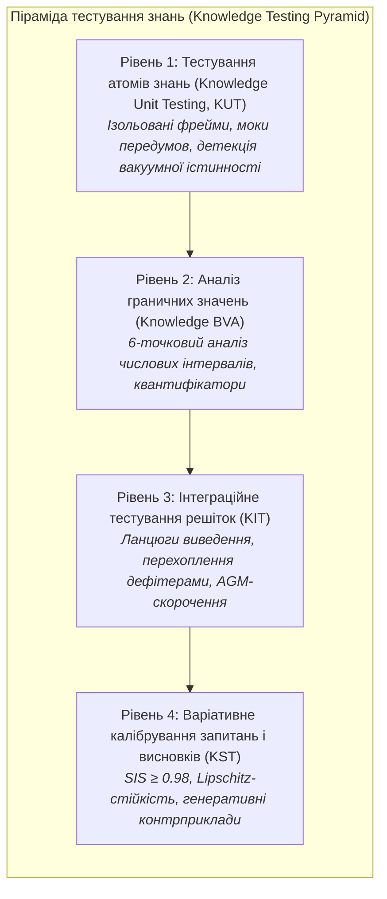

# Memo-021. Піраміда тестування знань: від ізольованих юніт-тестів атомів (KUT) та інтеграційних решіток (KIT) до комплексного калібрування варіативних запитань і висновків

**Автор концепції:** Микола Федчик  
**Тип:** дослідницький та інженерний меморандум (Research & Engineering Memorandum).  
**Дата:** 2026-10-04.  
**Статус:** APPROVED RESEARCH & METHODOLOGICAL FOUNDATION.  
**Пов'язані глави монографії:** [6](../ch06-applied-mathematics-for-expert-systems.md), [14](../ch14-requirements-detection-and-formalization.md), [15](../ch15-knowledge-extraction-and-kb-construction.md), [20](../ch20-explanation-engine.md), [23](../ch23-knowledge-base-verification.md), [24](../ch24-system-diagnosis.md), [25](../ch25-how-expert-systems-learn.md), [26](../ch26-continual-learning.md), [31](../ch31-syllogistic-reasoning-and-relation-lattices.md), [34](../ch34-deterministic-relational-analysis-abduction-and-socratic-dialogue.md), [36](../ch36-knowledge-testing-pyramid-and-variational-calibration.md).

---

## 1. Проблема: Прогалина між статичним аналізом та макроскопічними метриками

У класичній інженерії програмного забезпечення (Software Engineering) парадигма забезпечення якості спирається на сувору піраміду тестування:
$$\text{Unit Tests} \to \text{Integration Tests} \to \text{System / E2E Tests}$$
Кожен модуль перевіряється в ізоляції з фіктивними залежностями (stubs, mocks), потім тестується взаємодія компонентів через інтерфейсні контракти, і лише наприкінці система атестується наскрізними сценаріями.

Натомість в інженерії знань (Knowledge Engineering) та галузі штучного інтелекту історично склалася небезпечна методологічна прірва:
1. **Стрибок через рівні:** Інженери або обмежуються сухим статичним аналізом (SMT-розв'язувачі для пошуку тавтологій чи циклів у правилах, як у Главі 23), або відразу перевіряють систему на макроскопічних наборах даних (екзаменаційні матриці, F1-score, точність на 1000 запитах, як у Главі 25).
2. **Відсутність концепції атомарного тесту знання (Knowledge Unit Testing, KUT):** Немає стандарту ізольованого тестування окремого атома знання (правила, поняття, предикату чи $N$-арного фрейму). Якщо правило повертає хибний висновок, важко локалізувати, чи помилка криється у самому правилі, у спотворених вхідних фактах, чи в інтерпретації модальності.
3. **Ілюзія класичного калібрування (The Calibration Fallacy):** Традиційні підходи до калібрування довіри (Platt Scaling, Isotonic Regression, Brier Score, Expected Calibration Error — ECE) розраховуються на фіксованих замкнених вибірках. У реальному середовищі користувачі формулюють запитання з нескінченною лінгвістичною варіативністю. Класичне калібрування не вимірює чутливість висновку до синонімічних або граматичних збурень запиту (*Paraphrase Brittleness*).
4. **Змішування парадигм виведення:** Тестування дедуктивних правил, індуктивних узагальнень та абдуктивних гіпотез проводиться за єдиним шаблоном «вхід $\to$ очікуваний вихід», що спотворює їхню різну епістемічну природу.

---

## 2. Авторська концепція: Піраміда тестування знань (Knowledge Testing Pyramid)

Микола Федчик пропонує формалізувати повний інженерний життєвий цикл тестування знань (Knowledge Testing Lifecycle, KTL), еквівалентний класичному тестуванню ПЗ, але адаптований до символьної та нейро-символьної логіки.

### Рівень 1. Knowledge Unit Testing (KUT): Ізольоване тестування атомів знань
* **Атом тестування:** Окремий продукційний предикат, деонтична норма (SHALL/MUST/MAY) або семантичний фрейм.
* **Моки передумов (Premise Mocks):** Для перевірки правила $A \land B \to C$ значення $A$ та $B$ ізолюються від реальної бази даних і подаються у вигляді синтетичних тестових фікстур.
* **Детекція пастки вакуумної істинності (Vacuous Truth Trap):** У класичній матеріальній імплікації твердження $P \to Q$ є істинним завжди, коли $P \equiv \text{False}$. У доказових експертних системах це призводить до фатальних помилок («Якщо пінгвін літає, то реактор вибухне» $\equiv \text{True}$). KUT зобов'язаний виявляти та блокувати вакуумну валідність: тест визнається пройденим лише тоді, коли передумови активно задоволені у тестовому середовищі.

### Рівень 2. Knowledge Boundary Value Analysis (KBVA)
* **Спектр граничних значень:** Тестування числових, часових та геометричних обмежень вимог.
* **6-точковий граничний зонд:** Для інтервалу параметра $[v_{\min}, v_{\max}]$ генеруються випробування:
  $$v_{\min} - \epsilon, \quad v_{\min}, \quad v_{\min} + \epsilon, \quad v_{\max} - \epsilon, \quad v_{\max}, \quad v_{\max} + \epsilon$$
* **Перевірка модальності:** Перехід від строгої вимоги (MUST) до рекомендації (SHOULD) або дозволу (MAY) при зміні контексту.

### Рівень 3. Knowledge Integration Testing (KIT)
* **Решітки та ланцюги виведення:** Перевірка багатоходових шляхів між кластерами знань.
* **Тестування дефітерів за постулатами AGM:** Перевірка, що поява нового нормативного винятку (Defeater) коректно нейтралізує загальне правило без руйнування несуперечливості решти бази знань.

### Рівень 4. Knowledge System Testing & Variational Calibration (KST)
* **Калібрування варіативних запитань:** Стійкість системи до тисяч синонімічних, граматичних та стилістичних формулювань того самого запиту.
* **Калібрування варіативних висновків:** Оцінка неперервності та монотонності виведення при зашумлених спостереженнях.

---

## 3. Якісна та математична оцінка варіативності (Knowledge Calibration & Sensitivity)

### 3.1. Варіативні запитання та показник семантичної інваріантності (SIS)
Класичний тест перевіряє канонічне формулювання: $q_0 = \text{«Який максимальний розмір сегмента TCP?»}$.  
У реальності запитання варіюється синонімами, порядком слів та граматичними конструкціями: $\mathcal{Q}(q_0) = \{q_0, q_1, \dots, q_m\}$.

**Показник семантичної інваріантності (Semantic Invariance Score, SIS):**
Нехай $\text{DAG}(q)$ — граф доведення, що згенерований системою для запиту $q$, а $\text{Verdict}(q)$ — підсумкове рішення.
$$\text{SIS}(\mathcal{Q}) = 1 - \frac{1}{|\mathcal{Q}|} \sum_{q_i \in \mathcal{Q}} \Big[ \alpha \cdot \mathbb{I}\big(\text{Verdict}(q_i) \neq \text{Verdict}(q_0)\big) + (1 - \alpha) \cdot d_{\text{Graph}}\big(\text{DAG}(q_i), \text{DAG}(q_0)\big) \Big]$$
де:
- $\mathbb{I}$ — індикаторна функція розбіжності вердикту (катастрофічна нестійкість);
- $d_{\text{Graph}}$ — нормалізована графова відстань редагування (Tree Edit Distance) між ланцюгами посилок;
- $\alpha \in [0, 1]$ — ваговий коефіцієнт (за замовчуванням $\alpha = 0{,}7$).

Якщо $\text{SIS} < 0{,}98$, система страждає на лінгвістичну вразливість і не має права допускатися до експлуатації в критичних доменах.

### 3.2. Варіативні висновки та Ліпшицева неперервність бази знань
Нехай простір свідчень оснащено метрикою $d_{\mathcal{E}}(E_1, E_2)$, а простір епістемічного стану системи — метрикою $d_{\mathcal{B}}(B_1, B_2)$.

**Критерій Ліпшицевої стійкості знання (Knowledge Lipschitz Continuity):**
База знань вважається стійкою щодо класу задач, якщо існує скінченна константа Ліпшиця $L_{\mathcal{K}} < \infty$, така що для будь-яких допустимих збурень свідчень:
$$d_{\mathcal{B}}\big(\text{Reasoning}(E_1), \text{Reasoning}(E_2)\big) \le L_{\mathcal{K}} \cdot d_{\mathcal{E}}(E_1, E_2)$$

**Фізичний зміст:** Якщо при зміні виміряної температури на $0{,}01^\circ\text{C}$ або зміні часу тайм-ауту на $1\,\mu\text{s}$ система радикально змінює діагноз від «Норма» до «Критична катастрофа» без проміжної фази дефітера або попередження, константа $L_{\mathcal{K}} \to \infty$. Такий розрив є епістемічним дефектом правила.

---

## 4. Тестування різних парадигм логічного виведення

| Парадигма виведення | Що саме є «істиною» | Критерій тестування (Assertion / Invariant) | Що вважається дефектом (Failure) |
|---|---|---|---|
| **Дедукція (Deductive)** | Необхідний наслідок за аксіомами | **Soundness & Completeness:** Якщо посилки істинні, висновок гарантовано істинний. Перевірка замкненості за методом резолюцій. | Хибний висновок при істинних посилках; вакуумна істинність; тавтологія. |
| **Індукція (Inductive)** | Закономірність, видобута зі спостережень | **PAC-Bound (Probably Approximately Correct):** Ймовірність помилки генералізації $\le \epsilon$ з довірою $1 - \delta$. | Перенавчання (overfitting); вироджене правило з нульовим покриттям; порушення інваріантів. |
| **Абдукція (Abductive)** | Найбільш правдоподібне пояснення | **Occam Parsimony & Explanatory Power:** Гіпотеза $H$ зобов'язана дедуктивно пояснювати аномалію $O$ ($H \cup K \models O$) та бути несуперечливою ($H \cup K \not\models \bot$). | Висування тривіальних або надмірно складних гіпотез; ігнорування відомих спростувань. |
| **Спростовні міркування (Defeasible)** | Обґрунтоване переконання за відсутності заперечень | **Dung's Grounded Extension:** Стійкість множини висновків проти атак з боку активних дефітерів (ASPIC+). | Використання спростованого засновку; ігнорування блокувального винятку. |
| **Прецеденти (Case-Based)** | Аналогія з валідованим досвідом | **Metric Monotonicity:** Що ближчий прецедент у метриці Хеммінга/Махаланобіса, то вища схожість висновку. | Хибне перенесення розв'язку через спотворену метрику близькості. |

---

## 5. Висновки

1. Піраміда тестування знань (KTP) усуває розрив між статичним аналізом та макро-метриками.
2. Впровадження моків передумов та блокування вакуумної істинності є обов'язковим для надійного тестування правил.
3. Показники семантичної інваріантності ($\text{SIS}$) та константа Ліпшиця ($L_{\mathcal{K}}$) є математичною основою калібрування стійкості висновків експертної системи.
