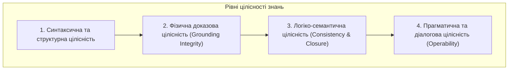
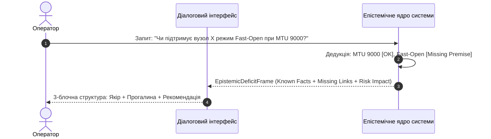
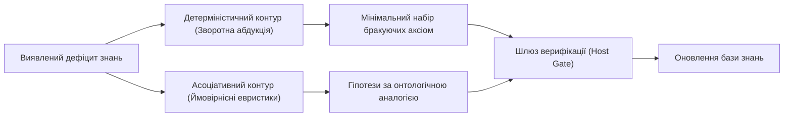
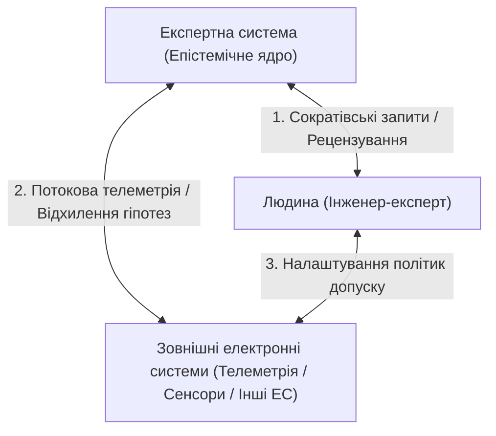

# Memo-024. Цілісність знань експертної системи, метапізнання незнання та прогресивна еволюція базису

**Автор концепції:** Микола Федчик  
**Тип:** дослідницький та інженерний меморандум (Research & Engineering Memorandum).  
**Дата:** 2026-10-04.  
**Статус:** APPROVED RESEARCH & METHODOLOGICAL FOUNDATION.  
**Пов'язані глави монографії:** [2](../ch02-epistemology-of-machine-knowledge.md), [5](../ch05-triad-of-trust-and-corporate-memory.md), [10](../ch10-knowledge-acquisition-systems.md), [23](../ch23-knowledge-base-verification.md), [24](../ch24-system-diagnosis.md), [25](../ch25-how-expert-systems-learn.md), [35](../ch35-self-organizing-expert-systems-synergetics-and-npu-runtime.md), [36](../ch36-knowledge-testing-pyramid-and-variational-calibration.md), [37](../ch37-input-information-assessment-and-algorithmic-skepticism.md).

---

## 1. Фундаментальна концепція: Що таке цілісність знань експертної системи?

Цілісність бази знань $\mathcal{K}$ в експертних системах критичного призначення не зводиться до тривіальної реляційної узгодженості (Referential Integrity) у реляційних СКБД. Вона є багатовимірним епістемічним простором, що охоплює чотири взаємопов'язані рівні:

1. **Синтаксична та структурна цілісність:** Коректність внутрішнього подання атомарних одиниць знань (Knowledge Units), типізованих предикатів, діапазонів числових значень та відсутність «висячих посилань» (dangling references) на неіснуючі вузли онтології.
2. **Фізична доказова цілісність (Grounding Integrity Invariant):** Фундаментальна вимога архітектури доказових систем. Кожен атом знання $\kappa \in \mathcal{K}$ зв'язаний із незмінним бінарним зліпком першоджерела (RFC, ISO, код стандарту) через точні координати зрізу $[b_{\text{start}}, b_{\text{end}}]$ та геш-відбиток $\text{SHA-256}(\text{Quote})$. Будь-який факт без побайтового свідчення вважається апокрифічним і підлягає видаленню.
3. **Логіко-семантична цілісність (Logical Consistency & Deductive Closure):**
   - **Несуперечливість:** $\mathcal{K} \not\vdash \bot$ (база знань не дозволяє одночасно вивести твердження $P$ та $\neg P$ за відсутності явно визначеного пріоритету або дефітера).
   - **Замкненість дедукції:** Усі наслідки, що випливають з аксіом та спостережень, є простежуваними.
   - **Узгодженість дефітерів (AGM Postulates & ASPIC+):** При виявленні винятків або пізніших нормативних редакцій (Supersession) система зобов'язана актуалізувати статус правил без руйнування первинного історичного контексту.
4. **Прагматична цілісність (Actionable Operability):** Здатність системи надати повний, несуперечливий висновок на запит користувача, не зупиняючись через розриви логічних ланцюгів.

---

## 2. Кількісна оцінка нестачі цілісності (Quantifying Knowledge Deficits)

Нестача цілісності виникає через неминучу неповність корпусу знань, еволюцію стандартів та фрагментарність отриманих свідчень. Для формальної оцінки дефіциту пропонується система взаємодоповнюючих метрик:

### 2.1. Ентропійний коефіцієнт щільності знань (Knowledge Density Index, KDI)
Нехай $\mathcal{C}$ — множина концептів, $\mathcal{R}$ — множина нормативних відношень, а $\mathcal{E}$ — множина побайтових доказів.
$$\text{KDI}(\mathcal{K}) = \frac{|\mathcal{R}_{\text{grounded}}|}{|\mathcal{C}| \cdot \log_2(|\mathcal{C}| + 1)} \cdot \left(1 - \frac{|\mathcal{G}_{\text{orphaned}}|}{|\mathcal{C}|}\right)$$
де $\mathcal{G}_{\text{orphaned}}$ — кількість ізольованих концептів, що не мають семантичних зв'язків з іншими сутностями. При $\text{KDI} < 0{,}75$ система фіксує критичний рівень розрідженості знань.

### 2.2. Метрика розривів логічного виведення (Deductive Gap Metric)
Для довільного нормативного запиту $\mathcal{Q}$, розкладеного на граф передумов $\mathcal{P} = \{p_1, p_2, \dots, p_n\}$:
$$\text{Deficit}(\mathcal{Q}, \mathcal{K}) = 1 - \frac{|\{p_i \in \mathcal{P} \mid \mathcal{K} \vdash p_i\}|}{|\mathcal{P}|}$$
Якщо $\text{Deficit} > 0$, система стикається з епістемічним розривом (Epistemic Gap), який унеможливлює строге дедуктивне доведення.

### 2.3. Коефіцієнт нерозв'язаних конфліктів (Unresolved Defeater Ratio)
$$\text{UDR} = \frac{|\{(A, B) \in \mathcal{K} \times \mathcal{K} \mid A \text{ attacks } B \land \text{Status}(A, B) = \text{UNDECIDED}\}|}{|\mathcal{A}_{\text{rules}}|}$$
Високий $\text{UDR}$ сигналізує про наявність суперечностей у вимогах різних документів без визначеного правила арбітражу.

---

## 3. Як прозоро пояснити оператору про нестачу цілісності?

Типова помилка класичних систем та сучасних LLM — бінарна крайність: або мовчазна відмова («Дані відсутні»), або галюцинація (вигадування відсутніх ланок для правдоподібності).

В авторській концепції впроваджується **трикомпонентний протокол пояснення епістемічного дефіциту (Epistemic Deficit Disclosure Protocol)**:

### Структура EpistemicDeficitFrame:
1. **Доведений якір (Grounded Anchor):** Що системі достеменно відомо з точним посиланням на першоджерело (*«Згідно з RFC 791, поле MTU 9000 є допустимим для Jumbo Frames...»*).
2. **Точна локалізація відсутньої ланки (Explicit Gap Boundary):** Який саме предикат або правило відсутнє (*«У верифікованому профілі відсутній факт підтримки розширення TCP Fast Open для поточної ревізії мережевого стека»*).
3. **Вплив на вердикт та рекомендована дія (Actionable Prescription):** Чому не можна ухвалити рішення «за замовчуванням» та як саме оператор або зовнішня діагностична система може закрити прогалину (*«Перевірте значення прапорця sysctl net.ipv4.tcp_fastopen на цільовому хості»*).

---

## 4. Виявлення незнання та прогресивне оперування ним (Epistemic Metacognition)

Знання про власне незнання (метазнання, Metacognition) є головною ознакою зрілої експертної системи. Незнання класифікується на чотири типи за матрицею Рамсфелда:

| Епістемічний статус | Характеристика в системі | Механізм обробки |
|---|---|---|
| **Known Knowns** (Відоме знання) | Доведені факти з побайтовим цитуванням ($\kappa \in \mathcal{K}_{\text{grounded}}$) | Прямий дедуктивний вивід |
| **Known Unknowns** (Усвідомлене незнання) | Декларовані слоти/предикати онтології без значення ($\text{Deficit} > 0$) | Стигмергічний пул епістемічних прогалин |
| **Unknown Knowns** (Приховане знання) | Імпліцитні зв'язки в текстах, ще не екстраговані в базу | Асоціативний майнінг правил (AMIE / Hearst) |
| **Unknown Unknowns** (Сліпі плями) | Відсутність цілих онтологічних класів і понять | Контрастивний аналіз аномалій та розривів |

### Прогресивне оперування незнанням:
1. **Стигмергічний пул епістемічних прогалин (Stigmergic Gap Pool):** Кожна невдача дедукції не зникає в логах, а перетворюється на структурований токен `KnowledgeGapToken(Subject, MissingPredicate, QueryContext, FrequencyCounter)`. Прогалини акумулюють вагу за принципом феромонного сліду стигмергії: чим частіше користувачі запитують відсутній факт, тим вищий пріоритет його закриття в беклозі інгесту.
2. **Абдукція робочих гіпотез (Defeasible Working Hypotheses):** За наявності часткових свідчень система не зупиняє аналіз, а формує марковане припущення: *«Припускаючи, що P є істинним (підстава: споріднений RFC 9293), висновок Q виконується. УВАГА: це гіпотеза, потрібна верифікація передумови P»*.

---

## 5. Генерація пропозицій усунення дефіциту знань

Коли виявлено дефіцит знань, система формує пропозиції його усунення за двома взаємодоповнюючими контурами:

1. **Детерміністичний контур (Зворотна абдукція та таблиці істинності):**
   - На основі цільового правила $A \land B \land C \implies D$, знаючи $A$ та $B$, система строго формулює вимогу: *«Для підтвердження D необхідно довести C»*.
   - Знаходить мінімальний набір першоджерел, де термін $C$ зустрічається у нормативному контексті RFC 2119 (`MUST`, `REQUIRED`).
2. **Ймовірнісний та асоціативний контур:**
   - Онтологічне перенесення за аналогією: якщо в протоколі IPv4 атрибут $X$ вимагає налаштування $Y$, то для IPv6 з високою апостеріорною ймовірністю вимагається еквівалентний параметр.
   - Кластеризація векторних ембеддінгів контексту для знаходження суміжних розділів специфікацій.

---

## 6. Самостійне та колаборативне покращення експертизи

Еволюція бази знань реалізується за моделлю кібернетичного трикутника взаємодії:

1. **Самостійне покращення (Autonomous Self-Improvement):**
   - **Автономний фазинг та лінтування:** Система генерує варіативні синтетичні запитання (KUT / SIS) і шукає власні сліпі плями та нестабільності висновків.
   - **Контрастивний майнінг:** Постійне виявлення суперечностей у нових ревізіях документів через граф заміщення (Supersession Graph).
2. **З допомогою людини (Human-in-the-Loop):**
   - **Черга активного рецензування (Active Review Queue):** Система не просить людину «перевірити все», а спрямовує інженера лише на вузли з максимальним інформаційним виграшем або високим коефіцієнтом нерозв'язаних конфліктів ($\text{UDR}$).
   - **Сократівське інтерв'ю:** Система ставить експерту уточнюючі запитання, які розрізняють конкуруючі гіпотези несправностей.
3. **З допомогою інших електронних систем (Machine-to-Machine Knowledge Mesh):**
   - **Зворотний зв'язок від телеметрії:** Експертна гіпотеза спростовується або підтверджується фізичними датчиками (наприклад, стан шини CAN або логи сервера).
   - **Федеративний обмін знаннями:** Імпорт та валідація цифрових сертифікатів доведення (`.zproof`) між незалежними експертними вузлами.

---

## 7. Порівняльний аналіз: Авторський підхід vs Світова наукова практика

| Напрям / Параметр | Світова практика (Classical ES / Deep Learning / RAG) | Власний авторський підхід Миколи Федчика |
|---|---|---|
| **Реакція на незнання** | Класичні ЕС: глуха відмова (CWA). Сучасні LLM: генеративні галюцинації. | **Трикомпонентний протокол дефіциту:** чітка локалізація прогалини + нормативний якір + рекомендація дій. |
| **Критерій цілісності** | Реляційна цілісність або геометрична близькість ембеддінгів (Cosine Similarity). | **4-рівнева цілісність:** синтаксична, побайтова доказова, логіко-дефітерна та прагматична. |
| **Оцінка якості бази знань** | Точність на бенчмарках (Accuracy, F1-score), загальні метрики втрат (Loss). | **Формальні аналітичні метрики:** індекс щільності $\text{KDI}$, дефіцит виведення $\text{Deficit}$, коефіцієнт конфліктів $\text{UDR}$. |
| **Управління незнанням** | Скидання контексту, логування помилок у текстові файли. | **Стигмергічний пул епістемічних прогалин:** прогалини як об'єкти 1-го класу, що керують пріоритетами інгесту. |
| **Генерація гіпотез** | Непрозорий стохастичний семплінг у моделях-трансформерах. | **Двоконтурна абдукція:** зворотне символьне виведення мінімальних умов + асоціативні аналогії під контролем хост-гейта. |
| **Роль людини** | Ручна рутинна розмітка великих масивів даних (RLHF). | **Цільовий арбітраж високого рівня:** вирішення нормативних суперечностей через активні черги рецензування. |

---

## 8. Висновки

1. Цілісність знань в експертних системах є фізично доказовою, логічно несуперечливою та прагматично придатною властивістю.
2. Незнання системи не є дефектом — воно є головним драйвером спрямованої еволюції базису знань через стигмергічні механізми накопичення інформаційного дефіциту.
3. Прозоре розкриття прогалин оператору перетворює експертну систему з «чорної скриньки» на надійного партнера критичного мислення та інженерної діагностики.
