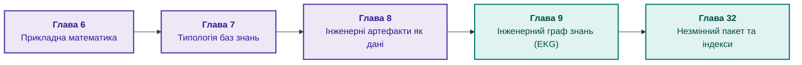

# Частина II. Математичні моделі, подання та зберігання знань

[← До Частини I](part-01-foundations.md) | [До змісту книги](README.md) | [До Частини III →](part-03-knowledge-engineering-nlp.md)

---

## Мета частини

Ця частина відповідає на запитання: як подати й зберегти знання, щоб операції над знаннями мали визначений зміст? Математичний метод обирають за задачею, тип подання за очікуваним результатом, а зв'язки й фізичні індекси зберігають разом із версією, джерелом та областю застосування.

Для першого практичного читання достатньо логічного правила, явного стану «невідомо», типізованого зв'язку й версії запуску. Ймовірнісні методи, причинний аналіз і розв'язувачі обмежень потрібні для задач, у яких ці операції справді впливають на рішення; читати весь математичний каталог перед першою реалізацією не обов'язково.

---

## Анотація теми та взаємозв'язку глав

Глава 6 пояснює методи обчислення, глава 7 розділяє семантику результатів, глава 8 готує типізовані артефакти, а глава 9 з'єднує артефакти в граф. Глава 32 завершує маршрут незмінним пакетом: канонічними даними, похідними індексами, перевіркою читача й відтворюваним збиранням.

Модель знань і фізичний формат пакета є різними рішеннями. Правильний індекс не доводить правильності факту, а автоматично отриманий граф не доводить правильності ребер. Результат частини: узгоджене подання, з яким може працювати конвеєр здобуття знань із Частини III.

---

## Глави частини

### [Глава 6. Прикладна математика експертних систем: правила, ймовірності, графи та причинність](ch06-applied-mathematics-for-expert-systems.md)

* **Анотація:** Карта математичних операцій за типом запитання: логічний наслідок, невизначеність, прецедент, зв'язок, вибір дії та причинність. Формули й числові приклади пояснюють різницю між доказом, оцінкою й ранжуванням. Це довідковий маршрут, не обов'язковий суцільний вступ до реалізації.

### [Глава 7. Типологія баз знань: правила, онтології, прецеденти та вектори](ch07-knowledge-base-typology.md)

* **Анотація:** Чому один і той самий набір фактів дає різні висновки у продукційних правилах, ієрархічних фреймах, формальних онтологіях та прецедентній пам'яті. Вибір подання за потрібним результатом; запитання до компетентності онтології як перевірювані вимоги до моделі; перевірка типів, ролей і змінних станів методом OntoClean. Розбиття бази знань: фрагментація, шардування й групування за ознаками як три різні рішення, ключ розбиття за залежностями виведення і чому мовчання шарда не дорівнює відсутності факту.

### [Глава 8. Інженерні артефакти як дані експертної системи](ch08-engineering-artifacts-as-data.md)

* **Анотація:** Модель версійованого артефакта й шлях від файла до фрагмента: розбір, якість вилучення, нарізання, доступ і пошук. Кандидат у поле чи зв'язок не стає перевіреним фактом лише через успішний розбір або індексацію.

### [Глава 9. Інженерний граф знань: простежуваність від вимог до апаратури](ch09-engineering-knowledge-graph-traceability.md)

* **Анотація:** Типізований граф вимог, коду, тестів і апаратури; запити покриття та впливу змін. Заявлені й прогнозовані зв'язки відокремлено від підтверджених. Навчальний збирач перевіряє посилання й ідентичність символів, але не доводить виконання вимог.

### [Глава 32. Незмінні пакети знань: побайтовий допуск, індекси та відображення в пам'ять](ch32-high-performance-knowledge-packs-mmap-and-harvesting.md)

* **Анотація:** Авторська архітектура незмінного пакета: канонічний і похідний шари, версії формату, матеріалізовані подання, цитати й відтворюваність збирання. Архівні різнопредметні вимірювання відокремлено від відкритого Python-стенда точкових запитів SQLite та `mmap`; відкриття файла не дорівнює холодному читанню, а `mmap` виправданий лише для незмінного індексу, що вміщується в пам'ять. Ключ кластера кодує довжини полів, читач індексу перевіряє межі до першого запиту, а щільність знань відокремлено від повноти, яку оцінює метод повторного вилову. Шардування незмінного пакета за родиною документів перевірено тестами на синтетичному корпусі: маршрутизатор відрізняє мовчання шарда від відсутності факту, а перевірка розбиття виявляє втрату, перетин і розрив родин. Шлюз дослівної цитати не перевіряє істинності її тлумачення.

## Системний маршрут глав 7–11

Глави утворюють спільний процес, який перетинає межу між другою й третьою частинами. Глава 7 визначає, **що означає результат**; Глава 8 визначає, **як зберегти артефакт і його походження**; Глава 9 визначає, **які зв'язки можна використовувати в аналізі**; [Глава 10](ch10-knowledge-acquisition-systems.md) керує допуском, чинністю, доставкою й відкликанням; [Глава 11](ch11-knowledge-elicitation-from-experts.md) отримує перевірювані кандидати з досвіду людей.

Суттєва межа процесу проходить не між «людина» й «модель», а між різними підставами твердження. Правильний синтаксис доводить лише відповідність формату. Точна цитата показує походження. Схвалення визначає повноваження й область використання. Результат запуску підтверджує спостереження в певних умовах. Логічний висновок показує наслідок прийнятих передумов. Жоден із цих статусів не замінює решти.

Дві навчальні помилки допомагають побачити цю межу. Граф із `verifies` не задовольняє форму, яка вимагає `verifiedBy`, без явного другого ребра або правила оберненої властивості. Анотація `@satisfies` засвідчує заяву автора коду, але функція з правильною анотацією може не реалізовувати потрібного періоду виконання. Приклади глав 7 і 9 перевіряють саме ці розрізнення.

Для узгодження процесу запропоновано паспорт об'єкта в Главі 10. Паспорт зберігає ідентичність, зміст, походження, застосовність, результати перевірок, схвалення, доступ і залежності. Новий спосіб зберігання або мовна модель мають зберігати ці значення, а не підвищувати доказовий статус копії.

## Пропозиції наукового посилення

Наступна таблиця є програмою дослідження, **не звітом про вже отримані результати**. Для кожної пропозиції названо гіпотезу, альтернативу й перевірку, яка може не підтвердити очікуваний виграш.

| Глава й прогалина | Гіпотеза та механізм | Контрольне порівняння | Що вимірювати й що спростує очікування |
|---|---|---|---|
| 7: модель понять і семантика результату | окремі тест, запуск і звіт зменшать перенесення успіху між випусками; запитання до компетентності й OntoClean виявлять змішування ролей | плоска властивість результату тесту проти окремих запусків на тих самих випадках | хибні дозволи для чужого випуску, збереження правильних позитивних відповідей; відсутність різниці або нові помилкові відмови не підтвердять практичної переваги |
| 8: похибка перетворення артефакта | збереження чисел, одиниць, заперечень і координат важливіше за одну середню оцінку читабельності | той самий набір сторінок для аналізатора, розпізнавання та каскаду з ручною чергою | точний збіг критичних полів, хибне приймання, хибне відкидання, час перегляду; краща читабельність без кращих рішень спростує достатність поверхневої метрики |
| 9: статус ребер і повнота впливу | окремі заявлені, виміряні й схвалені зв'язки зменшать хибне покриття без неприйнятного збільшення ручної праці | автоматичний граф анотацій проти графа з підтвердженням на тих самих змінах | точність зв'язків, пропущені залежності, хибне покриття, хвилини перегляду; випадкове приховування ребер доповнити часовим тестом на нових змінах |
| 10: випуск і відкликання | актуальний реєстр відкликань поза знімком заблокує повторний допуск після відкату | відкат лише знімка проти відкату з окремою перевіркою дозволу | час блокування нової видачі, час очищення копій, відмови за недоступної політики; нова відповідь зі скасованою підставою є провалом контракту |
| 11: відбір досвіду й експертна незгода | нейтральна реконструкція інцидентів і контрприклади дадуть правила з меншою втратою на нових випадках | однаковий бюджет часу для вільного інтерв'ю й структурованого протоколу | зважена втрата, помилкові дозволи, утримання, вартість сесій; згода експертів без покращення на відкладених випадках не підтвердить гіпотези |

Методична опора вже є у главах: запитання до компетентності Ной і Макгіннесс та OntoClean Гуаріно й Велті в Главі 7; стандарт перевірки форм [SHACL](https://www.w3.org/TR/shacl/); модель походження [PROV-O](https://www.w3.org/TR/prov-o/); двочасова модель Єнсена й Снодграсса в Главі 10; CommonKADS, протокольний аналіз і метод критичних рішень у Главі 11. Ці праці обґрунтовують окремі методи, але не доводять переваги всього запропонованого процесу.

### Протокол наскрізного випробування

Вибирають одне рішення, наприклад допуск зміни програмного інтерфейсу до випуску. Незалежні рецензенти розмічають вимоги, зв'язки, застосовні результати й очікувані відмови. Мітки самого правила або підсумки мовної моделі не використовують як незалежний еталон. Редакції одного документа, повтори одного інциденту й копії звіту залишають в одній групі; часовий відкладений набір перевіряє нові зміни, а не запам'ятовані формулювання.

До початку прогону фіксують основну метрику, вартість помилок, правила утримання й допустимі межі. Серед тестів потрібні відсутній звіт, суперечні результати, результат іншого випуску, зміна одиниці чи модальності, пізнє виправлення, недоступний реєстр дозволів і відкат після відкликання. Для кожного негативного випадку потрібен парний позитивний: постійна відмова не є якісною експертною системою.

Компоненти вимикають по одному, зберігаючи дані й бюджет перевірки: лише структура, структура з походженням, перевірені зв'язки, життєвий цикл, експертні правила. Така абляція показує внесок конкретного механізму. Звітують не тільки середню точність, а й хибні дозволи, повноту залежностей, частку утримань, зважену втрату та витрати людини; невизначеність оцінюють з урахуванням груп документів або інцидентів.

Синтетичні тести перевіряють інваріант, але не оцінюють частоту виробничих помилок. Нуль помилок у малому наборі не доводить нульового ризику. Якщо після додавання паспорта витрати зросли, а помилки не зменшилися, слід звузити контракт до полів, що справді впливають на рішення, або переглянути саму гіпотезу. Наукове посилення полягає в можливості перевірити й відхилити рішення, не в кількості залучених технологій.

---

[← До Частини I](part-01-foundations.md) | [До змісту книги](README.md) | [До Частини III →](part-03-knowledge-engineering-nlp.md)
