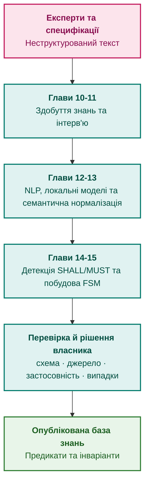

# Частина III. Інженерія знань: здобуття, NLP та екстракція з нормативів

[← До Частини II](part-02-knowledge-models.md) | [До змісту книги](README.md) | [До Частини IV →](part-04-architecture-and-inference.md)

---

## Мета частини

Мета цієї частини: показати, як готувати перевірювані знання для експертної системи, від визначення експертної задачі до формалізації й допуску кандидатів:

1. **Джерела:** відрізняти точне вилучення цитати від правильного тлумачення її змісту.
2. **Експертний досвід:** отримувати кандидатів із контекстом, винятками й способом перевірки.
3. **Мовний аналіз:** застосовувати аналізатори й локальні моделі, не приховуючи неоднозначності та похибки.
4. **Формалізація:** будувати явне подання умов і переходів, перевіряти його й допускати через відповідального власника.

---

## Анотація теми та взаємозв'язку глав

У третій частині інженер знань визначає потрібне рішення, документує предметні знання й спосіб міркування, отримує кандидатів від фахівців і з документів, формалізує кандидатів та перевіряє їхнє походження. Модель CommonKADS відокремлює предметний зміст від операцій виведення й порядку виконання задачі. Лінгвістичні аналізатори й локальні моделі допомагають знаходити кандидати, а практичний цикл Protégé й ROBOT перевіряє зміни онтології перед допуском.

Інженерія знань не закінчується екстракцією. Перевірку бази знань розглядає [Глава 23](ch23-knowledge-base-verification.md), перегляд знань за результатами застосування й ознаками деградації [Глава 26](ch26-continual-learning.md), а незмінний випуск знань [Глава 32](ch32-high-performance-knowledge-packs-mmap-and-harvesting.md). Експертна система споживає опубліковані факти й правила для рішень, але також є інструментом інженерії знань: застосовує правила допуску, виявляє прогалини й пояснює суперечності. Відмова чи знайдена прогалина породжує кандидата на зміну, а не автоматичне перезаписування опублікованої бази знань.

---

## Глави частини

### [Глава 10. Системи здобуття знань: архітектура збирання інженерного досвіду без втрат і витоку даних](ch10-knowledge-acquisition-systems.md)

* **Анотація:** Контракт між джерелами й споживачами: паспорт об'єкта, незалежні статуси перевірки й схвалення, доступ, два виміри часу, випуск і відкликання. Відкат знімка не відновлює скасованого дозволу на джерело.

### [Глава 11. Вилучення знань у експертів: інтерв'ювання, когнітивні карти та формалізація досвіду](ch11-knowledge-elicitation-from-experts.md)

* **Анотація:** Протоколи отримання досвіду, невідомі винятки, незалежна перевірка правил і межі статистичних оцінок. CommonKADS розділяє предметні знання, операції виведення й керування задачею; цифровий слід дає кандидатів на консультацію, не рейтинг компетентності.

### [Глава 12. Лінгвістичний аналіз та локальні моделі: як система розуміє текст без втрати джерела](ch12-linguistic-analysis-and-local-models.md)

* **Анотація:** Розділення координат оригіналу, похідного тексту й токенів. Структурний парсинг документів, межі статистичного мовного аналізу, слабка розмітка, активний добір прикладів і незалежна оцінка невизначеності.

### [Глава 13. Варіативність природної мови проти детермінізму: компіляція сенсу запитання](ch13-language-variability-vs-determinism.md)

* **Анотація:** Кандидат логічної форми, обмежене декодування та перевірка змісту. Перефразування й контрастні пари; невідомі значення й суперечливі гіпотези; GLiNER, GLiNER2 та типізовані валідатори без змішування форми й істинності.

### [Глава 14. Детекція вимог у стандартах: витяг нормативних предикатів (SHALL/MUST) та побудова інваріантів](ch14-requirements-detection-and-formalization.md)

* **Анотація:** Конвенція документа й контекст норми, межі шаблонів EARS, типізоване проміжне подання та часткова компіляція. Час тригера не стає строком реакції; задовільність формули не означає відповідності виробу.

### [Глава 15. Автоматизована екстракція знань: від тексту специфікацій до онтологій і кінцевих автоматів (FSM)](ch15-knowledge-extraction-and-kb-construction.md)

* **Анотація:** Факти, граматики й автомати з перевірюваними джерелами; область цитати, одиниці та оновлення редакцій. Допуск, схвалення й випуск розділені. Protégé й ROBOT перевіряють онтології; журнали подій і асоціативний аналіз дають кандидатні гіпотези, не нормативні правила.

## Прикладний аналіз глав 12–15

Втрати накопичуються причинно: парсер загубив заголовок таблиці, екстрактор приєднав число до іншої дії, компілятор приховав невідому часову область, шлюз прийняв запис лише через правильну цитату. Заміна мовної моделі на більшу не усуває кожної з цих причин. Тому оцінювання розділяє етапи й залишає незмінними решту конвеєра.

| Межа | Наукове уточнення | Дешевий контрольний випадок |
|---|---|---|
| Файл → текст | нормалізація може бути незворотною; PDF має похідні координати | лігатура, повторена цитата, розрізана послідовність UTF-8 |
| Текст → кандидат | статистичний клас не є формальним доказом | заперечення, переставлені ролі, два числа з різними ролями |
| Кандидат → формула | граматика й EARS не визначають правильного змісту | час у тригері, неоднозначний строк, недосяжна передумова |
| Формула → допуск | узгодженість не замінює застосовності й схвалення | чинна цитата з відкликаним доступом або неправильним профілем |
| Зміна → новий пакет | незмінна цитата може отримати інший контекст | зміна заголовка чи винятку; порівняння з повним збиранням |

Для кожної межі глави частини пропонують власні досліди:

1. [Глава 12](ch12-linguistic-analysis-and-local-models.md): Docling, Tika й розпізнавання сканів; структура, карти джерела, активний добір прикладів для розмітки.
2. [Глава 13](ch13-language-variability-vs-determinism.md): моделі екстракції, контрастні приклади та політика відмови.
3. [Глави 14](ch14-requirements-detection-and-formalization.md) і [15](ch15-knowledge-extraction-and-kb-construction.md): часткова компіляція, розв'язувачі, журнали процесів та рівність інкрементального й повного збирання.

Ці досліди є пропозиціями, не вже отриманими результатами. Незалежний еталон, групування редакцій і окремий остаточний контроль запобігають оцінюванню моделі її власними мітками. Синтетичні тести в главах перевіряють конкретні механізми, але не встановлюють якість на всіх нормативних документах.

---

[← До Частини II](part-02-knowledge-models.md) | [До змісту книги](README.md) | [До Частини IV →](part-04-architecture-and-inference.md)
