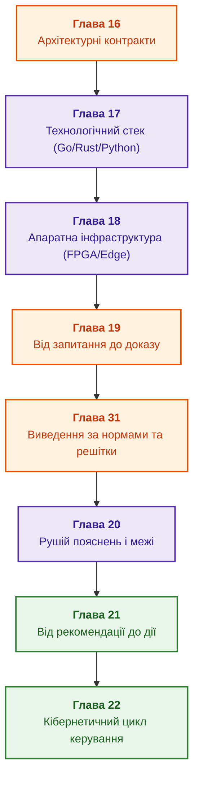

# Частина IV. Архітектура, технологічний стек, виведення та дія

[← До Частини III](part-03-knowledge-engineering-nlp.md) | [До змісту книги](README.md) | [До Частини V →](part-05-verification-and-learning.md)

---

## Мета частини

Побудувати повний інженерний тракт експертної системи: від архітектурних контрактів, вибору мов програмування й апаратних платформ до логічного виведення за нормами, генерації пояснень, переходу до дії та замикання кібернетичного циклу керування через сенсорний зворотний зв'язок.

---

## Анотація теми та взаємозв'язку глав

Глава 16 визначає базові архітектурні контракти й межі компонентів. Глава 17 формулює інженерні критерії вибору технологічного стеку (Go, Rust, Python, рушії правил). Глава 18 розгортає апаратну інфраструктуру (FPGA, NPU, On-Premise, Edge-обчислення). Глава 19 відокремлює знайдений фрагмент від формального твердження, яке він підтверджує. Глава 31 реалізує нормативне виведення за ієрархіями предикатів і решітками відношень з урахуванням часової чинності. Глава 20 генерує доказові пояснення безпосередньо з траси виведення. Глава 21 здійснює безпечний перехід від рекомендації до авторизованої дії з контролем повноважень. Глава 22 замикає кібернетичний цикл керування, обробляючи потоки сенсорних даних периферії та виявляючи ранні ознаки деградації (CSD).

Результат частини: цілісна працююча система, що має розділені статуси «архітектурно визначено», «апаратно розміщено», «знайдено», «обґрунтовано», «пояснено», «виконано» та «зворотний зв'язок зафіксовано». Формальну верифікацію правил, піраміду тестування знань та обґрунтування безпеки продовжує [Частина V](part-05-verification-and-learning.md).

---

## Глави частини

### [Глава 16. Архітектура експертної системи: від формального знання до доказового рішення](ch16-expert-systems-architecture.md)

* **Анотація:** Межі відповідальності, закріплений контекст читання й поточний доступ. Позитивне замикання обґрунтувань, альтернативні підстави й непідкріплені цикли; походження рішення включає факти та версію правила.

### [Глава 17. Технологічний стек: критерії вибору інструментів, мов програмування та рушіїв правил](ch17-implementation-stack.md)

* **Анотація:** Інженерні критерії вибору мов (Go, Rust, Python, C++), рушіїв правил (Rete, Datalog, Prolog) та вбудованих сховищ під конкретні класи задач, гарантії затримок і профілі пам'яті.

### [Глава 18. Інфраструктура виконання: локальні моделі, апаратні прискорювачі, Edge та On-Premise](ch18-execution-infrastructure.md)

* **Анотація:** Апаратне середовище виконання: розміщення на CPU, GPU, NPU та FPGA, холодний запуск, ізоляція обчислень, енергетичний бюджет периферійних систем і детермінізм латентності.

### [Глава 19. Від запитання до доказу: пошук, прив'язка та перевірка твердження](ch19-from-question-to-evidence.md)

* **Анотація:** Контракт запиту, пошук, атоми, прив'язка й окрема семантична перевірка. Обов'язкові поля й ваги перевіряються до обчислення повноти; знайдена цитата не встановлює ролі, а ненайдений доказ не доводить відсутності норми.

### [Глава 31. Виведення за нормами: ієрархії предикатів, винятки та чинність](ch31-syllogistic-reasoning-and-relation-lattices.md)

* **Анотація:** Ієрархія предикатів відрізняється від решітки; чинна редакція не скасовує умов застосування норми. Навчальний Go-крок перевіряє клас, спеціалізацію, винятки й конкурентні правила; це не повний багатоходовий рушій. Мережевий приклад розділяє дії за станом, номером послідовності й підтримуваним профілем.

### [Глава 20. Рушій пояснень: рішення, відмова та межі компетентності](ch20-explanation-engine.md)

* **Анотація:** Пояснення з фактичної траси; невідомі передумови відрізняються від несумісності. Передумови QuickXPlain, мінімальність за включенням, ціль контрфакту, контроль вільного тексту й витоку після маскування.

### [Глава 21. Від рекомендації до дії: контроль повноважень і безпечне виконання у виробничому середовищі](ch21-from-recommendation-to-action.md)

* **Анотація:** Контракт, поточні повноваження, підписане подання й атомарна передумова. Ідемпотентність перевіряє ціль і параметри; невідомий ефект потребує звірки до компенсації. Temporal, OPA й Cedar мають різні ролі. Локальний ремонт плану зберігає лише ще застосовні схвалення.

### [Глава 22. Кібернетичний цикл керування: сенсори, периферія та зворотний зв'язок](ch22-cybernetics-edge-to-backend.md)

* **Анотація:** Замкнений кібернетичний цикл: закон Ешбі, потокова телеметрія, фільтрація шумів, виявлення критичного уповільнення (CSD) та безпечна робота в режимі часткової автономності периферії.

---

## Наскрізний аналіз архітектури, реалізації та дії: глави 16–22

Ця серія об'єднує повний ланцюг ухвалення та втілення рішень, перевіряючи переходи, де локальний успіх легко помилково прийняти за загальну надійність:

| Перехід | Що не випливає автоматично | Дискримінувальна перевірка |
|---|---|---|
| Архітектура → рішення | правильність правила з назви «символьний» | незалежна альтернативна підстава, непідкріплений цикл, змішування знімків |
| Інструмент → семантика | рівність Rete, Datalog, виразів і таблиць | невідомий факт, перестановка, відкликання, ліміт виконання |
| Апаратура → час | гарантована затримка з піку чи p99 | холодний запуск, черга, повернення на CPU, наскрізний розподіл |
| Цитата → твердження | правильна роль числа з його наявності | два числа, неправильна одиниця, порожній або повторений атом |
| Траса → пояснення | правильний зміст тексту з наявності назв | змінене заперечення, пропущена причина, закриті дані й контрфакт |
| Рекомендація → дія | допустимість виконання з правильності рекомендації | перевірка повноважень, ідемпотентність, підтвердження передумов |
| Дія → зворотний зв'язок | нормальний стан об'єкта з факту відправки команди | сенсорна квитанція, оцінювач стану Ешбі, ранні індикатори CSD |

Спочатку відтворюють дефект у нейтральному симуляторі, потім перевіряють локальну зміну й лише після незалежного контролю оцінюють виробниче застосування. Аналіз журналів, дрейфу й кандидатних правил допомагає знаходити слабкі місця; автоматичне навчання не розширює прав і не змінює захисних норм без допуску.

---

[← До Частини III](part-03-knowledge-engineering-nlp.md) | [До змісту книги](README.md) | [До Частини V →](part-05-verification-and-learning.md)
