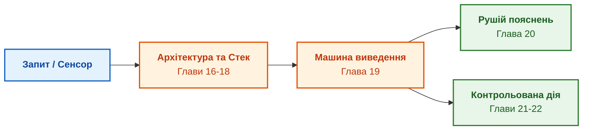

# Частина IV. Архітектура, виконання та механізми висновку

[← До Частини III](part-03-knowledge-engineering-nlp.md) | [До змісту книги](README.md) | [До Частини V →](part-05-verification-and-learning.md)

---

## Мета частини

Мета цієї частини — перетворити накопичене знання на діючий обчислювальний механізм:

1. **Інженерний виклик:** Як змусити базу правил працювати в реальному часі? Як гарантувати, що машина виведення не зайде в нескінченний цикл, зможе обґрунтувати кожен крок і не передасть небезпечну команду на виконавчий механізм?
2. **Архітектурний каркас:** Спроєктувати модульну архітектуру системи та обрати ефективний інженерний стек (мови системного програмування, Rete/Datalog-рушії, локальні сховища).
3. **Виконання на Edge:** Організувати надійне функціонування вузлів в умовах обмежених ресурсів та обриву зв'язку (Degraded / Disconnected modes).
4. **Контракт дії та пояснення:** Створити Рушій пояснень (Explanation Engine з підтримкою `WHY` та `WHY NOT`) і впровадити суворі Контракти дій (Action Contracts) для безпечного керування обладнанням.

---

## Анотація теми та взаємозв'язку глав

У четвертій частині розв'язується фундаментальне питання функціональності: як від статичних графів та онтологій перейти до динамічного прийняття рішень. Ми конструюємо повний тракт: від прийому неструктурованого запиту інженера чи сигналу датчика через архітектурний стек і машину виведення — до синтезу дерева доказів, пояснення меж чинності та безпечного запуску фізичної дії в кібернетичному контурі.

---

## Глави частини

### [Глава 16. Архітектура експертної системи: від формального знання до доказового рішення](ch16-expert-systems-architecture.md)

* **Анотація:** Загальна трирівнева архітектура: шар інтерфейсу, символьне ядро та підсистема персистентності. Організація потоків даних та інваріанти надійності.

### [Глава 17. Технологічний стек: критерії вибору інструментів, мов програмування та рушіїв правил](ch17-implementation-stack.md)

* **Анотація:** Порівняльний аналіз сучасних технологій: Prolog/Datalog, CLIPS/Drools, спеціалізовані предикатні рушії на Go, Rust та Python. Карта компонентів Go за шарами можливостей (правила, вирази CEL, Datalog, політики, графове, лексичне й векторне сховище) і правило «спершу порівняльний вимір із базовим варіантом, потім прийняття».

### [Глава 18. Інфраструктура виконання: локальні моделі, апаратні прискорювачі, Edge та On-Premise](ch18-execution-infrastructure.md)

* **Анотація:** Розгортання в ізольованих мережах: вимоги до оперативної пам'яті, використання NPU/GPU для локальних SLM, вимоги до детермінізму часу відгуку в реальному часі. Фонове індексування на простійних NPU робочих станцій через черги завдань NATS JetStream із перевіркою узгодженості результатів між вузлами.

### [Глава 19. Від запитання до доказу: як система трансформує неструктурований запит на ланцюг фактів](ch19-from-question-to-evidence.md)

* **Анотація:** Покроковий механізм перетворення вхідного запитання на ланцюг дедуктивного доведення. Алгоритми зіставлення зі зразком і резолюції.

### [Глава 20. Рушій пояснень: як система обґрунтовує рішення, відмову та межі компетентності](ch20-explanation-engine.md)

* **Анотація:** Як реалізувати запити «How» (як отримано висновок), «Why» (навіщо системі цей вхідний факт) та «Why Not» (чому правило не спрацювало).

### [Глава 21. Від рекомендації до дії: контроль повноважень і безпечне виконання у виробничому середовищі](ch21-from-recommendation-to-action.md)

* **Анотація:** Модель розподілу повноважень (Human-in-the-Loop проти автономної дії). Бар'єри безпеки та верифікація перед виконанням команд. Ієрархічний план дій і локальне перепланування, яке зберігає вже отримані погодження.

### [Глава 22. Кібернетичний цикл керування XXI століття: від сенсорів на периферії до центру ухвалення рішень](ch22-cybernetics-edge-to-backend.md)

* **Анотація:** Інтеграція експертних систем у кіберфізичні комплекси: потокова обробка сенсорних даних, локальна фільтрація та координація з командним центром.

---

[← До Частини III](part-03-knowledge-engineering-nlp.md) | [До змісту книги](README.md) | [До Частини V →](part-05-verification-and-learning.md)
