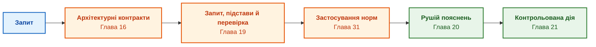

# Частина IV. Архітектура, виведення, пояснення та дія

[← До Частини III](part-03-knowledge-engineering-nlp.md) | [До змісту книги](README.md) | [До Частини V →](part-05-verification-and-learning.md)

---

## Мета частини

Побудувати перехід від прийнятих знань до висновку, перевірюваного пояснення та дозволеної дії. Архітектура визначає відповідальних компонентів, виведення застосовує чинні норми, пояснення відтворює фактичні підстави, а виконання окремо перевіряє повноваження й післяумови.

---

## Анотація теми та взаємозв'язку глав

Глава 16 визначає архітектурні контракти. Глава 19 відокремлює знайдену цитату від твердження, яке цитата справді підтримує. Глава 31 перевіряє застосування норм за ієрархією, винятками й часом чинності. Глава 20 обчислює пояснення з траси рішення. Глава 21 завершує маршрут переходом до авторизованої дії.

Результат частини: розділені статуси «знайдено», «обґрунтовано», «пояснено», «дозволено виконати» та «післяумову підтверджено». Вибір інструментів і фізичне розгортання розглядає [Частина VII](part-07-runtime-and-knowledge-exchange.md); перевірку правильності правил і критеріїв випуску продовжує Частина V.

---

## Глави частини

### [Глава 16. Архітектура експертної системи: від формального знання до доказового рішення](ch16-expert-systems-architecture.md)

* **Анотація:** Межі відповідальності, закріплений контекст читання й поточний доступ. Позитивне замикання обґрунтувань, альтернативні підстави й непідкріплені цикли; походження рішення включає факти та версію правила.

### [Глава 19. Від запитання до доказу: пошук, прив'язка та перевірка твердження](ch19-from-question-to-evidence.md)

* **Анотація:** Контракт запиту, пошук, атоми, прив'язка й окрема семантична перевірка. Обов'язкові поля й ваги перевіряються до обчислення повноти; знайдена цитата не встановлює ролі, а ненайдений доказ не доводить відсутності норми.

### [Глава 31. Виведення за нормами: ієрархії предикатів, винятки та чинність](ch31-syllogistic-reasoning-and-relation-lattices.md)

* **Анотація:** Ієрархія предикатів відрізняється від решітки; чинна редакція не скасовує умов застосування норми. Навчальний Go-крок перевіряє клас, спеціалізацію, винятки й конкурентні правила; це не повний багатоходовий рушій. Мережевий приклад розділяє дії за станом, номером послідовності й підтримуваним профілем.

### [Глава 20. Рушій пояснень: рішення, відмова та межі компетентності](ch20-explanation-engine.md)

* **Анотація:** Пояснення з фактичної траси; невідомі передумови відрізняються від несумісності. Передумови QuickXPlain, мінімальність за включенням, ціль контрфакту, контроль вільного тексту й витоку після маскування.

### [Глава 21. Від рекомендації до дії: контроль повноважень і безпечне виконання у виробничому середовищі](ch21-from-recommendation-to-action.md)

* **Анотація:** Контракт, поточні повноваження, підписане подання й атомарна передумова. Ідемпотентність перевіряє ціль і параметри; невідомий ефект потребує звірки до компенсації. Temporal, OPA й Cedar мають різні ролі. Локальний ремонт плану зберігає лише ще застосовні схвалення.

## Наскрізний аналіз архітектури й реалізації: глави 16–20

Ця серія перевіряє п'ять переходів, на яких локальний успіх легко помилково прийняти за загальну гарантію.

| Перехід | Що не випливає автоматично | Дискримінувальна перевірка |
|---|---|---|
| Архітектура → рішення | правильність правила з назви «символьний» | незалежна альтернативна підстава, непідкріплений цикл, змішування знімків |
| Інструмент → семантика | рівність Rete, Datalog, виразів і таблиць | невідомий факт, перестановка, відкликання, ліміт виконання |
| Апаратура → час | гарантована затримка з піку чи p99 | холодний запуск, черга, повернення на CPU, наскрізний розподіл |
| Цитата → твердження | правильна роль числа з його наявності | два числа, неправильна одиниця, порожній або повторений атом |
| Траса → пояснення | правильний зміст тексту з наявності назв | змінене заперечення, пропущена причина, закриті дані й контрфакт |

Цей маршрут перетинає Частини IV і VII. Для кожного переходу відповідні глави пропонують власні досліди:

1. [Глави 16](ch16-expert-systems-architecture.md) і [17](ch17-implementation-stack.md): узгоджені покоління знань, заміна адаптерів, семантика рушіїв, поточний доступ і кеш.
2. [Глава 18](ch18-execution-infrastructure.md): CPU/GPU/NPU, холодні запуски, автономність, енергія, ізоляція та пакетна мережа.
3. [Глави 19](ch19-from-question-to-evidence.md) і [20](ch20-explanation-engine.md): незалежні еталони пошуку, тверджень і пояснень; відмови, контрастні зміни й витік.

Це пропозиції майбутніх корпусних та інтеграційних дослідів. Локальні навчальні тести перевіряють конкретні механізми, але не встановлюють якість реального виробничого конвеєра. Власник визначає допустимі помилки й бюджет до відкриття остаточного контрольного набору.

## Перехід до експлуатації: дія та зворотний зв'язок

Правильна рекомендація не доводить допустимості її виконання, а правильний формат телеметрії не доводить точності або свіжості спостереження. Глави 21–22 уточнюють саме ці межі: схвалення, виконання, квитанція, післяумова та якість даних є окремими статусами.

| Прикладна проблема | Контрольний випадок | Глава |
|---|---|---|
| Повтор дії й застаріла передумова | той самий ключ з іншими параметрами; зміна ревізії після читання | [Глава 21](ch21-from-recommendation-to-action.md) |
| Втрата спостережуваності | дубль, переставлена подія, часовий розрив, хибне калібрування | [Глава 22](ch22-cybernetics-edge-to-backend.md) |
| Надмірна довіра до перевірки | «завжди DENY», порожній граф доказу, неповне застосування правила | [Глава 23](ch23-knowledge-base-verification.md) |

Спочатку відтворюють дефект у нейтральному симуляторі, потім перевіряють локальну зміну й лише після незалежного контролю оцінюють виробниче застосування. Аналіз журналів, дрейфу й кандидатних правил допомагає знаходити слабкі місця; автоматичне навчання не розширює прав і не змінює захисних норм без допуску.

---

[← До Частини III](part-03-knowledge-engineering-nlp.md) | [До змісту книги](README.md) | [До Частини V →](part-05-verification-and-learning.md)
