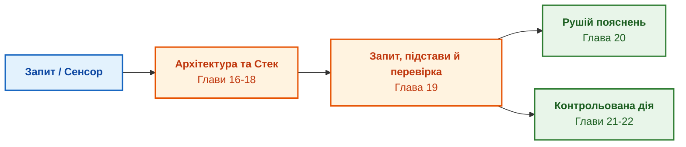

# Частина IV. Архітектура, виконання та механізми висновку

[← До Частини III](part-03-knowledge-engineering-nlp.md) | [До змісту книги](README.md) | [До Частини V →](part-05-verification-and-learning.md)

---

## Мета частини

Мета цієї частини: перетворити прийняті знання на обчислювальний механізм із визначеними межами:

1. **Інженерний виклик:** Визначити семантику, умови завершення й статус невідомого результату; обґрунтувати затримку вимірюванням або окремою гарантованою межею.
2. **Архітектурний каркас:** Розділити канонічну базу, механізм виведення й адаптери; закріпити знімок, правила, контекст і повноваження.
3. **Виконання на периферії:** Перевірити ресурсні ліміти, автономність і поведінку за обриву зв'язку, а не припускати ці властивості з місця розгортання.
4. **Контракт дії та пояснення:** Створити Рушій пояснень (Explanation Engine з підтримкою `WHY` та `WHY NOT`) і впровадити суворі Контракти дій (Action Contracts) для безпечного керування обладнанням.

---

## Анотація теми та взаємозв'язку глав

Четверта частина розглядає перехід від прийнятих фактів до рішення, пояснення й контрольованої дії. Архітектура закріплює залежності відповіді, технологічний стек реалізує визначену семантику, а інфраструктура перевіряє ресурси й відмови. Пошук, прив'язка й текстове пояснення мають окремі договори; успіх попереднього етапу не доводить правильності наступного.

---

## Глави частини

### [Глава 16. Архітектура експертної системи: від формального знання до доказового рішення](ch16-expert-systems-architecture.md)

* **Анотація:** Межі відповідальності, закріплений контекст читання й поточний доступ. Позитивне замикання обґрунтувань, альтернативні підстави й непідкріплені цикли; походження рішення включає факти та версію правила.

### [Глава 17. Технологічний стек: критерії вибору інструментів, мов програмування та рушіїв правил](ch17-implementation-stack.md)

* **Анотація:** Семантичний договір перед порівнянням продуктивності: невідомість, заперечення, порядок, відкликання й завершення. SQL обходить цикли без змішування складених ідентифікаторів; Datalog, таблиці рішень і розв'язувачі мають різні межі.

### [Глава 18. Інфраструктура виконання: локальні моделі, апаратні прискорювачі, Edge та On-Premise](ch18-execution-infrastructure.md)

* **Анотація:** Профіль обчислень, межі Roofline, підтримка операторів і вимірювання наскрізної затримки, пам'яті та енергії. Перцентиль не є часовою гарантією; окремий процес не усуває спільних фізичних відмов. Мережа NPU є дослідницьким варіантом із перевіркою повторних доставок.

### [Глава 19. Від запитання до доказу: як система трансформує неструктурований запит на ланцюг фактів](ch19-from-question-to-evidence.md)

* **Анотація:** Контракт запиту, пошук, атоми, прив'язка й окрема семантична перевірка. Обов'язкові поля й ваги перевіряються до обчислення повноти; знайдена цитата не встановлює ролі, а ненайдений доказ не доводить відсутності норми.

### [Глава 20. Рушій пояснень: як система обґрунтовує рішення, відмову та межі компетентності](ch20-explanation-engine.md)

* **Анотація:** Пояснення з фактичної траси; невідомі передумови відрізняються від несумісності. Передумови QuickXPlain, мінімальність за включенням, ціль контрфакту, контроль вільного тексту й витоку після маскування.

### [Глава 21. Від рекомендації до дії: контроль повноважень і безпечне виконання у виробничому середовищі](ch21-from-recommendation-to-action.md)

* **Анотація:** Контракт, поточні повноваження, підписане подання й атомарна передумова. Ідемпотентність перевіряє ціль і параметри; невідомий ефект потребує звірки до компенсації. Temporal, OPA й Cedar мають різні ролі. Локальний ремонт плану зберігає лише ще застосовні схвалення.

### [Глава 22. Кібернетичний цикл керування XXI століття: від сенсорів на периферії до центру ухвалення рішень](ch22-cybernetics-edge-to-backend.md)

* **Анотація:** Якість, свіжість і час спостереження; межі фільтра та кібернетичних аналогій. Логічний годинник не замінює фізичного. Flink, RTAMT, do-mpc й River дають кандидати обробки та аналізу; деградація й відкат потребують предметної політики.

## Прикладний аналіз глав 16–20

Ця серія перевіряє п'ять переходів, на яких локальний успіх легко помилково прийняти за загальну гарантію.

| Перехід | Що не випливає автоматично | Дискримінувальна перевірка |
|---|---|---|
| Архітектура → рішення | правильність правила з назви «символьний» | незалежна альтернативна підстава, непідкріплений цикл, змішування знімків |
| Інструмент → семантика | рівність Rete, Datalog, виразів і таблиць | невідомий факт, перестановка, відкликання, ліміт виконання |
| Апаратура → час | гарантована затримка з піку чи p99 | холодний запуск, черга, повернення на CPU, наскрізний розподіл |
| Цитата → твердження | правильна роль числа з його наявності | два числа, неправильна одиниця, порожній або повторений атом |
| Траса → пояснення | правильний зміст тексту з наявності назв | змінене заперечення, пропущена причина, закриті дані й контрфакт |

Дослідження оформлено окремими технічними меморандумами:

1. [Memo-005](memos/Memo-005-Snapshot-Consistency-And-Inference-Semantics.md): узгоджені покоління знань, заміна адаптерів, семантика рушіїв, поточний доступ і кеш.
2. [Memo-006](memos/Memo-006-Runtime-Latency-Energy-And-Fault-Isolation.md): CPU/GPU/NPU, холодні запуски, автономність, енергія, ізоляція та пакетна мережа.
3. [Memo-007](memos/Memo-007-Evidence-Retrieval-And-Explanation-Fidelity.md): незалежні еталони пошуку, твердження й пояснення; відмови, контрастні зміни й витік.

Це протоколи майбутніх корпусних та інтеграційних дослідів. Локальні навчальні тести перевіряють конкретні механізми, але не встановлюють якість реального виробничого конвеєра. Власник визначає допустимі помилки й бюджет до відкриття остаточного контрольного набору.

## Дія та зворотний зв'язок: глави 21–22

Правильна рекомендація не доводить допустимості її виконання, а правильний формат телеметрії не доводить точності або свіжості спостереження. Глави 21–22 уточнюють саме ці межі: схвалення, виконання, квитанція, післяумова та якість даних є окремими статусами.

| Прикладна проблема | Контрольний випадок | Протокол |
|---|---|---|
| Повтор дії й застаріла передумова | той самий ключ з іншими параметрами; зміна ревізії після читання | [Memo-008](memos/Memo-008-Authorized-Actions-And-Durable-Execution.md) |
| Втрата спостережуваності | дубль, переставлена подія, часовий розрив, хибне калібрування | [Memo-009](memos/Memo-009-Telemetry-State-Estimation-And-Runtime-Assurance.md) |
| Надмірна довіра до перевірки | «завжди DENY», порожній граф доказу, неповне застосування правила | [Memo-010](memos/Memo-010-Knowledge-Base-Verification-And-Test-Mining.md) і [Глава 23](ch23-knowledge-base-verification.md) |

Спочатку відтворюють дефект у нейтральному симуляторі, потім перевіряють локальну зміну й лише після незалежного контролю оцінюють виробниче застосування. Аналіз журналів, дрейфу й кандидатних правил допомагає знаходити слабкі місця; автоматичне навчання не розширює прав і не змінює захисних норм без допуску.

---

[← До Частини III](part-03-knowledge-engineering-nlp.md) | [До змісту книги](README.md) | [До Частини V →](part-05-verification-and-learning.md)
