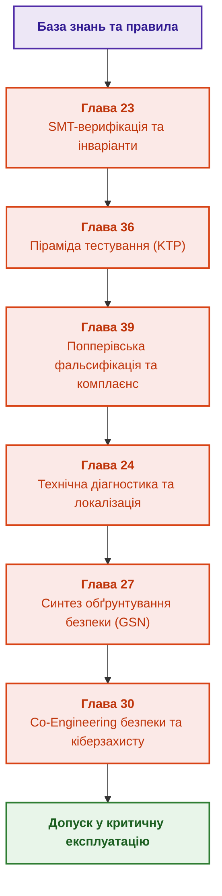

# Частина V. Верифікація, тестування, діагностика та обґрунтування безпеки

[← До Частини IV](part-04-architecture-and-inference.md) | [До змісту книги](README.md) | [До Частини VI →](part-06-frontiers-neuro-symbolic.md)

---

## Мета частини

Забезпечити вичерпний інженерний цикл перевірки, верифікації, валідації (V&V), технічної діагностики та формального обґрунтування безпеки експертної системи. Частина поєднує математичні SMT-доведення, багаторівневе тестування правил, попперівську фальсифікацію вимог комплаєнсу, діагностику першопричин та побудову доказових аргументів безпеки за стандартами ISO 26262 та ISO/SAE 21434.

---

## Анотація теми та взаємозв'язку глав

Глава 23 визначає методи формальної верифікації бази знань (SMT-солвери Z3, перевірка повноти й несуперечливості). Глава 36 розгортає авторську піраміду тестування знань (KTP) від окремих предикатів до інтеграційних пакетів і варіаційного калібрування. Глава 39 впроваджує активного попперівського тестувальника для автоматичної генерації контрприкладів і перевірки нормативного комплаєнсу (ASPICE, ISO 26262, ISO 21434, DO-178C). Глава 24 розв'язує задачу технічної діагностики зовнішніх систем, відокремлюючи першопричину від вторинних симптомів. Глава 27 синтезує структуровані аргументи безпеки у нотації GSN із контролем простежуваності. Глава 30 завершує цей блок спільним проєктуванням функціональної безпеки та кібербезпеки (Co-Engineering).

Результат частини: математично й емпірично доведена надійність системи, що має юридично значущі та сертифікаційно придатні артефакти допуску. Адаптацію, нейро-символьні моделі та неперервне навчання розглядає [Частина VI](part-06-frontiers-neuro-symbolic.md).

---

## Глави частини

### [Глава 23. Верифікація бази знань: як перевірити несуперечливість, повноту та надійність правил](ch23-knowledge-base-verification.md)

* **Анотація:** Походження оракула, заборони й дозволені стани, межі повного перебору та мутаційного бала. Rapid, Hypothesis, Z3 й засоби TLA+ перевіряють різні властивості. Скорочення контролює конкретні дефекти; повний доказ потребує кореня, посилок і всіх передумов застосованого правила. Індукція з даних пропонує кандидатів, не нормативну істину.

### [Глава 36. Піраміда тестування знань: правила, взаємодії та стійкість відповідей](ch36-knowledge-testing-pyramid-and-variational-calibration.md)

* **Анотація:** Авторська піраміда перевірки окремих правил, композиції, наскрізного пакета рішення та варіацій входу. Незалежні очікування розрізняють хибну й невідому передумови; інтеграційні випадки перевіряють змістову сумісність, підрив підстави й мінімальний конфлікт. Тестові контракти відрізняються для дедукції, індукції, абдукції, спростовних міркувань і прецедентів. Go-приклад і модульні тести перевіряють заданий контекст граничних випадків, порожні набори, втрату підстав і заборону приховати зміну вердикту середньою оцінкою. Метрики й черга прогалин не є універсальною сертифікацією онтології або фізичного регулятора.

### [Глава 39. Активний експерт-тестувальник: попперівська фальсифікація, нормативний комплаєнс (ASPICE/ISO 26262/ISO 21434) та автономне проєктування випробувань](ch39-active-compliance-auditor-and-popperian-testing.md)

* **Анотація:** Автономне проєктування випробувань за принципом попперівської фальсифікації: генерація найжорсткіших контрприкладів, аудит трас на відповідність стандартам функціональної безпеки й кібербезпеки, автоматичне виявлення сліпих зон у нормативних вимогах.

### [Глава 24. Технічна діагностика: як не сплутати симптом із першопричиною в умовах неповноти](ch24-system-diagnosis.md)

* **Анотація:** Діагностика несправностей складних систем. Моделі на основі симптомів проти моделей на основі фізичної структури (Model-Based Diagnosis). Мінімізація вартості наступної перевірки та абдуктивна локалізація першопричин.

### [Глава 27. Обґрунтування безпеки: синтез і перевірка аргументів](ch27-safety-case-gsn-synthesis.md)

* **Анотація:** Обґрунтування безпеки в нотації GSN, синтезоване з інженерного графа знань. Формальні правила повноти аргументу й цілісності посилань, перевірка ревізії обладнання в контекстах і свідченнях, вибіркове розкриття свідчень через дерево Меркла зі сіллю для листів, облік заперечень за рамкою аргументації Зунга з нерозв'язаними взаємними атаками. Метамодель SACM, атестації in-toto і SLSA, журнал прозорості й видобування зв'язків простежуваності доповнюють навчальний приклад, але не замінюють фахівця, який оцінює достатність аргументу.

### [Глава 30. Спільне проєктування функціональної безпеки та кібербезпеки](ch30-safety-cybersecurity-co-engineering.md)

* **Анотація:** Узгодження функціональної безпеки й кібербезпеки за схваленими причинними зв'язками та вимогами конкретного виробу. Навчальні Go-перевірки категорії, часового бюджету, затвердженого батьківського артефакта, правила оновлення з трьома результатами (конфлікт, нестача свідчень, конфлікту немає) й прив'язки підпису до даних та метаданих. STPA-Sec, ReqIF, CycloneDX, OpenVEX і Uptane подано як джерела машинно-читаних свідчень із явними межами. Профіль проєкту не підмінює галузевого стандарту; кваліфікація програмного інструмента є окремою процедурою.

---

[← До Частини IV](part-04-architecture-and-inference.md) | [До змісту книги](README.md) | [До Частини VI →](part-06-frontiers-neuro-symbolic.md)
