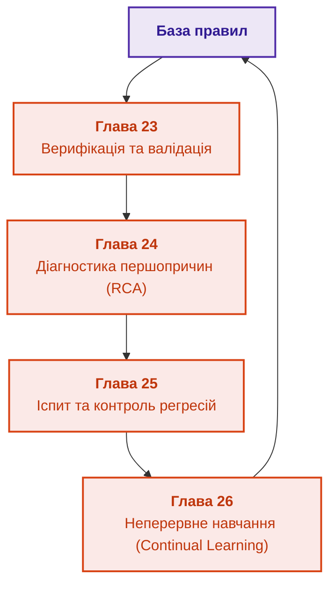

# Частина V. Верифікація, діагностика та неперервне навчання

[← До Частини IV](part-04-architecture-and-inference.md) | [До змісту книги](README.md) | [До Частини VI →](part-06-frontiers-neuro-symbolic.md)

---

## Мета частини

Мета цієї частини: перевіряти базу знань і керувати її змінами з явними межами моделей та доказів:

1. **Інженерний виклик:** Як оновлювати знання без катастрофічних регресій? Чому додавання одного нового правила може зламати 100 перевірених сценаріїв, а спроба навчання на власних логах призводить до небезпечного самопідсилення помилок (Logging Policy Bias)?
2. **Верифікація:** Розділити аномалію й доведений дефект, перевірити заборони разом із дозволеними станами, а цикли оцінювати за семантикою рекурсії.
3. **Діагностика першопричин (RCA):** Побудувати модельний аналіз несправностей (Model-Based Diagnosis за Райтером) для розрізнення кореневої причини та похідних симптомів за мінімальної вартості наступних перевірок.
4. **Екзаменаційні матриці та неперервне навчання:** Побудувати цикл допуску змін через золоті бенчмарки (Golden Sets), калібрування впевненості (ECE/Brier Score) та безпечну адаптацію на прецедентах (Continual Learning).

---

## Анотація теми та взаємозв'язку глав

П'ята частина розділяє перевірку реалізації, предметну валідацію, діагностику й навчання. Формальний результат стосується заданої моделі, а успішний тестовий прогін не виключає дефектів поза контрольним набором. Дані й журнали дають кандидатні гіпотези; нові правила, моделі та пороги проходять незалежний контроль і керований випуск.

---

## Глави частини

### [Глава 23. Верифікація бази знань: як перевірити несуперечливість, повноту та надійність правил](ch23-knowledge-base-verification.md)

* **Анотація:** Походження оракула, заборони й дозволені стани, межі повного перебору та мутаційного бала. Rapid, Hypothesis, Z3 й засоби TLA+ перевіряють різні властивості. Скорочення контролює конкретні дефекти; повний доказ потребує кореня, посилок і всіх передумов застосованого правила. Індукція з даних пропонує кандидатів, не нормативну істину.

### [Глава 24. Технічна діагностика: як не сплутати симптом із першопричиною в умовах неповноти](ch24-system-diagnosis.md)

* **Анотація:** Діагностика несправностей складних систем. Моделі на основі симптомів проти моделей на основі фізичної структури (Model-Based Diagnosis). Мінімізація вартості наступної перевірки.

### [Глава 25. Як навчати експертну систему: екзаменаційні матриці, аудит знань та контроль регресій](ch25-how-expert-systems-learn.md)

* **Анотація:** Керований випуск версій експертної системи: екзаменаційні матриці, парне порівняння й відхилення неповного іспиту. Груповий і часовий поділ, черга перевірки міток, пошук слабких зрізів і модель-суддя готують матеріал, але не ухвалюють рішення. Наскрізний приклад зміни вимоги та відкликання звіту показує залежні факти, правила, індекси, кеші й висновки.

### [Глава 26. Неперервне навчання (Continual Learning) на досвіді та подолання зсуву системного журналу](ch26-continual-learning.md)

* **Анотація:** Самонавчання на основі відмов: журнал випадків, час появи мітки й пропенситі. Оцінювання нової політики відмовляє в числі без перекриття дій, а незавершені епізоди не рахуються помилками. River, Avalanche й Open Bandit Pipeline підтримують досліди, але кандидати проходять той самий допуск. Випереджальні індикатори й CUSUM сигналізують про зсув до першої хибної відповіді.

## Практична перевірка глави 23

Навчальний приклад перевіряє 36 станів і показує дефект одностороннього оракула: правило, яке завжди відмовляє, виконує всі заборони, але не відповідає схваленій таблиці дозволів. Тому якість тестів оцінюють за конкретними помилками, надмірними відмовами й походженням еталона, а не лише за зеленими інваріантами.

[Memo-010](memos/Memo-010-Knowledge-Base-Verification-And-Test-Mining.md) задає досліди для послідовних генераторів, предметних мутацій, добору тестів та індуктивних кандидатів правил. Порівняння виконується на зафіксованому каталозі дефектів і відкладених групах; невиконані формальні перевірки не зараховуються як успіх. Для аналізу зовнішнього об'єкта потрібна наступна, окрема дисципліна діагностики з глави 24.

## Практична перевірка глав 25–26

У главі 25 правило допуску відхиляє кандидата з чотирма провалами безпеки й також іспит без обов'язкового зрізу. У главі 26 оцінювач відмовляє в числі для журналу без перекриття політик, а приклад відкладених міток розділяє невідомий результат і помилку. Обидва результати синтетичні й перевіряють механізм рішення, а не якість конкретної експертної системи.

| Прикладна проблема | Контрольний випадок | Протокол |
|---|---|---|
| Витік і хибний допуск | ревізії одного джерела в різних наборах, пропущений зріз безпеки, помилкові мітки | [Memo-011](memos/Memo-011-Release-Gates-Data-Splits-And-Label-Quality.md) |
| Навчання на власному досвіді | відкладена мітка, відсутнє перекриття, забування старої ревізії | [Memo-012](memos/Memo-012-Continual-Learning-Delayed-Labels-And-Off-Policy-Evaluation.md) |

---

[← До Частини IV](part-04-architecture-and-inference.md) | [До змісту книги](README.md) | [До Частини VI →](part-06-frontiers-neuro-symbolic.md)
