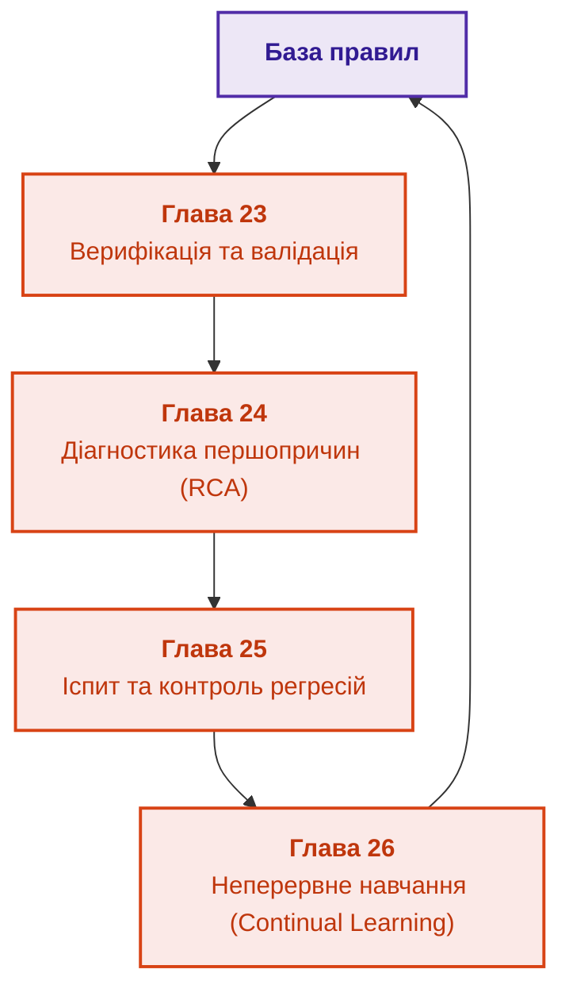

# Частина V. Верифікація, діагностика та неперервне навчання

[← До Частини IV](part-04-architecture-and-inference.md) | [До змісту книги](README.md) | [До Частини VI →](part-06-frontiers-neuro-symbolic.md)

---

## Мета частини

Мета цієї частини — гарантувати життєздатність, математичну несуперечливість та безпечну еволюцію бази знань:

1. **Інженерний виклик:** Як оновлювати знання без катастрофічних регресій? Чому додавання одного нового правила може зламати 100 перевірених сценаріїв, а спроба навчання на власних логах призводить до небезпечного самопідсилення помилок (Logging Policy Bias)?
2. **Формальна верифікація:** Виявити мертві правила, цикли та суперечності через SAT/SMT-солвери та мутаційне тестування інваріантів.
3. **Діагностика першопричин (RCA):** Побудувати модельний аналіз несправностей (Model-Based Diagnosis за Райтером) для розрізнення кореневої причини та похідних симптомів за мінімальної вартості наступних перевірок.
4. **Екзаменаційні матриці та неперервне навчання:** Побудувати цикл допуску змін через золоті бенчмарки (Golden Sets), калібрування впевненості (ECE/Brier Score) та безпечну адаптацію на прецедентах (Continual Learning).

---

## Анотація теми та взаємозв'язку глав

У п'ятій частині система проходить найжорсткішу перевірку надійності: зіткнення з реальними відмовами та постійними змінами. Ми показуємо, як довести несуперечливість бази правил ще до релізу, як розплутати клубок аварійних сигналів і знайти першопричину збою, як організувати непідкупний іспит для системи й навчити її накопичувати досвід без втрати раніше доведених істин.

---

## Глави частини

### [Глава 23. Верифікація бази знань: як перевірити несуперечливість, повноту та надійність правил](ch23-knowledge-base-verification.md)

* **Анотація:** Статичний аналіз бази правил: виявлення циклів, надлишковості, мертвого коду знань та взаємно виключних предикатів. Застосування SAT/SMT-солверів. Скорочення регресійного набору без втрати здатності виявляти помилки, метаморфні відношення для мовних компонентів і маніфест запуску відповіді для її відтворення.

### [Глава 24. Технічна діагностика: як не сплутати симптом із першопричиною в умовах неповноти](ch24-system-diagnosis.md)

* **Анотація:** Діагностика несправностей складних систем. Моделі на основі симптомів проти моделей на основі фізичної структури (Model-Based Diagnosis). Мінімізація вартості наступної перевірки.

### [Глава 25. Як навчати експертну систему: екзаменаційні матриці, аудит знань та контроль регресій](ch25-how-expert-systems-learn.md)

* **Анотація:** Процедура атестації експертної системи: розробка іспитових тестових сценаріїв, оцінка повноти покриття бази знань та захист від регресійних збоїв.

### [Глава 26. Неперервне навчання (Continual Learning) на досвіді та подолання зсуву системного журналу](ch26-continual-learning.md)

* **Анотація:** Самонавчання на основі відмов: фіксація невідомих ситуацій у пам'яті прецедентів, усунення вибіркового зміщення власних журналів та контрольований перегляд правил. Випереджальні індикатори деградації й кумулятивні суми CUSUM, які сигналізують про зсув до першої хибної відповіді.

---

[← До Частини IV](part-04-architecture-and-inference.md) | [До змісту книги](README.md) | [До Частини VI →](part-06-frontiers-neuro-symbolic.md)
