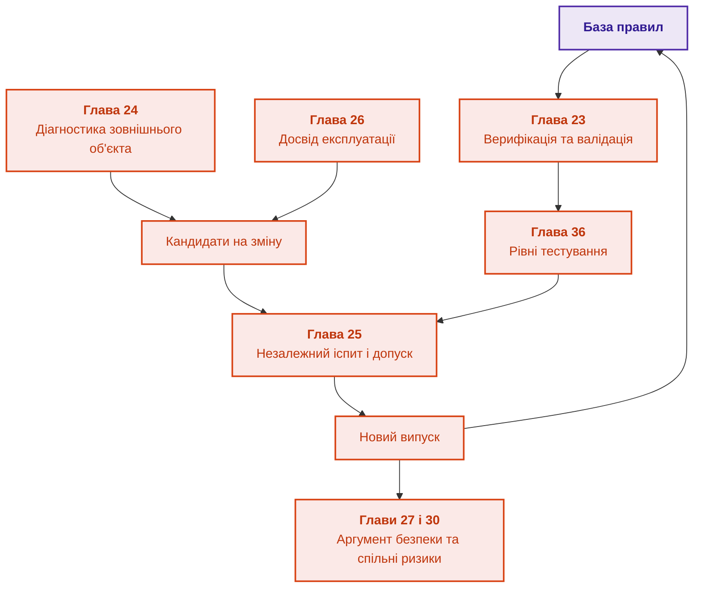

# Частина V. Верифікація, діагностика, навчання та обґрунтування безпеки

[← До Частини IV](part-04-architecture-and-inference.md) | [До змісту книги](README.md) | [До Частини VI →](part-06-frontiers-neuro-symbolic.md)

---

## Мета частини

Перевіряти правила й результати, діагностувати дефекти, допускати зміни та будувати обґрунтування безпеки з явними межами моделі. Частина відокремлює успішний тест, предметне схвалення, керований випуск і рішення про прийняття ризику.

---

## Анотація теми та взаємозв'язку глав

Глава 23 визначає сукупність перевірок бази знань, а глава 36 деталізує авторську піраміду тестування правил, їхньої взаємодії та варіативних входів. Глава 24 застосовує дисципліну моделі й розрізнювального тесту до несправності зовнішнього об'єкта; діагностика не є продовженням статичного аналізу власних правил. Глави 25–26 керують випуском змін і кандидатами з досвіду експлуатації. Глава 27 оформлює аргумент безпеки, а глава 30 перевіряє його предметні залежності на перетині функціональної безпеки й кібербезпеки.

Формальний результат стосується заданої моделі, а успішний прогін не виключає дефектів поза контрольним набором. Результат частини: відтворювані критерії перевірки та допуску, не автоматична сертифікація. Гіпотези мовних моделей і контроль непідтверджених відповідей розглядає наступна частина.

---

## Глави частини

### [Глава 23. Верифікація бази знань: як перевірити несуперечливість, повноту та надійність правил](ch23-knowledge-base-verification.md)

* **Анотація:** Походження оракула, заборони й дозволені стани, межі повного перебору та мутаційного бала. Rapid, Hypothesis, Z3 й засоби TLA+ перевіряють різні властивості. Скорочення контролює конкретні дефекти; повний доказ потребує кореня, посилок і всіх передумов застосованого правила. Індукція з даних пропонує кандидатів, не нормативну істину.

### [Глава 36. Піраміда тестування знань: правила, взаємодії та стійкість відповідей](ch36-knowledge-testing-pyramid-and-variational-calibration.md)

* **Анотація:** Авторська піраміда перевірки окремих правил, композиції правил, поведінки експертної системи та варіацій входу. Моки передумов і граничні випадки не дають зарахувати тест, у якому правило не застосовувалося. Метрики стійкості й черга прогалин доповнюють перевірку, але не є універсальною сертифікацією онтології або фізичного регулятора.

### [Глава 24. Технічна діагностика: як не сплутати симптом із першопричиною в умовах неповноти](ch24-system-diagnosis.md)

* **Анотація:** Діагностика несправностей складних систем. Моделі на основі симптомів проти моделей на основі фізичної структури (Model-Based Diagnosis). Мінімізація вартості наступної перевірки.

### [Глава 25. Як навчати експертну систему: екзаменаційні матриці, аудит знань та контроль регресій](ch25-how-expert-systems-learn.md)

* **Анотація:** Керований випуск версій експертної системи: екзаменаційні матриці, парне порівняння й відхилення неповного іспиту. Груповий і часовий поділ, черга перевірки міток, пошук слабких зрізів і модель-суддя готують матеріал, але не ухвалюють рішення. Наскрізний приклад зміни вимоги та відкликання звіту показує залежні факти, правила, індекси, кеші й висновки.

### [Глава 26. Неперервне навчання (Continual Learning) на досвіді та подолання зсуву системного журналу](ch26-continual-learning.md)

* **Анотація:** Самонавчання на основі відмов: журнал випадків, час появи мітки й пропенситі. Оцінювання нової політики відмовляє в числі без перекриття дій, а незавершені епізоди не рахуються помилками. River, Avalanche й Open Bandit Pipeline підтримують досліди, але кандидати проходять той самий допуск. Випереджальні індикатори й CUSUM сигналізують про зсув до першої хибної відповіді.

### [Глава 27. Обґрунтування безпеки: синтез і перевірка аргументів](ch27-safety-case-gsn-synthesis.md)

* **Анотація:** Обґрунтування безпеки в нотації GSN, синтезоване з інженерного графа знань. Формальні правила повноти аргументу й цілісності посилань, перевірка ревізії обладнання в контекстах і свідченнях, вибіркове розкриття свідчень через дерево Меркла зі сіллю для листів, облік заперечень за рамкою аргументації Зунга з нерозв'язаними взаємними атаками. Метамодель SACM, атестації in-toto і SLSA, журнал прозорості й видобування зв'язків простежуваності доповнюють навчальний приклад, але не замінюють фахівця, який оцінює достатність аргументу.

### [Глава 30. Спільне проєктування функціональної безпеки та кібербезпеки](ch30-safety-cybersecurity-co-engineering.md)

* **Анотація:** Узгодження функціональної безпеки й кібербезпеки за схваленими причинними зв'язками та вимогами конкретного виробу. Навчальні Go-перевірки категорії, часового бюджету, затвердженого батьківського артефакта, правила оновлення з трьома результатами (конфлікт, нестача свідчень, конфлікту немає) й прив'язки підпису до даних та метаданих. STPA-Sec, ReqIF, CycloneDX, OpenVEX і Uptane подано як джерела машинно-читаних свідчень із явними межами. Профіль проєкту не підмінює галузевого стандарту; кваліфікація програмного інструмента є окремою процедурою.

## Практична перевірка глави 23

Навчальний приклад перевіряє 36 станів і показує дефект одностороннього оракула: правило, яке завжди відмовляє, виконує всі заборони, але не відповідає схваленій таблиці дозволів. Тому якість тестів оцінюють за конкретними помилками, надмірними відмовами й походженням еталона, а не лише за зеленими інваріантами.

Глава 23 пропонує досліди для послідовних генераторів, предметних мутацій, добору тестів та індуктивних кандидатів правил. Порівняння виконується на зафіксованому каталозі дефектів і відкладених групах; невиконані формальні перевірки не зараховуються як успіх. Для аналізу зовнішнього об'єкта потрібна наступна, окрема дисципліна діагностики з глави 24.

## Практична перевірка глав 25–26

У главі 25 правило допуску відхиляє кандидата з чотирма провалами безпеки й також іспит без обов'язкового зрізу. У главі 26 оцінювач відмовляє в числі для журналу без перекриття політик, а приклад відкладених міток розділяє невідомий результат і помилку. Обидва результати синтетичні й перевіряють механізм рішення, а не якість конкретної експертної системи.

| Прикладна проблема | Контрольний випадок | Глава |
|---|---|---|
| Витік і хибний допуск | ревізії одного джерела в різних наборах, пропущений зріз безпеки, помилкові мітки | [Глава 25](ch25-how-expert-systems-learn.md) |
| Навчання на власному досвіді | відкладена мітка, відсутнє перекриття, забування старої ревізії | [Глава 26](ch26-continual-learning.md) |

---

[← До Частини IV](part-04-architecture-and-inference.md) | [До змісту книги](README.md) | [До Частини VI →](part-06-frontiers-neuro-symbolic.md)
