# Частина VI. Передовий край: регуляторна сертифікація та нейро-символьний ШІ

[← До Частини V](part-05-verification-and-learning.md) | [До змісту книги](README.md) | [До Додатків →](appendix-a-evidence-governed-framework.md)

---

## Мета частини

Мета цієї заключної частини: об'єднати напрацювання книги в задачах з найвищими вимогами до надійності:

1. **Інженерний виклик:** як узгодити строгість, якої вимагає сертифікація, з потребою інженерів у гіпотезах і гнучкому мовному інтерфейсі?
2. **Аргумент безпеки, який перевіряє машина:** синтезувати обґрунтування безпеки в нотації GSN з інженерного графа знань, перевіряти його формальними правилами й фіксувати цілісність деревом Меркла.
3. **Дворежимна демаркація:** відокремити строгий результат із цитатами або відмовою від позначених дорадчих гіпотез, спираючись на класифікацію міркувань Пірса.
4. **Нейро-символьне поєднання:** модель пропонує, символьний валідатор перевіряє оголошені умови, уповноважений власник затверджує знання або дію.

---

## Анотація теми та взаємозв'язку глав

Ця частина є поглибленим маршрутом, не передумовою першої програмної перевірки. Вона розглядає аргументи безпеки, дорадчі гіпотези, нейро-символьні компоненти, перевірки проєктної політики, умовне виведення й пакети знань. Аргумент, підпис і детермінований результат не замінюють фахового рішення; межі нормативного застосування й вимірювання швидкодії потрібно визначати окремо.

```mermaid
flowchart LR
    accTitle: Кульмінація технологій у Частині VI
    accDescr: Від синтезу сертифікаційних доказів GSN через дворежимне виконання та нейро-символьний ШІ до ко-інженерії, силогістичного рушія та бінарних mmap-пакетів.

    GSN["<b>Глава 27</b><br/>Синтез доказів GSN"] --> DUAL["<b>Глава 28</b><br/>Дворежимне виконання"]
    DUAL --> NESY["<b>Глава 29</b><br/>Нейро-символьний ШІ"]
    NESY --> COENG["<b>Глава 30</b><br/>Ко-інженерія Safety & Security"]
    COENG --> SYLLOG["<b>Глава 31</b><br/>Ієрархії предикатів і винятки"]
    SYLLOG --> MMAP["<b>Глава 32</b><br/>mmap-пакети та харвестинг"]

    classDef gsn fill:#ede7f6,stroke:#512da8,stroke-width:2px,color:#311b92;
    classDef dual fill:#fff3e0,stroke:#e65100,stroke-width:2px,color:#bf360c;
    classDef nesy fill:#e8f5e9,stroke:#2e7d32,stroke-width:2px,color:#1b5e20;
    classDef coeng fill:#e1f5fe,stroke:#0288d1,stroke-width:2px,color:#01579b;
    classDef syllog fill:#fce4ec,stroke:#c2185b,stroke-width:2px,color:#880e4f;
    classDef mmap fill:#e0f2f1,stroke:#00796b,stroke-width:2px,color:#004d40;

    class GSN gsn;
    class DUAL dual;
    class NESY nesy;
    class COENG coeng;
    class SYLLOG syllog;
    class MMAP mmap;
```

---

## Глави частини

### [Глава 27. Синтез сертифікаційних доказів за Goal Structuring Notation (GSN): від графа EKG до аудиторського звіту](ch27-safety-case-gsn-synthesis.md)

* **Анотація:** Обґрунтування безпеки в нотації GSN, синтезоване з інженерного графа знань. Формальні правила повноти аргументу, цілісність і вибіркове розкриття свідчень через дерево Меркла, облік заперечень за рамкою аргументації Зунга та межа між тим, що перевіряє машина, і тим, що лишається за фахівцем.

### [Глава 28. Дворежимні експертні системи: поєднання строгої дедукції (Fail-Closed) та евристичного дорадчого виведення (CBR)](ch28-dual-mode-expert-systems.md)

* **Анотація:** Дворежимна експертна система: строгий блок із цитатами або відмовою та позначені дорадчі гіпотези з критеріями переведення у факт. Правила Горна й найменша нерухома точка, деонтичний контроль, дедукція, індукція й абдукція за Пірсом, прецеденти й відмова як джерело кандидатів у знання, а також ескалація запиту до уповноваженого експерта, відповідь якого стає підтвердженим прецедентом.

### [Глава 29. Нейро-символьна архітектура (Neuro-Symbolic AI): поєднання мовних моделей та детермінованої доказовості на Go та Ollama](ch29-neuro-symbolic-architecture.md)

* **Анотація:** Розподіл обов'язків «модель пропонує, ядро затверджує»: шлюз допуску з реєстром редакцій документів, закритим словником, перевіркою дослівної цитати за байтами й значенням; обмеження виходу локальної моделі схемою JSON через Ollama; перевірка пояснень моделі; тести, що відрізняють адаптовану модель від базової; відкриті напрями досліджень.

### [Глава 30. Ко-інженерія функціональної безпеки та кібербезпеки: гармонізація суперечливих стандартів та спільний синтез GSN-доказів (ISO 26262, ISO/SAE 21434, ASPICE 4.0)](ch30-safety-cybersecurity-co-engineering.md)

* **Анотація:** Узгодження функціональної безпеки й кібербезпеки за схваленими причинними зв'язками та вимогами конкретного виробу. Навчальні Go-перевірки категорії, часового бюджету, затвердженого батьківського артефакта й прив'язки підпису до даних та метаданих. Профіль проєкту не підмінює галузевого стандарту; кваліфікація програмного інструмента є окремою процедурою.

### [Глава 31. Багатоходове виведення: ієрархії предикатів, винятки та чинність норм](ch31-syllogistic-reasoning-and-relation-lattices.md)

* **Анотація:** Ієрархія предикатів відрізняється від решітки; чинна редакція не скасовує умов застосування норми. Навчальний Go-крок перевіряє клас, спеціалізацію, винятки й конкурентні правила; це не повний багатоходовий рушій. Мережевий приклад розділяє дії за станом, номером послідовності й підтримуваним профілем.

### [Глава 32. Високопродуктивні інженерні бази знань: mmap-індексування з нульовою десеріалізацією, побайтовий нейро-символьний харвестинг та інженерія знаннєвої щільності](ch32-high-performance-knowledge-packs-mmap-and-harvesting.md)

* **Анотація:** Авторська архітектура незмінного пакета: канонічний і похідний шари, версії формату, матеріалізовані подання, цитати й відтворюваність збирання. Архівні різнопредметні вимірювання відокремлено від відкритого Python-стенда точкових запитів SQLite та `mmap`; відкриття файла не дорівнює холодному читанню. Шлюз дослівної цитати не перевіряє істинності її тлумачення.

---

[← До Частини V](part-05-verification-and-learning.md) | [До змісту книги](README.md) | [До Додатків →](appendix-a-evidence-governed-framework.md)
