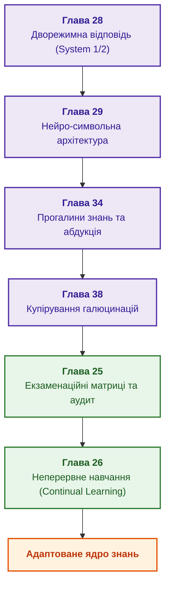

# Частина VI. Нейро-символьні моделі, когнітивні фронтири та неперервне навчання

[← До Частини V](part-05-verification-and-learning.md) | [До змісту книги](README.md) | [До Частини VII →](part-07-runtime-and-knowledge-exchange.md)

---

## Мета частини

Поєднати евристичну гнучкість великих мовних моделей із детермінованою строгістю символьного виведення, розв'язати проблему браку знань через абдукцію та сократівський діалог, купірувати генеративні галюцинації й реалізувати безрегресійне неперервне навчання експертної системи на практичному досвіді.

---

## Анотація теми та взаємозв'язку глав

Глава 28 визначає два режими функціонування (швидка дорадча евристика System 1 та детерміноване символьне доведення System 2), забороняючи автоматичне підвищення статусу неперевіреної гіпотези. Глава 29 реалізує розподіл ролей між локальною мовною моделлю та символьним шлюзом допуску на базі замкнених граматик і схем. Глава 34 використовує прогалини виведення для запуску реляційного пошуку зв'язків, абдукції й сократівського діалогу з користувачем. Глава 38 систематизує причини машинних галюцинацій та розгортає багатоетапну перевірку підстав відповідей. Глава 25 впроваджує процедури екзаменаційних матриць, незалежного аудиту знань та виявлення регресій перед випуском нових ревізій. Глава 26 забезпечує потокове неперервне навчання (Continual Learning) на системних журналах без катастрофічного забування.

Результат частини: жива нейро-символьна система, яка безпечно співпрацює з генеративними моделями, визнає власну некомпетентність у разі прогалин і систематично вдосконалюється без деградації закладених інваріантів. Реактивне виконання, міжсистемний обмін знаннями та розподілену епістемічну SOA розглядає [Частина VII](part-07-runtime-and-knowledge-exchange.md).

---

## Глави частини

### [Глава 28. Дворежимні експертні системи: строгий висновок і дорадча гіпотеза](ch28-dual-mode-expert-systems.md)

* **Анотація:** Строгий результат із перевіреними підставами або відмовою та окремо позначена дорадча гіпотеза. Дедукція, прецеденти й абдукція виконують різні ролі. Відмова або консультація фахівця дає кандидата на знання, який не обходить незалежної перевірки та випуску.

### [Глава 29. Нейро-символьна архітектура: мовні моделі та перевірка доказових підстав](ch29-neuro-symbolic-architecture.md)

* **Анотація:** Розподіл обов'язків «модель пропонує, ядро затверджує»: шлюз допуску з реєстром редакцій документів, закритим словником, перевіркою дослівної цитати за байтами й значення як цілої лексеми; обмеження виходу локальної моделі схемою JSON через Ollama; перевірка пояснень моделі; дорадче відновлення структури запиту з перевіркою хостом; облік причин відхилення як дані для аналізу; тести, що відрізняють адаптовану модель від базової; відкриті напрями досліджень.

### [Глава 34. Прогалини знань: реляційний пошук, абдукція та діалог уточнення](ch34-deterministic-relational-analysis-abduction-and-socratic-dialogue.md)

* **Анотація:** Прогалина у виведенні стає конкретним відсутнім засновком. Реляційний пошук знаходить кандидатні зв'язки, абдукція пропонує перевірювану гіпотезу, діалог визначає потрібне уточнення. Індуктивно знайдене правило або схожий прецедент не підвищує статус гіпотези без предметної перевірки.

### [Глава 38. Машинні галюцинації та дефіцит знань: доказовий контроль відповідей](ch38-curing-machine-hallucinations-and-knowledge-deficits.md)

* **Анотація:** Класи помилок генерації та різні механізми контролю: обмеження форми, перевірка цитати, відмова, позначення гіпотези й захисний контроль дії. Навчання на перевірених парах відповідей і машинне розучування розглянуто як додаткові напрями. Демонстраційний шлюз не доводить правильного тлумачення всіх цитат або універсального усунення галюцинацій.

### [Глава 25. Як навчати експертну систему: екзаменаційні матриці, аудит знань та контроль регресій](ch25-how-expert-systems-learn.md)

* **Анотація:** Керований випуск версій експертної системи: екзаменаційні матриці, парне порівняння й відхилення неповного іспиту. Груповий і часовий поділ, черга перевірки міток, пошук слабких зрізів і модель-суддя готують матеріал, але не ухвалюють рішення. Наскрізний приклад зміни вимоги та відкликання звіту показує залежні факти, правила, індекси, кеші й висновки.

### [Глава 26. Неперервне навчання (Continual Learning) на досвіді та подолання зсуву системного журналу](ch26-continual-learning.md)

* **Анотація:** Самонавчання на основі відмов: журнал випадків, час появи мітки й пропенситі. Оцінювання нової політики відмовляє в числі без перекриття дій, а незавершені епізоди не рахуються помилками. River, Avalanche й Open Bandit Pipeline підтримують досліди, але кандидати проходять той самий допуск. Випереджальні індикатори й CUSUM сигналізують про зсув до першої хибної відповіді.

---

[← До Частини V](part-05-verification-and-learning.md) | [До змісту книги](README.md) | [До Частини VII →](part-07-runtime-and-knowledge-exchange.md)
