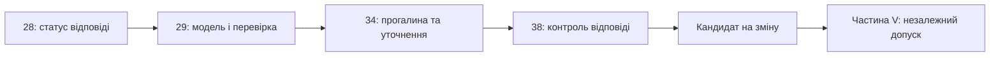

# Частина VI. Нейро-символьні відповіді, гіпотези та прогалини знань

[← До Частини V](part-05-verification-and-learning.md) | [До змісту книги](README.md) | [До Частини VII →](part-07-runtime-and-knowledge-exchange.md)

---

## Мета частини

Поєднати мовну модель із перевіркою підстав і керувати запитами, для яких знань недостатньо. Строгий висновок, дорадча гіпотеза, запит уточнення й відмова мають різні статуси; текст моделі не може сам підвищити статус власного твердження.

---

## Анотація теми та взаємозв'язку глав

Глава 28 визначає два режими відповіді й забороняє автоматичне перетворення гіпотези на факт. Глава 29 реалізує розподіл ролей між мовною моделлю та перевіркою кандидата. Глава 34 використовує прогалину для реляційного пошуку, абдукції й діалогу уточнення. Глава 38 систематизує контроль непідтверджених відповідей та способи навчального зворотного зв'язку.

Результат частини: архітектурні й процедурні межі для генерації, а не доказ універсальної відсутності галюцинацій. Побайтовий збіг доводить наявність цитати, граматика доводить відповідність форми, а семантичну підтримку та застосовність перевіряють окремо. Інфраструктуру реалізації й експлуатації розглядає наступна частина.

---

## Глави частини

### [Глава 28. Дворежимні експертні системи: строгий висновок і дорадча гіпотеза](ch28-dual-mode-expert-systems.md)

* **Анотація:** Строгий результат із перевіреними підставами або відмовою та окремо позначена дорадча гіпотеза. Дедукція, прецеденти й абдукція виконують різні ролі. Відмова або консультація фахівця дає кандидата на знання, який не обходить незалежної перевірки та випуску.

### [Глава 29. Нейро-символьна архітектура: мовні моделі та перевірка доказових підстав](ch29-neuro-symbolic-architecture.md)

* **Анотація:** Розподіл обов'язків «модель пропонує, ядро затверджує»: шлюз допуску з реєстром редакцій документів, закритим словником, перевіркою дослівної цитати за байтами й значення як цілої лексеми; обмеження виходу локальної моделі схемою JSON через Ollama; перевірка пояснень моделі; дорадче відновлення структури запиту з перевіркою хостом; облік причин відхилення як дані для аналізу; тести, що відрізняють адаптовану модель від базової; відкриті напрями досліджень.

### [Глава 34. Прогалини знань: реляційний пошук, абдукція та діалог уточнення](ch34-deterministic-relational-analysis-abduction-and-socratic-dialogue.md)

* **Анотація:** Прогалина у виведенні стає конкретним відсутнім засновком. Реляційний пошук знаходить кандидатні зв'язки, абдукція пропонує перевірювану гіпотезу, діалог визначає потрібне уточнення. Індуктивно знайдене правило або схожий прецедент не підвищує статус гіпотези без предметної перевірки.

### [Глава 38. Машинні галюцинації та дефіцит знань: доказовий контроль відповідей](ch38-curing-machine-hallucinations-and-knowledge-deficits.md)

* **Анотація:** Класи помилок генерації та різні механізми контролю: обмеження форми, перевірка цитати, відмова, позначення гіпотези й захисний контроль дії. Навчання на перевірених парах відповідей і машинне розучування розглянуто як додаткові напрями. Демонстраційний шлюз не доводить правильного тлумачення всіх цитат або універсального усунення галюцинацій.

### [Глава 39. Активний експерт-тестувальник: попперівська фальсифікація, нормативний комплаєнс (ASPICE/ISO 26262/ISO 21434) та автономне проєктування випробувань](ch39-active-compliance-auditor-and-popperian-testing.md)

* **Анотація:** Перехід від пасивного оракула до активного аудитора знань за концепцією Миколи Федчика. Попперівська фальсифікація гіпотез мовних моделей у рантаймі; нормативний комплаєнс (ASPICE 4.0, ISO 26262, ISO/SAE 21434) як детермінований генератор вимог до випробувань; автономний синтез V&V матриці покриття; нейро-символічна синергія (System 1 генерує крайові сценарії, System 2 надійно фальсифікує та блокує порушення); збереження людини в контурі (Human-in-the-Loop) для вивільнення інженерної творчості.

## Контрольні випадки гібридної відповіді

Перевірка має розрізняти форму, походження, зміст і статус результату. Навчальні приклади демонструють окремі механізми; для оцінювання виробничого конвеєра потрібні незалежні предметні випадки й негативні приклади, які демонстраційний шлюз ще може пропускати.

| Прикладна проблема | Контрольний випадок | Глава |
|---|---|---|
| Маршрутизація й допуск пропозицій моделі | розбіжність рушіїв Datalog, поріг схожості, частина числа як значення, відновлений запит із хибною інтерпретацією | [Глави 28](ch28-dual-mode-expert-systems.md) і [29](ch29-neuro-symbolic-architecture.md) |
| Реляційний аналіз, абдукція та сократівське уточнення | розрив дедуктивного ланцюга, спільний посередник, відсутній засновок, вибір сократівської альтернативи | [Глава 34](ch34-deterministic-relational-analysis-abduction-and-socratic-dialogue.md) |
| Контроль непідтвердженої відповіді | правильні байти з хибним тлумаченням, частина числа, переставлені ролі, невідомий предикат, позначення гіпотези | [Глава 38](ch38-curing-machine-hallucinations-and-knowledge-deficits.md) |

Аргументи безпеки, тестування знань і оцінювання входу мають окремі основні глави в Частинах V та III. Їхні методи підтримують цей маршрут, але не перетворюють Частину VI на каталог усіх нових технологій книги.

---

[← До Частини V](part-05-verification-and-learning.md) | [До змісту книги](README.md) | [До Частини VII →](part-07-runtime-and-knowledge-exchange.md)
