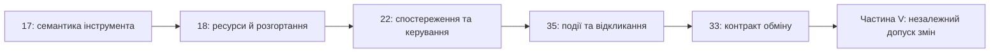

# Частина VII. Реалізація, розгортання та обмін знаннями

[← До Частини VI](part-06-frontiers-neuro-symbolic.md) | [До змісту книги](README.md) | [До додатків →](appendix-a-evidence-governed-framework.md)

---

## Мета частини

Обґрунтувати засоби реалізації й експлуатації експертної системи: вибрати інструменти за семантикою, розмістити обчислення за виміряними ресурсами, замкнути зворотний зв'язок і передавати знання без втрати походження, застосовності та доступу.

## Анотація теми та взаємозв'язку глав

Глава 17 визначає критерії вибору мов, бібліотек і рушіїв. Глава 18 переводить вимоги до якості, затримки й автономності у профіль апаратури та топологію. Глава 22 розглядає фізичний цикл керування, часові горизонти й деградацію зв'язку. Глава 35 переносить увагу на реактивне виконання правил і відкликання підстав за подіями. Глава 33 завершує маршрут контрактом обміну між експертною системою та стороннім споживачем.

Фізичний регулятор, реактивна робоча пам'ять і випуск нової бази знань мають різні часові масштаби й повноваження. Подія може скасувати підтримку висновку, але не надає дозволу самостійно змінити нормативне правило. Кандидати на зміну проходять незалежну перевірку з [Частини V](part-05-verification-and-learning.md).

## Глави частини

### [Глава 17. Технологічний стек: критерії вибору інструментів, мов програмування та рушіїв правил](ch17-implementation-stack.md)

* **Анотація:** Семантичний договір перед порівнянням продуктивності: невідомість, заперечення, порядок, відкликання й завершення. SQL обходить цикли без змішування складених ідентифікаторів; Datalog, таблиці рішень і розв'язувачі мають різні межі.

### [Глава 18. Інфраструктура виконання: локальні моделі, апаратні прискорювачі, Edge та On-Premise](ch18-execution-infrastructure.md)

* **Анотація:** Профіль обчислень, межі Roofline, підтримка операторів і вимірювання наскрізної затримки, пам'яті та енергії. Перцентиль не є часовою гарантією; окремий процес не усуває спільних фізичних відмов. Мережа NPU є дослідницьким варіантом із перевіркою повторних доставок.

### [Глава 22. Кібернетичний цикл керування: сенсори, периферія та зворотний зв'язок](ch22-cybernetics-edge-to-backend.md)

* **Анотація:** Якість, свіжість і час спостереження; межі фільтра та кібернетичних аналогій. Логічний годинник не замінює фізичного. Flink, RTAMT, do-mpc й River дають кандидати обробки та аналізу; деградація й відкат потребують предметної політики.

### [Глава 35. Реактивна експертна система: події, відкликання й адаптація знань](ch35-self-organizing-expert-systems-synergetics-and-npu-runtime.md)

* **Анотація:** Подійне виконання, незмінний базовий шар, динамічні факти та відкликання підтримки висновку. Шина подій і підтримання підстав мають перевіряти повтори, порядок та альтернативні обґрунтування. Синергетична еволюція онтологій є ширшою дослідницькою пропозицією; часові й енергетичні властивості потребують окремих вимірювань.

### [Глава 33. Міжсистемний обмін знаннями: постачання правил стороннім системам, навчання моделей і захищений зворотний зв'язок](ch33-inter-system-knowledge-exchange-and-model-teaching.md)

* **Анотація:** Контракт експорту правил, обмежень і фактів до іншого програмного споживача. Походження, область застосування, дозволи, підпис і відкликання супроводжують передане знання. Навчання сторонньої моделі є одним способом використання експорту; зворотний зв'язок постачає кандидатів у карантин, а не перезаписує чинну базу знань.

## Контрольні межі експлуатації

| Перехід | Що перевіряти | Що перевірка не доводить |
|---|---|---|
| Інструмент → потрібна семантика | невідомий факт, заперечення, порядок і завершення | рівнозначність різних рушіїв за назвою технології |
| Апаратна платформа → заданий час | холодний запуск, черга, пам'ять, енергія та наскрізна затримка | жорстку часову гарантію з одного перцентиля |
| Спостереження → локальна дія | свіжість, калібрування, дубль, переставлена подія й обрив зв'язку | істинність сигналу з наявності підпису |
| Подія → відкликання висновку | альтернативну підставу, непідкріплений цикл і повтор доставки | автономну еволюцію онтології з одного навчального прикладу |
| Експорт → приймання | область застосування, дозволи, версію, походження й карантин | істинність переданого факту з криптографічної цілісності |

Наведені контрольні випадки задають перевірювані вимоги, а не повідомляють про вже пройдену атестацію. Апаратні числа й дослідницькі пропозиції потрібно відтворити на власному корпусі та обладнанні.

---

[← До Частини VI](part-06-frontiers-neuro-symbolic.md) | [До змісту книги](README.md) | [До додатків →](appendix-a-evidence-governed-framework.md)