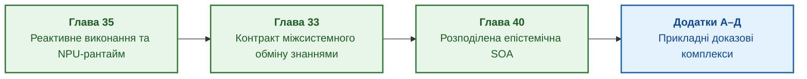

# Частина VII. Реактивне виконання, міжсистемний обмін знаннями та розподілена SOA

[← До Частини VI](part-06-frontiers-neuro-symbolic.md) | [До змісту книги](README.md) | [До додатків →](appendix-a-evidence-governed-framework.md)

---

## Мета частини

Масштабувати експертну систему від локального детермінованого процесу до розподіленої екосистеми корпоративного інтелекту. Частина розглядає реактивне переоцінювання знань за подіями у реальному часі, синергетичні фазові переходи в онтологіях, захищений міжсистемний обмін правилами, дистиляцію знань у сторонні моделі та побудову глобальної розподіленої епістемічної SOA з дефезитивним арбітражем і конвеєрною пам'яттю.

---

## Анотація теми та взаємозв'язку глав

Глава 35 розглядає реактивне подійне виконання правил, механізми підтримки істинності (TMS), фазові переходи знань у синергетиці та рантайм на базі NPU. Глава 33 визначає контракт міжсистемного обміну знаннями: безпечне постачання правил стороннім агентам, навчання моделей-учнів і заземлення зворотного зв'язку через карантинний шлюз. Глава 40 виступає архітектурною кульмінацією монографії, синтезуючи референсний прототип промислової епістемічної SOA: тонкі мобільні клієнти, семантичну маршрутизацію, подвійну буферизацію робочих наборів знань (Ping-Pong Pipeline) для повного приховування затримок шини та багатоджерельний дефезитивний арбітраж на базі формальної аргументації ASPIC+.

Результат частини: повномасштабна розподілена архітектура доказового ШІ, здатна координувати роботу тисяч вузлів без втрати походження фактів, порушення ліцензійних прав чи деградації гарантій безпеки. Практичні інженерні методики та прикладні комплекси автономності зібрано в [додатках А–Д](README.md#додатки).

---

## Глави частини

### [Глава 35. Реактивна експертна система: події, відкликання й адаптація знань](ch35-self-organizing-expert-systems-synergetics-and-npu-runtime.md)

* **Анотація:** Подійне виконання, незмінний базовий шар, динамічні факти та відкликання підтримки висновку. Шина подій і підтримання підстав мають перевіряти повтори, порядок та альтернативні обґрунтування. Синергетична еволюція онтологій, параметри порядку Гаккена й NPU-рантайм.

### [Глава 33. Міжсистемний обмін знаннями: постачання правил стороннім системам, навчання моделей і захищений зворотний зв'язок](ch33-inter-system-knowledge-exchange-and-model-teaching.md)

* **Анотація:** Контракт експорту правил, обмежень і фактів до іншого програмного споживача. Походження, область застосування, дозволи, підпис і відкликання супроводжують передане знання. Навчання сторонньої моделі як дистиляція знань; зворотний зв'язок постачає кандидатів у карантин, а не перезаписує чинну базу знань.

### [Глава 40. Розподілена архітектура доказової експертної системи: епістемічна SOA, семантична маршрутизація, ієрархія пам'яті та багатоджерельний дефезитивний арбітраж](ch40-distributed-epistemic-architectures-soa-and-cluster-scaling.md)

* **Анотація:** Референсний архітектурний прототип промислової доказової експертної системи. Триланкова Epistemic SOA (тонкі мобільні клієнти, семантичний брокер, федеративні доменні сервіси). Долання розриву місткості пам'яті через активні робочі набори знань (AWS) і подвійну буферизацію (Ping-Pong Pipeline) з повним приховуванням затримок. Шаблон Scatter-Gather та багатоджерельна дефезитивна агрегація (ASPIC+) для обробки неповних знань і нормативних колізій. Інженерна матриця вибору технологій та масштабування за бюджетом проєкту.

---

[← До Частини VI](part-06-frontiers-neuro-symbolic.md) | [До змісту книги](README.md) | [До додатків →](appendix-a-evidence-governed-framework.md)