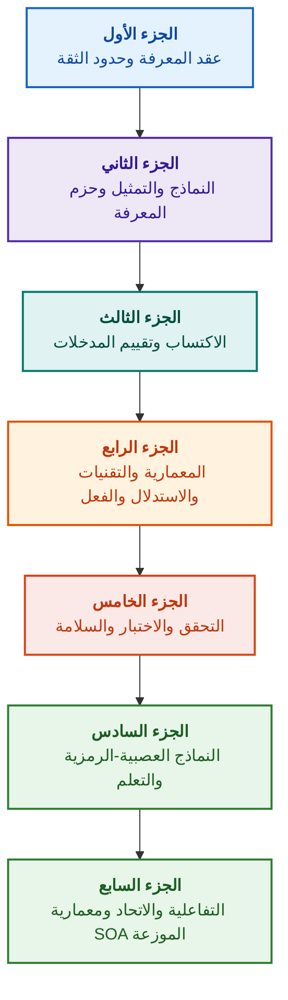

# هندسة الأنظمة الخبيرة المحكومة بالأدلة: من الأنطولوجيات الصورية إلى الذكاء الاصطناعي العصبي-الرمزي

**دراسة هندسية متخصصة ودليل مرجعي لتصميم ونمذجة وهندسة والتحقق من الأنظمة الذكية عالية الموثوقية (Safety-Critical & Evidence-Grounded AI)**

**المؤلف:** [Mykola Fedchyk](about-the-author.md) · [LinkedIn](https://www.linkedin.com/in/nickfedchik/)  
**التنسيق:** دراسة هندسية تخصصية / مرجع مهندسي الذكاء الاصطناعي  
**السنة:** 2026  

---

## عن الكتاب

يمثل هذا الكتاب دراسة علمية تأسيسية ودليلاً هندسياً شاملاً مخصصاً لتجاوز الأزمة الجوهرية للذكاء الاصطناعي المعاصر: الفجوة المعرفية (الإبستيمية) بين الاحتمالية الظاهرية لمخرجات الشبكات العصبية والحقيقة القطعية للبراهين الصورية. يركز البحث على السؤال الهندسي الحاسم: **كيف نصمم نظاماً خبيراً تكون كل نتيجة يتوصل إليها غير قابلة للطعن، وقابلة للتتبع الكامل حتى مصادر الأدلة الأولية، ومؤهلة للحصول على الاعتماد في المجالات الهندسية الحرجة للسلامة (ISO 26262, IEC 61508, DO-178C, ISO/SAE 21434)؟**

يؤسس المؤلف ويوثق نموذجاً جديداً: **الذكاء الاصطناعي العصبي-الرمزي المحكوم بالأدلة (Evidence-Grounded Neuro-Symbolic AI)**، حيث تؤدي النماذج الإحصائية (LLM/SLM) دوراً استشارياً في توليد الفرضيات وترجمة الاستعلامات، بينما تضمن النواة الرمزية القطعية بشكل غير قابل للنقض ثوابت الاتساق المنطقي، وترسيخ الحقائق على مستوى البايت، والتحكم في الصلاحيات، والانتقال الآمن إلى الفعل.

### من الأثر المادي إلى القرار القابل للتحقق

توجد متطلبات الأنظمة، والشفرات المصدرية، وسجلات الاختبارات، والمعايير التنظيمية، والقرارات الهندسية بالفعل في بيئات الإنتاج الحديثة، إلا أنها تعمل في الغالب كآثار منعزلة تفتقر إلى الدلالات الصورية، والحدود الصارمة للصلاحية، وقابلية التتبع المتبادل. قد يشير تقرير اختبار ناجح إلى إصدار عتادي قديم؛ وقد يُنتزع اقتباس من معيار أمان وظيفي من سياقه؛ وقد يؤدي التراجع التلقائي عند الطوارئ إلى إعادة تنشيط مكون ملغى دون قصد.

تقدم هذه الدراسة مساراً هندسياً متكاملاً: من صياغة الآثار الهندسية كبيانات نمطية وحزم معرفية موقعة تشفيرياً – إلى الاستدلال الرمزي، والتفكيك المرحلي للخطط، والتفسيرات المضادة للواقع، وتدقيق حدود الكفاءة. يُدعَم العرض العملي بتطبيقات جاهزة للإنتاج بلغة Go مع مجموعات اختبار كاملة ([الفصل 1](ch01-introduction-to-expert-systems.md))، وعقود رياضية صارمة ([الجزء الثاني](part-02-knowledge-models.md))، وبروتوكولات تعلم مستمر مثبتة تمنع الانتكاسات المعرفية ([الفصل 25](ch25-how-expert-systems-learn.md)).

### الفئات المستهدفة بالدراسة

الكتاب موجه لمهندسي معمارية الأنظمة، وكبار مهندسي الموثوقية والسلامة الوظيفية، ومطوري محركات الاستدلال المنطقي، ومهندسي المعرفة. لاستيعاب المفاهيم الأساسية، يكفي الإلمام بأساسيات منطق الإسناد من الدرجة الأولى، وإدارة إصدارات البرمجيات ودورات حياتها؛ ولتشغيل الأمثلة العملية، تلزم بيئة عمل Go قياسية. تغطي الفصول المتخصصة التوليف الصوري لقضايا السلامة بنسق Goal Structuring Notation (GSN)، وسينرجيتيك الأنظمة المعقدة، والمسرعات العصبية، والملاحة المستقلة دون الحاجة إلى GNSS، وتكشف الآفاق المتقدمة للذكاء الاصطناعي المحكوم بالأدلة في الصناعات عالية التقنية (الفضاء، والمركبات الذاتية، والطاقة).

---

## السياق العلمي ومكانة الدراسة في الأبحاث العالمية

تتناول الدراسة الأنظمة الخبيرة ليس كإرث قديم يستند إلى قواعد الثمانينيات (مثل CLIPS أو MYCIN)، بل كطليعة **الجيل الثالث من الذكاء الاصطناعي العصبي-الرمزي المحكوم بالأدلة (Third-Wave Evidence-Grounded Neuro-Symbolic AI)**. يستند العمل إلى الأسس النظرية للمدارس العلمية الرائدة عالمياً، مع ردم الهوة بين النماذج الرياضية المجردة وهندسة الأنظمة عالية الأداء:

| الاتجاه العلمي | أبرز الأعمال والمؤلفين عالمياً | الجسر المفهومي في الكتاب |
|---|---|---|
| **الجيل الثالث من الذكاء الاصطناعي العصبي-الرمزي (NeSy)** | Artur d'Avila Garcez, Luis C. Lamb (*Neurosymbolic AI: The 3rd Wave*, 2023; *Neural-Symbolic Cognitive Reasoning*, Springer, 2009); Henry Kautz (*The Third AI Summer*, AAAI 2022) | توزيع المسؤوليات: تولد النماذج الإحصائية (SLM/LLM) فرضيات الاستعلام، بينما تتحقق النواة الرمزية القطعية من الحقائق وتعتمدها صورياً ([الفصل 29](ch29-neuro-symbolic-architecture.md)). |
| **القيود الدلالية والتعلم الآمن** | Guy Van den Broeck et al. (*A Semantic Loss Function for Deep Learning with Symbolic Knowledge*, ICML 2018); Luc De Raedt et al. (*DeepProbLog*, IJCAI 2020) | بوابات الدخول والخروج المحكومة، والتصفية الدلالية القطعية لاقتراحات الشبكة العصبية وفقاً للمخططات الصورية ([الفصلان 28](ch28-dual-mode-expert-systems.md)، [33](ch33-inter-system-knowledge-exchange-and-model-teaching.md)). |
| **الاستدلال القابل للنقض ونظرية الحجاج** | John L. Pollock (*Defeasible Reasoning*, 1987; *Cognitive Carpentry*, MIT Press, 1995); Phan Minh Dung (*Abstract Argumentation Frameworks*, AIJ 1995); Douglas Walton (*Argumentation Schemes*, Cambridge, 2008) | تفكيك المعرفة إلى ادعاءات، ومصادر منشأ، وعوامل دحض (*rebutting* و *undercutting defeaters*)؛ وحل النزاعات في قواعد القواعد باستخدام أطر الحجاج لدونغ ([الفصلان 2](ch02-epistemology-of-machine-knowledge.md)، [27](ch27-safety-case-gsn-synthesis.md)). |
| **التنقيب الذاتي عن القواعد المترابطة (KBC)** | Luis Galárraga, Fabian M. Suchanek et al. (*AMIE: Association Rule Mining under Incomplete Evidence*, WWW 2013, VLDBJ 2015); Stephen Muggleton (*Inductive Logic Programming*, 1994) | استخلاص القواعد تلقائياً من قواعد المعرفة بافتراض الاكتمال الجزئي (PCA) مع تجنب الأمثلة المضادة الخاطئة للعالم المفتوح ([الفصل 34](ch34-deterministic-relational-analysis-abduction-and-socratic-dialogue.md)). |
| **دروع السلامة الصورية والشهادات المعتمدة (Safe AI)** | Bettina Könighofer, Roderick Bloem et al. (*Shield Synthesis*, 2017); Tim Kelly, Rob Weaver (*Goal Structuring Notation*, York, 2004); André Platzer (*Logical Foundations of CPS*, Springer, 2018) | توليف ملفات السلامة بنسق GSN لتوافق معايير ISO 26262/21434؛ والدروع الصورية ونطاقات الصلاحية الرقمية للمشغلات الميكانيكية الطرفية ([الفصول 27](ch27-safety-case-gsn-synthesis.md)، [30](ch30-safety-cybersecurity-co-engineering.md)، [33](ch33-inter-system-knowledge-exchange-and-model-teaching.md)). |
| **المنطق الإبستيمي وسيميائيات المعرفة** | John F. Sowa (*Knowledge Representation: Logical, Philosophical, and Computational Foundations*, 2000); Frank van Harmelen et al. (*Handbook of Knowledge Representation*, Elsevier, 2008) | ثالوث تشارلز ساندرز بيرس الإبستيمي (المفهوم → الحكم → الاستنتاج)؛ والاستدلال التخميني للفرضيات تحت إشراف استنتاجي صارم ([الفصلان 6](ch06-applied-mathematics-for-expert-systems.md)، [34](ch34-deterministic-relational-analysis-abduction-and-socratic-dialogue.md)). |
| **السيبرنيطيقا وسينرجيتيك الأنظمة المعقدة** | Norbert Wiener (*Cybernetics*, 1948); W. Ross Ashby (*An Introduction to Cybernetics*, 1956); Hermann Haken (*Synergetics: An Introduction*, 1977; *Advanced Synergetics*, 1983); Ilya Prigogine (*Order out of Chaos*, 1984) | قانون آشباي للتنوع الضروري، وحلقات التحكم المغلقة L0–L4، واختزال فضاء الحالة إلى معلمات النظام وفق مبدأ التبعية لهاكن، والإنذار المبكر للتحولات الطورية عبر التباطؤ الحرج (CSD)، والاستقرار التشتتي لقواعد المعرفة ([الفصول 6](ch06-applied-mathematics-for-expert-systems.md)، [22](ch22-cybernetics-edge-to-backend.md)، [35](ch35-self-organizing-expert-systems-synergetics-and-npu-runtime.md)). |
| **اختبار المعرفة، وثبات الاستجابة، ومعايرة ليبشيتز** | Kent Beck (*TDD*, 2002); Martin Fowler (*Refactoring*, 2018); Clark Barrett, Leonardo de Moura (*Z3 SMT Solver*, 2008); Chuan Guo et al. (*On Calibration of Modern Neural Networks*, ICML 2017); Marco Tulio Ribeiro et al. (*CheckList*, ACL 2020); John L. Pollock (*Defeasible Reasoning*, 1987) | هرم اختبار المعرفة ذو المستويات الأربعة (KTP): اختبار الوحدات المعزولة للقواعد (KUT) بمحاكاة الفرضيات (`PremiseMock`)، وتجنب فخ الصدق الفارغ، وتحليل القيم الحدية الطيفي سداسي النقاط (BVA)، وشبكات القواعد وعوامل الدحض (KIT)، ومقياس الثبات الدلالي ($\text{SIS} \ge 0.98$) مع الطفرات اللغوية، واتصال ليبشيتز ($L_{\mathcal{K}} \le L_{\max}$) لمنع ارتداد المرحلات، وتوثيق فجوات المعرفة ستيجميرجياً ([الفصل 36](ch36-knowledge-testing-pyramid-and-variational-calibration.md)). |

---

## النماذج النظرية والأبحاث العلمية والابتكارات الهندسية للمؤلف

تلخص هذه الدراسة المساهمات الهندسية والأبحاث الأساسية للمؤلف في مجالات تصميم الأنظمة الحرجة للسلامة، والمعماريات المضمنة، والذكاء الاصطناعي المحكوم بالأدلة. وخلافاً للدراسات المسحية البحتة، يقدم الكتاب مجموعة من النظريات الصورية والبروتوكولات المعمارية المبتكرة التي ترتقي بالتفاعلات العصبية-الرمزية إلى مستوى ثقة محقق رياضياً:

### 1. التطورات النظرية التأسيسية والصياغات الرياضية الصارمة

1. **ثابت الإسناد بالأدلة (EGI) وبوابة ترسيخ الحقائق ([الفصول 2](ch02-epistemology-of-machine-knowledge.md)، [19](ch19-from-question-to-evidence.md)، [28](ch28-dual-mode-expert-systems.md)، [29](ch29-neuro-symbolic-architecture.md)):**
   * *المفهوم النظري:* صاغ المؤلف وأثبت رياضياً ثابت اكتمال الإسناد $\mathrm{Comp}(C) = 1.00$، الذي ينص على أنه في النظام المحكوم بالأدلة، لا يمكن منح أي ادعاء صفة الحقيقة المعتمدة دون إسقاط قطعي على المصادر الأولية للمعرفة. يدعم كل عنصر في قاعدة الحقائق بسجل تشفيري: إزاحات بايت غير قابلة للتغيير `[byte_start, byte_end]`، وتجزئة الجزء القانوني `quote_sha256`، ومعرف شهادة المنشأ وفق معيار PROV-O.
   * *الأهمية الهندسية:* تمنع آلية بوابة التحقق على مستوى البايت، برمجياً وعتادياً، تسلل هلوسات الشبكات العصبية إلى قاعدة المعرفة المدارة بالإصدارات، مما يضمن انعدام التسامح التام مع البيانات غير المؤكدة ($ZHR = 1.00$).
2. **هرم اختبار المعرفة رباعي المستويات (KTP) واستقرار فضاء الاستدلال وفق ليبشيتز ([الفصل 36](ch36-knowledge-testing-pyramid-and-variational-calibration.md)):**
   * *المفهوم النظري:* يقترح المؤلف لأول مرة هرماً منهجياً لاختبار المعرفة (KTP)، ينقل مبادئ هرم اختبار البرمجيات لمارتن فاولר إلى أنظمة المعرفة: اختبار الوحدات المعزولة للقواعد (KUT) بعزل الفرضيات (`PremiseMock`)، واختبار تكامل تفاعلات القواعد وعوامل الدحض (KIT)، والمعايرة التباينية على مساحات الصياغات اللغوية (KVT).
   * *الأدوات الرياضية:* صياغة ثابت صارم لمنع فخ الصدق الفارغ ($P \to Q$ عندما تكون $P \equiv \text{False}$)، ومقياس الثبات الدلالي ($\mathrm{SIS} \ge 0.98$) تحت التغيرات اللغوية للاستعلامات، وقيد اتصال ليبشيتز لفضاء الاستدلال ($L_{\mathcal{K}} \le L_{\max}$)، مما يستبعد رياضياً تذبذب القرارات الكارثي عند حدوث تقلبات طفيفة في المدخلات.
3. **نظرية التكذيب البوبرية للقواعد المعيارية والمدقق النشط للامتثال ([الفصل 39](ch39-active-compliance-auditor-and-popperian-testing.md)):**
   * *المفهوم النظري:* التحول من نموذج "العراف الخامل" التقليدي (الذي يقتصر على الإجابة عن الأسئلة) إلى نموذج مدقق المعرفة النشط الذي يطبق مبدأ التكذيب لكارل بوبر. يستكشف النظام ذاتياً فضاء المتطلبات (ASPICE 4.0, ISO 26262, ISO/SAE 21434)، ويولد أمثلة مضادة، ويكتشف المواصفات غير المكتملة، ويصمم بصورة مستقلة خطة اختبار شاملة للمنتج.
   * *القيمة العملية:* الجمع بين الإبداع التوليدي لسيناريوهات الحالات الحدية بواسطة النماذج العصبية (System 1) والتحقق المعياري القطعي عبر النواة الرمزية (System 2)، مع حماية الإنسان في حلقة التحكم (Human-in-the-Loop) من الإجهاد الإدراكي.
4. **الاختزال السينرجيتي لأبعاد قاعدة المعرفة والتشخيص الاستباقي للتباطؤ الحرج ([الفصول 6](ch06-applied-mathematics-for-expert-systems.md)، [22](ch22-cybernetics-edge-to-backend.md)، [35](ch35-self-organizing-expert-systems-synergetics-and-npu-runtime.md)):**
   * *المفهوم النظري:* تطبيق الأدوات الرياضية لسينرجيتيك هيرمان هاكن (معلمات النظام ومبدأ التبعية) ونظرية الهياكل التشتتية لإيليا بريغوجين على تطور قواعد المعرفة المعقدة.
   * *النتيجة العلمية:* ابتكار طريقة لاختزال فضاء الحالة متعدد الأبعاد للمعلومات عن بعد إلى معلمات نظام رئيسية، ودمج كاشف استباقي للتباطؤ الحرج (*Critical Slowing Down*, CSD) بالاعتماد على الارتباط الذاتي والتباين، مما يتيح التنبؤ باقتراب النظام السيبراني-الفيزيائي من الانهيار الديناميكي قبل انطلاق أجهزة إنذار الطوارئ بفترة طويلة.
5. **نموذج مستويات استقلالية الفعل (A0–A4)، وبوابة الصلاحيات، وحكايات التعويض القطعية ([الفصل 21](ch21-from-recommendation-to-action.md)):**
   * *المفهوم النظري:* صياغة مقياس منفصل لصلاحيات أفعال النظام (A0 – تحليل سلبي، A1 – إعداد مسودة، A2 – فعل بتوقيع بشري، A3 – استقلالية خاضعة للرقابة، A4 – فصل وقائي طارئ)، يُسند ليس للنظام ككل بل للثلاثية "الفعل، البيئة، مستوى المخاطرة".
   * *الأدوات الرياضية:* إدخال ثابت جبري لخاصية القوة الصفرية $f(f(x, k), k) \equiv f(x, k)$ بناءً على المفتاح التشفيري $k$، والتنفيذ المرحلي المغلق، وبروتوكول حكايات التعويض الموزعة مع حالة `OutcomeUnknown` والتحقق المستقل من شروط ما بعد التنفيذ.
6. **الهندسة المشتركة الصورية للسلامة الوظيفية والأمن السيبراني بنسق GSN ([الفصلان 27](ch27-safety-case-gsn-synthesis.md)، [30](ch30-safety-cybersecurity-co-engineering.md)):**
   * *المفهوم النظري:* تطوير نموذج للتوليف المتناسق لأشجار الحجاج بنسق GSN (Goal Structuring Notation) للوفاء المشترك بمتطلبات معايير ISO 26262 (السلامة الوظيفية) وISO/SAE 21434 (الأمن السيبراني).
   * *إنجاز هندسي:* صياغة تحكيم رياضي بين الأهداف المتعارضة (ميزانية زمن الاستجابة للطوارئ مقابل عمق المصادقة التشفيرية) وبروتوكول للكشف الانتقائي عن الأدلة للمدققين الخارجيين عبر أشجار ميركل المضاف إليها ملح تشفيري.
7. **بروتوكول التحقق من مطابقة التفسيرات واتساقها الدلالي ([الفصل 20](ch20-explanation-engine.md)):**
   * *المفهوم النظري:* التعامل مع التفسير ليس كنص حر ينشئه نموذج توليدي، بل كأثر قطعي مستقل يُستنتج مباشرة من رسم بياني للبرهان، ونسخة القواعد، واللقطة الزمنية للحقائق.
   * *الأدوات الرياضية:* صياغة بوابة قياس لمطابقة التفسير ($C_{\text{facts}} = 1.00, H_{\text{free}} = 1.00$) مع تراجع آمن تلقائي إلى قالب صارم عند رصد أي تباين بين الاستنتاج الرمزي والصياغة اللفظية الموجهة للمشغل.

---

### 2. الأبحاث التجريبية، ومنصات الاختبار الخاصة، وهندسة الأنظمة

1. **حزم معرفية ثنائية غير قابلة للتغيير باستخدام `mmap` وانعدام عبء إلغاء التسلسل ([الفصل 32](ch32-high-performance-knowledge-packs-mmap-and-harvesting.md)):**
   * *ابتكار المؤلف:* بنية معمارية ثنائية الطبقات للحزم (طبقة قياسية للمصادر الأولية + طبقة مادية مشتقة للفهارس).
   * *النتيجة التجريبية:* تخطيط مباشر للفهرس في مساحة العناوين الافتراضية عبر نداء النظام `mmap`، والقضاء على عبء تخصيص الذاكرة الديناميكية (zero-allocation)، وبدء تشغيل المحرك في زمن دون خطي بصرف النظر عن حجم الأنطولوجيا الذي يبلغ غيغابايتات عديدة.
2. **منصة المعايرة التجريبية على مجموعات معايير IETF RFC-1000 وW3C-150 ([الفصول 2](ch02-epistemology-of-machine-knowledge.md)، [4](ch04-evolution-from-bayes-to-evidence-ai.md)، [14](ch14-requirements-detection-and-formalization.md)، [25](ch25-how-expert-systems-learn.md)):**
   * *تجربة المؤلف:* تشغيل بيئة اختبار موسعة على 1000 مواصفة سارية من IETF RFC (موزعة على 5 حقب تاريخية لتطور الإنترنت) و150 استعلاماً تشخيصياً معقداً من مجموعة W3C (بما في ذلك الحقن المتعمد للتناقضات المنطقية والتلفيق).
   * *النتيجة العملية:* بناء مصفوفات فحص معرفية موضوعية، وكشف التناقضات المعيارية، وحماية مثبتة رياضياً ضد الانتكاسات المعرفية عند تحديث قاعدة المعرفة.
3. **التحليل الترابطي متعدد الخطوات، والاستدلال التخميني الرمزي، والحوار السقراطي ([الفصل 34](ch34-deterministic-relational-analysis-abduction-and-socratic-dialogue.md)):**
   * *تطوير المؤلف:* خوارزمية بحث مقيد ثنائي الاتجاه عن العلاقات (Bidirectional Bounded BFS, $k \le 6$) مع منع الحلقات التكرارية وتشكيل سلاسل أدلة مركبة على مستوى البايت للكيانات المترابطة.
   * *الميزة الهندسية:* تطبيق الاستدلال التخميني لبيرس تحت إشراف استنتاجي صارم وأطر توضيح سقراطية محددة النمط (*Clarification Frames*)، تنقل النظام إلى حوار بنّاء مع الإنسان بدلاً من الرفض التلقائي الأعمى تحت افتراض العالم المغلق (CWA).
4. **الدروع الصورية ونطاقات الصلاحية الرقمية لأنظمة التحكم الطرفية ([الفصل 33](ch33-inter-system-knowledge-exchange-and-model-teaching.md)، [الملاحق ب](appendix-b-robotics-and-cyber-physical-systems.md)، [ج](appendix-c-autonomous-navigation-and-geosearch.md)، [هـ](appendix-e-mixed-signal-neuromorphic-expert-systems.md)):**
   * *ابتكار المؤلف:* منهجية لترجمة الثوابت المنطقية المنفصلة إلى مسارات أمان رقمية مستمرة لمعالجات الإشارات الرقمية (DSP) وأنظمة الملاحة الذاتية دون GNSS (TRN/DSMAC/VIO).
   * *الموثوقية العملية:* تبادل موقع للقواعد يعتمد على تشفير Ed25519، وحجر صحي آمن لمرشحي المعرفة الجدد، وحجب إشارات التحكم الخطرة على مستوى العتاد.
5. **الحماية من تسريب المعلومات الحساسة عبر التفسيرات والتدقيق التفاضلي ([الفصل 20](ch20-explanation-engine.md)):**
   * *تطوير المؤلف:* بروتوكول اختزال التمثيل الوسيط للتفسير ($\mathrm{EIR}_{\text{redacted}}$) مع فحص قوائم التحكم بالوصول (ACL) لكل عقدة ورابط في رسم بياني للبرهان، مما يصد هجمات القنوات الجانبية الرامية لإعادة بناء النماذج عبر استعلامات WHY NOT التباينية.

---

## مبدأ تصنيف وتجميع الفصول

تتحدد أجزاء الكتاب وفقاً للمهمة الهندسية الأساسية، وليس بناءً على سنة كتابة الفصل أو مسمى تقنية بعينها. لكل فصل جزء رئيسي واحد؛ وتشرح الطرق المجاورة كيفية حل القضية المحورية. تظل أرقام الفصول وأسماء الملفات معرفات ثابتة، لذا قد يختلف الترتيب الموضوعي للقراءة عن التسلسل العددي.

تشكل عناوين الأقسام داخل الفصول فئات متميزة يجب قراءتها كتسلسل لحجة برهانية متماسكة، وليس كمجرد حصر لتقنيات متوازية:

| فئة القسم | سؤال القارئ | الوظيفة في الفصل |
|---|---|---|
| المشكلة ونطاق المسألة | ما الذي يتعين حله بالتحديد؟ | تحديد المسألة الرئيسية ومجال التطبيق |
| الكيان والنموذج | ما هي البيانات أو المعارف أو الحالات المدروسة؟ | ضبط المفاهيم والأنماط والافتراضات |
| الطريقة والإجراء | كيف نصل إلى النتيجة المطلوبة؟ | شرح الاستدلال أو التحويل أو التحكم |
| التنفيذ والأداة | ما الوسيلة لتنفيذ الإجراء؟ | بيان التجسيد البرمجي أو العتادي للطريقة |
| التحقق والحالة المرجعية | كيف نكتشف الخطأ؟ | مقارنة النتيجة بمعيار تقييم مستقل |
| الخلاصة وحدود النتيجة | ما الذي تم إثباته وما الذي لا يزال مفتوحاً؟ | الإجابة عن السؤال الرئيسي دون مبالغة في الوعود |

تعتبر الدولة أو القطاع الصناعي أو المنتج التجاري مجرد سياق للتطبيق، وليست مستوى مستقلاً في هذا التصنيف. وتعد المعاجم وقوائم الاختصارات والمراجع وأدوات التصفح جهازا مرجعيا مساعدا، وليست موضوعات مستقلة بذاتها.

تحتوي [خريطة التحرير](editorial-structure-review.md) الكاملة على تقييم للموضوع الرئيسي لكل فصل، والحدود بين الموضوعات المتقاربة، وملاحظات حول البنية والخلاصات. ولا تعني إضافة ملخص جديد أن جميع المخاطر المتعلقة بالمحتوى داخل الفصول قد أُزيلت بالكامل.

## مسارات القراءة الموصى بها

**التحقق البرمجي الأولي:** [1](ch01-introduction-to-expert-systems.md) ← [7](ch07-knowledge-base-typology.md) ← [8](ch08-engineering-artifacts-as-data.md) ← [17](ch17-implementation-stack.md) ← [23](ch23-knowledge-base-verification.md) ← [25](ch25-how-expert-systems-learn.md). الهدف: الوصول إلى حكم قابل للتكرار ومسنود بالأدلة، مع اختبارات سلبية وتعديل منضبط للمعارف. استخدام النموذج اللغوي ليس إلزامياً في هذا المسار.

**هندسة المعرفة:** [الجزء الثاني](part-02-knowledge-models.md) ← [الجزء الثالث](part-03-knowledge-engineering-nlp.md) ← [19](ch19-from-question-to-evidence.md) ← [20](ch20-explanation-engine.md) ← [26](ch26-continual-learning.md). الهدف: مواءمة الدلالات، وتتبع المنشأ، واكتساب المعرفة، والتحقق من القواعد المرشحة الجديدة. يحتفظ الجزء الثاني ببرنامج الاختبارات العلمية للفصول 7–11.

**معمارية الحل:** [16](ch16-expert-systems-architecture.md) ← [19](ch19-from-question-to-evidence.md) ← [31](ch31-syllogistic-reasoning-and-relation-lattices.md) ← [20](ch20-explanation-engine.md) ← [21](ch21-from-recommendation-to-action.md). الهدف: الفصل بين التحقق من الأدلة، وتطبيق القواعد المعيارية، وصياغة التفسير، ومنح صلاحيات التنفيذ.

**التحقق والسلامة:** [23](ch23-knowledge-base-verification.md) ← [36](ch36-knowledge-testing-pyramid-and-variational-calibration.md) ← [25](ch25-how-expert-systems-learn.md) ← [26](ch26-continual-learning.md) ← [27](ch27-safety-case-gsn-synthesis.md) ← [30](ch30-safety-cybersecurity-co-engineering.md). تشخيص الكيانات الخارجية يتم تناوله بشكل مخصص في [الفصل 24](ch24-system-diagnosis.md).

**الاستجابات الهجينة والتشغيل الميداني:** [الجزء السادس](part-06-frontiers-neuro-symbolic.md) ← [الجزء السابع](part-07-runtime-and-knowledge-exchange.md) ← [40](ch40-distributed-epistemic-architectures-soa-and-cluster-scaling.md) والملاحق المناسبة. الهدف: دمج النموذج اللغوي، وإدارة فجوات المعرفة، وبناء معمارية خدمات معرفية موزعة، والتحقق من التبادل المعرفي بين الأنظمة. يوصى بقراءة الفصول [2](ch02-epistemology-of-machine-knowledge.md) و[4](ch04-evolution-from-bayes-to-evidence-ai.md) و[6](ch06-applied-mathematics-for-expert-systems.md) كعقد تأسيسي وتأريخ ومرجع رياضي حسب الحاجة.

---

## حدود الالتزام الهندسي

يمثل هذا الكتاب مادة تعليمية وبحثية، وليس إجراءً معتمداً لشهادات الجودة أو دليلاً رسمياً على مطابقة منتج لمعيار ما. لا يثبت التنفيذ القطعي صحة الحقائق؛ والتجزئة والتوقيع التشفيري لا يثبتان الصدق المطلق؛ وشجرة الحجاج لا تغني عن تقييم الخبير البشري المختص. لا ينبغي مساواة متطلبات موثوقية المنتج ككل بمعدل الخطأ في نموذج اللغة أو تعميمها على سائر المكونات البرمجية.

يقلل التحليل الآلي من الحاجة للنقل اليدوي للبيانات، لكنه لا يلغي دور النمذجة والمراجعة والمسؤولين عن المعرفة. يمكن لأدوات مثل Protégé والمراجعة اليدوية والتجميع التلقائي أن تعمل معاً بتكامل. تنطبق الضمانات الرياضية حصراً على ملفات تعريف لغوية وافتراضات محددة؛ وسرعات المعالجة المقاسة تخص الاستعلامات ومجموعات البيانات والبيئات المختبرة بدقة. أرقام المؤلف المستمدة من الأرشيف مفصولة بوضوح عن منصات التجارب المفتوحة وعن الأبحاث التي لم تكتمل بعد.

تبقى قرارات النشر الفعلي، وقبول المخاطر، والامتثال للمتطلبات التنظيمية من مسؤولية الأفراد المفوضين. يعد النظام الخبير المادة القابلة للتحقق وينفذ السياسات المتفق عليها، لكنه لا يكتسب أي سلطة تنظيمية أو قانونية بذاته.

---

## هيكل الكتاب

يتألف الكتاب من سبعة أجزاء موضوعية، تضم 40 فصلاً وخمسة ملاحق. لكل فصل جزء رئيسي واحد ينتمي إليه. ويتوافق الفصل السابق واللاحق في شريط التصفح مع الترتيب الموضوعي الموضح أدناه؛ وقد تم الحفاظ على أرقام الفصول وأسماء الملفات الأصلية.

---

### [الجزء الأول. الأسس المفاهيمية والإبستيمية](part-01-foundations.md)

*متى تبرز الحاجة للنظام الخبير، وما الذي يُعد معرفة، وكيف تُحفظ مبررات القرارات المؤسسية.*

* [الفصل 1. مدخل إلى الأنظمة الخبيرة: من الفوضى إلى المعرفة المدارة](ch01-introduction-to-expert-systems.md)
* [الفصل 2. فلسفة للمهندس: ما الذي يحق للآلة تسميته معرفة](ch02-epistemology-of-machine-knowledge.md)
* [الفصل 3. بماذا يختلف النظام الخبير عن نظم المعلومات والمراجع](ch03-beyond-reference-information-systems.md)
* [الفصل 4. تطور الأنظمة الخبيرة: من مبرهنة بايز إلى حلول الذكاء الاصطناعي القائمة على الأدلة](ch04-evolution-from-bayes-to-evidence-ai.md)
* [الفصل 5. ثالوث الثقة: النظام الخبير، والتوصية المدعومة بالأدلة، والذاكرة المؤسسية](ch05-triad-of-trust-and-corporate-memory.md)

---

### [الجزء الثاني. النماذج الرياضية، وتمثيل المعرفة وتخزينها](part-02-knowledge-models.md)

*اختيار العمليات الرياضية والتمثيل، والآثار النمطية، ورسم بياني للتتبع، وحزم المعرفة غير القابلة للتغيير.*

* [الفصل 6. الرياضيات التطبيقية للأنظمة الخبيرة: القواعد، والاحتمالات، والرسوم البيانية، والسببية](ch06-applied-mathematics-for-expert-systems.md)
* [الفصل 7. أنماط قواعد المعرفة: القواعد، والأنطولوجيات، والحالات السابقة، والمتجهات](ch07-knowledge-base-typology.md)
* [الفصل 8. الآثار الهندسية كبيانات للنظام الخبير](ch08-engineering-artifacts-as-data.md)
* [الفصل 9. رسم بياني للمعرفة الهندسية: التتبع من المتطلبات إلى العتاد](ch09-engineering-knowledge-graph-traceability.md)
* [الفصل 32. حزم المعرفة غير القابلة للتغيير: الاعتماد على مستوى البايت، والفهارس، وتخطيط الذاكرة](ch32-high-performance-knowledge-packs-mmap-and-harvesting.md)

---

### [الجزء الثالث. اكتساب المعرفة، والتحليل اللغوي وتقييم المدخلات](part-03-knowledge-engineering-nlp.md)

*الوثائق، وخبرات المتخصصين، والملاحظات: استخراج المرشحين، والتحليل اللغوي، والصياغة الصورية، وتقييم الأدلة.*

* [الفصل 10. أنظمة اكتساب المعرفة: المصادر، والاعتماد، ودورة الحياة](ch10-knowledge-acquisition-systems.md)
* [الفصل 11. استخلاص المعرفة من الخبراء: المقابلات، والخرائط الإدراكية، وهيكلة الخبرة](ch11-knowledge-elicitation-from-experts.md)
* [الفصل 12. التحليل اللغوي والنماذج المحلية: الحفاظ على المعنى والمصدر](ch12-linguistic-analysis-and-local-models.md)
* [الفصل 13. تقلبات اللغة الطبيعية في مواجهة الحتمية: تجميع دلالات السؤال](ch13-language-variability-vs-determinism.md)
* [الفصل 14. كشف المتطلبات والأنماط المعيارية: من النصوص التنظيمية إلى الثوابت](ch14-requirements-detection-and-formalization.md)
* [الفصل 15. استخراج المعرفة وبناء قاعدتها: الحقائق، والقواعد النحوية، والآلات ذاتية التشغيل](ch15-knowledge-extraction-and-kb-construction.md)
* [الفصل 37. تقييم المعلومات الواردة: المصادر، والأدلة، وعدم اليقين](ch37-input-information-assessment-and-algorithmic-skepticism.md)

---

### [الجزء الرابع. المعمارية، وحزمة التقنيات، والاستدلال والفعل](part-04-architecture-and-inference.md)

*العقود المعمارية، وحزمة التقنيات، والتنفيذ العتادي، والتحقق من الادعاءات، والاستدلال وفق المعايير، والتفسير وحلقة التحكم السيبرنيطية.*

* [الفصل 16. معمارية النظام الخبير: من المعرفة الصورية إلى الحلول المدعومة بالأدلة](ch16-expert-systems-architecture.md)
* [الفصل 17. حزمة التقنيات: معايير اختيار الأدوات، ولغات البرمجة، ومحركات القواعد](ch17-implementation-stack.md)
* [الفصل 18. البنية التحتية للتنفيذ: النماذج المحلية، والمسرعات العتادية، وحوسبة الحافة (Edge)، والحلول الداخلية (On-Premise)](ch18-execution-infrastructure.md)
* [الفصل 19. من السؤال إلى الدليل: البحث، والربط، والتحقق من الادعاء](ch19-from-question-to-evidence.md)
* [الفصل 31. الاستدلال وفق المعايير: هرميات الإسناد، والاستثناءات، والصلاحية](ch31-syllogistic-reasoning-and-relation-lattices.md)
* [الفصل 20. محرك التفسير: القرار، والرفض، وحدود الكفاءة](ch20-explanation-engine.md)
* [الفصل 21. من التوصية إلى الفعل: التحكم في الصلاحيات والتنفيذ الآمن في بيئات الإنتاج](ch21-from-recommendation-to-action.md)
* [الفصل 22. حلقة التحكم السيبرنيطية: المستشعرات، والمعدات الطرفية، والتغذية الراجعة](ch22-cybernetics-edge-to-backend.md)

---

### [الجزء الخامس. التحقق، والاختبار، والتشخيص وملفات السلامة](part-05-verification-and-learning.md)

*التحقق الصوري من القواعد، وهرم اختبار المعرفة، والتكذيب البوبري، والتشخيص التقني، وحجج السلامة الوظيفية والأمن السيبراني.*

* [الفصل 23. التحقق من قاعدة المعرفة: كيفية فحص اتساق واكتمال وموثوقية القواعد](ch23-knowledge-base-verification.md)
* [الفصل 36. هرم اختبار المعرفة: القواعد، والتفاعلات، وثبات الاستجابات](ch36-knowledge-testing-pyramid-and-variational-calibration.md)
* [الفصل 39. المختبر الخبير النشط: التكذيب البوبري، والامتثال المعياري (ASPICE/ISO 26262/ISO 21434)، والتصميم المستقل للاختبارات](ch39-active-compliance-auditor-and-popperian-testing.md)
* [الفصل 24. التشخيص الفني: كيفية تجنب الخلط بين العَرَض والسبب الجذري في ظل نقص المعلومات](ch24-system-diagnosis.md)
* [الفصل 27. ملف السلامة: توليف الحجج والتحقق منها](ch27-safety-case-gsn-synthesis.md)
* [الفصل 30. الهندسة المشتركة للسلامة الوظيفية والأمن السيبراني](ch30-safety-cybersecurity-co-engineering.md)

---

### [الجزء السادس. النماذج العصبية-الرمزية، والآفاق المعرفية والتعلم المستمر](part-06-frontiers-neuro-symbolic.md)

*الاستنتاج الصارم والفرضيات الاستشارية، وتكامل النماذج اللغوية، والفجوات، والتحكم في الإجابات غير المؤكدة، ومصفوفات الفحص والتعلم المستمر من الخبرة.*

* [الفصل 28. الأنظمة الخبيرة ثنائية النمط: الاستنتاج الصارم والفرضيات الاستشارية](ch28-dual-mode-expert-systems.md)
* [الفصل 29. المعمارية العصبية-الرمزية: نماذج اللغة والتحقق من أسس الأدلة](ch29-neuro-symbolic-architecture.md)
* [الفصل 34. فجوات المعرفة: البحث المترابط، والاستدلال التخميني، وحوار التوضيح](ch34-deterministic-relational-analysis-abduction-and-socratic-dialogue.md)
* [الفصل 38. الهلوسة الآلية وعجز المعرفة: التحكم المدعوم بالأدلة في الاستجابات](ch38-curing-machine-hallucinations-and-knowledge-deficits.md)
* [الفصل 25. كيف نعلّم النظام الخبير: مصفوفات الفحص، وتدقيق المعرفة، ومراقبة الانتكاسات](ch25-how-expert-systems-learn.md)
* [الفصل 26. التعلم المستمر (Continual Learning) من الخبرة والتغلب على انحراف سجلات النظام](ch26-continual-learning.md)

---

### [الجزء السابع. التنفيذ التفاعلي، وتبادل المعرفة بين الأنظمة ومعمارية SOA الموزعة](part-07-runtime-and-knowledge-exchange.md)

*التنفيذ التفاعلي للقواعد، والسينرجيتيك والتحولات الطورية في المعرفة، والتبادل بين الأنظمة، والمعمارية الإبستيمية الموزعة على مستوى المؤسسات الكبرى.*

* [الفصل 35. النظام الخبير التفاعلي: الأحداث، والإلغاء، وتكييف المعرفة](ch35-self-organizing-expert-systems-synergetics-and-npu-runtime.md)
* [الفصل 33. تبادل المعرفة بين الأنظمة: تزويد الأنظمة الخارجية بالقواعد، وتعليم النماذج، والتغذية الراجعة المؤمنة](ch33-inter-system-knowledge-exchange-and-model-teaching.md)
* [الفصل 40. المعمارية الموزعة للنظام الخبير المحكوم بالأدلة: معمارية SOA الإبستيمية، والتوجيه الدلالي، وهرمية الذاكرة، والتحكيم متعدد المصادر في النزاعات](ch40-distributed-epistemic-architectures-soa-and-cluster-scaling.md)

---

### الملاحق

* [الملحق أ. الإطار العملي للبحث القائم على الأدلة في المشاريع الهندسية المعقدة](appendix-a-evidence-governed-framework.md)
* [الملحق ب. الأنظمة الخبيرة المحكومة بالأدلة في الروبوتات المستقلة والمجمعات السيبرانية-الفيزيائية](appendix-b-robotics-and-cyber-physical-systems.md)
* [الملحق ج. الملاحة المستقلة دون GNSS: المطابقة الجغرافية المكانية (TRN/DSMAC)، وقياس المسافات البصري (VIO)، والتحكيم الخبير في دمج المستشعرات](appendix-c-autonomous-navigation-and-geosearch.md)
* [الملحق د. الأنظمة الخبيرة التناظرية، والحوسبة العصبية، والاستدلال المنطقي العتادي](appendix-d-analog-expert-systems-and-neuromorphic-computing.md)
* [الملحق هـ. الأنظمة الخبيرة الهجينة التناظرية-الرقمية: الحوسبة العصبية والتناظرية وغير التقليدية تحت إشراف محكوم بالأدلة](appendix-e-mixed-signal-neuromorphic-expert-systems.md)
* [عن المؤلف: Mykola Fedchyk (Nick Fedchik)](about-the-author.md)

---

## اتجاهات البحث المستقبلية

لا تمثل مسارات العمل المستقبلي ضمانات منجزة مسبقاً: التجميع القابل للتكرار لحزم المعرفة؛ والتحقق من التمثيلات الصورية المحددة؛ وإدارة الوكلاء الذكيين عبر صلاحيات واضحة؛ والتحقق السري من ادعاءات صورية معينة؛ والإلغاء المتحكم فيه وأبحاث إزالة التعلم الآلي (machine unlearning). لا يثبت إثبات خاصية في نموذج تلقائياً توافق المنتج الفيزيائي، كما أن حذف قاعدة لا يعادل بالضرورة محو أثر البيانات من نموذج مدرب مسبقاً.

بالنسبة للمسرعات العتادية والحواسب غير التقليدية، يتم أولاً قياس معدلات الخطأ، وزمن الانتقال، واستهلاك الطاقة، وسلوك النظام عند حدوث الأعطال. تُناقش هذه المسائل في [الفصل 29](ch29-neuro-symbolic-architecture.md)، و[الفصل 32](ch32-high-performance-knowledge-packs-mmap-and-harvesting.md)، و[الملحقين د](appendix-d-analog-expert-systems-and-neuromorphic-computing.md) و[هـ](appendix-e-mixed-signal-neuromorphic-expert-systems.md). وقد ورد البرنامج البحثي العملي للفصول 7–11 في [الجزء الثاني](part-02-knowledge-models.md): حيث يتضمن كل مقترح فرضية واضحة، ومقارنة معيارية، وشرطاً قابلاً للنقض.
