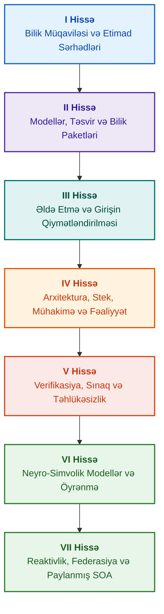

# Sübut əsaslı ekspert sistemlərinin arxitekturası: Formal ontologiyalardan neyro-simvolik süni intellektə qədər

**Yüksək etibarlılıqlı intellektual sistemlərin layihələndirilməsi, riyazi modelləri, arxitekturası və formal verifikasiyası üzrə mühəndislik monoqrafiyası və praktiki bələdçi (Safety-Critical & Evidence-Grounded AI)**

**Müəllif:** [Mykola Fedchyk (Микола Федчик)](../../about-the-author.md) · [LinkedIn](https://www.linkedin.com/in/nickfedchik/)  
**Format:** Mühəndislik monoqrafiyası / Sİ arxitektorunun masaüstü kitabı  
**İl:** 2026  

---

## Kitab haqqında

Bu kitab müasir süni intellektin əsas böhranını — neyron şəbəkə generasiyalarının ehtimali inandırıcılığı ilə formal riyazi sübutların deterministik həqiqəti arasındakı epistemik uçurumu aradan qaldırmağa həsr olunmuş fundamental monoqrafik tədqiqat və mühəndislik bələdçisidir. Tədqiqatın mərkəzində ciddi mühəndislik sualı dayanır: **hər bir nəticəsi təkzibolunmaz, ilkin sübut mənbələrinə qədər tam izlənilə bilən və təhlükəsizlik baxımından kritik mühəndislik domenlərində (ISO 26262, IEC 61508, DO-178C, ISO/SAE 21434) sertifikatlaşdırmaya yararlı ekspert sistemini necə layihələndirmək olar?**

Müəllif yeni bir paradiqmanı əsaslandırır və bərqərar edir: **Sübut Əsaslı Neyro-Simvolik Sİ (Evidence-Grounded Neuro-Symbolic AI)**. Bu arxitekturada statistik modellər (LLM/SLM) sorğu hipotezlərinin generasiyası və proyeksiyalı renderinq üzrə məsləhətçi funksiyanı yerinə yetirir; deterministik simvolik nüvə isə məntiqi ziddiyyətsizliyin, faktların bayt səviyyəsində əsaslandırılmasının, səlahiyyət hüdudlarına nəzarətin və fəaliyyətə təhlükəsiz keçidin invariantlarına sarsılmaz zəmanət verir.

### Mühəndislik artefaktından yoxlanıla bilən qərara qədər

Sistem tələbləri, mənbə kodu, sınaq protokolları, normativ standartlar və mühəndislik qərarları müasir istehsalat mühitlərində mövcuddur, lakin əsasən rəsmiləşdirilmiş semantika, sərt etibarlılıq sərhədləri və qarşılıqlı izlənilmə olmadan təcrid olunmuş artefaktlar kimi fəaliyyət göstərir. Uğurlu sınaq hesabatı köhnəlmiş aparat reviziyasına aid ola bilər; funksional təhlükəsizlik standartından sitat kontekstdən çıxarıla bilər; konfiqurasiyanın qəza zamanı geri qaytarılması isə geri çağırılmış komponenti ehtiyatsızlıqdan yenidən aktivləşdirə bilər.

Bu monoqrafiya tam mühəndislik xəttini təklif edir: mühəndislik artefaktlarının tipləşdirilmiş məlumatlar və kriptoqrafik imzalanmış bilik paketləri kimi rəsmiləşdirilməsindən — simvolik mühakiməyə, planların addım-addım dekompozisiyasına, kontrfaktik izahatlara və səlahiyyət sərhədlərinin auditinə qədər. Praktiki şərh Go dilində tam sınaq dəstləri ilə sənaye səviyyəli tətbiqlər ([Fəsil 1](../../ch01-introduction-to-expert-systems.md)), sərt riyazi müqavilələr ([II Hissə](../../part-02-knowledge-models.md)) və bilik reqressiyasının qarşısını alan davamlı öyrənmə protokolları ([Fəsil 25](../../ch25-how-expert-systems-learn.md)) ilə müşayiət olunur.

### Monoqrafiya kimlər üçün nəzərdə tutulub

Nəşr sistem arxitektorları, etibarlılıq və funksional təhlükəsizlik üzrə aparıcı mühəndislər, məntiqi mühakimə mühərriklərinin tərtibatçıları və bilik mühəndisləri üçün nəzərdə tutulub. Konsepsiyaları ilkin mənimsəmək üçün birinci dərəcəli predikatlar məntiqi, proqram təminatının versiyalaşdırılması və sistemlərin həyat dövrü haqqında əsas anlayışlar kifayətdir; praktiki nümunələri işə salmaq üçün standart Go alətləri tələb olunur. Goal Structuring Notation (GSN) təhlükəsizlik əsaslandırmalarının formal sintezinə, mürəkkəb sistemlərin sinergetikasına, neyromorfik sürətləndiricilərə və GNSS-siz avtonom naviqasiyaya həsr olunmuş ixtisaslaşdırılmış fəsillər yüksək texnologiyalı sahələrdə (aerokosmik, avtonom nəqliyyat, kritik energetika infrastrukturu) sübut əsaslı Sİ tətbiqinin ən qabaqcıl hüdudlarını nümayiş etdirir.

---

## Elmi kontekst və monoqrafiyanın qlobal tədqiqatlarda yeri

Monoqrafiya ekspert sistemlərini 1980-ci illərin qaydalara əsaslanan sistemlərinin (CLIPS və ya MYCIN kimi) arxaik qalığı kimi deyil, **Üçüncü Dalğa Sübut Əsaslı Neyro-Simvolik Sİ-nin (Third-Wave Evidence-Grounded Neuro-Symbolic AI)** ön cəbhəsi kimi nəzərdən keçirir. Əsər aparıcı dünya elmi məktəblərinin nəzəri təməllərinə söykənir, eyni zamanda mücərrəd riyazi modellər ilə yüksək məhsuldarlıqlı sistem mühəndisliyi arasındakı uçurumu aradan qaldırır:

| Elmi istiqamət | Qlobal əsas əsərlər və müəlliflər | Kitabdakı konseptual körpü |
|---|---|---|
| **Üçüncü dalğa neyro-simvolik Sİ (NeSy)** | Artur d'Avila Garcez, Luis C. Lamb (*Neurosymbolic AI: The 3rd Wave*, 2023; *Neural-Symbolic Cognitive Reasoning*, Springer, 2009); Henry Kautz (*The Third AI Summer*, AAAI 2022) | Öhdəliklərin bölünməsi: statistik modellər (SLM/LLM) sorğu hipotezlərini generasiya edir, deterministik simvolik nüvə isə faktları formal olaraq yoxlayır və təsdiqləyir ([Fəsil 29](../../ch29-neuro-symbolic-architecture.md)). |
| **Semantik məhdudiyyətlər və təhlükəsiz öyrənmə** | Guy Van den Broeck et al. (*A Semantic Loss Function for Deep Learning with Symbolic Knowledge*, ICML 2018); Luc De Raedt et al. (*DeepProbLog*, IJCAI 2020) | Giriş və çıxış nəzarət qapıları, neyron şəbəkə təkliflərinin formal sxemlərə uyğun deterministik semantik filtrasiyası ([Fəsillər 28](../../ch28-dual-mode-expert-systems.md), [33](../../ch33-inter-system-knowledge-exchange-and-model-teaching.md)). |
| **Təkzib edilə bilən mühakimə və arqumentasiya nəzəriyyəsi** | John L. Pollock (*Defeasible Reasoning*, 1987; *Cognitive Carpentry*, MIT Press, 1995); Phan Minh Dung (*Abstract Argumentation Frameworks*, AIJ 1995); Douglas Walton (*Argumentation Schemes*, Cambridge, 2008) | Biliklərin iddialara, mənşəyə və təkzibedici amillərə (*rebutting* və *undercutting defeaters*) ayrılması; normativ bazalardakı ziddiyyətlərin Dung arqumentasiya çərçivələri vasitəsilə həlli ([Fəsillər 2](../../ch02-epistemology-of-machine-knowledge.md), [27](../../ch27-safety-case-gsn-synthesis.md)). |
| **Assosiativ qaydaların avtonom mayninqi (KBC)** | Luis Galárraga, Fabian M. Suchanek et al. (*AMIE: Association Rule Mining under Incomplete Evidence*, WWW 2013, VLDBJ 2015); Stephen Muggleton (*Inductive Logic Programming*, 1994) | Qismən tamlıq fərziyyəsi (PCA) altında açıq dünyanın yalan əks-nümunələri olmadan bilik bazalarında qanunauyğunluqların avtomatik induksiyası ([Fəsil 34](../../ch34-deterministic-relational-analysis-abduction-and-socratic-dialogue.md)). |
| **Formal təhlükəsizlik qalxanları və sertifikatlaşdırma (Safe AI)** | Bettina Könighofer, Roderick Bloem et al. (*Shield Synthesis*, 2017); Tim Kelly, Rob Weaver (*Goal Structuring Notation*, York, 2004); André Platzer (*Logical Foundations of CPS*, Springer, 2018) | ISO 26262/21434 standartları üçün GSN notasiyasında təhlükəsizlik əsaslandırmalarının sintezi; periferik aktuatorlar üçün formal qalxanlar və ədədi etibarlılıq zərfləri ([Fəsillər 27](../../ch27-safety-case-gsn-synthesis.md), [30](../../ch30-safety-cybersecurity-co-engineering.md), [33](../../ch33-inter-system-knowledge-exchange-and-model-teaching.md)). |
| **Epistemik məntiq və bilik semiotikası** | John F. Sowa (*Knowledge Representation: Logical, Philosophical, and Computational Foundations*, 2000); Frank van Harmelen et al. (*Handbook of Knowledge Representation*, Elsevier, 2008) | Çarlz Sanders Pirsin epistemik triadası (Anlayış → Mühakimə → Nəticə); sərt deduktiv nəzarət altında işçi hipotezlərin abduktiv çıxarılması ([Fəsillər 6](../../ch06-applied-mathematics-for-expert-systems.md), [34](../../ch34-deterministic-relational-analysis-abduction-and-socratic-dialogue.md)). |
| **Kibertəhlükəsizlik və mürəkkəb sistemlərin sinergetikası** | Norbert Wiener (*Cybernetics*, 1948); W. Ross Ashby (*An Introduction to Cybernetics*, 1956); Hermann Haken (*Synergetics: An Introduction*, 1977; *Advanced Synergetics*, 1983); Ilya Prigogine (*Order out of Chaos*, 1984) | Eşbinin zəruri müxtəliflik qanunu, qapalı idarəetmə dövrələri L0–L4, Haken subordinasiya prinsipi ilə hal fəzasının nizam parametrlərinə gətirilməsi, kritik yavaşıma (CSD) vasitəsilə faza keçidlərinin proqnozlaşdırılması və bilik bazalarının dissipativ sabitləşdirilməsi ([Fəsillər 6](../../ch06-applied-mathematics-for-expert-systems.md), [22](../../ch22-cybernetics-edge-to-backend.md), [35](../../ch35-self-organizing-expert-systems-synergetics-and-npu-runtime.md)). |
| **Biliklərin sınaqdan keçirilməsi, linqvistik invariantlıq və Lipşits kalibrlənməsi** | Kent Beck (*TDD*, 2002); Martin Fowler (*Refactoring*, 2018); Clark Barrett, Leonardo de Moura (*Z3 SMT Solver*, 2008); Chuan Guo et al. (*On Calibration of Modern Neural Networks*, ICML 2017); Marco Tulio Ribeiro et al. (*CheckList*, ACL 2020); John L. Pollock (*Defeasible Reasoning*, 1987) | Dörd səviyyəli bilik sınaq piramidası (KTP): şərtlərin təcrid edilməsi ilə qaydaların modul sınağı (`PremiseMock`) (KUT), boş həqiqət tələsinin qarşısının alınması, 6 nöqtəli spektral BVA, qaydalar və təkzibedicilər şəbəkəsi (KIT), linqvistik variasiyalarda semantik invariantlıq metriki ($\text{SIS} \ge 0.98$), rele sıçrayışlarına qarşı Lipşits kəsilməzliyi ($L_{\mathcal{K}} \le L_{\max}$) və bilik boşluqlarının stiqmergik toplanması ([Fəsil 36](../../ch36-knowledge-testing-pyramid-and-variational-calibration.md)). |

---

## Müəllifin nəzəri modelləri, elmi tədqiqatları və mühəndislik innovasiyaları

Bu monoqrafiya müəllifin yüksək etibarlı sistemlərin, quraşdırılmış arxitekturaların və sübut əsaslı Sİ-nin layihələndirilməsi sahəsində fundamental tədqiqat nəticələrini və praktiki mühəndislik təcrübəsini cəmləşdirir. Yalnız icmal xarakterli işlərdən fərqli olaraq, kitabda neyro-simvolik qarşılıqlı əlaqəni riyazi olaraq yoxlanıla bilən etimad səviyyəsinə qaldıran bir sıra orijinal formal nəzəriyyələr, protokollar və sistem həlləri işlənib hazırlanmışdır:

### 1. Fundamental nəzəri işləmələr və riyazi formalizmlər

1. **Sübut Əsaslandırma İnvariantı (Evidence-Grounded Invariant, EGI) və Fakt Yoxlama Qapısı ([Fəsillər 2](../../ch02-epistemology-of-machine-knowledge.md), [19](../../ch19-from-question-to-evidence.md), [28](../../ch28-dual-mode-expert-systems.md), [29](../../ch29-neuro-symbolic-architecture.md)):**
   * *Nəzəri Konsepsiya:* Müəllif sübut əsaslı sistemdə ilkin bilik mənbələrinə deterministik proyeksiya olmadan heç bir iddianın fakt statusu ala bilməyəcəyini müəyyən edən $\mathrm{Comp}(C) = 1.00$ tamlıq invariantını formalaşdırmış və riyazi olaraq rəsmiləşdirmişdir. Faktlar bazasındakı hər bir element kriptoqrafik korteclə müşayiət olunur: dəyişməz bayt koordinatları `[byte_start, byte_end]`, kanonik fraqment heşi `quote_sha256` və PROV-O mənşə sertifikatının identifikatoru.
   * *Mühəndislik Əhəmiyyəti:* Bayt səviyyəsində yoxlama qapısı mexanizmi aparat və proqram səviyyəsində neyron şəbəkə hallüsinasiyalarının versiyalaşdırılmış bilik bazasına daxil olmasını tamamilə istisna edir, təsdiqlənməmiş məlumatlara qarşı sıfır dözümlülüyü təmin edir ($ZHR = 1.00$).
2. **Dörd Səviyyəli Bilik Sınaq Piramidası (KTP) və Mühakimə Fəzasının Lipşits Sabitliyi ([Fəsil 36](../../ch36-knowledge-testing-pyramid-and-variational-calibration.md)):**
   * *Nəzəri Konsepsiya:* Müəllif ilk dəfə Martin Faulerin proqram təminatının sınaq piramidasına bənzər sistemli Bilik Sınaq Piramidasını (KTP) təklif etmişdir: təcrid olunmuş qaydaların modul sınağı (`PremiseMock`) (KUT), qaydaların və təkzibedicilərin qarşılıqlı əlaqəsinin inteqrasiya sınağı (KIT) və çoxsaylı formulasiyalarda variasion kalibrləmə (KVT).
   * *Riyazi Aparat:* Boş həqiqət tələsini bloklayan sərt invariant ($P \equiv \text{False}$ olduqda $P \to Q$), linqvistik həyəcanlanmalarda semantik invariantlıq metriki ($\mathrm{SIS} \ge 0.98$) və girişin cüzi dalğalanmalarında nəticələrin fəlakətli rele sıçrayışlarını riyazi olaraq aradan qaldıran Lipşits kəsilməzliyi həddi ($L_{\mathcal{K}} \le L_{\max}$).
3. **Deontik Qaydaların Popper Falsifikasiya Nəzəriyyəsi və Aktiv Uyğunluq Auditi ([Fəsil 39](../../ch39-active-compliance-auditor-and-popperian-testing.md)):**
   * *Nəzəri Konsepsiya:* Yalnız suallara cavab verən klassik "passiv orakul" modelindən Karl Popperin falsifikasiya prinsipini həyata keçirən aktiv bilik auditoru paradiqmasına keçid. Sistem tələblər fəzasını (ASPICE 4.0, ISO 26262, ISO/SAE 21434) avtonom şəkildə araşdırır, əks-nümunələri sintez edir, natamam spesifikasiyaları müəyyənləşdirir və məhsulun hərtərəfli sınaq proqramını tərtib edir.
   * *Praktiki Dəyər:* Neyron şəbəkə tərəfindən sərhəd ssenarilərinin yaradıcı generasiyası (Sistem 1) ilə simvolik nüvə tərəfindən deterministik deontik yoxlamanın (Sistem 2) birləşməsi, bu zaman idarəetmə dövrəsindəki insanı (Human-in-the-Loop) təsdiqləmə yorğunluğundan qoruyur.
4. **Bilik Bazasının Ölçüsünün Sinergetik Reduksiyası və Bifurkasiyadan Əvvəl CSD Diaqnostikası ([Fəsillər 6](../../ch06-applied-mathematics-for-expert-systems.md), [22](../../ch22-cybernetics-edge-to-backend.md), [35](../../ch35-self-organizing-expert-systems-synergetics-and-npu-runtime.md)):**
   * *Nəzəri Konsepsiya:* Hermann Hakenin sinergetika riyazi aparatının (nizam parametrləri və subordinasiya prinsipi) və İlya Priqojinin dissipativ strukturlar nəzəriyyəsinin mürəkkəb bilik bazalarının təkamülünə tətbiqi.
   * *Elmi Nəticə:* Telemetriyanın çoxölçülü faza fəzasını nizam parametrlərinə gətirmək metodu işlənib hazırlanmış və avtokorrelyasiya ilə dispersiya əsasında Kritik Yavaşımanı (*Critical Slowing Down*, CSD) müəyyən edən detektor inteqrasiya edilmişdir ki, bu da sistemin dinamik çökməsini qəza sensorlarının işə düşməsindən xeyli əvvəl proqnozlaşdırmağa imkan verir.
5. **Fəaliyyət Muxtariyyəti Səviyyələri Modeli (A0–A4), İcazə Qapısı və İdempotent Saqalar ([Fəsil 21](../../ch21-from-recommendation-to-action.md)):**
   * *Nəzəri Konsepsiya:* "Fəaliyyət, mühit, risk səviyyəsi" korteçinə təyin edilən sistem fəaliyyət səlahiyyətlərinin diskret şkalası (A0: passiv təhlil, A1: layihənin hazırlanması, A2: insan imzası ilə fəaliyyət, A3: nəzarət edilən muxtariyyət, A4: mühafizə məqsədli təcili dayandırma).
   * *Riyazi Aparat:* Kriptoqrafik açar $k$ əsasında cəbri idempotentlik invariantı $f(f(x, k), k) \equiv f(x, k)$, addım-addım qapalı dövrəli icra və `OutcomeUnknown` vəziyyəti ilə post-şərtlərin müstəqil yoxlanılması olan paylanmış kompensasiya saqaları protokolu.
6. **GSN Notasiyasında Funksional Təhlükəsizlik və Kibertəhlükəsizliyin Formal Birgə Mühəndisliyi ([Fəsillər 27](../../ch27-safety-case-gsn-synthesis.md), [30](../../ch30-safety-cybersecurity-co-engineering.md)):**
   * *Nəzəri Konsepsiya:* ISO 26262 (funksional təhlükəsizlik) və ISO/SAE 21434 (kibertəhlükəsizlik) standartlarının tələblərini eyni vaxtda yerinə yetirən GSN (Goal Structuring Notation) arqumentasiya ağaclarının əlaqələndirilmiş sintezi modeli.
   * *Mühəndislik Nailiyyəti:* Ziddiyyətli hədəflər arasında riyazi arbitrajın rəsmiləşdirilməsi (qəza reaksiyası vaxt büdcəsi kriptoqrafik attestasiya dərinliyinə qarşı) və duzlu Merkle ağacları vasitəsilə kənar auditorlara sübutların selektiv açılması protokolu.
7. **İzahatların Sədaqəti və Semantik Ardıcıllığının Yoxlanılması Protokolu ([Fəsil 20](../../ch20-explanation-engine.md)):**
   * *Nəzəri Konsepsiya:* İzahat generativ modelin sərbəst mətni kimi deyil, sübut qrafından, qaydalar versiyasından və təsbit edilmiş faktlar kəsiyindən birmənalı çıxarılan müstəqil deterministik artefakt kimi qəbul edilir.
   * *Riyazi Aparat:* Simvolik nəticə ilə operator üçün şifahi ifadə arasında ən kiçik uyğunsuzluq zamanı sərt şablona avtomatik fail-safe geri çəkilməsi olan sədaqət qiymətləndirmə metrik qapısı ($C_{\text{facts}} = 1.00, H_{\text{free}} = 1.00$).

---

### 2. Empirik tədqiqatlar, müəllifin sınaq stendləri və sistem mühəndisliyi

1. **`mmap` və Sıfır Deserializasiyalı Dəyişməz Binar Bilik Paketləri ([Fəsil 32](../../ch32-high-performance-knowledge-packs-mmap-and-harvesting.md)):**
   * *Müəllif Yeniliyi:* Paketlərin ikiqat arxitekturası (ilkin mənbələrin kanonik təbəqəsi + indekslərin törəmə maddiləşdirilmiş təbəqəsi).
   * *Empirik Nəticə:* `mmap` sistem çağırışı vasitəsilə indeksin birbaşa virtual ünvan fəzasına inikası, dinamik yaddaş ayırmalarının aradan qaldırılması (zero-allocation) və ontologiyanın giqabayt həcmindən asılı olmayaraq mühərrikin subxətti vaxtda işə düşməsi.
2. **IETF RFC-1000 və W3C-150 Standart Korpuslarında Empirik Kalibrləmə Poliqonu ([Fəsillər 2](../../ch02-epistemology-of-machine-knowledge.md), [4](../../ch04-evolution-from-bayes-to-evidence-ai.md), [14](../../ch14-requirements-detection-and-formalization.md), [25](../../ch25-how-expert-systems-learn.md)):**
   * *Müəllif Təcrübəsi:* İnternetin inkişafının 5 tarixi dövrü üzrə bölünmüş 1000 etibarlı IETF RFC spesifikasiyası və W3C korpusunun 150 mürəkkəb diaqnostik sorğusu üzərində genişmiqyaslı tədqiqat stendinin qurulması (məntiqi ziddiyyətlər və konfabulyasiyaların süni induksiyası daxil olmaqla).
   * *Praktiki Nəticə:* Biliklərin yoxlanılması üçün obyektiv imtahan matrislərinin qurulması, normativ ziddiyyətlərin aşkar edilməsi və yeniləmələr zamanı bilik bazasının reqressiyasından riyazi sübut olunmuş müdafiə.
3. **Çoxgedişli Relyasion Təhlil, Simvolik Abduksiya və Sokrat Dialoqu ([Fəsil 34](../../ch34-deterministic-relational-analysis-abduction-and-socratic-dialogue.md)):**
   * *Müəllif İşləməsi:* Əlaqəli obyektlər üçün mürəkkəb bayt səviyyəli sübut zəncirlərinin formalaşdırılması və dövrlərdən mühafizəsi olan İkitərəfli Məhdud Genişlikdə Axtarış alqoritmi (Bidirectional Bounded BFS, $k \le 6$).
   * *Mühəndislik Üstünlüyü:* Sərt deduktiv nəzarət altında Pirsin simvolik abduksiyasının həyata keçirilməsi və qapalı dünya fərziyyəsi (CWA) altında kor-koranə imtina əvəzinə sistemi insanla səmərəli dialoq rejiminə keçirən tipləşdirilmiş Sokrat dəqiqləşdirmə freymləri (*Clarification Frames*).
4. **Periferik İdarəetmə Sistemləri Üçün Formal Qalxanlar və Ədədi Etibarlılıq Zərfləri ([Fəsil 33](../../ch33-inter-system-knowledge-exchange-and-model-teaching.md), [Əlavələr B](../../appendix-b-robotics-and-cyber-physical-systems.md), [C](../../appendix-c-autonomous-navigation-and-geosearch.md), [E](../../appendix-e-mixed-signal-neuromorphic-expert-systems.md)):**
   * *Müəllif Yeniliyi:* Rəqəmsal siqnal prosessorları (DSP) və GNSS-siz avtonom naviqasiya sistemləri (TRN/DSMAC/VIO) üçün diskret məntiqi invariantların kəsilməz ədədi təhlükəsizlik dəhlizlərinə çevrilməsi metodologiyası.
   * *İstismar Etibarlılığı:* Ed25519 kriptoqrafiyasına əsaslanan imzalanmış qaydalar mübadiləsi, yeni bilik namizədlərinin təhlükəsiz karantini və təhlükəli idarəetmə əmrlərinin aparat səviyyəsində kəsilməsi.
5. **İzahatlar və Diferensial Audit Vasitəsilə Məxfi İnformasiya Sızmasından Mühafizə ([Fəsil 20](../../ch20-explanation-engine.md)):**
   * *Müəllif İşləməsi:* Sübut qrafının hər bir qovşağı və tili üçün ACL yoxlaması olan izahatın aralıq təsvirinin ixtisarı protokolu ($\mathrm{EIR}_{\text{redacted}}$), bu da silsilə kontrastlı WHY NOT sorğuları vasitəsilə modellərin bərpası üzrə yan kanal hücumlarını bloklayır.

---

## Qruplaşdırma və təsnifat prinsipi

Kitabın hissələri fəslin yazılma ili və ya konkret texnologiyanın adı ilə deyil, əsas mühəndislik vəzifəsi ilə müəyyən edilir. Hər bir fəsil bir əsas hissəyə aiddir; qonşu metodlar onun əsas sualının necə həll ediləcəyini izah edir. Fəsil nömrələri və fayl adları sabit identifikatorlar kimi saxlanılır, buna görə tematik oxu ardıcıllığı rəqəmsal ardıcıllıqdan fərqlənə bilər.

Fəsillər daxilindəki alt bölmə başlıqları aydın sinifləri təşkil edir və onları ekvivalent texnologiyalar siyahısı kimi deyil, ardıcıl arqumentasiya zənciri kimi oxumaq lazımdır:

| Alt bölmə sinfi | Oxucunun sualı | Fəsildəki funksiyası |
|---|---|---|
| Problem və tapşırıq sərhədi | Dəqiq nəyi həll etmək lazımdır? | Əsas sualı və tətbiq sahəsini müəyyən etmək |
| Obyekt və model | Hansı məlumatlar, biliklər və ya vəziyyətlər araşdırılır? | Anlayışları, tipləri və fərziyyələri uzlaşdırmaq |
| Metod və prosedur | Nəticəni necə əldə etmək olar? | Mühakiməni, çevrilməni və ya idarəetməni izah etmək |
| Tətbiq və alət | Prosedur hansı alətlə icra olunur? | Metodun proqram və ya aparat təcəssümünü göstərmək |
| Yoxlama və nəzarət halı | Xətanı necə aşkar etmək olar? | Nəticəni müstəqil meyarlarla müqayisə etmək |
| Nəticə və hüdudlar | Nə sübut olundu və nə açıq qaldı? | Həddindən artıq vədlər vermədən əsas suala cavab vermək |

Ölkə, sənaye və ya kommersiya məhsulu bu taksonomiyanın müstəqil səviyyəsi deyil, tətbiq kontekstidir. Lüğət, ixtisarlar, mənbələr və naviqasiya fəslin müstəqil mövzuları deyil, köməkçi istinad aparatıdır.

Tam redaksiya struktur icmalı hər bir fəslin əsas mövzusunun qiymətləndirilməsini, qonşu müzakirələr arasındakı sərhədləri və struktur ilə nəticələrə dair qeydləri ehtiva edir. Yeni qeyd fəsillər daxilindəki bütün məzmun risklərinin artıq tamamilə aradan qaldırıldığı anlamına gəlmir.

---

## Tövsiyə olunan oxu marşrutları

**İlk proqram yoxlaması:** [1](../../ch01-introduction-to-expert-systems.md) → [7](../../ch07-knowledge-base-typology.md) → [8](../../ch08-engineering-artifacts-as-data.md) → [17](../../ch17-implementation-stack.md) → [23](../../ch23-knowledge-base-verification.md) → [25](../../ch25-how-expert-systems-learn.md). Hədəf: sübut əsasları, mənfi sınaqlar və idarə olunan bilik dəyişikliyi ilə təkrarlana bilən qərar. Dil modeli tələb olunmur.

**Bilik mühəndisliyi:** [II Hissə](../../part-02-knowledge-models.md) → [III Hissə](../../part-03-knowledge-engineering-nlp.md) → [19](../../ch19-from-question-to-evidence.md) → [20](../../ch20-explanation-engine.md) → [26](../../ch26-continual-learning.md). Hədəf: semantikanı, mənşəyi, biliklərin əldə edilməsini və yeni namizədlərin yoxlanılmasını uzlaşdırmaq. II Hissə 7–11-ci fəsillər üçün elmi sınaq proqramını qoruyur.

**Həll arxitekturası:** [16](../../ch16-expert-systems-architecture.md) → [19](../../ch19-from-question-to-evidence.md) → [31](../../ch31-syllogistic-reasoning-and-relation-lattices.md) → [20](../../ch20-explanation-engine.md) → [21](../../ch21-from-recommendation-to-action.md). Hədəf: sübutların yoxlanılmasını, normanın tətbiqini, izahatı və fəaliyyət səlahiyyətini sərt şəkildə ayırmaq.

**Verifikasiya və təhlükəsizlik:** [23](../../ch23-knowledge-base-verification.md) → [36](../../ch36-knowledge-testing-pyramid-and-variational-calibration.md) → [25](../../ch25-how-expert-systems-learn.md) → [26](../../ch26-continual-learning.md) → [27](../../ch27-safety-case-gsn-synthesis.md) → [30](../../ch30-safety-cybersecurity-co-engineering.md). Xarici obyektin diaqnostikası [24-cü fəsil](../../ch24-system-diagnosis.md) vasitəsilə xüsusi olaraq həyata keçirilir.

**Hibrid cavablar və istismar:** [VI Hissə](../../part-06-frontiers-neuro-symbolic.md) → [VII Hissə](../../part-07-runtime-and-knowledge-exchange.md) → [40](../../ch40-distributed-epistemic-architectures-soa-and-cluster-scaling.md) və zəruri əlavələr. Hədəf: dil modelini inteqrasiya etmək, bilik boşluqlarını idarə etmək, paylanmış bilik xidmətləri arxitekturasını qurmaq və sistemlərarası mübadiləni yoxlamaq. [2](../../ch02-epistemology-of-machine-knowledge.md), [4](../../ch04-evolution-from-bayes-to-evidence-ai.md) və [6-cı fəsilləri](../../ch06-applied-mathematics-for-expert-systems.md) ehtiyaca görə müqavilə, tarix və riyazi bələdçi kimi oxumaq olar.

---

## Mühəndislik vədlərinin sərhədləri

Bu kitab tədris və tədqiqat materialıdır, sertifikatlaşdırılmış prosedur və ya məhsulun standarta uyğunluğunun rəsmi sübutu deyil. Deterministik icra faktların düzgünlüyünü birbaşa sübut etmir; heş və rəqəmsal imza mütləq həqiqəti sübut etmir; arqumentlər qrafı isə insan mütəxəssisinin qiymətləndirməsini əvəz etmir. Bütün məhsulun etibarlılıq tələbləri dil modelinin xəta dərəcəsi ilə eyniləşdirilməməli və ya bütün proqram komponentlərinə aid edilməməlidir.

Avtomatlaşdırılmış təhlil əl ilə məlumat daxiletməsini azaldır, lakin domen modelləşdirməsini, ekspert rəyini və bilik sahiblərinin məsuliyyətini aradan qaldırmır. Protégé, əl ilə baxış və avtomatik toplama effektiv şəkildə birlikdə işləyə bilər. Riyazi zəmanətlər yalnız xüsusi dil profilinə və fərziyyələrə aiddir; ölçülmüş sürətlər konkret sınaqdan keçirilmiş sorğuya, korpusa və mühitə aiddir. Müəllifin arxiv məlumatları açıq tədris stendlərindən və hələ yerinə yetirilməmiş tədqiqatlardan sərt şəkildə ayrılmışdır.

Məhsulun buraxılışı, risklərin qəbul edilməsi və tənzimləyici tələblərə uyğunluq barədə qərarlar səlahiyyətli insan mütəxəssislərinin məsuliyyətində qalır. Ekspert sistemi yoxlanıla bilən material hazırlayır və razılaşdırılmış siyasəti icra edir, lakin öz-özlüyündə tənzimləyici və ya hüquqi səlahiyyət əldə etmir.

---

## Kitabın strukturu

Kitab yeddi tematik hissədən, 40 fəsildən və beş əlavədən ibarətdir. Hər bir fəsil bir əsas hissəyə aiddir. Naviqasiyada əvvəlki və sonrakı fəsillər aşağıdakı tematik ardıcıllığa uyğundur; fəsil nömrələri və fayl adları dəyişdirilmədən qorunub saxlanılmışdır.

---

### [I Hissə. Konseptual və epistemik əsaslar](../../part-01-foundations.md)

*Ekspert sistemi nə vaxt lazımdır, nəyi bilik hesab etmək olar və təşkilati qərarların əsaslarını necə qorumaq olar.*

* [Fəsil 1. Ekspert sistemlərinə giriş: Xaosdan idarə olunan biliklərə qədər](../../ch01-introduction-to-expert-systems.md)
* [Fəsil 2. Mühəndis üçün fəlsəfə: Maşının nəyi bilik adlandırmağa haqqı var](../../ch02-epistemology-of-machine-knowledge.md)
* [Fəsil 3. Ekspert sisteminin məlumat-sorğu sistemindən əsas fərqləri nələrdir](../../ch03-beyond-reference-information-systems.md)
* [Fəsil 4. Ekspert sistemlərinin təkamülü: Bayes teoremindən sübut əsaslı Sİ həllərinə qədər](../../ch04-evolution-from-bayes-to-evidence-ai.md)
* [Fəsil 5. Etimad triadası: Ekspert sistemi, sübut əsaslı tövsiyə və korporativ yaddaş](../../ch05-triad-of-trust-and-corporate-memory.md)

---

### [II Hissə. Riyazi modellər, biliklərin təsviri və saxlanması](../../part-02-knowledge-models.md)

*Riyazi əməliyyatların və təsvirlərin seçilməsi, tipləşdirilmiş artefaktlar, izlənmə qrafı və dəyişməz bilik paketi.*

* [Fəsil 6. Ekspert sistemləri üçün tətbiqi riyaziyyat: Qaydalar, ehtimallar, qraflar və səbəbiyyət](../../ch06-applied-mathematics-for-expert-systems.md)
* [Fəsil 7. Bilik bazalarının tipologiyası: Qaydalar, ontologiyalar, presedentlər və vektorlar](../../ch07-knowledge-base-typology.md)
* [Fəsil 8. Ekspert sisteminin məlumatları kimi mühəndislik artefaktları](../../ch08-engineering-artifacts-as-data.md)
* [Fəsil 9. Mühəndislik bilik qrafı: Tələblərdən aparata qədər izlənilmə](../../ch09-engineering-knowledge-graph-traceability.md)
* [Fəsil 32. Dəyişməz bilik paketləri: Bayt səviyyəsində icazə, indekslər və yaddaş xəritələnməsi](../../ch32-high-performance-knowledge-packs-mmap-and-harvesting.md)

---

### [III Hissə. Biliklərin əldə edilməsi, linqvistik təhlil və girişin qiymətləndirilməsi](../../part-03-knowledge-engineering-nlp.md)

*Sənədlər, mütəxəssislərin təcrübəsi və müşahidələr: namizədlərin çıxarılması, linqvistik təhlil, rəsmiləşdirmə və sübutların qiymətləndirilməsi.*

* [Fəsil 10. Bilik əldə etmə sistemləri: Mənbələr, qəbul və həyat dövrü](../../ch10-knowledge-acquisition-systems.md)
* [Fəsil 11. Ekspertlərdən biliklərin çıxarılması: Müsahibələr, koqnitiv xəritələr və təcrübənin rəsmiləşdirilməsi](../../ch11-knowledge-elicitation-from-experts.md)
* [Fəsil 12. Linqvistik təhlil və lokal modellər: Mənanın və mənbələrin qorunması](../../ch12-linguistic-analysis-and-local-models.md)
* [Fəsil 13. Təbii dil variativliyi determinizmə qarşı: Sorğu mənasının tərtibi](../../ch13-language-variability-vs-determinism.md)
* [Fəsil 14. Tələblərin və modallıqların aşkarlanması: Normativ mətndən invariantlara qədər](../../ch14-requirements-detection-and-formalization.md)
* [Fəsil 15. Biliklərin çıxarılması və bilik bazasının qurulması: Faktlar, qrammatikalar və avtomatlar](../../ch15-knowledge-extraction-and-kb-construction.md)
* [Fəsil 37. Giriş məlumatlarının qiymətləndirilməsi: Mənbələr, sübutlar və qeyri-müəyyənlik](../../ch37-input-information-assessment-and-algorithmic-skepticism.md)

---

### [IV Hissə. Arxitektura, texnoloji stek, mühakimə və fəaliyyət](../../part-04-architecture-and-inference.md)

*Arxitektura müqavilələri, texnoloji stek, aparat icrası, iddiaların yoxlanılması, normalara əsaslanan mühakimə, izahat və kibernetik idarəetmə dövrəsi.*

* [Fəsil 16. Ekspert sisteminin arxitekturası: Formal bilikdən sübut əsaslı qərara qədər](../../ch16-expert-systems-architecture.md)
* [Fəsil 17. Texnoloji stek: Alətlərin, proqramlaşdırma dillərinin və qaydalar mühərriklərinin seçilməsi meyarları](../../ch17-implementation-stack.md)
* [Fəsil 18. İcra infrastrukturu: Lokal modellər, aparat sürətləndiriciləri, Edge və On-Premise](../../ch18-execution-infrastructure.md)
* [Fəsil 19. Sualdan sübuta qədər: Axtarış, əsaslandırma və iddiaların yoxlanılması](../../ch19-from-question-to-evidence.md)
* [Fəsil 31. Normalara əsaslanan mühakimə: Predikatlar iyerarxiyası, istisnalar və etibarlılıq](../../ch31-syllogistic-reasoning-and-relation-lattices.md)
* [Fəsil 20. İzahat mühərriki: Qərar, imtina və səlahiyyət sərhədləri](../../ch20-explanation-engine.md)
* [Fəsil 21. Tövsiyədən fəaliyyətə qədər: İcazə nəzarəti və istehsalat mühitində təhlükəsiz icra](../../ch21-from-recommendation-to-action.md)
* [Fəsil 22. Kibernetik idarəetmə dövrəsi: Sensorlar, periferiya və əks-əlaqə](../../ch22-cybernetics-edge-to-backend.md)

---

### [V Hissə. Verifikasiya, sınaq, diaqnostika və təhlükəsizlik əsaslandırması](../../part-05-verification-and-learning.md)

*Qaydaların formal yoxlanılması, bilik sınaq piramidası, Popper falsifikasiyası, texniki diaqnostika və funksional təhlükəsizlik ilə kibertəhlükəsizlik arqumentləri.*

* [Fəsil 23. Bilik bazasının yoxlanılması: Qaydaların ziddiyyətsizliyini, tamlığını və etibarlılığını necə yoxlamaq olar](../../ch23-knowledge-base-verification.md)
* [Fəsil 36. Bilik sınaq piramidası: Qaydalar, qarşılıqlı əlaqələr və cavab sabitliyi](../../ch36-knowledge-testing-pyramid-and-variational-calibration.md)
* [Fəsil 39. Aktiv sınaq eksperti: Popper falsifikasiyası, normativ uyğunluq (ASPICE/ISO 26262/ISO 21434) və avtonom sınaq dizaynı](../../ch39-active-compliance-auditor-and-popperian-testing.md)
* [Fəsil 24. Texniki diaqnostika: Məlumat natamamlığı şəraitində simptomu ilkin səbəblə necə qarışdırmamaq olar](../../ch24-system-diagnosis.md)
* [Fəsil 27. Təhlükəsizlik əsaslandırması: Arqumentlərin sintezi və yoxlanılması](../../ch27-safety-case-gsn-synthesis.md)
* [Fəsil 30. Funksional təhlükəsizlik və kibertəhlükəsizliyin birgə layihələndirilməsi](../../ch30-safety-cybersecurity-co-engineering.md)

---

### [VI Hissə. Neyro-simvolik modellər, koqnitiv cəbhələr və davamlı öyrənmə](../../part-06-frontiers-neuro-symbolic.md)

*Sərt mühakimə və məsləhətçi hipotez, dil modelinin inteqrasiyası, bilik boşluqları, təsdiqlənməmiş cavabın nəzarəti, imtahan matrisləri və təcrübədən davamlı öyrənmə.*

* [Fəsil 28. İkirejimli ekspert sistemləri: Sərt mühakimə və məsləhətçi hipotez](../../ch28-dual-mode-expert-systems.md)
* [Fəsil 29. Neyro-simvolik arxitektura: Dil modelləri və sübut əsaslarının yoxlanılması](../../ch29-neuro-symbolic-architecture.md)
* [Fəsil 34. Bilik boşluqları: Relyasion axtarış, abduksiya və dəqiqləşdirmə dialoqu](../../ch34-deterministic-relational-analysis-abduction-and-socratic-dialogue.md)
* [Fəsil 38. Maşın hallüsinasiyaları və bilik çatışmazlığı: Sübut əsaslı cavab nəzarəti](../../ch38-curing-machine-hallucinations-and-knowledge-deficits.md)
* [Fəsil 25. Ekspert sistemini necə öyrətmək olar: İmtahan matrisləri, bilik auditi və reqressiya nəzarəti](../../ch25-how-expert-systems-learn.md)
* [Fəsil 26. Təcrübədən davamlı öyrənmə (Continual Learning) və sistem jurnalının sürüşməsinin qarşısının alınması](../../ch26-continual-learning.md)

---

### [VII Hissə. Reaktiv icra, sistemlərarası bilik mübadiləsi və paylanmış SOA](../../part-07-runtime-and-knowledge-exchange.md)

*Qaydaların reaktiv icrası, bilik sinergetikası və faza keçidləri, sistemlərarası mübadilə və müəssisə miqyasında paylanmış epistemik arxitektura.*

* [Fəsil 35. Reaktiv ekspert sistemi: Hadisələr, geri çağırma və biliklərin uyğunlaşdırılması](../../ch35-self-organizing-expert-systems-synergetics-and-npu-runtime.md)
* [Fəsil 33. Sistemlərarası bilik mübadiləsi: Xarici sistemlərə qaydaların verilməsi, modellərin təlimi və təhlükəsiz əks-əlaqə](../../ch33-inter-system-knowledge-exchange-and-model-teaching.md)
* [Fəsil 40. Sübut əsaslı ekspert sisteminin paylanmış arxitekturası: Epistemik SOA, semantik marşrutlaşdırma, yaddaş iyerarxiyası və çoxsaylı təchizatçılı defezitiv arbitraj](../../ch40-distributed-epistemic-architectures-soa-and-cluster-scaling.md)

---

### Əlavələr

* [Əlavə A. Mürəkkəb mühəndislik layihələrində sübut əsaslı tədqiqatın praktiki çərçivəsi](../../appendix-a-evidence-governed-framework.md)
* [Əlavə B. Avtonom robototexnika və kiberfiziki komplekslərdə sübut əsaslı ekspert sistemləri](../../appendix-b-robotics-and-cyber-physical-systems.md)
* [Əlavə C. GNSS-siz avtonom naviqasiya: Məkan uyğunlaşdırması (TRN/DSMAC), vizual odometriya (VIO) və sensor birləşməsinin ekspert arbitrajı](../../appendix-c-autonomous-navigation-and-geosearch.md)
* [Əlavə D. Analoq ekspert sistemləri, neyromorfik hesablamalar və aparat məntiqi mühakiməsi](../../appendix-d-analog-expert-systems-and-neuromorphic-computing.md)
* [Əlavə E. Qarışıq analoq-rəqəmsal ekspert sistemləri: Sübut nəzarəti altında neyromorfik, analoq və digər qeyri-ənənəvi hesablayıcılar](../../appendix-e-mixed-signal-neuromorphic-expert-systems.md)
* [Müəllif haqqında: Mykola Fedchyk (Nick Fedchik)](../../about-the-author.md)

---

## Gələcək tədqiqat istiqamətləri

Gələcək iş istiqamətləri hazır zəmanətlər deyil: Bilik paketlərinin təkrarlana bilən yığılması; məhdud formal təsvirin yoxlanılması; aşkar səlahiyyətlər vasitəsilə agentlərin idarə edilməsi; konkret rəsmiləşdirilmiş iddiaların məxfi yoxlanılması; nəzarət edilən ləğvetmə və maşının unutmasının (machine unlearning) tədqiqi. Model xüsusiyyətinin sübut edilməsi fiziki məhsulun uyğunluğunu avtomatik təsdiqləmir, qaydanın silinməsi isə təlim keçmiş modeldən məlumat təsirinin tamamilə aradan qaldırılması ilə eyni deyil.

Aparat sürətləndiriciləri və qeyri-ənənəvi hesablayıcılar üçün ilk növbədə xəta dərəcəsi, gecikmə, enerji istehlakı və nasazlıqlar zamanı davranış ciddi şəkildə ölçülür. Müvafiq məsələlər [Fəsil 29](../../ch29-neuro-symbolic-architecture.md), [Fəsil 32](../../ch32-high-performance-knowledge-packs-mmap-and-harvesting.md) və [Əlavələr D](../../appendix-d-analog-expert-systems-and-neuromorphic-computing.md) və [E-də](../../appendix-e-mixed-signal-neuromorphic-expert-systems.md) müzakirə olunur. 7–11-ci fəsillər üçün praktiki tədqiqat proqramı [II Hissədə](../../part-02-knowledge-models.md) təqdim edilmişdir: hər bir təklifin hipotezi, nəzarət müqayisəsi və falsifikasiya şərti vardır.
