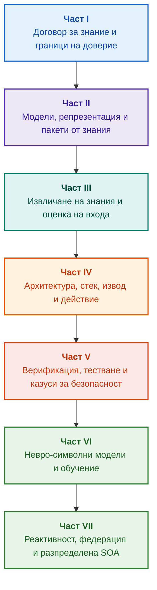

# Архитектура на експертни системи, управлявани от доказателства: От формалните онтологии до невро-символния ИИ

**Инженерна монография и справочник за проектиране, математически основи, архитектура и верификация на интелигентни системи с висока надеждност (Safety-Critical & Evidence-Grounded AI)**

**Автор:** [Микола Федчик](about-the-author.md) · [LinkedIn](https://www.linkedin.com/in/nickfedchik/)  
**Формат:** Инженерна монография / Настолен справочник на архитекта по ИИ  
**Година:** 2026  

---

## За книгата

Тази монография представлява фундаментално изследователско проучване и инженерно ръководство, посветено на преодоляването на първостепенната криза на съвременния изкуствен интелект: епистемичната пропаст между вероятностната достоверност на генерациите на невронните мрежи и детерминистичната истинност на формалните математически доказателства. В центъра на това изследване стои безкомпромисен въпрос: **как да проектираме експертна система, чието всяко заключение е необоримо, напълно проследимо до първични източници на доказателства и годно за сертифициране в критични за безопасността инженерни области (ISO 26262, IEC 61508, DO-178C, ISO/SAE 21434)?**

Авторът обосновава и въвежда нова парадигма: **Невро-символен ИИ, основан на доказателства (Evidence-Grounded Neuro-Symbolic AI)**, в който статистическите модели (LLM/SLM) изпълняват консултативна функция за генериране на хипотези и проекции, докато детерминистичното символно ядро неизменно гарантира инвариантите на логическата съгласуваност, байтовото заземяване на фактите, налагането на границите на правомощията и безопасния преход към изпълнение на действия.

### От артефакта до проверимото решение

Системните изисквания, изходният код, дневниците за изпълнение на тестове, регулаторните стандарти и инженерните решения днес пронизват съвременната производствена среда. Те обаче функционират предимно като несвързани артефакти, лишени от формализирана семантика, ясни граници на валидност и двупосочна проследимост. Доклад за успешно преминат квалификационен тест може да реферира към остаряла хардуерна ревизия; цитат от стандарт за функционална безопасност може да бъде изваден от контекста; автоматично аварийно връщане на конфигурация може неволно да активира отменен компонент.

Тази монография изгражда цялостен инженерен конвейер: от формализирането на инженерните артефакти като типизирани данни и криптографски подписани пакети от знания до символния логически извод, декомпозицията на планове стъпка по стъпка, контрафактичните обяснения и одита на границите на компетентност. Практическото изложение е подкрепено от готови за продукция реализации на езика Go с изчерпателни тестови пакети ([Глава 1](ch01-introduction-to-expert-systems.md)), строги математически договори ([Част II](part-02-knowledge-models.md)) и протоколи за непрекъснато обучение, които доказуемо елиминират регресиите ([Глава 25](ch25-how-expert-systems-learn.md)).

### Целева аудитория

Книгата е предназначена за системни архитекти, главни инженери по надеждност и функционална безопасност, разработчици на механизми за логически извод и инженери по знания. Първоначалното усвояване на основните концепции изисква единствено базови познания по предикатна логика от първи ред, версиониране на софтуер и управление на жизнения цикъл; възпроизвеждането на практическите примери използва стандартния инструментариум на Go. Специализираните глави, обхващащи синтеза на Goal Structuring Notation (GSN), синергетиката на сложни системи, невроморфните ускорители и автономната навигация в среда без GNSS, разглеждат авангардните граници на управлявания от доказателства ИИ в аерокосмическата индустрия, автономните превозни средства и критичната инфраструктура.

---

## Научен контекст и глобално позициониране на монографията

Монографията не разглежда експертните системи като архаично наследство от базираните на правила системи от 80-те години на миналия век (като CLIPS или MYCIN), а като авангард на **Третата вълна на невро-символния ИИ, основан на доказателства (Third-Wave Evidence-Grounded Neuro-Symbolic AI)**. Методологията свързва теоретичните основи на водещите световни научни школи с високоефективното системно инженерство:

| Научна дисциплина | Ключови световни трудове и автори | Концептуален мост в тази монография |
|---|---|---|
| **Невро-символен ИИ от трета вълна (NeSy)** | Artur d'Avila Garcez, Luis C. Lamb (*Neurosymbolic AI: The 3rd Wave*, 2023; *Neural-Symbolic Cognitive Reasoning*, Springer, 2009); Henry Kautz (*The Third AI Summer*, AAAI 2022) | Разделение на отговорностите: статистическите модели (SLM/LLM) генерират хипотези за заявки, докато детерминистично символно ядро формално верифицира и приема фактите ([Глава 29](ch29-neuro-symbolic-architecture.md)). |
| **Семантични ограничения и безопасно обучение** | Guy Van den Broeck et al. (*A Semantic Loss Function for Deep Learning with Symbolic Knowledge*, ICML 2018); Luc De Raedt et al. (*DeepProbLog*, IJCAI 2020) | Входни и изходни шлюзове, детерминистично семантично филтриране на кандидат-твърдения на невронни мрежи спрямо формални схеми ([Глави 28](ch28-dual-mode-expert-systems.md), [33](ch33-inter-system-knowledge-exchange-and-model-teaching.md)). |
| **Оборимо разсъждение и теория на аргументацията** | John L. Pollock (*Defeasible Reasoning*, 1987; *Cognitive Carpentry*, MIT Press, 1995); Phan Minh Dung (*Abstract Argumentation Frameworks*, AIJ 1995); Douglas Walton (*Argumentation Schemes*, Cambridge, 2008) | Декомпозиция на знанието на твърдения, произход и оборващи фактори (*defeaters*: *rebutting* и *undercutting*); разрешаване на конфликти в нормативни бази от правила чрез аргументационните рамки на Dung ([Глави 2](ch02-epistemology-of-machine-knowledge.md), [27](ch27-safety-case-gsn-synthesis.md)). |
| **Автоматизиран добив на асоциативни правила (KBC)** | Luis Galárraga, Fabian M. Suchanek et al. (*AMIE: Association Rule Mining under Incomplete Evidence*, WWW 2013, VLDBJ 2015); Stephen Muggleton (*Inductive Logic Programming*, 1994) | Автономна индукция на правила от бази от знания при Предположение за частична пълнота (PCA), избягваща фалшиви контрапримери в отворен свят ([Глава 34](ch34-deterministic-relational-analysis-abduction-and-socratic-dialogue.md)). |
| **Формални защитни щитове и сертификация (Safe AI)** | Bettina Könighofer, Roderick Bloem et al. (*Shield Synthesis*, 2017); Tim Kelly, Rob Weaver (*Goal Structuring Notation*, York, 2004); André Platzer (*Logical Foundations of CPS*, Springer, 2018) | Синтез на структурирани аргументи за безопасност в GSN нотация за стандартите ISO 26262/21434; формални щитове и числени пликове за валидност за периферни актуатори ([Глави 27](ch27-safety-case-gsn-synthesis.md), [30](ch30-safety-cybersecurity-co-engineering.md), [33](ch33-inter-system-knowledge-exchange-and-model-teaching.md)). |
| **Епистемична логика и семиотика на знанието** | John F. Sowa (*Knowledge Representation: Logical, Philosophical, and Computational Foundations*, 2000); Frank van Harmelen et al. (*Handbook of Knowledge Representation*, Elsevier, 2008) | Епистемичната триада на Чарлз Сандърс Пърс (Понятие → Съждение → Умозаключение); абдуктивно генериране на работни хипотези под строг дедуктивен контрол ([Глави 6](ch06-applied-mathematics-for-expert-systems.md), [34](ch34-deterministic-relational-analysis-abduction-and-socratic-dialogue.md)). |
| **Кибернетика и синергетика на сложни системи** | Norbert Wiener (*Cybernetics*, 1948); W. Ross Ashby (*An Introduction to Cybernetics*, 1956); Hermann Haken (*Synergetics: An Introduction*, 1977; *Advanced Synergetics*, 1983); Ilya Prigogine (*Order out of Chaos*, 1984) | Закон за необходимото разнообразие на Ашби, затворени контури на управление L0–L4, редукция на фазовото пространство до параметри на реда чрез принципа на подчинение на Хакен, ранно предупреждение за фазови преходи чрез критично забавяне (CSD) и дисипативна стабилизация на развиващи се бази от знания ([Глави 6](ch06-applied-mathematics-for-expert-systems.md), [22](ch22-cybernetics-edge-to-backend.md), [35](ch35-self-organizing-expert-systems-synergetics-and-npu-runtime.md)). |
| **Тестване на знания, инвариантност и Липшицова калибрация** | Kent Beck (*TDD*, 2002); Martin Fowler (*Refactoring*, 2018); Clark Barrett, Leonardo de Moura (*Z3 SMT Solver*, 2008); Chuan Guo et al. (*On Calibration of Modern Neural Networks*, ICML 2017); Marco Tulio Ribeiro et al. (*CheckList*, ACL 2020); John L. Pollock (*Defeasible Reasoning*, 1987) | Четиристепенна пирамида за тестване на знания (KTP): изолирано единично тестване на атомни правила (KUT) със симулирани предпоставки (`PremiseMock`), елиминиране на капана на вакуумната истинност, шестточков спектрален анализ на гранични стойности (BVA), решетки от правила и оборващи фактори (KIT), оценка за семантична инвариантност ($\text{SIS} \ge 0.98$) при езикови мутации на заявките, Липшицови граници на непрекъснатост ($L_{\mathcal{K}} \le L_{\max}$) за предотвратяване на релейни трептения и стигмергично улавяне на пропуски в знанието ([Глава 36](ch36-knowledge-testing-pyramid-and-variational-calibration.md)). |

---

## Авторски теоретични модели, научни изследвания и инженерни иновации

Тази монография синтезира фундаменталните изследвания и системно-инженерния принос на автора в областта на критичния софтуер, вградените архитектури и ИИ, управляван от доказателства. За разлика от чисто обзорната литература, книгата въвежда набор от оригинални формални теории, протоколи и архитектурни модели, които издигат невро-символните взаимодействия до математически проверено ниво на доверие:

### 1. Фундаментални теоретични разработки и математически формализми

1. **Инвариант за заземяване в доказателства (EGI) и шлюз за допускане на факти ([Глави 2](ch02-epistemology-of-machine-knowledge.md), [19](ch19-from-question-to-evidence.md), [28](ch28-dual-mode-expert-systems.md), [29](ch29-neuro-symbolic-architecture.md)):**
   * *Теоретична формула:* Авторът формализира Инварианта за пълнота на заземяването $\mathrm{Comp}(C) = 1.00$, установявайки, че в архитектура, управлявана от доказателства, нито едно твърдение не може да бъде издигнато в статус на признат факт без детерминистична проекция върху авторитетни първични източници. Всеки приет факт е закотвен с неизменни байтови отмествания `[byte_start, byte_end]`, каноничен криптографски хеш на фрагмента `quote_sha256` и идентификатор на сертификат за произход PROV-O.
   * *Инженерно въздействие:* Хардуерно-софтуерният пропускателен шлюз на ниво байтове прави халюцинациите на невронните мрежи неспособни да проникнат във версионираната база от знания, гарантирайки нулева толерантност към незаземени твърдения ($ZHR = 1.00$).
2. **Четиристепенна пирамида за тестване на знания (KTP) и Липшицова непрекъснатост на логическото пространство ([Глава 36](ch36-knowledge-testing-pyramid-and-variational-calibration.md)):**
   * *Теоретична формула:* Авторът въвежда Пирамидата за тестване на знания (KTP), пренасяйки дисциплината на тестовата пирамида на Фаулър в системите за знания: изолирано модулно тестване на правила (KUT) чрез симулирани условия на предпоставките (`PremiseMock`), интеграционно тестване на взаимодействията между правила и оборващи фактори (KIT) и вариационна калибрация върху многообразия от заявки (KVT).
   * *Математически апарат:* Формализиране на инвариант, предотвратяващ вакуумна истинност ($P \to Q$, където $P \equiv \text{False}$), Оценка за семантична инвариантност ($\mathrm{SIS} \ge 0.98$) при езикови смущения и Липшицово ограничение за непрекъснатост върху многообразието на извода ($L_{\mathcal{K}} \le L_{\max}$), което математически елиминира катастрофалните релейни трептения при малки вариации на входа.
3. **Попърианска фалсификация на деонтични норми и активен одит на съответствието ([Глава 39](ch39-active-compliance-auditor-and-popperian-testing.md)):**
   * *Теоретична формула:* Промяна на парадигмата от пасивен оракул (който просто отговаря на заявки) към активен одитор на съответствието, прилагащ принципа на фалсифицируемост на Карл Попър. Системата автономно сондира пространството на спецификациите (ASPICE 4.0, ISO 26262, ISO/SAE 21434), синтезира контрапримери, идентифицира недостатъчно специфицирани гранични условия и проектира изчерпателни верификационни кампании.
   * *Практическа стойност:* Свързване на невронното генериране на крайни случаи (Система 1) с детерминистичната деонтична проверка чрез символното ядро (Система 2), предпазвайки човека в контура на управление (Human-in-the-Loop) от умора при одобрение.
4. **Синергетична редукция на размерността на бази от знания и диагностика CSD преди бифуркация ([Глави 6](ch06-applied-mathematics-for-expert-systems.md), [22](ch22-cybernetics-edge-to-backend.md), [35](ch35-self-organizing-expert-systems-synergetics-and-npu-runtime.md)):**
   * *Теоретична формула:* Прилагане на синергетиката на Херман Хакен (параметри на реда и принцип на подчинение) и дисипативните структури на Иля Пригожин към еволюцията на сложни хранилища на знания.
   * *Научен принос:* Многомерните фазови пространства на телеметрията се редуцират до параметри на реда, интегрирайки детектор за критично забавяне (CSD) преди бифуркация, базиран на метрики за автокорелация и дисперсия. Това открива предстояща кибер-физическа нестабилност много преди да сработят конвенционалните прагови монитори.
5. **Модел на нива на автономност на действията (A0–A4), шлюзове за допускане и идемпотентни саги ([Глава 21](ch21-from-recommendation-to-action.md)):**
   * *Теоретична формула:* Гранулирана рамка за овластяване при автоматизирано изпълнение (A0: пасивен анализ, A1: генериране на проект, A2: изпълнение, подписано от човек, A3: контролирана ограничена автономност, A4: аварийно спиране fail-closed). Разрешенията не са обвързани със системата като монолит, а с триплета $\langle\text{действие}, \text{среда}, \text{ниво на риск}\rangle$.
   * *Математически апарат:* Алгебричен инвариант за идемпотентност $f(f(x, k), k) \equiv f(x, k)$ с криптографски токен $k$, поетапно изпълнение в затворен контур и разпределен протокол за компенсиращи саги, разрешаващ състояния `OutcomeUnknown` чрез извънлентова проверка на постусловията.
6. **Формално съвместно инженерство на функционалната безопасност и киберсигурността в GSN ([Глави 27](ch27-safety-case-gsn-synthesis.md), [30](ch30-safety-cybersecurity-co-engineering.md)):**
   * *Теоретична формула:* Единна методология за синтез в Goal Structuring Notation (GSN), хармонизираща едновременните ограничения на стандартите ISO 26262 (безопасност) и ISO/SAE 21434 (киберсигурност).
   * *Инженерен пробив:* Математически арбитраж между противоречиви цели (граници на латентност при авариен отговор спрямо дълбочина на криптографско удостоверяване), съчетан с протокол за селективно разкриване на доказателства пред външни одитори чрез осолени Merkle дървета.
7. **Протокол за вярност на обясненията и проверка на семантичната съгласуваност ([Глава 20](ch20-explanation-engine.md)):**
   * *Теоретична формула:* Обясненията не се третират като свободен генериран текст, а като първокласни детерминистични артефакти, получени строго от графа на доказателството, етикетите за версия на правилата и замразените моментни снимки на фактите.
   * *Математически апарат:* Формална метрична валидация на верността на обясненията ($C_{\text{facts}} = 1.00, H_{\text{free}} = 1.00$) с автоматично безопасно връщане към твърди шаблони при най-малкото несъответствие между символния извод и естествения език за оператора.

---

### 2. Емпирични изследвания, авторски експериментални стендове и системно инженерство

1. **Неизменими бинарни пакети от знания с `mmap` и десериализация с нулево заделяне на памет ([Глава 32](ch32-high-performance-knowledge-packs-mmap-and-harvesting.md)):**
   * *Авторска иновация:* Двустепенна архитектура на пакетите, отделяща каноничните архиви на първичните източници от производните материализирани индексни сегменти.
   * *Емпиричен резултат:* Директно картографиране в паметта чрез `mmap` във виртуалното адресно пространство елиминира заделянето на памет в хийпа по време на изпълнение (zero-allocation) и постига сублинейна латентност при стартиране на енджина, независимо от многогигабайтовия размер на онтологиите.
2. **Емпиричен калибрационен стенд върху регулаторните корпуси IETF RFC-1000 и W3C-150 ([Глави 2](ch02-epistemology-of-machine-knowledge.md), [4](ch04-evolution-from-bayes-to-evidence-ai.md), [14](ch14-requirements-detection-and-formalization.md), [25](ch25-how-expert-systems-learn.md)):**
   * *Авторски стенд:* Разгръщане на широкомащабна рамка за оценка върху 1000 активни спецификации на IETF RFC (обхващащи 5 хронологични епохи на интернет) и 150 сложни диагностични заявки към корпуса на W3C (включително индуцирани логически конфликти и конфабулации).
   * *Практическо заключение:* Изграждане на обективни матрици за изпитване на знанията, емпирично идентифициране на нормативни противоречия и математически валидирана защита срещу регресии на базата от знания при постоянни актуализации.
3. **Многостъпков релационен анализ, символна абдукция и сократов диалог ([Глава 34](ch34-deterministic-relational-analysis-abduction-and-socratic-dialogue.md)):**
   * *Авторска иновация:* Двупосочен ограничен алгоритъм за търсене в ширина (Bounded BFS, $k \le 6$) с потискане на цикли и синтез на съставна байтова верига от доказателства между произволни взаимосвързани същности.
   * *Инженерно предимство:* Реализиране на символната абдукция на Пърс под строги дедуктивни ограничения, комбинирано с типизирани Сократови рамки за изясняване (Clarification Frames), които водят системата към продуктивен диалог с потребителя вместо сляпо отхвърляне при Предположението за затворен свят (CWA).
4. **Формални защитни щитове и числени пликове за валидност за периферно управление ([Глава 33](ch33-inter-system-knowledge-exchange-and-model-teaching.md), [Приложения B](appendix-b-robotics-and-cyber-physical-systems.md), [C](appendix-c-autonomous-navigation-and-geosearch.md), [E](appendix-e-mixed-signal-neuromorphic-expert-systems.md)):**
   * *Авторска иновация:* Методология за транслиране на дискретни логически инварианти в непрекъснати числени коридори за безопасност за цифрови сигнални процесори (DSP) и навигация без GNSS (TRN/DSMAC/VIO).
   * *Оперативна надеждност:* Криптографски подписан обмен на правила чрез Ed25519, изолирана карантина на кандидат-правила и прехващане на невалидни траектории на актуаторите на хардуерно ниво.
5. **Защита срещу изтичане на поверителна информация чрез обяснения и диференциален одит ([Глава 20](ch20-explanation-engine.md)):**
   * *Авторска иновация:* Протокол за редукция на междинното представяне на обясненията ($\mathrm{EIR}_{\text{redacted}}$), налагащ списъци за контрол на достъпа (ACL) на всеки възел и ребро от графа на доказателството, неутрализиращ атаки по странични канали за реконструкция на модела чрез контрастни заявки ЗАЩО НЕ (WHY NOT).

---

## Принцип на структуриране

Частите на тази монография са структурирани около първостепенни инженерни цели, а не според хронологични дати на публикуване или преходни технологични наименования. Всяка глава принадлежи към една основна част; свързаните техники илюстрират методи за адресиране на нейната централна теза. Номерата на главите и идентификаторите на файловете остават постоянни ключове, което позволява тематичните последователности на четене да се различават от цифровия ред.

Класовете раздели вътре в главите изграждат логически свързана аргументация, вместо прост каталог от еквивалентни технологии:

| Клас раздел | Въпрос на читателя | Архитектурна функция в главата |
|---|---|---|
| Проблем и граници | Какво точно предизвикателство трябва да бъде решено? | Дефинира ядрото на изследването и обхвата на валидност |
| Обект и модел | Какви данни, знания или състояния се оценяват? | Формализира понятията, типовете и оперативните предпоставки |
| Метод и процедура | Как се извежда решението? | Описва подробно алгоритмите за дедукция, трансформация и контрол |
| Реализация и инструменти | Какъв софтуер или хардуер изпълнява процедурата? | Предоставя конкретни листинги на код и архитектурни договори |
| Верификация и бенчмарк | Как системно се разкриват режимите на отказ? | Измерва производителността и коректността спрямо независими критерии |
| Заключение и ограничения | Какво е доказано и какво остава открито? | Отговаря на централната теза без необосновани твърдения |

Географията, специфичните индустриални сектори и търговските платформи служат като контекст на приложение, а не като отделни нива в тази таксономия. Речниците, съкращенията, библиографиите и индексната навигация съставляват справочния апарат, а не самостоятелни теми на глави.

Пълният [редакционен преглед на структурата](editorial-structure-review.md) предоставя оценка на централната тема на всяка глава, границите между съседните теми и композиционни бележки. Актуализирането на анотацията не означава, че всички вътрешни композиционни рискове в главите са разрешени.

## Пътища за четене

**Първа софтуерна верификация:** [1](ch01-introduction-to-expert-systems.md) → [7](ch07-knowledge-base-typology.md) → [8](ch08-engineering-artifacts-as-data.md) → [17](ch17-implementation-stack.md) → [23](ch23-knowledge-base-verification.md) → [25](ch25-how-expert-systems-learn.md). Цел: Получаване на възпроизводима присъда, основана на доказателства, с отрицателни тестове и контролирана мутация на знанията. Езиковият модел е по избор.

**Инженерство на знанията:** [Част II](part-02-knowledge-models.md) → [Част III](part-03-knowledge-engineering-nlp.md) → [19](ch19-from-question-to-evidence.md) → [20](ch20-explanation-engine.md) → [26](ch26-continual-learning.md). Цел: Хармонизиране на формалната семантика, произхода, извличането на кандидати и валидацията. Част II запазва интердисциплинарната емпирична изследователска програма за Глави 7–11.

**Архитектура на решенията:** [16](ch16-expert-systems-architecture.md) → [19](ch19-from-question-to-evidence.md) → [31](ch31-syllogistic-reasoning-and-relation-lattices.md) → [20](ch20-explanation-engine.md) → [21](ch21-from-recommendation-to-action.md). Цел: Разделяне на проверката на доказателствата, прилагането на нормативни правила, генерирането на обяснения и оперативните правомощия за действие.

**Верификация и безопасност:** [23](ch23-knowledge-base-verification.md) → [36](ch36-knowledge-testing-pyramid-and-variational-calibration.md) → [25](ch25-how-expert-systems-learn.md) → [26](ch26-continual-learning.md) → [27](ch27-safety-case-gsn-synthesis.md) → [30](ch30-safety-cybersecurity-co-engineering.md). Външната физическа диагностика се разглежда в [Глава 24](ch24-system-diagnosis.md).

**Хибридни отговори и оперативно внедряване:** [Част VI](part-06-frontiers-neuro-symbolic.md) → [Част VII](part-07-runtime-and-knowledge-exchange.md) → [40](ch40-distributed-epistemic-architectures-soa-and-cluster-scaling.md) и съответните приложения. Цел: Интегриране на невронни езикови модели, управление на епистемичните пропуски, архитектура на разпределени клъстери от услуги за знания и верификация на междусистемни федерации. Глави [2](ch02-epistemology-of-machine-knowledge.md), [4](ch04-evolution-from-bayes-to-evidence-ai.md) и [6](ch06-applied-mathematics-for-expert-systems.md) могат да се използват при поискване като договори, историческа еволюция и математически основи.

---

## Обхват на претенциите и инженерни граници

Тази монография представлява фундаментален образователен и изследователски материал; тя не е сертифицирана процедура за съответствие, нито самостоятелно доказателство за съответствие на оборудването със стандартите. Детерминистичното изпълнение не гарантира фактическата точност на предпоставките; хешовете и цифровите подписи доказват интегритет, а не емпирична истина; графите на аргументите не заменят сертифицираната човешка преценка. Изискванията за надеждност на системно ниво не могат да се приравняват към процента на грешки в токените на езиковия модел, нито да се екстраполират универсално върху всички софтуерни модули.

Автоматизираният анализ и извличане намаляват ръчното пренасяне на данни, но не премахват необходимостта от формално моделиране, партньорска проверка (peer review) и определяне на отговорни попечители на знания (knowledge custodians). Онтологиите в Protégé, ръчните одити и автоматизираните събирачи работят в синхрон. Математическите гаранции са ограничени от експлицитни профили на формални езици и оперативни предпоставки; измерените показатели за производителност отразяват специфични натоварвания от заявки, корпуси и среди за изпълнение. Историческите метрики от предишни производствени внедрявания на автора са строго отделени от отворените образователни платформи и активните научни изследвания.

Окончателните решения относно пускането в експлоатация, приемането на риска и съответствието с нормативните изисквания принадлежат единствено на упълномощените инженери. Експертната система, управлявана от доказателства, подготвя проверими одитни следи и налага договорените политики за сигурност; тя не поема регулаторен суверенитет.

---

## Структура на книгата

Монографията е организирана в седем тематични части, включващи 40 глави и пет приложения. Всяка глава принадлежи към една основна част. Навигационните последователности следват тематичната пътна карта по-долу; номерата на главите и пътищата към файловете остават неизменни.

---

### [Част I. Концептуални и епистемични основи](part-01-foundations.md)

*Кога е необходима експертна система, какво съставлява машинното знание и как се запазва организационната обосновка.*

* [Глава 1. Въведение в експертните системи: От хаоса към управляваното знание](ch01-introduction-to-expert-systems.md)
* [Глава 2. Философия за системния инженер: Какво имат право машините да наричат знание](ch02-epistemology-of-machine-knowledge.md)
* [Глава 3. Разграничаване на експертните системи от справочните информационни системи](ch03-beyond-reference-information-systems.md)
* [Глава 4. Еволюция на експертните системи: От теоремата на Бейс до ИИ, основан на доказателства](ch04-evolution-from-bayes-to-evidence-ai.md)
* [Глава 5. Триадата на доверието: Експертна система, проверима препоръка и корпоративна памет](ch05-triad-of-trust-and-corporate-memory.md)

---

### [Част II. Математически модели, репрезентация и съхранение на знания](part-02-knowledge-models.md)

*Избор на математически формализми, типизирани артефакти, инженерни графи за проследимост и неизменими пакети от знания.*

* [Глава 6. Приложна математика за експертни системи: Правила, вероятности, графи и причинно-следствени връзки](ch06-applied-mathematics-for-expert-systems.md)
* [Глава 7. Типология на базите от знания: Правила, онтологии, прецеденти и векторни вграждания](ch07-knowledge-base-typology.md)
* [Глава 8. Инженерните артефакти като данни за експертната система](ch08-engineering-artifacts-as-data.md)
* [Глава 9. Инженерен граф на знанията: Цялостна проследимост от изискванията до силиция](ch09-engineering-knowledge-graph-traceability.md)
* [Глава 32. Неизменими пакети от знания: Байтово валидиране, индекси и картографиране в паметта](ch32-high-performance-knowledge-packs-mmap-and-harvesting.md)

---

### [Част III. Извличане на знания, лингвистичен анализ и оценка на входа](part-03-knowledge-engineering-nlp.md)

*Документи, човешки опит и сензорни наблюдения: извличане на кандидати, лингвистичен анализ, формализиране и оценка на доказателствата.*

* [Глава 10. Системи за придобиване на знания: Източници, шлюзове за допускане и жизнени цикли](ch10-knowledge-acquisition-systems.md)
* [Глава 11. Извличане на знания от експерти в областта: Интервюта, когнитивни карти и формализиране на практиката](ch11-knowledge-elicitation-from-experts.md)
* [Глава 12. Лингвистичен анализ и локални модели: Запазване на семантиката и атрибуция на източниците](ch12-linguistic-analysis-and-local-models.md)
* [Глава 13. Вариативност на естествения език срещу детерминизъм: Компилиране на семантиката на заявките](ch13-language-variability-vs-determinism.md)
* [Глава 14. Извличане на изисквания и модалности: От нормативен текст към формални инварианти](ch14-requirements-detection-and-formalization.md)
* [Глава 15. Извличане на знания и изграждане на база от знания: Факти, граматики и автомати](ch15-knowledge-extraction-and-kb-construction.md)
* [Глава 37. Оценка на входящата информация: Източници, доказателства и алгоритмичен скептицизъм](ch37-input-information-assessment-and-algorithmic-skepticism.md)

---

### [Част IV. Архитектура, технологичен стек, логически извод и действие](part-04-architecture-and-inference.md)

*Архитектурни договори, стек за изпълнение, хардуерно ускорение, проверка на твърдения, нормативен извод, машини за обяснения и кибернетични контури на управление.*

* [Глава 16. Архитектура на експертните системи: От формализираното знание към действие, управлявано от доказателства](ch16-expert-systems-architecture.md)
* [Глава 17. Технологичният стек: Избор на инструменти, програмни езици и машини за правила](ch17-implementation-stack.md)
* [Глава 18. Инфраструктура за изпълнение: Локални SLM, хардуерни ускорители, edge и on-premise](ch18-execution-infrastructure.md)
* [Глава 19. От въпроса към доказателството: Търсене, заземяване и проверка на твърдения](ch19-from-question-to-evidence.md)
* [Глава 31. Нормативен логически извод: Йерархии на предикатите, изключения и времева валидност](ch31-syllogistic-reasoning-and-relation-lattices.md)
* [Глава 20. Машина за обяснения: Решения, обоснован отказ и граници на компетентност](ch20-explanation-engine.md)
* [Глава 21. От препоръка към действие: Контрол на правомощията и безопасно изпълнение в продукция](ch21-from-recommendation-to-action.md)
* [Глава 22. Кибернетичният контур на управление: Сензори, актуатори и обратна връзка](ch22-cybernetics-edge-to-backend.md)

---

### [Част V. Верификация, тестване, диагностика и казуси за безопасност](part-05-verification-and-learning.md)

*Формална верификация на правила, пирамиди за тестване на знания, попърианска фалсификация, техническа диагностика и казуси за функционална/кибер безопасност.*

* [Глава 23. Верификация на базата от знания: Съгласуваност, пълнота и коректност на правилата](ch23-knowledge-base-verification.md)
* [Глава 36. Пирамидата за тестване на знания: Правила, взаимодействия и вариационна стабилност](ch36-knowledge-testing-pyramid-and-variational-calibration.md)
* [Глава 39. Активният одитор на съответствието: Попърианска фалсификация, съответствие със стандартите (ASPICE/ISO 26262/ISO 21434) и автономно генериране на тестове](ch39-active-compliance-auditor-and-popperian-testing.md)
* [Глава 24. Техническа диагностика: Разграничаване на симптомите от първопричините при непълна информация](ch24-system-diagnosis.md)
* [Глава 27. Инженерство на казуси за безопасност: Формален синтез и верификация на GSN аргументи](ch27-safety-case-gsn-synthesis.md)
* [Глава 30. Съвместно инженерство на функционалната безопасност и киберсигурността](ch30-safety-cybersecurity-co-engineering.md)

---

### [Част VI. Невро-символни модели, когнитивни граници и непрекъснато обучение](part-06-frontiers-neuro-symbolic.md)

*Строга дедукция срещу консултативни хипотези, интегриране на езикови модели, пропуски в знанията, елиминиране на халюцинации, изпитни матрици и обучение от опит.*

* [Глава 28. Двурежимни експертни системи: Строга дедукция и консултативни хипотези](ch28-dual-mode-expert-systems.md)
* [Глава 29. Невро-символна архитектура: Езикови модели и верификация, управлявана от доказателства](ch29-neuro-symbolic-architecture.md)
* [Глава 34. Пропуски в знанията: Релационно търсене, абдукция и сократовско изясняване](ch34-deterministic-relational-analysis-abduction-and-socratic-dialogue.md)
* [Глава 38. Лечение на машинни халюцинации и дефицити на знания: Контрол на изхода, закотвен в доказателства](ch38-curing-machine-hallucinations-and-knowledge-deficits.md)
* [Глава 25. Как се учат експертните системи: Изпитни матрици, одити на знанията и контрол на регресията](ch25-how-expert-systems-learn.md)
* [Глава 26. Непрекъснато обучение от опит и смекчаване на отклоненията в системните дневници](ch26-continual-learning.md)

---

### [Част VII. Реактивна среда за изпълнение, междусистемен обмен на знания и разпределена SOA](part-07-runtime-and-knowledge-exchange.md)

*Реактивно изпълнение на правила, синергетика и фазови преходи на знанията, междусистемна федерация и разпределени корпоративни епистемични архитектури.*

* [Глава 35. Реактивни експертни системи: Събития, отмяна на правила и самоорганизация на знанието](ch35-self-organizing-expert-systems-synergetics-and-npu-runtime.md)
* [Глава 33. Междусистемен обмен на знания: Разпространение на правила, обучение на модели и сигурна обратна връзка](ch33-inter-system-knowledge-exchange-and-model-teaching.md)
* [Глава 40. Разпределена епистемична архитектура: SOA за знания, семантично маршрутизиране, йерархии на паметта и многоизточен оборим арбитраж](ch40-distributed-epistemic-architectures-soa-and-cluster-scaling.md)

---

### Приложения

* [Приложение A. Практическа изследователска рамка, управлявана от доказателства, за комплексни инженерни проекти](appendix-a-evidence-governed-framework.md)
* [Приложение B. Експертни системи, управлявани от доказателства, в автономната роботика и кибер-физическите системи](appendix-b-robotics-and-cyber-physical-systems.md)
* [Приложение C. Автономна навигация в среда без GNSS: Геопространствено съпоставяне (TRN/DSMAC), визуално-инерциална одометрия (VIO) и експертен арбитраж на сензорно сливане](appendix-c-autonomous-navigation-and-geosearch.md)
* [Приложение D. Аналогови експертни системи, невроморфни изчисления и хардуерен логически извод](appendix-d-analog-expert-systems-and-neuromorphic-computing.md)
* [Приложение E. Смесени аналогово-цифрови експертни системи: Невроморфни, аналогови и не-фон-Нойманови процесори под управлението на доказателства](appendix-e-mixed-signal-neuromorphic-expert-systems.md)
* [За автора: Микола Федчик (Nick Fedchik)](about-the-author.md)

---

## Направления на научните изследвания

Бъдещите изследователски направления, формулирани в този труд, представляват открити инженерни предизвикателства, а не гарантирани готови търговски резултати: възпроизводимо пакетиране на пакети от знания с нулево заделяне на памет; верификация на ограничени формални фрагменти; управление на агенти чрез експлицитни лизинги на права (authority leases); проверка с нулево знание (zero-knowledge) на поверителни формални твърдения; и контролирано оттегляне на правила и машинно отучаване на модели (machine unlearning). Доказването на теоретично свойство върху модел не потвърждава автоматично безопасността на физическата система, а оттеглянето на правило не е еквивалентно на премахването на влиянието на данните от обучен невронен модел.

За хардуерните ускорители и неконвенционалните процесори емпиричните нива на грешки, границите на латентност, разсейването на енергия и поведението при безотказен отказ (fail-silent) трябва да бъдат строго охарактеризирани преди внедряване. Съответните архитектурни стратегии са разгледани в [Глава 29](ch29-neuro-symbolic-architecture.md), [Глава 32](ch32-high-performance-knowledge-packs-mmap-and-harvesting.md) и [Приложения D](appendix-d-analog-expert-systems-and-neuromorphic-computing.md) и [E](appendix-e-mixed-signal-neuromorphic-expert-systems.md). Планът за емпирични изследвания за глави 7–11 е подробно описан в [Част II](part-02-knowledge-models.md): всяко предложено изследване е съчетано с проверима хипотеза, базов бенчмарк и формален критерий за фалсификация.
